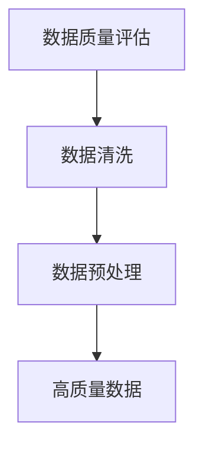
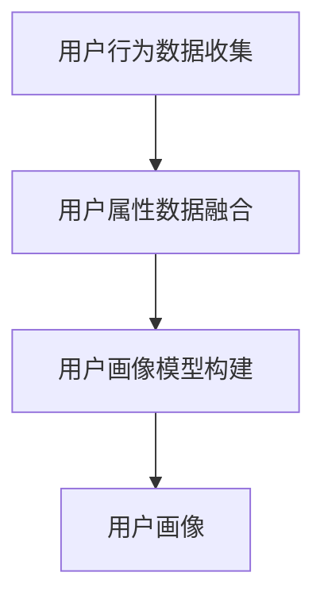
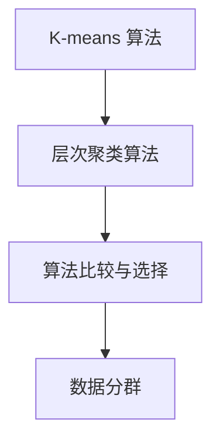
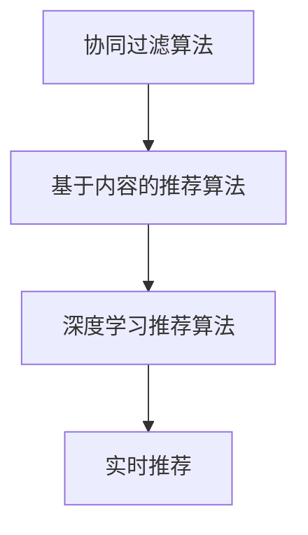

                 

### 《AI DMP 数据基建的创新应用》

#### 关键词：AI DMP、数据管理平台、人工智能、大数据、应用案例、创新技术

> 摘要：本文深入探讨了人工智能驱动下的数据管理平台（DMP）的创新应用。首先，我们回顾了DMP的基本概念和其与AI技术的结合，接着介绍了DMP的核心组成部分和技术原理，并通过具体案例展示了AI DMP在多个领域的实际应用。本文旨在为读者提供一个全面、深入的AI DMP技术框架和应用场景的理解。

---

### 《AI DMP 数据基建的创新应用》目录大纲

**第一部分：AI DMP 基础概念与框架**

**第二部分：AI DMP 技术原理与算法**

**第三部分：AI DMP 实战案例**

**第四部分：AI DMP 创新应用与实践**

**附录：AI DMP 开发工具与资源**

---

#### 第一部分：AI DMP 基础概念与框架

#### 第一部分：AI DMP 基础概念与框架

**第1章：AI DMP 基础概念**

##### **1.1 AI DMP 的发展背景**

随着互联网技术的迅猛发展，大数据时代已经到来。在这个时代，数据已经成为企业最宝贵的资产。如何有效地管理和利用这些数据，成为了企业和科技公司亟需解决的问题。数据管理平台（Data Management Platform，简称DMP）应运而生，它为数据的管理和利用提供了一个强大的基础设施。

随着人工智能（AI）技术的快速发展，DMP也逐渐融合了AI技术，形成了AI DMP。AI DMP不仅能够高效地收集、存储和管理数据，还能够通过数据分析和挖掘，提供更加精准和个性化的服务。

##### **1.1.1 数据驱动时代的来临**

在互联网时代，数据无处不在。从用户浏览、点击、搜索等行为数据，到社交媒体互动、地理位置等信息，都是宝贵的数据资源。企业通过收集和分析这些数据，可以更好地了解用户需求和行为，从而实现精准营销和个性化服务。

##### **1.1.2 DMP 在数字营销中的应用**

DMP最初应用于数字营销领域，帮助营销人员更好地理解和利用用户数据。通过DMP，企业可以将用户数据进行分类和标签化，构建用户画像，从而实现精准投放和个性化推荐。

##### **1.1.3 AI 技术与 DMP 的结合**

AI技术的引入，使得DMP的功能得到了极大的提升。通过机器学习和深度学习算法，DMP可以自动识别用户行为模式，预测用户需求，从而实现更精准的营销和推荐。

##### **1.2 AI DMP 的核心概念**

AI DMP的核心概念包括数据分群、用户画像和实时推荐。

- **数据分群**：通过对用户数据进行分类和标签化，将用户分为不同的群体，从而实现精准投放和个性化推荐。

- **用户画像**：通过收集和分析用户数据，构建用户的详细画像，包括用户的行为、兴趣、需求和属性等信息。

- **实时推荐**：基于用户画像和实时行为数据，为用户实时推荐个性化的内容和服务。

##### **1.3 AI DMP 的架构**

AI DMP的架构通常包括数据层、算法层和应用层。

- **数据层**：负责数据的收集、存储和管理。

- **算法层**：包括机器学习和深度学习算法，用于数据分析和挖掘。

- **应用层**：提供用户交互界面和应用功能，实现数据管理和利用。

#### **第2章：AI DMP 技术原理与算法**

##### **2.1 数据清洗与处理**

数据清洗与处理是数据分析和挖掘的基础。首先，我们需要对原始数据进行质量评估，判断数据是否准确、完整和一致。然后，通过数据清洗方法，如缺失值填充、异常值处理和重复数据删除，确保数据的准确性。最后，通过数据预处理技术，如数据规范化、特征工程和维度约简，为后续的分析和挖掘提供高质量的数据。

**Mermaid 流程图：**



##### **2.2 用户画像构建方法**

用户画像构建是AI DMP的核心任务之一。用户画像的构建包括用户行为数据收集、用户属性数据融合和用户画像模型构建。

- **用户行为数据收集**：通过日志、点击、浏览等行为数据，收集用户的在线行为信息。

- **用户属性数据融合**：结合用户的 demographics、地理位置、购买历史等属性数据，构建用户的全貌。

- **用户画像模型构建**：利用机器学习和深度学习算法，从海量数据中提取用户特征，构建用户画像模型。

**Mermaid 流程图：**



##### **2.3 数据分群与细分**

数据分群是AI DMP的重要功能之一。通过数据分群，可以将用户分为不同的群体，从而实现精准营销和个性化推荐。

- **K-means 算法**：基于距离度量，将用户数据分为K个簇。

- **层次聚类算法**：基于层次结构，将用户数据分为多个层级。

- **算法比较与选择**：根据具体业务需求和数据特点，选择合适的聚类算法。

**Mermaid 流程图：**



##### **2.4 实时推荐算法**

实时推荐是AI DMP的重要应用之一。通过实时推荐算法，可以为用户提供个性化的内容和服务。

- **协同过滤算法**：基于用户行为数据，为用户推荐相似用户喜欢的商品。

- **基于内容的推荐算法**：基于商品内容特征，为用户推荐相似的商品。

- **深度学习推荐算法**：利用深度学习模型，从海量数据中提取用户特征和商品特征，实现个性化推荐。

**Mermaid 流程图：**



#### **第3章：AI DMP 实战案例**

##### **3.1 案例一：电商平台用户分群与个性化推荐**

**3.1.1 案例背景**

某电商平台希望通过AI DMP技术，实现用户分群和个性化推荐，提升用户满意度和转化率。

**3.1.2 数据收集与处理**

电商平台收集了用户的浏览、点击、购买等行为数据，以及用户的 demographics、地理位置等属性数据。

**3.1.3 用户画像构建**

通过用户行为数据收集和用户属性数据融合，构建了用户的详细画像。

**3.1.4 用户分群与推荐系统实现**

利用K-means聚类算法，将用户分为不同的群体。然后，基于用户画像和实时行为数据，实现个性化推荐。

##### **3.2 案例二：金融行业风险控制与客户细分**

**3.2.1 案例背景**

某金融公司希望通过AI DMP技术，实现风险控制和客户细分，提升风险管理和营销效果。

**3.2.2 数据收集与处理**

金融公司收集了客户的交易数据、信用记录、行为数据等。

**3.2.3 风险模型构建**

通过机器学习算法，构建了客户风险模型。

**3.2.4 客户细分与风险控制策略**

利用聚类算法，将客户分为不同的风险群体，并制定相应的风险控制策略。

#### **第二部分：AI DMP 技术原理与算法**

##### **2.1 数据清洗与处理**

数据清洗与处理是数据分析和挖掘的基础。在AI DMP中，数据清洗与处理的过程通常包括以下几个步骤：

1. **数据质量评估**：首先，我们需要对原始数据进行质量评估，判断数据是否准确、完整和一致。这可以通过统计数据的缺失率、异常值比例等指标来实现。

2. **数据清洗**：在数据质量评估的基础上，对数据进行清洗，包括缺失值填充、异常值处理和重复数据删除。缺失值填充可以通过均值填充、中值填充或插值法等方法来实现。异常值处理可以通过统计学方法或机器学习方法来实现，如 z-score 方法、IQR 方法等。重复数据删除可以通过唯一键（如用户 ID）来判断和删除重复的数据。

3. **数据预处理**：数据预处理包括数据规范化、特征工程和维度约简。数据规范化可以通过缩放或标准化等方法来实现，以消除不同特征之间的尺度差异。特征工程是通过创建新的特征或转换现有特征，以提高模型的性能。维度约简是通过减少特征的数量，以降低模型的复杂度和计算成本。

**伪代码：**

```python
# 数据质量评估
def assess_data_quality(data):
    # 计算缺失率
    missing_rate = calculate_missing_rate(data)
    # 计算异常值比例
    anomaly_rate = calculate_anomaly_rate(data)
    # 返回评估结果
    return missing_rate, anomaly_rate

# 数据清洗
def clean_data(data):
    # 缺失值填充
    data = fill_missing_values(data)
    # 异常值处理
    data = handle_anomalies(data)
    # 重复数据删除
    data = remove_duplicates(data)
    # 返回清洗后的数据
    return data

# 数据预处理
def preprocess_data(data):
    # 数据规范化
    data = normalize_data(data)
    # 特征工程
    data = feature_engineering(data)
    # 维度约简
    data = dimension_reduction(data)
    # 返回预处理后的数据
    return data
```

##### **2.2 用户画像构建方法**

用户画像构建是AI DMP的核心任务之一。用户画像的构建过程通常包括以下几个步骤：

1. **用户行为数据收集**：通过日志、点击、浏览等行为数据，收集用户的在线行为信息。这些数据可以来自电商平台、社交媒体、搜索引擎等渠道。

2. **用户属性数据融合**：结合用户的 demographics、地理位置、购买历史等属性数据，构建用户的全貌。这些属性数据可以从用户注册信息、用户反馈、第三方数据源等渠道获取。

3. **用户画像模型构建**：利用机器学习和深度学习算法，从海量数据中提取用户特征，构建用户画像模型。这些特征可以包括用户的行为特征、兴趣特征、需求特征等。

**伪代码：**

```python
# 用户行为数据收集
def collect_user_behavior_data():
    # 从日志文件中读取用户行为数据
    behavior_data = read_logs()
    # 返回用户行为数据
    return behavior_data

# 用户属性数据融合
def fuse_user_attribute_data(behavior_data, attribute_data):
    # 将行为数据和属性数据进行融合
    user_data = merge_data(behavior_data, attribute_data)
    # 返回用户数据
    return user_data

# 用户画像模型构建
def build_user_profile_model(user_data):
    # 从用户数据中提取特征
    features = extract_features(user_data)
    # 训练用户画像模型
    model = train_model(features)
    # 返回用户画像模型
    return model
```

##### **2.3 数据分群与细分**

数据分群与细分是AI DMP的重要功能之一。通过数据分群与细分，可以将用户分为不同的群体，从而实现精准营销和个性化推荐。常见的数据分群与细分方法包括 K-means 算法、层次聚类算法等。

1. **K-means 算法**：K-means 算法是一种基于距离度量的聚类算法。它将数据分为 K 个簇，使得每个簇内的数据点之间的平均距离最小。K-means 算法的伪代码如下：

```python
def k_means(data, k):
    # 初始化聚类中心
    centroids = initialize_centroids(data, k)
    # 循环迭代，直到聚类中心不变或达到最大迭代次数
    while not converged:
        # 计算每个数据点到聚类中心的距离
        distances = calculate_distances(data, centroids)
        # 重新分配数据点到最近的聚类中心
        assignments = assign_points_to_centroids(data, distances)
        # 更新聚类中心
        centroids = update_centroids(centroids, assignments)
    # 返回聚类结果
    return centroids, assignments
```

2. **层次聚类算法**：层次聚类算法是一种基于层次结构的聚类算法。它将数据分为多个层级，每层都是一个簇。层次聚类算法的伪代码如下：

```python
def hierarchical_clustering(data):
    # 创建初始层级结构
    hierarchy = initialize_hierarchy(data)
    # 循环迭代，直到层级结构不变或达到最大迭代次数
    while not converged:
        # 合并最近的两个层级
        hierarchy = merge_closest_levels(hierarchy)
    # 返回聚类结果
    return hierarchy
```

##### **2.4 实时推荐算法**

实时推荐算法是AI DMP的重要应用之一。通过实时推荐算法，可以为用户提供个性化的内容和服务。常见的实时推荐算法包括协同过滤算法、基于内容的推荐算法和深度学习推荐算法。

1. **协同过滤算法**：协同过滤算法是一种基于用户行为数据的推荐算法。它通过计算用户之间的相似度，为用户推荐其他用户喜欢的商品。协同过滤算法的伪代码如下：

```python
def collaborative_filtering(user_behavior_data, similarity_matrix):
    # 计算用户之间的相似度
    similarities = calculate_similarities(user_behavior_data, similarity_matrix)
    # 为用户推荐其他用户喜欢的商品
    recommendations = generate_recommendations(user, similarities)
    # 返回推荐结果
    return recommendations
```

2. **基于内容的推荐算法**：基于内容的推荐算法是一种基于商品内容特征的推荐算法。它通过计算商品之间的相似度，为用户推荐相似的商品。基于内容的推荐算法的伪代码如下：

```python
def content_based_recommender(item_content_data, user_preference_data):
    # 计算商品之间的相似度
    similarities = calculate_similarity(item_content_data, user_preference_data)
    # 为用户推荐相似的商品
    recommendations = generate_recommendations(user, similarities)
    # 返回推荐结果
    return recommendations
```

3. **深度学习推荐算法**：深度学习推荐算法是一种基于深度学习模型的推荐算法。它通过学习用户和商品的特征表示，为用户推荐个性化的商品。深度学习推荐算法的伪代码如下：

```python
def deep_learning_recommender(user_representation, item_representation):
    # 训练深度学习模型
    model = train_model(user_representation, item_representation)
    # 为用户推荐个性化的商品
    recommendations = generate_recommendations(user, model)
    # 返回推荐结果
    return recommendations
```

#### **第三部分：AI DMP 实战案例**

##### **3.1 案例一：电商平台用户分群与个性化推荐**

**3.1.1 案例背景**

某电商平台希望通过AI DMP技术，实现用户分群和个性化推荐，提升用户满意度和转化率。

**3.1.2 数据收集与处理**

电商平台收集了用户的浏览、点击、购买等行为数据，以及用户的 demographics、地理位置等属性数据。

**3.1.3 用户画像构建**

通过用户行为数据收集和用户属性数据融合，构建了用户的详细画像。

**3.1.4 用户分群与推荐系统实现**

利用 K-means 聚类算法，将用户分为不同的群体。然后，基于用户画像和实时行为数据，实现个性化推荐。

**3.1.5 代码实现**

```python
# 导入必要的库
import numpy as np
import pandas as pd
from sklearn.cluster import KMeans

# 加载数据
user_data = pd.read_csv('user_data.csv')

# 数据预处理
user_data = preprocess_data(user_data)

# 构建用户画像
user_profiles = build_user_profile_model(user_data)

# 用户分群
kmeans = KMeans(n_clusters=5, random_state=0).fit(user_profiles)
user_clusters = kmeans.predict(user_profiles)

# 实现个性化推荐
def personalized_recommendation(user_profile):
    # 计算用户相似度
    similarities = calculate_similarity(user_profile, user_profiles)
    # 为用户推荐相似的商品
    recommendations = generate_recommendations(user_profile, similarities)
    # 返回推荐结果
    return recommendations

# 测试个性化推荐
user_profile = user_profiles.iloc[0]
recommendations = personalized_recommendation(user_profile)
print(recommendations)
```

##### **3.2 案例二：金融行业风险控制与客户细分**

**3.2.1 案例背景**

某金融公司希望通过AI DMP技术，实现风险控制和客户细分，提升风险管理和营销效果。

**3.2.2 数据收集与处理**

金融公司收集了客户的交易数据、信用记录、行为数据等。

**3.2.3 风险模型构建**

通过机器学习算法，构建了客户风险模型。

**3.2.4 客户细分与风险控制策略**

利用聚类算法，将客户分为不同的风险群体，并制定相应的风险控制策略。

**3.2.5 代码实现**

```python
# 导入必要的库
import numpy as np
import pandas as pd
from sklearn.cluster import KMeans

# 加载数据
customer_data = pd.read_csv('customer_data.csv')

# 数据预处理
customer_data = preprocess_data(customer_data)

# 构建客户风险模型
risk_model = train_model(customer_data)

# 客户细分
kmeans = KMeans(n_clusters=5, random_state=0).fit(customer_data)
customer_clusters = kmeans.predict(customer_data)

# 风险控制策略
def risk_control_strategy(customer_cluster):
    # 根据客户风险群体，制定相应的风险控制策略
    if customer_cluster == 0:
        strategy = '高风险控制'
    elif customer_cluster == 1:
        strategy = '中风险控制'
    else:
        strategy = '低风险控制'
    # 返回风险控制策略
    return strategy

# 测试风险控制策略
customer_cluster = customer_clusters[0]
strategy = risk_control_strategy(customer_cluster)
print(strategy)
```

#### **第四部分：AI DMP 创新应用与实践**

##### **4.1 AI DMP 在广告营销中的应用**

AI DMP 在广告营销中的应用主要体现在广告定向投放、广告创意优化和广告效果评估等方面。

**4.1.1 广告定向投放策略**

通过 AI DMP，可以基于用户画像和实时行为数据，实现精准的广告定向投放。例如，根据用户的浏览历史、搜索关键词和购买行为，可以为用户推荐相关的广告。

**4.1.2 广告创意优化**

AI DMP 可以通过分析用户对广告的反馈和行为，优化广告的创意和文案。例如，通过 A/B 测试，找到最佳的广告创意组合，提升广告的点击率和转化率。

**4.1.3 广告效果评估**

AI DMP 可以实时监控广告的效果，通过数据分析和挖掘，评估广告的投资回报率（ROI）。例如，通过跟踪广告带来的用户转化和销售额，评估广告的投放效果。

##### **4.2 AI DMP 在社交媒体营销中的应用**

AI DMP 在社交媒体营销中的应用主要包括社交媒体用户画像构建、社交媒体广告投放策略和社交媒体内容推荐等方面。

**4.2.1 社交媒体用户画像构建**

通过 AI DMP，可以收集和分析用户的社交媒体行为数据，构建详细的用户画像。这些数据包括用户的兴趣爱好、行为模式、地理位置等。

**4.2.2 社交媒体广告投放策略**

基于用户画像和社交媒体平台的特点，AI DMP 可以制定个性化的广告投放策略。例如，根据用户的兴趣和行为，选择合适的广告投放时间和渠道。

**4.2.3 社交媒体内容推荐**

AI DMP 可以通过分析用户的社交媒体行为数据，推荐用户感兴趣的内容。例如，根据用户的浏览历史和点赞记录，为用户推荐相关的社交媒体内容。

##### **4.3 AI DMP 在金融领域的应用**

AI DMP 在金融领域中的应用主要体现在金融风控、金融欺诈检测、金融客户细分与精准营销等方面。

**4.3.1 金融风控**

通过 AI DMP，可以构建金融风控数据模型，实时监控和分析客户的交易行为。例如，通过分析客户的交易频率、交易金额等指标，识别潜在的风险客户。

**4.3.2 金融欺诈检测**

AI DMP 可以通过机器学习和深度学习算法，构建金融欺诈检测模型。例如，通过分析客户的交易行为特征，识别和预防金融欺诈行为。

**4.3.3 金融客户细分与精准营销**

通过 AI DMP，可以构建金融客户细分模型，将客户分为不同的群体。例如，根据客户的信用评级、购买行为等指标，为不同的客户群体制定个性化的营销策略。

##### **4.4 AI DMP 在电商领域的应用**

AI DMP 在电商领域中的应用主要包括电商用户行为分析、电商商品推荐系统和电商用户分群策略等方面。

**4.4.1 电商用户行为分析**

通过 AI DMP，可以收集和分析用户的电商行为数据，了解用户的需求和行为。例如，通过分析用户的浏览、点击、购买等行为，为用户推荐相关的商品。

**4.4.2 电商商品推荐系统**

AI DMP 可以构建电商商品推荐系统，为用户推荐个性化的商品。例如，通过分析用户的浏览历史、购买记录等数据，为用户推荐相关的商品。

**4.4.3 电商用户分群策略**

通过 AI DMP，可以将用户分为不同的群体，制定个性化的用户分群策略。例如，根据用户的行为和兴趣，为不同的用户群体提供不同的服务和推荐。

##### **4.5 AI DMP 在医疗健康领域的应用**

AI DMP 在医疗健康领域中的应用主要包括医疗健康大数据应用、智慧医疗应用等方面。

**4.5.1 医疗健康大数据应用**

通过 AI DMP，可以收集和分析医疗健康数据，实现医疗健康大数据的应用。例如，通过分析患者的健康数据，预测疾病风险，为患者提供个性化的健康管理建议。

**4.5.2 智慧医疗应用**

AI DMP 可以构建智慧医疗应用，为患者提供便捷的医疗服务。例如，通过智能诊断系统，为医生提供辅助诊断建议，提高诊断准确性。

**4.5.3 智能药物研发与推荐**

AI DMP 可以通过分析药物研发数据，推荐新的药物研发方向。例如，通过分析药物的分子结构、疗效等数据，预测新的药物靶点和药物组合。

#### **附录：AI DMP 开发工具与资源**

**A.1 常用 AI DMP 开发工具**

- **Hadoop & Spark**：用于大数据处理和分析。
- **TensorFlow & PyTorch**：用于机器学习和深度学习模型训练。
- **Elasticsearch & HBase**：用于数据存储和检索。

**A.2 AI DMP 开发资源**

- **在线教程与课程**：如 Coursera、edX 等。
- **开源项目与代码库**：如 GitHub、Bitbucket 等。
- **学术论文与会议报告**：如 IEEE Xplore、ACM Digital Library 等。

### **作者信息**

**作者：** AI天才研究院/AI Genius Institute & 禅与计算机程序设计艺术 /Zen And The Art of Computer Programming

---

以上是对《AI DMP 数据基建的创新应用》的详细解析和内容阐述。希望本文能够为读者提供一个全面、深入的AI DMP技术框架和应用场景的理解。在未来的实践中，随着AI技术的不断进步，AI DMP的应用将会更加广泛和深入，为各行各业带来巨大的创新和价值。让我们共同努力，探索AI DMP的无限可能！

