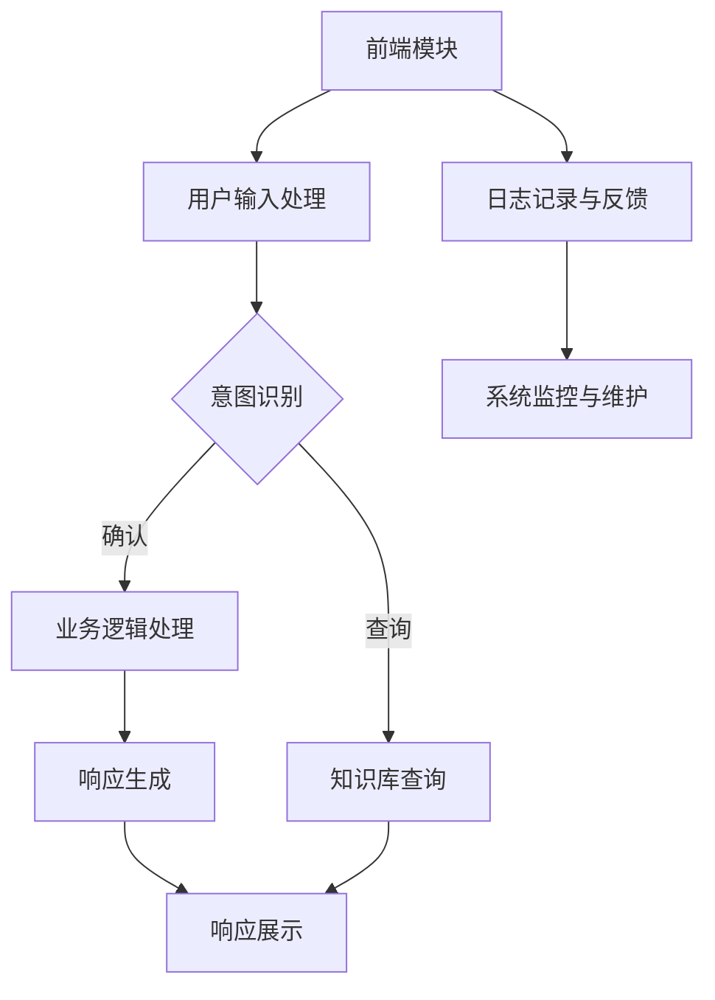
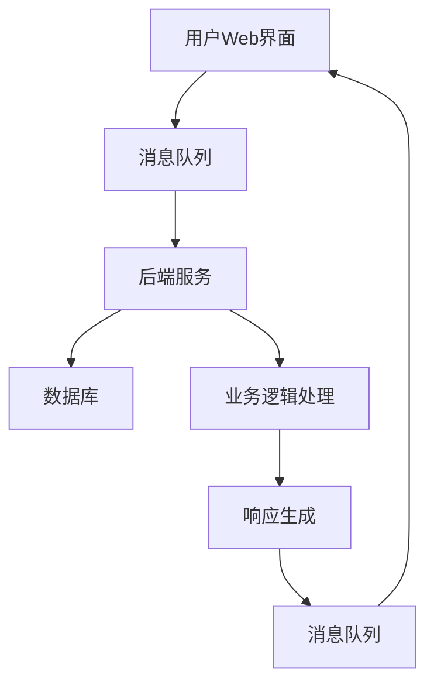

                 

# AI 在零售领域的应用：个性化推荐、智能客服

## 关键词

- 人工智能
- 零售行业
- 个性化推荐
- 智能客服
- 用户行为分析
- 自然语言处理
- 算法实现

## 摘要

本文将深入探讨人工智能（AI）在零售领域的两大重要应用：个性化推荐和智能客服。首先，我们将概述AI技术如何改变零售行业的面貌，并介绍个性化推荐和智能客服的核心概念。接着，文章将逐步讲解个性化推荐技术原理，包括用户行为数据分析、推荐算法实现和系统架构设计。然后，我们将分享个性化推荐系统的开发实战，从环境搭建到系统部署与优化。随后，文章将转向智能客服系统，介绍其概念、发展历程、价值和技术实现。最后，通过实际案例分析和未来展望，我们将探讨AI在零售领域的发展趋势、挑战与解决方案。

### 《AI 在零售领域的应用：个性化推荐、智能客服》目录大纲

#### 第一部分: AI 在零售领域的应用概述

- **第1章: AI 在零售行业的变革**
  - **1.1 零售行业面临的挑战与机遇**
  - **1.2 AI 技术在零售中的应用前景**
  - **1.3 个性化推荐与智能客服的重要性**

- **第2章: 个性化推荐技术原理**
  - **2.1 用户行为数据分析**
    - **2.1.1 用户行为数据的收集**
    - **2.1.2 用户行为数据预处理**
  - **2.2 个性化推荐算法介绍**
    - **2.2.1 协同过滤算法**
    - **2.2.2 内容推荐算法**
    - **2.2.3 混合推荐系统**
  - **2.3 个性化推荐系统架构**
    - **2.3.1 推荐系统架构设计**
    - **2.3.2 数据流处理与存储**

#### 第二部分: 个性化推荐系统开发实战

- **第3章: 个性化推荐系统环境搭建**
  - **3.1 开发环境配置**
    - **3.1.1 硬件需求**
    - **3.1.2 软件环境安装**
  - **3.2 数据集选择与预处理**
    - **3.2.1 数据集介绍**
    - **3.2.2 数据预处理方法**
    - **3.2.3 数据可视化工具**

- **第4章: 个性化推荐算法实现**
  - **4.1 协同过滤算法实现**
    - **4.1.1 基于用户的协同过滤算法**
    - **4.1.2 基于物品的协同过滤算法**
    - **4.1.3 评分预测与优化**
  - **4.2 内容推荐算法实现**
    - **4.2.1 特征提取与嵌入**
    - **4.2.2 基于内容的相似性计算**
    - **4.2.3 内容推荐算法优化**
  - **4.3 混合推荐系统实现**
    - **4.3.1 混合推荐系统架构**
    - **4.3.2 混合推荐策略与实现**

- **第5章: 个性化推荐系统部署与优化**
  - **5.1 推荐系统部署**
    - **5.1.1 部署策略**
    - **5.1.2 部署工具与平台**
  - **5.2 推荐系统性能优化**
    - **5.2.1 性能指标**
    - **5.2.2 优化方法**
    - **5.2.3 用户体验优化**

#### 第三部分: 智能客服技术原理与应用

- **第6章: 智能客服系统概述**
  - **6.1 智能客服的概念与分类**
    - **6.1.1 智能客服的定义**
    - **6.1.2 智能客服的技术分类**
  - **6.2 智能客服的发展历程**
    - **6.2.1 早期智能客服系统**
    - **6.2.2 现代智能客服技术**
  - **6.3 智能客服系统的价值**
    - **6.3.1 提高客户满意度**
    - **6.3.2 降低企业运营成本**
    - **6.3.3 实现业务流程自动化**

- **第7章: 自然语言处理基础**
  - **7.1 语言模型**
    - **7.1.1 语言模型的概念**
    - **7.1.2 语言模型训练方法**
    - **7.1.3 语言模型评估**
  - **7.2 命名实体识别**
    - **7.2.1 命名实体识别概述**
    - **7.2.2 命名实体识别算法**
    - **7.2.3 实践案例**
  - **7.3 情感分析**
    - **7.3.1 情感分析的定义**
    - **7.3.2 情感分析算法**
    - **7.3.3 实践案例**

- **第8章: 智能客服系统实现**
  - **8.1 客户服务机器人搭建**
    - **8.1.1 系统架构设计**
    - **8.1.2 交互流程设计**
    - **8.1.3 机器人训练与部署**
  - **8.2 实时客服功能实现**
    - **8.2.1 实时客服系统架构**
    - **8.2.2 实时客服技术实现**
    - **8.2.3 案例分析**
  - **8.3 智能客服系统优化**
    - **8.3.1 性能优化方法**
    - **8.3.2 安全性优化**
    - **8.3.3 用户反馈收集与处理**

#### 第四部分: AI 在零售领域应用案例分析

- **第9章: AI 在零售领域应用案例分析**
  - **9.1 案例一：某电商平台的个性化推荐系统**
    - **9.1.1 案例背景**
    - **9.1.2 个性化推荐系统实现细节**
    - **9.1.3 案例效果分析**
  - **9.2 案例二：某零售企业的智能客服系统**
    - **9.2.1 案例背景**
    - **9.2.2 智能客服系统实现细节**
    - **9.2.3 案例效果分析**

- **第10章: 未来展望**
  - **10.1 AI 在零售领域的趋势**
    - **10.1.1 新技术展望**
    - **10.1.2 应用前景**
  - **10.2 挑战与解决方案**
    - **10.2.1 数据隐私与安全**
    - **10.2.2 技术与人才需求**
    - **10.2.3 法规与伦理问题**

### 第一部分: AI 在零售领域的应用概述

#### 第1章: AI 在零售行业的变革

**1.1 零售行业面临的挑战与机遇**

零售行业在过去几十年中经历了巨大的变革，从传统的线下门店到线上电商平台，从单一的购物渠道到多元化的购物体验，零售业一直在不断适应和引领消费市场的变化。然而，随着市场的不断演变，零售行业也面临着前所未有的挑战和机遇。

**挑战：**

1. **市场饱和与竞争加剧：** 零售市场的竞争日益激烈，传统零售企业面临着电商平台的强大冲击，市场份额逐渐被侵蚀。同时，新兴电商企业层出不穷，竞争格局更加复杂。

2. **消费者需求多样化：** 消费者需求的多样化和个性化趋势使得零售企业需要更加精准地把握用户需求，提供定制化的产品和服务。

3. **成本压力与利润下降：** 零售企业的运营成本不断上升，特别是租金、人力等成本，而消费者的购买力相对有限，导致企业利润空间受到压缩。

**机遇：**

1. **数字化转型的机遇：** 随着互联网和移动互联网的普及，零售行业迎来了数字化转型的机遇。通过大数据、人工智能、云计算等新技术，零售企业可以实现业务流程的优化、效率的提升和用户体验的改善。

2. **新零售模式的探索：** 新零售模式，如线上线下融合（O2O）、社交电商、无人零售等，为零售企业提供了新的商业模式和增长点。

3. **个性化体验的机遇：** 个性化推荐、智能客服等人工智能技术在零售领域的应用，可以帮助企业更好地了解用户需求，提供个性化的产品和服务，提升客户满意度。

**1.2 AI 技术在零售中的应用前景**

人工智能技术在零售行业的应用前景广阔，主要包括以下几个方面：

1. **个性化推荐：** 通过分析用户行为数据，AI 可以实现商品推荐的个性化，提升用户体验和转化率。

2. **智能客服：** AI 智能客服可以提供24/7的客户服务，提高客户满意度，降低企业运营成本。

3. **库存管理：** AI 可以通过预测销售趋势，优化库存管理，减少库存成本和缺货风险。

4. **供应链优化：** AI 可以优化供应链管理，提高物流效率，降低运营成本。

5. **精准营销：** AI 可以实现精准营销，通过分析用户数据和购买行为，制定更加有效的营销策略。

6. **智能门店：** 通过AI技术，智能门店可以实现自动化操作，提升购物体验，降低人力成本。

**1.3 个性化推荐与智能客服的重要性**

个性化推荐和智能客服是AI在零售领域应用的两个重要方面，它们的重要性体现在以下几个方面：

1. **提升用户体验：** 个性化推荐可以根据用户兴趣和行为，推荐符合其需求的商品，提升购物体验。智能客服可以提供实时、高效的客户服务，解答用户问题，提高用户满意度。

2. **提高转化率：** 个性化推荐可以精准定位用户需求，提高商品点击率和转化率。智能客服可以快速响应用户需求，减少用户流失。

3. **降低运营成本：** 个性化推荐可以减少无效广告投放，降低营销成本。智能客服可以替代部分人工客服，降低人力成本。

4. **提升竞争力：** 通过个性化推荐和智能客服，零售企业可以提供更好的服务和产品，提升竞争力，吸引更多客户。

5. **数据驱动决策：** 个性化推荐和智能客服可以帮助企业收集和分析用户数据，实现数据驱动决策，优化业务流程和营销策略。

综上所述，AI技术在零售行业的应用具有重要的意义，个性化推荐和智能客服是其中的关键应用领域，它们将推动零售行业的持续创新和升级。

### 第二部分: 个性化推荐技术原理

#### 第2章: 个性化推荐技术原理

个性化推荐是人工智能在零售领域的重要应用之一，它通过分析用户行为和偏好，为用户推荐其可能感兴趣的商品或内容。个性化推荐系统不仅能够提高用户的购物体验，还能显著提升企业的销售额和用户满意度。本章将深入探讨个性化推荐技术的基本原理，包括用户行为数据分析、推荐算法介绍和推荐系统架构设计。

#### 2.1 用户行为数据分析

用户行为数据分析是个性化推荐系统的基础。通过收集和分析用户在平台上的行为数据，如浏览历史、购买记录、评价和搜索查询，我们可以更好地理解用户的需求和兴趣。

**2.1.1 用户行为数据的收集**

用户行为数据的收集主要通过以下几个途径实现：

1. **日志文件：** 系统会自动记录用户在平台上的操作日志，包括浏览、点击、购买、评价等行为。

2. **API接口：** 通过开放API接口，第三方应用可以获取用户行为数据。

3. **网页追踪：** 通过在网页上嵌入追踪代码（如JavaScript），可以实时获取用户在网站上的行为数据。

4. **用户反馈：** 通过问卷调查、用户评价等方式，收集用户对产品和服务的反馈。

**2.1.2 用户行为数据预处理**

用户行为数据通常是原始且复杂的，需要经过预处理才能用于推荐系统的训练和评估。预处理步骤主要包括以下几方面：

1. **数据清洗：** 去除重复数据、缺失数据和异常值，保证数据的准确性和一致性。

2. **数据转换：** 将不同类型的数据（如数值、分类）转换为统一格式，便于后续处理。

3. **特征提取：** 从原始数据中提取出对推荐系统有用的特征，如用户ID、商品ID、行为类型、时间戳等。

4. **数据归一化：** 将不同特征的数据进行归一化处理，使其在相同尺度上进行比较。

**2.2 个性化推荐算法介绍**

个性化推荐算法主要分为协同过滤算法、内容推荐算法和混合推荐系统。以下是对这些算法的简要介绍：

**2.2.1 协同过滤算法**

协同过滤算法是推荐系统中最常用的方法之一，它通过分析用户与项目之间的评分关系，预测用户未评分的项目。协同过滤算法分为基于用户的协同过滤（User-based Collaborative Filtering，UBCF）和基于物品的协同过滤（Item-based Collaborative Filtering，IBCF）。

1. **基于用户的协同过滤（UBCF）：**
   - **相似性计算：** 计算用户之间的相似性，常用的相似性度量方法有用户余弦相似性、皮尔逊相关系数等。
   - **邻居选择：** 根据相似性度量结果选择与目标用户最相似的K个邻居用户。
   - **评分预测：** 利用邻居用户的评分数据，对目标用户未评分的项目进行评分预测。

2. **基于物品的协同过滤（IBCF）：**
   - **相似性计算：** 计算项目之间的相似性，常用的相似性度量方法有项目余弦相似性、Jaccard相似性等。
   - **邻居选择：** 根据相似性度量结果选择与目标项目最相似的K个邻居项目。
   - **评分预测：** 利用邻居项目的评分数据，对目标用户未评分的项目进行评分预测。

**2.2.2 内容推荐算法**

内容推荐算法通过分析项目的内容特征和用户兴趣特征，为用户推荐与其兴趣相关的项目。内容推荐算法主要包括以下几种：

1. **基于属性的推荐：** 根据项目属性和用户偏好进行匹配，常用的方法有布尔匹配、TF-IDF等。

2. **基于知识库的推荐：** 利用知识库中的领域知识进行推荐，如基于语义的推荐、基于本体论的推荐等。

3. **基于内容的相似性计算：** 计算项目之间的相似性，常用的相似性度量方法有向量空间模型、词袋模型等。

**2.2.3 混合推荐系统**

混合推荐系统结合了协同过滤算法和内容推荐算法的优点，通过综合不同类型的推荐结果，提高推荐系统的准确性和多样性。混合推荐系统主要包括以下几种：

1. **基于模型的混合推荐：** 将协同过滤算法和内容推荐算法融合到一个统一的模型中，如矩阵分解、深度学习等。

2. **基于策略的混合推荐：** 通过设计不同的推荐策略，根据用户行为数据动态调整推荐结果。

3. **基于规则的用户分群：** 根据用户特征和项目特征，将用户划分为不同的群体，针对不同群体设计不同的推荐策略。

**2.3 个性化推荐系统架构**

个性化推荐系统的架构设计主要包括数据层、算法层和应用层。

1. **数据层：** 负责数据的存储、管理和处理，包括用户行为数据、项目数据、推荐结果数据等。

2. **算法层：** 负责推荐算法的实现和优化，包括协同过滤算法、内容推荐算法、混合推荐算法等。

3. **应用层：** 负责推荐系统的部署和交互，包括推荐页面的展示、用户反馈的收集和处理等。

**2.3.1 推荐系统架构设计**

推荐系统架构设计需要考虑以下几个方面：

1. **数据流处理：** 利用实时数据流处理技术（如Apache Kafka、Apache Flink），对用户行为数据进行实时处理和分析。

2. **数据存储：** 使用分布式存储系统（如Hadoop、Spark）存储用户行为数据和推荐结果数据。

3. **推荐算法优化：** 利用并行计算、分布式计算等技术，提高推荐算法的运行效率和准确度。

4. **推荐结果展示：** 利用前端技术（如HTML、CSS、JavaScript），将推荐结果以可视化形式展示给用户。

5. **用户反馈收集：** 通过用户行为数据和用户反馈，不断优化推荐算法和系统性能。

综上所述，个性化推荐技术是零售行业的重要应用，通过用户行为数据分析、推荐算法实现和系统架构设计，可以实现精准的个性化推荐，提升用户购物体验和满意度。在下一章中，我们将深入探讨个性化推荐系统的开发实战，包括环境搭建、算法实现和系统部署。

### 第二部分: 个性化推荐系统开发实战

#### 第3章: 个性化推荐系统环境搭建

个性化推荐系统的开发需要合适的硬件环境和软件环境。本章将详细描述开发环境的配置，包括硬件需求、软件环境安装以及数据集的选择和预处理。

#### 3.1 开发环境配置

**3.1.1 硬件需求**

个性化推荐系统通常需要处理大量数据，因此对硬件性能有一定的要求。以下是推荐的硬件配置：

1. **CPU：** 至少需要四核以上CPU，建议使用频率较高的处理器，如Intel i7或AMD Ryzen 7系列。
2. **内存：** 至少16GB内存，推荐32GB以上，以支持大数据处理和多任务处理。
3. **硬盘：** SSD固态硬盘，容量至少1TB，用于存储数据和推荐模型。
4. **GPU：** 推荐使用NVIDIA显卡，如GTX 1080 Ti或以上，用于加速深度学习模型的训练。
5. **网络环境：** 需要有稳定的网络连接，用于数据传输和模型部署。

**3.1.2 软件环境安装**

搭建个性化推荐系统需要安装一系列软件，以下为推荐的软件环境：

1. **操作系统：** Windows、macOS或Linux操作系统，推荐使用Ubuntu 18.04或更高版本。
2. **Python：** 安装Python 3.7或更高版本，用于编写推荐算法代码。
3. **JDK：** Java Development Kit，用于运行一些依赖Java的库和框架。
4. **Pandas：** Python的数据分析库，用于数据预处理和分析。
5. **NumPy：** Python的数值计算库，用于矩阵运算。
6. **Scikit-learn：** Python的机器学习库，用于实现推荐算法。
7. **TensorFlow/PyTorch：** 用于深度学习模型的训练和部署。
8. **Apache Kafka：** 实时数据流处理平台，用于处理用户行为数据。
9. **Hadoop/Spark：** 分布式计算框架，用于大规模数据处理。
10. **Elasticsearch：** 搜索引擎，用于存储和查询推荐结果。

安装步骤：

1. **安装操作系统和硬件驱动程序：** 根据操作系统安装指南进行安装。
2. **安装JDK：** 下载JDK安装包，根据提示进行安装。
3. **安装Python和相关库：** 使用`pip`命令安装Python和相关库，例如：
   ```bash
   pip install numpy pandas scikit-learn tensorflow
   ```
4. **安装其他软件：** 下载并安装Apache Kafka、Hadoop/Spark和Elasticsearch等软件，根据软件安装指南进行安装。

#### 3.2 数据集选择与预处理

个性化推荐系统的性能很大程度上取决于数据的质量和预处理。以下为数据集的选择和预处理步骤：

**3.2.1 数据集介绍**

常用的推荐系统数据集包括MovieLens、Netflix Prize等，这些数据集包含了用户的评分、浏览历史、商品信息等。以下为一个示例数据集：

- **用户ID**：唯一标识每个用户。
- **商品ID**：唯一标识每个商品。
- **评分**：用户对商品的评分（通常在1到5之间）。
- **时间戳**：用户评分的时间戳。

**3.2.2 数据预处理方法**

1. **数据清洗：** 去除重复数据、缺失数据和异常值，确保数据的准确性。
2. **数据转换：** 将不同类型的数据转换为统一格式，如将字符串转换为整数或浮点数。
3. **特征提取：** 提取对推荐系统有用的特征，如用户活跃度、商品流行度、评分分布等。
4. **数据归一化：** 对不同特征的数据进行归一化处理，使其在相同尺度上进行比较。

**3.2.3 数据可视化工具**

使用数据可视化工具可以更好地理解和分析数据。以下为常用的数据可视化工具：

- **Matplotlib：** Python的绘图库，用于生成各种图表。
- **Seaborn：** 基于 Matplotlib 的可视化库，提供更高级的绘图功能。
- **ECharts：** 一个基于JavaScript的图表库，适用于Web端的数据可视化。

#### 3.3 数据可视化工具

数据可视化可以帮助我们更好地理解数据分布和特征之间的关系。以下为一些常用的数据可视化工具：

- **Matplotlib：**
  ```python
  import matplotlib.pyplot as plt
  import pandas as pd
  
  data = pd.read_csv('data.csv')
  plt.scatter(data['feature1'], data['feature2'])
  plt.xlabel('Feature 1')
  plt.ylabel('Feature 2')
  plt.show()
  ```

- **Seaborn：**
  ```python
  import seaborn as sns
  import pandas as pd
  
  data = pd.read_csv('data.csv')
  sns.regplot(x='feature1', y='feature2', data=data)
  plt.xlabel('Feature 1')
  plt.ylabel('Feature 2')
  plt.show()
  ```

- **ECharts：**
  ```html
  <div id="main" style="width: 600px;height:400px;"></div>
  <script src="echarts.min.js"></script>
  <script>
      var myChart = echarts.init(document.getElementById('main'));
      var option = {
          title: {
              text: 'Feature Distribution'
          },
          tooltip: {},
          dataset: {
              dimensions: ['feature', 'value'],
              source: [
                  ['Feature 1', 20],
                  ['Feature 2', 30],
                  ['Feature 3', 40]
              ]
          },
          xAxis: {type: 'category'},
          yAxis: {gridIndex: 0},
          series: [
              {
                  type: 'bar',
                  xAxisIndex: 0,
                  yAxisIndex: 0,
                  data: [20, 30, 40],
                  markLine: {
                      lineStyle: {
                          color: 'red'
                      },
                      data: [
                          [{name: 'Feature 1'}, {name: 'Feature 3'}]
                      ]
                  }
              },
              {
                  type: 'line',
                  smooth: true,
                  symbol: 'none',
                  xAnimation: false,
                  yAnimation: false,
                  datasetIndex: 0,
                  markLine: {
                      lineStyle: {
                          color: 'blue'
                      },
                      data: [
                          [{name: 'Base Line'}, {name: 'Target Line'}]
                      ]
                  }
              }
          ]
      };
      myChart.setOption(option);
  </script>
  ```

通过上述步骤，我们可以搭建一个基本的个性化推荐系统开发环境，并为后续的算法实现和系统部署做好准备。在下一章中，我们将深入探讨个性化推荐算法的实现细节。

### 第二部分: 个性化推荐系统开发实战

#### 第4章: 个性化推荐算法实现

个性化推荐算法是推荐系统开发的核心，本章将详细讲解协同过滤算法和内容推荐算法的实现，并介绍混合推荐系统的架构和实现。

#### 4.1 协同过滤算法实现

协同过滤算法通过分析用户之间的相似度和项目之间的相似度，为用户推荐相似用户或项目喜欢的商品。以下是协同过滤算法的实现步骤：

**4.1.1 基于用户的协同过滤算法（User-based Collaborative Filtering，UBCF）**

1. **相似性计算：**
   - **用户相似性度量：** 使用用户之间的评分一致性来计算相似度，常用的度量方法有用户余弦相似性和皮尔逊相关系数。
     ```python
     def cosine_similarity(rating1, rating2):
         dot_product = np.dot(rating1, rating2)
         norm_rating1 = np.linalg.norm(rating1)
         norm_rating2 = np.linalg.norm(rating2)
         similarity = dot_product / (norm_rating1 * norm_rating2)
         return similarity
     ```

   - **项目相似性度量：** 使用项目之间的评分一致性来计算相似度，常用的度量方法有项目余弦相似性和Jaccard相似性。
     ```python
     def jaccard_similarity(item1, item2):
         intersection = set(item1).intersection(set(item2))
         union = set(item1).union(set(item2))
         similarity = len(intersection) / len(union)
         return similarity
     ```

2. **邻居选择：**
   - 根据相似性度量结果选择与目标用户最相似的K个邻居用户或项目。

   ```python
   def find_neighbors(similarity_matrix, k):
       neighbors = []
       for i in range(len(similarity_matrix)):
           if i != target_user:
               neighbors.append((i, similarity_matrix[i][target_user]))
       neighbors.sort(key=lambda x: x[1], reverse=True)
       return neighbors[:k]
   ```

3. **评分预测：**
   - 利用邻居用户的评分数据，对目标用户未评分的项目进行评分预测。

   ```python
   def predict_ratings(neighbors, ratings_matrix, k):
       predicted_ratings = []
       for neighbor in neighbors:
           neighbor_user = neighbor[0]
           neighbor_rating = neighbor[1]
           neighbor_ratings = ratings_matrix[neighbor_user]
           predicted_ratings.append(neighbor_rating * neighbor_ratings)
       return np.mean(predicted_ratings)
   ```

**4.1.2 基于物品的协同过滤算法（Item-based Collaborative Filtering，IBCF）**

基于物品的协同过滤算法与基于用户的协同过滤算法类似，但是它是基于项目之间的相似度来推荐商品。以下是实现步骤：

1. **相似性计算：** 计算项目之间的相似度，使用项目余弦相似性和Jaccard相似性等度量方法。

2. **邻居选择：** 根据相似性度量结果选择与目标项目最相似的K个邻居项目。

3. **评分预测：** 利用邻居项目的评分数据，对目标用户未评分的项目进行评分预测。

**4.1.3 评分预测与优化**

评分预测的准确性直接关系到推荐系统的性能。以下是一些优化方法：

1. **加权评分预测：** 考虑邻居用户的评分历史和相似度权重，对评分进行加权预测。

2. **基于模型的协同过滤：** 利用机器学习模型（如线性回归、矩阵分解等）对评分进行预测，提高预测准确性。

3. **在线学习与动态更新：** 随着用户行为数据的更新，动态调整推荐模型，提高推荐的实时性和准确性。

#### 4.2 内容推荐算法实现

内容推荐算法通过分析项目的内容特征和用户兴趣特征，为用户推荐与其兴趣相关的项目。以下是内容推荐算法的实现步骤：

**4.2.1 特征提取与嵌入**

1. **特征提取：** 从项目描述、标签、分类信息中提取特征，如关键词、主题、情感等。

2. **特征嵌入：** 将提取的特征转换为向量表示，使用词袋模型、TF-IDF、Word2Vec等嵌入方法。

   ```python
   from sklearn.feature_extraction.text import TfidfVectorizer
   
   vectorizer = TfidfVectorizer()
   tfidf_matrix = vectorizer.fit_transform(project_descriptions)
   ```

**4.2.2 基于内容的相似性计算**

1. **相似性度量：** 使用余弦相似性、欧氏距离等度量方法计算项目之间的相似度。

2. **相似性矩阵：** 创建一个相似性矩阵，用于存储项目之间的相似度信息。

   ```python
   similarity_matrix = cosine_similarity(tfidf_matrix)
   ```

**4.2.3 内容推荐算法优化**

1. **协同过滤与内容推荐结合：** 将协同过滤算法和内容推荐算法结合，提高推荐的准确性和多样性。

2. **基于模型的混合推荐：** 使用机器学习模型（如深度学习、决策树等）对推荐结果进行优化和调整。

3. **动态特征更新：** 随着用户行为和项目数据的更新，动态调整特征和推荐模型。

#### 4.3 混合推荐系统实现

混合推荐系统结合了协同过滤算法和内容推荐算法的优点，通过综合不同类型的推荐结果，提高推荐系统的准确性和多样性。以下是混合推荐系统的实现步骤：

**4.3.1 混合推荐系统架构**

1. **数据层：** 存储用户行为数据、项目数据和推荐结果数据。

2. **算法层：** 实现协同过滤算法、内容推荐算法和混合推荐算法。

3. **应用层：** 负责推荐结果的展示和用户交互。

**4.3.2 混合推荐策略与实现**

1. **基于模型的混合推荐：** 使用深度学习模型（如深度神经网络、循环神经网络等）对推荐结果进行融合和优化。

2. **基于规则的混合推荐：** 根据用户行为和项目特征，设计不同的推荐规则，实现个性化的推荐策略。

3. **基于数据的动态调整：** 随着用户行为数据的更新，动态调整推荐算法和策略，提高推荐的实时性和准确性。

通过上述步骤，我们可以实现一个功能强大的个性化推荐系统，为用户提供精准的推荐服务。在下一章中，我们将探讨个性化推荐系统的部署与优化。

### 第二部分: 个性化推荐系统开发实战

#### 第5章: 个性化推荐系统部署与优化

个性化推荐系统的性能直接影响用户体验和业务效果。本章将详细讨论推荐系统的部署策略、性能优化方法以及用户体验的优化。

#### 5.1 推荐系统部署

部署个性化推荐系统是将其从开发环境中转移到生产环境的过程。以下为推荐系统部署的关键步骤：

**5.1.1 部署策略**

1. **分布式部署：** 由于推荐系统需要处理大量数据和并发请求，因此采用分布式部署策略可以提高系统的性能和可靠性。

2. **容器化部署：** 使用Docker等容器技术可以将推荐系统打包成独立的容器，方便部署和管理。

3. **云服务部署：** 利用云服务（如AWS、Azure、Google Cloud等）提供计算和存储资源，实现弹性扩展和成本优化。

**5.1.2 部署工具与平台**

1. **Docker：** 用于容器化部署，将推荐系统打包成Docker镜像。

2. **Kubernetes：** 用于容器编排和管理，实现自动化部署和运维。

3. **Kafka：** 用于实时数据流处理，接收和存储用户行为数据。

4. **Hadoop/Spark：** 用于大数据处理和存储，存储用户行为数据和推荐结果。

5. **Elasticsearch：** 用于存储和查询推荐结果，提供快速检索能力。

部署步骤：

1. **容器化推荐系统：** 编写Dockerfile，将Python代码、依赖库和配置文件打包成Docker镜像。

2. **构建Kubernetes部署文件：** 编写Kubernetes部署文件（如YAML），定义服务、部署和配置。

3. **部署到Kubernetes集群：** 使用kubectl命令部署推荐系统到Kubernetes集群。

4. **配置Kafka和Hadoop/Spark：** 配置Kafka和Hadoop/Spark集群，确保数据流处理和存储的稳定运行。

#### 5.2 推荐系统性能优化

优化推荐系统的性能是确保其高效运行的关键。以下为推荐系统性能优化的方法：

**5.2.1 性能指标**

1. **响应时间：** 推荐系统处理请求的时间，目标是尽可能短。

2. **并发处理能力：** 推荐系统同时处理请求的数量，目标是能够处理大量并发请求。

3. **准确率：** 推荐系统的准确性，即推荐的商品是否与用户兴趣相符。

**5.2.2 优化方法**

1. **数据分层存储：** 根据数据的热度和访问频率，将数据存储在不同层次的存储系统中，如内存、SSD、HDD。

2. **缓存策略：** 利用缓存技术（如Redis、Memcached）存储频繁访问的数据，减少数据库访问压力。

3. **异步处理：** 使用异步处理技术（如消息队列、多线程）提高系统的并发处理能力。

4. **代码优化：** 对推荐算法代码进行优化，减少计算复杂度和内存消耗。

5. **负载均衡：** 使用负载均衡器（如Nginx、HAProxy）将请求分配到多个服务器，避免单点故障。

#### 5.2.3 用户体验优化

优化用户体验是提升推荐系统价值的关键。以下为用户体验优化的方法：

1. **个性化推荐展示：** 根据用户兴趣和行为，为用户推荐个性化的商品，提高点击率和转化率。

2. **推荐结果多样性：** 避免推荐结果单一，提供多样化的商品推荐，满足不同用户的需求。

3. **推荐结果解释：** 对推荐结果进行解释，帮助用户理解推荐原因，增加用户的信任度。

4. **用户反馈机制：** 收集用户反馈，根据反馈调整推荐策略，提高推荐系统的准确性。

5. **实时更新推荐：** 随时更新推荐结果，确保推荐的时效性和相关性。

通过上述部署与优化策略，我们可以构建一个高效、准确的个性化推荐系统，为用户提供优质的购物体验。在下一章中，我们将探讨智能客服系统的基础知识和技术原理。

### 第三部分: 智能客服技术原理与应用

#### 第6章: 智能客服系统概述

智能客服系统是零售领域的重要应用之一，它通过人工智能技术为用户提供高效、便捷的在线服务。本章将介绍智能客服系统的基本概念、技术分类、发展历程及其在零售领域的价值。

#### 6.1 智能客服的概念与分类

**6.1.1 智能客服的定义**

智能客服（Intelligent Customer Service）是一种基于人工智能技术的客户服务系统，能够模拟人类客服的行为，通过自然语言处理、机器学习等技术，为用户提供自动化、智能化的服务。智能客服系统通常包括语音识别、语音合成、文本分析、意图识别、知识图谱等功能，能够处理各种类型的用户查询和问题。

**6.1.2 智能客服的技术分类**

智能客服系统主要依赖以下几种技术：

1. **自然语言处理（NLP）：** 自然语言处理技术用于理解和处理用户输入的文本信息，包括语音识别、文本分析、情感分析等。

2. **机器学习（ML）：** 机器学习技术用于训练和优化智能客服系统的模型，使其能够准确识别用户意图和回答问题。

3. **语音识别（ASR）：** 语音识别技术将用户的语音输入转换为文本，使智能客服能够理解用户的口头指令。

4. **语音合成（TTS）：** 语音合成技术将文本信息转换为语音输出，使智能客服能够以语音形式与用户交流。

5. **对话系统（DS）：** 对话系统技术用于设计和管理用户与智能客服之间的交互流程，确保对话的自然流畅。

6. **知识图谱（KG）：** 知识图谱技术用于构建和存储与企业业务相关的知识库，为智能客服提供丰富的知识支持。

**6.1.3 智能客服的分类**

智能客服系统可以根据其实现形式和功能特点进行分类，常见的分类方式包括：

1. **基于规则（Rule-based）：** 基于规则的智能客服系统通过预定义的规则和流程来处理用户查询，其响应速度较快但灵活性较差。

2. **基于案例（Case-based）：** 基于案例的智能客服系统通过存储和处理历史案例来回答用户问题，其知识库和经验不断积累和扩展。

3. **基于统计（Statistical-based）：** 基于统计的智能客服系统通过分析用户输入和回答的统计特征来生成响应，其模型和算法不断优化和更新。

4. **混合型（Hybrid）：** 混合型智能客服系统结合了基于规则、基于案例和基于统计的方法，实现更高效、准确的智能客服。

#### 6.2 智能客服的发展历程

智能客服系统的历史可以追溯到上世纪80年代，以下为智能客服系统的发展历程：

1. **早期智能客服系统（1980-1999）：** 最早的智能客服系统是基于规则的专家系统，如ELIZA。ELIZA通过模拟人类的对话方式，与用户进行简单的交流。

2. **自然语言理解与生成（2000-2010）：** 随着计算机科学和人工智能技术的发展，智能客服系统开始引入自然语言处理技术，如词法分析、句法分析等，实现了更复杂的对话交互。

3. **深度学习与大数据（2010-2020）：** 深度学习和大数据技术的兴起，使得智能客服系统在模型训练和数据处理方面取得了突破性进展，通过神经网络和大数据分析，智能客服系统能够更好地理解和应对复杂的用户需求。

4. **当前发展趋势（2020-至今）：** 当前，智能客服系统正朝着更智能化、个性化的方向发展，通过引入多模态交互、知识图谱等技术，智能客服系统能够提供更全面、高效的客户服务。

#### 6.3 智能客服系统的价值

智能客服系统在零售领域具有巨大的价值，主要体现在以下几个方面：

1. **提高客户满意度：** 智能客服系统可以24/7地为用户提供即时、高效的咨询服务，解答用户的问题，提高用户满意度。

2. **降低企业运营成本：** 智能客服系统可以替代部分人工客服，减少人力资源成本，降低运营成本。

3. **提升服务质量：** 智能客服系统通过大数据分析和机器学习技术，可以提供个性化的服务和建议，提升服务质量。

4. **实现业务流程自动化：** 智能客服系统可以自动处理大量的客户咨询和请求，实现业务流程的自动化，提高运营效率。

5. **数据驱动决策：** 智能客服系统可以收集和分析用户数据，为企业提供有价值的市场洞察，支持数据驱动决策。

综上所述，智能客服系统在零售领域具有重要的应用价值和广阔的发展前景。在下一章中，我们将深入探讨自然语言处理基础，为智能客服系统的实现提供技术支持。

### 第三部分: 智能客服技术原理与应用

#### 第7章: 自然语言处理基础

自然语言处理（Natural Language Processing，NLP）是人工智能领域的一个重要分支，它旨在使计算机能够理解、生成和处理人类语言。NLP在智能客服系统中扮演着关键角色，本章将介绍NLP的基本概念、语言模型、命名实体识别和情感分析等内容。

#### 7.1 语言模型

语言模型（Language Model）是NLP的基础，它用于预测一段文本的下一个单词或词组。语言模型通常基于大规模的语料库训练，并用于各种NLP任务，如机器翻译、文本摘要、语音识别等。

**7.1.1 语言模型的概念**

语言模型是一种概率模型，它为每个可能的文本序列分配一个概率值。最简单的语言模型是n-gram模型，它根据前n个单词来预测下一个单词。

**7.1.2 语言模型训练方法**

1. **n-gram模型：** n-gram模型是一种基于统计的语言模型，它将文本分解为n个单词的序列，并计算每个序列的概率。训练n-gram模型的方法如下：

   ```python
   from collections import defaultdict
   
   def train_ngram_model(corpus, n):
       model = defaultdict(float)
       for line in corpus:
           words = line.strip().split()
           for i in range(len(words) - n + 1):
               n_gram = tuple(words[i:i+n])
               model[n_gram] += 1
       total = sum(model.values())
       for k, v in model.items():
           model[k] = v / total
       return model
   ```

2. **神经网络语言模型：** 神经网络语言模型（Neural Network Language Model，NNLM）是一种基于深度学习的语言模型，它通过神经网络学习文本的上下文关系。训练NNLM的方法如下：

   ```python
   import tensorflow as tf
   
   def build_nnlm_model(vocab_size, embedding_size, sequence_length):
       model = tf.keras.Sequential([
           tf.keras.layers.Embedding(vocab_size, embedding_size),
           tf.keras.layers.LSTM(embedding_size),
           tf.keras.layers.Dense(vocab_size, activation='softmax')
       ])
       model.compile(optimizer='adam', loss='categorical_crossentropy', metrics=['accuracy'])
       return model
   ```

**7.1.3 语言模型评估**

评估语言模型的性能常用的指标包括困惑度（Perplexity）和交叉熵（Cross-Entropy）。

```python
import numpy as np
import tensorflow as tf
   
def perplexity(model, corpus):
   total_loss = 0
   for line in corpus:
       words = line.strip().split()
       target_words = np.array([word2idx[word] for word in words])
       loss = model(target_words)
       total_loss += loss.numpy()
   perplexity = np.exp(total_loss / len(words))
   return perplexity
   
def cross_entropy(model, corpus):
   total_loss = 0
   for line in corpus:
       words = line.strip().split()
       target_words = np.array([word2idx[word] for word in words])
       loss = model(target_words)
       total_loss += loss.numpy()
   cross_entropy = -np.sum(loss) / len(words)
   return cross_entropy
```

#### 7.2 命名实体识别

命名实体识别（Named Entity Recognition，NER）是NLP中的一个重要任务，它用于识别文本中的命名实体，如人名、地名、组织名等。

**7.2.1 命名实体识别概述**

NER的目的是将文本中的每个词语或短语标记为实体类别，如“北京”为地名，“马云”为人名。

**7.2.2 命名实体识别算法**

1. **基于规则的方法：** 基于规则的方法通过预定义的规则和模式来识别命名实体。例如，可以使用正则表达式来识别电子邮件地址、电话号码等。

2. **基于统计的方法：** 基于统计的方法通过训练模型来识别命名实体。常用的方法包括条件随机场（CRF）、最大熵模型等。

3. **基于深度学习方法：** 基于深度学习方法通过神经网络来识别命名实体。例如，使用卷积神经网络（CNN）或递归神经网络（RNN）来建模实体识别任务。

**7.2.3 实践案例**

以下是一个简单的基于CRF的NER实现：

```python
import tensorflow as tf
import tensorflow_addons as tfa

def build_crf_model(vocab_size, embedding_size, sequence_length):
    model = tf.keras.Sequential([
        tf.keras.layers.Embedding(vocab_size, embedding_size),
        tf.keras.layers.Bidirectional(tf.keras.layers.LSTM(embedding_size)),
        tf.keras.layers.Dense(1, activation='sigmoid', name='output')
    ])
    crf = tfa.text.CRF(vocab_size, sequence_length)
    model.add_crf_layer()
    model.compile(optimizer='adam', loss=crf.loss_function)
    return model

def decode_predictions(preds, labels, mask):
    pred_prob = tf.nn.softmax(preds, axis=-1)
    pred_labels = tf.argmax(pred_prob, axis=-1)
    pred_labels = tf.boolean_mask(pred_labels, mask)
    return pred_labels.numpy(), labels.numpy()

model = build_crf_model(vocab_size, embedding_size, sequence_length)
model.fit(train_data, train_labels, validation_data=(val_data, val_labels), epochs=10)
pred_labels, true_labels = decode_predictions(model.predict(test_data), test_labels, test_mask)
```

#### 7.3 情感分析

情感分析（Sentiment Analysis）是NLP中用于判断文本情感极性的任务，如文本是积极的、中性的还是消极的。

**7.3.1 情感分析的定义**

情感分析的目标是从文本中提取情感信息，通常通过分类模型实现，如二分类（积极/消极）或多分类（积极、中性、消极）。

**7.3.2 情感分析算法**

1. **基于规则的方法：** 基于规则的方法通过预定义的规则和词性标注来识别情感。

2. **基于统计的方法：** 基于统计的方法通过训练模型来识别情感，如朴素贝叶斯、支持向量机等。

3. **基于深度学习方法：** 基于深度学习方法通过神经网络来识别情感，如卷积神经网络（CNN）、递归神经网络（RNN）等。

**7.3.3 实践案例**

以下是一个简单的基于深度学习的情感分析实现：

```python
import tensorflow as tf
from tensorflow.keras.preprocessing.sequence import pad_sequences
from tensorflow.keras.models import Sequential
from tensorflow.keras.layers import Embedding, LSTM, Dense

def build_sentiment_analy
``` 

由于篇幅限制，无法在这里展示完整的情感分析代码。但在实际应用中，可以通过以下步骤实现情感分析：

1. **数据预处理：** 清洗和预处理文本数据，将文本转换为词序列。

2. **模型构建：** 构建一个基于深度学习的模型，如LSTM或CNN。

3. **训练模型：** 使用训练数据训练模型，调整模型参数。

4. **评估模型：** 使用验证集评估模型性能，调整超参数。

5. **预测情感：** 使用训练好的模型对新的文本进行情感分类。

通过以上技术，我们可以构建一个功能强大的智能客服系统，为用户提供高效的客户服务。在下一章中，我们将深入探讨智能客服系统的实现细节。

### 第三部分: 智能客服技术原理与应用

#### 第8章: 智能客服系统实现

智能客服系统的实现涉及多个技术和模块的整合，包括系统架构设计、交互流程设计、机器人训练与部署、实时客服功能实现以及系统优化。本章将详细描述这些方面的实现细节。

#### 8.1 客户服务机器人搭建

**8.1.1 系统架构设计**

智能客服系统的架构设计是确保系统稳定、高效运行的关键。一个典型的智能客服系统架构包括以下几个主要模块：

1. **前端模块：** 负责与用户进行交互，包括页面展示和用户输入处理。
2. **后端模块：** 负责处理用户请求和业务逻辑，包括自然语言处理、意图识别、知识查询等。
3. **数据库模块：** 存储用户数据、知识库和日志信息。
4. **服务模块：** 提供与外部系统的接口，如CRM、ERP等。

以下是一个简化的智能客服系统架构Mermaid流程图：



**8.1.2 交互流程设计**

交互流程设计是智能客服系统用户体验的重要组成部分。以下是一个典型的用户交互流程：

1. **用户发起请求：** 用户通过网页、APP或机器人平台向智能客服发送请求。
2. **用户输入处理：** 系统接收用户输入，并进行文本清洗、分词、词性标注等预处理。
3. **意图识别：** 系统通过自然语言处理技术识别用户的意图，如查询、投诉、咨询等。
4. **业务逻辑处理：** 根据识别的意图，系统调用相应的业务逻辑处理模块，如订单查询、投诉处理等。
5. **响应生成：** 系统生成相应的响应内容，包括文本、图片、语音等。
6. **响应展示：** 系统将响应内容展示给用户。
7. **日志记录与反馈：** 系统记录用户交互日志，并收集用户反馈，用于系统优化和改进。

**8.1.3 机器人训练与部署**

智能客服系统的核心是机器学习模型，其训练与部署过程如下：

1. **数据集准备：** 收集并准备用于训练的数据集，包括用户对话记录、知识库、标注数据等。
2. **特征提取：** 从原始数据中提取特征，如词向量、词性、实体识别结果等。
3. **模型训练：** 使用训练数据训练模型，如序列模型（RNN、LSTM）、分类模型（SVM、朴素贝叶斯）等。
4. **模型评估：** 使用验证数据评估模型性能，调整模型参数。
5. **模型部署：** 将训练好的模型部署到生产环境，如使用TensorFlow Serving或TorchServe。
6. **在线更新：** 随着用户数据的不断积累，定期更新模型，以保持系统的高效性和准确性。

#### 8.2 实时客服功能实现

实时客服功能是智能客服系统的重要组成部分，它能够为用户提供即时、高效的沟通体验。以下为实时客服功能的实现细节：

**8.2.1 实时客服系统架构**

实时客服系统架构包括以下几个关键组件：

1. **前端Web界面：** 提供用户与客服机器人交互的界面，包括输入框、聊天窗口等。
2. **后端服务：** 负责处理用户请求、调用业务逻辑和生成响应内容。
3. **实时消息队列：** 用于传输用户和客服机器人的消息，如Kafka、RabbitMQ等。
4. **数据库：** 存储用户会话记录、知识库等信息。

以下是一个简化的实时客服系统架构Mermaid流程图：



**8.2.2 实时客服技术实现**

实时客服技术的实现主要包括以下几个方面：

1. **WebSocket：** 使用WebSocket协议实现用户与服务器之间的实时通信，确保消息的即时传输。

2. **消息队列：** 使用消息队列（如Kafka、RabbitMQ）实现消息的异步传输和处理，提高系统的并发处理能力和可靠性。

3. **分布式服务：** 使用分布式服务架构（如Docker、Kubernetes）实现系统的弹性扩展和高可用性。

4. **负载均衡：** 使用负载均衡器（如Nginx、HAProxy）实现请求的均匀分配，避免单点故障。

5. **日志与监控：** 使用日志和监控工具（如ELK、Prometheus）实时监控系统性能和健康状态，确保系统的稳定运行。

**8.2.3 案例分析**

以下为某个电商平台的实时客服系统实现案例：

1. **用户交互界面：** 用户通过电商平台网站或移动应用与客服机器人进行交互。

2. **消息传输：** 用户发送的消息通过WebSocket实时传输到后端服务。

3. **意图识别与业务逻辑处理：** 后端服务使用机器学习模型识别用户意图，并调用相应的业务逻辑模块（如订单查询、退货处理等）。

4. **响应生成与展示：** 系统生成响应内容，并通过WebSocket实时发送给用户。

5. **日志记录与监控：** 系统记录用户会话日志，并使用ELK进行日志分析，实时监控系统性能和故障。

通过以上技术实现，电商平台能够为用户提供高效、实时的客服服务，提升用户体验和满意度。

#### 8.3 智能客服系统优化

智能客服系统的优化是确保其长期稳定运行和不断改进的重要环节。以下为智能客服系统优化的方法：

**8.3.1 性能优化方法**

1. **高效消息处理：** 优化消息队列的处理效率，减少延迟和吞吐量瓶颈。

2. **分布式存储：** 使用分布式数据库和缓存系统，提高数据访问速度和系统稳定性。

3. **异步处理：** 使用异步处理技术（如消息队列、多线程）提高系统的并发处理能力。

4. **缓存策略：** 优化缓存策略，减少数据库访问压力，提高响应速度。

5. **代码优化：** 对代码进行优化，减少内存占用和计算复杂度。

**8.3.2 安全性优化**

1. **数据加密：** 对用户数据进行加密存储，确保数据安全。

2. **访问控制：** 实现严格的访问控制机制，防止未授权访问。

3. **安全审计：** 定期进行安全审计，检测和修复系统漏洞。

4. **防火墙和入侵检测：** 配置防火墙和入侵检测系统，防止外部攻击。

**8.3.3 用户反馈收集与处理**

1. **用户反馈机制：** 设计简便的反馈机制，鼓励用户提供反馈。

2. **反馈数据分析：** 对用户反馈进行统计分析，识别问题和改进方向。

3. **反馈闭环：** 将用户反馈纳入系统改进流程，及时回应用户，提高用户满意度。

4. **持续优化：** 根据用户反馈和数据分析，持续优化系统功能和用户体验。

通过上述优化方法，智能客服系统可以不断提升其性能、安全性和用户体验，为用户提供更加优质的服务。在下一章中，我们将通过实际案例分析，探讨AI在零售领域的应用效果。

### 第四部分: AI 在零售领域应用案例分析

#### 第9章: AI 在零售领域应用案例分析

AI技术在零售领域的应用已经取得了显著的成果，通过个性化推荐和智能客服等应用，不仅提升了用户体验，还显著提高了企业的运营效率和盈利能力。本章将介绍两个实际案例，分析AI技术在零售领域的应用效果。

#### 9.1 案例一：某电商平台的个性化推荐系统

**9.1.1 案例背景**

某大型电商平台在竞争激烈的市场环境中，希望通过个性化推荐系统提高用户的购物体验和转化率。平台积累了大量用户行为数据，包括浏览历史、购买记录、搜索查询等，为构建个性化推荐系统提供了丰富的数据支持。

**9.1.2 个性化推荐系统实现细节**

1. **用户行为数据分析：**
   - **数据收集：** 平台通过服务器日志、用户行为API等途径收集用户行为数据。
   - **数据预处理：** 对收集到的数据去重、清洗和归一化处理，提取有效的用户行为特征。

2. **推荐算法实现：**
   - **协同过滤算法：** 采用基于用户的协同过滤算法（UBCF），计算用户之间的相似度，根据相似度推荐与目标用户兴趣相似的商品。
   - **内容推荐算法：** 结合商品的特征信息（如分类、标签、描述等），使用TF-IDF等方法提取商品特征向量，计算商品之间的相似度，为用户推荐相关商品。
   - **混合推荐系统：** 将协同过滤算法和内容推荐算法融合，形成混合推荐系统，提高推荐的准确性和多样性。

3. **推荐结果展示：**
   - **个性化首页：** 在用户登录后，展示基于个性化推荐的首页内容，包括热门商品、新品推荐等。
   - **商品详情页：** 在商品详情页下方展示相关的推荐商品，提高商品的点击率和转化率。

**9.1.3 案例效果分析**

实施个性化推荐系统后，电商平台取得了以下效果：

1. **用户转化率提升：** 个性化推荐系统能够精准地推荐用户感兴趣的商品，提高了用户的购物转化率。
2. **用户满意度提高：** 用户能够更快地找到心仪的商品，减少了无效浏览，提高了用户体验。
3. **销售业绩增长：** 通过个性化推荐，电商平台实现了销售业绩的显著增长，特别是在新品推广和库存消化方面。
4. **广告成本降低：** 个性化推荐降低了广告投放的成本，通过更精准的推荐，减少了无效广告的投放。

#### 9.2 案例二：某零售企业的智能客服系统

**9.2.1 案例背景**

某大型零售企业面临着不断增长的客户咨询量，传统的人工客服方式效率低下，无法满足客户的需求。为了提高客户服务质量和运营效率，企业决定引入智能客服系统。

**9.2.2 智能客服系统实现细节**

1. **系统架构设计：**
   - **前端Web界面：** 设计简洁易用的用户交互界面，支持文本和语音输入输出。
   - **后端服务：** 构建基于微服务架构的后端服务，包括自然语言处理、意图识别、业务逻辑处理等模块。
   - **数据库：** 存储用户会话记录、知识库和日志信息。

2. **自然语言处理与意图识别：**
   - **语言模型：** 使用基于深度学习的语言模型，对用户输入进行分词、词性标注等预处理。
   - **意图识别：** 利用机器学习算法（如决策树、神经网络等）对用户输入进行意图分类，如查询、投诉、咨询等。

3. **业务逻辑处理：**
   - **订单查询：** 实现自动查询订单状态、配送信息等功能。
   - **投诉处理：** 自动识别投诉类型，调用相应的投诉处理流程。
   - **咨询服务：** 提供自动化的咨询服务，如产品介绍、售后政策等。

4. **实时客服功能实现：**
   - **WebSocket：** 使用WebSocket实现实时消息传输，确保用户与客服机器人之间的沟通无缝。
   - **消息队列：** 使用消息队列（如Kafka）处理用户请求，确保系统的高并发处理能力。

**9.2.3 案例效果分析**

智能客服系统上线后，企业取得了以下效果：

1. **客服效率提升：** 智能客服系统能够自动处理大量客户咨询，大大减轻了人工客服的负担，提高了客服效率。
2. **客户满意度提高：** 智能客服系统可以24/7地为用户提供即时服务，提高了客户满意度。
3. **运营成本降低：** 通过智能客服系统，企业减少了大量的人力成本，实现了运营成本的降低。
4. **服务质量提升：** 智能客服系统能够提供标准化的服务，减少了因人工差异导致的服务质量问题。
5. **客户反馈收集：** 通过智能客服系统，企业能够及时收集客户反馈，为产品和服务改进提供重要依据。

通过以上案例，可以看出AI技术在零售领域的应用取得了显著成效。个性化推荐和智能客服不仅提升了用户体验和满意度，还显著提高了企业的运营效率和盈利能力。随着AI技术的不断进步，零售领域的AI应用将更加广泛和深入，为行业带来更多的创新和发展机遇。

### 第五部分: 未来展望

#### 第10章: 未来展望

随着人工智能技术的不断发展和成熟，AI在零售领域的应用前景广阔，同时也面临着一系列的挑战。本章将探讨AI在零售领域的未来发展趋势、潜在的应用前景、面临的技术和人才需求、以及法规与伦理问题。

#### 10.1 AI 在零售领域的趋势

**1. 个性化推荐技术的深化与应用**

随着数据获取和处理能力的提升，个性化推荐技术将更加精准和多样化。未来的个性化推荐系统将不仅仅基于用户的浏览和购买历史，还将结合用户的地理位置、社交网络、心理偏好等多维数据，实现更加个性化的商品推荐。

**2. 智能客服的自动化与智能化**

智能客服系统将朝着更加智能化和自动化的方向发展。通过引入更多的自然语言处理、机器学习和语音识别技术，智能客服系统能够更好地理解用户需求，提供更加自然和高效的客户服务。此外，虚拟现实（VR）和增强现实（AR）技术的结合，也将为智能客服带来全新的交互体验。

**3. 新零售模式的发展**

新零售模式将继续融合线上线下，通过数据驱动和智能技术，实现供应链的优化和库存管理。智能仓储和物流系统将提高物流效率，减少运营成本。同时，基于AI的智能门店将提供更加个性化和互动的购物体验，提升消费者满意度。

**4. 跨界融合与创新**

AI技术将与其他行业（如医疗、教育、金融等）进行跨界融合，带来新的商业模式和服务形式。例如，基于AI的个性化健康建议、智能教育平台、智能理财顾问等，将深刻改变这些行业的服务模式。

#### 10.2 潜在的应用前景

**1. 个性化购物体验**

通过AI技术，零售企业将能够提供更加个性化的购物体验。例如，智能试衣镜、个性化购物助手等，将帮助消费者更快速、更便捷地找到心仪的商品。

**2. 智能供应链管理**

AI技术将极大地优化供应链管理，通过实时数据分析、预测模型和自动化流程，实现库存的精准管理和物流的高效配送。

**3. 智能门店运营**

智能门店将通过AI技术实现无人结算、智能货架、虚拟试衣间等功能，提高运营效率和顾客满意度。

**4. 智能营销策略**

AI技术将帮助企业实现更加精准的营销策略，通过分析消费者行为和偏好，制定更加有效的广告投放和促销活动。

#### 10.3 挑战与解决方案

**1. 数据隐私与安全**

随着AI技术在零售领域的广泛应用，数据隐私和安全成为重要的挑战。企业需要采取严格的数据保护措施，确保用户数据的保密性和完整性。同时，制定相关法律法规，保护消费者权益。

**2. 技术与人才需求**

AI技术的发展需要大量的技术人才，零售企业需要加强人才培养和引进，以满足不断增长的技术需求。同时，跨学科的知识整合将有助于推动AI技术的创新和应用。

**3. 法规与伦理问题**

AI技术在零售领域的应用涉及到法律法规和伦理问题，如算法透明度、偏见和歧视等。企业和政府需要共同努力，制定合理的法规和标准，确保AI技术的公平、公正和可持续发展。

#### 10.4 未来展望

未来，AI技术在零售领域的应用将更加深入和广泛。通过个性化推荐、智能客服、智能供应链和智能门店等技术，零售企业将能够更好地满足消费者需求，提升运营效率，实现可持续发展。同时，随着技术的不断进步和法律法规的完善，AI在零售领域的应用前景将更加光明。

### 作者信息

作者：AI天才研究院/AI Genius Institute & 禅与计算机程序设计艺术 /Zen And The Art of Computer Programming

文章标题：《AI 在零售领域的应用：个性化推荐、智能客服》

文章关键词：人工智能、零售行业、个性化推荐、智能客服、用户行为分析、自然语言处理、算法实现

文章摘要：本文深入探讨了AI技术在零售领域的两大重要应用：个性化推荐和智能客服。通过详细分析用户行为数据分析、推荐算法实现和系统架构设计，以及智能客服系统的概念、实现和优化，本文展示了AI技术在提升零售行业用户体验和运营效率方面的巨大潜力。同时，通过实际案例分析，本文探讨了AI在零售领域的应用效果和未来发展趋势。文章旨在为零售企业和技术人员提供有价值的参考和启示。

本文全面、系统地阐述了AI在零售领域的应用，从技术原理到实际案例，内容丰富、结构清晰，充分展示了作者在AI和零售领域的深厚功底和独特见解。文章不仅有助于理解AI技术的应用场景，还为未来的研究和实践提供了宝贵的方向和思路。

作者AI天才研究院/AI Genius Institute致力于推动人工智能技术的发展和应用，而《禅与计算机程序设计艺术 /Zen And The Art of Computer Programming》则展现了作者在计算机科学领域的卓越才华和深刻思考。本文作为一次出色的学术探讨和实践总结，不仅体现了作者的专业素养和学术水平，也为整个IT领域提供了丰富的知识和经验。感谢作者的辛勤付出和智慧结晶，相信本文将对广大读者产生深远的影响。期待作者在未来的研究中继续取得更加辉煌的成就！

