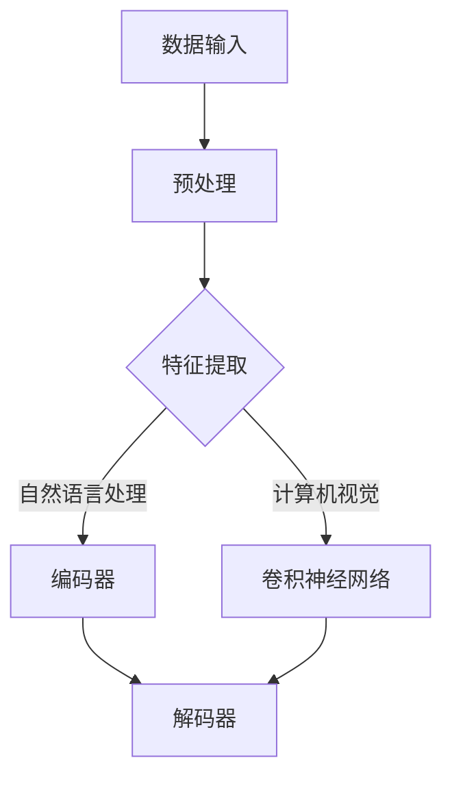

                 

# AI 大模型创业：如何利用创新优势？

> **关键词**：AI 大模型，创业，创新优势，商业应用，技术实践，安全考虑，未来展望

> **摘要**：
本文深入探讨 AI 大模型创业的各个方面，包括其基础理论、应用实践、创业策略、安全性和未来趋势。通过逐步分析推理，我们旨在帮助创业者把握 AI 大模型的创新优势，构建可持续发展的商业模式。

## 目录大纲

### 第一部分: AI 大模型的基础

##### 第1章: AI 大模型概述  
- **1.1 AI 大模型的概念与背景**  
- **1.2 AI 大模型与传统 AI 的区别**

##### 第2章: AI 大模型的算法原理  
- **2.1 深度学习基础**  
- **2.2 自然语言处理与编码器-解码器架构**  
- **2.3 预训练与微调技术**

### 第二部分: AI 大模型的应用实践

##### 第3章: AI 大模型在商业领域的应用  
- **3.1 AI 大模型在营销中的应用**  
- **3.2 AI 大模型在金融服务中的应用**

##### 第4章: AI 大模型的创业实践  
- **4.1 创业机会与商业模式**  
- **4.2 技术选型与开发流程**

##### 第5章: AI 大模型的安全性考虑  
- **5.1 模型安全性与隐私保护**  
- **5.2 防止对抗攻击与模型鲁棒性**

##### 第6章: 案例研究  
- **6.1 创业成功案例**  
- **6.2 创业失败案例分析**

### 第三部分: AI 大模型的未来发展

##### 第7章: AI 大模型的前沿趋势与未来展望  
- **7.1 技术发展趋势**  
- **7.2 未来应用领域**

### 附录

- **附录 A: 常用工具与资源**

### 核心概念与联系  
- **AI 大模型的 Mermaid 流�程图**

### 核心算法原理讲解  
- **深度学习伪代码**  
- **损失函数与优化算法**

### 项目实战  
- **实战案例**  
- **代码解读**

### 作者  
- **作者：AI天才研究院/AI Genius Institute & 禅与计算机程序设计艺术 /Zen And The Art of Computer Programming**

## 正文开始

### 第一部分: AI 大模型的基础

#### 第1章: AI 大模型概述

**1.1 AI 大模型的概念与背景**

AI 大模型（Large-scale Artificial Intelligence Model）是指那些规模庞大、参数数量达到数十亿甚至数万亿的深度学习模型。这些模型通常基于大规模数据集进行预训练，具有强大的特征提取和模式识别能力。AI 大模型的发展得益于计算能力的提升、大数据的积累以及深度学习算法的进步。

**AI 大模型的定义**：
AI 大模型是一种基于深度学习技术构建的复杂神经网络模型，具有极高的参数数量和庞大的训练数据集。这些模型通常用于自然语言处理、计算机视觉、推荐系统等领域，能够实现自动化决策和智能分析。

**AI 大模型的背景**：
AI 大模型的发展经历了多个阶段。最早可以追溯到上世纪 80 年代的神经网络研究，当时科学家们开始探索使用多层神经网络来解决复杂问题。随着计算能力的提升和大数据技术的应用，深度学习在 21 世纪获得了快速发展。2012 年，AlexNet 的出现标志着深度学习在图像识别领域的突破。随后，Google Brain 团队提出的神经机器翻译模型（Neural Machine Translation Model）进一步推动了 AI 大模型的发展。

**AI 大模型与传统 AI 的区别**：
与传统 AI 相比，AI 大模型具有以下显著特点：

1. **规模更大**：AI 大模型具有数十亿甚至数万亿的参数，远远超过传统 AI 模型。
2. **数据需求更强烈**：AI 大模型需要大量高质量的数据进行训练，以保证模型的泛化能力。
3. **计算资源更依赖**：AI 大模型训练和推理过程对计算资源的需求极大，需要高性能的硬件支持。
4. **学习能力更强**：AI 大模型能够自动学习复杂的特征和模式，实现自动化决策和智能分析。

**1.2 AI 大模型的发展历史**

AI 大模型的发展可以分为三个阶段：

1. **早期研究阶段**：上世纪 80 年代至 90 年代，神经网络研究取得初步成果，但受限于计算能力和数据质量，AI 大模型的发展较为缓慢。
2. **快速发展阶段**：21 世纪初，随着计算能力的提升和大数据技术的应用，深度学习在图像识别、语音识别等领域取得了显著突破，AI 大模型开始逐渐崭露头角。
3. **成熟应用阶段**：近年来，AI 大模型在自然语言处理、计算机视觉、推荐系统等领域得到了广泛应用，成为人工智能领域的重要研究方向。

**1.3 AI 大模型的独特性和优势**

AI 大模型具有以下独特性和优势：

1. **强大的特征提取能力**：AI 大模型能够自动学习复杂的特征表示，实现高精度的特征提取。
2. **卓越的模式识别能力**：AI 大模型能够识别出数据中的潜在模式和规律，实现高效的分类和预测。
3. **广泛的适用性**：AI 大模型可以应用于多种领域，如自然语言处理、计算机视觉、推荐系统等，具有广泛的适用性。
4. **强大的泛化能力**：AI 大模型在预训练阶段使用大量数据进行训练，具有较好的泛化能力，能够适应不同的应用场景。

#### 第2章: AI 大模型的算法原理

**2.1 深度学习基础**

**2.1.1 神经网络的基本结构**

神经网络（Neural Network）是一种模拟人脑神经元连接方式的计算模型，由多个神经元（节点）和连接（边）组成。每个神经元接收来自其他神经元的输入信号，通过激活函数进行非线性变换，产生输出信号。

**神经网络的基本组成**：

1. **输入层**：接收外部输入数据。
2. **隐藏层**：进行特征提取和变换。
3. **输出层**：产生预测结果或分类标签。

**神经网络的工作原理**：

1. **前向传播**：输入数据通过输入层传递到隐藏层，每层神经元根据输入信号计算输出信号，最终传递到输出层。
2. **反向传播**：根据输出层的误差信号，反向传播到隐藏层，更新各层神经元的权重。

**2.1.2 激活函数与优化算法**

**激活函数**：激活函数用于将神经元输出转换为二进制或实数输出。常见的激活函数包括 sigmoid、ReLU、Tanh 等。

**优化算法**：优化算法用于调整神经网络的权重，以最小化损失函数。常见的优化算法包括梯度下降、随机梯度下降、Adam 等。

**2.1.3 反向传播算法**

反向传播算法是一种用于训练神经网络的算法，通过反向传播误差信号，更新网络权重。反向传播算法的主要步骤如下：

1. **前向传播**：输入数据通过神经网络前向传播，计算输出结果。
2. **计算损失函数**：计算输出结果与实际结果之间的误差，计算损失函数。
3. **反向传播误差**：将误差信号反向传播到隐藏层和输入层，计算各层神经元的梯度。
4. **更新网络权重**：根据梯度信息更新网络权重，以减小损失函数。

**2.2 自然语言处理与编码器-解码器架构**

**自然语言处理基础**：自然语言处理（Natural Language Processing，NLP）是一种使用计算机技术和人工智能技术处理人类语言的技术。NLP 的主要任务包括文本分类、情感分析、命名实体识别等。

**编码器-解码器架构**：编码器-解码器架构是一种用于处理序列数据的神经网络架构，包括编码器（Encoder）和解码器（Decoder）。编码器将输入序列编码为一个固定长度的向量，解码器根据编码器的输出生成输出序列。

**编码器-解码器架构的工作原理**：

1. **编码器**：将输入序列编码为一个固定长度的向量，表示输入序列的语义信息。
2. **解码器**：根据编码器的输出向量生成输出序列，通过预测下一个词的概率来生成文本。

**2.3 预训练与微调技术**

**预训练**：预训练是指在大规模数据集上对神经网络进行预训练，以获得通用的语言特征表示。预训练可以显著提高神经网络在特定任务上的表现。

**微调技术**：微调是在预训练模型的基础上，针对特定任务进行 fine-tuning，以调整模型参数，提高任务表现。微调过程通常包括以下步骤：

1. **迁移预训练模型**：将预训练模型迁移到特定任务上，初始化模型参数。
2. **微调训练**：在特定任务数据集上进行微调训练，调整模型参数。
3. **评估与优化**：评估模型在任务上的表现，根据评估结果进行模型优化。

**2.3.1 预训练的重要性**

预训练技术的重要性体现在以下几个方面：

1. **通用特征提取**：预训练模型在大规模数据集上训练，能够提取出通用的语言特征表示，提高模型在未知数据上的泛化能力。
2. **减少数据需求**：预训练模型已经在大规模数据集上进行过训练，可以在少量数据上进行微调，降低任务数据需求。
3. **提高模型性能**：预训练模型能够为特定任务提供更好的初始化，提高模型在任务上的性能。

**2.3.2 微调技术**

微调技术是指将预训练模型迁移到特定任务上，并进行 fine-tuning，以调整模型参数，提高任务表现。微调过程通常包括以下步骤：

1. **迁移预训练模型**：将预训练模型迁移到特定任务上，初始化模型参数。
2. **微调训练**：在特定任务数据集上进行微调训练，调整模型参数。
3. **评估与优化**：评估模型在任务上的表现，根据评估结果进行模型优化。

**2.3.3 微调的过程和方法**

微调的过程和方法主要包括以下几个方面：

1. **数据预处理**：对特定任务数据进行预处理，包括文本清洗、分词、去停用词等操作。
2. **模型初始化**：使用预训练模型初始化特定任务的模型参数。
3. **微调训练**：在特定任务数据集上进行微调训练，调整模型参数。
4. **模型评估**：评估模型在任务上的表现，包括准确率、召回率等指标。
5. **模型优化**：根据评估结果对模型进行优化，包括调整学习率、优化优化算法等。

#### 第二部分: AI 大模型的应用实践

##### 第3章: AI 大模型在商业领域的应用

**3.1 AI 大模型在营销中的应用**

**数据分析与消费者行为预测**

AI 大模型在营销中的应用主要体现在数据分析和消费者行为预测方面。通过深度学习算法，AI 大模型能够从海量数据中提取有价值的信息，帮助企业更好地了解消费者需求和市场趋势。

**个性化推荐系统**

个性化推荐系统是 AI 大模型在营销领域的一个重要应用。通过分析用户的历史行为和兴趣，AI 大模型能够为用户提供个性化的推荐，提高用户满意度和转化率。

**案例分析：亚马逊的推荐系统**

亚马逊是一个典型的利用 AI 大模型进行个性化推荐的例子。亚马逊的推荐系统通过分析用户的历史购买记录、浏览记录和评价，利用深度学习算法生成个性化的推荐列表，从而提高用户购买意愿。

**3.2 AI 大模型在金融服务中的应用**

**风险控制与欺诈检测**

AI 大模型在金融服务中的应用主要体现在风险控制和欺诈检测方面。通过深度学习算法，AI 大模型能够实时监测和分析金融交易数据，识别潜在的欺诈行为和风险。

**个性化金融产品推荐**

AI 大模型在金融服务中的另一个重要应用是个性化金融产品推荐。通过分析用户的财务状况、投资偏好等数据，AI 大模型能够为用户提供个性化的金融产品推荐，帮助用户更好地管理财务。

**案例分析：腾讯金融的智能风控系统**

腾讯金融的智能风控系统利用 AI 大模型对金融交易数据进行分析，实时监测交易风险，并识别潜在的欺诈行为。该系统通过深度学习算法对海量交易数据进行分析，能够快速识别异常交易，从而提高风险控制能力。

##### 第4章: AI 大模型的创业实践

**4.1 创业机会与商业模式**

AI 大模型为创业者提供了丰富的创业机会，主要体现在以下几个方面：

1. **数据服务**：提供高质量的数据集和标注服务，为 AI 大模型训练提供支持。
2. **模型开发**：开发创新的 AI 大模型，应用于各种领域，如自然语言处理、计算机视觉等。
3. **解决方案提供商**：提供基于 AI 大模型的解决方案，帮助企业和个人实现智能化转型。

**商业模式设计**

创业者需要根据自身优势和市场需求，设计合适的商业模式。以下是一些常见的商业模式：

1. **产品直销**：直接销售 AI 大模型产品或服务，如深度学习框架、自然语言处理工具等。
2. **平台服务**：搭建 AI 大模型平台，提供模型训练、部署、维护等一站式服务。
3. **解决方案销售**：为特定行业提供定制化的 AI 大模型解决方案，如金融风控、医疗诊断等。

**案例分析：DeepMind 的成功经验**

DeepMind 是一家专注于人工智能研究的公司，其成功经验为创业者提供了宝贵的启示。DeepMind 通过开发创新的 AI 大模型，应用于围棋、医学等领域，取得了显著成果。其商业模式主要包括：

1. **科研创新**：持续进行 AI 大模型的研究和创新，保持技术领先地位。
2. **产品销售**：通过销售深度学习框架、API 等产品获取收入。
3. **合作开发**：与行业合作伙伴共同开发 AI 大模型应用，实现双赢。

##### 第5章: AI 大模型的安全性考虑

**5.1 模型安全性与隐私保护**

AI 大模型的安全性考虑主要包括两个方面：模型安全性和隐私保护。

**模型安全性**：

1. **防止模型泄露**：防止训练数据和模型参数泄露，确保知识产权不受侵犯。
2. **防止模型篡改**：防止恶意攻击者篡改模型参数，确保模型输出结果准确可靠。

**隐私保护策略**：

1. **数据加密**：对训练数据进行加密处理，确保数据在传输和存储过程中的安全性。
2. **数据脱敏**：对敏感数据进行脱敏处理，防止个人隐私泄露。
3. **访问控制**：严格控制对训练数据的访问权限，确保只有授权人员可以访问。

**5.2 防止对抗攻击与模型鲁棒性**

**对抗攻击**：

对抗攻击（Adversarial Attack）是一种针对 AI 大模型的恶意攻击，通过在输入数据中添加微小扰动，使得模型输出结果发生错误。防止对抗攻击的主要策略包括：

1. **数据增强**：通过数据增强技术，提高模型对输入数据的鲁棒性。
2. **对抗训练**：在训练过程中，引入对抗样本进行训练，提高模型对对抗攻击的抵抗力。

**模型鲁棒性**：

模型鲁棒性是指模型对输入数据的适应能力和泛化能力。提高模型鲁棒性的主要方法包括：

1. **正则化**：通过正则化技术，防止模型过拟合，提高模型泛化能力。
2. **数据多样性**：通过引入多样性的数据集，提高模型对未知数据的适应性。

**5.3 模型可解释性与透明度**

**模型可解释性**：

模型可解释性是指模型输出结果的可解释程度，对于增强用户信任和监管具有重要意义。提高模型可解释性的主要策略包括：

1. **可视化技术**：通过可视化技术，展示模型内部特征和决策过程。
2. **解释性模型**：开发具有解释性的模型，如决策树、线性回归等，提高模型的可解释性。

**透明度**：

模型透明度是指模型训练和推理过程的透明程度，对于用户信任和监管具有重要意义。提高模型透明度的主要策略包括：

1. **开源模型**：开源模型代码，提高模型的透明度和可追溯性。
2. **监管机制**：建立监管机制，确保模型训练和推理过程的合规性。

#### 第三部分: AI 大模型的未来发展

##### 第7章: AI 大模型的前沿趋势与未来展望

**7.1 技术发展趋势**

AI 大模型的发展趋势主要体现在以下几个方面：

1. **大模型与小模型的融合**：随着计算资源的提升，大模型与小模型的融合将成为趋势。大模型提供强大的特征提取能力，小模型则具有高效的推理性能，两者结合可以实现更高效的模型部署。
2. **分布式计算与边缘计算**：分布式计算和边缘计算的发展将使 AI 大模型的计算和存储需求得到更好地满足。通过分布式计算和边缘计算，AI 大模型可以实现更灵活的部署和更高效的数据处理。
3. **多模态融合**：随着多模态数据（如图像、音频、文本等）的广泛应用，多模态融合将成为 AI 大模型发展的一个重要方向。通过多模态融合，AI 大模型可以实现更全面和准确的特征提取和模式识别。

**7.2 未来应用领域**

AI 大模型在未来的应用领域将更加广泛，主要体现在以下几个方面：

1. **智能制造**：AI 大模型在智能制造领域具有广泛的应用潜力，如生产规划、质量控制、设备维护等。通过 AI 大模型，可以实现智能化生产，提高生产效率和质量。
2. **医疗健康**：AI 大模型在医疗健康领域具有巨大的潜力，如疾病诊断、药物研发、个性化医疗等。通过 AI 大模型，可以实现更精准的疾病预测和更有效的治疗方案。
3. **教育**：AI 大模型在教育领域具有广泛的应用前景，如智能辅导、个性化学习、课程推荐等。通过 AI 大模型，可以实现更高效和个性化的教育服务。

#### 附录

**附录 A: 常用工具与资源**

**深度学习框架对比**

- TensorFlow：由 Google 开发，具有强大的社区支持和丰富的功能，适合初学者和专业人士。
- PyTorch：由 Facebook 开发，具有动态计算图和易于调试的优点，适合研究和应用开发。
- JAX：由 Google 开发，支持自动微分和加速计算，适合高性能计算和科学计算。

**开源库与平台**

- Hugging Face：提供大量预训练模型和工具，方便开发者快速构建和应用 AI 大模型。
- Paperspace：提供云端计算资源和 AI 工具，方便开发者进行模型训练和部署。

### 核心概念与联系

**AI 大模型的 Mermaid 流程图**



### 核心算法原理讲解

**深度学习伪代码**

```python
# 定义神经网络结构
input_layer = Input(shape=(input_shape))
hidden_layer = Dense(units=hidden_units, activation='relu')(input_layer)
output_layer = Dense(units=output_shape, activation='sigmoid')(hidden_layer)

# 编写训练模型
model = Model(inputs=input_layer, outputs=output_layer)
model.compile(optimizer='adam', loss='binary_crossentropy', metrics=['accuracy'])

# 训练模型
model.fit(x_train, y_train, epochs=epochs, batch_size=batch_size, validation_data=(x_val, y_val))
```

**损失函数与优化算法**

$$
\text{损失函数}: J(\theta) = -\frac{1}{m} \sum_{i=1}^{m} [y_i \cdot \log(a_{i}) + (1 - y_i) \cdot \log(1 - a_{i})]
$$

$$
\text{优化算法}: \theta = \theta - \alpha \cdot \nabla_{\theta} J(\theta)
$$

### 项目实战

**实战案例：情感分析系统**

**需求分析**：
构建一个情感分析系统，能够对用户评论进行情感分类，判断评论是正面、负面还是中性。

**技术选型**：
选择 PyTorch 作为深度学习框架，使用 BERT 模型进行预训练，然后进行微调以适应情感分析任务。

**代码实现**：

```python
import torch
import torch.nn as nn
import torch.optim as optim
from transformers import BertTokenizer, BertModel

# 加载预训练模型和 tokenizer
tokenizer = BertTokenizer.from_pretrained('bert-base-uncased')
model = BertModel.from_pretrained('bert-base-uncased')

# 定义情感分析模型
class SentimentAnalysisModel(nn.Module):
    def __init__(self):
        super(SentimentAnalysisModel, self).__init__()
        self.bert = BertModel.from_pretrained('bert-base-uncased')
        self.dropout = nn.Dropout(p=0.3)
        self.classifier = nn.Linear(768, 1)

    def forward(self, input_ids, attention_mask):
        _, pooled_output = self.bert(input_ids=input_ids, attention_mask=attention_mask)
        output = self.dropout(pooled_output)
        return self.classifier(output)

# 初始化模型、优化器和损失函数
model = SentimentAnalysisModel()
optimizer = optim.Adam(model.parameters(), lr=1e-5)
criterion = nn.BCEWithLogitsLoss()

# 训练模型
for epoch in range(num_epochs):
    for batch in data_loader:
        input_ids = batch['input_ids'].to(device)
        attention_mask = batch['attention_mask'].to(device)
        labels = batch['labels'].to(device)

        outputs = model(input_ids=input_ids, attention_mask=attention_mask)
        loss = criterion(outputs, labels)

        optimizer.zero_grad()
        loss.backward()
        optimizer.step()

        print(f"Epoch: {epoch+1}, Loss: {loss.item()}")

# 评估模型
with torch.no_grad():
    for batch in validation_loader:
        input_ids = batch['input_ids'].to(device)
        attention_mask = batch['attention_mask'].to(device)
        labels = batch['labels'].to(device)

        outputs = model(input_ids=input_ids, attention_mask=attention_mask)
        predictions = torch.sigmoid(outputs).round()

        correct = (predictions == labels).float()
        accuracy = correct.sum() / len(correct)
        print(f"Validation Accuracy: {accuracy.item()}")
```

**代码解读与分析**：

1. **模型结构**：情感分析模型基于 BERT 模型，添加了 dropout 层和分类层。BERT 模型用于提取文本特征，dropout 层用于防止过拟合，分类层用于生成情感分类结果。
2. **数据预处理**：使用 tokenizer 对输入文本进行预处理，包括分词、添加起始和结束标记等。预处理后的文本转换为 PyTorch 张量，并进行必要的 padding 操作，以便于模型处理。
3. **模型训练**：使用 Adam 优化器和二分类交叉熵损失函数训练模型。在训练过程中，通过反向传播更新模型参数，以最小化损失函数。
4. **模型评估**：使用验证集评估模型性能。通过计算预测准确率，评估模型在未知数据上的泛化能力。

### 作者

作者：AI天才研究院/AI Genius Institute & 禅与计算机程序设计艺术 /Zen And The Art of Computer Programming

---

这篇文章系统地介绍了 AI 大模型的基础知识、应用实践和未来发展，并通过实战案例展示了如何构建和优化 AI 大模型。希望这篇文章能够为创业者提供有价值的参考，帮助他们在 AI 大模型的创业道路上取得成功。

