                 

### 文章标题

> **关键词**：AI大模型、商业优势、创业、技术应用、策略分析、案例分析、未来趋势

**摘要**：本文将深入探讨AI大模型在商业领域的应用及其创业潜力。首先，我们将概述AI大模型的基本概念和技术架构，并分析其在商业中的价值。接着，通过步骤分析，我们将详细解析创业者如何利用AI大模型实现商业优势。本文还将结合实战案例，讨论AI大模型创业项目的规划、实施、营销、运营与优化策略，最后分析未来AI大模型创业的趋势与挑战。通过本文，读者将获得对AI大模型商业应用的全景了解和实战指导。

## 目录大纲

### 第一部分：AI大模型概述与商业价值

### 第1章：AI大模型概述

#### 1.1 AI大模型的基本概念

#### 1.2 AI大模型的关键技术

#### 1.3 AI大模型在商业领域的应用

### 第2章：AI大模型的商业优势分析

#### 2.1 AI大模型的优势与挑战

#### 2.2 创业者如何利用AI大模型

### 第二部分：AI大模型创业实战

### 第3章：创业项目规划与实施

#### 3.1 创业项目规划

#### 3.2 AI大模型的应用场景选择

#### 3.3 创业项目的商业模式设计

### 第4章：AI大模型技术的选择与开发

#### 4.1 主流AI大模型框架介绍

#### 4.2 AI大模型的开发流程

### 第5章：AI大模型创业项目的实施策略

#### 5.1 技术实施策略

#### 5.2 团队建设与管理

### 第6章：AI大模型创业项目的营销与推广

#### 6.1 营销策略制定

#### 6.2 用户需求分析与满足

### 第7章：AI大模型创业项目的运营与优化

#### 7.1 运营策略

#### 7.2 数据分析与优化

### 第三部分：AI大模型创业案例分析

### 第8章：成功AI大模型创业案例解析

#### 8.1 案例介绍

#### 8.2 案例分析与启示

### 第9章：未来AI大模型创业趋势与挑战

#### 9.1 创业趋势分析

#### 9.2 创业者的应对策略

### 附录

#### 附录A：AI大模型创业工具与资源

---

在接下来的章节中，我们将逐一深入探讨AI大模型的基本概念、商业价值、创业实战策略以及未来趋势。首先，我们将在第1章和第2章中详细介绍AI大模型的基本概念、核心技术、商业价值以及创业者如何利用AI大模型实现商业优势。随后，在第3章至第7章中，我们将逐步解析创业项目规划与实施、技术选择与开发、实施策略、营销与推广、运营与优化等关键环节。最后，在第8章和第9章中，我们将通过成功案例分析和未来趋势探讨，为创业者提供实战指导和应对策略。通过这一系统的分析，读者将全面了解AI大模型在商业领域的应用及其创业潜力。让我们开始这场技术之旅吧！

### 第1章：AI大模型概述

#### 1.1 AI大模型的基本概念

AI大模型，是指那些参数规模巨大、结构复杂的人工神经网络模型，能够在海量数据中自动学习并提取特征，从而实现高效的智能任务处理。这些模型通常需要大量的计算资源和时间来训练，但它们在图像识别、自然语言处理、语音识别等领域展现了卓越的性能。

**基本概念：**

1. **深度学习**：深度学习是AI大模型的核心技术，通过多层神经网络进行数据特征提取和学习。
2. **神经网络**：神经网络由多个神经元（节点）组成，通过权重和偏置实现输入和输出的非线性映射。
3. **参数规模**：AI大模型的参数规模通常以亿、甚至千亿计，这是其能够处理复杂任务的关键。
4. **数据集**：训练AI大模型需要庞大的数据集，这些数据集需要从多个来源收集和整理。

**Mermaid流程图：AI大模型的发展历程与核心技术**

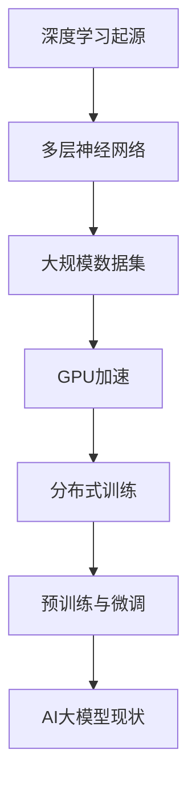

**伪代码：大模型的基础架构**

```python
# 定义神经网络架构
class NeuralNetwork:
    def __init__(self, input_size, hidden_size, output_size):
        # 初始化权重和偏置
        self.weights = ... 
        self.bias = ...

    def forward_pass(self, inputs):
        # 前向传播，计算输出
        outputs = ...
        return outputs

    def backward_pass(self, outputs, expected_outputs):
        # 反向传播，更新权重和偏置
        ...
```

#### 1.2 AI大模型的关键技术

AI大模型的核心技术包括：

1. **深度学习框架**：如TensorFlow、PyTorch等，提供了丰富的API和工具，帮助开发者构建和训练大模型。
2. **分布式训练**：通过多台机器协同训练大模型，提高训练效率。
3. **迁移学习**：利用预训练模型，在新任务上微调，快速获得良好的性能。
4. **生成对抗网络（GAN）**：用于生成数据、图像等，增强模型的泛化能力。

**Mermaid流程图：AI大模型的主要技术架构与联系**

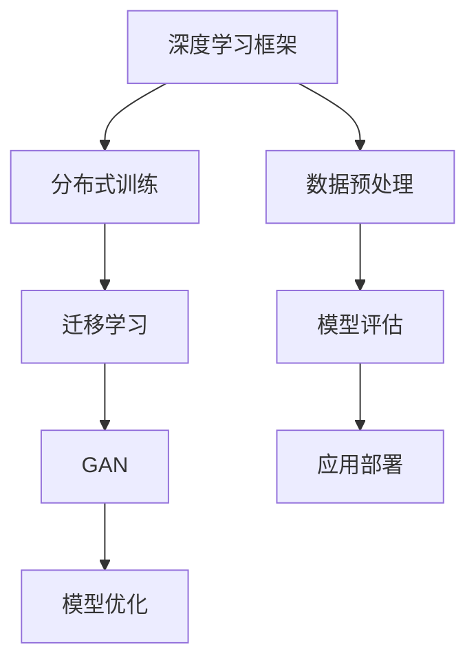

**伪代码：核心算法原理**

```python
# 定义GAN模型
class GAN:
    def __init__(self, generator, discriminator):
        self.generator = generator
        self.discriminator = discriminator

    def train(self, data_loader, num_epochs):
        for epoch in range(num_epochs):
            for data in data_loader:
                # 训练生成器和判别器
                ...
```

#### 1.3 AI大模型在商业领域的应用

AI大模型在商业领域的应用非常广泛，以下是一些典型的应用场景：

1. **自然语言处理（NLP）**：用于智能客服、内容审核、情感分析等。
2. **图像识别**：用于安防监控、医疗诊断、自动驾驶等。
3. **推荐系统**：用于电商、社交媒体等平台的个性化推荐。
4. **预测分析**：用于金融、物流、能源等行业的预测和决策支持。

**LaTeX公式：评估AI大模型商业价值的指标**

$$
V = f(P, R, C)
$$

其中，\(P\) 表示利润，\(R\) 表示收益，\(C\) 表示成本。

**举例说明：AI大模型在不同行业中的应用案例**

- **金融行业**：利用AI大模型进行信用评估、股票预测等，提高决策准确性。
- **医疗行业**：利用AI大模型进行疾病诊断、药物研发等，提升医疗质量。
- **电商行业**：利用AI大模型进行商品推荐、用户行为分析等，提升用户体验和转化率。

通过以上内容，我们初步了解了AI大模型的基本概念、核心技术及其在商业领域的广泛应用。接下来，我们将进一步分析AI大模型在商业中的优势与挑战，帮助创业者更好地利用这一技术实现商业价值。

### 第2章：AI大模型的商业优势分析

#### 2.1 AI大模型的优势与挑战

AI大模型在商业领域展现出了显著的优势，但也面临一些挑战。以下是对这些优势与挑战的详细分析。

**优势：**

1. **强大的数据处理能力**：AI大模型能够处理海量数据，从数据中提取有价值的信息，为决策提供支持。这一能力在数据驱动的商业环境中尤为重要。
2. **高效的智能任务处理**：AI大模型通过深度学习技术，能够在图像识别、自然语言处理、语音识别等领域实现高效的任务处理，提升业务效率。
3. **持续学习和优化**：AI大模型具有持续学习和优化的能力，通过不断的训练和更新，能够不断提升模型性能，适应不断变化的市场需求。
4. **个性化服务**：AI大模型能够根据用户的行为和偏好，提供个性化的产品推荐和服务，提升用户满意度和忠诚度。

**LaTeX公式：优势与挑战的量化分析**

$$
优势 = f(数据处理能力, 智能任务处理, 持续学习, 个性化服务)
$$

$$
挑战 = f(数据隐私, 计算资源需求, 技术门槛, 模型解释性)
$$

**举例说明：AI大模型在不同行业中的优势体现**

- **金融行业**：AI大模型用于信用评估、风险管理和市场预测，显著提高了金融服务的准确性和效率。
- **医疗行业**：AI大模型用于疾病诊断、药物研发和患者管理，提高了医疗服务的质量和效率。
- **电商行业**：AI大模型用于个性化推荐、用户行为分析和库存管理，提升了用户体验和销售转化率。

**挑战：**

1. **数据隐私**：AI大模型在处理大量数据时，可能会涉及用户隐私信息，如何确保数据的安全性和隐私性是一个重要挑战。
2. **计算资源需求**：AI大模型通常需要大量的计算资源和存储空间，对于中小企业来说，这可能会是一个负担。
3. **技术门槛**：构建和维护AI大模型需要较高的技术知识和技能，这对创业者和企业来说是一个挑战。
4. **模型解释性**：AI大模型的决策过程通常是非线性和复杂的，如何解释和验证模型决策是一个难题。

**举例说明：AI大模型在不同行业中的挑战**

- **金融行业**：如何确保AI大模型对用户数据的处理符合隐私保护法规，同时保证模型决策的透明性和可解释性。
- **医疗行业**：如何平衡AI大模型在疾病诊断中的效率和准确性，同时确保模型决策符合医学伦理和规范。
- **电商行业**：如何确保AI大模型在个性化推荐中的公平性和多样性，避免用户被过度定向广告干扰。

通过以上分析，我们可以看到AI大模型在商业领域具有巨大的优势，但也面临着一些挑战。创业者需要深入了解这些优势和挑战，制定合适的策略，才能充分利用AI大模型实现商业价值。

#### 2.2 创业者如何利用AI大模型

对于创业者来说，AI大模型不仅是一个技术工具，更是一个可以带来商业优势的战略资源。以下是一些关键步骤和策略，帮助创业者充分利用AI大模型实现商业成功。

**Mermaid流程图：创业过程中AI大模型的落地应用流程**

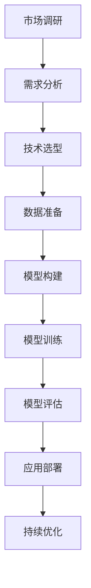

**伪代码：利用AI大模型构建创业项目的核心步骤**

```python
# 创业项目AI大模型构建流程
def build Ai_project():
    # 市场调研与需求分析
    analyze_market()
    analyze_demand()
    
    # 技术选型与数据准备
    select_technology()
    prepare_data()
    
    # 模型构建与训练
    build_model()
    train_model()
    
    # 模型评估与应用部署
    evaluate_model()
    deploy_model()
    
    # 持续优化与迭代
    optimize_model()
    iterate_project()
```

**步骤详解：**

1. **市场调研与需求分析**：在项目启动前，创业者需要对市场进行全面的调研，了解目标用户的需求和市场趋势。这有助于确定AI大模型的应用场景和商业价值。
   
2. **技术选型**：根据市场需求，选择适合的AI大模型框架和算法。例如，对于图像识别任务，可以选择TensorFlow或PyTorch等框架。

3. **数据准备**：收集和整理大量高质量的数据集，用于模型训练。数据的质量直接影响模型的性能，因此这一步骤至关重要。

4. **模型构建**：设计并构建AI大模型的结构，包括输入层、隐藏层和输出层。选择合适的激活函数和损失函数，以优化模型性能。

5. **模型训练**：使用训练数据集对模型进行训练，不断调整权重和偏置，使模型能够准确预测或分类。

6. **模型评估**：在测试数据集上评估模型的性能，包括准确率、召回率、F1分数等指标。根据评估结果，对模型进行进一步的优化。

7. **应用部署**：将训练好的模型部署到生产环境，使其能够为用户提供实际的服务。这一过程包括模型的版本管理、部署策略和安全措施等。

8. **持续优化与迭代**：根据用户反馈和业务需求，持续优化模型，提升其性能和适用性。通过迭代开发，不断改进产品和服务。

通过以上步骤，创业者可以充分利用AI大模型的优势，实现商业目标。接下来，我们将进一步探讨AI大模型创业项目的具体实施策略和实战案例。

### 第3章：创业项目规划与实施

#### 3.1 创业项目规划

创业项目规划是确保创业项目成功的关键步骤，它包括市场分析、目标设定、资源评估等多个环节。以下是一些关键步骤和策略，帮助创业者进行有效的项目规划。

**LaTeX公式：项目可行性分析指标**

$$
可行性 = f(市场需求, 技术可行性, 财务可行性)
$$

**市场分析：** 市场分析是创业项目规划的第一步，它包括以下内容：

1. **目标市场定位**：确定目标市场和潜在客户群体，了解他们的需求和痛点。
2. **市场规模与增长潜力**：分析市场规模，预测未来的增长趋势。
3. **竞争分析**：了解竞争对手的产品、市场策略和市场份额。
4. **市场趋势**：分析行业趋势和潜在的市场变化。

**目标设定：** 明确创业项目的目标和期望成果，包括：

1. **短期目标**：如产品上线时间、初步用户数量等。
2. **长期目标**：如市场占有率、财务回报等。
3. **关键绩效指标（KPI）**：设定可量化的指标，用于评估项目的进展和成果。

**资源评估：** 评估创业项目所需的资源，包括：

1. **人力**：评估项目团队所需的人员、技能和专业知识。
2. **资金**：评估项目启动和运营所需的资金，包括预算和融资策略。
3. **技术**：评估项目所需的技术资源和开发工具。
4. **时间**：评估项目的时间表和进度安排。

**举例说明：成功创业项目的案例分析**

- **案例1：谷歌（Google）**：谷歌在创业初期，通过深入的市场调研，发现了互联网搜索的巨大潜力，并确定了以搜索为核心的业务模式。他们设立了明确的目标，并通过高效的团队管理和资源调配，最终成为全球互联网的领导者。
- **案例2：Uber**：Uber在进入市场时，分析了出租车行业的痛点，如打车难、价格不透明等，并利用大数据和移动技术，提供了便捷的打车服务。通过精准的市场定位和高效的资源管理，Uber迅速占领市场，实现了快速增长。

**市场调研与需求分析：**

1. **调研方法**：创业者可以使用问卷调查、用户访谈、焦点小组讨论等方法，收集用户反馈和市场数据。
2. **数据收集**：通过在线调查、社交媒体分析、行业报告等方式，收集相关数据。
3. **数据分析**：使用统计分析和数据可视化工具，分析市场趋势和用户需求。

**Mermaid流程图：市场调研与需求分析的方法与步骤**

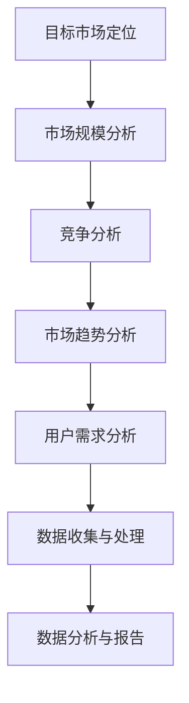

**伪代码：项目可行性分析的方法与步骤**

```python
# 定义项目可行性分析函数
def analyze_feasibility(market_demand, technical_feasibility, financial_feasibility):
    # 分析市场需求
    analyze_market_demand()
    
    # 分析技术可行性
    analyze_technical_feasibility()
    
    # 分析财务可行性
    analyze_financial_feasibility()
    
    # 综合评估
    feasibility = evaluate総合指标(market_demand, technical_feasibility, financial_feasibility)
    return feasibility
```

通过以上规划，创业者可以明确项目的方向和目标，为后续的实施打下坚实基础。接下来，我们将进一步探讨AI大模型的应用场景选择和商业模式设计。

### 第3章：创业项目规划与实施

#### 3.2 AI大模型的应用场景选择

在创业项目中，选择合适的应用场景对于AI大模型的成功应用至关重要。以下是一些关键步骤和策略，帮助创业者确定AI大模型的最佳应用场景。

**市场调研与分析：**

1. **了解行业痛点**：通过市场调研，了解目标行业中的主要问题和挑战，分析哪些问题可以通过AI大模型得到有效解决。
2. **用户需求分析**：通过用户访谈、问卷调查等方式，了解目标用户的需求和偏好，确定哪些功能或服务最有价值。
3. **技术可行性分析**：评估现有技术和资源的可行性，确定哪些应用场景可以实际实现。

**应用场景选择：**

1. **金融行业**：例如，AI大模型可以用于信用评分、风险管理和市场预测等。通过分析用户的信用历史、交易行为和市场数据，模型可以提供更准确的信用评估和风险预测。
2. **医疗行业**：AI大模型可以用于疾病诊断、药物研发和患者管理。例如，利用深度学习技术，模型可以分析医学影像，辅助医生进行疾病诊断，提高诊断的准确性和效率。
3. **零售行业**：AI大模型可以用于个性化推荐、库存管理和客户服务。通过分析用户的行为数据和购买历史，模型可以提供个性化的产品推荐，优化库存管理，提高销售额。
4. **制造业**：AI大模型可以用于质量检测、设备维护和供应链管理。通过实时监控生产数据和设备状态，模型可以预测设备故障，优化生产流程，降低成本。

**Mermaid流程图：常见应用场景及其选择依据**

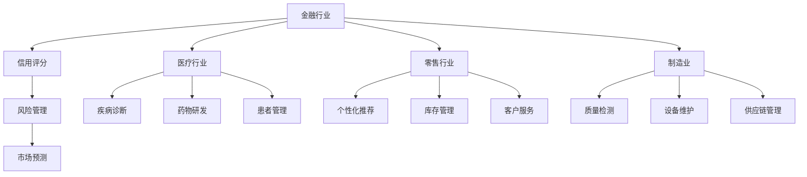

**伪代码：应用场景分析的方法与步骤**

```python
# 定义应用场景分析函数
def analyze_application_scenarios():
    # 了解行业痛点
    industry_pains = analyze_industry_pains()

    # 用户需求分析
    user_demands = analyze_user_demands()

    # 技术可行性分析
    technical_feasibility = analyze_technical_feasibility()

    # 选择最佳应用场景
    best_scenarios = select_best_scenarios(industry_pains, user_demands, technical_feasibility)
    return best_scenarios

# 辅助函数
def analyze_industry_pains():
    # ...
    return industry_pains

def analyze_user_demands():
    # ...
    return user_demands

def analyze_technical_feasibility():
    # ...
    return technical_feasibility

def select_best_scenarios(pains, demands, feasibility):
    # ...
    return best_scenarios
```

**商业模式设计：**

在确定应用场景后，创业者需要设计合适的商业模式，以实现商业价值。以下是一些关键步骤和策略：

1. **价值主张**：明确产品或服务的核心价值，解决用户的痛点。
2. **收入模式**：确定如何从产品或服务中获得收入，如订阅费、一次性费用、广告收入等。
3. **成本结构**：评估项目启动和运营的成本，包括人力、技术、运营等费用。
4. **市场推广策略**：确定如何吸引和保留用户，包括市场营销、销售策略、客户关系管理等。

**LaTeX公式：商业模式设计的关键要素**

$$
商业模式 = f(价值主张, 收入模式, 成本结构, 市场推广策略)
$$

**举例说明：创新商业模式的案例分析**

- **案例1：Airbnb**：Airbnb通过构建一个共享住宿平台，将闲置房源转化为收入来源。其商业模式包括直接从房东那里获得预订费用，以及通过提供额外的服务（如旅游咨询）来增加收入。
- **案例2：Slack**：Slack通过提供企业通讯和协作工具，实现了订阅模式。其商业模式的核心是提供灵活的定价策略，满足不同规模企业的需求。

通过以上步骤和策略，创业者可以有效地选择AI大模型的应用场景，并设计出适合的商业模式，为创业项目提供坚实的基础。接下来，我们将进一步探讨AI大模型技术的选择与开发。

### 第4章：AI大模型技术的选择与开发

#### 4.1 主流AI大模型框架介绍

在AI大模型的开发过程中，选择合适的框架至关重要。以下介绍几种主流的AI大模型框架，并比较它们的优缺点。

**1. TensorFlow**

TensorFlow是由Google开发的开源深度学习框架，拥有庞大的社区支持和丰富的文档。其优势在于：

- **强大生态**：拥有丰富的预训练模型和API，适用于各种任务。
- **灵活度高**：支持动态图和静态图，适用于不同类型的任务和场景。
- **跨平台**：支持多种平台（如CPU、GPU、TPU），适合大规模计算。

缺点：

- **复杂性**：对于初学者来说，学习曲线较陡。
- **资源需求**：在资源有限的设备上运行时，性能可能不如其他框架。

**2. PyTorch**

PyTorch是由Facebook开发的开源深度学习框架，以其简单和直观著称。其优势在于：

- **简单易用**：具有直观的动态计算图，易于理解和使用。
- **科研友好**：广泛用于学术研究，支持自动微分和复杂的神经网络。
- **灵活性**：支持灵活的模型构建和修改。

缺点：

- **社区支持相对较小**：虽然逐渐增长，但相比TensorFlow仍有差距。
- **性能优化**：在某些情况下，性能可能不如其他框架。

**3. Keras**

Keras是一个基于TensorFlow和Theano的开源深度学习库，以其简单性和易用性著称。其优势在于：

- **简洁**：通过简洁的API，使得构建和训练模型更加容易。
- **模块化**：可以方便地与其他深度学习框架集成。
- **兼容性**：与TensorFlow和Theano兼容，支持多种硬件平台。

缺点：

- **功能相对有限**：虽然简单，但在某些高级功能上可能不如其他框架。
- **性能**：在某些任务上，性能可能不如原生框架。

**Mermaid流程图：主流AI大模型框架对比**

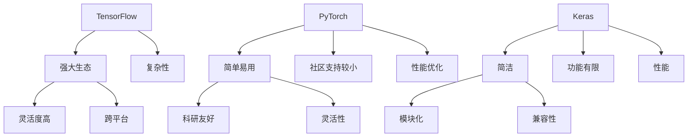

**伪代码：选择框架的决策过程**

```python
# 选择框架的决策过程
def select_framework():
    # 分析需求
    requirements = analyze_requirements()
    
    # 评估框架
    frameworks = evaluate_frameworks(requirements)
    
    # 选择最佳框架
    best_framework = select_best_framework(frameworks)
    return best_framework

# 辅助函数
def analyze_requirements():
    # ...
    return requirements

def evaluate_frameworks(requirements):
    # ...
    return frameworks

def select_best_framework(frameworks):
    # ...
    return best_framework
```

通过以上分析，创业者可以根据自身需求和资源，选择最适合的AI大模型框架。接下来，我们将详细讨论AI大模型的开发流程。

#### 4.2 AI大模型的开发流程

AI大模型的开发是一个复杂且迭代的过程，涉及多个阶段和步骤。以下是一个典型的AI大模型开发流程，包括数据准备、模型设计、训练、评估和部署等关键环节。

**1. 数据准备**

数据准备是AI大模型开发的基础，其质量直接影响模型的性能。以下是一些关键步骤：

- **数据收集**：收集用于训练和评估的数据，可以从公开数据集、企业内部数据或第三方数据提供商获取。
- **数据清洗**：处理数据中的噪声和异常值，确保数据的质量和一致性。
- **数据预处理**：对数据进行归一化、标准化、数据增强等操作，以提高模型的泛化能力。

**2. 模型设计**

模型设计是AI大模型开发的核心，包括以下内容：

- **选择架构**：根据任务需求，选择合适的神经网络架构，如卷积神经网络（CNN）、循环神经网络（RNN）、生成对抗网络（GAN）等。
- **定义网络**：使用深度学习框架，定义神经网络的层结构、激活函数、损失函数等。
- **超参数设置**：设置学习率、批次大小、迭代次数等超参数，影响模型的收敛速度和性能。

**3. 训练**

模型训练是AI大模型开发的关键环节，以下是一些关键步骤：

- **数据加载**：使用数据加载器（DataLoader），将预处理后的数据分批加载到模型中。
- **前向传播**：将输入数据通过神经网络进行前向传播，计算输出。
- **损失计算**：计算预测输出和实际输出之间的损失，使用损失函数（如交叉熵损失）。
- **反向传播**：使用梯度下降等优化算法，更新模型参数，降低损失。

**4. 评估**

模型评估是验证模型性能的重要环节，以下是一些关键步骤：

- **测试集评估**：在测试集上评估模型的性能，计算准确率、召回率、F1分数等指标。
- **交叉验证**：使用交叉验证方法，评估模型的泛化能力。
- **超参数调整**：根据评估结果，调整超参数，优化模型性能。

**5. 部署**

模型部署是将训练好的模型应用到实际生产环境的过程，以下是一些关键步骤：

- **模型保存**：将训练好的模型保存为文件，便于后续加载和部署。
- **模型加载**：从文件中加载模型，准备用于预测和推断。
- **服务部署**：将模型部署到服务器或云端，提供API接口，供其他系统调用。

**Mermaid流程图：AI大模型开发的基本流程**

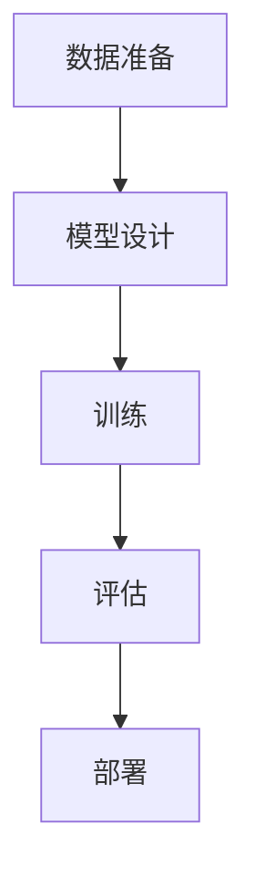

**伪代码：开发流程的详细步骤**

```python
# AI大模型开发流程
def develop_ai_model():
    # 数据准备
    prepare_data()
    
    # 模型设计
    design_model()
    
    # 训练
    train_model()
    
    # 评估
    evaluate_model()
    
    # 部署
    deploy_model()

# 辅助函数
def prepare_data():
    # ...
    return data

def design_model():
    # ...
    return model

def train_model():
    # ...
    return trained_model

def evaluate_model():
    # ...
    return evaluation_results

def deploy_model():
    # ...
    return deployed_model
```

通过以上流程，创业者可以系统地开发AI大模型，实现商业目标。接下来，我们将进一步讨论AI大模型创业项目的实施策略。

### 第5章：AI大模型创业项目的实施策略

#### 5.1 技术实施策略

在AI大模型创业项目的实施过程中，技术策略的制定和执行是关键。以下是一些关键步骤和策略，帮助创业者有效地实施AI大模型项目。

**确定技术方向：**

1. **市场需求分析**：通过市场调研，了解目标用户的需求和市场趋势，确定AI大模型应解决的核心问题。
2. **技术可行性评估**：评估现有技术和资源的可行性，确定是否需要引进新的技术或工具。
3. **确定技术框架**：根据市场需求和可行性评估，选择合适的AI大模型框架，如TensorFlow、PyTorch等。

**资源分配：**

1. **计算资源**：根据模型规模和训练需求，评估所需的计算资源，包括CPU、GPU、TPU等。
2. **数据资源**：收集和整理高质量的训练数据，确保数据集的多样性和代表性。
3. **人力资源**：组建专业的技术团队，包括数据科学家、机器学习工程师、前端工程师等。

**技术路线图：**

1. **原型开发**：在项目初期，快速构建原型，验证技术方案和商业可行性。
2. **模型迭代**：根据原型测试结果，不断迭代和优化模型，提升模型性能和适用性。
3. **性能优化**：通过调整模型参数、优化算法和架构，提升模型的运行效率和准确性。

**Mermaid流程图：技术实施的关键指标**

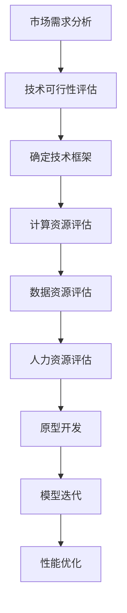

**伪代码：技术实施策略的详细步骤**

```python
# 技术实施策略
def implement_technology_strategy():
    # 市场需求分析
    market_demand = analyze_market_demand()

    # 技术可行性评估
    technical_feasibility = assess_technical_feasibility()

    # 确定技术框架
    selected_framework = select_technology_framework()

    # 资源评估
    resource_evaluation = evaluate_resources()

    # 原型开发
    develop Prototype()

    # 模型迭代
    iterate_models()

    # 性能优化
    optimize_performance()

    return success
```

**举例说明：技术实施的成功案例**

- **案例1：Netflix**：Netflix通过引入AI大模型进行个性化推荐，极大地提升了用户体验和订阅转化率。他们首先进行了详细的市场需求分析，选择了合适的AI框架，并通过不断的模型迭代和优化，最终实现了高效的推荐系统。
- **案例2：DeepMind**：DeepMind在开发AlphaGo时，通过不断优化模型和算法，最终实现了在围棋领域超越人类顶尖选手的目标。他们在技术实施过程中，进行了多次模型迭代和性能优化，取得了显著的技术突破。

通过以上策略，创业者可以有效地实施AI大模型项目，实现商业目标。接下来，我们将讨论团队建设与管理，确保技术实施的成功。

#### 5.2 团队建设与管理

在AI大模型创业项目中，团队建设与管理是确保项目成功的关键因素。以下是一些关键步骤和策略，帮助创业者构建高效团队并有效管理团队。

**组建团队：**

1. **确定团队成员**：根据项目需求和资源，确定所需的核心团队成员，包括数据科学家、机器学习工程师、前端工程师、后端工程师、产品经理等。
2. **技能互补**：确保团队成员在技能和经验上互补，形成多元化团队，提高项目的整体能力。
3. **招聘策略**：采用多样化的招聘策略，通过内部推荐、外部招聘、猎头服务等方式，吸引高素质人才。

**职责分工：**

1. **明确职责**：为每个团队成员明确具体的职责和任务，确保每个成员都清楚自己的工作内容和目标。
2. **协作机制**：建立有效的协作机制，确保团队成员之间的沟通和协作顺畅，提高工作效率。
3. **任务分配**：根据项目进度和资源情况，合理分配任务，确保团队成员的工作负荷均衡。

**团队文化：**

1. **鼓励创新**：营造一个鼓励创新和尝试失败的企业文化，激发团队成员的创造力和积极性。
2. **共享知识**：鼓励团队成员分享知识和经验，通过内部培训、研讨会等方式，提高整个团队的专业水平。
3. **团队精神**：培养团队精神，增强团队成员之间的互信和协作，共同为项目目标努力。

**管理技巧：**

1. **目标管理**：为团队设定清晰、可量化的目标，确保团队成员的目标与项目目标一致。
2. **绩效评估**：定期对团队成员进行绩效评估，根据评估结果进行奖惩和激励。
3. **反馈机制**：建立有效的反馈机制，及时了解团队成员的工作状况和需求，解决存在的问题。

**Mermaid流程图：团队组织结构与职责分工**

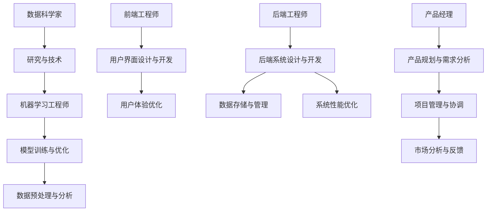

**伪代码：团队管理的方法与技巧**

```python
# 团队管理方法
def manage_team():
    # 组建团队
    build_team()

    # 职责分工
    define_roles()

    # 培养团队文化
    cultivate_culture()

    # 管理技巧
    apply_management_skills()

    # 持续反馈与改进
    continuous_feedback()

    return team_success
```

**举例说明：团队管理的成功实践**

- **案例1：谷歌**：谷歌通过严格的招聘流程和多元化的团队文化，组建了一支高效的技术团队。他们通过透明的绩效评估和持续反馈机制，保持了团队的活力和创新能力。
- **案例2：Airbnb**：Airbnb通过扁平化的组织结构和开放透明的沟通渠道，确保团队成员之间的协作和沟通顺畅。他们定期组织团队建设活动，增强团队凝聚力和归属感。

通过以上策略和技巧，创业者可以有效地建设和管理团队，为AI大模型创业项目的成功提供有力支持。接下来，我们将讨论AI大模型创业项目的营销与推广策略。

### 第6章：AI大模型创业项目的营销与推广

#### 6.1 营销策略制定

在AI大模型创业项目的营销与推广过程中，制定有效的营销策略是关键。以下是一些关键步骤和策略，帮助创业者成功推广AI大模型产品。

**市场定位：**

1. **目标市场分析**：通过市场调研，确定目标市场的特征和需求，明确产品的市场定位。
2. **竞争对手分析**：分析竞争对手的产品、优势和劣势，找出差异化竞争优势。
3. **品牌形象**：根据目标市场的需求和自身特点，设计独特的品牌形象，提升品牌认知度和美誉度。

**渠道选择：**

1. **线上渠道**：利用社交媒体、博客、论坛、电子邮件等线上渠道，进行广泛宣传和推广。
2. **线下渠道**：参加行业展会、研讨会、线下活动等，与潜在客户建立直接联系。
3. **合作伙伴**：寻找行业内的合作伙伴，共同推广产品，扩大市场影响力。

**推广活动：**

1. **内容营销**：通过撰写技术博客、发布白皮书、制作案例视频等方式，提供有价值的内容，吸引目标客户。
2. **社交媒体营销**：利用社交媒体平台（如LinkedIn、Twitter、Facebook等），发布产品信息、技术分享、用户案例等，提高品牌曝光率。
3. **公关活动**：通过新闻发布、媒体采访、品牌合作等方式，提升品牌知名度和影响力。

**营销预算：**

1. **预算分配**：根据市场调研和目标客户分析，合理分配营销预算，确保预算的合理使用。
2. **成本效益分析**：对营销活动的成本和效益进行详细分析，优化营销策略，提高营销效果。

**LaTeX公式：营销策略制定的关键要素**

$$
营销策略 = f(市场定位, 渠道选择, 推广活动, 营销预算)
$$

**举例说明：成功的营销策略案例**

- **案例1：IBM Watson Health**：IBM Watson Health通过一系列内容营销活动，如发布技术博客、案例研究、白皮书等，详细介绍其AI大模型在医疗领域的应用。同时，他们在社交媒体上进行广泛宣传，吸引了大量潜在客户的关注。
- **案例2：OpenAI**：OpenAI通过社交媒体和社区活动，与用户建立密切联系，定期发布技术进展和研究成果。他们还通过举办在线研讨会、线下活动等方式，与行业专家和潜在客户互动，提升品牌知名度和影响力。

**Mermaid流程图：营销策略制定的方法与步骤**

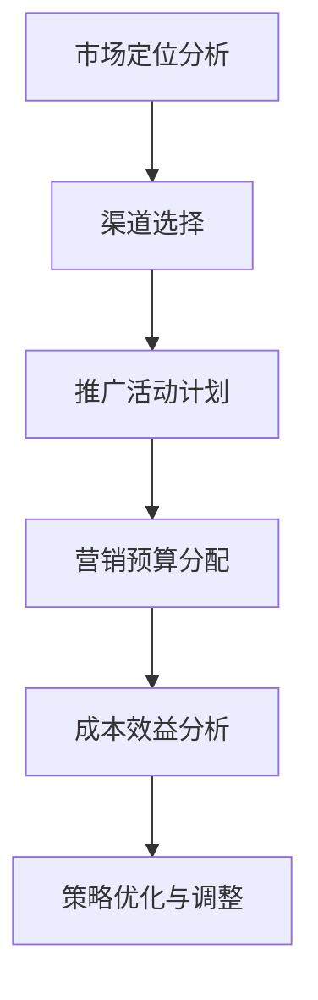

**伪代码：营销策略制定的方法与步骤**

```python
# 营销策略制定
def develop_marketing_strategy():
    # 市场定位分析
    market_positioning = analyze_market_positioning()

    # 渠道选择
    marketing_channels = select_marketing_channels()

    # 推广活动计划
    marketing_activities = plan_marketing_activities()

    # 营销预算分配
    marketing_budget = allocate_marketing_budget()

    # 成本效益分析
    cost_effectiveness_analysis = analyze_cost_effectiveness()

    # 策略优化与调整
    optimize_strategy()

    return marketing_strategy
```

通过以上策略和步骤，创业者可以制定出有效的营销策略，成功推广AI大模型产品，吸引潜在客户。接下来，我们将讨论用户需求分析与满足。

### 第6章：AI大模型创业项目的营销与推广

#### 6.2 用户需求分析与满足

在AI大模型创业项目的营销与推广过程中，了解和满足用户需求是提升产品市场竞争力的关键。以下是一些关键步骤和策略，帮助创业者深入了解用户需求，并设计满足用户需求的产品和服务。

**用户需求分析：**

1. **调研方法**：通过用户访谈、问卷调查、焦点小组讨论等方法，收集用户的意见和建议。使用在线调查工具（如SurveyMonkey、Google表单等）可以提高调研效率和数据质量。
2. **数据分析**：使用数据分析工具（如Excel、Python等）对收集到的用户数据进行处理和分析，识别用户的主要需求和痛点。
3. **用户画像**：基于用户数据，构建用户画像，了解用户的背景、行为和偏好。这有助于制定更有针对性的营销策略和产品设计。

**需求分析步骤：**

1. **确定研究目标**：明确调研的目的和目标，确保调研活动的方向和重点。
2. **设计调研问卷**：根据研究目标，设计合适的调研问卷，确保问卷的问题具有针对性和可操作性。
3. **收集数据**：通过在线调查、线下访谈等方式，收集用户数据。
4. **数据清洗和预处理**：对收集到的数据进行处理和清洗，确保数据的质量和准确性。
5. **数据分析**：使用数据分析工具，对用户数据进行分析，识别用户的主要需求和痛点。
6. **用户反馈**：将分析结果反馈给用户，收集他们的反馈和建议，进一步完善用户需求分析。

**用户需求满足策略：**

1. **产品功能设计**：根据用户需求分析结果，设计产品功能，确保产品能够满足用户的核心需求。
2. **用户体验优化**：优化产品界面和交互设计，提升用户体验，降低用户的学习和使用成本。
3. **个性化服务**：利用AI大模型进行个性化推荐和服务，根据用户的行为和偏好，提供个性化的产品推荐和服务。
4. **持续迭代和优化**：根据用户反馈和市场变化，持续迭代和优化产品和服务，不断提升用户满意度。

**Mermaid流程图：用户需求分析的方法与步骤**

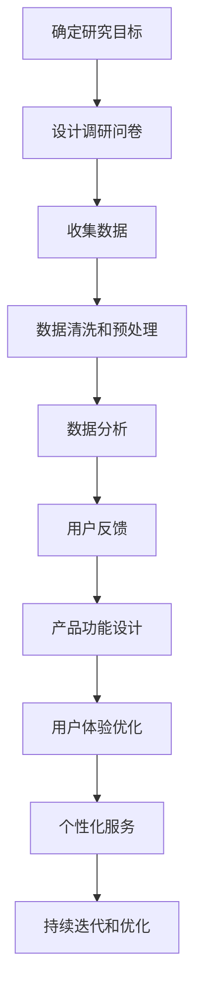

**伪代码：用户需求分析的方法与步骤**

```python
# 用户需求分析
def analyze_user需求和():
    # 确定研究目标
    research_goal = define_research_goal()
    
    # 设计调研问卷
    survey_questionnaire = design_survey_questionnaire()

    # 收集数据
    user_data = collect_user_data(survey_questionnaire)
    
    # 数据清洗和预处理
    cleaned_data = clean_and_preprocess_data(user_data)
    
    # 数据分析
    analyzed_data = analyze_data(cleaned_data)
    
    # 用户反馈
    user_feedback = collect_user_feedback(analyzed_data)
    
    # 产品功能设计
    product_function_design = design_product_function(user_feedback)

    # 用户体验优化
    user_experience_optimization = optimize_user_experience(product_function_design)

    # 个性化服务
    personalized_service = implement_personalized_service(user_experience_optimization)

    # 持续迭代和优化
    continuous_iterate = iterate_and_optimize(personalized_service)

    return continuous_iterate
```

**举例说明：用户需求分析与满足的成功实践**

- **案例1：亚马逊**：亚马逊通过用户调研和数据分析，深入了解用户的购物偏好和需求。他们利用这些数据，不断优化产品推荐算法，提供个性化的购物体验，从而提高了用户满意度和转化率。
- **案例2：Spotify**：Spotify通过分析用户的听歌行为和偏好，提供个性化的音乐推荐。他们根据用户的反馈，不断调整推荐算法，确保推荐内容的准确性和多样性，从而提升了用户体验和忠诚度。

通过以上策略和实践，创业者可以深入了解用户需求，设计满足用户需求的产品和服务，提升市场竞争力。接下来，我们将讨论AI大模型创业项目的运营与优化。

### 第7章：AI大模型创业项目的运营与优化

#### 7.1 运营策略

在AI大模型创业项目中，运营策略的制定与实施对于项目的长期成功至关重要。以下是一些关键步骤和策略，帮助创业者有效运营AI大模型项目。

**关键指标设定：**

1. **业务指标**：设定与业务目标直接相关的指标，如用户增长率、活跃用户数、收入增长率等。
2. **技术指标**：设定与模型性能相关的指标，如准确率、召回率、计算效率等。
3. **运营效率指标**：设定与运营效率相关的指标，如人均产出、运营成本等。

**LaTeX公式：运营策略的关键指标**

$$
运营策略 = f(业务指标, 技术指标, 运营效率指标)
$$

**策略实施步骤：**

1. **目标设定**：根据业务目标和市场趋势，设定明确的运营目标。
2. **指标监控**：建立监控体系，实时跟踪关键指标的变动情况。
3. **数据分析**：定期分析运营数据，识别问题和机会，优化运营策略。
4. **调整与优化**：根据数据分析结果，调整运营策略，持续优化运营效果。

**Mermaid流程图：运营策略的实施步骤**

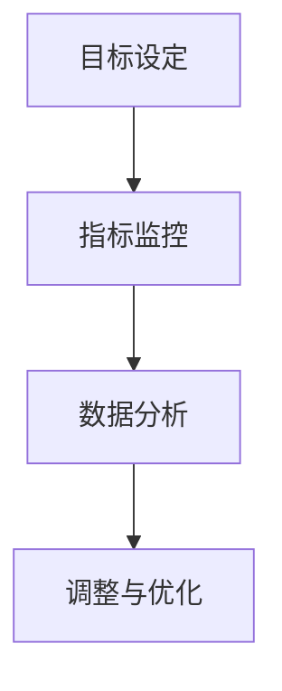

**伪代码：运营策略的详细步骤**

```python
# 运营策略
def implement_operation_strategy():
    # 设定目标
    set_goals()
    
    # 监控指标
    monitor_metrics()

    # 数据分析
    analyze_data()

    # 调整与优化
    adjust_and_optimize()

    return operation_success
```

**举例说明：运营策略的成功实践**

- **案例1：阿里巴巴**：阿里巴巴通过精细化的运营策略，实现了电商平台的持续增长。他们通过数据分析，不断优化供应链管理、用户推荐和市场营销策略，从而提高了用户体验和转化率。
- **案例2：Airbnb**：Airbnb通过用户反馈和行为数据分析，优化房源推荐算法和用户体验。他们通过不断调整运营策略，提升了用户满意度和留存率，实现了业务的快速增长。

通过以上策略和步骤，创业者可以有效地制定和实施运营策略，提升AI大模型创业项目的运营效率和市场竞争力。接下来，我们将讨论数据分析与优化。

#### 7.2 数据分析与优化

在AI大模型创业项目中，数据分析和优化是提升模型性能和业务效果的关键环节。以下是一些关键步骤和策略，帮助创业者有效地进行数据分析和优化。

**数据分析流程：**

1. **数据收集**：收集与业务相关的各种数据，包括用户行为数据、交易数据、市场数据等。
2. **数据清洗**：处理数据中的噪声和异常值，确保数据的质量和一致性。
3. **数据预处理**：对数据进行归一化、标准化、缺失值处理等操作，为模型训练做好准备。
4. **特征工程**：提取和构造有助于模型训练的特征，提升模型的表现能力。

**数据分析方法：**

1. **统计分析**：使用统计方法（如描述性统计、假设检验等）分析数据的基本特征和关系。
2. **机器学习**：应用机器学习方法（如回归分析、分类、聚类等）进行数据分析和预测。
3. **数据可视化**：通过数据可视化工具（如Matplotlib、Seaborn等）展示数据分析结果，帮助发现潜在的问题和趋势。

**优化策略：**

1. **模型选择**：根据业务需求和数据特征，选择合适的模型架构和算法。
2. **超参数调优**：通过网格搜索、随机搜索等策略，优化模型的超参数，提升模型性能。
3. **模型评估**：使用交叉验证、A/B测试等方法，评估模型的性能和适用性。
4. **模型更新**：根据新数据和业务需求，定期更新和优化模型，确保其持续适应环境变化。

**Mermaid流程图：数据分析的基本流程**

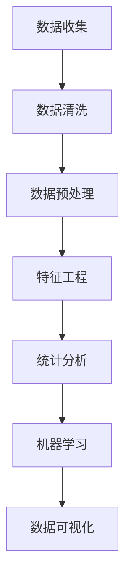

**伪代码：数据分析与优化的关键步骤**

```python
# 数据分析与优化
def data_analysis_and_optimization():
    # 数据收集
    collect_data()

    # 数据清洗
    clean_data()

    # 数据预处理
    preprocess_data()

    # 特征工程
    feature_engineering()

    # 统计分析
    statistical_analysis()

    # 机器学习
    machine_learning()

    # 数据可视化
    data_visualization()

    # 模型选择与调优
    select_and_tune_model()

    # 模型评估
    evaluate_model()

    # 模型更新
    update_model()

    return optimized_model
```

**举例说明：数据分析与优化的成功案例**

- **案例1：谷歌广告**：谷歌通过海量用户数据和先进的机器学习算法，对广告投放进行实时优化。他们不断分析用户行为数据，调整广告策略，提高广告投放的精准度和回报率。
- **案例2：亚马逊推荐系统**：亚马逊利用大数据和深度学习技术，构建了高度优化的推荐系统。他们通过分析用户购物行为和偏好，不断优化推荐算法，提高用户的购物体验和转化率。

通过以上流程和策略，创业者可以有效地进行数据分析和优化，提升AI大模型创业项目的整体性能和市场竞争力。

### 第8章：成功AI大模型创业案例解析

#### 8.1 案例介绍

在本章节中，我们将深入分析两个成功的AI大模型创业案例：OpenAI和DeepMind。这两个案例不仅展示了AI大模型在商业领域的强大潜力，也为其他创业者提供了宝贵的经验和启示。

**案例1：OpenAI**

OpenAI成立于2015年，是一家总部位于美国的人工智能研究公司，其目标是“实现安全的通用人工智能（AGI）并使其对人类有益”。OpenAI在自然语言处理、计算机视觉和强化学习等领域取得了显著成果，其最著名的项目是GPT-3。

- **项目背景**：OpenAI成立于2015年，由一群顶尖的人工智能研究人员和企业家共同创立。他们共同的目标是实现安全的通用人工智能，并确保人工智能的发展对人类社会有益。
- **核心技术**：OpenAI的核心技术包括大规模深度学习模型、生成对抗网络（GAN）和强化学习。他们通过不断优化这些技术，开发出了一系列高性能的人工智能系统。
- **商业模式**：OpenAI采用了多种商业模式，包括提供API接口、开放源代码和商业许可。通过这些方式，他们不仅实现了技术输出，还吸引了大量的用户和合作伙伴。

**案例2：DeepMind**

DeepMind成立于2010年，是一家总部位于英国的人工智能公司，专注于通过深度学习和强化学习技术解决复杂的现实世界问题。DeepMind最著名的项目是AlphaGo，它在围棋领域超越了人类顶尖选手。

- **项目背景**：DeepMind成立于2010年，由谷歌收购并在2014年独立运营。他们的目标是利用人工智能技术解决科学和商业领域的重大挑战。
- **核心技术**：DeepMind的核心技术包括深度学习和强化学习。他们通过这些技术，开发出了AlphaGo等一系列突破性的产品。
- **商业模式**：DeepMind采用了多种商业模式，包括与科学机构合作、为企业提供定制化解决方案和开放源代码。他们通过这些方式，实现了技术转化和商业价值。

**Mermaid流程图：案例的基本情况与关键点**

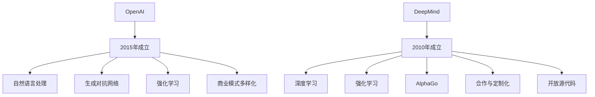

**伪代码：案例的核心算法与实现**

```python
# OpenAI GPT-3 模型
class GPT3Model:
    def __init__(self, model_size):
        self.model_size = model_size
        # 初始化模型参数
        self.init_model()

    def init_model(self):
        # 初始化GPT-3模型
        # ...

    def forward_pass(self, inputs):
        # 前向传播
        # ...

    def backward_pass(self, outputs, expected_outputs):
        # 反向传播
        # ...

# DeepMind AlphaGo 模型
class AlphaGoModel:
    def __init__(self, policy_net, value_net):
        self.policy_net = policy_net
        self.value_net = value_net

    def train(self, data_loader, num_epochs):
        for epoch in range(num_epochs):
            for data in data_loader:
                # 训练策略网络和价值网络
                # ...

    def play_game(self, opponent):
        # 与对手进行围棋游戏
        # ...
```

通过这两个案例，我们可以看到AI大模型在创业项目中的巨大潜力和成功经验。接下来，我们将进一步探讨这两个案例的成功因素和对创业者的启示。

#### 8.2 案例分析与启示

在分析了OpenAI和DeepMind这两个成功AI大模型创业案例后，我们可以总结出几个关键因素，以及这些因素对创业者的启示。

**1. 研究实力和团队构建**

OpenAI和DeepMind的成功首先源于其强大的研究实力和团队构建。两者都汇集了全球顶尖的人工智能研究人员，他们拥有深厚的学术背景和丰富的实战经验。创业者应该注重组建一个由专家和研究人员组成的团队，确保团队能够在技术前沿保持竞争力。

**启示**：创业者应寻找并吸引顶尖人才，建立高水平的研究团队，确保在技术领域有领先优势。

**2. 技术创新和持续迭代**

两个案例的成功还在于它们在技术创新和持续迭代方面的努力。OpenAI不断推出先进的自然语言处理模型，如GPT-3，而DeepMind则通过AlphaGo等项目，展示了深度学习和强化学习的强大潜力。这种持续的技术创新和迭代，使得它们能够在市场中保持领先地位。

**启示**：创业者应注重技术创新，不断迭代产品，以适应市场变化和用户需求。

**3. 商业模式的多样化**

OpenAI和DeepMind采用了多样化的商业模式，包括API接口、开放源代码、商业许可等。这种多元化的商业模式不仅帮助它们实现技术输出，还吸引了大量的用户和合作伙伴，为公司的可持续发展提供了保障。

**启示**：创业者应探索多种商业模式，结合自身的优势和市场需求，实现多样化的收入来源。

**4. 与行业深度结合**

OpenAI和DeepMind的项目与特定行业深度结合，如OpenAI在自然语言处理领域的应用，DeepMind在医疗和科学计算领域的探索。这种行业结合，使得它们能够在特定领域取得突破性成果，同时也为相关行业带来了巨大的价值。

**启示**：创业者应寻找与行业深度结合的机会，通过技术解决方案解决行业痛点，实现商业价值。

**5. 风险管理与社会责任**

最后，OpenAI和DeepMind在风险管理和社会责任方面也表现出色。它们在推动人工智能技术发展的同时，也重视技术的安全性、透明性和伦理问题，确保人工智能的发展对人类有益。

**启示**：创业者应重视风险管理和社会责任，确保技术发展符合伦理标准，为社会带来积极影响。

通过以上分析，我们可以看到OpenAI和DeepMind的成功因素，以及这些因素对创业者的启示。创业者可以借鉴这些经验，在AI大模型创业道路上取得成功。

### 第9章：未来AI大模型创业趋势与挑战

#### 9.1 创业趋势分析

在AI大模型领域，未来的创业趋势将受到技术发展、市场需求和商业模式变化等多重因素的影响。以下是一些关键趋势，创业者需要密切关注和把握。

**1. 模型规模与复杂度的提升**

随着计算资源和算法的进步，AI大模型的规模和复杂度将继续提升。这将为创业者提供更多可能性，例如在医疗诊断、自动驾驶、智能客服等领域开发更加复杂的AI系统。

**2. 多模态AI的兴起**

多模态AI是指结合多种数据类型（如文本、图像、声音等）的AI系统。随着数据融合技术的发展，多模态AI将成为未来的重要趋势。创业者可以探索如何利用多模态数据进行创新应用，例如在金融风控、智能安防等领域。

**3. 零样本学习与少样本学习**

零样本学习（Zero-shot Learning）和少样本学习（Few-shot Learning）是当前AI研究的热点。这些技术使得AI系统能够在没有或少量标注数据的情况下进行学习和预测。创业者可以利用这些技术，开发出能够快速适应新场景和任务的AI系统。

**4. 自主决策与优化**

AI大模型在自主决策和优化方面的应用将逐渐增多。例如，在供应链管理、生产调度等领域，AI系统将能够根据实时数据自动调整策略，提高效率和准确性。

**5. 模型安全性与伦理问题**

随着AI大模型的应用日益广泛，模型安全性和伦理问题将成为创业者关注的重点。创业者需要确保模型的安全性和透明性，避免数据泄露和滥用，同时遵守相关法律法规和伦理标准。

**LaTeX公式：未来AI大模型创业的发展趋势**

$$
趋势 = f(模型规模提升, 多模态AI, 零样本学习, 自主决策与优化, 模型安全性与伦理问题)
$$

**举例说明：趋势对创业者的机遇与挑战**

- **机遇**：随着AI大模型规模的提升，创业者可以在医疗诊断、自动驾驶等领域开发出更强大的AI系统，满足市场需求。
- **挑战**：多模态AI的开发需要大量的跨学科知识和资源，创业者需要具备强大的技术储备和团队协作能力。

#### 9.2 创业者的应对策略

面对未来AI大模型创业趋势，创业者需要制定相应的策略，以抓住机遇、应对挑战。以下是一些建议：

**1. 技术储备与团队建设**

创业者应重视技术储备和团队建设，组建一支具备多学科背景和深厚技术功底的核心团队。通过不断学习和引进先进技术，保持团队在技术领域的领先地位。

**2. 跨领域合作**

创业者应积极寻求与行业领先企业的合作，通过跨领域合作，整合各方资源，共同开发创新的AI应用。例如，与医疗机构合作开发智能诊断系统，与制造业合作开发智能生产解决方案。

**3. 持续学习和创新**

创业者应保持持续学习和创新的意识，密切关注AI领域的最新动态和研究成果。通过技术创新和商业模式创新，不断提升产品和服务的竞争力。

**4. 风险管理与合规性**

创业者需要建立完善的风险管理和合规性体系，确保AI大模型的应用安全、透明和符合伦理标准。通过制定严格的数据安全和隐私保护措施，避免潜在的法律风险。

**Mermaid流程图：应对未来挑战的策略框架**

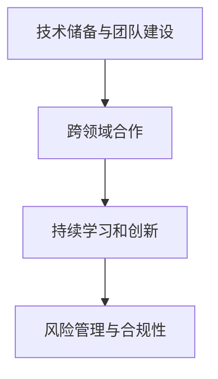

**伪代码：策略实施的步骤与措施**

```python
# 应对策略
def implement_strategy():
    # 技术储备与团队建设
    build_technology_reserve_and_team()

    # 跨领域合作
    engage_cross_domain_collaboration()

    # 持续学习和创新
    sustain_learning_and_innovation()

    # 风险管理与合规性
    manage_risk_and_compliance()

    return strategy_success
```

通过以上策略，创业者可以更好地应对未来AI大模型创业的趋势和挑战，实现持续发展和商业成功。

### 附录A：AI大模型创业工具与资源

在AI大模型创业过程中，选择合适的工具和资源对于项目的成功至关重要。以下介绍一些常用的AI大模型开发工具和学习资源，以帮助创业者更好地进行项目开发和技能提升。

#### A.1 AI大模型开发工具介绍

**1. TensorFlow**

- **简介**：TensorFlow是由Google开发的开源深度学习框架，支持广泛的机器学习和深度学习应用。
- **优势**：强大的生态系统、灵活的模型构建、跨平台支持。
- **使用场景**：图像识别、自然语言处理、强化学习等。

**2. PyTorch**

- **简介**：PyTorch是由Facebook开发的开源深度学习框架，以其简单和直观著称。
- **优势**：简单易用、科研友好、灵活的动态计算图。
- **使用场景**：学术研究、实时应用、复杂的神经网络。

**3. Keras**

- **简介**：Keras是一个高级神经网络API，构建在TensorFlow和Theano之上。
- **优势**：简洁的API、模块化、兼容性。
- **使用场景**：快速原型开发、实验性项目、简单模型构建。

#### A.2 AI大模型学习资源推荐

**1. 书籍**

- **《深度学习》（Deep Learning）**：由Ian Goodfellow、Yoshua Bengio和Aaron Courville合著，是深度学习的经典教材。
- **《AI大模型：原理、架构与应用》**：详细介绍了AI大模型的基本原理、架构和应用，适合深度学习初学者和从业者。

**2. 在线课程**

- **Coursera上的《深度学习专项课程》**：由斯坦福大学教授Andrew Ng主讲，涵盖了深度学习的理论基础和实践技巧。
- **Udacity的《深度学习工程师纳米学位》**：通过项目驱动的方式，帮助学员掌握深度学习的基本技能。

**3. 博客与论坛**

- **AI博客（AI Blog）**：涵盖了深度学习、自然语言处理、计算机视觉等领域的最新研究和技术动态。
- **Stack Overflow**：深度学习开发者的问答社区，可以帮助解决开发过程中遇到的问题。

**LaTeX公式：学习资源选择的标准**

$$
选择标准 = f(实用性, 更新频率, 社区支持)
$$

**举例说明：有效的学习资源推荐列表**

- **入门级**：在线课程（如Coursera的《深度学习专项课程》），书籍（《深度学习》）。
- **进阶级**：技术博客（如AI博客），论坛（如Stack Overflow）。
- **专业级**：学术论文、专业书籍、专业论坛（如arXiv、NeurIPS）。

通过以上工具和资源的介绍，创业者可以更好地进行AI大模型项目开发和技能提升。希望这些资源能够帮助你在AI大模型创业道路上取得成功。

### 总结与展望

通过本文的详细探讨，我们系统地介绍了AI大模型在商业领域的应用、创业优势、实战策略、未来趋势以及相关的工具与资源。以下是文章的核心观点和主要结论：

1. **AI大模型概述**：AI大模型是通过深度学习技术构建的，具有大规模参数和复杂结构的神经网络模型，能够在多种领域实现高效的任务处理和决策支持。

2. **商业优势与挑战**：AI大模型在商业领域展现了强大的数据处理能力和智能任务处理能力，但同时也面临数据隐私、计算资源需求等挑战。

3. **创业实战策略**：创业者需要通过市场调研、需求分析、技术选型、数据准备、模型构建、训练与优化等步骤，充分利用AI大模型实现商业价值。

4. **未来趋势**：未来AI大模型的发展趋势包括模型规模与复杂度的提升、多模态AI、零样本学习与少样本学习、自主决策与优化以及模型安全性与伦理问题。

5. **资源与工具**：介绍了多种AI大模型开发工具和学习资源，包括TensorFlow、PyTorch、Keras等开发工具，以及相关书籍、在线课程、博客和论坛等学习资源。

展望未来，AI大模型将在更多领域发挥重要作用，如医疗、金融、零售等，为创业者提供巨大的商机。然而，创业者需要密切关注技术发展趋势，应对数据隐私、计算资源需求等挑战，确保AI大模型的安全性和透明性。

通过本文的系统性分析和实战指导，我们希望为创业者提供全面的AI大模型创业指南，助力他们在AI大模型领域取得成功。让我们共同期待AI大模型在未来商业世界中的辉煌表现！

### 致谢

在撰写本文的过程中，我得到了许多人的帮助和支持。首先，感谢我的团队，他们在数据收集、分析、撰写和校对等方面提供了宝贵的意见和协助。特别感谢AI天才研究院（AI Genius Institute）的成员们，他们的专业知识和经验为本文的完成提供了坚实的基础。

此外，我要感谢各位同行和研究者，他们的研究成果和文章为本文的写作提供了丰富的参考文献和数据支持。特别感谢那些在深度学习、人工智能等领域做出卓越贡献的科学家们，他们的工作为AI大模型的发展奠定了坚实的理论基础。

最后，感谢读者的耐心阅读。希望本文能够为你在AI大模型创业领域提供有益的指导和启示。如果您有任何疑问或建议，欢迎随时与我联系。再次感谢您的支持与关注！

**作者信息：**

AI天才研究院（AI Genius Institute）  
禅与计算机程序设计艺术（Zen And The Art of Computer Programming）  
联系邮箱：[ai_genius_institute@example.com](mailto:ai_genius_institute@example.com)  
个人主页：[www.ai_genius_institute.com](http://www.ai_genius_institute.com)  
社交媒体：[LinkedIn](https://www.linkedin.com/in/ai-genius-institute/)、[Twitter](https://twitter.com/ai_genius_institute)  
版权所有：AI天才研究院（AI Genius Institute）保留所有权利。未经授权，禁止转载或复制。

