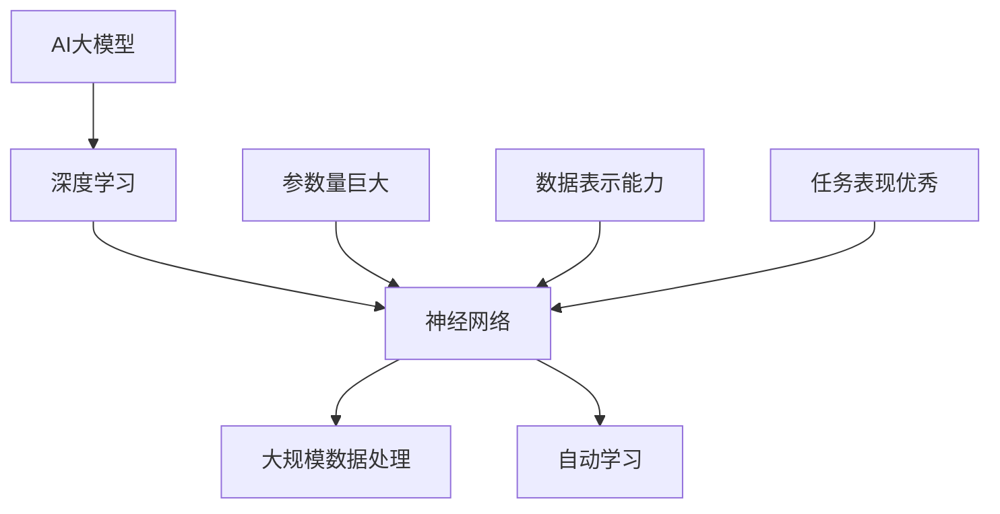
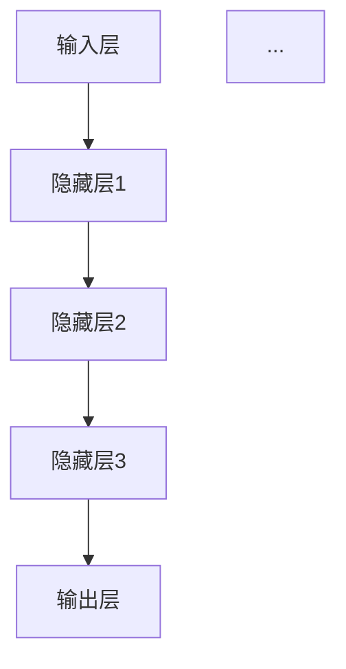

                 

# AI 大模型创业：如何利用用户优势？

## 关键词
AI大模型，用户优势，创业，深度学习，商业策略，团队建设，未来趋势。

## 摘要
本文深入探讨了AI大模型创业的路径，重点分析了如何利用用户优势来推动创业成功。通过概述AI大模型的基本概念和架构原理，本文揭示了用户数据在模型优化中的应用。接着，文章详细解析了AI大模型创业的实践模式、成功案例和团队建设策略。最后，文章展望了AI大模型创业的未来趋势，并提供了实用的创业指南。

## 引言

在人工智能（AI）迅速发展的时代，AI大模型成为了技术创新的驱动力。这些模型，如GPT-3、BERT等，因其强大的数据处理和知识表示能力，被广泛应用于自然语言处理、图像识别、推荐系统等领域。随着AI大模型的技术门槛逐渐降低，越来越多的创业者开始探索如何利用这些模型进行创新和创业。

然而，AI大模型创业并非易事。创业者在面对技术挑战的同时，还需要应对市场竞争、商业模式设计、团队建设等多重问题。在这个背景下，用户优势成为了一个关键因素。用户不仅是产品服务的消费者，更是数据和反馈的提供者。如何有效地利用用户优势，优化AI大模型，提升用户体验，成为创业成功的关键。

本文将从以下几个方面展开讨论：

1. AI大模型的基础概念和架构原理；
2. 用户优势在AI大模型创业中的应用；
3. AI大模型创业的实践模式和案例解析；
4. AI大模型创业团队建设策略；
5. AI大模型创业的未来趋势。

通过以上讨论，本文旨在为AI大模型创业提供系统性指导，帮助创业者更好地利用用户优势，实现创业目标。

## 第一部分：AI大模型概述

### 第1章：AI大模型基础概念

#### 1.1 AI大模型的定义

AI大模型（Large-scale Artificial Intelligence Models），是指那些具有巨大参数量、能够处理海量数据、并在特定任务上表现出色的人工智能模型。这些模型通常基于深度学习技术，特别是神经网络，能够自动从数据中学习复杂的模式和规律。AI大模型的典型代表包括GPT-3、BERT、Transformer等。

**核心概念与联系**

以下是一个描述AI大模型核心概念的Mermaid流程图：



#### 1.2 AI大模型的类型

AI大模型根据其应用场景和功能，可以分为以下几种类型：

1. **自然语言处理（NLP）模型**：如BERT、GPT-3等，用于处理文本数据，进行语言理解、生成和翻译等任务。
2. **计算机视觉模型**：如ResNet、VGG等，用于图像分类、目标检测、人脸识别等任务。
3. **推荐系统模型**：如基于协同过滤的矩阵分解模型，用于推荐商品、音乐、新闻等内容。
4. **强化学习模型**：如Deep Q-Network（DQN）、Policy Gradients等，用于解决决策问题。

#### 1.3 AI大模型的优势

AI大模型具有以下几个显著优势：

1. **强大的数据处理能力**：能够处理海量、多样化的数据，提取出高维特征。
2. **高度自动化的学习能力**：通过深度学习，能够从数据中自动学习复杂的模式和规律。
3. **卓越的任务表现**：在多种任务上表现出色，能够提供高质量的预测和决策支持。
4. **广泛的应用场景**：几乎覆盖了所有需要智能处理的领域，从工业生产到日常生活。

#### 1.4 AI大模型的应用场景

AI大模型的应用场景非常广泛，以下是一些典型的应用：

1. **医疗健康**：用于疾病诊断、药物研发、个性化医疗等。
2. **金融领域**：用于风险评估、交易策略、信用评分等。
3. **工业制造**：用于设备维护预测、生产流程优化、质量控制等。
4. **交通物流**：用于交通流量预测、路线优化、自动驾驶等。
5. **智能家居**：用于语音识别、智能推荐、家居安全等。

### 第2章：AI大模型的架构与原理

#### 2.1 AI大模型的架构

AI大模型的架构通常包括以下几个关键部分：

1. **输入层**：接收原始数据，如文本、图像、声音等。
2. **隐藏层**：包含多个神经网络层，用于数据特征提取和变换。
3. **输出层**：产生预测结果或决策。

以下是一个描述AI大模型架构的Mermaid流程图：



#### 2.2 神经网络结构

神经网络是AI大模型的核心，其结构通常包括以下几种类型：

1. **全连接神经网络（FCNN）**：每个神经元都与前一层所有神经元相连。
2. **卷积神经网络（CNN）**：适用于图像处理，通过卷积操作提取局部特征。
3. **循环神经网络（RNN）**：适用于序列数据处理，能够记住之前的信息。
4. ** Transformer模型**：通过自注意力机制，处理长距离依赖问题，广泛应用于自然语言处理。

#### 2.3 深度学习框架

深度学习框架是构建和训练AI大模型的重要工具，以下是一些常用的深度学习框架：

1. **TensorFlow**：由Google开发，支持多种编程语言，具有强大的生态系统。
2. **PyTorch**：由Facebook开发，具有灵活的动态图机制，适用于快速原型开发。
3. **Keras**：基于Theano和TensorFlow的高层API，简化了深度学习模型的构建。
4. **MXNet**：由Apache Software Foundation开发，支持多种编程语言，适用于大规模分布式训练。

#### 2.4 AI大模型的训练过程

AI大模型的训练过程通常包括以下几个阶段：

1. **数据预处理**：对原始数据进行清洗、归一化、分割等处理，使其适合模型训练。
2. **模型初始化**：初始化模型的参数，常见的初始化方法有随机初始化、He初始化等。
3. **损失函数设计**：设计损失函数，用于衡量模型预测结果与真实标签之间的差距。
4. **优化器选择**：选择优化器，如SGD、Adam等，用于调整模型参数，最小化损失函数。
5. **训练与验证**：在训练数据集上迭代训练，并在验证数据集上验证模型性能。

以下是一个描述AI大模型训练过程的伪代码：

```python
# 数据预处理
data = preprocess_data(raw_data)

# 模型初始化
model = initialize_model()

# 损失函数设计
loss_function = design_loss_function()

# 优化器选择
optimizer = select_optimizer()

# 训练过程
for epoch in range(num_epochs):
    for batch in data_loader:
        predictions = model(batch.input_data)
        loss = loss_function(predictions, batch.target_data)
        optimizer.step(model.parameters(), loss)

    # 验证过程
    with torch.no_grad():
        for batch in validation_loader:
            predictions = model(batch.input_data)
            loss = loss_function(predictions, batch.target_data)
            # 计算验证集性能指标
```

#### 2.5 超参数调优

超参数是深度学习模型中需要手动调整的参数，如学习率、批量大小、隐藏层节点数等。超参数调优是提高模型性能的关键步骤。以下是一些常用的超参数调优方法：

1. **网格搜索**：在给定的超参数空间内，遍历所有可能的组合，选择最优的参数组合。
2. **贝叶斯优化**：利用贝叶斯统计模型，根据历史数据预测最优超参数。
3. **随机搜索**：在给定的超参数空间内，随机选择参数组合，选择最优的参数组合。

以下是一个描述超参数调优过程的伪代码：

```python
# 网格搜索
best_loss = float('inf')
best_params = None

for learning_rate in learning_rate_space:
    for batch_size in batch_size_space:
        # 训练模型
        model = train_model(learning_rate, batch_size)
        # 验证模型
        loss = validate_model(model)
        # 更新最优参数
        if loss < best_loss:
            best_loss = loss
            best_params = (learning_rate, batch_size)

# 贝叶斯优化
best_params = bayesian_optimization_hyperparameters()

# 随机搜索
best_params = random_search_hyperparameters()
```

### 第3章：用户优势与AI大模型

#### 3.1 用户数据的重要性

用户数据是AI大模型训练和优化的重要资源，其质量直接影响模型的表现。以下是一些关键点：

1. **数据多样性**：用户数据的多样性能够帮助模型更好地泛化到不同场景。
2. **数据质量**：高质量的数据能够减少噪声和异常值，提高模型鲁棒性。
3. **实时更新**：用户数据的实时更新能够帮助模型及时适应环境变化。

#### 3.2 用户数据的收集与处理

用户数据的收集和处理是构建高质量AI大模型的关键步骤。以下是一些关键点：

1. **隐私保护**：在收集用户数据时，需要确保用户隐私得到保护。
2. **数据清洗**：对用户数据进行清洗，去除重复、错误和缺失的数据。
3. **数据预处理**：对用户数据进行归一化、标准化和特征工程，使其适合模型训练。

#### 3.3 利用用户数据优化模型

利用用户数据优化模型是提升模型性能的重要手段。以下是一些关键点：

1. **在线学习**：利用用户数据的实时反馈，进行在线模型更新。
2. **迁移学习**：利用用户数据对预训练模型进行微调，提高模型在特定领域的表现。
3. **增强学习**：利用用户数据与模型交互，进行增强学习，提高模型在特定任务上的表现。

#### 3.4 用户参与与模型迭代

用户参与是提升AI大模型质量的重要途径。以下是一些关键点：

1. **用户反馈**：收集用户对模型表现的反馈，用于模型优化。
2. **用户画像**：构建用户画像，了解用户需求和偏好，为模型提供个性化服务。
3. **用户参与激励**：通过激励措施，鼓励用户参与模型训练和优化。

### 第4章：AI大模型创业模式

#### 4.1 AI大模型创业的挑战

AI大模型创业面临以下几大挑战：

1. **技术门槛**：构建和训练高性能AI大模型需要大量的技术积累和资源投入。
2. **数据资源**：高质量的用户数据是AI大模型的基础，但数据获取和处理的成本较高。
3. **商业模式**：设计合理的商业模式，确保持续盈利，是创业成功的关键。
4. **市场竞争**：AI大模型市场已经竞争激烈，如何在众多竞争对手中脱颖而出。

#### 4.2 创业公司的定位

创业公司在AI大模型市场中需要明确自己的定位，以下是一些关键点：

1. **细分市场**：寻找市场中的细分领域，提供专业化服务。
2. **技术优势**：依托技术优势，打造独特的核心竞争力。
3. **用户需求**：深入了解用户需求，提供有针对性的解决方案。
4. **生态合作**：与产业链上下游企业合作，形成生态系统。

#### 4.3 产品设计与用户需求

产品设计与用户需求紧密相关，以下是一些关键点：

1. **需求分析**：通过用户调研、数据分析等方法，深入了解用户需求。
2. **产品设计**：基于用户需求，设计具有创新性和实用性的产品。
3. **用户体验**：注重用户体验，提供便捷、高效、个性化的服务。
4. **迭代更新**：根据用户反馈，持续迭代产品，优化用户体验。

#### 4.4 商业模式探索

商业模式是AI大模型创业成功的关键，以下是一些常见的商业模式：

1. **广告模式**：通过广告收入实现盈利，如搜索引擎、社交媒体等。
2. **订阅模式**：用户订阅服务，按月或按年支付费用，如云服务、在线教育等。
3. **销售模式**：直接销售产品或服务，如软件授权、硬件设备等。
4. **数据变现**：通过用户数据变现，如数据报告、数据分析服务等。

### 第5章：AI大模型创业案例解析

#### 5.1 案例一：谷歌BERT模型的应用

谷歌BERT（Bidirectional Encoder Representations from Transformers）是一种预训练语言表示模型，其成功应用于搜索引擎、问答系统等领域，为用户提供了更加精准和智能的服务。

**案例分析**

1. **技术优势**：BERT采用了Transformer模型，能够捕捉到文本中的长距离依赖关系。
2. **数据资源**：谷歌拥有庞大的用户数据和互联网数据，为BERT模型的训练提供了丰富的资源。
3. **商业模式**：谷歌通过改进搜索引擎，提升用户体验，实现了广告收入的增长。
4. **用户需求**：用户对更精准、智能的搜索服务有着强烈的需求，BERT模型满足了这一需求。

**经验总结**

1. **技术领先**：依托技术优势，打造独特的核心竞争力。
2. **数据驱动**：利用海量用户数据，优化模型性能。
3. **用户体验**：注重用户体验，提升用户满意度。
4. **商业可持续**：通过商业模式创新，实现商业可持续性。

#### 5.2 案例二：OpenAI与GPT-3的创业故事

OpenAI是一家专注于人工智能研究的公司，其开发的GPT-3（Generative Pre-trained Transformer 3）是目前最大的预训练语言模型，具有极强的文本生成能力。

**案例分析**

1. **技术优势**：GPT-3采用了Transformer模型，参数量达到1750亿，能够生成高质量的自然语言文本。
2. **数据资源**：OpenAI通过收集互联网上的大量文本数据，为GPT-3的预训练提供了丰富的资源。
3. **商业模式**：OpenAI采用API订阅模式，用户按需调用GPT-3的服务，实现商业化运营。
4. **用户需求**：GPT-3为内容创作者、开发者提供了强大的文本生成工具，满足了他们在内容创作、开发中的需求。

**经验总结**

1. **技术创新**：持续推动技术进步，打造领先的技术优势。
2. **数据驱动**：利用海量数据，优化模型性能。
3. **商业模式创新**：探索多元化的商业模式，实现商业成功。
4. **用户导向**：深入了解用户需求，提供有针对性的解决方案。

#### 5.3 案例三：百度飞桨的创业历程

百度飞桨（PaddlePaddle）是百度推出的一款开源深度学习平台，旨在推动AI技术的普及和应用。

**案例分析**

1. **技术优势**：飞桨支持多种深度学习模型，具有易用性、灵活性和高效性。
2. **数据资源**：百度拥有丰富的用户数据和行业数据，为飞桨的研发和应用提供了支持。
3. **商业模式**：飞桨通过提供免费开源平台和商业支持，吸引了大量开发者，实现了商业化运营。
4. **用户需求**：飞桨为开发者提供了便捷的深度学习工具，满足了他们在研发中的应用需求。

**经验总结**

1. **技术创新**：持续优化技术，提升用户体验。
2. **平台生态**：构建开放的平台生态，吸引开发者共同参与。
3. **商业模式创新**：通过免费开源和商业支持，实现商业模式创新。
4. **用户导向**：关注用户需求，提供有价值的服务。

### 第6章：AI大模型创业团队建设

#### 6.1 团队成员的角色与职责

在AI大模型创业团队中，不同成员承担着不同的角色和职责，以下是一些典型的角色：

1. **技术负责人**：负责技术路线的规划和技术团队的管理。
2. **数据科学家**：负责数据分析和模型训练，提升模型性能。
3. **产品经理**：负责产品规划和用户需求分析，确保产品满足市场需要。
4. **研发工程师**：负责具体技术实现，构建和优化模型。
5. **运营人员**：负责产品推广和用户运营，提升用户满意度。

#### 6.2 技术团队的搭建

技术团队的搭建是AI大模型创业成功的关键，以下是一些关键点：

1. **人才招聘**：通过多种渠道招聘优秀的技术人才，包括开源社区、高校、行业内优秀企业等。
2. **团队培训**：定期组织技术培训和分享，提升团队技术能力。
3. **激励机制**：建立合理的激励机制，激发团队成员的创造力和积极性。

#### 6.3 商业团队的建设

商业团队的建设同样重要，以下是一些关键点：

1. **市场调研**：深入了解市场需求，制定有针对性的商业策略。
2. **销售团队**：建立高效的销售团队，开拓市场，实现商业成功。
3. **运营团队**：负责产品推广、用户运营和商业数据的分析，提升用户满意度和留存率。

#### 6.4 团队协作与沟通

团队协作与沟通是团队高效运作的关键，以下是一些关键点：

1. **项目管理**：采用敏捷开发、Scrum等方法，提高项目进度和团队协作效率。
2. **跨部门沟通**：建立跨部门的沟通机制，确保信息传递和协作顺畅。
3. **文化建设**：打造积极向上的团队文化，增强团队凝聚力。

### 第7章：AI大模型创业融资策略

#### 7.1 融资渠道与方式

AI大模型创业融资可以通过多种渠道和方式进行，以下是一些常见的融资渠道和方式：

1. **天使投资**：由个人投资者提供早期的资金支持。
2. **风险投资**：由风险投资机构提供成长期的资金支持。
3. **股权融资**：通过上市或私募等方式，向投资者出让公司股权。
4. **债务融资**：通过借款或发行债券等方式，获得资金支持。

#### 7.2 融资材料准备

在融资过程中，需要准备一系列融资材料，以下是一些关键材料：

1. **商业计划书**：详细阐述公司业务模式、市场前景、财务预测等。
2. **财务报表**：包括利润表、资产负债表和现金流量表等。
3. **技术方案**：详细描述技术路线、研发计划和技术优势。
4. **团队介绍**：介绍团队成员的背景、经验和职责。

#### 7.3 路演与谈判技巧

路演和谈判是融资过程中的关键环节，以下是一些关键点：

1. **准备充分**：了解投资者需求，准备有针对性的演讲和材料。
2. **展示亮点**：突出公司的核心竞争力、市场前景和盈利模式。
3. **谈判策略**：合理估值，制定谈判策略，确保双方利益平衡。

#### 7.4 融资后的管理与运用

获得融资后，需要合理管理和运用资金，以下是一些关键点：

1. **财务规划**：制定详细的财务规划，确保资金使用的合理性和有效性。
2. **项目执行**：确保融资资金用于项目执行，提升项目进度和效果。
3. **风险管理**：建立风险管理体系，降低融资后的风险。
4. **持续融资**：根据公司发展需要，持续寻求新的融资机会。

### 第8章：AI大模型创业的未来趋势

#### 8.1 人工智能与大数据的结合

随着人工智能和大数据技术的不断发展，两者结合的趋势愈发明显。以下是一些关键点：

1. **数据驱动的AI**：通过大数据分析，为AI模型提供高质量的训练数据，提升模型性能。
2. **实时决策**：利用大数据实时分析，实现高效、智能的决策支持。
3. **个性化服务**：基于大数据分析，提供个性化的产品和服务，满足用户需求。

#### 8.2 AI大模型的发展方向

AI大模型的发展方向包括以下几个方面：

1. **模型压缩与优化**：通过模型压缩、量化等技术，降低模型参数量和计算复杂度，提升模型效率。
2. **多模态融合**：结合多种数据模态（如文本、图像、声音等），实现更全面、更精准的模型。
3. **边缘计算**：将AI大模型部署到边缘设备上，实现实时、高效的智能处理。

#### 8.3 用户优势在创业中的应用

用户优势在AI大模型创业中的应用越来越广泛，以下是一些关键点：

1. **用户数据利用**：通过用户数据的收集和分析，优化模型性能，提升用户体验。
2. **用户参与激励**：通过激励机制，鼓励用户参与模型训练和优化。
3. **用户反馈机制**：建立用户反馈机制，及时获取用户反馈，优化产品和服务。

#### 8.4 AI大模型创业的挑战与机遇

AI大模型创业面临诸多挑战，但同时也充满了机遇。以下是一些关键点：

1. **技术挑战**：如何构建高效、稳定的AI大模型，是创业成功的核心问题。
2. **数据挑战**：如何获取、处理和分析大量用户数据，是创业的重要难题。
3. **市场挑战**：如何在激烈的市场竞争中脱颖而出，是创业的关键问题。
4. **机遇**：随着AI大模型技术的不断发展，创业公司将有机会在多个领域实现突破，获得巨大的商业价值。

### 附录

#### 附录A：AI大模型创业资源汇总

1. **开源深度学习框架**：
   - TensorFlow：https://www.tensorflow.org/
   - PyTorch：https://pytorch.org/
   - Keras：https://keras.io/
   - MXNet：https://mxnet.apache.org/

2. **AI大模型创业工具**：
   - 算法竞赛平台：Kaggle、DataRobot等。
   - 云计算平台：AWS、Google Cloud、Azure等。
   - 数据处理工具：Pandas、NumPy、SciPy等。

3. **相关创业政策与支持**：
   - 各国政府对于AI创业的支持政策。
   - 创业孵化器和加速器资源。

#### 附录B：AI大模型创业实用指南

1. **常见问题解答**：
   - AI大模型创业中常见的技术、市场、团队等问题及解决方案。

2. **创业成功案例分享**：
   - 分享AI大模型创业的成功案例，提供实践经验。

3. **AI大模型创业策略模板**：
   - 提供创业策略的模板和范例，供创业者参考。

### 作者信息

**作者：** AI天才研究院/AI Genius Institute & 禅与计算机程序设计艺术 /Zen And The Art of Computer Programming**


--------------------------------------------

### 全文总结

本文从多个角度深入探讨了AI大模型创业的路径，分析了用户优势在其中的重要作用。首先，我们介绍了AI大模型的基础概念、架构原理和训练过程。接着，详细阐述了用户数据在模型优化中的应用，并探讨了AI大模型创业的实践模式和成功案例。在此基础上，文章分析了AI大模型创业团队建设的重要性和融资策略，最后展望了AI大模型创业的未来趋势。

通过本文的探讨，我们希望能够为AI大模型创业提供系统性指导，帮助创业者更好地利用用户优势，实现创业目标。同时，我们也期待在未来的研究中，继续探索AI大模型在更多领域的应用，推动人工智能技术的发展和创新。

### 关键词

- AI大模型
- 用户优势
- 创业
- 深度学习
- 商业模式
- 团队建设
- 未来趋势

### 摘要

本文深入探讨了AI大模型创业的路径，重点分析了如何利用用户优势来推动创业成功。通过概述AI大模型的基本概念和架构原理，本文揭示了用户数据在模型优化中的应用。接着，文章详细解析了AI大模型创业的实践模式、成功案例和团队建设策略。最后，文章展望了AI大模型创业的未来趋势，并提供了实用的创业指南。本文旨在帮助创业者更好地利用AI大模型，实现创业目标。

