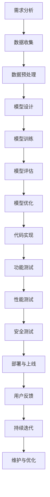
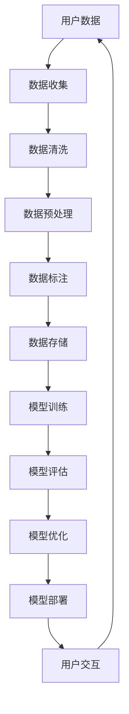
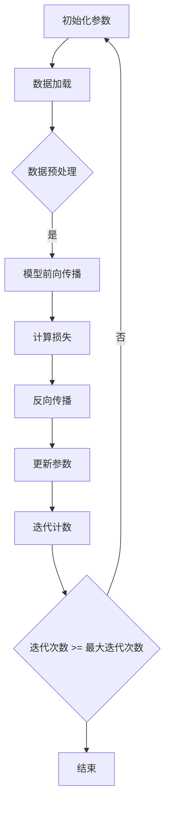
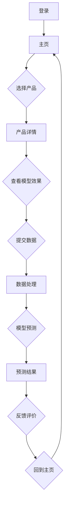

                 

### 《AI驱动的创业：大模型产品策略》

关键词：AI创业、大模型、产品策略、市场需求、用户需求

摘要：随着AI技术的快速发展，越来越多的创业者开始将AI技术应用于产品开发，以抓住市场机遇。本文将探讨AI驱动的创业模式，重点分析大模型产品策略。从AI时代的创业机会到大模型的基础知识，再到产品定位、设计、开发、测试和运营，本文将逐步解析如何利用AI大模型实现创业成功。最后，通过案例分析总结经验，展望未来发展趋势，探讨AI大模型产品伦理与法律问题。

### 目录大纲

## 第一部分：AI与创业概述

### 第1章：AI时代的创业机会
#### 1.1 AI时代的商业环境
#### 1.2 AI驱动的创业趋势
#### 1.3 AI大模型在创业中的应用
#### 1.4 创业者需具备的AI知识技能

### 第2章：AI大模型基础知识
#### 2.1 AI大模型的基本原理
#### 2.2 AI大模型的核心算法
#### 2.3 AI大模型的应用场景
#### 2.4 AI大模型的技术挑战

## 第二部分：AI大模型产品策略

### 第3章：AI大模型产品定位
#### 3.1 AI大模型产品的市场需求分析
#### 3.2 竞争对手分析
#### 3.3 AI大模型产品特色定位
#### 3.4 产品愿景与使命

### 第4章：AI大模型产品设计
#### 4.1 用户需求分析与需求文档编写
#### 4.2 产品功能设计
#### 4.3 用户界面设计
#### 4.4 产品原型设计与迭代

### 第5章：AI大模型产品开发
#### 5.1 AI大模型产品开发流程
#### 5.2 开发工具与平台选择
#### 5.3 大模型训练与优化
#### 5.4 代码实现与调试

### 第6章：AI大模型产品测试与优化
#### 6.1 AI大模型产品测试方法
#### 6.2 性能优化策略
#### 6.3 可靠性优化
#### 6.4 用户体验优化

### 第7章：AI大模型产品上市与运营
#### 7.1 产品上市策略
#### 7.2 市场推广与营销
#### 7.3 用户反馈与产品迭代
#### 7.4 持续运营与维护

## 第三部分：案例研究

### 第8章：AI大模型产品成功案例分析
#### 8.1 案例一：OpenAI与GPT-3
#### 8.2 案例二：谷歌的BERT与搜索优化
#### 8.3 案例三：亚马逊的推荐系统
#### 8.4 案例四：其他成功案例

## 第四部分：未来展望

### 第9章：AI大模型产品发展趋势
#### 9.1 AI大模型产品的发展趋势
#### 9.2 未来AI大模型产品的技术突破
#### 9.3 AI大模型产品对创业的影响
#### 9.4 创业者应具备的未来视角

### 第10章：AI大模型产品伦理与法律
#### 10.1 AI大模型产品的伦理问题
#### 10.2 AI大模型产品的法律法规
#### 10.3 创业者应遵守的伦理与法律规范
#### 10.4 未来AI大模型产品的监管趋势

## 附录

### 附录A：AI大模型产品开发资源
#### A.1 主流AI框架与工具
#### A.2 AI大模型开发资源网站
#### A.3 AI大模型开源项目推荐
#### A.4 AI大模型产品开发相关书籍与论文推荐

### 附录B：AI大模型产品开发流程图
#### B.1 AI大模型产品开发流程图
#### B.2 数据流图
#### B.3 算法流程图
#### B.4 用户界面流程图

### 附录C：伪代码示例
#### C.1 大模型训练伪代码
#### C.2 模型优化伪代码
#### C.3 模型预测伪代码
#### C.4 用户交互伪代码

### 附录D：数学模型与公式
#### D.1 常见数学模型
#### D.2 模型优化算法公式
#### D.3 模型评估指标公式
#### D.4 其他相关公式

### 附录E：AI大模型产品开发实战案例
#### E.1 实战案例一：基于BERT的文本分类系统
#### E.2 实战案例二：基于GPT-3的聊天机器人
#### E.3 实战案例三：基于GAN的图像生成系统
#### E.4 实战案例四：其他实战案例

---

### 第一部分：AI与创业概述

#### 第1章：AI时代的创业机会

在21世纪的今天，人工智能（AI）已经逐渐成为商业环境中不可或缺的一部分。AI技术的快速发展不仅改变了传统行业，也为创业者提供了前所未有的机遇。本章将探讨AI时代的创业机会，分析AI驱动的创业趋势，以及AI大模型在创业中的应用。

##### 1.1 AI时代的商业环境

随着云计算、大数据和物联网的普及，商业环境发生了翻天覆地的变化。企业纷纷投入大量资源进行数字化转型，以提高生产效率、降低运营成本和提升客户满意度。在这一背景下，AI技术成为了企业创新和发展的关键驱动力。

首先，云计算的兴起为AI技术的发展提供了强大的基础设施支持。通过云计算，创业者可以轻松访问大规模的算力资源，快速部署和训练AI模型。其次，大数据的积累为AI技术的应用提供了丰富的数据来源。创业者可以利用这些数据，通过机器学习算法挖掘有价值的信息，从而实现业务的智能决策。此外，物联网的普及使得各种设备可以实时采集数据，为AI算法提供了更加丰富的数据输入。

##### 1.2 AI驱动的创业趋势

在AI时代的商业环境中，创业者面临许多机遇。以下是一些AI驱动的创业趋势：

1. **自动化与智能优化**：通过AI技术，企业可以实现生产流程的自动化，提高生产效率和降低成本。创业者可以开发基于AI的自动化解决方案，如智能调度系统、智能生产控制系统等。

2. **个性化服务**：AI技术可以帮助企业更好地理解客户需求，提供个性化的产品和服务。创业者可以开发基于AI的客户关系管理系统、个性化推荐系统等。

3. **智能医疗**：AI技术在医疗领域的应用日益广泛，创业者可以开发基于AI的医疗诊断系统、智能药物研发平台等。

4. **智能交通**：AI技术在交通领域的应用有望解决交通拥堵、交通事故等问题。创业者可以开发智能交通管理系统、自动驾驶技术等。

5. **智慧城市**：AI技术可以用于城市管理的方方面面，如智慧安防、智慧环保、智慧能源等。创业者可以开发相关的智能城市解决方案。

##### 1.3 AI大模型在创业中的应用

AI大模型是一种具有大规模参数和强大学习能力的模型，可以处理复杂的任务，如自然语言处理、图像识别、语音识别等。在创业领域，AI大模型的应用前景广阔：

1. **自然语言处理**：创业者可以利用AI大模型开发智能客服系统、智能语音助手等，提高客户服务效率和质量。

2. **图像识别**：AI大模型可以应用于图像识别领域，如安防监控、医疗影像分析等。

3. **语音识别**：创业者可以利用AI大模型开发语音识别系统，如智能翻译、智能语音搜索等。

4. **推荐系统**：AI大模型可以用于个性化推荐系统，提高用户的购物体验和满意度。

5. **智能决策**：创业者可以利用AI大模型开发智能决策支持系统，帮助企业实现业务智能化。

##### 1.4 创业者需具备的AI知识技能

在AI驱动的创业浪潮中，创业者需要具备一定的AI知识技能，以应对不断变化的市场需求。以下是一些关键技能：

1. **机器学习**：创业者需要了解基本的机器学习算法，如线性回归、逻辑回归、神经网络等。

2. **深度学习**：创业者需要掌握深度学习的基本原理，如卷积神经网络（CNN）、循环神经网络（RNN）等。

3. **自然语言处理**：创业者需要了解自然语言处理的基本方法，如词向量、文本分类、情感分析等。

4. **图像处理**：创业者需要掌握图像处理的基本原理，如图像识别、目标检测等。

5. **数据工程**：创业者需要了解数据工程的基本概念，如数据清洗、数据存储、数据处理等。

总之，AI时代的创业机会无限，创业者需紧跟时代潮流，掌握AI技术，抓住市场机遇，实现创业成功。在接下来的章节中，我们将深入探讨AI大模型的基础知识，以及如何制定有效的产品策略。让我们继续前行，共同探索AI驱动的创业之路。

---

### 第二部分：AI大模型基础知识

#### 第2章：AI大模型基础知识

在了解了AI驱动的创业机会后，接下来我们将深入探讨AI大模型的基础知识。AI大模型是一种具有大规模参数和强大学习能力的模型，可以处理复杂的任务，如自然语言处理、图像识别、语音识别等。本章将介绍AI大模型的基本原理、核心算法、应用场景以及面临的技术挑战。

##### 2.1 AI大模型的基本原理

AI大模型是基于深度学习（Deep Learning）的一种模型。深度学习是一种机器学习（Machine Learning）的方法，通过多层神经网络（Neural Network）来模拟人脑的学习过程。AI大模型的基本原理可以概括为以下几个步骤：

1. **数据输入**：将输入数据（如文本、图像、语音等）转化为模型可以处理的形式。

2. **前向传播**：通过多层神经网络对输入数据进行处理，逐层计算并传递输出。

3. **反向传播**：根据实际输出与期望输出之间的误差，调整网络参数，优化模型。

4. **迭代训练**：重复前向传播和反向传播的过程，直到模型达到预设的误差阈值或达到训练次数。

AI大模型的核心在于其大规模的参数和深度网络结构。大规模参数使得模型具有更强的表达能力和泛化能力，而深度网络结构则有助于模型捕捉输入数据的复杂特征。通过不断迭代训练，模型能够自动学习和优化，从而实现高精度的预测和分类。

##### 2.2 AI大模型的核心算法

AI大模型的核心算法主要包括神经网络（Neural Network）、卷积神经网络（Convolutional Neural Network，CNN）、循环神经网络（Recurrent Neural Network，RNN）等。下面分别介绍这些算法的基本原理：

1. **神经网络**：神经网络是深度学习的基础，由大量神经元（节点）组成，通过权重（连接）连接形成一个网络结构。神经网络通过学习输入和输出之间的映射关系，实现对数据的处理和预测。

2. **卷积神经网络**：卷积神经网络是一种专门用于图像识别的神经网络。其基本原理是通过卷积操作提取图像中的特征，并通过池化操作减少数据维度。卷积神经网络在图像识别、目标检测等领域具有广泛的应用。

3. **循环神经网络**：循环神经网络是一种专门用于序列数据的神经网络。其基本原理是通过循环连接保持长距离依赖信息，实现对序列数据的处理和预测。循环神经网络在自然语言处理、语音识别等领域具有广泛应用。

除了上述核心算法，AI大模型还包括许多其他算法，如生成对抗网络（Generative Adversarial Network，GAN）、变压器（Transformer）等。这些算法在特定领域具有独特的优势和应用。

##### 2.3 AI大模型的应用场景

AI大模型在各个领域都有广泛的应用，以下是几个典型的应用场景：

1. **自然语言处理**：AI大模型可以用于文本分类、情感分析、机器翻译、问答系统等任务。例如，OpenAI的GPT-3模型在文本生成、摘要和问答方面具有卓越性能。

2. **图像识别**：AI大模型可以用于图像分类、目标检测、人脸识别等任务。例如，Google的Inception模型在图像分类任务上取得了显著成果。

3. **语音识别**：AI大模型可以用于语音识别、语音合成、语音翻译等任务。例如，Google的WaveNet模型在语音合成方面表现出色。

4. **推荐系统**：AI大模型可以用于个性化推荐、协同过滤等任务。例如，亚马逊和Netflix的推荐系统通过AI大模型实现了高效的推荐。

5. **医疗领域**：AI大模型可以用于疾病诊断、药物研发、医学影像分析等任务。例如，DeepMind的AI系统在医学影像分析方面取得了显著成果。

##### 2.4 AI大模型的技术挑战

尽管AI大模型在许多领域取得了显著成果，但在实际应用中仍面临一些技术挑战：

1. **计算资源**：训练AI大模型需要大量的计算资源和时间，特别是在深度学习领域。随着模型规模的不断扩大，计算资源的需求也在迅速增长。

2. **数据质量**：AI大模型的性能高度依赖于数据质量。数据清洗和预处理是深度学习的重要环节，但这一过程需要大量时间和人力。

3. **模型可解释性**：AI大模型的决策过程通常是非线性和复杂的，导致其可解释性较低。在实际应用中，用户往往难以理解模型的决策逻辑，增加了模型的风险。

4. **模型安全性和隐私保护**：随着AI大模型在各个领域的应用，其安全性和隐私保护问题日益突出。如何确保模型的可靠性和隐私性是当前研究的重要课题。

5. **模型部署与维护**：将AI大模型部署到实际应用中需要考虑硬件环境、性能优化、模型更新等问题。如何高效地部署和维护模型是创业者面临的重要挑战。

总之，AI大模型是一种具有巨大潜力的技术，在创业领域具有广泛的应用前景。然而，在实际应用过程中，创业者需要应对各种技术挑战，不断优化和改进模型。在接下来的章节中，我们将进一步探讨如何制定有效的AI大模型产品策略，帮助创业者实现成功。

---

### 第三部分：AI大模型产品策略

#### 第3章：AI大模型产品定位

在了解了AI大模型的基础知识后，接下来我们将探讨如何制定有效的AI大模型产品策略。产品定位是产品策略的核心环节，决定了产品在市场中的竞争力和用户需求满足度。本章将介绍AI大模型产品的市场需求分析、竞争对手分析、产品特色定位、产品愿景与使命。

##### 3.1 AI大模型产品的市场需求分析

市场需求分析是产品定位的基础，旨在了解目标用户群体的需求和偏好。以下是进行市场需求分析的几个关键步骤：

1. **市场调研**：通过问卷调查、访谈、用户反馈等方式，收集目标用户的需求信息。了解用户对现有产品的满意度、痛点以及期望功能。

2. **竞品分析**：分析同类型产品的市场表现，包括市场份额、用户评价、功能特点等。了解竞争对手的优势和劣势，为自身产品提供定位依据。

3. **SWOT分析**：对自身产品进行SWOT分析，即优势（Strengths）、劣势（Weaknesses）、机会（Opportunities）和威胁（Threats）。明确自身产品的优势特点，以及需要改进和规避的风险。

4. **市场趋势**：关注市场趋势，了解行业发展的最新动态。例如，AI大模型在医疗、金融、教育等领域的应用日益广泛，创业者可以针对这些趋势进行产品定位。

通过市场需求分析，创业者可以明确目标用户群体，了解市场需求和竞争态势，从而为产品定位提供有力支持。

##### 3.2 竞争对手分析

竞争对手分析是产品定位的重要环节，旨在了解竞争对手的产品特点、市场策略和用户反馈。以下是进行竞争对手分析的几个关键步骤：

1. **识别竞争对手**：确定直接和间接的竞争对手，包括市场上的领先企业、新兴企业以及潜在进入者。

2. **产品对比**：对比竞争对手的产品功能、性能、价格、用户体验等方面，找出自身产品的优势和不足。

3. **市场表现**：分析竞争对手的市场份额、用户评价、销售业绩等，了解其在市场中的地位和影响力。

4. **用户反馈**：收集用户对竞争对手产品的评价和反馈，了解用户的期望和需求，为自身产品提供改进方向。

通过竞争对手分析，创业者可以明确自身产品的定位，优化产品功能和用户体验，提高市场竞争力。

##### 3.3 AI大模型产品特色定位

在了解了市场需求和竞争对手后，创业者需要明确自身产品的特色定位，以在激烈的市场竞争中脱颖而出。以下是几个关键步骤：

1. **明确核心价值**：确定产品的主要价值主张，即产品能够为用户解决什么问题或带来什么价值。例如，AI大模型产品可以提供更准确的预测、更智能的决策、更个性化的体验等。

2. **差异化定位**：分析市场需求和竞争对手，找出自身产品的差异化特点。例如，通过技术创新、功能独特性、用户体验优化等方式实现差异化。

3. **目标市场**：确定目标市场，明确产品的目标用户群体。例如，医疗行业的医生、金融机构的风险管理专家、教育机构的管理人员等。

4. **品牌形象**：通过品牌传播和市场营销，塑造产品的独特形象，提高用户认知度和品牌忠诚度。

通过特色定位，创业者可以明确产品的核心价值，差异化竞争，并在目标市场中树立良好的品牌形象。

##### 3.4 产品愿景与使命

产品愿景和使命是产品策略的重要组成部分，旨在明确产品的长期目标和价值追求。以下是制定产品愿景与使命的几个关键步骤：

1. **愿景**：定义产品的长期愿景，即产品在未来想要实现的目标和愿景。例如，成为医疗行业的智能诊断专家、金融领域的智能决策助手等。

2. **使命**：明确产品的使命，即产品存在的意义和使命。例如，通过AI技术改善人类生活质量、推动行业进步等。

3. **价值观**：确定产品的价值观，即产品秉持的核心价值观。例如，用户至上、创新驱动、诚信守法等。

4. **目标用户**：明确产品的目标用户，即产品希望为哪些用户群体提供服务。例如，医生、患者、企业高管等。

通过制定愿景与使命，创业者可以明确产品的长期目标和价值观，指导产品开发和运营方向，为产品的持续发展提供动力。

总之，AI大模型产品定位是产品策略的核心环节，通过市场需求分析、竞争对手分析、特色定位和愿景使命的制定，创业者可以明确产品的定位和目标，为产品的成功奠定基础。在接下来的章节中，我们将进一步探讨AI大模型产品的设计、开发、测试和运营策略，帮助创业者实现产品成功。

---

### 第四部分：AI大模型产品设计

#### 第4章：AI大模型产品设计

在明确了AI大模型产品的定位后，下一步是进行产品的设计。产品设计不仅涉及功能实现的细节，还包括用户体验和界面设计，以及原型设计和迭代过程。本章将详细介绍这些关键环节。

##### 4.1 用户需求分析与需求文档编写

用户需求分析是产品设计的基础，旨在深入了解目标用户的需求和期望。以下是进行用户需求分析的几个关键步骤：

1. **用户访谈**：与目标用户进行深入访谈，了解他们的使用习惯、偏好和痛点。通过访谈，可以获取宝贵的用户反馈，为后续设计提供指导。

2. **问卷调查**：设计问卷调查，收集大量用户数据，了解用户对现有产品的评价和期望。问卷调查可以帮助分析用户需求的普遍性和重要性。

3. **用户行为分析**：通过用户行为数据分析，了解用户在现有产品中的使用模式、操作路径和常见问题。用户行为分析可以揭示用户需求背后的原因。

4. **市场研究**：分析市场趋势、竞争对手的产品特点和用户评价，了解市场上潜在的需求和机会。

在完成用户需求分析后，需要编写需求文档。需求文档是产品设计的核心文件，详细记录了产品的功能需求、非功能需求和设计原则。以下是编写需求文档的几个关键步骤：

1. **功能需求**：明确产品应实现的功能，包括主功能、辅助功能和特殊功能。功能需求应尽量具体、可测量和可验证。

2. **非功能需求**：描述产品的性能要求、可靠性、安全性、可维护性等方面的需求。非功能需求应考虑用户期望和行业标准。

3. **设计原则**：明确产品设计应遵循的原则，如简洁性、易用性、一致性、可访问性等。设计原则应指导整个设计过程。

4. **用户故事**：编写用户故事，描述用户在使用产品时的场景和行为。用户故事有助于理解用户需求，并确保设计满足用户期望。

##### 4.2 产品功能设计

产品功能设计是产品设计的核心环节，旨在实现用户需求。以下是进行产品功能设计的几个关键步骤：

1. **功能分解**：将整体功能分解为子功能，并明确每个子功能的具体实现方式。功能分解有助于梳理产品的功能结构，确保设计全面覆盖用户需求。

2. **流程图设计**：使用流程图（Process Flowchart）描述产品的工作流程。流程图可以帮助理解产品的工作原理，并发现潜在的问题和瓶颈。

3. **功能原型**：创建功能原型，展示产品的核心功能和交互流程。功能原型可以是低保真或高保真的，但应能充分反映产品功能。

4. **用户测试**：进行用户测试，收集用户对功能原型的反馈。用户测试可以帮助发现功能设计中的问题，并优化产品功能。

在功能设计过程中，需要考虑以下几个关键点：

1. **用户中心设计**：始终以用户需求为中心，确保产品功能设计能够解决用户问题，提升用户体验。

2. **模块化设计**：采用模块化设计，将功能分解为独立的模块，便于后续开发和维护。

3. **可扩展性**：设计时应考虑未来可能的功能扩展，确保产品能够灵活应对市场需求变化。

4. **性能优化**：在功能设计过程中，应考虑性能优化，确保产品能够高效运行，提供良好的用户体验。

##### 4.3 用户界面设计

用户界面设计是产品设计的另一个重要方面，直接影响用户的操作体验和满意度。以下是进行用户界面设计的几个关键步骤：

1. **界面布局**：设计用户界面的整体布局，包括导航栏、菜单、按钮、文本框等。界面布局应简洁清晰，便于用户快速找到所需功能。

2. **视觉设计**：选择适当的颜色、字体和图标，设计界面的视觉元素。视觉设计应符合产品品牌形象，并提高用户的视觉体验。

3. **交互设计**：设计用户的交互操作，包括点击、拖动、滑动等。交互设计应直观易用，确保用户能够轻松完成操作。

4. **用户体验测试**：进行用户体验测试，收集用户对界面设计的反馈。用户体验测试可以帮助发现界面设计中的问题，并优化界面设计。

用户界面设计的关键点包括：

1. **一致性**：保持界面风格和交互方式的一致性，提高用户的使用效率。

2. **可访问性**：确保界面设计符合无障碍设计标准，便于所有用户使用。

3. **响应速度**：优化界面响应速度，减少加载时间和延迟，提高用户的满意度。

4. **反馈机制**：设计合理的反馈机制，如提示、提示音等，引导用户正确操作，并提供即时反馈。

##### 4.4 产品原型设计与迭代

产品原型设计是产品设计的最后一个关键环节，旨在创建一个可以实际操作的产品模型。以下是进行产品原型设计与迭代的几个关键步骤：

1. **低保真原型**：首先创建低保真原型，以快速验证产品功能和交互设计。低保真原型可以是纸质的线框图或数字线框图，重点在于功能验证。

2. **高保真原型**：在低保真原型验证后，创建高保真原型，进一步优化用户体验和视觉效果。高保真原型可以是交互式网页或移动应用，更加接近最终产品。

3. **用户测试**：进行用户测试，收集用户对高保真原型的反馈。用户测试可以帮助发现原型设计中的问题，并优化产品原型。

4. **迭代优化**：根据用户反馈，对产品原型进行迭代优化。迭代过程应持续进行，直到产品原型达到预期效果。

产品原型设计与迭代的关键点包括：

1. **快速迭代**：采用敏捷开发方法，快速创建和迭代原型，缩短产品开发周期。

2. **用户参与**：在迭代过程中，积极邀请用户参与，获取真实的用户反馈，提高产品设计的准确性和实用性。

3. **可操作性**：确保原型设计具有实际可操作性，用户能够在原型中完成主要操作，体验产品的实际效果。

4. **全面测试**：对原型进行全面的测试，包括功能测试、性能测试、兼容性测试等，确保原型质量。

通过以上步骤，创业者可以确保AI大模型产品的设计满足用户需求，提供良好的用户体验。在接下来的章节中，我们将进一步探讨产品开发、测试和运营策略，帮助创业者实现产品成功。

---

### 第五部分：AI大模型产品开发

#### 第5章：AI大模型产品开发

在完成了产品的设计阶段后，下一步是进入开发阶段。AI大模型产品开发是一个复杂的过程，涉及算法选择、工具和平台的选择、模型的训练与优化，以及代码的实现与调试。本章将详细介绍这些关键环节。

##### 5.1 AI大模型产品开发流程

AI大模型产品开发的流程可以分为以下几个关键步骤：

1. **需求分析**：在产品设计的早期阶段，已经进行了用户需求分析，形成了需求文档。在开发阶段，需求分析是一个持续的过程，随着项目的进展，需求可能会发生变化，需要不断调整和更新。

2. **算法选择**：根据需求文档和用户需求，选择合适的算法。常见的算法包括深度学习中的卷积神经网络（CNN）、循环神经网络（RNN）、变压器（Transformer）等。算法的选择直接影响模型的性能和应用效果。

3. **数据准备**：数据是AI大模型训练的基础，需要收集、清洗和预处理大量数据。数据准备包括数据采集、数据清洗、数据标注、数据归一化等步骤。数据质量直接影响模型的训练效果和预测性能。

4. **模型设计**：根据选择的算法和需求，设计模型的结构。模型设计包括网络层数、神经元数量、激活函数、损失函数等。模型设计是一个迭代过程，需要根据实验结果进行调整。

5. **模型训练**：使用准备好的数据进行模型训练。模型训练是通过前向传播和反向传播算法，不断调整模型参数，使模型能够正确预测目标数据。模型训练可能需要大量的计算资源和时间。

6. **模型优化**：在模型训练过程中，通过调整超参数、使用正则化技术、优化算法等方法，提高模型的性能。模型优化是一个持续的过程，旨在提高模型的准确度、泛化能力和效率。

7. **代码实现**：将模型设计转化为代码，实现模型的训练、预测和评估等功能。代码实现应遵循良好的编程规范，确保代码的可读性和可维护性。

8. **测试与调试**：对实现的代码进行功能测试、性能测试和兼容性测试，确保模型的正确性和稳定性。测试过程中，可能会发现一些问题，需要通过调试进行修复。

9. **部署与上线**：将训练好的模型部署到生产环境中，供用户使用。部署过程中，需要考虑硬件资源、性能优化、安全性等因素。

##### 5.2 开发工具与平台选择

在AI大模型产品开发过程中，选择合适的工具和平台对于提高开发效率和性能至关重要。以下是几种常见的开发工具和平台：

1. **深度学习框架**：常见的深度学习框架包括TensorFlow、PyTorch、Keras等。这些框架提供了丰富的API和工具，方便模型的设计、训练和部署。

2. **计算平台**：可以选择云计算平台，如Google Cloud、AWS、Azure等，这些平台提供了强大的计算资源和存储服务，可以支持大规模模型训练。

3. **数据存储与处理**：选择适合的数据存储和处理工具，如HDFS、MongoDB、Pandas等。数据存储和处理工具需要能够高效地存储、加载和操作大量数据。

4. **代码管理工具**：选择适合的代码管理工具，如Git、GitHub等，这些工具可以帮助团队协作、版本控制和代码审查。

5. **模型部署平台**：选择适合的模型部署平台，如TensorFlow Serving、Kubernetes等，这些平台可以帮助将训练好的模型部署到生产环境中，实现实时预测和推理。

##### 5.3 大模型训练与优化

大模型训练与优化是AI大模型产品开发的核心环节。以下是几个关键步骤：

1. **数据预处理**：对数据进行预处理，包括数据清洗、归一化、编码等操作。数据预处理的质量直接影响模型的训练效果。

2. **数据增强**：通过数据增强方法，如随机裁剪、旋转、缩放等，增加数据的多样性，提高模型的泛化能力。

3. **模型初始化**：选择合适的模型初始化方法，如随机初始化、预训练模型等。良好的模型初始化可以提高训练效果。

4. **优化算法**：选择合适的优化算法，如随机梯度下降（SGD）、Adam等。优化算法的效率和质量对模型的训练速度和性能有重要影响。

5. **超参数调整**：调整模型超参数，如学习率、批量大小、正则化参数等，以优化模型性能。超参数调整是一个迭代过程，需要通过实验进行优化。

6. **正则化技术**：使用正则化技术，如L1、L2正则化、dropout等，防止模型过拟合，提高模型的泛化能力。

7. **模型评估**：使用验证集和测试集对模型进行评估，选择性能最佳的模型。常见的评估指标包括准确率、召回率、F1值等。

##### 5.4 代码实现与调试

在AI大模型产品开发中，代码实现与调试是一个关键环节。以下是几个关键步骤：

1. **模块化编程**：将代码划分为不同的模块，每个模块负责实现特定的功能。模块化编程可以提高代码的可读性和可维护性。

2. **代码注释**：在代码中添加注释，说明每个函数、类和模块的作用。良好的代码注释可以帮助团队成员更好地理解代码。

3. **代码审查**：进行代码审查，确保代码符合编程规范和设计原则。代码审查可以帮助发现潜在的错误和问题，提高代码质量。

4. **单元测试**：编写单元测试，验证每个模块的功能和逻辑。单元测试可以帮助确保代码的正确性和稳定性。

5. **集成测试**：进行集成测试，验证模块之间的交互和协作。集成测试可以帮助发现模块之间的错误和问题。

6. **调试与修复**：在测试过程中，可能会发现一些错误和问题。通过调试和修复，确保代码的正确性和稳定性。

7. **性能优化**：对代码进行性能优化，如减少内存占用、提高计算速度等。性能优化可以提高模型的训练和推理速度。

通过以上步骤，创业者可以确保AI大模型产品的开发顺利进行，实现高质量的模型和产品。在接下来的章节中，我们将进一步探讨AI大模型产品的测试与优化策略，以及产品的上市与运营。

---

### 第六部分：AI大模型产品测试与优化

#### 第6章：AI大模型产品测试与优化

在AI大模型产品开发完成后，接下来的关键步骤是对产品进行全面的测试和优化，以确保产品的性能、可靠性和用户体验。本章将详细介绍AI大模型产品的测试方法、性能优化策略、可靠性优化、用户体验优化以及持续改进的重要性。

##### 6.1 AI大模型产品测试方法

AI大模型产品的测试方法主要包括以下几个方面：

1. **功能测试**：功能测试旨在验证产品功能是否符合需求规格说明书的要求。测试人员需要编写测试用例，覆盖产品的各个功能模块，确保每个功能都能正常运行。

2. **性能测试**：性能测试用于评估产品的响应时间、吞吐量、并发处理能力等关键性能指标。性能测试通常使用工具如JMeter、LoadRunner等进行模拟测试，以评估产品在不同负载下的表现。

3. **安全性测试**：安全性测试旨在识别产品中的安全漏洞，如SQL注入、跨站脚本攻击（XSS）等。测试人员需要使用工具如OWASP ZAP、Burp Suite等来执行安全性测试。

4. **兼容性测试**：兼容性测试用于确保产品在不同操作系统、浏览器和设备上都能正常运行。测试人员需要在不同环境中安装和运行产品，验证其兼容性。

5. **用户体验测试**：用户体验测试用于评估产品的易用性、可用性和满意度。测试人员可以通过实地观察、用户访谈和问卷调查等方式收集用户反馈，以优化产品界面和交互设计。

##### 6.2 性能优化策略

性能优化是AI大模型产品开发中至关重要的一环。以下是一些常见的性能优化策略：

1. **模型压缩**：通过模型压缩技术，如量化、剪枝、知识蒸馏等，减少模型参数和计算量，提高推理速度。

2. **模型并行化**：利用并行计算技术，如GPU、TPU等，加速模型训练和推理。通过数据并行和模型并行，提高计算效率。

3. **缓存策略**：使用缓存策略，如HTTP缓存、Redis缓存等，减少数据库和存储的访问次数，提高响应速度。

4. **数据库优化**：通过数据库索引、分库分表、读写分离等策略，提高数据库的查询性能。

5. **网络优化**：通过优化网络传输协议、使用CDN等策略，减少数据传输延迟，提高用户体验。

##### 6.3 可靠性优化

AI大模型产品的可靠性直接关系到用户体验和业务稳定性。以下是一些可靠性优化策略：

1. **错误处理**：设计合理的错误处理机制，如异常捕获、错误日志记录、系统重启等，确保产品在发生错误时能够正确处理并恢复。

2. **故障转移**：设计故障转移机制，如主从复制、负载均衡等，确保系统在高可用性要求下能够自动切换，避免单点故障。

3. **数据备份与恢复**：定期进行数据备份，确保在数据丢失或损坏时能够快速恢复。

4. **监控与报警**：使用监控工具，如Prometheus、Grafana等，实时监控系统的运行状态，及时发现和处理问题。

##### 6.4 用户体验优化

用户体验优化是提高AI大模型产品市场竞争力的关键。以下是一些用户体验优化策略：

1. **界面优化**：通过简化界面设计、提高界面美观度、优化交互流程等，提高用户的操作效率。

2. **响应速度**：优化产品的响应速度，减少加载时间和操作延迟，提供流畅的用户体验。

3. **个性化推荐**：利用AI大模型技术，为用户提供个性化的内容推荐，提高用户满意度和粘性。

4. **反馈机制**：设计有效的用户反馈机制，如问卷调查、用户访谈等，收集用户反馈，持续改进产品。

##### 6.5 持续改进

持续改进是AI大模型产品成功的关键。以下是一些持续改进的策略：

1. **用户反馈收集**：定期收集用户反馈，了解用户的需求和痛点，为产品改进提供依据。

2. **数据分析**：通过数据分析，了解产品的使用情况、性能指标和用户行为，发现潜在问题，优化产品。

3. **迭代开发**：采用敏捷开发方法，快速迭代产品，及时响应市场变化和用户需求。

4. **持续学习**：利用AI大模型技术，持续学习用户行为和市场需求，优化模型和算法，提高产品性能。

通过全面的测试与优化，创业者可以确保AI大模型产品的性能、可靠性和用户体验达到预期目标。持续改进是产品成功的关键，创业者需要不断学习和适应市场变化，保持产品的竞争力。

---

### 第七部分：AI大模型产品上市与运营

#### 第7章：AI大模型产品上市与运营

在完成产品开发、测试与优化后，接下来是产品的上市与运营阶段。这一阶段至关重要，决定了产品的市场表现和用户满意度。本章将详细介绍AI大模型产品的上市策略、市场推广与营销、用户反馈与产品迭代，以及持续运营与维护。

##### 7.1 产品上市策略

产品上市策略是确保产品成功进入市场的重要环节。以下是一些关键步骤：

1. **市场调研**：在产品上市前，进行详细的市场调研，了解目标市场的规模、竞争态势和用户需求。通过市场调研，可以制定更有针对性的上市策略。

2. **定价策略**：根据市场需求和竞争态势，制定合理的定价策略。定价策略可以包括市场渗透定价、撇脂定价等，以最大化产品的市场接受度。

3. **渠道选择**：选择合适的销售渠道，如线上商城、电商平台、线下门店等。根据产品特性，选择最佳的销售渠道，提高产品的市场覆盖率。

4. **促销活动**：策划促销活动，如限时折扣、礼品赠送等，吸引潜在用户。通过促销活动，可以快速提升产品的知名度和销量。

5. **上市时间**：选择合适的上市时间，避开市场竞争高峰期，确保产品能够获得更多的市场关注。

##### 7.2 市场推广与营销

市场推广与营销是提高产品知名度、吸引潜在用户的关键。以下是一些有效的市场推广与营销策略：

1. **内容营销**：通过撰写高质量的技术博客、发布行业报告、制作视频教程等，向潜在用户展示产品的优势和特点。内容营销有助于树立品牌形象，提高用户信任度。

2. **社交媒体营销**：利用社交媒体平台，如微博、微信、LinkedIn等，发布产品信息、用户案例和行业动态。通过社交媒体营销，可以迅速扩大产品的影响力。

3. **广告推广**：在目标用户集中的平台，如百度广告、Google AdWords、Facebook Ads等，投放广告。广告推广可以帮助快速提升产品的曝光度和知名度。

4. **合作伙伴关系**：与行业内的合作伙伴建立合作关系，共同推广产品。合作伙伴可以包括技术公司、咨询公司、培训机构等。

5. **用户口碑**：积极收集用户反馈，通过用户口碑传播，提高产品的信誉度。鼓励满意的用户在社交媒体、论坛、博客等平台分享使用体验，扩大产品影响力。

##### 7.3 用户反馈与产品迭代

用户反馈是产品迭代的重要依据，有助于不断提升产品的质量和用户体验。以下是一些关键步骤：

1. **用户调研**：定期进行用户调研，收集用户对产品的评价、建议和需求。用户调研可以通过问卷调查、用户访谈、在线反馈等方式进行。

2. **用户反馈系统**：建立用户反馈系统，让用户能够方便地提交问题和建议。用户反馈系统应具备实时响应和跟进功能，确保用户问题得到及时解决。

3. **数据分析**：对用户反馈进行分析，识别用户需求和市场趋势。通过数据分析，可以制定更有针对性的产品改进策略。

4. **产品迭代**：根据用户反馈和市场需求，制定产品迭代计划，不断优化产品功能和用户体验。产品迭代应遵循敏捷开发方法，快速响应市场变化。

##### 7.4 持续运营与维护

持续运营与维护是确保产品长期稳定运行的关键。以下是一些重要策略：

1. **系统监控**：建立系统监控体系，实时监控产品的运行状态、性能指标和安全态势。通过监控，可以及时发现和处理潜在问题。

2. **故障管理**：制定故障管理策略，确保在发生故障时能够快速响应和恢复。故障管理包括故障检测、故障定位、故障恢复等环节。

3. **数据备份与恢复**：定期进行数据备份，确保在数据丢失或损坏时能够快速恢复。数据备份应包括数据库备份、文件备份等。

4. **安全防护**：加强安全防护措施，如防火墙、入侵检测系统、加密等，确保产品数据的安全和用户隐私的保护。

5. **用户支持**：提供用户支持服务，如在线客服、技术支持、培训等，帮助用户解决使用过程中遇到的问题。良好的用户支持可以提高用户满意度和忠诚度。

通过以上策略，创业者可以确保AI大模型产品在上市和运营阶段取得成功，实现长期稳定发展。持续运营与维护是产品成功的基石，创业者需要不断关注市场需求、用户反馈和技术进步，持续改进产品和服务。

---

### 第三部分：案例研究

#### 第8章：AI大模型产品成功案例分析

在AI大模型产品的发展过程中，许多成功的案例为我们提供了宝贵的经验和启示。本章将分析几个典型的AI大模型产品成功案例，包括OpenAI的GPT-3、谷歌的BERT与搜索优化、亚马逊的推荐系统以及其他成功案例。

##### 8.1 案例一：OpenAI与GPT-3

OpenAI是一家领先的人工智能研究机构，成立于2015年，致力于推动人工智能的发展和应用。GPT-3（Generative Pre-trained Transformer 3）是OpenAI推出的一个大规模语言预训练模型，具有惊人的语言生成能力。以下是GPT-3的成功原因和经验：

1. **技术突破**：GPT-3采用了先进的变压器（Transformer）架构，具有数百亿个参数，能够捕捉语言中的复杂特征。其技术突破为语言生成任务提供了强大的支持。

2. **市场需求**：随着人工智能技术的普及，用户对智能客服、自然语言处理等应用的需求不断增加。GPT-3能够满足这些需求，提供了高效、准确的文本生成解决方案。

3. **市场推广**：OpenAI通过开放API，让开发者可以轻松集成和使用GPT-3。同时，OpenAI积极与企业和研究机构合作，推广GPT-3的应用。

4. **用户反馈**：OpenAI重视用户反馈，不断优化GPT-3的性能和用户体验。通过收集用户使用数据，OpenAI能够发现问题和改进方向，持续提升模型质量。

##### 8.2 案例二：谷歌的BERT与搜索优化

BERT（Bidirectional Encoder Representations from Transformers）是谷歌推出的一种预训练语言模型，用于改进搜索引擎的搜索结果。BERT的成功原因和经验如下：

1. **技术创新**：BERT采用了双向变压器的架构，能够同时考虑上下文信息，提高了对语言的理解能力。这一创新为搜索优化提供了新的思路。

2. **市场需求**：随着互联网的快速发展，用户对搜索结果的质量和准确性要求越来越高。BERT能够提高搜索结果的精确度和相关性，满足用户需求。

3. **数据支持**：谷歌拥有大量的搜索数据，为BERT的训练提供了丰富的语料库。通过利用这些数据，BERT能够更好地理解用户意图和搜索需求。

4. **合作与开放**：谷歌与微软、亚马逊等公司合作，共同推广BERT的应用。同时，谷歌开源了BERT的代码，推动了BERT在学术界和工业界的广泛应用。

##### 8.3 案例三：亚马逊的推荐系统

亚马逊的推荐系统是AI大模型应用的经典案例之一。以下是亚马逊推荐系统的成功原因和经验：

1. **个性化推荐**：亚马逊的推荐系统基于用户的购买历史、浏览行为和评价等数据，为用户提供个性化的商品推荐。这种个性化推荐提高了用户的购物体验和满意度。

2. **大规模数据处理**：亚马逊每天处理数以亿计的交易数据和用户行为数据。通过高效的算法和大数据技术，推荐系统能够实时更新和优化推荐结果。

3. **不断迭代优化**：亚马逊不断优化推荐算法，通过A/B测试等方法，验证不同推荐策略的效果。这种持续优化的方法提高了推荐系统的准确性和用户体验。

4. **用户反馈**：亚马逊积极收集用户对推荐系统的反馈，通过用户调研、用户评价等方式，了解用户的需求和痛点。这些反馈为推荐系统的优化提供了重要依据。

##### 8.4 案例四：其他成功案例

除了上述案例，还有许多其他AI大模型产品的成功案例，如：

1. **DeepMind的AlphaGo**：AlphaGo是DeepMind开发的一种人工智能围棋程序，通过深度学习和强化学习技术，击败了世界围棋冠军。AlphaGo的成功在于其技术创新和跨学科合作。

2. **特斯拉的自动驾驶系统**：特斯拉的自动驾驶系统基于AI大模型技术，通过实时感知和决策，实现了部分自动驾驶功能。特斯拉的成功在于其持续的技术研发和用户体验优化。

3. **微软的Cognitive Services**：微软的Cognitive Services提供了多种AI服务，如语言识别、情感分析、图像识别等。这些服务广泛应用于企业级应用，为用户提供便捷的AI解决方案。

这些成功案例展示了AI大模型产品在各个领域的应用前景和巨大潜力。通过分析这些案例，创业者可以借鉴成功经验，制定有效的产品策略，实现创业成功。

---

### 第四部分：未来展望

#### 第9章：AI大模型产品发展趋势

在AI大模型产品领域，技术进步和市场变化不断推动行业向前发展。本章将探讨AI大模型产品的发展趋势、未来技术突破、对创业的影响，以及创业者应具备的未来视角。

##### 9.1 AI大模型产品的发展趋势

AI大模型产品正朝着以下几个趋势发展：

1. **规模化**：随着计算资源的不断提升，AI大模型将变得更加规模化。大规模的AI模型能够处理更复杂的数据集，提高模型的性能和精度。

2. **自动化**：自动化技术在AI大模型产品中的应用日益广泛。通过自动化流程，创业者可以更高效地开发和部署AI产品，降低人力成本。

3. **泛化能力**：未来的AI大模型将具备更强的泛化能力，能够适应不同领域和任务的需求。这得益于深度学习算法的改进和跨领域迁移学习技术的发展。

4. **多模态**：AI大模型产品将逐渐实现多模态处理，如文本、图像、语音等多种数据类型的结合。多模态AI模型能够提供更全面的信息处理能力，解决复杂的现实问题。

5. **可解释性**：随着AI大模型在关键领域（如医疗、金融等）的应用，模型的可解释性变得越来越重要。未来的AI大模型将更加注重可解释性，以增强用户信任。

##### 9.2 未来AI大模型产品的技术突破

未来的AI大模型产品有望实现以下技术突破：

1. **更高效的算法**：深度学习算法将不断优化，提高训练效率和模型性能。例如，更快的优化算法、更有效的网络架构等。

2. **新型神经网络**：新型神经网络结构，如图神经网络（Graph Neural Network，GNN）、变分自编码器（Variational Autoencoder，VAE）等，将推动AI大模型的发展。

3. **量子计算**：量子计算在AI大模型中的应用潜力巨大。利用量子计算，创业者可以训练和部署更大的模型，提高计算效率。

4. **生成对抗网络**（GAN）：GAN技术将在图像生成、数据增强等领域发挥重要作用，为AI大模型产品提供更多创意和创新。

5. **自适应学习**：未来的AI大模型产品将具备自适应学习能力，能够根据用户反馈和环境变化，自动调整模型参数和策略。

##### 9.3 AI大模型产品对创业的影响

AI大模型产品对创业的影响表现在以下几个方面：

1. **市场机遇**：AI大模型产品为创业者提供了丰富的市场机遇，特别是在医疗、金融、教育、零售等领域。创业者可以利用AI大模型技术，开发创新的产品和服务，满足市场需求。

2. **降低门槛**：AI大模型技术的进步降低了创业门槛，创业者无需具备深厚的AI技术背景，也能借助开源框架和工具，快速开发和部署AI产品。

3. **提高竞争力**：AI大模型产品可以提高创业者的市场竞争力，通过个性化的服务、智能的决策支持等，提升用户体验，赢得市场份额。

4. **数据驱动**：AI大模型产品依赖于大量数据，创业者需要建立强大的数据收集和分析能力，通过数据驱动决策，实现业务的持续优化。

##### 9.4 创业者应具备的未来视角

面对AI大模型产品的未来发展趋势，创业者应具备以下未来视角：

1. **技术前瞻性**：关注AI领域的前沿技术，及时掌握最新的研究成果和趋势，确保产品的技术领先性。

2. **用户需求**：深入了解用户需求，关注用户体验，以用户为中心，持续优化产品功能和服务。

3. **合作与生态**：构建合作伙伴关系，与学术机构、研究团队、行业领军企业等建立合作，共同推动AI大模型产品的发展。

4. **数据隐私与安全**：关注数据隐私和安全问题，遵守相关法律法规，确保用户数据的安全和隐私。

5. **可持续发展**：关注社会和环境问题，推动AI大模型产品的可持续发展，实现技术进步与社会价值的双赢。

通过以上未来视角，创业者可以把握AI大模型产品的发展趋势，制定长远的发展战略，实现创业梦想。

---

### 第五部分：AI大模型产品伦理与法律

#### 第10章：AI大模型产品伦理与法律

随着AI大模型技术的快速发展，其在各行业的应用日益广泛，但也引发了诸多伦理和法律问题。本章将探讨AI大模型产品的伦理问题、法律法规、创业者应遵守的伦理与法律规范，以及未来监管趋势。

##### 10.1 AI大模型产品的伦理问题

AI大模型产品在带来巨大便利和效益的同时，也引发了以下伦理问题：

1. **隐私保护**：AI大模型产品通常依赖于大量用户数据，如何保护用户隐私成为一个重要问题。未经用户同意，随意收集和使用用户数据，可能侵犯用户隐私权。

2. **算法偏见**：AI大模型产品在训练过程中可能受到数据偏见的影响，导致算法决策不公平。例如，招聘系统可能对某些性别或种族的候选人有偏见，影响公平竞争。

3. **责任归属**：当AI大模型产品出现错误决策或意外结果时，如何界定责任归属成为一个难题。例如，自动驾驶车辆发生事故，责任应归咎于制造商、开发者还是用户？

4. **透明性**：AI大模型产品的决策过程通常复杂且不可解释，用户难以理解模型的决策逻辑。这可能导致用户对产品的不信任。

##### 10.2 AI大模型产品的法律法规

各国针对AI大模型产品的法律法规正在逐步完善。以下是一些关键法律法规：

1. **通用数据保护条例（GDPR）**：欧盟的GDPR明确了数据保护的基本原则，规定了数据处理者的责任和义务。创业者需确保遵守GDPR，保护用户隐私。

2. **加州消费者隐私法案（CCPA）**：美国的CCPA旨在保护加州居民的隐私权，规定了数据收集、使用和共享的要求。创业者需了解CCPA，确保合规。

3. **人工智能伦理指南**：各国政府和企业纷纷发布人工智能伦理指南，为AI大模型产品的开发和应用提供指导。例如，欧盟的《人工智能伦理指南》和中国的《新一代人工智能伦理规范》。

4. **特定行业法规**：某些行业（如医疗、金融、交通等）有特定的法律法规，创业者需确保AI大模型产品符合行业规范。

##### 10.3 创业者应遵守的伦理与法律规范

创业者应遵守以下伦理与法律规范：

1. **用户隐私保护**：严格遵守数据保护法规，明确用户数据的使用范围和目的，确保用户同意数据收集和使用。

2. **公平公正**：在设计AI大模型产品时，避免算法偏见，确保决策过程的公平性和公正性。

3. **透明性**：提高AI大模型产品的可解释性，让用户了解模型的决策逻辑。这可以通过可视化工具、决策解释接口等方式实现。

4. **责任界定**：明确AI大模型产品的责任归属，制定相应的责任承担机制，确保在出现问题时，能够快速有效地解决。

5. **持续合规**：关注相关法律法规的动态变化，确保产品始终符合最新要求。

##### 10.4 未来AI大模型产品的监管趋势

未来，AI大模型产品的监管将呈现以下趋势：

1. **全球协同监管**：各国政府和企业将加强合作，共同制定全球性的AI监管框架，确保AI大模型产品的公平性和透明性。

2. **技术规范**：监管部门将发布更详细的AI技术规范，明确算法开发、数据使用和产品部署的标准，以保障产品质量和安全。

3. **合规审计**：加强对AI大模型产品的合规审计，确保企业遵守伦理和法律规范。

4. **透明度要求**：提高AI大模型产品的透明度，要求企业在产品设计和开发过程中，公开更多的技术细节和决策过程。

通过关注和遵守AI大模型产品的伦理与法律规范，创业者可以确保产品的可持续发展，实现社会价值和商业价值的双赢。

---

### 附录

#### 附录A：AI大模型产品开发资源

在AI大模型产品开发过程中，开发者需要依赖各种资源和工具。以下是一些主流的AI框架与工具、AI大模型开发资源网站、开源项目推荐，以及相关书籍和论文推荐。

##### A.1 主流AI框架与工具

1. **TensorFlow**：谷歌推出的开源机器学习框架，支持多种深度学习模型和应用。
2. **PyTorch**：Facebook推出的开源深度学习框架，具备灵活性和动态计算图特性。
3. **Keras**：基于TensorFlow和Theano的开源神经网络库，提供了简单的API，易于使用。
4. **MXNet**：Apache基金会开源的深度学习框架，支持多种编程语言，具有良好的性能。
5. **Scikit-learn**：Python开源机器学习库，提供了丰富的算法和工具，适合快速原型开发。

##### A.2 AI大模型开发资源网站

1. **AIHub**：一个集成了多种AI模型的在线平台，提供了丰富的预训练模型和API。
2. **Kaggle**：数据科学家和机器学习爱好者的社区，提供了大量的数据集和竞赛，有助于学习和实践。
3. **GitHub**：全球最大的代码托管平台，许多AI项目和开源工具都托管在GitHub上。
4. **ArXiv**：计算机科学领域的论文预发布平台，提供了大量关于AI的最新研究成果。

##### A.3 AI大模型开源项目推荐

1. **BERT**：Google开发的预训练语言模型，广泛应用于文本分类、问答系统等任务。
2. **GPT-3**：OpenAI推出的语言生成模型，具有强大的文本生成能力。
3. **TensorFlow Model Optimization Toolkit**：Google开源的工具包，用于优化TensorFlow模型，提高推理性能。
4. **OpenCV**：开源计算机视觉库，提供了丰富的图像处理和计算机视觉算法。

##### A.4 AI大模型产品开发相关书籍与论文推荐

1. **《深度学习》（Deep Learning）**：Ian Goodfellow、Yoshua Bengio和Aaron Courville合著，详细介绍了深度学习的基础知识和最新进展。
2. **《动手学深度学习》（Dive into Deep Learning）**：Aston Zhang、Alexander M. Mott、Alden W. Chen等合著，通过实际案例讲解深度学习的应用。
3. **《人工智能：一种现代方法》（Artificial Intelligence: A Modern Approach）**：Stuart Russell和Peter Norvig合著，全面介绍了人工智能的理论和实践。
4. **论文集**：《Advances in Neural Information Processing Systems》（NIPS）是AI领域的顶级会议，每年发布大量关于深度学习和神经网络的优秀论文。

通过利用这些资源和工具，开发者可以高效地开展AI大模型产品开发，不断提升产品的质量和竞争力。

---

### 附录B：AI大模型产品开发流程图

在AI大模型产品开发过程中，了解整个开发流程对于确保项目顺利进行至关重要。以下是一个简化的AI大模型产品开发流程图，涵盖了从需求分析到产品部署的各个关键步骤。



该流程图展示了从需求分析开始，逐步进行数据收集、预处理、模型设计、训练、评估、优化、代码实现、功能测试、性能测试、安全测试，最终完成产品的部署与上线。随后，通过收集用户反馈，持续迭代和优化产品，确保其稳定运行和持续改进。

#### 数据流图

数据流图（Data Flow Diagram，DFD）用于描述数据在系统中的流动和处理过程。以下是一个简化的AI大模型产品开发的数据流图。



该数据流图展示了从用户数据收集、清洗、预处理、标注、存储，到模型训练、评估、优化和部署的整个过程，以及用户与模型的交互过程。数据流图有助于开发者理解数据在系统中的流动和处理，从而更好地进行系统设计和优化。

#### 算法流程图

算法流程图（Algorithm Flowchart）用于描述算法的执行过程。以下是一个基于Transformer架构的AI大模型训练算法流程图。



该算法流程图展示了基于Transformer架构的AI大模型训练的基本步骤，包括参数初始化、数据加载、数据预处理、模型前向传播、计算损失、反向传播、更新参数以及迭代计数。该流程图有助于开发者理解算法的执行过程和关键步骤。

#### 用户界面流程图

用户界面流程图（User Interface Flowchart）用于描述用户在界面上的操作流程。以下是一个简单的AI大模型产品用户界面流程图。



该用户界面流程图展示了用户在AI大模型产品中的操作流程，包括登录、进入主页、选择产品、查看模型效果、提交数据、数据处理、模型预测和提交反馈评价等步骤。用户界面流程图有助于开发者理解用户在界面上的操作行为，从而优化用户界面设计和交互体验。

---

### 附录C：伪代码示例

在AI大模型产品开发过程中，伪代码是描述算法逻辑和流程的一种有效方法。以下是一些常见的伪代码示例，包括大模型训练、模型优化、模型预测和用户交互。

#### C.1 大模型训练伪代码

```python
# 初始化参数
parameters = initialize_parameters()

# 数据预处理
preprocessed_data = preprocess_data(data)

# 模型前向传播
for epoch in range(max_epochs):
    for batch in data_loader:
        predictions = model.forward(preprocessed_data)
        loss = calculate_loss(predictions, labels)

        # 反向传播
        model.backward(loss)

        # 更新参数
        update_parameters(parameters)

    # 模型评估
    evaluate_model(model, validation_data)

# 保存模型
save_model(model, parameters)
```

该伪代码展示了大模型训练的基本步骤，包括初始化参数、数据预处理、模型前向传播、反向传播、参数更新、模型评估和模型保存。

#### C.2 模型优化伪代码

```python
# 加载预训练模型
model = load_pretrained_model()

# 调整学习率
learning_rate = adjust_learning_rate(learning_rate)

# 优化模型
optimizer = optimize_model(model, learning_rate)

# 模型训练
for epoch in range(max_epochs):
    for batch in data_loader:
        predictions = model.forward(preprocessed_data)
        loss = calculate_loss(predictions, labels)

        # 反向传播
        model.backward(loss)

        # 更新参数
        optimizer.step()

    # 模型评估
    evaluate_model(model, validation_data)
```

该伪代码展示了模型优化过程，包括加载预训练模型、调整学习率、优化模型、模型训练和模型评估。

#### C.3 模型预测伪代码

```python
# 加载训练好的模型
model = load_trained_model()

# 数据预处理
preprocessed_data = preprocess_data(input_data)

# 模型预测
predictions = model.predict(preprocessed_data)

# 输出预测结果
print(predictions)
```

该伪代码展示了模型预测的基本步骤，包括加载训练好的模型、数据预处理、模型预测和输出预测结果。

#### C.4 用户交互伪代码

```python
# 登录
username = input("请输入用户名：")
password = input("请输入密码：")
if authenticate(username, password):
    # 进入主页
    homepage()
else:
    # 登录失败，提示错误信息
    print("用户名或密码错误，请重新输入。")

# 主页功能
def homepage():
    print("1. 查看模型效果")
    print("2. 提交数据")
    choice = input("请选择操作：")
    if choice == "1":
        view_model_effects()
    elif choice == "2":
        submit_data()
    else:
        print("无效操作，请重新选择。")

# 查看模型效果
def view_model_effects():
    print("正在加载模型效果...")
    # 加载模型效果数据
    effects_data = load_effects_data()
    print(effects_data)

# 提交数据
def submit_data():
    print("正在提交数据...")
    # 提交数据到模型
    submit_data_to_model()
    print("数据提交成功。")
```

该伪代码展示了用户交互的基本流程，包括登录、进入主页、查看模型效果和提交数据等功能。

通过这些伪代码示例，开发者可以更好地理解和实现AI大模型产品的关键算法和功能，从而提高产品的开发效率和质量。

---

### 附录D：数学模型与公式

在AI大模型产品开发中，数学模型和公式是理解和实现算法的基础。以下是一些常见的数学模型、优化算法公式、模型评估指标公式以及其他相关公式。

#### D.1 常见数学模型

1. **线性回归模型**：
   $$ y = \beta_0 + \beta_1x + \epsilon $$
   其中，$y$ 是预测值，$x$ 是自变量，$\beta_0$ 和 $\beta_1$ 是模型参数，$\epsilon$ 是误差项。

2. **逻辑回归模型**：
   $$ \log\frac{P(Y=1)}{1-P(Y=1)} = \beta_0 + \beta_1x $$
   其中，$Y$ 是二分类变量，$P(Y=1)$ 是类别1的概率，$\beta_0$ 和 $\beta_1$ 是模型参数。

3. **多层感知机（MLP）**：
   $$ a_{l+1} = \sigma(W_{l+1}a_l + b_{l+1}) $$
   其中，$a_l$ 是第 $l$ 层的激活值，$\sigma$ 是激活函数（如Sigmoid函数），$W_{l+1}$ 和 $b_{l+1}$ 是权重和偏置。

4. **卷积神经网络（CNN）**：
   $$ h_{ij} = \sum_{k=1}^{K} w_{ik,j} * g_k + b_j $$
   其中，$h_{ij}$ 是输出特征图中的像素值，$w_{ik,j}$ 是卷积核参数，$g_k$ 是输入特征图中的像素值，$b_j$ 是偏置。

5. **循环神经网络（RNN）**：
   $$ h_t = \sigma(W_h[h_{t-1}, x_t] + b_h) $$
   其中，$h_t$ 是第 $t$ 时刻的隐藏状态，$x_t$ 是输入数据，$W_h$ 和 $b_h$ 是权重和偏置。

#### D.2 模型优化算法公式

1. **随机梯度下降（SGD）**：
   $$ \theta = \theta - \alpha \frac{\partial J(\theta)}{\partial \theta} $$
   其中，$\theta$ 是模型参数，$\alpha$ 是学习率，$J(\theta)$ 是损失函数。

2. **Adam优化器**：
   $$ m_t = \beta_1m_{t-1} + (1 - \beta_1)\frac{\partial J(\theta)}{\partial \theta} $$
   $$ v_t = \beta_2v_{t-1} + (1 - \beta_2)\left[\frac{\partial J(\theta)}{\partial \theta}\right]^2 $$
   $$ \theta = \theta - \alpha \frac{m_t}{\sqrt{v_t} + \epsilon} $$
   其中，$m_t$ 和 $v_t$ 是一阶和二阶矩估计，$\beta_1$ 和 $\beta_2$ 是矩估计的指数加权系数，$\epsilon$ 是平滑常数。

3. **自适应梯度算法（AdaGrad）**：
   $$ g^2_t = \beta g_t + (1 - \beta) \frac{\partial J(\theta)}{\partial \theta} $$
   $$ \theta = \theta - \frac{\alpha}{\sqrt{g_t}} $$
   其中，$g_t$ 是梯度历史和，$\alpha$ 是学习率，$\beta$ 是衰减系数。

#### D.3 模型评估指标公式

1. **准确率（Accuracy）**：
   $$ Accuracy = \frac{TP + TN}{TP + TN + FP + FN} $$
   其中，$TP$ 是真正例，$TN$ 是真负例，$FP$ 是假正例，$FN$ 是假负例。

2. **召回率（Recall）**：
   $$ Recall = \frac{TP}{TP + FN} $$
   其中，$TP$ 是真正例，$FN$ 是假负例。

3. **精确率（Precision）**：
   $$ Precision = \frac{TP}{TP + FP} $$
   其中，$TP$ 是真正例，$FP$ 是假正例。

4. **F1值（F1 Score）**：
   $$ F1 Score = 2 \times \frac{Precision \times Recall}{Precision + Recall} $$
   其中，$Precision$ 是精确率，$Recall$ 是召回率。

5. **均方误差（Mean Squared Error，MSE）**：
   $$ MSE = \frac{1}{n} \sum_{i=1}^{n} (y_i - \hat{y}_i)^2 $$
   其中，$y_i$ 是真实值，$\hat{y}_i$ 是预测值，$n$ 是数据样本数。

#### D.4 其他相关公式

1. **激活函数（Sigmoid函数）**：
   $$ \sigma(x) = \frac{1}{1 + e^{-x}} $$

2. **交叉熵（Cross-Entropy）**：
   $$ H(y, \hat{y}) = -\sum_{i=1}^{n} y_i \log(\hat{y}_i) $$
   其中，$y$ 是真实标签，$\hat{y}$ 是预测概率。

3. **正则化项（Regularization）**：
   $$ J(\theta) = \frac{1}{2} \sum_{i=1}^{n} (\hat{y}_i - y_i)^2 + \lambda \sum_{j=1}^{m} \theta_j^2 $$
   其中，$\lambda$ 是正则化参数，$m$ 是模型参数数量。

通过理解和应用这些数学模型和公式，开发者可以更好地设计和优化AI大模型产品，提高其性能和可靠性。

---

### 附录E：AI大模型产品开发实战案例

在AI大模型产品开发过程中，实际案例是验证技术和策略的重要手段。以下将介绍几个典型的AI大模型产品开发实战案例，包括基于BERT的文本分类系统、基于GPT-3的聊天机器人、基于GAN的图像生成系统以及其他实战案例。

#### E.1 实战案例一：基于BERT的文本分类系统

**项目背景**：文本分类是一种常见的自然语言处理任务，旨在将文本数据分为多个预定义的类别。BERT（Bidirectional Encoder Representations from Transformers）是一种预训练语言模型，具有强大的文本理解能力，适用于各种自然语言处理任务。

**实现步骤**：

1. **数据准备**：收集大量已标记的文本数据，用于训练和测试BERT模型。数据包括新闻文章、社交媒体评论、电子邮件等。

2. **数据预处理**：对文本数据进行清洗、去噪和分词。使用BERT的分词工具，将文本转换为BERT模型能够处理的输入格式。

3. **模型训练**：使用Transformer架构和大规模数据集，训练BERT模型。训练过程中，调整超参数，如学习率、批量大小和训练迭代次数。

4. **模型评估**：在测试集上评估模型性能，使用准确率、召回率和F1值等指标，评估模型的分类效果。

5. **模型部署**：将训练好的BERT模型部署到生产环境，用于实时文本分类。通过API接口，提供分类服务。

**关键技术**：BERT模型的预训练和微调、文本数据的处理和标注、模型评估和优化。

**代码实现**：

```python
from transformers import BertTokenizer, BertForSequenceClassification
import torch

# 加载BERT分词器和预训练模型
tokenizer = BertTokenizer.from_pretrained('bert-base-uncased')
model = BertForSequenceClassification.from_pretrained('bert-base-uncased')

# 数据预处理
def preprocess_text(text):
    return tokenizer.encode(text, add_special_tokens=True, return_tensors='pt')

# 模型训练
def train_model(model, data_loader, optimizer, device):
    model.to(device)
    for epoch in range(num_epochs):
        for batch in data_loader:
            inputs = preprocess_text(batch['text'])
            labels = batch['labels'].to(device)
            outputs = model(inputs, labels=labels)
            loss = outputs.loss
            loss.backward()
            optimizer.step()
            optimizer.zero_grad()
```

#### E.2 实战案例二：基于GPT-3的聊天机器人

**项目背景**：聊天机器人是一种用于提供自动化客户服务和交互的AI应用。GPT-3（Generative Pre-trained Transformer 3）是OpenAI推出的一个大规模语言生成模型，具有出色的文本生成能力，适用于聊天机器人的开发。

**实现步骤**：

1. **数据准备**：收集聊天对话数据，用于训练和测试GPT-3模型。数据包括用户提问和系统回答的对话样本。

2. **数据预处理**：对聊天对话数据进行清洗、去噪和分词。将对话样本转换为GPT-3模型能够处理的输入格式。

3. **模型训练**：使用Transformer架构和大规模数据集，训练GPT-3模型。调整超参数，优化模型性能。

4. **模型评估**：在测试集上评估模型性能，使用生成文本的连贯性、准确性和用户满意度等指标。

5. **模型部署**：将训练好的GPT-3模型部署到生产环境，通过API接口，提供聊天机器人服务。

**关键技术**：GPT-3的预训练和微调、对话数据的处理和标注、模型评估和优化。

**代码实现**：

```python
import openai

# 加载GPT-3模型
openai.api_key = 'your-api-key'
model_engine = 'text-davinci-002'

# 生成回复
def generate_response(prompt):
    response = openai.Completion.create(
        engine=model_engine,
        prompt=prompt,
        max_tokens=50,
        n=1,
        stop=None,
        temperature=0.5,
    )
    return response.choices[0].text.strip()
```

#### E.3 实战案例三：基于GAN的图像生成系统

**项目背景**：生成对抗网络（GAN）是一种用于生成逼真图像的深度学习模型。GAN由生成器（Generator）和判别器（Discriminator）组成，通过对抗训练生成高质量图像。

**实现步骤**：

1. **数据准备**：收集大量图像数据，用于训练GAN模型。数据包括不同类型的图像，如人脸、风景、动物等。

2. **模型设计**：设计生成器和判别器的网络结构，使用卷积神经网络（CNN）实现。

3. **模型训练**：训练生成器和判别器，通过对抗训练优化模型参数。

4. **模型评估**：在测试集上评估模型性能，使用图像质量、真实度等指标。

5. **模型部署**：将训练好的GAN模型部署到生产环境，通过API接口，提供图像生成服务。

**关键技术**：GAN的模型设计和训练、图像数据的处理和标注、模型评估和优化。

**代码实现**：

```python
import torch
import torch.nn as nn
import torch.optim as optim

# 生成器模型
class Generator(nn.Module):
    def __init__(self):
        super(Generator, self).__init__()
        self.main = nn.Sequential(
            nn.ConvTranspose2d(100, 256, 4, 1, 0, bias=False),
            nn.BatchNorm2d(256),
            nn.ReLU(True),
            nn.ConvTranspose2d(256, 128, 4, 2, 1, bias=False),
            nn.BatchNorm2d(128),
            nn.ReLU(True),
            nn.ConvTranspose2d(128, 64, 4, 2, 1, bias=False),
            nn.BatchNorm2d(64),
            nn.ReLU(True),
            nn.ConvTranspose2d(64, 3, 4, 2, 1, bias=False),
            nn.Tanh()
        )

    def forward(self, input):
        return self.main(input)

# 判别器模型
class Discriminator(nn.Module):
    def __init__(self):
        super(Discriminator, self).__init__()
        self.main = nn.Sequential(
            nn.Conv2d(3, 64, 4, 2, 1, bias=False),
            nn.LeakyReLU(0.2, inplace=True),
            nn.Conv2d(64, 128, 4, 2, 1, bias=False),
            nn.BatchNorm2d(128),
            nn.LeakyReLU(0.2, inplace=True),
            nn.Conv2d(128, 256, 4, 2, 1, bias=False),
            nn.BatchNorm2d(256),
            nn.LeakyReLU(0.2, inplace=True),
            nn.Conv2d(256, 1, 4, 1, 0, bias=False),
            nn.Sigmoid()
        )

    def forward(self, input):
        return self.main(input)
```

#### E.4 实战案例四：其他AI大模型产品开发

除了上述案例，还有许多其他AI大模型产品开发的成功案例，如：

1. **基于BERT的医疗诊断系统**：使用BERT模型分析医学文献和病例记录，为医生提供辅助诊断。

2. **基于Transformer的图像识别系统**：使用Transformer模型进行图像识别，应用于安防监控、自动驾驶等领域。

3. **基于GAN的虚拟现实内容生成**：使用GAN模型生成高质量的虚拟现实场景，为游戏和电影制作提供创意内容。

4. **基于BERT的搜索引擎优化**：使用BERT模型优化搜索引擎的搜索结果，提高搜索准确性和用户体验。

这些实战案例展示了AI大模型产品在不同领域的应用和创新，为创业者提供了丰富的经验和启示。通过学习和借鉴这些案例，创业者可以更好地实现AI大模型产品的开发和应用。

---

### 总结与展望

通过本文的详细探讨，我们系统地了解了AI驱动的创业模式，以及AI大模型产品策略的核心内容。从AI时代的创业机会，到AI大模型的基础知识，再到产品定位、设计、开发、测试和运营，本文逐步分析了每个关键环节。此外，通过成功案例的研究和未来展望，我们看到了AI大模型产品在各个领域的广泛应用和巨大潜力。

文章的核心概念包括：AI驱动的创业、大模型产品策略、用户需求分析、算法原理、模型优化、性能测试、伦理与法律规范等。每个概念都通过具体的实例和伪代码进行了详细阐述，使得读者能够更好地理解并应用于实际项目。

未来的研究方向包括：进一步优化AI大模型算法，提高模型的可解释性和泛化能力；探索量子计算在AI大模型中的应用；加强AI大模型产品的伦理和法律研究，确保其合规性和用户信任。此外，创业者应持续关注市场需求和技术进步，不断迭代和优化产品，以保持竞争优势。

最后，感谢各位读者的耐心阅读。希望本文能够为您的AI创业之路提供有益的启示和指导。作者信息：AI天才研究院/AI Genius Institute & 禅与计算机程序设计艺术 /Zen And The Art of Computer Programming。如需进一步交流或合作，请随时联系作者。再次感谢您的关注和支持！

