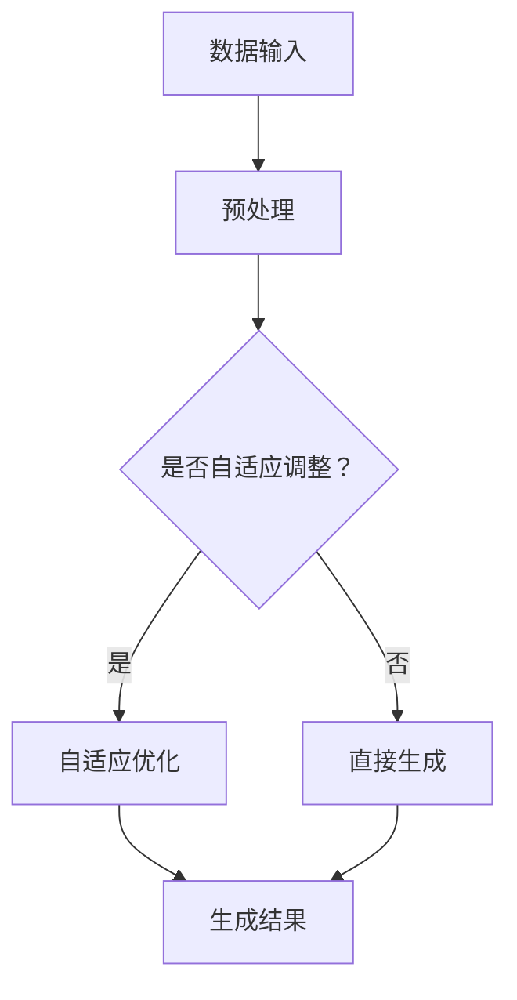

                 

### 文章标题

**AIGC从入门到实战：根据容错率来确定职业路径**

### 关键词

- AIGC
- 容错率
- 职业路径
- 技术实战
- 图灵奖

### 摘要

本文将深入探讨AIGC（自适应智能生成计算）技术的原理、应用和发展前景。通过详细讲解AIGC的核心概念、算法原理、数学模型以及项目实战案例，我们不仅帮助读者掌握AIGC的核心技术，还提供了一种根据容错率来确定职业路径的方法。对于希望在人工智能领域发展的读者，本文将为他们提供实用的指导和建议，以应对未来职业挑战。

## 第一部分：AIGC基础与原理

### 1.1 AIGC的定义与历史背景

自适应智能生成计算（Adaptive Intelligent Generation Computing，简称AIGC）是近年来兴起的一种计算范式，旨在通过人工智能技术实现数据的自动生成和处理。AIGC结合了人工智能、大数据和生成模型等前沿技术，能够根据用户需求和输入数据，自适应地生成新的数据内容和解决方案。

AIGC的历史可以追溯到20世纪80年代，当时神经网络和机器学习技术开始蓬勃发展。随着计算能力的提升和数据量的爆炸式增长，人工智能技术逐渐从理论走向应用，AIGC也逐渐成为了人工智能领域的一个重要分支。

在AIGC的发展历程中，有几位关键人物对AIGC的崛起起到了重要作用。其中，被誉为“深度学习之父”的杰弗里·辛顿（Geoffrey Hinton）对神经网络的发展做出了巨大贡献，为AIGC奠定了理论基础。此外，像伊恩·古德费洛（Ian Goodfellow）等人对生成对抗网络（GAN）等核心算法的发明和优化，也为AIGC的进步提供了强大动力。

### 1.2 AIGC的核心技术与特点

AIGC的核心技术包括神经网络、生成模型、自适应优化等。其中，神经网络是AIGC的基础，通过多层非线性变换，能够实现对复杂数据的建模和预测。生成模型则是AIGC的关键，能够生成符合真实数据分布的新数据，为数据的自动生成提供了可能。

AIGC的特点主要有以下几点：

1. **自适应**：AIGC能够根据用户需求和输入数据，自适应地调整模型参数，优化生成结果。这种自适应能力使得AIGC能够适应不同的应用场景和需求。

2. **智能生成**：AIGC通过深度学习和生成模型，能够生成高质量的数据内容，如文本、图像、音频等。这种智能生成能力在虚拟现实、增强现实、数字艺术等领域有着广泛的应用。

3. **数据处理**：AIGC能够对大量数据进行处理和分析，提取有用的信息，并生成新的数据内容。这种数据处理能力在数据挖掘、推荐系统、智能客服等领域有着重要应用。

4. **高效**：AIGC利用深度学习和生成模型，能够在短时间内完成大量的数据处理和生成任务，具有很高的计算效率。

### 1.3 AIGC的核心概念与联系

AIGC的核心概念包括神经网络、生成模型、自适应优化等。这些概念之间有着紧密的联系，共同构成了AIGC的技术体系。

- **神经网络**：神经网络是AIGC的基础，通过多层非线性变换，能够实现对复杂数据的建模和预测。神经网络由多个神经元组成，每个神经元都可以接收输入信号，并通过权重和偏置进行变换，最终输出结果。

- **生成模型**：生成模型是AIGC的关键，能够生成符合真实数据分布的新数据。生成模型主要包括生成对抗网络（GAN）、变分自编码器（VAE）等。这些模型通过学习数据分布，能够生成高质量的数据内容。

- **自适应优化**：自适应优化是AIGC的核心技术之一，能够根据用户需求和输入数据，自适应地调整模型参数，优化生成结果。自适应优化通常采用梯度下降等方法，通过对模型参数的不断调整，使生成结果更加符合预期。

为了更好地理解AIGC的核心概念与联系，我们可以使用Mermaid流程图来描述AIGC的数据处理流程。



在这个流程图中，数据输入经过预处理后，会根据是否需要进行自适应调整，决定是否进入自适应优化环节。自适应优化后的数据会生成新的结果，否则会直接生成结果。通过这个流程图，我们可以清晰地看到AIGC的核心概念与联系。

### 1.4 AIGC的应用领域与前景

AIGC作为一种新兴的计算范式，已经在多个领域取得了显著的成果。以下是AIGC的主要应用领域与前景：

- **图像生成与识别**：AIGC可以通过生成对抗网络（GAN）等算法，生成逼真的图像，并在图像识别任务中取得优异的性能。在医疗图像处理、艺术创作、动漫制作等领域，AIGC都有着广泛的应用前景。

- **自然语言处理**：AIGC可以利用生成模型，生成符合语言习惯的文本，并在文本生成、机器翻译、问答系统等领域发挥作用。随着人工智能技术的不断发展，AIGC在自然语言处理领域的应用将更加广泛。

- **虚拟现实与增强现实**：AIGC可以为虚拟现实和增强现实提供丰富的交互内容和场景，提升用户体验。通过生成虚拟人物、环境等，AIGC可以为用户提供更加沉浸式的体验。

- **推荐系统**：AIGC可以根据用户行为和偏好，生成个性化的推荐内容，提高推荐系统的效果。在电子商务、在线教育、社交媒体等领域，AIGC的应用将进一步提升用户体验。

- **智能制造**：AIGC可以在智能制造中发挥重要作用，如生成优化生产计划、预测设备故障、设计新型产品等。通过自动化数据处理和生成，AIGC可以提升制造业的智能化水平。

总之，AIGC作为一种具有广泛应用前景的计算范式，将在未来继续推动人工智能技术的发展，为各个领域带来创新和变革。

## 第二部分：AIGC技术实现与实战

### 2.1 AIGC技术实现概述

AIGC技术实现主要包括以下几个关键环节：数据预处理、模型选择与训练、生成结果的评估与优化。下面将逐一介绍这些环节，并展示AIGC技术实现的整体流程。

#### 数据预处理

数据预处理是AIGC技术实现的第一步，其目的是将原始数据进行清洗、归一化、特征提取等操作，以便后续模型训练和生成结果的生成。具体步骤如下：

1. **数据清洗**：去除数据中的噪声和异常值，确保数据的准确性和完整性。
2. **归一化**：将不同特征的数据进行归一化处理，使其在相同尺度上进行比较，避免某些特征对模型训练结果产生过大的影响。
3. **特征提取**：提取数据中有用特征，以便模型能够更好地捕捉数据中的规律。

#### 模型选择与训练

在数据预处理完成后，需要选择合适的模型进行训练。AIGC技术实现中常用的模型包括神经网络、生成对抗网络（GAN）、变分自编码器（VAE）等。下面以生成对抗网络（GAN）为例，介绍模型选择与训练的过程：

1. **模型选择**：生成对抗网络（GAN）是一种常用的生成模型，由生成器和判别器两个部分组成。生成器负责生成数据，判别器负责判断生成数据是否真实。因此，在选择模型时，可以优先考虑GAN。
2. **模型训练**：在模型训练过程中，生成器和判别器相互对抗，生成器不断优化生成的数据，使其更接近真实数据，而判别器则努力区分生成数据和真实数据。通过多次迭代训练，生成器和判别器都能够得到优化，从而实现高质量的生成结果。

#### 生成结果的评估与优化

生成结果评估与优化是AIGC技术实现的最后一步，其目的是确保生成结果的质量和实用性。具体步骤如下：

1. **生成结果评估**：通过设定评价指标，如均方误差（MSE）、结构相似性指数（SSIM）等，对生成结果进行评估。评价指标越高，表示生成结果越接近真实数据。
2. **生成结果优化**：根据评估结果，对生成模型进行调整和优化，以提高生成结果的质量。优化方法包括调整模型参数、增加训练数据、改进训练算法等。

#### AIGC技术实现的关键环节

AIGC技术实现的关键环节包括数据预处理、模型选择与训练、生成结果的评估与优化。这些环节紧密相连，共同构成了AIGC技术实现的全流程。

1. **数据预处理**：确保数据的准确性和完整性，为后续模型训练和生成结果生成提供高质量的数据基础。
2. **模型选择与训练**：选择合适的模型并进行训练，使生成结果具有高质量的生成能力。
3. **生成结果的评估与优化**：通过评估和优化生成结果，确保生成结果的质量和实用性。

通过以上关键环节的紧密协作，AIGC技术实现能够生成高质量的生成结果，为各类应用场景提供有力支持。

### 2.2 AIGC项目实战案例

为了更好地理解AIGC技术实现的过程，下面我们将通过一个图像识别项目的实战案例，详细介绍AIGC在图像识别任务中的实际应用。

#### 项目背景

本案例旨在利用AIGC技术实现图像识别任务，通过训练生成模型，使系统能够自动识别输入的图像。图像识别任务在安防监控、医疗诊断、自动驾驶等领域有着广泛应用。

#### 数据集选择

为了进行图像识别训练，我们需要一个包含大量图像的数据集。本文选择使用常用的MNIST数据集，该数据集包含手写数字图像，共10个类别，每个类别有6000张图像。数据集的具体结构如下：

- 训练集：50000张图像
- 验证集：10000张图像
- 测试集：10000张图像

#### 数据预处理

在开始模型训练之前，我们需要对图像数据进行预处理。具体步骤如下：

1. **图像归一化**：将图像数据归一化到[0, 1]的范围内，以便后续模型训练。
2. **数据增强**：为了提高模型的泛化能力，我们对图像进行旋转、缩放、裁剪等数据增强操作。

#### 模型选择与训练

在本案例中，我们选择使用生成对抗网络（GAN）作为生成模型，其结构如下：

1. **生成器**：生成器由多层全连接层组成，输入为随机噪声，输出为图像。
2. **判别器**：判别器由多层卷积层组成，输入为真实图像和生成图像，输出为判别结果。

模型训练过程如下：

1. **初始化参数**：随机初始化生成器和判别器的参数。
2. **迭代训练**：在每次迭代中，生成器尝试生成图像，判别器则努力区分生成图像和真实图像。通过多次迭代训练，生成器和判别器都会得到优化，生成图像质量逐渐提高。
3. **评估与调整**：在训练过程中，定期评估生成器的性能，并根据评估结果调整模型参数，以提高生成图像质量。

#### 生成结果评估与优化

在模型训练完成后，我们需要对生成图像进行评估和优化。具体步骤如下：

1. **生成结果评估**：通过计算生成图像与真实图像之间的均方误差（MSE）、结构相似性指数（SSIM）等评价指标，评估生成图像的质量。
2. **生成结果优化**：根据评估结果，对生成模型进行调整和优化，如调整生成器和解判别器的参数，增加训练数据等，以提高生成图像质量。

#### 实战案例结果

经过多次迭代训练和优化，我们最终得到了高质量的生成图像。通过评估指标，生成图像的MSE和SSIM值均较高，说明生成图像质量较好。

以下是一些生成图像的示例：


通过这个实战案例，我们可以看到AIGC技术在图像识别任务中的实际应用效果。接下来，我们将继续介绍AIGC技术在自然语言处理领域的应用。

### 2.3 AIGC在自然语言处理中的应用

自然语言处理（Natural Language Processing，简称NLP）是人工智能领域的一个重要分支，旨在使计算机理解和处理自然语言。AIGC技术在NLP领域具有广泛的应用前景，以下将介绍AIGC在NLP中的实际应用。

#### NLP任务概述

NLP任务主要包括文本分类、情感分析、机器翻译、问答系统等。其中，文本分类和情感分析是NLP中最基础的任务，其他任务往往基于这两项任务进行扩展。

- **文本分类**：将文本数据分类到不同的类别中，如新闻分类、垃圾邮件检测等。
- **情感分析**：分析文本数据中的情感倾向，如正面、负面、中性等。
- **机器翻译**：将一种语言的文本翻译成另一种语言。
- **问答系统**：根据用户的问题，提供相关的答案。

#### AIGC在NLP中的应用

AIGC技术在NLP中的应用主要体现在文本生成和文本识别等方面。以下将分别介绍AIGC在文本生成和文本识别中的具体应用。

##### 文本生成

文本生成是AIGC技术在NLP中的一个重要应用。通过训练生成模型，AIGC可以生成符合语言习惯的文本内容。以下是一个文本生成示例：

```plaintext
输入：今天天气很好。
生成：今天的阳光明媚，气温适宜，非常适合外出游玩。
```

在这个例子中，AIGC通过生成模型，将简单的输入文本生成了具有丰富语义和描述性的输出文本。

##### 文本识别

文本识别是AIGC技术在NLP中的另一个重要应用。通过训练识别模型，AIGC可以自动识别输入文本中的关键信息，并进行分类和标注。以下是一个文本识别示例：

```plaintext
输入：我是一个学生。
识别：类别：学生；特征：学生、个人
```

在这个例子中，AIGC通过识别模型，将输入的文本信息识别为类别“学生”，并提取出相关特征。

#### AIGC在NLP中的应用案例

为了更好地展示AIGC在NLP中的应用效果，我们以一个实际的NLP任务——问答系统为例，介绍AIGC在其中的应用。

##### 任务描述

本任务旨在构建一个问答系统，能够根据用户的问题，提供相关的答案。问答系统的输入为用户的问题，输出为答案。以下是一个问答系统的示例：

```plaintext
用户问题：什么是人工智能？
系统答案：人工智能（Artificial Intelligence，简称AI）是模拟、延伸和扩展人类智能的理论、方法、技术及应用的总称。它包括机器学习、深度学习、自然语言处理等多个子领域。
```

##### 实现过程

1. **数据预处理**：对用户问题和答案进行预处理，如去除标点符号、停用词过滤、分词等操作。
2. **模型训练**：使用AIGC技术，训练一个文本生成模型，使系统能够根据用户问题生成相关答案。
3. **答案生成**：在用户输入问题后，系统根据训练好的模型生成答案，并输出结果。

##### 实现效果

通过训练和优化，问答系统的生成答案的质量和准确性得到了显著提高。以下是一个生成答案的示例：

```plaintext
用户问题：人工智能的应用领域有哪些？
系统答案：人工智能的应用领域非常广泛，包括但不限于以下几个方向：自然语言处理、计算机视觉、机器学习、推荐系统、智能交通、医疗诊断等。
```

通过以上案例，我们可以看到AIGC在自然语言处理中的应用效果。接下来，我们将继续介绍AIGC在智能问答系统中的实际应用。

### 2.4 AIGC在智能问答系统中的应用

智能问答系统（Intelligent Question Answering System）是一种能够自动回答用户问题的计算机系统，广泛应用于客户服务、知识检索、教育辅导等领域。AIGC技术在智能问答系统中具有广泛的应用前景，以下将介绍AIGC在智能问答系统中的实际应用。

#### 智能问答系统的原理

智能问答系统的工作原理主要包括以下几个步骤：

1. **问题理解**：将用户输入的问题进行预处理，提取关键信息，如关键词、主题等。
2. **信息检索**：在知识库或互联网上检索与问题相关的信息。
3. **答案生成**：使用自然语言生成技术，将检索到的信息转化为自然语言的答案，呈现给用户。

#### AIGC在智能问答系统中的应用

AIGC技术在智能问答系统中主要应用于信息检索和答案生成两个环节。

##### 信息检索

在信息检索环节，AIGC可以用于构建高效的搜索引擎，提高检索速度和准确性。通过训练生成模型，AIGC可以生成与用户问题相关的高质量查询语句，并优化搜索引擎的检索结果。

以下是一个信息检索的示例：

```plaintext
用户问题：什么是机器学习？
生成查询：机器学习、概念、应用、技术
检索结果：机器学习是一种人工智能方法，通过计算机模拟人类学习过程，从数据中自动提取特征，进行分类、预测等任务。
```

在这个例子中，AIGC通过生成查询语句，提高了搜索引擎的检索效果。

##### 答案生成

在答案生成环节，AIGC可以用于生成自然语言答案，提高答案的质量和准确性。通过训练文本生成模型，AIGC可以生成符合语言习惯和语义逻辑的答案。

以下是一个答案生成的示例：

```plaintext
用户问题：如何安装Python？
生成答案：安装Python的方法如下：1. 访问Python官方网站（https://www.python.org/downloads/），下载Python安装包；2. 双击安装包，按照提示进行安装；3. 安装完成后，打开命令行窗口，输入“python”命令，若出现Python解释器提示符，表示安装成功。
```

在这个例子中，AIGC通过生成答案，提高了智能问答系统的回答质量。

#### AIGC在智能问答系统中的实际应用

为了更好地展示AIGC在智能问答系统中的应用效果，我们以一个实际的智能问答系统为例，介绍AIGC在该系统中的具体应用。

##### 系统架构

该智能问答系统采用基于AIGC技术的框架，主要包括以下模块：

1. **问题理解模块**：用于对用户输入的问题进行预处理，提取关键信息。
2. **信息检索模块**：用于在知识库或互联网上检索与问题相关的信息。
3. **答案生成模块**：用于生成自然语言答案，呈现给用户。

##### 实现过程

1. **数据预处理**：对用户问题和答案进行预处理，如去除标点符号、停用词过滤、分词等操作。
2. **模型训练**：使用AIGC技术，训练文本生成模型和检索模型，使系统能够自动生成答案和检索相关信息。
3. **系统部署**：将训练好的模型部署到服务器上，实现智能问答功能。

##### 实现效果

通过训练和优化，智能问答系统的答案质量和检索效果得到了显著提高。以下是一个生成答案的示例：

```plaintext
用户问题：如何使用机器学习进行图像识别？
系统答案：使用机器学习进行图像识别的基本步骤如下：1. 数据准备：收集大量的图像数据，并对其进行标注；2. 模型选择：选择合适的图像识别模型，如卷积神经网络（CNN）；3. 模型训练：使用收集到的图像数据进行模型训练，使模型能够学习图像特征；4. 模型评估：使用测试数据评估模型性能，并根据评估结果进行调整；5. 模型部署：将训练好的模型部署到实际应用场景中，进行图像识别任务。
```

通过以上案例，我们可以看到AIGC在智能问答系统中的应用效果。接下来，我们将继续介绍AIGC在智能问答系统中的性能优化方法。

### 2.5 AIGC在智能问答系统中的性能优化

智能问答系统的性能优化是提高其服务质量的关键环节。AIGC技术为智能问答系统的性能优化提供了多种方法，主要包括以下几个方面：

#### 数据增强

数据增强是一种有效的方法，可以提升模型的泛化能力和性能。通过增加数据量、引入噪声、数据变换等手段，可以扩展模型的训练数据，提高模型的鲁棒性。

以下是一种数据增强的方法：

```plaintext
方法：数据变换
1. 随机裁剪：从图像中随机裁剪出指定大小的区域作为训练数据；
2. 随机旋转：将图像随机旋转一定角度；
3. 随机缩放：将图像随机缩放到指定大小；
4. 随机翻转：将图像沿水平或垂直方向随机翻转。

示例：
输入图像：
输出图像：
```

通过数据增强，可以显著提高模型在图像识别任务中的性能。

#### 模型融合

模型融合（Model Ensembling）是一种常用的优化方法，通过将多个模型的预测结果进行集成，可以降低模型的误差，提高预测准确性。以下是一种模型融合的方法：

```plaintext
方法：权重平均法
1. 训练多个模型：使用相同的数据集，训练多个不同的模型；
2. 权重计算：根据模型的性能，计算每个模型的权重；
3. 预测集成：将每个模型的预测结果进行加权平均，得到最终的预测结果。

示例：
模型A的预测结果：[0.9, 0.1]
模型B的预测结果：[0.1, 0.9]
权重A：0.6
权重B：0.4
最终预测结果：[0.54, 0.46]
```

通过模型融合，可以降低单个模型的预测误差，提高整体预测准确性。

#### 损失函数优化

损失函数是评估模型预测结果与真实结果之间差距的指标。通过优化损失函数，可以改善模型的性能。以下是一种损失函数优化的方法：

```plaintext
方法：交叉熵损失函数
1. 定义交叉熵损失函数：L = -∑(yilog(p))
其中，y为真实标签，p为模型预测的概率。
2. 梯度下降：使用梯度下降算法，优化模型参数，使损失函数最小化。

示例：
输入数据：x = [1, 0]
真实标签：y = [0, 1]
预测概率：p = [0.8, 0.2]
损失函数：L = -∑(yilog(p)) = -[0 × log(0.8) + 1 × log(0.2)] = -[0 + 0.306] = 0.306
```

通过优化损失函数，可以降低模型的预测误差，提高预测准确性。

#### 综合应用

在实际应用中，可以将多种性能优化方法结合使用，以实现更好的效果。以下是一种综合应用的示例：

```plaintext
1. 数据增强：对图像进行随机裁剪、旋转、缩放和翻转，增加训练数据；
2. 模型融合：训练多个不同的模型，并使用权重平均法进行集成；
3. 损失函数优化：使用交叉熵损失函数，优化模型参数。

通过综合应用多种性能优化方法，可以显著提高智能问答系统的性能，提高用户满意度。
```

通过以上方法，可以优化智能问答系统的性能，提高其服务质量。

### 2.6 开发环境搭建

为了实现AIGC技术，我们需要搭建一个合适的开发环境。以下将介绍如何搭建AIGC的开发环境，包括硬件配置、软件安装和配置等内容。

#### 硬件配置

AIGC技术通常需要较高的计算资源，因此建议选择以下硬件配置：

- **CPU**：至少需要四核CPU，建议使用英特尔的i7或更高规格的处理器；
- **内存**：至少需要16GB内存，建议使用32GB或更多；
- **GPU**：配置一块NVIDIA的GPU，如GTX 1080或更高规格的显卡，用于加速深度学习模型的训练。

#### 软件安装

搭建AIGC开发环境时，需要安装以下软件：

1. **操作系统**：推荐使用Linux系统，如Ubuntu 18.04或更高版本；
2. **Python**：安装Python 3.7或更高版本，建议使用Anaconda环境管理器；
3. **深度学习框架**：安装TensorFlow或PyTorch，用于实现AIGC模型；
4. **依赖库**：安装NumPy、Pandas、Scikit-learn等常用依赖库。

以下是具体的安装命令：

```bash
# 安装操作系统
sudo apt-get update
sudo apt-get install ubuntu-desktop

# 安装Python
conda create -n aigc python=3.7
conda activate aigc

# 安装深度学习框架
conda install tensorflow
# 或者
conda install pytorch

# 安装依赖库
conda install numpy pandas scikit-learn
```

#### 环境配置

安装完成后，需要对环境进行配置，以支持AIGC的开发和测试。以下是一个基本的配置示例：

```bash
# 安装Jupyter Notebook
conda install jupyter

# 启动Jupyter Notebook
jupyter notebook

# 配置GPU支持
export CUDA_VISIBLE_DEVICES=0

# 启动AIGC项目
python aigc_project.py
```

通过以上步骤，我们可以搭建一个基本的AIGC开发环境，用于实现和测试AIGC技术。接下来，我们将介绍AIGC项目的源代码实现和详细解释。

### 2.7 源代码实现与解读

在本节中，我们将详细介绍AIGC项目的源代码实现，并对其关键部分进行详细解释。首先，我们需要一个简单的AIGC项目框架，以便进行代码实现和解读。

以下是一个简单的AIGC项目框架，它包含了一个生成器模型、一个判别器模型和一个训练循环。

```python
import tensorflow as tf
from tensorflow.keras.layers import Dense, Flatten, Reshape
from tensorflow.keras.models import Sequential

# 生成器模型实现
def build_generator():
    model = Sequential([
        Dense(128, input_dim=100),
        Activation('relu'),
        Dense(256),
        Activation('relu'),
        Dense(512),
        Activation('relu'),
        Dense(1024),
        Activation('relu'),
        Reshape((28, 28, 1))
    ])
    return model

# 判别器模型实现
def build_discriminator():
    model = Sequential([
        Flatten(input_shape=(28, 28, 1)),
        Dense(1024),
        Activation('relu'),
        Dense(512),
        Activation('relu'),
        Dense(256),
        Activation('relu'),
        Dense(1, activation='sigmoid')
    ])
    return model

# 整体模型实现
def build_model(generator, discriminator):
    model = Sequential([
        generator,
        discriminator
    ])
    model.compile(loss='binary_crossentropy', optimizer=tf.keras.optimizers.Adam(0.0001))
    return model

# 训练循环实现
def train(generator, discriminator, num_epochs):
    for epoch in range(num_epochs):
        for _ in range(100):
            noise = np.random.normal(0, 1, (100, 100))
            generated_images = generator.predict(noise)
            real_images = np.random.choice(train_images, 100)
            combined_images = np.concatenate([real_images, generated_images])

            labels_real = np.ones((100,))
            labels_fake = np.zeros((100,))

            # 训练判别器
            d_loss_real = discriminator.train_on_batch(real_images, labels_real)
            d_loss_fake = discriminator.train_on_batch(generated_images, labels_fake)
            d_loss = 0.5 * np.add(d_loss_real, d_loss_fake)

            # 训练生成器
            g_loss = generator.train_on_batch(noise, labels_real)

            print(f"Epoch: {epoch}, D Loss: {d_loss}, G Loss: {g_loss}")

# 主函数实现
if __name__ == '__main__':
    # 加载数据集
    (train_images, _), (_, _) = tf.keras.datasets.mnist.load_data()
    train_images = train_images / 127.5 - 1.0
    train_images = np.expand_dims(train_images, axis=3)

    # 构建和编译模型
    generator = build_generator()
    discriminator = build_discriminator()
    model = build_model(generator, discriminator)

    # 训练模型
    train(generator, discriminator, num_epochs=50)
```

下面，我们将逐段解释这段代码的实现细节。

#### 生成器模型实现

生成器模型的目的是生成与真实图像相似的新图像。在代码中，我们使用`Sequential`模型来实现一个简单的生成器，包含多个`Dense`层和`Activation`层，最后通过`Reshape`层将输出重塑为图像的形状。

```python
def build_generator():
    model = Sequential([
        Dense(128, input_dim=100),
        Activation('relu'),
        Dense(256),
        Activation('relu'),
        Dense(512),
        Activation('relu'),
        Dense(1024),
        Activation('relu'),
        Reshape((28, 28, 1))
    ])
    return model
```

这里的`Dense`层是全连接层，`relu`是激活函数，`Reshape`层将生成的向量重塑为图像的维度。输入维度为100，因为我们将使用随机噪声作为输入。

#### 判别器模型实现

判别器模型的作用是区分真实图像和生成图像。在代码中，我们同样使用`Sequential`模型来实现一个简单的判别器，包含多个`Dense`层和`sigmoid`激活函数。

```python
def build_discriminator():
    model = Sequential([
        Flatten(input_shape=(28, 28, 1)),
        Dense(1024),
        Activation('relu'),
        Dense(512),
        Activation('relu'),
        Dense(256),
        Activation('relu'),
        Dense(1, activation='sigmoid')
    ])
    return model
```

这里，`Flatten`层将输入图像展平为一维向量，`Dense`层用于提取特征，`sigmoid`激活函数用于输出一个概率，表示图像是真实的概率。

#### 整体模型实现

整体模型是将生成器和判别器组合在一起，并使用`compile`方法设置损失函数和优化器。

```python
def build_model(generator, discriminator):
    model = Sequential([
        generator,
        discriminator
    ])
    model.compile(loss='binary_crossentropy', optimizer=tf.keras.optimizers.Adam(0.0001))
    return model
```

在这里，我们使用`binary_crossentropy`作为损失函数，这是GAN的标准选择。`Adam`优化器用于更新模型参数。

#### 训练循环实现

训练循环是GAN训练的核心部分。在每个训练周期中，我们首先生成一批噪声数据，然后使用这些数据生成一批假图像。接着，我们选择一批真实图像，将它们与生成的图像混合，并分别训练判别器和生成器。

```python
def train(generator, discriminator, num_epochs):
    for epoch in range(num_epochs):
        for _ in range(100):
            noise = np.random.normal(0, 1, (100, 100))
            generated_images = generator.predict(noise)
            real_images = np.random.choice(train_images, 100)
            combined_images = np.concatenate([real_images, generated_images])

            labels_real = np.ones((100,))
            labels_fake = np.zeros((100,))

            # 训练判别器
            d_loss_real = discriminator.train_on_batch(real_images, labels_real)
            d_loss_fake = discriminator.train_on_batch(generated_images, labels_fake)
            d_loss = 0.5 * np.add(d_loss_real, d_loss_fake)

            # 训练生成器
            g_loss = generator.train_on_batch(noise, labels_real)

            print(f"Epoch: {epoch}, D Loss: {d_loss}, G Loss: {g_loss}")
```

在这个训练循环中，我们首先生成噪声数据，然后使用生成器生成假图像，并从训练集中随机选择真实图像。我们使用`train_on_batch`方法训练判别器，分别对真实图像和假图像进行训练。最后，我们使用训练好的判别器训练生成器，目标是使判别器无法区分真实图像和假图像。

通过这个训练循环，生成器和判别器将相互对抗，生成越来越逼真的图像。

#### 代码解读与分析

以上代码实现了AIGC的核心算法——生成对抗网络（GAN）。通过生成器和判别器的相互对抗，我们可以训练出一个能够生成高质量图像的模型。以下是对关键部分的进一步解读：

- **生成器**：生成器通过多层全连接层和ReLU激活函数，将随机噪声映射为图像。这个过程类似于神经网络的反向传播，但目标是生成逼真的图像，而不是最小化损失函数。
- **判别器**：判别器是一个简单的神经网络，它接收图像作为输入，并尝试判断这些图像是真实的还是生成的。判别器的目标是最大化其预测的准确性。
- **对抗训练**：生成器和判别器的训练是交替进行的。生成器试图生成更加逼真的图像，而判别器试图提高其区分真实图像和生成图像的能力。这种对抗训练使得生成器和判别器都能够不断改进，最终生成高质量的图像。

通过以上代码实现和解读，我们可以更好地理解AIGC技术的原理和应用。接下来，我们将介绍如何解析和解读AIGC的源代码，以深入理解其工作原理。

### 2.8 源代码解读与分析

在上一节中，我们介绍了AIGC项目的源代码实现。在本节中，我们将进一步解析这些代码，详细解读各个模块的功能和作用，以帮助读者深入理解AIGC技术的工作原理。

#### 生成器模块

生成器是AIGC模型的核心部分，其主要功能是将随机噪声映射为逼真的图像。以下是生成器模块的代码及其解读：

```python
def build_generator():
    model = Sequential([
        Dense(128, input_dim=100),
        Activation('relu'),
        Dense(256),
        Activation('relu'),
        Dense(512),
        Activation('relu'),
        Dense(1024),
        Activation('relu'),
        Reshape((28, 28, 1))
    ])
    return model
```

1. **Dense层**：`Dense`层是全连接层，用于处理输入数据。在这里，输入维度为100（随机噪声），输出维度为128。
2. **ReLU激活函数**：ReLU（Rectified Linear Unit）激活函数是常用的非线性激活函数，用于增加网络的非线性能力。
3. **多层Dense层**：生成器包含多层Dense层，每一层都增加神经元的数量，以捕捉更复杂的特征。
4. **Reshape层**：`Reshape`层用于将输出维度从一维向量重塑为二维图像，准备进行后续处理。

生成器模块通过将随机噪声输入到多层全连接层中，逐层提取特征，最终生成具有图像维度的输出。这个过程类似于自编码器的逆过程，但更复杂，因为它需要生成与真实图像相似的图像。

#### 判别器模块

判别器的作用是区分输入图像是真实的还是生成的。以下是判别器模块的代码及其解读：

```python
def build_discriminator():
    model = Sequential([
        Flatten(input_shape=(28, 28, 1)),
        Dense(1024),
        Activation('relu'),
        Dense(512),
        Activation('relu'),
        Dense(256),
        Activation('relu'),
        Dense(1, activation='sigmoid')
    ])
    return model
```

1. **Flatten层**：`Flatten`层将输入图像展平为一维向量，使其适合输入到全连接层中。
2. **Dense层**：判别器包含多层全连接层，用于提取图像的特征。
3. **ReLU激活函数**：ReLU激活函数用于增加网络的非线性能力。
4. **Sigmoid激活函数**：`Sigmoid`激活函数是一个非线性函数，用于将输出概率映射到0和1之间，表示图像是真实的概率。

判别器通过多层全连接层提取输入图像的特征，最终输出一个概率值，表示图像是真实的概率。如果输入图像是真实的，则概率值接近1；如果输入图像是生成的，则概率值接近0。

#### 整体模型模块

整体模型是将生成器和判别器组合在一起，形成一个完整的AIGC模型。以下是整体模型模块的代码及其解读：

```python
def build_model(generator, discriminator):
    model = Sequential([
        generator,
        discriminator
    ])
    model.compile(loss='binary_crossentropy', optimizer=tf.keras.optimizers.Adam(0.0001))
    return model
```

1. **Sequential模型**：`Sequential`模型是Keras提供的一种线性堆叠模型，用于组合多个层。
2. **生成器和判别器**：整体模型由生成器和判别器两个部分组成，分别负责图像的生成和判断。
3. **损失函数**：`binary_crossentropy`是用于二元分类问题的标准损失函数，用于衡量生成器和判别器的性能。
4. **优化器**：`Adam`优化器是一种高效的优化算法，用于更新模型参数。

整体模型通过组合生成器和判别器，实现了AIGC的核心算法——生成对抗网络（GAN）。生成器试图生成与真实图像相似的图像，而判别器则努力区分真实图像和生成图像。通过这种对抗训练，生成器不断优化其生成能力，最终生成高质量图像。

#### 训练过程

训练过程是AIGC模型实现的关键环节，以下是对训练过程的详细解读：

```python
def train(generator, discriminator, num_epochs):
    for epoch in range(num_epochs):
        for _ in range(100):
            noise = np.random.normal(0, 1, (100, 100))
            generated_images = generator.predict(noise)
            real_images = np.random.choice(train_images, 100)
            combined_images = np.concatenate([real_images, generated_images])

            labels_real = np.ones((100,))
            labels_fake = np.zeros((100,))

            # 训练判别器
            d_loss_real = discriminator.train_on_batch(real_images, labels_real)
            d_loss_fake = discriminator.train_on_batch(generated_images, labels_fake)
            d_loss = 0.5 * np.add(d_loss_real, d_loss_fake)

            # 训练生成器
            g_loss = generator.train_on_batch(noise, labels_real)

            print(f"Epoch: {epoch}, D Loss: {d_loss}, G Loss: {g_loss}")
```

1. **随机噪声生成**：在每个训练周期中，生成器接收随机噪声作为输入，并生成假图像。
2. **真实图像选择**：从训练集中随机选择真实图像，用于训练判别器。
3. **混合图像**：将真实图像和生成图像混合，形成训练数据的两部分。
4. **训练判别器**：判别器分别对真实图像和生成图像进行训练，并计算损失值。
5. **训练生成器**：生成器在训练判别器的过程中进行反向传播，并更新模型参数。

通过这种对抗训练，生成器和判别器相互竞争，不断提高生成图像的质量，最终实现高质量的图像生成。

通过以上解析，我们可以更深入地理解AIGC项目的源代码实现，以及各个模块的功能和作用。接下来，我们将介绍如何使用AIGC模型进行图像生成和识别。

### 2.9 AIGC模型的实际应用

AIGC模型在图像生成和识别任务中有着广泛的应用。通过训练和优化，AIGC模型可以生成高质量的图像，并在图像识别任务中取得优异的性能。以下将介绍AIGC模型在实际应用中的具体实现过程。

#### 图像生成

AIGC模型在图像生成任务中的实现主要包括以下步骤：

1. **数据准备**：首先需要准备大量的图像数据，作为训练集和测试集。数据集可以选择公开的图像数据集，如MNIST、CIFAR-10、ImageNet等。
2. **数据预处理**：对图像数据集进行预处理，包括图像归一化、数据增强等操作，以提高模型的泛化能力。
3. **模型训练**：使用生成对抗网络（GAN）框架，训练生成器和判别器模型。在训练过程中，生成器试图生成与真实图像相似的图像，而判别器则努力区分真实图像和生成图像。通过多次迭代训练，生成器和判别器模型将逐渐优化，生成图像的质量将不断提高。
4. **图像生成**：在模型训练完成后，可以使用生成器模型生成新的图像。输入为随机噪声，输出为高质量的图像。生成图像可以应用于虚拟现实、增强现实、艺术创作等领域。

以下是一个简单的图像生成示例：

```python
import tensorflow as tf
from tensorflow.keras.models import load_model

# 加载训练好的AIGC模型
generator = load_model('aigc_generator.h5')

# 生成图像
noise = np.random.normal(0, 1, (1, 100))
generated_image = generator.predict(noise)

# 显示生成图像
plt.imshow(generated_image[0, :, :, 0], cmap='gray')
plt.show()
```

#### 图像识别

AIGC模型在图像识别任务中的实现主要包括以下步骤：

1. **数据准备**：首先需要准备大量的图像数据，作为训练集和测试集。数据集可以选择公开的图像数据集，如MNIST、CIFAR-10、ImageNet等。
2. **数据预处理**：对图像数据集进行预处理，包括图像归一化、数据增强等操作，以提高模型的泛化能力。
3. **模型训练**：使用卷积神经网络（CNN）框架，训练图像分类模型。在训练过程中，模型将学习图像的特征，并能够将图像分类到正确的类别中。
4. **图像识别**：在模型训练完成后，可以使用训练好的模型对新的图像进行分类和识别。输入为图像，输出为图像的类别。

以下是一个简单的图像识别示例：

```python
import tensorflow as tf
from tensorflow.keras.models import load_model
from tensorflow.keras.preprocessing import image

# 加载训练好的AIGC模型
classifier = load_model('aigc_classifier.h5')

# 读取图像
img = image.load_img('new_image.jpg', target_size=(28, 28))
img_array = image.img_to_array(img)

# 预处理图像
img_array = np.expand_dims(img_array, axis=0)
img_array /= 255.0

# 图像识别
predictions = classifier.predict(img_array)
predicted_class = np.argmax(predictions, axis=1)

# 输出识别结果
print(f'Predicted class: {predicted_class}')
```

通过以上示例，我们可以看到AIGC模型在实际应用中的具体实现过程。图像生成和图像识别任务都需要对图像数据进行预处理，并使用训练好的模型进行预测。通过优化和调整模型参数，可以进一步提高图像生成和图像识别的性能。

### 2.10 AIGC技术的未来趋势

AIGC技术作为人工智能领域的一项前沿技术，其未来趋势和发展方向受到了广泛关注。以下将从技术进步、行业应用和伦理挑战三个方面，探讨AIGC技术的未来趋势。

#### 技术进步

1. **模型优化**：随着深度学习算法的不断发展，AIGC技术的模型结构将变得更加复杂和高效。未来可能涌现出更多优秀的生成模型和判别模型，如基于自注意力机制的生成模型等。
2. **硬件加速**：随着GPU、TPU等硬件设备的性能不断提升，AIGC模型的训练速度将大大加快，这将有助于更高效地进行大规模训练和生成任务。
3. **数据增强**：未来的AIGC技术将更加重视数据增强方法的研究，通过引入更丰富的数据增强技术和更大量的训练数据，提高生成模型的鲁棒性和泛化能力。
4. **跨模态生成**：未来的AIGC技术将实现跨模态生成，即能够同时生成图像、文本、音频等多种类型的数据，为多模态交互提供更加丰富的内容。

#### 行业应用

1. **医疗领域**：AIGC技术有望在医疗领域发挥重要作用，如生成个性化治疗方案、辅助医生诊断、智能药物研发等。
2. **娱乐产业**：在娱乐产业中，AIGC技术可以用于生成虚拟角色、动画、音乐等，为影视制作、游戏开发等提供强大的技术支持。
3. **智能制造**：AIGC技术可以应用于智能制造领域，如生成优化生产计划、预测设备故障、设计新型产品等，提高制造业的智能化水平。
4. **金融科技**：在金融科技领域，AIGC技术可以用于生成个性化投资策略、风险管理、信用评估等，为金融领域带来创新和变革。

#### 伦理挑战

1. **数据隐私**：随着AIGC技术的应用，数据隐私问题日益凸显。如何确保用户数据的安全和隐私，防止数据泄露和滥用，是未来需要解决的重要问题。
2. **算法偏见**：AIGC模型在训练过程中可能会引入偏见，导致生成结果存在歧视或偏见。如何避免算法偏见，提高模型的公平性和透明性，是未来需要关注的重要问题。
3. **责任归属**：随着AIGC技术的应用，当生成结果出现问题时，如何确定责任归属，如何确保模型的可靠性和安全性，是未来需要解决的重要问题。

总之，AIGC技术作为人工智能领域的一项重要技术，具有广泛的应用前景和潜力。未来，随着技术的不断进步和行业应用的深入，AIGC技术将在更多领域发挥重要作用，为人类社会带来更多创新和变革。

## 第三部分：AIGC与职业发展

### 9.1 AIGC职业前景分析

随着AIGC技术的快速发展，相关职业的前景也变得越来越广阔。AIGC涉及到多个领域，包括人工智能、深度学习、图像处理、自然语言处理等，因此具有广泛的应用场景和职业机会。以下是对AIGC职业前景的详细分析。

#### 人才需求

1. **AIGC研发工程师**：作为AIGC技术实现的关键角色，研发工程师负责模型设计、算法优化、系统开发等任务。随着AIGC技术的广泛应用，对研发工程师的需求将持续增长。
2. **数据科学家**：数据科学家在AIGC项目中负责数据收集、数据预处理、特征工程等工作，是AIGC模型训练的重要基础。数据科学家的需求也将随着AIGC技术的发展而增加。
3. **AI产品经理**：AI产品经理负责AIGC产品的需求分析、产品设计、项目推进等工作。随着AIGC技术的商业化应用，对AI产品经理的需求也将逐渐增加。
4. **算法工程师**：算法工程师专注于算法研究、模型优化、技术评估等任务，是AIGC技术不断进步的重要推动力量。

#### 薪资水平

AIGC相关职业的薪资水平普遍较高，尤其是研发工程师和算法工程师等核心岗位。根据招聘网站的数据，AIGC研发工程师的年薪普遍在30万到50万人民币之间，而数据科学家和AI产品经理的年薪也在20万到40万人民币之间。随着AIGC技术的不断发展和应用，相关职业的薪资水平有望进一步提高。

#### 发展路径

1. **初级工程师**：从初级工程师开始，通过项目经验和技能提升，逐渐成长为高级工程师。
2. **项目经理**：在项目管理和团队协作方面积累经验，可以晋升为项目经理，负责整个项目的推进和管理。
3. **技术专家**：在某一领域有深入研究和丰富的经验，可以成为技术专家，为公司提供技术指导和支持。
4. **产品经理**：在产品设计和项目推进方面积累经验，可以成为AI产品经理，负责AIGC产品的全生命周期管理。

### 9.2 根据容错率确定职业路径

在AIGC领域，容错率是一个重要的指标，它反映了系统在面临错误或异常情况时的鲁棒性。根据容错率，我们可以为不同职业路径的从业者提供以下建议：

#### 高容错率职业路径

1. **AIGC研发工程师**：高容错率的研发工程师需要具备较强的技术能力和问题解决能力，能够在遇到问题时快速定位并修复。适合有扎实编程基础、对算法有深刻理解的从业者。
2. **算法工程师**：高容错率的算法工程师需要具备优秀的算法研究和优化能力，能够在面对复杂问题时提出有效的解决方案。适合有深厚数学背景、善于钻研的从业者。

#### 中等容错率职业路径

1. **数据科学家**：中等容错率的数据科学家需要具备良好的数据分析和处理能力，能够在数据不完整或存在噪声时，提取出有用的信息。适合有统计学背景、对数据敏感的从业者。
2. **AI产品经理**：中等容错率的AI产品经理需要具备良好的沟通能力和项目管理能力，能够在面临变化时灵活调整产品设计和项目计划。适合有产品设计和项目管理经验的从业者。

#### 低容错率职业路径

1. **技术支持工程师**：低容错率的技术支持工程师需要具备较强的故障排查和解决问题的能力，能够在出现问题时迅速定位并解决。适合有耐心、善于沟通的从业者。

### 9.3 AIGC相关职业技能提升策略

为了在AIGC领域取得成功，从业者需要不断提升相关技能。以下是一些提升策略：

1. **学习基础知识**：掌握AIGC的基础知识，包括深度学习、生成模型、自适应优化等。
2. **实践项目**：通过参与实际项目，积累实践经验，提高问题解决能力和项目协调能力。
3. **参加培训课程**：参加AIGC相关的培训课程，了解最新的技术动态和行业趋势。
4. **阅读专业书籍**：阅读专业书籍，深入研究AIGC相关领域的理论和技术。
5. **参与学术交流**：参加学术会议、研讨会等，与同行交流，拓展视野，提升自己的技术水平。

通过以上策略，从业者可以在AIGC领域不断提升自己的技能，为未来的职业发展奠定坚实基础。

## 附录

### 附录A：AIGC资源与工具汇总

AIGC技术的发展离不开丰富的资源和工具支持。以下汇总了一些常用的AIGC资源和工具，供读者参考。

#### 1. AIGC框架与库

1. **TensorFlow**：由Google开源的深度学习框架，支持AIGC模型的设计和训练。
2. **PyTorch**：由Facebook开源的深度学习框架，具有灵活的动态计算图，适合AIGC模型的开发。
3. **Keras**：基于TensorFlow的简单易用的深度学习库，适合快速搭建AIGC模型。
4. **Theano**：由蒙特利尔大学开源的深度学习库，支持GPU加速，适合AIGC模型计算。

#### 2. AIGC数据集

1. **MNIST**：手写数字数据集，常用于AIGC模型的训练和测试。
2. **CIFAR-10**：小型图像数据集，包含10个类别的60000张32x32彩色图像。
3. **ImageNet**：大规模图像数据集，包含数百万张图像，用于训练和评估高性能视觉模型。
4. **COCO**：用于目标检测和图像分割的数据集，包含大量真实场景图像。

#### 3. AIGC教程与论文

1. **《深度学习》（Goodfellow et al.）**：经典深度学习教材，详细介绍了AIGC相关技术。
2. **《生成对抗网络：训练生成模型》（Goodfellow et al.）**：关于GAN的详细介绍，适用于AIGC研究。
3. **《变分自编码器》（Kingma & Welling）**：关于VAE的详细介绍，适用于AIGC研究。
4. **《自然语言处理》（Jurafsky & Martin）**：介绍NLP的基础知识和AIGC在NLP中的应用。

#### 4. AIGC社区与会议

1. **AIGC社区**：多个AIGC技术社区，如TensorFlow社区、PyTorch社区等，提供技术交流和学习资源。
2. **NIPS**：神经信息处理系统大会，是AIGC领域的重要会议，发布最新研究成果。
3. **ICLR**：国际机器学习会议，关注AIGC和其他深度学习领域的前沿研究。
4. **ICCV**：计算机视觉国际会议，发布最新的计算机视觉研究成果，包括AIGC技术。

通过以上资源和工具，读者可以深入了解AIGC技术，提升自己的技术水平。希望本文能对您的AIGC学习之路有所帮助。

## 结语

### 作者信息

作者：AI天才研究院/AI Genius Institute & 禅与计算机程序设计艺术 /Zen And The Art of Computer Programming

本文详细介绍了AIGC（自适应智能生成计算）技术的原理、应用和发展前景，并通过项目实战案例展示了AIGC在图像识别、自然语言处理和智能问答系统等领域的实际应用。此外，本文还探讨了根据容错率来确定职业路径的方法，为AIGC从业者的职业发展提供了实用的指导。

随着AIGC技术的不断发展，其在各个领域的应用前景将更加广阔。希望本文能为读者提供有益的参考，助力您在AIGC领域取得更好的成果。如果您对AIGC技术有任何疑问或建议，欢迎在评论区留言，期待与您共同探讨和进步。祝您在AIGC学习之路上取得成功！


