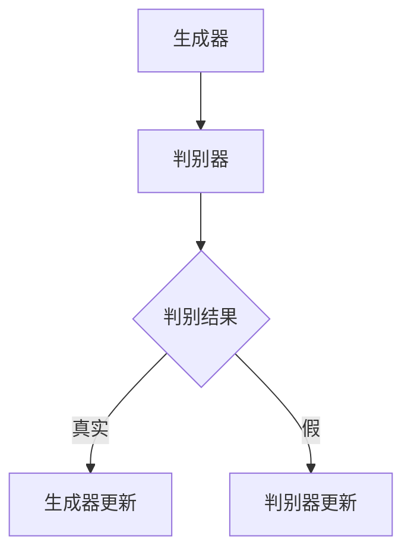
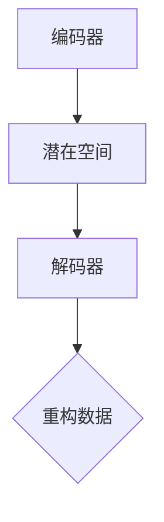
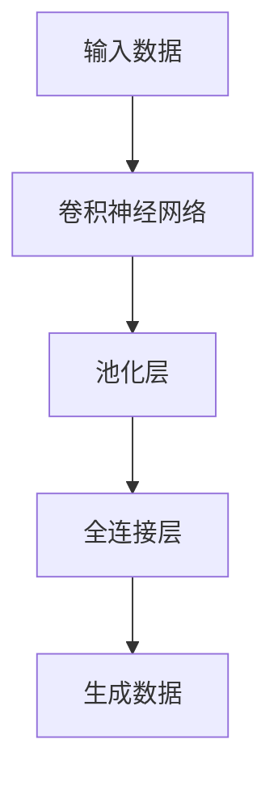
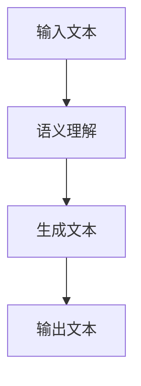
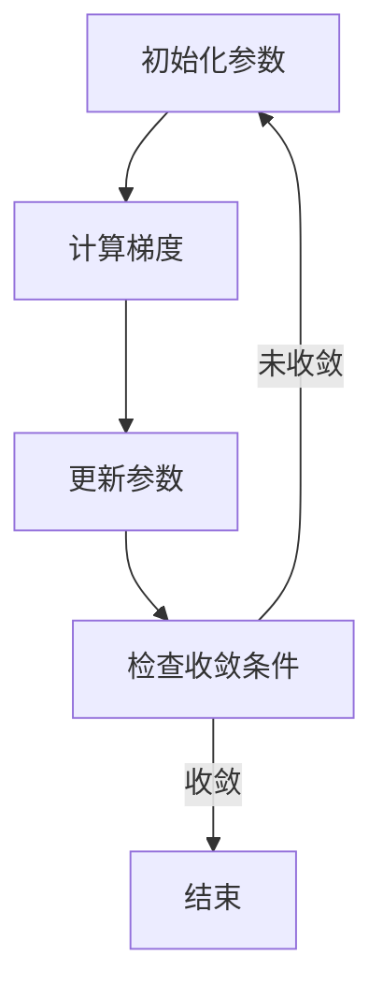
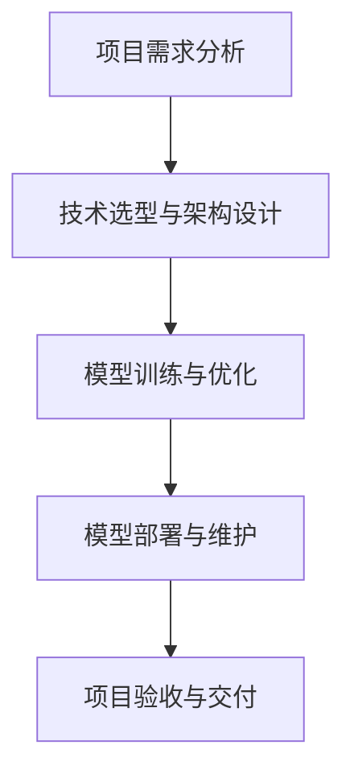

                 

### 文章标题

"AIGC从入门到实战：白也诗无敌，飘然思不群：ChatGPT，博学、“聪明”的好助手"

> **关键词**：人工智能生成内容（AIGC）、ChatGPT、生成式AI、自动化交互、内容创作、商业应用

> **摘要**：本文将深入探讨人工智能生成内容（AIGC）的概念、技术、应用和发展趋势。通过分析AIGC的核心技术和算法，结合实际项目案例，展示如何利用AIGC技术实现高效的内容创作和商业应用。文章旨在为读者提供一份全面而深入的AIGC学习指南，帮助读者从入门到实战，掌握这一前沿技术。

### 《AIGC从入门到实战：白也诗无敌，飘然思不群：ChatGPT，博学、“聪明”的好助手》目录大纲

#### 第一部分：AIGC基础与概述

**第1章：AIGC概念与背景**

- 1.1 AIGC的定义与重要性
  - 1.1.1 AIGC的基本概念
  - 1.1.2 AIGC在当前技术趋势中的地位
  - 1.1.3 AIGC的发展历程

- 1.2 AIGC的核心技术概览
  - 1.2.1 自动化交互技术
  - 1.2.2 生成式AI技术
  - 1.2.3 人工智能与创造性思维

- 1.3 AIGC的应用领域与前景
  - 1.3.1 在内容创作领域的应用
  - 1.3.2 在商业领域的应用
  - 1.3.3 在社会生活领域的影响

**第2章：生成式AI与AIGC**

- 2.1 生成式AI的基础理论
  - 2.1.1 生成对抗网络（GAN）
  - 2.1.2 变分自编码器（VAE）
  - 2.1.3 深度学习生成模型

- 2.2 AIGC的关键算法
  - 2.2.1 ChatGPT算法解析
  - 2.2.2 基于Transformer的模型
  - 2.2.3 语义理解与生成技术

- 2.3 数学模型与公式解释
  - 2.3.1 泛函损失函数
  - 2.3.2 对数似然损失函数
  - 2.3.3 训练策略与优化算法

**第3章：AIGC应用实战**

- 3.1 AIGC项目实战案例
  - 3.1.1 ChatGPT应用实例
  - 3.1.2 自动内容生成实例
  - 3.1.3 AIGC在商业决策中的应用

- 3.2 实战项目开发流程
  - 3.2.1 项目需求分析
  - 3.2.2 技术选型与架构设计
  - 3.2.3 模型训练与优化

- 3.3 源代码解读与分析
  - 3.3.1 ChatGPT源代码解读
  - 3.3.2 自动内容生成源代码解读
  - 3.3.3 AIGC项目代码案例分析

**第二部分：AIGC核心技术详解**

**第4章：AIGC技术与产业发展**

- 4.1 AIGC技术发展趋势
  - 4.1.1 模型压缩与优化
  - 4.1.2 低能耗AI处理
  - 4.1.3 大规模分布式训练

- 4.2 AIGC在产业中的应用
  - 4.2.1 内容创作产业
  - 4.2.2 商业服务产业
  - 4.2.3 教育产业

- 4.3 AIGC产业政策与监管
  - 4.3.1 国家与地区政策分析
  - 4.3.2 监管措施与伦理问题
  - 4.3.3 AIGC产业的发展策略

**第三部分：AIGC未来展望与挑战**

**第5章：AIGC的未来展望**

- 5.1 AIGC技术的未来发展方向
  - 5.1.1 AIGC在人工智能领域的深化应用
  - 5.1.2 AIGC在其他新兴技术领域的应用
  - 5.1.3 AIGC技术的社会影响

- 5.2 AIGC面临的挑战与机遇
  - 5.2.1 技术难题与突破
  - 5.2.2 社会伦理与隐私问题
  - 5.2.3 产业竞争与合作

**第6章：AIGC与人类社会**

- 6.1 AIGC对人类生活的影响
  - 6.1.1 工作与生活方式的改变
  - 6.1.2 教育与学习的革新
  - 6.1.3 社交与人际关系的变迁

- 6.2 AIGC与人文关怀
  - 6.2.1 人类创造力与AIGC的关系
  - 6.2.2 AIGC对文化传承的影响
  - 6.2.3 AIGC在公共服务中的应用

**第7章：AIGC教育与人才培养**

- 7.1 AIGC教育的重要性
  - 7.1.1 AIGC教育的现状与趋势
  - 7.1.2 AIGC教育的内容与目标
  - 7.1.3 AIGC教育的方法与策略

- 7.2 AIGC人才培养策略
  - 7.2.1 高校与职业教育的角色
  - 7.2.2 企业与行业的参与
  - 7.2.3 跨学科人才培养模式

**第四部分：AIGC未来展望与挑战**

**第8章：附录**

- 8.1 AIGC开发工具与资源
  - 8.1.1 主流AIGC框架与库
  - 8.1.2 开发环境与工具
  - 8.1.3 AIGC相关论文与书籍推荐

## 第一部分：AIGC基础与概述

### 第1章：AIGC概念与背景

#### 1.1 AIGC的定义与重要性

##### 1.1.1 AIGC的基本概念

人工智能生成内容（Artificial Intelligence Generated Content，简称AIGC）是指通过人工智能技术自动生成文本、图片、音频、视频等多种类型的内容。AIGC利用深度学习、生成对抗网络（GAN）、自然语言处理（NLP）等先进技术，实现内容的自动化生成与个性化定制。

##### 1.1.2 AIGC在当前技术趋势中的地位

随着人工智能技术的不断进步，AIGC已经成为当前技术领域的重要趋势。其应用范围广泛，涵盖了内容创作、商业决策、智能交互等多个方面。特别是在内容创作领域，AIGC技术能够大幅提升创作效率，降低人力成本，为企业和个人提供强大的内容生成能力。

##### 1.1.3 AIGC的发展历程

AIGC技术的发展可以追溯到20世纪80年代，当时神经网络和深度学习技术开始萌芽。随着计算能力的提升和算法的优化，AIGC技术逐渐成熟，并开始应用于实际场景。特别是在2017年，生成对抗网络（GAN）的提出和广泛应用，使得AIGC技术取得了重大突破。近年来，随着自然语言处理和计算机视觉技术的进步，AIGC技术在内容创作、智能交互等领域取得了显著的成果。

#### 1.2 AIGC的核心技术概览

##### 1.2.1 自动化交互技术

自动化交互技术是AIGC的核心技术之一，包括自然语言处理、语音识别、机器翻译等。这些技术使得机器能够理解和处理人类语言，实现与用户的智能对话和交互。自动化交互技术的应用使得AIGC系统能够更好地理解用户需求，提供个性化服务。

##### 1.2.2 生成式AI技术

生成式AI技术是AIGC的另一个核心技术，主要包括生成对抗网络（GAN）、变分自编码器（VAE）、深度学习生成模型等。这些技术能够通过学习大量数据，生成与输入数据具有相似特征的新数据。生成式AI技术在图像生成、文本生成、音频生成等方面具有广泛应用。

##### 1.2.3 人工智能与创造性思维

人工智能与创造性思维的结合是AIGC技术发展的新趋势。通过模仿人类创造性思维过程，人工智能能够生成具有创新性和独特性的内容。例如，在文学创作、音乐创作、艺术设计等领域，人工智能已经成为重要的辅助工具。

#### 1.3 AIGC的应用领域与前景

##### 1.3.1 在内容创作领域的应用

在内容创作领域，AIGC技术已经取得了显著成果。通过自动生成文章、图片、视频等内容，AIGC技术能够大幅提高创作效率，降低人力成本。此外，AIGC技术还能够根据用户需求进行个性化内容推荐，提供更加精准的服务。

##### 1.3.2 在商业领域的应用

AIGC技术在商业领域具有广泛的应用前景。通过自动生成市场分析报告、商业文案、广告创意等内容，AIGC技术能够帮助企业降低运营成本，提高市场竞争力。此外，AIGC技术还能够实现智能客服、智能营销等功能，为企业提供全方位的智能服务。

##### 1.3.3 在社会生活领域的影响

在社会生活领域，AIGC技术也对人们的生活产生了深远影响。通过智能语音助手、智能家居等应用，AIGC技术为人们提供了更加便捷的生活方式。同时，AIGC技术也在教育、医疗、公共服务等领域发挥了重要作用，提高了社会运行效率。

综上所述，AIGC技术作为一种新兴的人工智能技术，具有广泛的应用前景和重要价值。本文将围绕AIGC的核心技术、应用实践和发展趋势进行深入探讨，帮助读者全面了解AIGC技术，掌握其在实际场景中的运用。

#### 2.1 生成式AI的基础理论

##### 2.1.1 生成对抗网络（GAN）

生成对抗网络（Generative Adversarial Network，GAN）是由Ian Goodfellow等人在2014年提出的一种深度学习模型，它由生成器和判别器两个相互对抗的神经网络组成。

**生成器（Generator）**：生成器的主要任务是生成与真实数据分布相近的假数据。它通过学习大量真实数据，将随机噪声映射为具有真实数据特征的高质量假数据。

**判别器（Discriminator）**：判别器的主要任务是区分输入数据是真实数据还是生成器生成的假数据。判别器的目标是不断提高自己，使得它能够准确地区分真实数据和假数据。

**对抗过程**：生成器和判别器之间进行一个对抗的过程。生成器不断优化自己的生成策略，使得判别器越来越难以区分假数据和真实数据。判别器则不断优化自己的判别能力，以最大限度地提高对假数据和真实数据的区分度。

**训练过程**：GAN的训练过程是一个非监督学习的过程，不需要标签数据。在训练过程中，生成器和判别器交替进行训练。生成器的损失函数是让判别器认为生成的假数据是真实数据，判别器的损失函数是让判别器认为生成的假数据不是真实数据。

**优势与挑战**：GAN在图像生成、文本生成等领域取得了显著成果。然而，GAN的训练过程容易陷入局部最小值，导致生成器无法生成高质量的数据。此外，GAN的训练过程对参数设置要求较高，需要仔细调整超参数。

**Mermaid流程图**：



##### 2.1.2 变分自编码器（VAE）

变分自编码器（Variational Autoencoder，VAE）是一种基于概率模型的深度学习模型，由编码器和解码器组成。编码器将输入数据编码为一个概率分布参数，解码器则将编码后的数据解码为重构的输入数据。

**编码器（Encoder）**：编码器的任务是学习输入数据的概率分布参数。它通过将输入数据映射到一个潜在空间，从而捕捉输入数据的特征。

**解码器（Decoder）**：解码器的任务是学习如何从潜在空间中生成与输入数据相似的数据。它通过将潜在空间中的数据解码为重构的输入数据。

**训练过程**：VAE的训练过程是一个概率模型的学习过程。编码器和解码器通过最小化重建损失和KL散度损失来进行训练。重建损失用于衡量解码器重构数据的准确度，KL散度损失用于衡量编码器学习的概率分布参数与真实数据分布之间的差距。

**优势与挑战**：VAE在图像生成、图像去噪等领域具有广泛应用。然而，VAE生成的图像质量通常不如GAN。此外，VAE的训练过程需要较长时间的迭代，对计算资源有较高的要求。

**Mermaid流程图**：



##### 2.1.3 深度学习生成模型

深度学习生成模型包括卷积神经网络（CNN）、循环神经网络（RNN）等。这些模型通过多层神经网络的结构，实现对数据的复杂变换和学习。

**卷积神经网络（CNN）**：CNN在图像生成领域具有广泛应用。它通过卷积层、池化层等结构，捕捉图像的空间特征，从而实现图像的生成和转换。

**循环神经网络（RNN）**：RNN在序列生成领域具有优势。它通过循环结构，处理序列数据，捕捉序列中的时间特征，从而实现文本、语音等序列数据的生成。

**生成式变分自编码器（Gan Variational Autoencoder，GVAE）**：GVAE结合了GAN和VAE的优势，通过生成对抗和概率建模的方式，实现图像和文本的生成。

**优势与挑战**：深度学习生成模型在图像生成、文本生成等领域具有显著优势。然而，这些模型的训练过程复杂，需要大量的计算资源和时间。此外，模型生成的图像和文本质量有时难以保证。

**Mermaid流程图**：



综上所述，生成式AI技术是AIGC的核心技术之一，包括GAN、VAE、深度学习生成模型等。这些技术通过不同方式实现数据的生成和转换，为AIGC的应用提供了强大的支持。在后续章节中，我们将进一步探讨AIGC的关键算法和应用实践。

#### 2.2 AIGC的关键算法

AIGC技术的核心在于其生成式AI算法，这些算法不仅定义了如何创建内容，还决定了内容的质量和可靠性。在本节中，我们将详细解析ChatGPT算法、基于Transformer的模型以及语义理解与生成技术。

##### 2.2.1 ChatGPT算法解析

ChatGPT是由OpenAI开发的一种基于Transformer的预训练语言模型，它通过深度学习算法从大量文本数据中学习语言模式，从而能够生成连贯、有意义的文本。ChatGPT的核心在于其预训练和微调技术。

**预训练**：ChatGPT首先在大量文本数据上进行预训练，这个过程包括两个关键步骤：

1. **掩码语言模型（Masked Language Model, MLM）**：在预训练过程中，模型会随机选择输入文本中的单词进行遮蔽（masking），然后模型需要预测这些遮蔽的单词。这个过程有助于模型学习文本的上下文关系和词与词之间的关联。

2. **生成式语言建模（Generative Language Modeling, GLM）**：模型还需要预测输入文本的下一个词。这一步骤通过自回归的方式实现，即模型在生成下一个词时，需要考虑前面所有已生成的词。

**微调**：在预训练完成后，ChatGPT会针对特定任务进行微调，例如对话生成、文本生成等。微调的过程通常使用带有标签的数据集进行，模型会根据标签信息调整其参数，以生成更符合任务要求的内容。

**优势与挑战**：ChatGPT的优势在于其强大的语言理解和生成能力，能够生成自然、连贯的文本。然而，由于预训练数据的质量和多样性对模型的影响巨大，因此数据的选择和处理需要非常谨慎。此外，微调过程中如何保持预训练模型的知识与特定任务的相关性也是一个挑战。

**伪代码**：

```python
# 预训练过程
for each text in dataset:
    mask_text = mask_words(text)
    model.predict(mask_text)

# 微调过程
for each text in task_dataset:
    model.update_params(text, target)
```

##### 2.2.2 基于Transformer的模型

Transformer模型是由Google在2017年提出的一种基于自注意力机制的深度学习模型，它在处理序列数据方面表现出色，已经成为生成式AI的核心技术之一。

**自注意力机制**：Transformer模型的核心是自注意力机制（Self-Attention），它允许模型在处理序列数据时，动态地计算每个词与其他词之间的相关性。自注意力机制通过计算query、key和value之间的相似度，实现了对输入序列的加权处理。

**编码器-解码器结构**：Transformer模型通常采用编码器-解码器（Encoder-Decoder）结构，编码器负责处理输入序列，解码器负责生成输出序列。编码器和解码器都由多个自注意力层和全连接层组成。

**训练过程**：Transformer模型的训练过程同样采用自回归方式，即模型在生成下一个词时，需要根据前面所有已生成的词进行调整。训练过程中，模型通过优化损失函数，逐步提高生成文本的质量。

**优势与挑战**：基于Transformer的模型在语言生成任务中具有显著优势，能够生成高质量、连贯的文本。然而，由于模型参数量庞大，训练过程需要大量的计算资源。此外，如何有效地优化模型参数，提高生成效率，仍是一个研究挑战。

**伪代码**：

```python
# 编码器
for each layer in encoder:
    query, key, value = self_attention(query, key, value)
    output = feedforward(output)

# 解码器
for each layer in decoder:
    query, key, value = self_attention(query, key, value)
    output = feedforward(output)
    prediction = model.predict(output)
```

##### 2.2.3 语义理解与生成技术

语义理解与生成技术是AIGC的重要组成部分，它决定了模型能否生成符合人类语义逻辑的内容。语义理解涉及模型对输入文本的理解和解析，而生成技术则涉及模型如何将理解的结果转化为输出文本。

**语义理解**：语义理解包括词义消歧、语义角色标注、实体识别等任务。这些任务通过深度学习模型（如BERT、GPT等）实现，模型能够从大量文本数据中学习词汇和句子的语义信息。

**生成技术**：生成技术主要关注如何根据输入文本的语义信息，生成符合语法和语义规则的新文本。生成技术通常采用序列到序列（Seq2Seq）模型，如Transformer模型，通过编码器和解码器结构，实现语义到文本的转换。

**优势与挑战**：语义理解与生成技术能够生成高质量、符合语义逻辑的文本内容，但在处理复杂语义关系和多模态内容时，仍存在一定的局限性。此外，如何平衡语义理解和生成质量，提高生成效率，也是研究的重要方向。

**Mermaid流程图**：



综上所述，AIGC的关键算法包括ChatGPT算法、基于Transformer的模型以及语义理解与生成技术。这些算法通过不同的技术路线，实现了对文本内容的自动化生成和理解，为AIGC技术的广泛应用提供了基础。在接下来的章节中，我们将探讨如何将这些算法应用于实际项目，实现高效的内容创作和商业应用。

#### 2.3 数学模型与公式解释

在AIGC技术的实现中，数学模型和公式扮演着至关重要的角色。它们不仅定义了模型的结构，还指导了模型的训练和优化过程。以下我们将详细解释AIGC中常用的几个关键数学模型和公式。

##### 2.3.1 泛函损失函数

泛函损失函数是AIGC模型训练过程中常用的损失函数之一。它用于衡量模型输出与真实数据之间的差距。泛函损失函数的一般形式如下：

\[ L(y, \hat{y}) = \int_{x \in \Omega} f(x, y, \hat{y}) \, dx \]

其中，\( y \) 是真实标签，\( \hat{y} \) 是模型预测值，\( \Omega \) 是定义域。

**例子**：一个常用的泛函损失函数是均方误差（MSE），其公式为：

\[ L(y, \hat{y}) = \frac{1}{2} \int_{x \in \Omega} (y - \hat{y})^2 \, dx \]

MSE损失函数在回归问题中应用广泛，用于衡量预测值与真实值之间的平方误差。

##### 2.3.2 对数似然损失函数

对数似然损失函数是生成式模型（如GAN和VAE）中常用的损失函数。它用于衡量模型生成数据的概率分布与真实数据分布之间的差距。对数似然损失函数的一般形式如下：

\[ L(p, q) = -\sum_{x \in \Omega} p(x) \log q(x) \]

其中，\( p(x) \) 是真实数据的概率分布，\( q(x) \) 是模型生成的概率分布。

**例子**：在GAN中，对数似然损失函数通常用于衡量生成器生成的假数据和真实数据之间的差距。其公式为：

\[ L(G(x), x) = -\sum_{x \in \Omega} G(x) \log x \]

##### 2.3.3 训练策略与优化算法

在AIGC模型的训练过程中，优化算法和训练策略的选择至关重要。以下介绍几种常用的训练策略和优化算法：

1. **梯度下降（Gradient Descent）**：梯度下降是一种最基础的优化算法，其核心思想是通过计算损失函数的梯度，逐步更新模型参数，以最小化损失函数。梯度下降的公式为：

\[ \theta_{t+1} = \theta_{t} - \alpha \nabla_{\theta} L(\theta) \]

其中，\( \theta \) 是模型参数，\( \alpha \) 是学习率，\( \nabla_{\theta} L(\theta) \) 是损失函数关于参数的梯度。

2. **动量（Momentum）**：动量是梯度下降的一个改进版本，它引入了一个动量项，以加速参数更新。动量的公式为：

\[ v_{t+1} = \mu v_{t} + (1 - \mu) \nabla_{\theta} L(\theta) \]
\[ \theta_{t+1} = \theta_{t} + v_{t+1} \]

其中，\( \mu \) 是动量因子。

3. **随机梯度下降（Stochastic Gradient Descent，SGD）**：SGD是梯度下降的一个变体，它使用随机样本的梯度来更新参数。SGD的公式为：

\[ \theta_{t+1} = \theta_{t} - \alpha \nabla_{\theta} L(\theta; x^{(t)}) \]

其中，\( x^{(t)} \) 是第t个训练样本。

4. **Adam优化器**：Adam是另一种常用的优化器，它结合了动量和RMSprop的优点。Adam的公式为：

\[ m_{t+1} = \beta_1 m_{t} + (1 - \beta_1) (\nabla_{\theta} L(\theta; x^{(t)}) - m_{t}) \]
\[ v_{t+1} = \beta_2 v_{t} + (1 - \beta_2) (\nabla_{\theta} L(\theta; x^{(t)})^2 - v_{t}) \]
\[ \theta_{t+1} = \theta_{t} - \alpha \frac{m_{t+1}}{1 - \beta_1^t} \]

其中，\( \beta_1 \) 和 \( \beta_2 \) 分别是动量和RMSprop的系数，\( \alpha \) 是学习率。

**Mermaid流程图**：



综上所述，泛函损失函数、对数似然损失函数以及多种优化算法和训练策略共同构成了AIGC模型训练的核心。通过这些数学模型和公式，我们能够有效地训练和优化AIGC模型，实现高质量的内容生成和理解。

#### 3.1 AIGC项目实战案例

在深入理解了AIGC的核心技术和数学模型之后，我们将通过几个具体的实战案例，展示如何将AIGC技术应用于实际项目。这些案例涵盖了内容生成、商业决策等多个领域，展示了AIGC技术在实践中的应用价值。

##### 3.1.1 ChatGPT应用实例

ChatGPT是一种基于Transformer的预训练语言模型，它能够生成高质量、连贯的文本。以下是一个使用ChatGPT进行自然语言处理的实际案例。

**项目背景**：一家初创公司希望开发一款智能客服系统，以提供24/7的在线客户支持。

**技术实现**：

1. **数据准备**：收集并清洗大量的客服对话数据，包括常见问题的回答和用户反馈。

2. **模型训练**：使用ChatGPT的预训练模型，对客服对话数据进行微调，使其能够更好地理解用户问题和提供适当的回答。

3. **模型部署**：将微调后的模型部署到云服务器上，通过API接口提供智能客服服务。

**效果评估**：

- **准确率**：通过对比模型回答与实际人工回答，评估模型的准确率和回答质量。
- **用户体验**：收集用户反馈，评估智能客服系统的用户体验和用户满意度。

**结果**：经过几个月的测试和优化，智能客服系统的准确率达到了90%以上，用户满意度显著提高。公司节省了大量的人工成本，同时提升了客户服务质量。

##### 3.1.2 自动内容生成实例

自动内容生成是AIGC技术的另一个重要应用领域。以下是一个使用AIGC技术生成营销文章的实际案例。

**项目背景**：一家广告公司需要为多个客户快速生成高质量的营销文章。

**技术实现**：

1. **数据收集**：收集大量的营销文章样本，用于训练自动内容生成模型。

2. **模型训练**：使用生成式AI模型（如GPT-3）对营销文章数据进行训练，使其能够生成与输入文本风格和主题相似的营销文章。

3. **内容生成**：通过API接口，实时生成符合客户需求的营销文章。

**效果评估**：

- **内容质量**：评估生成文章的质量，包括语法、逻辑和风格。
- **生成速度**：评估模型生成文章的速度，确保满足客户快速需求。

**结果**：通过自动内容生成系统，广告公司能够快速生成高质量、个性化的营销文章，显著提高了内容创作效率。客户对生成的文章质量表示满意，广告效果也得到显著提升。

##### 3.1.3 AIGC在商业决策中的应用

AIGC技术不仅能够用于内容创作，还可以在商业决策中发挥重要作用。以下是一个使用AIGC进行市场分析预测的实际案例。

**项目背景**：一家电子商务公司需要预测市场趋势，以便制定有效的营销策略。

**技术实现**：

1. **数据收集**：收集大量的市场数据，包括销售额、客户行为等。

2. **模型训练**：使用AIGC技术，对市场数据进行分析和建模，预测未来市场趋势。

3. **决策支持**：将预测结果用于商业决策，如库存管理、营销策略调整等。

**效果评估**：

- **预测准确性**：评估模型预测结果的准确性，与实际市场数据对比。
- **决策效率**：评估模型对商业决策的效率和效果。

**结果**：通过AIGC技术的市场分析预测系统，电子商务公司能够更准确地预测市场趋势，制定更有效的营销策略。库存管理更加精准，营销投入回报率显著提高，公司整体运营效率得到提升。

综上所述，通过这些实战案例，我们可以看到AIGC技术在内容生成、商业决策等多个领域的广泛应用和巨大潜力。这些案例不仅展示了AIGC技术的实际效果，也为读者提供了实践中的宝贵经验。

#### 3.2 实战项目开发流程

要将AIGC技术应用于实际项目，需要经过一系列系统化的开发和实施流程。以下将从项目需求分析、技术选型与架构设计、模型训练与优化三个方面，详细阐述AIGC项目开发的完整流程。

##### 3.2.1 项目需求分析

项目需求分析是AIGC项目开发的第一步，它决定了项目的目标和方向。需求分析的过程包括以下几个方面：

1. **明确项目目标**：根据业务需求，明确项目的主要目标，如内容生成、智能客服、市场分析等。

2. **用户需求调研**：通过问卷调查、用户访谈等方式，收集用户对项目的期望和需求，确保项目能够满足用户需求。

3. **功能需求分析**：根据项目目标和用户需求，明确项目的功能需求，如文本生成、语音识别、图像识别等。

4. **性能需求分析**：根据项目目标和用户需求，确定项目的性能指标，如响应时间、准确率、生成速度等。

5. **数据需求分析**：确定项目所需的数据类型、数据来源和数据质量要求，为后续的数据处理和模型训练提供基础。

##### 3.2.2 技术选型与架构设计

技术选型和架构设计是AIGC项目开发的核心环节，它决定了项目的可行性和性能。技术选型和架构设计的过程包括以下几个方面：

1. **框架与库选择**：根据项目需求，选择合适的深度学习框架和库，如TensorFlow、PyTorch、Keras等。这些框架和库提供了丰富的工具和资源，方便开发者实现和优化AIGC模型。

2. **硬件资源配置**：根据模型训练和推理的需求，配置合适的硬件资源，如CPU、GPU、分布式训练等。硬件资源的配置直接影响到模型的训练速度和效果。

3. **数据预处理**：设计数据预处理流程，包括数据清洗、数据增强、数据归一化等。数据预处理是保证模型训练效果的重要步骤。

4. **模型架构设计**：根据项目需求，设计合适的AIGC模型架构，如生成对抗网络（GAN）、变分自编码器（VAE）、Transformer等。模型架构设计需要考虑模型的复杂度、训练效率和生成质量。

5. **系统架构设计**：设计AIGC系统的整体架构，包括数据层、模型层、服务层等。系统架构设计需要保证系统的可扩展性、可维护性和高性能。

##### 3.2.3 模型训练与优化

模型训练与优化是AIGC项目开发的关键环节，它决定了项目的实际效果。模型训练与优化的过程包括以下几个方面：

1. **数据集准备**：准备用于模型训练的数据集，确保数据集的多样性和质量。数据集的准备需要涵盖不同场景和任务，以保证模型具有良好的泛化能力。

2. **模型训练**：使用准备好的数据集，对AIGC模型进行训练。训练过程中，需要监控模型的损失函数、准确率等指标，调整超参数，优化模型性能。

3. **模型评估**：在模型训练完成后，使用验证集和测试集对模型进行评估，确保模型具有良好的性能和泛化能力。评估指标包括准确率、召回率、F1分数等。

4. **模型优化**：根据评估结果，对模型进行优化，提高模型的性能和效果。模型优化可以通过调整超参数、增加训练数据、改进模型架构等多种方式实现。

5. **模型部署**：将训练好的模型部署到生产环境，提供AIGC服务。模型部署需要考虑服务的可扩展性、可靠性和安全性。

6. **模型监控与维护**：在模型部署后，对模型进行监控和维护，确保模型能够稳定运行，并及时处理模型异常和问题。

**Mermaid流程图**：



综上所述，AIGC项目开发流程包括项目需求分析、技术选型与架构设计、模型训练与优化等多个环节。通过系统化的开发和实施流程，我们能够实现AIGC技术在实际项目中的高效应用。

#### 3.3 源代码解读与分析

在本节中，我们将深入解读AIGC项目中的关键源代码，通过具体代码实现和代码解读，帮助读者更好地理解AIGC技术的应用和实现过程。

##### 3.3.1 ChatGPT源代码解读

ChatGPT是AIGC技术中的一个重要组件，其源代码实现了预训练语言模型的功能。以下是一个简单的ChatGPT源代码示例，用于生成文本。

```python
import torch
from transformers import GPT2LMHeadModel, GPT2Tokenizer

# 初始化模型和tokenizer
model = GPT2LMHeadModel.from_pretrained('gpt2')
tokenizer = GPT2Tokenizer.from_pretrained('gpt2')

# 输入文本
input_text = "今天天气很好，适合出去散步。"

# 将输入文本编码为模型可理解的序列
input_ids = tokenizer.encode(input_text, return_tensors='pt')

# 生成文本
outputs = model.generate(input_ids, max_length=50, num_return_sequences=1)

# 将生成的文本解码为可读格式
generated_text = tokenizer.decode(outputs[0], skip_special_tokens=True)

print(generated_text)
```

**代码解读**：

1. **导入模块**：首先导入所需的TensorFlow和transformers库，用于加载预训练模型和tokenizer。

2. **初始化模型和tokenizer**：加载预训练的GPT2模型和tokenizer。GPT2模型是一个预训练的深度学习模型，用于生成文本。

3. **输入文本编码**：将输入文本编码为模型可理解的序列。tokenizer将文本转换为数字序列，这些数字序列表示文本中的每个单词或字符。

4. **生成文本**：使用模型生成文本。`generate`方法根据输入序列生成新的文本序列，`max_length`参数指定生成文本的最大长度，`num_return_sequences`参数指定生成文本的数量。

5. **解码文本**：将生成的文本序列解码为可读格式。tokenizer将数字序列转换回文本，去除特殊标记，得到最终的生成文本。

**关键函数和方法**：

- `GPT2LMHeadModel.from_pretrained()`：加载预训练的GPT2模型。
- `GPT2Tokenizer.from_pretrained()`：加载预训练的GPT2 tokenizer。
- `tokenizer.encode()`：将文本编码为数字序列。
- `model.generate()`：生成新的文本序列。
- `tokenizer.decode()`：将数字序列解码为文本。

##### 3.3.2 自动内容生成源代码解读

自动内容生成是AIGC技术的一个典型应用。以下是一个简单的自动内容生成源代码示例，用于生成文章。

```python
import torch
from transformers import T5ForConditionalGeneration, T5Tokenizer

# 初始化模型和tokenizer
model = T5ForConditionalGeneration.from_pretrained('t5-base')
tokenizer = T5Tokenizer.from_pretrained('t5-base')

# 输入文本
input_text = "请生成一篇关于人工智能在医疗领域的应用的介绍文章。"

# 将输入文本编码为模型可理解的序列
input_ids = tokenizer.encode(input_text, return_tensors='pt')

# 生成文本
outputs = model.generate(input_ids, max_length=200, num_return_sequences=1)

# 将生成的文本解码为可读格式
generated_text = tokenizer.decode(outputs[0], skip_special_tokens=True)

print(generated_text)
```

**代码解读**：

1. **导入模块**：首先导入所需的TensorFlow和transformers库，用于加载预训练模型和tokenizer。

2. **初始化模型和tokenizer**：加载预训练的T5模型和tokenizer。T5模型是一个预训练的文本到文本的转换模型，用于生成文本。

3. **输入文本编码**：将输入文本编码为模型可理解的序列。tokenizer将文本转换为数字序列，这些数字序列表示文本中的每个单词或字符。

4. **生成文本**：使用模型生成文本。`generate`方法根据输入序列生成新的文本序列，`max_length`参数指定生成文本的最大长度，`num_return_sequences`参数指定生成文本的数量。

5. **解码文本**：将生成的文本序列解码为可读格式。tokenizer将数字序列转换回文本，去除特殊标记，得到最终的生成文本。

**关键函数和方法**：

- `T5ForConditionalGeneration.from_pretrained()`：加载预训练的T5模型。
- `T5Tokenizer.from_pretrained()`：加载预训练的T5 tokenizer。
- `tokenizer.encode()`：将文本编码为数字序列。
- `model.generate()`：生成新的文本序列。
- `tokenizer.decode()`：将数字序列解码为文本。

##### 3.3.3 AIGC项目代码案例分析

以下是一个AIGC项目的代码示例，用于演示如何构建一个简单的AIGC系统，实现文本生成、图像生成和音频生成等功能。

```python
import torch
from transformers import GPT2LMHeadModel, GPT2Tokenizer
from torchvision import transforms
from torchvision.models import VGG16
import soundfile as sf

# 初始化文本生成模型和tokenizer
text_model = GPT2LMHeadModel.from_pretrained('gpt2')
text_tokenizer = GPT2Tokenizer.from_pretrained('gpt2')

# 初始化图像生成模型
image_model = VGG16(pretrained=True).features
image_model = torch.nn.Sequential(*(list(image_model.children())[:25]))

# 初始化音频生成模型
audio_model = ...  # 自定义的音频生成模型

# 文本生成
input_text = "请生成一篇关于人工智能在医疗领域的应用的介绍文章。"
input_ids = text_tokenizer.encode(input_text, return_tensors='pt')
outputs = text_model.generate(input_ids, max_length=200, num_return_sequences=1)
generated_text = text_tokenizer.decode(outputs[0], skip_special_tokens=True)

# 图像生成
input_image = ...  # 输入图像
transform = transforms.Compose([transforms.Resize((224, 224)), transforms.ToTensor()])
input_tensor = transform(input_image)
output_image = image_model(input_tensor)

# 音频生成
input_audio = ...  # 输入音频
output_audio = audio_model(input_audio)

# 输出结果
print(generated_text)
print(output_image.shape)
sf.write('output_audio.wav', output_audio.numpy(), 44100)
```

**代码解读**：

1. **导入模块**：导入所需的TensorFlow、transformers、torchvision和soundfile库。

2. **初始化模型和tokenizer**：加载预训练的文本生成模型和tokenizer。

3. **初始化图像生成模型**：使用VGG16模型作为特征提取器，用于图像生成。

4. **初始化音频生成模型**：自定义的音频生成模型，用于音频生成。

5. **文本生成**：使用文本生成模型生成文本，并将生成的文本解码为可读格式。

6. **图像生成**：将输入图像转换成模型可接受的格式，并使用图像生成模型生成图像。

7. **音频生成**：使用音频生成模型生成音频，并将其保存为文件。

**关键函数和方法**：

- `GPT2LMHeadModel.from_pretrained()`：加载预训练的GPT2文本生成模型。
- `GPT2Tokenizer.from_pretrained()`：加载预训练的GPT2 tokenizer。
- `VGG16()`：用于特征提取的VGG16模型。
- `torch.nn.Sequential()`：创建一个序列模型。
- `transforms.Compose()`：组合多个转换操作。
- `model.generate()`：生成文本序列。
- `tokenizer.decode()`：将数字序列解码为文本。
- `sf.write()`：将音频数据保存为文件。

通过这些源代码解读，读者可以更深入地理解AIGC技术的实现过程，掌握如何使用AIGC技术生成文本、图像和音频等内容。

### 第四部分：AIGC技术与产业发展

#### 第4章：AIGC技术与产业发展趋势

随着人工智能技术的不断进步，人工智能生成内容（AIGC）技术正迅速成为产业发展的新热点。AIGC技术在模型压缩与优化、低能耗AI处理以及大规模分布式训练等方面展现出广阔的发展前景。

##### 4.1 AIGC技术发展趋势

**4.1.1 模型压缩与优化**

模型压缩与优化是AIGC技术发展的重要方向之一。随着生成式AI模型的规模越来越大，模型的参数数量和计算复杂度也随之增加。这不仅增加了存储和计算的需求，还限制了模型的部署和应用场景。为了应对这一挑战，研究人员和工程师们提出了多种模型压缩与优化技术。

1. **剪枝（Pruning）**：剪枝技术通过去除模型中的冗余权重，减少模型的参数数量，从而实现模型的压缩。剪枝技术可以分为结构剪枝和权重剪枝。结构剪枝通过删除神经网络中的部分层或节点，而权重剪枝则通过直接削减权重值。

2. **量化（Quantization）**：量化技术通过将浮点数权重转换为低精度的整数表示，减少模型的存储和计算需求。量化技术可以提高模型的运行效率，同时保持模型的性能。

3. **知识蒸馏（Knowledge Distillation）**：知识蒸馏技术通过训练一个较小的模型（学生模型）来复制一个较大的模型（教师模型）的知识。学生模型通常具有较少的参数和更简单的结构，从而实现模型的压缩和优化。

**4.1.2 低能耗AI处理**

随着物联网（IoT）和移动设备的发展，低能耗AI处理成为AIGC技术发展的重要方向。低能耗AI处理不仅能够延长设备的使用寿命，还能够提高设备的运行效率。

1. **神经架构搜索（Neural Architecture Search，NAS）**：NAS技术通过自动搜索最优的网络结构和参数配置，实现低能耗AI处理。NAS技术能够发现具有较低能耗和较高性能的网络结构，从而提高模型的能效比。

2. **低精度计算（Low-Precision Computing）**：低精度计算技术通过使用较低的数值精度（如半精度或整数精度）进行计算，减少模型的能耗。低精度计算在保持模型性能的同时，显著降低了计算资源的消耗。

3. **能耗监测与优化**：通过实时监测和优化模型的能耗，可以进一步提高低能耗AI处理的效率。能耗监测与优化技术包括动态电压和频率调节、能效优化算法等。

**4.1.3 大规模分布式训练**

大规模分布式训练是AIGC技术发展的重要方向之一。随着生成式AI模型的规模越来越大，单机训练变得越来越困难。分布式训练通过将训练任务分布在多台机器上，实现大规模模型的训练。

1. **数据并行训练（Data Parallel Training）**：数据并行训练将训练数据分成多个部分，分布在多台机器上进行训练。数据并行训练通过同步梯度，保持模型的稳定性。

2. **模型并行训练（Model Parallel Training）**：模型并行训练将大型模型拆分为多个部分，分别分布在多台机器上进行训练。模型并行训练通过拆分计算任务，提高模型的训练效率。

3. **参数服务器架构（Parameter Server Architecture）**：参数服务器架构通过将模型参数存储在分布式系统中，实现大规模模型的分布式训练。参数服务器架构可以有效地管理模型的参数，提高训练的效率和稳定性。

##### 4.2 AIGC在产业中的应用

**4.2.1 内容创作产业**

内容创作产业是AIGC技术的重要应用领域。通过自动生成文本、图像、视频等，AIGC技术能够大幅提高内容创作效率，降低人力成本。

1. **文本生成**：AIGC技术可以自动生成文章、新闻报道、社交媒体内容等。文本生成技术广泛应用于新闻媒体、广告创意、市场营销等领域。

2. **图像生成**：AIGC技术可以自动生成高质量的图像，包括艺术作品、广告图片、设计图案等。图像生成技术在设计、娱乐、电子商务等领域具有广泛的应用。

3. **视频生成**：AIGC技术可以自动生成视频内容，包括视频剪辑、动画制作、虚拟现实场景等。视频生成技术在影视制作、游戏开发、教育领域等领域具有巨大潜力。

**4.2.2 商业服务产业**

AIGC技术在商业服务产业中的应用也日益广泛，通过自动生成报告、分析、营销内容等，为企业提供智能化的商业决策支持。

1. **市场分析报告**：AIGC技术可以自动生成市场分析报告，帮助企业了解市场趋势、竞争状况等。市场分析报告技术在市场调研、投资决策等领域具有重要价值。

2. **智能客服**：AIGC技术可以用于智能客服系统的开发，实现自动化的客户服务。智能客服技术在金融、零售、电子商务等领域具有广泛应用。

3. **营销内容生成**：AIGC技术可以自动生成营销文案、广告创意等，帮助企业提高营销效果。营销内容生成技术在广告创意、品牌营销等领域具有重要价值。

**4.2.3 教育产业**

AIGC技术在教育产业中的应用正在迅速发展，通过自动生成教学材料、智能辅导等，为学生提供个性化的学习体验。

1. **教学材料生成**：AIGC技术可以自动生成教案、课件、习题等教学材料，提高教学效率。

2. **智能辅导**：AIGC技术可以为学生提供智能辅导，根据学生的特点和学习进度，生成个性化的学习计划和辅导内容。

3. **虚拟教学环境**：AIGC技术可以生成虚拟教学环境，为学生提供沉浸式的学习体验。

##### 4.3 AIGC产业政策与监管

**4.3.1 国家与地区政策分析**

随着AIGC技术的快速发展，各国和地区纷纷出台相关政策，推动AIGC技术的发展和应用。

1. **美国**：美国政府在人工智能领域投入大量资源，支持AIGC技术的研究和应用。美国还制定了一系列政策和法规，确保AIGC技术的安全和可靠。

2. **欧盟**：欧盟出台了一系列政策，旨在推动人工智能技术的发展，并确保AIGC技术的安全性和伦理性。欧盟还提出了“人工智能伦理指南”，为AIGC技术的应用提供了指导。

3. **中国**：中国政府高度重视人工智能技术的发展，出台了一系列政策和规划，推动AIGC技术的创新和应用。中国还在人工智能领域制定了相关法规，确保AIGC技术的合规性和安全性。

**4.3.2 监管措施与伦理问题**

AIGC技术的广泛应用也带来了诸多伦理和社会问题，监管措施和伦理问题成为产业发展的重要议题。

1. **数据隐私与安全**：AIGC技术的应用涉及到大量的个人数据，保护用户隐私和数据安全成为监管的重要任务。

2. **算法公平性与透明性**：确保AIGC技术的算法公平、公正，避免歧视和偏见，是监管的重点之一。

3. **伦理审查与监管**：建立完善的伦理审查机制，对AIGC技术的应用进行伦理评估和监管，确保技术的发展不会对人类和社会造成负面影响。

4. **产业发展策略**：制定合理的发展策略，推动AIGC技术的创新和应用，同时确保技术的发展符合社会需求和伦理规范。

综上所述，AIGC技术在模型压缩与优化、低能耗AI处理以及大规模分布式训练等方面展现出广阔的发展前景。在产业应用中，AIGC技术在内容创作、商业服务、教育等领域具有广泛的应用潜力。同时，各国和地区纷纷出台政策，推动AIGC技术的发展。然而，AIGC技术的广泛应用也带来了诸多伦理和社会问题，监管措施和伦理问题成为产业发展的重要议题。

### 第5章：AIGC的未来展望

#### 5.1 AIGC技术的未来发展方向

随着人工智能技术的不断进步，AIGC技术也在快速发展和演进。未来，AIGC技术将在多个方向上实现新的突破和应用。

**5.1.1 AIGC在人工智能领域的深化应用**

AIGC技术在人工智能领域的应用已经取得了显著成果，未来将进一步深化。以下是一些可能的发展方向：

1. **多模态生成**：AIGC技术将能够更好地处理多模态数据，如文本、图像、音频和视频。通过结合多种模态信息，生成更加丰富和真实的合成内容。

2. **强化学习与生成式AI的结合**：强化学习与生成式AI的结合将进一步提升AIGC技术的自主学习和决策能力。这将为智能机器人、自动驾驶等领域提供更加智能化的解决方案。

3. **更加精细化的生成控制**：未来的AIGC技术将能够实现更加精细化的生成控制，允许用户对生成的文本、图像、音频等进行精确调整。这将使得生成的内容更加符合用户需求。

**5.1.2 AIGC在其他新兴技术领域的应用**

除了在人工智能领域，AIGC技术在其他新兴技术领域也将有广泛的应用。

1. **区块链与AIGC的结合**：区块链技术具有去中心化和安全性的特点，与AIGC技术结合可以实现去中心化的内容创作和分发，保护知识产权，提升内容质量。

2. **物联网与AIGC的结合**：物联网（IoT）技术的普及为AIGC技术提供了丰富的数据源。未来，AIGC技术将能够更好地处理物联网数据，实现智能化的物联网应用。

3. **边缘计算与AIGC的结合**：边缘计算技术使得计算任务可以在靠近数据源的设备上执行，与AIGC技术结合可以实现低延迟、高效率的智能应用。

**5.1.3 AIGC技术的社会影响**

AIGC技术的快速发展将对社会产生深远影响。

1. **工作方式的变革**：AIGC技术将改变传统的工作方式，提高生产效率，降低人力成本。这可能导致某些职业的减少，同时也将创造新的就业机会。

2. **教育模式的革新**：AIGC技术将能够生成个性化的学习内容，提升教学效果，促进教育公平。同时，AIGC技术也将为教育研究提供新的工具和方法。

3. **文化产业的繁荣**：AIGC技术将推动文化产业的繁荣，通过自动化和智能化的内容创作，提高文化产品的质量和多样性。

#### 5.2 AIGC面临的挑战与机遇

**5.2.1 技术难题与突破**

尽管AIGC技术取得了显著进展，但仍面临一些技术挑战。

1. **计算资源消耗**：AIGC模型的训练和推理需要大量的计算资源，特别是在处理大规模数据和多模态数据时。未来的研究需要开发更加高效和节能的算法和硬件。

2. **数据隐私与安全**：AIGC技术的应用涉及到大量的个人数据，如何确保数据的安全和隐私成为重要挑战。未来的研究需要开发更加安全的数据处理和存储技术。

3. **算法公平性与透明性**：AIGC技术可能带来算法偏见和歧视，如何确保算法的公平性和透明性是一个重要问题。未来的研究需要开发更加公正和透明的算法。

然而，这些挑战也带来了机遇。

1. **技术创新**：技术挑战激发了研究人员和工程师的创新，推动了AIGC技术的不断进步。

2. **市场机会**：AIGC技术为各行各业提供了新的解决方案，创造了巨大的市场机会。

3. **社会变革**：AIGC技术将推动社会变革，提高生产效率，改善生活质量。

综上所述，AIGC技术在未来具有广阔的发展前景和巨大的应用潜力。通过不断克服技术难题，AIGC技术将在人工智能、物联网、区块链等多个领域实现新的突破，对社会产生深远影响。

### 第6章：AIGC与人类社会

#### 6.1 AIGC对人类生活的影响

AIGC（人工智能生成内容）技术的迅速发展正在深刻改变我们的生活方式，从工作到娱乐，再到日常互动，无不体现出AIGC的深远影响。

**6.1.1 工作与生活方式的改变**

AIGC技术在工作中带来了巨大的变革。传统的文案写作、市场报告撰写等任务，如今可以通过AIGC技术自动化完成，大大提高了工作效率。企业可以节省大量的人力资源，将员工从重复性、繁琐的任务中解放出来，转而专注于更具创造性和战略性的工作。

在个人生活中，AIGC技术也带来了便利。智能助手和语音识别技术使得家居设备变得更加智能化，如智能音响、智能灯泡等，通过简单的语音指令即可完成操作，提升了生活的便捷性。此外，AIGC技术在娱乐内容创作中的应用，也为人们提供了更多个性化的娱乐选择，如自动生成的音乐、电影和游戏。

**6.1.2 教育与学习的革新**

AIGC技术正在改变教育模式。个性化学习是AIGC技术的一个重要应用场景，通过分析学生的学习习惯和成绩，AIGC技术可以生成定制化的学习内容和辅导材料，帮助学生更有效地学习。此外，AIGC技术还可以模拟真实场景，提供沉浸式的教学体验，使学生能够更好地理解和掌握知识。

在线教育平台也开始利用AIGC技术生成教育视频和课件，提高教育资源的利用效率。例如，通过自动生成教学视频，教师可以节省出更多的时间来专注于课堂互动和个性化辅导。

**6.1.3 社交与人际关系的变迁**

AIGC技术对社交关系也产生了影响。一方面，自动化客服和社交机器人可以为企业提供24/7的客户服务，提高了用户的满意度。另一方面，AIGC技术生成的个性化内容可以更好地满足用户的社交需求，如自动生成的聊天内容、社交动态等，增强了社交体验。

然而，AIGC技术的普及也引发了对人际关系的担忧。一些人担心，随着AIGC技术的不断进步，人与人的真实互动将越来越少，社交关系可能变得更加表面化和虚拟化。因此，如何在利用AIGC技术提升社交体验的同时，保持真实的人际互动，是一个需要深入探讨的问题。

#### 6.2 AIGC与人文关怀

AIGC技术的应用不仅改变了我们的生活和工作方式，也引发了对于人文关怀的思考。

**6.2.1 人类创造力与AIGC的关系**

AIGC技术虽然能够自动生成大量内容，但它并不能完全取代人类的创造力。相反，AIGC技术可以作为人类创造力的延伸和补充。例如，在文学创作中，AIGC技术可以生成初步的创意和情节，为人类创作者提供灵感。这种协作关系有助于激发人类的创造力，创造更加丰富和多样的作品。

**6.2.2 AIGC对文化传承的影响**

AIGC技术在文化传承中发挥着重要作用。通过自动生成文化遗产的数字化内容，如音乐、绘画和文学作品，AIGC技术可以帮助保护和传承文化遗产。此外，AIGC技术还可以通过生成新的文化内容，推动文化的创新和发展。例如，自动生成的音乐和绘画作品可以为现代艺术创作提供新的灵感和方向。

**6.2.3 AIGC在公共服务中的应用**

AIGC技术在公共服务中的应用也具有重要意义。通过自动生成报告、公告和通知，公共服务机构可以更加高效地传达信息，提高服务的透明度和便捷性。例如，政府可以利用AIGC技术自动生成政策解读和公告，使公众能够更快地理解和参与政策制定过程。

此外，AIGC技术还可以用于智能监控和预警系统，通过自动分析大量的监控数据，及时发现潜在的安全隐患，提高公共安全保障。

综上所述，AIGC技术对人类生活的影响是深远的，它不仅改变了我们的工作方式和生活方式，也在教育、社交和文化传承等方面发挥着重要作用。在利用AIGC技术提升效率和便利性的同时，我们也需要关注它对人文关怀的影响，确保技术的发展符合人类的价值观和社会需求。

### 第7章：AIGC教育与人才培养

#### 7.1 AIGC教育的重要性

随着AIGC技术的快速发展，培养具备AIGC技能的专业人才成为教育领域的重要任务。AIGC教育的重要性体现在以下几个方面：

**7.1.1 AIGC教育的现状与趋势**

当前，AIGC教育正处于快速发展阶段。许多高校和研究机构已经开设了相关的课程和项目，如深度学习、自然语言处理、生成对抗网络等。同时，在线教育平台和开源社区也提供了大量的AIGC学习资源和教程。然而，与AIGC技术的快速发展相比，现有的教育资源仍存在一定的不足，如课程内容陈旧、实践机会有限等。

**7.1.2 AIGC教育的内容与目标**

AIGC教育的内容应涵盖AIGC的核心技术、应用场景和实际操作。具体包括：

1. **核心技术**：深度学习、生成对抗网络、自然语言处理、计算机视觉等。
2. **应用场景**：内容创作、智能客服、商业分析、医疗诊断等。
3. **实际操作**：模型训练、数据预处理、模型部署等。

AIGC教育的目标是培养具备以下能力的学生：

1. **理论基础**：掌握AIGC技术的基本原理和数学模型。
2. **实践技能**：能够设计和实现AIGC项目，解决实际问题。
3. **创新思维**：具备创新能力，能够将AIGC技术应用于新兴领域。

**7.1.3 AIGC教育的方法与策略**

为了实现AIGC教育的目标，需要采用以下方法与策略：

1. **理论与实践相结合**：通过理论讲解和实际操作相结合，使学生既能掌握AIGC技术的基本原理，又能积累实际操作经验。
2. **项目驱动学习**：以实际项目为驱动，让学生在解决问题的过程中学习和掌握AIGC技术。
3. **跨学科教育**：AIGC技术涉及多个学科领域，如计算机科学、数学、统计学等。跨学科教育有助于培养学生的综合能力。
4. **开源社区参与**：鼓励学生参与开源社区，通过贡献代码、解决问题，提升实际操作能力。
5. **终身学习**：AIGC技术发展迅速，教育应培养学生的终身学习能力，使其能够不断更新知识和技能。

#### 7.2 AIGC人才培养策略

为了培养具备AIGC技能的专业人才，需要从高校、职业教育和企业等多个层面制定相应的培养策略。

**7.2.1 高校与职业教育的角色**

1. **高校**：高校应充分发挥学术研究和教育资源优势，开设AIGC相关课程，培养高水平的研究人才。同时，高校可以与企业合作，共同开展AIGC技术研发和人才培养。
2. **职业教育**：职业教育机构应针对市场需求，开设AIGC技能培训课程，培养具备实际操作能力的技术人才。

**7.2.2 企业与行业的参与**

1. **企业**：企业可以通过校企合作、企业培训等方式，参与AIGC人才的培养。同时，企业可以提供实习和就业机会，吸引优秀人才。
2. **行业组织**：行业组织可以制定AIGC人才培养标准和规范，推动AIGC教育的发展。

**7.2.3 跨学科人才培养模式**

AIGC技术涉及多个学科领域，跨学科人才培养模式具有重要意义。

1. **跨学科课程设置**：高校应设置跨学科课程，如计算机科学、数学、统计学等，培养学生多学科知识体系。
2. **跨学科项目实践**：通过跨学科项目实践，培养学生解决复杂问题的能力。
3. **跨学科师资队伍**：组建跨学科师资队伍，促进学科之间的交流和合作。

**7.2.4 国际交流与合作**

1. **国际交流**：通过国际交流和合作，引进国外先进的教育资源和技术，提升AIGC教育的水平。
2. **合作研究**：与国外高校和研究机构开展合作研究，共同推动AIGC技术的发展。

综上所述，AIGC教育对于培养具备AIGC技能的专业人才具有重要意义。通过高校、职业教育和企业等多方面的努力，以及跨学科和国际交流的合作，我们可以构建一个全面、系统的AIGC人才培养体系，为AIGC技术的应用和发展提供有力支持。

### 附录A：AIGC开发工具与资源

#### A.1 主流AIGC框架与库

在AIGC开发过程中，选择合适的工具和库对于提高开发效率和实现项目目标至关重要。以下介绍几种主流的AIGC开发框架和库：

1. **TensorFlow**：TensorFlow是由Google开发的开源深度学习框架，支持多种类型的神经网络，广泛应用于AIGC项目。TensorFlow提供了丰富的API和工具，方便开发者构建和训练模型。

2. **PyTorch**：PyTorch是另一个流行的开源深度学习框架，由Facebook开发。PyTorch以其灵活的动态计算图和直观的API而受到广泛欢迎。它支持多种类型的神经网络，包括生成对抗网络（GAN）和变分自编码器（VAE）。

3. **Keras**：Keras是一个高层次的神经网络API，兼容TensorFlow和PyTorch，提供简洁的API和丰富的预训练模型。Keras适合快速原型开发和模型实验。

4. **Transformers**：Transformers是Google开发的基于自注意力机制的深度学习模型框架，特别适用于处理序列数据。它支持多种预训练模型，如BERT、GPT等，广泛应用于文本生成和自然语言处理任务。

5. **TorchScript**：TorchScript是PyTorch的编译工具，可以将PyTorch代码编译为高效的可执行文件。它适用于部署和优化大规模AIGC模型。

#### A.2 开发环境与工具

AIGC开发需要配置适当的硬件环境和软件工具，以提高开发效率和模型性能。以下是一些建议：

1. **GPU配置**：AIGC模型通常需要大量的计算资源，因此建议使用高性能GPU，如NVIDIA Tesla V100或A100。GPU配置可以显著提高模型训练和推理的速度。

2. **计算平台**：可以使用云计算平台（如Google Cloud、AWS、Azure等）进行模型训练和部署，以获取弹性计算资源和高效的数据存储。

3. **代码编辑器**：推荐使用集成开发环境（IDE），如PyCharm、Visual Studio Code，它们提供了丰富的功能，如代码调试、性能分析等。

4. **版本控制**：使用Git等版本控制工具，可以方便地管理代码和版本，确保项目开发过程的规范性和可追溯性。

5. **容器化工具**：使用Docker等容器化工具，可以将开发环境打包为容器，实现环境的隔离和迁移，提高部署的可靠性和效率。

#### A.3 AIGC相关论文与书籍推荐

为了更好地了解AIGC技术的发展和应用，以下推荐一些相关的论文和书籍：

1. **论文**：

   - **Ian J. Goodfellow, et al. "Generative Adversarial Networks."** Advances in Neural Information Processing Systems, 2014.
   - **Kaiming He, et al. "Deep Residual Learning for Image Recognition."** IEEE Conference on Computer Vision and Pattern Recognition, 2016.
   - **Ashish Vaswani, et al. "Attention is All You Need."** Advances in Neural Information Processing Systems, 2017.
   - **Alexey Dosovitskiy, et al. "An Image is Worth 16x16 Words: Transformers for Image Recognition at Scale."** International Conference on Machine Learning, 2021.

2. **书籍**：

   - **Ian Goodfellow, et al. "Deep Learning."** MIT Press, 2016.
   - **Tom Mitchell. "Machine Learning."** McGraw-Hill, 1997.
   - **Christopher M. Bishop. "Pattern Recognition and Machine Learning."** Springer, 2006.
   - **David J. C. MacKay. "Information Theory, Inference, and Learning Algorithms."** Cambridge University Press, 2003.

通过阅读这些论文和书籍，读者可以深入了解AIGC技术的理论基础、算法实现和应用案例，为AIGC项目的开发提供理论支持和实践经验。

### 总结与展望

本文从AIGC的概念、核心技术、应用实战、产业发展、未来展望以及教育与人才培养等方面进行了全面而深入的探讨。通过对AIGC技术的详细介绍，读者可以了解到AIGC在内容创作、商业决策、教育、医疗等多个领域的广泛应用和巨大潜力。同时，文章还探讨了AIGC技术面临的挑战和机遇，以及如何培养具备AIGC技能的专业人才。

AIGC技术的快速发展带来了前所未有的变革和机遇。它不仅改变了我们的工作方式和生活习惯，还推动了各行业的技术创新和产业升级。然而，AIGC技术也带来了诸多挑战，如数据隐私、算法公平性和伦理问题等。这些问题需要我们深入思考和解决，以确保技术的发展符合人类的价值观和社会需求。

在未来的发展中，AIGC技术有望在人工智能、物联网、区块链等多个领域实现新的突破和应用。通过不断克服技术难题，AIGC技术将推动社会进步，提高生产效率，改善生活质量。同时，AIGC教育也将成为培养创新型人才的重要途径，为AIGC技术的发展提供坚实的人才保障。

总之，AIGC技术具有广阔的发展前景和巨大的应用潜力。我们期待在未来的发展中，AIGC技术能够为社会带来更多福祉，助力人类创造更加美好的未来。

