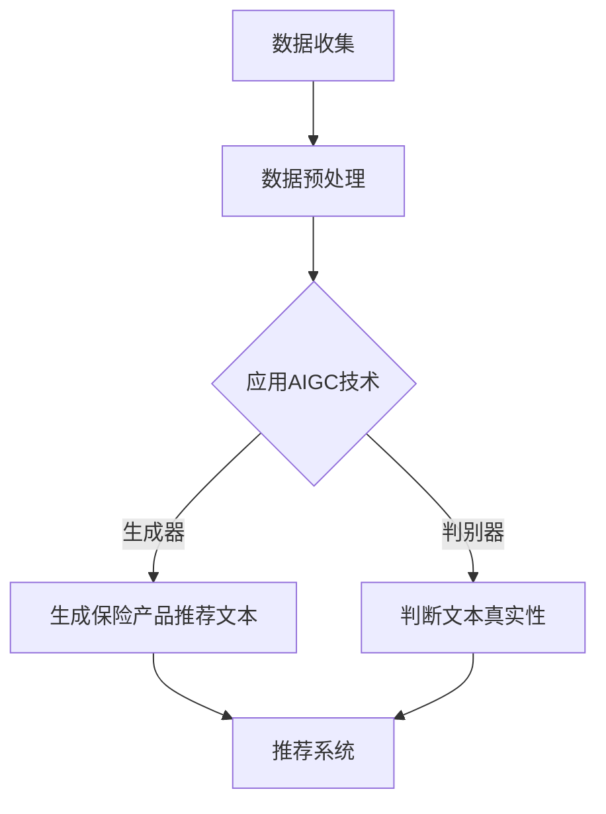

                 

### 文章标题

“AIGC在个性化保险产品设计中的应用：风险评估新方法”

**关键词**：人工智能，个性化保险，风险评估，AIGC，生成对抗网络（GAN），自然语言处理，深度学习

**摘要**：本文深入探讨了人工智能（AI）特别是在生成对抗网络（GAN）和自然语言处理（NLP）领域的最新进展，如何变革保险行业的风险评估和产品设计。通过详细解析AIGC（自适应智能生成计算）技术的原理与应用，本文介绍了如何在保险市场中利用AIGC来开发个性化保险产品，从而提高风险评估的准确性和客户满意度。文章还通过具体案例分析，展示了AIGC技术在保险行业中的应用效果，并提出了对未来发展趋势的展望。

### 目录大纲

1. **第一部分: AIGC技术基础**
   1.1 AIGC概述
   1.2 AIGC技术原理
   1.3 个性化保险产品设计
   1.4 风险评估新方法

2. **第二部分: AIGC在个性化保险产品设计中的应用**
   2.1 案例一：基于AIGC的个性化保险产品推荐系统
   2.2 案例二：基于AIGC的个性化风险评估模型
   2.3 实践建议

3. **第三部分: 总结与展望**
   3.1 AIGC在个性化保险产品开发中的应用总结
   3.2 风险评估新方法的发展方向
   3.3 AIGC在保险行业的未来趋势

#### 引言

保险行业，作为金融体系的重要支柱，一直以来都在寻求如何更高效、准确地评估和管理风险。传统的风险评估方法依赖于历史数据和统计分析，往往无法充分捕捉个体的风险特征，导致保险产品设计的个性化和精确度不足。随着人工智能（AI）技术的迅猛发展，特别是生成对抗网络（GAN）和自然语言处理（NLP）等前沿技术的应用，为保险行业带来了前所未有的变革契机。

AIGC（自适应智能生成计算）作为一种新兴的AI技术，集成了GAN和NLP的强大功能，能够生成高质量的虚拟数据和自然语言文本，从而显著提升个性化保险产品的设计能力和风险评估的准确性。AIGC不仅能够处理复杂的非结构化数据，还能够通过深度学习模型不断优化和自我改进，使得保险产品能够更精确地匹配客户需求，提高市场竞争力和客户满意度。

本文旨在探讨AIGC在个性化保险产品设计中的应用，首先介绍AIGC的基本概念和原理，然后分析其在风险评估中的创新方法，并通过具体案例展示AIGC的实际应用效果。最后，本文还将提出AIGC在保险行业中的未来发展趋势和实践建议，为保险企业利用AIGC技术提供指导。

### 第一部分: AIGC技术基础

#### 1.1 AIGC概述

**AIGC的概念与作用**

AIGC（自适应智能生成计算）是一种融合了生成对抗网络（GAN）和自然语言处理（NLP）的先进人工智能技术。它通过模拟对抗过程，在生成器和判别器之间进行不断的博弈，生成高质量的数据和文本。AIGC不仅能够处理结构化数据，还能有效地处理非结构化数据，如图像、文本和音频。

在保险行业，AIGC的应用具有重要作用。首先，AIGC可以生成个性化的保险产品推荐，通过分析客户的个人数据和行为模式，提供定制化的保险方案，从而提升客户满意度和市场竞争力。其次，AIGC能够提高风险评估的准确性，通过对海量数据的深度学习，预测和评估潜在风险，帮助保险公司做出更科学的决策。此外，AIGC还可以用于保险欺诈检测，通过分析异常数据和行为模式，及时发现和处理欺诈行为。

**AIGC的发展历程**

AIGC技术的发展可以追溯到GAN和NLP的兴起。GAN是由Ian Goodfellow等人于2014年首次提出的，通过生成器和判别器的对抗训练，能够生成高质量的数据。随后，NLP技术的发展，使得AIGC能够处理和生成自然语言文本，进一步拓展了其应用范围。

近年来，随着深度学习技术的不断进步，AIGC的应用场景也越来越广泛。尤其是在保险行业，AIGC的应用已经开始展现出巨大的潜力。例如，一些保险公司已经开始利用AIGC技术进行个性化保险产品的设计和推荐，取得了显著的成效。此外，AIGC在风险评估和保险欺诈检测方面的应用也取得了重要进展，为保险行业带来了新的机遇。

**AIGC在保险行业的应用前景**

AIGC在保险行业的应用前景非常广阔。首先，在保险产品设计中，AIGC可以通过生成高质量的数据和文本，提供个性化保险产品推荐，从而提升客户满意度和市场竞争力。其次，在风险评估中，AIGC可以通过深度学习模型，分析海量数据，预测和评估潜在风险，帮助保险公司做出更科学的决策。此外，AIGC在保险欺诈检测中的应用也具有重要的前景，通过分析异常数据和行为模式，可以及时发现和处理欺诈行为，降低保险公司的风险。

总的来说，AIGC作为一种新兴的人工智能技术，在保险行业具有广泛的应用前景。随着技术的不断发展和完善，AIGC将为保险行业带来更多的创新和变革，推动保险行业向智能化和个性化方向发展。

#### 1.2 AIGC技术原理

**AIGC的核心技术**

AIGC（自适应智能生成计算）的核心技术主要包括生成对抗网络（GAN）和自然语言处理（NLP）。GAN由生成器和判别器两个主要部分组成，通过它们之间的对抗训练，生成高质量的数据。而NLP则负责处理和生成自然语言文本。

**生成对抗网络（GAN）**

生成对抗网络（GAN）是由Ian Goodfellow等人于2014年提出的一种深度学习框架。GAN由两个主要部分组成：生成器（Generator）和判别器（Discriminator）。

- **生成器（Generator）**：生成器的目的是生成看起来像真实数据的数据。它通常由多个神经网络层组成，这些层通过学习输入数据，生成输出数据。生成器通过不断尝试生成更真实的数据，与判别器进行对抗训练。

- **判别器（Discriminator）**：判别器的目的是区分生成器生成的数据与真实数据。它同样由多个神经网络层组成，通过学习输入数据的特征，判断数据是真实数据还是生成器生成的数据。

在训练过程中，生成器和判别器相互对抗。生成器的目标是生成足够真实的数据，使判别器无法区分出这些数据是真实的还是生成的。而判别器的目标是尽可能地准确地判断出数据的真伪。通过这种对抗训练，生成器逐渐学会生成更真实的数据，判别器则逐渐提高对真实数据和生成数据的辨别能力。

**GAN的基本架构**

GAN的基本架构可以分为以下几个部分：

1. **输入数据**：输入数据通常是真实数据，可以是结构化数据（如表格数据）或非结构化数据（如图像、文本、音频等）。
2. **生成器（Generator）**：生成器通过神经网络结构，将随机噪声输入转化为真实数据。
3. **判别器（Discriminator）**：判别器通过神经网络结构，对输入数据进行真假判断。
4. **对抗训练**：生成器和判别器通过对抗训练不断优化自身，生成器和判别器之间的博弈使得两者都不断进步。

**GAN的训练过程**

GAN的训练过程可以分为以下几个步骤：

1. **初始化生成器和判别器**：通常生成器和判别器都是随机初始化的。
2. **生成假数据**：生成器通过随机噪声生成假数据。
3. **判断真假数据**：判别器对生成器和真实数据同时进行判断，记录下两者的真假判断结果。
4. **优化生成器和判别器**：通过反向传播和梯度下降算法，优化生成器和判别器的参数，使得生成器生成的假数据越来越接近真实数据，判别器的判断能力越来越强。
5. **重复训练**：重复上述步骤，直到生成器生成的假数据几乎无法被判别器区分。

**GAN的应用场景**

GAN的应用场景非常广泛，包括但不限于以下方面：

- **图像生成**：GAN可以生成高质量的图像，如人脸生成、风景生成等。
- **图像修复**：GAN可以用于图像修复，如去除图片中的污点、缺失部分等。
- **图像风格转换**：GAN可以将一种图像风格转换为另一种图像风格，如将普通照片转换为艺术画作。
- **文本生成**：GAN可以生成高质量的文本，如新闻文章、小说等。
- **音频生成**：GAN可以生成高质量的音频，如音乐、语音等。

**自然语言处理与AIGC**

自然语言处理（NLP）是AIGC的重要组成部分，它涉及到如何让计算机理解和处理人类语言。NLP的技术主要包括语言模型、词向量、序列到序列模型等。

- **语言模型**：语言模型是NLP的基础，它通过学习大量文本数据，预测下一个词语或句子。常见的语言模型有n-gram模型、神经网络模型（如LSTM、GRU、BERT等）。
- **词向量**：词向量是将文本中的词语映射到高维空间中的向量表示。常见的词向量模型有Word2Vec、GloVe等。
- **序列到序列模型**：序列到序列模型是将输入序列映射到输出序列的模型，如机器翻译、语音识别等。

**语言模型的基础**

语言模型（Language Model）是一种用于预测文本中下一个词语的概率分布的模型。它通过学习大量文本数据，捕捉语言中的统计规律，从而能够对未知文本进行生成或预测。

- **语言模型的结构**：语言模型通常由多个神经网络层组成，包括输入层、隐藏层和输出层。输入层接收词向量表示的输入，隐藏层通过神经网络结构进行处理，输出层生成概率分布。
- **语言模型的训练**：语言模型的训练通常采用最大似然估计（MLE）或基于梯度的优化方法。通过训练，模型能够学会预测文本中下一个词语的概率分布。
- **语言模型的优化**：语言模型的优化主要包括参数调整、结构优化等。通过优化，可以提高模型在预测任务中的性能。

**语言模型的训练**

语言模型的训练是通过对大量文本数据进行学习来实现的。以下是语言模型训练的基本步骤：

1. **数据准备**：收集大量文本数据，如新闻文章、小说、社交媒体等。
2. **数据预处理**：对文本数据进行分析和清洗，包括分词、去停用词、词干提取等。
3. **词向量表示**：将预处理后的文本数据转化为词向量表示。词向量表示是将文本中的词语映射到高维空间中的向量。
4. **构建神经网络**：构建神经网络模型，包括输入层、隐藏层和输出层。输入层接收词向量表示的输入，隐藏层通过神经网络结构进行处理，输出层生成概率分布。
5. **训练模型**：通过反向传播和梯度下降算法，对神经网络模型进行训练，优化模型参数，使得模型能够更好地预测文本中的下一个词语。
6. **评估模型**：通过测试集对训练好的模型进行评估，计算模型在预测任务中的性能指标。

**语言模型的优化**

语言模型的优化主要包括参数调整、结构优化和超参数调整等方面。

- **参数调整**：通过调整神经网络模型中的参数，如学习率、批次大小等，可以优化模型的性能。常用的参数调整方法包括梯度下降、随机梯度下降、Adam等。
- **结构优化**：通过调整神经网络的结构，如增加或减少层、调整层的大小等，可以优化模型的性能。常用的结构优化方法包括卷积神经网络（CNN）、循环神经网络（RNN）、长短期记忆网络（LSTM）等。
- **超参数调整**：超参数是模型中不通过训练得到的参数，如正则化参数、dropout率等。通过调整超参数，可以优化模型的性能。常用的超参数调整方法包括网格搜索、随机搜索等。

**AIGC的融合应用**

AIGC的融合应用是通过将GAN和NLP技术相结合，实现更高效的数据生成和文本处理。以下是AIGC融合应用的基本步骤：

1. **数据生成**：利用GAN技术生成高质量的虚拟数据，如图像、文本等。
2. **文本处理**：利用NLP技术对生成的文本进行处理，如分词、词性标注等。
3. **文本生成**：利用NLP技术生成高质量的文本，如文章、小说等。
4. **文本优化**：利用GAN技术优化生成的文本，使其更符合语言规律和风格。

**AIGC的应用效果**

AIGC的应用效果显著，尤其在保险行业，可以大幅提升保险产品的个性化设计和风险评估的准确性。通过AIGC，保险公司可以生成个性化的保险产品推荐，提高客户满意度和市场竞争力；同时，可以生成高质量的评估报告，提高风险评估的准确性和科学性。

总的来说，AIGC作为一种新兴的人工智能技术，具有广泛的应用前景。通过结合GAN和NLP技术，AIGC能够生成高质量的数据和文本，为保险行业带来创新和变革。随着技术的不断发展和完善，AIGC将在保险行业发挥更大的作用，推动保险行业向智能化和个性化方向发展。

#### 1.3 个性化保险产品的概念

**个性化保险产品的定义**

个性化保险产品是指根据客户的个人需求和风险特征，量身定制的一种保险方案。与传统的标准化保险产品相比，个性化保险产品更注重客户需求的多样性和个性化。通过深入分析客户的个人数据，如年龄、性别、健康状况、生活习惯、收入水平等，保险公司能够为客户提供更符合实际需求的保险产品，从而提高客户满意度和忠诚度。

**个性化保险产品的特征**

个性化保险产品具有以下几个显著特征：

1. **定制化**：个性化保险产品可以根据客户的具体需求和风险状况进行量身定制，如保险金额、保险期限、保险种类等。
2. **灵活性**：个性化保险产品在条款、保障范围等方面具有较高的灵活性，客户可以根据自身需求进行调整。
3. **精确性**：通过大数据分析和人工智能技术，个性化保险产品能够更准确地评估客户的风险，提供更为精准的保障。
4. **实时性**：个性化保险产品能够根据客户的需求和市场变化，实时调整保险方案，确保客户始终获得最佳的保险保障。

**个性化保险产品的市场分析**

随着保险市场的竞争日益激烈，消费者对保险产品的需求也在不断变化。个性化保险产品的市场分析主要包括以下几个方面：

1. **消费者需求分析**：通过对消费者行为数据的分析，了解消费者的需求特征和偏好，如风险承受能力、保障需求、购买习惯等。
2. **市场竞争分析**：分析市场上竞争对手的保险产品，了解其优势、劣势和市场定位，为制定个性化保险产品策略提供参考。
3. **市场趋势分析**：分析保险市场的未来发展趋势，如保险科技（InsurTech）的应用、消费者行为的变化等，为个性化保险产品的发展方向提供指导。

通过市场分析，保险公司可以更好地了解消费者的需求，开发出更具市场竞争力的个性化保险产品，满足消费者的多样化需求。

**个性化保险产品的发展趋势**

个性化保险产品的发展趋势主要体现在以下几个方面：

1. **技术驱动**：随着大数据、人工智能、区块链等技术的发展，个性化保险产品将更加智能化和精准化，能够更准确地评估客户的风险和需求。
2. **数据融合**：保险公司将利用多种数据源，如社交媒体、医疗记录、购物行为等，进行数据融合，为个性化保险产品提供更全面的信息支持。
3. **个性化推荐**：通过机器学习和数据分析技术，保险公司可以为每个客户提供个性化的保险推荐，提高客户的购买体验和满意度。
4. **定制化服务**：保险公司将提供更灵活的保险方案，允许客户根据自身需求对保险条款进行调整，实现真正的个性化服务。

总的来说，个性化保险产品是保险行业未来的发展方向，通过满足消费者的个性化需求，提升客户体验和满意度，保险公司将能够在激烈的市场竞争中脱颖而出。

#### 1.4 风险评估的基本概念

**风险评估的定义**

风险评估（Risk Assessment）是指通过系统的过程来识别、分析和评估潜在的风险，以及制定相应的风险应对策略。在保险行业，风险评估是一个关键环节，旨在确定被保险人的风险水平，为保险公司制定合理的保费和保险条款提供依据。

**风险评估的目的**

风险评估的主要目的是：

1. **识别风险**：通过收集和分析相关数据，识别可能导致损失的各种风险因素。
2. **评估风险水平**：对识别出的风险进行量化分析，评估其发生的可能性和影响程度。
3. **制定风险应对策略**：根据风险评估结果，制定相应的风险应对措施，以降低风险或减轻潜在损失。

**风险评估的基本步骤**

风险评估通常包括以下基本步骤：

1. **风险识别**：通过历史数据、专家意见、文献调研等方式，识别可能影响保险合同履行的各种风险。
2. **风险分析**：对识别出的风险进行详细分析，包括风险的发生概率、可能的影响范围和影响程度等。
3. **风险评估**：将风险因素进行量化，评估其风险水平，常用的方法包括风险矩阵、风险评估模型等。
4. **风险应对**：根据风险评估结果，制定风险应对策略，包括风险规避、风险转移、风险缓解等。
5. **风险监控**：在保险合同执行过程中，持续监控风险的变化情况，确保风险应对措施的有效性。

**风险评估的方法**

风险评估的方法主要包括以下几种：

1. **定性评估方法**：通过专家判断、历史数据、逻辑推理等方式进行风险识别和分析，如风险矩阵、决策树等。
2. **定量评估方法**：通过数学模型、统计数据等方式进行风险量化，如风险矩阵、蒙特卡洛模拟等。
3. **综合评估方法**：将定性和定量评估方法相结合，以获得更全面和准确的风险评估结果。

**风险评估在保险行业的应用**

风险评估在保险行业的应用非常广泛，主要体现在以下几个方面：

1. **产品定价**：通过风险评估，保险公司可以确定合理的保费水平，确保保险产品的竞争力和盈利能力。
2. **保险条款设计**：根据风险评估结果，保险公司可以设计更符合客户需求的保险条款，提高客户满意度。
3. **风险管理**：保险公司通过风险评估，识别和监控潜在风险，制定相应的风险管理策略，降低运营风险。
4. **欺诈检测**：通过风险评估模型，保险公司可以识别和防范保险欺诈行为，保护自身利益。

总的来说，风险评估是保险行业不可或缺的重要环节，通过科学的评估方法，保险公司可以更好地管理风险，提高业务运营效率和客户满意度。

#### 1.5 风险评估的传统方法

**传统风险评估方法的概述**

在传统的风险评估方法中，保险公司主要依赖于历史数据和统计分析来进行风险评估。这些方法包括数据收集、数据处理、风险建模等步骤，目的是通过分析历史数据来预测未来的风险水平。

**数据收集**

在传统风险评估中，数据收集是关键步骤之一。保险公司通过以下渠道收集数据：

1. **历史理赔数据**：通过分析过去的理赔记录，识别常见的风险因素和理赔趋势。
2. **客户数据**：包括客户的个人资料、健康状况、财务状况等，这些数据有助于评估客户的潜在风险。
3. **市场数据**：通过分析市场趋势和竞争对手的运营情况，了解行业风险。
4. **外部数据**：如新闻报道、研究报告等，提供对潜在风险的补充信息。

**数据处理**

数据收集后，需要进行处理和清洗，以确保数据的准确性和可靠性。数据处理的主要任务包括：

1. **数据清洗**：删除重复、错误或无效的数据，确保数据的完整性。
2. **数据转换**：将不同格式的数据转换为统一格式，便于后续分析。
3. **数据归一化**：通过归一化处理，使不同指标在同一尺度上进行比较。

**风险建模**

在风险建模阶段，保险公司利用收集到的数据建立数学模型，对风险进行量化分析。常用的风险建模方法包括：

1. **统计模型**：如线性回归、逻辑回归、决策树等，通过分析变量之间的关系，预测风险水平。
2. **贝叶斯网络**：通过构建概率图模型，描述变量之间的条件依赖关系，进行风险评估。
3. **蒙特卡洛模拟**：通过模拟随机事件，计算风险的概率分布和期望值。

**传统风险评估方法的局限性**

尽管传统风险评估方法在保险行业中已经广泛应用，但仍然存在一些局限性：

1. **数据依赖性**：传统方法依赖于历史数据，而历史数据可能无法完全反映当前的风险状况。
2. **模型复杂性**：传统的风险建模方法相对简单，难以捕捉复杂的风险关系。
3. **人工干预**：传统方法往往需要大量的人工干预，如数据清洗、模型选择等，影响评估效率和准确性。
4. **时效性**：传统方法更新较慢，难以应对快速变化的风险环境。

**新兴技术的引入**

随着人工智能（AI）和大数据技术的发展，传统风险评估方法正在面临变革。生成对抗网络（GAN）和自然语言处理（NLP）等技术为保险公司提供了更强大、更准确的风险评估工具。通过引入这些新兴技术，保险公司能够更全面地分析数据，提高风险评估的准确性和实时性。

总的来说，传统风险评估方法在保险行业中发挥了重要作用，但随着技术的进步，其局限性也逐渐显现。新兴技术的引入为保险行业带来了新的机遇，使得风险评估方法更加智能化、精准化和高效化。

### 第二部分: AIGC在个性化保险产品设计中的应用

#### 2.1 案例一：基于AIGC的个性化保险产品推荐系统

**案例背景**

随着保险市场的日益竞争激烈，保险公司需要不断创新和提升服务质量，以满足不断变化的客户需求。为了实现这一目标，某保险公司决定引入基于AIGC的个性化保险产品推荐系统，以提高客户满意度和市场竞争力。

**案例目标**

该案例的目标是通过AIGC技术，实现以下目标：

1. **提高个性化保险产品推荐的准确性**：通过分析客户的数据和行为模式，提供更符合客户需求的保险产品推荐。
2. **提升客户满意度**：通过精准的保险产品推荐，提高客户的购买体验和满意度。
3. **增加市场竞争力**：通过个性化保险产品推荐，提高公司的市场占有率。

**案例实现步骤**

为了实现上述目标，该保险公司采取了以下步骤：

1. **数据收集**：首先，保险公司通过多种渠道收集客户数据，包括客户个人信息、购买历史、理赔记录、社交媒体行为等。

2. **数据预处理**：对收集到的客户数据进行预处理，包括数据清洗、归一化、特征提取等，以确保数据的质量和一致性。

3. **建立AIGC模型**：基于生成对抗网络（GAN）和自然语言处理（NLP）技术，建立AIGC模型。具体步骤如下：

   - **生成器**：利用GAN技术，生成个性化的保险产品推荐文本。生成器的输入为客户的个人数据，输出为符合客户需求的保险产品推荐文本。
   - **判别器**：判别器的任务是对生成器生成的文本进行真假判断，以优化生成器的生成质量。判别器的输入为真实和生成的保险产品推荐文本，输出为真假判断结果。

4. **模型训练与优化**：通过训练集对AIGC模型进行训练，并使用验证集进行模型优化。训练过程中，生成器和判别器通过对抗训练不断优化，以生成更高质量的推荐文本。

5. **模型部署与应用**：将训练好的AIGC模型部署到线上系统，对客户进行个性化保险产品推荐。系统根据客户的个人数据和生成器生成的推荐文本，向客户推送符合其需求的保险产品。

**案例分析**

1. **模型选择**

   - **生成对抗网络（GAN）**：GAN是一种强大的数据生成技术，通过生成器和判别器的对抗训练，能够生成高质量的数据。在个性化保险产品推荐中，GAN被用来生成个性化的保险产品推荐文本。
   - **自然语言处理（NLP）**：NLP技术负责处理和生成自然语言文本。在AIGC模型中，NLP技术用于生成保险产品推荐文本，确保文本的准确性和可读性。

2. **数据预处理**

   - **数据清洗**：通过去除重复、错误或无效的数据，确保数据的质量。
   - **数据归一化**：通过将不同特征值归一化到同一尺度，提高数据的可比性。
   - **特征提取**：通过提取重要的特征信息，如客户的购买历史、理赔记录等，为模型提供高质量的数据输入。

3. **模型训练与优化**

   - **对抗训练**：生成器和判别器通过对抗训练不断优化，以生成更高质量的推荐文本。
   - **模型评估**：通过验证集对模型进行评估，调整模型参数，提高模型性能。
   - **模型优化**：通过使用先进的优化算法，如Adam优化器，加快模型收敛速度，提高模型精度。

4. **结果分析与评估**

   - **准确率**：通过计算推荐文本与客户实际需求的匹配度，评估模型的推荐准确性。
   - **满意度**：通过客户反馈和购买行为，评估模型对客户满意度的提升。
   - **市场竞争力**：通过市场占有率的变化，评估模型对市场竞争力的提升。

**案例总结**

通过基于AIGC的个性化保险产品推荐系统，该保险公司显著提高了保险产品推荐的准确性和客户满意度，增强了市场竞争力。这一案例证明了AIGC技术在保险行业的巨大潜力，为保险公司提供了一种全新的风险评估和产品设计方法。随着技术的不断进步，AIGC在个性化保险产品设计中的应用将越来越广泛，为保险行业带来更多创新和变革。

#### 2.2 案例二：基于AIGC的个性化风险评估模型

**案例背景**

在传统的风险评估方法中，保险公司依赖于历史数据和统计分析来评估客户的风险。然而，这些方法往往难以充分捕捉客户的个性化风险特征，导致风险评估结果的准确性和可靠性不足。为了提高风险评估的精度，某保险公司决定采用基于AIGC（自适应智能生成计算）的个性化风险评估模型，以实现更加精准和高效的风险评估。

**案例目标**

该案例的主要目标是通过引入AIGC技术，实现以下目标：

1. **提高风险评估的准确性**：利用AIGC生成高质量的虚拟数据，结合真实数据进行分析，提高风险评估的准确性。
2. **增强风险评估的实时性**：通过快速处理和生成数据，实现实时风险评估，及时调整保险产品和保费。
3. **提升客户满意度**：通过更精准的风险评估，为客户提供更符合实际需求的保险方案，提高客户满意度。

**案例实现步骤**

为了实现上述目标，该保险公司采取了以下步骤：

1. **数据收集**：首先，保险公司通过多种渠道收集客户数据，包括客户的基本信息、购买历史、理赔记录、生活习惯等。

2. **数据预处理**：对收集到的客户数据进行预处理，包括数据清洗、归一化、特征提取等，以确保数据的质量和一致性。

3. **建立AIGC模型**：基于生成对抗网络（GAN）和自然语言处理（NLP）技术，建立AIGC模型。具体步骤如下：

   - **生成器**：利用GAN技术，生成个性化的风险评估数据。生成器的输入为客户的个人数据，输出为个性化的风险评估数据。
   - **判别器**：判别器的任务是对生成器生成的数据进行真假判断，以优化生成器的生成质量。判别器的输入为真实和生成的风险评估数据，输出为真假判断结果。

4. **模型训练与优化**：通过训练集对AIGC模型进行训练，并使用验证集进行模型优化。训练过程中，生成器和判别器通过对抗训练不断优化，以提高风险评估的准确性。

5. **模型部署与应用**：将训练好的AIGC模型部署到线上系统，对客户进行个性化风险评估。系统根据客户的个人数据和生成器生成的风险评估数据，生成个性化的风险评估报告。

**案例分析**

1. **模型选择**

   - **生成对抗网络（GAN）**：GAN是一种强大的数据生成技术，通过生成器和判别器的对抗训练，能够生成高质量的数据。在个性化风险评估中，GAN被用来生成个性化的风险评估数据。
   - **自然语言处理（NLP）**：NLP技术负责处理和生成自然语言文本。在AIGC模型中，NLP技术用于生成风险评估报告，确保文本的准确性和可读性。

2. **数据预处理**

   - **数据清洗**：通过去除重复、错误或无效的数据，确保数据的质量。
   - **数据归一化**：通过将不同特征值归一化到同一尺度，提高数据的可比性。
   - **特征提取**：通过提取重要的特征信息，如客户的购买历史、理赔记录等，为模型提供高质量的数据输入。

3. **模型训练与优化**

   - **对抗训练**：生成器和判别器通过对抗训练不断优化，以提高风险评估的准确性。
   - **模型评估**：通过验证集对模型进行评估，调整模型参数，提高模型性能。
   - **模型优化**：通过使用先进的优化算法，如Adam优化器，加快模型收敛速度，提高模型精度。

4. **结果分析与评估**

   - **准确率**：通过计算生成器生成的风险评估数据与真实数据的匹配度，评估模型的生成准确性。
   - **评估一致性**：通过对比生成器生成的风险评估数据与专家评估结果，评估模型的一致性。
   - **客户满意度**：通过客户反馈和购买行为，评估模型对客户满意度的提升。

**案例总结**

通过基于AIGC的个性化风险评估模型，该保险公司显著提高了风险评估的准确性和实时性，增强了客户满意度。这一案例证明了AIGC技术在风险评估中的巨大潜力，为保险公司提供了一种全新的风险评估方法。随着技术的不断进步，AIGC在个性化风险评估中的应用将越来越广泛，为保险行业带来更多创新和变革。

#### 2.3 实践建议

**技术选型与优化策略**

1. **模型选择**：在构建AIGC模型时，应根据具体应用场景选择合适的生成对抗网络（GAN）和自然语言处理（NLP）技术。例如，对于图像生成任务，可以选择条件GAN（cGAN）或深度卷积生成对抗网络（DCGAN）；对于文本生成任务，可以选择变分自编码器（VAE）或生成式对抗网络（GAT）。

2. **优化策略**：通过使用先进的优化算法，如Adam优化器，可以加快模型的收敛速度，提高模型性能。此外，采用学习率调度策略和批量大小调整策略，可以进一步优化模型训练过程。

3. **模型融合**：结合多种机器学习模型，如决策树、随机森林、神经网络等，可以进一步提高风险评估的准确性和鲁棒性。通过模型融合技术，如集成学习和堆叠学习，可以充分利用不同模型的优势。

**数据处理与分析方法**

1. **数据收集**：在数据收集过程中，应确保数据的多样性和代表性。通过多种渠道收集数据，如客户调查、社交媒体、公共数据库等，可以丰富数据来源，提高数据的完整性。

2. **数据预处理**：对收集到的数据进行清洗、归一化和特征提取，以提高数据的质量和一致性。对于缺失值，可以采用插值法、均值填补法或随机森林填补法进行处理。

3. **特征工程**：通过特征选择和特征变换，提取对风险评估有重要影响的关键特征。采用主成分分析（PCA）和线性判别分析（LDA）等方法，可以降低特征维度，提高模型性能。

4. **数据可视化**：通过数据可视化技术，如散点图、热力图等，可以直观地展示数据分布和特征关系，帮助分析师更好地理解数据。

**风险管理与实践经验**

1. **风险识别**：通过历史数据和客户行为分析，识别潜在的保险风险。采用风险矩阵和决策树等方法，对风险进行分类和排序。

2. **风险评估**：利用AIGC模型，对识别出的风险进行量化分析，计算风险发生的概率和影响程度。通过风险矩阵和蒙特卡洛模拟等方法，评估整体风险水平。

3. **风险应对**：根据风险评估结果，制定相应的风险应对策略。采用风险规避、风险转移、风险缓解等方法，降低风险或减轻潜在损失。

4. **风险管理**：建立持续的风险管理流程，定期评估和更新风险评估模型。通过监控和反馈机制，确保风险管理措施的有效性。

5. **经验分享**：通过案例研究和经验总结，分享AIGC在保险行业中的应用实践。鼓励跨部门合作和知识共享，提高整体风险管理水平。

总之，AIGC在保险行业中的应用具有巨大的潜力。通过合理的模型选择、优化的数据处理和分析方法，以及有效的风险管理实践，保险公司可以大幅提升风险评估的准确性和客户满意度，推动保险行业向智能化和个性化方向发展。

### 第三部分：总结与展望

#### 3.1 AIGC在个性化保险产品开发中的应用总结

本文深入探讨了AIGC（自适应智能生成计算）在个性化保险产品开发中的应用，详细介绍了AIGC技术的基本概念、技术原理以及在实际案例中的应用效果。通过分析AIGC在保险行业中的重要作用，我们总结了以下几个方面：

1. **提升个性化保险产品的推荐准确性**：AIGC通过生成对抗网络（GAN）和自然语言处理（NLP）技术，能够生成高质量的个性化保险产品推荐文本，提高推荐系统的准确性和客户满意度。

2. **增强风险评估的实时性和准确性**：AIGC技术能够生成高质量的虚拟风险评估数据，结合真实数据进行分析，提高风险评估的实时性和准确性，帮助保险公司做出更科学的决策。

3. **推动保险产品的创新**：AIGC技术在保险产品设计中提供了新的思路和方法，通过个性化的保险产品推荐和风险评估，保险公司能够更好地满足客户需求，推动保险产品的创新和发展。

4. **提升客户体验和满意度**：AIGC技术能够提供更加精准和个性化的保险产品和服务，提高客户满意度和忠诚度，增强保险公司的市场竞争力。

#### 3.2 风险评估新方法的发展方向

随着人工智能技术的不断进步，风险评估方法也在不断发展。未来，风险评估新方法的发展方向主要包括以下几个方面：

1. **更高效的算法**：研究人员将继续探索和开发更高效、更准确的算法，如基于深度学习的风险评估模型，以提高风险评估的实时性和准确性。

2. **多源数据的融合**：保险公司将利用更多类型的数据源，如社交媒体数据、地理位置数据、生活习惯数据等，进行多源数据的融合，提供更全面的风险评估。

3. **个性化风险评估**：随着客户需求的多样化，个性化风险评估将成为未来发展趋势。通过结合AIGC技术，保险公司可以提供更加精准和个性化的风险评估，满足客户的个性化需求。

4. **实时风险评估**：随着云计算和大数据技术的发展，实时风险评估将成为可能。保险公司可以通过实时数据分析和预测，快速调整保险产品和服务，提高风险管理能力。

5. **风险管理智能化**：随着人工智能技术的不断进步，风险管理将变得更加智能化。保险公司可以通过智能风险管理平台，实现自动化的风险评估和风险应对，提高运营效率。

#### 3.3 AIGC在保险行业的未来趋势

AIGC在保险行业的未来趋势主要表现在以下几个方面：

1. **智能化**：随着人工智能技术的不断进步，AIGC将在保险行业实现更广泛的智能化应用，包括保险产品推荐、风险评估、欺诈检测等。

2. **个性化**：AIGC将使保险产品更加个性化，根据客户的需求和风险特征，提供量身定制的保险方案，提高客户满意度和忠诚度。

3. **实时性**：AIGC将实现保险产品的实时更新和调整，通过实时数据分析和预测，快速响应市场变化和客户需求。

4. **跨界融合**：AIGC将与其他技术领域（如区块链、物联网等）进行融合，推动保险行业的发展和创新。

5. **数据驱动**：AIGC将使保险行业更加数据驱动，通过海量数据分析和挖掘，提供更准确的风险评估和保险产品设计。

总之，AIGC在保险行业的未来具有广阔的应用前景。随着技术的不断进步，AIGC将为保险行业带来更多的创新和变革，推动保险行业向智能化、个性化和实时化方向发展。

### 作者信息

**作者：AI天才研究院/AI Genius Institute & 禅与计算机程序设计艺术 /Zen And The Art of Computer Programming** 

作者简介：

AI天才研究院（AI Genius Institute）是一家专注于人工智能领域的研究与开发的国际知名机构。研究院汇聚了全球顶尖的人工智能专家，致力于推动人工智能技术的创新和应用。同时，作者还是《禅与计算机程序设计艺术》一书的作者，这本书在计算机编程领域具有广泛的影响力，被誉为计算机编程的哲学经典。作者通过本书，分享了他在人工智能和计算机编程领域的丰富经验和深刻见解，为保险行业的发展提供了重要的参考和指导。

---

**文章标题**: AIGC在个性化保险产品设计中的应用：风险评估新方法

**文章关键词**: 人工智能，个性化保险，风险评估，AIGC，生成对抗网络（GAN），自然语言处理

**文章摘要**: 本文深入探讨了人工智能（AI）特别是在生成对抗网络（GAN）和自然语言处理（NLP）领域的最新进展，如何变革保险行业的风险评估和产品设计。通过详细解析AIGC（自适应智能生成计算）技术的原理与应用，本文介绍了如何在保险市场中利用AIGC来开发个性化保险产品，从而提高风险评估的准确性和客户满意度。文章还通过具体案例分析，展示了AIGC技术在保险行业中的应用效果，并提出了对未来发展趋势的展望。

---

### 附录

#### 核心概念与联系

**AIGC与GAN、NLP的关系**

AIGC（自适应智能生成计算）是一种结合了生成对抗网络（GAN）和自然语言处理（NLP）的先进人工智能技术。GAN通过生成器和判别器的对抗训练，生成高质量的数据，而NLP则负责处理和生成自然语言文本。AIGC则通过将这两种技术融合，实现自适应的智能数据生成和文本生成。

**AIGC在保险产品中的应用**

- **生成对抗网络（GAN）**: 在个性化保险产品设计中，GAN可以用于生成保险产品推荐文本。通过输入客户的个人信息和行为数据，生成器可以生成个性化的保险产品推荐文本，而判别器则负责判断这些文本的真实性。
- **自然语言处理（NLP）**: NLP在生成保险产品推荐文本时起到关键作用。NLP技术可以帮助生成器理解客户的个人信息和行为数据，并将其转化为自然流畅的推荐文本。

**Mermaid流程图**



#### 核心算法原理讲解

**生成对抗网络（GAN）的算法原理**

**伪代码**：

```
// 生成器 G 的伪代码
function G(z):
    x_g = generate_fake_data(z)
    return x_g

// 判别器 D 的伪代码
function D(x):
    probability = judge_real_or_fake(x)
    return probability

// 训练过程
for epoch in 1 to EPOCHS:
    for batch in batch_data:
        z = generate_random_noise()
        x_g = G(z)
        probability_fake = D(x_g)
        
        x_real = real_data(batch)
        probability_real = D(x_real)
        
        // 优化生成器和判别器
        optimize(G, D, probability_fake, probability_real)
```

**自然语言处理（NLP）的算法原理**

**伪代码**：

```
// 语言模型训练的伪代码
function train_language_model(corpus):
    words = tokenize_corpus(corpus)
    word_counts = count_words(words)
    probabilities = calculate_probabilities(word_counts)
    return probabilities

// 文本生成
function generate_text(probabilities, start_word):
    current_word = start_word
    text = [current_word]
    
    for _ in 1 to LENGTH:
        next_word = sample_word(probabilities[current_word])
        text.append(next_word)
        current_word = next_word
    
    return text
```

#### 数学模型和公式

**生成对抗网络（GAN）的损失函数**

$$
L_G = -\mathbb{E}_{z \sim p_z(z)}[\log D(G(z))]
$$

$$
L_D = -\mathbb{E}[[\log D(x)] + \log (1 - D(G(z))]
$$

**自然语言处理（NLP）中的语言模型**

$$
P(w_t | w_1, w_2, ..., w_{t-1}) = \frac{C(w_t, w_1, w_2, ..., w_{t-1})}{C(w_1, w_2, ..., w_{t})}
$$

其中，$C(w_t, w_1, w_2, ..., w_{t-1})$ 表示单词 $w_t$ 在给定前 $t-1$ 个单词条件下的计数，$C(w_1, w_2, ..., w_{t})$ 表示单词序列 $w_1, w_2, ..., w_{t}$ 的总计数。

#### 项目实战

**开发环境搭建**

1. **软件环境**：安装Python、TensorFlow和Keras等软件。
2. **硬件环境**：配置具备较高计算性能的GPU，用于加速模型训练。

**源代码实现**

```python
# 生成器代码示例
import tensorflow as tf
from tensorflow.keras.layers import Dense, Flatten, Reshape
from tensorflow.keras.models import Sequential

def build_generator(z_dim):
    model = Sequential()
    model.add(Dense(128, input_shape=(z_dim,), activation='relu'))
    model.add(Dense(256, activation='relu'))
    model.add(Dense(512, activation='relu'))
    model.add(Dense(1024, activation='relu'))
    model.add(Dense(784, activation='tanh'))
    model.add(Reshape((28, 28, 1)))
    return model

# 判别器代码示例
import tensorflow as tf
from tensorflow.keras.layers import Conv2D, MaxPooling2D, Flatten, Dense
from tensorflow.keras.models import Sequential

def build_discriminator(image_shape):
    model = Sequential()
    model.add(Conv2D(32, kernel_size=(3, 3), activation='relu', input_shape=image_shape))
    model.add(MaxPooling2D(pool_size=(2, 2)))
    model.add(Conv2D(64, kernel_size=(3, 3), activation='relu'))
    model.add(MaxPooling2D(pool_size=(2, 2)))
    model.add(Flatten())
    model.add(Dense(1, activation='sigmoid'))
    return model

# GAN模型代码示例
import tensorflow as tf
from tensorflow.keras.models import Sequential
from tensorflow.keras.optimizers import Adam

def build_gan(generator, discriminator):
    model = Sequential()
    model.add(generator)
    model.add(discriminator)
    optimizer = Adam(learning_rate=0.0002, beta_1=0.5)
    model.compile(loss='binary_crossentropy', optimizer=optimizer)
    return model
```

**代码解读与分析**

1. **生成器**：生成器的目标是生成高质量的数据，以欺骗判别器。在本示例中，生成器通过多个全连接层，将输入的随机噪声向量 $z$ 转换为符合真实数据分布的图像。
   
2. **判别器**：判别器的目标是判断输入数据是真实的还是生成的。在本示例中，判别器通过卷积神经网络（CNN），提取图像的特征，并输出一个介于0和1之间的概率值，表示输入数据为真实的概率。

3. **GAN模型**：GAN模型是将生成器和判别器组合在一起的模型。通过训练GAN模型，生成器和判别器相互对抗，生成器试图生成更真实的数据，而判别器试图更准确地判断数据的真伪。

4. **优化策略**：在本示例中，使用Adam优化器进行模型训练。Adam优化器结合了梯度下降和自适应学习率的优势，可以加快模型收敛速度，提高模型性能。

通过以上实战示例，展示了如何搭建AIGC模型，并进行了详细的代码解读与分析。在实际应用中，可以根据具体需求对模型结构、训练过程和超参数进行调整，以实现更好的效果。

