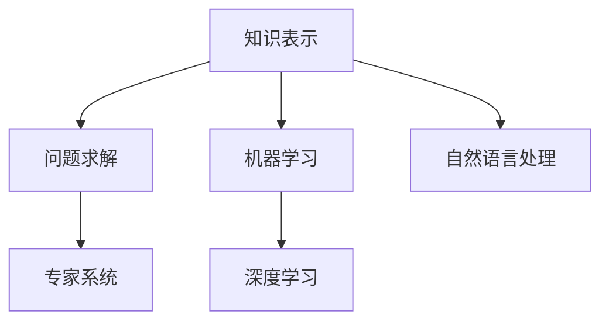
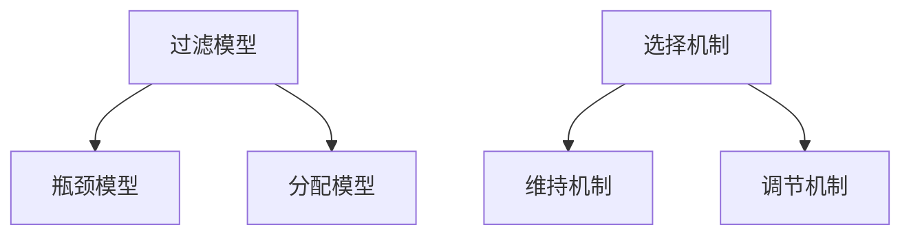

                 

# AI与人类注意力流：未来的教育和学习

## 关键词
- 人工智能
- 教育变革
- 注意力流理论
- 个性化学习
- 在线教育
- 数据分析

## 摘要
本文探讨了人工智能（AI）与人类注意力流理论在教育和学习中的应用，分析了两者之间的内在联系及其对未来教育和学习的潜在影响。首先，我们概述了AI的基础知识和人类注意力流的理论框架，接着详细讨论了AI教育应用模型和策略。随后，我们探讨了注意力流理论在教学设计中的应用，特别是在在线教育领域。最后，本文深入分析了AI与注意力流结合的实践探索，展望了未来的教育和学习趋势，并提供了相关工具和资源。通过这些讨论，我们希望能够为教育工作者和研究人员提供有价值的见解，推动教育和学习的创新与发展。

----------------------------------------------------------------

### 第一部分：AI基础与注意力流理论

#### 第1章：AI概述与教育变革

##### 1.1 AI技术基础

##### 1.1.1 人工智能的基本概念

人工智能（Artificial Intelligence，简称AI）是计算机科学的一个分支，致力于研究、开发和应用使计算机模拟人类智能行为的理论、方法和技术。人工智能的基本概念包括以下几个方面：

1. **知识表示**：如何将人类知识以计算机可处理的形式进行表示，以便计算机能够理解和运用这些知识。
2. **问题求解**：如何设计算法和策略，使计算机能够自动解决复杂问题。
3. **机器学习**：如何从数据中自动学习和发现规律，提高系统的智能程度。
4. **自然语言处理**：如何使计算机理解和生成自然语言，实现人机交互。

##### 1.1.2 人工智能的分类与发展历程

人工智能可以分为几种主要类型：

1. **基于规则的系统**：这些系统通过一套明确的规则来模拟人类的决策过程。
2. **基于模式的识别系统**：这些系统通过分析和识别输入数据中的模式来执行任务。
3. **机器学习系统**：这些系统能够从数据中学习，并通过经验改善性能。
4. **深度学习系统**：这些系统基于多层神经网络，能够处理大量复杂数据并实现高度自动化。

人工智能的发展历程可以分为几个阶段：

1. **早期探索阶段（1950s-1960s）**：人工智能的概念被首次提出，并开始了初步的研究。
2. **繁荣阶段（1970s-1980s）**：人工智能技术取得了显著进展，特别是专家系统的出现。
3. **低谷与复兴阶段（1990s-2000s）**：由于技术的限制，人工智能研究进入低谷，但随着计算能力和数据获取能力的提升，人工智能迎来了新的复兴。
4. **快速发展阶段（2010s-至今）**：深度学习和大数据技术的突破，使人工智能取得了前所未有的进展，并在各个领域得到了广泛应用。

##### 1.1.3 人工智能在教育和学习中的应用现状

人工智能在教育和学习中的应用日益广泛，主要包括以下几个方面：

1. **个性化学习**：通过分析学生的学习数据和习惯，AI系统能够为学生提供个性化的学习内容和路径。
2. **智能辅导**：AI系统能够自动为学生提供解答疑问和辅导学习的服务。
3. **在线教育平台**：AI技术使得在线教育平台能够提供更加智能和互动的学习体验。
4. **教育数据分析**：AI技术可以用于分析学生的学业表现和学习行为，帮助教师和学校更好地理解学生的情况，进行针对性的教育干预。
5. **智能评估**：AI技术能够自动化地进行学生的学业评估，提高评估的效率和准确性。

#### 1.2 人类注意力流的理论框架

##### 1.2.1 人类注意力的定义与机制

人类注意力是指人们集中精力关注特定信息，而忽视其他信息的能力。注意力机制包括以下几个方面：

1. **选择机制**：人们能够根据目标和任务选择关注的信息。
2. **维持机制**：人们能够保持对特定信息的持续关注。
3. **调节机制**：人们能够根据任务需要调节注意力的强度和方向。

##### 1.2.2 人类注意力流的理论模型

人类注意力流理论模型通常包括以下几个方面：

1. **过滤模型**：该模型认为注意力是一种信息过滤机制，只有那些符合特定标准的输入信息才能通过过滤。
2. **瓶颈模型**：该模型认为注意力是一个有限的资源，只有部分信息能够通过瓶颈，进入意识层面。
3. **分配模型**：该模型认为注意力的分配是动态的，人们可以根据任务需要分配注意力资源。

##### 1.2.3 人类注意力流在教育和学习中的影响

人类注意力流对教育和学习有重要影响，主要体现在以下几个方面：

1. **学习效率**：注意力集中的学生能够更高效地学习，因为他们能够更好地吸收和理解学习内容。
2. **学习持久性**：注意力持久的学生的学习时间更长，学习效果也更好。
3. **学习适应性**：注意力灵活的学生能够根据不同的学习情境调整注意力，从而更好地适应不同的学习任务。

#### 1.3 AI与注意力流的联系

##### 1.3.1 AI技术对人类注意力流的影响

AI技术可以对人类注意力流产生多方面的影响：

1. **信息筛选**：AI系统可以帮助人们从大量信息中筛选出有用的信息，减少注意力分散。
2. **信息整合**：AI系统可以将不同的信息进行整合，提高人们处理信息的效率。
3. **注意力调节**：AI系统可以根据用户的行为和需求自动调节注意力，帮助人们更好地完成任务。

##### 1.3.2 注意力流在AI设计中的应用

在AI设计中，注意力流理论可以用于优化系统的交互和用户体验：

1. **交互设计**：通过理解用户的注意力流，AI系统可以设计出更加符合用户需求和使用习惯的交互界面。
2. **内容推荐**：AI系统可以根据用户的注意力流数据，推荐用户可能感兴趣的内容。
3. **任务管理**：AI系统可以分析用户的注意力流，帮助用户合理安排任务，提高工作效率。

#### 总结

本章节概述了人工智能的基础知识和人类注意力流的理论框架，并探讨了两者之间的内在联系及其在教育中的潜在影响。通过本章的讨论，我们为后续章节的深入探讨奠定了基础。

#### 核心概念与联系

##### 人工智能的基本概念

**Mermaid流程图**：


##### 人类注意力流的理论模型

**Mermaid流程图**：


这些概念和模型在AI和注意力流理论中都有着重要的地位，它们共同作用，为AI在教育中的广泛应用提供了理论基础。

----------------------------------------------------------------

### 第二部分：AI教育应用模型与策略

#### 第2章：AI教育应用模型与策略

##### 2.1 AI教育应用模型

##### 2.1.1 个性化学习模型

个性化学习模型是AI在教育中最常见的应用之一。这种模型通过分析学生的学习行为和习惯，为每个学生量身定制个性化的学习内容和路径。具体步骤如下：

1. **数据收集**：收集学生的学习数据，包括考试成绩、学习进度、作业提交情况等。
2. **数据分析**：利用机器学习算法，对收集到的数据进行分析，找出学生的学习特点和需求。
3. **内容推荐**：根据分析结果，推荐适合学生学习的教学内容和资源。
4. **路径规划**：根据学生的需求和兴趣，为学生规划个性化的学习路径。

**伪代码**：
```python
def personalized_learning(model, student_data):
    # 分析学生数据
    analyzed_data = analyze_data(student_data)
    
    # 推荐教学内容
    recommended_content = recommend_content(model, analyzed_data)
    
    # 规划学习路径
    learning_path = plan_path(recommended_content)
    
    return learning_path
```

##### 2.1.2 社交学习模型

社交学习模型通过构建学习社区，促进学生之间的互动和合作，以提高学习效果。具体步骤如下：

1. **社区构建**：创建学习社区，包括学生、教师和其他参与者。
2. **互动促进**：设计互动活动，如讨论、协作项目等，以促进社区成员之间的交流。
3. **反馈机制**：建立反馈机制，鼓励学生和教师提供对学习内容的反馈和建议。
4. **数据分析**：分析社区互动数据，优化社区设计和活动。

**伪代码**：
```python
def social_learning_community(community, activities):
    # 构建学习社区
    built_community = build_community(community)
    
    # 促进互动
    interactions = promote_interactions(built_community, activities)
    
    # 收集反馈
    feedback = collect_feedback(interactions)
    
    # 数据分析
    analyzed_feedback = analyze_data(feedback)
    
    return analyzed_feedback
```

##### 2.1.3 适应性学习模型

适应性学习模型根据学生的学习表现和进度，动态调整教学内容和难度，以适应学生的个体差异。具体步骤如下：

1. **初始评估**：对学生进行初始评估，以了解其知识水平和能力。
2. **动态调整**：根据学生的实时表现，调整教学内容和难度。
3. **持续优化**：通过持续的数据收集和分析，优化学习策略和教学设计。

**伪代码**：
```python
def adaptive_learning(model, student_performance):
    # 初始评估
    initial_evaluation = evaluate_student(model, student_performance)
    
    # 动态调整
    adjusted_content = adjust_content(model, initial_evaluation)
    
    # 持续优化
    optimized_strategy = optimize_strategy(model, adjusted_content)
    
    return optimized_strategy
```

##### 2.2 AI教育应用策略

##### 2.2.1 教育内容与资源优化

教育内容与资源优化是AI教育应用的重要策略之一，通过智能推荐和自动化管理，提高教学质量和效率。具体步骤如下：

1. **内容筛选**：根据学生的兴趣和学习需求，筛选出最适合的教育内容。
2. **资源管理**：自动化管理教育资源，如教材、视频、练习题等，确保资源的及时更新和合理利用。
3. **个性化推荐**：利用机器学习算法，为学生推荐个性化的学习资源。

**伪代码**：
```python
def content_and_resource_optimization(student_preferences):
    # 内容筛选
    selected_content = filter_content(student_preferences)
    
    # 资源管理
    managed_resources = manage_resources(selected_content)
    
    # 个性化推荐
    recommended_resources = recommend_resources(student_preferences)
    
    return recommended_resources
```

##### 2.2.2 教学过程优化

教学过程优化是通过AI技术改进教学方法和流程，提高教学效果。具体步骤如下：

1. **教学设计**：利用AI技术进行教学设计，包括课程内容规划、教学方法选择等。
2. **教学实施**：利用智能辅导系统和在线教育平台，实现教学过程的自动化和智能化。
3. **教学评估**：利用AI技术进行教学效果评估，为教师提供反馈，优化教学策略。

**伪代码**：
```python
def teaching_process_optimization(teaching_plan):
    # 教学设计
    designed_course = design_course(teaching_plan)
    
    # 教学实施
    implemented_course = implement_course(designed_course)
    
    # 教学评估
    assessed_course = assess_course(implemented_course)
    
    return assessed_course
```

##### 2.2.3 教育评价与反馈系统

教育评价与反馈系统是AI教育应用的重要组成部分，通过自动化评估和智能反馈，提高评价的准确性和效率。具体步骤如下：

1. **评估设计**：设计自动化评估系统，包括考试、作业、项目等。
2. **评估实施**：自动进行评估，生成评估结果。
3. **智能反馈**：利用AI技术分析评估结果，提供智能化的反馈和建议。

**伪代码**：
```python
def evaluation_and_feedback_system(assessments):
    # 评估设计
    designed_assessment = design_assessment(assessments)
    
    # 评估实施
    implemented_assessment = implement_assessment(designed_assessment)
    
    # 智能反馈
    feedback = generate_feedback(implemented_assessment)
    
    return feedback
```

##### 2.3 AI教育应用案例

##### 2.3.1 案例一：智能辅导系统

智能辅导系统是AI在教育中的一种典型应用，它利用自然语言处理和机器学习技术，为学生提供实时解答和辅导服务。具体实现如下：

1. **问题解析**：学生提出问题，系统通过自然语言处理技术解析问题，提取关键信息。
2. **知识检索**：系统利用已有的知识库，检索与问题相关的知识点。
3. **解答生成**：系统根据检索到的知识点，生成详细的解答过程和答案。
4. **交互反馈**：学生可以与系统进行互动，提出疑问或请求进一步的解释。

**伪代码**：
```python
def smart_tutor_system(student_question):
    # 问题解析
    parsed_question = parse_question(student_question)
    
    # 知识检索
    knowledge = retrieve_knowledge(parsed_question)
    
    # 解答生成
    answer = generate_answer(knowledge)
    
    # 交互反馈
    feedback = interact_with_student(answer)
    
    return feedback
```

##### 2.3.2 案例二：在线学习平台

在线学习平台是AI在教育中的另一种重要应用，它利用AI技术提供个性化学习体验，包括内容推荐、学习路径规划等。具体实现如下：

1. **用户注册**：学生注册并填写个人学习偏好。
2. **数据收集**：平台收集学生的学习行为数据，包括学习时间、学习内容、考试成绩等。
3. **数据分析**：利用机器学习算法，分析学生的学习行为和偏好。
4. **内容推荐**：根据分析结果，推荐适合学生的学习内容。
5. **路径规划**：根据学生的学习进度和兴趣，规划个性化的学习路径。

**伪代码**：
```python
def online_learning_platform(user_profile):
    # 用户注册
    registered_user = register_user(user_profile)
    
    # 数据收集
    collected_data = collect_data(registered_user)
    
    # 数据分析
    analyzed_data = analyze_data(collected_data)
    
    # 内容推荐
    recommended_content = recommend_content(analyzed_data)
    
    # 路径规划
    learning_path = plan_path(recommended_content)
    
    return learning_path
```

##### 2.3.3 案例三：智能评估系统

智能评估系统利用AI技术自动化进行学生学业评估，提高评估的效率和准确性。具体实现如下：

1. **试题生成**：根据课程要求和学生的学习情况，自动生成适合的试题。
2. **自动批改**：利用自然语言处理和计算机视觉技术，自动批改学生的试卷。
3. **评估分析**：分析学生的答题情况，生成详细的评估报告。
4. **智能反馈**：根据评估结果，为学生提供个性化的学习建议。

**伪代码**：
```python
def smart_evaluation_system(test_questions, student_answers):
    # 试题生成
    generated_questions = generate_questions(test_questions)
    
    # 自动批改
    graded_answers = grade_answers(student_answers, generated_questions)
    
    # 评估分析
    evaluation_report = analyze_answers(graded_answers)
    
    # 智能反馈
    feedback = generate_feedback(evaluation_report)
    
    return feedback
```

##### 2.4 总结

本章介绍了AI教育应用模型和策略，包括个性化学习模型、社交学习模型和适应性学习模型，以及教育内容与资源优化、教学过程优化和教育评价与反馈系统。这些模型和策略为AI在教育中的应用提供了理论基础和实践指导。通过具体案例的实现，我们展示了AI技术如何改变教育和学习的方式，提高教学效果和学习效率。

----------------------------------------------------------------

### 第三部分：注意力流理论在教学设计中的应用

#### 第3章：注意力流理论在教学设计中的应用

##### 3.1 注意力流理论在教学设计中的价值

注意力流理论在教学设计中的应用具有重要意义，它有助于提高学生的学习效率和效果。具体价值体现在以下几个方面：

1. **提高学生注意力的持久性**：通过合理设计教学活动，维持学生长时间的注意力集中，避免注意力分散，从而提高学习效果。
2. **提高学生注意力的集中度**：通过引入有趣的教学内容和互动方式，增强学生对学习内容的兴趣，提高注意力的集中度。
3. **提高学生注意力的灵活性**：通过灵活调整教学方法和内容，帮助学生适应不同的学习情境，提高注意力的灵活性。

##### 3.2 注意力流理论在教学活动设计中的应用

注意力流理论在教学活动设计中的应用，可以帮助教师更好地组织和引导学生，提高教学效果。以下是一些具体的应用方法：

1. **设计引人入胜的课堂导入**：课堂导入是吸引学生注意力的关键环节，可以通过引入有趣的故事、实例或问题，激发学生的兴趣和好奇心，从而引导他们进入学习状态。

2. **创建互动性强的课堂活动**：互动性强的课堂活动能够吸引学生的注意力，提高课堂参与度。例如，小组讨论、角色扮演、游戏等，都可以有效地吸引学生的注意力，促进他们参与学习。

3. **使用多媒体和游戏化教学**：多媒体和游戏化教学是吸引学生注意力的重要手段。通过图片、视频、音频等多媒体元素，以及游戏化的学习任务，可以增强学生的学习兴趣和参与度，提高学习效果。

**伪代码**：
```python
def engaging_class_introduction(topic):
    # 引入有趣的故事或实例
    story = introduce_story(topic)
    
    # 提出问题，激发学生好奇心
    question = raise_interesting_question(topic)
    
    # 引导学生进入学习状态
    prepare_for_learning(story, question)

def interactive_class_activity(activities):
    # 小组讨论
    group_discussion = start_group_discussion(activities)
    
    # 角色扮演
    role_playing = start_role_playing(activities)
    
    # 游戏
    game = start_game(activities)

def multimedia_and_game_based_teaching(contents):
    # 使用图片、视频等多媒体元素
    multimedia_elements = add_multimedia(contents)
    
    # 游戏化学习任务
    game_based_task = create_game_based_task(contents)
    
    # 增强学习兴趣和参与度
    increase_interest_and_involvement(multimedia_elements, game_based_task)
```

##### 3.3 注意力流理论在课程设计中的应用

注意力流理论在课程设计中的应用，可以帮助教师更好地规划和组织课程内容，提高学生的学习效果。以下是一些具体的应用方法：

1. **课程的连续性和关联性设计**：课程设计应保持内容的连续性和关联性，帮助学生更好地理解知识点之间的联系，避免注意力分散。

2. **课程难度的适当调整**：根据学生的注意力和理解能力，适当调整课程难度，确保学生能够持续保持注意力集中。

3. **课程评价与反馈机制**：建立有效的课程评价与反馈机制，及时了解学生的学习情况，提供针对性的反馈和建议，帮助学生调整注意力和学习策略。

**伪代码**：
```python
def course_design_with_attention_flow(course_contents, student_profile):
    # 保持课程内容的连续性和关联性
    continuous_and_relevant_course_contents = organize_course_contents(course_contents)
    
    # 根据学生注意力和理解能力调整课程难度
    adjusted_course_difficulty = adjust_course_difficulty(continuous_and_relevant_course_contents, student_profile)
    
    # 建立课程评价与反馈机制
    evaluation_and_feedback_system = set_up_evaluation_and_feedback(adjusted_course_difficulty)

    return evaluation_and_feedback_system
```

##### 3.4 总结

本章介绍了注意力流理论在教学设计中的应用，包括在教学活动设计和课程设计中的应用方法。通过合理应用注意力流理论，教师可以更好地组织和引导学生，提高教学效果和学习效率。同时，本章提供了具体的伪代码示例，帮助读者更好地理解和应用这些方法。

----------------------------------------------------------------

### 第四部分：注意力流理论在在线教育中的应用

#### 第4章：注意力流理论在在线教育中的应用

##### 4.1 在线教育中的注意力流管理

在线教育中，注意力流的管理是确保学习效果的关键。注意力流管理包括以下几个方面：

1. **课程内容设计**：课程内容应注重引人入胜，利用多媒体、游戏化元素等吸引学生的注意力。

2. **课堂氛围营造**：通过营造积极、互动的课堂氛围，提高学生的参与度和注意力。

3. **学习动机激发**：通过设定明确的学习目标、奖励机制等，激发学生的学习动机和兴趣。

**伪代码**：
```python
def course_content_design(content, multimedia_elements):
    # 引入多媒体元素
    multimedia_content = add_multimedia_elements(content)
    
    # 游戏化学习任务
    game_based_task = create_game_based_task(multimedia_content)
    
    return game_based_task

def classroom_atmosphere_creation(atmosphere):
    # 营造积极互动氛围
    interactive_atmosphere = create_interactive_atmosphere(atmosphere)
    
    # 提供即时反馈
    instant_feedback = provide_immediate_feedback(interactive_atmosphere)
    
    return interactive_atmosphere

def motivation_illusion(motivation, goals, rewards):
    # 设定明确目标
    clear_goals = set_clear_goals(goals)
    
    # 奖励机制
    reward_mechanism = set_reward_mechanism(rewards)
    
    # 激发学习动机
    increased_motivation = stimulate_learning_motivation(motivation, clear_goals, reward_mechanism)
    
    return increased_motivation
```

##### 4.2 注意力流理论在在线教育平台中的应用

注意力流理论在在线教育平台中的应用，可以帮助平台提供更加个性化、互动化的学习体验。以下是一些具体的应用方法：

1. **个性化学习路径设计**：根据学生的学习行为和偏好，设计个性化的学习路径，确保学生能够持续保持注意力集中。

2. **社交互动与协作学习**：通过搭建社交互动平台，促进学生之间的交流和协作，提高学习效果。

3. **学习效果评估与反馈**：利用AI技术，实时评估学生的学习效果，提供个性化的反馈，帮助学生调整学习策略。

**伪代码**：
```python
def personalized_learning_path_design(student_profile, course_contents):
    # 分析学生行为和偏好
    analyzed_profile = analyze_student_profile(student_profile)
    
    # 设计个性化学习路径
    personalized_path = design_personalized_learning_path(analyzed_profile, course_contents)
    
    return personalized_path

def social_interactions_and_collaborative_learning(platform, students):
    # 创建社交互动平台
    social_platform = create_social_interaction_platform(platform)
    
    # 促进协作学习
    collaborative_learning = promote_collaborative_learning(social_platform, students)
    
    return collaborative_learning

def learning_effect_evaluation_and_feedback(platform, student_performance):
    # 实时评估学生表现
    real_time_evaluation = evaluate_student_performance(platform, student_performance)
    
    # 提供个性化反馈
    personalized_feedback = generate_personalized_feedback(real_time_evaluation)
    
    # 帮助学生调整学习策略
    adjusted_learning_strategy = adjust_learning_strategy(student_performance, personalized_feedback)
    
    return adjusted_learning_strategy
```

##### 4.3 注意力流理论在在线教育中的应用案例

以下是一些注意力流理论在在线教育中的应用案例：

1. **案例一：在线编程学习平台**：通过引入游戏化学习元素，如积分系统、排行榜等，吸引学生的注意力，提高学习兴趣。

2. **案例二：虚拟课堂系统**：通过实时互动和反馈机制，营造积极、互动的课堂氛围，提高学生的学习参与度和注意力。

3. **案例三：智能学习助手**：通过分析学生的学习行为和偏好，提供个性化的学习建议和资源，帮助学生保持注意力集中。

**伪代码**：
```python
def online_programming_learning_platform(content, game_elements):
    # 引入游戏化元素
    gameified_content = add_game_elements(content)
    
    # 提供积分系统
    points_system = implement_points_system(gameified_content)
    
    # 排行榜
    leaderboard = create_leaderboard(points_system)
    
    return leaderboard

def virtual_classroom_system(interaction, feedback):
    # 实时互动
    real_time_interaction = enable_real_time_interaction(interaction)
    
    # 提供即时反馈
    immediate_feedback = provide_immediate_feedback(feedback)
    
    return real_time_interaction

def smart_learning_assistant(student_profile, resources):
    # 分析学生行为和偏好
    analyzed_profile = analyze_student_profile(student_profile)
    
    # 提供个性化资源
    personalized_resources = recommend_personalized_resources(analyzed_profile, resources)
    
    # 帮助学生保持注意力
    maintain_attention = provide_attention_maintaining_help(personalized_resources)
    
    return maintain_attention
```

##### 4.4 总结

本章介绍了注意力流理论在在线教育中的应用，包括注意力流管理、在线教育平台的应用以及具体应用案例。通过合理应用注意力流理论，在线教育平台可以提供更加个性化、互动化的学习体验，提高学生的学习效果。

----------------------------------------------------------------

### 第五部分：AI与注意力流结合的实践探索

#### 第5章：AI在教育中的深度应用

##### 5.1 深度学习与教育数据分析

深度学习是人工智能的一个重要分支，其在教育中的应用日益广泛，尤其是在教育数据分析方面。深度学习通过多层神经网络，可以从大量教育数据中自动学习和提取有价值的信息，从而帮助教师和学校更好地理解学生的情况，进行针对性的教育干预。

**深度学习技术介绍**

深度学习技术主要包括以下几个关键组成部分：

1. **神经网络**：神经网络是深度学习的基础，它由大量的节点（或称为神经元）组成，通过调整节点间的权重，实现数据的处理和分类。
2. **卷积神经网络（CNN）**：CNN是一种专门用于处理图像数据的神经网络，通过卷积操作和池化操作，可以有效地提取图像特征。
3. **循环神经网络（RNN）**：RNN是一种用于处理序列数据的神经网络，通过循环机制，可以记住前面的信息，并在后续的步骤中使用这些信息。
4. **长短期记忆网络（LSTM）**：LSTM是RNN的一种变体，它通过引入门控机制，可以有效地解决RNN的梯度消失问题，适用于处理长时间依赖的序列数据。

**教育数据分析方法**

深度学习在教育数据分析中的应用，主要包括以下几个方面：

1. **学生行为分析**：通过分析学生的考试成绩、学习进度、作业提交情况等数据，可以了解学生的学习情况，发现潜在的问题，提供针对性的帮助。
2. **教学效果评估**：通过分析教学过程中的数据，如课堂参与度、教师评价等，可以评估教学效果，优化教学方法和策略。
3. **个性化学习路径推荐**：通过分析学生的学习数据和偏好，可以推荐适合他们的学习内容和路径，提高学习效果。
4. **学生心理健康监测**：通过分析学生的行为数据，如情绪波动、学习状态等，可以监测学生的心理健康状况，提供及时的心理支持。

**深度学习在教育中的应用**

深度学习在教育中的应用，可以通过以下几个步骤实现：

1. **数据收集**：收集学生的考试成绩、学习进度、作业提交情况等数据，以及教师的教学数据。
2. **数据处理**：对收集到的数据进行预处理，包括数据清洗、归一化等，以便于模型训练。
3. **模型训练**：利用深度学习算法，对处理后的数据进行训练，构建预测模型。
4. **模型评估**：对训练好的模型进行评估，确保其准确性和鲁棒性。
5. **应用部署**：将评估通过后的模型部署到实际应用中，如学生行为分析系统、教学效果评估系统等。

**伪代码**：
```python
def deep_learning_in_education(data, model):
    # 数据预处理
    preprocessed_data = preprocess_data(data)
    
    # 模型训练
    trained_model = train_model(preprocessed_data, model)
    
    # 模型评估
    evaluated_model = evaluate_model(trained_model)
    
    # 应用部署
    deployed_model = deploy_model(evaluated_model)
    
    return deployed_model
```

##### 5.2 AI在教育评价中的应用

AI在教育评价中的应用，可以帮助教师和学校更加客观、准确地评估学生的学习情况，提供个性化的反馈和建议。

**评估系统的设计与实现**

评估系统设计主要包括以下几个关键环节：

1. **评估指标设计**：根据课程目标和教学内容，设计合理的评估指标，如考试成绩、作业完成情况、课堂参与度等。
2. **评估工具开发**：开发用于收集和评估学生表现的工具，如在线考试系统、作业提交系统等。
3. **评估模型训练**：利用深度学习算法，对收集到的评估数据进行分析和建模，构建评估模型。
4. **评估结果优化**：对评估结果进行优化，包括评估指标的权重调整、评估模型的改进等，以提高评估的准确性和公正性。

**评估结果的优化与改进**

评估结果的优化与改进主要包括以下几个方面：

1. **多元评估指标**：引入多种评估指标，如考试成绩、课堂表现、作业完成情况等，以全面评估学生的能力和表现。
2. **个性化反馈**：根据学生的表现和需求，提供个性化的反馈和建议，帮助学生改进学习方法和策略。
3. **持续评估**：通过持续的数据收集和分析，动态调整评估指标和评估模型，确保评估的准确性和公正性。

**伪代码**：
```python
def assessment_system_design(assessment_metrics):
    # 评估指标设计
    designed_metrics = design_assessment_metrics(assessment_metrics)
    
    # 评估工具开发
    developed_tools = develop_assessment_tools(designed_metrics)
    
    # 评估模型训练
    trained_model = train_assessment_model(designed_metrics)
    
    # 评估结果优化
    optimized_results = optimize_assessment_results(trained_model)
    
    return optimized_results
```

##### 5.3 AI在教育辅导中的应用

AI在教育辅导中的应用，可以通过智能辅导系统和个性化学习平台，为学生提供实时解答和辅导服务，提高学习效果。

**智能辅导系统的设计与实现**

智能辅导系统设计主要包括以下几个关键环节：

1. **问题解析**：通过自然语言处理技术，解析学生提出的问题，提取关键信息。
2. **知识库构建**：构建涵盖各个学科的知识库，确保系统能够提供准确、全面的解答。
3. **解答生成**：根据学生的问题和知识库，生成详细的解答过程和答案。
4. **交互反馈**：通过人机交互界面，提供即时反馈和解答，帮助学生理解知识点。

**智能辅导系统的功能模块**

智能辅导系统的功能模块主要包括：

1. **问答模块**：实现学生与系统的问答交互，提供实时解答服务。
2. **知识点解析模块**：解析学生的问题，提取关键信息，为解答生成提供依据。
3. **知识库管理模块**：管理知识库的构建和更新，确保知识库的准确性和完整性。
4. **反馈模块**：收集学生的反馈，用于系统的优化和改进。

**伪代码**：
```python
def intelligent_tutor_system(student_question, knowledge_base):
    # 问题解析
    parsed_question = parse_question(student_question)
    
    # 知识点解析
    relevant_knowledge = parse_knowledge(parsed_question, knowledge_base)
    
    # 解答生成
    answer = generate_answer(relevant_knowledge)
    
    # 交互反馈
    feedback = interact_with_student(answer)
    
    return feedback
```

##### 5.4 总结

本章介绍了AI在教育中的深度应用，包括深度学习与教育数据分析、AI在教育评价中的应用和AI在教育辅导中的应用。通过合理应用AI技术，可以显著提高教育的效率和质量，为教师和学生提供更好的支持和帮助。

----------------------------------------------------------------

### 第六部分：注意力流理论在AI教育系统设计中的应用

#### 第6章：注意力流理论在AI教育系统设计中的应用

##### 6.1 注意力流理论在AI教育系统设计中的价值

注意力流理论在AI教育系统设计中的应用，对于提高学生的学习效率和教学质量具有重要意义。以下是注意力流理论在AI教育系统设计中的几个关键价值：

1. **提高学生的学习效率和效果**：通过合理设计教学系统和学习路径，确保学生在学习过程中能够持续保持注意力集中，从而提高学习效率和效果。

2. **提高教师的授课质量和效率**：通过分析学生的学习行为和注意力流，教师可以更好地了解学生的学习需求和难点，调整教学方法和内容，提高授课质量和效率。

3. **促进教育资源的优化配置**：通过分析学生的学习行为和注意力流，可以优化教育资源的分配和使用，确保教育资源的最大化利用，提高教育资源的使用效率。

##### 6.2 AI教育系统设计原则

为了充分发挥注意力流理论在AI教育系统设计中的作用，需要遵循以下设计原则：

1. **教育目标的明确性**：在设计AI教育系统时，首先要明确教育目标，确保系统能够围绕教育目标进行设计，提高学习效率和效果。

2. **学习路径的个性化**：通过分析学生的学习行为和注意力流，为每个学生设计个性化的学习路径，确保学生能够根据自己的需求和兴趣进行学习。

3. **学习过程的互动性**：设计互动性强的学习过程，通过多媒体、游戏化等手段，提高学生的参与度和兴趣，促进学生的注意力集中。

##### 6.3 AI教育系统设计实践

为了实现注意力流理论在AI教育系统设计中的应用，可以采用以下具体设计实践：

1. **教育内容与资源管理**：通过自动化管理和推荐系统，优化教育内容的组织和推荐，确保学生能够获取到最适合自己的学习资源。

2. **教学过程与学习行为监控**：利用AI技术监控学生的学习过程和学习行为，实时分析学生的注意力流，提供针对性的指导和支持。

3. **学习效果评估与反馈系统**：通过实时评估学生的学习效果，提供个性化的反馈和建议，帮助学生调整学习策略，提高学习效果。

**伪代码**：

```python
def educational_system_design(learning_path, educational_content, student_behavior):
    # 教育内容与资源管理
    managed_content = manage_educational_content(educational_content)
    
    # 学习路径个性化
    personalized_path = design_personalized_learning_path(learning_path, student_behavior)
    
    # 学习行为监控
    monitored_behavior = monitor_learning_behavior(student_behavior)
    
    # 学习效果评估与反馈
    feedback = evaluate_learning_effects(monitored_behavior)
    
    return feedback
```

##### 6.4 总结

本章介绍了注意力流理论在AI教育系统设计中的应用，包括设计原则和具体设计实践。通过合理应用注意力流理论，可以显著提高AI教育系统的学习效率和教学质量，为教师和学生提供更好的支持和帮助。

----------------------------------------------------------------

### 第七部分：未来的教育和学习：AI与注意力流的深度融合

#### 第7章：AI与注意力流融合教育的趋势

##### 7.1 AI与注意力流融合教育的趋势

随着人工智能（AI）技术的飞速发展和对人类注意力流理论的深入理解，AI与注意力流融合的教育模式正在成为未来教育和学习的趋势。以下是一些关键趋势：

1. **教育数据智能化**：通过AI技术对教育数据进行分析和处理，可以更加精准地了解学生的学习行为、学习习惯和学习效果，从而实现个性化教育。

2. **教学个性化**：AI技术可以根据学生的学习行为和注意力流数据，为每个学生量身定制个性化的学习计划和资源，提高学习效果。

3. **学习自动化**：AI技术可以通过自动化算法和模型，实现学习过程的自动化，减少教师的重复性工作，提高教学效率。

##### 7.2 AI与注意力流融合教育的挑战与机遇

AI与注意力流融合教育在带来巨大机遇的同时，也面临一系列挑战：

1. **数据隐私与伦理问题**：随着AI技术的广泛应用，学生和教师的数据隐私保护成为一个重要议题。如何确保数据的隐私和安全，避免数据滥用，是亟待解决的问题。

2. **教育公平与包容性**：AI技术在教育中的应用可能导致教育资源的不均衡分配，如何确保所有学生，尤其是弱势群体，能够公平地享受到AI技术带来的教育红利，是一个重要的挑战。

3. **机遇一：促进教育创新与变革**：AI与注意力流的融合为教育创新提供了新的契机，通过智能化的教育工具和平台，可以创造出更加丰富和多样的教学方式，促进教育的变革。

4. **机遇二：提高教育质量和效率**：AI技术可以提高教育的质量和效率，通过个性化教学、自动化评估和智能辅导，使教师和学生能够更加高效地完成教学和学习任务。

##### 7.3 未来的教育与学习愿景

未来的教育与学习将呈现出以下愿景：

1. **个性化学习的普及**：通过AI技术，每个学生都将能够获得个性化的学习体验，学习内容、学习路径和学习节奏都将根据其个人需求和兴趣进行定制。

2. **互动式教学的推广**：AI技术将使教学过程更加互动和生动，学生和教师之间的互动将更加频繁和深入，提高学生的学习积极性和参与度。

3. **自动化评估与反馈的优化**：AI技术将实现自动化评估和反馈，通过实时分析和处理学习数据，提供个性化的学习建议和指导，帮助教师和学生及时调整学习策略。

4. **持续学习的实现与推广**：AI技术将使学习过程更加灵活和便捷，学生可以通过各种智能设备和平台随时随地学习，实现终身学习的目标。

**总结**

AI与注意力流的深度融合将引领未来教育和学习的变革，通过个性化学习、互动式教学和自动化评估，提高教育的质量和效率，实现教育的公平与包容。面对挑战，我们需要积极探索解决方案，确保AI与注意力流融合教育能够为所有人带来真正的教育福利。

----------------------------------------------------------------

### 附录：AI与注意力流教育应用工具与资源

#### 附录1：AI教育应用工具介绍

1. **深度学习框架与应用**：
   - **TensorFlow**：由Google开发的开源深度学习框架，广泛应用于各种AI项目，包括教育应用。
   - **PyTorch**：由Facebook开发的开源深度学习框架，具有灵活的动态计算图，适用于研究和开发。
   - **Keras**：基于TensorFlow和Theano的高层神经网络API，简化了深度学习模型的构建和训练过程。

2. **教育数据分析工具**：
   - **R**：一种统计计算和图形显示语言，广泛应用于数据分析和可视化。
   - **Python的Pandas和NumPy库**：用于数据处理和分析的库，提供高效的数据结构和数据分析工具。

3. **个性化学习系统**：
   - **DreamBox**：一款面向K-12学生的个性化学习平台，提供自适应的学习体验。
   - **Knewton**：一款面向成人教育的个性化学习平台，通过分析学习行为，为每个学生提供个性化的学习路径。

#### 附录2：注意力流教育应用案例库

1. **个性化学习系统案例**：
   - **Knewton**：利用注意力流理论，分析学生的学习行为和注意力流，为每个学生提供个性化的学习内容和路径。

2. **互动式教学案例**：
   - **Quizlet**：通过游戏化和互动式学习，提高学生的学习兴趣和参与度，改善注意力流。

3. **自动化评估案例**：
   - **Classcraft**：一款结合游戏化元素和自动化评估的学习平台，通过角色扮演和任务完成，提供即时反馈和评估。

这些工具和资源为AI与注意力流在教育中的应用提供了实践基础，有助于教师和学生更好地理解和利用这些技术，提升教育和学习的效果。

