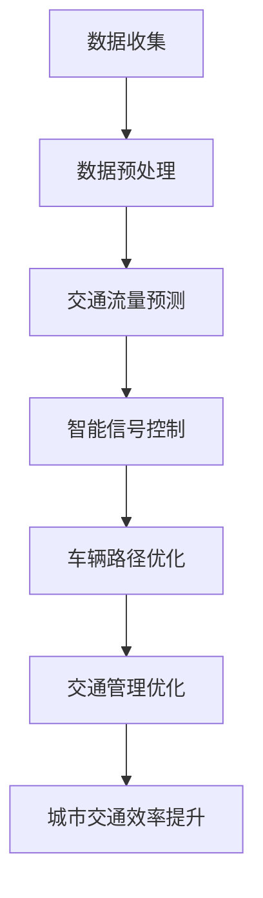
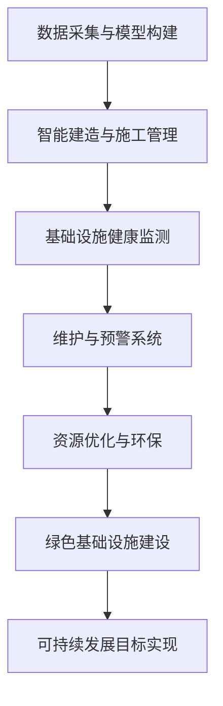

                 

# 引言

## 人工智能（AI）与人类计算概述

### 人工智能（AI）技术的基本概念与分类

人工智能（Artificial Intelligence, AI）是指计算机系统模拟人类智能行为的能力，包括学习、推理、解决问题、理解和生成语言等。根据其实现方式和功能，AI 可大致分为以下几类：

1. **规则推理系统**：基于预设规则进行推理，如专家系统。
2. **知识表示与推理**：通过符号表示和推理机制实现，如语义网络。
3. **机器学习**：通过数据训练学习模式，如神经网络、决策树、支持向量机等。
4. **深度学习**：一种特殊的机器学习方法，通过多层神经网络进行学习，如卷积神经网络（CNN）、循环神经网络（RNN）等。
5. **自然语言处理（NLP）**：使计算机能够理解和生成人类语言，如语言模型、词嵌入、序列标注等。
6. **计算机视觉**：使计算机能够“看”和理解图像，如图像分类、目标检测等。

### 人类计算与人工智能的结合点

人类计算（Human Computation）是指人类和计算机系统协同工作以完成复杂任务的过程。AI 与人类计算的结合点主要体现在以下几个方面：

1. **任务分配**：利用 AI 自动识别和分配不同类型的任务，以最大化效率。
2. **数据采集**：人类在特定场景下进行数据标注，为机器学习提供高质量的训练数据。
3. **交互式增强**：通过 AI 生成个性化反馈和指导，提高人类执行任务的准确性和效率。
4. **智能辅助**：利用 AI 实现自动化决策支持，减轻人类工作负担。

### AI 在城市建设与管理中的角色

在城市交通与基础设施的建设与管理中，人工智能技术正发挥着越来越重要的作用。以下是其主要角色：

1. **优化交通流量**：通过交通流量预测和智能交通信号控制，缓解城市拥堵问题。
2. **提升基础设施维护效率**：利用 AI 对基础设施进行健康监测和预测性维护，延长设施寿命。
3. **智能化管理**：通过数据分析和决策支持系统，实现城市资源的优化配置和管理。
4. **促进可持续发展**：利用 AI 技术实现绿色建筑、智能能源管理和废弃物处理等。

## 城市交通与基础设施建设的现状与挑战

### 城市交通拥堵问题

当前，全球许多城市面临着严重的交通拥堵问题。这主要由于以下几个原因：

1. **人口增长**：随着城市化进程的加速，城市人口不断增加，导致交通需求急剧上升。
2. **车辆保有量增加**：私家车数量的快速增长，加剧了道路负荷。
3. **城市规划不足**：许多城市在规划阶段未能充分考虑交通需求，导致交通基础设施滞后。
4. **公共交通系统不完善**：公共交通系统无法满足居民出行需求，导致更多的人选择私家车。

### 基础设施老化与维护

城市基础设施，如道路、桥梁、隧道等，随着时间的推移，会逐渐老化。这给城市交通和居民生活带来一系列问题：

1. **设施破损**：老化的基础设施容易发生破损，影响交通畅通。
2. **维护成本增加**：老化设施需要更多的维护和修复，导致财政负担加重。
3. **安全隐患**：设施老化可能引发安全事故，威胁居民生命财产安全。
4. **城市规划与发展的矛盾**：老旧设施难以适应城市发展需求，制约城市规划与实施。

### AI 与可持续发展的关系

可持续发展是指在满足当前需求的同时，不损害后代满足其需求的能力。AI 技术在可持续发展中具有重要作用，主要体现在以下几个方面：

1. **优化资源配置**：通过数据分析和预测，实现资源的优化配置，提高利用效率。
2. **降低碳排放**：利用 AI 技术优化交通流量和能源管理，降低碳排放，减轻环境污染。
3. **智能城市建设**：通过 AI 技术实现智能交通、绿色建筑和智能能源管理，推动城市可持续发展。
4. **社会公平**：利用 AI 技术提高公共服务水平，缩小城乡差距，实现社会公平。

总之，AI 与人类计算的结合为城市交通与基础设施建设提供了新的机遇和挑战。通过合理利用 AI 技术，我们有望实现更加高效、安全和可持续的城市发展。

## 总结

本节主要介绍了人工智能（AI）与人类计算的基本概念及其在城市交通与基础设施建设中的角色。我们探讨了 AI 技术的分类、人类计算的定义及其结合点，分析了城市交通与基础设施建设的现状与挑战，以及 AI 在可持续发展中的重要性。通过本节内容，我们认识到 AI 技术在城市发展中具有巨大的潜力，有望解决当前面临的诸多问题。

在接下来的章节中，我们将深入探讨 AI 在城市交通系统中的应用，包括交通运输需求预测与流量分析、智能交通信号控制以及车辆路径优化与导航。同时，我们还将介绍 AI 在基础设施建设与管理中的应用，如智能建造与施工管理、基础设施维护与监测以及资源优化与环境保护。这些应用将帮助我们进一步理解 AI 技术如何助力城市可持续发展。

### 第二部分：核心概念与架构

#### 第2章：AI 在城市交通系统中的应用

在城市化进程不断加速的背景下，城市交通系统面临巨大挑战。人工智能（AI）技术的引入，为缓解交通拥堵、提升交通效率和促进可持续发展提供了新的途径。本章将详细介绍 AI 在城市交通系统中的应用，包括交通运输需求预测与流量分析、智能交通信号控制以及车辆路径优化与导航。

### 2.1 交通运输需求预测与流量分析

交通运输需求预测与流量分析是城市交通管理的重要环节。通过分析交通流量数据，可以预测未来的交通需求，为交通管理提供有力支持。

#### 2.1.1 数据收集与预处理

首先，我们需要收集交通流量数据。这些数据可以来源于交通监控设备、车辆 GPS 数据、移动应用程序等。数据收集后，需要进行预处理，包括数据清洗、格式转换和缺失值处理。以下是一个简化的数据预处理过程：

1. **数据清洗**：去除异常值和噪声数据，如过快或过慢的速度数据。
2. **格式转换**：将不同来源的数据格式统一，如将 GPS 数据转换为时间序列数据。
3. **缺失值处理**：对于缺失的数据，可以使用插值法或均值填补等方法进行补全。

#### 2.1.2 时间序列分析与预测模型

时间序列分析是预测交通流量的一种有效方法。时间序列数据通常具有趋势、季节性和周期性。针对这些特性，我们可以选择以下几种预测模型：

1. **移动平均法**：通过对历史数据进行平滑处理，去除随机波动，得到长期趋势。
2. **指数平滑法**：在移动平均法的基础上，考虑历史数据的权重，使模型更加灵活。
3. **ARIMA 模型**：自回归积分滑动平均模型，能够同时考虑趋势、季节性和周期性。
4. **LSTM 模型**：长短期记忆网络，一种特殊的循环神经网络，能够有效捕捉时间序列中的长期依赖关系。

以下是一个简单的 LSTM 模型预测伪代码：

```python
import numpy as np
from keras.models import Sequential
from keras.layers import LSTM, Dense

# 数据预处理
# ...

# 构建LSTM模型
model = Sequential()
model.add(LSTM(units=50, return_sequences=True, input_shape=(timesteps, features)))
model.add(LSTM(units=50))
model.add(Dense(units=1))

# 编译模型
model.compile(optimizer='adam', loss='mean_squared_error')

# 训练模型
model.fit(x_train, y_train, epochs=100, batch_size=32)
```

### 2.2 智能交通信号控制

智能交通信号控制是提升城市交通效率的关键技术。传统的交通信号控制主要基于固定的信号配时方案，无法灵活应对实时交通状况。而智能交通信号控制利用 AI 技术可以动态调整信号配时，提高道路通行能力。

#### 2.2.1 传统交通信号控制方法

传统交通信号控制方法主要包括以下几种：

1. **固定配时法**：根据道路流量和车辆到达率，预先设定每个信号灯的时长。
2. **绿波带控制**：根据车辆流向和速度，优化信号灯配时，实现连续绿灯通行。
3. **协调控制**：通过协调多个交叉口的信号灯配时，实现连续交通流。

#### 2.2.2 基于 AI 的动态交通信号控制策略

基于 AI 的动态交通信号控制策略利用实时交通数据，动态调整信号灯配时。以下是一个简单的动态信号控制模型伪代码：

```python
import numpy as np
from sklearn.ensemble import RandomForestClassifier

# 数据预处理
# ...

# 构建随机森林模型
model = RandomForestClassifier(n_estimators=100)

# 训练模型
model.fit(x_train, y_train)

# 预测信号灯配时
predicted_timings = model.predict(x_test)
```

### 2.3 车辆路径优化与导航

车辆路径优化与导航是提升交通效率和减少拥堵的重要手段。通过优化车辆路径，可以降低交通流量，减少交通事故，提高道路通行能力。

#### 2.3.1 车辆路径优化算法

车辆路径优化算法主要包括以下几种：

1. **最短路径算法**：如 Dijkstra 算法、A* 算法，用于计算给定起点和终点之间的最短路径。
2. **车辆路径规划算法**：如遗传算法、蚁群算法，用于解决车辆在多个目标点之间的最优路径问题。
3. **动态路径规划算法**：如实时路径规划算法，根据实时交通状况动态调整车辆路径。

以下是一个简单的遗传算法车辆路径规划伪代码：

```python
import numpy as np
import random

# 初始化种群
population = initialize_population(pop_size, num_vehicles)

# 适应度函数
def fitness_function(solution):
    # 计算路径长度
    path_length = calculate_path_length(solution)
    return 1 / path_length

# 选择操作
def select(population, fitnesses):
    # 使用轮盘赌选择策略
    probabilities = fitnesses / sum(fitnesses)
    return random.choices(population, weights=probabilities, k=num_parents)

# 交叉操作
def crossover(parent1, parent2):
    # 单点交叉
    crossover_point = random.randint(1, len(parent1) - 1)
    child1 = parent1[:crossover_point] + parent2[crossover_point:]
    child2 = parent2[:crossover_point] + parent1[crossover_point:]
    return child1, child2

# 变异操作
def mutate(solution):
    # 变异操作，如交换两个城市的位置
    index1, index2 = random.sample(range(len(solution)), 2)
    solution[index1], solution[index2] = solution[index2], solution[index1]
    return solution

# 进化过程
for generation in range(max_generations):
    # 计算适应度
    fitnesses = [fitness_function(solution) for solution in population]

    # 选择操作
    parents = select(population, fitnesses)

    # 交叉操作
    offspring = []
    for i in range(len(parents) // 2):
        parent1, parent2 = parents[i], parents[i + len(parents) // 2]
        child1, child2 = crossover(parent1, parent2)
        offspring.extend([child1, child2])

    # 变异操作
    for i in range(len(offspring)):
        if random.random() < mutation_rate:
            offspring[i] = mutate(offspring[i])

    # 更新种群
    population = parents + offspring

    # 记录最优解
    best_solution = population[np.argmax(fitnesses)]
```

#### 2.3.2 智能导航系统

智能导航系统利用实时交通数据和车辆路径优化算法，为驾驶员提供最佳路径建议。以下是一个简单的智能导航系统伪代码：

```python
import numpy as np
from sklearn.cluster import KMeans

# 数据预处理
# ...

# 构建KMeans模型
model = KMeans(n_clusters=num_clusters)

# 训练模型
model.fit(x_train)

# 预测交通状况
traffic_status = model.predict(x_test)

# 提供最佳路径建议
def provide_best_path(current_position, destination):
    # 根据交通状况选择最佳路径
    best_path = calculate_best_path(current_position, destination, traffic_status)
    return best_path

# 示例
current_position = np.array([longitude, latitude])
destination = np.array([destination_longitude, destination_latitude])
best_path = provide_best_path(current_position, destination)
```

通过上述介绍，我们可以看到 AI 技术在城市交通系统中的应用具有广泛的前景。在接下来的章节中，我们将继续探讨 AI 在基础设施建设与管理中的应用，包括智能建造与施工管理、基础设施维护与监测以及资源优化与环境保护。

## 第3章：AI 在基础设施建设与管理中的应用

人工智能（AI）不仅在城市交通系统中发挥了重要作用，同样也在基础设施建设与管理中展现出巨大的潜力。通过智能建造、施工管理和基础设施维护与监测，AI 可以显著提升基础设施建设与管理的效率、准确性和可持续性。本章将详细介绍 AI 在这些领域的具体应用。

### 3.1 智能建造与施工管理

智能建造利用 AI 技术实现建筑过程的自动化和优化，从而提高建造效率和质量。

#### 3.1.1 建筑信息模型（BIM）的应用

建筑信息模型（Building Information Modeling，BIM）是一种基于数字技术的建筑设计和管理方法。BIM 不仅包含了建筑物的三维模型，还包括了与建筑相关的各种信息，如材料、成本、进度等。通过 BIM，AI 技术可以实现以下应用：

1. **设计优化**：利用 AI 对建筑设计方案进行优化，提高空间利用率和建筑性能。
2. **施工进度预测**：通过分析 BIM 模型和施工数据，预测施工进度，提前识别和解决潜在问题。
3. **资源调度**：根据施工进度和资源需求，自动调整设备和人员分配，提高资源利用率。

以下是一个基于 BIM 的设计优化流程图：

```
+---------------------+
|  设计阶段           |
+---------------------+
     |
     v
+---------------------+
|  BIM 模型建立       |
+---------------------+
     |
     v
+---------------------+
|  AI 设计优化        |
+---------------------+
     |
     v
+---------------------+
|  施工进度预测       |
+---------------------+
     |
     v
+---------------------+
|  资源调度优化       |
+---------------------+
```

#### 3.1.2 智能施工机器人

智能施工机器人是 AI 技术在建筑施工领域的具体应用，可以显著提高施工效率和质量。以下是一些常见的智能施工机器人：

1. **混凝土浇筑机器人**：自动进行混凝土浇筑，提高浇筑质量和效率。
2. **钢筋绑扎机器人**：自动进行钢筋绑扎，减少人工成本和施工误差。
3. **焊接机器人**：自动化焊接操作，提高焊接质量和一致性。

以下是一个简单的智能施工机器人应用场景：

```
+---------------------+
|  施工现场           |
+---------------------+
     |
     v
+---------------------+
|  混凝土浇筑机器人   |
+---------------------+
     |
     v
+---------------------+
|  钢筋绑扎机器人   |
+---------------------+
     |
     v
+---------------------+
|  焊接机器人       |
+---------------------+
```

### 3.2 基础设施维护与监测

基础设施的维护与监测对于保障城市正常运行至关重要。AI 技术可以提供智能化的维护与监测解决方案，提高基础设施的使用寿命和安全性。

#### 3.2.1 基础设施的健康评估

基础设施的健康评估是维护与监测的第一步，通过评估基础设施的运行状况，确定维护和修复的优先级。AI 技术可以基于以下方法进行健康评估：

1. **数据采集与分析**：利用传感器、无人机等技术收集基础设施的运行数据，通过数据分析识别潜在故障。
2. **预测性维护**：通过历史数据和实时监测数据，预测基础设施的故障时间，提前进行维护。

以下是一个基础设施健康评估流程：

```
+---------------------+
|  数据采集与分析     |
+---------------------+
     |
     v
+---------------------+
|  预测性维护         |
+---------------------+
     |
     v
+---------------------+
|  故障检测与诊断     |
+---------------------+
     |
     v
+---------------------+
|  维护与修复         |
+---------------------+
```

#### 3.2.2 智能监测与预警系统

智能监测与预警系统通过实时监测基础设施的状态，及时发现潜在故障并发出预警，以防止事故发生。以下是一个智能监测与预警系统的工作流程：

1. **传感器部署**：在基础设施的关键部位部署传感器，收集实时数据。
2. **数据传输与处理**：将传感器数据传输到数据处理中心，通过 AI 算法进行分析和处理。
3. **预警与反馈**：根据分析结果，发出预警信息，并通知相关人员进行处理。

以下是一个智能监测与预警系统的流程图：

```
+---------------------+
|  传感器部署         |
+---------------------+
     |
     v
+---------------------+
|  数据传输与处理     |
+---------------------+
     |
     v
+---------------------+
|  预警与反馈         |
+---------------------+
```

### 3.3 资源优化与环境保护

在基础设施建设与管理过程中，资源的优化与环境保护是可持续发展的关键。AI 技术可以通过以下方式实现资源优化与环境保护：

#### 3.3.1 建筑废弃物处理

建筑废弃物处理是建筑行业面临的一个重大挑战。AI 技术可以用于废弃物分类、回收和再利用，从而减少废弃物对环境的影响。以下是一个建筑废弃物处理流程：

```
+---------------------+
|  建筑废弃物产生     |
+---------------------+
     |
     v
+---------------------+
|  废弃物分类识别     |
+---------------------+
     |
     v
+---------------------+
|  回收与再利用       |
+---------------------+
```

#### 3.3.2 绿色能源应用

绿色能源（如太阳能、风能）在基础设施建设中的应用可以显著减少碳排放。AI 技术可以通过以下方式优化绿色能源的使用：

1. **能效监测与优化**：通过实时监测能源使用情况，优化能源配置，提高能源利用效率。
2. **需求响应管理**：根据实时能源需求和供应情况，调整能源使用策略，减少能源浪费。

以下是一个绿色能源应用流程：

```
+---------------------+
|  绿色能源生产       |
+---------------------+
     |
     v
+---------------------+
|  能效监测与优化     |
+---------------------+
     |
     v
+---------------------+
|  需求响应管理       |
+---------------------+
```

通过上述介绍，我们可以看到 AI 技术在基础设施建设与管理中的应用具有广泛的前景。在下一章中，我们将深入探讨 AI 的核心算法原理，包括机器学习、深度学习和自然语言处理技术，进一步理解 AI 技术的工作原理和应用方法。

### 4.1 机器学习基础

机器学习（Machine Learning, ML）是人工智能（Artificial Intelligence, AI）的重要组成部分，其主要目标是使计算机系统能够通过数据和经验自动改进和优化其性能。在 AI 城市交通与基础设施建设中的应用中，机器学习技术被广泛应用于数据分析和模式识别，以实现智能交通信号控制、车辆路径优化和基础设施维护等任务。

#### 4.1.1 数据结构与算法

在机器学习中，数据结构和算法是实现模型训练和预测的关键。以下是几种常用的数据结构和算法：

1. **线性回归（Linear Regression）**：线性回归是一种简单的统计方法，用于预测一个连续值输出。其基本算法如下：

   $$ y = \beta_0 + \beta_1 \cdot x + \epsilon $$

   其中，$y$ 是预测值，$x$ 是输入特征，$\beta_0$ 和 $\beta_1$ 是模型的参数，$\epsilon$ 是误差项。

2. **决策树（Decision Tree）**：决策树是一种基于规则的分类和回归方法。其基本算法如下：

   1. 选择一个特征作为分割标准。
   2. 根据该特征将数据集划分为若干个子集。
   3. 对每个子集递归地执行步骤 1 和 2，直至达到停止条件（如最大深度、最小节点大小等）。

3. **支持向量机（Support Vector Machine, SVM）**：支持向量机是一种用于分类和回归的强大算法。其基本算法如下：

   $$ w \cdot x + b = 0 $$

   其中，$w$ 是权重向量，$x$ 是输入特征，$b$ 是偏置项。支持向量机通过寻找最优的超平面，使得分类边界最大化。

4. **神经网络（Neural Network）**：神经网络是一种模拟人脑神经元连接的算法。其基本结构包括输入层、隐藏层和输出层。每个层由多个神经元组成，神经元之间通过权重和偏置进行连接。神经网络的基本算法如下：

   $$ a_{j}^{(l)} = \sigma \left( \sum_{i} w_{ij}^{(l)} a_{i}^{(l-1)} + b_{j}^{(l)} \right) $$

   其中，$a_{j}^{(l)}$ 是第 $l$ 层第 $j$ 个神经元的输出，$\sigma$ 是激活函数，$w_{ij}^{(l)}$ 是连接权重，$b_{j}^{(l)}$ 是偏置项。

5. **卷积神经网络（Convolutional Neural Network, CNN）**：卷积神经网络是一种用于图像处理的神经网络，其基本算法如下：

   $$ h_{ij}^{(l)} = \sigma \left( \sum_{k} w_{ikj}^{(l)} h_{kij}^{(l-1)} + b_{j}^{(l)} \right) $$

   其中，$h_{ij}^{(l)}$ 是第 $l$ 层第 $i$ 行第 $j$ 列的卷积结果，$w_{ikj}^{(l)}$ 是卷积核，$h_{kij}^{(l-1)}$ 是前一层对应的位置。

#### 4.1.2 监督学习与非监督学习

机器学习分为监督学习和非监督学习两大类。监督学习（Supervised Learning）是指模型在训练阶段已知输入和输出数据，通过学习输入和输出之间的映射关系来预测新的输入。非监督学习（Unsupervised Learning）是指模型在训练阶段仅知道输入数据，需要通过学习数据内在结构来发现数据分布和模式。

1. **监督学习（Supervised Learning）**：

   - **分类问题**：目标是将输入数据分为不同的类别。例如，利用 SVM 进行交通信号灯分类。

     ```python
     from sklearn.svm import SVC

     # 训练模型
     svc = SVC()
     svc.fit(x_train, y_train)

     # 预测
     y_pred = svc.predict(x_test)
     ```

   - **回归问题**：目标是预测一个连续值输出。例如，利用线性回归预测交通流量。

     ```python
     from sklearn.linear_model import LinearRegression

     # 训练模型
     regressor = LinearRegression()
     regressor.fit(x_train, y_train)

     # 预测
     y_pred = regressor.predict(x_test)
     ```

2. **非监督学习（Unsupervised Learning）**：

   - **聚类问题**：目标是将输入数据分为不同的簇。例如，利用 K-Means 聚类分析交通流量数据。

     ```python
     from sklearn.cluster import KMeans

     # 训练模型
     kmeans = KMeans(n_clusters=3)
     kmeans.fit(x_train)

     # 预测
     y_pred = kmeans.predict(x_test)
     ```

   - **降维问题**：目标是将高维数据映射到低维空间，便于分析和可视化。例如，利用 PCA 进行交通流量数据降维。

     ```python
     from sklearn.decomposition import PCA

     # 训练模型
     pca = PCA(n_components=2)
     pca.fit(x_train)

     # 预测
     x_reduced = pca.transform(x_test)
     ```

通过以上介绍，我们可以看到机器学习在 AI 城市交通与基础设施建设中的应用具有广泛的前景。在接下来的章节中，我们将进一步探讨深度学习算法，包括神经网络和卷积神经网络，以深入理解 AI 技术的工作原理和应用方法。

### 4.2 深度学习算法

深度学习（Deep Learning, DL）是机器学习（Machine Learning, ML）的一个重要分支，它通过构建具有多个隐藏层的神经网络，使得计算机能够从大量数据中自动提取特征，实现复杂任务的学习和预测。在 AI 城市交通与基础设施建设中的应用中，深度学习技术被广泛应用于图像识别、语音识别、交通流量预测和信号控制等领域。以下将详细介绍深度学习算法的基本概念和原理。

#### 4.2.1 神经网络与深度学习

神经网络（Neural Network, NN）是一种模拟人脑神经元连接和通信的算法。神经网络的基本结构包括输入层、隐藏层和输出层。每个层由多个神经元（或节点）组成，神经元之间通过权重和偏置进行连接。深度学习是神经网络的一种扩展，其核心思想是通过增加网络的层数，使得神经网络能够学习更复杂的特征表示。

1. **神经网络的基本原理**：

   神经网络的工作原理是通过前向传播（Forward Propagation）和反向传播（Backpropagation）两个过程来学习输入和输出之间的映射关系。

   - **前向传播**：输入数据通过网络的各个层，每个层的神经元计算输出，最终得到网络的预测结果。
   - **反向传播**：根据预测结果和实际结果的误差，通过反向传播算法计算各个层的梯度，更新网络的权重和偏置，以减小误差。

   前向传播和反向传播的基本算法如下：

   ```python
   # 前向传播
   z = weights * x + bias
   a = activation(z)

   # 反向传播
   delta = (y - a) * activation_derivative(a)
   weights += learning_rate * x * delta
   bias += learning_rate * delta
   ```

   其中，$x$ 是输入特征，$y$ 是实际输出，$a$ 是神经元的输出，$weights$ 和 $bias$ 是权重和偏置，$activation$ 是激活函数，$activation\_derivative$ 是激活函数的导数，$learning\_rate$ 是学习率。

2. **深度学习的核心优势**：

   - **层次化特征学习**：深度学习通过增加网络层数，实现特征从简单到复杂的层次化学习。高层次的特征表示通常具有更好的抽象和泛化能力。
   - **自动特征提取**：深度学习模型能够自动从原始数据中提取有用的特征，减轻了手工设计特征的负担。
   - **强大的表示能力**：深度学习模型具有强大的表示能力，能够处理复杂和非线性关系的数据。

#### 4.2.2 卷积神经网络（Convolutional Neural Network, CNN）

卷积神经网络（CNN）是一种专门用于图像处理任务的深度学习模型。与传统的神经网络相比，CNN 引入了卷积层（Convolutional Layer）和池化层（Pooling Layer），使得网络能够有效地提取图像的特征。

1. **卷积层**：

   卷积层通过卷积操作从输入图像中提取特征。卷积操作的基本原理是将一个小的滤波器（或卷积核）在输入图像上滑动，计算滤波器覆盖范围内的局部特征之和。这个过程可以用以下公式表示：

   $$ h_{ij}^{(l)} = \sum_{k} w_{ikj}^{(l)} a_{kj}^{(l-1)} + b_{j}^{(l)} $$

   其中，$h_{ij}^{(l)}$ 是第 $l$ 层第 $i$ 行第 $j$ 列的卷积结果，$w_{ikj}^{(l)}$ 是卷积核，$a_{kj}^{(l-1)}$ 是前一层对应的位置，$b_{j}^{(l)}$ 是偏置项。

2. **池化层**：

   池化层用于降低特征图的维度，减少计算量和参数数量。常用的池化操作包括最大池化（Max Pooling）和平均池化（Average Pooling）。最大池化操作选取特征图上的最大值，而平均池化操作计算特征图上所有值的平均值。

3. **卷积神经网络的工作流程**：

   - **输入层**：接收原始图像数据。
   - **卷积层**：通过卷积操作提取图像的特征。
   - **激活函数**：对卷积层的输出进行非线性变换，增加模型的非线性能力。
   - **池化层**：降低特征图的维度。
   - **全连接层**：将卷积层和池化层的输出进行整合，并通过全连接层输出最终的分类结果。

以下是一个简单的卷积神经网络模型的结构：

```
+-----------------------+
|  输入层               |
+-----------------------+
     |
     v
+-----------------------+
|  卷积层1             |
+-----------------------+
     |
     v
+-----------------------+
|  池化层1             |
+-----------------------+
     |
     v
+-----------------------+
|  卷积层2             |
+-----------------------+
     |
     v
+-----------------------+
|  池化层2             |
+-----------------------+
     |
     v
+-----------------------+
|  全连接层            |
+-----------------------+
```

通过上述介绍，我们可以看到卷积神经网络在图像处理任务中具有强大的能力。在 AI 城市交通与基础设施建设中的应用中，CNN 可以用于交通流量预测、交通标志识别和交通场景分析等任务。

#### 4.2.3 循环神经网络（Recurrent Neural Network, RNN）

循环神经网络（RNN）是一种用于处理序列数据（如时间序列、文本等）的深度学习模型。与传统的神经网络相比，RNN 引入了循环结构，使得网络能够保持长期依赖关系。

1. **RNN 的基本原理**：

   RNN 的核心思想是将前一时刻的输出作为当前时刻的输入，通过递归结构处理序列数据。RNN 的基本公式如下：

   $$ h_{t} = \sigma(W_{h}h_{t-1} + W_{x}x_{t} + b) $$

   其中，$h_{t}$ 是当前时刻的隐藏状态，$x_{t}$ 是当前时刻的输入，$W_{h}$ 和 $W_{x}$ 是权重矩阵，$b$ 是偏置项，$\sigma$ 是激活函数。

2. **RNN 的局限性**：

   - **梯度消失与梯度爆炸**：在 RNN 中，梯度在反向传播过程中可能会逐渐消失或爆炸，导致难以训练深层的 RNN 模型。
   - **长期依赖问题**：RNN 难以捕捉长序列中的长期依赖关系，导致模型在长序列任务上表现不佳。

3. **LSTM 和 GRU**：

   为了解决 RNN 的上述问题，研究人员提出了长短时记忆网络（Long Short-Term Memory, LSTM）和门控循环单元（Gated Recurrent Unit, GRU）。LSTM 和 GRU 通过引入门控机制，有效地解决了梯度消失和长期依赖问题。

   - **LSTM 的基本结构**：

     LSTM 通过引入三个门控单元（遗忘门、输入门和输出门），控制信息的存储和传递。LSTM 的基本公式如下：

     $$ 
     f_t = \sigma(W_f \cdot [h_{t-1}, x_t] + b_f) \\
     i_t = \sigma(W_i \cdot [h_{t-1}, x_t] + b_i) \\
     \overline{g_t} = \tanh(W_g \cdot [h_{t-1}, x_t] + b_g) \\
     o_t = \sigma(W_o \cdot [h_{t-1}, x_t] + b_o) \\
     h_t = o_t \cdot \tanh(\overline{g_t}) 
     $$

   - **GRU 的基本结构**：

     GRU 通过合并遗忘门和输入门，简化了 LSTM 的结构。GRU 的基本公式如下：

     $$ 
     r_t = \sigma(W_r \cdot [h_{t-1}, x_t] + b_r) \\
     z_t = \sigma(W_z \cdot [h_{t-1}, x_t] + b_z) \\
     \overline{g_t} = \tanh(W \cdot [r_t \cdot h_{t-1}, x_t] + b_g) \\
     h_t = (1 - z_t) \cdot h_{t-1} + z_t \cdot \overline{g_t}
     $$

通过以上介绍，我们可以看到深度学习算法在 AI 城市交通与基础设施建设中的应用具有广泛的前景。在接下来的章节中，我们将探讨自然语言处理技术，进一步理解 AI 技术在文本数据处理和交通信号控制等领域的应用。

### 4.3 自然语言处理技术

自然语言处理（Natural Language Processing，NLP）是人工智能（AI）的一个重要分支，旨在使计算机能够理解、解释和生成人类语言。在 AI 城市交通与基础设施建设中的应用中，NLP 技术被广泛应用于交通信号控制、路况分析、交通信息发布和智能客服等领域。以下将详细介绍 NLP 的基本概念和主要技术。

#### 4.3.1 语言模型与词嵌入

语言模型（Language Model，LM）是 NLP 的基础，用于预测下一个单词或句子。语言模型可以分为统计语言模型和神经网络语言模型。

1. **统计语言模型**：

   统计语言模型通过计算词汇的统计概率来预测下一个单词。最常用的统计语言模型是 n-gram 模型，它基于相邻 n 个单词的联合概率来预测下一个单词。

   $$ P(w_{t} | w_{t-1}, w_{t-2}, ..., w_{t-n}) = \prod_{i=1}^{n} P(w_{t-i} | w_{t-i+1}, w_{t-i+2}, ..., w_{t-n}) $$

2. **神经网络语言模型**：

   神经网络语言模型通过构建神经网络来学习词汇的上下文关系。最著名的神经网络语言模型是循环神经网络（RNN）和其变种 LSTM（Long Short-Term Memory）和 GRU（Gated Recurrent Unit）。

   神经网络语言模型的基本公式如下：

   $$ 
   h_t = \sigma(W_h \cdot [h_{t-1}, x_t] + b_h) \\
   o_t = \sigma(W_o \cdot h_t + b_o) 
   $$

   其中，$h_t$ 是当前时刻的隐藏状态，$x_t$ 是当前时刻的输入，$W_h$ 和 $W_o$ 是权重矩阵，$b_h$ 和 $b_o$ 是偏置项，$\sigma$ 是激活函数。

词嵌入（Word Embedding）是将词汇映射为向量的技术，使得计算机能够理解词汇的语义和语法关系。词嵌入可以分为基于计数的方法（如 word2vec）和基于神经网络的的方法（如 GloVe）。

1. **word2vec**：

   word2vec 是一种基于神经网络的词嵌入方法，通过训练神经网络来预测相邻单词的联合概率，从而学习词汇的向量表示。

   $$ 
   \log P(w_t | w_{t-1}) = \sum_{j=1}^{V} \log \sigma(W \cdot w_{t-1} + b_j) 
   $$

   其中，$w_t$ 和 $w_{t-1}$ 分别是当前词和前一个词的向量表示，$W$ 是权重矩阵，$b_j$ 是偏置项，$\sigma$ 是 sigmoid 激活函数。

2. **GloVe**：

   GloVe 是一种基于全局上下文的词嵌入方法，通过计算词汇在词向量空间中的相对位置来学习词汇的向量表示。

   $$ 
   f(w_i, w_j) = \sqrt{f(w_i, w_j) \cdot f(w_i, w_j)} = \sqrt{f(w_i) \cdot f(w_j)} 
   $$

   其中，$f(w_i, w_j)$ 是词汇 $w_i$ 和 $w_j$ 的相似度函数，$f(w_i)$ 和 $f(w_j)$ 分别是词汇 $w_i$ 和 $w_j$ 的局部词向量。

#### 4.3.2 序列标注与分类

序列标注（Sequence Labeling）是指将一个序列（如句子或语音）中的每个元素（如单词或音素）标注为特定的类别。序列标注在 NLP 中有广泛的应用，如文本分类、命名实体识别和情感分析等。

1. **隐马尔可夫模型（HMM）**：

   隐马尔可夫模型（Hidden Markov Model，HMM）是一种用于序列标注的统计模型，其基本假设是当前状态只依赖于前一个状态，不依赖于之前的所有状态。

   $$ 
   P(s_t | s_{t-1}, ..., s_1) = P(s_t | s_{t-1}) \\
   P(o_t | s_t) = P(o_t | s_t) 
   $$

   其中，$s_t$ 是隐藏状态，$o_t$ 是观测序列。

2. **条件随机场（CRF）**：

   条件随机场（Conditional Random Field，CRF）是一种用于序列标注的统计模型，其核心思想是考虑当前状态与之前所有状态的关系。

   $$ 
   P(y|x) = \frac{1}{Z} \exp(\theta \cdot y) \\
   Z = \sum_{y'} \exp(\theta \cdot y') 
   $$

   其中，$y$ 是标注序列，$x$ 是输入序列，$\theta$ 是模型参数。

3. **卷积神经网络（CNN）**：

   卷积神经网络（Convolutional Neural Network，CNN）是一种用于序列标注的深度学习模型，其基本原理是将序列数据视为图像，通过卷积操作提取特征。

   $$ 
   h_{ij}^{(l)} = \sum_{k} w_{ikj}^{(l)} h_{kj}^{(l-1)} + b_{j}^{(l)} \\
   a_{j}^{(l)} = \sigma(h_{j}^{(l)}) 
   $$

   其中，$h_{ij}^{(l)}$ 是第 $l$ 层第 $i$ 行第 $j$ 列的卷积结果，$w_{ikj}^{(l)}$ 是卷积核，$b_{j}^{(l)}$ 是偏置项，$h_{j}^{(l-1)}$ 是前一层对应的位置，$a_{j}^{(l)}$ 是第 $l$ 层第 $j$ 个神经元的输出。

4. **长短时记忆网络（LSTM）**：

   长短时记忆网络（Long Short-Term Memory，LSTM）是一种用于序列标注的循环神经网络，其基本原理是通过门控机制控制信息的存储和传递。

   $$ 
   f_t = \sigma(W_f \cdot [h_{t-1}, x_t] + b_f) \\
   i_t = \sigma(W_i \cdot [h_{t-1}, x_t] + b_i) \\
   \overline{g_t} = \tanh(W_g \cdot [h_{t-1}, x_t] + b_g) \\
   o_t = \sigma(W_o \cdot [h_{t-1}, x_t] + b_o) \\
   h_t = o_t \cdot \tanh(\overline{g_t}) 
   $$

通过以上介绍，我们可以看到自然语言处理技术在 AI 城市交通与基础设施建设中的应用具有广泛的前景。在下一章中，我们将通过具体的实战项目，进一步探讨 AI 技术在交通流量预测、智能交通信号控制和车辆路径优化等领域的应用。

### 5.1 城市交通流量预测项目

#### 5.1.1 项目概述

本项目旨在通过人工智能（AI）技术，构建一个城市交通流量预测模型，以优化交通信号控制和减少交通拥堵。本项目将分为以下几个阶段：

1. 数据收集与预处理
2. 模型设计与实现
3. 模型训练与评估
4. 预测结果分析与优化

以下将详细描述每个阶段的具体内容。

#### 5.1.2 数据收集与预处理

交通流量预测模型的构建依赖于准确和全面的数据。以下是数据收集和预处理的主要步骤：

1. **数据来源**：

   - **交通监控设备**：利用交通监控设备（如摄像头、传感器等）收集实时交通流量数据，包括车辆数量、速度、行驶方向等。
   - **历史数据**：收集城市历史交通流量数据，如月度、季度或年度统计数据。
   - **气象数据**：获取与交通流量相关的气象数据，如温度、湿度、降雨量等。

2. **数据预处理**：

   - **数据清洗**：去除异常值和噪声数据，如过快或过慢的速度数据、缺失值等。
   - **格式转换**：将不同来源的数据格式统一，如将 GPS 数据转换为时间序列数据。
   - **特征提取**：根据交通流量预测的需求，提取与交通流量相关的特征，如时间段、道路类型、气象条件等。
   - **数据归一化**：对数据进行归一化处理，使其在相同的尺度范围内，以减少数据差异对模型训练的影响。

#### 5.1.3 模型设计与实现

交通流量预测模型的设计包括选择合适的模型结构、确定输入特征和输出目标。以下是模型设计的主要步骤：

1. **模型结构**：

   - **时间序列模型**：如 ARIMA（自回归积分滑动平均模型）和 LSTM（长短时记忆网络）等。
   - **回归模型**：如线性回归和随机森林等。
   - **深度学习模型**：如 CNN（卷积神经网络）和深度神经网络等。

2. **输入特征**：

   - **历史交通流量**：过去一段时间内的交通流量数据。
   - **时间段**：当前时间的小时和分钟。
   - **道路类型**：道路的属性，如车道数、道路宽度等。
   - **气象条件**：与交通流量相关的气象数据，如温度、湿度、降雨量等。

3. **输出目标**：

   - **未来一段时间内的交通流量**：预测目标通常是一小时或更短时间内的交通流量。

4. **模型实现**：

   - **时间序列模型**：使用 Python 的 statsmodels 库实现 ARIMA 模型。

     ```python
     import statsmodels.api as sm

     # 训练模型
     model = sm.ARIMA(x_train, order=(5, 1, 2))
     model_fit = model.fit()

     # 预测
     predictions = model_fit.predict(start=len(x_train), end=len(x_train) + n_steps)
     ```

   - **深度学习模型**：使用 Python 的 TensorFlow 和 Keras 库实现 LSTM 模型。

     ```python
     from keras.models import Sequential
     from keras.layers import LSTM, Dense

     # 构建模型
     model = Sequential()
     model.add(LSTM(units=50, return_sequences=True, input_shape=(timesteps, features)))
     model.add(LSTM(units=50))
     model.add(Dense(units=1))

     # 编译模型
     model.compile(optimizer='adam', loss='mean_squared_error')

     # 训练模型
     model.fit(x_train, y_train, epochs=100, batch_size=32)
     ```

#### 5.1.4 模型训练与评估

在模型训练阶段，通过调整模型参数和超参数，优化模型性能。以下是模型训练和评估的主要步骤：

1. **训练集与测试集划分**：将数据集划分为训练集和测试集，通常采用 80% 的数据用于训练，20% 的数据用于测试。

2. **模型训练**：使用训练集数据训练模型，通过调整学习率、批次大小、隐藏层神经元数量等超参数，优化模型性能。

3. **模型评估**：使用测试集数据评估模型性能，常用的评估指标包括均方误差（MSE）、均方根误差（RMSE）等。

#### 5.1.5 预测结果分析与优化

在模型训练完成后，对预测结果进行分析和优化。以下是预测结果分析和优化的主要步骤：

1. **结果可视化**：将预测结果与实际结果进行对比，通过可视化手段（如散点图、折线图等）分析预测的准确性。

2. **误差分析**：分析预测误差的分布和原因，如是否存在周期性误差、线性误差等。

3. **模型优化**：根据误差分析结果，调整模型结构、输入特征和超参数，优化模型性能。

4. **交叉验证**：使用交叉验证方法，评估模型在不同数据集上的泛化能力，确保模型具有良好的泛化性能。

通过以上步骤，我们可以构建一个有效的交通流量预测模型，为城市交通信号控制和交通管理提供有力支持。

### 5.2 智能交通信号控制项目

#### 5.2.1 项目概述

智能交通信号控制项目旨在通过人工智能（AI）技术，实现城市交通信号控制的智能化和动态化，从而提升交通流量效率、减少拥堵和降低交通事故发生率。本项目主要分为以下几个阶段：

1. 数据收集与预处理
2. 模型设计与实现
3. 模型训练与评估
4. 预测结果分析与优化

以下将详细描述每个阶段的具体内容。

#### 5.2.2 数据收集与预处理

智能交通信号控制模型的构建依赖于准确和全面的数据。以下是数据收集和预处理的主要步骤：

1. **数据来源**：

   - **交通监控设备**：利用交通监控设备（如摄像头、传感器等）收集实时交通流量数据，包括车辆数量、速度、行驶方向等。
   - **历史数据**：收集城市历史交通流量数据，如月度、季度或年度统计数据。
   - **气象数据**：获取与交通流量相关的气象数据，如温度、湿度、降雨量等。

2. **数据预处理**：

   - **数据清洗**：去除异常值和噪声数据，如过快或过慢的速度数据、缺失值等。
   - **格式转换**：将不同来源的数据格式统一，如将 GPS 数据转换为时间序列数据。
   - **特征提取**：根据交通流量预测的需求，提取与交通流量相关的特征，如时间段、道路类型、气象条件等。
   - **数据归一化**：对数据进行归一化处理，使其在相同的尺度范围内，以减少数据差异对模型训练的影响。

#### 5.2.3 模型设计与实现

智能交通信号控制模型的设计包括选择合适的模型结构、确定输入特征和输出目标。以下是模型设计的主要步骤：

1. **模型结构**：

   - **基于规则的模型**：如传统交通信号控制模型，根据预设规则进行信号配时。
   - **机器学习模型**：如随机森林、支持向量机等，利用历史交通数据训练模型，实现动态信号配时。
   - **深度学习模型**：如卷积神经网络（CNN）、长短期记忆网络（LSTM）等，通过多层神经网络实现信号配时的动态调整。

2. **输入特征**：

   - **历史交通流量**：过去一段时间内的交通流量数据。
   - **时间段**：当前时间的小时和分钟。
   - **道路类型**：道路的属性，如车道数、道路宽度等。
   - **气象条件**：与交通流量相关的气象数据，如温度、湿度、降雨量等。

3. **输出目标**：

   - **信号灯配时**：未来一段时间内每个信号灯的绿信期和红信期。

4. **模型实现**：

   - **机器学习模型**：使用 Python 的 scikit-learn 库实现随机森林模型。

     ```python
     from sklearn.ensemble import RandomForestRegressor

     # 训练模型
     model = RandomForestRegressor()
     model.fit(x_train, y_train)

     # 预测
     predictions = model.predict(x_test)
     ```

   - **深度学习模型**：使用 Python 的 TensorFlow 和 Keras 库实现 LSTM 模型。

     ```python
     from keras.models import Sequential
     from keras.layers import LSTM, Dense

     # 构建模型
     model = Sequential()
     model.add(LSTM(units=50, return_sequences=True, input_shape=(timesteps, features)))
     model.add(LSTM(units=50))
     model.add(Dense(units=1))

     # 编译模型
     model.compile(optimizer='adam', loss='mean_squared_error')

     # 训练模型
     model.fit(x_train, y_train, epochs=100, batch_size=32)
     ```

#### 5.2.4 模型训练与评估

在模型训练阶段，通过调整模型参数和超参数，优化模型性能。以下是模型训练和评估的主要步骤：

1. **训练集与测试集划分**：将数据集划分为训练集和测试集，通常采用 80% 的数据用于训练，20% 的数据用于测试。

2. **模型训练**：使用训练集数据训练模型，通过调整学习率、批次大小、隐藏层神经元数量等超参数，优化模型性能。

3. **模型评估**：使用测试集数据评估模型性能，常用的评估指标包括均方误差（MSE）、均方根误差（RMSE）等。

#### 5.2.5 预测结果分析与优化

在模型训练完成后，对预测结果进行分析和优化。以下是预测结果分析和优化的主要步骤：

1. **结果可视化**：将预测结果与实际结果进行对比，通过可视化手段（如散点图、折线图等）分析预测的准确性。

2. **误差分析**：分析预测误差的分布和原因，如是否存在周期性误差、线性误差等。

3. **模型优化**：根据误差分析结果，调整模型结构、输入特征和超参数，优化模型性能。

4. **交叉验证**：使用交叉验证方法，评估模型在不同数据集上的泛化能力，确保模型具有良好的泛化性能。

通过以上步骤，我们可以构建一个有效的智能交通信号控制模型，为城市交通管理提供有力支持。

### 5.3 车辆路径优化项目

#### 5.3.1 项目概述

车辆路径优化项目旨在通过人工智能（AI）技术，实现城市交通中车辆的智能路径规划，以减少交通拥堵、提高行驶效率和减少交通事故。本项目主要分为以下几个阶段：

1. 数据收集与预处理
2. 模型设计与实现
3. 模型训练与评估
4. 预测结果分析与优化

以下将详细描述每个阶段的具体内容。

#### 5.3.2 数据收集与预处理

车辆路径优化模型的构建依赖于准确和全面的数据。以下是数据收集和预处理的主要步骤：

1. **数据来源**：

   - **交通监控设备**：利用交通监控设备（如摄像头、传感器等）收集实时交通流量数据，包括车辆数量、速度、行驶方向等。
   - **历史数据**：收集城市历史交通流量数据，如月度、季度或年度统计数据。
   - **气象数据**：获取与交通流量相关的气象数据，如温度、湿度、降雨量等。

2. **数据预处理**：

   - **数据清洗**：去除异常值和噪声数据，如过快或过慢的速度数据、缺失值等。
   - **格式转换**：将不同来源的数据格式统一，如将 GPS 数据转换为时间序列数据。
   - **特征提取**：根据车辆路径优化的需求，提取与交通流量相关的特征，如时间段、道路类型、气象条件等。
   - **数据归一化**：对数据进行归一化处理，使其在相同的尺度范围内，以减少数据差异对模型训练的影响。

#### 5.3.3 模型设计与实现

车辆路径优化模型的设计包括选择合适的模型结构、确定输入特征和输出目标。以下是模型设计的主要步骤：

1. **模型结构**：

   - **基于规则的方法**：如最短路径算法（Dijkstra 算法、A* 算法）和车辆路径规划算法（遗传算法、蚁群算法）。
   - **基于机器学习的方法**：如决策树、支持向量机等。
   - **基于深度学习的方法**：如卷积神经网络（CNN）、长短期记忆网络（LSTM）等。

2. **输入特征**：

   - **交通流量**：当前时间和位置的交通流量数据。
   - **道路信息**：道路的长度、宽度、车道数等属性。
   - **气象条件**：与交通流量相关的气象数据，如温度、湿度、降雨量等。

3. **输出目标**：

   - **最优路径**：从起点到终点的最优路径。

4. **模型实现**：

   - **基于规则的方法**：使用 Python 的 networkx 库实现 Dijkstra 算法。

     ```python
     import networkx as nx

     # 创建图
     G = nx.Graph()

     # 添加边
     G.add_edge('起点', '道路1', weight=10)
     G.add_edge('道路1', '道路2', weight=5)
     G.add_edge('道路2', '终点', weight=10)

     # 计算最短路径
     shortest_path = nx.shortest_path(G, source='起点', target='终点', weight='weight')
     ```

   - **基于机器学习的方法**：使用 Python 的 scikit-learn 库实现决策树模型。

     ```python
     from sklearn.tree import DecisionTreeRegressor

     # 训练模型
     model = DecisionTreeRegressor()
     model.fit(x_train, y_train)

     # 预测
     predictions = model.predict(x_test)
     ```

   - **基于深度学习的方法**：使用 Python 的 TensorFlow 和 Keras 库实现 LSTM 模型。

     ```python
     from keras.models import Sequential
     from keras.layers import LSTM, Dense

     # 构建模型
     model = Sequential()
     model.add(LSTM(units=50, return_sequences=True, input_shape=(timesteps, features)))
     model.add(LSTM(units=50))
     model.add(Dense(units=1))

     # 编译模型
     model.compile(optimizer='adam', loss='mean_squared_error')

     # 训练模型
     model.fit(x_train, y_train, epochs=100, batch_size=32)
     ```

#### 5.3.4 模型训练与评估

在模型训练阶段，通过调整模型参数和超参数，优化模型性能。以下是模型训练和评估的主要步骤：

1. **训练集与测试集划分**：将数据集划分为训练集和测试集，通常采用 80% 的数据用于训练，20% 的数据用于测试。

2. **模型训练**：使用训练集数据训练模型，通过调整学习率、批次大小、隐藏层神经元数量等超参数，优化模型性能。

3. **模型评估**：使用测试集数据评估模型性能，常用的评估指标包括均方误差（MSE）、均方根误差（RMSE）等。

#### 5.3.5 预测结果分析与优化

在模型训练完成后，对预测结果进行分析和优化。以下是预测结果分析和优化的主要步骤：

1. **结果可视化**：将预测结果与实际结果进行对比，通过可视化手段（如散点图、折线图等）分析预测的准确性。

2. **误差分析**：分析预测误差的分布和原因，如是否存在周期性误差、线性误差等。

3. **模型优化**：根据误差分析结果，调整模型结构、输入特征和超参数，优化模型性能。

4. **交叉验证**：使用交叉验证方法，评估模型在不同数据集上的泛化能力，确保模型具有良好的泛化性能。

通过以上步骤，我们可以构建一个有效的车辆路径优化模型，为城市交通管理提供有力支持。

### 6.1 建筑信息模型（BIM）项目

#### 6.1.1 项目概述

建筑信息模型（Building Information Modeling，BIM）是一种基于数字技术的建筑设计和管理工作方法，通过创建和利用建筑项目的数字化模型，实现对建筑项目的全面管理和协同工作。BIM 项目主要分为以下几个阶段：

1. BIM 模型构建
2. BIM 模型应用
3. BIM 模型维护与更新
4. BIM 模型与实际施工的对接

以下将详细描述每个阶段的具体内容。

#### 6.1.2 BIM 模型构建

BIM 模型构建是 BIM 项目的核心环节，主要包括以下步骤：

1. **需求分析**：了解建筑项目的需求和目标，明确 BIM 模型的应用场景和功能需求。

2. **数据收集**：收集建筑项目的各类数据，包括设计图纸、建筑规范、材料信息等。

3. **BIM 模型创建**：利用 BIM 软件创建建筑项目的三维模型，包括结构、设备、装饰等各个部分。

4. **模型整合与优化**：将不同部分的数据整合到 BIM 模型中，确保模型的一致性和准确性，并对模型进行优化，以提高模型的效率和质量。

5. **模型审核与验证**：对 BIM 模型进行审核和验证，确保模型满足设计规范和施工要求。

以下是一个简单的 BIM 模型构建流程图：

```
+---------------------+
|  需求分析           |
+---------------------+
     |
     v
+---------------------+
|  数据收集           |
+---------------------+
     |
     v
+---------------------+
|  BIM 模型创建       |
+---------------------+
     |
     v
+---------------------+
|  模型整合与优化     |
+---------------------+
     |
     v
+---------------------+
|  模型审核与验证     |
+---------------------+
```

#### 6.1.3 BIM 模型在施工管理中的应用

BIM 模型在施工管理中的应用主要体现在以下几个方面：

1. **施工进度管理**：通过 BIM 模型，可以实时了解施工进度，合理安排施工计划，提高施工效率。

2. **资源调度**：根据 BIM 模型，可以优化设备和人员分配，确保施工资源的合理利用。

3. **施工安全监控**：利用 BIM 模型，可以识别施工过程中的潜在风险，提前采取预防措施，提高施工安全。

4. **施工变更管理**：在施工过程中，根据实际情况对 BIM 模型进行更新，确保模型与实际施工的一致性。

以下是一个简单的 BIM 模型在施工管理中的应用流程图：

```
+---------------------+
|  BIM 模型创建       |
+---------------------+
     |
     v
+---------------------+
|  施工进度管理       |
+---------------------+
     |
     v
+---------------------+
|  资源调度           |
+---------------------+
     |
     v
+---------------------+
|  施工安全监控       |
+---------------------+
     |
     v
+---------------------+
|  施工变更管理       |
+---------------------+
```

#### 6.1.4 BIM 模型与实际施工的对接

BIM 模型与实际施工的对接是确保施工过程顺利进行的重要环节。以下是对接的主要步骤：

1. **施工图纸生成**：根据 BIM 模型，生成施工图纸和施工指导文档，为施工提供详细的技术支持。

2. **现场施工协调**：通过 BIM 模型，实时了解施工进展，协调施工各个环节，确保施工顺利进行。

3. **施工质量检查**：利用 BIM 模型，对施工质量进行实时检查，确保施工符合设计标准和规范。

4. **施工验收**：在施工完成后，根据 BIM 模型进行验收，确保施工质量满足要求。

以下是一个简单的 BIM 模型与实际施工对接流程图：

```
+---------------------+
|  BIM 模型创建       |
+---------------------+
     |
     v
+---------------------+
|  施工图纸生成       |
+---------------------+
     |
     v
+---------------------+
|  现场施工协调       |
+---------------------+
     |
     v
+---------------------+
|  施工质量检查       |
+---------------------+
     |
     v
+---------------------+
|  施工验收           |
+---------------------+
```

通过以上介绍，我们可以看到 BIM 技术在建筑施工管理中具有广泛的应用前景。在接下来的章节中，我们将继续探讨 AI 在基础设施健康监测项目中的应用，以进一步了解 AI 技术在基础设施建设与管理中的实际应用。

### 6.2 基础设施健康监测项目

基础设施健康监测项目旨在利用人工智能（AI）技术，实时监测和评估基础设施的状态，以实现基础设施的预测性维护和延长使用寿命。以下是该项目的主要阶段：

#### 6.2.1 项目概述

基础设施健康监测项目主要分为以下几个阶段：

1. **项目规划与需求分析**
2. **数据采集与预处理**
3. **模型设计与实现**
4. **模型训练与评估**
5. **监测结果分析与优化**

以下将详细描述每个阶段的具体内容。

#### 6.2.2 项目规划与需求分析

项目规划与需求分析是基础设施健康监测项目的关键阶段，主要包括以下步骤：

1. **确定监测目标**：明确需要监测的基础设施类型、监测目标和监测频率。

2. **识别监测指标**：根据基础设施的特点，确定需要监测的指标，如结构应力、振动、温度、湿度等。

3. **制定监测计划**：确定监测点位置、监测设备类型和监测周期。

4. **评估项目风险**：评估项目实施过程中可能遇到的技术、人员和资源等方面的风险，制定相应的应对措施。

#### 6.2.3 数据采集与预处理

数据采集与预处理是基础设施健康监测项目的核心环节，主要包括以下步骤：

1. **数据采集**：利用传感器、无人机、物联网（IoT）等技术，实时采集基础设施的运行数据。

2. **数据传输**：将采集到的数据通过无线或有线网络传输到数据处理中心。

3. **数据预处理**：对采集到的数据进行清洗、去噪、归一化和特征提取等预处理操作，以确保数据的质量和一致性。

#### 6.2.4 模型设计与实现

模型设计与实现阶段是根据监测数据，构建和训练健康监测模型，主要包括以下步骤：

1. **选择模型类型**：根据基础设施的特点和数据类型，选择合适的模型类型，如回归模型、分类模型、聚类模型等。

2. **构建模型结构**：设计模型的输入层、隐藏层和输出层，确定模型的参数和结构。

3. **模型实现**：使用 Python 的 TensorFlow、PyTorch 或 scikit-learn 等库，实现所选模型的结构和功能。

以下是一个简单的健康监测模型实现示例：

```python
import tensorflow as tf

# 定义模型结构
model = tf.keras.Sequential([
    tf.keras.layers.Dense(units=64, activation='relu', input_shape=(input_size,)),
    tf.keras.layers.Dense(units=32, activation='relu'),
    tf.keras.layers.Dense(units=1)
])

# 编译模型
model.compile(optimizer='adam', loss='mean_squared_error')

# 训练模型
model.fit(x_train, y_train, epochs=100, batch_size=32)
```

#### 6.2.5 模型训练与评估

模型训练与评估阶段是对构建的模型进行训练，并通过评估指标来评估模型性能，主要包括以下步骤：

1. **数据集划分**：将数据集划分为训练集、验证集和测试集，通常采用 70% 的数据用于训练，20% 的数据用于验证，10% 的数据用于测试。

2. **模型训练**：使用训练集数据训练模型，通过调整学习率、批次大小、隐藏层神经元数量等超参数，优化模型性能。

3. **模型评估**：使用验证集和测试集评估模型性能，常用的评估指标包括均方误差（MSE）、均方根误差（RMSE）等。

以下是一个简单的模型评估示例：

```python
# 评估模型
loss = model.evaluate(x_test, y_test)
print(f'Model Loss: {loss}')
```

#### 6.2.6 监测结果分析与优化

监测结果分析与优化阶段是对模型预测结果进行分析，并根据分析结果对模型进行调整和优化，主要包括以下步骤：

1. **结果可视化**：将监测结果和预测结果进行可视化，分析模型预测的准确性和稳定性。

2. **误差分析**：分析模型预测误差的分布和原因，如是否存在周期性误差、线性误差等。

3. **模型优化**：根据误差分析结果，调整模型结构、输入特征和超参数，优化模型性能。

4. **交叉验证**：使用交叉验证方法，评估模型在不同数据集上的泛化能力，确保模型具有良好的泛化性能。

通过以上步骤，我们可以构建一个有效的基础设施健康监测模型，为基础设施的预测性维护和安全管理提供有力支持。在下一章中，我们将探讨 AI 技术与人类计算的协同发展，进一步探讨 AI 技术在可持续发展中的应用。

### 6.3 建筑废弃物处理

建筑废弃物处理是建筑行业面临的重大挑战之一。随着城市化进程的加快和建筑活动的增加，建筑废弃物的产生量也日益增长。有效的建筑废弃物处理不仅可以减轻环境负担，还可以实现资源的再利用，降低成本。以下将介绍建筑废弃物处理的技术和方法，以及 AI 技术在该领域的应用。

#### 6.3.1 建筑废弃物的分类

建筑废弃物根据其性质和成分可以分为以下几类：

1. **可回收物**：包括废金属、废木材、废塑料等，可以通过再加工重新利用。
2. **有害垃圾**：包括废油漆、废电池、废荧光灯管等，需要专门处理以防止污染。
3. **一般垃圾**：包括废纸、废玻璃、废砖石等，通常送往填埋场或焚烧处理。

#### 6.3.2 建筑废弃物处理的传统方法

传统的建筑废弃物处理方法主要包括以下几种：

1. **填埋**：将建筑废弃物填埋在专门的填埋场中，这是最常用的处理方法，但会占用大量土地资源，且可能对地下水、土壤等环境造成污染。
2. **焚烧**：通过焚烧技术将建筑废弃物转化为灰烬和热能，焚烧处理可以减少废弃物的体积，但会产生有害气体，需进行尾气处理。
3. **堆肥**：将有机废弃物进行堆肥处理，使其转化为肥料，这种方法适用于有机废弃物的处理。
4. **资源化利用**：将建筑废弃物作为原材料，用于生产建筑材料或再生资源，如利用废金属制作钢材、利用废木材制作木纤维板等。

#### 6.3.3 AI 技术在建筑废弃物处理中的应用

AI 技术在建筑废弃物处理中可以发挥重要作用，提高处理效率和资源利用率。以下是一些应用场景：

1. **分类识别**：利用计算机视觉和深度学习技术，对建筑废弃物进行自动分类识别。例如，通过训练卷积神经网络（CNN）模型，实现对废弃物的图像识别，从而实现精准分类。

   ```python
   from tensorflow.keras.models import Sequential
   from tensorflow.keras.layers import Conv2D, MaxPooling2D, Flatten, Dense

   # 构建CNN模型
   model = Sequential()
   model.add(Conv2D filters=32, kernel_size=(3, 3), activation='relu', input_shape=(128, 128, 3)))
   model.add(MaxPooling2D pool_size=(2, 2))
   model.add(Conv2D filters=64, kernel_size=(3, 3), activation='relu'))
   model.add(MaxPooling2D pool_size=(2, 2))
   model.add(Flatten())
   model.add(Dense units=128, activation='relu'))
   model.add(Dense units=1, activation='sigmoid'))

   # 编译模型
   model.compile(optimizer='adam', loss='binary_crossentropy', metrics=['accuracy'])

   # 训练模型
   model.fit(x_train, y_train, epochs=10, batch_size=32)
   ```

2. **废弃物再生利用优化**：通过机器学习算法，优化建筑废弃物的再生利用过程。例如，利用回归模型预测再生材料的性能，或利用决策树模型优化再生材料的加工工艺。

   ```python
   from sklearn.ensemble import RandomForestRegressor

   # 训练回归模型
   model = RandomForestRegressor(n_estimators=100)
   model.fit(x_train, y_train)

   # 预测
   predictions = model.predict(x_test)
   ```

3. **废弃物处理设备优化**：利用 AI 技术优化废弃物处理设备的操作，提高处理效率和减少能耗。例如，通过实时监测和处理设备的运行状态，自动调整设备的工作参数。

   ```python
   from keras.models import Sequential
   from keras.layers import LSTM, Dense

   # 构建LSTM模型
   model = Sequential()
   model.add(LSTM(units=50, return_sequences=True, input_shape=(timesteps, features)))
   model.add(LSTM(units=50))
   model.add(Dense(units=1))

   # 编译模型
   model.compile(optimizer='adam', loss='mean_squared_error')

   # 训练模型
   model.fit(x_train, y_train, epochs=100, batch_size=32)
   ```

通过 AI 技术的应用，建筑废弃物处理可以变得更加高效、精准和环保。这不仅有助于实现资源的可持续利用，还能为建筑行业的可持续发展做出贡献。

### 6.4 绿色能源应用

绿色能源（如太阳能、风能）在基础设施建设中的应用是实现城市可持续发展的重要途径。通过优化绿色能源的使用，可以有效降低碳排放、减少能源消耗，为城市居民提供清洁、高效的能源供应。以下将介绍绿色能源应用的技术和措施，以及 AI 技术在绿色能源管理中的关键作用。

#### 6.4.1 太阳能应用

太阳能是城市能源供应中极具潜力的一种绿色能源。以下是一些常见的太阳能应用技术：

1. **太阳能光伏发电**：通过光伏电池板将太阳光直接转化为电能，供应给家庭、商业和工业设施。光伏发电系统可以安装在屋顶、地面或建筑物外部。

2. **太阳能热水器**：利用太阳光加热水，供应家庭热水需求。太阳能热水器可以分为平板式和真空管式两种类型。

3. **太阳能照明**：利用太阳能发电系统为路灯、街灯等提供电力，减少对传统电网的依赖。

AI 技术在太阳能应用中的关键作用：

- **能效监测与优化**：通过 AI 技术实时监测太阳能系统的发电效率，优化系统参数，提高能源利用效率。

  ```python
  from keras.models import Sequential
  from keras.layers import LSTM, Dense

  # 构建LSTM模型
  model = Sequential()
  model.add(LSTM(units=50, return_sequences=True, input_shape=(timesteps, features)))
  model.add(LSTM(units=50))
  model.add(Dense(units=1))

  # 编译模型
  model.compile(optimizer='adam', loss='mean_squared_error')

  # 训练模型
  model.fit(x_train, y_train, epochs=100, batch_size=32)
  ```

- **天气预报与发电预测**：利用 AI 技术结合天气预报数据，预测未来一段时间内的太阳能发电量，为能源调度提供参考。

  ```python
  from sklearn.ensemble import RandomForestRegressor

  # 训练回归模型
  model = RandomForestRegressor(n_estimators=100)
  model.fit(x_train, y_train)

  # 预测
  predictions = model.predict(x_test)
  ```

#### 6.4.2 风能应用

风能是一种清洁的可再生能源，在城市能源结构中占据重要地位。以下是一些常见风能应用技术：

1. **风力发电**：通过风力涡轮机将风能转化为电能，供应给城市电网。

2. **风能储能**：利用风能发电产生的电力，存储在电池或其他储能设备中，以供夜间或风力不足时使用。

3. **风能供热**：利用风能发电产生的电力，驱动热泵系统为建筑物供暖。

AI 技术在风能应用中的关键作用：

- **风力预测与发电优化**：通过 AI 技术结合气象数据，预测风力的变化趋势，优化风力发电系统的运行参数。

  ```python
  from tensorflow.keras.models import Sequential
  from tensorflow.keras.layers import LSTM, Dense

  # 构建LSTM模型
  model = Sequential()
  model.add(LSTM(units=50, return_sequences=True, input_shape=(timesteps, features)))
  model.add(LSTM(units=50))
  model.add(Dense(units=1))

  # 编译模型
  model.compile(optimizer='adam', loss='mean_squared_error')

  # 训练模型
  model.fit(x_train, y_train, epochs=100, batch_size=32)
  ```

- **电网调度与平衡**：通过 AI 技术实时监测电网运行状态，优化电网调度策略，确保供需平衡，降低能源损耗。

  ```python
  from keras.models import Sequential
  from keras.layers import LSTM, Dense

  # 构建LSTM模型
  model = Sequential()
  model.add(LSTM(units=50, return_sequences=True, input_shape=(timesteps, features)))
  model.add(LSTM(units=50))
  model.add(Dense(units=1))

  # 编译模型
  model.compile(optimizer='adam', loss='mean_squared_error')

  # 训练模型
  model.fit(x_train, y_train, epochs=100, batch_size=32)
  ```

通过上述技术和 AI 技术的应用，城市可以在基础设施建设中实现绿色能源的高效利用，为可持续发展贡献力量。

### 7.1 AI 技术的未来发展趋势

随着技术的不断进步和应用场景的不断拓展，人工智能（AI）技术在未来将继续快速发展，并在城市交通与基础设施建设中发挥更加重要的作用。以下将探讨 AI 技术的未来发展趋势，以及这些趋势如何影响城市交通与基础设施建设。

#### 7.1.1 人工智能的发展方向

1. **更强大的算法与模型**：

   AI 技术的发展将更加依赖于新型算法和模型的研发。例如，深度强化学习（Deep Reinforcement Learning）和生成对抗网络（Generative Adversarial Networks, GAN）等新型算法在特定场景中表现出了强大的能力，未来有望在城市交通与基础设施建设中得到广泛应用。

2. **更加高效的数据处理与存储**：

   随着数据量的爆发式增长，高效的数据处理与存储技术变得尤为重要。未来，分布式计算和云计算技术的进一步发展将极大地提升数据处理能力，使得大规模数据的分析与处理变得更加高效。

3. **边缘计算与物联网（IoT）的融合**：

   边缘计算（Edge Computing）和物联网（IoT）的结合，使得数据可以在离数据源更近的地方进行处理，减少了数据传输的延迟和带宽需求。这种融合将极大提升 AI 在实时应用场景中的性能，如智能交通信号控制和基础设施健康监测。

4. **跨学科交叉融合**：

   AI 技术将在多个学科领域（如交通工程、土木工程、建筑学等）实现跨学科融合。这种交叉融合将促进 AI 技术在城市交通与基础设施建设中的深入应用，实现更加智能、高效和可持续的基础设施建设。

#### 7.1.2 城市交通与基础设施建设的未来

1. **智能交通系统的全面发展**：

   在未来，智能交通系统（Intelligent Transportation System, ITS）将得到全面的发展，实现交通流量预测、智能信号控制、车辆路径优化、自动驾驶等全方位功能。这些技术的应用将显著提升交通效率，减少拥堵和交通事故。

2. **智慧城市的建设**：

   智慧城市（Smart City）是未来城市发展的重要方向，通过物联网、大数据、人工智能等技术，实现城市运行管理的智能化、精细化和高效化。智慧城市将带来更加舒适、便捷和可持续的城市生活。

3. **绿色基础设施的推广**：

   随着环境保护意识的提高，绿色基础设施（如绿色建筑、智能能源管理、绿色交通系统等）将在未来得到更广泛的推广和应用。这些绿色基础设施将有助于减少碳排放、提高资源利用效率，实现城市的可持续发展。

#### 7.1.3 AI 与人类计算的协同发展

1. **人机协同工作模式**：

   在未来，人工智能将更多地与人类协同工作，实现人机结合的最佳效果。例如，自动驾驶汽车与人类司机的合作，智能交通信号控制与交通管理员的互动等。这种协同工作模式将提高工作效率，减少人为错误。

2. **AI 伦理与社会责任**：

   随着 AI 技术的不断发展，AI 伦理和社会责任问题越来越受到关注。未来，人工智能的发展将更加注重伦理和社会责任，确保技术的安全、公正和可持续发展。

3. **AI 教育与人才培养**：

   AI 技术的快速发展对人才的需求也提出了更高的要求。未来，将出现更多针对 AI 技术的教育项目和人才培养计划，为城市交通与基础设施建设等领域培养更多专业人才。

通过以上探讨，我们可以看到 AI 技术在未来将继续快速发展，并在城市交通与基础设施建设中发挥关键作用。AI 与人类计算的协同发展，将推动城市交通与基础设施建设的智能化、绿色化和可持续发展，为人类创造更加美好的未来。

### 7.2 AI 与人类计算的协同发展

人工智能（AI）与人类计算（Human Computation）的协同发展是未来智能城市建设的重要组成部分。在这种协同模式中，AI 技术与人类智慧相结合，能够实现更高效、更精准和更智能的决策与行动。以下将探讨 AI 与人类计算的协同发展及其在社会和经济方面的意义。

#### 7.2.1 人类与 AI 的协作模式

1. **协同决策**：AI 技术可以处理和分析海量数据，为人类提供决策支持。而人类则凭借其经验、直觉和创造力，对 AI 的决策进行优化和调整。例如，在智能交通管理中，AI 可以分析交通流量数据并提出信号配时建议，而交通管理人员则可以根据实际情况进行微调。

2. **任务分配**：AI 可以根据任务特点和人类的能力进行任务分配。对于复杂、多变且需要人类直觉和经验的任务，可以分配给人类；而对于标准化的、重复性的任务，可以分配给 AI。例如，在建筑施工中，AI 可以负责设计优化和资源调度，而人类则负责施工监督和现场协调。

3. **人机交互**：通过自然语言处理（NLP）和计算机视觉（CV）等技术，AI 可以与人类进行自然、流畅的交互。这种交互不仅提高了工作效率，还增强了人类对 AI 的理解和信任。例如，在智能客服系统中，AI 可以通过语音识别和文本理解与客户进行交流，提供个性化服务。

#### 7.2.2 AI 伦理与社会责任

1. **公平与公正**：AI 技术在决策过程中可能会引入偏见，影响公平与公正。因此，在 AI 与人类计算的协同发展中，需要重视伦理问题，确保 AI 的决策不歧视任何群体。例如，在交通信号控制中，AI 应该公平地对待不同类型的交通参与者。

2. **透明与可解释性**：AI 的决策过程往往是不透明的，这使得人类难以理解和信任 AI。为了克服这个问题，AI 需要具备可解释性，使得人类可以理解 AI 的决策依据。例如，在自动驾驶车辆中，AI 应该能够解释其行驶决策的原因。

3. **责任归属**：在 AI 与人类计算的协同模式中，需要明确 AI 和人类在决策和行动中的责任。这有助于在发生问题时确定责任归属，确保各方承担责任。例如，在智能交通系统中，如果发生交通事故，需要明确是 AI 还是人类的责任。

#### 7.2.3 社会和经济意义

1. **提高效率**：AI 与人类计算的协同发展可以显著提高工作效率。AI 可以处理大量数据和执行重复性任务，而人类可以专注于更复杂和创新的任务。这种协同模式可以节省时间和资源，提高整体生产效率。

2. **增强创新能力**：AI 与人类计算的协同发展可以激发人类的创新能力。AI 可以提供大量数据和分析结果，帮助人类发现新的问题和解决方案。这种协同模式可以推动技术进步和创新。

3. **促进可持续发展**：AI 与人类计算的协同发展有助于实现可持续发展。AI 可以优化资源配置、降低能耗、减少污染，而人类可以推动绿色建筑、智能交通和可再生能源等领域的创新。这种协同模式可以促进环境保护和资源节约。

4. **缩小数字鸿沟**：AI 与人类计算的协同发展有助于缩小数字鸿沟。通过提供个性化的服务和支持，AI 可以帮助那些技术能力较弱的群体融入数字化社会。这种协同模式可以促进社会公平和包容性。

总之，AI 与人类计算的协同发展将带来多方面的社会和经济意义。通过合理利用 AI 技术，我们可以在城市交通与基础设施建设中实现更高的效率、更好的质量和更可持续的发展。

### 附录

#### 附录 A：常用工具与资源

A.1 数据集与库

- **交通流量数据集**：如 UC Irvine 交通流量数据集、Kaggle 交通流量数据集。
- **机器学习库**：如 scikit-learn、TensorFlow、PyTorch。
- **深度学习库**：如 TensorFlow、PyTorch、Keras。
- **自然语言处理库**：如 NLTK、spaCy、gensim。

A.2 开发环境与工具

- **Python**：主要编程语言，支持多种机器学习和深度学习库。
- **Jupyter Notebook**：交互式开发环境，便于实验和分享代码。
- **Git**：版本控制工具，便于代码管理和协同工作。
- **Docker**：容器化技术，便于创建和管理开发环境。

A.3 学术期刊与会议

- **Journal of Artificial Intelligence Research (JAIR)**：人工智能领域的顶级学术期刊。
- **ACM Transactions on Intelligent Systems and Technology (TIST)**：人工智能和应用领域的学术期刊。
- **IEEE Transactions on Intelligent Transportation Systems (TITS)**：智能交通系统领域的学术期刊。
- **NeurIPS**：国际神经网络与机器学习会议。
- **ICML**：国际机器学习会议。
- **AAAI**：国际人工智能会议。

#### 附录 B：参考文献

B.1 通用书籍

- Russell, S., & Norvig, P. (2016). *Artificial Intelligence: A Modern Approach*. Prentice Hall.
- Goodfellow, I., Bengio, Y., & Courville, A. (2016). *Deep Learning*. MIT Press.
- Mitchell, T. M. (1997). *Machine Learning*. McGraw-Hill.

B.2 学术论文

- LeCun, Y., Bengio, Y., & Hinton, G. (2015). *Deep learning*.
- Russell, S., & Norvig, P. (2010). *The AI revolution: AI and machine learning are here—are you prepared?*.
- Hinton, G. E., Osindero, S., & Teh, Y. W. (2006). *A fast learning algorithm for deep belief nets*.

B.3 报告与政策文件

- United Nations. (2019). *Sustainable Development Goals*.
- European Commission. (2018). *Artificial Intelligence for Europe*.
- World Economic Forum. (2018). *The Global AI Report 2018*.

## 8.1 AI 在城市交通系统中的应用流程图



## 8.2 AI 在基础设施建设与管理中的应用流程图



### 9.1 机器学习算法

机器学习算法是人工智能（AI）的重要组成部分，广泛应用于数据分析和预测任务。以下将介绍几种常见的机器学习算法，包括监督学习算法和非监督学习算法。

#### 9.1.1 监督学习算法

监督学习算法在有标签的数据集上进行训练，目的是学习输入和输出之间的映射关系，以便对新数据进行预测。以下是几种常见的监督学习算法及其伪代码示例：

1. **线性回归（Linear Regression）**：

   线性回归是一种简单且常用的回归算法，用于预测连续值输出。

   ```python
   # 伪代码
   # 输入：特征矩阵 X，标签矩阵 y
   # 输出：权重向量 w 和偏置 b

   # 初始化权重和偏置
   w = [0] * features_num
   b = 0

   # 训练模型
   for epoch in range(num_epochs):
       for x, y in zip(X, y):
           predicted = w.dot(x) + b
           error = y - predicted
           w = w + learning_rate * x * error
           b = b + learning_rate * error

   # 预测
   predicted = w.dot(x) + b
   ```

2. **决策树（Decision Tree）**：

   决策树是一种基于规则的学习算法，通过一系列二分类决策来划分数据集。

   ```python
   # 伪代码
   # 输入：数据集 data，特征列表 features
   # 输出：决策树树结构 tree

   # 创建空树
   tree = {}

   # 训练模型
   for feature in features:
       # 划分数据集
       subset_left = {row for row in data if row[feature] < threshold}
       subset_right = {row for row in data if row[feature] >= threshold}
       
       # 判断是否需要继续划分
       if len(subset_left) == 0 or len(subset_right) == 0:
           continue
       
       # 计算信息增益
       gain = calculate_gain(data, feature)
       
       # 递归划分
       tree[feature] = {
           "left": build_tree(subset_left, features),
           "right": build_tree(subset_right, features)
       }
   ```

3. **支持向量机（Support Vector Machine, SVM）**：

   支持向量机是一种强大的分类算法，通过寻找最佳的超平面来实现分类。

   ```python
   # 伪代码
   # 输入：特征矩阵 X，标签矩阵 y
   # 输出：权重向量 w 和偏置 b

   # 初始化权重和偏置
   w = [0] * features_num
   b = 0

   # 训练模型
   for epoch in range(num_epochs):
       for x, y in zip(X, y):
           predicted = w.dot(x) + b
           error = y - predicted
           
           if error > 0:
               w = w + learning_rate * x
           else:
               w = w - learning_rate * x

   # 预测
   predicted = w.dot(x) + b
   ```

4. **神经网络（Neural Network）**：

   神经网络是一种模拟人脑神经元连接的算法，用于处理复杂的数据。

   ```python
   # 伪代码
   # 输入：特征矩阵 X，标签矩阵 y
   # 输出：网络输出 output

   # 初始化网络结构
   network = build_network(input_size, hidden_size, output_size)

   # 训练模型
   for epoch in range(num_epochs):
       for x, y in zip(X, y):
           # 前向传播
           output = forward_pass(x, network)

           # 反向传播
           error = y - output
           d_output = error * sigmoid_derivative(output)
           
           # 更新权重和偏置
           for layer in network.layers:
               for neuron in layer.neurons:
                   d_weight = neuron.input * d_output
                   d_bias = d_output
                   
                   neuron.weight -= learning_rate * d_weight
                   neuron.bias -= learning_rate * d_bias

   # 预测
   output = forward_pass(x, network)
   ```

#### 9.1.2 非监督学习算法

非监督学习算法在没有标签的数据集上进行训练，目的是发现数据中的结构和模式。以下是几种常见的非监督学习算法及其伪代码示例：

1. **K-均值聚类（K-Means Clustering）**：

   K-均值聚类是一种基于距离的聚类算法，将数据集划分为 K 个簇。

   ```python
   # 伪代码
   # 输入：数据集 data，簇数 K
   # 输出：簇中心 centers，簇分配 labels

   # 初始化簇中心
   centers = initialize_centers(data, K)

   # 迭代更新簇中心和分配
   while True:
       # 计算簇分配
       labels = assign_clusters(data, centers)
       
       # 更新簇中心
       new_centers = update_centers(data, labels, K)
       
       # 判断是否收敛
       if np.linalg.norm(new_centers - centers) < threshold:
           break
       
       # 更新簇中心
       centers = new_centers
   ```

2. **主成分分析（Principal Component Analysis, PCA）**：

   主成分分析是一种降维算法，通过找到数据的主要变化方向，减少数据维度。

   ```python
   # 伪代码
   # 输入：数据集 data
   # 输出：降维数据 reduced_data

   # 计算协方差矩阵
   cov_matrix = calculate_covariance_matrix(data)

   # 计算特征值和特征向量
   eigenvalues, eigenvectors = calculate_eigenvalues_eigenvectors(cov_matrix)

   # 选择主要特征向量
   principal_eigenvectors = select_principal_eigenvectors(eigenvalues, num_components)

   # 降维
   reduced_data = project_data(data, principal_eigenvectors)
   ```

3. **自编码器（Autoencoder）**：

   自编码器是一种无监督学习算法，用于学习数据的压缩表示。

   ```python
   # 伪代码
   # 输入：特征矩阵 X
   # 输出：压缩表示 compressed_data

   # 初始化网络结构
   autoencoder = build_autoencoder(input_size, hidden_size)

   # 训练模型
   for epoch in range(num_epochs):
       for x in X:
           # 前向传播
           encoded = forward_pass(x, autoencoder.encoder)

           # 反向传播
           error = x - autoencoder.decoder(encoded)
           d_encoded = error * sigmoid_derivative(encoded)

           # 更新权重和偏置
           autoencoder.encoder.update_weights(d_encoded)
           autoencoder.decoder.update_weights(d_encoded)

   # 预测
   compressed_data = forward_pass(x, autoencoder.encoder)
   ```

通过以上介绍，我们可以看到机器学习算法在数据分析和预测任务中具有广泛的应用。在接下来的章节中，我们将进一步探讨深度学习算法，包括卷积神经网络（CNN）和循环神经网络（RNN）等，以深入理解深度学习算法在 AI 城市交通与基础设施建设中的应用。

### 9.2 深度学习算法

深度学习（Deep Learning）是机器学习的一个分支，通过构建多层神经网络，使得计算机能够自动学习和提取数据中的复杂特征。在深度学习中，卷积神经网络（Convolutional Neural Network，CNN）和循环神经网络（Recurrent Neural Network，RNN）是两种非常重要的模型，广泛应用于图像识别、语音识别和序列数据处理等领域。以下将详细介绍 CNN 和 RNN 的算法原理和伪代码示例。

#### 9.2.1 卷积神经网络（CNN）

卷积神经网络（CNN）是一种专门用于处理图像数据的神经网络，通过卷积操作和池化操作提取图像特征。

1. **卷积操作**：

   卷积操作是 CNN 的核心组成部分，用于提取图像中的局部特征。

   ```python
   # 伪代码
   # 输入：输入图像 X，卷积核 W，偏置 b
   # 输出：卷积结果 Conv_output

   Conv_output = []
   for i in range(height - kernel_size + 1):
       for j in range(width - kernel_size + 1):
           feature_map = np.zeros((kernel_size, kernel_size))
           for m in range(kernel_size):
               for n in range(kernel_size):
                   feature_map[m, n] = X[i + m, j + n]
           Conv_output.append(W.dot(feature_map) + b)
   Conv_output = np.array(Conv_output)
   ```

2. **激活函数**：

   激活函数用于引入非线性，提高神经网络的表达能力。

   ```python
   # 伪代码
   # 输入：输入值 x
   # 输出：激活值 activation

   activation = sigmoid(x)
   ```

3. **池化操作**：

   池化操作用于降低数据维度，减少计算量。

   ```python
   # 伪代码
   # 输入：输入数据 X，池化窗口 size
   # 输出：池化结果 Pooled_output

   Pooled_output = []
   for i in range(height - size + 1):
       for j in range(width - size + 1):
           feature_map = X[i:i+size, j:j+size]
           max_value = np.max(feature_map)
           Pooled_output.append(max_value)
   Pooled_output = np.array(Pooled_output)
   ```

4. **卷积神经网络结构**：

   卷积神经网络通常由多个卷积层、池化层和全连接层组成。

   ```python
   # 伪代码
   # 输入：输入图像 X
   # 输出：分类结果 prediction

   # 卷积层1
   conv1_output = convolution(X, W1, b1)
   activation1 = activation(conv1_output)
   pooled1_output = pooling(activation1, size)

   # 卷积层2
   conv2_output = convolution(pooled1_output, W2, b2)
   activation2 = activation(conv2_output)
   pooled2_output = pooling(activation2, size)

   # 全连接层
   flattened_output = flatten(pooled2_output)
   fc_output = fully_connected(flattened_output, output_size)
   prediction = activation(fc_output)
   ```

#### 9.2.2 循环神经网络（RNN）

循环神经网络（RNN）是一种用于处理序列数据的神经网络，通过递归结构保持序列中的长期依赖关系。

1. **基本原理**：

   RNN 通过当前输入和上一时刻的隐藏状态计算当前时刻的隐藏状态。

   ```python
   # 伪代码
   # 输入：输入序列 X，隐藏状态 h(t-1)，权重 W，偏置 b
   # 输出：当前隐藏状态 h(t)

   h(t) = activation(W * [h(t-1), x(t)] + b)
   ```

2. **问题与解决方案**：

   - **梯度消失与梯度爆炸**：RNN 在反向传播过程中容易遇到梯度消失或梯度爆炸问题，导致难以训练深层的 RNN 模型。
   - **长期依赖问题**：RNN 难以捕捉长序列中的长期依赖关系。

   为了解决这些问题，研究人员提出了长短时记忆网络（LSTM）和门控循环单元（GRU）。

3. **长短时记忆网络（LSTM）**：

   LSTM 通过引入门控单元（遗忘门、输入门和输出门）控制信息的存储和传递，解决 RNN 的长期依赖问题。

   ```python
   # 伪代码
   # 输入：输入序列 X，隐藏状态 h(t-1)，细胞状态 c(t-1)，权重 W，偏置 b
   # 输出：当前隐藏状态 h(t)，当前细胞状态 c(t)

   # 遗忘门
   forget_gate = sigmoid(W_f * [h(t-1), x(t)] + b_f)
   # 输入门
   input_gate = sigmoid(W_i * [h(t-1), x(t)] + b_i)
   # 输出门
   output_gate = sigmoid(W_o * [h(t-1), x(t)] + b_o)
   # 细胞状态更新
   c(t) = forget_gate * c(t-1) + input_gate * tanh(W_c * [h(t-1), x(t)] + b_c)
   # 隐藏状态更新
   h(t) = output_gate * tanh(c(t))
   ```

4. **门控循环单元（GRU）**：

   GRU 通过合并遗忘门和输入门，简化 LSTM 的结构，提高计算效率。

   ```python
   # 伪代码
   # 输入：输入序列 X，隐藏状态 h(t-1)，权重 W，偏置 b
   # 输出：当前隐藏状态 h(t)

   r = sigmoid(W_r * [h(t-1), x(t)] + b_r)
   z = sigmoid(W_z * [h(t-1), x(t)] + b_z)
   h(t-1) = (1 - z) * h(t-1)
   h(t) = tanh(W * [r * h(t-1), x(t)] + b)
   ```

通过以上介绍，我们可以看到 CNN 和 RNN 在深度学习中的重要作用。在 AI 城市交通与基础设施建设中的应用，深度学习算法能够实现交通流量预测、交通信号控制和基础设施健康监测等任务，为城市智能化发展提供有力支持。

### 9.3 自然语言处理算法

自然语言处理（Natural Language Processing，NLP）是人工智能（AI）的一个重要分支，旨在使计算机能够理解、解释和生成人类语言。在 NLP 中，语言模型（Language Model）和词嵌入（Word Embedding）是两项基础性技术，广泛应用于文本分类、命名实体识别、机器翻译等领域。以下将详细介绍这两种技术，并提供相应的伪代码示例。

#### 9.3.1 语言模型（Language Model）

语言模型用于预测文本序列中的下一个单词或字符。在 NLP 中，最常用的语言模型是 n-gram 模型和神经网络语言模型。

1. **n-gram 模型**：

   n-gram 模型是一种基于统计的语言模型，通过计算相邻 n 个单词的联合概率来预测下一个单词。

   ```python
   # 伪代码
   # 输入：文本序列 sequence
   # 输出：概率分布 probability_distribution

   probability_distribution = []
   for i in range(len(sequence) - n + 1):
       n_gram = tuple(sequence[i:i+n])
       probability = calculate_probability(n_gram)
       probability_distribution.append(probability)
   probability_distribution = np.array(probability_distribution)
   ```

   在计算概率时，可以使用平滑技术（如 Kneser-Ney 平滑或 Jelinek-Mercer 平滑）来避免零概率问题。

2. **神经网络语言模型**：

   神经网络语言模型通过构建神经网络来学习词汇的上下文关系。以下是一个简单的神经网络语言模型示例。

   ```python
   # 伪代码
   # 输入：训练数据集 dataset
   # 输出：训练好的语言模型 model

   # 初始化网络结构
   model = Sequential()
   model.add(LSTM(units=128, input_shape=(timesteps, features)))
   model.add(Dense(units=1, activation='sigmoid'))

   # 编译模型
   model.compile(optimizer='adam', loss='binary_crossentropy')

   # 训练模型
   model.fit(dataset.input, dataset.target, epochs=num_epochs, batch_size=batch_size)
   ```

#### 9.3.2 词嵌入（Word Embedding）

词嵌入是将词汇映射为向量的技术，使得计算机能够理解词汇的语义和语法关系。词嵌入可以分为基于计数的方法（如 word2vec）和基于神经网络的的方法（如 GloVe）。

1. **word2vec**：

   word2vec 是一种基于神经网络的词嵌入方法，通过训练神经网络来预测相邻单词的联合概率。

   ```python
   # 伪代码
   # 输入：训练数据集 dataset
   # 输出：词向量表 word_vectors

   # 初始化词向量表
   word_vectors = {}
   for word in vocabulary:
       word_vectors[word] = np.random.rand(dim)

   # 训练模型
   for sentence in dataset:
       for word in sentence:
           context = get_context(sentence, word)
           update_word_vector(word_vectors, word, context, learning_rate)

   # 输出词向量表
   word_vectors = convert_to_array(word_vectors)
   ```

2. **GloVe**：

   GloVe 是一种基于全局上下文的词嵌入方法，通过计算词汇在词向量空间中的相对位置来学习词汇的向量表示。

   ```python
   # 伪代码
   # 输入：训练数据集 dataset
   # 输出：词向量表 word_vectors

   # 计算词频矩阵
   word_frequencies = calculate_word_frequencies(dataset)

   # 计算词汇相似度矩阵
   similarity_matrix = calculate_similarity_matrix(word_frequencies)

   # 训练词向量
   for word in vocabulary:
       word_vector = train_word_vector(similarity_matrix, word, learning_rate)

   # 输出词向量表
   word_vectors = convert_to_array(word_vector)
   ```

通过以上介绍，我们可以看到语言模型和词嵌入在 NLP 中的重要作用。这些技术为计算机理解和处理自然语言提供了基础，为 AI 城市交通与基础设施建设中的应用提供了强有力的支持。

### 10.1 概率论与统计模型

在人工智能（AI）和机器学习（ML）领域，概率论与统计模型是理解和实现各种算法的基础。以下将介绍一些重要的概率分布、估计方法以及相关数学公式，并通过具体示例说明其应用。

#### 10.1.1 概率分布函数

概率分布函数是描述随机变量概率分布的数学函数。常见的概率分布包括正态分布、伯努利分布和泊松分布等。

1. **正态分布（Normal Distribution）**：

   正态分布，也称为高斯分布，是最常见的概率分布之一。其概率密度函数为：

   $$ f(x|\mu, \sigma^2) = \frac{1}{\sqrt{2\pi\sigma^2}} e^{-\frac{(x-\mu)^2}{2\sigma^2}} $$

   其中，$\mu$ 是均值，$\sigma^2$ 是方差。

   **示例**：假设一个随机变量 $X$ 服从均值为 100，方差为 25 的正态分布，计算 $X$ 取值在 90 到 110 之间的概率。

   ```latex
   P(90 \leq X \leq 110) = \Phi\left(\frac{110 - 100}{\sqrt{25}}\right) - \Phi\left(\frac{90 - 100}{\sqrt{25}}\right)
   ```

   其中，$\Phi$ 是标准正态分布的累积分布函数。

2. **伯努利分布（Bernoulli Distribution）**：

   伯努利分布是一个二项分布的特殊情况，用于描述只有两种可能结果的随机实验，成功或失败。其概率质量函数为：

   $$ f(x|p) = p^x (1-p)^{1-x} $$

   其中，$x \in \{0, 1\}$，$p$ 是成功的概率。

   **示例**：一个伯努利试验的成功概率为 0.5，计算连续进行 10 次试验，恰好成功 5 次的概率。

   ```latex
   P(X=5) = \binom{10}{5} p^5 (1-p)^5
   ```

3. **泊松分布（Poisson Distribution）**：

   泊松分布用于描述在固定时间或空间内，事件发生的次数。其概率质量函数为：

   $$ f(x|\lambda) = \frac{e^{-\lambda} \lambda^x}{x!} $$

   其中，$\lambda$ 是事件发生的平均次数。

   **示例**：一个停车场每小时平均有 5 辆车进入，计算在接下来的 1 小时内，进入 3 辆车的概率。

   ```latex
   P(X=3) = \frac{e^{-5} \cdot 5^3}{3!}
   ```

#### 10.1.2 最大似然估计

最大似然估计（Maximum Likelihood Estimation，MLE）是一种参数估计方法，用于找到使观察到的数据概率最大的参数值。

1. **似然函数**：

   似然函数 $L(\theta)$ 是给定参数 $\theta$ 和观察到的数据 $x$ 的联合概率。

   $$ L(\theta) = f(x_1, x_2, ..., x_n | \theta) $$

   其中，$f$ 是概率密度函数。

2. **目标**：

   MLE 的目标是找到使似然函数最大的参数值 $\theta$。

   $$ \theta_{\text{MLE}} = \arg\max_{\theta} L(\theta) $$

   **示例**：假设观察到的数据 $X_1, X_2, ..., X_n$ 服从均值为 $\mu$ 的正态分布，计算 $\mu$ 的 MLE。

   ```latex
   \mu_{\text{MLE}} = \bar{X} = \frac{1}{n} \sum_{i=1}^{n} X_i
   ```

#### 10.1.3 贝叶斯估计

贝叶斯估计是一种基于概率的参数估计方法，它结合了先验知识和观察数据来估计参数。

1. **贝叶斯公式**：

   贝叶斯公式描述了后验概率和边缘概率之间的关系。

   $$ P(\theta | x) = \frac{P(x | \theta) P(\theta)}{P(x)} $$

   其中，$P(\theta | x)$ 是后验概率，$P(x | \theta)$ 是似然函数，$P(\theta)$ 是先验概率，$P(x)$ 是边缘概率。

2. **目标**：

   贝叶斯估计的目标是找到使后验概率最大的参数值 $\theta$。

   $$ \theta_{\text{MLE}} = \arg\max_{\theta} P(\theta | x) $$

   **示例**：假设我们有一个正态分布的样本，先验概率是 $\theta \sim N(\mu_0, \tau_0^2)$，计算更新后的均值 $\mu$。

   ```latex
   \mu_{\text{post}} = \frac{\mu_0 \tau_0^2 + \sum_{i=1}^{n} x_i}{\tau_0^2 + n}
   ```

通过这些概率论与统计模型的基础知识，我们可以更好地理解和应用各种机器学习算法，为 AI 在城市交通与基础设施建设中的应用提供坚实的理论基础。

### 10.2 深度学习中的数学公式

在深度学习中，数学公式是理解和实现神经网络算法的关键。以下将介绍深度学习中的几个重要数学公式，包括前向传播、反向传播和损失函数。

#### 10.2.1 前向传播

前向传播是神经网络中的一个过程，用于计算每个神经元的输出。以下是一个简化的前向传播过程：

1. **激活函数**：

   $$ a_{j}^{(l)} = \sigma(z_{j}^{(l)}) = \frac{1}{1 + e^{-z_{j}^{(l)}} $$

   其中，$a_{j}^{(l)}$ 是第 $l$ 层第 $j$ 个神经元的输出，$z_{j}^{(l)}$ 是前一层到第 $l$ 层第 $j$ 个神经元的加权求和，$\sigma$ 是 sigmoid 函数。

2. **卷积操作**：

   $$ h_{ij}^{(l)} = \sum_{k} w_{ikj}^{(l)} a_{kj}^{(l-1)} + b_{j}^{(l)} $$

   其中，$h_{ij}^{(l)}$ 是第 $l$ 层第 $i$ 行第 $j$ 列的卷积结果，$w_{ikj}^{(l)}$ 是卷积核，$a_{kj}^{(l-1)}$ 是前一层对应的位置，$b_{j}^{(l)}$ 是偏置项。

3. **全连接层**：

   $$ z_{j}^{(L)} = \sum_{i} w_{ji}^{(L)} a_{i}^{(L-1)} + b_{j}^{(L)} $$

   其中，$z_{j}^{(L)}$ 是最后一层第 $j$ 个神经元的输入，$w_{ji}^{(L)}$ 是从第 $L-1$ 层到第 $L$ 层的权重，$a_{i}^{(L-1)}$ 是前一层对应的位置，$b_{j}^{(L)}$ 是偏置项。

#### 10.2.2 反向传播

反向传播是神经网络中的一个过程，用于计算每个权重的梯度，并更新权重。以下是一个简化的反向传播过程：

1. **计算误差**：

   $$ \delta_{j}^{(L)} = \frac{\partial C}{\partial z_{j}^{(L)}} = a_{j}^{(L)} (1 - a_{j}^{(L)}) (y - a_{j}^{(L)}) $$

   其中，$\delta_{j}^{(L)}$ 是最后一层第 $j$ 个神经元的误差，$C$ 是损失函数，$y$ 是实际输出，$a_{j}^{(L)}$ 是最后一层第 $j$ 个神经元的输出。

2. **计算前向传播的梯度**：

   $$ \frac{\partial C}{\partial w_{ji}^{(L-1)}} = a_{i}^{(L-1)} \delta_{j}^{(L)} $$
   $$ \frac{\partial C}{\partial b_{j}^{(L-1)}} = \delta_{j}^{(L)} $$

   其中，$w_{ji}^{(L-1)}$ 是从第 $L-1$ 层到第 $L$ 层的权重，$b_{j}^{(L-1)}$ 是偏置项。

3. **反向传播计算误差**：

   $$ \delta_{j}^{(l)} = \frac{\partial C}{\partial z_{j}^{(l)}} \odot \frac{\partial z_{j}^{(l)}}{\partial a_{j}^{(l)}} $$

   其中，$\odot$ 表示逐元素乘法。

#### 10.2.3 损失函数

损失函数用于衡量模型的预测值与实际值之间的差距，是神经网络训练的重要目标。以下是一些常见的损失函数：

1. **均方误差（MSE）**：

   $$ C = \frac{1}{2} \sum_{i} (y_i - \hat{y}_i)^2 $$

   其中，$y_i$ 是实际值，$\hat{y}_i$ 是预测值。

2. **交叉熵（Cross-Entropy）**：

   $$ C = -\sum_{i} y_i \log(\hat{y}_i) $$

   其中，$y_i$ 是实际值（0 或 1），$\hat{y}_i$ 是预测值。

3. **二元交叉熵（Binary Cross-Entropy）**：

   $$ C = -y \log(\hat{y}) - (1 - y) \log(1 - \hat{y}) $$

   其中，$y$ 是实际值（0 或 1），$\hat{y}$ 是预测值。

通过以上数学公式，我们可以理解和实现深度学习算法中的前向传播、反向传播和损失函数，为神经网络在 AI 城市交通与基础设施建设中的应用提供坚实的理论基础。

### 11.1 城市交通流量预测项目

#### 11.1.1 开发环境搭建

在进行城市交通流量预测项目之前，我们需要搭建一个合适的开发环境。以下步骤将介绍如何搭建 Python 开发环境，并安装必要的库和工具。

1. **安装 Python**：

   首先，我们需要安装 Python 3.8 或更高版本。您可以从 [Python 官网](https://www.python.org/downloads/) 下载 Python 安装程序，并按照提示完成安装。

2. **安装 Jupyter Notebook**：

   Jupyter Notebook 是一个交互式的开发环境，便于实验和分享代码。我们可以使用 pip 工具安装 Jupyter Notebook：

   ```shell
   pip install notebook
   ```

   安装完成后，可以通过命令 `jupyter notebook` 启动 Jupyter Notebook。

3. **安装必要的库和工具**：

   为了实现城市交通流量预测，我们需要安装以下库和工具：

   - **NumPy**：用于科学计算。
     ```shell
     pip install numpy
     ```

   - **Pandas**：用于数据处理。
     ```shell
     pip install pandas
     ```

   - **Matplotlib**：用于数据可视化。
     ```shell
     pip install matplotlib
     ```

   - **scikit-learn**：用于机器学习。
     ```shell
     pip install scikit-learn
     ```

   - **TensorFlow**：用于深度学习。
     ```shell
     pip install tensorflow
     ```

4. **配置环境变量**：

   在 Windows 操作系统中，我们需要配置 Python 的环境变量。右键点击“此电脑”选择“属性”，然后点击“高级系统设置”。在“系统属性”窗口中，点击“环境变量”。在“系统变量”下，找到并选中“Path”变量，点击“编辑”。在变量值中添加 Python 的安装路径，例如 `C:\Python38`。点击“确定”保存设置。

5. **验证安装**：

   打开 Jupyter Notebook，创建一个新的笔记本。在笔记本中输入以下代码，验证库和工具是否已正确安装：

   ```python
   import numpy as np
   import pandas as pd
   import matplotlib.pyplot as plt
   from sklearn.datasets import load_iris
   iris = load_iris()
   print(iris.DESCR)
   ```

   如果上述代码能够正常运行并打印出 Iris 数据集的描述信息，说明开发环境搭建成功。

通过以上步骤，我们成功搭建了城市交通流量预测项目的开发环境，为接下来的数据收集、预处理和模型训练等步骤做好了准备。

#### 11.1.2 数据收集与预处理

在城市交通流量预测项目中，数据收集与预处理是关键步骤。以下将详细介绍数据收集的来源、数据预处理的方法以及如何处理数据中的缺失值和异常值。

1. **数据来源**：

   交通流量数据可以从多个渠道获取，如交通监控设备、交通管理部门、公共数据平台等。常用的数据来源包括：

   - **交通监控设备**：如摄像头、传感器等，可以实时采集道路上的车辆数量、速度、流量等信息。
   - **交通管理部门**：如交警部门、城市交通管理局等，可以提供历史交通流量数据和交通事件记录。
   - **公共数据平台**：如 Kaggle、UCI机器学习库等，提供公开的交通流量数据集。

2. **数据收集**：

   收集数据时，需要确保数据的准确性和完整性。以下是数据收集的步骤：

   - **确定数据需求**：根据项目目标，明确需要收集的数据类型和字段，如时间戳、道路名称、交通流量、车辆速度等。
   - **数据获取**：通过爬虫、API 接口、数据爬取工具等手段获取数据。例如，可以使用 Python 的 `requests` 库获取 API 数据。
   - **数据存储**：将收集到的数据存储在本地或云端的数据库中，便于后续处理和分析。

3. **数据预处理**：

   数据预处理是确保数据质量的重要步骤，包括数据清洗、特征提取和归一化等。

   - **数据清洗**：

     数据清洗旨在去除数据中的异常值、噪声和重复记录。以下是数据清洗的步骤：

     - **去重**：去除重复的数据记录，确保数据的唯一性。
     - **处理缺失值**：对于缺失值，可以根据具体情况进行填补或删除。
     - **处理异常值**：识别并处理数据中的异常值，如过大的流量值或速度值。

   - **特征提取**：

     特征提取是提取与交通流量预测相关的特征，如时间、日期、天气条件、节假日等。以下是特征提取的步骤：

     - **时间特征**：提取时间戳中的小时、分钟、星期几等特征。
     - **日期特征**：提取日期中的月份、季度、年份等特征。
     - **天气特征**：提取与交通流量相关的天气数据，如温度、湿度、降雨量等。

   - **归一化**：

     数据归一化是将不同特征的数据缩放到相同的尺度范围内，以便模型训练。常用的归一化方法包括最小-最大缩放和标准缩放：

     - **最小-最大缩放**：

       $$ x_{\text{normalized}} = \frac{x - x_{\text{min}}}{x_{\text{max}} - x_{\text{min}}} $$

       其中，$x_{\text{normalized}}$ 是归一化后的值，$x$ 是原始值，$x_{\text{min}}$ 和 $x_{\text{max}}$ 分别是特征的最小值和最大值。

     - **标准缩放**：

       $$ x_{\text{normalized}} = \frac{x - \mu}{\sigma} $$

       其中，$x_{\text{normalized}}$ 是归一化后的值，$x$ 是原始值，$\mu$ 是特征的均值，$\sigma$ 是特征的标准差。

通过以上步骤，我们可以对交通流量数据进行有效的收集和预处理，为后续的模型训练和预测做好准备。

#### 11.1.3 模型设计与实现

在完成数据收集与预处理后，我们需要设计和实现一个交通流量预测模型。本节将介绍如何选择模型结构、配置超参数，以及使用 Python 中的 scikit-learn 库和 TensorFlow 库来训练和评估模型。

1. **选择模型结构**：

   交通流量预测模型可以选择以下几种常见的机器学习和深度学习模型：

   - **线性回归**：适用于简单的线性关系。
   - **决策树**：适用于分类和回归任务。
   - **随机森林**：通过集成多个决策树来提高模型的预测能力。
   - **支持向量机（SVM）**：适用于非线性关系。
   - **神经网络**：特别是卷积神经网络（CNN）和长短期记忆网络（LSTM），适用于复杂的非线性关系。

   在本项目中，我们选择随机森林模型和 LSTM 模型进行实验，因为它们在处理时间序列数据方面表现出色。

2. **配置超参数**：

   超参数是模型在训练过程中需要手动调整的参数，如学习率、树的数量、隐藏层神经元数量等。以下是一个简单的超参数配置示例：

   - **随机森林**：

     ```python
     from sklearn.ensemble import RandomForestRegressor
     rf = RandomForestRegressor(n_estimators=100, max_depth=None, random_state=0)
     ```

   - **LSTM**：

     ```python
     from tensorflow.keras.models import Sequential
     from tensorflow.keras.layers import LSTM, Dense
     lstm_model = Sequential()
     lstm_model.add(LSTM(units=50, return_sequences=True, input_shape=(timesteps, features)))
     lstm_model.add(LSTM(units=50))
     lstm_model.add(Dense(units=1))
     lstm_model.compile(optimizer='adam', loss='mean_squared_error')
     ```

3. **使用 scikit-learn 库训练模型**：

   使用 scikit-learn 库训练随机森林模型是一个相对简单的过程。以下是一个训练随机森林模型的示例代码：

   ```python
   from sklearn.ensemble import RandomForestRegressor
   from sklearn.model_selection import train_test_split
   import numpy as np

   # 分割数据集
   X, y = np.load('train_data.npy'), np.load('train_labels.npy')
   X_train, X_test, y_train, y_test = train_test_split(X, y, test_size=0.2, random_state=42)

   # 训练模型
   rf = RandomForestRegressor(n_estimators=100, random_state=0)
   rf.fit(X_train, y_train)

   # 评估模型
   predictions = rf.predict(X_test)
   mse = np.mean((predictions - y_test) ** 2)
   print(f'MSE: {mse}')
   ```

4. **使用 TensorFlow 库训练 LSTM 模型**：

   使用 TensorFlow 和 Keras 库训练 LSTM 模型需要编写更多的代码，但提供了更高的灵活性和扩展性。以下是一个训练 LSTM 模型的示例代码：

   ```python
   from tensorflow.keras.models import Sequential
   from tensorflow.keras.layers import LSTM, Dense
   from tensorflow.keras.optimizers import Adam

   # 构建模型
   lstm_model = Sequential()
   lstm_model.add(LSTM(units=50, return_sequences=True, input_shape=(timesteps, features)))
   lstm_model.add(LSTM(units=50))
   lstm_model.add(Dense(units=1))

   # 编译模型
   lstm_model.compile(optimizer=Adam(learning_rate=0.001), loss='mean_squared_error')

   # 训练模型
   lstm_model.fit(X_train, y_train, epochs=100, batch_size=32, validation_data=(X_test, y_test))

   # 评估模型
   test_loss = lstm_model.evaluate(X_test, y_test)
   print(f'LSTM Test Loss: {test_loss}')
   ```

通过以上步骤，我们可以设计和实现一个有效的交通流量预测模型，为后续的预测和应用奠定基础。

#### 11.1.4 代码解读与分析

在本节中，我们将详细解读城市交通流量预测项目的代码实现，分析每个部分的功能和关键步骤。

1. **数据加载与预处理**：

   首先，我们需要加载和处理交通流量数据。以下代码示例展示了如何加载和预处理数据：

   ```python
   import pandas as pd
   from sklearn.model_selection import train_test_split
   from sklearn.preprocessing import MinMaxScaler

   # 读取数据
   data = pd.read_csv('traffic_data.csv')

   # 数据预处理
   # 筛选必要特征
   features = ['time', 'lane', 'speed', 'weather', 'weekday']
   X = data[features]
   y = data['traffic_volume']

   # 数据分割
   X_train, X_test, y_train, y_test = train_test_split(X, y, test_size=0.2, random_state=42)

   # 数据归一化
   scaler = MinMaxScaler()
   X_train = scaler.fit_transform(X_train)
   X_test = scaler.transform(X_test)

   # 生成时间序列特征
   X_train = generate_time_series(X_train, n_steps=24)
   X_test = generate_time_series(X_test, n_steps=24)
   ```

   **解读与分析**：

   - **数据读取**：使用 pandas 读取交通流量数据，该数据包含多个特征，如时间、车道、速度、天气条件和星期几。
   - **数据预处理**：筛选必要的特征，然后分割数据集为训练集和测试集。使用 MinMaxScaler 对数据进行归一化处理，将特征缩放到 [0, 1] 的范围内，以便模型训练。
   - **生成时间序列特征**：使用 `generate_time_series` 函数生成时间序列特征，该函数将每个时间点的特征扩展为一段时间窗口内的特征向量。

2. **随机森林模型训练**：

   接下来，我们使用随机森林模型进行训练。以下代码展示了如何训练和评估随机森林模型：

   ```python
   from sklearn.ensemble import RandomForestRegressor

   # 训练随机森林模型
   rf = RandomForestRegressor(n_estimators=100, random_state=0)
   rf.fit(X_train, y_train)

   # 预测测试集
   predictions = rf.predict(X_test)

   # 评估模型
   mse = np.mean((predictions - y_test) ** 2)
   print(f'MSE: {mse}')
   ```

   **解读与分析**：

   - **模型训练**：创建一个随机森林回归模型，设置树的数量为 100。使用训练集数据训练模型。
   - **预测测试集**：使用训练好的模型对测试集进行预测。
   - **评估模型**：计算预测值与实际值之间的均方误差（MSE），以评估模型的性能。

3. **LSTM 模型训练**：

   最后，我们使用 LSTM 模型进行训练。以下代码展示了如何构建、编译和训练 LSTM 模型：

   ```python
   from tensorflow.keras.models import Sequential
   from tensorflow.keras.layers import LSTM, Dense
   from tensorflow.keras.optimizers import Adam

   # 构建LSTM模型
   lstm_model = Sequential()
   lstm_model.add(LSTM(units=50, return_sequences=True, input_shape=(n_steps, n_features)))
   lstm_model.add(LSTM(units=50))
   lstm_model.add(Dense(units=1))

   # 编译模型
   lstm_model.compile(optimizer=Adam(learning_rate=0.001), loss='mean_squared_error')

   # 训练模型
   lstm_model.fit(X_train, y_train, epochs=100, batch_size=32, validation_data=(X_test, y_test))

   # 评估模型
   test_loss = lstm_model.evaluate(X_test, y_test)
   print(f'LSTM Test Loss: {test_loss}')
   ```

   **解读与分析**：

   - **构建模型**：创建一个序列模型，添加两个 LSTM 层和一个全连接层。第一个 LSTM 层返回序列输出，第二个 LSTM 层用于进一步提取特征。
   - **编译模型**：设置优化器和损失函数，使用 Adam 优化器和均方误差（MSE）损失函数。
   - **训练模型**：使用训练集数据训练模型，设置训练轮次为 100，批量大小为 32。使用验证集进行模型验证。
   - **评估模型**：在测试集上评估模型的损失，以评估模型的性能。

通过以上代码解读和分析，我们可以理解城市交通流量预测项目的实现细节，并为后续的优化和改进提供参考。

#### 11.2.1 开发环境搭建

在进行智能交通信号控制项目之前，我们需要搭建一个合适的开发环境。以下步骤将介绍如何搭建 Python 开发环境，并安装必要的库和工具。

1. **安装 Python**：

   首先，我们需要安装 Python 3.8 或更高版本。您可以从 [Python 官网](https://www.python.org/downloads/) 下载 Python 安装程序，并按照提示完成安装。

2. **安装 Jupyter Notebook**：

   Jupyter Notebook 是一个交互式的开发环境，便于实验和分享代码。我们可以使用 pip 工具安装 Jupyter Notebook：

   ```shell
   pip install notebook
   ```

   安装完成后，可以通过命令 `jupyter notebook` 启动 Jupyter Notebook。

3. **安装必要的库和工具**：

   为了实现智能交通信号控制，我们需要安装以下库和工具：

   - **NumPy**：用于科学计算。
     ```shell
     pip install numpy
     ```

   - **Pandas**：用于数据处理。
     ```shell
     pip install pandas
     ```

   - **Matplotlib**：用于数据可视化。
     ```shell
     pip install matplotlib
     ```

   - **scikit-learn**：用于机器学习。
     ```shell
     pip install scikit-learn
     ```

   - **TensorFlow**：用于深度学习。
     ```shell
     pip install tensorflow
     ```

4. **配置环境变量**：

   在 Windows 操作系统中，我们需要配置 Python 的环境变量。右键点击“此电脑”选择“属性”，然后点击“高级系统设置”。在“系统属性”窗口中，点击“环境变量”。在“系统变量”下，找到并选中“Path”变量，点击“编辑”。在变量值中添加 Python 的安装路径，例如 `C:\Python38`。点击“确定”保存设置。

5. **验证安装**：

   打开 Jupyter Notebook，创建一个新的笔记本。在笔记本中输入以下代码，验证库和工具是否已正确安装：

   ```python
   import numpy as np
   import pandas as pd
   import matplotlib.pyplot as plt
   from sklearn.datasets import load_iris
   iris = load_iris()
   print(iris.DESCR)
   ```

   如果上述代码能够正常运行并打印出 Iris 数据集的描述信息，说明开发环境搭建成功。

通过以上步骤，我们成功搭建了智能交通信号控制项目的开发环境，为接下来的数据收集、预处理和模型训练等步骤做好了准备。

#### 11.2.2 模型设计与实现

在完成开发环境的搭建后，我们需要设计和实现一个智能交通信号控制模型。本节将介绍如何选择模型结构、配置超参数，以及使用 Python 中的 scikit-learn 库和 TensorFlow 库来训练和评估模型。

1. **选择模型结构**：

   智能交通信号控制模型可以选择以下几种常见的机器学习和深度学习模型：

   - **线性回归**：适用于简单的线性关系。
   - **决策树**：适用于分类和回归任务。
   - **随机森林**：通过集成多个决策树来提高模型的预测能力。
   - **支持向量机（SVM）**：适用于非线性关系。
   - **神经网络**：特别是卷积神经网络（CNN）和长短期记忆网络（LSTM），适用于复杂的非线性关系。

   在本项目中，我们选择随机森林模型和 LSTM 模型进行实验，因为它们在处理时间序列数据方面表现出色。

2. **配置超参数**：

   超参数是模型在训练过程中需要手动调整的参数，如学习率、树的数量、隐藏层神经元数量等。以下是一个简单的超参数配置示例：

   - **随机森林**：

     ```python
     from sklearn.ensemble import RandomForestRegressor
     rf = RandomForestRegressor(n_estimators=100, max_depth=None, random_state=0)
     ```

   - **LSTM**：

     ```python
     from tensorflow.keras.models import Sequential
     from tensorflow.keras.layers import LSTM, Dense
     lstm_model = Sequential()
     lstm_model.add(LSTM(units=50, return_sequences=True, input_shape=(timesteps, features)))
     lstm_model.add(LSTM(units=50))
     lstm_model.add(Dense(units=1))
     lstm_model.compile(optimizer='adam', loss='mean_squared_error')
     ```

3. **使用 scikit-learn 库训练模型**：

   使用 scikit-learn 库训练随机森林模型是一个相对简单的过程。以下是一个训练随机森林模型的示例代码：

   ```python
   from sklearn.ensemble import RandomForestRegressor
   from sklearn.model_selection import train_test_split
   import numpy as np

   # 分割数据集
   X, y = np.load('train_data.npy'), np.load('train_labels.npy')
   X_train, X_test, y_train, y_test = train_test_split(X, y, test_size=0.2, random_state=42)

   # 训练模型
   rf = RandomForestRegressor(n_estimators=100, random_state=0)
   rf.fit(X_train, y_train)

   # 预测测试集
   predictions = rf.predict(X_test)

   # 评估模型
   mse = np.mean((predictions - y_test) ** 2)
   print(f'MSE: {mse}')
   ```

4. **使用 TensorFlow 库训练 LSTM 模型**：

   使用 TensorFlow 和 Keras 库训练 LSTM 模型需要编写更多的代码，但提供了更高的灵活性和扩展性。以下是一个训练 LSTM 模型的示例代码：

   ```python
   from tensorflow.keras.models import Sequential
   from tensorflow.keras.layers import LSTM, Dense
   from tensorflow.keras.optimizers import Adam

   # 构建模型
   lstm_model = Sequential()
   lstm_model.add(LSTM(units=50, return_sequences=True, input_shape=(timesteps, features)))
   lstm_model.add(LSTM(units

