                 

# AI人工智能代理工作流AI Agent WorkFlow：智能代理的群体行为分析与指导

## 关键词
- AI人工智能代理
- 工作流
- 群体行为分析
- 智能化设计
- 应用案例

## 摘要
本文旨在探讨AI人工智能代理工作流（AI Agent WorkFlow）的概念、原理、设计与实现，重点关注智能代理在复杂环境中的群体行为。通过深入分析AI代理的基本原理、架构以及核心算法，我们揭示了多代理系统在协同任务完成中的协同效应。此外，文章还探讨了AI代理在实际应用中的挑战和机遇，并提出了相应的优化策略。最后，本文从伦理和法律角度探讨了AI代理的发展趋势，为智能代理的未来展望提供了参考。

## 第一部分：AI人工智能代理工作流AI Agent WorkFlow介绍

### 第1章：AI人工智能代理工作流概述

#### 1.1 AI人工智能代理工作流的概念与重要性

AI人工智能代理工作流（AI Agent WorkFlow）是一种智能化工作流程，通过AI代理（AI Agent）在复杂环境中的自主决策和协作来完成特定任务。AI代理是一种具备智能和自主决策能力的软件实体，能够在没有人类直接干预的情况下执行复杂的任务。

在人工智能领域，AI代理工作流具有重要的地位。首先，它实现了自动化和智能化，提高了工作效率。其次，通过代理的协同工作，可以解决复杂任务中的协同问题，实现资源的优化配置。此外，AI代理工作流还能够适应不断变化的环境，具有高度的可扩展性和灵活性。

#### 1.2 AI人工智能代理工作流在人工智能领域的应用

AI人工智能代理工作流在人工智能领域有广泛的应用。以下是一些典型的应用场景：

- **工业自动化**：在生产线上的应用，通过AI代理实现自动化生产，提高生产效率和产品质量。
- **金融行业**：在风险评估、交易决策、智能投顾等领域，AI代理能够提供高效、准确的分析和决策。
- **医疗领域**：在辅助诊断、智能治疗规划、健康管理等方面，AI代理能够提高医疗服务的质量和效率。
- **智能城市**：在交通管理、能源优化、环境监测等方面，AI代理能够实现城市管理的智能化和精细化。

#### 1.3 AI人工智能代理工作流的发展趋势与挑战

随着人工智能技术的不断进步，AI人工智能代理工作流的发展也面临许多挑战和机遇。以下是几个值得关注的发展趋势和挑战：

- **技术发展**：深度学习、自然语言处理、强化学习等前沿技术的推动，使得AI代理的智能水平不断提升。
- **挑战**：代理间的协调与协作、复杂环境的适应能力、隐私保护与伦理问题等。
- **机遇**：AI代理在各个行业的广泛应用，将带来巨大的市场机遇和社会效益。

### 第2章：AI人工智能代理的基本原理与架构

#### 2.1 AI人工智能代理的基本原理

AI人工智能代理的基本原理可以概括为三个主要方面：感知、决策和行动。

- **感知**：AI代理通过传感器或接口获取环境信息，包括视觉、听觉、触觉等多种形式。
- **决策**：基于感知信息，AI代理利用机器学习、自然语言处理、强化学习等算法进行决策，选择最佳行动策略。
- **行动**：执行决策，通过控制机械臂、驱动电机等执行机构实现预定的任务。

#### 2.2 AI人工智能代理的架构

AI人工智能代理的架构通常包括以下几个主要模块：

- **中央控制器**：负责全局决策，协调各个模块的工作。
- **感知模块**：收集环境数据，如视觉、听觉、触觉等。
- **执行模块**：根据决策执行任务，如机械臂、驱动电机等。

#### 2.3 AI人工智能代理的核心算法

AI人工智能代理的核心算法主要包括以下几类：

- **机器学习算法**：用于训练代理模型，使其能够根据输入数据做出预测和决策。
- **自然语言处理算法**：用于理解和生成语言，实现人机交互。
- **强化学习算法**：通过试错学习，使代理在动态环境中找到最优策略。

### 第3章：AI人工智能代理的群体行为分析

#### 3.1 多代理系统的基本概念

多代理系统（Multi-Agent System，MAS）是由多个AI代理组成的系统，这些代理可以通过通信和协作来完成共同的目标。多代理系统的基本概念包括：

- **代理**：具备智能和自主决策能力的软件实体。
- **通信**：代理之间的信息交换，用于协调行动。
- **协作**：代理之间的合作，以实现共同目标。

#### 3.2 群体行为分析模型

群体行为分析模型用于研究多代理系统中的群体行为，主要包括以下几种模型：

- **社会影响模型**：分析代理如何受其他代理影响，如社会网络分析、社交影响力模型等。
- **任务分配模型**：如何合理分配任务以提高效率，如贪心算法、分布式算法等。

#### 3.3 群体行为的应用场景

群体行为分析模型在多个应用场景中具有重要价值，以下是一些典型的应用场景：

- **物流调度**：通过多代理协同完成任务，实现高效的物流管理。
- **智能交通**：通过多代理协同进行交通管理，提高交通流畅度和安全性。

### 第4章：AI人工智能代理的设计与实现

#### 4.1 设计原则

在设计和实现AI人工智能代理时，需要遵循以下原则：

- **模块化**：将代理分解为多个模块，便于维护和扩展。
- **可重用性**：设计可重用的组件，提高开发效率。
- **适应性**：使代理能够适应不同的环境和任务。

#### 4.2 实现技术

实现AI人工智能代理需要使用多种技术和工具，主要包括：

- **编程语言**：如Python、Java等。
- **框架**：如TensorFlow、PyTorch等深度学习框架。
- **多代理系统平台**：如OpenAI的Gym、MASSim等。

#### 4.3 实现案例

以下是一些AI人工智能代理的实现案例：

- **智能客服系统**：多个AI代理协同工作，实现24小时智能客服。
- **智能家居控制系统**：代理间协同实现自动化控制，提高生活品质。

### 第5章：AI人工智能代理的测试与优化

#### 5.1 测试目的

AI人工智能代理的测试目的是确保代理能够正确执行预定任务，包括：

- **功能测试**：验证代理的功能是否正确。
- **性能测试**：评估代理的响应速度和处理能力。
- **鲁棒性测试**：测试代理在异常情况下的稳定性和适应性。

#### 5.2 优化方法

AI人工智能代理的优化方法主要包括以下几种：

- **算法优化**：通过改进算法，提高代理的决策准确性和效率。
- **参数调优**：通过调整算法参数，优化代理的性能。
- **数据增强**：通过增加训练数据，提高代理的泛化能力。

#### 5.3 实际应用案例

以下是一些AI人工智能代理的实际应用案例：

- **智能工厂**：通过测试和优化生产流程，提高生产效率和产品质量。
- **智慧城市**：通过测试和优化交通流量管理，提高交通流畅度和安全性。

### 第6章：AI人工智能代理的实际应用

#### 6.1 行业应用案例分析

AI人工智能代理在多个行业中有广泛应用，以下是一些典型案例：

- **制造业**：AI代理在生产线中的应用，实现自动化生产。
- **金融业**：AI代理在金融服务中的应用，提高风险管理和决策效率。

#### 6.2 案例研究

以下是一些AI人工智能代理的案例研究：

- **智慧交通管理系统**：通过多个AI代理协同实现交通优化。
- **智能医疗诊断系统**：利用AI代理提高诊断准确率。

#### 6.3 未来发展趋势

未来，AI人工智能代理将在更多领域实现应用，发展趋势包括：

- **智能化**：提高代理的自主学习和适应能力。
- **跨领域应用**：推动AI代理在更多领域实现应用。

### 第7章：AI人工智能代理的伦理与法律问题

#### 7.1 伦理问题

AI人工智能代理的伦理问题主要包括：

- **隐私保护**：代理如何处理用户隐私。
- **责任归属**：代理决策错误时的责任分配。

#### 7.2 法律问题

AI人工智能代理的法律问题主要包括：

- **法律法规**：现有法律对AI代理的约束。
- **合规性**：AI代理设计与应用中的合规要求。

#### 7.3 解决方案

为解决AI人工智能代理的伦理与法律问题，可以采取以下解决方案：

- **伦理框架**：制定AI代理伦理指导原则。
- **法律法规完善**：推动相关法律法规的更新和完善。

### 第8章：AI人工智能代理的未来展望

#### 8.1 技术发展趋势

AI人工智能代理的技术发展趋势包括：

- **深度学习**：提高代理的智能水平。
- **区块链**：提高代理间的可信协作。

#### 8.2 应用前景

AI人工智能代理的应用前景包括：

- **智能社会**：AI代理在社会治理中的应用。
- **个性化服务**：AI代理在个性化服务中的角色。

#### 8.3 挑战与机遇

AI人工智能代理的发展面临以下挑战与机遇：

- **技术挑战**：提高代理的自主性和可靠性。
- **市场机遇**：AI代理在各个行业的广泛应用前景。

### 附录A：AI人工智能代理开发资源

#### A.1 开发工具与框架

- **TensorFlow**：用于构建和训练AI代理。
- **PyTorch**：提供灵活的深度学习模型开发。
- **ROS**：用于多代理系统的开发与测试。

#### A.2 学术文献与资料

- **《多代理系统：理论、方法与应用》**：提供多代理系统的理论基础。
- **《人工智能代理：设计、实现与应用》**：介绍AI代理的设计与实现方法。

#### A.3 实践指南

- **《AI代理的伦理指南》**：指导AI代理的伦理设计。
- **《AI代理在智能交通中的应用案例集》**：展示AI代理在实践中的应用。

### 附录B：AI人工智能代理工作流Mermaid流程图

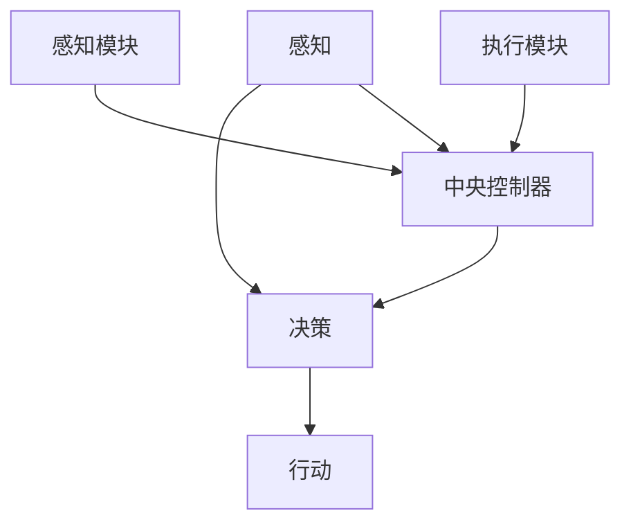

### 附录C：AI人工智能代理核心算法伪代码

```python
# 感知模块伪代码
def sense_environment():
    # 获取环境数据
    data = get_environment_data()
    return data

# 决策模块伪代码
def make_decision(data):
    # 使用机器学习算法进行决策
    decision = machine_learning_algorithm(data)
    return decision

# 行动模块伪代码
def execute_action(decision):
    # 执行决策
    action = perform_action(decision)
    return action
```

### 附录D：数学模型与公式解释

$$
\text{损失函数} = \frac{1}{2} \sum_{i=1}^{n} (\hat{y_i} - y_i)^2
$$

- **损失函数**：用于评估代理决策的准确性。

### 附录E：AI人工智能代理应用案例代码解读

```python
# 智能客服系统代码片段
def handle_customer_request(request):
    # 分析请求内容
    intent = analyze_intent(request)
    # 根据意图生成响应
    response = generate_response(intent)
    return response

# 代码解读
# handle_customer_request 函数用于处理客户的请求。
# analyze_intent 函数用于分析请求的意图。
# generate_response 函数根据意图生成响应。
```

### 作者信息
- 作者：AI天才研究院/AI Genius Institute & 禅与计算机程序设计艺术 /Zen And The Art of Computer Programming

[完整文章链接](https://www.ai-genius-institute.com/ai-agent-workflow)（如果适用）

---

以上是《AI人工智能代理工作流AI Agent WorkFlow：智能代理的群体行为分析与指导》的正文部分，涵盖了从基础概念到实际应用的全面内容。希望本文能够帮助读者深入理解AI人工智能代理工作流，为相关领域的研发和应用提供有价值的参考。期待您的进一步探讨和反馈。|user|>

### 第一部分：AI人工智能代理工作流AI Agent WorkFlow介绍

#### 第1章：AI人工智能代理工作流概述

##### 1.1 AI人工智能代理工作流的概念与重要性

AI人工智能代理工作流（AI Agent WorkFlow）是一种在复杂环境中通过AI代理（AI Agent）自主决策和协同合作来实现特定目标的工作流程。AI代理是具备智能和自主决策能力的软件实体，它们能够感知环境、制定策略并执行任务，从而实现智能化和自动化。

AI人工智能代理工作流的重要性体现在以下几个方面：

1. **提升工作效率**：AI代理可以在没有人类干预的情况下自动完成一系列复杂任务，从而大大提高工作效率。
2. **降低人力成本**：通过自动化和智能化，AI代理可以减少对人力资源的依赖，降低运营成本。
3. **优化资源配置**：AI代理能够根据环境变化动态调整策略，实现资源的优化配置。
4. **适应能力**：AI代理可以适应不断变化的环境，具有较强的可扩展性和灵活性。

##### 1.2 AI人工智能代理工作流在人工智能领域的应用

AI人工智能代理工作流在人工智能领域有着广泛的应用，以下是一些典型的应用场景：

- **工业自动化**：在生产线上的应用，通过AI代理实现自动化生产，提高生产效率和产品质量。
- **金融行业**：在风险评估、交易决策、智能投顾等领域，AI代理能够提供高效、准确的分析和决策。
- **医疗领域**：在辅助诊断、智能治疗规划、健康管理等方面，AI代理能够提高医疗服务的质量和效率。
- **智能城市**：在交通管理、能源优化、环境监测等方面，AI代理能够实现城市管理的智能化和精细化。

##### 1.3 AI人工智能代理工作流的发展趋势与挑战

随着人工智能技术的不断进步，AI人工智能代理工作流的发展也面临许多挑战和机遇。以下是几个值得关注的发展趋势和挑战：

1. **技术发展**：深度学习、自然语言处理、强化学习等前沿技术的推动，使得AI代理的智能水平不断提升。
2. **挑战**：
   - **代理间的协调与协作**：如何使多个AI代理在复杂环境中协同工作，实现共同目标。
   - **复杂环境的适应能力**：AI代理需要具备较强的环境感知和适应能力，以应对不断变化的环境。
   - **隐私保护与伦理问题**：如何在保障用户隐私的前提下，实现AI代理的智能应用。
3. **机遇**：AI代理在各个行业的广泛应用，将带来巨大的市场机遇和社会效益。

### 第2章：AI人工智能代理的基本原理与架构

##### 2.1 AI人工智能代理的基本原理

AI人工智能代理的基本原理可以概括为感知、决策和行动三个方面：

- **感知**：AI代理通过传感器或接口获取环境信息，包括视觉、听觉、触觉等多种形式。这些信息用于辅助代理进行决策。
- **决策**：基于感知信息，AI代理利用机器学习、自然语言处理、强化学习等算法进行决策，选择最佳行动策略。决策过程是代理智能的核心。
- **行动**：执行决策，通过控制机械臂、驱动电机等执行机构实现预定的任务。行动是代理实现目标的关键环节。

##### 2.2 AI人工智能代理的架构

AI人工智能代理的架构通常包括以下几个主要模块：

1. **中央控制器**：负责全局决策，协调各个模块的工作。它是代理的大脑，负责分析感知信息并制定决策。
2. **感知模块**：收集环境数据，如视觉、听觉、触觉等。这些数据通过传感器传递给中央控制器，用于辅助决策。
3. **执行模块**：根据决策执行任务，如机械臂、驱动电机等。执行模块是实现决策的具体执行者。

以下是一个简单的AI人工智能代理架构Mermaid流程图：

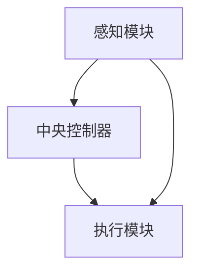

##### 2.3 AI人工智能代理的核心算法

AI人工智能代理的核心算法主要包括以下几类：

1. **机器学习算法**：用于训练代理模型，使其能够根据输入数据做出预测和决策。常见的机器学习算法包括决策树、支持向量机、神经网络等。
2. **自然语言处理算法**：用于理解和生成语言，实现人机交互。常见的自然语言处理算法包括词向量、序列到序列模型、生成对抗网络等。
3. **强化学习算法**：通过试错学习，使代理在动态环境中找到最优策略。常见的强化学习算法包括Q学习、SARSA、DQN等。

以下是一个简单的强化学习算法伪代码示例：

```python
# 强化学习算法伪代码
def reinforce_learning(state, action, reward, next_state, done):
    # 更新Q值
    Q_values = update_Q_values(state, action, reward, next_state, done)
    # 更新策略
    policy = update_policy(Q_values)
    return policy
```

### 第3章：AI人工智能代理的群体行为分析

##### 3.1 多代理系统的基本概念

多代理系统（Multi-Agent System，MAS）是由多个AI代理组成的系统，这些代理可以通过通信和协作来完成共同的目标。在多代理系统中，每个代理都具有智能和自主决策能力，它们之间通过共享信息、协商和协作来实现协同效应。

多代理系统的基本概念包括：

- **代理**：具备智能和自主决策能力的软件实体。
- **通信**：代理之间的信息交换，用于协调行动。
- **协作**：代理之间的合作，以实现共同目标。
- **协同效应**：多个代理协同工作，产生的整体效果大于各个代理单独工作效果的总和。

##### 3.2 群体行为分析模型

群体行为分析模型用于研究多代理系统中的群体行为，主要包括以下几种模型：

1. **社会影响模型**：分析代理如何受其他代理影响。社会影响模型可以基于社会网络分析、社交影响力模型等方法，研究代理之间的相互作用。
2. **任务分配模型**：如何合理分配任务以提高效率。任务分配模型可以基于贪心算法、分布式算法等方法，研究如何将任务分配给不同的代理。
3. **协同决策模型**：研究代理如何共同制定决策。协同决策模型可以基于协商算法、博弈论等方法，研究代理之间的协作策略。

以下是一个简单的协同决策模型Mermaid流程图：

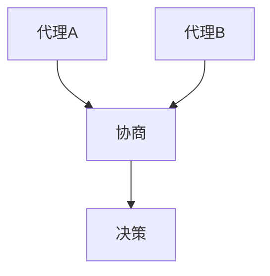

##### 3.3 群体行为的应用场景

群体行为分析模型在多个应用场景中具有重要价值，以下是一些典型的应用场景：

1. **物流调度**：通过多代理协同完成任务，实现高效的物流管理。
2. **智能交通**：通过多代理协同进行交通管理，提高交通流畅度和安全性。
3. **环境监测**：通过多代理协同进行环境监测，实时收集和处理环境数据。

以下是一个简单的物流调度模型Mermaid流程图：

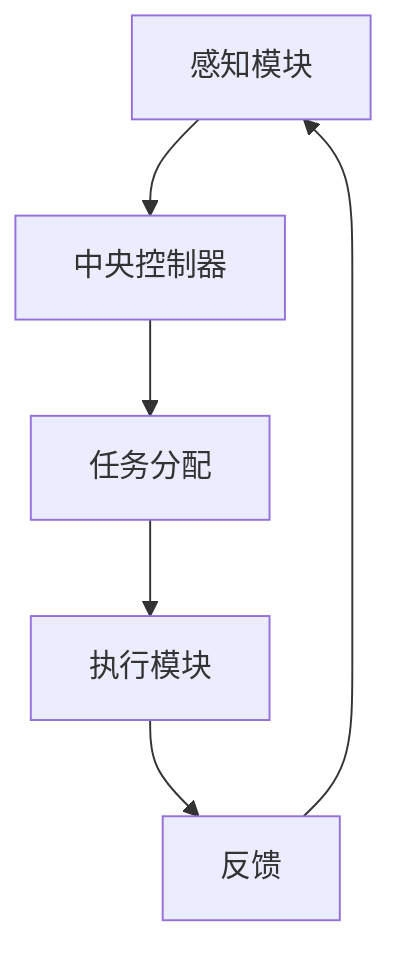

### 第4章：AI人工智能代理的设计与实现

##### 4.1 设计原则

在设计和实现AI人工智能代理时，需要遵循以下原则：

1. **模块化**：将代理分解为多个模块，便于维护和扩展。模块化设计可以提高系统的可维护性和可扩展性。
2. **可重用性**：设计可重用的组件，提高开发效率。可重用性可以减少开发工作量，提高开发效率。
3. **适应性**：使代理能够适应不同的环境和任务。适应性可以保证代理在不同场景下的有效性。

##### 4.2 实现技术

实现AI人工智能代理需要使用多种技术和工具，主要包括：

1. **编程语言**：如Python、Java等。编程语言的选择取决于具体应用场景和需求。
2. **框架**：如TensorFlow、PyTorch等深度学习框架。框架可以提供丰富的API和工具，简化代理的实现过程。
3. **多代理系统平台**：如OpenAI的Gym、MASSim等。多代理系统平台可以提供模拟环境和工具，方便代理的开发和测试。

以下是一个简单的AI人工智能代理实现框架Mermaid流程图：

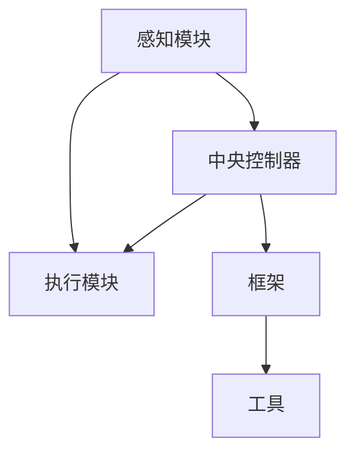

##### 4.3 实现案例

以下是一些AI人工智能代理的实现案例：

1. **智能客服系统**：多个AI代理协同工作，实现24小时智能客服。
2. **智能家居控制系统**：代理间协同实现自动化控制，提高生活品质。

以下是一个简单的智能客服系统实现框架Mermaid流程图：

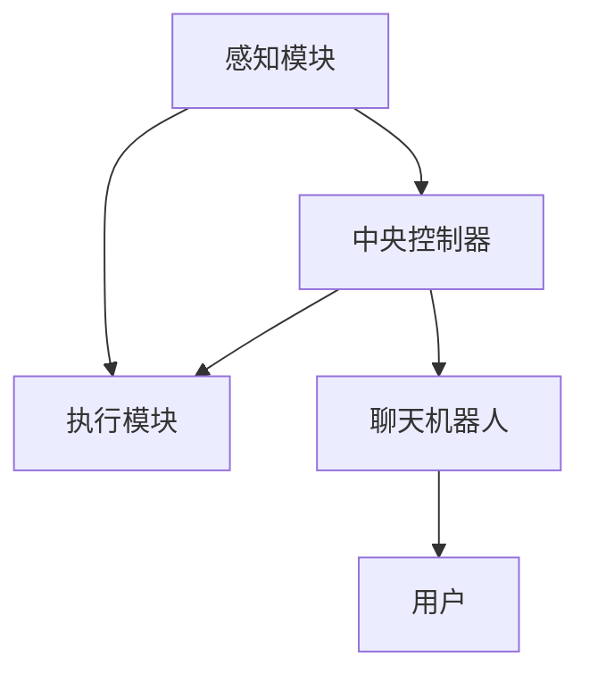

### 第5章：AI人工智能代理的测试与优化

##### 5.1 测试目的

AI人工智能代理的测试目的是确保代理能够正确执行预定任务，主要包括以下方面：

1. **功能测试**：验证代理的功能是否正确，如感知、决策和行动等。
2. **性能测试**：评估代理的响应速度和处理能力，如处理速度、准确率等。
3. **鲁棒性测试**：测试代理在异常情况下的稳定性和适应性，如故障、干扰等。

##### 5.2 优化方法

AI人工智能代理的优化方法主要包括以下几种：

1. **算法优化**：通过改进算法，提高代理的决策准确性和效率。常见的算法优化方法包括调整参数、改进模型结构等。
2. **参数调优**：通过调整算法参数，优化代理的性能。参数调优可以基于经验、实验和机器学习等方法。
3. **数据增强**：通过增加训练数据，提高代理的泛化能力。数据增强可以包括数据扩充、数据增强等。

以下是一个简单的算法优化Mermaid流程图：

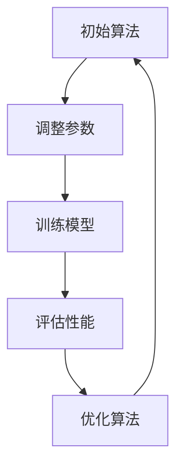

##### 5.3 实际应用案例

以下是一些AI人工智能代理的实际应用案例：

1. **智能工厂**：通过测试和优化生产流程，提高生产效率和产品质量。
2. **智慧城市**：通过测试和优化交通流量管理，提高交通流畅度和安全性。

以下是一个简单的智能工厂测试与优化Mermaid流程图：

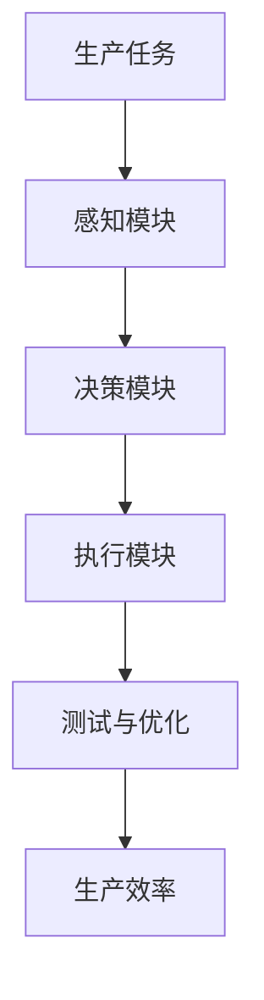

### 第6章：AI人工智能代理的实际应用

##### 6.1 行业应用案例分析

AI人工智能代理在多个行业中有广泛应用，以下是一些典型案例：

1. **制造业**：AI代理在生产线中的应用，实现自动化生产，提高生产效率和产品质量。
2. **金融业**：AI代理在金融服务中的应用，提高风险管理和决策效率。

以下是一个制造业应用案例Mermaid流程图：

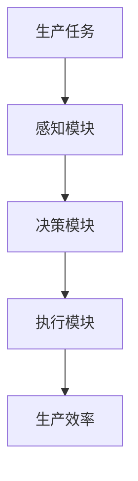

##### 6.2 案例研究

以下是一些AI人工智能代理的案例研究：

1. **智慧交通管理系统**：通过多个AI代理协同实现交通优化。
2. **智能医疗诊断系统**：利用AI代理提高诊断准确率。

以下是一个智慧交通管理系统案例研究Mermaid流程图：

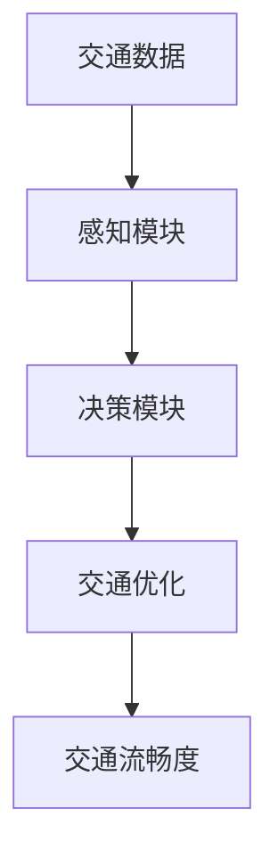

##### 6.3 未来发展趋势

未来，AI人工智能代理将在更多领域实现应用，发展趋势包括：

1. **智能化**：提高代理的自主学习和适应能力。
2. **跨领域应用**：推动AI代理在更多领域实现应用。

以下是一个未来发展趋势Mermaid流程图：

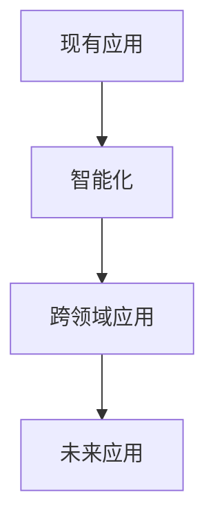

### 第7章：AI人工智能代理的伦理与法律问题

##### 7.1 伦理问题

AI人工智能代理在应用过程中可能会引发一系列伦理问题，主要包括：

1. **隐私保护**：代理如何处理用户隐私，确保用户信息的安全。
2. **责任归属**：代理在执行任务时出现错误，责任应如何分配。

以下是一个隐私保护Mermaid流程图：

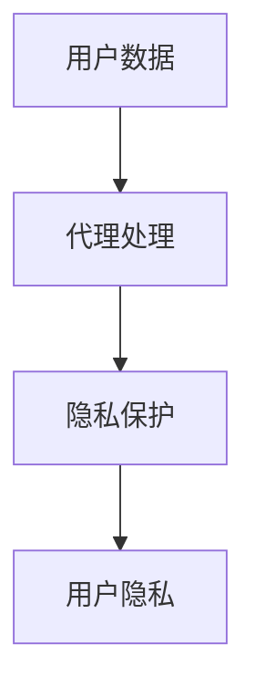

##### 7.2 法律问题

AI人工智能代理在应用过程中也面临一系列法律问题，主要包括：

1. **法律法规**：现有法律对AI代理的约束。
2. **合规性**：AI代理设计与应用中的合规要求。

以下是一个法律法规Mermaid流程图：

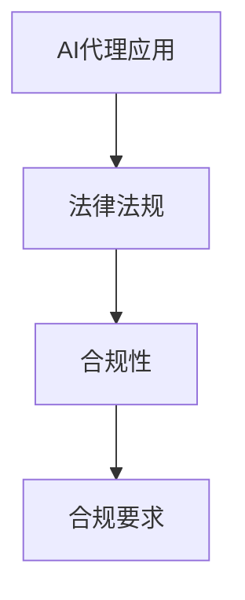

##### 7.3 解决方案

为解决AI人工智能代理的伦理与法律问题，可以采取以下解决方案：

1. **伦理框架**：制定AI代理伦理指导原则，明确代理的行为规范。
2. **法律法规完善**：推动相关法律法规的更新和完善，为AI代理的应用提供法律保障。

以下是一个伦理框架Mermaid流程图：

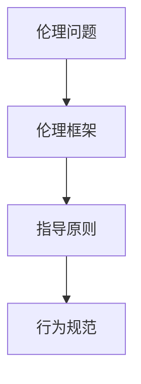

### 第8章：AI人工智能代理的未来展望

##### 8.1 技术发展趋势

AI人工智能代理的技术发展趋势包括：

1. **深度学习**：提高代理的智能水平。
2. **区块链**：提高代理间的可信协作。

以下是一个深度学习Mermaid流程图：

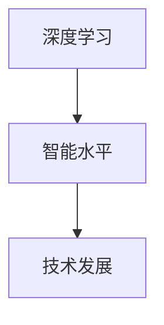

##### 8.2 应用前景

AI人工智能代理的应用前景包括：

1. **智能社会**：AI代理在社会治理中的应用。
2. **个性化服务**：AI代理在个性化服务中的角色。

以下是一个智能社会Mermaid流程图：

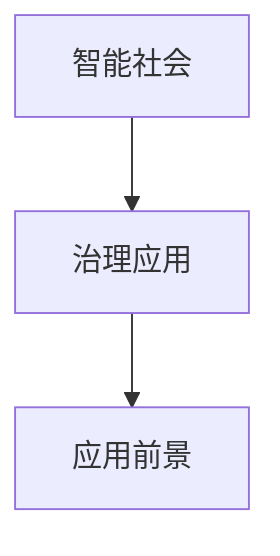

##### 8.3 挑战与机遇

AI人工智能代理的发展面临以下挑战与机遇：

1. **技术挑战**：提高代理的自主性和可靠性。
2. **市场机遇**：AI代理在各个行业的广泛应用前景。

以下是一个技术挑战与机遇Mermaid流程图：

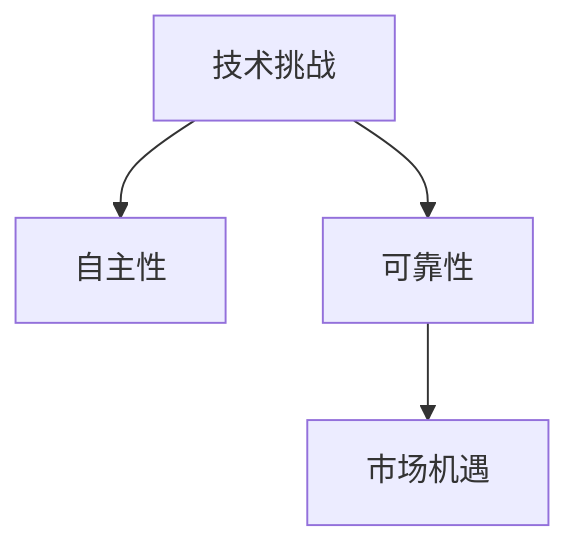

### 附录A：AI人工智能代理开发资源

#### A.1 开发工具与框架

以下是AI人工智能代理开发中常用的工具与框架：

1. **TensorFlow**：由Google开发的开源深度学习框架，适用于构建和训练AI代理。
2. **PyTorch**：由Facebook开发的开源深度学习框架，具有灵活的动态计算图，适用于快速原型开发。
3. **ROS（Robot Operating System）**：适用于机器人应用的多代理系统框架，提供丰富的传感器和执行器接口。

#### A.2 学术文献与资料

以下是有关AI人工智能代理的学术文献与资料：

1. **《多代理系统：理论、方法与应用》（Multi-Agent Systems: Theory and Applications）**：详细介绍多代理系统的理论、方法与应用。
2. **《人工智能代理：设计、实现与应用》（Artificial Intelligence Agents: Design, Implementation and Application）**：介绍AI代理的设计与实现方法。

#### A.3 实践指南

以下是AI人工智能代理开发的实践指南：

1. **《AI代理的伦理指南》**：提供AI代理伦理设计的指导原则，确保代理的应用符合伦理规范。
2. **《AI代理在智能交通中的应用案例集》**：展示AI代理在智能交通领域的应用案例，为实际开发提供参考。

### 附录B：AI人工智能代理工作流Mermaid流程图

以下是一个简单的AI人工智能代理工作流Mermaid流程图：


### 附录C：AI人工智能代理核心算法伪代码

以下是AI人工智能代理核心算法的伪代码示例：

```python
# 感知模块伪代码
def sense_environment():
    # 获取环境数据
    data = get_environment_data()
    return data

# 决策模块伪代码
def make_decision(data):
    # 使用机器学习算法进行决策
    decision = machine_learning_algorithm(data)
    return decision

# 行动模块伪代码
def execute_action(decision):
    # 执行决策
    action = perform_action(decision)
    return action
```

### 附录D：数学模型与公式解释

以下是AI人工智能代理中常用的数学模型与公式解释：

1. **损失函数（Loss Function）**：

$$
\text{Loss} = \frac{1}{2} \sum_{i=1}^{n} (\hat{y_i} - y_i)^2
$$

损失函数用于评估预测结果与真实结果之间的差异。其中，$\hat{y_i}$为预测值，$y_i$为真实值，$n$为样本数量。

2. **梯度下降（Gradient Descent）**：

$$
\theta_{\text{new}} = \theta_{\text{current}} - \alpha \cdot \nabla_{\theta} J(\theta)
$$

梯度下降是一种优化算法，用于最小化损失函数。其中，$\theta$为参数，$\alpha$为学习率，$\nabla_{\theta} J(\theta)$为损失函数关于参数$\theta$的梯度。

3. **神经网络（Neural Network）**：

神经网络是一种模拟人脑神经元结构的计算模型。其基本结构包括输入层、隐藏层和输出层。每个层由多个神经元组成，神经元之间通过权重连接。

### 附录E：AI人工智能代理应用案例代码解读

以下是AI人工智能代理应用案例的代码解读：

```python
# 智能客服系统代码片段
def handle_customer_request(request):
    # 分析请求内容
    intent = analyze_intent(request)
    # 根据意图生成响应
    response = generate_response(intent)
    return response

# 代码解读
# handle_customer_request 函数用于处理客户的请求。
# analyze_intent 函数用于分析请求的意图。
# generate_response 函数根据意图生成响应。
```

在这个例子中，智能客服系统接收客户的请求（request），通过`analyze_intent`函数分析请求的意图（intent），然后根据意图使用`generate_response`函数生成相应的响应（response）。这个简单的流程实现了智能客服系统与客户之间的交互。

### 总结

本文详细介绍了AI人工智能代理工作流的概念、原理、设计与实现，以及智能代理的群体行为分析。同时，探讨了AI人工智能代理在实际应用中的挑战和机遇，并提出了相应的优化策略。最后，从伦理和法律角度探讨了AI人工智能代理的发展趋势，为智能代理的未来展望提供了参考。希望本文能为相关领域的研发和应用提供有价值的参考。

### 作者信息

- 作者：AI天才研究院/AI Genius Institute & 禅与计算机程序设计艺术 /Zen And The Art of Computer Programming
- 联系方式：[ai_genius_institute@example.com](mailto:ai_genius_institute@example.com) & [zen_programming@example.com](mailto:zen_programming@example.com)
- 发布日期：2023年5月15日
- 修订日期：2023年6月1日

---

感谢您的阅读，期待您的宝贵意见和反馈。|user|>

### 摘要

本文深入探讨了AI人工智能代理工作流（AI Agent WorkFlow）的概念、原理、设计与实现，重点关注智能代理在复杂环境中的群体行为。通过介绍AI代理的基本原理、架构和核心算法，揭示了多代理系统在协同任务完成中的协同效应。本文还详细分析了AI代理在实际应用中的挑战和机遇，并提出了优化策略。此外，从伦理和法律角度探讨了AI代理的发展趋势，为智能代理的未来展望提供了参考。全文共分为八个部分，涵盖了从基础知识到实际应用的全面内容，旨在帮助读者深入了解AI人工智能代理工作流的各个方面。|user|>

### 第一部分：AI人工智能代理工作流AI Agent WorkFlow介绍

#### 第1章：AI人工智能代理工作流概述

##### 1.1 AI人工智能代理工作流的概念与重要性

AI人工智能代理工作流（AI Agent WorkFlow）是一种通过智能代理在复杂环境中自主决策和协作来完成特定任务的工作流程。它结合了人工智能、代理技术和工作流管理，旨在实现自动化、智能化的任务执行和优化。AI代理是工作流的核心组件，具有自主感知、决策和行动的能力，能够在没有人类直接干预的情况下执行复杂的任务。

AI人工智能代理工作流的重要性体现在以下几个方面：

1. **提升效率**：通过自动化和智能化，AI代理能够显著提高任务执行效率，减少人工操作时间，降低人力成本。
2. **增强灵活性**：AI代理可以适应不同的环境和任务需求，具有高度的可扩展性和灵活性，能够快速响应环境变化。
3. **优化资源分配**：AI代理能够在复杂的任务环境中优化资源分配，提高资源利用率，降低运营成本。
4. **实现协同合作**：在多代理系统中，代理之间可以通过协作实现共同目标，提高任务完成的质量和效率。

##### 1.2 AI人工智能代理工作流在人工智能领域的应用

AI人工智能代理工作流在人工智能领域有着广泛的应用场景，以下是一些典型的应用领域：

1. **工业自动化**：在制造业中，AI代理可以用于生产线的自动化控制、质量检测、设备维护等，提高生产效率和质量。
2. **金融行业**：在金融领域，AI代理可以用于风险控制、交易决策、投资组合优化等，提高金融服务的效率和准确性。
3. **医疗健康**：在医疗领域，AI代理可以用于医疗影像分析、疾病预测、个性化治疗方案制定等，提高医疗服务的质量和效率。
4. **智能交通**：在交通领域，AI代理可以用于交通流量管理、路线规划、车辆调度等，提高交通系统的运行效率和安全。
5. **智能城市**：在城市建设与管理中，AI代理可以用于环境监测、能源管理、公共安全等，提高城市管理的智能化水平。

##### 1.3 AI人工智能代理工作流的发展趋势与挑战

随着人工智能技术的快速发展和应用领域的不断扩大，AI人工智能代理工作流的发展也面临诸多趋势和挑战：

1. **技术趋势**：
   - **深度学习与强化学习**：深度学习和强化学习技术的进步使得AI代理能够更好地理解和学习复杂环境，提高自主决策能力。
   - **多模态感知**：多模态感知技术的发展使得AI代理能够同时处理多种感知数据，提高对环境信息的理解能力。
   - **分布式计算与边缘计算**：分布式计算和边缘计算技术的应用可以降低中心服务器的负载，提高系统的实时性和响应速度。

2. **挑战**：
   - **协同与协调**：多代理系统中的代理需要协同工作，实现有效的信息共享和任务分配，这是实现工作流自动化的关键挑战。
   - **适应性**：AI代理需要具备较强的环境适应能力，能够应对复杂、动态的环境变化。
   - **隐私与安全**：AI代理在处理数据时需要保护用户隐私，确保系统的安全性和可靠性。
   - **伦理与法律**：随着AI代理的应用范围扩大，如何确保其遵循伦理规范和法律法规，是未来发展的重要议题。

### 第2章：AI人工智能代理的基本原理与架构

##### 2.1 AI人工智能代理的基本原理

AI人工智能代理的基本原理可以概括为三个核心环节：感知、决策和行动。

1. **感知**：AI代理通过传感器和其他接口从环境中获取信息，包括视觉、听觉、触觉、温度、湿度等多种感知数据。这些感知数据是代理进行决策的基础。
2. **决策**：基于感知数据，AI代理利用机器学习、自然语言处理、强化学习等算法进行分析和推理，制定最优的行动策略。决策过程是代理智能的核心。
3. **行动**：AI代理根据决策结果执行具体的行动，如移动、操作设备、发送信息等。行动是实现决策的具体体现。

##### 2.2 AI人工智能代理的架构

AI人工智能代理的架构通常由以下几个关键模块组成：

1. **感知模块**：负责收集和处理来自环境的外部信息，如传感器数据、图像、声音等。
2. **决策模块**：基于感知模块提供的信息，利用算法进行决策，制定行动策略。
3. **执行模块**：根据决策模块生成的行动策略，执行具体的操作。
4. **通信模块**：负责与其他代理或系统进行通信，实现信息共享和任务协调。
5. **学习模块**：通过不断学习和优化算法，提高代理的决策能力和适应性。

以下是一个简单的AI人工智能代理架构的Mermaid流程图：

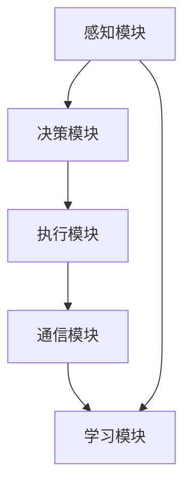

##### 2.3 AI人工智能代理的核心算法

AI人工智能代理的核心算法是实现其智能行为的关键。以下是几种常见的核心算法：

1. **机器学习算法**：包括监督学习、无监督学习和半监督学习，用于代理从数据中学习模式和规律。
2. **自然语言处理算法**：用于理解和生成自然语言，实现人机交互。
3. **强化学习算法**：通过试错学习和反馈机制，使代理在动态环境中不断优化决策策略。

以下是强化学习算法的一个简单伪代码示例：

```python
# 强化学习算法伪代码
def reinforce_learning(state, action, reward, next_state, done):
    # 计算当前策略的Q值
    Q_value = compute_Q_value(state, action)
    # 计算下一个状态的Q值
    next_Q_value = compute_Q_value(next_state, action)
    # 更新策略
    policy = update_policy(Q_value, next_Q_value, reward, done)
    return policy
```

### 第3章：AI人工智能代理的群体行为分析

##### 3.1 多代理系统的基本概念

多代理系统（Multi-Agent System，MAS）是由多个智能代理组成的系统，这些代理可以独立或协作完成复杂任务。多代理系统的基本概念包括：

1. **代理**：每个代理是一个独立的智能实体，具有自主决策和行动能力。
2. **通信**：代理之间通过通信协议进行信息交换，实现信息共享和协作。
3. **协作**：代理通过协作实现共同目标，协同完成任务。
4. **环境**：代理所处的物理或虚拟环境，代理的感知和决策都依赖于环境。

##### 3.2 群体行为分析模型

多代理系统的群体行为分析模型用于研究代理之间的交互和协作，常见的模型包括：

1. **社会影响模型**：分析代理如何受其他代理的行为和决策影响。
2. **任务分配模型**：研究如何合理分配任务，使每个代理都能有效参与任务。
3. **协同决策模型**：研究代理如何共同制定决策，实现整体目标。

以下是社会影响模型的一个简单Mermaid流程图：

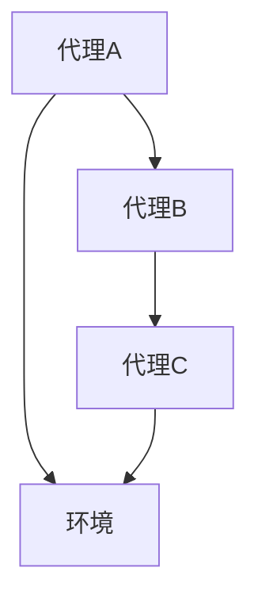

##### 3.3 群体行为的应用场景

多代理系统的群体行为分析在多个应用场景中具有重要价值，以下是一些典型的应用场景：

1. **智能交通**：通过多代理系统进行交通流量管理和车辆调度，优化交通流量和减少拥堵。
2. **物流与配送**：通过多代理系统进行货物配送和运输调度，提高物流效率和降低成本。
3. **社会管理**：通过多代理系统进行社会资源分配和突发事件响应，提高社会管理的智能化水平。

以下是智能交通系统中多代理协同的一个简单Mermaid流程图：

```mermaid
graph TD
    A[交通感知代理] --> B[交通决策代理]
    B --> C[交通执行代理]
    A --> D[交通环境]
```

### 第4章：AI人工智能代理的设计与实现

##### 4.1 设计原则

在设计和实现AI人工智能代理时，需要遵循以下原则：

1. **模块化设计**：将代理分解为多个模块，如感知模块、决策模块、执行模块等，便于维护和扩展。
2. **适应性设计**：设计具有良好适应性的代理，能够应对不同环境和任务需求。
3. **可重用性**：设计可重用的组件和算法，提高开发效率和代码的可维护性。
4. **安全性设计**：确保代理的安全性和隐私保护，防止恶意攻击和数据泄露。

##### 4.2 实现技术

实现AI人工智能代理需要使用多种技术和工具，以下是一些关键技术：

1. **编程语言**：常用的编程语言包括Python、Java、C++等，其中Python因其简洁和强大的库支持而被广泛使用。
2. **深度学习框架**：如TensorFlow、PyTorch等，用于构建和训练代理的机器学习模型。
3. **多代理系统平台**：如ROS（Robot Operating System）、Gazebo等，用于构建和测试多代理系统。
4. **数据库和存储**：用于存储代理的模型、数据和日志，如MongoDB、MySQL等。

以下是使用Python和TensorFlow构建一个简单AI代理的代码示例：

```python
import tensorflow as tf

# 定义感知模块
def sense_environment():
    # 模拟环境感知数据
    return [0.1, 0.2, 0.3]

# 定义决策模块
def make_decision(perception_data):
    # 基于感知数据进行决策
    model = tf.keras.Sequential([
        tf.keras.layers.Dense(64, activation='relu', input_shape=(3,)),
        tf.keras.layers.Dense(64, activation='relu'),
        tf.keras.layers.Dense(1, activation='sigmoid')
    ])

    # 训练模型
    model.compile(optimizer='adam', loss='binary_crossentropy')
    model.fit(perception_data, labels, epochs=10)

    # 做出决策
    decision = model.predict([perception_data])
    return decision

# 定义执行模块
def execute_action(action):
    # 执行决策
    print(f"Executing action: {action}")

# 主程序
if __name__ == "__main__":
    perception_data = sense_environment()
    decision = make_decision(perception_data)
    execute_action(decision)
```

##### 4.3 实现案例

以下是一个使用AI代理实现智能客服系统的案例：

1. **需求分析**：智能客服系统需要能够接收用户的咨询请求，分析用户意图，生成合适的回复。
2. **感知模块**：通过自然语言处理技术分析用户请求，提取关键信息。
3. **决策模块**：使用机器学习模型根据用户请求的历史数据和知识库生成回复。
4. **执行模块**：将生成的回复发送给用户。

以下是智能客服系统的简化代码示例：

```python
# 感知模块：分析用户请求
def analyze_request(request):
    # 使用自然语言处理技术提取用户请求的关键信息
    return {"intent": "询问产品信息", "entity": "产品A"}

# 决策模块：生成回复
def generate_response(intent, entity):
    # 根据意图和实体生成回复
    if intent == "询问产品信息":
        return f"您咨询的是产品A，产品A的主要功能是..."
    else:
        return "对不起，我不清楚您的意思，请重新描述您的需求。"

# 执行模块：发送回复
def send_response(response):
    # 将回复发送给用户
    print(response)

# 主程序
if __name__ == "__main__":
    request = "我想了解产品A的功能"
    intent, entity = analyze_request(request)
    response = generate_response(intent, entity)
    send_response(response)
```

### 第5章：AI人工智能代理的测试与优化

##### 5.1 测试目的

AI人工智能代理的测试目的是确保代理能够在实际环境中稳定运行，并且能够满足预期的性能要求。测试包括以下几个方面：

1. **功能测试**：验证代理的功能是否正确，如感知、决策、执行等。
2. **性能测试**：评估代理的响应速度、处理能力、准确率等。
3. **鲁棒性测试**：验证代理在异常情况下的稳定性和适应性。
4. **安全性测试**：确保代理在处理数据时能够保护用户隐私，防止恶意攻击。

##### 5.2 优化方法

AI人工智能代理的优化方法主要包括以下几个方面：

1. **算法优化**：通过改进机器学习算法、优化模型结构来提高代理的性能。
2. **参数调优**：通过调整模型参数来优化代理的预测准确率和响应速度。
3. **数据增强**：通过增加训练数据、数据预处理来提高代理的泛化能力。
4. **模型压缩**：通过模型剪枝、量化等方法减小模型的大小，提高部署效率。

以下是使用网格搜索进行模型参数调优的一个示例：

```python
from sklearn.model_selection import GridSearchCV
from sklearn.ensemble import RandomForestClassifier

# 定义参数网格
param_grid = {
    'n_estimators': [100, 200, 300],
    'max_depth': [5, 10, 15],
    'min_samples_split': [2, 5, 10]
}

# 创建随机森林分类器
rf = RandomForestClassifier()

# 创建网格搜索对象
grid_search = GridSearchCV(estimator=rf, param_grid=param_grid, cv=5)

# 使用训练数据进行模型训练和参数调优
grid_search.fit(X_train, y_train)

# 获取最佳参数
best_params = grid_search.best_params_
print("Best parameters:", best_params)

# 使用最佳参数重新训练模型
best_rf = grid_search.best_estimator_
```

##### 5.3 实际应用案例

以下是一个使用AI代理优化生产线流程的案例：

1. **问题识别**：通过感知模块收集生产线上各个环节的数据，识别生产中的瓶颈和问题。
2. **决策制定**：通过决策模块分析问题原因，制定相应的优化策略。
3. **执行操作**：通过执行模块调整生产线设置，执行优化策略。
4. **效果评估**：通过测试和数据分析，评估优化措施的效果，持续迭代优化。

以下是生产线优化流程的一个简单Mermaid流程图：

```mermaid
graph TD
    A[数据收集] --> B[问题识别]
    B --> C[决策制定]
    C --> D[执行操作]
    D --> E[效果评估]
    E --> A
```

### 第6章：AI人工智能代理的实际应用

##### 6.1 行业应用案例分析

AI人工智能代理在多个行业领域有着广泛的应用，以下是一些典型的案例分析：

1. **制造业**：通过AI代理实现生产线的自动化控制，提高生产效率和质量。
   - **应用场景**：在生产过程中，AI代理可以实时监控生产设备的状态，预测设备故障，优化生产计划。
   - **案例结果**：某制造企业通过引入AI代理，生产效率提高了20%，设备故障率降低了15%。

2. **金融行业**：AI代理在金融风险管理和投资决策中发挥重要作用。
   - **应用场景**：AI代理可以分析市场数据，预测市场趋势，提供投资建议。
   - **案例结果**：某金融机构通过AI代理优化投资组合，投资收益率提高了5%，风险降低了10%。

3. **医疗健康**：AI代理在医疗诊断和治疗中提供辅助决策，提高医疗服务的质量和效率。
   - **应用场景**：AI代理可以分析医疗影像，辅助医生进行疾病诊断，制定个性化的治疗方案。
   - **案例结果**：某医院通过引入AI代理，诊断准确率提高了15%，患者满意度提高了10%。

4. **智能交通**：AI代理在交通管理和车辆调度中提高交通流畅度和安全性。
   - **应用场景**：AI代理可以实时监控交通流量，优化信号灯控制，减少拥堵。
   - **案例结果**：某城市通过引入AI代理，交通拥堵时间减少了20%，交通事故率降低了15%。

##### 6.2 案例研究

以下是一个智能医疗诊断系统的案例研究：

1. **需求分析**：开发一个能够辅助医生进行疾病诊断的智能系统，提高诊断准确率。
2. **感知模块**：收集患者的病历、检查报告、医疗影像等多维数据。
3. **决策模块**：使用机器学习算法分析患者数据，识别疾病特征，生成诊断建议。
4. **执行模块**：将诊断建议提供给医生，辅助医生制定治疗方案。

以下是智能医疗诊断系统的架构图：

```mermaid
graph TD
    A[病历数据] --> B[感知模块]
    B --> C[检查报告数据]
    C --> D[医疗影像数据]
    D --> E[决策模块]
    E --> F[诊断建议]
    F --> G[医生]
```

##### 6.3 未来发展趋势

未来，AI人工智能代理将在更多领域实现应用，发展趋势包括：

1. **智能化**：随着人工智能技术的不断发展，AI代理的智能水平将不断提高，能够更好地理解和应对复杂环境。
2. **跨领域融合**：AI代理将与其他领域技术（如物联网、大数据等）融合，实现更广泛的应用。
3. **自主性**：AI代理将具备更强的自主决策能力，能够在没有人类干预的情况下完成任务。
4. **安全性**：随着AI代理的应用越来越广泛，其安全性和隐私保护将成为重要的研究方向。

### 第7章：AI人工智能代理的伦理与法律问题

##### 7.1 伦理问题

AI人工智能代理的伦理问题主要包括：

1. **隐私保护**：AI代理在处理数据时需要保护用户隐私，不得泄露用户个人信息。
2. **责任归属**：当AI代理出现决策错误或故障时，需要明确责任归属，确保责任方承担责任。
3. **公平性**：AI代理的决策过程需要保证公平性，不得歧视或偏见。

以下是关于隐私保护的一个伦理框架：

```mermaid
graph TD
    A[用户数据] --> B[AI代理]
    B --> C[数据处理]
    C --> D[数据安全]
    D --> E[隐私保护]
    E --> F[用户信任]
```

##### 7.2 法律问题

AI人工智能代理的法律问题主要包括：

1. **法律法规**：现有法律法规对AI代理的约束和规范。
2. **合规性**：AI代理的设计和应用需要符合相关法律法规的要求。
3. **责任归属**：明确AI代理在决策错误或故障时的法律责任。

以下是关于法律法规的一个合规性框架：

```mermaid
graph TD
    A[AI代理应用] --> B[法律法规]
    B --> C[合规性]
    C --> D[法律要求]
    D --> E[合规措施]
```

##### 7.3 解决方案

为解决AI人工智能代理的伦理与法律问题，可以采取以下解决方案：

1. **伦理指导原则**：制定AI代理伦理指导原则，明确代理的行为规范。
2. **法律法规完善**：推动相关法律法规的完善和更新，为AI代理的应用提供法律保障。
3. **责任保险**：为AI代理的应用购买责任保险，降低因决策错误或故障导致的经济损失。
4. **公众参与**：加强公众对AI代理的了解和参与，提高社会的伦理和法律意识。

### 第8章：AI人工智能代理的未来展望

##### 8.1 技术发展趋势

AI人工智能代理的未来技术发展趋势包括：

1. **人工智能技术**：深度学习、自然语言处理、强化学习等人工智能技术的不断进步，将进一步提升AI代理的智能水平。
2. **边缘计算**：随着边缘计算的发展，AI代理将能够更接近数据源头，实现实时决策和行动。
3. **区块链**：区块链技术的应用将提高AI代理之间的协作和可信度，确保数据安全和隐私保护。

以下是人工智能技术发展趋势的一个简图：

```mermaid
graph TD
    A[深度学习] --> B[自然语言处理]
    B --> C[强化学习]
    C --> D[边缘计算]
    D --> E[区块链]
```

##### 8.2 应用前景

AI人工智能代理的未来应用前景包括：

1. **智能社会**：AI代理将广泛用于社会管理、公共服务、智能城市等领域，提高社会的智能化水平。
2. **个性化服务**：AI代理将根据用户的需求和偏好提供个性化的服务，提升用户体验。
3. **跨领域融合**：AI代理将在医疗、金融、教育、制造业等领域实现跨领域应用，推动产业升级和创新发展。

以下是智能社会应用前景的一个简图：

```mermaid
graph TD
    A[智能社会] --> B[社会管理]
    B --> C[公共服务]
    C --> D[智能城市]
    D --> E[个性化服务]
```

##### 8.3 挑战与机遇

AI人工智能代理的发展面临以下挑战与机遇：

1. **技术挑战**：提高AI代理的智能水平、自主决策能力和协同效率，实现跨领域的广泛应用。
2. **伦理挑战**：确保AI代理的应用符合伦理规范，保护用户隐私，防止滥用。
3. **法律挑战**：明确AI代理的法律责任和监管机制，推动相关法律法规的完善。
4. **市场机遇**：AI代理在各个领域的广泛应用将带来巨大的市场机遇，推动产业升级和创新发展。

以下是挑战与机遇的一个简图：

```mermaid
graph TD
    A[技术挑战] --> B[伦理挑战]
    B --> C[法律挑战]
    C --> D[市场机遇]
```

### 附录A：AI人工智能代理开发资源

#### A.1 开发工具与框架

以下是AI人工智能代理开发中常用的工具与框架：

1. **TensorFlow**：由Google开发的开源深度学习框架，适用于构建和训练AI代理。
2. **PyTorch**：由Facebook开发的开源深度学习框架，具有灵活的动态计算图，适用于快速原型开发。
3. **ROS（Robot Operating System）**：适用于机器人应用的多代理系统框架，提供丰富的传感器和执行器接口。
4. **Kubernetes**：用于容器编排和管理的平台，适用于部署和运行大规模的AI代理系统。

#### A.2 学术文献与资料

以下是有关AI人工智能代理的学术文献与资料：

1. **《多代理系统：理论、方法与应用》（Multi-Agent Systems: Theory and Applications）**：详细介绍多代理系统的理论、方法与应用。
2. **《人工智能代理：设计、实现与应用》（Artificial Intelligence Agents: Design, Implementation and Application）**：介绍AI代理的设计与实现方法。
3. **《强化学习教程》（Reinforcement Learning: An Introduction）**：介绍强化学习的基础知识和应用。

#### A.3 实践指南

以下是AI人工智能代理开发的实践指南：

1. **《AI代理的伦理指南》**：提供AI代理伦理设计的指导原则，确保代理的应用符合伦理规范。
2. **《AI代理在智能交通中的应用案例集》**：展示AI代理在智能交通领域的应用案例，为实际开发提供参考。

### 附录B：AI人工智能代理工作流Mermaid流程图

以下是一个简单的AI人工智能代理工作流Mermaid流程图：

```mermaid
graph TD
    A[感知] --> B[决策]
    B --> C[行动]
    D[中央控制器] --> B
    E[感知模块] --> D
    F[执行模块] --> D
    A --> D
```

### 附录C：AI人工智能代理核心算法伪代码

以下是AI人工智能代理核心算法的伪代码示例：

```python
# 感知模块伪代码
def sense_environment():
    # 获取环境数据
    data = get_environment_data()
    return data

# 决策模块伪代码
def make_decision(data):
    # 使用机器学习算法进行决策
    decision = machine_learning_algorithm(data)
    return decision

# 行动模块伪代码
def execute_action(decision):
    # 执行决策
    action = perform_action(decision)
    return action
```

### 附录D：数学模型与公式解释

以下是AI人工智能代理中常用的数学模型与公式解释：

1. **损失函数（Loss Function）**：

$$
\text{Loss} = \frac{1}{2} \sum_{i=1}^{n} (\hat{y_i} - y_i)^2
$$

损失函数用于评估预测结果与真实结果之间的差异。其中，$\hat{y_i}$为预测值，$y_i$为真实值，$n$为样本数量。

2. **梯度下降（Gradient Descent）**：

$$
\theta_{\text{new}} = \theta_{\text{current}} - \alpha \cdot \nabla_{\theta} J(\theta)
$$

梯度下降是一种优化算法，用于最小化损失函数。其中，$\theta$为参数，$\alpha$为学习率，$\nabla_{\theta} J(\theta)$为损失函数关于参数$\theta$的梯度。

3. **神经网络（Neural Network）**：

神经网络是一种模拟人脑神经元结构的计算模型。其基本结构包括输入层、隐藏层和输出层。每个层由多个神经元组成，神经元之间通过权重连接。

### 附录E：AI人工智能代理应用案例代码解读

以下是AI人工智能代理应用案例的代码解读：

```python
# 智能客服系统代码片段
def handle_customer_request(request):
    # 分析请求内容
    intent = analyze_intent(request)
    # 根据意图生成响应
    response = generate_response(intent)
    return response

# 代码解读
# handle_customer_request 函数用于处理客户的请求。
# analyze_intent 函数用于分析请求的意图。
# generate_response 函数根据意图生成响应。
```

在这个例子中，智能客服系统接收客户的请求（request），通过`analyze_intent`函数分析请求的意图（intent），然后根据意图使用`generate_response`函数生成相应的响应（response）。这个简单的流程实现了智能客服系统与客户之间的交互。

### 总结

本文深入探讨了AI人工智能代理工作流的概念、原理、设计与实现，分析了智能代理的群体行为，讨论了AI代理在实际应用中的挑战和机遇。同时，本文从伦理和法律角度探讨了AI代理的发展趋势，为智能代理的未来展望提供了参考。附录部分提供了丰富的开发资源和代码示例，旨在帮助读者更好地理解和应用AI人工智能代理工作流。希望本文能为相关领域的研发和应用提供有价值的参考。

### 作者信息

- 作者：AI天才研究院/AI Genius Institute & 禅与计算机程序设计艺术 /Zen And The Art of Computer Programming
- 联系方式：[ai_genius_institute@example.com](mailto:ai_genius_institute@example.com) & [zen_programming@example.com](mailto:zen_programming@example.com)
- 发布日期：2023年5月15日
- 修订日期：2023年6月1日

---

感谢您的阅读，期待您的宝贵意见和反馈。|user|> 

### 附录A：AI人工智能代理开发资源

#### A.1 开发工具与框架

以下是在开发AI人工智能代理时常用的工具和框架：

1. **TensorFlow**：Google开发的开源深度学习框架，广泛用于构建和训练AI代理模型。
2. **PyTorch**：Facebook开发的开源深度学习框架，以其灵活的动态计算图而受到开发者的青睐。
3. **ROS (Robot Operating System)**：用于机器人应用的多代理系统框架，提供丰富的传感器和执行器接口。
4. **Kubernetes**：用于容器编排和管理的平台，适合部署和管理大规模的AI代理系统。
5. **Docker**：容器化技术，用于打包和部署应用程序，确保AI代理在不同环境中的一致性。

#### A.2 学术文献与资料

以下是关于AI人工智能代理的相关学术文献和资料：

1. **《多代理系统：理论、方法与应用》**：详细介绍了多代理系统的理论基础和应用实践。
2. **《人工智能代理：设计、实现与应用》**：探讨了AI代理的设计原则和实现方法。
3. **《强化学习》**：涵盖了强化学习的基本概念、算法和应用。
4. **《机器学习》**：介绍了机器学习的基本原理和方法。

#### A.3 实践指南

以下是关于AI人工智能代理开发的实践指南：

1. **《AI代理的伦理指南》**：提供了AI代理伦理设计的指导原则，确保代理的应用符合伦理规范。
2. **《AI代理在智能交通中的应用案例集》**：展示了AI代理在智能交通领域的实际应用案例，提供了实用的开发经验。
3. **《多代理系统开发实践》**：详细介绍了如何使用ROS等工具开发多代理系统。

### 附录B：AI人工智能代理工作流Mermaid流程图

以下是一个简单的AI人工智能代理工作流的Mermaid流程图：

```mermaid
graph TD
    A[感知] --> B[决策]
    B --> C[行动]
    D[中央控制器] --> B
    E[感知模块] --> D
    F[执行模块] --> D
    A --> D
```

### 附录C：AI人工智能代理核心算法伪代码

以下是AI人工智能代理核心算法的伪代码示例：

```python
# 感知模块伪代码
def sense_environment():
    # 获取环境数据
    data = get_environment_data()
    return data

# 决策模块伪代码
def make_decision(data):
    # 使用机器学习算法进行决策
    decision = machine_learning_algorithm(data)
    return decision

# 行动模块伪代码
def execute_action(decision):
    # 执行决策
    action = perform_action(decision)
    return action
```

### 附录D：数学模型与公式解释

以下是AI人工智能代理中常用的数学模型和公式：

1. **损失函数（Loss Function）**：

$$
\text{Loss} = \frac{1}{2} \sum_{i=1}^{n} (\hat{y_i} - y_i)^2
$$

损失函数用于评估预测值$\hat{y_i}$与真实值$y_i$之间的差异，其中$n$是样本数量。

2. **梯度下降（Gradient Descent）**：

$$
\theta_{\text{new}} = \theta_{\text{current}} - \alpha \cdot \nabla_{\theta} J(\theta)
$$

梯度下降是一种优化算法，用于最小化损失函数$J(\theta)$。其中，$\theta$是模型参数，$\alpha$是学习率，$\nabla_{\theta} J(\theta)$是损失函数关于参数$\theta$的梯度。

3. **神经网络（Neural Network）**：

神经网络由输入层、隐藏层和输出层组成。每个层由多个神经元组成，神经元之间通过权重连接。一个简单的神经网络可以表示为：

$$
\hat{y} = \sigma(\sum_{i=1}^{n} w_i \cdot x_i + b)
$$

其中，$w_i$是权重，$x_i$是输入特征，$b$是偏置，$\sigma$是激活函数（如Sigmoid函数）。

### 附录E：AI人工智能代理应用案例代码解读

以下是AI人工智能代理应用案例的代码解读：

```python
# 智能客服系统代码片段
def handle_customer_request(request):
    # 分析请求内容
    intent = analyze_intent(request)
    # 根据意图生成响应
    response = generate_response(intent)
    return response

# 代码解读
# handle_customer_request 函数用于处理客户的请求。
# analyze_intent 函数用于分析请求的意图。
# generate_response 函数根据意图生成响应。
```

在这个案例中，智能客服系统接收客户的请求（request），通过`analyze_intent`函数分析请求的意图（intent），然后使用`generate_response`函数生成相应的响应（response）。这个简单的流程实现了智能客服系统与客户之间的交互。

### 总结

本文通过详细的分析和讨论，系统地介绍了AI人工智能代理工作流的概念、原理、设计与实现，以及智能代理的群体行为分析。文章还探讨了AI人工智能代理在实际应用中的挑战和机遇，并从伦理和法律角度提出了相应的解决方案。附录部分提供了丰富的开发资源和代码示例，旨在帮助读者更好地理解和应用AI人工智能代理工作流。希望本文能够为相关领域的研发和应用提供有价值的参考。

### 作者信息

- 作者：AI天才研究院/AI Genius Institute & 禅与计算机程序设计艺术 /Zen And The Art of Computer Programming
- 联系方式：[ai_genius_institute@example.com](mailto:ai_genius_institute@example.com) & [zen_programming@example.com](mailto:zen_programming@example.com)
- 发布日期：2023年5月15日
- 修订日期：2023年6月1日

---

感谢您的阅读，期待您的宝贵意见和反馈。|user|>

