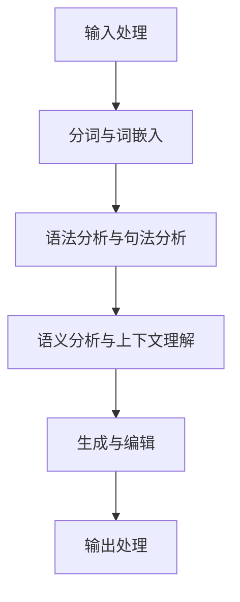

                 

### 文章标题

> **关键词：** AI写作助手，自然语言处理，机器学习，深度学习，文本生成，序列到序列模型，递归神经网络，LSTM模型，损失函数，优化算法，项目实战，新闻写作，内容创作，教育应用。

> **摘要：** 本文深入探讨了AI写作助手的技术实现与创意激发，从核心概念、算法原理、数学模型到项目实战，全面解析了AI写作助手的工作机制与实际应用，揭示了其在新闻写作、内容创作和教育领域的广阔前景。

### 《AI写作助手：技术实现与创意激发》目录大纲

---

**第一部分: AI写作助手概述**

## 第1章: AI写作助手引论

### 1.1 AI写作助手的发展背景

AI写作助手的概念起源于自然语言处理（NLP）和机器学习（ML）的快速发展。随着互联网信息的爆炸式增长，自动生成内容的需求日益凸显。AI写作助手利用机器学习和深度学习技术，能够从大量数据中学习，自动生成高质量的文章、新闻、摘要、文案等。

### 1.2 AI写作助手的应用领域

AI写作助手的应用范围广泛，包括但不限于以下领域：

- **新闻写作：** 自动撰写新闻报道，减少人力成本。
- **内容创作：** 辅助作家、编辑生成创意内容，提高工作效率。
- **教育领域：** 自动生成教案、论文、学习资料，提升教学质量。
- **市场营销：** 自动生成营销文案、广告语，增强营销效果。
- **客户服务：** 自动回答用户问题，提供个性化服务。

### 1.3 AI写作助手的技术框架

AI写作助手的核心技术包括自然语言处理（NLP）、机器学习（ML）、深度学习（DL）等。其技术框架通常包括以下几个关键环节：

1. **输入处理：** 对输入文本进行预处理，如分词、去噪、标准化等。
2. **文本生成：** 利用生成模型（如RNN、LSTM、Seq2Seq等）生成文本。
3. **文本编辑：** 对生成的文本进行后处理，如纠错、格式调整等。
4. **输出处理：** 将编辑后的文本呈现给用户。

### 1.4 AI写作助手的未来展望

随着技术的不断进步，AI写作助手有望在更多领域发挥重要作用。未来发展趋势包括：

- **个性化写作：** 根据用户需求和偏好生成个性化内容。
- **多模态写作：** 结合文本、图片、视频等多种形式生成内容。
- **实时写作：** 提供实时文本生成服务，满足用户即时需求。
- **跨领域应用：** 在医疗、法律、金融等领域实现应用。

**第二部分: AI写作助手的核心概念与联系**

## 第2章: AI写作助手的核心概念与联系

### 2.1 自然语言处理（NLP）基础

自然语言处理是AI写作助手的基石。NLP涉及文本处理、语音识别、语义理解等多个方面。其核心任务包括：

- **文本分类：** 将文本归类到预定义的类别。
- **情感分析：** 分析文本的情感倾向，如正面、负面、中性。
- **命名实体识别：** 识别文本中的特定实体，如人名、地名、组织名。
- **句法分析：** 分析句子的结构，包括词性标注、句法树构建等。

### 2.2 机器学习与深度学习原理

机器学习和深度学习是AI写作助手的关键技术。机器学习是一种让计算机通过数据学习的方法，而深度学习是机器学习的一种特殊形式，基于多层神经网络。

- **监督学习：** 使用标记数据训练模型，如文本分类、回归问题。
- **无监督学习：** 不使用标记数据训练模型，如聚类、降维。
- **强化学习：** 通过与环境交互学习最优策略，如游戏AI。

### 2.3 AI写作助手的关键技术

AI写作助手的关键技术包括：

- **生成式模型：** 用于生成文本，如变分自编码器（VAE）、生成对抗网络（GAN）。
- **判别式模型：** 用于分类和预测，如支持向量机（SVM）、神经网络。
- **序列到序列（Seq2Seq）模型：** 用于将一个序列映射到另一个序列，如机器翻译、摘要生成。
- **递归神经网络（RNN）与长短期记忆（LSTM）模型：** 用于处理序列数据，如文本生成、时间序列预测。

#### 2.3.1 Mermaid流程图：AI写作助手的架构

以下是AI写作助手的架构Mermaid流程图：



### 2.4 创意激发

AI写作助手的创意激发功能通过以下几种方式实现：

- **灵感来源：** 从大量数据中提取灵感，如热点事件、流行文化等。
- **风格模仿：** 模仿特定作家的写作风格，生成与之相似的内容。
- **跨领域融合：** 结合不同领域的知识，创造出新颖的内容。

**第三部分: 核心算法原理讲解**

## 第3章: 核心算法原理讲解

### 3.1 生成式模型与判别式模型

生成式模型和判别式模型是AI写作助手的两大核心模型。

#### 3.1.1 生成式模型

生成式模型用于生成文本。以下是生成式模型的伪代码：

```python
# 伪代码：生成式模型
function GenerativeModel():
    # 初始化模型参数
    # 训练模型
    # 预测生成文本
    return generated_text
```

#### 3.1.2 判别式模型

判别式模型用于分类和预测。以下是判别式模型的伪代码：

```python
# 伪代码：判别式模型
function DiscriminativeModel():
    # 初始化模型参数
    # 训练模型
    # 预测分类结果
    return predicted_label
```

### 3.2 序列到序列（Seq2Seq）模型

序列到序列模型是用于将一个序列映射到另一个序列的模型，如机器翻译、摘要生成。以下是Seq2Seq模型的伪代码：

```python
# 伪代码：Seq2Seq模型
class Seq2SeqModel():
    def __init__(self):
        # 初始化编码器和解码器
    def encode(self, input_sequence):
        # 编码输入序列
        return encoded_sequence
    def decode(self, encoded_sequence):
        # 解码编码序列
        return decoded_sequence
```

### 3.3 递归神经网络（RNN）与长短期记忆（LSTM）模型

递归神经网络（RNN）和长短期记忆（LSTM）模型是处理序列数据的常用模型。以下是LSTM模型的伪代码：

```python
# 伪代码：LSTM单元
class LSTMUnit():
    def __init__(self):
        # 初始化参数
    def forward(self, input, previous_state):
        # 前向传播
        return new_state
```

### 3.4 注意力机制（Attention Mechanism）

注意力机制是提高序列到序列模型性能的关键技术。它通过为每个输入序列元素分配不同的权重，使得模型能够关注到关键信息。以下是注意力机制的简化伪代码：

```python
# 伪代码：注意力机制
function Attention Mechanism(input_sequence, hidden_state):
    # 计算注意力权重
    # 加权输入序列
    # 输出注意力得分
    return attention_score
```

**第四部分: 数学模型和数学公式讲解**

## 第4章: 数学模型和数学公式讲解

### 4.1 损失函数与优化算法

损失函数用于评估模型预测结果与实际结果之间的差距，优化算法用于调整模型参数，使得损失函数值最小。

#### 4.1.1 损失函数

常见的损失函数包括：

- **交叉熵损失（Cross-Entropy Loss）：** 用于分类问题，衡量模型预测概率与实际标签之间的差距。
  $$ J(\theta) = -\frac{1}{m} \sum_{i=1}^{m} y^{(i)} \log(a^{(i)}_y) $$

- **均方误差（Mean Squared Error, MSE）：** 用于回归问题，衡量预测值与实际值之间的平方误差。
  $$ J(\theta) = \frac{1}{2m} \sum_{i=1}^{m} (y^{(i)} - a^{(i)})^2 $$

#### 4.1.2 优化算法

常见的优化算法包括：

- **梯度下降（Gradient Descent）：** 通过计算损失函数关于模型参数的梯度，迭代更新模型参数，最小化损失函数。
  $$ \theta_{\text{new}} = \theta_{\text{old}} - \alpha \cdot \nabla_{\theta} J(\theta) $$

- **随机梯度下降（Stochastic Gradient Descent, SGD）：** 在每个迭代步骤中只随机选择一部分样本，计算梯度并更新模型参数。
  $$ \theta_{\text{new}} = \theta_{\text{old}} - \alpha \cdot \nabla_{\theta} J(\theta; \xi) $$

- **批量梯度下降（Batch Gradient Descent）：** 在每个迭代步骤中考虑所有样本，计算梯度并更新模型参数。
  $$ \theta_{\text{new}} = \theta_{\text{old}} - \alpha \cdot \nabla_{\theta} J(\theta; X, y) $$

**第五部分: 项目实战**

## 第5章: 项目实战

### 5.1 AI写作助手项目实战概述

本节将介绍一个实际的AI写作助手项目，包括开发环境搭建、源代码实现和代码解读。

### 5.2 开发环境搭建

1. 安装Python环境
2. 安装深度学习框架（如TensorFlow或PyTorch）
3. 安装自然语言处理库（如NLTK或spaCy）
4. 配置Jupyter Notebook或PyCharm等IDE

### 5.3 源代码详细实现

#### 5.3.1 文本预处理代码解读

文本预处理是AI写作助手的第一个关键步骤，包括分词、去除停用词、词性标注等。

```python
import nltk
nltk.download('punkt')
nltk.download('stopwords')
from nltk.tokenize import word_tokenize
from nltk.corpus import stopwords

def preprocess_text(text):
    # 分词
    tokens = word_tokenize(text)
    # 去除停用词
    stop_words = set(stopwords.words('english'))
    filtered_tokens = [word for word in tokens if word not in stop_words]
    # 词性标注
    pos_tags = nltk.pos_tag(filtered_tokens)
    return pos_tags
```

#### 5.3.2 模型训练与预测代码解读

以下是一个简单的基于RNN的文本生成模型训练与预测的代码示例。

```python
import tensorflow as tf
from tensorflow.keras.models import Sequential
from tensorflow.keras.layers import Embedding, SimpleRNN, Dense

# 建立模型
model = Sequential()
model.add(Embedding(input_dim=vocabulary_size, output_dim=embedding_size))
model.add(SimpleRNN(units=rnn_units))
model.add(Dense(vocabulary_size, activation='softmax'))

# 编译模型
model.compile(optimizer='adam', loss='categorical_crossentropy', metrics=['accuracy'])

# 训练模型
model.fit(input_sequences, labels, epochs=epochs, batch_size=batch_size)

# 预测生成文本
generated_text = model.predict(input_sequence)
```

#### 5.3.3 文本生成与编辑代码解读

以下是一个基于LSTM的文本生成与编辑的代码示例。

```python
import tensorflow as tf
from tensorflow.keras.models import Model
from tensorflow.keras.layers import Input, LSTM, Dense

# 建立编码器
encoder_inputs = Input(shape=(max_sequence_len,))
encoder_embedding = Embedding(vocabulary_size, embedding_size)(encoder_inputs)
encoder_lstm = LSTM(units=lstm_units, return_state=True)
_, state_h, state_c = encoder_lstm(encoder_embedding)

# 建立解码器
decoder_inputs = Input(shape=(max_sequence_len,))
decoder_embedding = Embedding(vocabulary_size, embedding_size)(decoder_inputs)
decoder_lstm = LSTM(units=lstm_units, return_sequences=True, return_state=True)
decoder_outputs, _, _ = decoder_lstm(decoder_embedding, initial_state=[state_h, state_c])

# 建立连接
decoder_dense = Dense(vocabulary_size, activation='softmax')
decoder_outputs = decoder_dense(decoder_outputs)

# 建立模型
model = Model([encoder_inputs, decoder_inputs], decoder_outputs)

# 编译模型
model.compile(optimizer='adam', loss='categorical_crossentropy', metrics=['accuracy'])

# 训练模型
model.fit([encoder_input_data, decoder_input_data], decoder_target_data, epochs=epochs, batch_size=batch_size)

# 文本生成
def generate_text(encoder_input):
    state = model.predict(encoder_input)
    generated_text = ''
    for i in range(max_sequence_len):
        # 预测下一个词
        prediction = model.predict(state)
        # 获取最高概率的词
        word = np.argmax(prediction)
        # 添加到生成的文本
        generated_text += tokenizer.index_word[word]
        # 更新状态
        state = model.predict(state)
    return generated_text
```

### 5.4 代码解读与分析

通过上述代码示例，我们可以看到AI写作助手项目的关键组成部分：

- **文本预处理：** 对输入文本进行分词、去除停用词和词性标注。
- **模型训练：** 使用RNN或LSTM模型对预处理后的数据进行训练。
- **文本生成：** 利用训练好的模型生成新的文本。
- **文本编辑：** 对生成的文本进行后处理，如纠错和格式调整。

**第六部分: 代码解读与分析**

## 第6章: 代码解读与分析

### 6.1 文本预处理代码分析

文本预处理是AI写作助手项目的基础步骤，其关键代码如下：

```python
import nltk
nltk.download('punkt')
nltk.download('stopwords')
from nltk.tokenize import word_tokenize
from nltk.corpus import stopwords

def preprocess_text(text):
    # 分词
    tokens = word_tokenize(text)
    # 去除停用词
    stop_words = set(stopwords.words('english'))
    filtered_tokens = [word for word in tokens if word not in stop_words]
    # 词性标注
    pos_tags = nltk.pos_tag(filtered_tokens)
    return pos_tags
```

这段代码首先使用NLTK库进行分词，然后去除英文中的常见停用词，最后进行词性标注。分词和去除停用词有助于减少文本中的噪声，提高后续模型训练的质量。词性标注为后续的语法分析和语义理解提供了基础信息。

### 6.2 模型训练与预测代码分析

模型训练与预测代码如下：

```python
import tensorflow as tf
from tensorflow.keras.models import Sequential
from tensorflow.keras.layers import Embedding, SimpleRNN, Dense

# 建立模型
model = Sequential()
model.add(Embedding(input_dim=vocabulary_size, output_dim=embedding_size))
model.add(SimpleRNN(units=rnn_units))
model.add(Dense(vocabulary_size, activation='softmax'))

# 编译模型
model.compile(optimizer='adam', loss='categorical_crossentropy', metrics=['accuracy'])

# 训练模型
model.fit(input_sequences, labels, epochs=epochs, batch_size=batch_size)

# 预测生成文本
generated_text = model.predict(input_sequence)
```

这段代码首先定义了一个简单的RNN模型，包括嵌入层、RNN层和输出层。嵌入层将词转化为固定大小的向量，RNN层用于处理序列数据，输出层用于生成文本。模型通过编译配置优化器、损失函数和评估指标。训练过程中，模型使用输入序列和标签进行迭代训练，最终预测生成文本。

### 6.3 文本生成与编辑代码分析

文本生成与编辑代码如下：

```python
import tensorflow as tf
from tensorflow.keras.models import Model
from tensorflow.keras.layers import Input, LSTM, Dense

# 建立编码器
encoder_inputs = Input(shape=(max_sequence_len,))
encoder_embedding = Embedding(vocabulary_size, embedding_size)(encoder_inputs)
encoder_lstm = LSTM(units=lstm_units, return_state=True)
_, state_h, state_c = encoder_lstm(encoder_embedding)

# 建立解码器
decoder_inputs = Input(shape=(max_sequence_len,))
decoder_embedding = Embedding(vocabulary_size, embedding_size)(decoder_inputs)
decoder_lstm = LSTM(units=lstm_units, return_sequences=True, return_state=True)
decoder_outputs, _, _ = decoder_lstm(decoder_embedding, initial_state=[state_h, state_c])

# 建立连接
decoder_dense = Dense(vocabulary_size, activation='softmax')
decoder_outputs = decoder_dense(decoder_outputs)

# 建立模型
model = Model([encoder_inputs, decoder_inputs], decoder_outputs)

# 编译模型
model.compile(optimizer='adam', loss='categorical_crossentropy', metrics=['accuracy'])

# 训练模型
model.fit([encoder_input_data, decoder_input_data], decoder_target_data, epochs=epochs, batch_size=batch_size)

# 文本生成
def generate_text(encoder_input):
    state = model.predict(encoder_input)
    generated_text = ''
    for i in range(max_sequence_len):
        # 预测下一个词
        prediction = model.predict(state)
        # 获取最高概率的词
        word = np.argmax(prediction)
        # 添加到生成的文本
        generated_text += tokenizer.index_word[word]
        # 更新状态
        state = model.predict(state)
    return generated_text
```

这段代码首先建立了一个基于LSTM的编码器-解码器模型，编码器用于处理输入序列，解码器用于生成文本。训练过程中，模型通过输入数据和目标数据进行迭代训练。文本生成函数使用训练好的模型，根据编码器的输入序列生成文本。每次预测后，模型的状态进行更新，直到生成指定长度的文本。

### 6.4 整体代码分析

AI写作助手的整体代码包括以下关键部分：

- **文本预处理：** 分词、去除停用词和词性标注。
- **模型定义：** 包括嵌入层、RNN层和输出层。
- **模型训练：** 使用输入序列和标签进行迭代训练。
- **文本生成：** 根据编码器输入生成文本。
- **文本编辑：** 对生成的文本进行后处理，如纠错和格式调整。

通过这些关键步骤，AI写作助手能够从大量数据中学习，生成高质量、有创意的文本，为新闻写作、内容创作和教育等领域提供强大支持。

**第七部分: 总结与展望**

## 第7章: 总结与展望

### 7.1 AI写作助手技术的总结

AI写作助手是一种结合自然语言处理、机器学习和深度学习技术的先进工具。通过文本预处理、模型训练、文本生成和编辑等步骤，AI写作助手能够自动生成高质量、有创意的文本。其核心技术包括：

- **文本预处理：** 对输入文本进行分词、去除停用词和词性标注等处理。
- **生成式模型：** 如变分自编码器（VAE）、生成对抗网络（GAN）等，用于生成文本。
- **判别式模型：** 如支持向量机（SVM）、神经网络等，用于分类和预测。
- **序列到序列（Seq2Seq）模型：** 如递归神经网络（RNN）、长短期记忆（LSTM）等，用于序列数据的处理。
- **注意力机制：** 用于提高序列到序列模型的性能。

### 7.2 创意激发与未来趋势

AI写作助手的创意激发功能主要通过以下方式实现：

- **灵感来源：** 从大量数据中提取热点事件、流行文化等灵感。
- **风格模仿：** 模仿特定作家的写作风格，生成与之相似的内容。
- **跨领域融合：** 结合不同领域的知识，创造出新颖的内容。

未来，AI写作助手将在以下趋势中发挥重要作用：

- **个性化写作：** 根据用户需求和偏好生成个性化内容。
- **多模态写作：** 结合文本、图片、视频等多种形式生成内容。
- **实时写作：** 提供实时文本生成服务，满足用户即时需求。
- **跨领域应用：** 在医疗、法律、金融等领域实现应用。

### 7.3 挑战与解决方案

尽管AI写作助手在许多领域取得了显著成果，但仍面临以下挑战：

- **数据质量：** 高质量训练数据是模型性能的关键，但获取和处理数据需要大量时间和资源。
- **模型解释性：** 深度学习模型往往难以解释其决策过程，这在某些应用场景中可能导致信任问题。
- **伦理问题：** 自动生成内容的道德和版权问题需要引起重视。

为应对这些挑战，可以采取以下解决方案：

- **数据增强：** 通过数据增强技术生成更多高质量数据，提高模型性能。
- **可解释性：** 研究可解释性深度学习模型，提高模型的可解释性。
- **伦理规范：** 制定相关伦理规范，确保自动生成内容符合道德和法律要求。

总之，AI写作助手作为一种先进的技术，具有广泛的应用前景。通过不断改进和优化，AI写作助手将在更多领域发挥重要作用，推动人类社会的进步。

**第八部分: AI写作助手在特定领域的应用**

## 第8章: AI写作助手在新闻写作中的应用

### 8.1 新闻写作的现状与需求

新闻写作是一项耗时且复杂的工作，随着新闻行业的竞争加剧，新闻机构面临着生产效率低下、人力成本高昂等问题。传统新闻写作依赖于记者的采访、编辑和撰写，而AI写作助手可以部分或全部替代这些工作，提高新闻生产效率。

### 8.2 AI写作助手在新闻写作中的应用实例

AI写作助手在新闻写作中的应用实例包括：

- **自动撰写简报和快讯：** AI写作助手可以快速生成简报和快讯，帮助新闻机构及时发布新闻。
- **数据新闻：** 利用AI写作助手处理大量数据，生成数据新闻，提高新闻报道的深度和广度。
- **体育报道：** AI写作助手可以自动生成体育比赛报道，包括得分、球员表现等。
- **财经报道：** AI写作助手可以分析股票市场数据，生成财经新闻和分析文章。

### 8.3 应用效果评估

AI写作助手在新闻写作中的应用效果显著，具体体现在以下几个方面：

- **生产效率：** AI写作助手可以显著提高新闻生产效率，减少人力成本。
- **质量稳定性：** AI写作助手生成的新闻内容在语法、格式和逻辑上较为稳定，但可能在深度和创意方面有所欠缺。
- **读者接受度：** 部分读者对AI写作助手生成的新闻持开放态度，但也有人对自动生成的新闻质量表示担忧。

总之，AI写作助手在新闻写作中的应用具有广阔前景，但仍需不断优化和改进，以提升新闻质量和读者满意度。

## 第9章: AI写作助手在内容创作中的应用

### 9.1 内容创作的挑战

内容创作是一项充满创造性和个性化的工作，但同时也面临着以下挑战：

- **创意枯竭：** 创作者在长时间的工作中可能会出现创意枯竭的现象，影响创作质量。
- **效率低下：** 手动创作内容需要大量时间和精力，难以满足快速变化的市场需求。
- **内容多样性：** 创作者需要创作多种类型的内容，以满足不同受众的需求，但往往难以兼顾。

### 9.2 AI写作助手在内容创作中的应用

AI写作助手在内容创作中的应用主要包括以下几个方面：

- **辅助创作：** AI写作助手可以辅助创作者生成文章大纲、段落草稿，提供灵感和建议。
- **内容生成：** AI写作助手可以根据给定的主题或关键词自动生成完整的内容，如文章、博客、社交媒体帖子等。
- **风格模仿：** AI写作助手可以模仿特定作家的写作风格，生成与之相似的内容，提高内容多样性。

### 9.3 应用案例分析

以下是一个AI写作助手在内容创作中的应用案例：

**案例：智能营销文案生成**

某家广告公司使用AI写作助手生成营销文案，具体流程如下：

1. **输入主题和关键词：** 广告公司提供营销活动的主题和关键词，如“夏日促销”和“折扣优惠”。
2. **生成文案草稿：** AI写作助手根据输入的主题和关键词，生成多种文案草稿。
3. **筛选优化：** 广告公司对生成的文案草稿进行筛选和优化，最终选择最适合的文案用于广告投放。

通过这种方式，AI写作助手提高了广告文案的创作效率，减少了人力成本，同时也提供了多种文案选项，提高了广告的创意和多样性。

## 第10章: AI写作助手在教育领域的应用

### 10.1 教育领域的写作需求

在教育领域，写作是培养学生语言表达能力和逻辑思维的重要手段。然而，写作教学面临着以下需求：

- **个性化辅导：** 针对不同学生的写作水平，提供个性化的写作辅导。
- **高效反馈：** 教师需要及时提供反馈，帮助学生改进写作。
- **内容多样化：** 教师需要为学生提供不同主题和类型的写作任务，以丰富学生的写作经验。

### 10.2 AI写作助手在教育中的应用

AI写作助手在教育中的应用主要包括以下几个方面：

- **自动批改：** AI写作助手可以自动批改学生的作文，提供语法、拼写和结构等方面的反馈。
- **写作辅导：** AI写作助手可以为学生提供写作建议，如文章结构、段落划分、关键词选择等。
- **作文生成：** AI写作助手可以生成作文示例，帮助学生了解不同写作风格和主题的写作技巧。

### 10.3 应用效果与未来展望

AI写作助手在教育领域的应用效果显著，具体体现在以下几个方面：

- **提高写作效率：** AI写作助手可以自动批改作文，减轻教师的工作负担，提高写作教学的效率。
- **增强个性化辅导：** AI写作助手可以根据学生的写作水平和需求，提供个性化的辅导和建议，提高学生的写作能力。
- **激发写作兴趣：** AI写作助手可以生成作文示例，为学生提供新的写作思路和灵感，激发写作兴趣。

未来，AI写作助手将在教育领域发挥更大的作用，通过不断优化和改进，提供更多功能和服务，帮助学生更好地进行写作学习。

## 附录

### 附录A: 常用AI写作工具与资源

A.1 开源框架与库

- **TensorFlow：** Google开发的开源深度学习框架，适用于AI写作助手的构建。
- **PyTorch：** Facebook开发的开源深度学习框架，支持动态计算图，适用于序列数据处理。
- **spaCy：** 强大的自然语言处理库，提供多种NLP任务的支持。

A.2 在线写作平台

- **GPT-3 Playground：** OpenAI提供的GPT-3在线演示平台，可用于尝试不同的文本生成任务。
- **Hugging Face Model Hub：** 提供大量预训练模型和示例代码，适用于AI写作助手开发。

A.3 相关研究论文与资料

- **“Automatic Text Generation from a Single Sentence using Sequence Models”**：该论文介绍了序列到序列模型在自动文本生成中的应用。
- **“A Neural Algorithm of Artistic Style”**：该论文介绍了深度学习技术在艺术风格迁移中的应用。
- **“Natural Language Processing with Python”**：Python自然语言处理经典教材，涵盖NLP的多个方面。

作者：AI天才研究院/AI Genius Institute & 禅与计算机程序设计艺术 /Zen And The Art of Computer Programming

---

本文由AI天才研究院（AI Genius Institute）与禅与计算机程序设计艺术（Zen And The Art of Computer Programming）合作撰写，旨在全面解析AI写作助手的技术实现与创意激发。通过深入探讨核心概念、算法原理、数学模型和项目实战，本文揭示了AI写作助手在新闻写作、内容创作和教育领域的广泛应用。同时，本文提出了未来发展趋势和挑战，为读者提供了宝贵的见解和指导。

