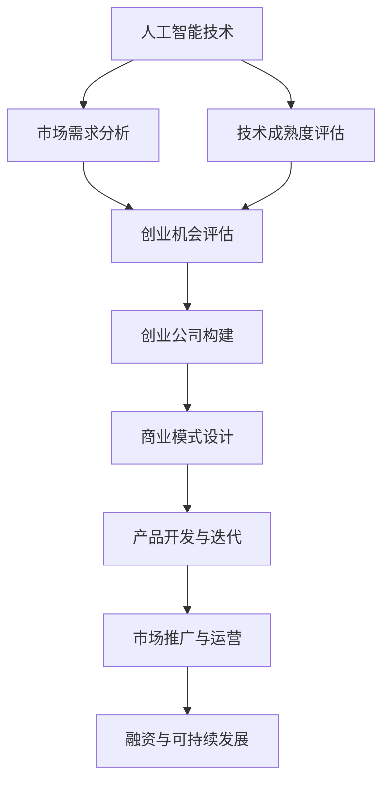
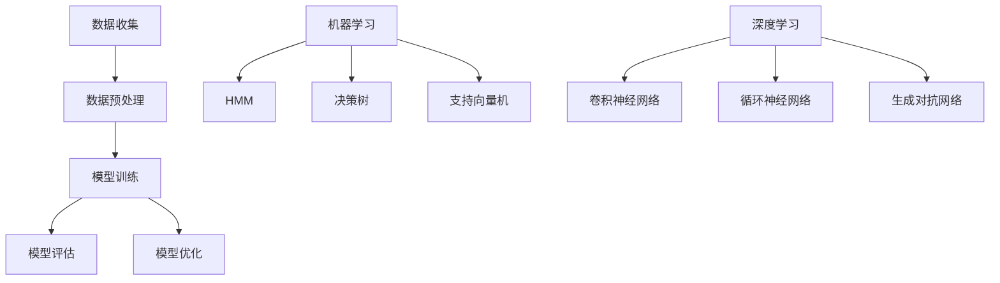

                 

### 第一部分：行业背景与现状分析

#### 第1章：人工智能与创业环境概述

人工智能（AI）作为当今科技界的热点话题，正迅速改变着各个行业的运作模式。从机器学习到深度学习，从自然语言处理到计算机视觉，人工智能技术的不断突破为创业者提供了丰富的创新空间。

**1.1 人工智能的发展历程**

人工智能的概念起源于20世纪50年代，当时科学家们首次提出了让机器模拟人类智能的想法。在经历了早期的理论探索后，人工智能技术逐渐进入了商业化阶段。随着计算机性能的不断提升和大数据时代的到来，机器学习和深度学习等核心技术得以快速发展，推动了人工智能在各个领域的应用。

**1.2 当前人工智能创业环境分析**

当前的人工智能创业环境既充满机遇又充满挑战。从市场需求来看，人工智能技术正逐渐渗透到金融、医疗、教育、制造等多个行业，为创业者提供了丰富的应用场景。从技术成熟度来看，虽然人工智能技术已经取得了显著的进展，但仍面临着算法优化、数据安全、隐私保护等挑战。

**1.3 创业公司的商业模式与策略**

创业公司要在竞争激烈的人工智能市场中脱颖而出，需要具备独特的商业模式和策略。这包括明确的价值主张、精准的市场定位和创新的盈利模式。同时，创业公司还需关注用户体验、合作伙伴关系和资金运作等多个方面，以确保企业的可持续发展。

**核心概念与联系**

为了更好地理解人工智能与创业环境的关系，我们可以使用Mermaid流程图来展示核心概念之间的联系。



在这个流程图中，人工智能技术是核心驱动因素，市场需求和技术成熟度共同影响着创业机会的评估。创业公司的构建、商业模式设计、产品开发、市场推广和融资等环节则是实现人工智能技术商业化的重要步骤。

**总结**

本章从人工智能的发展历程、创业环境分析和商业模式策略三个方面，对人工智能与创业环境进行了概述。接下来，我们将深入探讨人工智能的核心技术原理和应用，帮助读者更好地理解人工智能创业公司的实际运作。

### 目录大纲：《AI创业公司的未来发展》

> **关键词**：人工智能、创业环境、核心技术、商业模式、成功案例、未来趋势、挑战与应对策略

> **摘要**：本文旨在深入分析人工智能创业公司的未来发展，从行业背景、核心技术、成功案例、未来趋势与挑战等方面展开，提供全面而详实的见解，帮助创业者把握行业动向，应对挑战，实现可持续发展。

#### 第二部分：核心技术原理与应用

##### 第2章：人工智能核心技术解析

在本章中，我们将深入探讨人工智能的核心技术，包括机器学习与深度学习基础、自然语言处理技术以及计算机视觉技术。这些技术是人工智能创业公司实现商业化的关键，也是创业者需要熟练掌握的基础知识。

**2.1 机器学习与深度学习基础**

**核心概念与联系**

机器学习和深度学习是人工智能领域的基础技术。机器学习通过算法让计算机从数据中学习规律，而深度学习则利用多层神经网络进行复杂的特征提取。

**Mermaid流程图**



在这个流程图中，数据收集、数据预处理、模型训练、模型评估和模型优化是机器学习和深度学习的基本步骤。不同的机器学习算法和深度学习架构则构成了人工智能技术的基础。

**核心算法原理讲解**

**伪代码**

```python
# 输入数据：特征矩阵X，标签矩阵Y
# 输出：模型参数w和b

def gradient_descent(X, Y, w, b, learning_rate, epochs):
    for epoch in range(epochs):
        # 前向传播
        z = X * w + b
        a = sigmoid(z)
        
        # 反向传播
        dz = a - Y
        dw = (1 / m) * X.T * dz
        db = (1 / m) * dz.sum(axis=0)
        
        # 更新参数
        w = w - learning_rate * dw
        b = b - learning_rate * db
        
        # 计算损失函数
        loss = -1/m * (Y * log(a) + (1 - Y) * log(1 - a))
        
        return w, b, loss
```

在这个伪代码中，梯度下降算法用于优化模型的参数，通过前向传播和反向传播不断调整权重和偏置，以最小化损失函数。

**数学模型和数学公式详细讲解**

**激活函数**

$$
\text{激活函数} = \sigma(z) = \frac{1}{1 + e^{-z}}
$$

其中，$z = \sum_{i=1}^{n} w_i * x_i + b$，$w_i$为权重，$x_i$为输入特征，$b$为偏置。

**交叉熵损失函数**

$$
\text{Loss} = -\sum_{i=1}^{n} Y_i * log(A_i)
$$

其中，$Y_i$为实际标签，$A_i$为模型预测的概率输出。

**项目实战：AI创业公司的实际应用**

**开发环境搭建**

1. 安装Python环境（3.8及以上版本）
2. 安装TensorFlow库
3. 安装其他必要库（如NumPy、Pandas、Matplotlib等）

**源代码实现**

```python
import tensorflow as tf
from tensorflow.keras import layers

# 数据准备
X_train, X_test, y_train, y_test = ...

# 构建模型
model = tf.keras.Sequential([
    layers.Dense(128, activation='relu', input_shape=(num_features,)),
    layers.Dense(1, activation='sigmoid')
])

# 编译模型
model.compile(optimizer='adam',
              loss='binary_crossentropy',
              metrics=['accuracy'])

# 训练模型
model.fit(X_train, y_train, epochs=10, batch_size=32, validation_split=0.2)

# 评估模型
test_loss, test_acc = model.evaluate(X_test, y_test)
print(f"Test accuracy: {test_acc:.4f}")
```

**代码解读与分析**

- 数据准备阶段，将数据集分为训练集和测试集。
- 模型构建阶段，使用全连接神经网络进行二分类任务。
- 编译模型阶段，选择优化器、损失函数和评价指标。
- 训练模型阶段，使用训练集数据进行训练，并设置训练轮数和批量大小。
- 评估模型阶段，使用测试集对模型进行评估，并输出测试集的准确率。

通过本章的学习，读者将能够掌握机器学习与深度学习的基础知识，了解这些技术在AI创业公司中的应用和实践方法。

### 第三部分：创业公司实践案例

在本部分中，我们将通过成功案例分析，深入探讨AI创业公司在实际运营中面临的问题以及解决方案。这些案例将为我们提供宝贵的经验和教训，帮助创业者更好地应对未来的挑战。

#### 第3章：AI创业公司成功案例分析

##### 3.1 创业公司A：从0到1的突破

**背景与愿景**

创业公司A成立于2015年，专注于利用人工智能技术优化零售行业的供应链管理。公司创始人拥有多年的零售行业经验和深厚的人工智能技术背景，希望通过技术创新解决行业痛点，提升零售企业的运营效率。

**关键决策**

1. **市场定位**：公司初期聚焦于中小型零售企业，因为这些企业面临较大的供应链管理挑战，但缺乏大企业的资源优势。
2. **技术创新**：公司投入大量资源研发基于深度学习的库存预测算法，以提高供应链的准确性和响应速度。
3. **合作伙伴**：与多家零售企业建立战略合作关系，通过试点项目验证技术方案的效果。

**成功经验与挑战**

1. **成功经验**：
   - 技术创新：通过先进的深度学习算法，公司成功实现了库存预测的精准度和响应速度的提升，赢得了客户的信任。
   - 市场推广：通过与零售企业的战略合作，快速打开了市场，赢得了大量用户。
   - 团队建设：创始人重视团队建设，吸引了一批优秀的技术和管理人才，为公司的持续发展提供了强大支持。

2. **挑战**：
   - 技术难度：深度学习算法的开发和优化需要大量的技术积累和资金支持，公司初期面临较大的技术挑战。
   - 数据隐私：供应链数据涉及企业核心商业秘密，如何确保数据的安全和隐私是公司需要面对的重要问题。

**案例分析**

创业公司A的成功案例表明，在人工智能创业中，技术创新和市场定位是关键因素。通过精准的市场定位和强大的技术实力，公司能够快速获得市场份额，并建立稳定的客户关系。同时，公司也面临着技术难度和数据隐私等挑战，需要持续投入研发和采取有效的风险管理措施。

##### 3.2 创业公司B：技术驱动与创新

**背景与愿景**

创业公司B成立于2018年，专注于利用人工智能技术提升医疗诊断的准确性和效率。公司创始团队由医学专家和人工智能领域的技术专家组成，致力于将人工智能技术应用于医疗领域，改善病患的生活质量。

**关键决策**

1. **技术路线**：公司选择基于深度学习的计算机视觉技术，开发面向医学影像的诊断系统。
2. **产品开发**：公司投入大量资源进行产品研发，同时与多家医疗机构合作，验证产品效果。
3. **市场推广**：通过参加医学会议、发布研究成果等方式，提高公司在行业内的知名度。

**创新产品的设计与开发**

1. **产品设计**：公司基于深度学习算法，开发了一套智能医学影像诊断系统，能够自动识别和分析医学影像，提供准确的诊断结果。
2. **开发过程**：
   - 数据集构建：收集了大量的医学影像数据，用于训练和验证深度学习模型。
   - 模型训练：使用多层次的卷积神经网络，对医学影像进行特征提取和分类。
   - 模型优化：通过交叉验证和超参数调整，不断优化模型的性能。

**市场推广与用户增长**

1. **市场推广**：公司通过参加医学会议、发布研究成果等方式，吸引了大量医疗机构和医学专家的关注。
2. **用户增长**：通过与医疗机构合作，公司迅速扩大了用户群体，实现了产品的市场推广。
3. **商业模式**：公司采取订阅制商业模式，通过为医疗机构提供持续的软件升级和技术支持，实现长期收益。

**案例分析**

创业公司B的成功案例展示了技术驱动和创新在AI创业中的重要性。公司通过聚焦医疗领域，结合深度学习技术，开发出具有竞争力的产品，并在市场上取得了良好的反响。同时，公司也面临着数据隐私、技术更新等挑战，需要不断进行技术创新和商业模式优化。

##### 3.3 创业公司C：跨界融合与生态构建

**背景与愿景**

创业公司C成立于2019年，专注于将人工智能技术应用于金融行业，提供智能投顾和风险管理解决方案。公司创始人拥有丰富的金融和人工智能行业经验，希望通过跨界融合，推动金融行业的数字化转型。

**跨界合作模式**

1. **战略合作**：公司与多家金融机构建立了战略合作关系，共同开发智能投顾和风险管理产品。
2. **数据共享**：通过与金融机构的数据共享，公司能够获取丰富的金融数据，用于训练和优化人工智能模型。
3. **生态链建设**：公司搭建了一个开放的生态平台，吸引了多家金融科技公司和数据服务提供商加入，共同推动金融行业的技术创新。

**生态链的建设与运营**

1. **生态链建设**：公司通过构建生态平台，为金融科技公司和数据服务提供商提供技术支持和市场资源，推动整个生态链的发展。
2. **运营模式**：公司采用平台化运营模式，通过为生态链成员提供技术解决方案和运营支持，实现共赢发展。
3. **商业模式**：公司通过收取平台服务费、交易手续费等方式实现盈利，同时提供定制化解决方案，满足金融机构的个性化需求。

**面临的挑战与未来展望**

1. **技术挑战**：金融行业的数据量和复杂性较高，如何确保人工智能模型在金融领域的稳定性和可靠性是一个重要的挑战。
2. **数据隐私**：金融数据涉及用户隐私，如何确保数据的安全和合规性是公司需要面对的重要问题。
3. **未来展望**：公司计划进一步拓展生态链，引入更多金融科技公司和数据服务提供商，共同推动金融行业的数字化转型。

**案例分析**

创业公司C的成功案例展示了跨界融合和生态构建在AI创业中的重要性。公司通过跨界合作和生态链建设，实现了技术与金融行业的深度融合，为金融机构提供了智能化的解决方案。同时，公司也面临着技术挑战和数据隐私等挑战，需要持续进行技术创新和风险控制。

通过上述成功案例分析，我们可以看到，AI创业公司在不同领域取得了显著的成果，同时也面临各种挑战。这些案例为我们提供了宝贵的经验和启示，帮助我们在未来的创业实践中更好地应对挑战，实现可持续发展。

### 第四部分：未来发展趋势与挑战

#### 第4章：人工智能行业未来趋势展望

随着人工智能技术的不断进步和应用范围的不断扩大，AI创业公司面临着前所未有的机遇和挑战。本章节将探讨人工智能行业的未来发展趋势、创业公司面临的挑战以及应对策略。

**4.1 人工智能行业的发展趋势**

1. **技术趋势**：人工智能技术将继续向深度化、精细化方向发展。深度学习、强化学习、迁移学习等核心技术将更加成熟，推动人工智能在各个领域的应用水平不断提升。

2. **行业应用**：人工智能将在更多行业得到广泛应用，特别是在金融、医疗、教育、制造、物流等领域，AI技术将大幅提升行业效率和生产力。同时，随着5G、物联网等技术的发展，人工智能的应用场景将更加丰富。

3. **产业链融合**：人工智能产业链将更加融合，从硬件、软件到应用场景，各个环节的企业将共同推动人工智能技术的发展。跨界合作将成为人工智能创业公司的重要策略。

**4.2 创业公司面临的挑战**

1. **技术挑战**：人工智能技术的快速发展带来了更高的技术门槛，创业公司需要不断投入研发，保持技术领先地位。同时，技术复杂性和数据安全等问题也需要解决。

2. **市场挑战**：市场竞争激烈，创业公司需要精准定位市场，提供有竞争力的产品和服务。此外，市场变化迅速，创业公司需要灵活应对市场变化，快速调整战略。

3. **资金压力**：人工智能创业公司通常需要大量资金支持，从研发、运营到市场推广，各个阶段都需要充足的资金保障。如何获取资金、合理分配资金成为创业公司的重要课题。

**4.3 应对策略与风险控制**

1. **技术创新**：创业公司应注重技术创新，保持技术领先地位。通过持续研发，推动技术突破，提升产品竞争力。

2. **市场定位**：明确市场定位，聚焦有潜力的细分市场，提供针对性的解决方案。通过深入了解客户需求，提供高附加值的产品和服务。

3. **合作与生态建设**：积极寻求跨界合作，构建生态链，整合各方资源，共同推动行业发展。通过与产业链上下游企业合作，实现共赢。

4. **资金管理**：合理规划资金使用，确保资金充足且高效利用。通过多种融资渠道，降低资金压力，同时关注投资回报率。

5. **风险控制**：建立完善的风险控制机制，对市场、技术、资金等方面的风险进行评估和管理。通过风险预警和应急措施，降低风险对企业运营的影响。

**总结**

人工智能行业的未来发展趋势充满机遇和挑战。创业公司应紧跟行业趋势，积极应对挑战，通过技术创新、市场定位、合作生态建设等策略，实现可持续发展。同时，合理管理资金和风险，确保企业的稳定运营和长远发展。

### 4.4 创业公司的未来发展战略

创业公司在人工智能行业中要想取得成功，不仅需要应对当前的挑战，还需要制定长远的发展战略。以下是一些关键的发展方向和策略：

**1. 技术前瞻性**

创业公司应保持对技术前沿的敏锐洞察，积极跟进最新的技术趋势。这包括对深度学习、强化学习、联邦学习等新兴技术的关注和应用。通过持续的技术研发，创业公司可以保持技术领先地位，为客户提供更先进的产品和服务。

**2. 产品创新**

在产品开发过程中，创业公司应注重创新，不断优化产品功能，提高用户体验。通过引入人工智能技术，创业公司可以开发出更智能、更个性化的产品。例如，在金融领域，可以开发基于人工智能的智能投顾系统，帮助用户实现财富增值。

**3. 市场拓展**

创业公司需要积极开拓市场，寻找新的增长点。可以通过参加行业展会、与行业巨头合作、开拓国际市场等方式，扩大公司的影响力。同时，针对不同市场特点，定制化开发产品，满足不同地区和行业的需求。

**4. 合作生态**

构建良好的合作生态是创业公司未来发展的重要战略。通过与其他企业、科研机构、高校等合作，共享资源，共同研发新技术，创业公司可以实现技术和市场的双重突破。此外，通过建立开放的生态系统，吸引更多的开发者、用户和企业加入，共同推动行业发展。

**5. 国际化布局**

随着全球化的推进，创业公司的国际化布局越来越重要。通过在海外设立研发中心、办事处，创业公司可以更便捷地获取国际市场信息，拓展海外业务。同时，国际化布局可以帮助创业公司吸收全球的优秀人才，提升公司的整体竞争力。

**6. 风险管理**

在快速发展过程中，创业公司必须建立健全的风险管理体系。这包括对市场风险、技术风险、资金风险等全面评估和管理。通过制定详细的应急预案，创业公司可以降低风险对业务的影响，确保企业的稳定运营。

**7. 人才培养与激励**

人才是创业公司的核心竞争力。创业公司应注重人才培养和激励，建立完善的人才引进和培训体系。通过提供有竞争力的薪酬和福利，吸引和留住优秀人才。同时，通过提供职业发展和培训机会，激发员工的创新潜力。

**总结**

创业公司的未来发展战略应立足当前，着眼长远。通过技术创新、产品创新、市场拓展、合作生态建设、国际化布局、风险管理和人才培养等策略，创业公司可以抓住人工智能行业的发展机遇，实现可持续发展。

### 第五部分：附录

#### 附录A：人工智能创业公司名录

以下是全球知名的人工智能创业公司名录，这些公司以其创新的技术和商业实践，在人工智能领域取得了显著成就。

1. **谷歌DeepMind**：专注于人工智能研究的公司，其AlphaGo等研究成果引起了全球关注。
2. **OpenAI**：致力于推动人工智能安全、友好和有益的研究，开发了GPT系列语言模型。
3. **IBM Watson**：利用人工智能技术提供智能客服和医疗诊断服务。
4. **Intel AI**：英特尔的人工智能部门，专注于开发人工智能芯片和解决方案。
5. **旷视科技（Megvii）**：专注于计算机视觉技术，提供了广泛应用于安防、金融、零售等多个行业的解决方案。
6. **商汤科技（SenseTime）**：同样专注于计算机视觉技术，在自动驾驶、智慧城市等领域有着广泛应用。
7. **SenseTime**：利用人工智能技术为金融、安防等领域提供解决方案。
8. **地平线机器人（Horizon Robotics）**：专注于边缘人工智能处理器和解决方案，为智能汽车、智能城市等领域提供支持。
9. **依图科技（YITU Technology）**：利用人工智能技术提供图像识别、自然语言处理等解决方案。
10. **寒武纪科技（Cambricon）**：专注于人工智能芯片设计，为智能驾驶、智能安防等领域提供硬件支持。

#### 附录B：人工智能相关资源与工具

以下是人工智能领域常用的开源框架、社区和工具，这些资源对于创业者来说是非常宝贵的。

1. **TensorFlow**：谷歌开发的开源机器学习框架，适用于各种深度学习任务。
2. **PyTorch**：基于Python的深度学习框架，广泛应用于学术研究和工业应用。
3. **Scikit-learn**：Python机器学习库，提供了广泛的机器学习算法。
4. **Keras**：基于TensorFlow和Theano的深度学习库，提供了简洁的API。
5. **OpenCV**：开源的计算机视觉库，提供了丰富的图像处理和计算机视觉功能。
6. **NumPy**：Python科学计算库，提供了高效的多维数组对象和数学函数。
7. **Pandas**：Python数据分析库，提供了数据操作和分析的强大工具。
8. **Matplotlib**：Python绘图库，用于生成各种统计图表和可视化效果。
9. **AICommunity**：人工智能领域的在线社区，提供了丰富的讨论和资源。
10. **Kaggle**：数据科学竞赛平台，提供了大量的数据集和竞赛机会。
11. **Reddit AI**：Reddit上的AI板块，是AI爱好者交流的平台。
12. **NeurIPS**：神经信息处理系统会议，是人工智能领域最重要的学术会议之一。
13. **ICML**：国际机器学习会议，是机器学习领域的顶级学术会议。
14. **JMLR**：《机器学习研究期刊》，是机器学习领域的重要学术期刊。

#### 附录C：创业公司融资指南

对于AI创业公司来说，融资是确保企业持续发展的关键。以下是一些常见的融资渠道、策略和注意事项。

**1. 融资渠道**

- **天使投资**：通常是个人投资者，对创业公司的初始阶段提供资金支持。
- **风险投资**：专业投资机构，专注于高成长潜力的创业公司。
- **政府补助**：国家和地方政府提供的资金支持，通常针对特定行业或地区。
- **银行贷款**：通过银行提供的贷款来获取资金。
- **众筹**：通过在线平台向公众筹集资金，适用于产品开发阶段。

**2. 融资策略**

- **估值策略**：合理评估公司的估值，确保融资过程中的估值合理。
- **融资方式选择**：根据公司发展阶段和资金需求，选择合适的融资方式。
- **融资流程**：了解融资流程，包括准备材料、谈判、签订协议等。
- **股权分配**：合理分配股权，确保公司的控制权和利益分配平衡。

**3. 融资注意事项**

- **资金用途**：明确资金用途，确保资金使用高效。
- **风险控制**：评估融资风险，制定应对措施。
- **信息披露**：向投资者提供准确的信息，建立信任关系。
- **法律合规**：遵守相关法律法规，确保融资过程合法合规。
- **后续管理**：融资后的资金管理和公司运营。

**4. 成功融资案例分析**

- **案例一**：某AI创业公司通过天使轮融资获得了100万美元，用于产品研发和市场推广。在后续的A轮融资中，公司获得了5000万美元的投资，成功实现了产品的市场推广和技术突破。
- **案例二**：另一家AI创业公司通过众筹平台筹集了50万美元，用于开发智能健康监控设备。在产品上市后，公司通过B轮融资获得了1500万美元，进一步扩大了市场份额。

通过附录A、附录B和附录C的内容，创业者可以更好地了解人工智能创业公司的现状、资源和融资策略，为自己的创业之路提供有力支持。

### 核心概念与联系：人工智能与创业公司

人工智能与创业公司的关系可以用以下Mermaid流程图进行展示：


在这个流程图中，人工智能技术是核心驱动力，市场需求、技术成熟度和创业机会评估共同影响着创业公司的构建。商业模式设计、产品开发、市场推广和融资等环节则是实现人工智能技术商业化的重要步骤。

**核心算法原理讲解**

以下是机器学习与深度学习的基础算法原理讲解，使用伪代码进行阐述：

```python
# 输入数据：特征矩阵X，标签矩阵Y
# 输出：模型参数w和b

def gradient_descent(X, Y, w, b, learning_rate, epochs):
    for epoch in range(epochs):
        # 前向传播
        z = X * w + b
        a = sigmoid(z)
        
        # 反向传播
        dz = a - Y
        dw = (1 / m) * X.T * dz
        db = (1 / m) * dz.sum(axis=0)
        
        # 更新参数
        w = w - learning_rate * dw
        b = b - learning_rate * db
        
        # 计算损失函数
        loss = -1/m * (Y * log(a) + (1 - Y) * log(1 - a))
        
        return w, b, loss
```

在这个伪代码中，梯度下降算法用于优化模型的参数。通过前向传播和反向传播，模型不断调整权重和偏置，以最小化损失函数。

**数学模型和数学公式详细讲解**

在神经网络中，激活函数和损失函数是核心组成部分。以下是这两个概念及其数学公式的详细讲解：

**激活函数：**

$$
\text{激活函数} = \sigma(z) = \frac{1}{1 + e^{-z}}
$$

其中，$z = \sum_{i=1}^{n} w_i * x_i + b$，$w_i$为权重，$x_i$为输入特征，$b$为偏置。

**交叉熵损失函数：**

$$
\text{Loss} = -\sum_{i=1}^{n} Y_i * log(A_i)
$$

其中，$Y_i$为实际标签，$A_i$为模型预测的概率输出。

**项目实战：AI创业公司的实际应用**

以下是一个AI创业公司的实际应用案例，包括开发环境搭建、源代码实现和代码解读与分析：

**开发环境搭建：**

1. 安装Python环境（3.8及以上版本）
2. 安装TensorFlow库
3. 安装其他必要库（如NumPy、Pandas、Matplotlib等）

**源代码实现：**

```python
import tensorflow as tf
from tensorflow.keras import layers

# 数据准备
X_train, X_test, y_train, y_test = ...

# 构建模型
model = tf.keras.Sequential([
    layers.Dense(128, activation='relu', input_shape=(num_features,)),
    layers.Dense(1, activation='sigmoid')
])

# 编译模型
model.compile(optimizer='adam',
              loss='binary_crossentropy',
              metrics=['accuracy'])

# 训练模型
model.fit(X_train, y_train, epochs=10, batch_size=32, validation_split=0.2)

# 评估模型
test_loss, test_acc = model.evaluate(X_test, y_test)
print(f"Test accuracy: {test_acc:.4f}")
```

**代码解读与分析：**

- 数据准备阶段：将数据集分为训练集和测试集。
- 模型构建阶段：使用全连接神经网络进行二分类任务。
- 编译模型阶段：选择优化器、损失函数和评价指标。
- 训练模型阶段：使用训练集数据进行训练，并设置训练轮数和批量大小。
- 评估模型阶段：使用测试集对模型进行评估，并输出测试集的准确率。

通过这个实际应用案例，创业者可以了解如何在项目中应用人工智能技术，从数据准备、模型构建到训练和评估的整个过程。这些经验和知识对于创业公司的成功至关重要。

