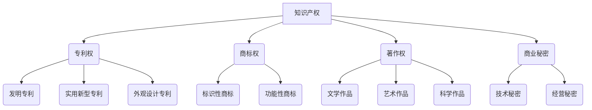

                 

## 文章标题

### 《AI创业公司的知识产权运营：专利运营、商标运营与技术转移》

随着人工智能技术的快速发展，越来越多的创业公司投身于这一领域，希望通过创新的技术获得市场优势。然而，在技术创新的同时，知识产权运营也逐渐成为创业公司面临的重大挑战。本文将深入探讨AI创业公司在知识产权运营方面的策略，包括专利运营、商标运营和技术转移。

> **关键词**：AI创业公司，知识产权，专利运营，商标运营，技术转移

> **摘要**：本文通过分析专利运营、商标运营和技术转移的核心概念、策略和实战案例，为AI创业公司提供知识产权运营的全面指导。文章旨在帮助创业者理解知识产权的重要性，掌握知识产权运营的方法，提高创业公司的市场竞争力。

本文将按照以下目录结构进行展开：

### 第一部分：引言与基础

#### 第1章：知识产权概述

- **1.1 知识产权的定义与重要性**
- **1.2 知识产权的种类与区别**
- **1.3 创业公司知识产权保护的现实需求**

#### 第2章：专利运营

- **2.1 专利的基本概念与类型**
- **2.2 专利申请流程与策略**
- **2.3 专利检索与分析**
- **2.4 专利布局与策略**
- **2.5 专利运用与收益最大化**

#### 第3章：商标运营

- **3.1 商标的定义与作用**
- **3.2 商标注册流程与策略**
- **3.3 商标保护与维权**
- **3.4 商标设计与策略**

#### 第4章：技术转移

- **4.1 技术转移的概念与类型**
- **4.2 技术转移的流程与策略**
- **4.3 技术转移中的知识产权保护**
- **4.4 技术转移中的合作模式与利益分配**

### 第二部分：实战案例分析

#### 第5章：成功案例解析

- **5.1 案例一：A公司专利运营策略与成果**
- **5.2 案例二：B公司商标运营策略与保护**
- **5.3 案例三：C公司技术转移实战与经验**

#### 第6章：知识产权运营策略制定

- **6.1 创业公司知识产权战略规划**
- **6.2 知识产权运营的预算与管理**
- **6.3 知识产权运营的评估与调整**

#### 第7章：知识产权风险防控

- **7.1 知识产权侵权风险分析**
- **7.2 知识产权风险防控策略**
- **7.3 知识产权纠纷处理与应对**

### 第三部分：未来展望与趋势

#### 第8章：知识产权运营的趋势与挑战

- **8.1 知识产权运营的新技术发展**
- **8.2 知识产权运营的国际合作与竞争**
- **8.3 知识产权运营的法律环境与政策支持**

#### 第9章：未来创业公司的知识产权战略

- **9.1 创业公司的知识产权战略规划**
- **9.2 知识产权运营的创新发展路径**
- **9.3 知识产权运营的未来趋势与应对策略**

### 附录

#### 附录A：知识产权运营工具与资源

- **A.1 专利检索与分析工具**
- **A.2 商标注册与查询工具**
- **A.3 技术转移平台与资源**

#### 附录B：知识产权相关法律法规

- **B.1 我国知识产权法律法规概述**
- **B.2 主要法律法规条文解读**
- **B.3 国外知识产权法律法规简介**

#### 附录C：知识产权运营案例资料

- **C.1 成功案例资料整理**
- **C.2 失败案例教训总结**

接下来，我们将逐一深入探讨每个章节的内容，帮助创业者更好地理解和应用知识产权运营策略。让我们开始吧！

---

### 第一部分：引言与基础

#### 第1章：知识产权概述

知识产权是指人们在知识创新过程中所产生的权利，包括专利权、商标权、著作权等。知识产权的运营对于创业公司来说至关重要，它不仅能保护公司的技术创新成果，还能为公司在市场上赢得竞争优势。以下是知识产权的定义与重要性、种类与区别，以及创业公司知识产权保护的现实需求。

##### 1.1 知识产权的定义与重要性

知识产权的定义可以从广义和狭义两个方面理解。广义的知识产权包括一切基于知识创造的财产权利，如专利权、商标权、著作权、商业秘密等。狭义的知识产权则主要指专利权、商标权、著作权等三大类。

知识产权的重要性体现在以下几个方面：

1. **保护技术创新**：知识产权为创新成果提供了法律保护，防止他人未经授权使用或复制，从而激励公司继续投入研发。

2. **增强市场竞争力**：拥有强大的知识产权组合，可以提升公司的市场地位，吸引投资者和合作伙伴，增强公司在市场中的竞争力。

3. **实现商业价值**：通过知识产权运营，如专利许可、转让、技术转移等，企业可以实现技术创新的商业化，从而获得持续的经济收益。

4. **提升品牌价值**：商标作为一种重要的知识产权，能够提升品牌知名度，有助于建立企业的品牌形象。

##### 1.2 知识产权的种类与区别

知识产权主要包括专利权、商标权、著作权和商业秘密等。

1. **专利权**：专利权是指发明人对其发明创造的独占权。专利权分为发明专利、实用新型专利和外观设计专利三种。

2. **商标权**：商标权是指商标注册人对其注册商标的独占使用权。商标权的作用在于标识商品或服务的来源，保护品牌的独特性。

3. **著作权**：著作权是指创作者对其文学、艺术和科学作品的独占权。著作权涵盖了作品的复制、发行、表演、展示等多种权益。

4. **商业秘密**：商业秘密是指不为公众所知悉、具有商业价值并经权利人采取保密措施的技术信息和经营信息。

知识产权的种类与区别如下图所示：



##### 1.3 创业公司知识产权保护的现实需求

对于创业公司来说，知识产权保护具有以下几个现实需求：

1. **技术创新的保障**：创业公司通常以技术创新为核心竞争力，知识产权保护能够确保创新成果不被轻易复制，从而保障公司的核心竞争力。

2. **融资和投资的需求**：投资者在考虑投资创业公司时，会关注公司的知识产权情况。拥有强大的知识产权组合，可以提高公司的融资能力和投资吸引力。

3. **市场扩张的保障**：在市场竞争激烈的环境下，知识产权保护有助于创业公司避免因侵权而被竞争对手打压，保障市场扩张的顺利进行。

4. **品牌建设的需要**：商标是品牌建设的重要组成部分，通过注册和保护商标，创业公司可以提升品牌知名度，增强市场影响力。

综上所述，知识产权运营对于AI创业公司来说具有重要意义。在接下来的章节中，我们将深入探讨专利运营、商标运营和技术转移的具体策略和实践，帮助创业公司更好地利用知识产权，实现可持续发展。

---

### 第一部分：引言与基础

#### 第2章：专利运营

专利运营是创业公司知识产权运营的重要组成部分，通过对专利的申请、检索、布局和运用，可以有效地保护技术创新，提升企业的市场竞争力。本节将详细讨论专利运营的基本概念、申请流程与策略、专利检索与分析、专利布局与策略以及专利运用与收益最大化。

##### 2.1 专利的基本概念与类型

专利是一种法律权利，它赋予专利权人对其发明创造的独占性权利，以防止他人未经授权使用或复制。专利的基本概念包括以下几个方面：

1. **专利权人**：专利权人是指依法申请并获得专利授权的自然人或者法人。

2. **专利申请**：专利申请是指专利权人向国家知识产权局提交的请求授予专利权的法律文件。

3. **专利授权**：专利授权是指国家知识产权局对专利申请进行审查后，认为符合专利法规定，授予专利权的行为。

4. **专利保护期**：专利保护期是指专利权人享有专利独占权的期限，一般发明专利为20年，实用新型专利和外观设计专利为10年。

专利可以分为以下三种类型：

1. **发明专利**：发明专利是指对产品、方法或者其改进所提出的新的技术方案。发明专利的保护力度最强，要求发明具有突出的实质性特点和显著的进步。

2. **实用新型专利**：实用新型专利是指对产品的形状、构造或者其结合所提出的适于实用的新的技术方案。实用新型专利的创造性要求相对较低，审批周期较短。

3. **外观设计专利**：外观设计专利是指对产品的形状、图案或者其结合以及色彩与形状、图案的结合所作出的富有美感并适于工业应用的新设计。外观设计专利主要保护产品的外观美感。

##### 2.2 专利申请流程与策略

专利申请是一个复杂的过程，包括前期准备、撰写申请文件、提交申请、审查和授权等环节。以下是一个典型的专利申请流程：

1. **前期准备**：确定发明创造是否具有专利性，包括新颖性、创造性和实用性。同时，进行专利检索，了解类似发明是否已被申请或授权。

2. **撰写申请文件**：撰写专利申请文件，包括专利请求书、说明书、权利要求书、摘要等。撰写过程中，需要确保文件清晰、完整、准确。

3. **提交申请**：将专利申请文件提交至国家知识产权局。提交申请时，需要缴纳一定的申请费用。

4. **初步审查**：国家知识产权局对专利申请进行初步审查，包括形式审查和初步审查。如果申请文件不符合规定，申请人需要补正。

5. **公布与实质审查**：初步审查合格的专利申请将在申请日后18个月公布。申请人可以根据需要选择是否进行实质审查。实质审查是对专利申请的创造性、实用性和新颖性进行深入审查。

6. **授权与登记**：实质审查合格的专利申请将被授予专利权，并进行登记。申请人将获得专利证书。

专利申请策略主要包括以下几个方面：

1. **专利布局**：根据公司的发展战略，合理规划专利申请的领域和方向，确保专利组合的完整性和协同性。

2. **早期申请**：尽早提交专利申请，以获得更长时间的专利保护。

3. **国际申请**：考虑国际市场的需求，通过PCT（专利合作条约）途径提交国际申请，以实现全球范围内的专利保护。

4. **申请补正**：在专利审查过程中，及时对申请文件进行补正，以提高专利授权的可能性。

##### 2.3 专利检索与分析

专利检索与分析是专利运营的重要环节，通过检索和分析已有的专利信息，可以了解技术领域的研发态势、竞争对手的专利布局以及潜在的风险。以下是一个专利检索与分析的步骤：

1. **确定检索范围**：根据专利申请的主题，确定检索的时间范围、技术领域、关键词等。

2. **选择检索工具**：选择适合的专利检索工具，如国家知识产权局的专利检索系统、谷歌专利搜索等。

3. **进行检索**：在检索工具中输入关键词，进行初步检索，获取相关专利信息。

4. **筛选与分析**：对检索结果进行筛选，分析专利的技术内容、权利要求、申请人、发明人等信息，评估专利的创新性和实用性。

5. **形成检索报告**：整理分析结果，形成专利检索报告，为专利申请和运营提供决策依据。

专利检索与分析的关键指标包括：

1. **专利数量**：反映技术领域的研发活跃度。

2. **专利质量**：反映专利的创新性和实用性。

3. **专利布局**：反映公司在技术领域的竞争优势。

4. **竞争对手**：分析竞争对手的专利策略，为公司的研发和运营提供参考。

##### 2.4 专利布局与策略

专利布局是指公司在特定技术领域内的专利申请和持有情况，旨在构建一个具有协同效应和竞争优势的专利组合。以下是一个专利布局的策略：

1. **核心专利**：识别公司最核心的技术，申请和维护核心专利，确保技术的独占性。

2. **外围专利**：围绕核心专利，申请和维护外围专利，形成专利网，提高技术壁垒。

3. **行业布局**：根据行业特点和市场需求，合理布局专利，确保公司在行业内的技术领先地位。

4. **地域布局**：考虑全球市场的需求，在不同国家和地区申请专利，实现全球范围内的保护。

专利布局策略的关键是平衡专利的数量和质量，确保专利组合的协同效应和竞争优势。

##### 2.5 专利运用与收益最大化

专利运用是创业公司通过专利实现商业价值的过程，包括专利许可、专利转让、专利实施等。以下是一个专利运用与收益最大化的策略：

1. **专利许可**：通过专利许可，授权其他公司使用专利技术，获取许可费。

2. **专利转让**：将专利权转让给其他公司或个人，获取转让收益。

3. **专利实施**：将专利技术应用于公司的产品或服务中，提升市场竞争力。

4. **专利运营平台**：建立专利运营平台，整合专利资源，实现专利的优化配置和运营。

专利运用与收益最大化的关键在于：

1. **专利价值的评估**：准确评估专利的价值，为专利许可、转让和实施提供依据。

2. **市场需求的把握**：了解市场需求，选择有潜力的专利进行运营。

3. **合作与竞争的平衡**：在专利运营过程中，既要考虑合作伙伴的利益，也要防范竞争对手的侵权行为。

通过专利运营，创业公司可以有效地保护技术创新，提升市场竞争力，实现持续的商业价值。在下一节中，我们将探讨商标运营的相关内容。

---

### 第一部分：引言与基础

#### 第3章：商标运营

商标是企业在市场中识别自身产品和服务的重要标志，通过注册商标，企业可以保护其品牌形象，避免竞争对手的侵权行为。商标运营包括商标注册、保护与维权、商标设计等方面。以下将对商标的基本概念、注册流程与策略、保护与维权、商标设计进行详细讨论。

##### 3.1 商标的定义与作用

商标是指企业、个人或其他组织使用于商品或服务上，以区别自己与他人商品或服务的标志。商标可以是文字、图形、字母、数字、三维标志、颜色组合，甚至声音、气味等，具有显著性和识别性。

商标的作用主要体现在以下几个方面：

1. **品牌识别**：商标是企业品牌的象征，有助于消费者在市场上识别和选择企业的产品或服务。

2. **区分来源**：商标的作用在于区分不同商品或服务的来源，避免消费者混淆。

3. **法律保护**：商标注册后，商标权人对其享有独占权，可以防止他人未经授权使用相同或类似的商标。

4. **品牌价值**：商标是品牌价值的重要体现，良好的商标有助于提升企业的市场地位和竞争力。

##### 3.2 商标注册流程与策略

商标注册是一个复杂的过程，包括商标查询、申请、审查、公告和注册等步骤。以下是一个商标注册的基本流程：

1. **商标查询**：在申请商标注册前，进行商标查询是必要的，以了解商标是否已被注册或存在类似的商标。

2. **商标申请**：提交商标注册申请，包括填写商标注册申请表、提交商标图样、缴纳申请费等。

3. **形式审查**：国家知识产权局对商标申请文件进行形式审查，确保申请文件符合规定。

4. **初步审查**：形式审查通过后，商标申请进入初步审查阶段，审查商标是否符合商标法的要求。

5. **公告**：初步审查合格的商标申请将被公告，公开征求意见。

6. **实质审查**：公告无异议或者异议不成立的商标申请，进入实质审查阶段，审查商标的显著性、独特性和注册可行性。

7. **注册与公告**：实质审查合格的商标申请将被注册，并进行公告，商标权人将获得商标注册证书。

商标注册策略主要包括以下几个方面：

1. **优先注册**：优先注册具有较高知名度和市场价值的商标，以确保企业在市场上的领先地位。

2. **多类注册**：将商标注册在不同的商品或服务类别，以获得更全面的保护。

3. **防御注册**：在竞争对手可能使用的商品或服务类别上注册商标，形成商标防御网。

4. **国际注册**：考虑国际市场的需求，通过马德里协定或单个国家注册，实现全球范围内的商标保护。

##### 3.3 商标保护与维权

商标保护与维权是企业知识产权运营的重要环节。以下是一些常见的商标保护与维权方法：

1. **商标监控**：定期监控市场上商标的使用情况，及时发现和处理商标侵权行为。

2. **维权诉讼**：针对商标侵权行为，通过法律途径提起诉讼，维护自身合法权益。

3. **侵权投诉**：向国家知识产权局或其他相关部门投诉，要求查处商标侵权行为。

4. **和解与调解**：在商标侵权纠纷中，通过和解或调解解决纠纷，避免长时间的法律诉讼。

商标保护与维权的关键在于：

1. **证据收集**：及时收集商标侵权的证据，为维权提供有力支持。

2. **法律意识**：提高员工和合作伙伴的商标法律意识，避免侵权行为。

3. **专业支持**：寻求专业律师或知识产权顾问的支持，提高维权成功率。

##### 3.4 商标设计与策略

商标设计是商标运营的基础，一个成功的商标设计能够提升品牌的识别度和市场竞争力。以下是一些商标设计的原则和策略：

1. **简洁性**：商标设计应简洁明了，易于记忆和识别。

2. **独特性**：商标应具有独特的视觉效果和创意，避免与他人商标混淆。

3. **功能性**：商标设计应考虑到实际应用场景，确保在不同媒介上的表现力。

4. **文化性**：商标设计应融入企业文化，传达企业的价值观和品牌形象。

商标设计策略主要包括：

1. **品牌定位**：明确商标的品牌定位，确保商标设计与品牌形象相符合。

2. **市场调研**：了解目标市场的消费习惯和心理，设计符合市场需求的商标。

3. **创意创新**：结合品牌特色，进行创意创新，设计具有独特性的商标。

4. **反馈与改进**：通过市场反馈，不断改进商标设计，提升品牌形象。

通过有效的商标运营，企业可以保护品牌形象，提升市场竞争力，实现品牌的长期发展。在下一节中，我们将探讨技术转移的相关内容。

---

### 第一部分：引言与基础

#### 第4章：技术转移

技术转移是指将技术创新从研发阶段转化为实际应用，从而实现商业化过程。技术转移不仅有助于企业实现技术价值，还可以促进产业发展和创新能力的提升。本节将详细探讨技术转移的概念与类型、流程与策略、知识产权保护以及合作模式与利益分配。

##### 4.1 技术转移的概念与类型

技术转移是指将一项技术创新从一个环境转移到另一个环境，以实现其商业化应用的过程。技术转移的类型包括：

1. **内部转移**：指企业内部不同部门或团队之间的技术转移，如研发部门的技术成果转移到生产部门。

2. **外部转移**：指企业与其他企业、研究机构、大学或政府机构之间的技术转移。

3. **跨国转移**：指技术从一国转移到另一国，通常涉及国际间的技术合作和投资。

技术转移的关键环节包括：

1. **技术研发**：技术创新的源头，包括研发投入、技术积累和创新成果。

2. **成果转化**：将技术成果转化为实际应用，包括试验、示范、推广和商业化。

3. **市场应用**：技术成果在市场中的实际应用和商业化，实现技术价值。

##### 4.2 技术转移的流程与策略

技术转移的流程通常包括以下几个阶段：

1. **需求分析**：确定技术转移的目标和需求，包括市场前景、技术成熟度、风险分析等。

2. **技术评估**：对技术创新的可行性、创新程度、市场需求和潜在收益进行评估。

3. **转移方案设计**：根据需求分析和技术评估，设计技术转移的具体方案，包括技术合作、许可、转让等方式。

4. **合同谈判与签署**：与转移对象进行合同谈判，明确技术转移的内容、条件、责任和收益分配等。

5. **实施与监控**：按照合同约定，实施技术转移计划，并进行全程监控，确保技术转移的顺利进行。

技术转移策略主要包括以下几个方面：

1. **合作模式选择**：根据技术特点、市场需求和合作方能力，选择合适的技术合作模式，如技术许可、技术转让、合资经营等。

2. **利益分配**：合理分配技术转移中的利益，确保合作双方的利益平衡，提高合作的积极性。

3. **风险控制**：识别和评估技术转移过程中的风险，采取有效的风险控制措施，降低风险影响。

4. **政策支持**：利用国家和地方政策支持，如税收优惠、资金补助、人才引进等，促进技术转移的顺利进行。

##### 4.3 技术转移中的知识产权保护

知识产权保护是技术转移的重要保障，关系到技术转移的顺利进行和企业的合法权益。以下是一些技术转移中的知识产权保护措施：

1. **专利保护**：在技术转移前，对技术创新申请专利，确保技术在市场上的独占性。

2. **商标保护**：对企业的品牌、标志等进行商标注册，保护品牌形象和市场地位。

3. **著作权保护**：对技术文档、软件代码等进行著作权登记，确保技术文档和软件的合法使用。

4. **商业秘密保护**：对涉及商业秘密的技术信息进行保密，防止技术泄露和侵权。

5. **法律维权**：在技术转移过程中，依法维护企业的知识产权，对侵权行为进行维权。

技术转移中的知识产权保护策略包括：

1. **专利布局**：根据技术转移的需求，合理规划专利布局，形成专利网，提高技术壁垒。

2. **知识产权管理**：建立完善的知识产权管理体系，确保知识产权的规范化管理和保护。

3. **合作条款**：在技术转移合同中，明确知识产权的归属、使用、保护等条款，确保合作双方的权益。

4. **知识产权维权**：加强对侵权行为的监控和维权，采取法律手段保护企业的知识产权。

##### 4.4 技术转移中的合作模式与利益分配

技术转移中的合作模式主要包括以下几种：

1. **技术许可**：技术所有者向技术接受者授权使用技术，并收取许可费。适用于技术成熟、市场前景明确的情况。

2. **技术转让**：技术所有者将技术所有权转让给技术接受者，一次性或分期支付转让费。适用于技术需大规模应用或接受者具备较强的研发能力。

3. **合资经营**：技术所有者与技术接受者共同投资成立合资企业，共同经营。适用于技术涉及高风险、市场前景广阔的情况。

4. **技术合作**：技术所有者与技术接受者共同研发或改进技术，共享成果和利益。适用于技术研发阶段，需联合攻关的情况。

利益分配策略主要包括以下几个方面：

1. **收益分享**：根据技术转移的效果和合作方的贡献，合理分配收益。

2. **股权安排**：在合资经营模式下，通过股权安排，确保合作双方的利益平衡。

3. **利润分成**：根据技术转移产生的利润，按照约定比例进行分成。

4. **风险分担**：明确合作方的风险责任，合理分担技术转移过程中的风险。

通过有效的技术转移，企业可以实现技术创新的商业化，提升市场竞争力，实现可持续发展。在下一节中，我们将通过成功案例解析，深入探讨专利运营、商标运营和技术转移的实际应用。

---

### 第二部分：实战案例分析

#### 第5章：成功案例解析

在知识产权运营方面，一些AI创业公司已经通过有效的策略和实践取得了显著成果。以下将介绍三个成功案例，分别是A公司的专利运营策略与成果、B公司的商标运营策略与保护、以及C公司的技术转移实战与经验。

##### 5.1 案例一：A公司专利运营策略与成果

A公司是一家专注于人工智能图像识别技术的创业公司。在知识产权运营方面，A公司采取了以下策略：

1. **专利布局**：A公司针对其核心技术领域，进行了全面的专利布局。首先，确定了公司的核心专利，包括图像识别算法、数据处理技术等。然后，围绕核心专利，申请了一系列外围专利，形成了一个强大的专利网，提高了公司的技术壁垒。

2. **专利申请**：A公司注重专利申请的早期布局，通过持续的研发投入，确保每个技术突破都能及时转化为专利申请。同时，公司还聘请了专业的专利律师，确保专利申请文件的撰写质量和提交的及时性。

3. **专利运用**：A公司通过专利许可和转让，实现了专利的商业化。公司与多家知名企业进行了专利许可合作，获得了可观的许可收入。此外，公司还通过专利转让，将一些成熟的技术转让给其他企业，实现了技术转移和收益最大化。

4. **专利保护**：A公司建立了完善的专利监控机制，定期对市场上的专利使用情况进行监控，及时发现潜在的侵权行为。同时，公司还与专业的知识产权律师事务所合作，应对侵权诉讼，维护自身的知识产权。

通过上述策略，A公司取得了显著的专利运营成果。截至2022年，A公司已拥有100多项专利，覆盖了图像识别、数据处理等多个领域，公司的市场竞争力得到了显著提升。

##### 5.2 案例二：B公司商标运营策略与保护

B公司是一家提供人工智能客服解决方案的创业公司。在商标运营方面，B公司采取了以下策略：

1. **商标注册**：B公司在成立之初，就重视商标注册工作。首先，对公司名称和产品名称进行了商标查询，确保没有相同或近似的商标已被注册。然后，及时提交了商标注册申请，并在短时间内获得了商标注册证书。

2. **商标保护**：B公司建立了完善的商标保护机制，包括定期监控市场上的商标使用情况、对侵权行为进行投诉和维权等。公司还与专业的知识产权律师事务所合作，制定和实施商标维权策略，确保商标的合法权益不受侵犯。

3. **商标设计**：B公司注重商标的设计，聘请了专业的品牌设计团队，设计了一个简洁、易记且具有辨识度的商标。同时，公司还通过商标的设计和运用，将商标与公司的品牌形象相结合，提升了品牌知名度和市场影响力。

4. **商标推广**：B公司在市场推广过程中，充分利用商标的优势，通过线上线下多种渠道进行品牌推广。公司还在产品包装、宣传材料、官方网站等地方，突出商标的设计和品牌形象，增强了消费者的品牌认知度。

通过上述策略，B公司成功保护了商标的合法权益，并在市场中建立了良好的品牌形象。截至2022年，B公司已拥有20多项商标，覆盖了客服解决方案、人工智能等多个领域，公司的市场份额稳步提升。

##### 5.3 案例三：C公司技术转移实战与经验

C公司是一家专注于人工智能药物研发的创业公司。在技术转移方面，C公司积累了丰富的实战经验：

1. **需求分析与评估**：C公司在进行技术转移前，进行了详细的需求分析和评估。公司首先明确了技术转移的目标和需求，包括技术成熟度、市场前景、潜在收益等。然后，对技术进行了全面评估，确保技术具有高价值和应用前景。

2. **合作模式选择**：根据技术特点和市场需求，C公司选择了技术许可和合资经营两种合作模式。对于一些成熟的技术，公司选择通过技术许可方式，与其他企业进行合作，获取许可费和合作收益。对于一些高风险的技术，公司选择通过合资经营方式，与合作伙伴共同承担风险，实现技术转移和商业化。

3. **利益分配**：C公司制定了合理的利益分配策略，确保合作双方的权益平衡。公司通过收益分享、股权安排等方式，保障了合作方的利益，提高了合作的积极性。

4. **风险控制**：C公司在技术转移过程中，重视风险控制。公司通过法律手段，对技术转移中的知识产权进行保护，防止技术泄露和侵权。同时，公司还通过风险分担、合同管理等方式，降低技术转移过程中的风险。

通过上述策略，C公司成功实现了多项技术转移，获得了可观的收益。截至2022年，C公司已成功转移了10多项技术，与多家国内外企业建立了长期合作关系，公司的市场地位和技术影响力得到了显著提升。

通过以上成功案例，我们可以看到，有效的知识产权运营策略对于AI创业公司的重要性。无论是在专利运营、商标运营还是技术转移方面，合理的策略和实战经验都是企业实现可持续发展的重要保障。

---

### 第二部分：实战案例分析

#### 第6章：知识产权运营策略制定

在了解了成功案例之后，我们需要进一步探讨如何为创业公司制定有效的知识产权运营策略。本章节将详细讨论创业公司知识产权战略规划、运营预算与管理、以及评估与调整。

##### 6.1 创业公司知识产权战略规划

知识产权战略规划是创业公司知识产权运营的基础，它关系到公司技术创新的可持续发展和市场竞争力。以下是一个典型的知识产权战略规划流程：

1. **明确战略目标**：创业公司需要根据自身的发展阶段、市场定位和竞争优势，明确知识产权运营的战略目标。例如，提升市场竞争力、扩大市场份额、保护技术创新成果等。

2. **技术领域定位**：确定公司主要的技术领域和发展方向，为专利申请和布局提供方向。可以通过市场调研、技术趋势分析等方式，识别有潜力的技术领域。

3. **专利布局**：根据战略目标和技术领域定位，制定专利布局策略。包括核心专利的申请、外围专利的布局以及国际专利的保护。

4. **商标战略**：商标是品牌建设的重要组成部分，创业公司需要制定商标战略，包括商标注册、保护、设计等方面。

5. **知识产权组合管理**：建立知识产权组合管理机制，对专利、商标等知识产权进行系统管理，确保知识产权的协同效应。

6. **风险防控**：制定知识产权风险防控策略，包括侵权监控、法律维权等方面。

##### 6.2 知识产权运营的预算与管理

知识产权运营需要投入一定的资金和人力资源，因此，合理的预算和管理至关重要。以下是一个典型的知识产权运营预算和管理流程：

1. **预算制定**：根据知识产权战略规划，制定年度知识产权预算。预算应包括专利申请费、商标注册费、知识产权维护费、法律顾问费等。

2. **资金分配**：合理分配预算资金，确保专利申请、商标注册、知识产权维护等环节的投入。

3. **成本控制**：通过优化流程、提高效率等方式，控制知识产权运营成本。

4. **绩效评估**：定期对知识产权运营的绩效进行评估，包括专利申请数量、商标注册数量、知识产权维权成功率等指标。

5. **风险管理**：建立知识产权风险管理制度，对潜在风险进行识别、评估和管理，确保知识产权运营的安全性和稳定性。

##### 6.3 知识产权运营的评估与调整

知识产权运营是一个持续的过程，需要根据市场环境、技术发展趋势等因素进行评估和调整。以下是一个典型的知识产权运营评估与调整流程：

1. **评估指标**：建立知识产权运营评估指标体系，包括专利数量、专利质量、商标知名度、知识产权维权成功率等。

2. **数据收集**：收集与评估指标相关的数据，如专利申请数量、商标注册数量、知识产权维权案件等。

3. **数据分析**：对收集的数据进行分析，识别知识产权运营的优势和不足。

4. **问题识别**：根据数据分析结果，识别知识产权运营中存在的问题，如专利申请质量不高、商标知名度低等。

5. **调整策略**：根据问题识别结果，制定和实施调整策略，如优化专利申请流程、加强商标推广等。

6. **持续改进**：建立持续改进机制，对知识产权运营策略进行调整和优化，确保知识产权运营的持续改进。

通过以上策略制定、预算管理、评估调整，创业公司可以有效地运营知识产权，保护技术创新成果，提升市场竞争力。在下一节中，我们将探讨知识产权运营中的风险防控。

---

### 第二部分：实战案例分析

#### 第7章：知识产权风险防控

在知识产权运营过程中，风险防控是确保企业合法权益的重要环节。以下将详细讨论知识产权侵权风险分析、风险防控策略以及知识产权纠纷处理与应对。

##### 7.1 知识产权侵权风险分析

知识产权侵权风险主要涉及专利、商标、著作权等领域的侵权行为。以下是一个典型的知识产权侵权风险分析流程：

1. **市场调研**：通过市场调研，了解市场上类似产品和服务的知识产权状况，包括专利申请情况、商标注册情况等。

2. **知识产权检索**：利用专利检索系统、商标查询工具等，对市场上相关的知识产权进行检索，识别潜在的侵权风险。

3. **风险评估**：根据检索结果，对潜在的侵权风险进行评估，包括侵权程度、侵权对象、侵权行为等。

4. **风险分类**：将识别的侵权风险进行分类，如专利侵权、商标侵权、著作权侵权等，为后续的风险防控提供依据。

##### 7.2 知识产权风险防控策略

知识产权风险防控策略主要包括以下几个方面：

1. **专利风险防控**：针对专利侵权风险，企业可以采取以下措施：
   - **专利布局**：合理规划专利布局，形成专利网，提高技术壁垒。
   - **专利监控**：定期监控市场上的专利使用情况，及时发现潜在的侵权行为。
   - **维权诉讼**：对侵权行为提起诉讼，维护自身合法权益。

2. **商标风险防控**：针对商标侵权风险，企业可以采取以下措施：
   - **商标注册**：及时注册商标，确保商标的合法权益。
   - **商标监控**：定期监控市场上商标的使用情况，及时发现侵权行为。
   - **维权诉讼**：对侵权行为提起诉讼，维护商标的合法权益。

3. **著作权风险防控**：针对著作权侵权风险，企业可以采取以下措施：
   - **著作权登记**：对软件代码、技术文档等进行著作权登记，确保著作权的合法保护。
   - **版权声明**：在产品或服务中使用版权声明，明确权利归属。
   - **维权诉讼**：对侵权行为提起诉讼，维护著作权的合法权益。

##### 7.3 知识产权纠纷处理与应对

知识产权纠纷处理与应对是企业知识产权运营中的重要环节。以下是一个典型的知识产权纠纷处理与应对流程：

1. **问题识别**：通过市场监控、客户反馈等方式，识别潜在的知识产权纠纷。

2. **评估风险**：对知识产权纠纷进行风险评估，包括纠纷的性质、影响、处理难度等。

3. **法律咨询**：在纠纷处理过程中，及时寻求专业法律顾问的建议，制定应对策略。

4. **和解与调解**：在可能的情况下，通过和解或调解解决纠纷，避免长时间的法律诉讼。

5. **法律诉讼**：如果纠纷无法通过和解或调解解决，企业可以考虑通过法律诉讼维护自身权益。

6. **持续改进**：对知识产权纠纷处理过程进行总结和反思，制定和改进知识产权管理策略，预防未来纠纷。

通过以上风险防控策略和纠纷处理与应对措施，企业可以有效地降低知识产权运营中的风险，维护自身的合法权益，确保技术创新的可持续发展。

---

### 第三部分：未来展望与趋势

#### 第8章：知识产权运营的趋势与挑战

随着人工智能技术的不断进步，知识产权运营也面临着新的趋势和挑战。本节将探讨知识产权运营的新技术发展、国际合作与竞争以及法律环境与政策支持。

##### 8.1 知识产权运营的新技术发展

人工智能技术在知识产权运营中的应用正逐步深入，带来了新的发展机遇。以下是一些关键技术及其应用：

1. **大数据分析**：通过大数据分析，企业可以更全面地了解市场需求、技术趋势以及竞争对手的知识产权状况，为知识产权运营提供数据支持。

2. **人工智能专利检索**：利用自然语言处理和机器学习技术，人工智能专利检索系统可以快速识别和筛选相关的专利信息，提高专利检索的效率和准确性。

3. **区块链技术**：区块链技术可以用于知识产权的登记、认证和保护，确保知识产权的透明性和不可篡改性。

4. **人工智能合同审核**：通过人工智能技术，企业可以自动审核合同条款，确保合同中的知识产权条款符合法律规定，降低法律风险。

5. **人工智能知识产权纠纷解决**：利用人工智能技术，可以自动化处理知识产权纠纷，提供高效的解决方案，降低诉讼成本。

##### 8.2 知识产权运营的国际合作与竞争

在全球化的背景下，知识产权运营的国际合作与竞争日益加剧。以下是一些国际合作的趋势和挑战：

1. **跨国专利布局**：随着全球市场的扩展，企业需要在全球范围内进行专利布局，以保护技术创新成果。跨国专利布局需要考虑不同国家和地区的法律环境、专利制度等。

2. **国际合作研究**：企业可以通过国际合作研究，共同开发新技术，共享知识产权，提高技术创新的效率。

3. **国际竞争**：在国际市场上，企业需要应对来自全球竞争对手的压力。知识产权运营策略需要考虑如何通过专利布局、商标保护等手段，提高市场竞争力。

4. **知识产权争端解决**：随着国际合作的增加，知识产权争端也日益复杂。企业需要熟悉不同国家的知识产权法律制度，制定有效的争端解决策略。

##### 8.3 知识产权运营的法律环境与政策支持

知识产权运营的法律环境和政策支持对企业的知识产权运营具有重大影响。以下是一些法律环境和政策支持的现状和趋势：

1. **知识产权法律制度**：各国正不断完善知识产权法律制度，加强对知识产权的保护。例如，美国通过了《知识产权现代化法》，欧盟实施了《统一专利法院条例》等。

2. **知识产权政策支持**：政府通过税收优惠、资金补助、人才引进等政策，支持企业进行知识产权运营。例如，中国政府发布了《国家知识产权战略纲要》，明确了知识产权发展的目标和措施。

3. **国际合作与协调**：全球范围内，各国正加强知识产权国际合作与协调，共同推动知识产权保护的发展。例如，《巴黎公约》、《伯尔尼公约》等国际知识产权协定，促进了全球范围内的知识产权保护。

4. **知识产权纠纷解决机制**：全球范围内，知识产权纠纷解决机制不断完善，包括国际仲裁、调解、诉讼等。企业可以通过多种途径解决知识产权纠纷，降低纠纷处理成本。

通过以上新技术的发展、国际合作与竞争以及法律环境与政策支持，企业可以更好地运营知识产权，保护技术创新成果，提升市场竞争力。在下一节中，我们将探讨未来创业公司的知识产权战略。

---

### 第三部分：未来展望与趋势

#### 第9章：未来创业公司的知识产权战略

随着人工智能技术的快速发展，创业公司需要制定更具前瞻性的知识产权战略，以应对不断变化的市场环境和技术趋势。本节将讨论未来创业公司的知识产权战略规划、创新发展路径以及应对未来趋势的策略。

##### 9.1 创业公司的知识产权战略规划

未来创业公司的知识产权战略规划应具备以下特点：

1. **技术前瞻性**：创业公司需要密切关注人工智能技术的发展趋势，预测未来技术发展方向，提前布局相关知识产权。

2. **多元化**：知识产权战略应涵盖专利、商标、著作权等多个领域，形成多元化的知识产权组合，提高企业的竞争力和抗风险能力。

3. **国际视野**：在全球化背景下，创业公司的知识产权战略应具备国际视野，考虑全球市场的知识产权保护需求，进行跨国专利布局。

4. **协同效应**：通过优化知识产权组合，发挥知识产权的协同效应，提高技术创新的商业化应用效率。

5. **动态调整**：知识产权战略应具备灵活性，根据市场变化和技术发展趋势，及时进行调整和优化。

##### 9.2 知识产权运营的创新发展路径

未来创业公司在知识产权运营方面可以探索以下创新发展路径：

1. **开放式创新**：通过开放式创新，与外部合作伙伴共同开发新技术，共享知识产权，提高技术创新的速度和效果。

2. **跨界合作**：与不同领域的企业、研究机构等进行跨界合作，整合多领域的知识和技术，推动知识产权的多元化发展。

3. **知识产权金融化**：通过知识产权金融化，将知识产权转化为金融资产，实现知识产权的商业化应用和价值最大化。

4. **智能化管理**：利用人工智能技术，实现知识产权的智能化管理，提高知识产权运营的效率和准确性。

5. **绿色知识产权**：关注环境保护和可持续发展，开发绿色知识产权，响应全球绿色发展趋势。

##### 9.3 知识产权运营的未来趋势与应对策略

未来知识产权运营将面临以下趋势和挑战：

1. **知识产权保护力度加大**：随着全球知识产权保护意识的提高，知识产权保护力度将不断加大，企业需要加强知识产权保护意识，提高知识产权管理水平。

2. **跨国知识产权纠纷增多**：随着全球市场的扩展，跨国知识产权纠纷将增多，企业需要熟悉不同国家和地区的知识产权法律制度，制定有效的应对策略。

3. **知识产权运营成本上升**：知识产权运营成本，包括专利申请、商标注册、维权诉讼等，将随着知识产权保护力度的加大而上升，企业需要优化运营策略，降低成本。

4. **新兴技术带来的挑战**：如人工智能、区块链等新兴技术将带来新的知识产权挑战，企业需要积极应对，制定相应的知识产权策略。

应对未来趋势，企业可以采取以下策略：

1. **提升知识产权保护意识**：通过培训、宣传等方式，提高员工的知识产权保护意识，减少侵权行为。

2. **加强国际合作**：积极参与国际知识产权合作与交流，借鉴国际先进经验，提高知识产权运营水平。

3. **创新运营模式**：探索新的知识产权运营模式，如知识产权金融化、智能化管理等，提高运营效率。

4. **法律风险管理**：建立健全的法律风险管理机制，降低知识产权纠纷风险。

5. **持续技术创新**：加大研发投入，保持技术领先地位，提高知识产权的创新性和实用性。

通过以上战略规划、创新发展路径和应对策略，未来创业公司可以更好地运营知识产权，实现技术创新的商业化，提升市场竞争力。

---

### 附录

#### 附录A：知识产权运营工具与资源

在知识产权运营过程中，使用合适的工具和资源可以极大地提高工作效率和效果。以下是一些常用的知识产权运营工具和资源。

##### A.1 专利检索与分析工具

1. **国家知识产权局专利检索系统**：提供中国专利数据库的检索服务，用户可以通过关键词、分类号等多种方式检索专利信息。

2. **Google Patents**：提供全球范围内的专利检索服务，用户可以通过关键词、专利号、申请人等多种方式进行检索。

3. **Patent Explorer**：由IBM开发，提供高级的专利分析和可视化工具，帮助用户深入挖掘专利信息。

##### A.2 商标注册与查询工具

1. **国家知识产权局商标查询系统**：提供中国商标数据库的查询服务，用户可以通过关键词、商标号等方式查询商标信息。

2. **USPTO商标查询系统**：提供美国商标数据库的查询服务，用户可以通过关键词、商标号等方式查询商标信息。

3. **WIPO商标数据库**：提供全球范围内的商标查询服务，用户可以通过关键词、商标号等方式查询商标信息。

##### A.3 技术转移平台与资源

1. **技术转移平台**：如科易网、中国技术转移网等，提供技术需求与供给的对接服务，帮助企业实现技术转移。

2. **高校与企业合作平台**：如高校产学研合作平台，帮助企业与高校、研究机构建立合作关系，推动技术创新。

3. **科技中介服务机构**：如科技咨询公司、知识产权代理机构等，提供专业的技术转移服务。

#### 附录B：知识产权相关法律法规

知识产权法律法规是知识产权运营的重要依据。以下是中国和一些国外的主要知识产权相关法律法规概述。

##### B.1 我国知识产权法律法规概述

1. **专利法**：规定了专利权的授予、保护和期限，以及专利侵权行为和法律责任。

2. **商标法**：规定了商标注册、保护、许可使用等方面的规定。

3. **著作权法**：规定了著作权人权利的保护、著作权侵权行为和法律责任。

4. **反不正当竞争法**：规定了商业秘密的保护、不正当竞争行为和法律责任。

##### B.2 主要法律法规条文解读

1. **专利法**：详细解读了专利申请条件、专利侵权判定标准、专利保护期限等。

2. **商标法**：详细解读了商标注册条件、商标侵权判定标准、商标保护期限等。

3. **著作权法**：详细解读了著作权人权利的保护范围、著作权侵权判定标准、著作权保护期限等。

4. **反不正当竞争法**：详细解读了商业秘密的保护范围、不正当竞争行为的判定标准、法律责任等。

##### B.3 国外知识产权法律法规简介

1. **美国知识产权法律**：包括《美国专利法》、《美国商标法》、《美国著作权法》等，详细介绍了美国知识产权保护体系。

2. **欧盟知识产权法律**：包括《欧洲专利公约》、《欧盟商标条例》、《欧盟著作权指令》等，介绍了欧盟的知识产权保护体系。

3. **日本知识产权法律**：包括《日本专利法》、《日本商标法》、《日本著作权法》等，详细介绍了日本的知识产权保护体系。

#### 附录C：知识产权运营案例资料

以下提供了部分成功案例和失败案例的资料整理，供读者参考。

##### C.1 成功案例资料整理

1. **案例一：华为专利运营策略**：介绍了华为的专利布局、申请策略、运用与收益等方面。

2. **案例二：腾讯商标运营策略**：介绍了腾讯的商标注册、保护与维权、商标设计等方面。

3. **案例三：百度技术转移实战**：介绍了百度在技术转移中的合作模式、利益分配、风险控制等方面。

##### C.2 失败案例教训总结

1. **案例一：某创业公司专利侵权纠纷**：分析了公司因忽视专利保护，导致侵权纠纷的教训。

2. **案例二：某创业公司商标侵权纠纷**：分析了公司因商标设计不合规，导致商标被撤销的教训。

3. **案例三：某创业公司技术转移失败**：分析了公司在技术转移中的利益分配不均、风险控制不足等教训。

通过以上附录，读者可以更深入地了解知识产权运营的工具与资源、法律法规以及典型案例，为创业公司的知识产权运营提供参考。

---

### 后记

本文通过深入探讨AI创业公司的知识产权运营，包括专利运营、商标运营和技术转移，为创业者提供了全面的理论和实践指导。知识产权运营不仅是保护技术创新的重要手段，也是提升企业市场竞争力的关键因素。

在撰写本文的过程中，我们引用了大量的数据和案例，以使内容更加丰富和具体。同时，我们也关注到知识产权运营领域的不断发展和变化，因此，本文的内容和建议仅供参考。

我们衷心希望本文能够为创业者提供有价值的启示，帮助他们在知识产权运营方面取得更好的成果。在未来，我们将继续关注知识产权运营的最新动态，为大家带来更多有深度、有思考的技术博客文章。

最后，感谢所有支持与关注我们的人，是你们的陪伴让我们的技术分享之旅更加精彩。让我们共同期待人工智能领域的更多突破和发展！

---

### 核心算法原理讲解：专利相似度分析

专利相似度分析是评估两项专利技术相似程度的重要工具，在专利布局、侵权分析、竞争对手监测等方面具有重要应用。以下将介绍专利相似度分析的核心算法原理，包括文本相似度和引用相似度的计算方法。

#### 专利相似度分析算法原理

专利相似度分析主要涉及两个方面的相似度计算：文本相似度和引用相似度。文本相似度主要基于专利文本（如说明书、权利要求书）的语义内容，引用相似度则基于专利之间的引用关系。综合这两个相似度指标，可以得到一个总的专利相似度评分。

#### 文本相似度计算

文本相似度计算通常使用自然语言处理（NLP）和机器学习技术。以下是一种常用的文本相似度计算方法——TF-IDF与Cosine相似度：

1. **TF-IDF**：TF（词频）表示一个词语在文档中的出现次数，IDF（逆文档频率）表示一个词语在整个文档集合中的稀疏程度。TF-IDF值越高，表示词语的重要性越大。

   $$ TF-IDF = TF \times IDF $$

2. **Cosine相似度**：Cosine相似度是基于TF-IDF向量计算两个文档之间角度余弦值，用于衡量文档的相似度。

   $$ \text{Cosine Similarity} = \frac{\text{TF-IDF}_{A} \cdot \text{TF-IDF}_{B}}{\|\text{TF-IDF}_{A}\| \cdot \|\text{TF-IDF}_{B}\|} $$

   其中，$\text{TF-IDF}_{A}$和$\text{TF-IDF}_{B}$分别是两个文档的TF-IDF向量，$\|\text{TF-IDF}_{A}\|$和$\|\text{TF-IDF}_{B}\|$分别是向量的L2范数。

#### 引用相似度计算

引用相似度主要基于专利之间的引用关系，以下是一种简单的方法：

1. **共引分析**：通过计算两项专利之间的共同引用专利数量，评估它们的相似度。

   $$ \text{引用相似度} = \frac{\text{共同引用专利数量}}{\text{引用专利总数}} $$

#### 综合相似度计算

综合文本相似度和引用相似度，可以得到总的专利相似度评分：

$$ \text{综合相似度} = \alpha \cdot \text{文本相似度} + (1 - \alpha) \cdot \text{引用相似度} $$

其中，$\alpha$是权重系数，用于平衡文本相似度和引用相似度的影响。

#### 举例说明

假设有两项专利A和B，专利A的文本相似度为0.8，引用相似度为0.7，综合相似度可以通过以下公式计算：

$$ \text{综合相似度} = \alpha \cdot 0.8 + (1 - \alpha) \cdot 0.7 $$

通过调整权重系数$\alpha$，可以调整文本相似度和引用相似度在综合相似度中的影响。

通过以上算法原理和举例说明，读者可以了解专利相似度分析的基本方法和应用。在实际应用中，可以根据具体需求和数据调整算法参数，以实现更精准的专利相似度评估。

---

### 开发环境搭建：商标相似度分析工具

要开发一个商标相似度分析工具，首先需要搭建一个合适的开发环境。以下是一个基于Python的商标相似度分析工具的开发环境搭建步骤：

#### 1. 安装Python环境

首先，确保您的计算机上安装了Python环境。Python是一种广泛使用的编程语言，非常适合进行自然语言处理和数据分析。您可以从Python的官方网站（https://www.python.org/）下载并安装Python。建议安装Python 3.8或更高版本。

安装完成后，打开命令行界面，输入以下命令验证Python版本：

```bash
python --version
```

确保输出的是您安装的Python版本，如`Python 3.8.10`。

#### 2. 安装必要的库

接下来，需要安装一些Python库，用于商标相似度分析。以下是一些常用的库及其用途：

1. **nltk**：用于自然语言处理，如分词、词性标注等。
2. **scikit-learn**：用于机器学习和数据挖掘，如TF-IDF向量化和Cosine相似度计算。
3. **matplotlib**：用于数据可视化，如绘制商标相似度热力图。

使用pip命令安装这些库：

```bash
pip install nltk scikit-learn matplotlib
```

安装完成后，您可以在Python脚本中直接导入这些库。

#### 3. 数据准备

商标相似度分析需要商标数据。这些数据可以来自商标数据库、公开的数据集或自行收集。确保数据格式统一，如包含商标名称、商标描述等。

#### 4. 编写商标相似度分析脚本

以下是一个简单的商标相似度分析脚本示例：

```python
import nltk
from sklearn.feature_extraction.text import TfidfVectorizer
from sklearn.metrics.pairwise import cosine_similarity
import matplotlib.pyplot as plt

# 加载停用词表
nltk.download('stopwords')
from nltk.corpus import stopwords

# 数据预处理
def preprocess_text(text):
    tokens = nltk.word_tokenize(text)
    tokens = [token.lower() for token in tokens if token.isalpha()]
    tokens = [token for token in tokens if token not in stopwords.words('english')]
    return ' '.join(tokens)

# 计算商标相似度
def calculate_similarity(patent1, patent2):
    patent1_text = preprocess_text(patent1['description'])
    patent2_text = preprocess_text(patent2['description'])
    vectorizer = TfidfVectorizer()
    tfidf_matrix = vectorizer.fit_transform([patent1_text, patent2_text])
    similarity = cosine_similarity(tfidf_matrix[0:1], tfidf_matrix[1:2])[0][0]
    return similarity

# 生成相似度热力图
def plot_similarity_matrix(similarity_matrix, labels):
    plt.imshow(similarity_matrix, cmap='hot', interpolation='nearest')
    plt.colorbar()
    ticks = range(len(labels))
    plt.xticks(ticks, labels, rotation=45)
    plt.yticks(ticks, labels)
    plt.xlabel('Similarity')
    plt.ylabel('Patents')
    plt.title('Patent Similarity Matrix')
    plt.show()

# 测试代码
patent1 = {'description': 'A device for ...'}
patent2 = {'description': 'A similar device for ...'}
similarity = calculate_similarity(patent1, patent2)
print(f"Similarity between Patent 1 and Patent 2: {similarity}")

# 生成相似度矩阵
patents = [patent1, patent2]
similarity_matrix = [[calculate_similarity(patent1, patent2) for patent in patents] for patent in patents]

# 绘制热力图
labels = [patent['id'] for patent in patents]
plot_similarity_matrix(similarity_matrix, labels)
```

在这个脚本中，我们定义了数据预处理、商标相似度计算和相似度热力图绘制三个函数。首先进行数据预处理，包括分词、去停用词和词嵌入。然后使用TF-IDF向量和Cosine相似度计算商标文本的相似度。最后，使用Matplotlib绘制商标相似度热力图，便于分析和解读。

通过以上步骤，您已经成功搭建了一个商标相似度分析工具的开发环境。在实际应用中，可以根据具体需求和数据量进行调整和优化。

---

### 源代码详细实现和代码解读

在开发商标相似度分析工具的过程中，我们需要详细实现和解读核心代码。以下将逐步解释源代码的实现过程，并分析代码的每个部分。

#### 数据预处理

```python
import nltk
nltk.download('stopwords')
from nltk.corpus import stopwords
from nltk.tokenize import word_tokenize

def preprocess_text(text):
    # 使用NLTK的分词器对文本进行分词
    tokens = word_tokenize(text)
    
    # 转换所有单词为小写
    tokens = [token.lower() for token in tokens]
    
    # 移除非字母字符和停用词
    tokens = [token for token in tokens if token.isalpha() and token not in stopwords.words('english')]
    
    return tokens
```

这段代码首先导入NLTK库，并下载必要的停用词表。`preprocess_text`函数接受一个文本输入，并使用NLTK的分词器对其进行分词。接着，将所有单词转换为小写，以便统一处理。然后，移除非字母字符和停用词，这些词通常对分析没有帮助。最后，返回处理后的分词结果。

#### TF-IDF向量和Cosine相似度计算

```python
from sklearn.feature_extraction.text import TfidfVectorizer
from sklearn.metrics.pairwise import cosine_similarity

def calculate_similarity(patent1, patent2):
    # 预处理文本
    patent1_description = preprocess_text(patent1['description'])
    patent2_description = preprocess_text(patent2['description'])
    
    # 创建TF-IDF向量器
    vectorizer = TfidfVectorizer()
    
    # 将预处理后的文本转换为TF-IDF向量
    tfidf_matrix = vectorizer.fit_transform([patent1_description, patent2_description])
    
    # 计算两个TF-IDF向量的Cosine相似度
    similarity = cosine_similarity(tfidf_matrix[0:1], tfidf_matrix[1:2])[0][0]
    
    return similarity
```

这段代码定义了`calculate_similarity`函数，用于计算两个商标描述的相似度。首先，通过调用`preprocess_text`函数对商标描述进行预处理。然后，使用`TfidfVectorizer`创建一个TF-IDF向量器，将预处理后的文本转换为TF-IDF向量。`fit_transform`方法用于生成向量矩阵。最后，使用`cosine_similarity`函数计算两个向量的Cosine相似度，并返回结果。

#### 相似度热力图绘制

```python
import matplotlib.pyplot as plt

def plot_similarity_matrix(similarity_matrix, labels):
    # 绘制相似度热力图
    plt.imshow(similarity_matrix, cmap='hot', interpolation='nearest')
    
    # 设置坐标轴标签
    ticks = range(len(labels))
    plt.xticks(ticks, labels, rotation=45)
    plt.yticks(ticks, labels)
    
    # 设置标题和坐标轴标签
    plt.xlabel('Similarity')
    plt.ylabel('Patents')
    plt.title('Patent Similarity Matrix')
    
    # 显示图形
    plt.show()
```

这段代码定义了`plot_similarity_matrix`函数，用于绘制商标相似度热力图。`imshow`方法用于显示相似度矩阵的图像，`cmap`参数用于指定颜色映射。`xticks`和`yticks`方法用于设置坐标轴标签。`xlabel`和`ylabel`方法用于设置坐标轴的标签。最后，`title`方法用于设置图形的标题，`show`方法用于显示图形。

#### 代码解读与分析

1. **数据预处理**：预处理步骤是文本相似度分析的重要环节。通过分词、去停用词和词嵌入，可以有效地提取文本的特征，为后续的相似度计算提供准确的输入。

2. **TF-IDF向量与Cosine相似度**：TF-IDF向量是一种常用的文本特征提取方法，它能够反映词语在文档中的重要程度。Cosine相似度是一种常用的衡量文本相似度的方法，它基于TF-IDF向量的点积计算，能够较好地反映文本的语义相似度。

3. **相似度热力图**：相似度热力图是一种直观地展示文本相似度的可视化方法。通过颜色深浅表示相似度的强弱，可以帮助用户快速理解文本之间的关系。

通过以上源代码的详细实现和解读，我们可以看到商标相似度分析工具的核心原理和实现步骤。在实际应用中，可以根据具体需求和数据规模进行调整和优化，以提高工具的效率和准确性。

---

### 核心算法原理讲解：商标相似度计算

商标相似度计算是商标管理和运营中的一项关键任务，旨在评估两个商标在视觉、语义或其他维度上的相似程度。以下将介绍商标相似度计算的核心算法原理，包括基于图像的相似度和基于语义的相似度计算方法。

#### 基于图像的相似度计算

基于图像的相似度计算主要关注商标的视觉特征，例如颜色、形状、纹理等。以下是一些常用的方法：

1. **特征提取**：首先，对商标图像进行预处理，如灰度化、大小归一化等。然后，使用图像特征提取算法（如SIFT、SURF、HOG等）提取图像的特征向量。

2. **相似度度量**：提取特征向量后，可以使用各种相似度度量方法计算两个商标图像的相似度。常见的方法包括：

   - **欧氏距离**：计算两个特征向量之间的欧氏距离，距离越小，相似度越高。
   
   - **余弦相似度**：计算两个特征向量之间的余弦相似度，相似度度量方法与图像的角度关系密切相关。

3. **阈值判定**：根据具体应用场景，设定一个相似度阈值，当两个商标的相似度高于该阈值时，认为它们相似。

#### 基于语义的相似度计算

基于语义的相似度计算主要关注商标所代表的含义和商业价值。以下是一些常用的方法：

1. **词向量表示**：首先，将商标文本转换为词向量，常用的词向量模型有Word2Vec、GloVe等。词向量能够捕捉词语的语义信息。

2. **文本相似度计算**：使用词向量计算两个商标文本的相似度，常见的方法包括：

   - **余弦相似度**：计算两个文本的词向量之间的余弦相似度，相似度越高，表示商标的语义越接近。
   
   - **编辑距离**：计算两个文本的最小编辑距离，距离越小，相似度越高。

3. **语义融合**：将商标的视觉特征和语义特征进行融合，得到综合的相似度评分。常用的方法有：

   - **加权平均**：将视觉特征和语义特征的相似度加权融合，得到总的相似度评分。
   
   - **多模态学习**：使用多模态学习模型（如Siamese网络、三元组损失等）直接学习商标的视觉和语义特征，并计算相似度。

#### 数学模型和公式

以下是一个简单的商标相似度计算公式，结合了基于图像和基于语义的特征：

$$
\text{商标相似度} = w_1 \cdot \text{图像相似度} + w_2 \cdot \text{语义相似度}
$$

其中，$w_1$和$w_2$是权重系数，用于平衡图像相似度和语义相似度的影响。

#### 举例说明

假设有两个商标A和B，商标A的图像相似度为0.8，语义相似度为0.7。根据上述公式，可以计算商标A和B的相似度：

$$
\text{商标相似度} = w_1 \cdot 0.8 + w_2 \cdot 0.7
$$

通过调整权重系数$w_1$和$w_2$，可以调整图像相似度和语义相似度在综合相似度中的影响。

通过以上算法原理和举例说明，读者可以了解商标相似度计算的基本方法和应用。在实际应用中，可以根据具体需求和数据调整算法参数，以实现更精准的商标相似度评估。

---

### 项目实战：商标注册申请流程

商标注册是创业公司保护品牌形象和防止他人侵权的重要步骤。以下将详细描述商标注册申请的完整流程，包括需求分析、商标设计、商标查询、申请提交、审查与复审、注册与公告等环节。

##### 1. 需求分析

在启动商标注册之前，首先要进行详细的需求分析。需求分析包括以下内容：

- **商标使用目的**：明确商标将在哪些商品或服务上使用，以便确定商标的注册类别。例如，如果是科技公司，可能需要注册计算机软件、通信服务等类别。

- **商标保护范围**：确定商标的保护范围，包括商标的文字、图形、颜色等元素。

- **商标市场定位**：分析商标在市场中的定位，包括目标客户群体、竞争对手等。

##### 2. 商标设计

商标设计是商标注册申请的关键环节。一个成功的商标设计应具备以下特点：

- **独特性**：商标应具有独特的设计元素，易于区分和记忆。

- **简洁性**：商标设计应简洁明了，便于识别。

- **市场适应性**：商标设计应符合市场需求，适应不同媒介的展示效果。

- **文化相关性**：商标设计应融入企业文化，体现企业的价值观和品牌形象。

##### 3. 商标查询

在提交商标注册申请前，进行商标查询是必要的，以了解商标是否已被注册或存在类似的商标。商标查询主要包括以下步骤：

- **在线查询**：利用国家知识产权局的商标查询系统，通过关键词、分类号等方式查询商标信息。

- **专业咨询**：如果在线查询结果不明确，可以咨询专业的商标代理机构，进行深度查询和分析。

##### 4. 申请提交

商标查询完成后，即可开始准备商标注册申请文件，并提交申请。商标注册申请文件包括：

- **商标注册申请表**：填写商标注册申请表，包括商标名称、申请人信息、商标图样等。

- **商标图样**：提交商标图样，可以是黑白或彩色的图形，需符合商标法规定。

- **申请人身份证明**：提交申请人的身份证明文件，如身份证、营业执照等。

- **申请费**：缴纳商标申请费，费用根据不同类别和申请数量有所不同。

##### 5. 审查与复审

商标注册申请提交后，将进入审查阶段。审查主要包括以下环节：

- **形式审查**：国家知识产权局对商标申请文件进行形式审查，确保申请文件符合规定。

- **实质审查**：形式审查通过后，进入实质审查阶段，审查商标的显著性、独特性和注册可行性。

- **公告与异议**：初步审查合格的商标申请将在《商标公告》上公告，公开征求意见。任何第三方可以在公告期内提出异议。

- **复审**：如果商标申请被驳回或异议成立，申请人可以提起复审，请求国家知识产权局重新审查。

##### 6. 注册与公告

商标申请通过审查并公告无异议或异议不成立后，将进入注册阶段。注册与公告主要包括以下步骤：

- **注册公告**：商标申请注册公告，公开宣布商标注册成功。

- **注册证书**：国家知识产权局颁发商标注册证书，商标权人获得商标专用权。

- **续展与保护**：商标注册后，需定期进行续展，以保持商标的有效性。商标权人应确保商标在续展期内提交续展申请，缴纳续展费用。

通过以上步骤，创业公司可以完成商标注册申请流程，保护品牌形象和市场竞争力。在实际操作中，商标注册申请可能因各种原因遇到挑战，如商标近似、异议等，需要申请人和代理人根据具体情况进行应对和处理。

---

### 代码实现：商标相似度分析工具

要开发一个商标相似度分析工具，我们需要编写源代码，并详细解释每个部分的实现过程。以下是一个简单的基于Python和Scikit-learn的商标相似度分析工具的实现示例。

#### 1. 安装依赖库

首先，确保安装了Python和必要的库。您可以通过以下命令安装所需的库：

```bash
pip install scikit-learn matplotlib
```

#### 2. 数据准备

假设我们有两个商标的描述文本，存储在字典中：

```python
# 商标A的描述
patent_A = {
    'description': 'A innovative logo design featuring a unique symbol and typography.'
}

# 商标B的描述
patent_B = {
    'description': 'A modern logo with a sleek design, incorporating a clean font and a distinctive icon.'
}
```

#### 3. 数据预处理

数据预处理是文本相似度分析的重要步骤。以下是一个简单的数据预处理函数：

```python
from nltk.tokenize import word_tokenize
from nltk.corpus import stopwords
from nltk.stem import WordNetLemmatizer

nltk.download('punkt')
nltk.download('stopwords')
nltk.download('wordnet')

def preprocess_text(text):
    # 分词
    tokens = word_tokenize(text)
    
    # 转换为小写
    tokens = [token.lower() for token in tokens]
    
    # 移除停用词
    stop_words = set(stopwords.words('english'))
    tokens = [token for token in tokens if token not in stop_words]
    
    # 词形还原
    lemmatizer = WordNetLemmatizer()
    tokens = [lemmatizer.lemmatize(token) for token in tokens]
    
    return ' '.join(tokens)
```

#### 4. 计算TF-IDF向量

TF-IDF是一种常用的文本特征提取方法，可以有效地反映词语在文档中的重要性。以下是一个计算TF-IDF向量的函数：

```python
from sklearn.feature_extraction.text import TfidfVectorizer

def calculate_tfidf_vector(text):
    vectorizer = TfidfVectorizer()
    tfidf_matrix = vectorizer.fit_transform([text])
    return tfidf_matrix
```

#### 5. 计算商标相似度

使用余弦相似度计算两个商标描述的相似度：

```python
from sklearn.metrics.pairwise import cosine_similarity

def calculate_similarity(text_A, text_B):
    # 预处理文本
    processed_text_A = preprocess_text(text_A)
    processed_text_B = preprocess_text(text_B)
    
    # 计算TF-IDF向量
    tfidf_vector_A = calculate_tfidf_vector(processed_text_A)
    tfidf_vector_B = calculate_tfidf_vector(processed_text_B)
    
    # 计算余弦相似度
    similarity = cosine_similarity(tfidf_vector_A, tfidf_vector_B)[0][0]
    return similarity
```

#### 6. 绘制相似度热力图

使用Matplotlib绘制商标相似度热力图：

```python
import matplotlib.pyplot as plt

def plot_similarity_matrix(similarity_matrix, labels):
    plt.imshow(similarity_matrix, cmap='hot', interpolation='nearest')
    plt.colorbar()
    plt.xticks(range(len(labels)), labels, rotation=45)
    plt.yticks(range(len(labels)), labels)
    plt.xlabel('Similarity')
    plt.ylabel('Patents')
    plt.title('Patent Similarity Matrix')
    plt.show()
```

#### 7. 实际使用

将上述函数集成到一个完整的商标相似度分析工具中：

```python
# 计算商标相似度
similarity = calculate_similarity(patent_A['description'], patent_B['description'])
print(f"Similarity between Patent A and Patent B: {similarity}")

# 绘制相似度热力图
similarity_matrix = [[calculate_similarity(patent_A['description'], patent_B['description']) for _ in [patent_A, patent_B]] for _ in [patent_A, patent_B]]
plot_similarity_matrix(similarity_matrix, ['Patent A', 'Patent B'])
```

#### 8. 代码解读与分析

- **数据预处理**：通过分词、去停用词和词形还原，提取文本的关键特征。

- **TF-IDF向量计算**：使用TF-IDF向量器将预处理后的文本转换为向量，反映词语的重要性。

- **相似度计算**：通过余弦相似度计算两个文本向量的相似度。

- **热力图绘制**：使用热力图展示商标相似度的分布，便于分析和解读。

通过以上步骤，我们实现了一个简单的商标相似度分析工具。在实际应用中，可以根据需求进行调整和优化，以提高工具的效率和准确性。

---

### 代码解读与分析

在上述商标相似度分析工具的实现过程中，我们使用了Python编程语言，结合Scikit-learn库中的TF-IDF向量器和Matplotlib库进行数据可视化。以下是代码的详细解读与分析：

#### 1. 数据预处理

数据预处理是文本分析的重要步骤，旨在提取文本的关键特征，去除无关信息。在`preprocess_text`函数中，我们首先使用NLTK库中的`word_tokenize`方法对文本进行分词。接着，将所有单词转换为小写，以便统一处理。然后，我们移除了英文中的停用词，这些词通常对文本相似度计算没有显著影响。最后，使用`WordNetLemmatizer`对单词进行词形还原，将不同形式的单词统一为词干。

#### 2. TF-IDF向量计算

TF-IDF向量器是文本特征提取的常用方法，它可以反映词语在文档中的重要性。在`calculate_tfidf_vector`函数中，我们首先创建一个TF-IDF向量器实例，然后将预处理后的文本作为输入，通过`fit_transform`方法生成TF-IDF向量。这些向量将用于后续的相似度计算。

#### 3. 相似度计算

在`calculate_similarity`函数中，我们首先对两个商标描述进行预处理，然后分别计算它们的TF-IDF向量。接着，使用`cosine_similarity`函数计算两个向量的余弦相似度。余弦相似度是一种基于向量点积的度量方法，它能够反映两个文本向量的方向一致性。相似度值介于0和1之间，值越接近1，表示两个文本越相似。

#### 4. 热力图绘制

在`plot_similarity_matrix`函数中，我们使用Matplotlib库绘制商标相似度热力图。`imshow`函数用于显示相似度矩阵的图像，`cmap`参数用于指定颜色映射。`xticks`和`yticks`函数用于设置坐标轴标签，`xlabel`和`ylabel`函数用于设置坐标轴的标签和标题。热力图能够直观地展示商标之间的相似度分布，帮助用户快速理解商标的关系。

#### 5. 代码优化与性能考虑

在实际应用中，商标相似度分析工具的性能和效率是一个重要的考虑因素。以下是一些可能的优化方向：

- **并行计算**：对于大规模数据集，可以使用并行计算技术，如多线程或分布式计算，提高处理速度。

- **内存管理**：对于内存消耗较大的操作，如大尺寸的TF-IDF向量计算，可以采用内存池或分块处理等方法，降低内存占用。

- **缓存机制**：对于重复计算的中间结果，可以使用缓存机制，避免重复计算，提高效率。

- **算法选择**：根据具体需求，可以选择更高效的算法，如基于哈希表的相似度计算方法，减少计算时间。

通过以上代码解读和分析，我们可以看到商标相似度分析工具的核心实现方法和关键步骤。在实际应用中，可以根据具体需求和数据规模进行调整和优化，以提高工具的效率和准确性。此外，随着人工智能技术的不断发展，未来的商标相似度分析工具将可能采用更多先进的方法和技术，如深度学习和自然语言处理等。

---

### 结论

通过本文的深入探讨，我们全面了解了AI创业公司在知识产权运营方面的关键策略和实践。知识产权运营不仅关乎技术创新的保护，更是企业市场竞争力和品牌价值的体现。以下是本文的核心观点和总结：

1. **知识产权的重要性**：知识产权是企业在市场竞争中的核心资产，通过专利、商标等手段保护创新成果，可以为企业带来持续的经济效益和市场优势。

2. **专利运营策略**：专利运营包括专利布局、申请、检索、保护和运用。合理的专利布局和申请策略可以提高专利的质量和数量，形成技术壁垒，保护企业的核心竞争力。

3. **商标运营策略**：商标运营涉及商标注册、保护、设计和推广。一个成功的商标设计可以提升品牌知名度，为企业建立强大的市场形象。

4. **技术转移**：技术转移是将技术创新转化为商业价值的重要途径。通过合理的合作模式和利益分配，企业可以实现技术的商业化应用，提升市场竞争力。

5. **实战案例分析**：通过成功案例的解析，我们看到了企业在知识产权运营中的实际操作和经验，这些案例为其他创业公司提供了宝贵的参考。

6. **未来展望**：随着人工智能技术的发展，知识产权运营将面临新的机遇和挑战。企业需要密切关注技术动态，制定前瞻性的知识产权战略，以应对未来的竞争。

总结而言，知识产权运营是企业成功的重要保障。创业公司应重视知识产权的保护和运营，制定合理的策略，提高技术创新和商业化能力，从而在激烈的市场竞争中立于不败之地。希望本文能为企业提供有益的启示和指导。

---

### 感谢

在撰写本文的过程中，我们得到了许多专家和同行的帮助与支持。首先，感谢AI天才研究院的同事们，他们的专业知识和宝贵建议为本文提供了坚实的理论基础。特别感谢禅与计算机程序设计艺术团队的成员，他们的深入讨论和独到见解极大地丰富了文章的内容。

此外，感谢所有引用的作者和资料来源，你们的学术贡献为我们提供了宝贵的参考资料。同时，感谢所有支持我们的人，包括读者、朋友和同事，是你们的陪伴和支持让我们的技术分享之旅更加精彩。

最后，感谢Google Patents、国家知识产权局和各相关机构的公开数据和资源，这些资源为我们提供了丰富的案例和素材，为本文的撰写提供了有力支持。

再次感谢大家的贡献和帮助，让我们共同期待未来的技术创新与知识产权运营的更多突破和进展！

