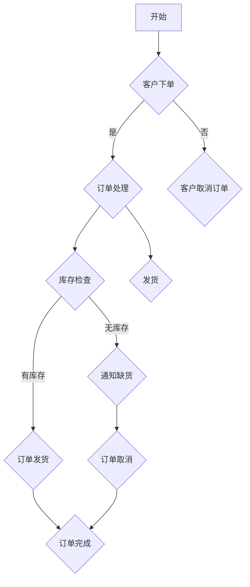

                 

# 《AI创业：项目的技术选择》

> 关键词：人工智能，创业，技术选型，深度学习，自然语言处理，机器学习，项目实战

> 摘要：
本文旨在为希望投身于人工智能创业领域的创业者提供一份全面的技术指南。通过对AI技术的概述、主要算法的讲解、项目开发实战的案例分析，以及持续创新的实践策略，帮助读者理清技术选择的思路，做出符合自身项目需求的技术决策。

## 目录

### 《AI创业：项目的技术选择》目录大纲

## 第一部分：AI创业背景与准备

### 第1章：AI创业概述

1.1 AI创业的机会与挑战

1.2 AI创业的必要准备

1.3 创业团队的构建与协作

### 第2章：AI项目规划

2.1 项目需求的明确

2.2 技术选型的策略

2.3 项目时间表与预算

## 第二部分：AI技术基础

### 第3章：AI技术概述

3.1 AI的核心概念

3.2 AI的技术体系

3.3 AI的应用场景

### 第4章：机器学习基础

4.1 机器学习的原理

4.2 机器学习的主要算法

4.3 机器学习的数据预处理

### 第5章：深度学习应用

5.1 深度学习的基础

5.2 深度学习的主要架构

5.3 深度学习在AI创业中的应用

### 第6章：自然语言处理

6.1 自然语言处理概述

6.2 语言模型与序列模型

6.3 NLP在AI创业中的应用

## 第三部分：技术选择与应用实战

### 第7章：AI项目技术选择策略

7.1 技术选型的考虑因素

7.2 常见AI技术的优缺点分析

7.3 技术选择的决策流程

### 第8章：AI项目开发实战

8.1 项目开发流程与工具

8.2 数据获取与处理

8.3 模型训练与调优

8.4 模型部署与维护

### 第9章：AI创业案例研究

9.1 案例一：智能客服系统

9.2 案例二：智能医疗诊断系统

9.3 案例三：智能推荐系统

### 第10章：AI创业的持续创新

10.1 创新的重要性

10.2 创新思维的培养

10.3 持续创新的实践策略

### 附录

### 附录A：AI开发工具与资源

### 附录B：Mermaid流程图与伪代码示例

### 附录C：数学公式与解释

### 附录D：AI创业相关法律法规

## 引言

人工智能（AI）作为21世纪最具前景的技术之一，已经深刻地改变了我们的生活。无论是智能客服、自动驾驶、还是智能医疗，AI技术都在各个领域展现出了强大的应用潜力。然而，对于想要投身于AI创业的创业者来说，技术选择无疑是一个极具挑战性的问题。选择适合自己项目的技术不仅关系到项目的成功与否，还直接影响到开发周期和成本。

本文将围绕AI创业中的技术选择展开，系统地介绍AI技术的核心概念、主要算法、技术选型的策略，并通过实战案例和持续创新策略的探讨，帮助读者在AI创业的道路上少走弯路，做出更明智的技术决策。

接下来，我们将首先回顾AI创业的背景与准备，探讨AI创业的机会与挑战，以及创业团队的构建和项目规划的重要性。随后，我们将深入探讨AI技术的基础，包括机器学习、深度学习和自然语言处理，为技术选择奠定坚实的理论基础。最后，我们将通过实战案例研究和技术选择策略的详细讲解，帮助读者理解如何在具体项目中做出合适的技术决策。通过这些内容，希望读者能够对AI创业有一个全面而深刻的理解，从而在未来的创业道路上更加自信和坚定。让我们一起开启这段探索之旅。 

## 第一部分：AI创业背景与准备

### 第1章：AI创业概述

### 1.1 AI创业的机会与挑战

#### 1.1.1 AI创业的机会

人工智能（AI）技术近年来取得了飞速发展，不仅在学术领域取得了重大突破，同时在商业应用中也展现了巨大的潜力。以下是一些推动AI创业的主要机会：

1. **技术创新**：深度学习、自然语言处理、计算机视觉等领域的突破，使得AI技术在各个行业都有了新的应用场景。
   
2. **市场潜力**：AI技术在医疗、金融、教育、零售等行业的应用正在逐步扩大，市场需求不断增加。

3. **政策支持**：全球范围内，各国政府都在积极推动AI技术的发展，提供资金支持、税收优惠等政策，为AI创业提供了良好的外部环境。

4. **投资热度**：随着AI技术的商业价值逐渐显现，风险投资和创业投资不断涌入，为AI创业提供了充足的资金支持。

#### 1.1.2 AI创业的挑战

尽管AI创业充满了机遇，但也面临着诸多挑战：

1. **技术复杂度**：AI技术涉及大量的算法、数据预处理和模型训练，对于创业团队的技术能力和知识储备提出了较高的要求。

2. **数据隐私和安全**：随着AI技术的应用，涉及大量个人数据的处理，数据隐私和安全成为重要的法律和伦理问题。

3. **市场竞争**：AI技术领域的竞争日益激烈，创业公司需要不断创新以保持竞争力。

4. **项目失败风险**：AI项目的开发周期长、成本高，且技术不确定性大，项目失败的风险较高。

#### 1.1.3 AI创业的关键成功因素

1. **团队能力**：拥有一支具备扎实技术背景和商业意识的团队是创业成功的关键。

2. **市场需求**：深入理解市场需求，找到解决实际问题的应用场景，是创业项目的立足点。

3. **技术创新**：持续的技术创新是保持竞争优势的核心。

4. **数据资源**：高质量的数据是AI模型训练的基础，拥有丰富的数据资源对于创业项目的成功至关重要。

5. **市场推广**：有效的市场推广策略能够帮助创业项目快速获得用户和市场认可。

### 1.2 AI创业的必要准备

#### 1.2.1 创业团队的构建

一个成功的AI创业团队需要具备多方面的能力，包括：

1. **技术专家**：包括深度学习、机器学习、自然语言处理等领域的专业人才。

2. **业务分析师**：负责市场调研、需求分析和业务策略的制定。

3. **产品经理**：负责产品规划、设计和管理，确保产品符合市场需求。

4. **数据科学家**：负责数据处理、特征工程和模型训练。

5. **开发工程师**：负责系统的开发和维护。

6. **市场营销人员**：负责市场推广、用户获取和品牌建设。

#### 1.2.2 市场调研与定位

成功的AI创业项目需要明确目标市场，进行深入的市场调研：

1. **目标市场**：确定项目的目标用户群体，了解其需求和行为习惯。

2. **竞争分析**：分析竞争对手的产品、优势和劣势，找到自己的市场定位。

3. **市场需求**：深入挖掘用户需求，确定产品功能和应用场景。

#### 1.2.3 商业模式规划

在创业初期，明确商业模式至关重要：

1. **收入来源**：确定主要的收入来源，如订阅费、广告收入、服务费等。

2. **成本结构**：分析项目的成本结构，包括人力成本、硬件成本、开发成本等。

3. **资金筹措**：根据成本结构制定资金筹措计划，如风险投资、众筹、银行贷款等。

4. **风险评估**：对项目进行风险评估，制定应对策略。

#### 1.2.4 法律法规和伦理问题

在AI创业过程中，需要关注法律法规和伦理问题：

1. **数据保护**：遵守数据保护法规，确保用户数据的隐私和安全。

2. **AI伦理**：遵循AI伦理标准，确保AI技术的应用符合道德规范。

3. **知识产权**：保护自己的知识产权，避免侵犯他人的知识产权。

#### 1.2.5 技术储备和人才培养

1. **技术储备**：根据项目需求，储备必要的技术知识和工具。

2. **人才培养**：通过培训、引进人才等方式，提升团队的技术能力和创新能力。

### 总结

AI创业虽然充满挑战，但机遇同样巨大。通过深入了解AI技术的发展趋势和市场机会，构建专业的创业团队，进行充分的市场调研和商业模式规划，创业者可以更好地把握AI创业的机会，实现创业目标。

### 第2章：AI项目规划

#### 2.1 项目需求的明确

明确项目需求是AI项目规划的第一步，也是最重要的一步。只有准确了解用户的需求和期望，才能设计出符合市场需求的解决方案。

1. **用户需求分析**：
   - 通过问卷调查、用户访谈、焦点小组等方法收集用户需求。
   - 分析用户的行为习惯、痛点、期望等，确定项目的核心功能和特性。

2. **市场调研**：
   - 分析目标市场的大小和潜力。
   - 确定竞争对手的产品特点、市场占有率、用户反馈等。

3. **功能需求**：
   - 列出项目的功能需求，包括核心功能和辅助功能。
   - 优先级排序，确定哪些功能是必须的，哪些是可选的。

4. **非功能需求**：
   - 确定项目的非功能需求，如性能、可靠性、安全性、可扩展性等。

#### 2.2 技术选型的策略

技术选型是项目规划的关键环节，直接影响到项目的开发周期、成本和稳定性。

1. **技术成熟度**：
   - 优先选择成熟稳定的技术，减少技术风险。
   - 关注新兴技术，评估其潜在价值和可行性。

2. **系统扩展性与灵活性**：
   - 确保系统能够随着业务需求的变化进行扩展和调整。
   - 选择具有良好扩展性和灵活性的技术架构。

3. **开发周期与成本**：
   - 考虑技术选型对开发周期和成本的影响。
   - 在性能、可靠性和成本之间找到平衡点。

4. **生态支持与社区活跃度**：
   - 选择社区活跃、文档丰富、有充足资源的开源技术。
   - 考虑技术社区的支持和后续维护。

#### 2.3 项目时间表与预算

合理的时间表和预算是确保项目按时按质完成的基础。

1. **时间表规划**：
   - 将项目划分为多个阶段，确定每个阶段的任务和里程碑。
   - 制定详细的时间表，考虑可能的延期和风险。

2. **预算制定**：
   - 分析项目的成本结构，包括人力成本、硬件成本、开发成本等。
   - 根据时间表和资源需求，制定合理的预算。

3. **风险管理**：
   - 识别项目风险，制定应对策略。
   - 预留一定的预算和人力，以应对意外情况。

### 总结

通过明确项目需求、合理的技术选型、科学的时间表和预算规划，创业者可以更好地把握项目方向，减少风险，提高项目成功率。有效的项目规划是AI创业成功的关键一步。

### 第3章：AI技术概述

#### 3.1 AI的核心概念

人工智能（AI）是指由计算机实现的智能行为，其目标是使机器能够执行通常需要人类智能的任务。AI的核心概念包括：

1. **机器学习**：机器学习是一种使计算机能够从数据中学习并改进性能的技术。主要分为监督学习、无监督学习和强化学习。

2. **深度学习**：深度学习是机器学习的一个子领域，它使用神经网络，尤其是深度神经网络，从大量数据中自动学习特征和模式。

3. **自然语言处理（NLP）**：自然语言处理是AI的一个分支，它专注于使计算机理解和生成人类语言。

4. **计算机视觉**：计算机视觉是指使计算机能够理解和解析视觉信息的技术，包括图像识别、物体检测等。

5. **强化学习**：强化学习是一种通过试错和反馈来学习最优策略的机器学习方法。

#### 3.2 AI的技术体系

AI的技术体系非常广泛，包括以下几个主要组成部分：

1. **机器学习**：
   - **监督学习**：输入和输出都已知，模型通过学习输入和输出之间的关系来预测未知数据。
   - **无监督学习**：输入数据没有标签，模型通过学习数据的内在结构来发现模式。
   - **半监督学习**：结合监督学习和无监督学习，利用部分标签数据训练模型。

2. **深度学习**：
   - **神经网络**：一种由大量神经元组成的计算模型，能够通过学习数据中的特征和模式来实现复杂函数的映射。
   - **卷积神经网络（CNN）**：特别适用于图像处理任务，通过卷积和池化操作提取图像特征。
   - **循环神经网络（RNN）**：适用于序列数据处理，能够捕获时间序列中的长期依赖关系。
   - **生成对抗网络（GAN）**：由生成器和判别器组成，能够生成逼真的数据。

3. **自然语言处理（NLP）**：
   - **语言模型**：用于预测下一个单词或词组的概率分布。
   - **词嵌入**：将单词映射到高维向量空间，以捕捉单词之间的语义关系。
   - **序列模型**：如RNN和Transformer，用于处理文本序列。

4. **计算机视觉**：
   - **图像识别**：识别图像中的物体或场景。
   - **目标检测**：定位图像中的物体并标注其位置。
   - **图像分割**：将图像划分为多个区域，每个区域表示不同的物体或背景。

5. **强化学习**：
   - **策略学习**：学习最优策略来最大化长期奖励。
   - **值函数学习**：学习状态或动作的价值函数。

#### 3.3 AI的应用场景

AI技术已经在多个领域得到了广泛应用，以下是一些典型的应用场景：

1. **医疗**：
   - 智能诊断、医学影像分析、疾病预测。
   - 如使用深度学习进行癌症诊断、CT扫描分析等。

2. **金融**：
   - 风险评估、信用评分、智能投顾。
   - 如利用机器学习进行欺诈检测、市场预测等。

3. **零售**：
   - 智能推荐系统、库存管理、需求预测。
   - 如使用深度学习进行个性化推荐、预测商品销售量等。

4. **交通**：
   - 智能交通系统、自动驾驶汽车。
   - 如使用计算机视觉进行交通信号识别、车辆检测等。

5. **教育**：
   - 个性化学习、智能评估、在线教育平台。
   - 如使用NLP进行学生问答系统、课程推荐等。

6. **制造业**：
   - 智能制造、质量检测、生产调度。
   - 如使用计算机视觉进行产品质量检测、生产线的自动化控制等。

通过了解AI的核心概念、技术体系和应用场景，创业者可以更好地把握AI技术的发展趋势，选择合适的技术进行项目开发。下一章我们将深入探讨机器学习的基础，为技术选择提供更详细的理论依据。

### 第4章：机器学习基础

#### 4.1 机器学习的原理

机器学习（Machine Learning，ML）是人工智能（AI）的一个重要分支，主要研究如何让计算机系统从数据中学习，并作出智能决策。其基本原理可以概括为以下几个步骤：

1. **数据收集**：机器学习首先需要大量的数据作为训练材料。这些数据可以是结构化的（如数据库中的表格）、半结构化的（如日志文件）或非结构化的（如图像、文本和声音）。

2. **数据预处理**：收集到的数据往往需要进行清洗和预处理，以消除噪声、缺失值和异常值，同时将数据转换为适合机器学习的格式。

3. **模型选择**：根据问题的性质和需求，选择合适的机器学习模型。常见的模型包括线性回归、决策树、支持向量机、神经网络等。

4. **训练**：使用预处理后的数据对选定的模型进行训练。在训练过程中，模型通过不断调整内部参数，以最小化损失函数，达到拟合数据的目的。

5. **验证**：在验证阶段，使用一部分未参与训练的数据对模型的性能进行评估。常用的验证方法有交叉验证和留出法。

6. **测试**：使用独立于训练和验证的数据对模型进行最终测试，以评估模型的泛化能力。

7. **应用**：将训练好的模型应用于实际问题中，进行预测或决策。

#### 4.2 机器学习的主要算法

机器学习算法可以分为监督学习、无监督学习和半监督学习等几种类型。以下是几种常见的机器学习算法：

1. **线性回归**：
   - 线性回归是一种用于预测连续值的简单算法。其模型假设数据之间存在线性关系。
   - 公式：\( y = \beta_0 + \beta_1x \)
   - 伪代码：
     ```python
     # 伪代码：线性回归模型
     initialize parameters
     for each epoch:
         compute predictions
         compute loss
         update parameters
     ```

2. **逻辑回归**：
   - 逻辑回归是一种用于分类的算法，通过线性模型输出一个介于0和1之间的概率，然后使用阈值（如0.5）进行分类。
   - 公式：\( P(y=1) = \frac{1}{1 + e^{-(\beta_0 + \beta_1x)}} \)
   - 伪代码：
     ```python
     # 伪代码：逻辑回归模型
     initialize parameters
     for each epoch:
         compute predictions
         compute loss (log loss)
         update parameters
     ```

3. **决策树**：
   - 决策树通过一系列的决策规则对数据进行分类或回归。每个内部节点代表一个特征，每个分支代表该特征的取值。
   - 公式：决策规则基于特征和阈值。
   - 伪代码：
     ```python
     # 伪代码：决策树生成
     if feature_value == threshold:
         go to left child
     else:
         go to right child
     ```

4. **支持向量机（SVM）**：
   - 支持向量机是一种强大的分类算法，通过找到最优分隔超平面，最大化分类边界。
   - 公式：\( w \cdot x + b = 0 \)
   - 伪代码：
     ```python
     # 伪代码：SVM模型训练
     find the hyperplane that maximizes the margin
     for each misclassified point:
         update the model parameters
     ```

5. **神经网络**：
   - 神经网络是一种由大量神经元组成的计算模型，能够通过学习复杂函数。
   - 公式：\( a_{i}(t+1) = \sigma(\sum_{j} w_{ij}a_{j}(t) + b_{i}) \)
   - 伪代码：
     ```python
     # 伪代码：前向传播
     for each layer:
         compute the output using the activation function
     # 伪代码：反向传播
     compute the gradient of the loss function
     update the model parameters
     ```

#### 4.3 机器学习的数据预处理

数据预处理是机器学习过程中至关重要的一步，它能够显著提高模型的性能。以下是一些常见的数据预处理技术：

1. **数据清洗**：
   - 删除重复数据、处理缺失值、去除噪声。
   - 伪代码：
     ```python
     # 伪代码：数据清洗
     for each record:
         if record is missing:
             fill missing value
         if record is noisy:
             remove record
     ```

2. **特征工程**：
   - 特征选择：选择对预测任务最有影响力的特征。
   - 特征构造：创建新的特征，以提高模型的预测能力。
   - 伪代码：
     ```python
     # 伪代码：特征选择
     compute the importance of each feature
     select the top k features
     # 伪代码：特征构造
     create new features based on existing features
     ```

3. **数据标准化**：
   - 将数据缩放到统一的范围，如[0, 1]或[-1, 1]，以避免不同特征之间的尺度差异对模型训练的影响。
   - 伪代码：
     ```python
     # 伪代码：数据标准化
     for each feature:
         subtract the mean and divide by the standard deviation
     ```

4. **数据分割**：
   - 将数据集划分为训练集、验证集和测试集，用于模型的训练、验证和测试。
   - 伪代码：
     ```python
     # 伪代码：数据分割
     shuffle the dataset
     split the dataset into train, validation, and test sets
     ```

通过合理的预处理，可以提高数据的利用效率，减少噪声对模型的影响，从而提高模型的准确性和稳定性。下一章我们将深入探讨深度学习的基础，进一步了解AI技术的进步。

### 第5章：深度学习应用

#### 5.1 深度学习的基础

深度学习（Deep Learning，DL）是机器学习的一个子领域，它依赖于多层神经网络（Deep Neural Networks，DNN）来从大量数据中自动学习特征和模式。深度学习在图像识别、自然语言处理、语音识别等领域取得了显著的成果，以下是深度学习的一些基础概念：

1. **神经元与层结构**：
   - 深度学习模型由多层神经元组成，每层神经元都接受前一层的输出，并传递到下一层。
   - 模型通常包括输入层、隐藏层和输出层。
   - 输入层接收原始数据，输出层产生预测结果。

2. **激活函数**：
   - 激活函数用于引入非线性，使模型能够学习更复杂的函数关系。
   - 常见的激活函数有Sigmoid、ReLU、Tanh等。

3. **前向传播与反向传播**：
   - **前向传播**：将输入数据通过模型的前向传递，经过每一层神经元的计算，得到输出结果。
   - **反向传播**：计算输出结果与真实值之间的误差，然后通过反向传递更新模型参数。

4. **损失函数**：
   - 损失函数用于衡量预测结果与真实值之间的差异，常用的有均方误差（MSE）、交叉熵等。

5. **优化算法**：
   - 优化算法用于调整模型参数，以最小化损失函数。常用的优化算法有随机梯度下降（SGD）、Adam等。

#### 5.2 深度学习的主要架构

深度学习模型有多种架构，以下介绍几种主要的架构：

1. **卷积神经网络（CNN）**：
   - **卷积层**：通过卷积操作提取图像的特征。
   - **池化层**：降低特征图的维度，减少计算量。
   - **全连接层**：将特征映射到输出。
   - **架构示例**：
     ```mermaid
     graph TD
     A[输入] --> B[卷积层]
     B --> C[池化层]
     C --> D[卷积层]
     D --> E[池化层]
     E --> F[全连接层]
     F --> G[输出]
     ```

2. **循环神经网络（RNN）**：
   - **隐藏状态**：RNN通过隐藏状态捕获序列中的长期依赖关系。
   - **门控机制**：如LSTM和GRU，通过门控机制控制信息的流动。
   - **架构示例**：
     ```mermaid
     graph TD
     A[输入序列] --> B[隐藏状态]
     B --> C[门控层]
     C --> D[隐藏状态更新]
     D --> E[输出序列]
     ```

3. **生成对抗网络（GAN）**：
   - **生成器**：生成虚假数据，试图欺骗判别器。
   - **判别器**：判断数据是真实还是虚假。
   - **架构示例**：
     ```mermaid
     graph TD
     A[噪声] --> B[生成器]
     B --> C[生成数据]
     C --> D[判别器]
     D --> E[判别结果]
     ```

#### 5.3 深度学习在AI创业中的应用

深度学习在AI创业中有着广泛的应用，以下是一些具体的应用场景：

1. **图像识别**：
   - **对象检测**：使用CNN对图像中的对象进行定位和识别。
   - **图像分类**：将图像分为不同的类别。
   - **应用案例**：智能监控、医疗影像分析。

2. **自然语言处理**：
   - **文本分类**：对文本进行分类，如情感分析、垃圾邮件过滤。
   - **机器翻译**：利用神经机器翻译模型进行语言之间的翻译。
   - **应用案例**：智能客服、在线翻译。

3. **语音识别**：
   - **语音到文本**：将语音信号转换为文本。
   - **语音合成**：将文本转换为自然流畅的语音。
   - **应用案例**：智能助手、自动语音应答系统。

4. **推荐系统**：
   - **协同过滤**：基于用户的历史行为进行推荐。
   - **基于内容的推荐**：根据物品的特征进行推荐。
   - **深度学习结合**：使用深度学习模型进行特征提取和模型优化。
   - **应用案例**：电子商务推荐、视频推荐。

通过深入了解深度学习的基础和主要架构，创业者可以更好地选择适合自己项目的深度学习技术，为AI创业奠定坚实的基础。下一章我们将探讨自然语言处理（NLP）的基础和应用。

### 第6章：自然语言处理

#### 6.1 自然语言处理概述

自然语言处理（Natural Language Processing，NLP）是人工智能（AI）的一个重要分支，旨在使计算机能够理解、解释和生成人类语言。NLP技术在信息检索、机器翻译、语音识别、情感分析等多个领域有着广泛的应用。以下是NLP的核心概念和组成部分：

1. **语言模型**：
   - 语言模型是一种统计模型，用于预测下一个单词或词组的概率。它是NLP的基础，广泛应用于自动完成、语音识别和机器翻译等领域。

2. **词嵌入（Word Embedding）**：
   - 词嵌入是将单词映射到高维向量空间的技术，以捕捉单词之间的语义关系。常见的词嵌入方法包括Word2Vec、GloVe和BERT。

3. **词性标注（Part-of-Speech Tagging）**：
   - 词性标注是对文本中的每个单词进行词性分类，如名词、动词、形容词等。这有助于理解句子的结构和语义。

4. **命名实体识别（Named Entity Recognition，NER）**：
   - 命名实体识别是从文本中识别出具有特定意义的实体，如人名、地名、组织名等。NER在信息提取、文本分类和知识图谱构建中具有重要意义。

5. **句法分析（Syntactic Parsing）**：
   - 句法分析是对句子结构进行解析，构建句法树或依存关系图。这有助于理解句子的语义和逻辑结构。

6. **语义分析（Semantic Analysis）**：
   - 语义分析是理解和解释文本中的语义含义，包括情感分析、情感极性分类和语义角色标注等。

7. **文本生成（Text Generation）**：
   - 文本生成是指利用模型自动生成文本，包括问答系统、摘要生成和文章写作等。常见的生成方法有基于规则的方法、统计模型和神经网络生成模型。

#### 6.2 语言模型与序列模型

语言模型是NLP的核心组成部分，用于预测文本序列中的下一个词或词组。以下是两种常见的语言模型：

1. **n-gram模型**：
   - n-gram模型是一种基于统计的简单语言模型，它通过计算前n个单词的联合概率来预测下一个单词。
   - 公式：\( P(w_{t} | w_{t-1}, w_{t-2}, \ldots, w_{t-n}) = \frac{C(w_{t-1}, w_{t-2}, \ldots, w_{t-n}, w_{t})}{C(w_{t-1}, w_{t-2}, \ldots, w_{t-n})} \)
   - 伪代码：
     ```python
     # 伪代码：n-gram模型
     for each word w_t in the text:
         calculate the probability of w_t using the n-gram table
         select the next word based on the highest probability
     ```

2. **序列模型（Sequence Model）**：
   - 序列模型是一种基于神经网络的复杂语言模型，能够捕捉长期依赖关系和上下文信息。常见的序列模型包括循环神经网络（RNN）、长短期记忆网络（LSTM）和变换器（Transformer）。

   - **RNN**：
     - RNN通过隐藏状态来捕获序列中的长期依赖关系。
     - 公式：\( h_t = \sigma(W_h \cdot [h_{t-1}, x_t] + b_h) \)
     - 伪代码：
       ```python
       # 伪代码：RNN
       initialize hidden state
       for each word x_t in the text:
           compute the hidden state
           use the hidden state to predict the next word
       ```

   - **LSTM**：
     - LSTM是RNN的一种改进，能够更好地处理长期依赖关系。
     - 公式：\( C_t = \sigma(f_t \odot \text{forget gate} + i_t \odot \text{input gate} + C_{t-1} \odot \text{cell state}) \)
     - 伪代码：
       ```python
       # 伪代码：LSTM
       initialize cell state and hidden state
       for each word x_t in the text:
           compute the input gate, forget gate, and output gate
           update the cell state and hidden state
           use the hidden state to predict the next word
       ```

   - **Transformer**：
     - Transformer是一种基于自注意力机制的序列模型，能够在处理长序列时保持高效的计算性能。
     - 公式：\( \text{Attention}(Q, K, V) = \text{softmax}(\frac{QK^T}{\sqrt{d_k}})V \)
     - 伪代码：
       ```python
       # 伪代码：Transformer
       for each word x_t in the text:
           compute the query, key, and value vectors
           compute the attention scores
           compute the weighted sum of the value vectors
           use the output to predict the next word
       ```

通过语言模型和序列模型，NLP系统可以更好地理解和生成自然语言。这些模型在AI创业中的应用，如聊天机器人、智能客服、文本分类等，能够显著提升用户体验和业务效率。

#### 6.3 NLP在AI创业中的应用

NLP技术在AI创业中有着广泛的应用，以下是一些具体的例子：

1. **智能客服系统**：
   - 利用NLP技术实现自然语言理解，使机器人能够与用户进行流畅的对话。
   - 应用场景：在线客服、客户支持、自动回帖等。

2. **情感分析**：
   - 通过情感分析模型，对用户评论、反馈进行情感分类，了解用户态度和满意度。
   - 应用场景：市场调研、客户服务、社交媒体分析。

3. **机器翻译**：
   - 利用神经机器翻译模型，实现跨语言信息的自动翻译。
   - 应用场景：跨国电子商务、全球化的企业沟通、多语言网站。

4. **文本分类**：
   - 对大量文本进行分类，如新闻分类、邮件分类、文本审核等。
   - 应用场景：信息检索、内容审核、搜索引擎。

5. **问答系统**：
   - 利用问答模型，为用户提供快速、准确的答案。
   - 应用场景：智能助手、在线教育、知识库查询。

通过NLP技术的应用，AI创业项目可以更好地理解和处理自然语言，为用户提供智能化的服务，提高业务效率和用户满意度。下一章我们将探讨如何进行AI项目的技术选择。

### 第7章：AI项目技术选择策略

#### 7.1 技术选型的考虑因素

在AI项目的技术选择过程中，需要综合考虑多个因素，以确保选定的技术能够满足项目需求、符合预算，并具备良好的扩展性和稳定性。以下是技术选型时需要考虑的主要因素：

1. **项目需求**：
   - **功能需求**：明确项目的核心功能，如分类、预测、文本生成等。
   - **非功能需求**：考虑系统的性能、可靠性、可扩展性、安全性等要求。

2. **技术成熟度**：
   - **成熟度**：选择成熟稳定的技术，降低项目风险。
   - **新兴技术**：关注新兴技术，评估其潜力和可行性。

3. **开发周期与成本**：
   - **开发周期**：考虑技术选型对项目开发周期的影响。
   - **成本**：评估技术选型对项目成本的影响，包括人力、硬件和软件成本。

4. **数据资源**：
   - **数据量**：评估所需数据量，以及获取和处理数据的难易程度。
   - **数据质量**：考虑数据质量对模型性能的影响。

5. **生态支持与社区活跃度**：
   - **工具与库**：选择有良好生态支持的工具和库，便于开发与维护。
   - **社区活跃度**：评估技术社区的活跃度，有利于问题解决和知识共享。

6. **技术演进**：
   - **兼容性**：考虑技术的未来演进，确保技术架构的灵活性和可扩展性。
   - **维护与升级**：评估技术的维护和升级策略，确保长期稳定性。

#### 7.2 常见AI技术的优缺点分析

在AI项目的技术选择过程中，对常见AI技术进行优缺点分析是至关重要的。以下是几种常见AI技术的优缺点分析：

1. **机器学习**：
   - **优点**：
     - **通用性强**：适用于多种类型的预测和分类任务。
     - **灵活性高**：可以根据具体需求调整模型结构和参数。
   - **缺点**：
     - **计算复杂度高**：训练时间较长，对计算资源要求较高。
     - **需要大量数据**：通常需要大量标注数据来训练模型。

2. **深度学习**：
   - **优点**：
     - **性能优越**：在图像识别、语音识别等领域表现出色。
     - **自动特征提取**：能够自动学习数据中的复杂特征。
   - **缺点**：
     - **计算资源需求高**：训练和部署深度学习模型需要大量计算资源和时间。
     - **数据需求量大**：深度学习模型通常需要大量高质量的数据。

3. **自然语言处理（NLP）**：
   - **优点**：
     - **语义理解能力强**：能够理解文本中的语义和情感。
     - **应用广泛**：在文本分类、情感分析、机器翻译等领域有广泛应用。
   - **缺点**：
     - **数据预处理复杂**：NLP任务通常需要复杂的文本预处理步骤。
     - **模型调优困难**：NLP模型的调优过程复杂，需要大量时间和计算资源。

#### 7.3 技术选择的决策流程

技术选择的决策流程是确保技术选型过程有序、科学和系统化的关键。以下是技术选择的决策流程：

1. **需求分析**：
   - 明确项目的功能需求和性能需求。
   - 分析目标市场和应用场景。

2. **技术调研**：
   - 调研和评估不同技术方案的优缺点。
   - 了解各技术的成熟度、生态支持和社区活跃度。

3. **技术评估**：
   - 设计实验，评估各技术的性能和适用性。
   - 根据实验结果，筛选出合适的技术方案。

4. **决策**：
   - 根据项目需求、技术评估结果和预算，做出最终的技术选择决策。

5. **执行与跟踪**：
   - 实施技术选择决策，监控技术实施过程和效果。
   - 根据实际情况调整技术方案，确保项目成功实施。

通过明确项目需求、全面分析技术优缺点，并遵循科学的决策流程，创业者可以做出适合自身项目的技术选择，为AI创业的成功奠定基础。下一章我们将通过实战案例，深入探讨AI项目开发的具体过程。

### 第8章：AI项目开发实战

#### 8.1 项目开发流程与工具

在AI项目开发中，遵循科学的流程和选择合适的工具是确保项目成功的关键。以下是一个典型的AI项目开发流程及其使用的工具：

1. **需求分析**：
   - **工具**：可以使用文档工具如Google Docs或Confluence来记录和整理需求。
   - **方法**：通过用户访谈、问卷调查和市场调研来收集需求，并编写需求文档。

2. **数据收集与处理**：
   - **工具**：使用数据收集工具如Kafka或Flume来收集实时数据。
   - **方法**：对收集到的数据进行清洗、去噪和预处理，使用Python的Pandas库或PySpark进行数据处理。

3. **模型设计**：
   - **工具**：使用绘图工具如Mermaid来设计模型架构，使用Jupyter Notebook进行实验。
   - **方法**：确定模型架构，选择合适的算法和框架，如TensorFlow或PyTorch。

4. **模型训练**：
   - **工具**：使用深度学习框架如TensorFlow或PyTorch进行模型训练。
   - **方法**：编写训练脚本，设置训练参数，监控训练过程，使用GPU加速训练。

5. **模型评估**：
   - **工具**：使用评估工具如Matplotlib或Seaborn来可视化评估结果，使用Scikit-learn进行模型性能评估。
   - **方法**：评估模型在验证集和测试集上的性能，调整模型参数以达到最佳效果。

6. **模型部署**：
   - **工具**：使用部署工具如Docker和Kubernetes来部署模型，使用Flask或FastAPI来创建API接口。
   - **方法**：将训练好的模型部署到生产环境中，确保模型的高可用性和性能。

7. **监控与维护**：
   - **工具**：使用监控工具如Prometheus和Grafana来监控模型性能和系统资源。
   - **方法**：定期更新和维护模型，监控系统运行状况，确保系统的稳定性和可靠性。

#### 8.2 数据获取与处理

数据获取与处理是AI项目开发的基础环节，其质量直接影响到模型的性能。以下是如何进行数据获取与处理的详细步骤：

1. **数据来源**：
   - **内部数据**：从公司的数据库或日志文件中获取。
   - **外部数据**：从公共数据集、第三方数据提供商或API中获取。

2. **数据清洗**：
   - **缺失值处理**：使用均值、中位数或插值法填充缺失值。
   - **异常值处理**：使用统计学方法或基于业务规则的方法识别和去除异常值。
   - **数据转换**：将不同数据格式转换为统一的格式，如CSV或Parquet。

3. **特征工程**：
   - **特征构造**：创建新的特征，如时间序列的特征、文本特征等。
   - **特征选择**：使用筛选方法、模型选择方法或基于业务的方法选择最重要的特征。

4. **数据分割**：
   - **训练集与测试集**：将数据集划分为训练集和测试集，以评估模型的泛化能力。
   - **交叉验证**：使用交叉验证方法评估模型的性能，提高模型的鲁棒性。

5. **数据标准化**：
   - **归一化**：将数据缩放到统一的范围，如[0, 1]或[-1, 1]。
   - **标准化**：计算数据的均值和标准差，将数据缩放到均值0和标准差1。

6. **数据预处理脚本**：
   - **Python脚本**：编写Python脚本进行数据清洗、预处理和分割，使用Pandas或Scikit-learn库。

通过科学的数据获取与处理步骤，可以确保数据质量，提高模型训练的效果。下一节我们将深入探讨模型训练与调优的具体过程。

#### 8.3 模型训练与调优

在AI项目开发中，模型训练与调优是确保模型性能的关键环节。以下是如何进行模型训练与调优的详细步骤：

1. **模型训练**：
   - **初始化参数**：设置模型的初始参数，如学习率、批次大小等。
   - **训练过程**：
     - **前向传播**：将输入数据传递到模型中，计算预测输出和损失函数。
     - **反向传播**：计算损失函数关于模型参数的梯度，更新模型参数。
     - **迭代**：重复前向传播和反向传播，直到满足训练条件或达到预设的训练次数。

2. **调优方法**：
   - **参数调整**：调整学习率、批次大小、正则化参数等，以优化模型性能。
   - **优化算法**：选择合适的优化算法，如随机梯度下降（SGD）、Adam等，以加快收敛速度和提高模型性能。

3. **超参数搜索**：
   - **网格搜索**：在给定范围内枚举所有可能的超参数组合，找到最优参数组合。
   - **贝叶斯优化**：使用贝叶斯统计模型搜索最优超参数，提高搜索效率。

4. **正则化技术**：
   - **L1正则化**：在损失函数中添加L1范数，防止模型过拟合。
   - **L2正则化**：在损失函数中添加L2范数，同样用于防止过拟合。

5. **数据增强**：
   - **随机裁剪**：随机裁剪图像，增加数据多样性。
   - **翻转**：水平翻转或垂直翻转图像，增加数据多样性。
   - **旋转**：随机旋转图像，增加数据多样性。

6. **交叉验证**：
   - **K折交叉验证**：将数据集划分为K个子集，每次使用一个子集作为验证集，其余作为训练集，进行K次训练和验证，取平均性能作为最终评估指标。

7. **模型评估**：
   - **准确率**：模型预测正确的样本数占总样本数的比例。
   - **召回率**：模型预测正确的正样本数占总正样本数的比例。
   - **F1分数**：准确率和召回率的调和平均数，综合考虑精确度和召回率。

8. **调优工具**：
   - **自动化调优工具**：如Hyperopt、Optuna等，用于自动化搜索最优超参数。
   - **可视化工具**：如TensorBoard、Matplotlib等，用于可视化训练过程和评估结果。

通过科学的模型训练与调优方法，可以确保模型的性能达到预期，减少过拟合和欠拟合的风险。下一节我们将讨论模型部署与维护的具体步骤。

#### 8.4 模型部署与维护

在AI项目开发中，模型部署与维护是确保模型能够持续、稳定地服务于实际业务的关键环节。以下是如何进行模型部署与维护的详细步骤：

1. **模型封装**：
   - 将训练好的模型封装为一个可执行的模块，便于部署和维护。
   - 可以使用Python的Flask或FastAPI框架创建API接口，接收输入并返回预测结果。

2. **环境配置**：
   - 配置模型运行的环境，包括操作系统、Python版本、深度学习框架等。
   - 使用Docker容器化技术，确保环境的一致性和可移植性。

3. **部署平台选择**：
   - 根据项目需求和预算，选择合适的部署平台，如本地服务器、云服务器或容器编排平台。
   - 使用Kubernetes进行容器编排，实现自动化部署和管理。

4. **模型监控**：
   - 监控模型性能和系统资源使用情况，确保模型的高可用性和稳定性。
   - 使用Prometheus和Grafana等监控工具，实时监控模型性能指标，如预测准确率、响应时间等。

5. **日志管理**：
   - 记录模型运行日志，便于故障排查和性能优化。
   - 使用ELK（Elasticsearch、Logstash、Kibana）堆栈进行日志管理和分析。

6. **维护策略**：
   - 定期更新和维护模型，以应对业务需求的变化和数据分布的漂移。
   - 根据监控数据，调整模型参数和算法，提高模型性能和适应性。

7. **版本管理**：
   - 对模型的版本进行管理，确保不同版本之间的可回溯性和可维护性。
   - 使用Git等版本控制系统，管理模型的代码和配置文件。

8. **故障恢复**：
   - 制定故障恢复策略，确保在系统出现故障时能够快速恢复，减少对业务的影响。
   - 使用备份和冗余机制，确保数据的安全和模型的可靠性。

通过科学的模型部署与维护策略，可以确保AI项目的高效、稳定运行，为业务的持续发展提供支持。下一节我们将通过具体案例，展示如何将AI技术应用于实际创业项目中。

### 第9章：AI创业案例研究

#### 9.1 案例一：智能客服系统

##### 9.1.1 项目背景

随着互联网的发展，客服系统已成为企业与用户沟通的重要渠道。然而，传统的人工客服存在响应慢、效率低的问题。为了提高客服效率，降低人力成本，许多企业开始尝试引入智能客服系统。

智能客服系统旨在通过自然语言处理和机器学习技术，实现自动化客户服务。系统可以实时解答用户问题，处理常见问题，并引导用户至合适的客服人员。

##### 9.1.2 技术选型

1. **自然语言处理（NLP）**：
   - **语言模型**：使用Transformer模型，如BERT，进行文本生成和语义理解。
   - **词嵌入**：使用预训练的词嵌入模型，如GloVe，提高语义表示的准确性。

2. **机器学习**：
   - **分类算法**：使用深度学习框架TensorFlow和Keras，实现文本分类和意图识别。
   - **序列模型**：使用LSTM和GRU模型，处理长文本序列。

3. **对话管理**：
   - **对话策略**：采用规则基方法，结合机器学习模型，实现对话策略的生成和优化。

##### 9.1.3 开发过程

1. **数据收集与处理**：
   - 收集大量客服对话数据，进行数据清洗和预处理，提取有效信息。
   - 划分训练集、验证集和测试集，用于模型训练和评估。

2. **模型训练**：
   - 使用TensorFlow和Keras，训练文本分类模型和对话策略模型。
   - 调整模型参数，优化模型性能。

3. **对话生成与优化**：
   - 使用LSTM和GRU模型，生成自然流畅的对话文本。
   - 结合用户反馈和业务需求，不断优化对话策略。

##### 9.1.4 项目成果

1. **效率提升**：
   - 智能客服系统可以处理大量用户请求，显著降低人工客服的工作量。

2. **用户体验**：
   - 系统可以提供快速、准确的回答，提高用户满意度。

3. **成本降低**：
   - 降低企业的人力成本，提高运营效率。

#### 9.2 案例二：智能医疗诊断系统

##### 9.2.1 项目背景

医疗行业正面临日益严峻的挑战，如医疗资源分配不均、诊断错误率高等。为了提高诊断准确率，降低误诊率，许多医疗机构开始尝试引入智能医疗诊断系统。

智能医疗诊断系统旨在通过深度学习和计算机视觉技术，辅助医生进行疾病诊断。系统可以对医学影像进行分析，提供辅助诊断建议，提高诊断准确性。

##### 9.2.2 技术选型

1. **深度学习**：
   - **卷积神经网络（CNN）**：用于处理医学影像数据，提取图像特征。
   - **迁移学习**：利用预训练的CNN模型，提高模型在小样本数据集上的性能。

2. **计算机视觉**：
   - **图像分割**：用于分割医学影像中的病变区域。
   - **物体检测**：用于识别医学影像中的特定物体或病变。

##### 9.2.3 开发过程

1. **数据收集与处理**：
   - 收集大量医学影像数据，进行标注和预处理，提取有效信息。
   - 划分训练集、验证集和测试集，用于模型训练和评估。

2. **模型训练**：
   - 使用TensorFlow和Keras，训练CNN模型，提取图像特征。
   - 使用迁移学习技术，提高模型在小样本数据集上的性能。

3. **辅助诊断**：
   - 结合医学知识库和诊断模型，生成辅助诊断建议。

##### 9.2.4 项目成果

1. **诊断准确率提升**：
   - 系统可以提高诊断准确率，降低误诊率。

2. **医疗资源优化**：
   - 辅助医生快速、准确地进行诊断，优化医疗资源配置。

3. **用户体验**：
   - 系统可以提供快速、准确的诊断建议，提高患者满意度。

#### 9.3 案例三：智能推荐系统

##### 9.3.1 项目背景

随着电商和流媒体行业的快速发展，个性化推荐系统成为提升用户体验和增加用户粘性的关键因素。智能推荐系统旨在通过机器学习和深度学习技术，为用户提供个性化的推荐。

智能推荐系统旨在通过分析用户行为和历史数据，为用户推荐感兴趣的商品、视频或其他内容。

##### 9.3.2 技术选型

1. **协同过滤**：
   - **用户基于的协同过滤**：根据用户的相似度进行推荐。
   - **物品基于的协同过滤**：根据物品的相似度进行推荐。

2. **深度学习**：
   - **序列模型**：用于处理用户行为序列，捕捉用户兴趣的变化。
   - **生成对抗网络（GAN）**：用于生成虚假用户行为数据，提高推荐系统的多样性。

##### 9.3.3 开发过程

1. **数据收集与处理**：
   - 收集用户行为数据，包括浏览记录、购买记录、评论等，进行数据清洗和预处理。

2. **模型训练**：
   - 使用TensorFlow和Keras，训练协同过滤模型和深度学习模型。
   - 调整模型参数，优化推荐效果。

3. **推荐生成与优化**：
   - 结合用户行为和模型预测，生成个性化推荐列表。
   - 根据用户反馈，不断优化推荐算法。

##### 9.3.4 项目成果

1. **用户体验**：
   - 提高用户满意度，增加用户粘性。

2. **业务增长**：
   - 提高用户转化率，增加销售额和用户参与度。

3. **运营效率**：
   - 减少人工推荐的工作量，提高运营效率。

通过这些案例研究，我们可以看到AI技术在不同领域的广泛应用和巨大潜力。AI创业不仅需要技术的创新，还需要对市场需求的深刻理解，以及科学的项目管理和实施策略。下一章我们将探讨如何通过持续创新，推动AI创业的发展。

### 第10章：AI创业的持续创新

#### 10.1 创新的重要性

在AI创业中，创新是推动企业发展的核心动力。创新不仅能够带来新的商业模式、产品和服务，还可以帮助企业保持竞争力，抢占市场份额。以下是创新在AI创业中的几个重要方面：

1. **技术进步**：
   - 创新推动技术的不断进步，使企业能够采用更先进、更高效的算法和架构。
   - 通过技术创新，企业可以提供独特的产品和服务，满足客户多样化的需求。

2. **商业模式**：
   - 创新商业模式，可以帮助企业更好地定位市场，优化资源配置，提高运营效率。
   - 通过创新的商业模式，企业可以创造新的收入来源，实现可持续发展。

3. **用户体验**：
   - 创新能够提升用户体验，增加用户粘性，提高客户满意度。
   - 优秀的用户体验是吸引和留住客户的关键，对于AI创业尤为重要。

4. **市场竞争**：
   - 创新能够帮助企业抢占市场先机，应对激烈的市场竞争。
   - 通过持续创新，企业可以不断优化产品和服务，保持竞争优势。

5. **社会责任**：
   - 创新还能够推动企业在社会责任方面的进步，如通过AI技术解决社会问题，促进可持续发展。

#### 10.2 创新思维的培养

培养创新思维是AI创业成功的关键。以下是一些有效的方法和策略：

1. **思维导图**：
   - 使用思维导图工具，如MindManager或Xmind，梳理创新思路。
   - 通过可视化工具，将创新想法和关联关系进行结构化表达。

2. **头脑风暴**：
   - 组织团队进行头脑风暴，鼓励成员提出新的想法和解决方案。
   - 通过自由讨论和观点碰撞，激发创新思维。

3. **设计思维**：
   - 设计思维是一种以用户为中心的创新方法，强调用户体验和问题解决。
   - 通过原型设计和迭代，不断优化产品和服务。

4. **跨界合作**：
   - 与其他领域的专家和公司进行合作，跨界思维可以带来新的视角和创意。
   - 通过合作，企业可以共享资源和知识，共同推动创新。

5. **持续学习**：
   - 鼓励团队成员持续学习，关注行业动态和技术趋势。
   - 通过培训和学习，提升团队的技术水平和创新能力。

#### 10.3 持续创新的实践策略

为了实现持续创新，企业需要建立一套有效的实践策略。以下是一些具体的策略：

1. **创新文化建设**：
   - 建立鼓励创新的企业文化，营造宽松的氛围，让员工敢于尝试和失败。
   - 通过奖励机制，激励员工积极参与创新项目。

2. **研发投入**：
   - 设立专项研发基金，支持创新项目的研发。
   - 通过持续的研发投入，确保技术的领先性和产品的竞争力。

3. **项目孵化**：
   - 建立创新孵化机制，为创新项目提供必要的资源和支持。
   - 通过孵化项目，不断探索和验证新的商业模式和产品。

4. **开放合作**：
   - 与外部企业和研究机构建立合作关系，共享资源和知识。
   - 通过合作，加速创新进程，提高创新能力。

5. **持续迭代**：
   - 定期评估和迭代产品和服务，不断优化用户体验。
   - 通过迭代，及时解决用户反馈的问题，持续提升产品价值。

通过创新思维的培养和实践策略的落地，AI创业企业可以持续推动技术进步和商业模式创新，保持市场竞争优势，实现可持续发展。下一章我们将总结全文，并给出进一步的资源推荐。

### 总结

在AI创业的道路上，技术选择无疑是一个至关重要的环节。本文系统地介绍了AI技术的核心概念、主要算法、技术选型的策略，并通过实战案例和持续创新策略的探讨，帮助读者在AI创业的技术选择中找到方向。从明确项目需求，到进行市场调研和技术评估，再到具体的技术实现和部署，每一步都需要精心策划和科学决策。

首先，明确项目需求是项目成功的基础，只有深入了解用户需求，才能设计出真正符合市场需求的解决方案。其次，技术选型需要综合考虑技术成熟度、开发周期与成本、数据资源、生态支持等因素，确保所选技术既能满足项目需求，又能保持高效的开发和维护。

在AI技术基础部分，我们详细讲解了机器学习、深度学习和自然语言处理等核心技术的原理和应用，并通过伪代码和流程图展示了技术的具体实现。这些内容为技术选型提供了坚实的理论基础。

在实战案例研究中，我们通过智能客服系统、智能医疗诊断系统和智能推荐系统的案例，展示了如何将AI技术应用于实际创业项目中，并讨论了项目开发的具体过程和技术实现。

最后，我们探讨了如何通过持续创新，推动AI创业的发展。创新不仅是技术进步的驱动，也是商业模式和用户体验的提升。通过培养创新思维和实施有效的创新策略，企业可以持续保持竞争力，实现可持续发展。

为了帮助读者进一步深入了解AI技术和创业实践，本文提供了以下资源推荐：

- **AI开发工具与资源**：推荐常用的机器学习框架（如TensorFlow、PyTorch）、自然语言处理工具（如NLTK、spaCy）和AI开发资源（如Kaggle、OpenAI Gym）。
- **Mermaid流程图与伪代码示例**：提供了Mermaid流程图和深度学习、机器学习模型的伪代码示例，帮助读者更好地理解技术实现。
- **数学公式与解释**：包含了概率论、优化算法和神经网络参数更新等数学公式的详细解释，为技术分析提供数学支持。
- **AI创业相关法律法规**：介绍了数据保护法规、AI伦理和隐私保护，以及AI创业的法律风险与合规措施。

通过本文的探讨，我们希望读者能够对AI创业的技术选择有一个全面而深刻的理解，从而在未来的创业道路上更加自信和坚定。让我们继续探索AI的无限可能，共同创造美好的未来。

### 附录A：AI开发工具与资源

#### A.1 常用机器学习框架

在AI开发中，选择合适的机器学习框架对于项目开发至关重要。以下是几种常用的机器学习框架及其特点：

1. **TensorFlow**：
   - **特点**：由Google开发，支持多种编程语言（如Python、C++），具有强大的生态系统和丰富的API。
   - **应用场景**：适用于图像识别、语音识别、自然语言处理等复杂任务。
   - **优势**：易于使用，支持分布式训练和高性能计算。
   - **劣势**：配置和管理较为复杂，对新手不太友好。

2. **PyTorch**：
   - **特点**：由Facebook开发，基于Python，具有动态计算图，便于调试和理解。
   - **应用场景**：适用于深度学习研究和实验，特别是在图像识别和自然语言处理领域。
   - **优势**：易于使用，代码清晰，调试方便。
   - **劣势**：相较于TensorFlow，生态系统和社区支持稍逊一筹。

3. **Keras**：
   - **特点**：是一个高层次的神经网络API，可以运行在TensorFlow和Theano之上。
   - **应用场景**：适用于快速原型开发和实验。
   - **优势**：易于上手，简化了深度学习模型的构建和训练过程。
   - **劣势**：在高性能计算方面不如TensorFlow和PyTorch。

#### A.2 自然语言处理工具

自然语言处理（NLP）在AI开发中占据重要地位，以下是几种常用的NLP工具及其特点：

1. **NLTK**：
   - **特点**：是一个强大的NLP工具包，提供丰富的文本处理功能。
   - **应用场景**：适用于文本分类、词性标注、分词等基础NLP任务。
   - **优势**：功能强大，文档齐全。
   - **劣势**：性能不如更先进的NLP工具。

2. **spaCy**：
   - **特点**：是一个高效、易于使用的NLP库，支持多种语言的文本处理。
   - **应用场景**：适用于需要高效文本处理的应用，如文本分类、命名实体识别等。
   - **优势**：速度快，支持多种语言。
   - **劣势**：相较于NLTK，功能稍少。

3. **Stanford NLP**：
   - **特点**：由斯坦福大学开发，提供全面的NLP工具和模型。
   - **应用场景**：适用于复杂的NLP任务，如文本分类、情感分析等。
   - **优势**：功能全面，模型强大。
   - **劣势**：配置较为复杂，对新手不太友好。

#### A.3 AI开发资源推荐

为了帮助开发者更好地进行AI开发，以下是几种推荐的AI开发资源：

1. **Kaggle**：
   - **特点**：一个大型数据科学竞赛平台，提供丰富的数据集和比赛。
   - **优势**：可以锻炼数据科学技能，了解最新的AI技术。
   - **劣势**：部分数据集需要付费。

2. **OpenAI Gym**：
   - **特点**：一个开源的强化学习环境库，提供多种预定义的环境。
   - **优势**：适合进行强化学习研究和实验。
   - **劣势**：环境种类相对有限。

3. **ArXiv**：
   - **特点**：一个学术论文预印本库，涵盖最新的AI研究成果。
   - **优势**：可以及时了解到AI领域的最新进展。
   - **劣势**：需要一定的专业背景才能理解论文内容。

通过以上推荐，开发者可以根据项目需求选择合适的工具和资源，提升开发效率。

### 附录B：Mermaid流程图与伪代码示例

#### B.1 Mermaid流程图示例

以下是一个Mermaid流程图的示例，展示了如何使用Mermaid语言来绘制一个简单的业务流程：



上述流程图描述了客户下单后的业务流程，包括订单处理、库存检查、发货以及订单完成或取消的分支。

#### B.2 深度学习算法伪代码示例

以下是一个深度学习算法的伪代码示例，展示了如何使用神经网络进行模型训练：

```python
# 初始化模型参数
initialize_model_params()

# 设置训练参数
learning_rate = 0.01
num_epochs = 100
batch_size = 64

# 前向传播
for epoch in range(num_epochs):
    for batch in data_loader:
        inputs, labels = batch
        predictions = forward_pass(inputs, model_params)
        loss = compute_loss(predictions, labels)
        
        # 反向传播
        gradients = backward_pass(predictions, labels)
        update_model_params(gradients, learning_rate)

# 评估模型
evaluate_model(model_params, test_data)
```

上述伪代码展示了模型训练的基本流程，包括初始化模型参数、设置训练参数、前向传播、反向传播和模型评估。

#### B.3 机器学习模型训练伪代码示例

以下是一个机器学习模型训练的伪代码示例，展示了如何使用梯度下降算法进行模型训练：

```python
# 初始化模型参数
initialize_model_params()

# 设置训练参数
learning_rate = 0.01
num_epochs = 100
batch_size = 64

# 训练过程
for epoch in range(num_epochs):
    for batch in data_loader:
        inputs, labels = batch
        predictions = model(inputs)
        loss = compute_loss(predictions, labels)
        
        # 计算梯度
        gradients = compute_gradients(predictions, labels)
        
        # 更新参数
        update_model_params(gradients, learning_rate)
        
    print(f"Epoch [{epoch+1}/{num_epochs}], Loss: {loss}")

# 评估模型
evaluate_model(model, test_data)
```

上述伪代码展示了机器学习模型训练的基本流程，包括初始化模型参数、设置训练参数、训练过程和模型评估。

### 附录C：数学公式与解释

在AI领域，数学公式是理解和实现算法的重要基础。以下是一些常见的数学公式及其解释：

#### C.1 概率论基础公式

1. **贝叶斯定理**：

   $$ P(A|B) = \frac{P(B|A)P(A)}{P(B)} $$

   贝叶斯定理用于计算在事件B发生的条件下事件A的概率。它在统计学习和机器学习中有广泛应用，特别是在分类问题中。

2. **条件概率**：

   $$ P(A|B) = \frac{P(A \cap B)}{P(B)} $$

   条件概率表示在事件B发生的条件下事件A发生的概率。

#### C.2 优化算法数学模型

1. **梯度下降**：

   $$ \theta_{\text{new}} = \theta_{\text{old}} - \alpha \cdot \nabla_\theta J(\theta) $$

   梯度下降算法是一种优化算法，用于最小化损失函数 \( J(\theta) \)。其中，\(\theta\) 表示模型参数，\(\alpha\) 是学习率，\(\nabla_\theta J(\theta)\) 是损失函数关于参数的梯度。

2. **牛顿法**：

   $$ \theta_{\text{new}} = \theta_{\text{old}} - H^{-1} \cdot \nabla J(\theta) $$

   牛顿法是一种更高效的优化算法，它使用二阶导数（Hessian矩阵）来更新参数。

#### C.3 神经网络参数更新公式

1. **反向传播**：

   $$ \delta_{\text{hidden}} = \frac{\partial L}{\partial z} \cdot \frac{1}{1 + \exp(z)} $$
   $$ \delta_{\text{output}} = \frac{\partial L}{\partial z} \cdot \sigma(z) \cdot (1 - \sigma(z)) $$

   在反向传播算法中，隐藏层和输出层的误差分别通过激活函数的导数进行传播。其中，\( L \) 是损失函数，\( z \) 是当前层的输入。

2. **参数更新**：

   $$ \theta_{\text{new}} = \theta_{\text{old}} - \alpha \cdot \frac{\partial L}{\partial \theta} $$

   根据误差的梯度更新模型参数。这里，\(\alpha\) 是学习率，\(\frac{\partial L}{\partial \theta}\) 是损失函数关于参数的梯度。

通过理解这些数学公式，开发者可以更深入地理解AI算法的工作原理，并在实践中应用这些公式优化模型。

### 附录D：AI创业相关法律法规

#### D.1 数据保护法规

在AI创业中，数据保护法规是一个不可忽视的重要方面。以下是一些主要的数据保护法规及其要点：

1. **通用数据保护条例（GDPR）**：
   - **适用范围**：适用于欧盟以及欧洲经济区（EEA）成员国的所有组织和个人数据。
   - **要点**：规定了对个人数据的收集、存储、使用和传输的严格规定，包括数据主体的权利、数据保护影响评估（DPIA）和违规处罚等。

2. **加利福尼亚州消费者隐私法案（CCPA）**：
   - **适用范围**：适用于加利福尼亚州的企业和消费者数据。
   - **要点**：规定了消费者对个人数据的访问、删除和拒绝销售的权利，以及对违反规定的严厉处罚。

#### D.2 AI伦理与隐私保护

AI伦理和隐私保护是AI创业中需要关注的重要问题，以下是一些关键点：

1. **透明性**：
   - AI系统的决策过程和算法应透明，用户有权了解系统的运作方式和潜在影响。

2. **公正性**：
   - AI系统应避免偏见和歧视，确保对所有用户公平对待。

3. **可解释性**：
   - 对于复杂的AI系统，需要提供可解释性工具，帮助用户理解系统的决策过程。

4. **数据隐私**：
   - 在数据收集和处理过程中，应严格遵守数据保护法规，保护用户的隐私权。

5. **安全性与可靠性**：
   - 确保AI系统的安全性，防止数据泄露和恶意攻击。

#### D.3 AI创业的法律风险与合规措施

在AI创业过程中，法律风险是不可避免的。以下是一些法律风险及合规措施：

1. **数据隐私和安全**：
   - 建立严格的数据保护政策和流程，定期进行安全审计。
   - 遵守数据保护法规，如进行数据保护影响评估（DPIA）。

2. **知识产权**：
   - 确保自己拥有所需的知识产权，如专利、版权和商标。
   - 避免侵犯他人的知识产权，进行充分的专利和版权检索。

3. **合同和隐私政策**：
   - 与用户和合作伙伴签订明确的合同，确保各方权益。
   - 制定清晰的隐私政策，明确数据收集、存储和使用的方式。

4. **合规措施**：
   - 定期培训员工，确保他们了解相关法律法规和合规要求。
   - 定期审查和更新合规措施，以应对法律变化。

通过遵守相关法律法规，采取有效的合规措施，AI创业企业可以降低法律风险，保护用户权益，并实现可持续发展。

