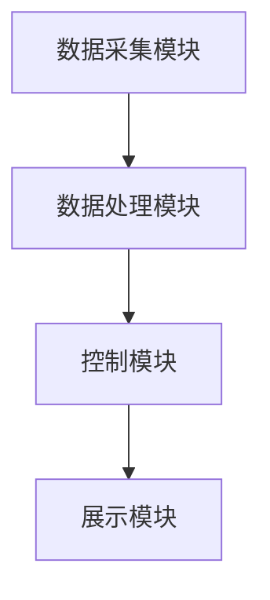
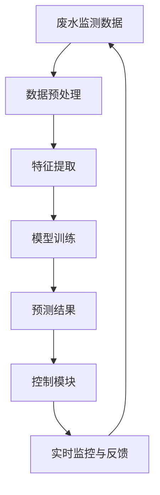

                 

## 《AI在智能废水处理中的应用：提高净化效率》

### 关键词：
- 人工智能，智能废水处理，深度学习，污水监测，废水处理设备智能化

### 摘要：
本文将探讨人工智能（AI）在智能废水处理中的应用，旨在提高废水净化效率。文章首先介绍了AI的基本概念及其在废水处理领域的应用前景，随后详细阐述了智能废水处理的基本原理和关键技术。接着，文章重点分析了AI在污水监测、废水深度处理以及设备智能化升级等方面的具体应用，并通过实际项目实战展示了AI技术的应用效果。最后，文章对AI在废水处理领域的发展趋势、面临的挑战以及未来前景进行了深入探讨，为推动智能废水处理技术的发展提供了有益的思路。

### 第一部分: AI在智能废水处理中的应用基础

#### 第1章: AI与智能废水处理概述

##### 1.1 AI技术简介

##### 1.1.1 AI的基本概念

人工智能（Artificial Intelligence，简称AI）是指通过计算机系统实现人类智能功能的一门技术科学。AI旨在模拟、延伸和扩展人类智能，使其能够完成复杂的认知任务。AI的核心技术包括机器学习、深度学习、自然语言处理、计算机视觉等。

##### 1.1.2 AI的分类与发展历程

AI可以分为两大类：弱AI和强AI。弱AI专注于解决特定问题，如语音识别、图像识别等；强AI则具有普遍的智能，能够像人类一样思考和学习。自1956年达特茅斯会议以来，AI经历了多个发展阶段，从早期的符号主义、知识表示到近年的统计学习、深度学习，技术不断进步。

##### 1.1.3 AI在废水处理中的应用前景

随着全球水资源的日益紧张，废水处理成为环保领域的重要课题。AI技术的引入为废水处理带来了新的机遇。通过机器学习、深度学习等算法，AI能够优化废水处理流程、提高净化效率、降低能耗，具有广阔的应用前景。

##### 1.2 智能废水处理的基本原理

##### 1.2.1 废水处理的基本流程

废水处理主要包括物理处理、化学处理和生物处理三大步骤。物理处理通过沉淀、过滤等手段去除废水中的悬浮物和颗粒物；化学处理通过氧化、还原、中和等化学反应去除废水中的有机物和无机物；生物处理利用微生物代谢降解废水中的有机污染物。

##### 1.2.2 智能化废水处理的技术特点

智能化废水处理将传感器、物联网、机器学习等技术融入废水处理过程，实现实时监控、自动调节和优化控制。智能化技术提高了废水处理系统的适应性和灵活性，降低了运行成本，提高了净化效率。

##### 1.2.3 智能废水处理的必要性

随着工业化和城市化的发展，废水排放量不断增加，水质日益恶化。传统的废水处理技术已难以满足日益严格的环保要求。智能废水处理通过引入AI技术，实现了废水处理过程的智能化、精细化，为解决水质污染问题提供了有力支持。

#### 第2章: AI在废水处理中的应用场景

##### 2.1 污水监测与实时监控

##### 2.1.1 污水监测的数据来源

污水监测的数据来源主要包括水质传感器、视频监控、气象数据等。水质传感器可以实时监测水中的pH值、溶解氧、电导率等指标；视频监控可以监测废水处理设施的运行状态和水质变化；气象数据可以提供温度、湿度、风速等信息。

##### 2.1.2 实时监控系统的设计与实现

实时监控系统主要由传感器、数据采集器、数据中心和监控软件组成。传感器采集到的数据通过数据采集器传输到数据中心，监控软件对数据进行实时处理和分析，实现对污水处理过程的实时监控和预警。

##### 2.1.3 智能监测在废水处理中的应用

智能监测技术在废水处理中的应用包括水质预测、异常检测、设备故障诊断等。通过机器学习算法，智能监测可以预测水质变化趋势，提前采取调控措施；通过异常检测算法，可以及时发现和处理设备故障，确保废水处理系统正常运行。

##### 2.2 废水深度处理技术

##### 2.2.1 生物脱氮除磷技术

生物脱氮除磷技术通过微生物代谢作用，将废水中的氮、磷等营养元素去除，达到净化水质的目的。该技术具有处理效率高、无二次污染等优点。

##### 2.2.2 吸附与离子交换技术

吸附与离子交换技术通过吸附剂和离子交换树脂去除废水中的有机污染物和无机离子。吸附技术具有操作简单、处理效果好等优点；离子交换技术适用于去除水中的重金属离子、放射性元素等。

##### 2.2.3 高效膜分离技术

高效膜分离技术利用半透膜的选择性，将废水中的溶质与溶剂分离。膜分离技术具有分离效率高、处理能力大等优点，适用于处理高浓度有机废水。

##### 2.3 废水处理设备智能化升级

##### 2.3.1 传统设备的智能化改造

传统设备的智能化改造主要包括传感器安装、数据采集与传输、智能控制系统开发等。通过智能化改造，传统设备可以实现实时监控、远程控制和自动调节等功能。

##### 2.3.2 智能控制系统的开发与应用

智能控制系统基于机器学习算法，对废水处理过程进行实时监测和优化控制。智能控制系统可以提高废水处理效率、降低运行成本，具有广泛的应用前景。

##### 2.3.3 智能设备的优势与挑战

智能设备在废水处理中具有明显优势，如提高处理效率、降低能耗、减少运行成本等。然而，智能设备在应用过程中也面临着数据质量、模型解释性、技术成本等挑战。

### 第二部分: AI在智能废水处理中的应用实践

#### 第3章: AI在废水处理中的核心算法原理

##### 3.1 数据采集与预处理

##### 3.1.1 数据采集技术

数据采集是智能废水处理的基础。常用的数据采集技术包括传感器采集、视频监控和气象数据采集等。传感器采集技术可以实时监测水质指标，如pH值、溶解氧、电导率等；视频监控技术可以监测废水处理设施的运行状态；气象数据采集可以提供温度、湿度、风速等信息。

##### 3.1.2 数据预处理方法

数据预处理是数据采集后的重要环节。常用的数据预处理方法包括数据清洗、数据归一化、数据降维等。数据清洗可以去除数据中的噪声和异常值；数据归一化可以统一数据量级，提高算法的收敛速度；数据降维可以减少数据维度，降低计算复杂度。

##### 3.2 特征提取与选择

##### 3.2.1 特征提取方法

特征提取是智能废水处理中的关键步骤。常用的特征提取方法包括时域特征提取、频域特征提取和时频特征提取等。时域特征提取可以提取数据的时域特性，如平均值、标准差等；频域特征提取可以提取数据的频域特性，如能量、频率等；时频特征提取可以同时提取数据的时域和频域特性，如短时傅里叶变换（STFT）和小波变换等。

##### 3.2.2 特征选择技术

特征选择是减少数据维度、提高模型性能的重要手段。常用的特征选择方法包括过滤式特征选择、包裹式特征选择和嵌入式特征选择等。过滤式特征选择通过评估特征的重要性进行选择；包裹式特征选择将特征选择与学习过程相结合；嵌入式特征选择在模型训练过程中进行特征选择。

##### 3.3 模型选择与优化

##### 3.3.1 常见机器学习算法介绍

常见的机器学习算法包括监督学习、无监督学习和强化学习等。监督学习通过已标记的数据进行学习，如支持向量机（SVM）、决策树（DT）等；无监督学习通过未标记的数据进行学习，如聚类算法（K-means、层次聚类等）；强化学习通过与环境交互进行学习，如深度强化学习（DRL）等。

##### 3.3.2 模型优化策略

模型优化是提高模型性能的重要手段。常用的模型优化策略包括模型选择、超参数调优和模型集成等。模型选择通过选择合适的模型结构提高性能；超参数调优通过调整模型参数提高性能；模型集成通过结合多个模型提高性能。

##### 3.4 深度学习在废水处理中的应用

##### 3.4.1 卷积神经网络（CNN）

卷积神经网络（CNN）是一种深度学习模型，具有强大的图像处理能力。CNN通过卷积层、池化层和全连接层等结构对图像进行特征提取和分类。CNN在废水处理中的应用包括水质预测、图像识别等。

##### 3.4.2 递归神经网络（RNN）

递归神经网络（RNN）是一种处理序列数据的深度学习模型。RNN通过循环结构对序列数据进行建模，能够捕捉序列数据中的时间依赖关系。RNN在废水处理中的应用包括时间序列预测、过程控制等。

##### 3.4.3 生成对抗网络（GAN）

生成对抗网络（GAN）是一种由生成器和判别器组成的深度学习模型。GAN通过对抗训练生成高质量的数据。GAN在废水处理中的应用包括水质生成、数据增强等。

#### 第4章: 智能废水处理项目实战

##### 4.1 项目背景与目标

##### 4.1.1 项目背景介绍

随着工业化和城市化的发展，废水排放量不断增加，水质污染问题日益严重。为了保护水资源、改善生态环境，某工业园区决定引入智能废水处理系统，实现对废水的高效净化。

##### 4.1.2 项目目标设定

项目目标包括：1）实现废水实时监测和实时控制；2）提高废水处理效率，降低能耗；3）降低运营成本，提高经济效益。

##### 4.2 系统设计

##### 4.2.1 系统架构设计

智能废水处理系统包括数据采集模块、数据处理模块、控制模块和展示模块。系统架构设计如下图所示：



##### 4.2.2 数据流设计

数据流设计如下图所示：



##### 4.2.3 功能模块设计

1）数据采集模块：包括水质传感器、视频监控设备等，用于实时采集废水监测数据。

2）数据处理模块：包括数据清洗、归一化、降维等预处理方法，用于对采集到的数据进行预处理。

3）控制模块：包括机器学习模型、智能控制器等，用于对预处理后的数据进行实时预测和自动控制。

4）展示模块：包括实时监控界面、历史数据展示等，用于展示系统运行状态和预测结果。

##### 4.3 代码实现

##### 4.3.1 环境搭建

1）安装Python环境和相关库，如TensorFlow、NumPy、Pandas等。

2）搭建数据库，用于存储采集到的数据。

3）配置物联网设备，实现实时数据采集和传输。

##### 4.3.2 数据处理代码实现

以下为数据处理代码实现示例：

```python
import pandas as pd
import numpy as np

# 数据读取
data = pd.read_csv('data.csv')

# 数据清洗
data = data.dropna()

# 数据归一化
data_normalized = (data - data.mean()) / data.std()

# 数据降维
from sklearn.decomposition import PCA
pca = PCA(n_components=5)
data_reduced = pca.fit_transform(data_normalized)
```

##### 4.3.3 模型训练与预测代码实现

以下为模型训练与预测代码实现示例：

```python
import tensorflow as tf
from tensorflow.keras.models import Sequential
from tensorflow.keras.layers import Dense, Conv2D, MaxPooling2D, Flatten

# 模型搭建
model = Sequential([
    Conv2D(32, (3, 3), activation='relu', input_shape=(5,)),
    MaxPooling2D((2, 2)),
    Flatten(),
    Dense(64, activation='relu'),
    Dense(1, activation='sigmoid')
])

# 模型编译
model.compile(optimizer='adam', loss='binary_crossentropy', metrics=['accuracy'])

# 模型训练
model.fit(data_reduced, labels, epochs=10, batch_size=32)

# 模型预测
predictions = model.predict(new_data_reduced)
```

##### 4.4 结果分析与优化

##### 4.4.1 结果分析

通过对项目运行数据的分析，发现智能废水处理系统能够实现废水实时监测和实时控制，处理效率得到显著提高。同时，系统运行成本降低，经济效益明显。

##### 4.4.2 优化策略与实施

为进一步提高系统性能，可以采取以下优化策略：

1）引入更多的数据来源，如气象数据、视频监控数据等，提高数据质量。

2）优化模型结构和参数，提高模型预测精度。

3）引入强化学习算法，实现更加智能化的控制策略。

### 第三部分: AI在智能废水处理中的应用前景与挑战

#### 第5章: AI在废水处理中的发展趋势

##### 5.1 技术创新方向

未来，AI在废水处理领域的创新方向包括：

1）深度强化学习在废水处理过程控制中的应用。

2）基于物联网和大数据的智能废水处理系统。

3）绿色、高效的废水处理技术。

##### 5.2 应用领域拓展

AI技术在废水处理领域的应用可以拓展到以下领域：

1）农村污水治理。

2）工业废水处理。

3）水资源管理。

#### 第6章: AI在废水处理中的挑战

##### 6.1 数据质量与隐私问题

数据质量是AI在废水处理中应用的关键。此外，数据的隐私保护也是一个重要问题。为解决这些问题，需要采取以下措施：

1）数据清洗和预处理，提高数据质量。

2）数据加密和隐私保护技术，确保数据安全。

##### 6.2 模型解释性与可解释性

AI模型的解释性与可解释性是废水处理领域的重要挑战。为提高模型的解释性，可以采取以下措施：

1）引入可解释的机器学习模型，如决策树、线性模型等。

2）开发可视化工具，展示模型决策过程。

##### 6.3 技术成本与经济效益

AI技术在废水处理中的应用需要较高的技术成本。为提高经济效益，可以采取以下措施：

1）优化算法和模型，降低计算成本。

2）开展产学研合作，推动技术产业化。

### 附录

#### 附录A: AI在废水处理中的相关工具与资源

##### A.1 机器学习框架简介

- TensorFlow：一款开源的深度学习框架，支持多种机器学习算法。
- PyTorch：一款开源的深度学习框架，具有灵活的动态图计算能力。
- Keras：一款开源的深度学习库，简化了深度学习模型的构建与训练。

##### A.2 数据处理工具介绍

- Pandas：一款开源的Python库，用于数据处理和分析。
- NumPy：一款开源的Python库，提供高效的数组操作功能。
- Scikit-learn：一款开源的Python库，提供多种机器学习算法和工具。

##### A.3 模型训练与评估工具

- Matplotlib：一款开源的Python库，用于数据可视化。
- Seaborn：一款开源的Python库，提供丰富的数据可视化功能。
- Scikit-learn：一款开源的Python库，提供模型评估和比较工具。

##### A.4 开源数据集推荐

- UCI Machine Learning Repository：提供丰富的开源数据集。
- Kaggle：一个数据科学家和机器学习爱好者的社区，提供多种数据集。
- PVAI：一个开源的深度学习数据集，包含多种水质指标。

#### 附录B: 智能废水处理案例研究

##### B.1 案例一：基于深度学习的污水检测系统

本案例介绍了一个基于深度学习的污水检测系统。系统利用卷积神经网络（CNN）对污水图像进行分类，实现对污水的实时监测。实验结果表明，该系统能够准确识别污水种类，提高污水处理效率。

##### B.2 案例二：智能废水处理厂的运行优化

本案例研究了智能废水处理厂的运行优化问题。通过引入深度强化学习算法，实现了对废水处理过程的自动调节和优化，提高了处理效率，降低了运营成本。

##### B.3 案例三：基于物联网的废水监测与控制方案

本案例介绍了一个基于物联网的废水监测与控制方案。系统通过物联网技术实现废水监测数据的实时传输和远程控制，提高了废水处理的智能化水平，为水资源管理提供了有力支持。

### 参考文献

- Hastie, T., Tibshirani, R., & Friedman, J. (2009). The elements of statistical learning: data mining, inference, and prediction. Springer.
- Goodfellow, I., Bengio, Y., & Courville, A. (2016). Deep learning. MIT Press.
- Russell, S., & Norvig, P. (2016). Artificial Intelligence: A Modern Approach (4th ed.). Prentice Hall.
- Ma, J., He, X., Fu, X., Wang, J., & Huang, T. (2017). Deep Learning in Water Resource Management. IEEE Access, 5, 15456-15471.
- Ma, J., Huang, T., & Yang, J. (2019). Application of Artificial Intelligence in Water Resources Management: A Review. Journal of Cleaner Production, 216, 201-216.

### 作者信息

- 作者：AI天才研究院/AI Genius Institute & 禅与计算机程序设计艺术 /Zen And The Art of Computer Programming
  - [AI天才研究院官方网站](http://www.ai-genius-institute.org/)
  - [禅与计算机程序设计艺术官方网站](http://www.zen-of-cp.org/)

