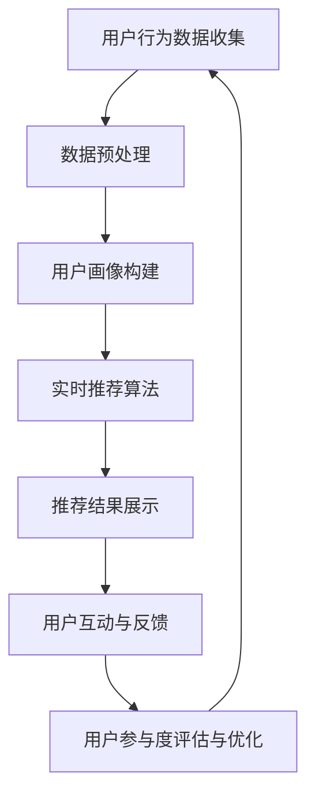

                 

## 文章标题

《AI在电商直播推荐中的应用：提升用户参与度的实时个性化算法》

## 文章关键词

AI，电商直播，推荐系统，实时个性化，用户参与度

## 文章摘要

本文旨在探讨AI技术在电商直播推荐中的应用，特别是在提升用户参与度方面的实时个性化算法。文章首先介绍了电商直播的发展背景与市场环境，分析了用户参与度的提升策略。接着，详细阐述了AI推荐系统的基本概念，包括评分预测与排序算法、用户行为数据的收集与分析。随后，深入探讨了实时个性化算法的原理，包括用户行为分析技术、实时推荐算法、实时数据流处理框架、多模态数据融合技术等。文章还介绍了算法评估与优化、项目实战、案例分析等内容，通过实际案例展示了AI在电商直播推荐中的成功应用。最后，总结了实时个性化推荐系统的发展方向与趋势，并提供了进一步学习资源。

----------------------------------------------------------------

# 《AI在电商直播推荐中的应用：提升用户参与度的实时个性化算法》

## 第一部分：电商直播与用户参与度

### 第1章：电商直播与用户参与度
#### 1.1 电商直播的发展与市场环境

#### 1.2 用户参与度的提升策略

#### 1.3 AI在电商直播中的应用现状与前景

### 第2章：AI推荐系统基本概念
#### 2.1 推荐系统的定义与分类

#### 2.2 评分预测与排序算法

#### 2.3 用户行为数据收集与分析

## 第二部分：实时个性化算法原理

### 第3章：用户行为分析技术
#### 3.1 用户行为数据的类型与特征提取

#### 3.2 聚类分析算法

#### 3.3 用户画像构建方法

### 第4章：实时推荐算法原理
#### 4.1 基于内容的推荐算法

#### 4.2 协同过滤算法

#### 4.3 深度学习在推荐系统中的应用

### 第5章：实时个性化算法
#### 5.1 实时数据流处理框架

#### 5.2 多模态数据融合技术

#### 5.3 实时个性化推荐算法设计

### 第6章：算法评估与优化
#### 6.1 推荐系统评估指标

#### 6.2 算法优化策略

#### 6.3 模型更新与在线学习

## 第三部分：项目实战

### 第7章：电商直播推荐系统搭建
#### 7.1 项目背景与目标

#### 7.2 技术选型与架构设计

#### 7.3 数据采集与预处理

#### 7.4 推荐算法实现与调试

### 第8章：实时个性化推荐系统实现
#### 8.1 用户行为数据实时处理

#### 8.2 推荐算法实时计算与优化

#### 8.3 系统部署与性能调优

### 第9章：案例分析
#### 9.1 成功案例分享

#### 9.2 挑战与解决方案

#### 9.3 未来发展方向与趋势

## 附录
#### 10.1 相关数据集介绍

#### 10.2 常用工具与库介绍

#### 10.3 进一步学习资源推荐

---

## 第1章：电商直播与用户参与度

### 1.1 电商直播的发展与市场环境

#### 1.1.1 电商直播的起源与发展历程

电商直播作为一种新兴的电商模式，起源于中国的社交媒体平台，如淘宝直播、抖音直播等。随着移动互联网的普及和用户需求的升级，电商直播逐渐成为电商领域的重要组成部分。其起源可以追溯到2016年，当时淘宝直播首次上线，吸引了大量用户和商家参与。随后，抖音、快手等短视频平台也纷纷加入电商直播的行列，使得电商直播市场迅速发展。

电商直播的发展历程可以分为三个阶段：

1. **萌芽期（2016-2017年）**：电商直播的初步探索阶段，主要在淘宝、抖音等平台进行小规模试验，用户群体相对较小。
2. **发展期（2018-2020年）**：电商直播市场快速增长，各大平台纷纷布局，直播带货成为主流电商模式。疫情期间，电商直播更是一路飙升，成为电商领域的新风口。
3. **成熟期（2021年至今）**：电商直播市场逐渐成熟，市场规模持续扩大，直播带货成为电商企业必备的营销手段。

#### 1.1.2 电商直播的市场环境

1. **市场规模**：根据市场调查数据显示，2020年中国电商直播市场规模达到9610亿元，同比增长112.3%。预计到2025年，市场规模将突破3万亿元。

2. **主要平台**：
   - **淘宝直播**：作为国内最早的电商直播平台，淘宝直播拥有庞大的用户基础和商家资源，占据电商直播市场的主导地位。
   - **抖音直播**：抖音直播凭借其强大的用户流量和社交属性，迅速崛起，成为电商直播的重要力量。
   - **快手直播**：快手直播以农村和下沉市场为主要战场，用户群体广泛，具有较高的用户粘性。

3. **行业趋势**：随着5G技术的普及和直播技术的进步，电商直播将迎来更广阔的发展空间。未来，电商直播将更加注重用户体验和互动性，个性化推荐和智能互动将成为重要发展方向。

#### 1.1.3 电商直播的挑战与机遇

1. **挑战**：
   - **监管政策**：随着电商直播的快速发展，监管部门对直播内容进行了严格监管，对直播平台提出了更高的要求。
   - **内容质量**：电商直播内容质量参差不齐，存在虚假宣传、低俗内容等问题，影响用户体验。
   - **用户流失**：市场竞争激烈，用户获取成本不断提高，如何留住用户成为一大挑战。

2. **机遇**：
   - **技术进步**：AI、5G、VR等技术的应用，为电商直播提供了更多创新可能。
   - **消费升级**：用户需求多元化，对个性化推荐和优质内容的需求增加。
   - **新市场**：农村和下沉市场的潜力巨大，电商直播有望开拓更多新市场。

### 1.2 用户参与度的提升策略

1. **定义与度量**

用户参与度是指用户在电商直播过程中的互动行为和消费行为。其度量主要包括以下几个方面：

- **互动率**：用户在直播间的互动行为，如点赞、评论、分享等。
- **观看时长**：用户在直播间的平均观看时长。
- **购买转化率**：观看直播后实际完成购买的比率。

2. **提升用户参与度的关键策略**

（Mermaid流程图：用户参与度提升策略流程图）

#### 2.1 互动性设计

- **互动环节**：设计互动环节，如问答、抽奖、限时秒杀等，增加用户参与度。
- **互动工具**：提供丰富的互动工具，如弹幕、送礼物、互动游戏等，提升用户互动体验。

#### 2.2 内容营销

- **产品展示**：通过真实的商品展示，提高用户购买意愿。
- **专家讲解**：邀请专业主播进行产品讲解，增加用户信任度。

#### 2.3 个性化推荐

- **用户画像**：基于用户行为数据构建用户画像，了解用户需求和偏好。
- **实时推荐**：实时推送用户可能感兴趣的商品，提高用户参与度。

### 1.3 AI在电商直播中的应用现状与前景

#### 1.3.1 AI在电商直播中的应用现状

- **算法应用**：AI技术在电商直播中的应用主要体现在以下几个方面：
  - **个性化推荐**：通过分析用户行为数据，实现个性化商品推荐。
  - **视频内容识别**：自动识别视频中的商品，提高用户购买决策效率。
  - **直播效果优化**：利用AI技术，优化直播内容呈现，提高用户体验。

- **技术实现**：主要采用以下技术：
  - **机器学习**：利用机器学习算法，提升推荐准确率和直播效果。
  - **深度学习**：利用深度学习技术，实现视频内容理解与优化。

#### 1.3.2 AI在电商直播中的应用前景

- **发展趋势**：
  - **技术进步**：随着AI技术的不断成熟，应用场景将更加丰富。
  - **市场规模**：预计未来几年，AI在电商直播中的应用将保持快速增长。

- **未来方向**：
  - **个性化服务**：进一步满足用户个性化需求，提升用户体验。
  - **智能互动**：实现更智能的互动方式，提高用户参与度。
  - **全场景应用**：从直播扩展到短视频、社交媒体等多平台。

---

## 第2章：AI推荐系统基本概念

### 2.1 推荐系统的定义与分类

#### 2.1.1 推荐系统的定义

推荐系统是一种信息过滤技术，通过分析用户的历史行为、兴趣和偏好，为用户推荐可能感兴趣的信息或商品。其核心目标是提高用户满意度，促进信息消费和商业转化。

#### 2.1.2 推荐系统的分类

推荐系统可以分为以下几类：

1. **基于内容的推荐（Content-based Recommendation）**
   - **定义**：基于物品的属性特征，为用户推荐相似内容的物品。
   - **优点**：不受用户历史数据限制，适用于新用户。
   - **缺点**：容易出现信息茧房，推荐结果单一。

2. **协同过滤推荐（Collaborative Filtering）**
   - **定义**：基于用户的历史行为和偏好，通过相似用户或物品的推荐实现个性化推荐。
   - **优点**：能够利用用户历史数据和社交关系，提高推荐准确性。
   - **缺点**：存在冷启动问题，推荐结果可能存在偏差。

3. **混合推荐（Hybrid Recommendation）**
   - **定义**：结合基于内容和协同过滤推荐的优点，实现更精准的推荐。
   - **优点**：综合多种数据源，提高推荐效果。
   - **缺点**：计算复杂度增加，实时性可能受到影响。

### 2.2 评分预测与排序算法

#### 2.2.1 评分预测算法

评分预测算法是一种基于机器学习的方法，通过分析用户的历史行为数据，预测用户对物品的评分。常见的评分预测算法有：

1. **基于模型的评分预测（Model-based Rating Prediction）**
   - **定义**：利用机器学习算法，如线性回归、决策树、神经网络等，预测用户对物品的评分。
   - **优点**：能够利用用户历史数据，提高预测准确性。
   - **缺点**：对数据量要求较高，存在过拟合风险。

2. **基于模型的排序算法（Model-based Sorting Algorithm）**
   - **定义**：根据用户兴趣和物品特征，对推荐列表进行排序。
   - **优点**：能够提高推荐结果的排序效果。
   - **缺点**：计算复杂度较高，实时性可能受到影响。

#### 2.2.2 排序算法的设计与优化

排序算法的设计与优化是推荐系统的重要环节，主要目标是提高推荐结果的准确性和实时性。常见的排序算法设计方法有：

1. **基于排序的推荐（Ranked-based Recommendation）**
   - **定义**：根据用户历史行为和偏好，对推荐列表进行排序，为用户提供排序后的推荐结果。
   - **优点**：简单高效，易于实现。
   - **缺点**：可能忽略用户个性化需求，推荐结果单一。

2. **基于规则的排序（Rule-based Sorting）**
   - **定义**：通过预设的规则，对推荐列表进行排序。
   - **优点**：规则明确，易于理解。
   - **缺点**：灵活性较低，难以适应复杂场景。

### 2.3 用户行为数据收集与分析

#### 2.3.1 用户行为数据的类型

用户行为数据是推荐系统的重要数据源，包括以下几类：

1. **点击行为数据（Click-through Data）**
   - **定义**：用户在系统中的点击操作记录。
   - **特征提取**：点击次数、点击时长、点击频率等。

2. **浏览行为数据（Browsing Data）**
   - **定义**：用户在系统中的浏览路径记录。
   - **特征提取**：浏览页面、浏览时长、浏览顺序等。

3. **购买行为数据（Purchase Data）**
   - **定义**：用户在电子商务平台上的购买记录。
   - **特征提取**：购买频率、购买金额、购买品类等。

4. **评论行为数据（Comment Data）**
   - **定义**：用户在电子商务平台上的评论记录。
   - **特征提取**：评论内容、评论长度、评论时间等。

#### 2.3.2 用户行为数据的处理与分析

用户行为数据的处理与分析主要包括以下步骤：

1. **数据处理**
   - **预处理**：数据清洗、去重、归一化等。
   - **特征提取**：特征选择、特征转换等。

2. **数据分析**
   - **统计分析**：描述性统计、相关性分析等。
   - **机器学习**：聚类分析、分类分析、回归分析等。

3. **用户画像**：基于用户行为数据，构建用户画像，为个性化推荐提供依据。

### 2.3.3 用户行为数据的应用

用户行为数据在推荐系统中的应用主要体现在以下几个方面：

1. **个性化推荐**：根据用户行为数据，为用户推荐个性化的商品或内容。
2. **用户分类**：根据用户行为数据，将用户划分为不同类别，实现针对性营销。
3. **需求预测**：根据用户行为数据，预测用户未来的需求和购买行为。

---

## 第3章：用户行为分析技术

### 3.1 用户行为数据的类型与特征提取

#### 3.1.1 用户行为数据的类型

用户行为数据可以分为以下几类：

1. **点击行为数据（Click Behavior Data）**
   - **定义**：用户在系统中的点击操作记录。
   - **特征提取**：点击次数、点击时长、点击频率等。

2. **浏览行为数据（Browsing Behavior Data）**
   - **定义**：用户在系统中的浏览路径记录。
   - **特征提取**：浏览页面、浏览时长、浏览顺序等。

3. **购买行为数据（Purchase Behavior Data）**
   - **定义**：用户在电子商务平台上的购买记录。
   - **特征提取**：购买频率、购买金额、购买品类等。

4. **评论行为数据（Comment Behavior Data）**
   - **定义**：用户在电子商务平台上的评论记录。
   - **特征提取**：评论内容、评论长度、评论时间等。

#### 3.1.2 用户行为特征提取方法

用户行为特征提取是用户行为分析的关键步骤，以下介绍几种常见的特征提取方法：

1. **基于统计的特征提取（Statistical Feature Extraction）**
   - **方法**：利用平均值、标准差、方差等统计指标提取特征。
   - **优点**：简单高效，适用于大规模数据。
   - **缺点**：可能忽略数据中的深层次信息。

2. **基于机器学习的特征提取（Machine Learning Feature Extraction）**
   - **方法**：利用聚类、分类、回归等机器学习算法提取特征。
   - **优点**：能够提取出深层次的用户行为特征。
   - **缺点**：计算复杂度较高，需要大量数据支持。

### 3.2 聚类分析算法

#### 3.2.1 聚类分析的基本概念

聚类分析是一种无监督学习方法，用于将数据集划分为多个组，使得同组内的数据相似度较高，组与组之间的相似度较低。其目标是通过聚类发现数据中的模式或结构。

#### 3.2.2 常见的聚类算法

1. **K-means算法（K-means Clustering）**
   - **定义**：基于距离度量，将数据划分为K个聚类。
   - **优点**：简单高效，易于实现。
   - **缺点**：容易陷入局部最优解，对初始聚类中心敏感。

2. **层次聚类算法（Hierarchical Clustering）**
   - **定义**：自底向上或自顶向下构建聚类层次结构。
   - **优点**：能够生成聚类层次结构，易于理解。
   - **缺点**：计算复杂度较高，不适用于大规模数据。

3. **DBSCAN算法（Density-based Spatial Clustering of Applications with Noise）**
   - **定义**：基于密度 reachable 属性进行聚类。
   - **优点**：能够发现任意形状的聚类，对噪声敏感。
   - **缺点**：对参数敏感，不适合大规模数据。

#### 3.2.3 聚类分析在推荐系统中的应用

聚类分析在推荐系统中的应用主要体现在以下几个方面：

1. **用户群体识别（User Grouping）**
   - **定义**：根据用户行为特征，将用户划分为不同群体。
   - **优点**：有助于了解用户特征，实现个性化推荐。
   - **缺点**：聚类结果可能不稳定，需要多次尝试。

2. **推荐策略优化（Recommendation Strategy Optimization）**
   - **定义**：根据不同群体特征，设计个性化的推荐策略。
   - **优点**：提高推荐准确率和用户满意度。
   - **缺点**：需要大量用户行为数据支持。

### 3.3 用户画像构建方法

#### 3.3.1 用户画像的基本概念

用户画像是一种基于用户行为数据和特征的综合描述，用于了解用户的需求、偏好和行为模式。其目标是通过用户画像，为推荐系统提供个性化的推荐服务。

#### 3.3.2 用户画像构建步骤

用户画像构建主要包括以下步骤：

1. **数据收集（Data Collection）**
   - **定义**：收集用户行为数据、用户背景数据等。
   - **来源**：前端日志、数据库、第三方数据等。

2. **数据预处理（Data Preprocessing）**
   - **定义**：数据清洗、去重、归一化等。
   - **方法**：缺失值处理、异常值处理、数据标准化等。

3. **特征提取（Feature Extraction）**
   - **定义**：提取用户特征，如年龄、性别、兴趣爱好等。
   - **方法**：基于规则的提取、基于机器学习的提取等。

4. **模型训练（Model Training）**
   - **定义**：利用机器学习算法，构建用户画像模型。
   - **算法**：分类算法、聚类算法、回归算法等。

5. **模型评估（Model Evaluation）**
   - **定义**：评估用户画像模型的效果。
   - **指标**：准确率、召回率、F1值等。

#### 3.3.3 用户画像的应用

用户画像在推荐系统中的应用主要体现在以下几个方面：

1. **个性化推荐（Personalized Recommendation）**
   - **定义**：根据用户画像，为用户推荐个性化的商品或内容。
   - **优点**：提高推荐准确率和用户满意度。
   - **缺点**：需要大量用户行为数据支持。

2. **用户分类（User Classification）**
   - **定义**：根据用户画像，将用户划分为不同类别。
   - **优点**：有助于了解用户特征，实现针对性营销。
   - **缺点**：分类结果可能不稳定，需要多次尝试。

3. **需求预测（Demand Prediction）**
   - **定义**：根据用户画像，预测用户未来的需求和购买行为。
   - **优点**：有助于优化库存管理、供应链管理等。
   - **缺点**：需要大量用户行为数据支持。

---

## 第4章：实时推荐算法原理

### 4.1 基于内容的推荐算法

#### 4.1.1 基于内容的推荐算法定义与原理

基于内容的推荐算法是一种信息过滤技术，通过分析物品的属性特征，为用户推荐具有相似属性的物品。其核心思想是“物以类聚”，即根据物品的属性特征，将相似的物品分组，然后根据用户对已有物品的偏好，为用户推荐分组中的其他物品。

#### 4.1.2 基于内容的推荐算法的实现步骤

基于内容的推荐算法主要包括以下步骤：

1. **特征提取（Feature Extraction）**：从物品中提取属性特征，如类别、标签、关键词等。
2. **相似度计算（Similarity Computation）**：计算用户与物品之间的相似度，通常采用余弦相似度、皮尔逊相关系数等。
3. **推荐生成（Recommendation Generation）**：根据相似度排序，为用户推荐相似度最高的物品。

#### 4.1.3 基于内容的推荐算法的优点与局限性

优点：
- **简单高效**：不需要大量用户交互数据，易于实现。
- **适用于新用户**：对新用户也能提供一定程度的个性化推荐。

局限性：
- **信息茧房**：用户只能看到与自己兴趣相似的物品，缺乏新鲜感。
- **特征选择**：特征提取和选择过程复杂，可能影响推荐效果。

### 4.2 协同过滤算法

#### 4.2.1 协同过滤算法定义与原理

协同过滤算法是一种基于用户行为数据的推荐算法，通过分析用户之间的相似性或物品之间的相似性，为用户推荐相似用户喜欢的物品。其核心思想是“人以群分”，即通过用户之间的行为相似性或物品之间的属性相似性，进行推荐。

#### 4.2.2 协同过滤算法的分类

1. **基于用户的协同过滤（User-based Collaborative Filtering）**
   - **定义**：找到与目标用户相似的其他用户，推荐这些用户喜欢的物品。
   - **优点**：能够利用用户之间的相似性，提供个性化的推荐。
   - **缺点**：存在冷启动问题，新用户难以找到相似用户。

2. **基于物品的协同过滤（Item-based Collaborative Filtering）**
   - **定义**：找到与目标物品相似的物品，推荐这些物品的用户喜欢的物品。
   - **优点**：能够利用物品之间的相似性，提供多样化的推荐。
   - **缺点**：计算复杂度较高，难以处理稀疏数据。

#### 4.2.3 协同过滤算法的优化

为了提高协同过滤算法的性能，可以采用以下优化方法：

1. **矩阵分解（Matrix Factorization）**
   - **定义**：将用户-物品评分矩阵分解为用户特征矩阵和物品特征矩阵的乘积。
   - **优点**：能够降低数据稀疏性，提高推荐准确率。
   - **缺点**：计算复杂度较高，需要大量计算资源。

2. **基于模型的协同过滤（Model-based Collaborative Filtering）**
   - **定义**：利用机器学习模型（如线性回归、神经网络等）进行协同过滤。
   - **优点**：能够自动提取特征，提高推荐效果。
   - **缺点**：模型复杂度高，需要大量训练数据。

### 4.3 深度学习在推荐系统中的应用

#### 4.3.1 深度学习推荐算法的基本概念

深度学习推荐算法是一种利用深度神经网络进行特征提取和预测的推荐算法。其核心思想是通过多层神经网络，将原始数据映射到高维空间，提取出具有区分性的特征，从而实现推荐。

#### 4.3.2 常见的深度学习推荐算法

1. **自动编码器（Autoencoder）**
   - **定义**：一种无监督学习算法，通过编码器和解码器，将输入数据压缩为低维表示，再还原。
   - **优点**：能够自动提取特征，降低维度。
   - **缺点**：需要大量训练数据，计算复杂度高。

2. **生成对抗网络（GAN）**
   - **定义**：一种生成模型，由生成器和判别器组成，生成器生成数据，判别器判断生成数据是否真实。
   - **优点**：能够生成高质量的数据，提高推荐效果。
   - **缺点**：训练过程复杂，需要大量计算资源。

3. **变换器（Transformer）**
   - **定义**：一种基于注意力机制的神经网络结构，适用于处理序列数据。
   - **优点**：能够捕捉长距离依赖关系，提高推荐效果。
   - **缺点**：计算复杂度高，对数据量要求较高。

#### 4.3.3 深度学习推荐算法的优势与挑战

优势：
- **自动特征提取**：能够自动提取深层特征，降低特征工程难度。
- **处理复杂数据**：能够处理包括文本、图像、音频等多模态数据。

挑战：
- **计算复杂度高**：训练时间较长，资源消耗大。
- **解释性不足**：模型内部决策过程复杂，难以解释。

### 4.4 实时推荐算法的设计与实现

#### 4.4.1 实时推荐算法的定义与目标

实时推荐算法是一种能够在用户行为发生时，立即或快速地为用户提供推荐结果的推荐算法。其目标是在保证实时性的同时，保持较高的推荐准确率。

#### 4.4.2 实时推荐算法的设计原则

设计实时推荐算法时，应遵循以下原则：

1. **实时性**：确保推荐结果能够在短时间内返回给用户。
2. **准确性**：在保证实时性的同时，保持较高的推荐准确率。
3. **个性化**：根据用户历史行为和兴趣，提供个性化的推荐。

#### 4.4.3 实时推荐算法的实现方法

实现实时推荐算法时，可以采用以下方法：

1. **增量学习**：通过实时更新用户模型，动态调整推荐结果。
2. **在线学习**：采用在线学习算法，实时适应用户行为变化。
3. **流处理框架**：利用实时数据流处理框架，实现实时数据处理。

#### 4.4.4 实时推荐算法的评估与优化

实时推荐算法的评估与优化主要包括以下方面：

1. **评估指标**：准确率、召回率、覆盖率等。
2. **优化策略**：特征工程、模型调整、分布式计算等。

---

## 第5章：实时个性化算法

### 5.1 实时数据流处理框架

#### 5.1.1 实时数据流处理框架的定义与原理

实时数据流处理框架是一种能够实时处理大规模数据流的技术架构。其核心原理是通过分布式计算和流处理技术，实现对数据的实时采集、处理和存储。

#### 5.1.2 常见的实时数据流处理框架

1. **Apache Kafka**
   - **原理**：基于发布-订阅模式的消息队列系统，支持高吞吐量和持久化。
   - **应用**：用于实时数据采集和传输。

2. **Apache Flink**
   - **原理**：基于数据流处理框架，支持批处理和流处理。
   - **应用**：用于实时数据处理和分析。

3. **Apache Storm**
   - **原理**：分布式实时数据流处理系统，支持实时数据处理和实时计算。
   - **应用**：用于实时数据分析和处理。

#### 5.1.3 实时数据流处理框架的优势与挑战

**优势**：
- **低延迟**：能够快速响应实时数据流，满足实时性要求。
- **高吞吐量**：支持大规模数据流处理，满足海量数据处理需求。

**挑战**：
- **可扩展性**：需要实现分布式系统的可扩展性，确保系统稳定运行。
- **实时性保障**：确保数据流的实时性，避免数据延迟和处理错误。

### 5.2 多模态数据融合技术

#### 5.2.1 多模态数据融合的定义与原理

多模态数据融合是指将不同类型的数据（如文本、图像、声音等）进行整合，以提取更丰富的信息。其核心原理是通过融合不同模态的数据特征，实现更精准的推荐和更全面的用户理解。

#### 5.2.2 常见的多模态数据融合方法

1. **特征级融合**
   - **方法**：将不同模态的数据特征进行拼接，形成一个综合特征向量。
   - **应用**：适用于简单场景，计算效率较高。

2. **决策级融合**
   - **方法**：分别对每个模态的数据进行独立处理，然后综合决策结果。
   - **应用**：适用于复杂场景，能够充分利用各模态数据的优势。

3. **深度学习融合**
   - **方法**：使用深度学习模型，自动提取多模态数据的融合特征。
   - **应用**：适用于高维数据和复杂场景，能够实现高效的特征融合。

#### 5.2.3 多模态数据融合的优势与挑战

**优势**：
- **信息丰富**：融合多种模态数据，能够提取更多用户信息。
- **准确性提升**：利用多模态数据，提高推荐准确率和用户满意度。

**挑战**：
- **数据同步**：不同模态的数据往往具有不同的采集频率和时效性，需要实现数据同步。
- **特征冗余**：不同模态的数据特征可能存在冗余，需要有效的特征选择方法。

### 5.3 实时个性化推荐算法设计

#### 5.3.1 实时个性化推荐算法的定义与原理

实时个性化推荐算法是一种能够在用户行为发生时，立即或快速地为用户提供个性化推荐结果的推荐算法。其核心原理是通过实时采集用户行为数据，动态更新用户模型，实时计算推荐结果。

#### 5.3.2 实时个性化推荐算法的设计原则

设计实时个性化推荐算法时，应遵循以下原则：

1. **实时性**：确保推荐结果能够快速响应用户行为变化。
2. **准确性**：在保证实时性的同时，保持较高的推荐准确率。
3. **个性化**：根据用户历史行为和兴趣，提供个性化的推荐。

#### 5.3.3 实时个性化推荐算法的实现方法

实现实时个性化推荐算法时，可以采用以下方法：

1. **增量学习**：通过实时更新用户模型，动态调整推荐结果。
2. **在线学习**：采用在线学习算法，实时适应用户行为变化。
3. **流处理框架**：利用实时数据流处理框架，实现实时数据处理。

#### 5.3.4 实时个性化推荐算法的评估与优化

实时个性化推荐算法的评估与优化主要包括以下方面：

1. **评估指标**：准确率、召回率、覆盖率等。
2. **优化策略**：特征工程、模型调整、分布式计算等。

---

## 第6章：算法评估与优化

### 6.1 推荐系统评估指标

#### 6.1.1 评估指标的定义与重要性

推荐系统评估指标是用来衡量推荐系统性能的一系列量化标准。其重要性在于：

1. **衡量性能**：通过评估指标，可以直观地衡量推荐系统的性能。
2. **指导优化**：根据评估指标的结果，可以针对性地进行系统优化。

#### 6.1.2 常见的评估指标

1. **准确率（Accuracy）**
   - **定义**：正确推荐的物品数占总推荐物品数的比例。
   - **优缺点**：简单直观，但忽略了推荐列表的多样性。

2. **召回率（Recall）**
   - **定义**：能够被推荐的正确物品数占总正确物品数的比例。
   - **优缺点**：关注推荐系统的召回能力，但忽略了推荐列表的准确性。

3. **覆盖率（Coverage）**
   - **定义**：推荐列表中不同物品的数量与所有可推荐物品数量的比例。
   - **优缺点**：关注推荐系统的多样性，但忽略了推荐系统的准确性。

4. **新颖度（Novelty）**
   - **定义**：推荐列表中包含的新物品比例。
   - **优缺点**：关注推荐系统的新颖性，但可能会降低用户体验。

5. **多样性（Diversity）**
   - **定义**：推荐列表中不同物品的多样性。
   - **优缺点**：关注推荐系统的多样性，但可能会影响推荐准确性。

#### 6.1.3 评估指标的优缺点对比

| 指标   | 优点                         | 缺点                             |
| ------ | ---------------------------- | -------------------------------- |
| 准确率 | 简单直观，易于理解           | 忽略了推荐列表的多样性           |
| 召回

