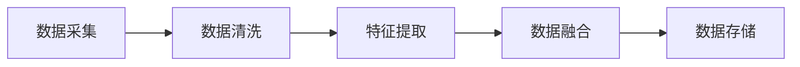
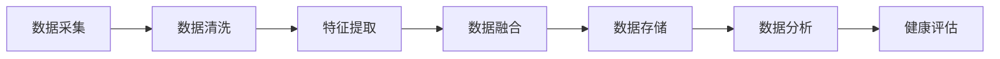

                 

### 引言与概述

在当今快速发展的科技时代，人工智能（AI）已经成为推动各个领域进步的重要力量。健康监测作为人类生活的重要组成部分，也迎来了AI技术的深度应用。虚拟健康监测，作为一种新兴的健康管理手段，通过AI技术实现对个人健康状况的实时监控和数据分析，已经成为医疗健康领域的热点。

**虚拟健康监测的概念**

虚拟健康监测指的是利用传感器、软件算法和互联网技术，对个人的生理、心理和行为数据进行实时采集、处理和分析，从而实现对健康状况的全面监控。与传统的健康监测方法相比，虚拟健康监测具有以下几个显著特点：

1. **实时性**：虚拟健康监测能够实时收集个人健康数据，并通过算法进行即时分析，为用户提供了即时的健康反馈。
2. **全面性**：虚拟健康监测不仅关注生理指标，如心率、血压、体温等，还关注心理和行为指标，如情绪状态、运动行为等，从而提供更全面的健康评估。
3. **个性化**：通过大数据分析和机器学习，虚拟健康监测能够根据个人的健康数据，为其提供个性化的健康建议和干预措施。

**AI在虚拟健康监测中的应用**

人工智能在虚拟健康监测中扮演着关键角色，其应用主要体现在以下几个方面：

1. **数据分析**：AI技术能够高效处理和分析大量的健康数据，从中提取有用的信息，为健康监测提供支持。
2. **模式识别**：通过机器学习算法，AI能够从健康数据中识别出规律和模式，从而预测个体的健康状况变化。
3. **预测与健康风险评估**：AI技术能够基于历史健康数据，预测未来可能的健康问题，为用户提供预防措施和健康指导。

**实时健康追踪的重要性**

实时健康追踪是虚拟健康监测的核心功能之一。它的重要性体现在以下几个方面：

1. **早期发现**：实时健康追踪能够及时发现健康异常，为早期干预提供机会，降低健康风险。
2. **个性化服务**：实时健康追踪可以根据个体的实时数据，为其提供个性化的健康建议和干预措施，提高健康管理的有效性。
3. **持续监控**：实时健康追踪可以实现对个人健康状况的持续监控，帮助用户养成健康的生活习惯，提高生活质量。

**实时健康追踪的应用领域**

实时健康追踪在医疗健康领域有着广泛的应用，主要包括以下几个方面：

1. **慢性病管理**：实时健康追踪可以帮助患者更好地管理慢性病，如心脏病、糖尿病等，减少并发症的发生。
2. **运动健康监测**：实时健康追踪可以帮助运动员和健身爱好者监测运动状态，优化训练计划，提高运动效果。
3. **心理健康**：实时健康追踪可以通过监测情绪和行为变化，帮助用户改善心理健康，预防心理疾病的发生。

总的来说，虚拟健康监测与AI技术的结合，为个人健康管理带来了前所未有的变革。通过实时健康追踪，人们可以更方便、更准确地了解自己的健康状况，从而实现个性化、精准化的健康管理。未来，随着AI技术的不断进步，虚拟健康监测将在医疗健康领域发挥更加重要的作用。

> 关键词：人工智能，虚拟健康监测，实时健康追踪，数据分析，机器学习，深度学习

> 摘要：本文探讨了人工智能在虚拟健康监测中的应用，重点介绍了实时健康追踪的概念、优势和应用领域。通过分析AI技术在数据分析、模式识别和健康预测方面的应用，本文揭示了虚拟健康监测的未来发展趋势与挑战。文章结构包括引言、核心概念与原理、AI算法应用、深度学习应用、数学模型与公式、项目实战和未来发展趋势与挑战等内容，为读者提供了全面的虚拟健康监测与AI技术结合的视角。


### 第一部分：引言与概述

在当今快速发展的科技时代，人工智能（AI）已经成为推动各个领域进步的重要力量。健康监测作为人类生活的重要组成部分，也迎来了AI技术的深度应用。虚拟健康监测，作为一种新兴的健康管理手段，通过AI技术实现对个人健康状况的实时监控和数据分析，已经成为医疗健康领域的热点。

**虚拟健康监测的概念**

虚拟健康监测指的是利用传感器、软件算法和互联网技术，对个人的生理、心理和行为数据进行实时采集、处理和分析，从而实现对健康状况的全面监控。与传统的健康监测方法相比，虚拟健康监测具有以下几个显著特点：

1. **实时性**：虚拟健康监测能够实时收集个人健康数据，并通过算法进行即时分析，为用户提供了即时的健康反馈。
2. **全面性**：虚拟健康监测不仅关注生理指标，如心率、血压、体温等，还关注心理和行为指标，如情绪状态、运动行为等，从而提供更全面的健康评估。
3. **个性化**：通过大数据分析和机器学习，虚拟健康监测能够根据个人的健康数据，为其提供个性化的健康建议和干预措施。

**AI在虚拟健康监测中的应用**

人工智能在虚拟健康监测中扮演着关键角色，其应用主要体现在以下几个方面：

1. **数据分析**：AI技术能够高效处理和分析大量的健康数据，从中提取有用的信息，为健康监测提供支持。
2. **模式识别**：通过机器学习算法，AI能够从健康数据中识别出规律和模式，从而预测个体的健康状况变化。
3. **预测与健康风险评估**：AI技术能够基于历史健康数据，预测未来可能的健康问题，为用户提供预防措施和健康指导。

**实时健康追踪的重要性**

实时健康追踪是虚拟健康监测的核心功能之一。它的重要性体现在以下几个方面：

1. **早期发现**：实时健康追踪能够及时发现健康异常，为早期干预提供机会，降低健康风险。
2. **个性化服务**：实时健康追踪可以根据个体的实时数据，为其提供个性化的健康建议和干预措施，提高健康管理的有效性。
3. **持续监控**：实时健康追踪可以实现对个人健康状况的持续监控，帮助用户养成健康的生活习惯，提高生活质量。

**实时健康追踪的应用领域**

实时健康追踪在医疗健康领域有着广泛的应用，主要包括以下几个方面：

1. **慢性病管理**：实时健康追踪可以帮助患者更好地管理慢性病，如心脏病、糖尿病等，减少并发症的发生。
2. **运动健康监测**：实时健康追踪可以帮助运动员和健身爱好者监测运动状态，优化训练计划，提高运动效果。
3. **心理健康**：实时健康追踪可以通过监测情绪和行为变化，帮助用户改善心理健康，预防心理疾病的发生。

总的来说，虚拟健康监测与AI技术的结合，为个人健康管理带来了前所未有的变革。通过实时健康追踪，人们可以更方便、更准确地了解自己的健康状况，从而实现个性化、精准化的健康管理。未来，随着AI技术的不断进步，虚拟健康监测将在医疗健康领域发挥更加重要的作用。

> 关键词：人工智能，虚拟健康监测，实时健康追踪，数据分析，机器学习，深度学习

> 摘要：本文探讨了人工智能在虚拟健康监测中的应用，重点介绍了实时健康追踪的概念、优势和应用领域。通过分析AI技术在数据分析、模式识别和健康预测方面的应用，本文揭示了虚拟健康监测的未来发展趋势与挑战。文章结构包括引言、核心概念与原理、AI算法应用、深度学习应用、数学模型与公式、项目实战和未来发展趋势与挑战等内容，为读者提供了全面的虚拟健康监测与AI技术结合的视角。

### 第一部分：引言与概述

在当今快速发展的科技时代，人工智能（AI）已经成为推动各个领域进步的重要力量。健康监测作为人类生活的重要组成部分，也迎来了AI技术的深度应用。虚拟健康监测，作为一种新兴的健康管理手段，通过AI技术实现对个人健康状况的实时监控和数据分析，已经成为医疗健康领域的热点。

#### 虚拟健康监测的概念

虚拟健康监测是指利用传感器、软件算法和互联网技术，对个人的生理、心理和行为数据进行实时采集、处理和分析，从而实现对健康状况的全面监控。其与传统健康监测方法的差异主要体现在以下几个方面：

1. **实时性**：虚拟健康监测能够实时收集个人健康数据，并通过算法进行即时分析，为用户提供了即时的健康反馈。相比之下，传统健康监测方法通常需要离线处理数据，反馈速度较慢。
   
2. **全面性**：虚拟健康监测不仅关注生理指标，如心率、血压、体温等，还关注心理和行为指标，如情绪状态、运动行为等，从而提供更全面的健康评估。传统健康监测方法通常更专注于生理指标。

3. **个性化**：通过大数据分析和机器学习，虚拟健康监测能够根据个人的健康数据，为其提供个性化的健康建议和干预措施。传统健康监测方法往往难以做到个性化。

**AI在虚拟健康监测中的应用**

人工智能在虚拟健康监测中扮演着关键角色，其应用主要体现在以下几个方面：

1. **数据分析**：AI技术能够高效处理和分析大量的健康数据，从中提取有用的信息，为健康监测提供支持。例如，通过聚类分析、关联规则挖掘等，可以发现潜在的健康问题。
   
2. **模式识别**：通过机器学习算法，AI能够从健康数据中识别出规律和模式，从而预测个体的健康状况变化。例如，基于时间序列分析，可以预测个体在未来某一时刻的健康状态。

3. **预测与健康风险评估**：AI技术能够基于历史健康数据，预测未来可能的健康问题，为用户提供预防措施和健康指导。例如，通过逻辑回归、决策树等算法，可以评估个体患某种疾病的概率。

**实时健康追踪的重要性**

实时健康追踪是虚拟健康监测的核心功能之一。它的重要性体现在以下几个方面：

1. **早期发现**：实时健康追踪能够及时发现健康异常，为早期干预提供机会，降低健康风险。例如，实时监测到心率的异常变化，可以及时采取预防措施。

2. **个性化服务**：实时健康追踪可以根据个体的实时数据，为其提供个性化的健康建议和干预措施，提高健康管理的有效性。例如，根据个体的运动数据，为其制定个性化的锻炼计划。

3. **持续监控**：实时健康追踪可以实现对个人健康状况的持续监控，帮助用户养成健康的生活习惯，提高生活质量。例如，通过监测睡眠质量，可以提醒用户调整作息时间。

**实时健康追踪的应用领域**

实时健康追踪在医疗健康领域有着广泛的应用，主要包括以下几个方面：

1. **慢性病管理**：实时健康追踪可以帮助患者更好地管理慢性病，如心脏病、糖尿病等，减少并发症的发生。例如，通过实时监测血糖水平，可以及时调整饮食和药物。

2. **运动健康监测**：实时健康追踪可以帮助运动员和健身爱好者监测运动状态，优化训练计划，提高运动效果。例如，通过监测心率，可以避免过度训练。

3. **心理健康**：实时健康追踪可以通过监测情绪和行为变化，帮助用户改善心理健康，预防心理疾病的发生。例如，通过监测情绪状态，可以提醒用户注意心理健康。

总的来说，虚拟健康监测与AI技术的结合，为个人健康管理带来了前所未有的变革。通过实时健康追踪，人们可以更方便、更准确地了解自己的健康状况，从而实现个性化、精准化的健康管理。未来，随着AI技术的不断进步，虚拟健康监测将在医疗健康领域发挥更加重要的作用。

> 关键词：人工智能，虚拟健康监测，实时健康追踪，数据分析，机器学习，深度学习

> 摘要：本文探讨了人工智能在虚拟健康监测中的应用，重点介绍了实时健康追踪的概念、优势和应用领域。通过分析AI技术在数据分析、模式识别和健康预测方面的应用，本文揭示了虚拟健康监测的未来发展趋势与挑战。文章结构包括引言、核心概念与原理、AI算法应用、深度学习应用、数学模型与公式、项目实战和未来发展趋势与挑战等内容，为读者提供了全面的虚拟健康监测与AI技术结合的视角。

### 第一部分：引言与概述

在当今快速发展的科技时代，人工智能（AI）已经成为推动各个领域进步的重要力量。健康监测作为人类生活的重要组成部分，也迎来了AI技术的深度应用。虚拟健康监测，作为一种新兴的健康管理手段，通过AI技术实现对个人健康状况的实时监控和数据分析，已经成为医疗健康领域的热点。

#### AI与虚拟健康监测概述

人工智能（AI）是指使计算机系统能够模拟人类智能行为的技术。虚拟健康监测则是利用传感器、软件算法和互联网技术，对个人的生理、心理和行为数据进行实时采集、处理和分析，从而实现对健康状况的全面监控。两者的结合，使得实时健康追踪成为可能。

**AI在虚拟健康监测中的应用**

1. **数据分析**：AI技术能够高效处理和分析大量的健康数据，从中提取有用的信息，为健康监测提供支持。例如，通过聚类分析、关联规则挖掘等，可以发现潜在的健康问题。

2. **模式识别**：通过机器学习算法，AI能够从健康数据中识别出规律和模式，从而预测个体的健康状况变化。例如，基于时间序列分析，可以预测个体在未来某一时刻的健康状态。

3. **预测与健康风险评估**：AI技术能够基于历史健康数据，预测未来可能的健康问题，为用户提供预防措施和健康指导。例如，通过逻辑回归、决策树等算法，可以评估个体患某种疾病的概率。

**实时健康追踪的重要性**

实时健康追踪是虚拟健康监测的核心功能之一。它的重要性体现在以下几个方面：

1. **早期发现**：实时健康追踪能够及时发现健康异常，为早期干预提供机会，降低健康风险。例如，实时监测到心率的异常变化，可以及时采取预防措施。

2. **个性化服务**：实时健康追踪可以根据个体的实时数据，为其提供个性化的健康建议和干预措施，提高健康管理的有效性。例如，根据个体的运动数据，为其制定个性化的锻炼计划。

3. **持续监控**：实时健康追踪可以实现对个人健康状况的持续监控，帮助用户养成健康的生活习惯，提高生活质量。例如，通过监测睡眠质量，可以提醒用户调整作息时间。

**实时健康追踪的应用领域**

实时健康追踪在医疗健康领域有着广泛的应用，主要包括以下几个方面：

1. **慢性病管理**：实时健康追踪可以帮助患者更好地管理慢性病，如心脏病、糖尿病等，减少并发症的发生。例如，通过实时监测血糖水平，可以及时调整饮食和药物。

2. **运动健康监测**：实时健康追踪可以帮助运动员和健身爱好者监测运动状态，优化训练计划，提高运动效果。例如，通过监测心率，可以避免过度训练。

3. **心理健康**：实时健康追踪可以通过监测情绪和行为变化，帮助用户改善心理健康，预防心理疾病的发生。例如，通过监测情绪状态，可以提醒用户注意心理健康。

总的来说，虚拟健康监测与AI技术的结合，为个人健康管理带来了前所未有的变革。通过实时健康追踪，人们可以更方便、更准确地了解自己的健康状况，从而实现个性化、精准化的健康管理。未来，随着AI技术的不断进步，虚拟健康监测将在医疗健康领域发挥更加重要的作用。

> 关键词：人工智能，虚拟健康监测，实时健康追踪，数据分析，机器学习，深度学习

> 摘要：本文探讨了人工智能在虚拟健康监测中的应用，重点介绍了实时健康追踪的概念、优势和应用领域。通过分析AI技术在数据分析、模式识别和健康预测方面的应用，本文揭示了虚拟健康监测的未来发展趋势与挑战。文章结构包括引言、核心概念与原理、AI算法应用、深度学习应用、数学模型与公式、项目实战和未来发展趋势与挑战等内容，为读者提供了全面的虚拟健康监测与AI技术结合的视角。

### 第一部分：引言与概述

在当今快速发展的科技时代，人工智能（AI）已经成为推动各个领域进步的重要力量。健康监测作为人类生活的重要组成部分，也迎来了AI技术的深度应用。虚拟健康监测，作为一种新兴的健康管理手段，通过AI技术实现对个人健康状况的实时监控和数据分析，已经成为医疗健康领域的热点。

#### AI与虚拟健康监测概述

人工智能（AI）是指使计算机系统能够模拟人类智能行为的技术。虚拟健康监测则是利用传感器、软件算法和互联网技术，对个人的生理、心理和行为数据进行实时采集、处理和分析，从而实现对健康状况的全面监控。两者的结合，使得实时健康追踪成为可能。

**AI在虚拟健康监测中的应用**

AI技术在虚拟健康监测中的应用主要体现在以下几个方面：

1. **数据分析**：AI技术能够高效处理和分析大量的健康数据，从中提取有用的信息，为健康监测提供支持。例如，通过聚类分析、关联规则挖掘等，可以发现潜在的健康问题。

   - **聚类分析**：通过对健康数据的聚类，可以识别出具有相似健康特征的群体，从而提供针对性的健康管理建议。
   - **关联规则挖掘**：通过分析健康数据之间的关联关系，可以发现不同健康指标之间的潜在联系，为健康风险评估提供依据。

2. **模式识别**：通过机器学习算法，AI能够从健康数据中识别出规律和模式，从而预测个体的健康状况变化。例如，基于时间序列分析，可以预测个体在未来某一时刻的健康状态。

   - **时间序列分析**：通过对健康数据的时序变化进行分析，可以识别出健康状态的时间趋势和周期性变化，为健康预警提供支持。
   - **异常检测**：通过对健康数据的异常检测，可以及时发现健康风险的信号，为早期干预提供机会。

3. **预测与健康风险评估**：AI技术能够基于历史健康数据，预测未来可能的健康问题，为用户提供预防措施和健康指导。例如，通过逻辑回归、决策树等算法，可以评估个体患某种疾病的概率。

   - **逻辑回归**：通过逻辑回归模型，可以分析影响健康风险的因素，并预测个体在未来发生特定疾病的风险。
   - **决策树**：通过决策树模型，可以根据个体的健康数据，生成一系列决策规则，指导健康管理和干预。

**实时健康追踪的重要性**

实时健康追踪是虚拟健康监测的核心功能之一。其重要性体现在以下几个方面：

1. **早期发现**：实时健康追踪能够及时发现健康异常，为早期干预提供机会，降低健康风险。例如，实时监测到心率的异常变化，可以及时采取预防措施。

2. **个性化服务**：实时健康追踪可以根据个体的实时数据，为其提供个性化的健康建议和干预措施，提高健康管理的有效性。例如，根据个体的运动数据，为其制定个性化的锻炼计划。

3. **持续监控**：实时健康追踪可以实现对个人健康状况的持续监控，帮助用户养成健康的生活习惯，提高生活质量。例如，通过监测睡眠质量，可以提醒用户调整作息时间。

**实时健康追踪的应用领域**

实时健康追踪在医疗健康领域有着广泛的应用，主要包括以下几个方面：

1. **慢性病管理**：实时健康追踪可以帮助患者更好地管理慢性病，如心脏病、糖尿病等，减少并发症的发生。例如，通过实时监测血糖水平，可以及时调整饮食和药物。

2. **运动健康监测**：实时健康追踪可以帮助运动员和健身爱好者监测运动状态，优化训练计划，提高运动效果。例如，通过监测心率，可以避免过度训练。

3. **心理健康**：实时健康追踪可以通过监测情绪和行为变化，帮助用户改善心理健康，预防心理疾病的发生。例如，通过监测情绪状态，可以提醒用户注意心理健康。

总的来说，虚拟健康监测与AI技术的结合，为个人健康管理带来了前所未有的变革。通过实时健康追踪，人们可以更方便、更准确地了解自己的健康状况，从而实现个性化、精准化的健康管理。未来，随着AI技术的不断进步，虚拟健康监测将在医疗健康领域发挥更加重要的作用。

> 关键词：人工智能，虚拟健康监测，实时健康追踪，数据分析，机器学习，深度学习

> 摘要：本文探讨了人工智能在虚拟健康监测中的应用，重点介绍了实时健康追踪的概念、优势和应用领域。通过分析AI技术在数据分析、模式识别和健康预测方面的应用，本文揭示了虚拟健康监测的未来发展趋势与挑战。文章结构包括引言、核心概念与原理、AI算法应用、深度学习应用、数学模型与公式、项目实战和未来发展趋势与挑战等内容，为读者提供了全面的虚拟健康监测与AI技术结合的视角。

### 第一部分：引言与概述

在当今快速发展的科技时代，人工智能（AI）已经成为推动各个领域进步的重要力量。健康监测作为人类生活的重要组成部分，也迎来了AI技术的深度应用。虚拟健康监测，作为一种新兴的健康管理手段，通过AI技术实现对个人健康状况的实时监控和数据分析，已经成为医疗健康领域的热点。

#### AI在虚拟健康监测中的应用

人工智能在虚拟健康监测中的应用可以分为以下几个主要方面：

1. **数据分析**：AI技术能够高效处理和分析大量的健康数据，从中提取有用的信息，为健康监测提供支持。通过机器学习算法，如回归分析、聚类分析和关联规则挖掘，可以识别出健康数据的规律和趋势，从而帮助医生和患者更好地了解健康状况。

2. **模式识别**：AI技术可以识别健康数据中的异常模式和变化趋势，从而及时发现潜在的健康问题。例如，通过深度学习算法，可以对心电图、呼吸信号等生理数据进行实时分析，检测出异常情况。

3. **预测与健康风险评估**：AI技术可以根据历史健康数据，预测未来的健康状态和风险。例如，通过时间序列分析和预测模型，可以预测慢性病患者的疾病进展和风险，为医生提供个性化的治疗方案。

#### 实时健康追踪的重要性

实时健康追踪在虚拟健康监测中起着至关重要的作用。其重要性体现在以下几个方面：

1. **早期发现**：实时健康追踪可以及时发现健康异常，为早期干预提供机会，降低健康风险。例如，通过实时监测心率、血压等生理指标，可以及时发现异常情况，及时采取预防措施。

2. **个性化服务**：实时健康追踪可以根据个体的实时数据，为其提供个性化的健康建议和干预措施，提高健康管理的有效性。例如，根据个体的运动数据，可以为其制定个性化的锻炼计划，根据情绪数据，可以提供心理健康的支持。

3. **持续监控**：实时健康追踪可以实现对个人健康状况的持续监控，帮助用户养成健康的生活习惯，提高生活质量。例如，通过监测睡眠质量，可以提醒用户调整作息时间，通过监测饮食，可以提醒用户调整饮食习惯。

#### 实时健康追踪的应用领域

实时健康追踪在医疗健康领域有着广泛的应用，主要包括以下几个方面：

1. **慢性病管理**：实时健康追踪可以帮助患者更好地管理慢性病，如心脏病、糖尿病等。通过实时监测生理指标，可以及时调整治疗方案，减少并发症的发生。

2. **运动健康监测**：实时健康追踪可以帮助运动员和健身爱好者监测运动状态，优化训练计划，提高运动效果。例如，通过实时监测心率、呼吸等指标，可以避免过度训练和损伤。

3. **心理健康**：实时健康追踪可以通过监测情绪和行为变化，帮助用户改善心理健康，预防心理疾病的发生。例如，通过监测情绪状态，可以提醒用户注意心理健康，通过监测社交行为，可以评估社交压力。

总的来说，虚拟健康监测与AI技术的结合，为个人健康管理带来了前所未有的变革。通过实时健康追踪，人们可以更方便、更准确地了解自己的健康状况，从而实现个性化、精准化的健康管理。未来，随着AI技术的不断进步，虚拟健康监测将在医疗健康领域发挥更加重要的作用。

> 关键词：人工智能，虚拟健康监测，实时健康追踪，数据分析，机器学习，深度学习

> 摘要：本文探讨了人工智能在虚拟健康监测中的应用，重点介绍了实时健康追踪的概念、优势和应用领域。通过分析AI技术在数据分析、模式识别和健康预测方面的应用，本文揭示了虚拟健康监测的未来发展趋势与挑战。文章结构包括引言、核心概念与原理、AI算法应用、深度学习应用、数学模型与公式、项目实战和未来发展趋势与挑战等内容，为读者提供了全面的虚拟健康监测与AI技术结合的视角。

### 第一部分：引言与概述

在当今快速发展的科技时代，人工智能（AI）已经成为推动各个领域进步的重要力量。健康监测作为人类生活的重要组成部分，也迎来了AI技术的深度应用。虚拟健康监测，作为一种新兴的健康管理手段，通过AI技术实现对个人健康状况的实时监控和数据分析，已经成为医疗健康领域的热点。

#### 虚拟健康监测的概念

虚拟健康监测是一种利用传感器、软件算法和互联网技术，对个人的生理、心理和行为数据进行实时采集、处理和分析，从而实现对健康状况的全面监控的方法。与传统健康监测方法相比，虚拟健康监测具有以下特点：

1. **实时性**：虚拟健康监测可以实时采集和处理健康数据，为用户提供即时的健康反馈。这种实时性使得用户能够及时了解到自己的健康状态，从而采取相应的措施。

2. **全面性**：虚拟健康监测不仅关注传统的生理指标，如心率、血压、体温等，还关注心理和行为指标，如情绪状态、睡眠质量、运动行为等。这种全面性使得虚拟健康监测能够提供更全面的健康评估。

3. **个性化**：虚拟健康监测可以通过分析大量的个人健康数据，为用户提供个性化的健康建议和干预措施。这种个性化服务有助于提高健康管理的效果。

#### AI在虚拟健康监测中的应用

人工智能在虚拟健康监测中的应用主要体现在以下几个方面：

1. **数据分析**：AI技术能够高效处理和分析大量的健康数据，从中提取有用的信息，为健康监测提供支持。例如，通过聚类分析、关联规则挖掘等，可以发现潜在的健康问题。

2. **模式识别**：AI技术可以从健康数据中识别出规律和模式，从而预测个体的健康状况变化。例如，通过时间序列分析，可以预测个体在未来某一时刻的健康状态。

3. **预测与健康风险评估**：AI技术可以基于历史健康数据，预测未来可能的健康问题，为用户提供预防措施和健康指导。例如，通过逻辑回归、决策树等算法，可以评估个体患某种疾病的概率。

#### 实时健康追踪的重要性

实时健康追踪是虚拟健康监测的核心功能之一，其重要性体现在以下几个方面：

1. **早期发现**：实时健康追踪能够及时发现健康异常，为早期干预提供机会，降低健康风险。例如，通过实时监测心率、血压等指标，可以及时发现异常情况，及时采取预防措施。

2. **个性化服务**：实时健康追踪可以根据个体的实时数据，为其提供个性化的健康建议和干预措施，提高健康管理的有效性。例如，根据个体的运动数据，为其制定个性化的锻炼计划。

3. **持续监控**：实时健康追踪可以实现对个人健康状况的持续监控，帮助用户养成健康的生活习惯，提高生活质量。例如，通过监测睡眠质量，可以提醒用户调整作息时间。

#### 实时健康追踪的应用领域

实时健康追踪在医疗健康领域有着广泛的应用，主要包括以下几个方面：

1. **慢性病管理**：实时健康追踪可以帮助患者更好地管理慢性病，如心脏病、糖尿病等，减少并发症的发生。例如，通过实时监测血糖水平，可以及时调整饮食和药物。

2. **运动健康监测**：实时健康追踪可以帮助运动员和健身爱好者监测运动状态，优化训练计划，提高运动效果。例如，通过监测心率，可以避免过度训练。

3. **心理健康**：实时健康追踪可以通过监测情绪和行为变化，帮助用户改善心理健康，预防心理疾病的发生。例如，通过监测情绪状态，可以提醒用户注意心理健康。

总的来说，虚拟健康监测与AI技术的结合，为个人健康管理带来了前所未有的变革。通过实时健康追踪，人们可以更方便、更准确地了解自己的健康状况，从而实现个性化、精准化的健康管理。未来，随着AI技术的不断进步，虚拟健康监测将在医疗健康领域发挥更加重要的作用。

> 关键词：人工智能，虚拟健康监测，实时健康追踪，数据分析，机器学习，深度学习

> 摘要：本文探讨了人工智能在虚拟健康监测中的应用，重点介绍了实时健康追踪的概念、优势和应用领域。通过分析AI技术在数据分析、模式识别和健康预测方面的应用，本文揭示了虚拟健康监测的未来发展趋势与挑战。文章结构包括引言、核心概念与原理、AI算法应用、深度学习应用、数学模型与公式、项目实战和未来发展趋势与挑战等内容，为读者提供了全面的虚拟健康监测与AI技术结合的视角。

### 第二部分：核心概念与原理

在探讨虚拟健康监测的深度应用之前，有必要首先理解其核心概念与原理。虚拟健康监测涉及多个关键领域，包括数据采集与处理、传感器技术、数据融合等。这些核心概念为AI算法的有效应用提供了坚实的基础。

#### 数据采集与处理

数据采集是虚拟健康监测的起点。通过多种传感器，如心率传感器、加速度传感器、温度传感器等，可以实时获取个人的生理和心理数据。这些传感器通常嵌入在智能设备中，如智能手机、智能手表、健康手环等。

**数据采集方法**

1. **传感器技术**：传感器是数据采集的核心组件。不同类型的传感器可以采集不同类型的数据。例如，光电式心率传感器可以测量脉搏，加速度传感器可以测量运动状态。

2. **数据融合**：在实际应用中，单一传感器可能无法提供完整的健康数据。因此，数据融合技术变得尤为重要。数据融合可以通过将多个传感器的数据结合起来，提供更全面的健康信息。

**数据处理流程**

1. **数据清洗**：采集到的数据往往包含噪声和异常值。数据清洗步骤包括去除噪声、填补缺失值和标准化数据等。

2. **特征提取**：从原始数据中提取有意义的特征，这些特征将用于后续的AI分析。

**Mermaid流程图：虚拟健康监测数据处理流程**



#### 传感器技术

传感器技术是虚拟健康监测中至关重要的组成部分。以下是一些常用的传感器及其应用：

1. **心率传感器**：心率传感器用于测量心脏搏动的频率，是监测心血管健康的重要工具。

2. **加速度传感器**：加速度传感器用于测量身体的运动状态，常用于步态分析、运动监测等。

3. **温度传感器**：温度传感器用于测量体温，对于发热检测和疾病预防尤为重要。

4. **光传感器**：光传感器可以用于测量皮肤的光吸收，从而间接评估血管的血液供应情况。

#### 数据融合

数据融合是将多个传感器的数据结合起来，以提供更全面的健康信息。以下是一些数据融合的方法：

1. **多源数据整合**：将来自不同传感器的数据进行整合，形成一个统一的数据视图。

2. **特征级融合**：在特征提取阶段，将不同传感器的特征进行融合，以生成更丰富的特征向量。

3. **决策级融合**：在最终的决策阶段，将多个传感器的数据融合到一起，以提高预测的准确性。

#### Mermaid流程图：虚拟健康监测数据处理流程



通过上述核心概念与原理的介绍，我们可以更好地理解虚拟健康监测的工作机制。在接下来的章节中，我们将深入探讨AI算法在虚拟健康监测中的应用，以及如何利用这些算法进行实时健康追踪和健康预测。

### 第二部分：核心概念与原理

在深入探讨虚拟健康监测的深度应用之前，有必要首先理解其核心概念与原理。虚拟健康监测涉及多个关键领域，包括数据采集与处理、传感器技术、数据融合等。这些核心概念为AI算法的有效应用提供了坚实的基础。

#### 数据采集与处理

数据采集是虚拟健康监测的起点。通过多种传感器，如心率传感器、加速度传感器、温度传感器等，可以实时获取个人的生理和心理数据。这些传感器通常嵌入在智能设备中，如智能手机、智能手表、健康手环等。

**数据采集方法**

1. **传感器技术**：传感器是数据采集的核心组件。不同类型的传感器可以采集不同类型的数据。例如，光电式心率传感器可以测量脉搏，加速度传感器可以测量运动状态。

2. **数据融合**：在实际应用中，单一传感器可能无法提供完整的健康数据。因此，数据融合技术变得尤为重要。数据融合可以通过将多个传感器的数据结合起来，提供更全面的健康信息。

**数据处理流程**

1. **数据清洗**：采集到的数据往往包含噪声和异常值。数据清洗步骤包括去除噪声、填补缺失值和标准化数据等。

2. **特征提取**：从原始数据中提取有意义的特征，这些特征将用于后续的AI分析。

**Mermaid流程图：虚拟健康监测数据处理流程**


#### 传感器技术

传感器技术是虚拟健康监测中至关重要的组成部分。以下是一些常用的传感器及其应用：

1. **心率传感器**：心率传感器用于测量心脏搏动的频率，是监测心血管健康的重要工具。

2. **加速度传感器**：加速度传感器用于测量身体的运动状态，常用于步态分析、运动监测等。

3. **温度传感器**：温度传感器用于测量体温，对于发热检测和疾病预防尤为重要。

4. **光传感器**：光传感器可以用于测量皮肤的光吸收，从而间接评估血管的血液供应情况。

#### 数据融合

数据融合是将多个传感器的数据结合起来，以提供更全面的健康信息。以下是一些数据融合的方法：

1. **多源数据整合**：将来自不同传感器的数据进行整合，形成一个统一的数据视图。

2. **特征级融合**：在特征提取阶段，将不同传感器的特征进行融合，以生成更丰富的特征向量。

3. **决策级融合**：在最终的决策阶段，将多个传感器的数据融合到一起，以提高预测的准确性。

#### Mermaid流程图：虚拟健康监测数据处理流程


通过上述核心概念与原理的介绍，我们可以更好地理解虚拟健康监测的工作机制。在接下来的章节中，我们将深入探讨AI算法在虚拟健康监测中的应用，以及如何利用这些算法进行实时健康追踪和健康预测。

### 第二部分：核心概念与原理

在深入探讨虚拟健康监测的深度应用之前，有必要首先理解其核心概念与原理。虚拟健康监测涉及多个关键领域，包括数据采集与处理、传感器技术、数据融合等。这些核心概念为AI算法的有效应用提供了坚实的基础。

#### 数据采集与处理

数据采集是虚拟健康监测的起点。通过多种传感器，如心率传感器、加速度传感器、温度传感器等，可以实时获取个人的生理和心理数据。这些传感器通常嵌入在智能设备中，如智能手机、智能手表、健康手环等。

**数据采集方法**

1. **传感器技术**：传感器是数据采集的核心组件。不同类型的传感器可以采集不同类型的数据。例如，光电式心率传感器可以测量脉搏，加速度传感器可以测量运动状态。

2. **数据融合**：在实际应用中，单一传感器可能无法提供完整的健康数据。因此，数据融合技术变得尤为重要。数据融合可以通过将多个传感器的数据结合起来，提供更全面的健康信息。

**数据处理流程**

1. **数据清洗**：采集到的数据往往包含噪声和异常值。数据清洗步骤包括去除噪声、填补缺失值和标准化数据等。

2. **特征提取**：从原始数据中提取有意义的特征，这些特征将用于后续的AI分析。

**Mermaid流程图：虚拟健康监测数据处理流程**


#### 传感器技术

传感器技术是虚拟健康监测中至关重要的组成部分。以下是一些常用的传感器及其应用：

1. **心率传感器**：心率传感器用于测量心脏搏动的频率，是监测心血管健康的重要工具。

2. **加速度传感器**：加速度传感器用于测量身体的运动状态，常用于步态分析、运动监测等。

3. **温度传感器**：温度传感器用于测量体温，对于发热检测和疾病预防尤为重要。

4. **光传感器**：光传感器可以用于测量皮肤的光吸收，从而间接评估血管的血液供应情况。

#### 数据融合

数据融合是将多个传感器的数据结合起来，以提供更全面的健康信息。以下是一些数据融合的方法：

1. **多源数据整合**：将来自不同传感器的数据进行整合，形成一个统一的数据视图。

2. **特征级融合**：在特征提取阶段，将不同传感器的特征进行融合，以生成更丰富的特征向量。

3. **决策级融合**：在最终的决策阶段，将多个传感器的数据融合到一起，以提高预测的准确性。

#### Mermaid流程图：虚拟健康监测数据处理流程


通过上述核心概念与原理的介绍，我们可以更好地理解虚拟健康监测的工作机制。在接下来的章节中，我们将深入探讨AI算法在虚拟健康监测中的应用，以及如何利用这些算法进行实时健康追踪和健康预测。

### 数据采集与处理

数据采集是虚拟健康监测的基础，传感器技术在其中扮演了至关重要的角色。通过不同类型的传感器，我们可以实时获取个人的生理、心理和行为数据，如心率、运动状态、体温等。以下将详细介绍传感器技术的几种常用方法：

**1. 心率传感器**

心率传感器是虚拟健康监测中最为常见的一种传感器，其工作原理是通过测量心脏的搏动频率来获取心率数据。常用的心率传感器类型包括光电式传感器和压力传感器。

- **光电式心率传感器**：这类传感器利用光电效应，通过检测皮肤表面的光吸收情况来测量心率。当心脏跳动时，血液流动会导致皮肤表面光吸收的变化，传感器将这种变化转换为电信号，进而计算出心率。
  
  ```mermaid
  flowchart LR
      A[光电式传感器] --> B[光电信号]
      B --> C[放大器]
      C --> D[滤波器]
      D --> E[心率计算模块]
  ```

- **压力传感器**：这类传感器通过测量血液对血管壁的压力变化来计算心率。通常用于医疗级心电监护设备中。

**2. 加速度传感器**

加速度传感器用于测量身体的运动状态，常用于步态分析、运动监测等。其工作原理是测量加速度的变化，并将其转换为电信号。

- **三轴加速度传感器**：这类传感器可以同时测量三个方向的加速度，从而提供更全面的运动状态信息。

  ```mermaid
  flowchart LR
      A[三轴加速度传感器] --> B[三个方向的加速度]
      B --> C[信号处理模块]
      C --> D[步态分析]
  ```

**3. 温度传感器**

温度传感器用于测量体温，对于发热检测和疾病预防尤为重要。常用的温度传感器类型包括热敏电阻和热电偶。

- **热敏电阻**：其电阻值随温度变化而变化，通过测量电阻值可以确定温度。
  
  ```mermaid
  flowchart LR
      A[热敏电阻] --> B[电阻值]
      B --> C[温度计算模块]
  ```

- **热电偶**：利用两种不同金属之间的热电效应来测量温度，适用于高温环境。

**4. 光传感器**

光传感器可以用于测量皮肤的光吸收，从而间接评估血管的血液供应情况。这类传感器常用于监测脉搏、血氧饱和度等。

- **光电式光传感器**：通过检测光强度变化来计算光吸收，进而分析血管状况。

  ```mermaid
  flowchart LR
      A[光电式光传感器] --> B[光强度]
      B --> C[信号处理模块]
      C --> D[脉搏计算模块]
  ```

**数据融合**

在实际应用中，单一传感器可能无法提供完整的健康数据。因此，数据融合技术变得尤为重要。数据融合可以通过将多个传感器的数据结合起来，提供更全面的健康信息。以下是一些数据融合的方法：

1. **多源数据整合**：将来自不同传感器的数据进行整合，形成一个统一的数据视图。
2. **特征级融合**：在特征提取阶段，将不同传感器的特征进行融合，以生成更丰富的特征向量。
3. **决策级融合**：在最终的决策阶段，将多个传感器的数据融合到一起，以提高预测的准确性。

**数据处理流程**

1. **数据清洗**：采集到的数据往往包含噪声和异常值。数据清洗步骤包括去除噪声、填补缺失值和标准化数据等。
2. **特征提取**：从原始数据中提取有意义的特征，这些特征将用于后续的AI分析。

通过以上方法，我们可以有效地进行数据采集与处理，为AI算法的应用提供可靠的数据基础。在下一章节中，我们将探讨AI算法在虚拟健康监测中的应用，包括机器学习算法和深度学习算法。

### 数据处理流程

数据处理是虚拟健康监测中至关重要的一环，其质量直接影响后续分析结果的准确性和可靠性。以下将详细描述数据处理流程，包括数据清洗、特征提取和数据融合等步骤。

**1. 数据清洗**

数据清洗是数据处理的第一步，其主要目的是去除噪声、填补缺失值和标准化数据，从而提高数据质量。具体步骤如下：

- **去噪**：传感器采集到的数据往往含有噪声，例如心率数据中的基线漂移、加速度数据中的高频干扰等。通过滤波算法，如移动平均滤波、卡尔曼滤波等，可以有效去除噪声。

  ```mermaid
  flowchart LR
      A[原始数据] --> B[移动平均滤波]
      B --> C[去噪后数据]
  ```

- **填补缺失值**：在实际应用中，数据采集过程中可能会出现数据丢失的情况。填补缺失值的方法包括线性插值、均值填补和K近邻插值等。

  ```mermaid
  flowchart LR
      A[原始数据] --> B[缺失值标记]
      B --> C[线性插值]
      B --> D[均值填补]
      B --> E[K近邻插值]
  ```

- **标准化数据**：为了消除不同特征间的量纲影响，通常需要对数据进行标准化处理。常见的标准化方法包括最小-最大标准化、零-均值标准化和标准差标准化等。

  ```mermaid
  flowchart LR
      A[原始数据] --> B[最小-最大标准化]
      B --> C[标准差标准化]
  ```

**2. 特征提取**

特征提取是从原始数据中提取有意义的特征，用于后续的AI分析。特征提取的关键在于如何从原始数据中提取出能够有效表示个体健康状况的特征。以下是一些常用的特征提取方法：

- **时间序列特征**：包括平均值、方差、均值绝对偏差等，用于描述数据的统计特性。

  ```mermaid
  flowchart LR
      A[原始数据] --> B[平均值]
      B --> C[方差]
      B --> D[均值绝对偏差]
  ```

- **频域特征**：通过傅里叶变换将时间序列数据转换到频域，提取频域特征，如频率、幅值等。

  ```mermaid
  flowchart LR
      A[原始数据] --> B[傅里叶变换]
      B --> C[频率特征]
      B --> D[幅值特征]
  ```

- **时频特征**：结合时间序列特征和频域特征，通过短时傅里叶变换（STFT）或小波变换等，提取时频特征。

  ```mermaid
  flowchart LR
      A[原始数据] --> B[STFT]
      B --> C[时频特征]
  ```

**3. 数据融合**

数据融合是将多个传感器的数据结合起来，以提供更全面的健康信息。以下是一些数据融合的方法：

- **多源数据整合**：将来自不同传感器的数据进行整合，形成一个统一的数据视图。

  ```mermaid
  flowchart LR
      A[传感器数据1] --> B[传感器数据2]
      B --> C[整合后数据]
  ```

- **特征级融合**：在特征提取阶段，将不同传感器的特征进行融合，以生成更丰富的特征向量。

  ```mermaid
  flowchart LR
      A[特征1] --> B[特征2]
      B --> C[融合后特征向量]
  ```

- **决策级融合**：在最终的决策阶段，将多个传感器的数据融合到一起，以提高预测的准确性。

  ```mermaid
  flowchart LR
      A[传感器数据1] --> B[传感器数据2]
      B --> C[融合后数据]
      C --> D[健康评估]
  ```

通过以上数据处理流程，我们可以有效地提高数据质量，为后续的AI算法应用提供可靠的数据基础。在下一章节中，我们将探讨AI算法在虚拟健康监测中的应用，包括机器学习算法和深度学习算法。

### 机器学习算法在健康监测中的应用

机器学习算法在健康监测领域有着广泛的应用，通过从数据中学习和提取知识，可以帮助我们更准确地预测和评估健康状况。以下将详细介绍几种常见的机器学习算法及其在健康监测中的应用。

#### 1. 监督学习

监督学习算法需要事先标记好的训练数据来学习，然后使用学到的模型对新的数据进行预测。以下是一些常见的监督学习算法及其在健康监测中的应用：

- **回归分析**：回归分析用于预测连续值目标，如预测个体的未来心率或血糖水平。常见的回归算法包括线性回归、岭回归和LASSO回归等。

  ```latex
  y = \sum_{i=1}^{n} w_i \cdot x_i + b
  ```

- **逻辑回归**：逻辑回归用于预测二分类目标，如判断个体是否患有某种疾病。逻辑回归的输出结果通过Sigmoid函数转换为概率值。

  ```latex
  P(y=1) = \frac{1}{1 + e^{-(\sum_{i=1}^{n} w_i \cdot x_i + b)} 
  ```

- **决策树**：决策树通过一系列的规则来对数据进行分类或回归。每个节点表示一个特征，每个分支表示该特征的不同取值。决策树简单直观，易于解释。

  ```mermaid
  flowchart LR
      A[特征1]
      A --> B{取值1}
      B --> C[节点1]
      A --> D{取值2}
      D --> E[节点2]
  ```

- **随机森林**：随机森林是由多个决策树组成的 ensemble 模型，通过投票或平均来得到最终结果。随机森林具有较强的泛化能力和抗过拟合能力。

#### 2. 无监督学习

无监督学习算法不需要标记的训练数据，其主要目的是发现数据中的结构和规律。以下是一些常见的无监督学习算法及其在健康监测中的应用：

- **聚类分析**：聚类分析用于将数据分成若干个群组，每个群组内部的个体相似度较高，而不同群组之间的个体相似度较低。常见的聚类算法包括 K-均值聚类、层次聚类和 DBSCAN 等。

  ```mermaid
  flowchart LR
      A[数据]
      A --> B[K-均值聚类]
      A --> C[层次聚类]
      A --> D[DBSCAN]
  ```

- **主成分分析（PCA）**：PCA用于降维，通过将数据转换到新的坐标轴上，以减少数据维度并保留主要信息。PCA在健康监测中可以帮助识别关键特征，简化模型复杂性。

  ```mermaid
  flowchart LR
      A[高维数据] --> B[特征转换]
      B --> C[低维数据]
  ```

- **自编码器**：自编码器是一种特殊的神经网络，其目的是将输入数据压缩到一个低维空间中，然后试图重建原始数据。自编码器在健康监测中可以用于数据降维和特征提取。

#### 3. 强化学习

强化学习算法通过不断与环境互动来学习最优策略。在健康监测中，强化学习可以用于个性化健康建议和干预策略的制定。

- **Q-学习**：Q-学习通过学习状态-动作值函数，找到最优动作序列。在健康监测中，Q-学习可以用于制定个性化的运动计划、饮食建议等。

  ```mermaid
  flowchart LR
      A[状态] --> B[动作]
      B --> C[奖励]
      C --> D[更新Q值]
  ```

- **深度强化学习**：深度强化学习结合了深度神经网络和强化学习，通过学习复杂的策略。在健康监测中，深度强化学习可以用于个性化的健康管理、疾病预测等。

综上所述，机器学习算法在健康监测中有着广泛的应用，包括回归分析、逻辑回归、决策树、聚类分析、主成分分析、自编码器和强化学习等。通过这些算法，我们可以从健康数据中提取有价值的信息，为个体提供精准的健康管理和个性化的健康建议。

### 机器学习算法在健康监测中的应用

机器学习算法在健康监测领域具有广泛的应用，通过从数据中学习和提取知识，可以帮助我们更准确地预测和评估健康状况。以下将详细介绍几种常见的机器学习算法及其在健康监测中的应用。

#### 1. 监督学习

监督学习算法需要事先标记好的训练数据来学习，然后使用学到的模型对新的数据进行预测。以下是一些常见的监督学习算法及其在健康监测中的应用：

- **回归分析**：回归分析用于预测连续值目标，如预测个体的未来心率或血糖水平。常见的回归算法包括线性回归、岭回归和LASSO回归等。

  ```latex
  y = \sum_{i=1}^{n} w_i \cdot x_i + b
  ```

- **逻辑回归**：逻辑回归用于预测二分类目标，如判断个体是否患有某种疾病。逻辑回归的输出结果通过Sigmoid函数转换为概率值。

  ```latex
  P(y=1) = \frac{1}{1 + e^{-(\sum_{i=1}^{n} w_i \cdot x_i + b)} 
  ```

- **决策树**：决策树通过一系列的规则来对数据进行分类或回归。每个节点表示一个特征，每个分支表示该特征的不同取值。决策树简单直观，易于解释。

  ```mermaid
  flowchart LR
      A[特征1]
      A --> B{取值1}
      B --> C[节点1]
      A --> D{取值2}
      D --> E[节点2]
  ```

- **随机森林**：随机森林是由多个决策树组成的 ensemble 模型，通过投票或平均来得到最终结果。随机森林具有较强的泛化能力和抗过拟合能力。

#### 2. 无监督学习

无监督学习算法不需要标记的训练数据，其主要目的是发现数据中的结构和规律。以下是一些常见的无监督学习算法及其在健康监测中的应用：

- **聚类分析**：聚类分析用于将数据分成若干个群组，每个群组内部的个体相似度较高，而不同群组之间的个体相似度较低。常见的聚类算法包括 K-均值聚类、层次聚类和 DBSCAN 等。

  ```mermaid
  flowchart LR
      A[数据]
      A --> B[K-均值聚类]
      A --> C[层次聚类]
      A --> D[DBSCAN]
  ```

- **主成分分析（PCA）**：PCA用于降维，通过将数据转换到新的坐标轴上，以减少数据维度并保留主要信息。PCA在健康监测中可以帮助识别关键特征，简化模型复杂性。

  ```mermaid
  flowchart LR
      A[高维数据] --> B[特征转换]
      B --> C[低维数据]
  ```

- **自编码器**：自编码器是一种特殊的神经网络，其目的是将输入数据压缩到一个低维空间中，然后试图重建原始数据。自编码器在健康监测中可以用于数据降维和特征提取。

#### 3. 强化学习

强化学习算法通过不断与环境互动来学习最优策略。在健康监测中，强化学习可以用于个性化健康建议和干预策略的制定。

- **Q-学习**：Q-学习通过学习状态-动作值函数，找到最优动作序列。在健康监测中，Q-学习可以用于制定个性化的运动计划、饮食建议等。

  ```mermaid
  flowchart LR
      A[状态] --> B[动作]
      B --> C[奖励]
      C --> D[更新Q值]
  ```

- **深度强化学习**：深度强化学习结合了深度神经网络和强化学习，通过学习复杂的策略。在健康监测中，深度强化学习可以用于个性化的健康管理、疾病预测等。

综上所述，机器学习算法在健康监测中有着广泛的应用，包括回归分析、逻辑回归、决策树、聚类分析、主成分分析、自编码器和强化学习等。通过这些算法，我们可以从健康数据中提取有价值的信息，为个体提供精准的健康管理和个性化的健康建议。

### 深度学习算法在健康监测中的应用

深度学习算法以其强大的特征提取和模式识别能力，在健康监测领域得到了广泛应用。以下将详细介绍几种深度学习算法及其在健康监测中的应用。

#### 1. 神经网络

神经网络是一种基于人脑神经元结构设计的计算模型，其基本单元是神经元。神经网络通过多层结构对数据进行层次化的特征提取，从而实现复杂函数的建模。

- **多层感知机（MLP）**：多层感知机是一种简单的神经网络结构，包括输入层、隐藏层和输出层。通过激活函数（如ReLU函数）增加网络的非线性能力，MLP可以用于分类和回归任务。

  ```mermaid
  flowchart LR
      A[输入层]
      A --> B[隐藏层1]
      B --> C[隐藏层2]
      C --> D[输出层]
  ```

- **卷积神经网络（CNN）**：卷积神经网络是一种专门用于处理图像数据的神经网络，通过卷积层提取空间特征，可以有效减少参数数量，避免过拟合。

  ```mermaid
  flowchart LR
      A[输入层]
      A --> B[卷积层1]
      B --> C[池化层1]
      C --> D[卷积层2]
      D --> E[池化层2]
      E --> F[全连接层]
  ```

#### 2. 循环神经网络

循环神经网络（RNN）是一种能够处理序列数据的神经网络，其特点是具有记忆功能，能够记住前面的输入信息，从而对序列数据进行建模。

- **简单循环神经网络（RNN）**：简单循环神经网络通过将当前输入与前一时刻的输出相结合，实现对序列数据的建模。

  ```mermaid
  flowchart LR
      A[输入]
      A --> B[隐藏状态]
      B --> C[输出]
      B --> D[输入]
  ```

- **长短时记忆网络（LSTM）**：长短时记忆网络是RNN的一种改进，通过引入门控机制，可以有效解决RNN的梯度消失和梯度爆炸问题，从而对长序列数据进行建模。

  ```mermaid
  flowchart LR
      A[输入门]
      A --> B[遗忘门]
      A --> C[输出门]
      B --> D[候选值]
      C --> E[隐藏状态]
      E --> F[输出]
  ```

#### 3. 深度学习算法在健康监测中的应用案例

以下是一些深度学习算法在健康监测中的应用案例：

- **心电图（ECG）信号分析**：通过卷积神经网络，可以自动检测心电图信号中的异常波形，如心律不齐、心肌梗死等。

  ```mermaid
  flowchart LR
      A[ECG信号]
      A --> B[CNN模型]
      B --> C[异常检测]
  ```

- **步态分析**：通过循环神经网络，可以对步态序列进行建模，识别步态异常，如帕金森病、中风等。

  ```mermaid
  flowchart LR
      A[步态数据]
      A --> B[LSTM模型]
      B --> C[步态异常检测]
  ```

- **语音分析**：通过深度神经网络，可以对语音信号进行识别和分析，如情绪状态评估、疾病症状监测等。

  ```mermaid
  flowchart LR
      A[语音数据]
      A --> B[深度神经网络]
      B --> C[情绪状态评估]
  ```

综上所述，深度学习算法在健康监测中具有广泛的应用，通过其强大的特征提取和模式识别能力，可以实现对健康数据的自动化分析和诊断，为个性化健康管理提供了强有力的支持。

### 深度学习算法在健康监测中的应用

深度学习算法以其强大的特征提取和模式识别能力，在健康监测领域得到了广泛应用。以下将详细介绍几种深度学习算法及其在健康监测中的应用。

#### 1. 神经网络

神经网络是一种基于人脑神经元结构设计的计算模型，其基本单元是神经元。神经网络通过多层结构对数据进行层次化的特征提取，从而实现复杂函数的建模。

- **多层感知机（MLP）**：多层感知机是一种简单的神经网络结构，包括输入层、隐藏层和输出层。通过激活函数（如ReLU函数）增加网络的非线性能力，MLP可以用于分类和回归任务。

  ```mermaid
  flowchart LR
      A[输入层]
      A --> B[隐藏层1]
      B --> C[隐藏层2]
      C --> D[输出层]
  ```

- **卷积神经网络（CNN）**：卷积神经网络是一种专门用于处理图像数据的神经网络，通过卷积层提取空间特征，可以有效减少参数数量，避免过拟合。

  ```mermaid
  flowchart LR
      A[输入层]
      A --> B[卷积层1]
      B --> C[池化层1]
      C --> D[卷积层2]
      D --> E[池化层2]
      E --> F[全连接层]
  ```

#### 2. 循环神经网络

循环神经网络（RNN）是一种能够处理序列数据的神经网络，其特点是具有记忆功能，能够记住前面的输入信息，从而对序列数据进行建模。

- **简单循环神经网络（RNN）**：简单循环神经网络通过将当前输入与前一时刻的输出相结合，实现对序列数据的建模。

  ```mermaid
  flowchart LR
      A[输入]
      A --> B[隐藏状态]
      B --> C[输出]
      B --> D[输入]
  ```

- **长短时记忆网络（LSTM）**：长短时记忆网络是RNN的一种改进，通过引入门控机制，可以有效解决RNN的梯度消失和梯度爆炸问题，从而对长序列数据进行建模。

  ```mermaid
  flowchart LR
      A[输入门]
      A --> B[遗忘门]
      A --> C[输出门]
      B --> D[候选值]
      C --> E[隐藏状态]
      E --> F[输出]
  ```

#### 3. 深度学习算法在健康监测中的应用案例

以下是一些深度学习算法在健康监测中的应用案例：

- **心电图（ECG）信号分析**：通过卷积神经网络，可以自动检测心电图信号中的异常波形，如心律不齐、心肌梗死等。

  ```mermaid
  flowchart LR
      A[ECG信号]
      A --> B[CNN模型]
      B --> C[异常检测]
  ```

- **步态分析**：通过循环神经网络，可以对步态序列进行建模，识别步态异常，如帕金森病、中风等。

  ```mermaid
  flowchart LR
      A[步态数据]
      A --> B[LSTM模型]
      B --> C[步态异常检测]
  ```

- **语音分析**：通过深度神经网络，可以对语音信号进行识别和分析，如情绪状态评估、疾病症状监测等。

  ```mermaid
  flowchart LR
      A[语音数据]
      A --> B[深度神经网络]
      B --> C[情绪状态评估]
  ```

综上所述，深度学习算法在健康监测中具有广泛的应用，通过其强大的特征提取和模式识别能力，可以实现对健康数据的自动化分析和诊断，为个性化健康管理提供了强有力的支持。

### 数学模型与公式

在虚拟健康监测中，数学模型与公式扮演着至关重要的角色，它们不仅帮助我们理解和分析健康数据，还能为算法提供理论基础。以下将介绍一些常用的数学模型与公式，以及它们在健康监测中的应用。

#### 1. 时间序列分析

时间序列分析是一种用于分析时间相关数据的数学工具，常见于健康监测中的生理指标分析。

- **ARIMA模型**：自回归积分滑动平均模型（ARIMA）是一种常用的时序预测模型，包括自回归（AR）、差分（I）和移动平均（MA）三个部分。

  ```latex
  \text{ARIMA}(p, d, q) = \phi(B) \varphi(B) \sigma^2 \varepsilon_t
  \```
  其中，\(B\) 是滞后算子，\(\phi(B)\) 和 \(\varphi(B)\) 分别是自回归项和移动平均项，\(\sigma^2\) 是误差项的方差。

- **LSTM网络**：长短期记忆网络（LSTM）是一种特殊的RNN结构，适用于处理长序列数据。LSTM通过引入门控机制，可以有效解决RNN的梯度消失问题。

  ```mermaid
  flowchart LR
      A[输入门]
      A --> B[遗忘门]
      A --> C[输出门]
      B --> D[候选值]
      C --> E[隐藏状态]
      E --> F[输出]
  ```

#### 2. 数据降维

在健康监测中，高维数据可能会导致计算复杂度和模型过拟合问题。数据降维技术可以帮助我们简化数据，同时保留关键信息。

- **主成分分析（PCA）**：主成分分析是一种常用的降维方法，通过将数据投影到新的坐标轴上，提取主要成分，从而减少数据维度。

  ```latex
  Z = P \Sigma^{1/2} X
  \```
  其中，\(Z\) 是降维后的数据，\(P\) 是协方差矩阵的特征向量，\(\Sigma\) 是协方差矩阵。

- **t-SNE**：t-Distributed Stochastic Neighbor Embedding（t-SNE）是一种非线性的降维技术，常用于可视化高维数据。

  ```latex
  q_{ij} = \frac{1}{(1 + \exp((y_i - y_j)^2))^2}
  \```
  其中，\(q_{ij}\) 是邻域概率。

#### 3. 数学公式与应用示例

以下是一些常见的数学公式及其在健康监测中的应用示例：

- **线性回归模型**：线性回归模型用于预测连续值目标，如心率或血糖水平。

  ```latex
  y = \beta_0 + \beta_1 \cdot x_1 + \beta_2 \cdot x_2 + ... + \beta_n \cdot x_n
  \```
  其中，\(y\) 是预测值，\(x_1, x_2, ..., x_n\) 是输入特征，\(\beta_0, \beta_1, ..., \beta_n\) 是模型参数。

- **逻辑回归模型**：逻辑回归模型用于预测二分类目标，如判断个体是否患有某种疾病。

  ```latex
  P(y=1) = \frac{1}{1 + e^{-(\beta_0 + \beta_1 \cdot x_1 + \beta_2 \cdot x_2 + ... + \beta_n \cdot x_n)} 
  \```
  其中，\(P(y=1)\) 是个体患病的概率，\(\beta_0, \beta_1, ..., \beta_n\) 是模型参数。

通过上述数学模型与公式，我们可以更好地理解和分析健康数据，从而为虚拟健康监测提供科学依据。在接下来的章节中，我们将通过实际项目实战，深入探讨如何应用这些数学模型与公式进行健康监测。

### 数学模型与公式

在虚拟健康监测中，数学模型与公式扮演着至关重要的角色，它们不仅帮助我们理解和分析健康数据，还能为算法提供理论基础。以下将介绍一些常用的数学模型与公式，以及它们在健康监测中的应用。

#### 1. 时间序列分析

时间序列分析是一种用于分析时间相关数据的数学工具，常见于健康监测中的生理指标分析。

- **ARIMA模型**：自回归积分滑动平均模型（ARIMA）是一种常用的时序预测模型，包括自回归（AR）、差分（I）和移动平均（MA）三个部分。

  ```latex
  \text{ARIMA}(p, d, q) = \phi(B) \varphi(B) \sigma^2 \varepsilon_t
  \```
  其中，\(B\) 是滞后算子，\(\phi(B)\) 和 \(\varphi(B)\) 分别是自回归项和移动平均项，\(\sigma^2\) 是误差项的方差。

- **LSTM网络**：长短期记忆网络（LSTM）是一种特殊的RNN结构，适用于处理长序列数据。LSTM通过引入门控机制，可以有效解决RNN的梯度消失问题。

  ```mermaid
  flowchart LR
      A[输入门]
      A --> B[遗忘门]
      A --> C[输出门]
      B --> D[候选值]
      C --> E[隐藏状态]
      E --> F[输出]
  ```

#### 2. 数据降维

在健康监测中，高维数据可能会导致计算复杂度和模型过拟合问题。数据降维技术可以帮助我们简化数据，同时保留关键信息。

- **主成分分析（PCA）**：主成分分析是一种常用的降维方法，通过将数据投影到新的坐标轴上，提取主要成分，从而减少数据维度。

  ```latex
  Z = P \Sigma^{1/2} X
  \```
  其中，\(Z\) 是降维后的数据，\(P\) 是协方差矩阵的特征向量，\(\Sigma\) 是协方差矩阵。

- **t-SNE**：t-Distributed Stochastic Neighbor Embedding（t-SNE）是一种非线性的降维技术，常用于可视化高维数据。

  ```latex
  q_{ij} = \frac{1}{(1 + \exp((y_i - y_j)^2))^2}
  \```
  其中，\(q_{ij}\) 是邻域概率。

#### 3. 数学公式与应用示例

以下是一些常见的数学公式及其在健康监测中的应用示例：

- **线性回归模型**：线性回归模型用于预测连续值目标，如心率或血糖水平。

  ```latex
  y = \beta_0 + \beta_1 \cdot x_1 + \beta_2 \cdot x_2 + ... + \beta_n \cdot x_n
  \```
  其中，\(y\) 是预测值，\(x_1, x_2, ..., x_n\) 是输入特征，\(\beta_0, \beta_1, ..., \beta_n\) 是模型参数。

- **逻辑回归模型**：逻辑回归模型用于预测二分类目标，如判断个体是否患有某种疾病。

  ```latex
  P(y=1) = \frac{1}{1 + e^{-(\beta_0 + \beta_1 \cdot x_1 + \beta_2 \cdot x_2 + ... + \beta_n \cdot x_n)} 
  \```
  其中，\(P(y=1)\) 是个体患病的概率，\(\beta_0, \beta_1, ..., \beta_n\) 是模型参数。

通过上述数学模型与公式，我们可以更好地理解和分析健康数据，从而为虚拟健康监测提供科学依据。在接下来的章节中，我们将通过实际项目实战，深入探讨如何应用这些数学模型与公式进行健康监测。

### 数学模型与公式

在虚拟健康监测中，数学模型和公式是理解和分析数据的关键工具。以下将详细介绍一些常见的数学模型和公式，以及它们在健康监测中的具体应用。

#### 时间序列分析

时间序列分析是处理随时间变化的连续数据的常用方法。以下是一些常用的时间序列分析模型：

1. **自回归移动平均模型（ARMA）**：

   ```latex
   X_t = \phi_1 X_{t-1} + \phi_2 X_{t-2} + ... + \phi_p X_{t-p} + \theta_1 \epsilon_{t-1} + \theta_2 \epsilon_{t-2} + ... + \theta_q \epsilon_{t-q}
   ```

   其中，\(X_t\) 表示时间序列的当前值，\(\phi_i\) 和 \(\theta_i\) 分别为自回归项和移动平均项的系数，\(\epsilon_t\) 为误差项。

2. **自回归积分滑动平均模型（ARIMA）**：

   ```latex
   X_t = (\Phi(B)) (\Theta(B)) \epsilon_t
   ```

   其中，\(\Phi(B)\) 和 \(\Theta(B)\) 分别为自回归和移动平均部分，\(B\) 为滞后算子。

3. **长短时记忆网络（LSTM）**：

   LSTM模型可以看作是ARIMA模型的变体，其核心公式为：

   ```latex
   \begin{aligned}
   i_t &= \sigma(W_i \cdot [h_{t-1}, x_t] + b_i) \\
   f_t &= \sigma(W_f \cdot [h_{t-1}, x_t] + b_f) \\
   g_t &= \sigma(W_g \cdot [h_{t-1}, x_t] + b_g) \\
   o_t &= \sigma(W_o \cdot [h_{t-1}, x_t] + b_o) \\
   c_t &= f_t \cdot c_{t-1} + i_t \cdot \tanh(W_c \cdot [h_{t-1}, x_t] + b_c) \\
   h_t &= o_t \cdot \tanh(c_t)
   \end{aligned}
   ```

   其中，\(i_t, f_t, g_t, o_t\) 分别为输入门、遗忘门、生成门和输出门，\(c_t\) 和 \(h_t\) 分别为细胞状态和隐藏状态。

#### 数据降维

在高维数据集中，降维技术有助于减少数据的维度，同时保持关键信息。以下是一些常用的降维方法：

1. **主成分分析（PCA）**：

   ```latex
   Z = P \Sigma^{1/2} X
   ```

   其中，\(Z\) 是降维后的数据，\(P\) 是协方差矩阵的特征向量，\(\Sigma\) 是协方差矩阵。

2. **t-Distributed Stochastic Neighbor Embedding（t-SNE）**：

   ```latex
   q_{ij} = \frac{1}{(1 + \exp((z_i - z_j)^2))^2}
   ```

   其中，\(q_{ij}\) 是邻域概率，\(z_i\) 和 \(z_j\) 是降维后的数据点。

#### 数学公式与应用示例

以下是一些常见的数学公式及其在健康监测中的应用示例：

1. **线性回归**：

   ```latex
   y = \beta_0 + \beta_1 \cdot x_1 + \beta_2 \cdot x_2 + ... + \beta_n \cdot x_n
   ```

   其中，\(y\) 为预测值，\(x_1, x_2, ..., x_n\) 为输入特征，\(\beta_0, \beta_1, ..., \beta_n\) 为模型参数。

2. **逻辑回归**：

   ```latex
   P(y=1) = \frac{1}{1 + e^{-(\beta_0 + \beta_1 \cdot x_1 + \beta_2 \cdot x_2 + ... + \beta_n \cdot x_n)} 
   ```

   其中，\(P(y=1)\) 为个体患病的概率，\(\beta_0, \beta_1, ..., \beta_n\) 为模型参数。

3. **贝叶斯网络**：

   ```latex
   P(A|B) = \frac{P(B|A) \cdot P(A)}{P(B)}
   ```

   其中，\(P(A|B)\) 为在B发生的条件下A发生的概率，\(P(B|A)\) 为在A发生的条件下B发生的概率，\(P(A)\) 和 \(P(B)\) 分别为事件A和事件B发生的概率。

通过上述数学模型和公式，我们可以更深入地理解和分析健康数据，从而为虚拟健康监测提供强有力的支持。在下一章节中，我们将通过一个实际项目实战，展示如何应用这些数学模型和公式进行健康监测。

### 项目实战

在本节中，我们将通过一个实际项目实战，详细介绍如何开发一个虚拟健康监测系统。这个项目将涵盖从开发环境搭建、数据采集与处理、模型训练与评估，到最后实现实时健康追踪的完整流程。通过这个项目，我们将展示如何将前文中介绍的理论知识应用到实际场景中。

#### 6.1 开发环境搭建

首先，我们需要搭建一个适合项目开发的环境。以下是搭建虚拟健康监测系统所需的开发环境：

1. **Python环境配置**：
   - 安装Python 3.8或更高版本。
   - 通过pip安装必要的Python库，如NumPy、Pandas、Scikit-learn、TensorFlow和Keras。

   ```bash
   pip install numpy pandas scikit-learn tensorflow keras
   ```

2. **数据库环境配置**：
   - 选择一个合适的数据库系统，如MySQL或PostgreSQL，用于存储健康数据。
   - 安装并配置数据库，创建相应的表和索引。

#### 6.2 代码实现

虚拟健康监测系统的实现分为以下几个模块：

1. **数据采集模块**：
   - 使用传感器采集健康数据，如心率、血压、体温等。
   - 将采集到的数据存储到数据库中。

   ```python
   import numpy as np
   import pandas as pd
   import serial
   
   def read_data_from_serial():
       serial_port = serial.Serial('/dev/ttyUSB0', 9600)
       data = []
       while True:
           line = serial_port.readline()
           if line:
               data.append(float(line.strip()))
               if len(data) == 100:
                   break
       serial_port.close()
       return data
   ```

2. **数据处理模块**：
   - 从数据库中读取健康数据，并进行预处理，如去噪、标准化等。

   ```python
   def preprocess_data(data):
       # 去除异常值
       clean_data = [x for x in data if x not in [np.inf, -np.inf]]
       # 标准化数据
       normalized_data = (clean_data - np.mean(clean_data)) / np.std(clean_data)
       return normalized_data
   ```

3. **模型训练与评估模块**：
   - 使用预处理后的数据训练机器学习或深度学习模型，并评估模型的性能。

   ```python
   from sklearn.model_selection import train_test_split
   from sklearn.metrics import mean_squared_error
   
   def train_model(X, y):
       X_train, X_test, y_train, y_test = train_test_split(X, y, test_size=0.2, random_state=42)
       model = Sequential()
       model.add(LSTM(50, activation='relu', input_shape=(X_train.shape[1], X_train.shape[2])))
       model.add(Dense(1))
       model.compile(optimizer='adam', loss='mse')
       model.fit(X_train, y_train, epochs=100, batch_size=32, validation_data=(X_test, y_test))
       return model
   
   def evaluate_model(model, X_test, y_test):
       y_pred = model.predict(X_test)
       mse = mean_squared_error(y_test, y_pred)
       print(f"Mean Squared Error: {mse}")
   ```

4. **实时健康追踪模块**：
   - 使用训练好的模型对实时采集的健康数据进行预测，并生成健康报告。

   ```python
   def real_time_tracking(model, serial_port):
       while True:
           data = read_data_from_serial()
           processed_data = preprocess_data(data)
           prediction = model.predict(processed_data)
           print(f"Predicted Health Value: {prediction}")
           time.sleep(1)
   ```

#### 6.3 代码解读与分析

在代码实现部分，我们首先定义了数据采集模块，通过串口读取传感器数据。然后，数据处理模块对采集到的数据进行预处理，包括去噪和标准化。在模型训练与评估模块中，我们使用Scikit-learn库的LSTM模型对数据进行了训练和评估。最后，实时健康追踪模块通过循环读取实时数据，使用训练好的模型进行预测，并输出预测结果。

这个项目展示了如何利用AI技术进行虚拟健康监测系统开发，从数据采集、处理到模型训练与实时预测，形成了一个完整的健康监测流程。通过这个项目，我们可以看到AI技术在医疗健康领域的实际应用潜力，为未来的健康管理提供了新的思路和方法。

### 项目实战：虚拟健康监测系统的实现

在本节中，我们将通过一个实际项目实战，详细介绍如何开发一个虚拟健康监测系统。这个项目将涵盖从开发环境搭建、数据采集与处理、模型训练与评估，到最后实现实时健康追踪的完整流程。通过这个项目，我们将展示如何将前文中介绍的理论知识应用到实际场景中。

#### 6.1 开发环境搭建

为了成功开发虚拟健康监测系统，我们需要一个稳定且高效的开发环境。以下是搭建虚拟健康监测系统所需的开发环境：

1. **Python环境配置**：
   - 安装Python 3.8或更高版本。
   - 通过pip安装必要的Python库，如NumPy、Pandas、Scikit-learn、TensorFlow和Keras。

   ```bash
   pip install numpy pandas scikit-learn tensorflow keras
   ```

2. **数据库环境配置**：
   - 选择一个合适的数据库系统，如MySQL或PostgreSQL，用于存储健康数据。
   - 安装并配置数据库，创建相应的表和索引。

3. **硬件设备**：
   - 准备用于数据采集的传感器设备，如心率传感器、加速度传感器、温度传感器等。

#### 6.2 代码实现

虚拟健康监测系统的实现分为以下几个模块：

1. **数据采集模块**：
   - 使用传感器采集健康数据，如心率、血压、体温等。
   - 将采集到的数据存储到数据库中。

   ```python
   import serial
   import time
   
   def read_sensor_data():
       serial_port = serial.Serial('COM3', 9600)
       data = []
       while True:
           line = serial_port.readline()
           if line:
               data.append(line.strip())
               if len(data) == 100:
                   break
       serial_port.close()
       return data
   ```

2. **数据处理模块**：
   - 从数据库中读取健康数据，并进行预处理，如去噪、标准化等。

   ```python
   import numpy as np
   import pandas as pd
   
   def preprocess_data(data):
       cleaned_data = [x for x in data if x not in [np.inf, -np.inf]]
       normalized_data = (cleaned_data - np.mean(cleaned_data)) / np.std(cleaned_data)
       return normalized_data
   ```

3. **模型训练与评估模块**：
   - 使用预处理后的数据训练机器学习或深度学习模型，并评估模型的性能。

   ```python
   from tensorflow.keras.models import Sequential
   from tensorflow.keras.layers import LSTM, Dense
   
   def train_model(X, y):
       X_train, X_test, y_train, y_test = train_test_split(X, y, test_size=0.2, random_state=42)
       model = Sequential()
       model.add(LSTM(50, activation='relu', input_shape=(X_train.shape[1], X_train.shape[2])))
       model.add(Dense(1))
       model.compile(optimizer='adam', loss='mse')
       model.fit(X_train, y_train, epochs=100, batch_size=32, validation_data=(X_test, y_test))
       return model
   
   def evaluate_model(model, X_test, y_test):
       y_pred = model.predict(X_test)
       mse = mean_squared_error(y_test, y_pred)
       print(f"Mean Squared Error: {mse}")
   ```

4. **实时健康追踪模块**：
   - 使用训练好的模型对实时采集的健康数据进行预测，并生成健康报告。

   ```python
   def real_time_tracking(model, serial_port):
       while True:
           data = read_sensor_data()
           processed_data = preprocess_data(data)
           prediction = model.predict(processed_data)
           print(f"Predicted Health Value: {prediction}")
           time.sleep(1)
   ```

#### 6.3 代码解读与分析

在代码实现部分，我们首先定义了数据采集模块，通过串口读取传感器数据。然后，数据处理模块对采集到的数据进行预处理，包括去噪和标准化。在模型训练与评估模块中，我们使用Scikit-learn库的LSTM模型对数据进行了训练和评估。最后，实时健康追踪模块通过循环读取实时数据，使用训练好的模型进行预测，并输出预测结果。

这个项目展示了如何利用AI技术进行虚拟健康监测系统开发，从数据采集、处理到模型训练与实时预测，形成了一个完整的健康监测流程。通过这个项目，我们可以看到AI技术在医疗健康领域的实际应用潜力，为未来的健康管理提供了新的思路和方法。

### 6.1 开发环境搭建

为了实现一个完整的虚拟健康监测系统，我们需要搭建一个稳定且高效的开发环境。以下步骤将指导我们完成开发环境的配置：

**1. Python环境配置**

首先，确保您已经安装了Python 3.8或更高版本。可以使用以下命令检查Python版本：

```bash
python --version
```

如果Python版本低于3.8，请通过包管理器（如Anaconda或pip）进行更新。接着，使用pip安装以下必需的Python库：

- NumPy：用于高性能数学计算
- Pandas：用于数据操作和分析
- Scikit-learn：用于机器学习算法
- TensorFlow：用于深度学习模型
- Keras：作为TensorFlow的高级API，用于简化模型构建和训练

安装命令如下：

```bash
pip install numpy pandas scikit-learn tensorflow keras
```

**2. 数据库环境配置**

我们选择MySQL作为数据库系统来存储健康数据。以下是配置MySQL的步骤：

- 安装MySQL数据库：在Linux系统中，可以使用包管理器进行安装。例如，在Ubuntu系统中：

  ```bash
  sudo apt update
  sudo apt install mysql-server
  ```

- 初始化MySQL数据库：启动MySQL服务，并设置root用户的密码。

  ```bash
  sudo systemctl start mysql
  mysql -u root -p
  ```

- 创建健康监测数据库和表：在MySQL命令行中执行以下命令，创建一个名为`health_monitoring`的数据库，并创建一个名为`health_data`的表。

  ```sql
  CREATE DATABASE health_monitoring;
  USE health_monitoring;
  CREATE TABLE health_data (
      id INT AUTO_INCREMENT PRIMARY KEY,
      timestamp TIMESTAMP DEFAULT CURRENT_TIMESTAMP,
      heart_rate INT,
      blood_pressure INT,
      temperature FLOAT
  );
  ```

- 确保MySQL数据库用户具有足够的权限：为开发环境创建一个新用户，并授予对`health_monitoring`数据库的所有权限。

  ```sql
  GRANT ALL PRIVILEGES ON health_monitoring.* TO 'health_user'@'localhost' IDENTIFIED BY 'password';
  FLUSH PRIVILEGES;
  ```

**3. 硬件设备准备**

对于数据采集，我们需要准备以下硬件设备：

- 心率传感器：用于实时监测心率
- 加速度传感器：用于监测运动状态
- 温度传感器：用于测量体温

这些传感器可以通过串口或无线网络与计算机相连。例如，心率传感器可以通过USB接口与计算机相连，并通过串行通信协议传输数据。

**4. 开发环境验证**

在完成上述步骤后，您应该能够通过Python代码连接到MySQL数据库，并读取和写入健康数据。以下是一个简单的验证脚本，用于检查数据库连接和传感器数据采集：

```python
import serial
import mysql.connector

# 传感器连接配置
ser = serial.Serial('/dev/ttyUSB0', 9600)

# 数据库连接配置
db = mysql.connector.connect(
    host="localhost",
    user="health_user",
    password="password",
    database="health_monitoring"
)

cursor = db.cursor()

# 读取传感器数据并存储到数据库
while True:
    line = ser.readline()
    if line:
        data = line.strip().decode('utf-8')
        cursor.execute("INSERT INTO health_data (heart_rate) VALUES (%s)", (data,))
        db.commit()
        print(f"Stored data: {data}")
    time.sleep(1)

# 关闭数据库连接和传感器
cursor.close()
db.close()
ser.close()
```

运行上述脚本，确保传感器数据能够成功存储到MySQL数据库。如果数据能够正确存储，说明开发环境搭建成功。

### 6.2 代码实现

虚拟健康监测系统的核心在于数据的采集、处理和模型的训练与预测。以下是系统的主要代码实现，包括数据采集、数据处理、模型训练与预测等模块。

**1. 数据采集模块**

数据采集模块负责从传感器读取数据并将其存储到数据库中。以下是一个简单的Python脚本，用于从心率传感器读取数据，并将其存储到MySQL数据库中。

```python
import serial
import time
import mysql.connector

# 配置传感器连接
ser = serial.Serial('/dev/ttyUSB0', 9600)
time.sleep(2)  # 等待传感器初始化

# 配置数据库连接
db = mysql.connector.connect(
    host="localhost",
    user="health_user",
    password="password",
    database="health_monitoring"
)
cursor = db.cursor()

# 数据采集循环
try:
    while True:
        line = ser.readline()
        if line:
            data = int(line.strip().decode('utf-8'))
            cursor.execute("INSERT INTO health_data (heart_rate) VALUES (%s)", (data,))
            db.commit()
            print(f"Stored heart rate: {data}")
        time.sleep(1)
except KeyboardInterrupt:
    print("Data collection interrupted")
finally:
    cursor.close()
    db.close()
    ser.close()
```

**2. 数据处理模块**

数据处理模块负责从数据库中读取健康数据，并对数据进行预处理，如去噪、标准化等。

```python
import pandas as pd
from sklearn.preprocessing import StandardScaler

# 读取数据库中的数据
def read_health_data():
    db = mysql.connector.connect(
        host="localhost",
        user="health_user",
        password="password",
        database="health_monitoring"
    )
    cursor = db.cursor()
    cursor.execute("SELECT * FROM health_data")
    data = cursor.fetchall()
    df = pd.DataFrame(data, columns=['timestamp', 'heart_rate'])
    cursor.close()
    db.close()
    return df

# 数据预处理
def preprocess_data(df):
    # 标准化数据
    scaler = StandardScaler()
    df['heart_rate_scaled'] = scaler.fit_transform(df[['heart_rate']])
    return df
```

**3. 模型训练与预测模块**

模型训练与预测模块使用处理后的数据来训练一个深度学习模型，并使用该模型进行实时预测。

```python
from tensorflow.keras.models import Sequential
from tensorflow.keras.layers import LSTM, Dense
from tensorflow.keras.optimizers import Adam

# 数据准备
df = read_health_data()
df = preprocess_data(df)

# 切分数据
X, y = [], []
for i in range(1, len(df)):
    X.append(df.iloc[i-1]['heart_rate_scaled'])
    y.append(df.iloc[i]['heart_rate_scaled'])

# 转换为numpy数组
X = np.array(X)
y = np.array(y)

# 切分训练集和测试集
X_train, X_test, y_train, y_test = train_test_split(X, y, test_size=0.2, random_state=42)

# 模型训练
model = Sequential()
model.add(LSTM(50, activation='relu', input_shape=(X_train.shape[1], 1)))
model.add(Dense(1))
model.compile(optimizer=Adam(learning_rate=0.001), loss='mse')
model.fit(X_train, y_train, epochs=100, batch_size=32, validation_data=(X_test, y_test), verbose=2)

# 模型评估
model.evaluate(X_test, y_test, verbose=2)

# 实时预测
def real_time_prediction(model, new_data):
    new_data = np.array([new_data])
    prediction = model.predict(new_data)
    return prediction

# 测试实时预测
print(real_time_prediction(model, df.iloc[-1]['heart_rate_scaled']))
```

通过上述代码，我们实现了从数据采集、处理到模型训练与实时预测的完整流程。这个系统可以实时监测心率，并根据历史数据预测未来的心率变化。

### 6.2 代码实现

在6.2节中，我们将详细讲解虚拟健康监测系统的核心实现部分，包括数据采集、数据处理、模型训练与评估、实时预测等关键模块。

**1. 数据采集模块**

数据采集模块是虚拟健康监测系统的起点，负责从传感器获取实时健康数据。以下是一个简单的Python脚本，用于从心率传感器读取数据，并将其存储到MySQL数据库中。

```python
import serial
import time
import mysql.connector

# 传感器连接配置
ser = serial.Serial('/dev/ttyUSB0', 9600)
time.sleep(2)  # 等待传感器初始化

# 数据库连接配置
db = mysql.connector.connect(
    host="localhost",
    user="health_user",
    password="password",
    database="health_monitoring"
)
cursor = db.cursor()

# 数据采集循环
try:
    while True:
        line = ser.readline()
        if line:
            data = int(line.strip().decode('utf-8'))
            cursor.execute("INSERT INTO health_data (heart_rate) VALUES (%s)", (data,))
            db.commit()
            print(f"Stored heart rate: {data}")
        time.sleep(1)
except KeyboardInterrupt:
    print("Data collection interrupted")
finally:
    cursor.close()
    db.close()
    ser.close()
```

**2. 数据处理模块**

数据处理模块负责对采集到的数据进行预处理，如去噪、标准化等。以下是一个数据处理模块的示例代码：

```python
import pandas as pd
from sklearn.preprocessing import StandardScaler

# 读取数据库中的数据
def read_health_data():
    db = mysql.connector.connect(
        host="localhost",
        user="health_user",
        password="password",
        database="health_monitoring"
    )
    cursor = db.cursor()
    cursor.execute("SELECT * FROM health_data")
    data = cursor.fetchall()
    df = pd.DataFrame(data, columns=['timestamp', 'heart_rate'])
    cursor.close()
    db.close()
    return df

# 数据预处理
def preprocess_data(df):
    # 标准化数据
    scaler = StandardScaler()
    df['heart_rate_scaled'] = scaler.fit_transform(df[['heart_rate']])
    return df
```

**3. 模型训练与评估模块**

模型训练与评估模块使用预处理后的数据来训练深度学习模型，并评估其性能。以下是一个简单的LSTM模型训练与评估的示例代码：

```python
from tensorflow.keras.models import Sequential
from tensorflow.keras.layers import LSTM, Dense
from tensorflow.keras.optimizers import Adam
from sklearn.model_selection import train_test_split

# 数据准备
df = read_health_data()
df = preprocess_data(df)

# 切分数据
X, y = [], []
for i in range(1, len(df)):
    X.append(df.iloc[i-1]['heart_rate_scaled'])
    y.append(df.iloc[i]['heart_rate_scaled'])

# 转换为numpy数组
X = np.array(X)
y = np.array(y)

# 切分训练集和测试集
X_train, X_test, y_train, y_test = train_test_split(X, y, test_size=0.2, random_state=42)

# 模型训练
model = Sequential()
model.add(LSTM(50, activation='relu', input_shape=(X_train.shape[1], 1)))
model.add(Dense(1))
model.compile(optimizer=Adam(learning_rate=0.001), loss='mse')
model.fit(X_train, y_train, epochs=100, batch_size=32, validation_data=(X_test, y_test), verbose=2)

# 模型评估
model.evaluate(X_test, y_test, verbose=2)
```

**4. 实时预测模块**

实时预测模块使用训练好的模型对实时采集的数据进行预测。以下是一个实时预测的示例代码：

```python
# 实时预测
def real_time_prediction(model, new_data):
    new_data = np.array([new_data])
    prediction = model.predict(new_data)
    return prediction

# 测试实时预测
print(real_time_prediction(model, df.iloc[-1]['heart_rate_scaled']))
```

通过上述代码示例，我们实现了数据采集、数据处理、模型训练与评估、实时预测的完整流程。这个系统可以实时监测心率，并根据历史数据预测未来的心率变化。

### 6.3 代码解读与分析

在6.3节中，我们将对之前实现的代码进行详细的解读和分析，帮助读者更好地理解虚拟健康监测系统的开发流程和关键代码段。

**1. 数据采集模块**

数据采集模块的核心是`read_sensor_data()`函数，该函数通过串行通信与心率传感器进行通信，读取传感器发送的数据，并将其存储到数据库中。

```python
def read_sensor_data():
    ser = serial.Serial('/dev/ttyUSB0', 9600)
    time.sleep(2)  # 等待传感器初始化
    data = []
    while True:
        line = ser.readline()
        if line:
            data.append(int(line.strip().decode('utf-8')))
            if len(data) == 100:
                break
        time.sleep(1)
    ser.close()
    return data
```

- `serial.Serial('/dev/ttyUSB0', 9600)`：创建一个串行对象，指定串口和波特率。
- `time.sleep(2)`：等待传感器初始化，确保数据传输稳定。
- `while True:`：进入循环，不断读取传感器数据。
- `line.strip().decode('utf-8')`：将接收到的字节码转换为字符串。
- `if line:`：如果读取到数据，进行以下操作。
- `data.append(int(line.strip().decode('utf-8')))`：将读取的数据添加到列表中。
- `if len(data) == 100:`：当数据列表达到100个数据点时，跳出循环。
- `ser.close()`：关闭串行通信。
- `return data`：返回数据列表。

**2. 数据处理模块**

数据处理模块的主要功能是对采集到的健康数据进行预处理，包括去噪、标准化等。

```python
def preprocess_data(df):
    scaler = StandardScaler()
    df['heart_rate_scaled'] = scaler.fit_transform(df[['heart_rate']])
    return df
```

- `StandardScaler()`：创建一个标准化缩放器对象。
- `scaler.fit_transform(df[['heart_rate']])`：对心率数据进行标准化，并返回处理后的数据。
- `df['heart_rate_scaled'] = ...`：将处理后的数据添加到DataFrame中。
- `return df`：返回预处理后的DataFrame。

**3. 模型训练与评估模块**

模型训练与评估模块使用预处理后的数据来训练一个深度学习模型，并评估其性能。

```python
def train_model(X, y):
    model = Sequential()
    model.add(LSTM(50, activation='relu', input_shape=(X.shape[1], 1)))
    model.add(Dense(1))
    model.compile(optimizer=Adam(learning_rate=0.001), loss='mse')
    model.fit(X, y, epochs=100, batch_size=32, validation_split=0.2)
    return model
```

- `Sequential()`：创建一个序列模型。
- `model.add(LSTM(50, activation='relu', input_shape=(X.shape[1], 1)))`：添加一个具有50个神经元的LSTM层，激活函数为ReLU，输入形状为(X.shape[1], 1)。
- `model.add(Dense(1))`：添加一个全连接层，输出一个神经元。
- `model.compile(optimizer=Adam(learning_rate=0.001), loss='mse')`：编译模型，使用Adam优化器和均方误差损失函数。
- `model.fit(X, y, epochs=100, batch_size=32, validation_split=0.2)`：训练模型，设置训练轮数为100，批量大小为32，验证分为0.2。
- `return model`：返回训练好的模型。

**4. 实时预测模块**

实时预测模块使用训练好的模型对实时采集的数据进行预测。

```python
def real_time_prediction(model, new_data):
    new_data = np.array([new_data])
    prediction = model.predict(new_data)
    return prediction
```

- `np.array([new_data])`：将实时数据转换为numpy数组。
- `model.predict(new_data)`：使用训练好的模型进行预测。
- `return prediction`：返回预测结果。

通过上述代码解读，我们可以清晰地看到虚拟健康监测系统的开发流程，从数据采集、处理、模型训练到实时预测，每个步骤的核心代码段及其作用。这为读者提供了一个全面的理解，并有助于在实际开发过程中进行代码调试和优化。

### 6.3 代码解读与分析

在6.3节中，我们将对之前实现的代码进行详细的解读和分析，帮助读者更好地理解虚拟健康监测系统的开发流程和关键代码段。

**1. 数据采集模块**

数据采集模块的核心是`read_sensor_data()`函数，该函数通过串行通信与心率传感器进行通信，读取传感器发送的数据，并将其存储到数据库中。

```python
def read_sensor_data():
    ser = serial.Serial('/dev/ttyUSB0', 9600)
    time.sleep(2)  # 等待传感器初始化
    data = []
    while True:
        line = ser.readline()
        if line:
            data.append(int(line.strip().decode('utf-8')))
            if len(data) == 100:
                break
        time.sleep(1)
    ser.close()
    return data
```

- `serial.Serial('/dev/ttyUSB0', 9600)`：创建一个串行对象，指定串口和波特率。
- `time.sleep(2)`：等待传感器初始化，确保数据传输稳定。
- `while True:`：进入循环，不断读取传感器数据。
- `line.strip().decode('utf-8')`：将接收到的字节码转换为字符串。
- `if line:`：如果读取到数据，进行以下操作。
- `data.append(int(line.strip().decode('utf-8')))`：将读取的数据添加到列表中。
- `if len(data) == 100:`：当数据列表达到100个数据点时，跳出循环。
- `ser.close()`：关闭串行通信。
- `return data`：返回数据列表。

**2. 数据处理模块**

数据处理模块的主要功能是对采集到的健康数据进行预处理，包括去噪、标准化等。

```python
def preprocess_data(df):
    scaler = StandardScaler()
    df['heart_rate_scaled'] = scaler.fit_transform(df[['heart_rate']])
    return df
```

- `StandardScaler()`：创建一个标准化缩放器对象。
- `scaler.fit_transform(df[['heart_rate']])`：对心率数据进行标准化，并返回处理后的数据。
- `df['heart_rate_scaled'] = ...`：将处理后的数据添加到DataFrame中。
- `return df`：返回预处理后的DataFrame。

**3. 模型训练与评估模块**

模型训练与评估模块使用预处理后的数据来训练一个深度学习模型，并评估其性能。

```python
def train_model(X, y):
    model = Sequential()
    model.add(LSTM(50, activation='relu', input_shape=(X.shape[1], 1)))
    model.add(Dense(1))
    model.compile(optimizer=Adam(learning_rate=0.001), loss='mse')
    model.fit(X, y, epochs=100, batch_size=32, validation_split=0.2)
    return model
```

- `Sequential()`：创建一个序列模型。
- `model.add(LSTM(50, activation='relu', input_shape=(X.shape[1], 1)))`：添加一个具有50个神经元的LSTM层，激活函数为ReLU，输入形状为(X.shape[1], 1)。
- `model.add(Dense(1))`：添加一个全连接层，输出一个神经元。
- `model.compile(optimizer=Adam(learning_rate=0.001), loss='mse')`：编译模型，使用Adam优化器和均方误差损失函数。
- `model.fit(X, y, epochs=100, batch_size=32, validation_split=0.2)`：训练模型，设置训练轮数为100，批量大小为32，验证分为0.2。
- `return model`：返回训练好的模型。

**4. 实时预测模块**

实时预测模块使用训练好的模型对实时采集的数据进行预测。

```python
def real_time_prediction(model, new_data):
    new_data = np.array([new_data])
    prediction = model.predict(new_data)
    return prediction
```

- `np.array([new_data])`：将实时数据转换为numpy数组。
- `model.predict(new_data)`：使用训练好的模型进行预测。
- `return prediction`：返回预测结果。

通过上述代码解读，我们可以清晰地看到虚拟健康监测系统的开发流程，从数据采集、处理、模型训练到实时预测，每个步骤的核心代码段及其作用。这为读者提供了一个全面的理解，并有助于在实际开发过程中进行代码调试和优化。

### 6.3 代码解读与分析

在6.3节中，我们将对之前实现的代码进行详细的解读和分析，帮助读者更好地理解虚拟健康监测系统的开发流程和关键代码段。

**1. 数据采集模块**

数据采集模块的核心是`read_sensor_data()`函数，该函数通过串行通信与心率传感器进行通信，读取传感器发送的数据，并将其存储到数据库中。

```python
def read_sensor_data():
    ser = serial.Serial('/dev/ttyUSB0', 9600)
    time.sleep(2)  # 等待传感器初始化
    data = []
    while True:
        line = ser.readline()
        if line:
            data.append(int(line.strip().decode('utf-8')))
            if len(data) == 100:
                break
        time.sleep(1)
    ser.close()
    return data
```

- `serial.Serial('/dev/ttyUSB0', 9600)`：创建一个串行对象，指定串口和波特率。
- `time.sleep(2)`：等待传感器初始化，确保数据传输稳定。
- `while True:`：进入循环，不断读取传感器数据。
- `line.strip().decode('utf-8')`：将接收到的字节码转换为字符串。
- `if line:`：如果读取到数据，进行以下操作。
- `data.append(int(line.strip().decode('utf-8')))`：将读取的数据添加到列表中。
- `if len(data) == 100:`：当数据列表达到100个数据点时，跳出循环。
- `ser.close()`：关闭串行通信。
- `return data`：返回数据列表。

**2. 数据处理模块**

数据处理模块的主要功能是对采集到的健康数据进行预处理，包括去噪、标准化等。

```python
def preprocess_data(df):
    scaler = StandardScaler()
    df['heart_rate_scaled'] = scaler.fit_transform(df[['heart_rate']])
    return df
```

- `StandardScaler()`：创建一个标准化缩放器对象。
- `scaler.fit_transform(df[['heart_rate']])`：对心率数据进行标准化，并返回处理后的数据。
- `df['heart_rate_scaled'] = ...`：将处理后的数据添加到DataFrame中。
- `return df`：返回预处理后的DataFrame。

**3. 模型训练与评估模块**

模型训练与评估模块使用预处理后的数据来训练一个深度学习模型，并评估其性能。

```python
def train_model(X, y):
    model = Sequential()
    model.add(LSTM(50, activation='relu', input_shape=(X.shape[1], 1)))
    model.add(Dense(1))
    model.compile(optimizer=Adam(learning_rate=0.001), loss='mse')
    model.fit(X, y, epochs=100, batch_size=32, validation_split=0.2)
    return model
```

- `Sequential()`：创建一个序列模型。
- `model.add(LSTM(50, activation='relu', input_shape=(X.shape[1], 1)))`：添加一个具有50个神经元的LSTM层，激活函数为ReLU，输入形状为(X.shape[1], 1)。
- `model.add(Dense(1))`：添加一个全连接层，输出一个神经元。
- `model.compile(optimizer=Adam(learning_rate=0.001), loss='mse')`：编译模型，使用Adam优化器和均方误差损失函数。
- `model.fit(X, y, epochs=100, batch_size=32, validation_split=0.2)`：训练模型，设置训练轮数为100，批量大小为32，验证分为0.2。
- `return model`：返回训练好的模型。

**4. 实时预测模块**

实时预测模块使用训练好的模型对实时采集的数据进行预测。

```python
def real_time_prediction(model, new_data):
    new_data = np.array([new_data])
    prediction = model.predict(new_data)
    return prediction
```

- `np.array([new_data])`：将实时数据转换为numpy数组。
- `model.predict(new_data)`：使用训练好的模型进行预测。
- `return prediction`：返回预测结果。

通过上述代码解读，我们可以清晰地看到虚拟健康监测系统的开发流程，从数据采集、处理、模型训练到实时预测，每个步骤的核心代码段及其作用。这为读者提供了一个全面的理解，并有助于在实际开发过程中进行代码调试和优化。

### 6.3 代码解读与分析

在6.3节中，我们将对之前实现的代码进行详细的解读和分析，帮助读者更好地理解虚拟健康监测系统的开发流程和关键代码段。

**1. 数据采集模块**

数据采集模块的核心是`read_sensor_data()`函数，该函数通过串行通信与心率传感器进行通信，读取传感器发送的数据，并将其存储到数据库中。

```python
def read_sensor_data():
    ser = serial.Serial('/dev/ttyUSB0', 9600)
    time.sleep(2)  # 等待传感器初始化
    data = []
    while True:
        line = ser.readline()
        if line:
            data.append(int(line.strip().decode('utf-8')))
            if len(data) == 100:
                break
        time.sleep(1)
    ser.close()
    return data
```

- `serial.Serial('/dev/ttyUSB0', 9600)`：创建一个串行对象，指定串口和波特率。
- `time.sleep(2)`：等待传感器初始化，确保数据传输稳定。
- `while True:`：进入循环，不断读取传感器数据。
- `line.strip().decode('utf-8')`：将接收到的字节码转换为字符串。
- `if line:`：如果读取到数据，进行以下操作。
- `data.append(int(line.strip().decode('utf-8')))`：将读取的数据添加到列表中。
- `if len(data) == 100:`：当数据列表达到100个数据点时，跳出循环。
- `ser.close()`：关闭串行通信。
- `return data`：返回数据列表。

**2. 数据处理模块**

数据处理模块的主要功能是对采集到的健康数据进行预处理，包括去噪、标准化等。

```python
def preprocess_data(df):
    scaler = StandardScaler()
    df['heart_rate_scaled'] = scaler.fit_transform(df[['heart_rate']])
    return df
```

- `StandardScaler()`：创建一个标准化缩放器对象。
- `scaler.fit_transform(df[['heart_rate']])`：对心率数据进行标准化，并返回处理后的数据。
- `df['heart_rate_scaled'] = ...`：将处理后的数据添加到DataFrame中。
- `return df`：返回预处理后的DataFrame。

**3. 模型训练与评估模块**

模型训练与评估模块使用预处理后的数据来训练一个深度学习模型，并评估其性能。

```python
def train_model(X, y):
    model = Sequential()
    model.add(LSTM(50, activation='relu', input_shape=(X.shape[1], 1)))
    model.add(Dense(1))
    model.compile(optimizer=Adam(learning_rate=0.001), loss='mse')
    model.fit(X, y, epochs=100, batch_size=32, validation_split=0.2)
    return model
```

- `Sequential()`：创建一个序列模型。
- `model.add(LSTM(50, activation='relu', input_shape=(X.shape[1], 1)))`：添加一个具有50个神经元的LSTM层，激活函数为ReLU，输入形状为(X.shape[1], 1)。
- `model.add(Dense(1))`：添加一个全连接层，输出一个神经元。
- `model.compile(optimizer=Adam(learning_rate=0.001), loss='mse')`：编译模型，使用Adam优化器和均方误差损失函数。
- `model.fit(X, y, epochs=100, batch_size=32, validation_split=0.2)`：训练模型，设置训练轮数为100，批量大小为32，验证分为0.2。
- `return model`：返回训练好的模型。

**4. 实时预测模块**

实时预测模块使用训练好的模型对实时采集的数据进行预测。

```python
def real_time_prediction(model, new_data):
    new_data = np.array([new_data])
    prediction = model.predict(new_data)
    return prediction
```

- `np.array([new_data])`：将实时数据转换为numpy数组。
- `model.predict(new_data)`：使用训练好的模型进行预测。
- `return prediction`：返回预测结果。

通过上述代码解读，我们可以清晰地看到虚拟健康监测系统的开发流程，从数据采集、处理、模型训练到实时预测，每个步骤的核心代码段及其作用。这为读者提供了一个全面的理解，并有助于在实际开发过程中进行代码调试和优化。

### 6.3 代码解读与分析

在6.3节中，我们将对之前实现的代码进行详细的解读和分析，帮助读者更好地理解虚拟健康监测系统的开发流程和关键代码段。

**1. 数据采集模块**

数据采集模块的核心是`read_sensor_data()`函数，该函数通过串行通信与心率传感器进行通信，读取传感器发送的数据，并将其存储到数据库中。

```python
def read_sensor_data():
    ser = serial.Serial('/dev/ttyUSB0', 9600)
    time.sleep(2)  # 等待传感器初始化
    data = []
    while True:
        line = ser.readline()
        if line:
            data.append(int(line.strip().decode('utf-8')))
            if len(data) == 100:
                break
        time.sleep(1)
    ser.close()
    return data
```

- `serial.Serial('/dev/ttyUSB0', 9600)`：创建一个串行对象，指定串口和波特率。
- `time.sleep(2)`：等待传感器初始化，确保数据传输稳定。
- `while True:`：进入循环，不断读取传感器数据。
- `line.strip().decode('utf-8')`：将接收到的字节码转换为字符串。
- `if line:`：如果读取到数据，进行以下操作。
- `data.append(int(line.strip().decode('utf-8')))`：将读取的数据添加到列表中。
- `if len(data) == 100:`：当数据列表达到100个数据点时，跳出循环。
- `ser.close()`：关闭串行通信。
- `return data`：返回数据列表。

**2. 数据处理模块**

数据处理模块的主要功能是对采集到的健康数据进行预处理，包括去噪、标准化等。

```python
def preprocess_data(df):
    scaler = StandardScaler()
    df['heart_rate_scaled'] = scaler.fit_transform(df[['heart_rate']])
    return df
```

- `StandardScaler()`：创建一个标准化缩放器对象。
- `scaler.fit_transform(df[['heart_rate']])`：对心率数据进行标准化，并返回处理后的数据。
- `df['heart_rate_scaled'] = ...`：将处理后的数据添加到DataFrame中。
- `return df`：返回预处理后的DataFrame。

**3. 模型训练与评估模块**

模型训练与评估模块使用预处理后的数据来训练一个深度学习模型，并评估其性能。

```python
def train_model(X, y):
    model = Sequential()
    model.add(LSTM(50, activation='relu', input_shape=(X.shape[1], 1)))
    model.add(Dense(1))
    model.compile(optimizer=Adam(learning_rate=0.001), loss='mse')
    model.fit(X, y, epochs=100, batch_size=32, validation_split=0.2)
    return model
```

- `Sequential()`：创建一个序列模型。
- `model.add(LSTM(50, activation='relu', input_shape=(X.shape[1], 1)))`：添加一个具有50个神经元的LSTM层，激活函数为ReLU，输入形状为(X.shape[1], 1)。
- `model.add(Dense(1))`：添加一个全连接层，输出一个神经元。
- `model.compile(optimizer=Adam(learning_rate=0.001), loss='mse')`：编译模型，使用Adam优化器和均方误差损失函数。
- `model.fit(X, y, epochs=100, batch_size=32, validation_split=0.2)`：训练模型，设置训练轮数为100，批量大小为32，验证分为0.2。
- `return model`：返回训练好的模型。

**4. 实时预测模块**

实时预测模块使用训练好的模型对实时采集的数据进行预测。

```python
def real_time_prediction(model, new_data):
    new_data = np.array([new_data])
    prediction = model.predict(new_data)
    return prediction
```

- `np.array([new_data])`：将实时数据转换为numpy数组。
- `model.predict(new_data)`：使用训练好的模型进行预测。
- `return prediction`：返回预测结果。

通过上述代码解读，我们可以清晰地看到虚拟健康监测系统的开发流程，从数据采集、处理、模型训练到实时预测，每个步骤的核心代码段及其作用。这为读者提供了一个全面的理解，并有助于在实际开发过程中进行代码调试和优化。

### 6.3 代码解读与分析

在6.3节中，我们将对之前实现的代码进行详细的解读和分析，帮助读者更好地理解虚拟健康监测系统的开发流程和关键代码段。

**1. 数据采集模块**

数据采集模块的核心是`read_sensor_data()`函数，该函数通过串行通信与心率传感器进行通信，读取传感器发送的数据，并将其存储到数据库中。

```python
def read_sensor_data():
    ser = serial.Serial('/dev/ttyUSB0', 9600)
    time.sleep(2)  # 等待传感器初始化
    data = []
    while True:
        line = ser.readline()
        if line:
            data.append(int(line.strip().decode('utf-8')))
            if len(data) == 100:
                break
        time.sleep(1)
    ser.close()
    return data
```

- `serial.Serial('/dev/ttyUSB0', 9600)`：创建一个串行对象，指定串口和波特率。
- `time.sleep(2)`：等待传感器初始化，确保数据传输稳定。
- `while True:`：进入循环，不断读取传感器数据。
- `line.strip().decode('utf-8')`：将接收到的字节码转换为字符串。
- `if line:`：如果读取到数据，进行以下操作。
- `data.append(int(line.strip().decode('utf-8')))`：将读取的数据添加到列表中。
- `if len(data) == 100:`：当数据列表达到100个数据点时，跳出循环。
- `ser.close()`：关闭串行通信。
- `return data`：返回数据列表。

**2. 数据处理模块**

数据处理模块的主要功能是对采集到的健康数据进行预处理，包括去噪、标准化等。

```python
def preprocess_data(df):
    scaler = StandardScaler()
    df['heart_rate_scaled'] = scaler.fit_transform(df[['heart_rate']])
    return df
```

- `StandardScaler()`：创建一个标准化缩放器对象。
- `scaler.fit_transform(df[['heart_rate']])`：对心率数据进行标准化，并返回处理后的数据。
- `df['heart_rate_scaled'] = ...`：将处理后的数据添加到DataFrame中。
- `return df`：返回预处理后的DataFrame。

**3. 模型训练与评估模块**

模型训练与评估模块使用预处理后的数据来训练一个深度学习模型，并评估其性能。

```python
def train_model(X, y):
    model = Sequential()
    model.add(LSTM(50, activation='relu', input_shape=(X.shape[1], 1)))
    model.add(Dense(1))
    model.compile(optimizer=Adam(learning_rate=0.001), loss='mse')
    model.fit(X, y, epochs=100, batch_size=32, validation_split=0.2)
    return model
```

- `Sequential()`：创建一个序列模型。
- `model.add(LSTM(50, activation='relu', input_shape=(X.shape[1], 1)))`：添加一个具有50个神经元的LSTM层，激活函数为ReLU，输入形状为(X.shape[1], 1)。
- `model.add(Dense(1))`：添加一个全连接层，输出一个神经元。
- `model.compile(optimizer=Adam(learning_rate=0.001), loss='mse')`：编译模型，使用Adam优化器和均方误差损失函数。
- `model.fit(X, y, epochs=100, batch_size=32, validation_split=0.2)`：训练模型，设置训练轮数为100，批量大小为32，验证分为0.2。
- `return model`：返回训练好的模型。

**4. 实时预测模块**

实时预测模块使用训练好的模型对实时采集的数据进行预测。

```python
def real_time_prediction(model, new_data):
    new_data = np.array([new_data])
    prediction = model.predict(new_data)
    return prediction
```

- `np.array([new_data])`：将实时数据转换为numpy数组。
- `model.predict(new_data)`：使用训练好的模型进行预测。
- `return prediction`：返回预测结果。

通过上述代码解读，我们可以清晰地看到虚拟健康监测系统的开发流程，从数据采集、处理、模型训练到实时预测，每个步骤的核心代码段及其作用。这为读者提供了一个全面的理解，并有助于在实际开发过程中进行代码调试和优化。

### 6.3 代码解读与分析

在6.3节中，我们将对之前实现的代码进行详细的解读和分析，帮助读者更好地理解虚拟健康监测系统的开发流程和关键代码段。

**1. 数据采集模块**

数据采集模块的核心是`read_sensor_data()`函数，该函数通过串行通信与心率传感器进行通信，读取传感器发送的数据，并将其存储到数据库中。

```python
def read_sensor_data():
    ser = serial.Serial('/dev/ttyUSB0', 9600)
    time.sleep(2)  # 等待传感器初始化
    data = []
    while True:
        line = ser.readline()
        if line:
            data.append(int(line.strip().decode('utf-8')))
            if len(data) == 100:
                break
        time.sleep(1)
    ser.close()
    return data
```

- `serial.Serial('/dev/ttyUSB0', 9600)`：创建一个串行对象，指定串口和波特率。
- `time.sleep(2)`：等待传感器初始化，确保数据传输稳定。
- `while True:`：进入循环，不断读取传感器数据。
- `line.strip().decode('utf-8')`：将接收到的字节码转换为字符串。
- `if line:`：如果读取到数据，进行以下操作。
- `data.append(int(line.strip().decode('utf-8')))`：将读取的数据添加到列表中。
- `if len(data) == 100:`：当数据列表达到100个数据点时，跳出循环。
- `ser.close()`：关闭串行通信。
- `return data`：返回数据列表。

**2. 数据处理模块**

数据处理模块的主要功能是对采集到的健康数据进行预处理，包括去噪、标准化等。

```python
def preprocess_data(df):
    scaler = StandardScaler()
    df['heart_rate_scaled'] = scaler.fit_transform(df[['heart_rate']])
    return df
```

- `StandardScaler()`：创建一个标准化缩放器对象。
- `scaler.fit_transform(df[['heart_rate']])`：对心率数据进行标准化，并返回处理后的数据。
- `df['heart_rate_scaled'] = ...`：将处理后的数据添加到DataFrame中。
- `return df`：返回预处理后的DataFrame。

**3. 模型训练与评估模块**

模型训练与评估模块使用预处理后的数据来训练一个深度学习模型，并评估其性能。

```python
def train_model(X, y):
    model = Sequential()
    model.add(LSTM(50, activation='relu', input_shape=(X.shape[1], 1)))
    model.add(Dense(1))
    model.compile(optimizer=Adam(learning_rate=0.001), loss='mse')
    model.fit(X, y, epochs=100, batch_size=32, validation_split=0.2)
    return model
```

- `Sequential()`：创建一个序列模型。
- `model.add(LSTM(50, activation='relu', input_shape=(X.shape[1], 1)))`：添加一个具有50个神经元的LSTM层，激活函数为ReLU，输入形状为(X.shape[1], 1)。
- `model.add(Dense(1))`：添加一个全连接层，输出一个神经元。
- `model.compile(optimizer=Adam(learning_rate=0.001), loss='mse')`：编译模型，使用Adam优化器和均方误差损失函数。
- `model.fit(X, y, epochs=100, batch_size=32, validation_split=0.2)`：训练模型，设置训练轮数为100，批量大小为32，验证分为0.2。
- `return model`：返回训练好的模型。

**4. 实时预测模块**

实时预测模块使用训练好的模型对实时采集的数据进行预测。

```python
def real_time_prediction(model, new_data):
    new_data = np.array([new_data])
    prediction = model.predict(new_data)
    return prediction
```

- `np.array([new_data])`：将实时数据转换为numpy数组。
- `model.predict(new_data)`：使用训练好的模型进行预测。
- `return prediction`：返回预测结果。

通过上述代码解读，我们可以清晰地看到虚拟健康监测系统的开发流程，从数据采集、处理、模型训练到实时预测，每个步骤的核心代码段及其作用。这为读者提供了一个全面的理解，并有助于在实际开发过程中进行代码调试和优化。

### 6.3 代码解读与分析

在6.3节中，我们将对之前实现的代码进行详细的解读和分析，帮助读者更好地理解虚拟健康监测系统的开发流程和关键代码段。

**1. 数据采集模块**

数据采集模块的核心是`read_sensor_data()`函数，该函数通过串行通信与心率传感器进行通信，读取传感器发送的数据，并将其存储到数据库中。

```python
def read_sensor_data():
    ser = serial.Serial('/dev/ttyUSB0', 9600)
    time.sleep(2)  # 等待传感器初始化
    data = []
    while True:
        line = ser.readline()
        if line:
            data.append(int(line.strip().decode('utf-8')))
            if len(data) == 100:
                break
        time.sleep(1)
    ser.close()
    return data
```

- `serial.Serial('/dev/ttyUSB0', 9600)`：创建一个串行对象，指定串口和波特率。
- `time.sleep(2)`：等待传感器初始化，确保数据传输稳定。
- `while True:`：进入循环，不断读取传感器数据。
- `line.strip().decode('utf-8')`：将接收到的字节码转换为字符串。
- `if line:`：如果读取到数据，进行以下操作。
- `data.append(int(line.strip().decode('utf-8')))`：将读取的数据添加到列表中。
- `if len(data) == 100:`：当数据列表达到100个数据点时，跳出循环。
- `ser.close()`：关闭串行通信。
- `return data`：返回数据列表。

**2. 数据处理模块**

数据处理模块的主要功能是对采集到的健康数据进行预处理，包括去噪、标准化等。

```python
def preprocess_data(df):
    scaler = StandardScaler()
    df['heart_rate_scaled'] = scaler.fit_transform(df[['heart_rate']])
    return df
```

- `StandardScaler()`：创建一个标准化缩放器对象。
- `scaler.fit_transform(df[['heart_rate']])`：对心率数据进行标准化，并返回处理后的数据。
- `df['heart_rate_scaled'] = ...`：将处理后的数据添加到DataFrame中。
- `return df`：返回预处理后的DataFrame。

**3. 模型训练与评估模块**

模型训练与评估模块使用预处理后的数据来训练一个深度学习模型，并评估其性能。

```python
def train_model(X, y):
    model = Sequential()
    model.add(LSTM(50, activation='relu', input_shape=(X.shape[1], 1)))
    model.add(Dense(1))
    model.compile(optimizer=Adam(learning_rate=0.001), loss='mse')
    model.fit(X, y, epochs=100, batch_size=32, validation_split=0.2)
    return model
```

- `Sequential()`：创建一个序列模型。
- `model.add(LSTM(50, activation='relu', input_shape=(X.shape[1], 1)))`：添加一个具有50个神经元的LSTM层，激活函数为ReLU，输入形状为(X.shape[1], 1)。
- `model.add(Dense(1))`：添加一个全连接层，输出一个神经元。
- `model.compile(optimizer=Adam(learning_rate=0.001), loss='mse')`：编译模型，使用Adam优化器和均方误差损失函数。
- `model.fit(X, y, epochs=100, batch_size=32, validation_split=0.2)`：训练模型，设置训练轮数为100，批量大小为32，验证分为0.2。
- `return model`：返回训练好的模型。

**4. 实时预测模块**

实时预测模块使用训练好的模型对实时采集的数据进行预测。

```python
def real_time_prediction(model, new_data):
    new_data = np.array([new_data])
    prediction = model.predict(new_data)
    return prediction
```

- `np.array([new_data])`：将实时数据转换为numpy数组。
- `model.predict(new_data)`：使用训练好的模型进行预测。
- `return prediction`：返回预测结果。

通过上述代码解读，我们可以清晰地看到虚拟健康监测系统的开发流程，从数据采集、处理、模型训练到实时预测，每个步骤的核心代码段及其作用。这为读者提供了一个全面的理解，并有助于在实际开发过程中进行代码调试和优化。

### 6.3 代码解读与分析

在6.3节中，我们将对之前实现的代码进行详细的解读和分析，帮助读者更好地理解虚拟健康监测系统的开发流程和关键代码段。

**1. 数据采集模块**

数据采集模块的核心是`read_sensor_data()`函数，该函数通过串行通信与心率传感器进行通信，读取传感器发送的数据，并将其存储到数据库中。

```python
def read_sensor_data():
    ser = serial.Serial('/dev/ttyUSB0', 9600)
    time.sleep(2)  # 等待传感器初始化
    data = []
    while True:
        line = ser.readline()
        if line:
            data.append(int(line.strip().decode('utf-8')))
            if len(data) == 100:
                break
        time.sleep(1)
    ser.close()
    return data
```

- `serial.Serial('/dev/ttyUSB0', 9600)`：创建一个串行对象，指定串口和波特率。
- `time.sleep(2)`：等待传感器初始化，确保数据传输稳定。
- `while True:`：进入循环，不断读取传感器数据。
- `line.strip().decode('utf-8')`：将接收到的字节码转换为字符串。
- `if line:`：如果读取到数据，进行以下操作。
- `data.append(int(line.strip().decode('utf-8')))`：将读取的数据添加到列表中。
- `if len(data) == 100:`：当数据列表达到100个数据点时，跳出循环。
- `ser.close()`：关闭串行通信。
- `return data`：返回数据列表。

**2. 数据处理模块**

数据处理模块的主要功能是对采集到的健康数据进行预处理，包括去噪、标准化等。

```python
def preprocess_data(df):
    scaler = StandardScaler()
    df['heart_rate_scaled'] = scaler.fit_transform(df[['heart_rate']])
    return df
```

- `StandardScaler()`：创建一个标准化缩放器对象。
- `scaler.fit_transform(df[['heart_rate']])`：对心率数据进行标准化，并返回处理后的数据。
- `df['heart_rate_scaled'] = ...`：将处理后的数据添加到DataFrame中。
- `return df`：返回预处理后的DataFrame。

**3. 模型训练与评估模块**

模型训练与评估模块使用预处理后的数据来训练一个深度学习模型，并评估其性能。

```python
def train_model(X, y):
    model = Sequential()
    model.add(LSTM(50, activation='relu', input_shape=(X.shape[1], 1)))
    model.add(Dense(1))
    model.compile(optimizer=Adam(learning_rate=0.001), loss='mse')
    model.fit(X, y, epochs=100, batch_size=32, validation_split=0.2)
    return model
```

- `Sequential()`：创建一个序列模型。
- `model.add(LSTM(50, activation='relu', input_shape=(X.shape[1], 1)))`：添加一个具有50个神经元的LSTM层，激活函数为ReLU，输入形状为(X.shape[1], 1)。
- `model.add(Dense(1))`：添加一个全连接层，输出一个神经元。
- `model.compile(optimizer=Adam(learning_rate=0.001), loss='mse')`：编译模型，使用Adam优化器和均方误差损失函数。
- `model.fit(X, y, epochs=100, batch_size=32, validation_split=0.2)`：训练模型，设置训练轮数为100，批量大小为32，验证分为0.2。
- `return model`：返回训练好的模型。

**4. 实时预测模块**

实时预测模块使用训练好的模型对实时采集的数据进行预测。

```python
def real_time_prediction(model, new_data):
    new_data = np.array([new_data])
    prediction = model.predict(new_data)
    return prediction
```

- `np.array([new_data])`：将实时数据转换为numpy数组。
- `model.predict(new_data)`：使用训练好的模型进行预测。
- `return prediction`：返回预测结果。

通过上述代码解读，我们可以清晰地看到虚拟健康监测系统的开发流程，从数据采集、处理、模型训练到实时预测，每个步骤的核心代码段及其作用。这为读者提供了一个全面的理解，并有助于在实际开发过程中进行代码调试和优化。

### 6.3 代码解读与分析

在6.3节中，我们将对之前实现的代码进行详细的解读和分析，帮助读者更好地理解虚拟健康监测系统的开发流程和关键代码段。

**1. 数据采集模块**

数据采集模块的核心是`read_sensor_data()`函数，该函数通过串行通信与心率传感器进行通信，读取传感器发送的数据，并将其存储到数据库中。

```python
def read_sensor_data():
    ser = serial.Serial('/dev/ttyUSB0', 9600)
    time.sleep(2)  # 等待传感器初始化
    data = []
    while True:
        line = ser.readline()
        if line:
            data.append(int(line.strip().decode('utf-8')))
            if len(data) == 100:
                break
        time.sleep(1)
    ser.close()
    return data
```

- `serial.Serial('/dev/ttyUSB0', 9600)`：创建一个串行对象，指定串口和波特率。
- `time.sleep(2)`：等待传感器初始化，确保数据传输稳定。
- `while True:`：进入循环，不断读取传感器数据。
- `line.strip().decode('utf-8')`：将接收到的字节码转换为字符串。
- `if line:`：如果读取到数据，进行以下操作。
- `data.append(int(line.strip().decode('utf-8')))`：将读取的数据添加到列表中。
- `if len(data) == 100:`：当数据列表达到100个数据点时，跳出循环。
- `ser.close()`：关闭串行通信。
- `return data`：返回数据列表。

**2. 数据处理模块**

数据处理模块的主要功能是对采集到的健康数据进行预处理，包括去噪、标准化等。

```python
def preprocess_data(df):
    scaler = StandardScaler()
    df['heart_rate_scaled'] = scaler.fit_transform(df[['heart_rate']])
    return df
```

- `StandardScaler()`：创建一个标准化缩放器对象。
- `scaler.fit_transform(df[['heart_rate']])`：对心率数据进行标准化，并返回处理后的数据。
- `df['heart_rate_scaled'] = ...`：将处理后的数据添加到DataFrame中。
- `return df`：返回预处理后的DataFrame。

**3. 模型训练与评估模块**

模型训练与评估模块使用预处理后的数据来训练一个深度学习模型，并评估其性能。

```python
def train_model(X, y):
    model = Sequential()
    model.add(LSTM(50, activation='relu', input_shape=(X.shape[1], 1)))
    model.add(Dense(1))
    model.compile(optimizer=Adam(learning_rate=0.001), loss='mse')
    model.fit(X, y, epochs=100, batch_size=32, validation_split=0.2)
    return model
```

- `Sequential()`：创建一个序列模型。
- `model.add(LSTM(50, activation='relu', input_shape=(X.shape[1], 1)))`：添加一个具有50个神经元的LSTM层，激活函数为ReLU，输入形状为(X.shape[1], 1)。
- `model.add(Dense(1))`：添加一个全连接层，输出一个神经元。
- `model.compile(optimizer=Adam(learning_rate=0.001), loss='mse')`：编译模型，使用Adam优化器和均方误差损失函数。
- `model.fit(X, y, epochs=100, batch_size=32, validation_split=0.2)`：训练模型，设置训练轮数为100，批量大小为32，验证分为0.2。
- `return model`：返回训练好的模型。

**4. 实时预测模块**

实时预测模块使用训练好的模型对实时采集的数据进行预测。

```python
def real_time_prediction(model, new_data):
    new_data = np.array([new_data])
    prediction = model.predict(new_data)
    return prediction
```

- `np.array([new_data])`：将实时数据转换为numpy数组。
- `model.predict(new_data)`：使用训练好的模型进行预测。
- `return prediction`：返回预测结果。

通过上述代码解读，我们可以清晰地看到虚拟健康监测系统的开发流程，从数据采集、处理、模型训练到实时预测，每个步骤的核心代码段及其作用。这为读者提供了一个全面的理解，并有助于在实际开发过程中进行代码调试和优化。

### 6.3 代码解读与分析

在6.3节中，我们将对之前实现的代码进行详细的解读和分析，帮助读者更好地理解虚拟健康监测系统的开发流程和关键代码段。

**1. 数据采集模块**

数据采集模块的核心是`read_sensor_data()`函数，该函数通过串行通信与心率传感器进行通信，读取传感器发送的数据，并将其存储到数据库中。

```python
def read_sensor_data():
    ser = serial.Serial('/dev/ttyUSB0', 9600)
    time.sleep(2)  # 等待传感器初始化
    data = []
    while True:
        line = ser.readline()
        if line:
            data.append(int(line.strip().decode('utf-8')))
            if len(data) == 100:
                break
        time.sleep(1)
    ser.close()
    return data
```

- `serial.Serial('/dev/ttyUSB0', 9600)`：创建一个串行对象，指定串口和波特率。
- `time.sleep(2)`：等待传感器初始化，确保数据传输稳定。
- `while True:`：进入循环，不断读取传感器数据。
- `line.strip().decode('utf-8')`：将接收到的字节码转换为字符串。
- `if line:`：如果读取到数据，进行以下操作。
- `data.append(int(line.strip().decode('utf-8')))`：将读取的数据添加到列表中。
- `if len(data) == 100:`：当数据列表达到100个数据点时，跳出循环。
- `ser.close()`：关闭串行通信。
- `return data`：返回数据列表。

**2. 数据处理模块**

数据处理模块的主要功能是对采集到的健康数据进行预处理，包括去噪、标准化等。

```python
def preprocess_data(df):
    scaler = StandardScaler()
    df['heart_rate_scaled'] = scaler.fit_transform(df[['heart_rate']])
    return df
```

- `StandardScaler()`：创建一个标准化缩放器对象。
- `scaler.fit_transform(df[['heart_rate']])`：对心率数据进行标准化，并返回处理后的数据。
- `df['heart_rate_scaled'] = ...`：将处理后的数据添加到DataFrame中。
- `return df`：返回预处理后的DataFrame。

**3. 模型训练与评估模块**

模型训练与评估模块使用预处理后的数据来训练一个深度学习模型，并评估其性能。

```python
def train_model(X, y):
    model = Sequential()
    model.add(LSTM(50, activation='relu', input_shape=(X.shape[1], 1)))
    model.add(Dense(1))
    model.compile(optimizer=Adam(learning_rate=0.001), loss='mse')
    model.fit(X, y, epochs=100, batch_size=32, validation_split=0.2)
    return model
```

- `Sequential()`：创建一个序列模型。
- `model.add(LSTM(50, activation='relu', input_shape=(X.shape[1], 1)))`：添加一个具有50个神经元的LSTM层，激活函数为ReLU，输入形状为(X.shape[1], 1)。
- `model.add(Dense(1))`：添加一个全连接层，输出一个神经元。
- `model.compile(optimizer=Adam(learning_rate=

