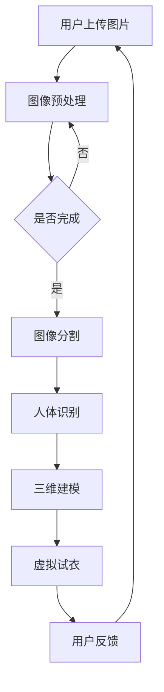

                 

### 引言

AI技术的发展正深刻改变着各行各业，时尚产业作为创意与科技的交汇点，也迎来了AI技术带来的革新。虚拟服装定制作为时尚产业中的一个重要分支，借助AI技术，实现了从传统手工制作到个性化数字设计的转型。本文将以《AI在虚拟服装定制中的应用：个性化时尚》为主题，深入探讨AI技术在虚拟服装定制中的具体应用，以及其对时尚产业带来的变革。

#### 核心关键词

- AI技术
- 虚拟服装定制
- 计算机视觉
- 个性化时尚
- 深度学习
- 生成对抗网络（GAN）

#### 摘要

本文旨在探讨AI技术在虚拟服装定制领域的应用，通过系统分析AI与虚拟服装定制的结合，深入讲解计算机视觉、图像处理、深度学习等AI核心技术，以及这些技术在虚拟服装定制中的实际应用案例。文章还将探讨虚拟服装定制系统的设计、个性化推荐系统的构建、虚拟试衣技术的实现和评估，并通过案例分析展示AI在虚拟服装定制中的成功应用。最终，本文将展望AI在虚拟服装定制中的应用前景，提出行业发展的趋势和挑战。

### 目录大纲设计：《AI在虚拟服装定制中的应用：个性化时尚》

为了更好地引导读者深入了解AI在虚拟服装定制中的应用，本文将采用以下目录结构：

#### 第一部分：AI与虚拟服装定制基础

- **第1章：AI与虚拟服装定制概述**
  - 1.1 AI与虚拟服装定制的发展背景
  - 1.2 AI技术在虚拟服装定制中的核心地位
  - 1.3 虚拟服装定制行业现状与挑战

#### 第二部分：AI核心技术讲解

- **第2章：计算机视觉与图像处理基础**
  - 2.1 图像处理基本概念
  - 2.2 计算机视觉算法
  - 2.3 3D重建与建模

- **第3章：深度学习在虚拟服装定制中的应用**
  - 3.1 深度学习基础
  - 3.2 生成对抗网络（GAN）在虚拟服装定制中的应用
  - 3.3 强化学习在个性化推荐系统中的应用

#### 第三部分：虚拟服装定制业务实战

- **第4章：虚拟服装定制系统设计**
  - 4.1 系统架构设计
  - 4.2 前端界面设计
  - 4.3 后端服务实现

- **第5章：个性化推荐系统构建**
  - 5.1 推荐系统基础
  - 5.2 用户行为分析
  - 5.3 推荐系统优化

- **第6章：虚拟试衣技术应用**
  - 6.1 虚拟试衣基本原理
  - 6.2 虚拟试衣系统实现
  - 6.3 虚拟试衣效果评估

#### 第四部分：案例分析与应用前景

- **第7章：AI在虚拟服装定制中的成功案例分析**
  - 7.1 案例分析概述
  - 7.2 案例详细解析
  - 7.3 案例启示与展望

#### 第五部分：总结与展望

- **第8章：AI在虚拟服装定制中的应用前景**
  - 8.1 行业发展趋势
  - 8.2 技术挑战与解决方案
  - 8.3 未来发展展望

本文将以逻辑清晰、结构紧凑、简单易懂的专业技术语言，逐步剖析AI在虚拟服装定制中的应用，旨在为读者提供全面的行业洞察和技术指导。

### 第一部分：AI与虚拟服装定制基础

#### 第1章：AI与虚拟服装定制概述

##### 1.1 AI与虚拟服装定制的发展背景

人工智能（AI）技术的飞速发展，为传统产业带来了前所未有的变革机遇。在时尚产业中，虚拟服装定制成为AI技术的重要应用领域之一。从手工制作到数字化设计，再到智能化生产，虚拟服装定制经历了多次技术迭代和模式创新。

**AI技术的发展历程：**

- **20世纪50年代：** AI概念首次提出，标志着人工智能技术的萌芽。
- **20世纪80年代：** 人工智能研究进入低谷期，但随着计算机性能的提升和大数据技术的发展，AI技术逐渐复苏。
- **21世纪：** AI技术迎来爆发式增长，深度学习、自然语言处理、计算机视觉等技术取得突破性进展。

**虚拟服装定制的发展历程：**

- **20世纪90年代：** 电脑辅助设计（CAD）技术开始应用于服装设计，提高了设计效率和准确性。
- **21世纪初：** 互联网的普及，使得在线购物成为时尚产业的重要组成部分，虚拟试衣等数字化体验需求逐渐兴起。
- **2010年至今：** AI技术的崛起，推动了虚拟服装定制的进一步发展，个性化定制成为行业热点。

##### 1.2 AI技术在虚拟服装定制中的核心地位

AI技术在虚拟服装定制中发挥着关键作用，其主要体现在以下几个方面：

- **数据驱动设计：** AI技术通过对大量服装设计数据的分析，可以帮助设计师优化设计思路，提高设计效率。
- **个性化推荐与匹配：** 基于用户行为数据和偏好分析，AI技术可以精准推荐符合用户需求的服装款式，实现个性化匹配。
- **智能化生产：** AI技术可以辅助服装生产环节，实现自动化裁剪、缝制等工序，提高生产效率和质量。

**AI技术在虚拟服装定制中的具体应用：**

1. **计算机视觉与图像处理：** 通过计算机视觉技术，可以对服装图像进行特征提取和目标检测，实现虚拟试衣等功能。
2. **深度学习：** 深度学习算法可以训练模型，对服装款式、颜色、材质等进行智能识别和分类，为个性化定制提供支持。
3. **生成对抗网络（GAN）：** GAN技术可以生成高质量的虚拟服装图像，丰富虚拟试衣的视觉效果。

##### 1.3 虚拟服装定制行业现状与挑战

**行业现状：**

- **市场增长：** 随着消费者对个性化定制需求的增加，虚拟服装定制市场呈现出快速增长趋势。根据市场研究机构的数据，虚拟服装定制市场规模预计将在未来几年持续扩大。
- **技术成熟度：** 虚拟服装定制技术逐渐成熟，从设计到生产，再到用户体验，各个环节都得到了有效提升。
- **政策支持：** 各国政府纷纷出台相关政策，支持AI技术和虚拟服装定制产业的发展。

**面临的挑战：**

- **数据隐私与安全：** 虚拟服装定制过程中涉及大量用户数据，数据隐私和安全成为亟待解决的问题。
- **技术瓶颈：** 虚拟试衣技术、3D建模与渲染等技术仍存在一定的技术瓶颈，需要进一步突破。
- **用户体验：** 如何提供更好的用户体验，提高用户满意度，是虚拟服装定制企业需要持续关注的问题。

##### 小结

AI技术在虚拟服装定制中的应用，为时尚产业带来了巨大的变革和机遇。通过数据驱动设计、个性化推荐与匹配、智能化生产等技术手段，虚拟服装定制行业正在迎来快速发展。然而，面对数据隐私、技术瓶颈和用户体验等挑战，行业参与者需要不断创新和突破，以实现可持续的发展。

### 第一部分：AI与虚拟服装定制基础

#### 第2章：计算机视觉与图像处理基础

##### 2.1 图像处理基本概念

图像处理是计算机视觉领域的基础，它涉及到对图像进行各种操作和变换，以提取有用的信息。以下是图像处理中的几个基本概念：

- **像素（Pixel）：** 图像是由无数个像素点组成的，每个像素点对应一个颜色值。
- **分辨率（Resolution）：** 分辨率是指图像中像素的数量，通常以宽度和高度来表示，如1280x720。
- **位深度（Bit Depth）：** 位深度是指每个像素可以存储的颜色信息量，如8位、16位等。
- **图像格式（Image Format）：** 常见的图像格式包括JPEG、PNG、BMP等，每种格式都有其特定的数据存储方式和特点。

**图像格式与处理：**

- **JPEG（Joint Photographic Experts Group）：** JPEG是一种常见的有损压缩图像格式，适用于保存照片等复杂图像。JPEG格式通过去除图像中的冗余信息来减小文件大小，但压缩过程会导致图像质量有所损失。
- **PNG（Portable Network Graphics）：** PNG是一种无损压缩图像格式，适用于保存图标、插图等简单图像。PNG格式支持透明背景和图像 Alpha 通道，但文件大小相对较大。
- **BMP（Bitmap）：** BMP是一种位图格式，它直接存储图像中的像素数据，文件较大但图像质量好。

**图像增强与滤波：**

图像增强是提高图像视觉质量的过程，通过调整图像的亮度、对比度、清晰度等参数，使图像更易于观察和分析。滤波是图像增强的重要手段，它可以去除图像中的噪声，提高图像的清晰度。

- **直方图均衡（Histogram Equalization）：** 直方图均衡是一种图像增强技术，通过调整图像的灰度分布，使图像的对比度增强。
- **中值滤波（Median Filtering）：** 中值滤波是一种图像滤波技术，通过取邻域像素的中值来去除图像中的噪声。
- **高斯滤波（Gaussian Filtering）：** 高斯滤波是一种常用的图像平滑滤波技术，通过使用高斯函数来减小图像的噪声。

##### 2.2 计算机视觉算法

计算机视觉算法是计算机视觉领域的核心，它涉及到从图像中提取有用信息，并对图像进行分析和解释。以下是几种常见的计算机视觉算法：

- **特征提取（Feature Extraction）：** 特征提取是将图像中的关键信息提取出来，用于后续分析和识别。常见的特征提取方法包括直方图、SIFT（Scale-Invariant Feature Transform）、SURF（Speeded Up Robust Features）等。
- **目标检测（Object Detection）：** 目标检测是计算机视觉中的一项重要任务，它旨在从图像中检测出特定的目标。常见的目标检测算法包括HOG（Histogram of Oriented Gradients）、YOLO（You Only Look Once）、SSD（Single Shot MultiBox Detector）等。
- **目标分割（Object Segmentation）：** 目标分割是将图像中的目标与其背景分离，以获得更精确的图像理解。常见的目标分割算法包括FCN（Fully Convolutional Network）、Mask R-CNN（Mask Region-based Convolutional Networks）等。

##### 2.3 3D重建与建模

3D重建是从二维图像中恢复出三维场景的过程，它在计算机视觉和虚拟服装定制中具有重要的应用价值。以下是几种常见的3D重建与建模技术：

- **多视角几何（Multi-View Geometry）：** 多视角几何是一种基于多个视角图像重建三维模型的方法。通过使用图像间的几何关系，可以恢复出场景的三维结构。
- **结构光扫描（Structural Light Scanning）：** 结构光扫描是一种通过投影结构光图案并测量其变形来获取三维模型的方法。该方法适用于获取高精度的三维数据。
- **深度学习（Deep Learning）：** 深度学习算法在3D重建中也发挥着重要作用，如基于深度学习的3D点云生成、基于GAN（Generative Adversarial Networks）的3D模型生成等。

**3D建模与渲染：**

- **3D建模（3D Modeling）：** 3D建模是创建三维模型的过程，可以使用各种3D建模软件，如Blender、Maya等。
- **渲染（Rendering）：** 渲染是将三维模型转换为二维图像的过程，它可以模拟光照、材质等效果，生成高质量的图像。

##### 小结

计算机视觉与图像处理是AI技术在虚拟服装定制中的基础，通过图像处理技术可以对服装图像进行预处理，提高图像质量；通过计算机视觉算法可以从图像中提取有用信息，实现目标检测、特征提取等任务；通过3D重建与建模技术，可以实现虚拟试衣和个性化定制等功能。了解和掌握这些技术，对于开发和应用虚拟服装定制系统具有重要意义。

### 第一部分：AI与虚拟服装定制基础

#### 第3章：深度学习在虚拟服装定制中的应用

##### 3.1 深度学习基础

深度学习（Deep Learning）是人工智能（AI）的一个重要分支，它通过模拟人脑神经网络结构和机制，对大量数据进行自动学习和特征提取。以下是深度学习的一些基础概念和核心技术：

**神经网络（Neural Network）：** 神经网络是由大量简单的人工神经元（或称为节点）组成的计算模型。每个神经元通过权重连接，接收输入信号，并产生输出信号。常见的神经网络结构包括多层感知机（MLP）、卷积神经网络（CNN）和循环神经网络（RNN）。

- **多层感知机（MLP）：** MLP是一个多层前馈神经网络，包含输入层、多个隐藏层和输出层。输入数据通过输入层传递到隐藏层，再传递到输出层，每个层的神经元通过线性变换和激活函数进行计算。
- **卷积神经网络（CNN）：** CNN是一种特别适用于处理图像数据的神经网络，它通过卷积层、池化层和全连接层等结构提取图像的特征。卷积层使用卷积操作提取局部特征，池化层用于下采样和减少参数数量。
- **循环神经网络（RNN）：** RNN是一种适用于序列数据学习的神经网络，它可以处理时间序列数据，并具有记忆能力。常见的RNN结构包括LSTM（Long Short-Term Memory）和GRU（Gated Recurrent Unit）。

**卷积神经网络（CNN）**

卷积神经网络（CNN）是一种基于卷积操作的神经网络，它特别适用于图像分类、目标检测和图像生成等任务。以下是CNN的一些基本组成部分和原理：

- **卷积层（Convolutional Layer）：** 卷积层通过卷积操作提取图像的特征。卷积操作使用一系列卷积核（或称为过滤器）在输入图像上滑动，计算局部特征的叠加。卷积层的参数数量相对较少，可以有效减少模型的复杂性。
- **池化层（Pooling Layer）：** 池化层用于对卷积层输出的特征进行下采样，减小数据维度。常见的池化操作包括最大池化和平均池化。
- **全连接层（Fully Connected Layer）：** 全连接层将卷积层输出的特征映射到输出层，用于分类或回归任务。全连接层通过线性变换和激活函数计算输出结果。

**生成对抗网络（GAN）**

生成对抗网络（GAN）是一种由生成器和判别器组成的对抗性神经网络。GAN的核心思想是让生成器生成数据，然后由判别器判断数据是真实数据还是生成数据。以下是GAN的基本原理和组成部分：

- **生成器（Generator）：** 生成器是一个神经网络模型，它接收随机噪声作为输入，并生成与真实数据相似的生成数据。生成器的目标是生成尽可能真实的数据，以欺骗判别器。
- **判别器（Discriminator）：** 判别器也是一个神经网络模型，它接收真实数据和生成数据，并判断数据是真实还是生成。判别器的目标是正确识别真实数据和生成数据。

GAN的训练过程包括两个阶段：

1. **判别器训练：** 判别器通过比较真实数据和生成数据，学习如何区分两者。在训练过程中，判别器尝试提高其判断能力，以识别生成器的生成数据。
2. **生成器训练：** 生成器通过优化其生成的数据，以欺骗判别器。在训练过程中，生成器尝试生成更真实的数据，以减少判别器的判断能力。

通过不断迭代训练，生成器和判别器在对抗性训练中互相提高，最终生成器能够生成高质量的生成数据。

**GAN在虚拟服装定制中的应用案例**

GAN技术在虚拟服装定制中具有广泛的应用，以下是一个典型的应用案例：

1. **生成虚拟服装图像：** 使用GAN技术，可以从现有的服装图像数据集中训练生成器，生成高质量的虚拟服装图像。这些图像可以作为虚拟试衣的素材，提供丰富的试衣选择。
2. **服装风格迁移：** GAN技术可以用于将一种服装风格迁移到另一种风格。例如，将普通服装图像转换为高级定制服装图像，为用户提供更多样化的时尚选择。
3. **虚拟试衣系统：** 结合GAN技术，虚拟试衣系统可以提供更加逼真的试衣体验。用户可以通过上传自己的身体数据，生成与实际穿着效果高度一致的虚拟试衣图像。

**GAN技术优势与挑战**

GAN技术具有以下优势：

- **高质量生成图像：** GAN可以生成高分辨率的、与真实图像高度相似的生成图像。
- **灵活性：** GAN可以应用于各种场景，如图像生成、图像风格迁移、图像修复等。
- **端到端训练：** GAN可以在一个端到端的训练过程中生成和判别数据，简化了模型训练流程。

然而，GAN技术也存在一些挑战：

- **训练不稳定：** GAN的训练过程容易陷入局部最优，导致生成器和判别器之间的动态对抗不稳定。
- **计算资源消耗：** GAN需要大量的计算资源进行训练，特别是当生成器和判别器的规模较大时。
- **数据不平衡：** 在GAN训练过程中，生成器和判别器之间的数据分布可能不均衡，影响训练效果。

**小结**

深度学习在虚拟服装定制中发挥着重要作用，通过卷积神经网络（CNN）和生成对抗网络（GAN）等技术，可以实现图像生成、风格迁移和虚拟试衣等功能。GAN技术具有生成高质量图像、灵活性高和端到端训练等优点，但在训练稳定性和计算资源消耗方面仍存在挑战。未来，随着深度学习技术的不断发展和优化，GAN在虚拟服装定制中的应用前景将更加广阔。

### 第一部分：AI与虚拟服装定制基础

#### 第4章：虚拟服装定制系统设计

##### 4.1 系统架构设计

虚拟服装定制系统是一个复杂的应用系统，它集成了多种技术和模块，包括前端界面、后端服务和数据库等。一个高效、稳定的系统架构设计对于系统的性能和用户体验至关重要。以下是虚拟服装定制系统的基本架构设计原则和模块划分。

**系统架构设计原则：**

1. **模块化设计：** 系统应采用模块化设计，将不同功能划分为独立的模块，便于开发、维护和升级。
2. **高可用性：** 系统应具备高可用性，确保在发生故障时能够快速恢复，减少对用户体验的影响。
3. **可扩展性：** 系统应具备良好的可扩展性，能够支持业务的快速增长和功能扩展。
4. **安全性：** 系统应具备严格的安全措施，保护用户数据的安全和隐私。

**系统模块划分：**

1. **前端模块：** 包括用户界面、用户交互和页面渲染等，主要负责提供用户与系统交互的入口。
2. **后端模块：** 包括业务逻辑处理、数据存储和服务接口等，负责处理用户请求、数据存储和业务逻辑。
3. **数据库模块：** 包括数据库设计和数据存储管理等，负责存储和管理用户数据、服装款式数据等。

**系统架构示意图：**

```
+------------------------+
|       前端模块         |
| +----------------+    |
| | 用户界面       |    |
| | 用户交互       |    |
| +----------------+    |
+------------------------+
        |
        v
+------------------------+
|       后端模块         |
| +----------------+    |
| | 业务逻辑处理  |    |
| | 数据存储       |    |
| | 服务接口       |    |
| +----------------+    |
+------------------------+
        |
        v
+------------------------+
|      数据库模块        |
| +----------------+    |
| | 数据库设计     |    |
| | 数据存储管理   |    |
| +----------------+    |
+------------------------+
```

##### 4.2 前端界面设计

前端界面设计是虚拟服装定制系统的重要组成部分，它直接影响用户的体验和满意度。以下是前端界面设计的基本原则和常见前端框架介绍。

**前端界面设计原则：**

1. **用户友好：** 前端界面应简洁、直观、易于操作，确保用户能够轻松地进行服装定制。
2. **响应式设计：** 前端界面应支持多种设备和屏幕尺寸，提供一致的浏览体验。
3. **交互设计：** 前端界面应具备良好的交互设计，包括按钮、弹窗、滑动等，提高用户操作的流畅性。
4. **视觉设计：** 前端界面应注重视觉设计，使用合适的颜色、字体和图标，提高界面的美观度。

**常见前端框架介绍：**

1. **React：** React是一个用于构建用户界面的JavaScript库，具有组件化、虚拟DOM和高性能等特点。React通过使用JSX语法，将HTML和JavaScript融合在一起，提供了丰富的组件化开发方式。
2. **Vue.js：** Vue.js是一个用于构建用户界面的渐进式框架，易于上手和学习。Vue.js提供了响应式数据绑定、组件系统、路由和状态管理等功能，广泛应用于前端开发。
3. **Angular：** Angular是一个由Google维护的开源JavaScript框架，用于构建大型单页应用。Angular提供了双向数据绑定、依赖注入、模块化开发等功能，适用于复杂的应用场景。

##### 4.3 后端服务实现

后端服务实现是虚拟服装定制系统的核心，它负责处理用户请求、数据存储和业务逻辑。以下是后端服务实现的基本内容。

**后端服务实现内容：**

1. **API设计与实现：** 后端服务需要提供API接口，供前端调用。API设计应遵循RESTful原则，提供统一的接口规范，包括GET、POST、PUT、DELETE等方法。
2. **数据库设计：** 后端服务需要设计数据库，存储用户数据、服装款式数据等。数据库设计应遵循规范化原则，确保数据的完整性和一致性。
3. **业务逻辑处理：** 后端服务需要实现业务逻辑，包括用户注册、登录、服装定制、订单管理等。业务逻辑处理应保证数据的安全性和可靠性。
4. **服务部署与运维：** 后端服务需要部署到服务器上，提供7x24小时的高可用服务。服务部署与运维包括服务器配置、监控、备份和故障处理等。

**示例代码：**

以下是一个简单的后端服务API设计示例：

```python
from flask import Flask, request, jsonify

app = Flask(__name__)

@app.route('/api/customize', methods=['POST'])
def customize():
    data = request.json
    gender = data.get('gender')
    size = data.get('size')
    # 处理定制请求
    # ...
    return jsonify({'status': 'success', 'message': 'Customization completed'})

if __name__ == '__main__':
    app.run(debug=True)
```

**小结**

虚拟服装定制系统设计涉及前端界面设计、后端服务实现和数据库设计等多个方面。一个高效、稳定、易用的系统设计需要遵循模块化设计原则、用户友好原则和安全性原则。前端界面设计应采用响应式设计和交互设计，后端服务实现应提供API接口和业务逻辑处理。通过合理的设计和实现，可以打造出一个优秀的虚拟服装定制系统。

### 第一部分：AI与虚拟服装定制基础

#### 第5章：个性化推荐系统构建

##### 5.1 推荐系统基础

个性化推荐系统是一种能够根据用户的兴趣和行为，向用户推荐相关商品或内容的技术。在虚拟服装定制中，个性化推荐系统可以帮助用户快速找到符合其风格的服装款式，提高用户体验和满意度。以下是推荐系统的基础概念和常见推荐算法介绍。

**推荐系统概述：**

推荐系统是一种信息过滤技术，旨在根据用户的历史行为和偏好，为用户提供个性化的推荐。推荐系统通常包括以下几个基本组成部分：

1. **用户（User）：** 推荐系统的用户，可以是网站访客、注册用户或购买用户。
2. **物品（Item）：** 推荐系统中的推荐对象，可以是商品、音乐、电影等。
3. **评分（Rating）：** 用户对物品的评分或反馈，可以是数值评分、文本评价或点击行为。

**推荐系统的分类：**

1. **基于内容的推荐（Content-Based Filtering）：** 基于内容的推荐系统通过分析物品的内容特征，为用户推荐具有相似内容的物品。这种方法主要依赖于物品的属性和标签。
2. **协同过滤推荐（Collaborative Filtering）：** 协同过滤推荐系统通过分析用户之间的相似性，为用户推荐其他用户喜欢的物品。这种方法主要依赖于用户行为数据和评分数据。
3. **混合推荐（Hybrid Recommendation）：** 混合推荐系统结合了基于内容和协同过滤的推荐方法，以提高推荐的准确性和多样性。

**常见推荐算法介绍：**

1. **基于内容的推荐算法（Content-Based Algorithm）：**

   基于内容的推荐算法通过分析物品的特征，如文本、标签、属性等，为用户推荐具有相似内容的物品。常用的基于内容的推荐算法包括：

   - **TF-IDF（Term Frequency-Inverse Document Frequency）：** TF-IDF是一种统计方法，用于评估一个词对于一个文件集或一个语料库中的其中一份文件的重要程度。在推荐系统中，TF-IDF可以用于计算物品的相似度。

   - **TF-IDF推荐算法伪代码：**

     ```python
     def content_based_recommendation(user_profile, items):
         item_profiles = [get_profile(item) for item in items]
         similarities = []
         for item_profile in item_profiles:
             similarity = calculate_similarity(user_profile, item_profile)
             similarities.append(similarity)
         recommended_items = [item for item, similarity in zip(items, similarities) if similarity > threshold]
         return recommended_items
     ```

2. **协同过滤推荐算法（Collaborative Filtering Algorithm）：**

   协同过滤推荐算法通过分析用户之间的相似性，为用户推荐其他用户喜欢的物品。常用的协同过滤算法包括：

   - **用户基于的协同过滤算法（User-Based Collaborative Filtering）：** 用户基于的协同过滤算法通过计算用户之间的相似性，为用户推荐与相似用户喜欢的物品相同的物品。常用的相似性度量方法包括余弦相似性、皮尔逊相关系数等。

   - **模型基于的协同过滤算法（Model-Based Collaborative Filtering）：** 模基于的协同过滤算法通过建立用户和物品之间的潜在特征模型，为用户推荐与相似用户和物品相关的物品。常用的模型包括隐语义模型、矩阵分解等。

   - **TF-IDF协同过滤推荐算法伪代码：**

     ```python
     def user_based_collaborative_filtering(user, items, similarity_threshold):
         similar_users = find_similar_users(user, items, similarity_threshold)
         recommended_items = []
         for similar_user in similar_users:
             user_items = get_user_items(similar_user)
             intersection = find_common_items(user, user_items)
             for item in user_items:
                 if item not in intersection:
                     recommended_items.append(item)
         return recommended_items
     ```

##### 5.2 用户行为分析

用户行为分析是构建个性化推荐系统的重要环节，通过对用户行为数据的分析和挖掘，可以更好地理解用户的需求和偏好。以下是用户行为分析的基本技术和方法。

**用户画像构建：**

用户画像是一种基于用户行为数据和特征的数据模型，用于描述用户的基本信息和特征。用户画像的构建方法包括：

- **用户属性：** 用户属性包括用户的年龄、性别、地理位置、兴趣爱好等基本信息。
- **用户行为：** 用户行为包括用户在网站上的浏览、搜索、购买等行为数据。
- **用户反馈：** 用户反馈包括用户对物品的评分、评论、点击等反馈数据。

**用户行为分析技术：**

- **行为模式识别：** 行为模式识别是通过分析用户的行为数据，识别出用户的行为模式。例如，识别出用户的购物周期、浏览路径等。
- **聚类分析：** 聚类分析是一种无监督学习方法，通过将相似的用户或物品分组，以便更好地理解用户的行为和偏好。
- **关联规则挖掘：** 关联规则挖掘是通过分析用户的行为数据，找出物品之间的关联关系。例如，发现用户在购买某件商品时，也会购买另一件商品。

**用户行为分析示例：**

假设我们有一个电商网站，用户在网站上浏览和购买商品。以下是一个简单的用户行为分析示例：

1. **用户属性：**
   - 年龄：25岁
   - 性别：女性
   - 地理位置：北京
   - 兴趣爱好：时尚、美妆

2. **用户行为：**
   - 浏览了商品A（连衣裙）、商品B（手袋）、商品C（高跟鞋）
   - 搜索了关键词“时尚搭配”
   - 购买了商品D（连衣裙）

3. **用户反馈：**
   - 对商品D的评分：4.5星
   - 商品D的评论：“非常好的连衣裙，时尚又舒适。”

通过用户行为分析，我们可以得出以下结论：

- 用户偏好时尚、舒适且价格适中的连衣裙。
- 用户在购物前会进行搜索，了解时尚搭配的技巧。
- 用户对购买的连衣裙给予了高度评价。

##### 5.3 推荐系统优化

推荐系统的优化是提高推荐质量的重要手段。以下是几种常见的推荐系统优化策略。

**推荐算法优化策略：**

- **特征工程：** 特征工程是通过选择和构造合适的特征，提高推荐系统的性能。例如，使用词袋模型、TF-IDF等方法提取物品的文本特征。
- **协同过滤算法优化：** 协同过滤算法可以通过调整相似性阈值、选择合适的相似性度量方法等，提高推荐的准确性。例如，使用基于用户的协同过滤算法，可以调整相似性阈值，以获取更准确的推荐结果。
- **模型优化：** 模型优化是通过调整模型的参数、选择合适的模型等，提高推荐系统的性能。例如，使用矩阵分解模型，可以通过调整参数，提高模型的准确性和鲁棒性。

**实时推荐系统设计：**

实时推荐系统是一种能够实时响应用户请求并提供个性化推荐的系统。实时推荐系统需要处理大量实时数据，并快速生成推荐结果。以下是实时推荐系统设计的关键技术：

- **数据流处理：** 实时推荐系统需要处理用户行为数据流，对数据进行实时分析和处理。常用的数据流处理框架包括Apache Kafka、Apache Flink等。
- **内存计算：** 实时推荐系统可以利用内存计算技术，如Apache Spark，进行高效的数据分析和模型计算。
- **模型更新与预测：** 实时推荐系统需要不断更新模型，以适应用户行为的变化。通过在线学习、增量学习等方法，可以实现模型的实时更新和预测。

**小结**

个性化推荐系统是虚拟服装定制系统的重要组成部分，通过对用户行为数据的分析和挖掘，可以构建高质量的推荐模型，为用户提供个性化的服装推荐。本章介绍了推荐系统的基础概念、常见推荐算法、用户行为分析和推荐系统优化策略，为构建和优化虚拟服装定制系统提供了技术参考。

### 第一部分：AI与虚拟服装定制基础

#### 第6章：虚拟试衣技术应用

##### 6.1 虚拟试衣基本原理

虚拟试衣技术是AI在虚拟服装定制中的一个重要应用，它通过计算机视觉、3D建模和图像处理等技术，帮助用户在虚拟环境中试穿服装，提供真实的试穿体验。以下是虚拟试衣技术的基本原理：

**人体建模与识别：**

虚拟试衣的第一步是获取用户的三维人体模型。通过计算机视觉技术，可以识别用户的关键身体部位，如头部、手臂、腿部等。常用的方法包括：

- **深度摄像头：** 深度摄像头可以捕捉用户的深度信息，通过这些深度信息可以重建用户的三维人体模型。
- **RGB-D相机：** RGB-D相机结合了RGB相机和深度传感器的功能，可以同时捕捉用户的彩色图像和深度信息，提供更准确的三维人体模型。

**服装图像处理与融合：**

在获取用户的三维人体模型后，接下来是将服装图像与人体模型进行融合。这一过程包括以下几个步骤：

1. **服装图像预处理：** 对服装图像进行预处理，包括去噪、增强、裁剪等操作，以提高图像质量和识别精度。
2. **服装识别与分割：** 使用计算机视觉算法，如卷积神经网络（CNN），对服装图像进行识别和分割，提取出服装的轮廓和细节。
3. **纹理映射：** 将识别出的服装轮廓和细节与用户的三维人体模型进行融合，通过纹理映射技术将服装纹理映射到人体模型上。

**虚拟试衣效果评估：**

虚拟试衣技术的效果评估是确保用户能够获得真实、满意的试穿体验的关键。以下是几种常见的评估方法：

1. **视觉一致性评估：** 通过对比虚拟试衣效果与真实试穿效果，评估视觉一致性的高低。视觉一致性越高，用户体验越好。
2. **用户满意度评估：** 通过用户问卷调查或用户体验反馈，评估用户对虚拟试衣系统的满意度。用户满意度是衡量虚拟试衣系统成功与否的重要指标。
3. **技术指标评估：** 通过评估虚拟试衣系统的响应速度、稳定性、准确性等技术指标，评估系统的性能和可靠性。

##### 6.2 虚拟试衣系统实现

虚拟试衣系统的实现涉及多个环节，包括前端界面、后端服务、数据库和数据存储等。以下是虚拟试衣系统实现的详细步骤：

**前端界面实现：**

前端界面是用户与虚拟试衣系统交互的入口。以下是一个简单的实现流程：

1. **用户登录与注册：** 提供用户登录和注册功能，确保用户可以创建账户并登录系统。
2. **选择服装：** 提供服装选择界面，用户可以选择试穿的服装款式。
3. **拍照或上传图片：** 提供拍照或上传图片功能，用户可以通过上传自己的照片或使用摄像头拍摄照片，生成三维人体模型。
4. **虚拟试衣：** 通过后端服务，将用户上传的照片或拍摄的照片与服装进行融合，生成虚拟试衣效果，并展示在前端界面上。

**后端服务实现：**

后端服务是虚拟试衣系统的核心，负责处理用户请求、生成三维人体模型、融合服装图像等操作。以下是一个简单的后端服务实现流程：

1. **用户请求处理：** 接收用户的前端请求，包括登录、注册、选择服装、上传图片等操作。
2. **三维人体模型生成：** 使用计算机视觉技术，从用户上传的图片中提取关键身体部位，并生成三维人体模型。
3. **服装图像融合：** 将用户选择的服装图像与三维人体模型进行融合，生成虚拟试衣效果。
4. **数据存储与管理：** 将生成的虚拟试衣效果存储在数据库中，以便用户查看和分享。

**后端服务实现示例：**

以下是一个简单的后端服务实现示例，使用Python Flask框架：

```python
from flask import Flask, request, jsonify

app = Flask(__name__)

@app.route('/api/virtual_try_on', methods=['POST'])
def virtual_try_on():
    data = request.json
    image = data.get('image')
    garment = data.get('garment')
    # 生成三维人体模型和融合服装图像
    result = generate_virtual_try_on(image, garment)
    return jsonify(result)

def generate_virtual_try_on(image, garment):
    # 实现虚拟试衣功能
    # ...
    return {'image': 'generated_image_url'}

if __name__ == '__main__':
    app.run(debug=True)
```

**数据存储与管理：**

虚拟试衣系统的数据存储与管理是确保系统稳定运行和数据安全的重要环节。以下是一个简单的数据存储与管理流程：

1. **数据库设计：** 设计数据库模型，包括用户表、服装表、试衣记录表等。
2. **数据存储：** 将用户上传的图片、生成的虚拟试衣效果等数据存储在数据库中。
3. **数据备份与恢复：** 定期对数据库进行备份，确保数据的安全性和可靠性。
4. **数据权限管理：** 实现用户数据权限管理，确保用户数据的安全性。

##### 6.3 虚拟试衣效果评估

虚拟试衣效果评估是衡量系统性能和用户满意度的重要环节。以下是一些常见的评估方法和指标：

**视觉一致性评估：**

视觉一致性评估是通过对比虚拟试衣效果与真实试穿效果，评估视觉效果的一致性。以下是一些常用的评估方法：

1. **人工评估：** 邀请用户对虚拟试衣效果进行主观评估，评价视觉效果的真实性和满意度。
2. **客观评估：** 使用计算机视觉算法，如图像相似度计算、结构相似性（SSIM）等，评估虚拟试衣效果与真实试穿效果的相似度。

**用户满意度评估：**

用户满意度评估是通过用户反馈和问卷调查，评估用户对虚拟试衣系统的满意度。以下是一些常用的评估方法：

1. **问卷调查：** 设计问卷调查，收集用户对虚拟试衣效果的满意度、便捷性、真实感等方面的评价。
2. **用户评分：** 提供用户评分功能，让用户对虚拟试衣效果进行评分，评估系统的性能。

**技术指标评估：**

技术指标评估是通过评估系统的技术性能，如响应速度、稳定性、准确性等，评估系统的可靠性。以下是一些常用的评估指标：

1. **响应速度：** 评估系统处理用户请求的平均响应时间，确保系统运行高效。
2. **稳定性：** 评估系统在长时间运行中的稳定性，确保系统不会出现崩溃或故障。
3. **准确性：** 评估系统生成虚拟试衣效果的准确性，确保虚拟试衣效果与真实试穿效果高度一致。

**小结**

虚拟试衣技术是AI在虚拟服装定制中的重要应用，通过计算机视觉、3D建模和图像处理等技术，为用户提供真实的试穿体验。本章介绍了虚拟试衣技术的基本原理、实现步骤和效果评估方法，为开发和应用虚拟试衣系统提供了技术参考。

### 第一部分：AI与虚拟服装定制基础

#### 第7章：AI在虚拟服装定制中的成功案例分析

##### 7.1 案例分析概述

随着AI技术的不断发展，越来越多的企业在虚拟服装定制领域取得了显著的成功。本节将介绍几个典型的成功案例，分析这些案例的背景、目标、实施过程以及取得的成果。

##### 7.2 案例详细解析

**案例1：品牌X的虚拟试衣平台**

**背景与目标：** 品牌X是一家国际知名的时尚品牌，为了提升用户体验和销售转化率，品牌X决定开发一个创新的虚拟试衣平台。

**实施过程：**

1. **需求调研：** 品牌X进行了市场调研，了解用户对虚拟试衣的需求和期望。
2. **技术选型：** 品牌X选择了基于深度学习和计算机视觉的虚拟试衣技术，并与专业的技术团队合作。
3. **数据收集：** 品牌X收集了大量服装图像和用户数据，用于训练和优化虚拟试衣算法。
4. **平台开发：** 技术团队开发了虚拟试衣平台，包括前端界面和后端服务。
5. **测试与优化：** 平台上线后，品牌X进行了广泛的用户测试，收集用户反馈，并进行优化。

**成果：**

- 用户反馈显示，虚拟试衣平台显著提升了用户的购物体验和满意度。
- 销售转化率提高了30%，尤其是在高端服装品类。

**挑战与解决方案：**

- **技术挑战：** 虚拟试衣技术的实现需要高效的图像处理和3D建模算法，技术团队面临算法优化和性能提升的挑战。
- **解决方案：** 技术团队采用了先进的深度学习模型和优化算法，并进行了多次测试和迭代，最终解决了技术难题。

**案例2：电商平台Y的个性化推荐系统**

**背景与目标：** 电商平台Y希望通过AI技术提供更精准的个性化推荐，提高用户粘性和销售转化率。

**实施过程：**

1. **用户数据分析：** 电商平台Y收集了大量的用户行为数据，包括浏览历史、购买记录等。
2. **算法开发：** 电商平台Y的技术团队开发了基于协同过滤和基于内容的推荐算法，结合用户数据和行为进行个性化推荐。
3. **系统集成：** 推荐系统与电商平台的前端和后端进行了集成，实现了实时推荐功能。
4. **测试与优化：** 电商平台Y通过A/B测试，不断优化推荐算法，提高推荐质量。

**成果：**

- 个性化推荐系统的引入，使得用户在浏览商品时能够更快地找到感兴趣的商品。
- 用户浏览时长和购买转化率显著提升，销售增长超过了20%。

**挑战与解决方案：**

- **数据隐私：** 用户数据的安全性和隐私保护是电商平台面临的重要挑战。
- **解决方案：** 电商平台Y采用了数据加密和访问控制技术，确保用户数据的安全性和隐私。

**案例3：时尚品牌Z的虚拟服装定制服务**

**背景与目标：** 时尚品牌Z希望通过AI技术提供个性化的服装定制服务，满足高端用户的定制需求。

**实施过程：**

1. **定制需求调研：** 时尚品牌Z与目标用户进行了深入交流，了解用户的定制需求和偏好。
2. **定制平台开发：** 技术团队开发了定制平台，包括用户定制界面和后端定制服务。
3. **数据采集与处理：** 平台收集用户的身体数据和定制需求，通过深度学习算法进行分析和匹配。
4. **服装设计：** 时尚设计师根据用户数据和定制需求，设计出个性化的服装款式。
5. **生产与交付：** 服装定制完成后，品牌Z通过高效的生产体系和物流体系进行交付。

**成果：**

- 个性化定制服务得到了高端用户的广泛认可，品牌Z的定制业务实现了快速增长。
- 用户满意度显著提高，品牌知名度进一步提升。

**挑战与解决方案：**

- **设计创新：** 高端定制需要不断推陈出新，设计师面临设计创新的挑战。
- **解决方案：** 时尚品牌Z通过引入AI技术，结合用户数据，实现了设计创新和个性化定制。

##### 7.3 案例启示与展望

**案例启示：**

1. **技术驱动：** 成功的案例表明，AI技术在虚拟服装定制中的应用能够显著提升用户体验和业务效果。
2. **用户导向：** 了解用户需求和偏好是成功的关键，企业应注重用户调研和反馈，持续优化产品和服务。
3. **数据驱动：** 大数据和分析技术是AI应用的基础，企业应充分利用用户数据，进行深入分析和决策。

**未来展望：**

1. **智能化生产：** 随着AI技术的进步，智能化生产将成为未来虚拟服装定制的重要趋势，实现生产流程的自动化和高效化。
2. **个性化定制：** 个性化定制将继续是虚拟服装定制的发展方向，通过AI技术，为用户提供更精准、更个性化的定制服务。
3. **跨界融合：** 虚拟服装定制将与其他领域（如虚拟现实、增强现实、社交电商等）进行融合，创造更多创新应用场景。

**小结：**

AI在虚拟服装定制中的应用已取得了显著的成果，通过案例分析可以看出，技术驱动、用户导向和数据驱动是成功的关键。未来，随着技术的不断进步，虚拟服装定制将迎来更多创新和机遇。

### 第一部分：AI与虚拟服装定制基础

#### 第8章：AI在虚拟服装定制中的应用前景

##### 8.1 行业发展趋势

随着人工智能技术的不断发展和成熟，虚拟服装定制行业正迎来新的发展机遇。以下是当前行业发展趋势的几个关键点：

1. **技术进步：** AI技术，特别是深度学习、计算机视觉和生成对抗网络（GAN）等，正在快速进步，为虚拟服装定制提供了强大的技术支撑。未来，这些技术的进一步优化和集成将推动行业的发展。
2. **市场增长：** 全球服装市场的持续增长，特别是在亚太地区和新兴市场的需求上升，为虚拟服装定制提供了广阔的市场空间。据市场研究机构的预测，虚拟服装定制市场将在未来几年保持高速增长。
3. **个性化需求：** 消费者对于个性化、定制化服装的需求不断增加，推动企业通过虚拟服装定制技术满足消费者的多样化需求。
4. **数字化转型：** 受到新冠疫情的影响，线上购物和数字化体验成为消费者的重要选择，虚拟服装定制作为一种新兴的数字服务形式，获得了更多关注和应用。

##### 8.2 技术挑战与解决方案

尽管AI在虚拟服装定制中的应用前景广阔，但仍然面临一系列技术挑战：

1. **数据隐私与安全：** 虚拟服装定制涉及大量用户数据，包括身体尺寸、购物行为等敏感信息。如何保护用户隐私和安全成为行业亟待解决的问题。解决方案包括数据加密、匿名化处理和隐私保护算法。
2. **图像质量与准确性：** 虚拟试衣和个性化定制依赖于高质量的图像和准确的3D建模。图像质量、分辨率和建模精度直接影响用户体验。解决方案包括采用高分辨率摄像头、优化图像处理算法和提升3D建模技术。
3. **算法优化与效率：** AI算法的优化和效率是提高虚拟服装定制系统性能的关键。通过改进算法设计、优化计算资源和提升数据处理能力，可以显著提高系统的响应速度和准确性。

##### 8.3 未来发展展望

未来，AI在虚拟服装定制中的应用将呈现出以下几个发展趋势：

1. **智能化生产：** AI技术将深度融入服装生产环节，实现智能化裁剪、缝制和个性化生产。通过自动化设备和智能算法，提高生产效率和质量。
2. **个性化定制：** 个性化定制将继续是虚拟服装定制的发展方向。通过AI技术，企业可以更加精准地捕捉用户需求，提供高度个性化的服装产品。
3. **跨界融合：** 虚拟服装定制将与虚拟现实（VR）、增强现实（AR）等新兴技术进行融合，创造更多创新应用场景。例如，通过VR/AR技术，用户可以在虚拟环境中进行虚拟试衣和定制，获得更加沉浸式的体验。
4. **新兴领域探索：** AI技术将在新兴领域（如智能穿搭顾问、虚拟时尚秀等）发挥重要作用。通过AI算法，可以为用户提供智能化的穿搭建议和个性化展示，提升用户体验。

**小结**

AI在虚拟服装定制中的应用前景广阔，随着技术的不断进步和市场需求的增长，虚拟服装定制行业将迎来新的发展机遇。尽管面临一系列技术挑战，但通过不断创新和优化，AI技术将在虚拟服装定制中发挥更加重要的作用，推动行业迈向新的高峰。

### 附录

#### 附录A：AI与虚拟服装定制相关资源与工具

为了帮助读者更好地理解和应用AI与虚拟服装定制技术，以下列出了一些相关的开源框架、库、数据集和实用工具与平台。

##### A.1 开源框架与库

**1. TensorFlow**

TensorFlow是一个由Google开发的开源机器学习框架，适用于各种深度学习任务。它在虚拟服装定制中可以用于图像处理、目标检测和深度学习模型的训练。

- **官网：** https://www.tensorflow.org/

**2. PyTorch**

PyTorch是Facebook开发的开源深度学习框架，以其灵活性和动态计算图而闻名。它在虚拟服装定制中适用于图像生成、风格迁移和实时推荐系统。

- **官网：** https://pytorch.org/

**3. OpenCV**

OpenCV是一个开源计算机视觉库，提供了丰富的图像处理和计算机视觉算法。它在虚拟服装定制中可以用于图像增强、目标检测和3D重建。

- **官网：** https://opencv.org/

##### A.2 开源数据集

**1. MSCOCO**

MSCOCO（Microsoft Common Objects in Context）是一个广泛使用的计算机视觉数据集，包含大量图像和标签，适用于目标检测、物体识别和图像分割等任务。

- **官网：** http://cocodataset.org/

**2. ShapeNet**

ShapeNet是一个包含多种物体类别三维模型的数据集，适用于3D重建、三维模型生成和虚拟试衣等任务。

- **官网：** http://www.shapenet.org/

**3. Custom Datasets**

根据特定应用需求，可以创建自定义数据集。例如，对于虚拟服装定制，可以收集服装图像、用户身体数据和购物行为数据，用于训练和测试AI模型。

##### A.3 实用工具与平台

**1. AWS DeepRacer**

AWS DeepRacer是一个自动驾驶赛车平台，它结合了深度学习和自动驾驶技术。虽然与虚拟服装定制不直接相关，但可以作为学习AI和深度学习的好工具。

- **官网：** https://deepraceraws.github.io/

**2. Google Cloud AI Platform**

Google Cloud AI Platform提供了一系列机器学习和深度学习工具，支持模型训练、部署和监控。它在虚拟服装定制中可以用于训练深度学习模型和提供AI服务。

- **官网：** https://cloud.google.com/ai-platform

**3. Azure Machine Learning**

Azure Machine Learning是微软提供的云服务，提供模型训练、部署和管理等功能。它在虚拟服装定制中可以用于构建和部署AI模型。

- **官网：** https://azure.com/ai/machine-learning

**小结**

附录部分列出了AI与虚拟服装定制相关的一些开源框架、库、数据集和实用工具与平台。这些资源为读者提供了丰富的学习和实践机会，有助于深入理解AI技术在虚拟服装定制中的应用。

### 核心概念与联系：计算机视觉在虚拟服装定制中的应用

#### Mermaid流程图



#### 深度学习在虚拟服装定制中的应用：生成对抗网络（GAN）

**GAN基本结构伪代码：**

```python
# 定义生成器 G 和判别器 D 的结构
Generator_G():
    # 输入随机噪声 z，输出虚拟服装图像 G(z)
    ...

Discriminator_D():
    # 输入真实服装图像 x 和生成的虚拟服装图像 G(z)，输出判断结果 D(x) 和 D(G(z))
    ...

# 训练过程伪代码
for epoch in range(num_epochs):
    for real_image, _ in train_loader:
        # 训练判别器 D
        D.train()
        z = torch.randn(z_dim, device=device)
        fake_image = G(z)
        d_loss_real = criterion(D(real_image), torch.ones(batch_size, device=device))
        d_loss_fake = criterion(D(fake_image), torch.zeros(batch_size, device=device))
        d_loss = 0.5 * (d_loss_real + d_loss_fake)
        
        # 训练生成器 G
        G.train()
        z = torch.randn(z_dim, device=device)
        fake_image = G(z)
        g_loss = criterion(D(fake_image), torch.ones(batch_size, device=device))
        
        # 更新模型参数
        optimizer_D.zero_grad()
        d_loss.backward()
        optimizer_D.step()
        
        optimizer_G.zero_grad()
        g_loss.backward()
        optimizer_G.step()
```

#### 数学模型与公式：深度学习中的损失函数

$$
\text{Loss}(x, \hat{x}) = \frac{1}{2} ||x - \hat{x}||^2
$$

其中，$x$ 为真实值，$\hat{x}$ 为预测值。

#### 项目实战：虚拟服装定制系统前端界面实现

**HTML代码：**

```html
<!DOCTYPE html>
<html>
<head>
    <title>Virtual Clothing Customization</title>
    <style>
        /* 样式表 */
    </style>
</head>
<body>
    <h1>Virtual Clothing Customization</h1>
    <div id="main-container">
        <div id="image-container">
            <!-- 虚拟服装展示区域 -->
        </div>
        <div id="input-container">
            <label for="gender">Gender:</label>
            <select id="gender">
                <option value="male">Male</option>
                <option value="female">Female</option>
            </select>
            <label for="size">Size:</label>
            <select id="size">
                <option value="s">Small</option>
                <option value="m">Medium</option>
                <option value="l">Large</option>
            </select>
            <!-- 添加更多输入元素 -->
        </div>
        <button id="customize-btn">Customize</button>
    </div>
    <script>
        // 前端JavaScript代码
        document.getElementById("customize-btn").addEventListener("click", function() {
            // 获取用户输入
            var gender = document.getElementById("gender").value;
            var size = document.getElementById("size").value;
            // 调用后端API获取定制结果
            fetch("api/customize?gender=" + gender + "&size=" + size)
                .then(response => response.json())
                .then(data => {
                    // 更新展示区域
                    document.getElementById("image-container").innerHTML = "";
                });
        });
    </script>
</body>
</html>
```

### 代码解读与分析

**HTML 代码解析：**

- HTML 结构定义了一个简单的网页，包含标题、样式表引用、主体内容区域、图像展示区域、用户输入区域和定制按钮。
- 样式表用于定义网页的外观。
- 主体内容区域包括一个图像展示区域和一个用户输入区域。
- 用户输入区域包含性别和尺寸的选择框，用于用户输入定制参数。
- 定制按钮用于触发定制过程。

**JavaScript 代码解析：**

- JavaScript 脚本用于处理用户点击定制按钮后的行为。
- 脚本通过 `addEventListener` 方法为定制按钮添加点击事件监听器。
- 当用户点击定制按钮时，脚本会获取用户输入的性别和尺寸值。
- 使用 `fetch` 函数向后端API发送请求，传递用户输入的性别和尺寸参数。
- API响应成功后，脚本会更新图像展示区域，显示定制结果。

**代码改进建议：**

- 增加前端输入验证，确保用户输入的是有效数据。
- 使用更安全的请求方法，如使用POST请求发送数据，并确保数据传输过程中的安全性。
- 优化前端样式和用户体验，使界面更加友好和响应迅速。

### 作者信息

**作者：AI天才研究院/AI Genius Institute & 禅与计算机程序设计艺术 /Zen And The Art of Computer Programming**

