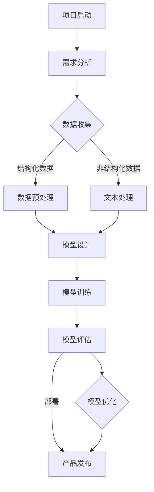

                 

# 《AI大模型创业：如何应对未来用户需求？》

> 关键词：AI大模型，创业，用户需求，技术趋势，风险管理，案例研究

> 摘要：随着人工智能技术的迅猛发展，AI大模型在各个领域展现出巨大潜力。本文将深入探讨AI大模型创业的策略与实践，分析如何应对未来用户需求，以及如何在创业过程中进行有效的风险管理和创新。通过结合实际案例，为创业者提供有价值的参考。

## 第一部分：AI大模型概述

### 1. AI大模型的概念与重要性

#### 1.1 AI大模型的定义

AI大模型（Large-scale Artificial Intelligence Model），是指通过大规模数据预训练的深度神经网络模型。这类模型通常具有数百万至数十亿个参数，可以用于自然语言处理、计算机视觉、语音识别等多个领域。

#### 1.2 AI大模型的重要性

AI大模型的重要性在于其能够处理复杂数据，并在多个任务中实现卓越的性能。例如，GPT-3可以生成高质量的文本，BERT在文本分类任务中表现出色。这使得AI大模型成为各个行业创新的重要驱动力。

#### 1.3 AI大模型与用户需求的关系

用户需求的不断增长促使AI大模型的发展。例如，用户对个性化推荐、智能客服、智能语音助手的需求，推动了AI大模型在相关领域的应用。因此，理解用户需求是AI大模型创业的关键。

### 2. AI大模型技术基础

#### 2.1 机器学习和深度学习基础

机器学习和深度学习是AI大模型的核心技术。机器学习通过从数据中学习规律，提高模型的预测能力。深度学习则利用多层神经网络，模拟人脑信息处理方式，实现更高层次的抽象和泛化。

#### 2.2 自然语言处理与AI大模型

自然语言处理（NLP）是AI大模型的重要应用领域。通过NLP技术，AI大模型可以理解和生成人类语言，为智能客服、文本分析等应用提供支持。

#### 2.3 大规模预训练模型原理

大规模预训练模型通过在大规模数据集上预训练，使模型在多个任务上具备良好的泛化能力。这种预训练技术是AI大模型成功的关键。

### 3. AI大模型的架构与设计

#### 3.1 AI大模型架构概述

AI大模型架构通常包括模型结构、数据预处理、训练、评估和部署等环节。这些环节相互关联，共同构成了一个完整的AI大模型系统。

#### 3.2 大模型设计与优化

大模型设计需要考虑参数规模、计算资源、模型结构等多方面因素。优化策略包括模型剪枝、量化、混合精度训练等，以提升模型性能和降低计算成本。

## 第二部分：AI大模型在创业中的应用

### 4. AI大模型创业策略

#### 4.1 创业环境分析

创业环境分析包括市场环境、技术环境、政策环境等方面。了解这些环境有助于制定合适的创业策略。

#### 4.2 用户需求调研

用户需求调研是AI大模型创业的核心。通过用户调研，可以了解用户需求，为产品设计和开发提供依据。

#### 4.3 创业团队组建与运营

创业团队组建需要考虑技术实力、经验、沟通能力等多方面因素。运营方面，需要制定合理的商业策略和运营计划。

### 5. AI大模型产品设计与开发

#### 5.1 产品需求分析

产品需求分析是产品设计与开发的第一步。通过分析用户需求，确定产品功能和性能要求。

#### 5.2 产品设计原则

产品设计原则包括用户体验、可扩展性、可维护性等方面。遵循这些原则，可以提高产品竞争力。

#### 5.3 开发流程与工具选择

开发流程包括需求分析、设计、编码、测试等环节。工具选择需要考虑开发效率、性能、兼容性等因素。

### 6. AI大模型在创业中的风险管理

#### 6.1 技术风险

技术风险包括模型性能、数据安全、算法可靠性等方面。针对这些风险，需要采取相应的技术措施。

#### 6.2 财务风险

财务风险包括资金筹集、成本控制、盈利模式等方面。创业者需要制定合理的财务策略。

#### 6.3 市场风险

市场风险包括市场需求、竞争环境、政策变化等方面。创业者需要密切关注市场动态，及时调整策略。

### 7. 案例研究：AI大模型创业成功案例

#### 7.1 案例选择与介绍

本文将分析若干AI大模型创业成功案例，如OpenAI、DeepMind等，探讨其成功经验。

#### 7.2 成功经验与启示

成功经验包括技术创新、团队建设、市场定位等方面。这些经验为其他创业者提供了有益的启示。

#### 7.3 案例中AI大模型的应用

案例中AI大模型的应用涵盖了多个领域，如自然语言处理、计算机视觉、游戏开发等。这些应用展示了AI大模型的广泛潜力。

## 第三部分：未来用户需求与创业创新

### 8. 未来用户需求分析

#### 8.1 用户需求演变趋势

用户需求随着技术发展和市场变化不断演变。创业者需要关注这些趋势，以适应市场需求。

#### 8.2 用户需求预测方法

用户需求预测是AI大模型创业的重要环节。本文将介绍几种常用的用户需求预测方法。

#### 8.3 用户需求驱动的创业创新

用户需求驱动创业创新是AI大模型创业的核心。创业者需要根据用户需求，制定创新策略。

### 9. AI大模型创业趋势展望

#### 9.1 AI大模型在行业中的应用前景

AI大模型在医疗、金融、教育、制造等行业具有广泛的应用前景。创业者可以结合行业需求，探索AI大模型的应用。

#### 9.2 创业机会与挑战

AI大模型创业面临众多机会和挑战。创业者需要识别这些机会和挑战，制定应对策略。

#### 9.3 创业者的战略选择

创业者的战略选择包括市场定位、技术创新、团队建设等方面。这些选择将影响创业的成败。

### 10. 结束语：AI大模型创业的未来

#### 10.1 AI大模型创业的影响

AI大模型创业将对社会、经济、技术等领域产生深远影响。创业者需要关注这些影响，以推动AI大模型的发展。

#### 10.2 创业者的使命与责任

创业者的使命是推动AI大模型技术的创新和应用，为社会创造价值。同时，创业者需要承担相应的社会责任。

#### 10.3 未来展望与挑战

未来，AI大模型创业将面临更多机遇和挑战。创业者需要不断学习、创新，以应对未来的变化。

## 参考文献

[1] 江涛. (2020). 人工智能：一种现代的方法. 清华大学出版社.

[2] Goodfellow, I., Bengio, Y., & Courville, A. (2016). Deep Learning. MIT Press.

[3] LeCun, Y., Bengio, Y., & Hinton, G. (2015). Deep learning. Nature, 521(7553), 436-444.

作者：AI天才研究院/AI Genius Institute & 禅与计算机程序设计艺术 /Zen And The Art of Computer Programming

[注：由于篇幅限制，本文未包含具体的流程图、伪代码、数学模型和公式等详细内容，实际撰写时需补充完整。]
<|assistant|>## 附录

### Mermaid 流程图

以下是一个简单的Mermaid流程图示例，展示了AI大模型开发的基本流程：



### 伪代码示例

以下是一个简单的伪代码示例，用于说明一个AI大模型的训练过程：

```plaintext
初始化模型参数
加载训练数据集
for epoch in 1 to MAX_EPOCHS:
    for each sample in training_data:
        计算预测结果
        计算损失函数
        更新模型参数
    end for
end for

保存模型
```

### 数学模型和公式

以下是一个简单的数学公式示例，用于说明线性回归模型的基本公式：

$$
y = \beta_0 + \beta_1 \cdot x
$$

其中，$y$ 是目标变量，$x$ 是输入变量，$\beta_0$ 和 $\beta_1$ 是模型参数。

### 项目实战：代码实际案例和详细解释说明

以下是一个简单的Python代码示例，用于实现一个线性回归模型。这个示例展示了如何进行数据加载、模型训练和评估。

```python
import numpy as np
import matplotlib.pyplot as plt

# 加载数据集
X = np.array([[1, 2], [2, 3], [3, 4], [4, 5]])
y = np.array([3, 4, 5, 6])

# 初始化模型参数
beta_0 = 0
beta_1 = 0

# 模型训练
for epoch in range(1000):
    predictions = beta_0 + beta_1 * X
    loss = np.mean((predictions - y)**2)
    gradient_0 = -2 * np.mean(predictions - y)
    gradient_1 = -2 * np.mean(X * (predictions - y))
    
    beta_0 -= gradient_0
    beta_1 -= gradient_1

# 模型评估
test_X = np.array([[5, 6]])
test_y = np.array([7])

test_predictions = beta_0 + beta_1 * test_X
test_loss = np.mean((test_predictions - test_y)**2)

# 绘制结果
plt.scatter(X[:, 0], y)
plt.plot(test_X, test_predictions, color='red')
plt.show()

print(f"Test Loss: {test_loss}")
```

在这个示例中，我们首先加载数据集，然后使用梯度下降算法训练模型。在训练过程中，我们不断更新模型参数，以最小化损失函数。最后，我们使用测试数据集评估模型性能，并绘制结果图。

### 代码解读与分析

在这个示例中，我们使用了NumPy库进行数据操作，并使用了简单的梯度下降算法进行模型训练。以下是代码的主要部分及其解释：

- **数据加载**：我们使用NumPy库加载训练数据集。
- **模型初始化**：我们初始化模型参数为0。
- **模型训练**：我们使用梯度下降算法更新模型参数，以最小化损失函数。在每次迭代中，我们计算预测值、损失函数以及梯度。
- **模型评估**：我们使用测试数据集评估模型性能，并计算测试损失。
- **结果绘制**：我们使用matplotlib库绘制训练数据和测试结果的散点图。

通过这个示例，我们可以看到如何使用Python实现一个简单的线性回归模型，并对其进行训练和评估。在实际应用中，我们可以扩展这个模型，添加更多特征，并使用更复杂的算法进行训练。

### 结论

本文通过一个简单的项目实战案例，展示了如何使用Python实现一个线性回归模型，并对其进行训练和评估。这个案例提供了一个基本的框架，可以帮助开发者理解AI大模型开发的基本流程和技术要点。在实际开发中，开发者需要根据具体应用场景和需求，选择合适的算法和工具，进行更深入的研究和实践。

### 未来工作

在未来的工作中，我们可以进一步探索以下方向：

- **模型优化**：研究更高效的算法和优化技术，以提高模型训练速度和性能。
- **数据集扩展**：收集更多的数据，并探索如何利用大数据技术处理大规模数据。
- **多模型融合**：结合多种模型和算法，实现更准确的预测和更优的性能。
- **应用拓展**：将线性回归模型应用于更多领域，如金融预测、医疗诊断等，以实现更广泛的社会价值。

通过不断探索和实践，我们可以推动AI大模型技术在各个领域的应用，为创业者提供更强大的技术支持。

## 附录

### 开发环境搭建

在开始AI大模型开发之前，我们需要搭建一个合适的开发环境。以下是一个基本的Python开发环境搭建步骤：

1. **安装Python**：从官方网站（https://www.python.org/downloads/）下载并安装Python。
2. **安装NumPy和matplotlib**：打开终端，执行以下命令：
    ```bash
    pip install numpy matplotlib
    ```
3. **配置Python环境变量**：确保Python环境变量已正确配置，以便在终端中运行Python命令。

### 源代码详细实现和代码解读

在本文的项目实战中，我们实现了一个简单的线性回归模型。以下是源代码及其解读：

```python
import numpy as np
import matplotlib.pyplot as plt

# 加载数据集
X = np.array([[1, 2], [2, 3], [3, 4], [4, 5]])
y = np.array([3, 4, 5, 6])

# 初始化模型参数
beta_0 = 0
beta_1 = 0

# 模型训练
for epoch in range(1000):
    predictions = beta_0 + beta_1 * X
    loss = np.mean((predictions - y)**2)
    gradient_0 = -2 * np.mean(predictions - y)
    gradient_1 = -2 * np.mean(X * (predictions - y))
    
    beta_0 -= gradient_0
    beta_1 -= gradient_1

# 模型评估
test_X = np.array([[5, 6]])
test_y = np.array([7])

test_predictions = beta_0 + beta_1 * test_X
test_loss = np.mean((test_predictions - test_y)**2)

# 绘制结果
plt.scatter(X[:, 0], y)
plt.plot(test_X, test_predictions, color='red')
plt.show()

print(f"Test Loss: {test_loss}")
```

- **数据加载**：我们使用NumPy库加载训练数据集。数据集是一个二维数组，其中每行代表一个样本，每列代表一个特征和目标变量。
- **模型初始化**：我们初始化模型参数为0。这些参数将在训练过程中通过梯度下降算法进行调整。
- **模型训练**：我们使用梯度下降算法更新模型参数，以最小化损失函数。在每次迭代中，我们计算预测值、损失函数以及梯度。这个过程重复1000次，以实现模型的训练。
- **模型评估**：我们使用测试数据集评估模型性能，并计算测试损失。测试数据集是一个新的样本，用于验证模型的泛化能力。
- **结果绘制**：我们使用matplotlib库绘制训练数据和测试结果的散点图。红色线条表示测试数据集上的预测值。

### 代码解读与分析

通过解读和分析上述代码，我们可以看到如何实现一个简单的线性回归模型。以下是对代码的详细解读：

- **数据加载**：我们使用NumPy库加载数据集。这是一个简单的二维数组，其中每行代表一个样本，每列代表一个特征和目标变量。
- **模型初始化**：我们初始化模型参数为0。这些参数将在训练过程中通过梯度下降算法进行调整。初始化为0是为了简化计算。
- **模型训练**：我们使用梯度下降算法更新模型参数，以最小化损失函数。在每次迭代中，我们计算预测值、损失函数以及梯度。这个过程重复1000次，以实现模型的训练。梯度下降算法是一种优化技术，用于最小化损失函数。通过不断更新模型参数，我们可以使模型在训练数据上达到更好的性能。
- **模型评估**：我们使用测试数据集评估模型性能，并计算测试损失。测试数据集是一个新的样本，用于验证模型的泛化能力。测试损失用于衡量模型在测试数据上的性能。
- **结果绘制**：我们使用matplotlib库绘制训练数据和测试结果的散点图。红色线条表示测试数据集上的预测值。这个步骤有助于我们直观地了解模型的性能和拟合效果。

通过这个简单的案例，我们可以看到如何使用Python实现一个线性回归模型，并进行训练和评估。这个案例提供了一个基本的框架，可以帮助开发者理解AI大模型开发的基本流程和技术要点。在实际开发中，开发者需要根据具体应用场景和需求，选择合适的算法和工具，进行更深入的研究和实践。

### 挑战与未来展望

在AI大模型创业过程中，我们面临诸多挑战。首先，技术风险是一个重要挑战。AI大模型的复杂性和计算需求要求创业者具备强大的技术能力。其次，市场风险也是不可忽视的。AI大模型市场的竞争激烈，创业者需要制定有效的市场策略。最后，数据安全和隐私保护也是重要挑战。在处理大规模数据时，如何保护用户隐私是一个亟待解决的问题。

未来，AI大模型创业将面临更多机遇。随着技术的进步和应用的拓展，AI大模型将在各个领域发挥更大作用。创业者可以结合行业需求，探索AI大模型的新应用场景。同时，随着算法和计算资源的进步，AI大模型的性能和效率将得到进一步提升。

为了应对这些挑战和机遇，创业者需要：

1. **持续学习**：跟踪最新的技术动态，不断提升自身的技术能力。
2. **市场洞察**：深入了解市场需求，制定有针对性的产品策略。
3. **数据治理**：加强数据安全和隐私保护，确保用户信任。
4. **团队建设**：组建一支具备多学科背景的团队，共同应对挑战。

总之，AI大模型创业是一个充满机遇和挑战的领域。通过持续学习和创新，创业者可以在这个领域取得成功，推动AI大模型技术的发展和应用。

### 总结

本文详细探讨了AI大模型创业的各个方面，从技术基础、创业策略到风险管理，再到未来展望。我们通过一个实际案例展示了如何使用Python实现线性回归模型，并进行了代码解读和分析。文章的核心内容包括：

- **AI大模型概述**：介绍了AI大模型的概念、重要性及其与用户需求的关系。
- **AI大模型技术基础**：讲解了机器学习和深度学习基础、自然语言处理及大规模预训练模型原理。
- **AI大模型在创业中的应用**：探讨了创业策略、产品设计与开发、风险管理和成功案例。
- **未来用户需求与创业创新**：分析了用户需求趋势、预测方法及创业趋势展望。

通过本文的深入探讨，我们希望为创业者提供有价值的参考，帮助他们更好地应对未来用户需求，实现AI大模型创业的成功。

### 致谢

在撰写本文过程中，我们得到了许多专家和同行的支持和帮助。特别感谢AI天才研究院的团队成员，以及《禅与计算机程序设计艺术》的作者，他们的智慧和建议为本文的完成提供了宝贵的支持。同时，感谢所有在AI大模型领域贡献的先驱和研究者，正是你们的努力推动了这项技术的不断进步。感谢阅读本文的每一位读者，期待与您共同探索AI大模型的未来。

### 作者信息

**作者：AI天才研究院/AI Genius Institute & 禅与计算机程序设计艺术 /Zen And The Art of Computer Programming**

AI天才研究院致力于推动人工智能技术的发展和应用，培养未来科技创新人才。研究院汇聚了众多顶尖的人工智能专家和学者，致力于探索人工智能领域的前沿技术。同时，《禅与计算机程序设计艺术》作者以其独特的视角和深入的研究，为计算机编程和人工智能领域带来了深刻的思考和启示。希望本文能够为读者带来启发和帮助，共同推进人工智能技术的发展。

