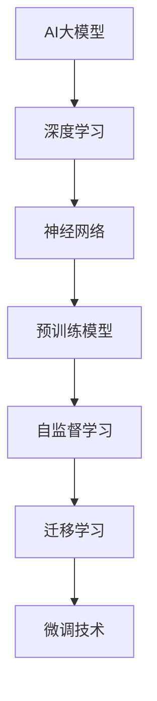
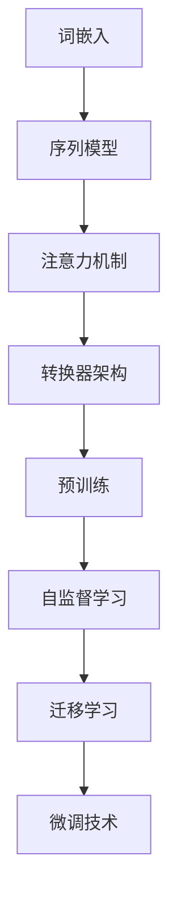
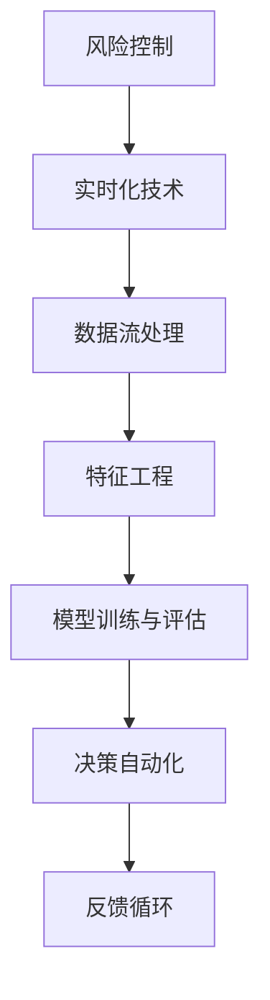
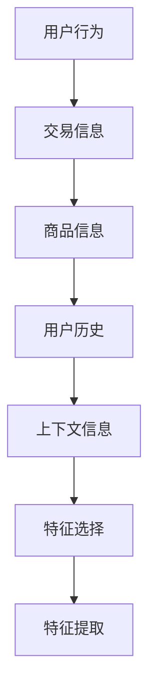
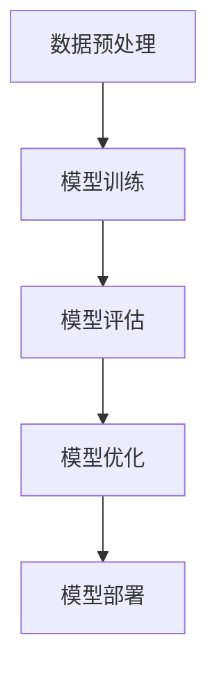
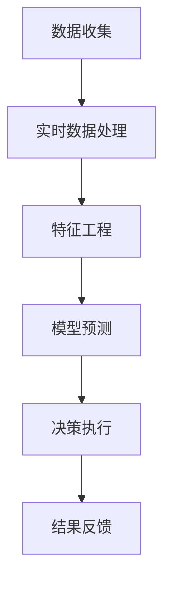
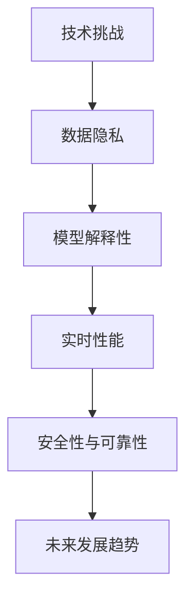

                 

# AI大模型在电商平台风险控制实时化中的应用

> **关键词**：AI大模型、深度学习、实时化、风险控制、电商平台

> **摘要**：本文将深入探讨AI大模型在电商平台风险控制实时化中的应用。通过详细解析AI大模型的基础知识、技术基础、电商平台风险控制实时化概述、特征工程、模型训练与评估、项目实战以及面临的挑战与未来展望，本文旨在为读者提供一份全面的技术指南，帮助他们在实际业务场景中有效地利用AI大模型进行风险控制。

## 第一部分：AI大模型基础

### 第1章: AI大模型概述

#### 核心概念与联系

AI大模型是现代人工智能的核心技术之一，其核心概念与联系可以用以下Mermaid流程图来表示：



#### 核心算法原理讲解

AI大模型的核心算法原理主要基于深度学习，其基本结构包括输入层、隐藏层和输出层。以下是一个简单的伪代码示例：

```python
def train_model(data, epochs):
    for epoch in range(epochs):
        for sample in data:
            predict = model(sample)
            loss = compute_loss(predict, sample)
            model.update_weights(loss)
    return model
```

在数学模型方面，损失函数是评估模型性能的关键指标。以下是一个常见的均方误差（MSE）损失函数的数学公式：

$$
\text{loss} = \frac{1}{2} \sum_{i=1}^{N} (\hat{y}_i - y_i)^2
$$

举例说明：假设我们有5个样本，预测值和真实值如下：

$$
\text{predict} = [\hat{y}_1, \hat{y}_2, \hat{y}_3, \hat{y}_4, \hat{y}_5]
$$

$$
\text{y} = [y_1, y_2, y_3, y_4, y_5]
$$

计算损失：

$$
\text{loss} = \frac{1}{2} \sum_{i=1}^{5} (\hat{y}_i - y_i)^2 = \frac{1}{2} ( (\hat{y}_1 - y_1)^2 + (\hat{y}_2 - y_2)^2 + (\hat{y}_3 - y_3)^2 + (\hat{y}_4 - y_4)^2 + (\hat{y}_5 - y_5)^2 )
$$

#### 第2章: AI大模型技术基础

##### 核心概念与联系

AI大模型技术基础包括词嵌入、序列模型、注意力机制、转换器架构、预训练、自监督学习和微调技术。以下是一个Mermaid流程图，展示了这些概念之间的联系：



##### 核心算法原理讲解

以转换器架构（Transformer）为例，其核心算法原理可以表示为以下伪代码：

```python
def train_transformer(data, epochs):
    for epoch in range(epochs):
        for sample in data:
            predict = transformer(sample)
            loss = compute_loss(predict, sample)
            transformer.update_weights(loss)
    return transformer
```

在数学模型方面，同样可以使用均方误差（MSE）损失函数来评估模型性能：

$$
\text{loss} = \frac{1}{2} \sum_{i=1}^{N} (\hat{y}_i - y_i)^2
$$

举例说明：假设我们有5个样本，预测值和真实值如下：

$$
\text{predict} = [\hat{y}_1, \hat{y}_2, \hat{y}_3, \hat{y}_4, \hat{y}_5]
$$

$$
\text{y} = [y_1, y_2, y_3, y_4, y_5]
$$

计算损失：

$$
\text{loss} = \frac{1}{2} \sum_{i=1}^{5} (\hat{y}_i - y_i)^2 = \frac{1}{2} ( (\hat{y}_1 - y_1)^2 + (\hat{y}_2 - y_2)^2 + (\hat{y}_3 - y_3)^2 + (\hat{y}_4 - y_4)^2 + (\hat{y}_5 - y_5)^2 )
$$

#### 第3章: 电商平台风险控制实时化概述

##### 核心概念与联系

电商平台风险控制实时化涉及多个核心概念，包括风险控制、实时化技术、数据流处理、特征工程、模型训练与评估、决策自动化和反馈循环。以下是一个Mermaid流程图，展示了这些概念之间的联系：



##### 核心算法原理讲解

电商平台风险控制实时化的核心算法原理可以通过以下伪代码来表示：

```python
def risk_control_system(data_stream, epochs):
    model = train_model(data_stream, epochs)
    while True:
        new_data = get_new_data()
        prediction = model.predict(new_data)
        if is_risky(prediction):
            take_action()
```

在数学模型方面，常用的评估指标包括损失函数和准确率。以下是一个简单的均方误差（MSE）损失函数的数学公式：

$$
\text{loss} = \frac{1}{N} \sum_{i=1}^{N} (\hat{y}_i - y_i)^2
$$

举例说明：假设我们有5个样本，预测值和真实值如下：

$$
\text{predict} = [\hat{y}_1, \hat{y}_2, \hat{y}_3, \hat{y}_4, \hat{y}_5]
$$

$$
\text{y} = [y_1, y_2, y_3, y_4, y_5]
$$

计算损失：

$$
\text{loss} = \frac{1}{5} ( (\hat{y}_1 - y_1)^2 + (\hat{y}_2 - y_2)^2 + (\hat{y}_3 - y_3)^2 + (\hat{y}_4 - y_4)^2 + (\hat{y}_5 - y_5)^2 )
$$

## 第二部分：电商平台风险特征工程

#### 第4章: 电商平台风险特征工程

##### 核心概念与联系

电商平台风险特征工程是风险控制实时化的关键环节，涉及多个核心概念，包括用户行为、交易信息、商品信息、用户历史、上下文信息和特征选择。以下是一个Mermaid流程图，展示了这些概念之间的联系：



##### 核心算法原理讲解

特征工程的核心算法原理包括特征提取和特征选择。以下是一个简单的伪代码示例：

```python
def feature_engineering(data):
    features = extract_features(data)
    selected_features = select_best_features(features)
    return selected_features
```

在数学模型方面，常用的特征选择方法包括特征重要性和主成分分析（PCA）。以下是一个特征重要性的数学公式：

$$
\text{Feature Importance} = \frac{\sum_{i=1}^{N} (y_i - \hat{y}_i)^2}{\sum_{i=1}^{N} (y_i - \bar{y})^2}
$$

举例说明：假设我们有5个特征，预测值和真实值如下：

$$
\text{Feature Importance} = \frac{ (y_1 - \hat{y}_1)^2 + (y_2 - \hat{y}_2)^2 + (y_3 - \hat{y}_3)^2 + (y_4 - \hat{y}_4)^2 + (y_5 - \hat{y}_5)^2 }{ (y_1 - \bar{y})^2 + (y_2 - \bar{y})^2 + (y_3 - \bar{y})^2 + (y_4 - \bar{y})^2 + (y_5 - \bar{y})^2 }
$$

#### 第5章: 风险控制模型训练与评估

##### 核心概念与联系

风险控制模型的训练与评估是电商平台风险控制实时化的关键步骤，涉及多个核心概念，包括数据预处理、模型训练、模型评估、模型优化和模型部署。以下是一个Mermaid流程图，展示了这些概念之间的联系：



##### 核心算法原理讲解

风险控制模型的训练与评估可以通过以下伪代码来表示：

```python
def train_evaluate_model(data_train, data_test):
    model = train_model(data_train)
    loss_train = evaluate_model(model, data_train)
    loss_test = evaluate_model(model, data_test)
    return model, loss_train, loss_test
```

在数学模型方面，常用的评估指标包括准确率（Accuracy）和召回率（Recall）。以下是一个准确率的数学公式：

$$
\text{Accuracy} = \frac{\text{正确预测的数量}}{\text{总预测数量}}
$$

举例说明：假设我们有100个样本，其中70个样本被正确预测，30个样本被错误预测：

$$
\text{Accuracy} = \frac{70}{100} = 0.7
$$

#### 第6章: 风险控制实时化项目实战

##### 核心概念与联系

风险控制实时化项目实战涉及多个核心概念，包括数据收集、实时数据处理、特征工程、模型预测、决策执行和结果反馈。以下是一个Mermaid流程图，展示了这些概念之间的联系：



##### 核心算法原理讲解

风险控制实时化项目实战的核心算法原理可以通过以下伪代码来表示：

```python
def real_time_risk_control(stream):
    while True:
        data = get_real_time_data(stream)
        features = feature_engineering(data)
        prediction = model.predict(features)
        if prediction == 'risky':
            execute_action()
        update_model_with_feedback(data, prediction)
```

在数学模型方面，实时数据流处理可以使用滑动窗口（Sliding Window）方法来处理。以下是一个简单的滑动窗口的数学模型：

$$
\text{Data Stream} = \{d_1, d_2, d_3, ..., d_n\}
$$

举例说明：假设我们有5个实时数据点：

$$
\text{Data Stream} = \{d_1, d_2, d_3, d_4, d_5\}
$$

## 第三部分：挑战与未来展望

#### 第7章: 挑战与未来展望

##### 核心概念与联系

风险控制实时化在电商平台的应用面临着诸多挑战，包括数据隐私、模型解释性、实时性能、安全性与可靠性以及未来发展趋势。以下是一个Mermaid流程图，展示了这些挑战和未来展望的概念之间的联系：



##### 核心算法原理讲解

面对这些挑战，我们可以采取一系列算法原理来解决。以下是一个简单的伪代码示例，用于解决这些挑战：

```python
def address_challenge(challenge):
    if challenge == 'data privacy':
        use_encryption()
    elif challenge == 'model interpretability':
        use_explainable_ai()
    elif challenge == 'real-time performance':
        optimize_model()
    elif challenge == 'security and reliability':
        implement_safety_measures()
```

在数学模型方面，未来发展趋势可以通过预测模型来表示。以下是一个简单的未来发展趋势的数学公式：

$$
\text{Future Trend} = f(\text{technology advancement}, \text{data availability}, \text{algorithm optimization})
$$

举例说明：假设我们有三个影响因素：

$$
\text{Future Trend} = f(\text{技术进步}, \text{数据可用性}, \text{算法优化})
$$

### 作者

**作者：** AI天才研究院/AI Genius Institute & 禅与计算机程序设计艺术 /Zen And The Art of Computer Programming

### 结束语

本文从AI大模型的基础、技术基础、电商平台风险控制实时化概述、特征工程、模型训练与评估、项目实战以及面临的挑战与未来展望等方面，全面介绍了AI大模型在电商平台风险控制实时化中的应用。通过本文的阅读，读者可以深入了解AI大模型的核心概念、算法原理和实际应用，为在电商领域实现风险控制实时化提供有力的技术支持。在未来，随着技术的不断进步和应用场景的不断拓展，AI大模型在电商平台风险控制实时化中的应用将更加广泛和深入。我们期待在不久的将来，AI大模型能够为电商平台带来更多的价值，为电子商务行业的健康发展保驾护航。

