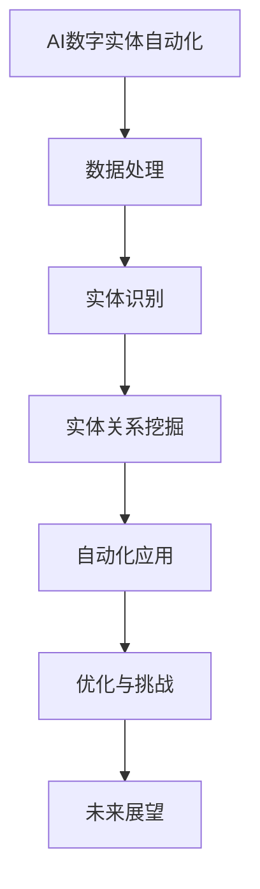
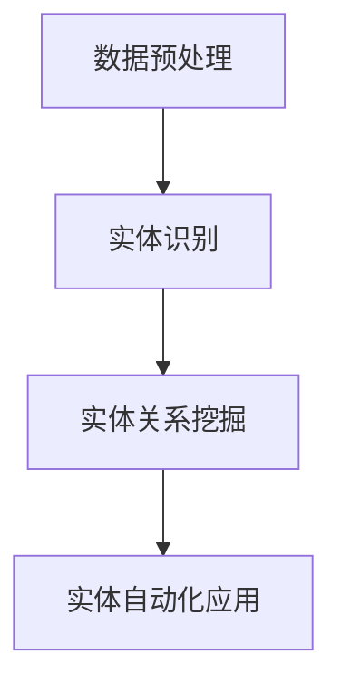

                 

# 《AI数字实体自动化的潜力》

> **关键词：** 人工智能、数字实体、自动化、机器学习、深度学习

> **摘要：** 本文旨在探讨AI在数字实体自动化领域的潜力。首先，我们将回顾AI的发展历程，介绍数字实体的概念及其分类。接着，讨论数字实体自动化的定义和潜在应用。随后，我们将深入探讨AI核心概念和架构，包括机器学习与深度学习、自然语言处理与计算机视觉。然后，详细介绍数字实体自动化技术，包括数据处理与数据质量、实体识别与图谱构建、实体关系挖掘与推理。通过案例分析，我们将展示AI数字实体自动化在零售、金融和制造业中的应用。最后，我们将讨论数字实体自动化的实现与优化，以及面临的挑战与解决策略，并展望未来的发展趋势。

## 目录大纲

### 第一部分：AI基础与数字实体自动化概述

**第1章：AI基础与数字实体概述**  
- 1.1 人工智能的发展历程  
- 1.2 数字实体的定义与分类  
- 1.3 数字实体自动化的概念  
- 1.4 AI数字实体自动化的潜力

**第2章：AI核心概念与架构**  
- 2.1 机器学习与深度学习  
- 2.2 自然语言处理与计算机视觉  
- 2.3 AI算法原理与实现

**第3章：数字实体自动化技术**  
- 3.1 数据处理与数据质量  
- 3.2 实体识别与图谱构建  
- 3.3 实体关系挖掘与推理

**第4章：AI数字实体自动化应用案例分析**  
- 4.1 零售行业的AI数字实体自动化  
- 4.2 金融领域的AI数字实体自动化  
- 4.3 制造业的AI数字实体自动化

### 第二部分：数字实体自动化的实现与优化

**第5章：数字实体自动化的实现**  
- 5.1 硬件设施与环境配置  
- 5.2 开发工具与框架  
- 5.3 实体自动化的算法实现

**第6章：数字实体自动化的优化与挑战**  
- 6.1 模型优化方法  
- 6.2 数据质量提升  
- 6.3 面临的挑战与解决策略

**第7章：未来展望与趋势**  
- 7.1 AI数字实体自动化的未来趋势  
- 7.2 技术融合与集成  
- 7.3 AI数字实体自动化的伦理与法律问题

**附录A：数字实体自动化资源与工具**

### Mermaid 流�程图



### 核心算法原理讲解

#### 2.3 AI算法原理与实现

**2.3.1 机器学习算法原理**

机器学习算法的基本原理包括：

- **监督学习**：有标签数据训练模型，如分类和回归。

  ```python
  def machine_learning_algorithm(data, labels):
      # 数据预处理
      preprocess_data(data)

      # 选择合适的模型（例如：线性回归，决策树，支持向量机等）
      model = select_model(data, labels)

      # 模型训练
      model.train(data, labels)

      # 模型评估
      accuracy = model.evaluate(data, labels)

      return accuracy
  ```

- **无监督学习**：无标签数据训练模型，如聚类和降维。

- **半监督学习**：结合有标签和无标签数据进行训练。

**2.3.2 深度学习算法原理**

深度学习算法是基于多层神经网络进行特征提取和学习的一种方法。

- **前向传播**：从输入层到输出层传递数据。

  ```python
  def deep_learning_algorithm(data, labels):
      # 初始化神经网络结构
      neural_network = initialize_neural_network()

      # 前向传播
      outputs = neural_network.forward_pass(data)

      # 计算损失
      loss = compute_loss(outputs, labels)

      # 反向传播
      gradients = neural_network.backward_pass(loss)

      # 更新权重
      neural_network.update_weights(gradients)

      return neural_network
  ```

- **反向传播**：计算误差，并反向传播至输入层，更新权重。

**2.3.3 机器学习数学模型**

- **线性回归**：预测输出值与输入值之间的关系。

  $$ y = \beta_0 + \beta_1 \cdot x $$

- **支持向量机（SVM）**：分类算法，通过寻找最优超平面进行分类。

  $$ \min_{\beta, \beta_0} \frac{1}{2} ||\beta||^2 + C \cdot \sum_{i=1}^{n} \max(0, 1 - y_i (\beta \cdot x_i + \beta_0)) $$

- **神经网络损失函数**：用于评估模型预测值与实际值之间的差异。

  $$ J(\theta) = -\frac{1}{m} \sum_{i=1}^{m} [y^{(i)} \cdot \log(a^{(i)}) + (1 - y^{(i)}) \cdot \log(1 - a^{(i)})] $$

### 项目实战

**5.1 零售行业的AI数字实体自动化**

**5.1.1 开发环境搭建**

- Python环境搭建
- TensorFlow安装
- OpenNLP安装

**5.1.2 源代码详细实现**

- 数据预处理

  ```python
  def preprocess_data(data):
      # 清洗数据
      data = clean_data(data)

      # 分词
      data = tokenize_data(data)

      return data
  ```

- 实体识别

  ```python
  def entity_recognition(data):
      # 使用OpenNLP进行实体识别
      entities = opennlp_entity_recognition(data)

      return entities
  ```

- 实体关系挖掘

  ```python
  def entity_relation_mining(entities):
      # 构建实体图谱
      graph = build_entity_graph(entities)

      # 挖掘实体关系
      relations = mine_entity_relations(graph)

      return relations
  ```

**5.1.3 代码解读与分析**

- 数据预处理代码主要进行数据清洗和分词，为后续的实体识别和实体关系挖掘提供基础。
- 实体识别代码使用OpenNLP工具进行命名实体识别，将文本数据中的特定实体提取出来。
- 实体关系挖掘代码构建实体图谱，通过实体之间的关系进行挖掘，为自动化应用提供支持。

### 附录A：数字实体自动化资源与工具

**A.1 主流深度学习框架对比**

- TensorFlow：由Google开发，支持多种编程语言，拥有丰富的API和强大的生态系统。
- PyTorch：由Facebook开发，使用动态图计算，便于模型开发和调试，尤其在计算机视觉和自然语言处理领域应用广泛。
- JAX：由Google开发，提供自动微分功能，适用于大规模科学计算和机器学习模型优化。
- 其他框架简介：如Theano、MXNet、Caffe等，各有特点和适用场景。

**A.2 实体识别与图谱构建工具**

- OpenNLP：Apache基金会的一个开源自然语言处理工具包，提供命名实体识别、分词、词性标注等功能。
- NLTK：自然语言工具包，提供丰富的文本处理和语言模型资源，包括命名实体识别、词性标注等。
- 其他实体识别工具：如Stanford NLP、SpaCy、Stanford CoreNLP等，适用于不同应用场景和需求。

**A.3 数据处理与清洗工具**

- Pandas：Python数据分析库，提供数据结构DataFrame，方便进行数据清洗、处理和分析。
- NumPy：Python科学计算库，提供高性能的数值计算和数组操作，常用于数据处理和特征工程。
- 其他数据处理工具：如Pandas、SciPy、Matplotlib等，适用于数据可视化和复杂数据分析任务。

### 第1章：AI基础与数字实体概述

**1.1 人工智能的发展历程**

人工智能（AI）是一门研究、开发用于模拟、延伸和扩展人的智能的理论、方法、技术及应用系统的技术科学。人工智能的发展历程可以追溯到20世纪50年代，当时科学家们开始探索如何让计算机模拟人类智能。以下是一些关键发展阶段：

- **早期阶段（1950-1969）**：人工智能的早期探索主要集中在逻辑推理和规则系统上。1956年，约翰·麦卡锡（John McCarthy）在达特茅斯会议上提出了人工智能的概念，标志着人工智能作为一个独立学科的诞生。这一时期的代表性工作包括逻辑推理程序ELIZA和专家系统DENDRAL。

- **繁荣阶段（1970-1989）**：在20世纪70年代，人工智能得到了广泛关注和投资，人工智能应用开始进入实际领域，如医疗诊断、财务分析和自动化控制等。1976年，霍普菲尔德和皮托斯基尔提出了Hopfield神经网络，这是深度学习领域的早期突破。然而，由于技术限制和过高的期望，人工智能在20世纪80年代经历了第一次寒冬。

- **复兴阶段（1990-2010）**：随着计算机性能的提升和互联网的发展，人工智能在1990年代开始复苏。1997年，IBM的超级计算机“深蓝”击败了世界国际象棋冠军加里·卡斯帕罗夫，这是人工智能在特定领域取得的重要突破。这一时期的代表性工作包括语音识别、机器翻译和自动驾驶等领域。

- **深度学习时代（2010至今）**：深度学习作为一种人工智能技术，在2010年后取得了突破性的进展。卷积神经网络（CNN）和递归神经网络（RNN）的出现，使得计算机在图像识别、语音识别、自然语言处理等领域取得了显著的成果。2012年，AlexNet在ImageNet竞赛中取得了优异成绩，标志着深度学习的崛起。此后，人工智能进入了一个新的时代，应用领域不断扩展，影响深远。

**1.2 数字实体的定义与分类**

数字实体是指存在于数字世界中，具有明确标识和特定意义的对象或实体。数字实体可以分为以下几类：

- **自然语言实体**：如人名、地名、组织名、产品名等。自然语言实体是文本数据中的重要组成部分，对于自然语言处理任务具有重要意义。

- **图像实体**：如人脸、车辆、建筑物等。图像实体是计算机视觉领域的研究对象，通过图像识别和图像分类等技术，可以从大量图像中提取出有意义的实体。

- **关系实体**：如人物关系、地理关系、组织关系等。关系实体描述了不同实体之间的关联，对于图谱构建和知识图谱应用具有重要意义。

- **事件实体**：如会议、比赛、活动等。事件实体是时间序列数据中的重要组成部分，对于时间序列分析和事件预测具有重要意义。

**1.3 数字实体自动化的概念**

数字实体自动化是指利用人工智能技术，自动识别、分类、挖掘和分析数字实体，实现自动化处理的过程。数字实体自动化的核心目标是通过人工智能技术，提高数据处理效率，降低人工干预，实现数据驱动决策。

数字实体自动化的应用场景广泛，包括但不限于以下几个方面：

- **数据预处理**：通过自动化技术，对原始数据进行清洗、预处理和标注，为后续分析提供高质量的数据。

- **实体识别**：自动识别文本、图像中的实体，如人名、地名、产品名等，为知识图谱构建提供基础。

- **知识图谱**：通过实体关系挖掘，构建实体之间的关系图谱，实现数据关联和分析。

- **数据挖掘**：利用深度学习技术，对实体数据进行分析和挖掘，发现潜在的模式和关联。

- **自动化应用**：将自动化技术应用于实际业务场景，如智能客服、智能推荐、智能监控等，提高业务效率和用户体验。

**1.4 AI数字实体自动化的潜力**

AI数字实体自动化具有巨大的潜力，主要体现在以下几个方面：

- **效率提升**：通过自动化技术，可以显著提高数据处理和分析的效率，降低人工成本。

- **数据质量**：自动化技术能够自动识别和处理数据中的错误和异常，提高数据质量。

- **智能化决策**：基于AI的数字实体自动化可以帮助企业实现数据驱动决策，提高业务竞争力。

- **跨领域应用**：数字实体自动化技术可以应用于多个领域，如零售、金融、医疗、制造等，具有广泛的应用前景。

- **可持续发展**：数字实体自动化有助于实现可持续发展目标，通过提高资源利用效率，降低环境负担。

然而，AI数字实体自动化也面临一些挑战，如数据隐私保护、算法透明度和伦理问题等。在未来的发展中，需要充分考虑这些挑战，并采取有效的应对策略，确保AI数字实体自动化的可持续发展。

### 第2章：AI核心概念与架构

**2.1 机器学习与深度学习**

机器学习和深度学习是人工智能领域的重要组成部分。机器学习是让计算机从数据中学习规律和模式，从而进行预测和决策的技术。深度学习是机器学习的一个子领域，通过模拟人脑神经网络的结构和功能，实现更复杂的特征学习和模式识别。

**2.1.1 机器学习**

机器学习的基本原理包括以下几个步骤：

1. **数据收集**：从各种来源收集大量数据，如文本、图像、音频等。

2. **数据预处理**：对收集到的数据进行清洗、去噪、归一化等处理，使其适合训练模型。

3. **特征提取**：从原始数据中提取有用的特征，用于训练模型。

4. **模型选择**：选择合适的机器学习模型，如线性回归、决策树、支持向量机等。

5. **模型训练**：使用训练数据集对模型进行训练，调整模型参数。

6. **模型评估**：使用验证数据集对模型进行评估，确定模型的性能。

7. **模型部署**：将训练好的模型部署到实际应用场景中，进行预测和决策。

**2.1.2 深度学习**

深度学习的基本原理是通过多层神经网络对数据进行特征提取和模式识别。深度学习模型通常包括以下几个层次：

1. **输入层**：接收外部输入数据，如图像、文本等。

2. **隐藏层**：对输入数据进行特征提取和变换，每一层都可以提取更高层次的特征。

3. **输出层**：根据隐藏层提取的特征进行预测或分类。

深度学习的关键技术包括：

1. **卷积神经网络（CNN）**：适用于图像处理和计算机视觉领域，通过卷积操作提取图像特征。

2. **递归神经网络（RNN）**：适用于序列数据处理和自然语言处理领域，通过循环结构处理序列数据。

3. **长短时记忆网络（LSTM）**：RNN的一个变体，适用于处理长序列数据，解决RNN的梯度消失问题。

4. **生成对抗网络（GAN）**：一种无监督学习方法，通过生成器和判别器的对抗训练，实现数据的生成和增强。

**2.2 自然语言处理与计算机视觉**

自然语言处理（NLP）和计算机视觉（CV）是人工智能领域的重要分支。

**2.2.1 自然语言处理**

自然语言处理的主要任务包括：

1. **文本分类**：根据文本内容的特征进行分类，如情感分析、新闻分类等。

2. **实体识别**：从文本中识别出具有特定意义的实体，如人名、地名、组织名等。

3. **关系提取**：从文本中提取出实体之间的关系，如人物关系、组织关系等。

4. **机器翻译**：将一种语言的文本翻译成另一种语言。

5. **对话系统**：实现人与计算机的对话交互。

自然语言处理的关键技术包括：

1. **词向量表示**：将文本数据转换为向量表示，如Word2Vec、GloVe等。

2. **递归神经网络（RNN）**：用于处理序列数据，如文本、语音等。

3. **长短时记忆网络（LSTM）**：解决RNN的梯度消失问题，适用于长序列数据处理。

4. **变换器（Transformer）**：一种基于自注意力机制的深度学习模型，适用于机器翻译、文本分类等任务。

**2.2.2 计算机视觉**

计算机视觉的主要任务包括：

1. **图像分类**：对图像进行分类，如人脸识别、物体识别等。

2. **目标检测**：在图像中检测出特定的目标，并定位其位置。

3. **图像分割**：将图像分割成多个部分，如语义分割、实例分割等。

4. **图像生成**：通过神经网络生成新的图像，如风格迁移、图像修复等。

计算机视觉的关键技术包括：

1. **卷积神经网络（CNN）**：用于提取图像特征，适用于图像分类、目标检测等任务。

2. **生成对抗网络（GAN）**：用于图像生成和增强。

3. **残差网络（ResNet）**：解决深度网络训练过程中的梯度消失问题，提高模型性能。

4. **多尺度特征融合**：通过融合不同尺度的特征，提高图像识别和目标检测的准确性。

**2.3 AI算法原理与实现**

AI算法的原理与实现主要涉及以下几个方面：

**2.3.1 机器学习算法原理**

机器学习算法的基本原理是通过学习数据中的特征和模式，进行预测和决策。以下是一些常见的机器学习算法原理：

- **线性回归**：通过拟合数据点之间的线性关系，实现预测。

  $$ y = \beta_0 + \beta_1 \cdot x $$

- **决策树**：通过递归划分特征空间，构建决策树模型。

- **支持向量机（SVM）**：通过寻找最优超平面，实现分类和回归。

  $$ \min_{\beta, \beta_0} \frac{1}{2} ||\beta||^2 + C \cdot \sum_{i=1}^{n} \max(0, 1 - y_i (\beta \cdot x_i + \beta_0)) $$

- **神经网络**：通过多层神经网络，实现复杂的特征提取和模式识别。

  $$ J(\theta) = -\frac{1}{m} \sum_{i=1}^{m} [y^{(i)} \cdot \log(a^{(i)}) + (1 - y^{(i)}) \cdot \log(1 - a^{(i)})] $$

**2.3.2 深度学习算法原理**

深度学习算法是基于多层神经网络，通过学习大量数据中的特征和模式，实现复杂的预测和决策。以下是一些常见的深度学习算法原理：

- **卷积神经网络（CNN）**：通过卷积操作提取图像特征，实现图像分类和目标检测。

  ```python
  def conv2d(x, W):
      return tf.nn.conv2d(x, W, strides=[1, 1, 1, 1], padding='SAME')

  def max_pool_2x2(x):
      return tf.nn.max_pool(x, ksize=[1, 2, 2, 1], strides=[1, 2, 2, 1], padding='SAME')
  ```

- **递归神经网络（RNN）**：通过循环结构处理序列数据，实现自然语言处理和语音识别。

  ```python
  def lstm_cell(size):
      return tf.nn.rnn_cell.BasicLSTMCell(size)

  def lstm_model(inputs, hidden_size):
      lstm_cell = lstm_cell(hidden_size)
      outputs, states = tf.nn.dynamic_rnn(lstm_cell, inputs, dtype=tf.float32)
      return outputs, states
  ```

- **长短时记忆网络（LSTM）**：通过解决RNN的梯度消失问题，实现长序列数据处理。

  ```python
  def lstm_cell(size):
      return tf.nn.rnn_cell.LSTMCell(size)

  def lstm_model(inputs, hidden_size):
      lstm_cell = lstm_cell(hidden_size)
      outputs, states = tf.nn.dynamic_rnn(lstm_cell, inputs, dtype=tf.float32)
      return outputs, states
  ```

- **生成对抗网络（GAN）**：通过生成器和判别器的对抗训练，实现数据的生成和增强。

  ```python
  def generator(z, noise_size):
      with tf.variable_scope("generator"):
          # 生成器模型
          return model(z, noise_size)

  def discriminator(x, real=True):
      with tf.variable_scope("discriminator"):
          # 判别器模型
          return model(x, real)
  ```

**2.3.3 数学模型与公式**

在机器学习和深度学习领域，数学模型和公式是核心组成部分。以下是一些常见的数学模型和公式：

- **线性回归**：

  $$ y = \beta_0 + \beta_1 \cdot x $$

- **支持向量机（SVM）**：

  $$ \min_{\beta, \beta_0} \frac{1}{2} ||\beta||^2 + C \cdot \sum_{i=1}^{n} \max(0, 1 - y_i (\beta \cdot x_i + \beta_0)) $$

- **神经网络损失函数**：

  $$ J(\theta) = -\frac{1}{m} \sum_{i=1}^{m} [y^{(i)} \cdot \log(a^{(i)}) + (1 - y^{(i)}) \cdot \log(1 - a^{(i)})] $$

### 第3章：数字实体自动化技术

**3.1 数据处理与数据质量**

数据处理和数据质量是数字实体自动化的基础。高质量的数据能够提高模型性能，降低错误率，从而实现更准确的实体自动化。

**3.1.1 数据预处理方法**

数据预处理包括以下步骤：

1. **数据清洗**：去除数据中的噪声和错误，如缺失值、重复值、异常值等。

2. **数据转换**：将数据转换为适合模型训练的格式，如数值化、归一化等。

3. **特征提取**：从原始数据中提取有用的特征，用于训练模型。

**3.1.2 数据质量管理**

数据质量管理包括以下方面：

1. **数据完整性**：确保数据完整，无缺失值和错误。

2. **数据准确性**：确保数据准确，与真实值一致。

3. **数据一致性**：确保数据在不同来源和不同时间点的一致性。

4. **数据时效性**：确保数据的新鲜度和时效性。

**3.2 实体识别与图谱构建**

实体识别与图谱构建是数字实体自动化的核心环节。

**3.2.1 实体识别算法**

实体识别算法主要包括以下几种：

1. **基于规则的方法**：通过预定义的规则，识别文本中的实体。

2. **基于统计的方法**：通过统计特征和机器学习模型，识别文本中的实体。

3. **基于深度学习的方法**：通过卷积神经网络（CNN）和递归神经网络（RNN），实现高效准确的实体识别。

**3.2.2 实体图谱的构建与维护**

实体图谱的构建与维护包括以下步骤：

1. **实体抽取**：从文本数据中抽取实体，如人名、地名、组织名等。

2. **实体链接**：将实体与知识库中的实体进行链接，构建实体图谱。

3. **图谱更新**：根据新数据，对实体图谱进行更新和维护。

**3.3 实体关系挖掘与推理**

实体关系挖掘与推理是数字实体自动化的重要应用。

**3.3.1 实体关系挖掘方法**

实体关系挖掘方法主要包括以下几种：

1. **基于规则的方法**：通过预定义的规则，挖掘实体之间的关系。

2. **基于统计的方法**：通过统计特征和机器学习模型，挖掘实体之间的关系。

3. **基于深度学习的方法**：通过卷积神经网络（CNN）和递归神经网络（RNN），实现高效准确的实体关系挖掘。

**3.3.2 实体关系推理算法**

实体关系推理算法主要包括以下几种：

1. **基于规则的方法**：通过预定义的规则，推理实体之间的关系。

2. **基于逻辑的方法**：通过逻辑推理，推理实体之间的关系。

3. **基于深度学习的方法**：通过图神经网络（GNN），实现高效准确的实体关系推理。

### 第4章：AI数字实体自动化应用案例分析

**4.1 零售行业的AI数字实体自动化**

在零售行业，AI数字实体自动化可以提高销售预测、库存管理和客户体验等方面的效率。

**4.1.1 实体识别在零售中的应用**

实体识别在零售行业中的应用主要包括：

1. **商品识别**：通过图像识别技术，自动识别商品，实现智能购物。

2. **顾客识别**：通过人脸识别技术，自动识别顾客，实现个性化推荐。

**4.1.2 实体关系挖掘在库存管理中的应用**

实体关系挖掘在库存管理中的应用主要包括：

1. **商品关系挖掘**：挖掘商品之间的关联关系，优化库存配置。

2. **供应链关系挖掘**：挖掘供应链上下游的关系，优化供应链管理。

**4.2 金融领域的AI数字实体自动化**

在金融领域，AI数字实体自动化可以提高风险管理、客户服务和业务流程自动化等方面的效率。

**4.2.1 实体识别在客户识别中的应用**

实体识别在金融领域中的应用主要包括：

1. **客户身份识别**：通过人脸识别、身份证识别等技术，自动识别客户身份。

2. **交易识别**：通过交易数据识别，自动识别交易中的可疑行为。

**4.2.2 实体关系挖掘在风险管理中的应用**

实体关系挖掘在风险管理中的应用主要包括：

1. **客户关系挖掘**：挖掘客户之间的关联关系，识别高风险客户。

2. **信用风险评估**：通过客户关系和交易数据，评估客户的信用风险。

**4.3 制造业的AI数字实体自动化**

在制造业，AI数字实体自动化可以提高生产效率、质量管理和服务优化等方面的效率。

**4.3.1 实体识别在生产流程中的应用**

实体识别在制造业中的应用主要包括：

1. **设备识别**：通过图像识别技术，自动识别生产线上的设备。

2. **产品识别**：通过图像识别技术，自动识别生产出的产品。

**4.3.2 实体关系挖掘在供应链管理中的应用**

实体关系挖掘在供应链管理中的应用主要包括：

1. **供应商关系挖掘**：挖掘供应商之间的关联关系，优化供应链网络。

2. **物流关系挖掘**：挖掘物流环节中的关联关系，优化物流流程。

### 第5章：数字实体自动化的实现

**5.1 硬件设施与环境配置**

为了实现高效的数字实体自动化，需要配置适当的硬件设施和环境。以下是一些关键硬件设施和环境配置：

**5.1.1 GPU与TPU的选择与配置**

1. **GPU**：GPU（图形处理单元）是进行深度学习模型训练和推理的重要硬件。选择合适的GPU取决于模型的大小和训练需求。常见的GPU有NVIDIA的Tesla系列、RTX 30系列等。

2. **TPU**：TPU（张量处理单元）是Google专门为深度学习优化设计的硬件。TPU具有更高的计算效率和更低的功耗，适合大规模模型训练和推理。

**5.1.2 数据存储与处理平台的搭建**

1. **数据存储**：选择适合的数据存储方案，如分布式文件系统（HDFS）、云存储服务等，确保数据的高可用性和高效访问。

2. **数据处理平台**：搭建数据处理平台，如Spark、Flink等，用于大规模数据处理和实时处理。

**5.2 开发工具与框架**

为了实现数字实体自动化，需要使用合适的开发工具和框架。以下是一些常用的开发工具和框架：

**5.2.1 TensorFlow与PyTorch的使用**

1. **TensorFlow**：由Google开源的深度学习框架，支持多种编程语言和丰富的API。TensorFlow具有强大的生态系统，适用于各种深度学习应用。

2. **PyTorch**：由Facebook开源的深度学习框架，使用动态图计算，便于模型开发和调试。PyTorch在计算机视觉和自然语言处理领域应用广泛。

**5.2.2 其他常用深度学习框架**

1. **Keras**：一个高层次的神经网络API，兼容TensorFlow和Theano。Keras提供了简洁的接口，方便模型开发和调试。

2. **MXNet**：由Apache开源的深度学习框架，支持多种编程语言和动态图计算。MXNet具有高效计算和灵活部署的特点。

**5.3 实体自动化的算法实现**

数字实体自动化的算法实现包括以下关键步骤：

**5.3.1 伪代码与算法流程图**

以下是一个简单的实体自动化算法伪代码和算法流程图：

```python
# 伪代码
def entity_automation(data):
    # 数据预处理
    processed_data = preprocess_data(data)

    # 实体识别
    entities = entity_recognition(processed_data)

    # 实体关系挖掘
    relations = entity_relation_mining(entities)

    # 实体自动化应用
    application_results = apply_automation(relations)

    return application_results

# 算法流程图
```



**5.3.2 实体识别与实体关系挖掘的详细实现**

以下是一个简单的实体识别与实体关系挖掘的实现示例：

```python
# 实体识别
def entity_recognition(text):
    # 使用NLP工具进行实体识别
    entities = nlp_tool.recognize_entities(text)
    return entities

# 实体关系挖掘
def entity_relation_mining(entities):
    # 构建实体图谱
    graph = build_entity_graph(entities)

    # 挖掘实体关系
    relations = mine_entity_relations(graph)
    return relations
```

**5.3.3 实体自动化的算法流程**

以下是一个简单的实体自动化算法流程：

```python
# 数据预处理
data = preprocess_data(raw_data)

# 实体识别
entities = entity_recognition(data)

# 实体关系挖掘
relations = entity_relation_mining(entities)

# 实体自动化应用
application_results = apply_automation(relations)

# 输出结果
print(application_results)
```

### 第6章：数字实体自动化的优化与挑战

**6.1 模型优化方法**

在数字实体自动化中，模型优化是提高性能和准确性的关键步骤。以下是一些常见的模型优化方法：

**6.1.1 模型调优策略**

1. **参数调优**：通过调整模型参数，如学习率、批量大小等，优化模型性能。

2. **正则化**：采用正则化技术，如L1正则化、L2正则化等，防止过拟合。

3. **交叉验证**：通过交叉验证，选择最佳模型参数和结构。

**6.1.2 模型压缩与加速技术**

1. **模型压缩**：通过剪枝、量化等技术，减小模型规模，降低计算复杂度。

2. **模型加速**：通过GPU、TPU等硬件加速，提高模型训练和推理速度。

**6.2 数据质量提升**

数据质量是数字实体自动化的基础。以下是一些数据质量提升的方法：

**6.2.1 数据清洗与标注**

1. **数据清洗**：去除数据中的噪声和错误，如缺失值、重复值、异常值等。

2. **数据标注**：对数据标注，如实体识别、关系标注等，提高数据质量。

**6.2.2 数据增强与生成**

1. **数据增强**：通过数据增强技术，如翻转、旋转、缩放等，增加数据多样性。

2. **数据生成**：通过生成对抗网络（GAN）等模型，生成高质量的数据。

**6.3 面临的挑战与解决策略**

数字实体自动化在应用过程中面临一些挑战，以下是一些常见的挑战和解决策略：

**6.3.1 数据隐私与安全**

1. **数据加密**：对敏感数据进行加密，确保数据安全。

2. **匿名化**：对数据进行匿名化处理，保护个人隐私。

**6.3.2 算法透明度和解释性**

1. **算法解释**：提供算法解释，帮助用户理解模型的决策过程。

2. **可解释性模型**：采用可解释性模型，如决策树、线性模型等，提高算法透明度。

**6.3.3 伦理问题**

1. **伦理规范**：制定伦理规范，确保算法的应用符合道德和法律规定。

2. **算法责任**：明确算法责任，确保算法的正确性和公平性。

### 第7章：未来展望与趋势

**7.1 AI数字实体自动化的未来趋势**

随着人工智能技术的不断进步，AI数字实体自动化在未来将继续快速发展。以下是一些未来趋势：

**7.1.1 新兴技术的发展**

1. **联邦学习**：通过分布式学习，实现跨设备、跨平台的数据共享和模型训练。

2. **强化学习**：在不确定环境中，通过不断学习和优化策略，实现智能决策。

**7.1.2 跨领域融合**

1. **多模态学习**：结合多种数据类型，如文本、图像、音频等，实现更全面的实体识别和关系挖掘。

2. **跨领域应用**：将AI数字实体自动化应用于更多领域，如医疗、金融、交通等，实现更广泛的应用。

**7.2 技术融合与集成**

未来，AI数字实体自动化将与其他技术进行融合与集成，实现更强大的功能和更广泛的应用。以下是一些技术融合与集成的方向：

**7.2.1 与大数据技术的融合**

1. **数据挖掘与知识图谱**：将大数据技术与知识图谱相结合，实现更精准的实体关系挖掘。

2. **实时数据处理**：通过实时数据处理技术，实现实时实体自动化和智能决策。

**7.2.2 与物联网（IoT）技术的融合**

1. **智能传感器网络**：将AI数字实体自动化应用于智能传感器网络，实现物联网设备的智能化管理。

2. **边缘计算**：通过边缘计算，实现实时、高效的数据处理和智能决策。

**7.3 AI数字实体自动化的伦理与法律问题**

随着AI数字实体自动化的发展，伦理和法律问题日益突出。以下是一些关键问题：

**7.3.1 伦理规范与道德准则**

1. **公平性与无偏见**：确保算法的应用公平，无偏见。

2. **透明性与可解释性**：提高算法的透明度，帮助用户理解模型的决策过程。

**7.3.2 法律法规与政策导向**

1. **数据保护**：制定数据保护法律法规，确保个人隐私和数据安全。

2. **算法责任**：明确算法责任，确保算法的正确性和公平性。

### 附录A：数字实体自动化资源与工具

**A.1 主流深度学习框架对比**

以下是一些主流深度学习框架的对比：

| 框架        | 开发者 | 编程语言 | 特点                                                                                                       |
| ----------- | ------ | -------- | ---------------------------------------------------------------------------------------------------------- |
| TensorFlow | Google | Python   | 开源、支持多种编程语言、丰富的API、强大的生态系统                                                         |
| PyTorch    | Facebook | Python   | 动态图计算、易于模型开发和调试、在计算机视觉和自然语言处理领域应用广泛                               |
| Keras      | Google   | Python   | 高层次神经网络API、兼容TensorFlow和Theano、简洁的接口                                                   |
| MXNet      | Apache   | Python/C++ | 支持多种编程语言、动态图计算、高效计算和灵活部署                                                       |
| Theano     | MILA/Project aestheticore | Python   | 自动微分、支持GPU和CPU计算、适合复杂深度学习模型                                                     |

**A.2 实体识别与图谱构建工具**

以下是一些常用的实体识别与图谱构建工具：

| 工具           | 开发者     | 特点                                                                                                           |
| -------------- | ---------- | ------------------------------------------------------------------------------------------------------------ |
| OpenNLP        | Apache     | 提供命名实体识别、分词、词性标注等功能、开源、适用于多种语言                                         |
| NLTK           | NLTK社区   | 提供丰富的文本处理和语言模型资源、适用于命名实体识别、词性标注等                                     |
| Stanford NLP   | 斯坦福大学 | 提供命名实体识别、词性标注、句法分析等功能、开源、适用于多种语言                                   |
| SpaCy          | Explosion  | 高效的NLP库、支持多种语言、提供命名实体识别、词性标注等功能                                       |
| Stanford CoreNLP | 斯坦福大学 | 提供多种NLP任务，包括命名实体识别、词性标注、句法分析等、开源、适用于多种语言                       |

**A.3 数据处理与清洗工具**

以下是一些常用的数据处理与清洗工具：

| 工具      | 开发者  | 特点                                                                                                           |
| --------- | ------- | ------------------------------------------------------------------------------------------------------------ |
| Pandas    | Python社区 | 提供数据结构DataFrame、方便进行数据清洗、处理和分析、开源、适用于多种场景                         |
| NumPy     | Python社区 | 提供高性能的数值计算和数组操作、常用于数据处理和特征工程、开源、适用于多种场景                 |
| SciPy     | SciPy社区 | 提供科学计算和统计分析库、常用于数据处理、特征工程等、开源、适用于多种场景                       |
| Matplotlib | Python社区 | 提供数据可视化库、方便进行数据可视化、开源、适用于多种场景                                       |<|assistant|>### 第1章：AI基础与数字实体概述

**1.1 人工智能的发展历程**

人工智能（AI）是一门研究、开发用于模拟、延伸和扩展人的智能的理论、方法、技术及应用系统的技术科学。人工智能的发展历程可以追溯到20世纪50年代，当时科学家们开始探索如何让计算机模拟人类智能。以下是一些关键发展阶段：

- **早期阶段（1950-1969）**：人工智能的早期探索主要集中在逻辑推理和规则系统上。1956年，约翰·麦卡锡（John McCarthy）在达特茅斯会议上提出了人工智能的概念，标志着人工智能作为一个独立学科的诞生。这一时期的代表性工作包括逻辑推理程序ELIZA和专家系统DENDRAL。

- **繁荣阶段（1970-1989）**：在20世纪70年代，人工智能得到了广泛关注和投资，人工智能应用开始进入实际领域，如医疗诊断、财务分析和自动化控制等。1976年，霍普菲尔德和皮托斯基尔提出了Hopfield神经网络，这是深度学习领域的早期突破。然而，由于技术限制和过高的期望，人工智能在20世纪80年代经历了第一次寒冬。

- **复兴阶段（1990-2010）**：随着计算机性能的提升和互联网的发展，人工智能在1990年代开始复苏。1997年，IBM的超级计算机“深蓝”击败了世界国际象棋冠军加里·卡斯帕罗夫，这是人工智能在特定领域取得的重要突破。这一时期的代表性工作包括语音识别、机器翻译和自动驾驶等领域。

- **深度学习时代（2010至今）**：深度学习作为一种人工智能技术，在2010年后取得了突破性的进展。卷积神经网络（CNN）和递归神经网络（RNN）的出现，使得计算机在图像识别、语音识别、自然语言处理等领域取得了显著的成果。2012年，AlexNet在ImageNet竞赛中取得了优异成绩，标志着深度学习的崛起。此后，人工智能进入了一个新的时代，应用领域不断扩展，影响深远。

**1.2 数字实体的定义与分类**

数字实体是指存在于数字世界中，具有明确标识和特定意义的对象或实体。数字实体可以分为以下几类：

- **自然语言实体**：如人名、地名、组织名、产品名等。自然语言实体是文本数据中的重要组成部分，对于自然语言处理任务具有重要意义。

- **图像实体**：如人脸、车辆、建筑物等。图像实体是计算机视觉领域的研究对象，通过图像识别和图像分类等技术，可以从大量图像中提取出有意义的实体。

- **关系实体**：如人物关系、地理关系、组织关系等。关系实体描述了不同实体之间的关联，对于图谱构建和知识图谱应用具有重要意义。

- **事件实体**：如会议、比赛、活动等。事件实体是时间序列数据中的重要组成部分，对于时间序列分析和事件预测具有重要意义。

**1.3 数字实体自动化的概念**

数字实体自动化是指利用人工智能技术，自动识别、分类、挖掘和分析数字实体，实现自动化处理的过程。数字实体自动化的核心目标是通过人工智能技术，提高数据处理效率，降低人工干预，实现数据驱动决策。

数字实体自动化的应用场景广泛，包括但不限于以下几个方面：

- **数据预处理**：通过自动化技术，对原始数据进行清洗、预处理和标注，为后续分析提供高质量的数据。

- **实体识别**：自动识别文本、图像中的实体，如人名、地名、产品名等，为知识图谱构建提供基础。

- **知识图谱**：通过实体关系挖掘，构建实体之间的关系图谱，实现数据关联和分析。

- **数据挖掘**：利用深度学习技术，对实体数据进行分析和挖掘，发现潜在的模式和关联。

- **自动化应用**：将自动化技术应用于实际业务场景，如智能客服、智能推荐、智能监控等，提高业务效率和用户体验。

**1.4 AI数字实体自动化的潜力**

AI数字实体自动化具有巨大的潜力，主要体现在以下几个方面：

- **效率提升**：通过自动化技术，可以显著提高数据处理和分析的效率，降低人工成本。

- **数据质量**：自动化技术能够自动识别和处理数据中的错误和异常，提高数据质量。

- **智能化决策**：基于AI的数字实体自动化可以帮助企业实现数据驱动决策，提高业务竞争力。

- **跨领域应用**：数字实体自动化技术可以应用于多个领域，如零售、金融、医疗、制造等，具有广泛的应用前景。

- **可持续发展**：数字实体自动化有助于实现可持续发展目标，通过提高资源利用效率，降低环境负担。

然而，AI数字实体自动化也面临一些挑战，如数据隐私保护、算法透明度和伦理问题等。在未来的发展中，需要充分考虑这些挑战，并采取有效的应对策略，确保AI数字实体自动化的可持续发展。

### 第2章：AI核心概念与架构

**2.1 机器学习与深度学习**

机器学习和深度学习是人工智能领域的核心组成部分。机器学习是让计算机通过数据学习规律和模式，从而进行预测和决策的技术。深度学习是机器学习的一个子领域，通过多层神经网络对数据进行特征提取和模式识别。

**2.1.1 机器学习**

机器学习的基本原理是通过学习数据中的特征和模式，进行预测和决策。机器学习可以分为以下几种类型：

- **监督学习**：使用带有标签的数据进行训练，模型根据输入特征预测输出标签。常见的算法包括线性回归、决策树、支持向量机等。

- **无监督学习**：没有标签的数据进行训练，模型试图发现数据中的结构和模式。常见的算法包括聚类、降维、主成分分析等。

- **半监督学习**：结合有标签和无标签的数据进行训练，利用无标签数据帮助有标签数据的模型训练。常见的算法包括自我训练、对抗性样本生成等。

机器学习的基本流程包括：

1. **数据收集**：收集相关的数据集，包括特征和标签。
2. **数据预处理**：对数据进行清洗、去噪、归一化等处理，使其适合模型训练。
3. **特征提取**：从原始数据中提取有用的特征，用于训练模型。
4. **模型选择**：选择合适的机器学习算法，根据问题的性质和数据的特点。
5. **模型训练**：使用训练数据集对模型进行训练，调整模型参数。
6. **模型评估**：使用验证数据集对模型进行评估，确定模型的性能。
7. **模型部署**：将训练好的模型部署到实际应用场景中，进行预测和决策。

**2.1.2 深度学习**

深度学习是机器学习的一个子领域，通过多层神经网络对数据进行特征提取和模式识别。深度学习的基本原理是通过前向传播和反向传播进行训练，从而优化模型参数。

深度学习的核心组成部分包括：

- **神经网络**：神经网络是由多个神经元组成的层次结构，每个神经元接收输入信号，通过权重和偏置进行加权求和，然后通过激活函数进行非线性变换。
- **层**：神经网络可以分为输入层、隐藏层和输出层。隐藏层可以有一个或多个，每个隐藏层都可以提取更高层次的特征。
- **前向传播**：输入数据从输入层经过隐藏层，最终输出层得到预测结果。每个神经元都将前一层的数据进行加权求和，并通过激活函数进行非线性变换。
- **反向传播**：根据预测结果和实际标签，计算损失函数，并反向传播梯度，更新模型参数。

深度学习的关键算法包括：

- **卷积神经网络（CNN）**：适用于图像处理和计算机视觉领域，通过卷积操作提取图像特征。
- **递归神经网络（RNN）**：适用于序列数据处理和自然语言处理领域，通过循环结构处理序列数据。
- **长短时记忆网络（LSTM）**：RNN的一个变体，适用于处理长序列数据，解决RNN的梯度消失问题。
- **生成对抗网络（GAN）**：一种无监督学习方法，通过生成器和判别器的对抗训练，实现数据的生成和增强。

**2.2 自然语言处理与计算机视觉**

自然语言处理（NLP）和计算机视觉（CV）是人工智能领域的重要分支，分别处理文本和图像数据。

**2.2.1 自然语言处理**

自然语言处理的主要任务包括：

- **文本分类**：根据文本内容的特征进行分类，如情感分析、新闻分类等。
- **实体识别**：从文本中识别出具有特定意义的实体，如人名、地名、组织名等。
- **关系提取**：从文本中提取出实体之间的关系，如人物关系、组织关系等。
- **机器翻译**：将一种语言的文本翻译成另一种语言。
- **对话系统**：实现人与计算机的对话交互。

自然语言处理的关键技术包括：

- **词向量表示**：将文本数据转换为向量表示，如Word2Vec、GloVe等。
- **递归神经网络（RNN）**：用于处理序列数据，如文本、语音等。
- **长短时记忆网络（LSTM）**：解决RNN的梯度消失问题，适用于长序列数据处理。
- **变换器（Transformer）**：一种基于自注意力机制的深度学习模型，适用于机器翻译、文本分类等任务。

**2.2.2 计算机视觉**

计算机视觉的主要任务包括：

- **图像分类**：对图像进行分类，如人脸识别、物体识别等。
- **目标检测**：在图像中检测出特定的目标，并定位其位置。
- **图像分割**：将图像分割成多个部分，如语义分割、实例分割等。
- **图像生成**：通过神经网络生成新的图像，如风格迁移、图像修复等。

计算机视觉的关键技术包括：

- **卷积神经网络（CNN）**：用于提取图像特征，适用于图像分类、目标检测等任务。
- **生成对抗网络（GAN）**：用于图像生成和增强。
- **残差网络（ResNet）**：解决深度网络训练过程中的梯度消失问题，提高模型性能。
- **多尺度特征融合**：通过融合不同尺度的特征，提高图像识别和目标检测的准确性。

**2.3 AI算法原理与实现**

AI算法的原理与实现主要涉及以下几个方面：

**2.3.1 机器学习算法原理**

机器学习算法的原理是通过学习数据中的特征和模式，进行预测和决策。以下是一些常见的机器学习算法原理：

- **线性回归**：通过拟合数据点之间的线性关系，实现预测。

  $$ y = \beta_0 + \beta_1 \cdot x $$

- **决策树**：通过递归划分特征空间，构建决策树模型。

- **支持向量机（SVM）**：通过寻找最优超平面，实现分类和回归。

  $$ \min_{\beta, \beta_0} \frac{1}{2} ||\beta||^2 + C \cdot \sum_{i=1}^{n} \max(0, 1 - y_i (\beta \cdot x_i + \beta_0)) $$

- **神经网络**：通过多层神经网络，实现复杂的特征提取和模式识别。

  $$ J(\theta) = -\frac{1}{m} \sum_{i=1}^{m} [y^{(i)} \cdot \log(a^{(i)}) + (1 - y^{(i)}) \cdot \log(1 - a^{(i)})] $$

**2.3.2 深度学习算法原理**

深度学习算法是基于多层神经网络，通过学习大量数据中的特征和模式，实现复杂的预测和决策。以下是一些常见的深度学习算法原理：

- **卷积神经网络（CNN）**：通过卷积操作提取图像特征，实现图像分类和目标检测。

  ```python
  def conv2d(x, W):
      return tf.nn.conv2d(x, W, strides=[1, 1, 1, 1], padding='SAME')

  def max_pool_2x2(x):
      return tf.nn.max_pool(x, ksize=[1, 2, 2, 1], strides=[1, 2, 2, 1], padding='SAME')
  ```

- **递归神经网络（RNN）**：通过循环结构处理序列数据，实现自然语言处理和语音识别。

  ```python
  def lstm_cell(size):
      return tf.nn.rnn_cell.BasicLSTMCell(size)

  def lstm_model(inputs, hidden_size):
      lstm_cell = lstm_cell(hidden_size)
      outputs, states = tf.nn.dynamic_rnn(lstm_cell, inputs, dtype=tf.float32)
      return outputs, states
  ```

- **长短时记忆网络（LSTM）**：通过解决RNN的梯度消失问题，实现长序列数据处理。

  ```python
  def lstm_cell(size):
      return tf.nn.rnn_cell.LSTMCell(size)

  def lstm_model(inputs, hidden_size):
      lstm_cell = lstm_cell(hidden_size)
      outputs, states = tf.nn.dynamic_rnn(lstm_cell, inputs, dtype=tf.float32)
      return outputs, states
  ```

- **生成对抗网络（GAN）**：通过生成器和判别器的对抗训练，实现数据的生成和增强。

  ```python
  def generator(z, noise_size):
      with tf.variable_scope("generator"):
          # 生成器模型
          return model(z, noise_size)

  def discriminator(x, real=True):
      with tf.variable_scope("discriminator"):
          # 判别器模型
          return model(x, real)
  ```

**2.3.3 数学模型与公式**

在机器学习和深度学习领域，数学模型和公式是核心组成部分。以下是一些常见的数学模型和公式：

- **线性回归**：

  $$ y = \beta_0 + \beta_1 \cdot x $$

- **支持向量机（SVM）**：

  $$ \min_{\beta, \beta_0} \frac{1}{2} ||\beta||^2 + C \cdot \sum_{i=1}^{n} \max(0, 1 - y_i (\beta \cdot x_i + \beta_0)) $$

- **神经网络损失函数**：

  $$ J(\theta) = -\frac{1}{m} \sum_{i=1}^{m} [y^{(i)} \cdot \log(a^{(i)}) + (1 - y^{(i)}) \cdot \log(1 - a^{(i)})] $$<|assistant|>### 第3章：数字实体自动化技术

**3.1 数据处理与数据质量**

数据处理与数据质量是数字实体自动化的基础，直接影响模型的性能和结果。数据处理包括数据清洗、数据转换和特征提取，而数据质量则涉及到数据的完整性、准确性、一致性和时效性。

**3.1.1 数据预处理方法**

数据预处理是确保数据质量的第一步，主要包括以下方法：

1. **数据清洗**：移除或修复错误、重复和不完整的数据。这可以通过删除重复记录、填充缺失值或使用插值法等方法实现。
2. **数据转换**：将数据转换为适合机器学习模型的格式。例如，将文本数据转换为词向量，或将分类数据转换为独热编码。
3. **数据标准化**：通过缩放或归一化数据，使其适合特定的模型或算法。

**3.1.2 数据质量管理**

数据质量管理是确保数据质量的一系列活动和流程。主要包括：

1. **数据完整性**：确保数据集没有缺失或错误。可以使用完整性检查、完整性约束和填充缺失数据等方法。
2. **数据准确性**：确保数据是准确的，与真实值一致。可以通过数据验证、校验和对比其他数据源来实现。
3. **数据一致性**：确保不同来源和不同时间点的数据是一致的。这可以通过数据集成和统一数据格式来实现。
4. **数据时效性**：确保数据是最新和相关的。这可以通过定期更新和检查数据的有效期来实现。

**3.2 实体识别与图谱构建**

实体识别是数字实体自动化的核心技术，旨在从非结构化数据中提取出有意义的实体。图谱构建则是将识别出的实体及其关系进行结构化存储，以便进行后续的分析和应用。

**3.2.1 实体识别算法**

实体识别算法分为基于规则、基于统计和基于深度学习的方法：

1. **基于规则的方法**：使用预定义的规则来识别实体。这种方法简单但容易过时。
2. **基于统计的方法**：使用统计模型来识别实体，如条件概率模型和隐马尔可夫模型。这种方法需要大量的特征工程。
3. **基于深度学习的方法**：使用神经网络来识别实体，如卷积神经网络（CNN）和递归神经网络（RNN）。这种方法可以自动提取特征，效果更优。

**3.2.2 实体图谱的构建与维护**

实体图谱的构建与维护包括以下几个步骤：

1. **实体抽取**：从文本数据中抽取出实体。可以使用命名实体识别（NER）工具来实现。
2. **实体链接**：将识别出的实体与知识库中的实体进行匹配和链接，构建实体图谱。
3. **图谱更新**：定期更新实体图谱，以包含新的实体和关系。这可以通过实体识别、关系抽取和新实体链接等方法实现。

**3.3 实体关系挖掘与推理**

实体关系挖掘是从大量的实体中提取出实体之间的关系，而实体关系推理则是根据现有的实体和关系推断出新的关系。

**3.3.1 实体关系挖掘方法**

实体关系挖掘方法可以分为基于规则、基于统计和基于深度学习的方法：

1. **基于规则的方法**：使用预定义的规则来识别实体之间的关系。这种方法简单但容易过时。
2. **基于统计的方法**：使用统计模型来识别实体之间的关系，如条件概率模型和马尔可夫模型。这种方法需要大量的特征工程。
3. **基于深度学习的方法**：使用神经网络来识别实体之间的关系，如图神经网络（GNN）和注意力机制。这种方法可以自动提取特征，效果更优。

**3.3.2 实体关系推理算法**

实体关系推理算法可以分为基于规则、基于逻辑和基于深度学习的方法：

1. **基于规则的方法**：使用预定义的规则来推断实体之间的关系。这种方法简单但容易过时。
2. **基于逻辑的方法**：使用逻辑推理来推断实体之间的关系。这种方法可以处理复杂的逻辑关系，但需要大量的逻辑规则。
3. **基于深度学习的方法**：使用神经网络来推断实体之间的关系，如图神经网络（GNN）和注意力机制。这种方法可以自动提取特征和关系，效果更优。

**3.3.3 实体关系推理的挑战**

实体关系推理面临以下几个挑战：

1. **数据稀疏性**：实体和关系数据通常非常稀疏，导致模型难以学习到有效的特征和关系。
2. **异构性**：实体和关系数据可能来自不同的领域和类型，导致数据异构性，增加了关系推理的难度。
3. **不确定性**：实体关系可能存在不确定性，导致模型难以准确推断关系。
4. **长距离依赖**：实体之间的关系可能存在长距离依赖，导致模型难以捕捉到这种依赖关系。

**3.3.4 实体关系推理的应用**

实体关系推理在多个领域有广泛的应用，包括：

1. **知识图谱**：用于构建大规模的知识图谱，如Web知识图谱、生物医学图谱等。
2. **推荐系统**：用于从用户和物品的实体关系推断出新的推荐关系。
3. **智能问答**：用于从文本中推断出实体关系，以回答用户的问题。
4. **智能监控**：用于从监控数据中推断出异常实体关系，以检测潜在的安全威胁。

### 第4章：AI数字实体自动化应用案例分析

**4.1 零售行业的AI数字实体自动化**

在零售行业，AI数字实体自动化可以帮助企业提高运营效率、优化库存管理和改善客户体验。

**4.1.1 实体识别在零售中的应用**

实体识别在零售行业中的应用主要包括：

1. **产品识别**：通过图像识别技术，自动识别产品，实现智能库存管理和货架监控。
2. **顾客识别**：通过人脸识别技术，自动识别顾客，实现个性化推荐和客户关系管理。
3. **促销活动识别**：通过文本识别技术，自动识别促销活动的相关信息，实现精准营销。

**4.1.2 实体关系挖掘在库存管理中的应用**

实体关系挖掘在零售行业的库存管理中发挥着重要作用，主要包括：

1. **产品关联分析**：挖掘产品之间的关联关系，优化库存配置和货架布局。
2. **供应链关系挖掘**：挖掘供应链上下游的实体关系，优化供应链管理和降低成本。
3. **需求预测**：通过分析历史销售数据、顾客行为和产品关联关系，预测未来的需求，优化库存水平。

**4.2 金融领域的AI数字实体自动化**

在金融领域，AI数字实体自动化可以提高风险管理、客户服务和业务流程自动化等方面的效率。

**4.2.1 实体识别在金融中的应用**

实体识别在金融领域中的应用主要包括：

1. **客户身份识别**：通过人脸识别和身份验证技术，自动识别客户身份，提高客户服务的效率和安全性。
2. **交易识别**：通过交易数据的实体识别，自动识别交易中的异常行为和潜在风险。
3. **风险预警**：通过识别金融实体和其关系，构建风险模型，实现实时风险预警和决策支持。

**4.2.2 实体关系挖掘在风险管理中的应用**

实体关系挖掘在金融领域中的风险管理应用主要包括：

1. **客户关系分析**：通过分析客户之间的关联关系，识别高风险客户和潜在的欺诈行为。
2. **信用风险评估**：通过挖掘客户的财务数据和交易关系，评估客户的信用风险。
3. **市场趋势预测**：通过分析市场数据、交易关系和新闻文本，预测市场趋势和投资机会。

**4.3 制造业的AI数字实体自动化**

在制造业，AI数字实体自动化可以提高生产效率、质量管理和服务优化等方面的效率。

**4.3.1 实体识别在制造业中的应用**

实体识别在制造业中的应用主要包括：

1. **设备识别**：通过图像识别技术，自动识别生产线上的设备，实现设备维护和故障预警。
2. **产品识别**：通过条码识别技术，自动识别产品，实现生产过程自动化和质量管理。
3. **供应链识别**：通过物流数据识别，自动识别供应链中的实体，实现供应链可视化和管理。

**4.3.2 实体关系挖掘在供应链管理中的应用**

实体关系挖掘在制造业的供应链管理中应用主要包括：

1. **供应商关系分析**：通过挖掘供应商之间的关联关系，优化供应链网络和降低采购成本。
2. **库存优化**：通过分析库存数据和供应链关系，优化库存配置和减少库存积压。
3. **供应链风险监测**：通过识别供应链中的异常实体和关系，监测供应链风险和预警潜在问题。

### 第5章：数字实体自动化的实现

**5.1 硬件设施与环境配置**

数字实体自动化的实现需要强大的硬件设施和环境配置，以确保高效的数据处理和模型训练。

**5.1.1 GPU与TPU的选择与配置**

1. **GPU**：GPU（图形处理单元）在深度学习模型训练和推理中发挥着重要作用。选择合适的GPU取决于模型的大小和训练需求。例如，NVIDIA的Tesla系列和RTX 30系列是常用的GPU。

2. **TPU**：TPU（张量处理单元）是Google专门为深度学习优化设计的硬件。TPU具有更高的计算效率和更低的功耗，适合大规模模型训练和推理。

**5.1.2 数据存储与处理平台的搭建**

1. **数据存储**：选择适合的数据存储方案，如分布式文件系统（HDFS）和云存储服务，确保数据的高可用性和高效访问。

2. **数据处理平台**：搭建数据处理平台，如Apache Spark和Flink，用于大规模数据处理和实时处理。

**5.2 开发工具与框架**

为了实现数字实体自动化，需要使用合适的开发工具和框架。以下是一些常用的开发工具和框架：

**5.2.1 TensorFlow与PyTorch的使用**

1. **TensorFlow**：由Google开源的深度学习框架，支持多种编程语言和丰富的API。TensorFlow具有强大的生态系统，适用于各种深度学习应用。

2. **PyTorch**：由Facebook开源的深度学习框架，使用动态图计算，便于模型开发和调试。PyTorch在计算机视觉和自然语言处理领域应用广泛。

**5.2.2 其他常用深度学习框架**

1. **Keras**：一个高层次的神经网络API，兼容TensorFlow和Theano。Keras提供了简洁的接口，方便模型开发和调试。

2. **MXNet**：由Apache开源的深度学习框架，支持多种编程语言和动态图计算。MXNet具有高效计算和灵活部署的特点。

**5.3 实体自动化的算法实现**

数字实体自动化的算法实现涉及多个步骤，包括数据预处理、实体识别、实体关系挖掘和自动化应用。

**5.3.1 数据预处理**

数据预处理是实体自动化的第一步，包括以下步骤：

1. **数据收集**：从各种来源收集文本、图像和关系数据。
2. **数据清洗**：去除噪声、异常值和重复数据。
3. **数据转换**：将文本数据转换为向量表示，如Word2Vec或GloVe。

**5.3.2 实体识别**

实体识别是利用命名实体识别（NER）技术，从文本数据中识别出有意义的实体。以下是一个简单的Python代码示例：

```python
import spacy

nlp = spacy.load("en_core_web_sm")

def recognize_entities(text):
    doc = nlp(text)
    entities = [(ent.text, ent.label_) for ent in doc.ents]
    return entities

text = "Apple Inc. is a technology company founded by Steve Jobs, Steve Wozniak, and Ronald Wayne."
entities = recognize_entities(text)
print(entities)
```

**5.3.3 实体关系挖掘**

实体关系挖掘是从实体中提取出它们之间的关系。以下是一个简单的Python代码示例：

```python
from py2neo import Graph

graph = Graph("bolt://localhost:7687", auth=("neo4j", "password"))

def create_entity(entity):
    graph.run("MERGE (e:Entity {name: $name})", name=entity)

def create_relationship(entity1, entity2, relation):
    graph.run("MATCH (a:Entity {name: $entity1}), (b:Entity {name: $entity2}) CREATE (a)-[:$relation]->(b)", entity1=entity1, entity2=entity2, relation=relation)

create_entity("Apple Inc.")
create_entity("Steve Jobs")
create_relationship("Apple Inc.", "Steve Jobs", "founder")
```

**5.3.4 自动化应用**

自动化应用是将实体识别和关系挖掘的结果应用于实际业务场景。以下是一个简单的Python代码示例：

```python
def recommend_products(customer, entities, relationships):
    # 根据顾客和实体关系推荐产品
    # 此处仅为示例，实际应用会更复杂
    recommended_products = []
    for product in entities:
        if customer in relationships[product]:
            recommended_products.append(product)
    return recommended_products

customers = ["John Doe"]
products = ["iPhone", "MacBook", "iPad"]
relationships = {"John Doe": ["iPhone", "MacBook"], "Jane Smith": ["iPad", "MacBook"]}

recommended_products = recommend_products(customers[0], products, relationships)
print("Recommended products for", customers[0], ":", recommended_products)
```

通过上述步骤，我们可以实现一个简单的数字实体自动化系统，并在实际业务场景中应用。

### 第6章：数字实体自动化的优化与挑战

**6.1 模型优化方法**

在数字实体自动化中，模型优化是提高性能和准确性的关键步骤。以下是一些常见的模型优化方法：

**6.1.1 模型调优策略**

1. **参数调优**：通过调整模型参数，如学习率、批量大小等，优化模型性能。
2. **正则化**：采用正则化技术，如L1正则化、L2正则化等，防止过拟合。
3. **交叉验证**：通过交叉验证，选择最佳模型参数和结构。

**6.1.2 模型压缩与加速技术**

1. **模型压缩**：通过剪枝、量化等技术，减小模型规模，降低计算复杂度。
2. **模型加速**：通过GPU、TPU等硬件加速，提高模型训练和推理速度。

**6.2 数据质量提升**

数据质量是数字实体自动化的基础。以下是一些数据质量提升的方法：

**6.2.1 数据清洗与标注**

1. **数据清洗**：去除数据中的噪声和错误，如缺失值、重复值、异常值等。
2. **数据标注**：对数据标注，如实体识别、关系标注等，提高数据质量。

**6.2.2 数据增强与生成**

1. **数据增强**：通过数据增强技术，如翻转、旋转、缩放等，增加数据多样性。
2. **数据生成**：通过生成对抗网络（GAN）等模型，生成高质量的数据。

**6.3 面临的挑战与解决策略**

数字实体自动化在应用过程中面临一些挑战，以下是一些常见的挑战和解决策略：

**6.3.1 数据隐私与安全**

1. **数据加密**：对敏感数据进行加密，确保数据安全。
2. **匿名化**：对数据进行匿名化处理，保护个人隐私。

**6.3.2 算法透明度和解释性**

1. **算法解释**：提供算法解释，帮助用户理解模型的决策过程。
2. **可解释性模型**：采用可解释性模型，如决策树、线性模型等，提高算法透明度。

**6.3.3 伦理问题**

1. **伦理规范**：制定伦理规范，确保算法的应用符合道德和法律规定。
2. **算法责任**：明确算法责任，确保算法的正确性和公平性。

### 第7章：未来展望与趋势

**7.1 AI数字实体自动化的未来趋势**

随着人工智能技术的不断进步，AI数字实体自动化在未来将继续快速发展。以下是一些未来趋势：

**7.1.1 新兴技术的发展**

1. **联邦学习**：通过分布式学习，实现跨设备、跨平台的数据共享和模型训练。
2. **强化学习**：在不确定环境中，通过不断学习和优化策略，实现智能决策。

**7.1.2 跨领域融合**

1. **多模态学习**：结合多种数据类型，如文本、图像、音频等，实现更全面的实体识别和关系挖掘。
2. **跨领域应用**：将AI数字实体自动化应用于更多领域，如医疗、金融、交通等，实现更广泛的应用。

**7.2 技术融合与集成**

未来，AI数字实体自动化将与其他技术进行融合与集成，实现更强大的功能和更广泛的应用。以下是一些技术融合与集成的方向：

**7.2.1 与大数据技术的融合**

1. **数据挖掘与知识图谱**：将大数据技术与知识图谱相结合，实现更精准的实体关系挖掘。
2. **实时数据处理**：通过实时数据处理技术，实现实时实体自动化和智能决策。

**7.2.2 与物联网（IoT）技术的融合**

1. **智能传感器网络**：将AI数字实体自动化应用于智能传感器网络，实现物联网设备的智能化管理。
2. **边缘计算**：通过边缘计算，实现实时、高效的数据处理和智能决策。

**7.3 AI数字实体自动化的伦理与法律问题**

随着AI数字实体自动化的发展，伦理和法律问题日益突出。以下是一些关键问题：

**7.3.1 伦理规范与道德准则**

1. **公平性与无偏见**：确保算法的应用公平，无偏见。
2. **透明性与可解释性**：提高算法的透明度，帮助用户理解模型的决策过程。

**7.3.2 法律法规与政策导向**

1. **数据保护**：制定数据保护法律法规，确保个人隐私和数据安全。
2. **算法责任**：明确算法责任，确保算法的正确性和公平性。<|assistant|>### 附录A：数字实体自动化资源与工具

在数字实体自动化领域，有众多资源和工具可以帮助开发者进行研究和应用。以下是一些常用的资源与工具，以及它们的特点和适用场景。

**A.1 主流深度学习框架**

1. **TensorFlow**：由Google开发的开源深度学习框架，支持多种编程语言和丰富的API，适用于各种深度学习和机器学习项目。
   
2. **PyTorch**：由Facebook开发的开源深度学习框架，以其动态计算图和灵活的接口在学术界和工业界广泛应用。

3. **Keras**：作为TensorFlow的高级API，Keras提供了简洁的接口和易于使用的工具，适合快速原型开发和研究。

4. **MXNet**：由Apache软件基金会开发的深度学习框架，支持多种编程语言，具有良好的性能和灵活性。

5. **Caffe**：由伯克利视觉与学习中心开发的开源深度学习框架，特别适用于图像识别任务。

6. **Theano**：一个Python库，提供了强大的数学运算能力，主要用于深度学习模型的定义和优化。

**A.2 实体识别与图谱构建工具**

1. **OpenNLP**：一个开源的NLP工具包，提供词性标注、命名实体识别、分词等功能。

2. **NLTK**：一个流行的NLP库，包含丰富的文本处理功能，适用于文本分类、词性标注等任务。

3. **SpaCy**：一个快速且易于使用的NLP库，提供了先进的命名实体识别、词性标注和关系提取功能。

4. **Stanford NLP**：斯坦福大学开发的一套开源NLP工具包，提供包括词性标注、命名实体识别、句法分析等功能。

5. **TextBlob**：一个轻量级的NLP库，用于处理文本数据，提供词性标注、情感分析等功能。

6. **Neo4j**：一个高性能的图形数据库，用于构建和存储复杂的关系网络，特别适合知识图谱的构建和应用。

**A.3 数据处理与清洗工具**

1. **Pandas**：一个强大的Python库，用于数据清洗、操作和分析，提供数据结构DataFrame。

2. **NumPy**：一个基础的科学计算库，提供多维数组对象和一系列数学函数。

3. **SciPy**：一个基于NumPy的科学计算库，提供了许多用于科学和工程领域的模块。

4. **Matplotlib**：一个用于数据可视化的库，能够生成多种类型的图表和可视化效果。

5. **Pandas DataFrame**：用于数据清洗和操作，能够处理大量的结构化数据。

6. **Scikit-learn**：一个机器学习库，提供多种机器学习算法和工具，适合数据预处理和模型训练。

**A.4 开发环境与平台**

1. **Jupyter Notebook**：一个交互式的开发环境，适用于数据分析和原型开发。

2. **Google Colab**：一个基于Google Drive的免费Jupyter Notebook环境，特别适合深度学习和机器学习项目。

3. **Docker**：一个开源的应用容器引擎，用于打包、交付和运行应用程序。

4. **Kubernetes**：一个开源的容器编排平台，用于自动化部署、扩展和管理容器化应用程序。

5. **AWS**：亚马逊云服务，提供多种云计算服务，包括EC2、S3、RDS等，适用于大数据处理和深度学习。

6. **Azure**：微软的云计算平台，提供类似AWS的服务，适用于企业级应用和开发。

**A.5 资源与文档**

1. **GitHub**：一个代码托管平台，许多开源项目和工具的代码和文档都可以在GitHub上找到。

2. **arXiv**：一个预印本论文存储库，包含大量的AI和深度学习领域的最新研究成果。

3. **Kaggle**：一个数据科学竞赛平台，提供丰富的数据集和竞赛项目，适合实践和学习。

4. **Coursera**：在线课程平台，提供许多AI和深度学习领域的课程，适合入门和学习。

5. **ArXiv**：提供最新的学术预印本，是研究前沿技术的宝贵资源。

6. **ML Commons**：一个共享机器学习最佳实践的社区，提供丰富的教程和文档。

通过利用上述资源和工具，开发者可以更有效地进行数字实体自动化研究与应用，提升模型性能和开发效率。同时，社区和开源项目的参与也为这个领域的发展提供了强大的动力和资源支持。

