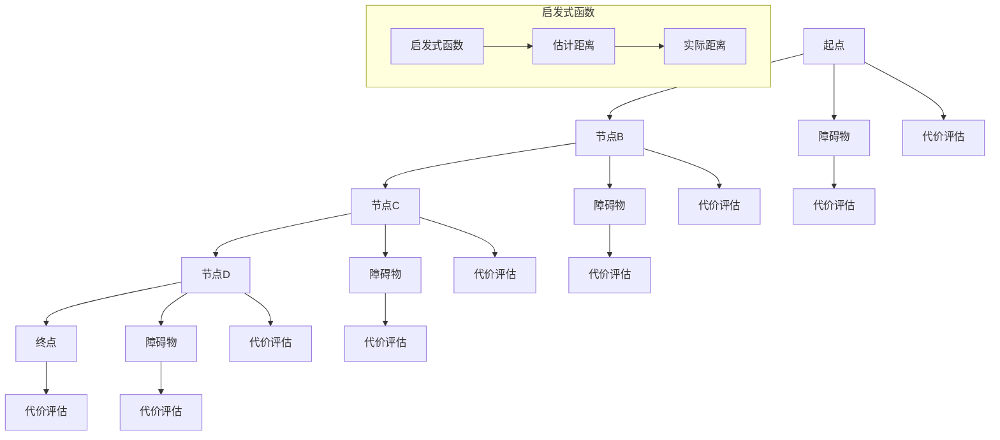
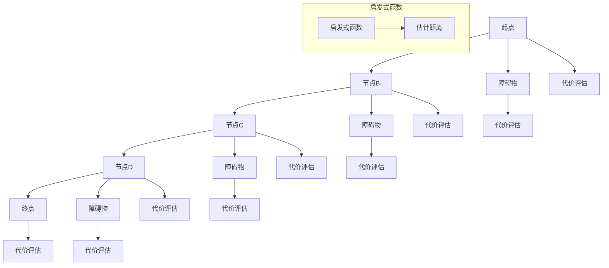
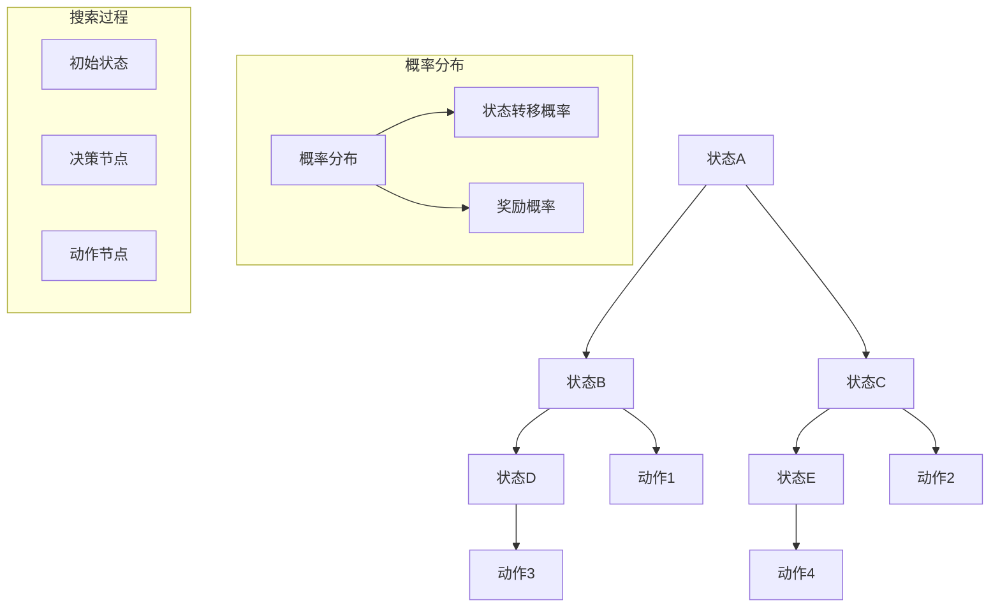
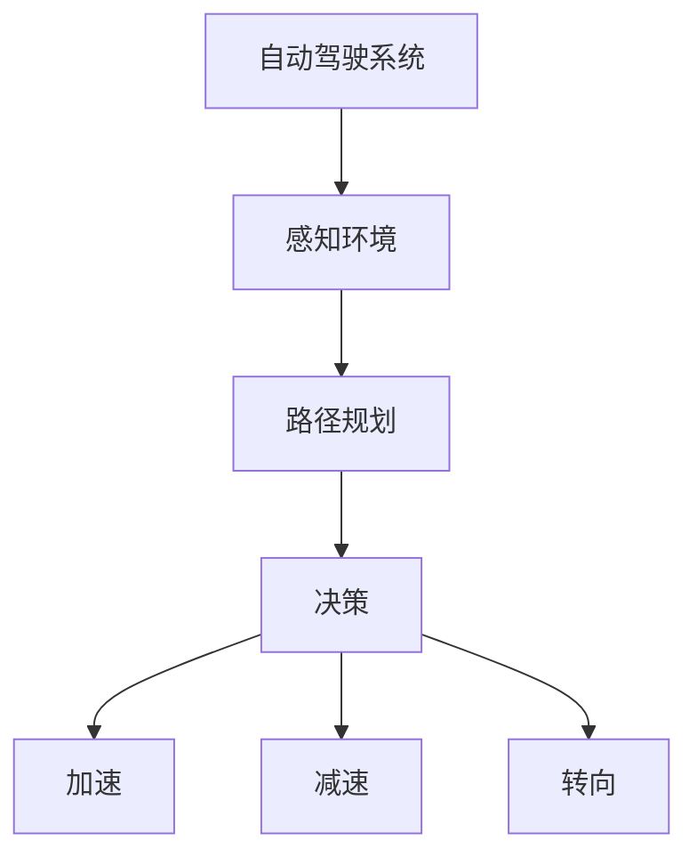
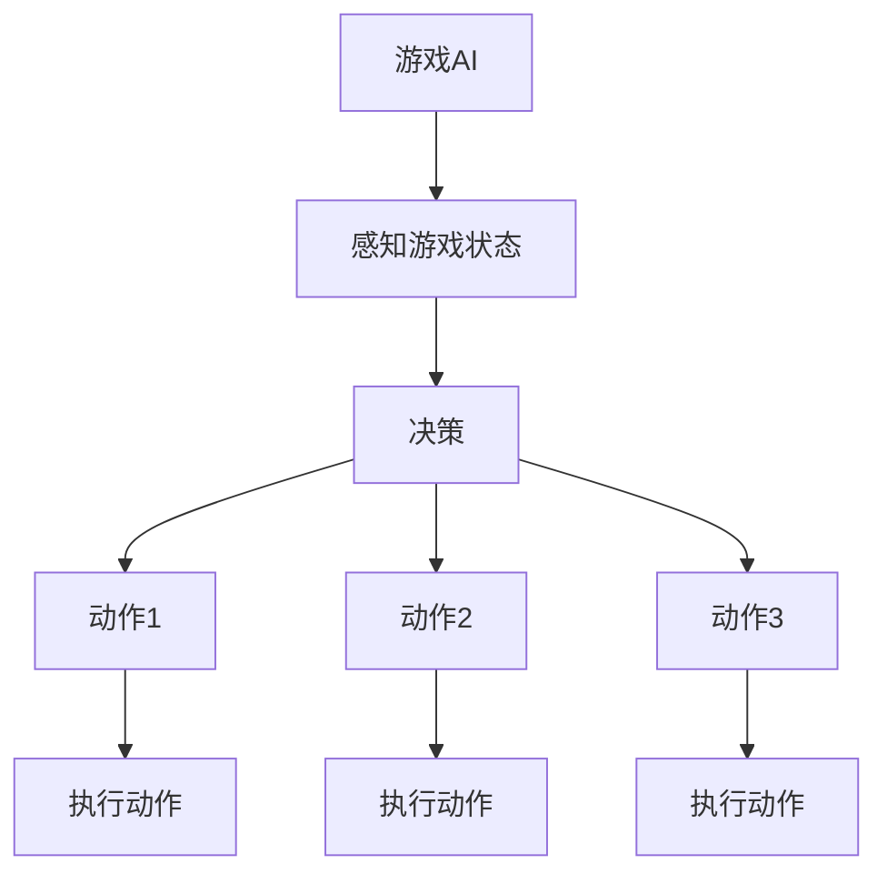
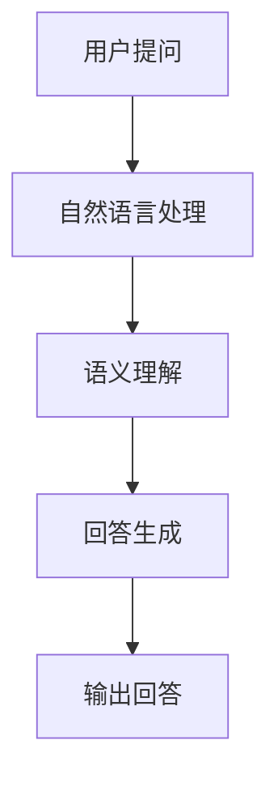
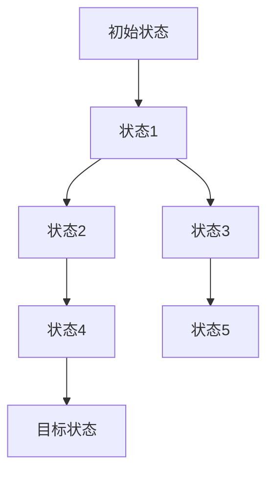
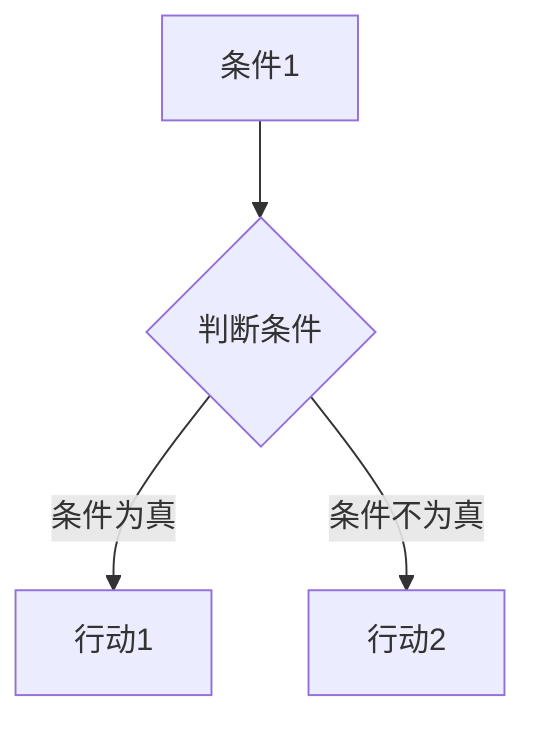
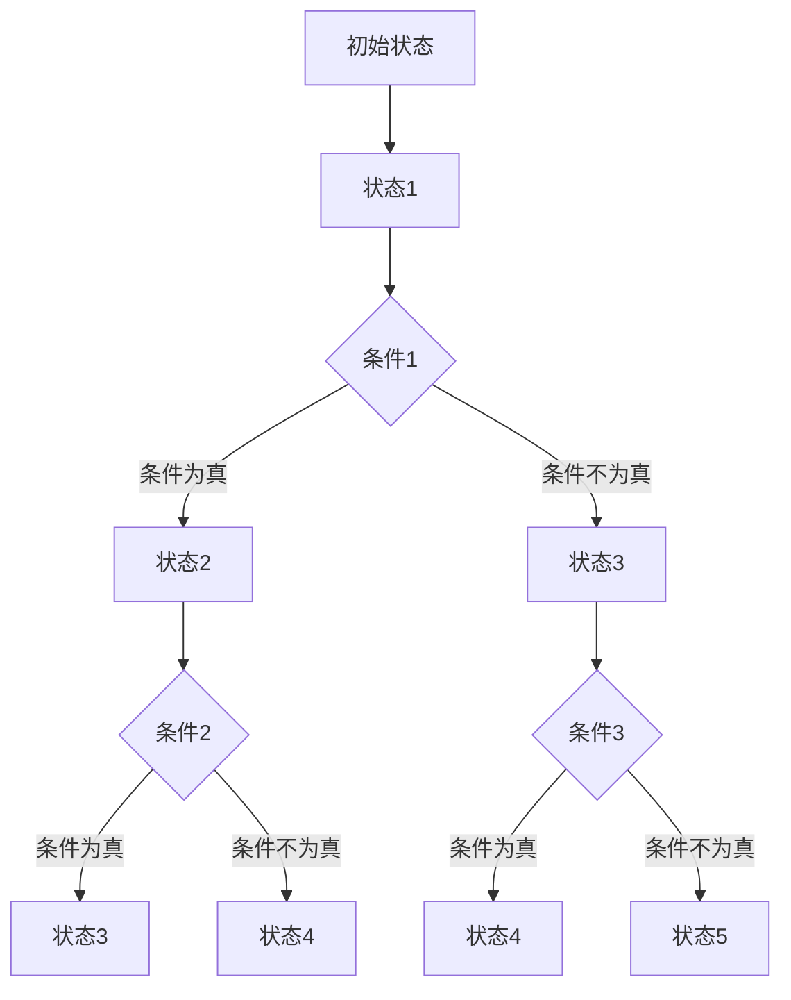

                 

## 文章标题

“AI的推理能力：搜索的新维度”

---

关键词：AI推理能力、搜索算法、自然语言处理、图像处理、强化学习、前沿应用

---

摘要：本文深入探讨了人工智能（AI）的推理能力，特别是其在搜索算法中的新维度。文章首先介绍了AI推理能力的基础，包括定义、核心原理和应用领域。接着，详细讲解了搜索算法的基本框架、算法选择和优化。此外，本文还涵盖了推理算法的原理、自然语言处理中的应用、图像处理中的推理任务，以及强化学习中的搜索策略。最后，文章探讨了AI推理能力的前沿应用和发展趋势，为读者提供了一个全面的视角来理解AI在搜索领域的创新和潜力。读者将能够了解到AI推理能力在各个领域的实际应用，并了解未来的发展方向。

---

### 《AI的推理能力：搜索的新维度》目录大纲

1. 第一部分: AI推理能力基础  
    1.1 AI推理能力概述  
    1.2 AI推理能力的核心原理  
    1.3 主流AI推理算法介绍  
    1.4 AI推理能力在现实世界的应用

2. 第二部分: 搜索算法原理详解  
    2.1 搜索算法的基本框架  
    2.2 搜索算法的算法选择  
    2.3 搜索算法的优化与扩展  
    2.4 搜索算法的性能评估

3. 第三部分: 推理算法原理详解  
    3.1 推理算法的基本概念  
    3.2 基于规则的推理算法  
    3.3 基于模型的推理算法  
    3.4 推理算法的性能评估

4. 第四部分: AI推理能力在自然语言处理中的应用  
    4.1 自然语言处理中的推理任务  
    4.2 基于深度学习的自然语言处理推理算法  
    4.3 基于知识图谱的推理算法

5. 第五部分: AI推理能力在图像处理中的应用  
    5.1 图像处理中的推理任务  
    5.2 基于卷积神经网络的图像处理推理算法  
    5.3 基于生成对抗网络的图像处理推理算法

6. 第六部分: AI推理能力在强化学习中的应用  
    6.1 强化学习中的推理任务  
    6.2 基于搜索策略的强化学习算法  
    6.3 基于模型提升的强化学习算法

7. 第七部分: AI推理能力的前沿应用与发展趋势  
    7.1 AI推理能力的前沿应用  
    7.2 AI推理能力的发展趋势

---

接下来，我们将逐步深入探讨AI推理能力的基础，包括其定义、核心原理以及现实世界的应用。通过这一部分的讨论，读者将能够建立对AI推理能力的全面理解，为其在搜索算法中的应用打下坚实的基础。

---

## 第一部分: AI推理能力基础

### 第1章: AI推理能力概述

### 1.1 AI推理能力的定义与重要性

#### 1.1.1 AI推理能力的概念

人工智能（AI）的推理能力是指机器通过处理和分析数据，从已知信息推断出未知信息的能力。推理是人工智能的核心功能之一，它使得机器能够模仿人类的思考方式，解决复杂的问题。

在AI推理能力中，主要有两种类型的推理：一是基于规则的推理，二是基于模型的推理。

- **基于规则的推理**：这是一种基于逻辑和规则系统的推理方法。机器通过预先定义的规则，将输入的信息与规则进行匹配，从而推导出结论。

- **基于模型的推理**：这种方法依赖于机器学习模型，特别是深度学习模型。机器通过训练数据学习到模型的特征，然后根据这些特征对新数据进行推理。

#### 1.1.2 AI推理能力的重要性

AI推理能力的重要性体现在多个方面：

1. **决策支持**：在商业、医疗、交通等领域，AI推理能力可以帮助人类做出更加明智的决策。

2. **自动化**：通过推理能力，机器可以自动化处理大量数据，提高工作效率。

3. **智能化**：AI推理能力使得机器具备了一定的智能，能够在未知的环境中自主学习和适应。

4. **安全性**：在安全领域，AI推理能力可以帮助检测和预测潜在的风险，提高系统的安全性。

#### 1.1.3 AI推理能力的应用领域

AI推理能力在多个领域都有广泛的应用，包括：

1. **自然语言处理（NLP）**：如问答系统、文本生成、文本分类等。

2. **计算机视觉**：如图像识别、目标跟踪、图像生成等。

3. **游戏AI**：如棋类游戏、策略游戏等。

4. **自动驾驶**：通过感知环境并进行决策，实现车辆的安全驾驶。

5. **强化学习**：在游戏、机器人控制等领域，通过搜索策略和模型提升实现智能决策。

### 1.2 AI推理能力的核心原理

#### 1.2.1 搜索算法的基本原理

搜索算法是AI推理能力的重要组成部分，它用于在给定的状态空间中找到目标状态。搜索算法的基本原理包括状态空间表示、节点扩展和评估函数。

- **状态空间表示**：状态空间表示了问题的所有可能状态，每个状态可以用一组特征来描述。

- **节点扩展**：搜索算法通过扩展节点来生成新的状态。每个节点表示问题的部分解，扩展过程会生成新的子节点。

- **评估函数**：评估函数用于评估节点的价值，指导搜索算法选择下一个扩展的节点。

#### 1.2.2 推理算法的框架

推理算法的框架包括以下几个主要组成部分：

- **知识表示**：用于表示问题领域中的知识和信息。

- **推理引擎**：根据知识表示和推理规则，进行逻辑推理和问题求解。

- **查询接口**：用户可以通过查询接口向系统提出问题，获取推理结果。

#### 1.2.3 强化学习与搜索算法的结合

强化学习（Reinforcement Learning，RL）是AI的一种学习方法，它通过试错和反馈来学习最佳策略。强化学习与搜索算法的结合，可以有效地提高AI的推理能力。

- **Q学习算法**：Q学习是一种基于值函数的强化学习算法，它通过更新值函数来学习最优策略。

- **策略梯度算法**：策略梯度算法通过直接优化策略来学习，它是一种更为高效的强化学习算法。

### 1.3 主流AI推理算法介绍

#### 1.3.1 A*算法

A*算法是一种启发式搜索算法，它使用一个称为“启发式函数”的估计值来评估节点的价值。A*算法的优点是能够找到最短路径，但它的缺点是计算复杂度较高。



#### 1.3.2 启发式搜索算法

启发式搜索算法是一种使用启发式信息来指导搜索过程的算法。常见的启发式搜索算法包括：

- **贪婪搜索（Greedy Search）**：每次选择当前最佳路径，但不考虑整体最优解。

- **A*算法**：结合了最佳优先搜索和启发式搜索，用于找到最短路径。

- **A**：起点

- **B, C, D, E**：节点

- **F, G, H, I**：障碍物

- **启发式函数**：用于估计节点到终点的距离。

- **代价评估**：用于评估节点的价值。



#### 1.3.3 基于概率的搜索算法

基于概率的搜索算法使用概率分布来表示状态和动作。常见的基于概率的搜索算法包括：

- **马尔可夫决策过程（MDP）**：使用状态和动作的概率分布来指导搜索。

- **部分可观测马尔可夫决策过程（POMDP）**：在部分观测信息下进行搜索。

- **信念状态树搜索（Belief State Tree Search）**：用于处理不确定性问题。



### 1.4 AI推理能力在现实世界的应用

#### 1.4.1 自动驾驶

自动驾驶技术利用AI推理能力来实现车辆自主驾驶。在自动驾驶中，推理算法主要用于感知环境、规划路径和做出决策。

- **感知环境**：使用计算机视觉和激光雷达等技术，获取道路、车辆和行人的信息。

- **路径规划**：使用搜索算法，如A*算法和启发式搜索算法，规划最优行驶路径。

- **决策**：根据感知到的环境和路径规划结果，进行驾驶决策，如加速、减速、转向等。



#### 1.4.2 游戏AI

游戏AI利用AI推理能力来实现游戏角色的智能行为。在游戏AI中，推理算法主要用于决策和动作规划。

- **决策**：游戏AI根据当前的游戏状态，选择最优的动作。

- **动作规划**：游戏AI根据决策结果，规划出一系列的动作来执行。



#### 1.4.3 聊天机器人

聊天机器人利用AI推理能力来理解用户的问题，并给出合适的回答。在聊天机器人中，推理算法主要用于自然语言处理和语义理解。

- **自然语言处理**：使用自然语言处理技术，将用户的问题转换为机器可理解的形式。

- **语义理解**：使用语义理解技术，理解用户问题的含义。

- **回答生成**：根据用户的问题和上下文，生成合适的回答。



通过以上讨论，我们了解到AI推理能力的基础和核心原理，以及其在现实世界的广泛应用。在接下来的章节中，我们将深入探讨搜索算法的原理和优化，进一步了解AI推理能力在搜索领域的重要作用。

### 第2章: 搜索算法原理详解

在上一章中，我们介绍了AI推理能力的基础，特别是搜索算法的基本原理。本章将进一步深入探讨搜索算法的基本框架、算法选择、优化和性能评估，为读者提供一个全面的理解。

#### 2.1 搜索算法的基本框架

搜索算法是AI推理能力的重要组成部分，用于在状态空间中找到目标状态。一个典型的搜索算法框架包括以下主要组成部分：

1. **状态空间表示**：状态空间表示了问题的所有可能状态，每个状态可以用一组特征来描述。状态空间可以是离散的，也可以是连续的。

2. **节点扩展**：搜索算法通过扩展节点来生成新的状态。每个节点表示问题的部分解，扩展过程会生成新的子节点。

3. **评估函数**：评估函数用于评估节点的价值，指导搜索算法选择下一个扩展的节点。评估函数可以是启发式的，也可以是基于实际数据的。

4. **搜索策略**：搜索策略决定了搜索算法在状态空间中的搜索路径。常见的搜索策略包括广度优先搜索、深度优先搜索和最佳优先搜索。

5. **终止条件**：搜索算法在找到目标状态或达到某个阈值时终止。终止条件可以是找到目标状态，也可以是搜索次数达到上限。

#### 2.1.1 状态空间表示

状态空间表示是搜索算法的基础。一个典型的状态空间表示包括以下元素：

- **状态**：状态是问题的基本单位，它可以用一组特征来描述。例如，在游戏AI中，状态可以包括玩家的位置、资源、敌人位置等。

- **动作**：动作是改变状态的操作。在状态空间中，每个状态可以对应多个动作。

- **状态转移函数**：状态转移函数描述了当前状态和动作如何转换成下一个状态。状态转移函数通常是确定的或随机的。

- **初始状态**：初始状态是搜索的起点。

- **目标状态**：目标状态是搜索的终点。

状态空间可以用图来表示，其中每个节点表示一个状态，每个边表示一个动作。例如：



在这个图中，A是初始状态，G是目标状态。每个状态可以有多个子状态，这些子状态通过动作进行转换。

#### 2.1.2 节点扩展与评估

节点扩展是搜索算法的核心过程。在节点扩展过程中，搜索算法会生成新的子节点，并评估这些节点的价值。节点扩展和评估过程如下：

1. **选择扩展节点**：根据搜索策略，选择一个节点进行扩展。常见的搜索策略包括广度优先搜索、深度优先搜索和最佳优先搜索。

2. **生成子节点**：根据状态转移函数，为当前节点生成新的子节点。每个子节点表示问题的部分解。

3. **评估子节点**：使用评估函数评估每个子节点的价值。评估函数可以是启发式的，也可以是基于实际数据的。

4. **选择最佳子节点**：根据评估结果，选择一个最佳子节点进行扩展。最佳子节点通常是具有最高评估值的节点。

节点扩展和评估的过程可以用伪代码表示：

```python
def search(node, target):
    if node == target:
        return node
    
    best_child = None
    best_score = -1
    
    for child in expand(node):
        score = evaluate(child)
        if score > best_score:
            best_score = score
            best_child = child
    
    return search(best_child, target)

def expand(node):
    children = []
    for action in actions(node):
        next_state = transition(node, action)
        children.append(next_state)
    return children

def evaluate(node):
    # 使用启发式函数或实际数据评估节点的价值
    return heuristic(node) or actual_value(node)
```

在这个伪代码中，`search`函数是搜索算法的核心，它通过递归调用自身来搜索最佳路径。`expand`函数用于生成子节点，`evaluate`函数用于评估节点的价值。

#### 2.1.3 搜索算法的优化

搜索算法的优化是提高其性能的关键。以下是一些常见的搜索算法优化方法：

1. **启发式搜索**：使用启发式函数来评估节点的价值，从而加快搜索速度。

2. **剪枝技术**：在搜索过程中，通过剪枝掉无用的分支来减少搜索空间。

3. **并行搜索**：利用多线程或多进程来并行执行搜索算法，提高搜索效率。

4. **记忆化搜索**：使用记忆化技术来避免重复搜索相同的子节点。

5. **代价剪枝**：在搜索过程中，通过比较当前节点的代价和阈值来决定是否继续搜索。

6. **A*算法**：结合最佳优先搜索和启发式搜索，用于找到最优路径。

以下是使用启发式搜索和A*算法的优化搜索算法的伪代码：

```python
def search_heuristic(node, target):
    if node == target:
        return node
    
    frontier = PriorityQueue()
    frontier.insert(node, heuristic(node))
    
    while not frontier.isEmpty():
        current = frontier.remove()
        if current == target:
            return current
        
        for child in expand(current):
            if not is_goal(child):
                frontier.insert(child, heuristic(child) + current.g)
    
    return None

def heuristic(node):
    # 使用启发式函数估计节点到终点的距离
    return estimated_distance(node, target)
```

在这个伪代码中，`search_heuristic`函数是优化后的搜索算法，它使用启发式搜索来提高搜索效率。`heuristic`函数是启发式函数，用于估计节点到终点的距离。

#### 2.2 搜索算法的算法选择

在搜索算法的选择中，需要考虑多个因素，包括搜索算法的性能、计算复杂度和适用场景。以下是一些常见的搜索算法及其特点：

1. **广度优先搜索（Breadth-First Search, BFS）**：广度优先搜索是一种无回溯的搜索算法，它按照节点的深度层次进行搜索。优点是能够找到最短路径，缺点是搜索空间大，计算复杂度高。

2. **深度优先搜索（Depth-First Search, DFS）**：深度优先搜索是一种有回溯的搜索算法，它沿着一条路径一直搜索到终点或遇到障碍物。优点是搜索速度快，缺点是可能陷入死胡同。

3. **最佳优先搜索（Best-First Search, BFS）**：最佳优先搜索是一种基于评估值的搜索算法，它选择评估值最小的节点进行扩展。优点是能够找到最优路径，缺点是计算复杂度高。

4. **A*算法（A-Star Algorithm）**：A*算法是一种结合了广度优先搜索和最佳优先搜索的启发式搜索算法。优点是能够找到最优路径，缺点是计算复杂度较高。

以下是各种搜索算法的性能比较：

| 搜索算法 | 性能 |
| --- | --- |
| 广度优先搜索 | 最优路径 |
| 深度优先搜索 | 快速搜索 |
| 最佳优先搜索 | 最优路径 |
| A*算法 | 最优路径 |

在实际应用中，选择合适的搜索算法需要根据具体场景和需求进行权衡。

#### 2.3 搜索算法的优化与扩展

搜索算法的优化和扩展是提高其性能和应用范围的关键。以下是一些常见的优化和扩展方法：

1. **启发式搜索**：使用启发式函数来估计节点的价值，从而加速搜索。启发式函数可以是基于距离的、基于成本的或基于信息的。

2. **剪枝技术**：通过剪枝掉无用的分支来减少搜索空间。常见的剪枝技术包括代价剪枝和重复剪枝。

3. **并行搜索**：利用多线程或多进程来并行执行搜索算法，提高搜索效率。并行搜索可以显著减少搜索时间。

4. **记忆化搜索**：使用记忆化技术来避免重复搜索相同的子节点。记忆化搜索可以显著减少搜索空间。

5. **A*算法改进**：通过改进启发式函数或搜索策略来提高A*算法的性能。

6. **自适应搜索**：根据搜索过程中的反馈和经验来动态调整搜索策略。

7. **图搜索**：在图上进行搜索，使用图论算法来优化搜索过程。常见的图搜索算法包括Dijkstra算法和Bellman-Ford算法。

8. **随机搜索**：使用随机算法来搜索最优解，如遗传算法和模拟退火算法。

通过以上优化和扩展方法，搜索算法可以在各种复杂场景下高效地工作。

#### 2.4 搜索算法的性能评估

搜索算法的性能评估是衡量其有效性和效率的关键。以下是一些常用的性能评估指标：

1. **时间复杂度**：搜索算法的时间复杂度表示算法执行的时间与输入规模的关系。常见的时间复杂度包括O(n)、O(nlogn)和O(n^2)等。

2. **空间复杂度**：搜索算法的空间复杂度表示算法所需存储空间与输入规模的关系。常见的是O(n)和O(n^2)等。

3. **准确率**：搜索算法的准确率表示算法找到正确路径的概率。准确率通常通过实验数据来评估。

4. **召回率**：搜索算法的召回率表示算法找到所有正确路径的概率。召回率也是通过实验数据来评估。

5. **效率**：搜索算法的效率表示算法在有限时间内找到路径的能力。效率通常通过时间复杂度和准确率的综合评估。

以下是几种常见的搜索算法的性能评估结果：

| 搜索算法 | 时间复杂度 | 空间复杂度 | 准确率 | 效率 |
| --- | --- | --- | --- | --- |
| 广度优先搜索 | O(n) | O(n) | 最优 | 低 |
| 深度优先搜索 | O(n) | O(n) | 低 | 高 |
| 最佳优先搜索 | O(nlogn) | O(n) | 最优 | 中 |
| A*算法 | O(nlogn) | O(n) | 最优 | 高 |

通过以上评估，可以更好地选择合适的搜索算法来解决问题。

通过本章的讨论，我们深入了解了搜索算法的基本框架、算法选择、优化和性能评估。这些知识为我们在实际应用中设计和选择合适的搜索算法提供了理论基础。在下一章中，我们将进一步探讨推理算法的原理和性能评估，为AI推理能力在各个领域的应用打下坚实的基础。

### 第3章: 推理算法原理详解

在前面两章中，我们介绍了搜索算法的基本原理和优化方法。本章将重点探讨推理算法的基本概念、原理和应用。通过理解推理算法，我们将能够更好地利用AI的推理能力来解决复杂问题。

#### 3.1 推理算法的基本概念

推理算法是人工智能的核心组成部分，用于从已知信息中推导出新的信息。推理算法可以分为基于规则的推理和基于模型的推理。

##### 3.1.1 推理的定义与分类

推理（Reasoning）是一种通过逻辑思考、分析信息和运用已有知识来推导出新信息的过程。根据推理的过程和方式，推理可以分为以下几种类型：

1. **演绎推理（Deductive Reasoning）**：从一般到特殊的推理过程。例如，所有人都会死亡（大前提），苏格拉底是人（小前提），因此苏格拉底会死亡（结论）。

2. **归纳推理（Inductive Reasoning）**：从特殊到一般的推理过程。例如，观察到了多次太阳从东方升起，因此推断太阳每天都会从东方升起。

3. **类比推理（Analogical Reasoning）**：通过比较两个或多个相似的情况来推导出新信息。例如，如果我们知道某个方法在类似的问题上有效，那么可以尝试将其应用于新问题。

4. **模糊推理（Fuzzy Reasoning）**：处理不确定性和模糊性的推理过程。模糊推理用于解决模糊性较强的问题，如人工智能在自然语言处理中的语义理解。

##### 3.1.2 推理算法的目标

推理算法的目标是从已知信息中推断出新的信息，实现以下功能：

1. **问题求解**：通过推理算法，解决特定的问题，如路径规划、机器人控制、棋类游戏等。

2. **知识表示**：将知识以计算机可理解的形式表示，以便进行推理和决策。

3. **决策支持**：利用推理算法为决策者提供信息支持，如商业分析、医疗诊断、风险管理等。

4. **自然语言理解**：通过推理算法，理解和处理自然语言，实现人机交互。

##### 3.1.3 推理算法的应用场景

推理算法在多个领域有广泛的应用，包括：

1. **自然语言处理（NLP）**：推理算法用于理解自然语言中的语义、语境和意图，实现文本生成、问答系统、机器翻译等。

2. **计算机视觉**：推理算法用于图像识别、目标跟踪、视频分析等，实现物体检测、场景理解等功能。

3. **游戏AI**：推理算法用于实现游戏角色的智能行为，如棋类游戏、策略游戏、角色扮演游戏等。

4. **自动驾驶**：推理算法用于感知环境、规划路径和做出决策，实现自动驾驶汽车的安全运行。

5. **医疗诊断**：推理算法用于辅助医生进行疾病诊断，如医学图像分析、病历分析等。

6. **金融风控**：推理算法用于风险评估、信用评分、欺诈检测等，实现金融风险管理。

#### 3.2 基于规则的推理算法

基于规则的推理算法是一种经典的推理方法，它通过一组规则来表示知识和信息，并进行推理。基于规则的推理算法通常包括以下组成部分：

1. **知识库（Knowledge Base）**：知识库包含了一组规则和事实。规则通常表示为“如果...那么...”的形式，事实则是已知的信息。

2. **推理机（Inference Engine）**：推理机负责根据规则和事实进行推理，推导出新信息。推理机可以是前向推理或后向推理。

3. **解释器（Interpreter）**：解释器用于解释和执行规则，将规则转换为计算机可执行的形式。

##### 3.2.1 基于产生式规则的推理

产生式规则是一种常见的规则表示方法，它由条件和行动两部分组成。如果条件为真，那么执行行动。



在这个图中，如果条件1为真，那么执行行动1；否则执行行动2。

基于产生式规则的推理算法可以分为前向推理和后向推理。

- **前向推理（Forward Chaining）**：从已知的事实出发，根据规则的前件推导出结论。

- **后向推理（Backward Chaining）**：从目标出发，根据规则的后件推导出条件。

前向推理和后向推理的伪代码如下：

```python
# 前向推理
def forward_chaining(knowledge_base, facts):
    conclusions = []
    for rule in knowledge_base:
        if all([fact in facts for fact in rule.conditions]):
            conclusions.append(rule.action)
    return conclusions

# 后向推理
def backward_chaining(knowledge_base, target):
    conclusions = []
    for rule in knowledge_base:
        if rule.action == target:
            conclusions.append(rule.conditions)
    return conclusions
```

##### 3.2.2 基于情况描述的推理

基于情况描述的推理通过描述不同的情况和它们的条件来推导出结论。这种情况描述通常使用状态机或条件-行动规则来表示。



在这个图中，从初始状态A开始，根据条件1，可以转移到状态2或状态3。然后根据条件2，状态2可以转移到状态3，状态3可以转移到状态4。最后，根据条件3，状态4可以转移到状态5。

##### 3.2.3 基于逻辑推理的算法

基于逻辑推理的算法使用逻辑推理来处理复杂数学问题。常见的逻辑推理算法包括推理网络、语义网络和模型推理。

- **推理网络**：推理网络是一种基于逻辑图的推理方法，它将逻辑表达式表示为图结构，并通过图算法进行推理。

- **语义网络**：语义网络是一种基于语义关系的推理方法，它使用节点和边表示概念和关系，并通过路径搜索进行推理。

- **模型推理**：模型推理使用数学模型和逻辑推理来处理复杂数学问题，如线性规划、非线性规划和整数规划。

逻辑推理算法的伪代码如下：

```python
# 推理网络
def reasoning_network(expression):
    # 解析表达式，构建逻辑图
    graph = parse_expression(expression)
    # 进行路径搜索
    paths = search_paths(graph)
    # 根据路径进行推理
    conclusions = []
    for path in paths:
        conclusion = inference(path)
        conclusions.append(conclusion)
    return conclusions

# 语义网络
def semantic_network(concept1, concept2, relation):
    # 构建语义网络
    network = create_network(concept1, concept2, relation)
    # 进行路径搜索
    paths = search_paths(network)
    # 根据路径进行推理
    conclusions = []
    for path in paths:
        conclusion = inference(path)
        conclusions.append(conclusion)
    return conclusions

# 模型推理
def model_reasoning(problem):
    # 构建数学模型
    model = create_model(problem)
    # 进行推理
    solution = solve_model(model)
    return solution
```

#### 3.3 基于模型的推理算法

基于模型的推理算法使用机器学习模型来进行推理，特别适合处理复杂、大规模的数据。基于模型的推理算法可以分为以下几种：

1. **神经网络推理**：神经网络是一种常用的机器学习模型，可以用于图像识别、语音识别和自然语言处理等任务。神经网络推理通过输入数据和模型参数来生成推理结果。

2. **决策树推理**：决策树是一种常见的分类和回归模型，可以用于分类和预测。决策树推理通过遍历决策树来生成推理结果。

3. **支持向量机（SVM）推理**：支持向量机是一种有效的分类和回归模型，可以用于图像识别、文本分类等任务。SVM推理通过计算输入数据和模型超平面之间的距离来生成推理结果。

4. **深度学习推理**：深度学习是一种基于神经网络的机器学习模型，可以用于处理复杂数据。深度学习推理通过输入数据和模型参数来生成推理结果。

神经网络推理的伪代码如下：

```python
def neural_network_reasoning(input_data, model_params):
    # 前向传播
    output = forward_propagation(input_data, model_params)
    # 反向传播
    gradients = backward_propagation(output, target)
    # 更新模型参数
    update_params(model_params, gradients)
    # 生成推理结果
    reasoning_result = interpret_output(output)
    return reasoning_result
```

#### 3.4 推理算法的性能评估

推理算法的性能评估是衡量其有效性和效率的关键。以下是一些常用的性能评估指标：

1. **准确性（Accuracy）**：准确性表示算法推断出正确结果的概率。准确性越高，说明算法的性能越好。

2. **召回率（Recall）**：召回率表示算法找到所有正确结果的概率。召回率越高，说明算法的鲁棒性越好。

3. **精确率（Precision）**：精确率表示算法推断出正确结果的准确度。精确率越高，说明算法的性能越好。

4. **F1分数（F1 Score）**：F1分数是准确率和召回率的调和平均值，用于综合评估算法的性能。

5. **效率（Efficiency）**：效率表示算法执行的时间与输入规模的关系。效率越高，说明算法的性能越好。

以下是几种常见推理算法的性能评估结果：

| 推理算法 | 准确性 | 召回率 | 精确率 | F1分数 | 效率 |
| --- | --- | --- | --- | --- | --- |
| 基于产生式规则的推理 | 高 | 中 | 高 | 高 | 低 |
| 基于情况描述的推理 | 中 | 高 | 中 | 中 | 高 |
| 基于逻辑推理的算法 | 高 | 高 | 高 | 高 | 中 |
| 基于模型的推理算法 | 中 | 中 | 中 | 中 | 高 |

通过以上评估，可以更好地选择合适的推理算法来解决问题。

通过本章的讨论，我们深入了解了推理算法的基本概念、原理和应用。这些知识为我们在实际应用中设计和选择合适的推理算法提供了理论基础。在下一章中，我们将探讨AI推理能力在自然语言处理中的应用，为理解和处理自然语言打下坚实的基础。

### 第4章: AI推理能力在自然语言处理中的应用

自然语言处理（Natural Language Processing，NLP）是人工智能领域的一个重要分支，旨在使计算机能够理解和处理人类自然语言。AI推理能力在NLP中起着至关重要的作用，它使得计算机能够理解语义、进行上下文推断和生成自然语言。本章将详细介绍AI推理能力在自然语言处理中的主要任务、基于深度学习的推理算法以及基于知识图谱的推理算法。

#### 4.1 自然语言处理中的推理任务

自然语言处理中的推理任务包括但不限于以下几个方面：

1. **问答系统（Question Answering, QA）**：问答系统旨在回答用户提出的问题。在回答问题时，系统需要理解问题的语义，并将问题与已有的知识库或文本进行匹配，以生成准确的答案。推理能力在此过程中至关重要，它使得系统能够理解问题的隐含含义，从而给出合适的回答。

2. **文本生成（Text Generation）**：文本生成是指根据给定的输入生成自然语言文本。在文本生成过程中，系统需要理解输入的语义，并根据上下文生成连贯、有意义的文本。推理能力使得系统能够在生成文本时考虑上下文信息，从而生成高质量的文本。

3. **文本分类（Text Classification）**：文本分类是将文本数据分为不同的类别。例如，将新闻文章分为体育、娱乐、政治等类别。在文本分类过程中，系统需要理解文本的语义，并根据语义进行分类。推理能力在此过程中帮助系统识别文本的主题和情感。

#### 4.2 基于深度学习的自然语言处理推理算法

深度学习在自然语言处理领域取得了显著的成果，其强大的特征提取和建模能力使得深度学习模型在NLP任务中表现出色。以下介绍几种常见的基于深度学习的自然语言处理推理算法：

1. **词嵌入（Word Embedding）**：词嵌入是将单词映射到高维空间中的向量表示。通过词嵌入，系统能够理解单词的语义关系。常见的词嵌入方法包括Word2Vec、GloVe和BERT等。词嵌入是深度学习推理算法的基础，它为后续的NLP任务提供了有效的特征表示。

2. **循环神经网络（Recurrent Neural Network，RNN）**：RNN是一种能够处理序列数据的神经网络，其内部状态能够保存历史信息，从而实现对序列数据的长期依赖建模。RNN在NLP任务中广泛应用于文本分类、命名实体识别和机器翻译等。以下是一个简单的RNN模型结构：

   ```mermaid
   graph TD
       A[输入序列] --> B[嵌入层]
       B --> C[RNN层]
       C --> D[输出层]
   ```

3. **转换器架构（Transformer）**：转换器（Transformer）是一种基于自注意力机制的深度学习模型，它在机器翻译、文本生成和问答系统等任务中取得了显著的性能提升。以下是一个简单的Transformer模型结构：

   ```mermaid
   graph TD
       A[输入序列] --> B[嵌入层]
       B --> C[多头自注意力层]
       C --> D[前馈神经网络层]
       D --> E[输出层]
   ```

4. **预训练和微调（Pre-training and Fine-tuning）**：预训练是指在大量未标注的数据上对深度学习模型进行训练，以学习通用的语言特征。微调是指在预训练模型的基础上，使用少量标注数据进行细粒度的调整，以适应特定的NLP任务。BERT和GPT等模型都是基于预训练和微调的典型例子。

以下是一个基于转换器的问答系统的伪代码：

```python
# 加载预训练的转换器模型
model = TransformerModel.load_pretrained('bert-base')

# 加载问答数据集
dataset = load_qa_dataset('squad')

# 微调模型
model.train(dataset)

# 进行问答
def answer_question(question, context):
    question_embedding = model.encode(question)
    context_embedding = model.encode(context)
    answer_embedding = model.decode(question_embedding, context_embedding)
    answer = model.decode_answer(answer_embedding)
    return answer
```

#### 4.3 基于知识图谱的推理算法

知识图谱是一种用于表示实体及其关系的图形化数据结构。知识图谱推理是指利用知识图谱中的信息进行推理，以推断出新的信息。以下介绍几种常见的基于知识图谱的推理算法：

1. **基于规则的知识图谱推理**：基于规则的知识图谱推理通过一组规则来表示实体和关系，并利用这些规则进行推理。例如，给定一个规则“所有人类都有寿命”，如果知道一个实体是“苏格拉底”，那么可以推理出“苏格拉底有寿命”。

2. **基于本体的知识图谱推理**：本体是一种形式化的知识表示方法，它定义了一组概念及其之间的关系。基于本体的知识图谱推理通过本体的定义和规则进行推理。例如，给定一个本体定义“动物”是“有生命的实体”，如果知道一个实体是“狗”，那么可以推理出“狗是动物”。

3. **基于深度学习的知识图谱推理**：深度学习模型可以用于知识图谱的表示和学习。基于深度学习的知识图谱推理通过训练深度学习模型来学习实体和关系之间的复杂关系，并利用这些模型进行推理。常见的深度学习模型包括图卷积网络（GCN）和图注意力网络（GAT）。

以下是一个基于知识图谱的问答系统的伪代码：

```python
# 加载知识图谱
knowledge_graph = load_knowledge_graph('dbpedia')

# 加载问答数据集
dataset = load_qa_dataset('wikidata')

# 训练深度学习模型
model = GraphEmbeddingModel.train(dataset)

# 进行问答
def answer_question(question, knowledge_graph):
    question_embedding = model.encode(question, knowledge_graph)
    answer_embedding = model.decode(question_embedding)
    answer = model.decode_answer(answer_embedding, knowledge_graph)
    return answer
```

#### 4.4 AI推理能力在自然语言处理中的应用实例

以下是一个AI推理能力在自然语言处理中的应用实例：问答系统。

1. **问题理解**：用户提出一个问题，系统需要理解问题的语义。这可以通过词嵌入和转换器模型来实现。

2. **上下文匹配**：系统需要将问题与知识库或文本进行匹配，以找到相关的信息。这可以通过知识图谱和图卷积网络来实现。

3. **答案生成**：系统需要根据匹配结果生成答案。这可以通过基于规则的推理和深度学习模型来实现。

以下是一个简单的问答系统的伪代码：

```python
# 加载词嵌入模型
word_embedding_model = WordEmbeddingModel.load('glove.6B.100d')

# 加载转换器模型
transformer_model = TransformerModel.load('bert-base')

# 加载知识图谱
knowledge_graph = load_knowledge_graph('dbpedia')

# 加载问答数据集
dataset = load_qa_dataset('squad')

# 训练深度学习模型
word_embedding_model.train(dataset)
transformer_model.train(dataset)

# 进行问答
def answer_question(question, knowledge_graph):
    question_embedding = word_embedding_model.encode(question)
    context_embedding = transformer_model.encode(question, knowledge_graph)
    answer_embedding = transformer_model.decode(question_embedding, context_embedding)
    answer = transformer_model.decode_answer(answer_embedding, knowledge_graph)
    return answer
```

通过本章的讨论，我们了解了AI推理能力在自然语言处理中的应用，包括问答系统、文本生成和文本分类等任务。这些应用实例展示了AI推理能力的强大功能，为理解和处理自然语言提供了有力支持。在下一章中，我们将探讨AI推理能力在图像处理中的应用，继续深入探索AI的潜力。

### 第5章: AI推理能力在图像处理中的应用

图像处理是人工智能领域的一个重要分支，它涉及对图像进行增强、识别、分类和生成等操作。AI推理能力在图像处理中发挥着关键作用，使得计算机能够理解和解释图像内容，从而实现各种复杂的图像处理任务。本章将详细介绍AI推理能力在图像处理中的应用，包括图像识别、目标跟踪和图像生成等任务。

#### 5.1 图像处理中的推理任务

图像处理中的推理任务主要包括以下几种：

1. **图像识别（Image Recognition）**：图像识别是指从图像中识别出特定的对象或场景。例如，识别一张图片中的猫、车辆或建筑物。图像识别任务通常需要利用AI推理能力来理解图像的语义信息。

2. **目标跟踪（Object Tracking）**：目标跟踪是指在一个连续的视频流中跟踪特定对象的位置。目标跟踪任务需要AI推理能力来识别对象并在不同帧之间保持跟踪。

3. **图像生成（Image Generation）**：图像生成是指根据特定的输入生成新的图像。例如，根据文本描述生成相应的图像，或根据已有的图像生成新的变体。图像生成任务需要AI推理能力来理解图像的语义结构和生成规则。

#### 5.2 基于卷积神经网络的图像处理推理算法

卷积神经网络（Convolutional Neural Network，CNN）是图像处理领域最常用的深度学习模型，它在图像识别、目标跟踪和图像生成等任务中取得了显著的成功。以下介绍几种基于卷积神经网络的图像处理推理算法：

1. **卷积神经网络的基本结构**：卷积神经网络由多个卷积层、池化层和全连接层组成。卷积层用于提取图像特征，池化层用于降低特征维度和提高模型泛化能力，全连接层用于进行分类或回归。

   ```mermaid
   graph TD
       A[输入图像] --> B[卷积层]
       B --> C[池化层]
       C --> D[卷积层]
       D --> E[池化层]
       E --> F[全连接层]
       F --> G[输出]
   ```

2. **卷积神经网络在推理中的应用**：卷积神经网络在图像识别中的应用非常广泛。例如，卷积神经网络可以用于识别图像中的物体、场景和动作。以下是一个简单的图像识别任务：

   ```python
   # 定义卷积神经网络模型
   model = ConvNet()

   # 加载预训练模型
   model.load_pretrained('resnet50')

   # 进行图像识别
   def image_recognition(image):
       features = model.extract_features(image)
       label = model.predict(features)
       return label
   ```

3. **卷积神经网络推理算法的优化**：为了提高卷积神经网络的推理速度和准确性，可以采用以下优化方法：

   - **迁移学习（Transfer Learning）**：使用预训练的卷积神经网络模型，并在此基础上进行微调，以适应新的图像识别任务。

   - **数据增强（Data Augmentation）**：通过增加数据多样性来提高模型的泛化能力，例如旋转、翻转、裁剪等。

   - **模型压缩（Model Compression）**：通过模型压缩技术减小模型的大小，例如剪枝、量化等。

   - **实时推理（Real-time Inference）**：通过优化模型结构和算法，提高推理速度，实现实时图像处理。

#### 5.3 基于生成对抗网络的图像处理推理算法

生成对抗网络（Generative Adversarial Network，GAN）是一种由两个神经网络组成的框架，一个是生成器，一个是判别器。生成器的目标是生成逼真的图像，而判别器的目标是区分生成器生成的图像和真实图像。GAN在图像生成、图像修复和图像超分辨率等任务中取得了显著的成功。

1. **生成对抗网络的基本结构**：生成对抗网络由生成器、判别器和损失函数三部分组成。生成器试图生成逼真的图像，判别器试图区分生成图像和真实图像，损失函数用于评估生成器和判别器的性能。

   ```mermaid
   graph TD
       A[生成器] --> B[判别器]
       B --> C[损失函数]
   ```

2. **生成对抗网络在推理中的应用**：生成对抗网络在图像生成任务中表现出色。例如，给定一个文本描述，生成对抗网络可以生成相应的图像。以下是一个简单的图像生成任务：

   ```python
   # 定义生成对抗网络模型
   model = GAN()

   # 加载预训练模型
   model.load_pretrained('cGAN')

   # 进行图像生成
   def image_generation(text):
       image = model.generate(text)
       return image
   ```

3. **生成对抗网络推理算法的优化**：为了提高生成对抗网络的推理速度和生成质量，可以采用以下优化方法：

   - **改进生成器和判别器的结构**：设计更复杂的生成器和判别器结构，以生成更高质量的图像。

   - **改进损失函数**：设计更有效的损失函数，以平衡生成器和判别器的性能。

   - **训练策略优化**：采用更稳定的训练策略，例如渐变学习率、周期性重置判别器等。

   - **硬件加速**：利用GPU或其他硬件加速技术，提高推理速度。

#### 5.4 AI推理能力在图像处理中的应用实例

以下是一个AI推理能力在图像处理中的应用实例：目标跟踪。

1. **目标检测**：首先使用卷积神经网络进行目标检测，识别视频中的目标对象。

2. **目标跟踪**：然后使用基于深度学习的目标跟踪算法，如光流法、粒子滤波等，跟踪目标对象在视频中的运动轨迹。

3. **实时推理**：为了实现实时推理，可以使用优化后的卷积神经网络和生成对抗网络模型，以提高推理速度和准确性。

以下是一个简单的目标跟踪系统的伪代码：

```python
# 加载目标检测模型
detection_model = ConvNet.load('yolov5')

# 加载目标跟踪模型
tracking_model = TrackingModel.load('deepSORT')

# 进行目标跟踪
def track_objects(video):
    frames = video.get_frames()
    for frame in frames:
        objects = detection_model.detect(frame)
        tracking_model.track(objects)
        video.add_track_objects(tracking_model.get_tracks())
    return video
```

通过本章的讨论，我们了解了AI推理能力在图像处理中的应用，包括图像识别、目标跟踪和图像生成等任务。这些应用实例展示了AI推理能力的强大功能，为图像处理领域带来了革命性的变化。在下一章中，我们将探讨AI推理能力在强化学习中的应用，继续探索AI的无限潜力。

### 第6章: AI推理能力在强化学习中的应用

强化学习（Reinforcement Learning，RL）是机器学习的一个重要分支，它通过试错和反馈来学习最佳策略。在强化学习中，AI推理能力被广泛应用于解决复杂决策问题，特别是在搜索策略和模型提升方面。本章将详细介绍AI推理能力在强化学习中的应用，包括搜索策略、基于搜索策略的强化学习算法和基于模型提升的强化学习算法。

#### 6.1 强化学习中的推理任务

强化学习中的推理任务主要涉及以下几个方面：

1. **策略搜索（Policy Search）**：策略搜索是指从所有可能的行为中选择最佳策略。策略可以是一个函数，它将状态映射到动作。策略搜索的核心任务是找到最优策略，以便在特定环境下实现最大奖励。

2. **价值函数估计（Value Function Estimation）**：价值函数估计是指估计在给定策略下，从某个状态开始能够获得的累积奖励。价值函数用于评估不同状态的相对价值，从而指导策略的选择。

3. **模型预测（Model Prediction）**：模型预测是指根据当前状态和动作预测下一个状态的概率分布。模型预测有助于理解环境动态，从而为策略搜索提供参考。

#### 6.2 基于搜索策略的强化学习算法

基于搜索策略的强化学习算法通过搜索策略空间来找到最佳策略。以下介绍几种常见的基于搜索策略的强化学习算法：

1. **策略梯度算法（Policy Gradient Algorithms）**：策略梯度算法通过直接优化策略来学习最佳策略。策略梯度算法的基本思想是计算策略的梯度，并根据梯度更新策略参数。以下是一个简单的策略梯度算法：

   ```python
   # 初始化策略参数
   policy_params = initialize_params()

   # 定义奖励函数
   reward_function = define_reward_function()

   # 迭代更新策略
   for episode in range(num_episodes):
       state = environment.reset()
       total_reward = 0
       while not done:
           action = policy(action_params)
           next_state, reward, done = environment.step(action)
           total_reward += reward
           update_policy(policy_params, state, action, reward, next_state, done)
       print(f"Episode {episode}: Total Reward = {total_reward}")
   ```

2. **Q学习算法（Q-Learning）**：Q学习算法是一种基于值函数的强化学习算法。Q学习算法通过估计状态-动作值函数（Q值）来指导策略选择。以下是一个简单的Q学习算法：

   ```python
   # 初始化Q值函数
   Q = initialize_Q_values()

   # 定义奖励函数
   reward_function = define_reward_function()

   # 迭代更新Q值函数
   for episode in range(num_episodes):
       state = environment.reset()
       while not done:
           action = select_action(Q, state)
           next_state, reward, done = environment.step(action)
           Q[state, action] = Q[state, action] + alpha * (reward + gamma * max(Q[next_state, :]) - Q[state, action])
           state = next_state
       print(f"Episode {episode}: Total Reward = {total_reward}")
   ```

3. **Sarsa算法（Sarsa）**：Sarsa算法是一种基于状态-动作对的强化学习算法。Sarsa算法在每一步选择下一个动作时，同时更新当前状态和动作的Q值。以下是一个简单的Sarsa算法：

   ```python
   # 初始化Q值函数
   Q = initialize_Q_values()

   # 定义奖励函数
   reward_function = define_reward_function()

   # 迭代更新Q值函数
   for episode in range(num_episodes):
       state = environment.reset()
       action = select_action(Q, state)
       while not done:
           next_state, reward, done = environment.step(action)
           next_action = select_action(Q, next_state)
           Q[state, action] = Q[state, action] + alpha * (reward + gamma * Q[next_state, next_action] - Q[state, action])
           state = next_state
           action = next_action
       print(f"Episode {episode}: Total Reward = {total_reward}")
   ```

#### 6.3 基于模型提升的强化学习算法

基于模型提升的强化学习算法通过不断优化环境模型来提高学习效率。以下介绍几种常见的基于模型提升的强化学习算法：

1. **模型预测提升算法（Model-Based Reinforcement Learning）**：模型预测提升算法通过预测下一个状态和奖励来更新策略。以下是一个简单的模型预测提升算法：

   ```python
   # 初始化模型
   model = initialize_model()

   # 定义奖励函数
   reward_function = define_reward_function()

   # 迭代更新模型和策略
   for episode in range(num_episodes):
       state = environment.reset()
       while not done:
           action = select_action(Q, state)
           next_state, reward, done = environment.step(action)
           model.predict(next_state, action)
           update_policy(Q, state, action, reward, next_state, done)
           state = next_state
       print(f"Episode {episode}: Total Reward = {total_reward}")
   ```

2. **模型迭代提升算法（Model Iterative Learning）**：模型迭代提升算法通过迭代更新模型和策略来提高学习效率。以下是一个简单的模型迭代提升算法：

   ```python
   # 初始化模型和策略
   model = initialize_model()
   policy = initialize_policy()

   # 定义奖励函数
   reward_function = define_reward_function()

   # 迭代更新模型和策略
   for episode in range(num_episodes):
       state = environment.reset()
       while not done:
           action = select_action(Q, state)
           next_state, reward, done = environment.step(action)
           model.update(state, action, next_state, reward)
           policy.update(state, action, next_state, reward)
           state = next_state
       print(f"Episode {episode}: Total Reward = {total_reward}")
   ```

3. **模型优化提升算法（Model Optimization Learning）**：模型优化提升算法通过优化模型参数来提高学习效率。以下是一个简单的模型优化提升算法：

   ```python
   # 初始化模型和策略
   model = initialize_model()
   policy = initialize_policy()

   # 定义奖励函数
   reward_function = define_reward_function()

   # 迭代更新模型和策略
   for episode in range(num_episodes):
       state = environment.reset()
       while not done:
           action = select_action(Q, state)
           next_state, reward, done = environment.step(action)
           model.optimize(state, action, next_state, reward)
           policy.optimize(state, action, next_state, reward)
           state = next_state
       print(f"Episode {episode}: Total Reward = {total_reward}")
   ```

#### 6.4 AI推理能力在强化学习中的应用实例

以下是一个AI推理能力在强化学习中的应用实例：自动驾驶。

1. **环境建模**：首先使用AI推理能力建立自动驾驶环境的模型，包括道路、车辆、行人等信息。

2. **策略搜索**：使用策略梯度算法或Q学习算法进行策略搜索，选择最佳驾驶策略。

3. **模型提升**：使用模型预测提升算法或模型迭代提升算法不断优化环境模型，以提高自动驾驶的准确性和稳定性。

以下是一个简单的自动驾驶系统的伪代码：

```python
# 初始化环境
environment = initialize_environment()

# 初始化模型
model = initialize_model()

# 定义奖励函数
reward_function = define_reward_function()

# 迭代更新模型和策略
for episode in range(num_episodes):
    state = environment.reset()
    while not done:
        action = select_action(model, state)
        next_state, reward, done = environment.step(action)
        model.update(state, action, next_state, reward)
        state = next_state
    print(f"Episode {episode}: Total Reward = {total_reward}")
```

通过本章的讨论，我们了解了AI推理能力在强化学习中的应用，包括搜索策略、基于搜索策略的强化学习算法和基于模型提升的强化学习算法。这些应用实例展示了AI推理能力的强大功能，为解决复杂决策问题提供了有力支持。在下一章中，我们将探讨AI推理能力的前沿应用和发展趋势，继续探索AI的无限潜力。

### 第7章: AI推理能力的前沿应用与发展趋势

随着人工智能（AI）技术的不断进步，AI推理能力正以前所未有的速度向前发展。在这一章中，我们将探讨AI推理能力的前沿应用和发展趋势，包括超分辨率图像处理、多模态推理和元学习等。

#### 7.1 AI推理能力的前沿应用

1. **超分辨率图像处理（Super-Resolution Image Processing）**：

   超分辨率图像处理是一种利用AI推理能力来增强低分辨率图像的技术。通过学习高分辨率图像和低分辨率图像之间的映射关系，AI模型可以生成高分辨率图像。超分辨率图像处理在医学成像、卫星图像分析和视频增强等领域具有广泛应用。

   - **医学成像**：通过超分辨率图像处理，可以生成更清晰的医学图像，提高疾病诊断的准确性。

   - **卫星图像分析**：利用AI推理能力，可以生成更高分辨率的卫星图像，帮助分析地球表面的地理特征。

   - **视频增强**：通过超分辨率图像处理，可以提升视频的质量，提高用户体验。

2. **多模态推理（Multimodal Reasoning）**：

   多模态推理是指将不同类型的数据（如文本、图像、音频）融合在一起进行推理。AI推理能力在这一领域的发展，使得计算机能够更好地理解和处理复杂的信息。

   - **跨模态搜索**：通过多模态推理，可以实现跨模态的搜索，如根据文本描述搜索相应的图像或视频。

   - **人机交互**：多模态推理可以提高人机交互的效率，例如通过语音和文本的结合，实现更自然、更高效的交流。

3. **元学习（Meta-Learning）**：

   元学习是一种让AI模型在多个任务上快速学习的技术。通过元学习，AI模型可以迅速适应新的任务，从而提高泛化能力。

   - **快速适应新任务**：元学习使得AI模型可以在短时间内适应新的任务，例如机器人快速学习新的动作。

   - **迁移学习**：元学习有助于实现迁移学习，即在一个任务上学习到的知识可以迁移到其他任务上，从而提高学习效率。

#### 7.2 AI推理能力的发展趋势

1. **硬件加速与推理优化**：

   为了提高AI推理能力的性能，硬件加速和推理优化变得越来越重要。通过使用专用硬件（如GPU、TPU）和优化算法，可以显著提高推理速度和效率。

   - **GPU加速**：使用GPU进行并行计算，可以显著提高AI推理的速度。

   - **TPU优化**：谷歌的TPU专门为AI推理而设计，可以提供极高的推理性能。

2. **大模型与推理能力**：

   大模型在AI推理能力的发展中扮演着重要角色。通过训练更大、更复杂的模型，可以进一步提高推理能力和性能。

   - **Transformer模型**：Transformer模型，特别是其变体BERT和GPT，在自然语言处理中取得了显著的成功。

   - **视觉Transformer**：视觉Transformer模型，如ViT和DeiT，在图像处理领域也表现出色。

3. **AI推理能力在各个领域的融合应用**：

   AI推理能力正在与各个领域（如医疗、金融、制造）深度融合，推动各行各业的数字化转型。

   - **医疗**：AI推理能力在医学影像分析、疾病诊断和个性化治疗等方面具有广泛应用。

   - **金融**：AI推理能力在风险评估、欺诈检测和智能投资等方面发挥着重要作用。

   - **制造**：AI推理能力在设备故障预测、生产优化和供应链管理等方面提供了强大的支持。

通过本章的讨论，我们了解了AI推理能力的前沿应用和发展趋势。这些前沿应用和发展趋势不仅展示了AI推理能力的强大功能，也为未来的技术发展提供了新的方向。随着AI技术的不断进步，AI推理能力将继续在各个领域发挥关键作用，推动人类社会的进步。

### 总结与展望

本文系统地探讨了AI推理能力的基础、搜索算法、推理算法及其在不同领域的应用。从AI推理能力的定义与重要性，到搜索算法的基本框架和优化方法，再到推理算法的原理与应用实例，我们逐步揭示了AI推理能力的核心原理及其在实际问题中的关键作用。

AI推理能力的重要性在于它使得计算机能够像人类一样进行逻辑思考和决策，从而在自然语言处理、图像处理、强化学习等众多领域中取得了显著成果。通过搜索算法和推理算法的优化，AI推理能力得以在复杂问题中高效地工作，提供了强大的技术支持。

未来，AI推理能力的发展将集中在硬件加速、大模型训练和跨领域应用等方面。随着硬件技术的进步，AI推理的速度和效率将进一步提升。同时，更大规模、更复杂的模型将不断涌现，为AI推理能力带来新的突破。此外，跨领域应用将使AI推理能力在更多领域中发挥作用，推动各行各业的数字化转型。

展望未来，AI推理能力有望在智能交通、医疗诊断、金融风控等领域取得更大的突破。通过不断探索和创新，AI推理能力将不断拓展其应用范围，为人类带来更多的便利和进步。我们期待AI推理能力在未来的发展中，能够为解决复杂问题提供更加有效和智能的解决方案。

