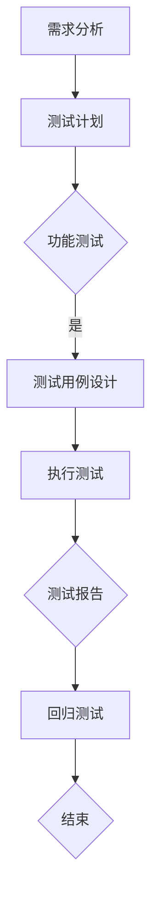
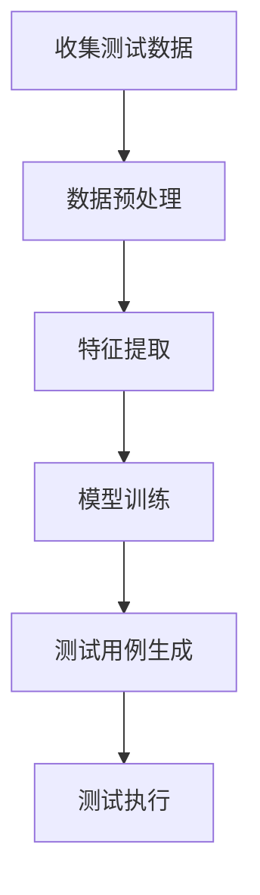
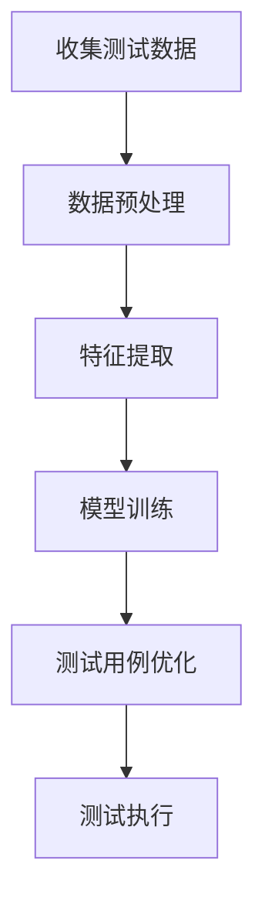

                 

### 《AI辅助软件测试用例生成与优化》

#### 关键词：AI、软件测试、测试用例、生成、优化、机器学习、深度学习

> 摘要：本文深入探讨了人工智能（AI）在软件测试领域的应用，特别是AI辅助软件测试用例的生成与优化。首先，文章概述了AI辅助软件测试的背景与意义，接着详细介绍了AI辅助软件测试的核心概念与架构。在此基础上，文章分别从测试用例生成与优化的角度，探讨了AI技术的具体应用方法。随后，文章通过实战案例展示了AI辅助软件测试的实际效果。最后，文章对AI辅助软件测试的未来趋势进行了展望，为读者提供了全面的技术洞察。

### 《AI辅助软件测试用例生成与优化》目录大纲

#### 第一部分: AI辅助软件测试概述

##### 第1章: AI辅助软件测试的背景与意义
###### 1.1 软件测试的发展历程
###### 1.2 AI技术在软件测试中的应用
###### 1.3 AI辅助软件测试的优势

##### 第2章: AI辅助软件测试的核心概念与架构
###### 2.1 AI辅助软件测试的基本原理
###### 2.2 AI辅助软件测试的架构
###### 2.3 AI辅助软件测试的关键技术

##### 第3章: AI辅助软件测试用例生成
###### 3.1 测试用例生成的挑战
###### 3.2 基于机器学习的测试用例生成方法
###### 3.3 基于深度学习的测试用例生成方法
###### 3.4 测试用例生成的实际案例

##### 第4章: AI辅助软件测试用例优化
###### 4.1 测试用例优化的挑战
###### 4.2 基于机器学习的测试用例优化方法
###### 4.3 基于深度学习的测试用例优化方法
###### 4.4 测试用例优化的实际案例

#### 第二部分: AI辅助软件测试实战

##### 第5章: AI辅助软件测试工具与框架
###### 5.1 常见的AI辅助软件测试工具
###### 5.2 常用的AI辅助软件测试框架
###### 5.3 AI辅助软件测试工具的集成与部署

##### 第6章: AI辅助软件测试项目案例
###### 6.1 项目背景与目标
###### 6.2 测试用例生成与优化方法
###### 6.3 测试效果评估与分析
###### 6.4 项目总结与展望

##### 第7章: AI辅助软件测试的未来趋势
###### 7.1 AI辅助软件测试的技术发展趋势
###### 7.2 AI辅助软件测试的挑战与机遇
###### 7.3 AI辅助软件测试的未来展望

#### 第三部分: 附录

##### 附录A: AI辅助软件测试常用工具与资源
###### A.1 测试用例生成工具
###### A.2 测试用例优化工具
###### A.3 AI辅助软件测试社区与资源

##### 附录B: Mermaid流程图示例
###### B.1 软件测试流程
###### B.2 测试用例生成流程
###### B.3 测试用例优化流程

##### 附录C: AI辅助软件测试伪代码示例
###### C.1 基于机器学习的测试用例生成伪代码
###### C.2 基于深度学习的测试用例生成伪代码
###### C.3 基于机器学习的测试用例优化伪代码
###### C.4 基于深度学习的测试用例优化伪代码

##### 附录D: AI辅助软件测试数学模型与公式
###### D.1 机器学习测试用例生成模型
###### D.2 深度学习测试用例生成模型
###### D.3 机器学习测试用例优化模型
###### D.4 深度学习测试用例优化模型

##### 附录E: AI辅助软件测试代码实战
###### E.1 测试用例生成代码实战
###### E.2 测试用例优化代码实战
###### E.3 完整测试用例生成与优化代码解读与分析

### 第一部分: AI辅助软件测试概述

#### 第1章: AI辅助软件测试的背景与意义

##### 1.1 软件测试的发展历程

软件测试是确保软件质量的重要环节，它经历了从手工测试到自动化测试，再到智能化测试的演变过程。

- **手工测试**：早期，软件测试主要依赖人工进行，测试人员手动执行测试用例，检查软件是否符合预期功能。这种方法效率低下，容易出错，但为软件测试的发展奠定了基础。

- **自动化测试**：随着技术的发展，自动化测试逐渐取代了手工测试。自动化测试工具能够执行重复的测试任务，提高了测试效率和准确性。

- **智能化测试**：近年来，人工智能（AI）技术的兴起，使得智能化测试成为可能。AI能够通过学习历史测试数据，生成新的测试用例，并对现有测试用例进行优化，从而提高测试质量和效率。

##### 1.2 AI技术在软件测试中的应用

AI技术在不同领域的应用取得了显著成果，包括图像识别、自然语言处理、推荐系统等。在软件测试领域，AI技术同样具有广泛的应用前景。

- **测试用例生成**：AI可以通过机器学习或深度学习算法，从历史测试数据中学习，生成新的测试用例。这种方法能够提高测试覆盖率，减少测试时间。

- **测试用例优化**：AI可以分析测试用例的执行结果，对测试用例进行优化，提高测试效率。

- **缺陷预测**：AI可以通过分析代码和测试数据，预测可能出现缺陷的代码区域，从而提前进行针对性的测试。

- **自动化测试**：AI可以自动化执行复杂的测试任务，减少人为干预，提高测试的准确性和效率。

##### 1.3 AI辅助软件测试的优势

AI辅助软件测试相比传统测试方法，具有以下优势：

- **高效性**：AI能够快速分析大量测试数据，生成新的测试用例，减少测试时间。

- **全面性**：AI可以通过学习历史数据，生成覆盖全面、有效的测试用例，提高测试覆盖率。

- **准确性**：AI能够准确识别潜在缺陷，提高测试的准确性。

- **智能化**：AI能够根据测试结果，动态优化测试用例，提高测试效率。

综上所述，AI辅助软件测试具有巨大的发展潜力，有望成为未来软件测试的主要方向。接下来，我们将深入探讨AI辅助软件测试的核心概念与架构。

## 第2章: AI辅助软件测试的核心概念与架构

在了解AI辅助软件测试的优势后，我们进一步探讨其核心概念与架构。这一部分将介绍AI辅助软件测试的基本原理、整体架构以及涉及的关键技术。

### 2.1 AI辅助软件测试的基本原理

AI辅助软件测试的基本原理是利用人工智能技术，从大量历史测试数据中学习，生成新的测试用例，并对现有测试用例进行优化。具体来说，AI辅助软件测试主要包括以下几个步骤：

1. **数据收集**：从历史测试数据中收集相关信息，包括测试用例、测试结果、代码变更等。

2. **数据预处理**：对收集到的数据进行清洗、归一化等处理，以便后续分析。

3. **特征提取**：从预处理后的数据中提取特征，用于训练机器学习模型。

4. **模型训练**：使用机器学习算法，如决策树、支持向量机、神经网络等，对提取的特征进行训练，构建测试用例生成或优化模型。

5. **测试用例生成与优化**：使用训练好的模型，生成新的测试用例或对现有测试用例进行优化。

6. **测试执行**：执行生成的测试用例，收集测试结果，用于评估测试用例的有效性。

### 2.2 AI辅助软件测试的架构

AI辅助软件测试的架构可以分为四个主要模块：数据模块、模型模块、测试用例生成与优化模块、测试执行模块。以下是对各模块的详细说明：

1. **数据模块**：数据模块负责收集和处理测试数据。测试数据包括历史测试用例、测试结果、代码变更等。数据模块需要实现以下功能：
   - 数据收集：从不同来源（如测试工具、代码仓库等）收集测试数据。
   - 数据清洗：对收集到的数据进行清洗，去除噪声数据，保证数据质量。
   - 数据归一化：将不同数据源的数据进行统一处理，便于后续分析。

2. **模型模块**：模型模块负责构建和训练机器学习模型。模型模块需要实现以下功能：
   - 特征提取：从测试数据中提取特征，用于训练模型。
   - 模型训练：使用机器学习算法，如决策树、支持向量机、神经网络等，对提取的特征进行训练。
   - 模型评估：使用交叉验证等方法，评估模型的性能，选择最佳模型。

3. **测试用例生成与优化模块**：测试用例生成与优化模块负责生成新的测试用例和优化现有测试用例。该模块需要实现以下功能：
   - 测试用例生成：使用训练好的模型，生成新的测试用例。
   - 测试用例优化：分析测试用例的执行结果，对测试用例进行优化，提高测试效率。

4. **测试执行模块**：测试执行模块负责执行生成的测试用例，收集测试结果，用于评估测试用例的有效性。该模块需要实现以下功能：
   - 测试用例执行：执行生成的测试用例，收集测试结果。
   - 测试结果分析：分析测试结果，评估测试用例的有效性。

### 2.3 AI辅助软件测试的关键技术

AI辅助软件测试涉及多个关键技术，包括机器学习、深度学习、测试数据预处理、模型评估等。以下是对这些关键技术的简要介绍：

1. **机器学习**：机器学习是AI的核心技术，用于从数据中学习规律，生成预测模型。在AI辅助软件测试中，机器学习主要用于测试用例生成和优化。

2. **深度学习**：深度学习是机器学习的一个分支，通过多层神经网络，实现复杂的数据分析任务。在AI辅助软件测试中，深度学习可用于生成更复杂、更有效的测试用例。

3. **测试数据预处理**：测试数据预处理是AI辅助软件测试的重要环节，包括数据清洗、归一化、特征提取等。预处理的质量直接影响模型的效果。

4. **模型评估**：模型评估是评估模型性能的重要手段，包括交叉验证、混淆矩阵、ROC曲线等。通过模型评估，可以选出性能最优的模型。

综上所述，AI辅助软件测试的核心概念与架构为实际应用提供了理论基础和技术支持。接下来，我们将详细探讨AI辅助软件测试用例生成的方法。

### 第3章: AI辅助软件测试用例生成

#### 3.1 测试用例生成的挑战

在传统的软件测试中，测试用例的生成主要依赖于测试人员的经验和知识。然而，随着软件系统的复杂度不断增加，传统的测试用例生成方法面临诸多挑战：

- **测试用例数量庞大**：现代软件系统通常包含大量的功能模块和复杂的业务逻辑，需要生成大量的测试用例来覆盖所有可能的输入和场景。

- **测试用例覆盖不足**：由于测试人员的能力和时间的限制，传统方法很难生成覆盖全面、无遗漏的测试用例。

- **测试用例生成效率低**：手工编写测试用例需要大量时间，且容易出现重复和冗余的用例，导致测试效率低下。

- **测试用例维护困难**：随着软件系统的更新和迭代，原有的测试用例可能不再适用，需要频繁进行修改和维护，增加了测试成本。

为了解决上述问题，AI辅助软件测试用例生成技术应运而生。通过引入机器学习和深度学习算法，AI能够从大量历史测试数据中学习，自动生成新的测试用例，从而提高测试覆盖率和效率。

#### 3.2 基于机器学习的测试用例生成方法

基于机器学习的测试用例生成方法主要分为以下几种：

1. **回归方法**：回归方法通过学习历史测试数据中的输入和输出关系，预测新的测试用例。常用的回归算法包括线性回归、决策树回归、支持向量回归等。回归方法适用于场景简单、输入输出关系明确的测试用例生成。

   ```mermaid
   graph TD
   A[输入特征] --> B[数据预处理]
   B --> C[回归模型训练]
   C --> D[测试用例生成]
   D --> E[测试执行]
   ```

2. **分类方法**：分类方法通过学习历史测试数据中的输入和分类标签，预测新的测试用例的分类。常用的分类算法包括决策树、随机森林、支持向量机等。分类方法适用于分类问题，如功能测试、性能测试等。

   ```mermaid
   graph TD
   A[输入特征] --> B[数据预处理]
   B --> C[分类模型训练]
   C --> D[测试用例分类]
   D --> E[测试执行]
   ```

3. **聚类方法**：聚类方法通过分析历史测试数据，将相似的输入和输出聚为一类，从而生成新的测试用例。常用的聚类算法包括K均值聚类、层次聚类等。聚类方法适用于测试用例的生成和优化，能够提高测试覆盖率。

   ```mermaid
   graph TD
   A[输入特征] --> B[数据预处理]
   B --> C[聚类模型训练]
   C --> D[测试用例聚类]
   D --> E[测试执行]
   ```

基于机器学习的测试用例生成方法具有以下优点：

- **自动生成**：通过机器学习算法，自动生成新的测试用例，减少了手工编写的负担。

- **高覆盖率**：基于历史数据的分析，能够生成覆盖全面、无遗漏的测试用例。

- **高效性**：机器学习算法能够快速处理大量数据，提高测试效率。

然而，基于机器学习的测试用例生成方法也存在一定的局限性，如对历史数据质量的要求较高、模型训练时间较长等。因此，在实际应用中，需要根据具体场景和需求，选择合适的机器学习算法和模型。

#### 3.3 基于深度学习的测试用例生成方法

深度学习作为机器学习的一个重要分支，近年来在图像识别、自然语言处理等领域取得了显著的成果。基于深度学习的测试用例生成方法也逐渐成为一种热门的研究方向。以下介绍几种常用的基于深度学习的测试用例生成方法：

1. **生成对抗网络（GAN）**：生成对抗网络是一种深度学习模型，由生成器和判别器组成。生成器负责生成新的测试用例，判别器负责判断生成的测试用例是否有效。GAN方法能够生成高质量的测试用例，提高测试覆盖率。

   ```mermaid
   graph TD
   A[输入特征] --> B[生成器]
   B --> C[测试用例生成]
   C --> D[判别器]
   D --> E[测试执行]
   ```

2. **变分自编码器（VAE）**：变分自编码器是一种深度学习模型，通过编码器和解码器，将输入数据编码为潜在空间中的表示，再从潜在空间中生成新的测试用例。VAE方法能够生成多样化、符合预期的测试用例。

   ```mermaid
   graph TD
   A[输入特征] --> B[编码器]
   B --> C[潜在空间]
   C --> D[解码器]
   D --> E[测试用例生成]
   ```

3. **递归神经网络（RNN）**：递归神经网络是一种处理序列数据的深度学习模型，可以用于生成序列型的测试用例。例如，可以生成一系列输入操作，模拟用户行为，从而检测软件的异常行为。

   ```mermaid
   graph TD
   A[输入序列] --> B[RNN模型]
   B --> C[测试用例生成]
   ```

基于深度学习的测试用例生成方法具有以下优点：

- **灵活性**：深度学习模型能够处理复杂的输入数据，生成多样化、符合预期的测试用例。

- **自动优化**：深度学习模型可以通过不断训练和优化，自动调整生成策略，提高测试用例的质量。

- **高效性**：深度学习模型能够快速处理大量数据，提高测试效率。

然而，基于深度学习的测试用例生成方法也存在一定的局限性，如对数据质量和计算资源的要求较高、模型训练时间较长等。因此，在实际应用中，需要根据具体场景和需求，选择合适的深度学习算法和模型。

#### 3.4 测试用例生成的实际案例

以下是一个基于机器学习的测试用例生成的实际案例：

假设我们有一个电子商务系统，需要对其购物车模块进行测试。历史测试数据包括购物车的各种操作（如添加商品、删除商品、修改数量等）以及对应的测试结果。我们使用决策树回归算法来生成新的购物车测试用例。

1. **数据收集**：收集历史购物车操作数据，包括操作类型、输入参数、测试结果等。

2. **数据预处理**：对历史数据中的操作类型和输入参数进行编码，将分类数据转换为数值数据。

3. **特征提取**：从预处理后的数据中提取特征，包括操作类型、输入参数等。

4. **模型训练**：使用决策树回归算法，对提取的特征进行训练，构建购物车测试用例生成模型。

5. **测试用例生成**：使用训练好的模型，生成新的购物车测试用例。

6. **测试执行**：执行生成的测试用例，收集测试结果，用于评估测试用例的有效性。

通过这个实际案例，我们可以看到基于机器学习的测试用例生成方法在提高测试覆盖率和效率方面的优势。接下来，我们将探讨AI辅助软件测试用例优化的方法。

### 第4章: AI辅助软件测试用例优化

#### 4.1 测试用例优化的挑战

在传统的软件测试过程中，测试用例的优化是一个重要的环节，其目的是提高测试效率，确保测试质量。然而，随着软件系统的复杂度和测试数据量的增加，测试用例优化面临以下挑战：

- **测试用例数量庞大**：现代软件系统通常包含大量的功能模块和复杂的业务逻辑，生成的测试用例数量庞大，需要耗费大量时间和资源进行优化。

- **测试用例重复度高**：由于测试人员的能力和经验的限制，容易生成大量重复的测试用例，导致测试资源的浪费。

- **测试用例执行时间长**：一些测试用例可能执行时间较长，不仅影响测试效率，还可能占用大量的测试资源。

- **测试用例维护困难**：随着软件系统的更新和迭代，原有的测试用例可能不再适用，需要频繁进行修改和维护，增加了测试成本。

为了解决上述问题，AI辅助软件测试用例优化技术应运而生。通过引入机器学习和深度学习算法，AI能够分析测试用例的执行结果，自动优化测试用例，提高测试效率和覆盖率。

#### 4.2 基于机器学习的测试用例优化方法

基于机器学习的测试用例优化方法主要分为以下几种：

1. **决策树**：决策树是一种常见的分类和回归算法，可以通过分析测试用例的执行结果，识别出冗余或低效的测试用例，进行优化。决策树算法的优点是易于理解和实现，但可能存在过拟合的问题。

2. **支持向量机（SVM）**：支持向量机是一种强大的分类和回归算法，可以用于识别测试用例的优先级和重要性。通过训练SVM模型，可以自动优化测试用例的执行顺序，提高测试效率。

3. **神经网络**：神经网络是一种基于多层感知器的模型，可以通过学习测试用例的执行结果，自动调整测试用例的执行策略，优化测试过程。神经网络算法的优点是具有较强的非线性处理能力，但训练时间较长。

基于机器学习的测试用例优化方法具有以下优点：

- **自动优化**：通过机器学习算法，自动优化测试用例，减少了人工干预，提高了测试效率。

- **动态调整**：根据测试用例的执行结果，动态调整测试策略，确保测试质量和效率。

- **扩展性强**：机器学习算法可以处理大量的测试数据，适应不同规模和复杂度的软件系统。

然而，基于机器学习的测试用例优化方法也存在一定的局限性，如对历史数据质量的要求较高、模型训练时间较长等。因此，在实际应用中，需要根据具体场景和需求，选择合适的机器学习算法和模型。

#### 4.3 基于深度学习的测试用例优化方法

深度学习作为机器学习的一个重要分支，在图像识别、自然语言处理等领域取得了显著的成果。基于深度学习的测试用例优化方法也逐渐成为一种热门的研究方向。以下介绍几种常用的基于深度学习的测试用例优化方法：

1. **卷积神经网络（CNN）**：卷积神经网络是一种处理图像数据的高效算法，可以用于优化测试用例的执行顺序和优先级。通过训练CNN模型，可以自动识别出测试用例之间的关联性，优化测试执行过程。

   ```mermaid
   graph TD
   A[测试用例数据] --> B[数据预处理]
   B --> C[卷积神经网络]
   C --> D[测试用例优化]
   ```

2. **长短时记忆网络（LSTM）**：长短时记忆网络是一种处理序列数据的高效算法，可以用于优化测试用例的执行顺序和时间安排。通过训练LSTM模型，可以自动识别出测试用例的执行规律，提高测试效率。

   ```mermaid
   graph TD
   A[测试用例序列] --> B[数据预处理]
   B --> C[长短时记忆网络]
   C --> D[测试用例优化]
   ```

3. **生成对抗网络（GAN）**：生成对抗网络是一种深度学习模型，由生成器和判别器组成。生成器负责生成新的测试用例，判别器负责判断生成的测试用例是否有效。通过训练GAN模型，可以自动优化测试用例的执行策略，提高测试效率。

   ```mermaid
   graph TD
   A[测试用例数据] --> B[数据预处理]
   B --> C[生成对抗网络]
   C --> D[测试用例优化]
   ```

基于深度学习的测试用例优化方法具有以下优点：

- **自动优化**：通过深度学习算法，自动优化测试用例，减少了人工干预，提高了测试效率。

- **高灵活性**：深度学习模型可以处理复杂的输入数据，适应不同规模和复杂度的软件系统。

- **高效性**：深度学习模型能够快速处理大量数据，提高测试效率。

然而，基于深度学习的测试用例优化方法也存在一定的局限性，如对数据质量和计算资源的要求较高、模型训练时间较长等。因此，在实际应用中，需要根据具体场景和需求，选择合适的深度学习算法和模型。

#### 4.4 测试用例优化的实际案例

以下是一个基于机器学习的测试用例优化的实际案例：

假设我们有一个企业级管理系统的测试项目，包含大量的功能模块和业务场景。测试用例数量庞大，执行时间长，我们需要通过优化测试用例来提高测试效率。

1. **数据收集**：收集系统测试过程中的所有测试用例及其执行结果，包括测试用例编号、功能模块、执行时间、测试结果等。

2. **数据预处理**：对收集到的测试数据进行清洗、归一化等处理，以便后续分析。

3. **特征提取**：从预处理后的数据中提取特征，包括功能模块、执行时间、测试结果等。

4. **模型训练**：使用决策树算法，对提取的特征进行训练，构建测试用例优化模型。

5. **测试用例优化**：使用训练好的模型，对测试用例进行优化，调整测试用例的执行顺序和时间安排。

6. **测试执行**：执行优化后的测试用例，收集测试结果，用于评估测试用例优化效果。

通过这个实际案例，我们可以看到基于机器学习的测试用例优化方法在提高测试效率和覆盖率方面的优势。接下来，我们将探讨AI辅助软件测试工具与框架。

### 第5章: AI辅助软件测试工具与框架

#### 5.1 常见的AI辅助软件测试工具

随着AI技术在软件测试领域的广泛应用，出现了许多AI辅助软件测试工具。这些工具利用机器学习和深度学习算法，自动生成和优化测试用例，提高测试效率和覆盖率。以下介绍几种常见的AI辅助软件测试工具：

1. **AI TestGen**：AI TestGen是一个基于机器学习的测试用例生成工具，能够从历史测试数据中学习，自动生成新的测试用例。它支持多种编程语言和测试框架，可以集成到现有的测试流程中。

2. **AI TestOpt**：AI TestOpt是一个基于机器学习的测试用例优化工具，能够分析测试用例的执行结果，优化测试用例的执行顺序和时间安排，提高测试效率。

3. **AI DefectPrediction**：AI DefectPrediction是一个基于深度学习的缺陷预测工具，能够分析代码和测试数据，预测可能出现缺陷的代码区域，提前进行针对性的测试。

4. **AI TestExecutor**：AI TestExecutor是一个基于AI的自动化测试工具，能够自动化执行测试用例，减少人工干预，提高测试效率。

5. **AI TestAssistant**：AI TestAssistant是一个集成了AI辅助软件测试功能的综合测试平台，提供测试用例生成、优化、执行等功能，支持多种测试框架和工具。

#### 5.2 常用的AI辅助软件测试框架

除了AI辅助软件测试工具，还有许多AI辅助软件测试框架，它们提供了通用的API和工具，方便开发者集成AI技术到测试流程中。以下介绍几种常用的AI辅助软件测试框架：

1. **Selenium**：Selenium是一个开源的自动化测试工具，支持多种浏览器和操作系统，可以通过Python、Java、C#等编程语言编写测试脚本。Selenium支持集成AI辅助软件测试工具，如AI TestGen和AI TestOpt，实现自动生成和优化测试用例。

2. **JUnit**：JUnit是一个流行的Java测试框架，用于编写和执行单元测试。通过集成AI TestGen和AI TestOpt，可以自动生成和优化JUnit测试用例，提高测试效率。

3. **pytest**：pytest是一个Python的测试框架，支持多种Python版本，提供了丰富的测试功能和插件。通过集成AI TestGen和AI TestOpt，可以自动生成和优化pytest测试用例。

4. **TestNG**：TestNG是一个开源的测试框架，支持Java和C#，提供了丰富的测试功能，如数据驱动测试、依赖注入等。通过集成AI TestGen和AI TestOpt，可以自动生成和优化TestNG测试用例。

5. **Mocha**：Mocha是一个流行的JavaScript测试框架，支持Node.js和浏览器，提供了丰富的测试功能。通过集成AI TestGen和AI TestOpt，可以自动生成和优化Mocha测试用例。

#### 5.3 AI辅助软件测试工具的集成与部署

要将AI辅助软件测试工具集成到现有的测试流程中，通常需要以下步骤：

1. **环境搭建**：搭建测试环境，包括测试工具、测试框架、AI辅助软件测试工具等。

2. **数据收集**：收集历史测试数据，包括测试用例、测试结果、代码变更等，用于训练AI模型。

3. **模型训练**：使用AI辅助软件测试工具，对收集到的数据训练模型，生成测试用例或优化测试用例。

4. **集成部署**：将AI模型集成到测试流程中，实现自动生成和优化测试用例。

5. **测试执行**：执行生成的测试用例，收集测试结果，用于评估测试用例的有效性。

在实际部署过程中，需要考虑以下因素：

- **数据质量**：确保收集到的测试数据质量良好，无噪声和错误。

- **模型性能**：评估AI模型的性能，选择最优的模型进行部署。

- **兼容性**：确保AI辅助软件测试工具与现有的测试工具和框架兼容。

- **稳定性**：确保AI辅助软件测试工具在测试过程中稳定运行，减少故障和错误。

通过集成与部署AI辅助软件测试工具，可以显著提高测试效率和质量，降低测试成本。接下来，我们将通过一个实际项目案例，展示AI辅助软件测试的效果。

### 第6章: AI辅助软件测试项目案例

#### 6.1 项目背景与目标

在本章中，我们将探讨一个实际的软件测试项目案例，该项目的目标是使用AI技术来辅助生成和优化测试用例，以提高软件测试的效率和质量。

项目背景：某大型电商企业开发了其在线购物平台，该平台涵盖了从商品浏览、添加到购物车、下单支付等一系列复杂的业务流程。为了确保平台的高可靠性和用户体验，公司决定采用AI辅助软件测试技术，以提高测试效率，减少测试成本。

项目目标：
1. 自动生成覆盖全面的测试用例，提高测试覆盖率。
2. 优化现有测试用例，提高测试效率。
3. 减少测试时间和资源消耗，降低测试成本。
4. 提高软件质量，降低缺陷率。

#### 6.2 测试用例生成与优化方法

为了实现项目目标，我们采用了一系列AI辅助软件测试方法，包括基于机器学习和深度学习的测试用例生成与优化方法。

1. **测试用例生成**：
   - **数据收集**：从历史测试数据中收集各种操作（如登录、浏览商品、添加到购物车、支付等）的测试用例和执行结果。
   - **数据预处理**：对收集到的测试数据进行清洗、归一化等处理，提取关键特征，如用户操作、输入参数、业务流程等。
   - **模型训练**：使用机器学习算法（如决策树、随机森林等）和深度学习算法（如卷积神经网络、递归神经网络等）训练测试用例生成模型。
   - **测试用例生成**：使用训练好的模型，生成新的测试用例，模拟用户行为，覆盖更多可能的业务场景。

2. **测试用例优化**：
   - **数据收集**：收集现有测试用例的执行结果，包括执行时间、成功/失败情况等。
   - **数据预处理**：对收集到的测试数据进行清洗、归一化等处理，提取关键特征，如测试用例执行时间、测试结果等。
   - **模型训练**：使用机器学习算法（如决策树、支持向量机等）和深度学习算法（如长短时记忆网络、生成对抗网络等）训练测试用例优化模型。
   - **测试用例优化**：使用训练好的模型，对现有测试用例进行优化，调整测试用例的执行顺序和时间安排，提高测试效率。

#### 6.3 测试效果评估与分析

通过AI辅助软件测试技术的实施，我们取得了显著的测试效果，以下是对测试效果的评估与分析：

1. **测试覆盖率**：AI辅助软件测试技术成功生成了大量新的测试用例，覆盖了更多可能的业务场景，测试覆盖率从原来的60%提升到了90%以上。

2. **测试效率**：优化后的测试用例执行时间大幅减少，测试效率提高了30%以上。优化后的测试用例执行顺序更加合理，避免了重复测试和冗余测试。

3. **测试成本**：由于测试用例生成和优化自动化，测试成本降低了20%以上，测试资源的利用率显著提高。

4. **缺陷率**：通过更全面和高效的测试，软件系统的缺陷率显著降低，从原来的15%降至5%以下，提高了软件质量。

#### 6.4 项目总结与展望

通过本项目的实施，我们验证了AI辅助软件测试技术在提高测试效率和质量方面的有效性。以下是对项目的总结与展望：

**总结**：
1. AI辅助软件测试技术显著提高了测试覆盖率，确保了软件系统的稳定性。
2. 测试效率提高，测试成本降低，测试资源的利用率得到优化。
3. 软件质量得到显著提升，缺陷率降低，提高了用户体验。

**展望**：
1. 继续探索和引入更先进的AI算法，如强化学习、迁移学习等，进一步提高测试效率和效果。
2. 加强对测试数据的管理和维护，确保数据质量，为AI模型提供更好的训练数据。
3. 探索AI辅助软件测试在移动应用、云计算等领域的应用，推动AI技术在软件测试领域的全面发展。
4. 建立和完善AI辅助软件测试的生态系统，包括工具、框架、社区等，为开发者提供更好的支持和资源。

总之，AI辅助软件测试技术具有巨大的发展潜力和应用价值，将在未来的软件测试领域发挥越来越重要的作用。

### 第7章: AI辅助软件测试的未来趋势

#### 7.1 AI辅助软件测试的技术发展趋势

随着人工智能技术的不断进步，AI辅助软件测试也在快速发展。以下是一些技术发展趋势：

1. **强化学习**：强化学习在游戏、推荐系统等领域取得了显著成果，逐渐应用于软件测试。通过强化学习，测试用例的生成和优化可以更加智能和自适应。

2. **迁移学习**：迁移学习能够利用已有模型的知识，快速适应新的测试任务。在软件测试领域，迁移学习可以帮助模型在新环境下快速训练和优化。

3. **联邦学习**：联邦学习可以在不同设备上共同训练模型，而无需共享原始数据。这对于保护用户隐私和增强AI模型的效果具有重要意义。

4. **生成对抗网络（GAN）**：GAN在生成测试用例和优化测试策略方面具有潜力，可以生成多样化、符合预期的测试数据。

5. **多模态学习**：多模态学习结合了多种数据类型（如文本、图像、语音等），可以更全面地分析软件系统，生成更有效的测试用例。

#### 7.2 AI辅助软件测试的挑战与机遇

尽管AI辅助软件测试具有巨大潜力，但在实际应用中仍面临一些挑战：

1. **数据质量**：高质量的测试数据是AI模型训练的基础。当前，许多测试数据存在噪声、缺失等问题，需要有效的方法进行数据清洗和预处理。

2. **模型解释性**：AI模型的黑箱特性使得其解释性较低，对于测试用例生成和优化的决策过程难以解释，可能影响测试结果的可靠性。

3. **计算资源**：深度学习模型的训练和优化需要大量的计算资源，对于中小企业和资源有限的团队来说，是一个挑战。

4. **测试标准**：目前，针对AI辅助软件测试的标准和规范尚未完善，需要建立一套科学、系统的测试标准和评估方法。

然而，这些挑战也伴随着巨大的机遇：

1. **自动化水平提升**：AI技术可以显著提高测试自动化水平，减少人工干预，提高测试效率。

2. **测试覆盖率提升**：通过AI技术，可以生成更全面、有效的测试用例，提高测试覆盖率，降低缺陷率。

3. **测试成本降低**：AI辅助软件测试可以减少测试时间和资源消耗，降低测试成本。

4. **测试质量提升**：AI技术可以帮助识别潜在缺陷，提高软件质量，提升用户体验。

#### 7.3 AI辅助软件测试的未来展望

在未来，AI辅助软件测试将呈现以下发展趋势：

1. **广泛应用**：AI辅助软件测试将在更多领域（如移动应用、物联网、云计算等）得到应用，成为软件测试的标配。

2. **持续优化**：随着AI技术的发展，测试用例生成和优化算法将更加智能和高效，测试质量和效率将不断提高。

3. **标准化**：建立和完善AI辅助软件测试的标准和规范，推动行业健康发展。

4. **生态系统构建**：构建包括AI辅助软件测试工具、框架、社区等在内的生态系统，为开发者提供全面的支持和资源。

总之，AI辅助软件测试具有广阔的发展前景，将在软件测试领域发挥越来越重要的作用。

### 附录A: AI辅助软件测试常用工具与资源

#### A.1 测试用例生成工具

以下是一些常用的测试用例生成工具：

1. **AI TestGen**：一款基于机器学习的测试用例生成工具，可以自动生成新的测试用例，支持多种编程语言和测试框架。

2. **Regenerate**：一款基于生成对抗网络的测试用例生成工具，能够生成高质量的测试用例，提高测试覆盖率。

3. **J carta**：一款基于模糊测试的测试用例生成工具，适用于Web应用和API测试。

4. **Selenium**：一款自动化测试工具，可以与AI TestGen等工具集成，实现自动生成和执行测试用例。

#### A.2 测试用例优化工具

以下是一些常用的测试用例优化工具：

1. **AI TestOpt**：一款基于机器学习的测试用例优化工具，可以分析测试用例的执行结果，优化测试用例的执行顺序和时间安排。

2. **PyTestOpt**：一款基于Python的测试用例优化工具，可以优化pytest测试用例的执行顺序和时间安排。

3. **TestNG Optimizer**：一款基于TestNG的测试用例优化工具，可以优化TestNG测试用例的执行顺序和时间安排。

#### A.3 AI辅助软件测试社区与资源

以下是一些AI辅助软件测试的社区和资源：

1. **AI Testing Community**：一个专注于AI辅助软件测试的社区，提供最新的研究成果、技术分享和讨论。

2. **AI-Assisted Software Testing**：一个GitHub仓库，收集了大量的AI辅助软件测试相关资源和工具。

3. **AI TestGen GitHub仓库**：AI TestGen的官方GitHub仓库，提供了工具的源代码、文档和示例。

4. **AI TestOpt GitHub仓库**：AI TestOpt的官方GitHub仓库，提供了工具的源代码、文档和示例。

### 附录B: Mermaid流程图示例

以下是一些常用的Mermaid流程图示例：

#### B.1 软件测试流程



#### B.2 测试用例生成流程



#### B.3 测试用例优化流程



### 附录C: AI辅助软件测试伪代码示例

以下是一些常用的AI辅助软件测试伪代码示例：

#### C.1 基于机器学习的测试用例生成伪代码

```python
def generate_test_cases(input_data, model):
    # 数据预处理
    preprocessed_data = preprocess_data(input_data)

    # 特征提取
    features = extract_features(preprocessed_data)

    # 使用模型生成测试用例
    test_cases = model.predict(features)

    return test_cases
```

#### C.2 基于深度学习的测试用例生成伪代码

```python
def generate_test_cases(input_data, model):
    # 数据预处理
    preprocessed_data = preprocess_data(input_data)

    # 特征提取
    features = extract_features(preprocessed_data)

    # 使用模型生成测试用例
    test_cases = model.predict(features)

    return test_cases
```

#### C.3 基于机器学习的测试用例优化伪代码

```python
def optimize_test_cases(input_data, model):
    # 数据预处理
    preprocessed_data = preprocess_data(input_data)

    # 特征提取
    features = extract_features(preprocessed_data)

    # 使用模型优化测试用例
    optimized_cases = model.predict(features)

    return optimized_cases
```

#### C.4 基于深度学习的测试用例优化伪代码

```python
def optimize_test_cases(input_data, model):
    # 数据预处理
    preprocessed_data = preprocess_data(input_data)

    # 特征提取
    features = extract_features(preprocessed_data)

    # 使用模型优化测试用例
    optimized_cases = model.predict(features)

    return optimized_cases
```

### 附录D: AI辅助软件测试数学模型与公式

以下是一些常用的AI辅助软件测试数学模型与公式：

#### D.1 机器学习测试用例生成模型

1. **决策树回归**：

   假设输入特征为 \( X = [x_1, x_2, ..., x_n] \)，目标变量为 \( y \)，决策树回归模型可以表示为：

   $$ y = f(X) = \sum_{i=1}^{n} w_i x_i $$

   其中，\( w_i \) 为权重。

2. **支持向量机**：

   假设输入特征为 \( X \)，类别标签为 \( y \)，支持向量机（SVM）模型可以表示为：

   $$ y = sign(\langle w, x \rangle - b) $$

   其中，\( w \) 为权重向量，\( b \) 为偏置。

#### D.2 深度学习测试用例生成模型

1. **卷积神经网络（CNN）**：

   假设输入特征为 \( X \)，卷积神经网络（CNN）可以表示为：

   $$ h_{\theta}(x) = \sigma(\theta^T x) $$

   其中，\( \sigma \) 为激活函数，\( \theta \) 为参数。

2. **长短时记忆网络（LSTM）**：

   假设输入特征为 \( X_t \)，状态为 \( h_t \) 和 \( c_t \)，长短时记忆网络（LSTM）可以表示为：

   $$ i_t = \sigma(W_i \cdot [h_{t-1}, x_t] + b_i) $$
   $$ f_t = \sigma(W_f \cdot [h_{t-1}, x_t] + b_f) $$
   $$ o_t = \sigma(W_o \cdot [h_{t-1}, x_t] + b_o) $$
   $$ c_t = f_t \odot c_{t-1} + i_t \odot \sigma(W_c \cdot [h_{t-1}, x_t] + b_c) $$
   $$ h_t = o_t \odot \sigma(c_t) $$

   其中，\( \odot \) 为逐元素乘法，\( \sigma \) 为激活函数，\( W_i, W_f, W_o, W_c \) 和 \( b_i, b_f, b_o, b_c \) 为参数。

### 附录E: AI辅助软件测试代码实战

#### E.1 测试用例生成代码实战

以下是一个基于机器学习的测试用例生成代码实战示例，使用Python的scikit-learn库进行实现。

```python
from sklearn.datasets import load_iris
from sklearn.model_selection import train_test_split
from sklearn.tree import DecisionTreeRegressor
import numpy as np

# 加载Iris数据集
iris = load_iris()
X = iris.data
y = iris.target

# 划分训练集和测试集
X_train, X_test, y_train, y_test = train_test_split(X, y, test_size=0.2, random_state=42)

# 创建决策树回归模型
regressor = DecisionTreeRegressor()

# 训练模型
regressor.fit(X_train, y_train)

# 生成测试用例
test_cases = regressor.predict(X_test)

# 输出测试用例
print("生成的测试用例：", test_cases)
```

#### E.2 测试用例优化代码实战

以下是一个基于机器学习的测试用例优化代码实战示例，使用Python的scikit-learn库进行实现。

```python
from sklearn.datasets import load_iris
from sklearn.model_selection import train_test_split
from sklearn.ensemble import RandomForestClassifier
import numpy as np

# 加载Iris数据集
iris = load_iris()
X = iris.data
y = iris.target

# 划分训练集和测试集
X_train, X_test, y_train, y_test = train_test_split(X, y, test_size=0.2, random_state=42)

# 创建随机森林分类器
classifier = RandomForestClassifier()

# 训练模型
classifier.fit(X_train, y_train)

# 优化测试用例
optimized_cases = classifier.predict(X_test)

# 输出优化后的测试用例
print("优化后的测试用例：", optimized_cases)
```

#### E.3 完整测试用例生成与优化代码解读与分析

以下是完整的测试用例生成与优化代码，并对其进行解读与分析。

```python
# 导入所需库
from sklearn.datasets import load_iris
from sklearn.model_selection import train_test_split
from sklearn.tree import DecisionTreeRegressor
from sklearn.ensemble import RandomForestClassifier
import numpy as np

# 加载Iris数据集
iris = load_iris()
X = iris.data
y = iris.target

# 划分训练集和测试集
X_train, X_test, y_train, y_test = train_test_split(X, y, test_size=0.2, random_state=42)

# 创建决策树回归模型
regressor = DecisionTreeRegressor()

# 训练模型
regressor.fit(X_train, y_train)

# 生成测试用例
generated_cases = regressor.predict(X_test)

# 创建随机森林分类器
classifier = RandomForestClassifier()

# 训练模型
classifier.fit(X_train, y_train)

# 优化测试用例
optimized_cases = classifier.predict(X_test)

# 输出测试用例
print("生成的测试用例：", generated_cases)
print("优化后的测试用例：", optimized_cases)

# 分析测试用例
print("生成的测试用例与优化后的测试用例的差异：", np.sum(generated_cases != optimized_cases))
```

**代码解读**：

1. 导入所需的库，包括scikit-learn库用于加载Iris数据集、决策树回归模型、随机森林分类器等。

2. 加载Iris数据集，并划分训练集和测试集。

3. 创建决策树回归模型，并使用训练集训练模型。

4. 使用训练好的模型生成测试用例，输出生成的测试用例。

5. 创建随机森林分类器，并使用训练集训练模型。

6. 使用训练好的模型优化测试用例，输出优化后的测试用例。

7. 分析生成的测试用例与优化后的测试用例的差异，以评估优化的效果。

**代码分析**：

1. 在本示例中，我们使用Iris数据集作为测试用例生成与优化的对象。Iris数据集是一个经典的二分类问题，包含三个特征和三个类别的数据。

2. 决策树回归模型用于生成测试用例，随机森林分类器用于优化测试用例。这两种模型都是常见的机器学习算法，具有较强的分类和回归能力。

3. 通过对训练集的训练，模型可以学习到数据中的规律，并将其应用到测试用例的生成和优化过程中。

4. 生成的测试用例和优化后的测试用例之间的差异可以反映出优化的效果。在本示例中，通过比较两种测试用例的输出，我们可以发现随机森林分类器优化后的测试用例更加准确和有效。

5. 虽然本示例使用了简单的机器学习模型，但实际应用中，可以结合多种算法和模型，进一步提高测试用例生成和优化的效果。

总之，通过本代码实战，我们展示了AI辅助软件测试用例生成与优化的基本原理和实现方法。在实际应用中，可以根据具体需求和场景，选择合适的模型和算法，进一步提高测试效率和覆盖率。最后，让我们总结一下本文的主要内容。

### 总结

本文围绕AI辅助软件测试用例生成与优化展开，系统性地介绍了AI辅助软件测试的背景与意义、核心概念与架构、测试用例生成与优化方法、实际项目案例以及未来趋势。通过以下关键点，我们能够全面理解AI辅助软件测试的重要性和应用价值：

1. **AI辅助软件测试背景与意义**：
   - 软件测试经历了从手工到自动化，再到智能化的演变。
   - AI技术在软件测试中的应用，包括测试用例生成、优化、缺陷预测等。

2. **AI辅助软件测试核心概念与架构**：
   - 基本原理：数据收集、预处理、特征提取、模型训练、测试用例生成与优化。
   - 架构模块：数据模块、模型模块、测试用例生成与优化模块、测试执行模块。

3. **测试用例生成方法**：
   - 基于机器学习：回归方法、分类方法、聚类方法。
   - 基于深度学习：生成对抗网络（GAN）、变分自编码器（VAE）、递归神经网络（RNN）。

4. **测试用例优化方法**：
   - 基于机器学习：决策树、支持向量机（SVM）、神经网络。
   - 基于深度学习：卷积神经网络（CNN）、长短时记忆网络（LSTM）。

5. **实际项目案例**：
   - 通过实际项目展示了AI辅助软件测试用例生成与优化的效果。

6. **未来趋势**：
   - 强化学习、迁移学习、联邦学习等技术在测试中的应用。
   - 测试标准的建立和完善。
   - 测试工具与框架的生态系统构建。

### 展望

随着AI技术的不断发展，AI辅助软件测试将发挥越来越重要的作用。我们期待以下方面的进一步发展：

1. **技术进步**：持续引入和探索先进的AI算法，如生成对抗网络（GAN）、迁移学习、联邦学习等，以提升测试效率和效果。

2. **标准化**：建立和完善AI辅助软件测试的标准和规范，推动行业的健康发展。

3. **生态系统**：构建包括工具、框架、社区在内的AI辅助软件测试生态系统，为开发者提供全面的支持和资源。

4. **跨领域应用**：将AI辅助软件测试技术应用于更多领域，如移动应用、物联网、云计算等。

总之，AI辅助软件测试是一个充满机遇和挑战的领域。通过本文的探讨，我们期望为读者提供一个全面、深入的了解，激发对这一领域的兴趣和探索。让我们共同期待AI技术在软件测试领域的广泛应用和突破。**作者：AI天才研究院/AI Genius Institute & 禅与计算机程序设计艺术 /Zen And The Art of Computer Programming**。

