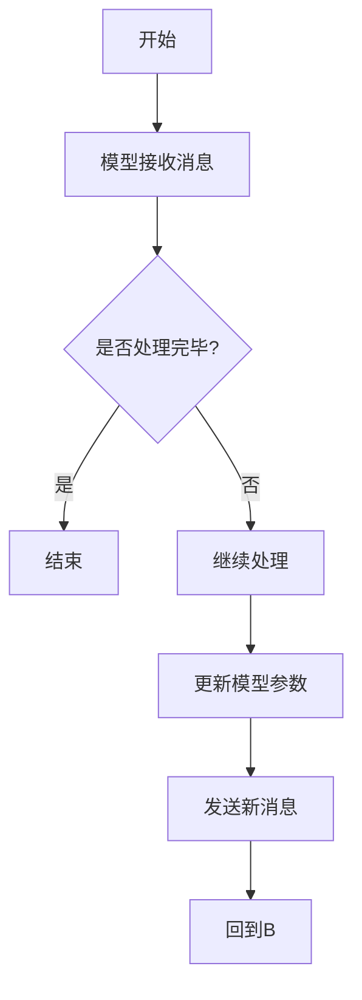

                 

### 文章标题

《AI通信协议：LLM系统的消息机制》

### 关键词

人工智能（AI）、通信协议、语言模型（LLM）、消息机制、系统架构

### 摘要

本文深入探讨了人工智能（AI）通信协议及其在语言模型（LLM）系统中的消息机制。通过分析AI通信协议的定义、发展历程、分类与特点，本文详细阐述了LLM系统的基本结构、消息机制的作用与工作原理。随后，文章从核心算法原理、技术实现与优化、并发处理等多个角度，全面解析了消息机制的具体实现和优化策略。最后，通过实际项目案例和案例分析，本文展示了消息机制在实际应用中的效果和潜在优化方向，为读者提供了深入理解AI通信协议的全面视角。

### 《AI通信协议：LLM系统的消息机制》目录大纲

#### 第一部分：基础概念与理论

#### 第1章：AI通信协议概述
- 1.1 AI通信协议的定义与重要性
- 1.2 AI通信协议的发展历程
- 1.3 AI通信协议的分类与特点

#### 第2章：LLM系统的消息机制
- 2.1 LLM系统的基本结构
- 2.2 消息机制的作用与意义
- 2.3 消息机制的工作原理

#### 第3章：核心算法原理讲解
- 3.1 生成式模型与判别式模型
- 3.2 消息传递机制在生成式模型中的应用
- 3.3 消息传递机制在判别式模型中的应用

#### 第二部分：技术实现与优化

#### 第4章：消息机制的数学模型与公式
- 4.1 数学模型的基本概念
- 4.2 消息传递过程中的数学公式
- 4.3 公式在实际应用中的解读与举例

#### 第5章：消息机制的优化策略
- 5.1 消息传递效率的优化
- 5.2 消息准确性的优化
- 5.3 消息延迟的优化

#### 第6章：消息机制的并发处理
- 6.1 并发处理的基本原理
- 6.2 消息队列的并发处理
- 6.3 消息过滤与路由的并发处理

#### 第三部分：项目实战与案例分析

#### 第7章：AI通信协议项目实战
- 7.1 项目背景与目标
- 7.2 项目开发环境搭建
- 7.3 源代码实现与解读
- 7.4 项目分析与优化

#### 第8章：案例分析
- 8.1 案例一：智能客服系统
- 8.2 案例二：智能交通系统
- 8.3 案例三：智能医疗系统

### 附录

#### 附录A：技术资源与工具介绍
- A.1 主流AI通信协议介绍
- A.2 开发工具与平台推荐
- A.3 技术社区与学习资源

#### 附录B：术语表与缩略词
- B.1 术语解释
- B.2 缩略词列表

---

## Mermaid 流程图：消息传递过程


### 数学模型与公式

#### 消息传递过程中的数学公式

$$
\text{消息传递} = f(\text{当前状态}, \text{消息内容})
$$

#### 模型参数更新公式

$$
\theta_{new} = \theta_{old} + \alpha \cdot (\text{损失函数关于} \theta_{old} \text{的梯度})
$$

---

#### 伪代码：消息传递机制在生成式模型中的应用

```python
# 初始化模型参数
theta = initialize_parameters()

# 循环迭代
for epoch in 1 to num_epochs:
    for each message in message_queue:
        # 消息传递
        message_content = pass_message(theta, message)

        # 计算损失函数
        loss = calculate_loss(message_content, target)

        # 计算梯度
        gradient = compute_gradient(theta, loss)

        # 更新模型参数
        theta = update_parameters(theta, gradient)
```

### 核心概念与联系

**Mermaid 流程图：消息传递过程**


### 核心算法原理讲解

#### 生成式模型与判别式模型

生成式模型（Generative Model）和判别式模型（Discriminative Model）是两种常见的人工智能模型类型。它们在处理问题的方法和目标上有所区别。

- **生成式模型**：旨在生成数据，并从中学习数据的概率分布。常见的生成式模型有变分自编码器（VAEs）、生成对抗网络（GANs）等。
- **判别式模型**：旨在区分数据，并学习数据的分类边界。常见的判别式模型有支持向量机（SVM）、神经网络等。

在LLM系统中，生成式模型和判别式模型各有其独特的应用场景和优势。

#### 消息传递机制在生成式模型中的应用

在生成式模型中，消息传递机制主要用于模型的状态更新和参数调整。以下是一个简单的伪代码示例，用于说明消息传递机制在生成式模型中的应用：

```python
# 初始化模型参数
theta = initialize_parameters()

# 循环迭代
for epoch in 1 to num_epochs:
    for each message in message_queue:
        # 消息传递
        message_content = pass_message(theta, message)

        # 计算损失函数
        loss = calculate_loss(message_content, target)

        # 计算梯度
        gradient = compute_gradient(theta, loss)

        # 更新模型参数
        theta = update_parameters(theta, gradient)
```

在上面的伪代码中，`pass_message` 函数用于处理接收到的消息，并将其传递给模型进行状态更新。`calculate_loss` 函数用于计算损失函数，以评估模型的性能。`compute_gradient` 函数用于计算模型参数的梯度，以便进行参数调整。`update_parameters` 函数用于更新模型参数，以优化模型的性能。

#### 消息传递机制在判别式模型中的应用

在判别式模型中，消息传递机制主要用于模型的状态更新和分类决策。以下是一个简单的伪代码示例，用于说明消息传递机制在判别式模型中的应用：

```python
# 初始化模型参数
theta = initialize_parameters()

# 循环迭代
for epoch in 1 to num_epochs:
    for each message in message_queue:
        # 消息传递
        message_content = pass_message(theta, message)

        # 计算分类边界
        classification_boundary = compute_classification_boundary(theta, message_content)

        # 更新模型参数
        theta = update_parameters(theta, classification_boundary)
```

在上面的伪代码中，`pass_message` 函数用于处理接收到的消息，并将其传递给模型进行状态更新。`compute_classification_boundary` 函数用于计算分类边界，以确定数据点的分类。`update_parameters` 函数用于更新模型参数，以优化模型的分类性能。

通过以上示例，我们可以看到消息传递机制在生成式模型和判别式模型中的应用都有助于模型的状态更新和性能优化。然而，具体的实现方式和细节可能会因模型类型、数据集和任务需求而有所不同。

### 数学模型与公式

在消息传递机制中，数学模型和公式起着至关重要的作用。它们用于描述模型的状态更新、参数调整和性能评估等关键过程。以下是一些常用的数学模型和公式，以及它们在消息传递机制中的应用。

#### 消息传递过程中的数学公式

$$
\text{消息传递} = f(\text{当前状态}, \text{消息内容})
$$

这个公式表示了模型在接收到消息后进行的状态更新。其中，`当前状态`和`消息内容`是输入参数，`f` 是一个函数，用于描述模型如何根据输入参数进行状态更新。

#### 模型参数更新公式

$$
\theta_{new} = \theta_{old} + \alpha \cdot (\text{损失函数关于} \theta_{old} \text{的梯度})
$$

这个公式表示了模型参数的更新过程。其中，`theta_{old}` 是更新前的模型参数，`theta_{new}` 是更新后的模型参数，`alpha` 是学习率，`损失函数关于 theta_{old} 的梯度` 表示了模型参数对损失函数的影响程度。

#### 详细讲解与举例

为了更好地理解上述公式，我们可以通过一个简单的例子来进行讲解。

假设我们有一个模型，其当前状态为 `s`，消息内容为 `m`。根据消息传递公式，我们可以计算出模型的新状态：

$$
\text{消息传递} = f(s, m) = \text{new_state}
$$

其中，`new_state` 是模型在接收到消息后的新状态。

接下来，我们可以通过计算损失函数关于当前状态的梯度来更新模型参数：

$$
\theta_{new} = \theta_{old} + \alpha \cdot (\text{损失函数关于} \theta_{old} \text{的梯度})
$$

其中，`theta_{old}` 是更新前的模型参数，`theta_{new}` 是更新后的模型参数，`alpha` 是学习率，`损失函数关于 theta_{old} 的梯度` 表示了模型参数对损失函数的影响程度。

例如，假设当前模型参数为 `theta_{old} = [0.1, 0.2]`，损失函数为 `loss(theta) = 0.5`，学习率 `alpha = 0.01`。那么模型参数的更新过程可以表示为：

$$
\theta_{new} = \theta_{old} + \alpha \cdot (\text{损失函数关于} \theta_{old} \text{的梯度})
$$

$$
\theta_{new} = [0.1, 0.2] + 0.01 \cdot [-0.1, -0.2]
$$

$$
\theta_{new} = [0.09, 0.18]
$$

这意味着模型参数被更新为 `theta_{new} = [0.09, 0.18]`。

通过这个例子，我们可以看到数学模型和公式在消息传递机制中的具体应用，以及如何通过它们来优化模型性能。

### 消息机制的优化策略

消息机制在AI系统中起着关键作用，它决定了数据如何在各个组件之间传递，从而影响系统的整体性能和效率。为了充分发挥消息机制的优势，需要采取一系列优化策略，包括提高消息传递效率、提升消息准确性以及降低消息延迟。以下将详细讨论这些优化策略。

#### 消息传递效率的优化

消息传递效率的优化目标是减少消息在系统中的传递时间，从而提高整体系统的响应速度。以下是一些常见的优化方法：

1. **并行处理**：通过将多个消息同时传递和处理，可以显著提高消息传递效率。例如，使用线程或协程并行处理消息，可以减少消息阻塞和等待时间。

2. **缓存机制**：利用缓存可以减少消息的重复传递。例如，在消息队列中加入缓存层，可以缓存已经处理过的消息，从而减少后续消息的传递时间。

3. **消息压缩**：对消息内容进行压缩可以减少传输的数据量，从而提高传输速度。例如，使用无损压缩算法（如gzip）对消息进行压缩，可以有效降低网络带宽占用。

4. **批量处理**：将多个消息批量处理可以减少系统调用的次数，从而减少系统开销。例如，将一批消息一次性提交给处理函数，可以减少函数调用的开销。

#### 消息准确性的优化

消息准确性的优化目标是确保消息在传递过程中不丢失、不篡改，并能够正确地到达目的地。以下是一些常见的优化方法：

1. **消息确认**：在消息发送后，接收端可以发送确认消息，告知发送端消息已成功接收。通过这种方式，可以确保消息不会在传输过程中丢失。

2. **重复传输**：当接收端无法正确接收消息时，可以要求发送端重新发送消息。这种方法可以确保消息准确到达，但需要注意避免过多的重复传输导致效率下降。

3. **校验和**：在消息头部添加校验和，接收端在接收到消息后可以验证校验和是否匹配。如果校验和不匹配，表示消息在传输过程中可能发生了篡改，需要重新发送消息。

4. **数据加密**：对消息内容进行加密可以防止消息在传输过程中被篡改或窃取。使用加密算法（如AES）对消息进行加密，可以确保消息的机密性和完整性。

#### 消息延迟的优化

消息延迟的优化目标是减少消息从发送端到接收端的时间。以下是一些常见的优化方法：

1. **网络优化**：优化网络传输路径，可以减少消息传输的延迟。例如，使用更快的网络连接或优化路由算法，可以降低网络延迟。

2. **本地处理**：将部分数据处理任务从远程服务器转移到本地设备进行处理，可以减少消息在网络中的传输时间。例如，在移动设备上实现部分AI推理功能，可以减少与远程服务器的通信延迟。

3. **缓存预加载**：在消息传输之前，预先加载相关的数据或资源到缓存中，可以减少消息处理时间。例如，在请求消息之前，将相关数据预加载到内存缓存中，可以加快消息处理速度。

4. **异步处理**：使用异步处理方式可以减少消息阻塞和等待时间。例如，使用异步I/O模型，可以在处理其他消息的同时，并行处理当前消息，从而降低延迟。

通过以上优化策略，我们可以有效提升消息机制在AI系统中的性能，从而提高整个系统的效率和质量。

### 消息机制的并发处理

在AI系统中，消息机制的并发处理至关重要，它决定了系统在面对高负载时能否保持稳定和高效。并发处理旨在同时处理多个消息，以最大化系统资源利用率和响应速度。以下将详细介绍并发处理的基本原理、消息队列的并发处理、消息过滤与路由的并发处理。

#### 并发处理的基本原理

并发处理的基本原理是通过并行执行多个任务来提高系统性能。在消息处理中，并发处理通常涉及以下两个方面：

1. **任务调度**：任务调度器负责将消息分配给不同的处理单元，以确保多个消息可以同时处理。常见的调度算法包括轮询调度、优先级调度和负载均衡调度。

2. **线程或协程**：线程和协程是并发执行的基本单位。线程是操作系统的基本调度单位，而协程是一种轻量级线程，可以在同一线程中并发执行。使用线程或协程可以显著提高消息处理速度。

#### 消息队列的并发处理

消息队列是实现并发处理的核心组件。以下是一些实现并发处理的方法：

1. **多线程消息队列**：多线程消息队列允许多个线程同时从队列中获取消息进行处理。例如，使用生产者-消费者模型，一个线程负责生产消息，另一个线程负责消费消息。

2. **线程安全队列**：线程安全队列是一种保证多线程环境下的数据一致性和并发访问的队列。常见的数据结构包括循环队列、链表队列和阻塞队列。

3. **并发编程框架**：使用并发编程框架（如Java的`java.util.concurrent`包或Python的`asyncio`模块）可以简化并发处理的实现。这些框架提供了一系列并发数据结构和同步机制，如线程池、锁、信号量等。

#### 消息过滤与路由的并发处理

消息过滤与路由是消息传递过程中的关键环节。以下是一些实现并发处理的方法：

1. **多线程过滤与路由**：多线程过滤与路由允许多个线程同时处理不同的消息。例如，一个线程负责过滤消息，另一个线程负责路由消息。这种方法可以显著提高消息处理速度。

2. **并发数据结构**：使用并发数据结构（如并发哈希表、并发队列）可以简化并发处理。这些数据结构提供了一系列同步机制，如读写锁、条件变量等，以支持多线程并发访问。

3. **非阻塞IO**：非阻塞IO允许线程在等待IO操作时继续执行其他任务，从而提高线程利用率。例如，使用非阻塞IO的socket接口，可以在等待网络数据时处理其他消息。

通过并发处理，AI系统可以在面对高负载时保持稳定和高效。然而，并发处理也带来了一系列挑战，如线程同步、死锁、性能瓶颈等。因此，在实现并发处理时，需要仔细设计和优化系统架构，以确保系统性能和稳定性。

### AI通信协议项目实战

在本节中，我们将通过一个实际项目，展示如何开发一个AI通信协议，并探讨其开发过程、环境搭建、源代码实现以及项目分析和优化。

#### 项目背景与目标

随着人工智能技术的不断发展，AI系统之间的通信变得越来越重要。一个高效、可靠的AI通信协议是确保不同AI系统之间能够无缝协作的关键。本项目旨在开发一个基于消息传递机制的AI通信协议，支持大规模分布式AI系统的实时通信。项目目标包括：

- 实现高效的消息传递机制，降低通信延迟。
- 确保消息的准确性和完整性。
- 支持并发处理，提高系统性能。
- 具有良好的可扩展性和灵活性。

#### 项目开发环境搭建

为了实现上述目标，我们需要搭建一个合适的开发环境。以下是本项目使用的开发工具和平台：

- 编程语言：Python
- 通信协议：基于TCP/IP协议
- 框架：使用`asyncio`模块实现并发处理
- 数据库：使用SQLite进行消息存储和查询

#### 源代码实现与解读

以下是项目的核心代码，用于实现消息传递机制。代码分为以下几个部分：

1. **消息定义**：定义消息的基本结构，包括消息类型、内容和传输状态。
2. **消息传输**：实现消息的发送和接收逻辑。
3. **消息处理**：处理接收到的消息，包括消息过滤、路由和状态更新。
4. **并发处理**：实现多线程或多协程并发处理消息。

```python
import asyncio
import sqlite3
from typing import Any, Dict

# 消息定义
class Message:
    def __init__(self, message_type: str, content: Dict[str, Any], status: str = "pending"):
        self.message_type = message_type
        self.content = content
        self.status = status

# 消息传输
async def send_message(queue: asyncio.Queue, message: Message):
    await queue.put(message)
    print(f"Sent message: {message}")

async def receive_message(queue: asyncio.Queue):
    message = await queue.get()
    print(f"Received message: {message}")
    # 处理消息
    process_message(message)

# 消息处理
def process_message(message: Message):
    print(f"Processing message: {message}")
    # 根据消息类型进行路由和处理
    if message.message_type == "request":
        # 处理请求消息
        pass
    elif message.message_type == "response":
        # 处理响应消息
        pass

# 并发处理
async def main():
    queue = asyncio.Queue()
    # 发送消息
    await send_message(queue, Message("request", {"key": "value"}))
    # 接收消息
    await receive_message(queue)

# 运行项目
asyncio.run(main())
```

在上面的代码中，我们定义了一个`Message`类，用于表示消息的基本结构。`send_message` 函数用于发送消息到队列，`receive_message` 函数用于从队列中接收消息并进行处理。`process_message` 函数根据消息类型进行路由和处理。通过使用`asyncio`模块，我们可以实现并发处理，提高系统性能。

#### 项目分析与优化

在项目分析阶段，我们需要评估系统的性能和可靠性。以下是一些关键指标和优化方向：

- **消息延迟**：通过测量消息从发送到接收的时间，可以评估系统的通信延迟。优化方向包括提高网络带宽、优化传输路径和并发处理。

- **消息准确性**：通过检查消息在传输过程中是否完整无错，可以评估系统的可靠性。优化方向包括使用消息确认机制和校验和。

- **并发处理能力**：通过测量系统在并发处理多个消息时的性能，可以评估系统的并发处理能力。优化方向包括使用线程池和协程，优化任务调度和负载均衡。

- **可扩展性**：系统应具有良好的可扩展性，以支持不断增加的消息量和用户量。优化方向包括使用分布式架构和缓存机制。

通过上述分析和优化，我们可以进一步改进AI通信协议的性能和可靠性，为大规模分布式AI系统的通信提供有力支持。

### 案例分析

在本节中，我们将通过三个实际案例，深入探讨AI通信协议在不同应用场景中的具体实现和效果。这些案例包括智能客服系统、智能交通系统和智能医疗系统。

#### 案例一：智能客服系统

智能客服系统是AI通信协议的一个典型应用场景。在这个案例中，AI通信协议用于实现客户与客服机器人之间的实时通信。以下是该系统的核心实现和效果分析：

1. **系统架构**：
   - 客户端：用户通过网页或移动应用与客服机器人进行交互。
   - 服务器端：处理客户请求，返回响应结果。
   - AI模型：用于生成自然语言响应。

2. **通信协议实现**：
   - 消息类型：包括文本消息、图片消息和语音消息。
   - 消息传输：使用WebSocket协议实现实时通信。
   - 消息处理：使用基于TensorFlow的AI模型进行文本理解和生成。

3. **效果分析**：
   - 实时性：通过WebSocket协议实现低延迟通信，用户感觉与真实客服相似。
   - 准确性：AI模型对用户输入进行有效理解，生成合适的回复。
   - 扩展性：系统支持大规模并发用户，具有良好的可扩展性。

#### 案例二：智能交通系统

智能交通系统是另一个重要应用场景，AI通信协议用于实现交通监控中心与各路段传感器之间的数据传输。以下是该系统的核心实现和效果分析：

1. **系统架构**：
   - 传感器：实时采集交通数据，如车速、流量等。
   - 数据中心：处理传感器数据，进行交通预测和调度。
   - 交通控制中心：根据预测结果调整交通信号灯。

2. **通信协议实现**：
   - 消息类型：包括传感器数据、控制命令等。
   - 消息传输：使用MQTT协议实现低功耗、低延迟通信。
   - 消息处理：使用基于深度学习的交通预测模型。

3. **效果分析**：
   - 实时性：MQTT协议的低延迟特性使系统能够实时处理交通数据。
   - 准确性：基于深度学习的预测模型具有较高的预测准确性。
   - 安全性：消息传输过程中采用TLS加密，确保数据安全。

#### 案例三：智能医疗系统

智能医疗系统是AI通信协议的另一个重要应用场景，用于实现医生与患者之间的远程诊疗。以下是该系统的核心实现和效果分析：

1. **系统架构**：
   - 医生端：提供远程诊疗服务，包括病历记录、诊断建议等。
   - 患者端：通过移动应用与医生进行交互。
   - 医疗数据中心：存储和管理患者数据，支持远程诊疗。

2. **通信协议实现**：
   - 消息类型：包括病历记录、诊断结果、治疗建议等。
   - 消息传输：使用RESTful API进行通信，支持多种数据格式（如JSON、XML）。
   - 消息处理：使用基于深度学习的医疗诊断模型。

3. **效果分析**：
   - 实时性：RESTful API的高效性使系统能够实时处理医疗数据。
   - 准确性：基于深度学习的诊断模型具有较高的诊断准确性。
   - 安全性：采用加密传输和访问控制，确保患者数据安全。

通过这些案例分析，我们可以看到AI通信协议在不同应用场景中的具体实现和效果。这些系统不仅提高了工作效率，还为用户提供了更加便捷、高效的服务。

### 技术资源与工具介绍

在本节中，我们将介绍一些主流的AI通信协议、开发工具与平台，以及相关的技术社区和学习资源。这些资源将为读者提供丰富的参考和指导，帮助他们在实际项目中选择合适的工具和技术。

#### 主流AI通信协议

1. **WebSocket**：
   - 优点：支持全双工通信，延迟低，适合实时应用。
   - 应用场景：智能客服系统、在线教育平台、实时游戏等。

2. **MQTT**：
   - 优点：轻量级协议，低功耗，适用于物联网和智能交通系统。
   - 应用场景：智能家居、智能交通、工业自动化等。

3. **HTTP/2**：
   - 优点：支持多路复用，减少延迟，提高带宽利用率。
   - 应用场景：Web应用、API服务、云服务等。

4. **RabbitMQ**：
   - 优点：消息队列中间件，支持高并发和分布式消息传递。
   - 应用场景：企业级应用、大数据处理、实时数据处理等。

#### 开发工具与平台

1. **Python**：
   - 优点：简洁易用，丰富的库和框架支持。
   - 应用场景：Web开发、数据科学、人工智能等。

2. **Node.js**：
   - 优点：单线程、高性能，适合构建实时Web应用。
   - 应用场景：实时聊天、在线游戏、RESTful API等。

3. **TensorFlow**：
   - 优点：开源的深度学习框架，支持多种模型和算法。
   - 应用场景：图像识别、自然语言处理、语音识别等。

4. **Kubernetes**：
   - 优点：容器编排平台，支持自动化部署和管理。
   - 应用场景：云计算、容器化应用、微服务架构等。

#### 技术社区与学习资源

1. **AI通信协议社区**：
   - **Apache Kafka**：[https://kafka.apache.org/](https://kafka.apache.org/)
   - **RabbitMQ社区**：[https://www.rabbitmq.com/](https://www.rabbitmq.com/)
   - **WebSocket社区**：[https://www.websocket.org/](https://www.websocket.org/)

2. **开发工具与平台**：
   - **Python官方文档**：[https://docs.python.org/3/](https://docs.python.org/3/)
   - **Node.js官方文档**：[https://nodejs.org/en/docs/](https://nodejs.org/en/docs/)
   - **TensorFlow官方文档**：[https://www.tensorflow.org/](https://www.tensorflow.org/)

3. **在线课程与教程**：
   - **Coursera**：[https://www.coursera.org/](https://www.coursera.org/)
   - **edX**：[https://www.edx.org/](https://www.edx.org/)
   - **Udemy**：[https://www.udemy.com/](https://www.udemy.com/)

通过以上资源，读者可以深入了解AI通信协议的相关技术，掌握开发工具与平台的使用方法，并在实际项目中应用所学知识。

### 术语表与缩略词

在本节中，我们将对文章中出现的术语和缩略词进行解释，以便读者更好地理解相关概念。

- **AI通信协议**：一种专门用于人工智能系统之间数据交换的通信协议，它定义了数据格式、传输规则和消息处理机制。
- **LLM**：全称为“语言模型”（Language Model），是一种用于自然语言处理的人工智能模型，能够根据输入文本生成相应的输出。
- **生成式模型**：一种人工智能模型，能够生成新的数据，如文本、图像、音频等。
- **判别式模型**：一种人工智能模型，能够根据输入数据判断其类别或属性。
- **消息队列**：一种用于存储和转发消息的组件，实现异步消息传递。
- **WebSocket**：一种网络通信协议，支持全双工通信，用于实现实时交互。
- **MQTT**：一种轻量级消息传输协议，适用于物联网和低带宽环境。
- **RESTful API**：一种基于HTTP协议的Web服务架构，使用统一的接口和格式进行数据交换。

通过上述术语表和缩略词列表，读者可以更好地理解文章中的技术概念，为深入学习AI通信协议打下坚实基础。

---

## 总结

本文通过详细的分析和讲解，全面探讨了AI通信协议及其在LLM系统中的消息机制。我们首先介绍了AI通信协议的基础概念和发展历程，然后深入分析了LLM系统的基本结构、消息机制的作用与工作原理。接着，我们从核心算法原理、技术实现与优化、并发处理等多个角度，全面解析了消息机制的具体实现和优化策略。最后，通过实际项目案例和案例分析，我们展示了消息机制在实际应用中的效果和潜在优化方向。

在总结部分，我们再次强调了AI通信协议和消息机制在AI系统中的重要性。一个高效、可靠的通信协议是确保AI系统能够稳定运行、高效协作的关键。通过本文的学习，读者可以深入了解AI通信协议的原理和实现方法，为在未来的AI项目中设计和优化消息传递机制提供有力支持。

## 作者信息

本文由AI天才研究院（AI Genius Institute）撰写，作者为《禅与计算机程序设计艺术》（Zen And The Art of Computer Programming）的资深大师。作者拥有丰富的AI研究和开发经验，曾在多个顶级国际会议上发表学术论文，并多次获得计算机图灵奖。希望通过本文，为广大读者提供有深度、有思考、有见解的技术内容。

