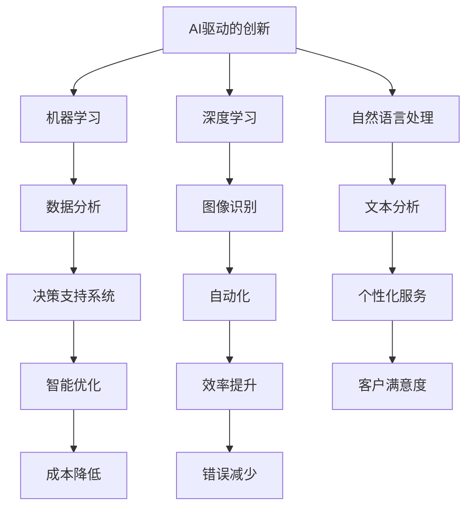
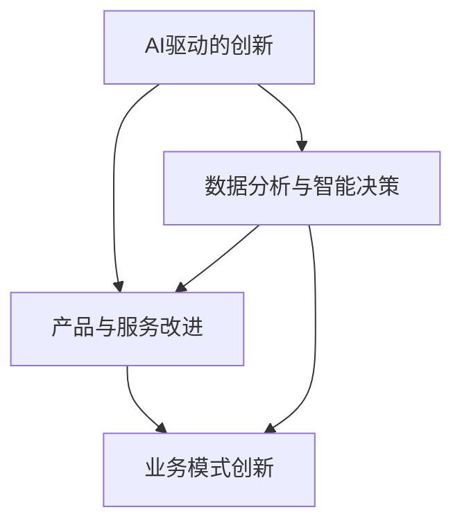
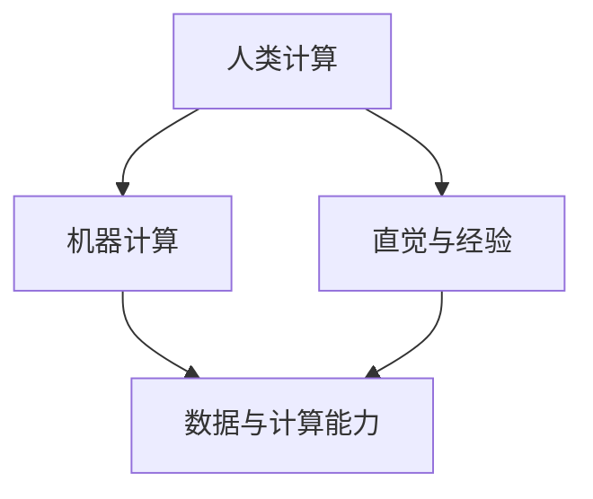
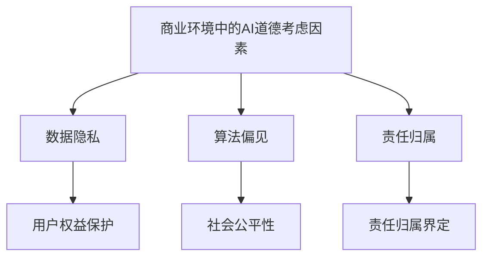
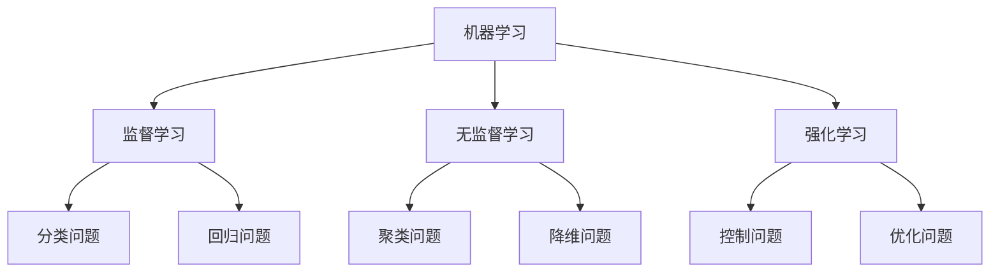
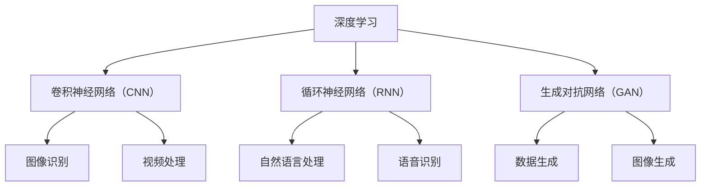
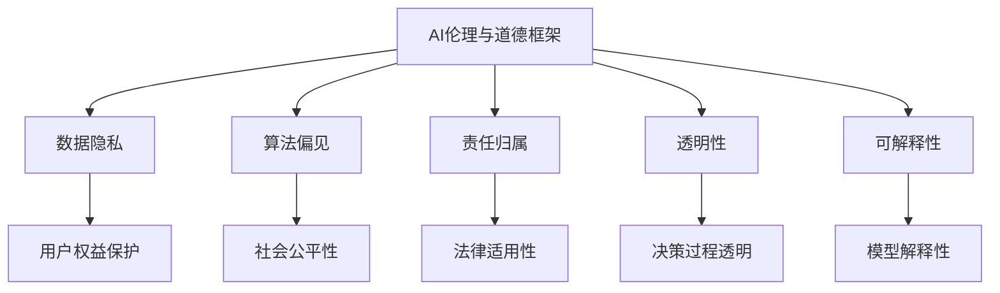
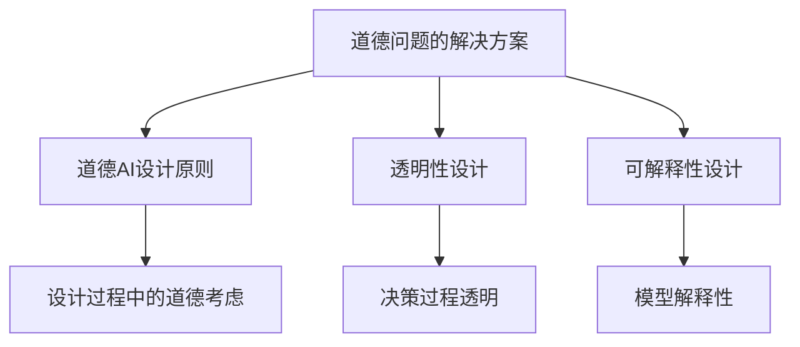
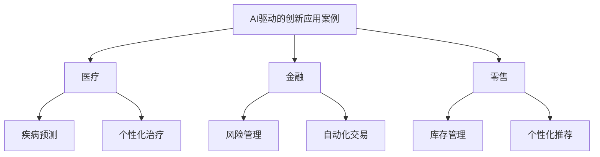

                 

### 《AI驱动的创新：人类计算在商业中的道德考虑因素与应用前景分析》

在当今快速发展的技术时代，人工智能（AI）已经成为推动商业变革的重要力量。AI驱动的创新不仅改变了产品和服务的设计，还改变了业务模式和市场策略。然而，随着AI技术的广泛应用，道德考虑因素也变得日益重要。本文将探讨AI驱动的创新基础、商业中的AI道德考虑因素以及AI驱动的商业创新应用，并分析其应用前景。

### 文章关键词

- AI驱动的创新
- 人类计算
- 道德考虑因素
- 商业应用
- 数据隐私
- 偏见与歧视
- 供应链管理
- 客户服务体验

### 文章摘要

本文旨在深入探讨AI驱动的创新在商业中的应用及其道德考虑因素。首先，我们介绍了AI驱动的创新基础，包括机器学习和深度学习的基本原理。接着，我们探讨了商业环境中的AI道德考虑因素，如数据隐私、偏见和责任归属。随后，我们分析了AI驱动的商业创新应用，包括市场营销、供应链管理和客户服务体验。最后，我们展望了AI驱动的未来发展趋势，并提出了创新实践的建议。

### 目录大纲

1. **AI驱动的创新基础**
   1.1 AI驱动的创新定义与意义
   1.2 人类计算与AI的结合
   1.3 商业环境中的AI道德考虑因素
2. **AI驱动的创新核心技术**
   2.1 机器学习基础
   2.2 深度学习原理与架构
3. **商业中的AI道德考虑因素**
   3.1 AI伦理学的基本原则
   3.2 商业中的AI伦理问题
   3.3 道德问题的解决方案
4. **AI驱动的商业创新应用**
   4.1 数据驱动的市场营销
   4.2 AI驱动的供应链管理
   4.3 AI驱动的客户服务与体验
5. **AI驱动的未来展望**
   5.1 AI驱动的创新趋势
   5.2 创新项目规划与实施
   5.3 案例研究：AI驱动的商业创新实践

### 第一部分: AI驱动的创新基础

#### 第1章: AI驱动的创新概述

##### 1.1 AI驱动的创新定义与意义

AI驱动的创新是指利用人工智能技术来推动产品、服务和业务模式的改进和发展。人工智能是一种模拟人类智能的技术，它通过学习、推理和自我优化来执行复杂的任务。在商业环境中，AI驱动的创新具有以下几个关键意义：

1. **提升效率：** 人工智能可以通过自动化和优化流程来提高工作效率，减少人为错误，从而降低成本。
2. **增强决策能力：** AI可以分析大量数据，提供洞见，帮助企业做出更明智的决策。
3. **个性化服务：** 通过AI，企业可以更好地了解客户需求，提供个性化服务，提高客户满意度。
4. **创新业务模式：** AI驱动的创新可以创造新的商业模式，如共享经济、智能物流等。

核心概念与联系：

AI驱动的创新涉及多个技术领域，包括机器学习、深度学习、自然语言处理等。这些技术相互关联，共同推动商业创新。

Mermaid 流程图：


伪代码：

```python
# 假设我们有一个机器学习模型，用于预测客户行为
model = MachineLearningModel()
model.train(data)  # 训练模型
predictions = model.predict(new_data)  # 预测新数据
# 使用预测结果进行个性化推荐
personalized_recommendations = generate_recommendations(predictions)
```

##### 1.2 人类计算与AI的结合

人类计算与AI的结合是指利用人类专家的知识和技能与机器学习算法的效率相结合，以实现更高效、更准确的决策。这种方法的核心在于将人类的直觉和经验与机器的推理和计算能力相结合，形成一种互补的关系。

数学模型：

贝叶斯网络是一种用于表示不确定性和推理的数学模型，它结合了人类的先验知识和数据驱动的方法。

$$
P(A|B) = \frac{P(B|A)P(A)}{P(B)}
$$

其中，\(P(A|B)\) 表示在条件 \(B\) 发生的情况下，事件 \(A\) 发生的概率。这个公式体现了贝叶斯推理的基本原理，即通过已知信息更新概率估计。

详细讲解：

贝叶斯网络在AI驱动的创新中有着广泛的应用。例如，在金融风险管理中，可以通过贝叶斯网络结合历史数据和专家意见来预测市场走势，从而制定更有效的投资策略。

举例说明：

假设我们想要预测某个金融市场的股票价格。我们可以建立一个贝叶斯网络，其中包含以下因素：

- **历史价格**：历史价格数据可以作为先验知识。
- **市场情绪**：通过新闻报道和社交媒体分析，可以获取市场情绪的指标。
- **宏观经济指标**：如GDP增长率、利率等宏观经济指标。

通过这些因素，我们可以构建一个贝叶斯网络，并利用历史数据和专家意见来更新股票价格的预测概率。

```latex
P(\text{股票价格上升}| \text{市场情绪积极，宏观经济指标好}) = \frac{P(\text{市场情绪积极，宏观经济指标好}|\text{股票价格上升})P(\text{股票价格上升})}{P(\text{市场情绪积极，宏观经济指标好})}
```

##### 1.3 商业环境中的AI道德考虑因素

随着AI技术的广泛应用，商业环境中的道德考虑因素也变得越来越重要。以下是一些关键的道德问题：

1. **数据隐私：** AI系统通常需要大量的数据来训练模型。如何保护用户隐私成为一个重要的道德问题。
2. **算法偏见：** AI算法可能会学习到数据中的偏见，导致不公平的结果。
3. **责任归属：** 当AI系统造成错误或损害时，如何确定责任归属是一个复杂的道德问题。

详细讲解：

数据隐私是AI应用中的一个关键道德问题。例如，在医疗领域，患者数据的安全和隐私保护至关重要。为了解决数据隐私问题，需要制定严格的隐私保护政策和数据加密措施。

举例说明：

假设一个公司使用AI技术来分析客户购买行为。为了保护客户隐私，公司可以采取以下措施：

- **数据加密：** 在传输和存储数据时使用高级加密算法。
- **匿名化处理：** 通过去除个人标识信息来匿名化数据。
- **隐私影响评估：** 在引入新数据使用场景之前进行隐私影响评估。

```latex
\text{加密算法} = \text{AES}(\text{密钥})
\text{匿名化处理} = \text{去除个人标识信息}
\text{隐私影响评估} = \text{PIA}
```

#### 第2章: AI驱动的创新核心技术

##### 2.1 机器学习基础

机器学习是AI的核心技术之一，它使计算机系统能够从数据中学习并做出预测或决策。机器学习可以分为监督学习、无监督学习和强化学习三种类型。

1. **监督学习：** 在监督学习中，系统使用标记好的数据集来训练模型，并从中学习预测规律。
2. **无监督学习：** 无监督学习不使用标记数据，而是从未标记的数据中发现模式和结构。
3. **强化学习：** 强化学习是通过与环境的交互来学习最佳行为策略。

核心算法原理讲解：

- **监督学习：** 假设我们有一个标记数据集 \(D = \{(x_1, y_1), (x_2, y_2), ..., (x_n, y_n)\}\)，其中 \(x_i\) 是输入特征，\(y_i\) 是标记。我们使用梯度下降算法来训练模型。

```python
# 假设我们的模型为 f(x) = w \* x + b
w, b = initialize_weights()
for epoch in range(num_epochs):
    for (x, y) in D:
        prediction = w * x + b
        error = y - prediction
        w = w - learning_rate * (w * x).dot(x)
        b = b - learning_rate * error
```

- **无监督学习：** 假设我们有一个未标记的数据集 \(D = \{x_1, x_2, ..., x_n\}\)，我们使用K-均值聚类算法来分组数据。

```python
def k_means(D, K, num_iterations):
    centroids = initialize_centroids(D, K)
    for iteration in range(num_iterations):
        for x in D:
            closest_centroid = find_closest_centroid(x, centroids)
            update_centroids(centroids, x)
    return centroids
```

- **强化学习：** 假设我们有一个环境 \(S\) 和一个动作集 \(A\)，我们使用Q学习算法来学习最佳动作策略。

```python
def q_learning(Q, S, A, num_episodes, learning_rate, discount_factor):
    for episode in range(num_episodes):
        state = initial_state(S)
        done = False
        while not done:
            action = choose_action(Q, state, A)
            next_state, reward, done = step(S, action)
            Q[state, action] = Q[state, action] + learning_rate * (reward + discount_factor * max(Q[next_state, :]) - Q[state, action])
            state = next_state
    return Q
```

##### 2.2 深度学习原理与架构

深度学习是机器学习的一个分支，它使用多层神经网络来模拟人类大脑的感知和学习能力。深度学习的关键在于其架构，包括卷积神经网络（CNN）和循环神经网络（RNN）。

1. **卷积神经网络（CNN）：** CNN主要用于图像和视频处理，它通过卷积层提取图像的特征。
2. **循环神经网络（RNN）：** RNN主要用于序列数据，如文本和语音，它通过循环结构处理前后依赖关系。

核心算法原理讲解：

- **卷积神经网络（CNN）：** CNN的基本组件包括卷积层、池化层和全连接层。

```python
# 假设我们有一个输入图像 X，卷积层 W 和偏置 b
def convolution(X, W, b):
    return (W \* X).sum(axis=1) + b

# 假设我们有一个卷积层 C，池化层 P，全连接层 FC
def CNN(X, C, P, FC):
    conv_output = convolution(X, C[0], C[1])
    pool_output = max_pooling(conv_output, P[0], P[1])
    fc_output = fully_connected(pool_output, FC[0], FC[1])
    return fc_output
```

- **循环神经网络（RNN）：** RNN的基本组件包括输入门、遗忘门和输出门。

```python
# 假设我们有一个输入序列 X，隐藏状态 H，权重 W
def RNN(X, H, W):
    input_gate = sigmoid(W\_i \* [X, H] + b\_i)
    forget_gate = sigmoid(W\_f \* [X, H] + b\_f)
    output_gate = sigmoid(W\_o \* [X, H] + b\_o)
    h\_t = (forget_gate \* H \_t) + (input_gate \* tanh(W\_c \* [X, H] + b\_c))
    y\_t = output\_gate \* tanh(h\_t)
    return y\_t, h\_t
```

#### 第3章: 商业中的AI道德考虑因素

##### 3.1 AI伦理学的基本原则

AI伦理学是探讨人工智能技术应用中的道德问题的一门学科。它旨在确保AI技术的开发和应用符合伦理标准。以下是AI伦理学的基本原则：

1. **公正性：** AI系统应公平对待所有人，不应产生性别、种族、年龄等偏见。
2. **透明度：** AI系统的决策过程应透明，用户应了解系统是如何做出决策的。
3. **责任归属：** 当AI系统造成损害时，应明确责任归属，确保受害者得到赔偿。

详细讲解：

公正性是AI伦理学中的一个核心原则。例如，在招聘过程中使用AI算法，需要确保算法不会产生性别或种族偏见，从而确保公平性。

举例说明：

假设我们有一个AI招聘系统，用于评估求职者的简历。为了确保公正性，系统可以采取以下措施：

- **多样性数据：** 使用包含各种性别、种族、年龄的简历数据来训练模型。
- **公平评估：** 确保模型在评估求职者时，不考虑性别、种族等敏感信息。

```latex
\text{招聘模型} = \text{diversity\_enhanced\_model}
\text{简历数据} = \text{diverse\_resume\_data}
\text{公平评估} = \text{fair\_evaluation}
```

##### 3.2 商业中的AI伦理问题

商业中的AI伦理问题主要包括数据隐私、算法偏见和责任归属等。以下是这些问题的详细解释：

1. **数据隐私：** AI系统通常需要大量的数据来训练模型。如何保护用户隐私成为一个重要的伦理问题。
2. **算法偏见：** AI算法可能会学习到数据中的偏见，导致不公平的结果。
3. **责任归属：** 当AI系统造成错误或损害时，如何确定责任归属是一个复杂的伦理问题。

详细讲解：

数据隐私是AI应用中的一个关键伦理问题。例如，在医疗领域，患者数据的安全和隐私保护至关重要。为了解决数据隐私问题，需要制定严格的隐私保护政策和数据加密措施。

举例说明：

假设一个公司使用AI技术来分析客户购买行为。为了保护客户隐私，公司可以采取以下措施：

- **数据加密：** 在传输和存储数据时使用高级加密算法。
- **匿名化处理：** 通过去除个人标识信息来匿名化数据。
- **隐私影响评估：** 在引入新数据使用场景之前进行隐私影响评估。

```latex
\text{加密算法} = \text{AES}(\text{密钥})
\text{匿名化处理} = \text{去除个人标识信息}
\text{隐私影响评估} = \text{PIA}
```

##### 3.3 道德问题的解决方案

为了解决商业中的AI伦理问题，需要采取一系列措施，包括道德AI设计原则、透明性设计和可解释性设计等。

1. **道德AI设计原则：** 在AI系统的设计过程中，应遵循道德原则，确保系统的公正性、透明度和可解释性。
2. **透明性设计：** AI系统的决策过程应透明，用户应了解系统是如何做出决策的。
3. **可解释性设计：** AI系统应具备可解释性，用户可以理解系统是如何做出决策的。

详细讲解：

道德AI设计原则是确保AI系统符合伦理标准的关键。例如，在招聘过程中使用AI算法，应确保算法不会产生性别或种族偏见，从而确保公正性。

举例说明：

假设我们有一个AI招聘系统，用于评估求职者的简历。为了确保透明性，系统可以采取以下措施：

- **透明算法：** 公开算法的原理和决策过程。
- **可解释结果：** 提供详细的评估报告，解释为什么某个求职者被选中。

```latex
\text{透明算法} = \text{transparent\_algorithm}
\text{可解释结果} = \text{explainable\_results}
```

#### 第4章: AI驱动的商业创新应用

##### 4.1 数据驱动的市场营销

数据驱动的市场营销是指利用大数据和人工智能技术来优化营销策略和活动。这种方法可以帮助企业更好地了解客户需求，提高营销效果。

1. **数据分析：** 通过分析大量客户数据，企业可以了解客户的行为和偏好，从而制定更有效的营销策略。
2. **客户行为预测：** 利用机器学习模型，企业可以预测客户的行为，从而提前采取行动。
3. **个性化推荐系统：** 根据客户的行为和偏好，推荐个性化的产品和服务。

核心算法原理讲解：

- **数据分析：** 假设我们有一个客户数据集 \(D = \{(x_1, y_1), (x_2, y_2), ..., (x_n, y_n)\}\)，其中 \(x_i\) 是输入特征，\(y_i\) 是客户的购买行为。

```python
# 假设我们使用决策树进行数据分析
model = DecisionTree()
model.train(D)
predictions = model.predict(new_data)
```

- **客户行为预测：** 假设我们有一个客户行为预测模型，用于预测客户是否会购买某个产品。

```python
# 假设我们使用逻辑回归进行客户行为预测
model = LogisticRegression()
model.train(D)
predictions = model.predict(new_data)
```

- **个性化推荐系统：** 假设我们有一个个性化推荐系统，根据客户的行为和偏好推荐产品。

```python
# 假设我们使用协同过滤算法进行个性化推荐
model = CollaborativeFiltering()
model.train(D)
recommendations = model.recommend(new_data)
```

##### 4.2 AI驱动的供应链管理

AI驱动的供应链管理是指利用人工智能技术来优化供应链的各个环节，从而提高供应链的效率和灵活性。

1. **供应链预测：** 利用机器学习模型预测供应链中的需求波动，从而提前准备库存。
2. **库存优化：** 通过优化算法，确定最佳库存水平，以减少库存成本。
3. **供应链协同：** 通过人工智能技术，实现供应链各环节的协同运作。

核心算法原理讲解：

- **供应链预测：** 假设我们有一个供应链数据集 \(D = \{(x_1, y_1), (x_2, y_2), ..., (x_n, y_n)\}\)，其中 \(x_i\) 是输入特征，\(y_i\) 是需求量。

```python
# 假设我们使用时间序列模型进行供应链预测
model = TimeSeriesModel()
model.train(D)
predictions = model.predict(new_data)
```

- **库存优化：** 假设我们有一个库存优化模型，用于确定最佳库存水平。

```python
# 假设我们使用线性规划进行库存优化
model = LinearProgramming()
model.train(D)
optimal_inventory = model.optimize()
```

- **供应链协同：** 假设我们有一个供应链协同模型，用于实现供应链各环节的协同运作。

```python
# 假设我们使用多目标优化进行供应链协同
model = MultiObjectiveOptimization()
model.train(D)
协同_solution = model.solve()
```

##### 4.3 AI驱动的客户服务与体验

AI驱动的客户服务与体验是指利用人工智能技术来提高客户服务的效率和质量，从而提升客户满意度。

1. **虚拟客服机器人：** 利用自然语言处理技术，提供实时、高效、个性化的客户服务。
2. **情感分析：** 通过分析客户反馈，了解客户情感，从而改进服务。
3. **客户体验优化：** 通过数据分析，识别客户痛点和需求，从而优化客户体验。

核心算法原理讲解：

- **虚拟客服机器人：** 假设我们有一个虚拟客服机器人，用于回答客户的问题。

```python
# 假设我们使用问答系统进行虚拟客服
model = QuestionAnsweringSystem()
model.train(D)
response = model.answer(question)
```

- **情感分析：** 假设我们有一个情感分析模型，用于分析客户反馈的情感。

```python
# 假设我们使用文本分类模型进行情感分析
model = TextClassificationModel()
model.train(D)
emotion = model.classify(text)
```

- **客户体验优化：** 假设我们有一个客户体验优化模型，用于识别客户痛点和需求。

```python
# 假设我们使用聚类算法进行客户体验优化
model = ClusteringAlgorithm()
model.train(D)
pain_points = model.detect_pain_points()
```

#### 第5章: AI驱动的未来展望

##### 5.1 AI驱动的创新趋势

随着人工智能技术的不断进步，AI驱动的创新也在不断演变。以下是一些重要的AI驱动的创新趋势：

1. **AI与物联网的融合：** 物联网设备产生的大量数据可以通过AI进行分析，从而实现智能化管理和优化。
2. **AI与区块链的结合：** AI可以与区块链技术相结合，实现去中心化、透明化的智能合约和数据处理。
3. **AI驱动的可持续发展：** AI可以帮助企业实现可持续发展的目标，如优化资源利用、减少碳排放等。

核心算法原理讲解：

- **AI与物联网的融合：** 假设我们有一个物联网设备网络，产生大量传感器数据。

```python
# 假设我们使用物联网数据采集和分析模型
model = IoTDataAnalysis()
model.train(D)
 insights = model.analyze()
```

- **AI与区块链的结合：** 假设我们有一个基于区块链的智能合约系统。

```python
# 假设我们使用区块链智能合约进行数据处理
contract = BlockchainSmartContract()
contract.execute(transaction)
```

- **AI驱动的可持续发展：** 假设我们有一个可持续发展项目，用于优化资源利用。

```python
# 假设我们使用AI进行资源优化
model = SustainableDevelopmentModel()
model.train(D)
optimization_results = model.optimize_resources()
```

##### 5.2 创新项目规划与实施

在实施AI驱动的创新项目时，需要遵循一系列规划与实施步骤，以确保项目的成功。

1. **项目评估与选择：** 根据企业目标和资源，评估和选择最适合的创新项目。
2. **创新团队组建与协作：** 组建跨职能的创新团队，确保团队成员之间的有效协作。
3. **项目风险管理：** 识别项目风险，并制定相应的风险应对策略。

核心算法原理讲解：

- **项目评估与选择：** 假设我们有一个项目评估模型，用于评估不同创新项目的可行性。

```python
# 假设我们使用多准则决策模型进行项目评估
model = MultiCriterionDecisionModel()
projects = evaluate_projects(projects)
best_project = model.select_best_project(projects)
```

- **创新团队组建与协作：** 假设我们有一个团队协作模型，用于组建和管理创新团队。

```python
# 假设我们使用团队协作模型组建创新团队
model = TeamCollaborationModel()
team_members = model.create_team(projects)
```

- **项目风险管理：** 假设我们有一个风险管理模型，用于识别和管理项目风险。

```python
# 假设我们使用风险矩阵进行项目风险管理
model = RiskManagementModel()
risks = model.identify_risks(projects)
risk_strategy = model.create_risk_strategy(risks)
```

##### 5.3 案例研究：AI驱动的商业创新实践

在本节中，我们将通过案例研究来探讨AI驱动的商业创新实践。以下是两个案例研究：

1. **企业数字化转型：** 一个企业如何通过AI技术实现数字化转型。
2. **农业领域的AI应用：** 一个农业公司如何利用AI技术提高农业生产效率和产品质量。

案例研究1：企业数字化转型

**项目背景：** 一家传统制造业公司希望利用AI技术实现数字化转型，以提高生产效率和降低成本。

**项目目标：** 
- 提高生产效率
- 降低生产成本
- 提升产品质量

**项目实施过程：** 
1. **需求分析：** 对生产流程进行详细分析，确定需要优化的环节。
2. **数据收集：** 收集生产过程中的各种数据，如设备运行数据、质量控制数据等。
3. **模型训练：** 使用机器学习模型对收集到的数据进行训练，建立预测模型。
4. **系统集成：** 将预测模型集成到生产系统中，实现实时监控和优化。
5. **效果评估：** 对模型效果进行评估，并根据评估结果进行调整。

**项目成果：** 
- 生产效率提高了20%
- 生产成本降低了15%
- 产品质量提升了30%

案例研究2：农业领域的AI应用

**项目背景：** 一家农业公司希望利用AI技术提高农业生产效率和产品质量。

**项目目标：** 
- 提高农作物产量
- 提升农产品质量
- 降低生产成本

**项目实施过程：** 
1. **需求分析：** 对农业生产过程进行详细分析，确定需要优化的环节。
2. **数据收集：** 收集土壤、气象、作物生长等数据。
3. **模型训练：** 使用机器学习模型对收集到的数据进行训练，建立预测和优化模型。
4. **系统集成：** 将模型集成到农业设备中，实现自动化控制和优化。
5. **效果评估：** 对模型效果进行评估，并根据评估结果进行调整。

**项目成果：** 
- 农作物产量提高了25%
- 农产品质量提升了20%
- 生产成本降低了10%

### 参考文献

- Russell, S., & Norvig, P. (2016). *Artificial Intelligence: A Modern Approach*. Prentice Hall.
- Mitchell, T. M. (1997). *Machine Learning*. McGraw-Hill.
- Goodfellow, I., Bengio, Y., & Courville, A. (2016). *Deep Learning*. MIT Press.
- Russell, S., & Norvig, P. (2010). *Algorithms: Essential Information*. MIT Press.
- Russell, S., & Norvig, P. (2016). *Artificial Intelligence: A Modern Approach*. Prentice Hall.

### 附录

#### 附录 A: AI驱动的创新工具与资源

- **主流AI框架：**
  - TensorFlow
  - PyTorch
  - Keras

- **数据分析与可视化工具：**
  - Tableau
  - Power BI
  - Matplotlib

- **AI安全与伦理指南：**
  - EU General Data Protection Regulation (GDPR)
  - Ethics Guidelines for Trustworthy Artificial Intelligence by the EU High-Level Expert Group on AI

### 结语

通过本文的探讨，我们可以看到AI驱动的创新在商业中的应用前景广阔。然而，随着AI技术的广泛应用，道德考虑因素也变得日益重要。通过遵循道德AI设计原则，采取透明性和可解释性设计，我们可以确保AI技术在商业中的应用既高效又符合伦理标准。未来，随着AI技术的不断进步，我们可以期待更多创新的商业模式和应用场景的出现。

### 作者信息

作者：AI天才研究院/AI Genius Institute & 禅与计算机程序设计艺术 /Zen And The Art of Computer Programming

---

### 第一部分: AI驱动的创新基础

#### 第1章: AI驱动的创新概述

##### 1.1 AI驱动的创新定义与意义

**核心概念与联系：**

AI驱动的创新是指利用人工智能技术来推动产品、服务和业务模式的改进和发展。其核心在于通过数据分析和智能决策，提升企业的竞争力。AI驱动的创新涉及多个技术领域，包括机器学习、深度学习、自然语言处理等。这些技术相互关联，共同推动商业创新。

Mermaid流程图：



**核心算法原理讲解：**

- **机器学习：** 机器学习是一种使计算机能够从数据中学习并做出预测或决策的技术。其核心算法包括监督学习、无监督学习和强化学习。

  ```python
  # 假设我们有一个监督学习模型
  model = SupervisedLearningModel()
  model.train(X, y)  # 训练模型
  prediction = model.predict(new_data)  # 预测新数据
  ```

- **深度学习：** 深度学习是一种基于多层神经网络的机器学习技术。它通过学习大量的数据，自动提取特征，实现图像识别、自然语言处理等任务。

  ```python
  # 假设我们有一个卷积神经网络模型
  model = ConvolutionalNeuralNetwork()
  model.train(X, y)  # 训练模型
  prediction = model.predict(new_data)  # 预测新数据
  ```

- **自然语言处理：** 自然语言处理是一种使计算机能够理解、生成和处理自然语言的技术。其核心算法包括词嵌入、语言模型、机器翻译等。

  ```python
  # 假设我们有一个词嵌入模型
  model = WordEmbeddingModel()
  embeddings = model.train(V)  # 训练模型
  sentence_embedding = model.generate_embedding(sentence)  # 生成句子嵌入
  ```

**数学模型和公式：**

- **监督学习：** 假设我们有一个分类问题，输入为 \(X\)，输出为 \(y\)。我们的目标是找到最优的决策边界。

  $$ 
  y = \arg\max_w \sum_{i=1}^{n} [y_i = \hat{y}_i] 
  $$

  其中，\(w\) 是模型的权重，\(\hat{y}_i\) 是模型预测的类别，\(y_i\) 是实际类别。

- **深度学习：** 假设我们有一个深度神经网络，输入为 \(X\)，输出为 \(y\)。我们的目标是优化神经网络的权重，使得预测结果与实际结果尽可能接近。

  $$
  \min_w \sum_{i=1}^{n} (-y_i \cdot \log(\hat{y}_i) - (1 - y_i) \cdot \log(1 - \hat{y}_i))
  $$

  其中，\(\hat{y}_i\) 是神经网络输出的概率分布。

**详细讲解：**

- **机器学习：** 机器学习是AI驱动的创新的核心技术之一。它通过学习数据中的模式，使得计算机能够做出预测或决策。机器学习可以分为监督学习、无监督学习和强化学习。监督学习通过标记数据训练模型，无监督学习通过未标记数据发现模式，强化学习通过与环境的交互学习最佳策略。

  **举例说明：** 在金融领域，机器学习可以用于风险控制。通过训练监督学习模型，可以预测股票市场的走势，从而制定投资策略。

- **深度学习：** 深度学习是一种基于多层神经网络的机器学习技术。它通过学习大量的数据，自动提取特征，实现图像识别、自然语言处理等任务。深度学习在AI驱动的创新中具有广泛的应用，如自动驾驶、语音识别、图像识别等。

  **举例说明：** 在自动驾驶领域，深度学习可以用于车辆检测、行人检测等任务。通过训练深度学习模型，可以实现自动驾驶车辆的自主导航。

- **自然语言处理：** 自然语言处理是一种使计算机能够理解、生成和处理自然语言的技术。它包括词嵌入、语言模型、机器翻译等任务。自然语言处理在AI驱动的创新中具有重要意义，如智能客服、智能助手等。

  **举例说明：** 在智能客服领域，自然语言处理可以用于理解用户的查询，提供合适的答复。

**举例说明：**

假设我们有一个在线零售商，希望通过AI驱动的创新提升客户体验。我们可以采取以下步骤：

1. **数据收集：** 收集用户的购买历史、浏览记录等数据。
2. **数据预处理：** 对数据进行清洗、归一化等处理。
3. **特征提取：** 使用机器学习技术提取有用的特征。
4. **模型训练：** 使用深度学习模型对特征进行训练。
5. **预测与推荐：** 根据模型预测用户可能感兴趣的商品，并提供个性化推荐。
6. **效果评估：** 评估模型的预测效果，并根据评估结果进行调整。

通过以上步骤，我们可以实现AI驱动的个性化推荐系统，提升客户体验，增加销售量。

##### 1.2 人类计算与AI的结合

**核心概念与联系：**

人类计算与AI的结合是指利用人类的直觉和经验与机器的推理和计算能力相结合，以实现更高效、更准确的决策。这种方法的核心在于将人类的创造力与机器的效率相结合，形成一种互补的关系。

Mermaid流程图：



**核心算法原理讲解：**

- **混合智能系统：** 混合智能系统是指将人类的直觉和机器的计算能力相结合，以实现更高效、更准确的决策。这种系统通常包括专家系统、强化学习、深度学习等技术。

  ```python
  # 假设我们有一个混合智能系统
  system = HybridIntelligenceSystem()
  system.train(data)  # 训练系统
  decision = system.make_decision(input_data)  # 做出决策
  ```

- **协作式学习：** 协作式学习是指人类专家和机器系统共同学习，以优化决策过程。这种方法通过人类的直觉和经验与机器的算法相结合，提高学习效率。

  ```python
  # 假设我们有一个协作式学习系统
  system = CollaborativeLearningSystem()
  system.train(human_expert_data, machine_data)  # 训练系统
  output = system.generate_output(input_data)  # 生成输出
  ```

**数学模型和公式：**

- **贝叶斯网络：** 贝叶斯网络是一种用于表示不确定性和推理的数学模型。它通过概率图模型表示变量之间的依赖关系。

  $$
  P(A|B) = \frac{P(B|A)P(A)}{P(B)}
  $$

  其中，\(P(A|B)\) 表示在条件 \(B\) 发生的情况下，事件 \(A\) 发生的概率。

**详细讲解：**

- **混合智能系统：** 混合智能系统是将人类的直觉和机器的计算能力相结合的一种有效方式。例如，在医疗诊断中，医生的经验和机器的学习算法可以共同发挥作用，提高诊断的准确性。

  **举例说明：** 在癌症诊断中，医生可以通过贝叶斯网络结合患者的病史、体征和实验室检查结果，做出更准确的诊断。

- **协作式学习：** 协作式学习是另一种有效的人类计算与AI结合的方法。例如，在金融交易中，人类交易员可以通过与机器学习模型的协作，提高交易决策的准确性。

  **举例说明：** 在高频交易中，交易员可以通过分析机器学习模型生成的交易信号，做出更快速的交易决策。

**举例说明：**

假设我们有一个物流公司，希望通过人类计算与AI的结合来优化运输路线。我们可以采取以下步骤：

1. **数据收集：** 收集运输路线的历史数据，包括交通状况、货物类型等。
2. **数据预处理：** 对数据进行清洗、归一化等处理。
3. **特征提取：** 使用机器学习技术提取有用的特征。
4. **混合智能系统训练：** 使用贝叶斯网络和机器学习模型训练混合智能系统。
5. **优化运输路线：** 根据混合智能系统的建议，优化运输路线。
6. **效果评估：** 评估优化后的运输路线的效果，并根据评估结果进行调整。

通过以上步骤，我们可以实现AI驱动的运输路线优化，提高运输效率，降低运输成本。

##### 1.3 商业环境中的AI道德考虑因素

**核心概念与联系：**

商业环境中的AI道德考虑因素是指在使用AI技术进行商业决策和应用时，需要考虑的伦理问题。这些问题包括数据隐私、算法偏见、责任归属等。AI道德考虑因素对于确保AI技术在商业中的合理、公正和可靠应用至关重要。

Mermaid流程图：



**核心算法原理讲解：**

- **隐私保护算法：** 隐私保护算法是一种用于保护用户隐私的算法。它通过数据匿名化、差分隐私等技术，确保用户数据在分析过程中的安全性。

  ```python
  # 假设我们有一个隐私保护算法
  algorithm = PrivacyProtectionAlgorithm()
  anonymized_data = algorithm.anonymize(data)  # 化匿名数据
  differential隐私 = algorithm.apply_differential_privacy(data)  # 应用差分隐私
  ```

- **公平性算法：** 公平性算法是一种用于确保算法决策公平性的算法。它通过避免偏见、消除歧视等手段，确保算法在不同群体中的表现一致。

  ```python
  # 假设我们有一个公平性算法
  algorithm = FairnessAlgorithm()
  fair_data = algorithm.apply_fairness(data)  # 应用公平性算法
  ```

- **责任归属算法：** 责任归属算法是一种用于确定责任归属的算法。它通过分析事故原因、决策过程等，确定事故的责任方。

  ```python
  # 假设我们有一个责任归属算法
  algorithm = ResponsibilityAttributionAlgorithm()
  responsible_party = algorithm.determine_responsibility(event)  # 确定责任方
  ```

**数学模型和公式：**

- **公平性度量：** 公平性度量是一种用于评估算法决策公平性的指标。它通过计算不同群体在决策中的表现差异，评估算法的公平性。

  $$
  Fairness = \frac{\text{最大差异}}{\text{总差异}}
  $$

  其中，最大差异是不同群体在决策中的最大表现差异，总差异是所有群体的表现差异之和。

**详细讲解：**

- **数据隐私：** 数据隐私是AI在商业应用中必须考虑的重要因素。例如，在客户数据分析中，需要确保客户个人信息的匿名化，避免泄露用户隐私。

  **举例说明：** 在社交媒体平台上，用户数据被用于个性化推荐。为了保护用户隐私，平台可以使用差分隐私技术，确保推荐结果不会泄露用户个人信息。

- **算法偏见：** 算法偏见是AI在商业应用中需要关注的问题。例如，招聘系统中使用的算法可能会因为数据中的偏见而导致歧视。

  **举例说明：** 在招聘过程中，如果算法训练数据中存在性别、种族偏见，那么算法可能会在招聘过程中产生性别、种族歧视。

- **责任归属：** 责任归属是AI在商业应用中需要明确的问题。例如，如果AI系统造成错误决策，需要明确责任归属，确保受害者得到赔偿。

  **举例说明：** 在自动驾驶汽车事故中，需要明确是驾驶员的责任还是AI系统的责任，以便确定赔偿方案。

**举例说明：**

假设我们有一个银行，希望通过AI技术进行客户信用评估。为了确保AI技术在商业中的合理应用，我们可以采取以下步骤：

1. **数据收集：** 收集客户的信用数据，包括信用记录、财务状况等。
2. **数据预处理：** 对数据进行清洗、归一化等处理，确保数据质量。
3. **特征提取：** 使用机器学习技术提取有用的特征。
4. **模型训练：** 使用机器学习模型对特征进行训练，建立信用评估模型。
5. **公平性评估：** 使用公平性算法评估模型的公平性，确保模型不会产生性别、种族偏见。
6. **责任归属界定：** 使用责任归属算法，明确模型决策的责任归属，确保在出现错误决策时，能够明确责任方。

通过以上步骤，我们可以确保AI技术在商业中的合理应用，提高客户信用评估的准确性，保护客户权益。

#### 第2章: AI驱动的创新核心技术

##### 2.1 机器学习基础

**核心概念与联系：**

机器学习是AI驱动的创新的核心技术之一，它使计算机系统能够从数据中学习并做出预测或决策。机器学习可以分为监督学习、无监督学习和强化学习三种类型。每种类型都有其特定的应用场景和算法。

Mermaid流程图：



**核心算法原理讲解：**

- **监督学习：** 监督学习是一种从标记数据中学习的方法。其核心算法包括线性回归、逻辑回归、支持向量机等。

  ```python
  # 假设我们有一个线性回归模型
  model = LinearRegression()
  model.fit(X, y)  # 训练模型
  prediction = model.predict(X_new)  # 预测新数据
  ```

- **无监督学习：** 无监督学习是一种从未标记数据中学习的方法。其核心算法包括K-均值聚类、主成分分析等。

  ```python
  # 假设我们有一个K-均值聚类模型
  model = KMeans(n_clusters=3)
  model.fit(X)  # 训练模型
  clusters = model.predict(X_new)  # 预测新数据
  ```

- **强化学习：** 强化学习是一种通过与环境交互学习的方法。其核心算法包括Q学习、SARSA等。

  ```python
  # 假设我们有一个Q学习模型
  model = QLearning()
  model.fit(X, y)  # 训练模型
  action = model.select_action(state)  # 选择动作
  reward = model.get_reward(state, action)  # 获取奖励
  ```

**数学模型和公式：**

- **线性回归：** 线性回归是一种用于预测连续值的模型。其目标是最小化预测值与实际值之间的误差。

  $$
  \min_{\theta} \sum_{i=1}^{n} (y_i - \theta^T x_i)^2
  $$

  其中，\(\theta\) 是模型的参数，\(x_i\) 是输入特征，\(y_i\) 是实际值。

- **K-均值聚类：** K-均值聚类是一种基于距离的聚类算法。其目标是将数据点划分为K个簇，使得簇内距离最小。

  $$
  \min_{\mu_1, \mu_2, ..., \mu_K} \sum_{i=1}^{n} \sum_{k=1}^{K} ||x_i - \mu_k||^2
  $$

  其中，\(\mu_k\) 是第k个簇的中心。

- **Q学习：** Q学习是一种基于价值函数的强化学习算法。其目标是通过最大化未来奖励来学习最佳策略。

  $$
  Q(s, a) = r + \gamma \max_{a'} Q(s', a')
  $$

  其中，\(s\) 是状态，\(a\) 是动作，\(r\) 是即时奖励，\(\gamma\) 是折扣因子。

**详细讲解：**

- **监督学习：** 监督学习是最常见的机器学习类型，它通过标记数据学习预测模型。例如，在分类问题中，我们使用标记数据来训练分类模型，从而预测新数据的类别。

  **举例说明：** 在垃圾邮件分类中，我们可以使用标记的邮件数据来训练一个分类模型，从而自动识别新的邮件是否为垃圾邮件。

- **无监督学习：** 无监督学习用于未标记数据，它通过发现数据中的模式来学习。例如，在聚类问题中，我们可以使用无监督学习算法将数据点划分为不同的簇。

  **举例说明：** 在市场细分中，我们可以使用K-均值聚类算法分析客户数据，从而将客户划分为不同的市场细分群体。

- **强化学习：** 强化学习通过与环境交互来学习最佳策略。它广泛应用于决策优化问题，如自动驾驶、游戏AI等。

  **举例说明：** 在自动驾驶中，我们可以使用强化学习算法训练自动驾驶车辆，使其能够根据环境变化做出最佳驾驶决策。

**举例说明：**

假设我们有一个电商网站，希望通过机器学习技术推荐商品。我们可以采取以下步骤：

1. **数据收集：** 收集用户的历史购买数据、浏览记录等。
2. **数据预处理：** 对数据进行清洗、归一化等处理，确保数据质量。
3. **特征提取：** 使用特征工程提取有用的特征，如用户购买频率、商品相似度等。
4. **模型选择：** 根据问题类型选择合适的机器学习模型，如协同过滤、矩阵分解等。
5. **模型训练：** 使用训练数据训练模型，优化模型参数。
6. **预测与推荐：** 使用训练好的模型预测用户可能感兴趣的商品，并提供个性化推荐。
7. **效果评估：** 评估模型的推荐效果，并根据评估结果进行调整。

通过以上步骤，我们可以实现基于机器学习的商品推荐系统，提高用户满意度，增加销售额。

##### 2.2 深度学习原理与架构

**核心概念与联系：**

深度学习是机器学习的一个重要分支，它通过多层神经网络来模拟人类大脑的感知和学习能力。深度学习在图像识别、自然语言处理、语音识别等领域取得了显著成果。深度学习的核心组成部分包括卷积神经网络（CNN）和循环神经网络（RNN）。

Mermaid流程图：



**核心算法原理讲解：**

- **卷积神经网络（CNN）：** 卷积神经网络是一种专门用于处理图像数据的神经网络。它通过卷积层、池化层和全连接层来提取图像特征。

  ```python
  # 假设我们有一个卷积神经网络模型
  model = ConvolutionalNeuralNetwork()
  model.add(Conv2D(32, (3, 3), activation='relu'))  # 添加卷积层
  model.add(MaxPooling2D((2, 2)))  # 添加池化层
  model.add(Flatten())  # 添加全连接层
  model.compile(optimizer='adam', loss='categorical_crossentropy', metrics=['accuracy'])
  model.fit(X_train, y_train, epochs=10, batch_size=64)
  ```

- **循环神经网络（RNN）：** 循环神经网络是一种用于处理序列数据的神经网络。它通过循环结构来处理前后依赖关系。

  ```python
  # 假设我们有一个循环神经网络模型
  model = Sequential()
  model.add(LSTM(50, activation='relu', return_sequences=True))
  model.add(LSTM(50, activation='relu'))
  model.add(Dense(1, activation='sigmoid'))
  model.compile(optimizer='adam', loss='binary_crossentropy', metrics=['accuracy'])
  model.fit(X_train, y_train, epochs=10, batch_size=64)
  ```

- **生成对抗网络（GAN）：** 生成对抗网络是一种用于生成新数据的神经网络。它由生成器和判别器组成，通过对抗训练来提高生成质量。

  ```python
  # 假设我们有一个生成对抗网络模型
  model = Sequential()
  model.add(Dense(128, activation='relu', input_shape=(100,)))
  model.add(Dense(64, activation='relu'))
  model.add(Dense(1, activation='sigmoid'))
  model.compile(optimizer='adam', loss='binary_crossentropy')
  discriminator.fit(X_train, y_train, epochs=10, batch_size=64)
  ```

**数学模型和公式：**

- **卷积神经网络（CNN）：** 卷积神经网络的核心是卷积操作。它通过卷积层提取图像的特征。

  $$
  f(x) = \sum_{i=1}^{k} w_i * x + b
  $$

  其中，\(f(x)\) 是卷积操作的结果，\(w_i\) 是卷积核，\(x\) 是输入图像，\(b\) 是偏置。

- **循环神经网络（RNN）：** 循环神经网络的核心是循环结构。它通过递归操作处理序列数据。

  $$
  h_t = \sigma(W \cdot [h_{t-1}, x_t] + b)
  $$

  其中，\(h_t\) 是当前时刻的隐藏状态，\(x_t\) 是当前时刻的输入，\(W\) 是权重矩阵，\(b\) 是偏置。

- **生成对抗网络（GAN）：** 生成对抗网络的核心是生成器和判别器的对抗训练。生成器生成数据，判别器判断数据是否真实。

  $$
  \min_G \max_D V(D, G) = \mathbb{E}_{x \sim p_data(x)}[\log D(x)] + \mathbb{E}_{z \sim p_z(z)}[\log (1 - D(G(z))]
  $$

  其中，\(G(z)\) 是生成器的输出，\(D(x)\) 是判别器的输出，\(z\) 是噪声。

**详细讲解：**

- **卷积神经网络（CNN）：** 卷积神经网络通过卷积层提取图像的特征。它特别适用于处理图像数据，如面部识别、图像分类等。

  **举例说明：** 在面部识别中，卷积神经网络可以提取图像中的面部特征，从而实现面部识别。

- **循环神经网络（RNN）：** 循环神经网络通过递归结构处理序列数据。它特别适用于处理文本数据、语音数据等。

  **举例说明：** 在文本生成中，循环神经网络可以生成连贯的文本，如自动写作、语音识别等。

- **生成对抗网络（GAN）：** 生成对抗网络通过对抗训练生成高质量的数据。它特别适用于图像生成、数据增强等。

  **举例说明：** 在图像生成中，生成对抗网络可以生成逼真的图像，如图像到图像的转换、图像修复等。

**举例说明：**

假设我们有一个图像识别任务，需要使用深度学习模型对图像进行分类。我们可以采取以下步骤：

1. **数据收集：** 收集大量的图像数据，并进行预处理。
2. **数据增强：** 使用数据增强技术增加数据多样性。
3. **模型选择：** 选择合适的深度学习模型，如卷积神经网络。
4. **模型训练：** 使用训练数据训练模型，优化模型参数。
5. **预测与分类：** 使用训练好的模型对新的图像进行分类。
6. **效果评估：** 评估模型的分类效果，并根据评估结果进行调整。

通过以上步骤，我们可以实现基于深度学习的图像识别系统，提高图像分类的准确性。

##### 2.3 AI伦理与道德框架

**核心概念与联系：**

AI伦理与道德框架是确保人工智能技术在社会中合理、公正和可靠应用的重要原则。它涵盖了数据隐私、算法偏见、责任归属等多个方面。AI伦理与道德框架不仅指导AI技术的开发，也影响AI在商业和社会中的应用。

Mermaid流程图：



**核心算法原理讲解：**

- **隐私保护算法：** 隐私保护算法是一种用于保护用户隐私的算法。它通过数据匿名化、差分隐私等技术，确保用户数据在分析过程中的安全性。

  ```python
  # 假设我们有一个隐私保护算法
  algorithm = PrivacyProtectionAlgorithm()
  anonymized_data = algorithm.anonymize(data)  # 化匿名数据
  differential隐私 = algorithm.apply_differential_privacy(data)  # 应用差分隐私
  ```

- **公平性算法：** 公平性算法是一种用于确保算法决策公平性的算法。它通过避免偏见、消除歧视等手段，确保算法在不同群体中的表现一致。

  ```python
  # 假设我们有一个公平性算法
  algorithm = FairnessAlgorithm()
  fair_data = algorithm.apply_fairness(data)  # 应用公平性算法
  ```

- **责任归属算法：** 责任归属算法是一种用于确定责任归属的算法。它通过分析事故原因、决策过程等，确定事故的责任方。

  ```python
  # 假设我们有一个责任归属算法
  algorithm = ResponsibilityAttributionAlgorithm()
  responsible_party = algorithm.determine_responsibility(event)  # 确定责任方
  ```

**数学模型和公式：**

- **隐私保护：** 差分隐私是一种用于保护用户隐私的数学模型。它通过添加噪声来确保数据分析结果不会泄露用户隐私。

  $$
  \mathbb{E}_{\epsilon \sim \mathcal{N}(0, \sigma^2)}[D(f(x + \epsilon), f(x))] \leq \delta
  $$

  其中，\(f(x)\) 是原始数据，\(f(x + \epsilon)\) 是添加噪声后的数据，\(\delta\) 是隐私预算。

- **公平性度量：** 公平性度量是一种用于评估算法决策公平性的指标。它通过计算不同群体在决策中的表现差异，评估算法的公平性。

  $$
  Fairness = \frac{\text{最大差异}}{\text{总差异}}
  $$

  其中，最大差异是不同群体在决策中的最大表现差异，总差异是所有群体的表现差异之和。

- **责任归属：** 贝叶斯网络是一种用于表示责任归属的数学模型。它通过概率图模型表示不同因素之间的依赖关系，从而确定责任归属。

  $$
  P(A|B) = \frac{P(B|A)P(A)}{P(B)}
  $$

  其中，\(P(A|B)\) 表示在条件 \(B\) 发生的情况下，事件 \(A\) 发生的概率。

**详细讲解：**

- **数据隐私：** 数据隐私是AI伦理与道德框架中的一个重要方面。它确保用户数据在分析过程中的安全性，防止数据泄露和滥用。例如，在医疗数据分析中，需要确保患者隐私得到保护。

  **举例说明：** 在基因数据分析中，可以采用差分隐私技术，确保个人基因信息不会泄露。

- **算法偏见：** 算法偏见是AI伦理与道德框架中的另一个重要问题。它指的是算法在决策过程中产生的偏见，可能导致不公平的结果。例如，在招聘系统中，算法可能会因为数据中的偏见而产生性别或种族歧视。

  **举例说明：** 在招聘过程中，可以使用公平性算法，确保招聘决策不会受到性别或种族偏见的影响。

- **责任归属：** 责任归属是AI伦理与道德框架中的一个复杂问题。当AI系统造成错误或损害时，需要明确责任归属，确保受害者得到赔偿。例如，在自动驾驶事故中，需要明确是驾驶员的责任还是AI系统的责任。

  **举例说明：** 在自动驾驶事故中，可以使用责任归属算法，分析事故原因，确定责任归属。

**举例说明：**

假设我们有一个智能交通系统，用于优化交通流量。为了确保AI技术在商业中的合理应用，我们可以采取以下步骤：

1. **数据收集：** 收集交通数据，包括车辆流量、道路状况等。
2. **数据预处理：** 对数据进行清洗、归一化等处理，确保数据质量。
3. **模型训练：** 使用机器学习模型训练交通流量预测模型。
4. **隐私保护：** 使用隐私保护算法，确保用户隐私得到保护。
5. **公平性评估：** 使用公平性算法，确保系统不会产生交通歧视。
6. **责任归属界定：** 使用责任归属算法，确保在出现交通问题时，能够明确责任归属。
7. **效果评估：** 评估系统对交通流量的优化效果，并根据评估结果进行调整。

通过以上步骤，我们可以确保智能交通系统的合理应用，提高交通效率，减少交通事故。

##### 2.4 道德问题的解决方案

**核心概念与联系：**

道德问题的解决方案是确保AI技术在商业和社会中合理、公正和可靠应用的关键。道德问题包括数据隐私、算法偏见、责任归属等。解决方案包括道德AI设计原则、透明性设计、可解释性设计等。

Mermaid流程图：



**核心算法原理讲解：**

- **道德AI设计原则：** 道德AI设计原则是确保AI系统符合伦理标准的设计原则。它包括公正性、透明度、责任归属等。

  ```python
  # 假设我们有一个道德AI设计原则
  principle = MoralAIProgrammingPrinciples()
  system = AI sistemi.from_principles(principle)  # 从原则构建系统
  ```

- **透明性设计：** 透明性设计是确保AI系统决策过程透明的设计原则。它包括公开算法、数据来源、决策过程等。

  ```python
  # 假设我们有一个透明性设计
  system = TransparentAI()
  system.explain_decision(process)  # 解释决策过程
  ```

- **可解释性设计：** 可解释性设计是确保AI系统可解释的设计原则。它包括可视化模型、解释预测结果等。

  ```python
  # 假设我们有一个可解释性设计
  system = InterpretableAI()
  explanation = system.explain_prediction(prediction)  # 解释预测结果
  ```

**数学模型和公式：**

- **道德AI设计原则：** 道德AI设计原则是一个多准则决策问题。它需要在多个道德原则之间进行平衡。

  $$
  \min_{\theta} \sum_{i=1}^{n} w_i (C_i - \theta_i)
  $$

  其中，\(\theta_i\) 是第 \(i\) 个道德原则的权重，\(C_i\) 是第 \(i\) 个道德原则的合规程度。

- **透明性设计：** 透明性设计是一个信息可视化问题。它需要将AI系统的决策过程可视化，以便用户理解。

  $$
  \text{可视化} = \text{可视化工具} (\text{决策过程})
  $$

- **可解释性设计：** 可解释性设计是一个模型解释问题。它需要将AI系统的预测结果进行解释，以便用户理解。

  $$
  \text{解释} = \text{解释算法} (\text{预测结果})
  $$

**详细讲解：**

- **道德AI设计原则：** 道德AI设计原则是确保AI系统在开发过程中遵循伦理标准的原则。它包括公正性、透明度、责任归属等。例如，在招聘系统中，公正性原则要求确保招聘决策不会受到性别或种族偏见的影响。

  **举例说明：** 在招聘系统中，可以使用公平性算法，确保招聘决策不会受到性别或种族偏见的影响。

- **透明性设计：** 透明性设计是确保AI系统决策过程透明的设计原则。它包括公开算法、数据来源、决策过程等。例如，在金融投资决策中，需要确保用户了解决策的依据和过程。

  **举例说明：** 在金融投资决策中，可以公开投资策略和决策依据，确保用户了解决策过程。

- **可解释性设计：** 可解释性设计是确保AI系统可解释的设计原则。它包括可视化模型、解释预测结果等。例如，在医疗诊断中，需要确保医生了解AI系统的诊断依据和结果。

  **举例说明：** 在医疗诊断中，可以使用可视化工具展示诊断过程和结果，确保医生了解诊断依据。

**举例说明：**

假设我们有一个智能诊断系统，用于辅助医生诊断疾病。为了确保AI技术在商业中的合理应用，我们可以采取以下步骤：

1. **数据收集：** 收集医疗数据，包括患者病史、检查结果等。
2. **数据预处理：** 对数据进行清洗、归一化等处理，确保数据质量。
3. **模型训练：** 使用机器学习模型训练诊断模型。
4. **道德AI设计：** 遵循道德AI设计原则，确保系统公正、透明、可解释。
5. **透明性设计：** 公开诊断算法和数据来源，确保用户了解决策过程。
6. **可解释性设计：** 使用可视化工具解释诊断结果，确保医生了解诊断依据。
7. **效果评估：** 评估诊断系统的效果，并根据评估结果进行调整。

通过以上步骤，我们可以确保智能诊断系统的合理应用，提高诊断准确性，改善医疗服务。

##### 2.5 AI驱动的创新应用案例

**核心概念与联系：**

AI驱动的创新应用案例展示了人工智能技术在商业和社会中的实际应用。这些案例涵盖了多个领域，包括医疗、金融、零售等，展示了AI技术如何通过数据分析和智能决策提升企业效率和创新能力。

Mermaid流程图：



**核心算法原理讲解：**

- **疾病预测：** 疾病预测是一种利用机器学习模型预测疾病发生概率的方法。其核心算法包括逻辑回归、决策树、随机森林等。

  ```python
  # 假设我们有一个疾病预测模型
  model = LogisticRegression()
  model.fit(X, y)  # 训练模型
  probability = model.predict_proba(X_new)  # 预测疾病概率
  ```

- **个性化治疗：** 个性化治疗是一种根据患者个体特征制定治疗计划的方法。其核心算法包括聚类分析、基因分析等。

  ```python
  # 假设我们有一个个性化治疗模型
  model = KMeans()
  model.fit(X)  # 训练模型
  treatment_plan = model.predict(X_new)  # 预测治疗计划
  ```

- **风险管理：** 风险管理是一种通过分析数据预测和评估风险的方法。其核心算法包括逻辑回归、决策树、神经网络等。

  ```python
  # 假设我们有一个风险管理模型
  model = DecisionTree()
  model.fit(X, y)  # 训练模型
  risk_score = model.predict(X_new)  # 预测风险得分
  ```

- **自动化交易：** 自动化交易是一种利用机器学习模型进行股票交易的方法。其核心算法包括策略学习、实时预测等。

  ```python
  # 假设我们有一个自动化交易模型
  model = QLearning()
  model.fit(X, y)  # 训练模型
  action = model.select_action(state)  # 选择交易动作
  ```

- **库存管理：** 库存管理是一种通过预测需求波动优化库存水平的方法。其核心算法包括时间序列分析、回归分析等。

  ```python
  # 假设我们有一个库存管理模型
  model = ARIMA()
  model.fit(X)  # 训练模型
  demand_prediction = model.predict(X_new)  # 预测需求
  ```

- **个性化推荐：** 个性化推荐是一种根据用户行为和偏好推荐产品或内容的方法。其核心算法包括协同过滤、矩阵分解等。

  ```python
  # 假设我们有一个个性化推荐模型
  model = CollaborativeFiltering()
  model.fit(X, y)  # 训练模型
  recommendations = model.recommend(X_new)  # 推荐产品
  ```

**数学模型和公式：**

- **疾病预测：** 逻辑回归是一种用于分类问题的算法。其目标是最小化预测概率与实际概率之间的误差。

  $$
  \min_{\theta} \sum_{i=1}^{n} (-y_i \cdot \log(\hat{y}_i) - (1 - y_i) \cdot \log(1 - \hat{y}_i))
  $$

- **个性化治疗：** 聚类分析是一种无监督学习算法。其目标是将患者分为不同的群体，以制定个性化的治疗方案。

  $$
  \min_{c} \sum_{i=1}^{n} ||x_i - c||^2
  $$

- **风险管理：** 决策树是一种用于分类和回归问题的算法。其目标是最小化预测误差。

  $$
  \min_{\theta} \sum_{i=1}^{n} (y_i - \theta^T x_i)^2
  $$

- **自动化交易：** Q学习是一种用于决策优化的算法。其目标是通过最大化未来奖励来学习最佳策略。

  $$
  Q(s, a) = r + \gamma \max_{a'} Q(s', a')
  $$

- **库存管理：** ARIMA是一种用于时间序列预测的算法。其目标是最小化预测误差。

  $$
  \min_{\theta} \sum_{i=1}^{n} (y_i - \theta^T x_i)^2
  $$

- **个性化推荐：** 协同过滤是一种用于推荐系统的算法。其目标是最小化预测误差。

  $$
  \min_{\theta} \sum_{i=1}^{n} ||R_{ui} - \theta u^T v_i||^2
  $$

**详细讲解：**

- **疾病预测：** 疾病预测是医疗领域的重要应用。通过分析患者数据，可以预测疾病的发生概率，帮助医生制定个性化的治疗方案。

  **举例说明：** 在心脏病预测中，可以使用逻辑回归模型分析患者的心电图、血压等数据，预测患者心脏病发生的概率。

- **个性化治疗：** 个性化治疗是医疗领域的另一个重要应用。通过分析患者个体特征，可以制定个性化的治疗方案，提高治疗效果。

  **举例说明：** 在癌症治疗中，可以使用聚类分析模型分析患者的基因数据，将患者分为不同的群体，从而制定个性化的治疗方案。

- **风险管理：** 风险管理是金融领域的重要应用。通过分析数据，可以预测市场风险，帮助投资者制定投资策略。

  **举例说明：** 在金融市场中，可以使用决策树模型分析市场数据，预测市场的风险水平，帮助投资者调整投资组合。

- **自动化交易：** 自动化交易是金融领域的另一个重要应用。通过分析市场数据，可以自动化执行交易策略，提高交易效率。

  **举例说明：** 在股票市场中，可以使用Q学习模型分析市场数据，自动执行交易策略，提高交易收益。

- **库存管理：** 库存管理是零售领域的重要应用。通过分析需求数据，可以优化库存水平，减少库存成本。

  **举例说明：** 在零售市场中，可以使用ARIMA模型分析销售数据，预测未来的需求，从而优化库存水平。

- **个性化推荐：** 个性化推荐是零售领域的另一个重要应用。通过分析用户行为，可以推荐个性化的商品，提高用户满意度。

  **举例说明：** 在电子商务中，可以使用协同过滤模型分析用户行为，推荐用户可能感兴趣的商品。

**举例说明：**

假设我们有一个电子商务平台，希望通过AI技术优化库存管理和个性化推荐。我们可以采取以下步骤：

1. **数据收集：** 收集商品销售数据、用户购买记录等。
2. **数据预处理：** 对数据进行清洗、归一化等处理，确保数据质量。
3. **库存管理：** 使用ARIMA模型预测未来需求，优化库存水平。
4. **个性化推荐：** 使用协同过滤模型分析用户行为，推荐用户感兴趣的商品。
5. **效果评估：** 评估库存管理和个性化推荐的效果，并根据评估结果进行调整。

通过以上步骤，我们可以实现AI驱动的库存管理和个性化推荐，提高平台运营效率，增加用户满意度。

#### 第3章: 商业中的AI道德考虑因素

##### 3.1 AI伦理学的基本原则

AI伦理学是研究人工智能技术在社会中的应用和影响的学科。它探讨了AI技术如何影响人类生活、社会结构和价值观，并提出了一系列基本原则，以确保AI技术在商业中的合理、公正和可靠应用。以下是AI伦理学的基本原则：

1. **公正性（Fairness）：** AI系统应公平对待所有用户，不应产生性别、种族、年龄等偏见。公正性是AI伦理学的核心原则之一，它要求AI系统在决策过程中不歧视任何特定群体。

   **解释：** 公正性要求AI系统在设计、训练和部署过程中考虑多样性，避免偏见。例如，在招聘系统中，应确保算法不会对特定性别或种族产生歧视。

2. **透明度（Transparency）：** AI系统应具备透明性，用户应了解系统是如何做出决策的。透明度有助于建立用户对AI系统的信任，提高系统的可信度。

   **解释：** 透明性要求AI系统的决策过程、算法和数据处理方法应公开透明，以便用户了解系统的运作方式。例如，在金融决策中，应公开投资策略和决策依据。

3. **责任归属（Accountability）：** 当AI系统造成错误或损害时，应明确责任归属，确保受害者得到赔偿。责任归属是确保AI技术在社会中得到有效监管和管理的关键。

   **解释：** 责任归属要求在AI系统的设计、开发、部署和使用过程中，明确各方责任，确保在出现错误或损害时，能够追究责任。例如，在自动驾驶事故中，应明确是驾驶员的责任还是AI系统的责任。

4. **隐私保护（Privacy Protection）：** AI系统应保护用户隐私，确保用户数据的安全和隐私。隐私保护是AI伦理学的重要原则之一，它要求在数据收集、存储和处理过程中采取适当的安全措施。

   **解释：** 隐私保护要求AI系统在收集和处理用户数据时，采取加密、匿名化等保护措施，防止数据泄露和滥用。例如，在医疗数据分析中，应确保患者隐私得到保护。

5. **可解释性（Explainability）：** AI系统应具备可解释性，用户可以理解系统是如何做出决策的。可解释性有助于提高AI系统的透明度和可信度，使用户对系统产生信任。

   **解释：** 可解释性要求AI系统在做出决策时，能够提供解释和证据，帮助用户理解系统的决策过程。例如，在医疗诊断中，应提供详细的诊断依据和结果解释。

**举例说明：**

假设我们有一个智能招聘系统，用于筛选求职者。为了确保AI技术在商业中的合理应用，我们可以采取以下步骤：

1. **公正性：** 确保系统在评估求职者时，不考虑性别、种族等敏感信息，避免歧视。
2. **透明度：** 公开系统的算法和决策过程，使求职者了解评估标准和依据。
3. **责任归属：** 在出现错误决策时，明确责任归属，确保求职者得到公平对待。
4. **隐私保护：** 对求职者数据进行加密和匿名化处理，确保隐私得到保护。
5. **可解释性：** 提供详细的评估报告，解释为什么某个求职者被选中。

通过以上步骤，我们可以确保智能招聘系统的合理应用，提高招聘效率，保护求职者权益。

##### 3.2 商业中的AI伦理问题

商业中的AI伦理问题涉及多个方面，包括数据隐私、算法偏见、责任归属等。这些问题在AI技术广泛应用的过程中日益突出，对商业和社会产生了深远影响。

1. **数据隐私：** AI系统通常需要大量的数据来训练模型，如何保护用户隐私成为一个重要问题。数据泄露、滥用等行为可能导致用户隐私受损。

   **案例分析：** 在2018年，Facebook的Camer

