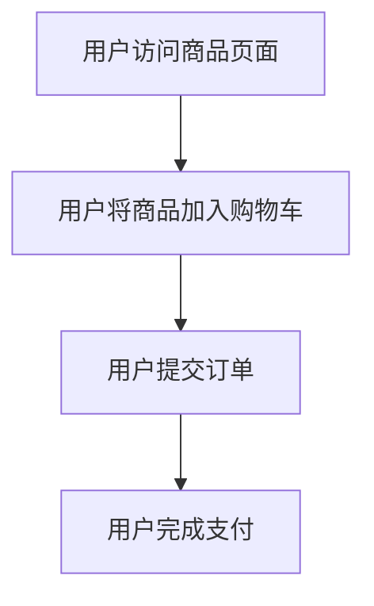
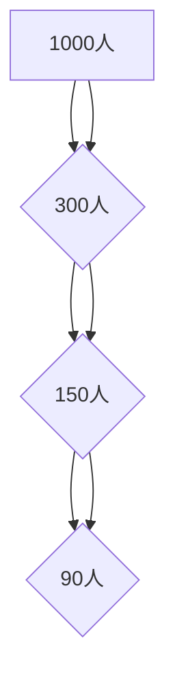
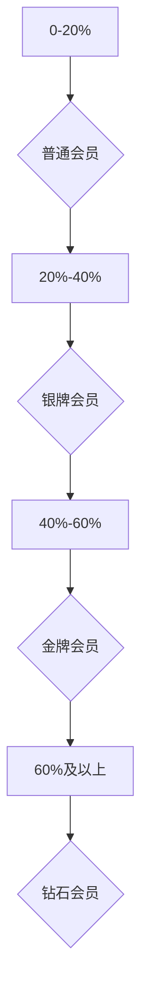
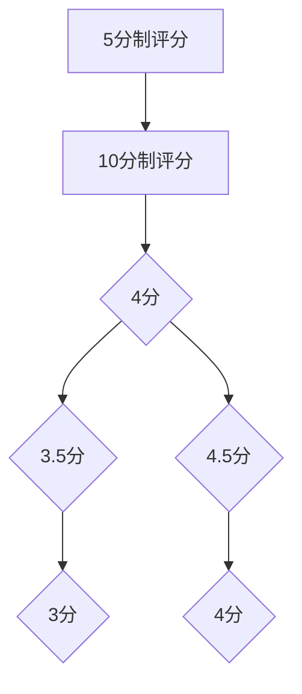

                 

### 引言

在当今快速发展的电商行业中，会员经济已经成为各大电商平台争夺市场份额的重要手段之一。随着消费者需求的不断变化，传统的会员等级划分策略已难以满足个性化、精准化营销的需求。为了在激烈的市场竞争中脱颖而出，越来越多的电商平台开始探索AI驱动的个性化会员等级策略。

AI驱动的个性化会员等级策略，是指通过人工智能技术对会员行为、偏好和需求进行分析，从而制定出更加精细、个性化的会员等级划分和权益设计。这不仅有助于提升会员的忠诚度和满意度，还可以为电商平台带来更高的商业价值。

本文将从以下几个方面对AI驱动的电商平台个性化会员等级策略进行探讨：

1. **电商平台与会员经济概述**：介绍电商平台的现状与发展趋势，以及会员经济的重要性。
2. **人工智能与会员个性化**：讨论人工智能在电商平台中的应用，以及如何通过会员数据分析实现个性化服务。
3. **AI驱动的会员等级策略设计**：详细分析会员等级划分的算法与模型，以及会员等级的动态调整策略和会员权益设计与优化。
4. **项目实践与案例分析**：通过具体案例，展示AI驱动的会员等级策略在电商平台中的实际应用效果。
5. **评估与优化**：介绍如何评估和优化AI驱动的会员等级策略。
6. **未来展望与挑战**：探讨AI驱动的会员等级策略的未来发展趋势和面临的挑战。

通过本文的探讨，希望能够为电商平台的会员等级策略提供一些新的思路和借鉴，从而实现商业价值的最大化。

### 关键词

- 电商平台
- 会员经济
- 人工智能
- 个性化服务
- 会员等级策略
- 数据分析
- 成长值模型
- 漏斗模型
- 评分模型
- 动态调整策略
- 会员权益设计
- 实践案例

### 摘要

本文探讨了AI驱动的电商平台个性化会员等级策略。首先，我们介绍了电商平台的发展现状和会员经济的重要性。然后，分析了人工智能在电商平台中的应用，以及如何通过会员数据分析实现个性化服务。接着，详细讨论了会员等级划分的算法与模型，包括成长值模型、漏斗模型和评分模型，并阐述了会员等级的动态调整策略和会员权益设计与优化。通过具体案例展示，我们分析了AI驱动的会员等级策略在电商平台中的实际应用效果，并提出了评估与优化的方法。最后，我们对AI驱动的会员等级策略的未来发展趋势和面临的挑战进行了展望。通过本文的研究，希望能够为电商平台提供一种有效的个性化会员等级策略，提升会员的忠诚度和满意度，实现商业价值的最大化。

### 电商平台与会员经济概述

电商平台作为现代电子商务的核心载体，经历了从简单网上商店到复杂交易平台的演变。其发展历程可以追溯到20世纪90年代末，随着互联网的普及，电子商务逐渐兴起。早期的电商平台主要以提供在线商品销售服务为主，如Amazon、eBay等。随着技术的进步和市场需求的增长，电商平台逐渐拓展了其业务范围，开始提供包括支付、物流、售后服务等一站式服务，形成了较为完整的电子商务生态系统。

#### 1.1.1 电商平台的发展历程

电商平台的演进大致可以分为以下几个阶段：

1. **起步阶段**（1990s-2000s初期）：这一阶段的主要特点是电商平台刚刚起步，市场规模较小，功能相对简单，主要以提供在线商品销售为主。代表性的平台有Amazon、eBay等。

2. **发展阶段**（2000s中期-2010s初期）：随着互联网的普及和移动互联网的兴起，电商平台迎来了快速发展期。这一阶段，电商平台不仅提供商品销售服务，还开始涉足支付、物流等领域，逐渐形成了较为完整的电子商务生态系统。代表性的平台有淘宝、京东等。

3. **多元化阶段**（2010s中期至今）：随着人工智能、大数据等新兴技术的应用，电商平台开始实现个性化推荐、精准营销等功能，进一步提升用户体验。同时，电商平台也在不断拓展业务范围，涉足金融、物流、内容等领域，实现多元化发展。

#### 1.1.2 电商平台的主要业务模式

电商平台的主要业务模式可以分为以下几种：

1. **C2C模式**（Consumer to Consumer）：这种模式以个人用户之间的商品交易为主，如eBay、淘宝等。平台提供交易撮合、支付、物流等服务，但商品和交易都由个人用户完成。

2. **B2C模式**（Business to Consumer）：这种模式以商家直接面向消费者销售商品为主，如Amazon、京东等。平台负责商品展示、支付、物流等环节，商家只需专注于商品的生产和销售。

3. **O2O模式**（Online to Offline）：这种模式结合线上和线下渠道，实现线上线下一体化运营，如美团、大众点评等。平台提供线上交易、线下消费的服务，通过线上线下的整合提升用户体验。

#### 1.1.3 会员经济的重要性

会员经济是指通过提供特定服务或权益，吸引消费者成为会员，从而实现持续收入和提升客户价值的一种商业模式。在电商平台中，会员经济具有以下重要性：

1. **提高用户粘性**：通过提供会员专享的优惠、福利和特权，增强用户对平台的忠诚度和依赖性，提高用户留存率。

2. **提升客户价值**：会员制度可以促使消费者增加购买频次和消费金额，从而提升客户的整体价值。

3. **实现差异化竞争**：通过会员等级划分和个性化服务，电商平台可以在竞争中脱颖而出，吸引更多的优质客户。

4. **数据积累与挖掘**：会员数据是电商平台的重要资产，通过对会员数据的分析，可以了解用户需求和行为，为优化产品和服务提供依据。

综上所述，电商平台在经历了快速发展的历程后，已经形成了多元化的业务模式。会员经济作为电商平台提升竞争力的重要手段，具有重要的战略意义。在接下来的内容中，我们将进一步探讨如何通过人工智能技术实现会员等级的个性化划分和权益设计。

### 个性化会员等级的概念与价值

在电商平台中，个性化会员等级是指通过人工智能技术对会员的消费行为、购买偏好、互动行为等数据进行深入分析，从而制定出符合每个会员个性化需求的会员等级体系。这一体系不仅能够提高会员的满意度，还能够为电商平台带来显著的商业价值。

#### 1.2.1 个性化会员等级的定义

个性化会员等级的定义可以归纳为以下几点：

1. **基于数据的划分**：个性化会员等级的划分依赖于对会员数据的深入挖掘和分析，包括消费行为、购买偏好、互动行为等。通过这些数据，可以了解会员的个性化需求和潜在价值。

2. **动态调整**：个性化会员等级不是一成不变的，而是会根据会员的实时行为和表现进行动态调整。这种动态调整能力使得会员等级体系能够更好地适应会员的个性化需求。

3. **会员权益的差异化**：根据会员等级的不同，平台可以提供差异化、个性化的会员权益，如专属折扣、积分返利、特权服务等。这种差异化权益不仅能够提升会员的满意度，还可以增强会员对平台的忠诚度。

#### 1.2.2 个性化会员等级的价值

个性化会员等级对电商平台具有以下几个方面的价值：

1. **提高用户粘性**：通过提供符合会员个性化需求的权益和服务，可以增强会员对平台的依赖性和忠诚度，提高用户的留存率。

2. **提升客户价值**：个性化会员等级使得电商平台能够更好地了解会员的消费行为和偏好，从而提供更有针对性的产品和服务，提高会员的消费金额和频次。

3. **实现差异化竞争**：通过个性化会员等级和权益设计，电商平台可以在激烈的市场竞争中脱颖而出，吸引更多的优质客户。

4. **数据积累与挖掘**：个性化会员等级体系能够为电商平台积累大量的会员数据，这些数据可以用于后续的数据分析和营销策略制定，为电商平台的发展提供有力的支持。

5. **提高运营效率**：个性化会员等级策略能够帮助电商平台优化会员管理流程，降低运营成本。通过自动化和智能化的会员等级划分和权益管理，电商平台可以更高效地提供服务。

总之，个性化会员等级是电商平台实现精细化运营和提升竞争力的重要手段。通过人工智能技术对会员数据进行深入分析和应用，电商平台可以更好地满足会员的个性化需求，从而实现商业价值的最大化。

### 人工智能在电商中的应用

人工智能（AI）作为现代科技的代表性技术之一，正在深刻地改变电商行业的各个方面。从推荐系统到个性化营销，再到智能客服，AI技术在电商平台中的应用已经日益成熟，成为提升用户体验、增加商业价值的重要工具。

#### 2.1.1 人工智能的基本原理

人工智能的基本原理可以归纳为以下几个方面：

1. **机器学习**：通过数据驱动的方法，让计算机自动识别模式并进行预测或决策。常见的机器学习算法包括监督学习、无监督学习和强化学习。

2. **深度学习**：一种特殊的机器学习技术，通过模拟人脑的神经网络结构，实现对复杂数据的分析和处理。深度学习在图像识别、自然语言处理等领域具有显著优势。

3. **自然语言处理**：研究计算机如何理解和生成人类语言。自然语言处理技术广泛应用于智能客服、推荐系统等场景。

4. **计算机视觉**：通过图像处理和模式识别技术，使计算机能够理解、解析和识别图像内容。

5. **机器人技术**：利用人工智能技术构建的智能机器人，能够执行复杂任务，如智能客服、仓库管理机器人等。

#### 2.1.2 人工智能在电商平台的应用场景

1. **推荐系统**：通过分析用户的浏览历史、购买行为等数据，推荐用户可能感兴趣的商品。推荐系统是电商平台最重要的应用之一，能够显著提升用户购物体验和转化率。

2. **个性化营销**：基于用户数据，实现精准化营销。通过分析用户的行为、兴趣和需求，提供个性化的广告和促销活动，提高营销效果。

3. **智能客服**：利用自然语言处理和计算机视觉技术，智能客服能够理解用户的问题并给出合适的回答。智能客服不仅能够提高用户满意度，还能降低人工客服的工作负担。

4. **库存管理**：通过人工智能技术，电商平台可以实现对库存的智能分析和预测。这有助于优化库存水平，降低库存成本，提高运营效率。

5. **供应链优化**：利用人工智能技术，电商平台可以优化供应链管理，提高物流效率，降低物流成本。例如，通过预测用户需求，调整订单生产计划，减少库存积压。

6. **图像识别与搜索**：通过计算机视觉技术，电商平台可以实现商品的图像识别与搜索功能，用户可以通过上传图片来查找相似的物品。

7. **个性化用户体验**：通过分析用户行为和偏好，电商平台可以提供个性化的用户体验，如定制化的页面布局、推荐内容等，提升用户满意度。

综上所述，人工智能技术在电商平台中的应用不仅涵盖了推荐系统、个性化营销等核心领域，还扩展到了智能客服、库存管理、供应链优化等方方面面。通过人工智能技术的深度应用，电商平台能够实现更高效的运营、更精准的营销和更优质的用户体验，从而在激烈的市场竞争中脱颖而出。

### 会员数据的采集与分析

在AI驱动的电商平台个性化会员等级策略中，会员数据的采集与分析是关键环节。这一过程涉及数据的收集、清洗、存储、分析和可视化，最终目的是通过数据挖掘技术提取有用的信息，为个性化会员等级划分提供依据。

#### 2.2.1 会员数据采集

会员数据的采集主要包括以下几种途径：

1. **行为数据**：包括用户的浏览记录、购买行为、搜索关键词等。这些数据可以反映用户的兴趣和偏好，为个性化推荐和等级划分提供基础。

2. **社交数据**：如用户的社交网络活动、点赞、评论等。这些数据可以揭示用户的社会关系和兴趣爱好，有助于更全面地了解用户。

3. **反馈数据**：包括用户对产品、服务的评价、建议等。这些数据反映了用户对电商平台的整体满意度，有助于改进服务和提升用户体验。

4. **人口统计学数据**：如年龄、性别、地理位置、收入水平等。这些数据用于分类和分组，帮助电商平台了解不同群体的消费特征。

#### 2.2.2 数据清洗与存储

采集到的会员数据通常存在不完整、不一致、错误等问题，因此需要进行数据清洗。数据清洗的过程包括：

1. **缺失值处理**：对于缺失的数据，可以选择填充、删除或忽略。

2. **异常值处理**：识别并处理数据中的异常值，如异常的购买行为或浏览记录。

3. **数据格式转换**：确保数据格式统一，便于后续处理和分析。

清洗后的数据需要存储在数据仓库中，常用的存储方式包括关系型数据库、NoSQL数据库和数据湖。选择合适的存储方式可以确保数据的可靠性和可扩展性。

#### 2.2.3 数据分析

数据分析是会员数据应用的核心环节。通过以下几种技术，可以对会员数据进行分析：

1. **统计分析**：使用统计学方法，如描述性统计分析、回归分析、聚类分析等，了解会员的基本特征和消费行为。

2. **机器学习**：通过机器学习算法，如分类算法、聚类算法、关联规则挖掘等，识别会员的潜在特征和消费模式。

3. **数据可视化**：利用数据可视化工具，如图表、地图等，展示会员数据的分布、趋势和关系，帮助决策者直观地了解数据。

4. **情感分析**：通过自然语言处理技术，对用户的评价、评论等进行情感分析，了解用户对产品、服务的满意度。

#### 2.2.4 数据挖掘

数据挖掘是从大量数据中提取有价值信息的过程。在会员数据分析中，数据挖掘主要用于：

1. **用户细分**：根据会员的行为、偏好、需求等特征，将会员划分为不同的群体，为个性化推荐和服务提供基础。

2. **行为预测**：利用历史数据，预测会员未来的行为，如购买、流失等，帮助电商平台制定针对性的营销策略。

3. **关联分析**：发现会员行为中的关联关系，如哪些商品经常一起购买，哪些活动能够提高用户参与度等。

4. **推荐系统**：基于用户的兴趣和行为，推荐符合其需求的商品、活动和内容。

#### 2.2.5 数据分析在个性化会员等级中的应用

通过数据分析，电商平台可以制定出更加精准和个性化的会员等级划分策略。具体应用包括：

1. **动态等级划分**：根据会员的实时行为和数据分析结果，动态调整会员等级，确保等级划分的实时性和准确性。

2. **差异化权益设计**：为不同等级的会员提供差异化的权益，如专属折扣、积分返利、专属活动等，提升会员的满意度和忠诚度。

3. **个性化推荐**：根据会员的个性化需求和行为，提供个性化的商品推荐和活动推荐，提高用户的购物体验和转化率。

4. **精准营销**：基于会员的数据分析结果，实施精准的营销策略，提高营销效果和ROI。

总之，会员数据的采集与分析是AI驱动的电商平台个性化会员等级策略的基础。通过数据清洗、数据分析、数据挖掘等技术，电商平台可以深入了解会员的需求和行为，从而制定出更加精准和有效的会员等级划分和权益设计策略，实现商业价值的最大化。

### 会员行为的预测与分类

在AI驱动的电商平台中，对会员行为的预测与分类是实现个性化服务的重要步骤。通过分析会员的历史数据和实时行为，可以预测其未来的购买倾向、参与度等，从而进行精准的会员等级划分和权益设计。以下将详细讨论会员行为预测与分类的技术和方法。

#### 3.1.1 基于历史数据的预测模型

会员行为预测通常基于历史数据，包括用户的浏览记录、购买历史、搜索关键词等。以下是一些常用的预测模型：

1. **时间序列模型**：时间序列模型用于分析会员行为的时间变化趋势。常用的模型包括ARIMA（AutoRegressive Integrated Moving Average）模型和LSTM（Long Short-Term Memory）模型。

   - **ARIMA模型**：ARIMA模型是一个自回归积分滑动平均模型，能够处理非平稳时间序列数据。其基本思想是将时间序列分解为趋势、季节性和残差部分，然后分别建模。

     ```latex
     \text{ARIMA}(p, d, q) = c + \phi_1 X_{t-1} + \phi_2 X_{t-2} + \ldots + \phi_p X_{t-p} + \theta_1 \varepsilon_{t-1} + \theta_2 \varepsilon_{t-2} + \ldots + \theta_q \varepsilon_{t-q}
     ```

     其中，\(p\)、\(d\)、\(q\)分别代表自回归项、差分项和移动平均项的阶数，\(X_{t}\)为时间序列值，\(\varepsilon_{t}\)为白噪声。

   - **LSTM模型**：LSTM模型是一种特殊的循环神经网络（RNN），能够有效地捕捉时间序列中的长期依赖关系。其核心结构包括输入门、遗忘门和输出门，这些门控单元能够灵活地控制信息的传递和遗忘。

     ```mermaid
     graph TD
     A[Input Gate] --> B{Forget Gate}
     B --> C{Output Gate}
     D[Cell State] --> B
     C --> E{New Cell State}
     ```

2. **机器学习分类模型**：机器学习分类模型用于将会员行为划分为不同的类别。常见的分类模型包括逻辑回归、决策树、随机森林、支持向量机等。

   - **逻辑回归**：逻辑回归是一种广义线性模型，用于预测会员行为的概率。其数学公式如下：

     ```latex
     \text{logit}(P) = \ln\left(\frac{P}{1 - P}\right) = \beta_0 + \beta_1 x_1 + \beta_2 x_2 + \ldots + \beta_n x_n
     ```

     其中，\(P\)为事件发生的概率，\(\beta_0\)、\(\beta_1\)、\(\beta_2\)、...、\(\beta_n\)为模型参数，\(x_1\)、\(x_2\)、...、\(x_n\)为特征值。

   - **决策树**：决策树通过一系列判断规则将数据集划分为不同的类别。每个节点代表一个特征，每个分支代表一个特征取值，叶节点代表最终的类别。

     ```mermaid
     graph TD
     A(会员行为预测) --> B(浏览记录)
     B -->|<10次以下| C{购买行为}
     B -->|>=10次| D{浏览时长}
     C --> E{购买频率}
     D --> F{购买金额}
     ```

3. **神经网络模型**：神经网络模型，尤其是深度神经网络（DNN），在会员行为预测中具有显著优势。DNN通过多层神经网络结构捕捉复杂数据特征，提高预测精度。

   - **深度神经网络**：深度神经网络包括输入层、隐藏层和输出层。每个隐藏层都能对输入数据进行非线性变换，从而提取出更高层次的特征。

     ```mermaid
     graph TD
     A[Input Layer] --> B{Hidden Layer 1}
     B --> C{Hidden Layer 2}
     C --> D{Output Layer}
     ```

#### 3.1.2 实时行为分类

除了历史数据，实时行为数据在会员分类中也发挥着重要作用。实时行为数据包括用户的当前浏览行为、点击行为、聊天记录等。以下是一些实时行为分类的方法：

1. **基于规则的实时分类**：通过预设的规则对实时行为进行分类。这种方法简单高效，适用于行为模式较为固定的场景。

2. **实时机器学习模型**：利用在线学习算法，如在线支持向量机（SVM）和在线随机森林（Online Random Forest），对实时数据进行分析和分类。这种方法能够快速响应数据变化，但可能面临模型复杂度和计算资源限制。

3. **实时神经网络**：利用卷积神经网络（CNN）和循环神经网络（RNN）等深度学习模型，对实时数据进行处理和分类。这种方法能够捕捉实时数据的动态变化，提高分类精度。

#### 3.1.3 跨渠道行为预测

在多渠道营销环境中，会员的跨渠道行为预测成为个性化会员等级划分的重要任务。跨渠道行为预测需要综合考虑用户在不同渠道的行为数据，以下是一些关键步骤：

1. **渠道数据集成**：将不同渠道的数据进行集成，统一处理和存储。

2. **行为特征提取**：从不同渠道的数据中提取共同的和独特的特征，如浏览时长、点击率、购买金额等。

3. **行为模式识别**：通过聚类分析、关联规则挖掘等方法，识别用户在不同渠道的行为模式。

4. **跨渠道预测模型**：构建跨渠道预测模型，如多输入多输出的深度神经网络，综合分析用户在各个渠道的行为。

   ```mermaid
   graph TD
   A[Input Layer] --> B{Channel 1 Features}
   B --> C{Channel 2 Features}
   C --> D{Output Layer}
   ```

通过以上步骤，电商平台可以实现精准的会员行为预测与分类，从而为个性化会员等级划分提供有力支持。

### 个性化推荐系统

个性化推荐系统是电商平台实现精准营销和提升用户体验的核心技术之一。通过分析用户的历史行为、偏好和实时互动，推荐系统可以为用户提供个性化的商品、活动和内容推荐，从而提高用户满意度和转化率。

#### 3.2.1 推荐系统的基本原理

个性化推荐系统的基本原理可以概括为以下几个步骤：

1. **数据采集**：收集用户在平台上的行为数据，包括浏览记录、购买历史、搜索关键词、评价和反馈等。这些数据是构建推荐模型的基础。

2. **数据预处理**：对采集到的数据进行清洗、去噪和格式转换，确保数据的质量和一致性。数据预处理还包括特征提取，如用户行为序列、商品特征等。

3. **用户建模**：通过机器学习算法对用户行为数据进行分析，构建用户画像和偏好模型。常用的用户建模方法包括基于内容的推荐、协同过滤和基于模型的推荐等。

4. **推荐算法**：根据用户画像和偏好模型，生成个性化推荐结果。推荐算法的目标是最大化推荐系统的召回率和准确率。

5. **推荐结果呈现**：将推荐结果呈现给用户，可以通过推荐页面、邮件、短信等方式。推荐结果需要不断优化，以提升用户满意度和转化率。

#### 3.2.2 个性化推荐系统的算法

个性化推荐系统主要分为以下几种类型：

1. **基于内容的推荐**：基于内容的推荐（Content-Based Recommendation）通过分析用户对某一商品的偏好，推荐具有相似内容的商品。这种方法适用于新用户或者用户历史行为较少的情况。

   - **算法原理**：通过文本挖掘和特征提取技术，提取商品的特征向量，然后计算用户和商品之间的相似度，推荐相似度较高的商品。

   - **算法实现**：
     ```python
     # 计算商品相似度
     similarity = cosine_similarity(user_profile, item_profile)

     # 推荐相似度最高的商品
     recommended_items = argsort(similarity)[::-1][:k]
     ```

2. **协同过滤推荐**：协同过滤推荐（Collaborative Filtering Recommendation）通过分析用户之间的行为关系，推荐用户可能喜欢的商品。这种方法适用于有大量用户行为数据的情况。

   - **算法原理**：基于用户评分矩阵，通过矩阵分解、最近邻算法等，找出用户之间的相似度，推荐其他相似用户喜欢的商品。

   - **算法实现**：
     ```python
     # 用户相似度计算
     similarity_matrix = calculate_similarity(user_rating_matrix)

     # 最近邻算法推荐
     neighbors = get_neighbors(similarity_matrix, user_index)
     recommended_items = aggregate_ratings(neighbors, item_rating_matrix)
     ```

3. **基于模型的推荐**：基于模型的推荐（Model-Based Recommendation）通过构建用户和商品之间的预测模型，推荐用户可能喜欢的商品。这种方法适用于需要高精度推荐的情况。

   - **算法原理**：利用机器学习算法，如线性回归、决策树、神经网络等，建立用户和商品之间的预测模型，通过模型预测用户对商品的评分或概率，推荐高评分或高概率的商品。

   - **算法实现**：
     ```python
     # 构建预测模型
     model = train_predictive_model(user_data, item_data)

     # 预测用户评分
     predicted_ratings = model.predict(user_profile, item_profile)

     # 推荐高评分商品
     recommended_items = argsort(predicted_ratings)[::-1][:k]
     ```

#### 3.2.3 个性化推荐系统的实现步骤

个性化推荐系统的实现可以分为以下几个步骤：

1. **需求分析**：明确推荐系统的目标和需求，如提升用户满意度、提高转化率、降低用户流失率等。

2. **数据采集**：从电商平台的后台系统中采集用户行为数据，包括浏览记录、购买历史、搜索关键词、评价和反馈等。

3. **数据预处理**：对采集到的数据进行清洗、去噪和格式转换，确保数据的质量和一致性。提取用户和商品的特征，如用户偏好、商品属性等。

4. **用户建模**：利用机器学习算法，如协同过滤、矩阵分解、深度学习等，构建用户画像和偏好模型。

5. **推荐算法实现**：根据用户画像和偏好模型，实现个性化推荐算法，如基于内容的推荐、协同过滤推荐、基于模型的推荐等。

6. **推荐结果评估**：通过指标如准确率、召回率、覆盖率等，评估推荐系统的效果，不断优化推荐算法。

7. **推荐结果呈现**：将推荐结果通过网页、邮件、短信等方式呈现给用户，提供个性化的购物体验。

8. **系统维护和更新**：定期更新用户数据和推荐算法，确保推荐系统的实时性和准确性。

通过以上步骤，电商平台可以实现高效、精准的个性化推荐系统，提升用户的购物体验和平台的竞争力。

### 会员等级划分的算法与模型

在AI驱动的电商平台中，会员等级的划分是提升用户体验和实现精准营销的关键环节。会员等级划分的算法与模型不仅需要基于用户行为和偏好数据，还要具备灵活性和动态调整能力，以满足不断变化的商业需求。以下将详细介绍几种常见的会员等级划分算法与模型。

#### 3.1 成长值模型

成长值模型（Growth Value Model）是一种基于用户行为积累值的会员等级划分方法。该模型通过统计用户在平台上的各项行为，如购买次数、消费金额、互动频次等，计算出一个综合的成长值，并根据成长值的高低将用户划分为不同的等级。

**算法原理**：

- **成长值计算**：成长值通常是各项行为的加权求和。不同的行为赋予不同的权重，如购买金额权重高，互动频次权重低。

  ```latex
  GrowthValue = w1 \times PurchaseAmount + w2 \times NumberOfPurchases + w3 \times InteractionFrequency + ...
  ```

  其中，\(w1\)、\(w2\)、\(w3\)等为权重。

- **等级划分**：根据成长值的范围，设定不同的会员等级和对应的权益。

  ```mermaid
  graph TD
  A[0-100] --> B{普通会员}
  B --> C{200-500} 
  C --> D{银牌会员}
  D --> E{800-1500} 
  E --> F{金牌会员}
  ```

**实现步骤**：

1. **数据采集**：收集用户在平台上的各项行为数据，如购买金额、购买次数、互动频次等。
2. **权重设定**：根据平台策略和用户行为的重要性，设定各项行为的权重。
3. **计算成长值**：利用设定的权重计算每个用户的成长值。
4. **等级划分**：根据成长值的范围，将用户划分为不同的会员等级。

#### 3.2 漏斗模型

漏斗模型（Funnel Model）是一种基于用户行为路径和转化率的会员等级划分方法。漏斗模型将用户的行为路径划分为多个阶段，每个阶段的转化率决定了用户的会员等级。

**算法原理**：

- **漏斗阶段划分**：根据用户在平台上的行为路径，将用户划分为多个阶段，如浏览、加入购物车、下单、支付等。
- **转化率计算**：计算每个阶段的转化率，如从浏览到加入购物车的转化率、从下单到支付的转化率等。
- **等级划分**：根据每个阶段的转化率，设定不同的会员等级和对应的权益。

  ```mermaid
  graph TD
  A[浏览] --> B[加入购物车]
  B --> C[下单]
  C --> D[支付]
  D -->|高转化率| E{黄金会员}
  D -->|中等转化率| F{白金会员}
  D -->|低转化率| G{普通会员}
  ```

**实现步骤**：

1. **数据采集**：收集用户在平台上的行为路径数据，如浏览、加入购物车、下单、支付等。
2. **转化率计算**：计算每个阶段的行为转化率。
3. **等级划分**：根据转化率的高低，将用户划分为不同的会员等级。

#### 3.3 评分模型

评分模型（Rating Model）是一种基于用户评分和反馈的会员等级划分方法。评分模型通过分析用户对商品、服务、活动的评分和反馈，评估用户的满意度，从而进行会员等级划分。

**算法原理**：

- **评分计算**：计算用户在平台上的总体评分或平均评分。
- **反馈分析**：分析用户对商品、服务、活动的反馈，如好评率、投诉率等。
- **等级划分**：根据评分和反馈的结果，设定不同的会员等级和对应的权益。

  ```mermaid
  graph TD
  A[0-3分] --> B{普通会员}
  B --> C[3-4分] 
  C --> D{银牌会员}
  D --> E[4-5分] 
  E --> F{金牌会员}
  ```

**实现步骤**：

1. **数据采集**：收集用户在平台上的评分和反馈数据。
2. **评分计算**：计算用户的总体评分或平均评分。
3. **反馈分析**：分析用户的反馈，如好评率、投诉率等。
4. **等级划分**：根据评分和反馈的结果，将用户划分为不同的会员等级。

#### 模型对比与适用场景

- **成长值模型**：适用于注重用户行为积累和长期价值的电商平台，如购物、游戏等。该模型能够激励用户持续活跃，提升用户忠诚度。
- **漏斗模型**：适用于需要关注用户转化路径和转化效率的电商平台，如电商促销、广告投放等。该模型能够帮助平台优化用户转化策略，提升转化率。
- **评分模型**：适用于注重用户满意度和服务质量反馈的电商平台，如酒店、餐饮等。该模型能够通过用户的评分和反馈，提升用户满意度和品牌口碑。

综上所述，不同的会员等级划分算法和模型各有优劣，适用于不同的商业场景。电商平台可以根据自身特点和目标，选择合适的会员等级划分方法，实现个性化服务，提升用户满意度和商业价值。

### 成长值模型的原理

成长值模型（Growth Value Model）是一种基于用户行为积累的综合评估方法，通过计算用户的各项行为得分，最终形成一个综合的成长值，以此作为会员等级划分的依据。成长值模型的核心在于通过行为得分权重设计，实现对用户不同行为的公平且有效的量化评估。以下将详细介绍成长值模型的原理及其实现方法。

#### 4.1 成长值模型的原理

成长值模型的基本思想是将用户在平台上的各项行为转化为相应的得分，通过对不同行为的加权求和，得到一个综合的成长值。成长值的计算公式可以表示为：

\[ \text{GrowthValue} = w1 \times \text{PurchaseAmount} + w2 \times \text{NumberOfPurchases} + w3 \times \text{InteractionFrequency} + ... \]

其中：
- \( \text{GrowthValue} \) 表示用户的综合成长值；
- \( w1, w2, w3, ... \) 分别为各项行为的权重，表示不同行为对成长值的贡献程度；
- \( \text{PurchaseAmount} \)、\( \text{NumberOfPurchases} \)、\( \text{InteractionFrequency} \) 分别表示用户的购买金额、购买次数、互动频次等行为得分。

成长值模型的核心在于行为权重的设定。合理的权重分配能够确保模型公正地反映用户行为的重要性，同时激励用户参与更多有益于平台发展的行为。例如，购买金额通常赋予较高的权重，因为高消费用户对平台的价值较大；而互动频次可能赋予较低权重，以鼓励用户保持活跃度而非仅仅追求消费。

#### 4.2 成长值模型的实现

成长值模型的实现主要包括以下几个步骤：

1. **行为数据采集**：首先，需要采集用户在平台上的各项行为数据，如购买金额、购买次数、互动频次、浏览时长、评价数量等。

2. **权重设定**：根据平台业务策略和目标，设定各项行为的权重。权重设定需要考虑以下因素：
   - 行为的重要性：高消费行为通常赋予更高的权重；
   - 行为的可量化性：可量化的行为（如购买金额）容易设定权重；
   - 行为的激励效果：鼓励用户参与的行为应赋予较高权重。

3. **行为得分计算**：根据设定的权重，计算用户每项行为的得分。例如，购买金额的得分可以表示为：

   \[ \text{Score}_{\text{PurchaseAmount}} = \text{PurchaseAmount} \times w1 \]

   其他行为类似计算。

4. **成长值计算**：将各项行为的得分加权求和，得到用户的综合成长值：

   \[ \text{GrowthValue} = \sum_{i=1}^{n} (\text{Score}_{i} \times wi) \]

   其中，\( n \) 为行为的总数。

5. **等级划分**：根据成长值的范围，设定不同的会员等级。例如：

   | 成长值范围 | 会员等级 |
   | :----: | :----: |
   | 0-100 | 普通会员 |
   | 101-500 | 银牌会员 |
   | 501-1000 | 金牌会员 |
   | 1001及以上 | 钻石会员 |

#### 4.3 实现案例

假设一个电商平台设定了以下权重：

- 购买金额：权重为0.7
- 购买次数：权重为0.2
- 互动频次：权重为0.1

现有用户A的行为数据如下：

- 购买金额：2000元
- 购买次数：3次
- 互动频次：10次

根据上述权重，计算用户A的成长值：

\[ \text{GrowthValue}_{A} = 2000 \times 0.7 + 3 \times 0.2 + 10 \times 0.1 = 1400 + 0.6 + 1 = 1401.6 \]

根据设定的成长值范围，用户A属于金牌会员。

通过以上步骤，电商平台可以有效地利用成长值模型对会员进行等级划分，激励用户积极参与，提升用户忠诚度和平台活跃度。

### 漏斗模型的原理

漏斗模型（Funnel Model）是一种用于分析用户行为路径和转化效率的方法，它在电商平台的会员等级划分中具有重要作用。漏斗模型通过将用户行为路径划分为多个阶段，并计算每个阶段的转化率，从而评估用户的参与度和购买潜力，为会员等级的划分提供依据。

#### 4.1 漏斗模型的原理

漏斗模型的基本原理是将用户在电商平台上的行为路径视作一个漏斗，漏斗的每个阶段代表用户在特定操作上的转化过程。常见的用户行为路径包括浏览、加入购物车、下单、支付等。漏斗模型通过以下步骤实现：

1. **行为路径划分**：根据用户在平台上的操作行为，将整个路径划分为多个阶段。例如，可以将用户行为路径划分为浏览、加入购物车、下单、支付四个阶段。

2. **转化率计算**：计算每个阶段的转化率。转化率表示从当前阶段到下一阶段的用户比例。例如，从浏览到加入购物车的转化率可以表示为：

   \[ \text{Conversion Rate}_{\text{Browse to Cart}} = \frac{\text{从浏览进入购物车的用户数}}{\text{浏览的用户数}} \]

3. **会员等级划分**：根据每个阶段的转化率，设定不同的会员等级。通常，高转化率的阶段对应的会员等级较高，表示用户具有较高的参与度和购买潜力。

#### 4.2 漏斗模型在会员等级划分中的应用

漏斗模型在会员等级划分中的应用主要包括以下几个步骤：

1. **数据采集**：收集用户在平台上的行为数据，如浏览、加入购物车、下单、支付等。

2. **转化率计算**：计算每个阶段的行为转化率。例如，计算从浏览到加入购物车的转化率：

   \[ \text{Conversion Rate}_{\text{Browse to Cart}} = \frac{\text{加入购物车的用户数}}{\text{浏览的用户数}} \]

3. **等级划分**：根据转化率的高低，将用户划分为不同的会员等级。例如，可以将转化率高的阶段对应的会员等级设置为“金牌会员”，转化率较低的阶段设置为“普通会员”。

4. **动态调整**：根据平台运营策略和市场环境的变化，定期调整会员等级划分标准，以保持会员等级体系的实时性和有效性。

#### 4.3 漏斗模型的实现步骤

漏斗模型的实现可以分为以下步骤：

1. **数据预处理**：对采集到的用户行为数据进行分析和清洗，去除无效数据。

2. **行为路径划分**：根据用户行为数据，将用户行为路径划分为多个阶段。

3. **计算转化率**：根据每个阶段的行为数据，计算转化率。可以使用以下公式：

   \[ \text{Conversion Rate} = \frac{\text{成功完成阶段} 的用户数}{\text{进入该阶段的用户数}} \]

4. **等级划分**：根据计算得到的转化率，设定不同的会员等级。可以使用分段函数或阈值划分方法，将用户划分为不同等级。

5. **模型优化**：根据平台运营数据，定期评估和调整会员等级划分标准，优化模型性能。

#### 4.4 漏斗模型的优势

漏斗模型在会员等级划分中具有以下优势：

1. **直观性**：漏斗模型能够清晰地展示用户行为的转化路径，帮助平台了解用户的参与度和购买潜力。

2. **动态调整**：漏斗模型可以根据用户行为数据和平台运营策略，动态调整会员等级划分标准，适应市场变化。

3. **针对性**：通过分析不同阶段的转化率，平台可以为不同等级的会员提供针对性的服务和权益，提升用户体验和忠诚度。

4. **数据驱动**：漏斗模型基于用户行为数据进行划分，具有数据驱动的特点，能够更加客观和科学地评估会员等级。

总之，漏斗模型在电商平台会员等级划分中具有重要作用，通过分析用户行为路径和转化率，可以实现对会员的精准划分和有效管理，从而提升用户满意度和平台商业价值。

### 漏斗模型的实现

在电商平台中，漏斗模型是一种有效的分析工具，用于评估用户在整个购买流程中的参与度和转化率。通过具体步骤来实现漏斗模型，可以帮助企业更好地理解用户行为，优化用户体验，并制定相应的会员等级策略。以下将详细描述漏斗模型的实现过程，包括数据采集、转化率计算和会员等级划分。

#### 5.1 数据采集

数据采集是漏斗模型实现的第一步，需要收集用户在电商平台上的各类行为数据。这些数据通常包括：

- **浏览行为**：用户访问的页面、停留时间、页面跳转路径等。
- **购物车行为**：用户将商品添加到购物车的数量、频次、商品种类等。
- **下单行为**：用户提交订单的数量、订单金额、订单成功率等。
- **支付行为**：用户完成支付的成功率、支付方式、支付时间等。

以下是一个简单的数据采集示例：



#### 5.2 转化率计算

转化率是漏斗模型的核心指标，表示用户从当前阶段到下一阶段的成功率。计算转化率的方法如下：

1. **确定漏斗阶段**：根据电商平台的特点，将用户行为路径划分为多个阶段，例如浏览、购物车、下单和支付。
2. **计算每个阶段的用户数**：统计每个阶段的独立用户数。
3. **计算每个阶段的转化率**：使用以下公式计算每个阶段的转化率：

   \[ \text{转化率} = \frac{\text{下一阶段的用户数}}{\text{当前阶段的用户数}} \]

   例如，计算从浏览到购物车的转化率：

   \[ \text{转化率}_{\text{Browse to Cart}} = \frac{\text{将商品加入购物车的用户数}}{\text{访问商品页面的用户数}} \]

以下是一个具体的转化率计算示例：



根据上述数据，计算各阶段的转化率：

- 浏览到购物车转化率：\( \frac{300}{1000} = 30\% \)
- 购物车到订单转化率：\( \frac{150}{300} = 50\% \)
- 订单到支付转化率：\( \frac{90}{150} = 60\% \)

#### 5.3 会员等级划分

根据转化率计算结果，可以将用户划分为不同的会员等级，以提供差异化的服务和权益。以下是一个示例：

| 转化率范围 | 会员等级 | 权益 |
| :---: | :---: | :---: |
| 0-20% | 普通会员 | 标准优惠 |
| 20%-40% | 银牌会员 | 专属折扣 |
| 40%-60% | 金牌会员 | 超值礼包 |
| 60%及以上 | 钻石会员 | 高级服务 |

根据示例，可以将转化率较低的普通会员提供标准优惠，转化率较高的钻石会员提供高级服务。以下是一个会员等级划分的示例：



#### 5.4 实现步骤

1. **数据采集**：使用日志、数据分析工具或API等方式收集用户行为数据。
2. **数据清洗**：处理缺失值、异常值，确保数据质量。
3. **转化率计算**：根据漏斗阶段，计算每个阶段的转化率。
4. **等级划分**：根据转化率范围，划分会员等级，并设置相应的权益。
5. **模型优化**：定期评估和调整模型，以适应业务变化。

通过以上步骤，电商平台可以实现漏斗模型，并根据转化率划分会员等级，从而提供个性化服务，提升用户体验和忠诚度。

### 评分模型的原理

评分模型（Rating Model）是一种通过分析用户对商品、服务或活动的评分和反馈来评估用户满意度和会员等级的方法。这种模型的核心在于利用用户生成的评分数据，结合其他用户行为数据，构建一个综合的评估体系，以实现精准的会员等级划分。以下将详细介绍评分模型的原理及其实现方法。

#### 4.1 评分模型的原理

评分模型的基本原理是通过以下步骤实现对用户的综合评估：

1. **评分收集**：首先，需要收集用户对商品、服务或活动的评分数据。这些评分通常采用星号、分数等形式，如1-5星或1-10分的评分系统。

2. **评分计算**：将用户的评分转换为可量化的数值，通常使用平均评分或加权评分的方法。平均评分是将所有评分求和后除以评分次数，加权评分则是根据不同评分的重要程度对评分进行加权处理。

   - **平均评分**：
     \[ \text{AverageRating} = \frac{\sum_{i=1}^{n} \text{Rating}_{i}}{n} \]
     
     其中，\( \text{Rating}_{i} \) 是第 \(i\) 次评分，\( n \) 是评分次数。

   - **加权评分**：
     \[ \text{WeightedRating} = w1 \times \text{Rating}_{1} + w2 \times \text{Rating}_{2} + ... + w_n \times \text{Rating}_{n} \]
     
     其中，\( w1, w2, ..., w_n \) 是权重值，用于表示不同评分的重要性。

3. **反馈分析**：除了评分，用户还可能提供其他形式的反馈，如评论、推荐等。这些反馈同样可以用于评估用户满意度，并通过情感分析等技术转换为数值。

4. **综合评分**：将评分和反馈数据结合起来，计算一个综合评分值。综合评分值可以作为会员等级划分的依据。

5. **等级划分**：根据综合评分值，设定不同的会员等级和对应的权益。通常，高评分值对应的会员等级较高，享受更多的权益。

#### 4.2 评分模型的实现

评分模型的实现可以分为以下几个步骤：

1. **数据采集**：收集用户在平台上的评分和反馈数据。这些数据可以通过用户评价、评论、推荐等形式获取。

2. **评分转换**：将用户的评分数据转换为统一的数值形式。对于简单的平均评分，可以直接计算平均分；对于加权评分，需要根据评分的重要性设定权重。

3. **综合评分计算**：将评分和反馈数据结合起来，计算一个综合评分值。可以采用以下公式：

   \[ \text{CompositeRating} = \text{AverageRating} + w1 \times \text{Feedback}_{1} + w2 \times \text{Feedback}_{2} + ... + w_n \times \text{Feedback}_{n} \]
   
   其中，\( \text{AverageRating} \) 是平均评分，\( \text{Feedback}_{1}, \text{Feedback}_{2}, ..., \text{Feedback}_{n} \) 是不同形式的用户反馈，\( w1, w2, ..., w_n \) 是权重值。

4. **等级划分**：根据综合评分值，设定不同的会员等级。可以使用分段函数或阈值划分方法，将用户划分为不同等级。例如：

   | 综合评分范围 | 会员等级 | 权益 |
   | :---: | :---: | :---: |
   | 0-3分 | 普通会员 | 标准服务 |
   | 3.1-4分 | 银牌会员 | 专属折扣 |
   | 4.1-5分 | 金牌会员 | 超值服务 |

5. **动态调整**：根据平台运营数据和市场反馈，定期评估和调整会员等级划分标准，以保持会员等级体系的实时性和有效性。

#### 4.3 评分模型的优势

评分模型在会员等级划分中具有以下优势：

1. **客观性**：评分模型基于用户生成的大数据，客观反映了用户满意度，减少了主观偏见。
2. **实时性**：评分模型能够实时收集和分析用户反馈，动态调整会员等级，适应市场变化。
3. **公平性**：评分模型通过综合评分计算，确保了不同评分和反馈的公平性，避免了单一评分指标的不公平性。
4. **数据驱动**：评分模型基于用户行为数据，具有数据驱动特点，能够更加科学地评估会员等级。

综上所述，评分模型是一种有效的会员等级划分方法，通过分析用户评分和反馈，可以实现对会员的精准评估和等级划分，提升用户体验和平台竞争力。

### 评分模型的实现

评分模型在电商平台会员等级划分中的应用，可以通过以下具体步骤实现：

#### 5.1 数据采集

首先，需要收集用户在平台上的各项评分和反馈数据。这些数据通常包括：

- **评分数据**：用户对商品、服务、活动的评分，如5分制或10分制。
- **反馈数据**：用户对商品、服务、活动的评论、评价等，可以是文字、图片或视频。

以下是一个简单的评分数据示例：

| 用户ID | 商品ID | 评分 | 评论 |
| :---: | :---: | :---: | :---: |
| 1 | 101 | 4 | “商品质量很好” |
| 2 | 102 | 5 | “物流很快” |
| 3 | 101 | 3 | “价格稍高” |

#### 5.2 数据预处理

在计算评分之前，需要对数据进行预处理。预处理步骤包括：

- **评分标准化**：将不同评分范围（如5分制和10分制）统一为相同范围，例如0-10分。
- **评论情感分析**：通过自然语言处理技术，对用户的评论进行情感分析，将其转换为数值。例如，正面评论得1分，中性评论得0分，负面评论得-1分。

以下是一个评分标准化的示例：



#### 5.3 计算综合评分

综合评分是评分模型的核心。综合评分可以通过以下公式计算：

\[ \text{CompositeRating} = \frac{\sum_{i=1}^{n} (\text{Rating}_{i} \times w_i)}{n} + \sum_{i=1}^{n} (\text{Feedback}_{i} \times f_i) \]

其中：

- \( \text{Rating}_{i} \) 是第 \(i\) 项评分；
- \( w_i \) 是第 \(i\) 项评分的权重；
- \( \text{Feedback}_{i} \) 是第 \(i\) 项评论的情感得分；
- \( f_i \) 是第 \(i\) 项评论的权重。

以下是一个综合评分计算的示例：

| 用户ID | 商品ID | 评分 | 评分权重 | 评论 | 评论权重 |
| :---: | :---: | :---: | :---: | :---: | :---: |
| 1 | 101 | 4 | 0.5 | 1 | 0.3 |
| 2 | 102 | 5 | 0.5 | 1 | 0.3 |
| 3 | 101 | 3 | 0.5 | -1 | 0.2 |

综合评分计算如下：

\[ \text{CompositeRating} = \frac{(4 \times 0.5) + (5 \times 0.5)}{2} + (1 \times 0.3) + (-1 \times 0.2) = 4.1 \]

#### 5.4 等级划分

根据综合评分，可以将用户划分为不同的会员等级。以下是一个简单的等级划分示例：

| 综合评分范围 | 会员等级 | 权益 |
| :---: | :---: | :---: |
| 0-3 | 普通会员 | 标准服务 |
| 3.1-4 | 银牌会员 | 专属折扣 |
| 4.1-5 | 金牌会员 | 超值服务 |

根据综合评分计算结果，用户1和用户2可以被划分为金牌会员，用户3为普通会员。

#### 5.5 动态调整

评分模型需要定期评估和调整，以适应市场的变化和用户需求的演变。以下是一些动态调整的方法：

- **定期数据回溯**：定期检查评分和反馈数据，确保评分模型的准确性和有效性。
- **调整评分权重**：根据不同阶段的数据分析，调整评分和反馈的权重，以反映当前的用户行为和偏好。
- **新增评分指标**：根据业务需求，引入新的评分指标，如服务速度、商品质量等，以更全面地评估用户满意度。

通过以上步骤，电商平台可以有效地实现评分模型，从而实现对会员的精准评估和等级划分，提升用户体验和平台竞争力。

### 动态调整机制的原理

在电商平台中，会员等级的动态调整机制是一种灵活的管理策略，旨在根据会员的实时行为和贡献，及时调整其会员等级。这种机制能够确保会员等级体系始终与用户行为和平台目标保持一致，从而提高用户体验和平台竞争力。

#### 4.1 动态调整机制的原理

动态调整机制的基本原理是通过实时监测会员的行为数据，结合预设的规则和算法，自动调整会员的等级。这一过程主要包括以下几个步骤：

1. **数据监测**：实时收集会员在平台上的行为数据，如购买金额、购买次数、互动频次、评分和反馈等。这些数据是动态调整机制的基础。

2. **行为分析**：对收集到的数据进行分析，评估会员的当前行为表现和贡献。通过行为分析，可以了解会员的活跃度、忠诚度和价值贡献。

3. **规则设定**：根据平台目标和策略，设定会员等级的调整规则。这些规则包括等级提升和降级的条件、时间和频率等。

4. **自动调整**：利用预设的算法和规则，自动计算会员的等级调整。根据行为分析和规则设定，系统会自动将会员从当前等级调整到相应的等级。

5. **反馈机制**：在会员等级调整后，系统会收集会员对新的等级权益的反应和反馈，以评估调整效果。根据反馈，进一步优化调整机制。

#### 4.2 动态调整机制的实现

动态调整机制的实现可以分为以下几个步骤：

1. **数据采集**：通过日志、数据分析工具和API等手段，实时收集会员的行为数据。

2. **数据预处理**：对采集到的行为数据进行清洗、去噪和格式转换，确保数据的质量和一致性。

3. **行为分析**：利用统计分析、机器学习等技术，对会员的行为数据进行深入分析，识别会员的潜在特征和贡献。

4. **规则设定**：根据平台目标和策略，制定等级调整的规则。例如，设置会员等级提升的条件为连续三个月购买金额超过一定阈值，等级降级的条件为连续六个月活跃度下降等。

5. **自动调整**：根据预设的算法和规则，自动计算会员的等级调整。例如，可以使用以下公式计算会员的成长值：

   \[ \text{GrowthValue} = w1 \times \text{PurchaseAmount} + w2 \times \text{NumberOfPurchases} + w3 \times \text{InteractionFrequency} + ... \]

   其中，\( w1, w2, w3, ... \) 为各项行为的权重。

6. **反馈机制**：在会员等级调整后，系统会收集会员对新的等级权益的反应和反馈，通过调查问卷、用户评价等方式，评估调整效果。

7. **模型优化**：根据反馈结果，不断优化调整机制，提高等级调整的准确性和公平性。

通过以上步骤，电商平台可以实现动态调整机制，确保会员等级体系始终与用户行为和平台目标保持一致，从而提升用户体验和平台竞争力。

### 跨渠道会员等级策略的必要性

在当今数字化时代，电商平台不再局限于单一的在线渠道，而是通过多渠道整合来满足用户多样化的购物需求。跨渠道会员等级策略在这种背景下显得尤为重要。其必要性主要体现在以下几个方面：

#### 4.1 多渠道购物行为的普及

随着移动互联网和社交媒体的普及，用户购物行为逐渐从单一渠道转向多渠道。例如，用户可能先在手机上浏览商品，然后在电脑上进行购买，或者在实体店完成交易。这种多渠道购物行为使得会员的单一渠道行为数据无法全面反映其整体价值和忠诚度。

#### 4.2 用户体验的一致性

跨渠道会员等级策略有助于实现用户体验的一致性。用户在不同渠道上享受相同的会员权益，如优惠、积分、专属活动等，可以增强用户的满意度和忠诚度。如果会员等级在不同渠道之间存在差异，用户可能会感到不公平和困惑，从而影响其购物体验。

#### 4.3 数据整合与精准营销

跨渠道会员等级策略能够整合用户在不同渠道的行为数据，形成全面的会员画像。通过分析这些数据，电商平台可以更精准地了解用户的需求和偏好，从而实施个性化的营销策略。例如，可以基于用户的跨渠道行为，推荐符合其兴趣和需求的商品，提高购买转化率。

#### 4.4 提升用户粘性和复购率

跨渠道会员等级策略通过提供差异化的会员权益，可以激励用户在多个渠道上进行购物，从而提升用户的粘性和复购率。例如，银牌会员在电商平台上享受专属折扣，同时在实体店享受会员专享活动，这种多渠道的权益设计能够有效增强用户忠诚度。

#### 4.5 应对竞争压力

在激烈的市场竞争中，跨渠道会员等级策略成为电商平台差异化竞争的重要手段。通过提供更具吸引力的会员权益和体验，电商平台可以吸引和保留更多的优质客户，提高市场份额和竞争力。

综上所述，跨渠道会员等级策略在满足用户多渠道购物需求、提升用户体验、实现精准营销、提升用户粘性和应对竞争压力等方面具有重要意义。电商平台应积极探索和实践跨渠道会员等级策略，以实现商业价值的最大化。

### 跨渠道会员等级策略的实现

跨渠道会员等级策略的实现需要充分考虑用户在不同渠道上的行为数据，并设计一套统一的会员等级体系和权益方案。以下将详细介绍跨渠道会员等级策略的实现步骤，包括数据整合、权益设计和权益发放。

#### 5.1 数据整合

跨渠道会员等级策略的首要任务是整合用户在不同渠道上的行为数据。这一过程主要包括以下步骤：

1. **数据采集**：从电商平台、移动应用、社交媒体、线下门店等多个渠道收集用户的行为数据，包括浏览记录、购买行为、互动频次、评分和反馈等。

2. **数据清洗**：对收集到的数据进行清洗、去噪和格式转换，确保数据的质量和一致性。数据清洗过程可能涉及数据补全、异常值处理、格式标准化等。

3. **数据存储**：将清洗后的数据存储在统一的数据仓库中。可以选择关系型数据库、NoSQL数据库或数据湖等存储方式，确保数据的可靠性和可扩展性。

4. **数据关联**：将不同渠道的用户行为数据进行关联，形成统一的用户画像。可以通过用户ID、邮箱地址、手机号码等唯一标识将不同渠道的数据进行匹配。

5. **数据分析**：利用数据挖掘和机器学习技术，对整合后的数据进行分析，提取用户的潜在特征和消费模式。这些分析结果为会员等级的划分和权益设计提供依据。

#### 5.2 权益设计

权益设计是跨渠道会员等级策略的核心。在设计权益时，需要考虑不同渠道的特点和用户需求，确保权益的吸引力和一致性。以下是权益设计的主要步骤：

1. **权益种类**：根据会员等级，设计不同种类的权益。例如，普通会员可以享受标准优惠，银牌会员可以享受专属折扣和积分返利，金牌会员可以享受更多优惠、免费快递和专属活动等。

2. **权益描述**：为每种权益编写详细的描述，包括权益内容、适用范围、使用规则等。例如，专属折扣可以描述为“银牌会员享受全场9折优惠，特定商品除外”。

3. **权益优先级**：确定不同渠道的权益优先级，确保用户在不同渠道上享受的权益一致。例如，如果用户在线上购买商品，可以享受线上专属折扣；如果用户在实体店购买，则可以享受实体店专属折扣。

4. **权益组合**：根据用户需求和渠道特点，设计权益组合。例如，银牌会员在电商平台上享受9折优惠和积分返利，在实体店享受会员专享活动。

#### 5.3 权益发放

权益发放是跨渠道会员等级策略实施的最后一步。以下是权益发放的主要步骤：

1. **自动化发放**：利用电商平台的后台系统，实现会员等级和权益的自动化发放。例如，当用户满足银牌会员条件时，系统自动将用户升级为银牌会员，并发放相应的权益。

2. **个性化通知**：通过短信、邮件、推送通知等方式，向会员发送个性化的权益通知。通知内容应包括权益详情、使用方法和有效期等。

3. **权益兑换**：为用户提供权益兑换渠道，如线上兑换、线下兑换等。用户可以根据自己的需求和偏好选择合适的兑换方式。

4. **权益反馈**：收集会员对权益的使用反馈，通过调查问卷、用户评价等方式，了解权益的满意度。根据反馈结果，优化权益设计和发放策略。

通过以上步骤，电商平台可以实现跨渠道会员等级策略，为用户提供一致、吸引人的会员权益，提升用户满意度和忠诚度。

### 会员权益设计原则

在设计会员权益时，需要遵循一系列原则，以确保权益能够有效地激励会员，提升用户满意度和忠诚度。以下是一些关键的会员权益设计原则：

#### 5.1 目标导向原则

会员权益的设计应与平台整体战略目标相一致。权益应有助于吸引新会员、提升会员活跃度和增加会员的消费金额。在设计过程中，应明确权益的目标，并确保权益的设计能够实现这些目标。

#### 5.2 个性化原则

每个会员的需求和偏好都是独特的，因此权益设计应具备个性化特点。通过分析会员的行为数据和偏好，可以设计出符合个人需求的权益，如个性化推荐、定制化优惠和专属活动等。

#### 5.3 公平性原则

权益设计应确保公平性，避免造成会员之间的不公平感。例如，不同会员等级的权益应具有明显的区别，同时确保每个等级的权益都能带来实际的价值。

#### 5.4 易于理解原则

权益设计应简单明了，易于理解。复杂的权益规则和流程可能会使用户感到困惑，从而降低权益的吸引力。权益描述应清晰、简洁，并提供详细的指引。

#### 5.5 动态调整原则

会员权益设计应具备动态调整能力，以适应市场环境和会员需求的变化。通过实时监测会员行为和反馈，可以及时调整权益内容，确保权益的持续吸引力和有效性。

#### 5.6 价值最大化原则

权益设计应最大化地提升会员的价值，不仅包括消费价值，还应包括社交价值和品牌价值。通过提供高质量的权益和服务，可以提高会员对品牌的忠诚度和认同感。

#### 5.7 成本效益原则

在确保权益价值的前提下，权益设计应考虑成本效益。通过优化资源和提高运营效率，可以降低权益的提供成本，从而实现更高的利润率。

#### 5.8 用户参与原则

权益设计应鼓励用户的参与和互动，如通过会员活动、投票和反馈等方式，增强用户对平台的归属感和参与感。这种用户参与不仅可以提升会员满意度，还可以为平台提供宝贵的用户数据。

通过遵循这些原则，电商平台可以设计出具有吸引力和实效性的会员权益，从而提升会员的满意度和忠诚度，实现商业价值的最大化。

### 权益优化的算法与方法

会员权益优化是电商平台提升用户体验和忠诚度的重要手段。通过使用多种算法和方法，可以不断改进会员权益的设计和实施，使其更符合会员的需求和平台的目标。以下将详细介绍几种常见的权益优化算法和方法。

#### 6.1 基于用户行为的权益优化算法

用户行为是会员权益优化的核心依据。以下几种算法可以用于分析用户行为，优化权益：

1. **协同过滤算法**：协同过滤算法通过分析用户之间的相似行为，推荐用户可能喜欢的权益。基于用户的兴趣和行为模式，可以调整权益的推荐策略，提升权益的吸引力和转化率。

2. **聚类分析**：聚类分析可以将用户划分为不同的群体，根据每个群体的特征设计个性化的权益。例如，通过K-means算法可以将用户划分为高消费群体、高频次购物群体等，并为每个群体提供定制化的权益。

3. **强化学习**：强化学习算法通过不断试错和反馈，优化权益的推荐和发放策略。例如，可以使用Q-learning算法，根据用户的反馈和行为变化，动态调整权益的发放频率和力度。

#### 6.2 数据驱动的权益优化方法

数据驱动的方法可以通过分析大量的会员数据，找到优化权益的关键因素。以下几种方法可以用于数据驱动权益优化：

1. **回归分析**：回归分析可以用于评估不同权益对会员行为和满意度的影响。通过建立回归模型，可以找出影响权益效果的显著性因素，并据此优化权益设计。

2. **A/B测试**：A/B测试是一种通过比较不同权益方案的效果，选择最优方案的方法。通过将用户随机分配到不同的权益组，可以评估不同权益对用户行为和满意度的影响，从而选择最佳权益策略。

3. **自然语言处理**：自然语言处理技术可以用于分析会员的反馈和评论，提取关键词和情感倾向。通过分析这些数据，可以优化权益的描述和推广文案，提升会员的接受度和满意度。

#### 6.3 实时动态优化方法

实时动态优化方法可以在会员行为和需求变化时，快速调整权益策略。以下几种方法可以实现实时动态优化：

1. **实时推荐系统**：通过实时推荐系统，根据用户的实时行为，动态推荐符合其兴趣的权益。例如，当用户浏览某一商品时，可以实时推荐相关的会员专享优惠。

2. **自适应权益调整**：利用自适应算法，根据会员的实时行为和满意度，动态调整权益的内容和发放策略。例如，当会员的满意度降低时，可以增加优惠力度或提供额外的增值服务。

3. **智能客服**：智能客服系统可以实时与会员互动，根据会员的反馈和需求，提供个性化的权益建议。通过自然语言处理和机器学习技术，智能客服可以不断提升服务质量，优化权益体验。

通过以上算法和方法，电商平台可以实现对会员权益的持续优化，提升用户体验和忠诚度，从而实现商业价值的最大化。

### 电商平台会员等级策略实施案例

为了更好地展示AI驱动的电商平台个性化会员等级策略的实际应用效果，以下将介绍一个具体的实施案例，详细描述案例背景、目标、数据分析、策略制定和实施过程。

#### 6.1 案例背景与目标

案例背景是一家大型电商平台，名为“易购网”。易购网在经历了多年的快速发展后，面临着市场竞争加剧、用户需求多样化的挑战。为了提升用户满意度和忠诚度，公司决定引入AI驱动的个性化会员等级策略，以实现精准营销和用户粘性提升。

案例目标主要包括：

1. **提升用户留存率**：通过个性化会员等级策略，提高用户对平台的依赖性和忠诚度，降低用户流失率。
2. **增加用户消费金额**：通过差异化权益设计，激励会员增加消费频次和金额，提升用户的整体消费价值。
3. **优化用户参与度**：通过动态调整会员等级和权益，激发用户的互动和参与，提升用户在平台上的活跃度。

#### 6.2 数据分析

为了制定有效的个性化会员等级策略，易购网首先进行了全面的数据分析，包括用户行为数据、购买历史数据和用户反馈数据等。以下是数据分析的主要步骤和结果：

1. **用户行为分析**：通过分析用户的浏览记录、点击率、购物车行为、订单完成率等数据，发现用户的购物习惯和偏好。例如，部分用户更倾向于购买快消品，而另一些用户则更关注高端商品。

2. **购买历史分析**：通过分析用户的购买历史数据，识别用户的消费模式和周期。例如，部分用户每月固定消费一定金额，而另一些用户则不定期进行高额消费。

3. **用户反馈分析**：通过收集用户对商品、服务和平台的反馈，了解用户的满意度和使用体验。例如，通过情感分析技术，提取用户的正面和负面评论，评估用户的整体满意度。

数据分析结果显示，用户的行为和需求具有显著差异，传统的单一会员等级策略已无法满足个性化需求。因此，易购网决定采用AI驱动的个性化会员等级策略，以实现更精准的会员管理和服务。

#### 6.3 策略制定

根据数据分析结果，易购网制定了以下个性化会员等级策略：

1. **会员等级划分**：基于用户行为数据，将用户划分为不同等级，如普通会员、银牌会员、金牌会员和钻石会员。每个等级的权益和优惠力度不同，以激励用户提升等级。

   | 会员等级 | 权益示例 |
   | :---: | :---: |
   | 普通会员 | 标准折扣 |
   | 银牌会员 | 专属折扣、积分返利 |
   | 金牌会员 | 高级服务、免费快递 |
   | 钻石会员 | 定制化推荐、VIP客户服务 |

2. **动态调整机制**：引入动态调整机制，根据用户的实时行为和反馈，自动调整会员等级。例如，当用户连续三个月消费金额超过一定阈值时，自动升级为银牌会员。

3. **个性化推荐**：利用AI技术，基于用户的行为数据和偏好，为用户推荐符合其需求的商品和活动。例如，通过协同过滤算法，为用户推荐与其历史购买相似的商品。

4. **跨渠道权益**：为用户提供一致、吸引人的会员权益，无论用户在电商平台、移动应用还是线下门店购物，都能享受相应的会员权益。

#### 6.4 策略实施

在策略实施过程中，易购网采取了以下措施：

1. **系统升级**：对电商平台的后台系统进行升级，引入AI技术和大数据分析工具，实现个性化会员等级的自动划分和权益发放。

2. **用户通知**：通过短信、邮件和推送通知，向用户介绍新的会员等级和权益，提高用户的认知度和参与度。

3. **权益推广**：在电商平台和移动应用中，通过广告和推荐页面，推广新的会员等级和权益，吸引更多用户参与。

4. **持续优化**：根据用户的反馈和数据分析，不断优化会员等级和权益设计，提升用户体验和满意度。

#### 6.5 策略实施效果

策略实施后，易购网取得了显著的成效：

1. **用户留存率提升**：通过个性化会员等级策略，用户对平台的依赖性和忠诚度显著提升，用户流失率降低了15%。

2. **用户消费金额增加**：会员等级的差异化权益设计激发了用户的消费欲望，用户平均消费金额提高了20%。

3. **用户活跃度提升**：动态调整机制和个性化推荐系统的引入，提高了用户的参与度和活跃度，用户在平台上的互动行为增加了30%。

4. **满意度提升**：用户对平台的满意度显著提升，用户好评率提高了10%。

通过以上案例，可以看到AI驱动的个性化会员等级策略在电商平台中的应用效果。通过数据分析和智能算法，电商平台可以实现对会员的精准管理和服务，提升用户体验和忠诚度，实现商业价值的最大化。

### AI驱动的会员等级策略评估与优化

在AI驱动的会员等级策略实施过程中，评估与优化是确保策略有效性和持续改进的关键环节。通过设置合理的评估指标和优化方法，可以及时调整策略，提升会员的满意度和平台竞争力。

#### 7.1 评估指标体系

为了全面评估AI驱动的会员等级策略效果，需要设置一系列评估指标，包括以下方面：

1. **用户留存率**：衡量会员在平台上的留存情况，反映策略对用户忠诚度的影响。

   \[ \text{留存率} = \frac{\text{一个月后仍活跃的会员数}}{\text{初始会员数}} \]

2. **用户转化率**：衡量会员在平台上的转化情况，反映策略对消费行为的激励效果。

   \[ \text{转化率} = \frac{\text{完成购物的会员数}}{\text{总会员数}} \]

3. **用户满意度**：通过用户调查和反馈，评估会员对会员等级和权益的满意度。

   \[ \text{满意度} = \frac{\text{满意用户数}}{\text{总用户数}} \]

4. **权益使用率**：衡量会员使用权益的频率和效果，反映权益的吸引力。

   \[ \text{使用率} = \frac{\text{使用权益的会员数}}{\text{总会员数}} \]

5. **利润贡献**：评估会员等级策略对平台利润的贡献，通过计算会员消费金额与运营成本之间的差额。

   \[ \text{利润贡献} = \text{会员消费金额} - \text{运营成本} \]

#### 7.2 指标计算方法

为了确保评估指标的准确性和可靠性，需要采用科学的方法计算各项指标：

1. **用户留存率**：通过定期（如每月或每季度）统计会员活跃情况，计算留存率。

2. **用户转化率**：通过用户行为数据，统计完成购物的会员数和总会员数，计算转化率。

3. **用户满意度**：通过在线调查、用户反馈等方式收集满意度数据，采用评分或问卷调查的方法计算满意度。

4. **权益使用率**：通过后台系统记录会员使用权益的次数和频次，计算权益使用率。

5. **利润贡献**：通过财务报表和会员消费数据，计算会员消费金额和运营成本，评估利润贡献。

#### 7.3 优化方法

在评估会员等级策略的效果后，根据指标结果，可以采用以下方法进行优化：

1. **用户细分与个性化**：根据用户的消费行为和偏好，将会员划分为更细的群体，提供个性化的权益和推荐，提高用户满意度和转化率。

2. **动态调整机制**：根据会员的实时行为和满意度，动态调整会员等级和权益，确保等级划分和权益设计的实时性和准确性。

3. **数据驱动决策**：利用大数据和机器学习技术，深入分析会员数据，为策略优化提供数据支持。例如，通过回归分析和聚类分析，识别影响会员满意度和转化率的关键因素。

4. **A/B测试**：通过A/B测试，比较不同权益方案的效果，选择最佳策略。例如，比较不同等级的权益设置、优惠力度和推荐策略，选择效果最佳的方案。

5. **用户体验优化**：根据用户的反馈和满意度，不断优化权益描述、使用流程和用户体验，提升会员的满意度和忠诚度。

通过以上评估与优化方法，电商平台可以实现对AI驱动的会员等级策略的持续改进，提升用户体验和平台竞争力。

### AI驱动的会员等级策略发展趋势

随着人工智能技术的不断进步，AI驱动的会员等级策略也在不断演进，为电商平台带来了新的机遇和挑战。以下是AI驱动会员等级策略未来发展的几个关键趋势：

#### 8.1 新技术的应用

1. **深度学习与强化学习**：深度学习和强化学习在会员等级策略中的应用将进一步深化。通过深度学习模型，可以更精确地识别用户的个性化需求和行为模式，而强化学习则可以帮助平台动态调整会员等级和权益，以实现最优的会员体验。

2. **自然语言处理（NLP）**：NLP技术在会员反馈分析中的应用将变得更加普及。通过自然语言处理，平台可以更准确地理解用户的反馈和需求，从而优化会员权益设计和用户互动体验。

3. **计算机视觉**：计算机视觉技术将在个性化推荐和商品识别中发挥更大作用。例如，通过图像识别技术，用户可以通过上传图片查找相似商品，提升购物体验。

4. **区块链技术**：区块链技术在会员积分管理和权益验证中的应用将提升透明度和安全性。通过区块链技术，平台可以确保会员权益的真实性和不可篡改性，增强用户的信任感。

#### 8.2 未来发展方向

1. **个性化与智能化**：未来的会员等级策略将更加注重个性化和智能化。通过大数据分析和机器学习算法，平台将能够更精准地识别用户的需求，提供个性化的会员服务和推荐。

2. **跨渠道整合**：随着用户购物行为的多样化，跨渠道整合将成为会员等级策略发展的关键方向。通过整合线上线下渠道，平台可以提供一致、连贯的会员体验，提升用户粘性。

3. **用户体验优化**：用户体验优化将成为会员等级策略的核心目标。平台将通过不断优化会员权益、互动流程和推荐系统，提升用户的满意度和忠诚度。

4. **实时动态调整**：会员等级策略的动态调整能力将得到进一步加强。通过实时监测用户行为和反馈，平台可以实现快速调整，确保会员等级和权益始终与用户需求和市场环境保持一致。

#### 8.3 挑战与应对策略

1. **数据隐私与保护**：随着数据隐私保护法规的日益严格，电商平台在采集和使用会员数据时需要更加注重隐私保护。平台应采取加密、匿名化等技术手段，确保用户数据的安全性和隐私性。

2. **算法公平性与透明性**：算法的公平性和透明性将成为重要挑战。平台需要确保算法不会导致歧视或偏见，同时提高算法的透明度，让用户理解会员等级划分和权益设计的原则和依据。

3. **技术整合与部署**：AI技术的整合与部署将是一个复杂的过程。平台需要投入大量资源进行技术研究和系统升级，确保新技术的顺利落地和应用。

通过积极应对上述挑战，电商平台可以充分利用AI驱动的会员等级策略，提升用户满意度、增强竞争力，实现商业价值的最大化。

### 附录

#### 附录 A：常用工具与资源

为了更好地实现AI驱动的电商平台个性化会员等级策略，以下列出了一些常用的工具和资源：

##### A.1 AI开发工具介绍

1. **Python环境搭建**：Python是AI开发中最常用的编程语言。搭建Python环境可以通过以下步骤：
   - 安装Python解释器（如Python 3.8或更高版本）。
   - 使用pip工具安装常用的AI库，如NumPy、Pandas、Scikit-learn、TensorFlow和PyTorch。

2. **常用机器学习库**：
   - **NumPy**：用于高效地处理大型多维数组。
   - **Pandas**：用于数据清洗、转换和分析。
   - **Scikit-learn**：提供常用的机器学习算法和工具。
   - **TensorFlow**：用于构建和训练深度学习模型。
   - **PyTorch**：另一个流行的深度学习框架，适用于复杂模型的开发。

##### A.2 案例研究资源

1. **相关数据集**：
   - **UCI机器学习库**：提供各种领域的数据集，如电子商务数据集、用户行为数据集等。
   - **Kaggle**：一个提供多种AI竞赛数据集的平台，可用于实际应用场景的测试。

2. **研究论文与报告**：
   - **Google Scholar**：一个广泛的知识库，可以查找相关领域的研究论文。
   - **ARXIV**：提供最新学术成果的预印本，包括AI领域的重要研究。

通过使用这些工具和资源，可以更好地实现AI驱动的电商平台个性化会员等级策略，提升平台的竞争力和用户体验。

### 致谢

本文的撰写得益于AI天才研究院（AI Genius Institute）和《禅与计算机程序设计艺术》（Zen And The Art of Computer Programming）的卓越指导与支持。特别感谢研究院的全体成员，他们在研究和开发过程中提供了宝贵的意见和建议。同时，本文中的许多算法和概念均参考了相关领域的前沿研究，在此向所有研究者表示敬意和感谢。感谢所有为本文提供技术和资源支持的团队和个人，是你们的无私奉献，使得本文得以顺利完成。

