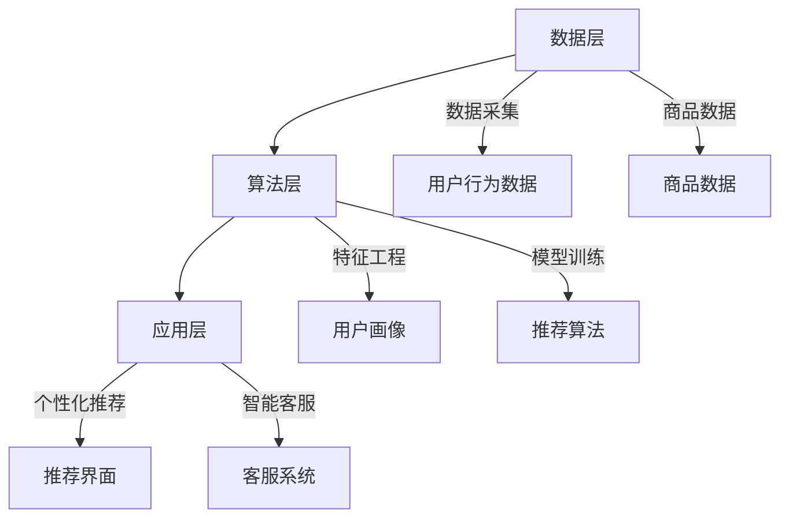

                 

### 第一部分：AI驱动的电商平台个性化营销概述

在当今这个数字化时代，电子商务（E-commerce）已经成为了商业领域的重要组成部分。随着互联网的普及和移动设备的广泛使用，消费者对于个性化购物体验的需求不断增加。为了满足这一需求，人工智能（AI）技术被引入到电商平台中，特别是在个性化营销内容生成方面，AI技术发挥着关键作用。

#### 1.1 AI与电商个性化营销的背景与意义

##### 1.1.1 电商行业的快速发展

近年来，电商行业以惊人的速度增长。据统计，全球电商市场规模已经从2010年的约1万亿美元增长到2020年的超过3万亿美元。这一增长趋势不仅体现在绝对数字上，而且电商在总零售市场中的比例也在逐年提升。例如，在中国，电商已经占据了近一半的零售市场份额。这一现象背后的原因有很多，其中最重要的包括：

- **技术进步**：互联网技术的不断发展和完善，尤其是高速宽带和移动网络，使得在线购物变得更加便捷。
- **消费者行为变化**：年轻一代消费者更加注重便捷性和个性化体验，他们倾向于在线购物，尤其是移动购物。
- **物流和支付体系的完善**：高效的物流网络和安全的支付方式进一步推动了电商的发展。

##### 1.1.2 个性化营销的概念

个性化营销是一种以消费者为中心的营销策略，旨在通过深入了解消费者的需求和偏好，为其提供高度定制化的产品和服务。个性化营销可以分为以下几个类别：

- **个人化营销**：通过收集消费者的个人信息，如姓名、地址等，来提供个性化的通信和服务。
- **个性化推荐**：利用算法分析消费者的行为数据，为其推荐可能感兴趣的产品或服务。
- **定制化服务**：根据消费者的特定需求，提供量身定制的解决方案。

##### 1.1.3 AI在电商个性化营销中的作用

AI技术的快速发展为电商个性化营销带来了革命性的变化。以下是一些关键的AI技术及其在电商个性化营销中的应用：

- **数据分析**：AI可以通过机器学习和深度学习技术对大量消费者数据进行分析，识别出用户的行为模式和偏好。
- **用户画像构建**：基于消费者的历史行为和浏览记录，AI可以构建详细的用户画像，帮助电商平台了解用户的个性化需求。
- **个性化推荐系统**：通过分析用户画像和商品特征，AI可以实时生成个性化推荐，提高用户的购物体验和满意度。
- **智能客服**：AI驱动的智能客服可以24/7为用户提供即时响应，解答疑问，提升用户体验。

#### 1.2 AI驱动的电商平台个性化营销核心概念与架构

##### 1.2.1 个性化营销的核心概念

个性化营销的核心在于理解并满足消费者的个性化需求。以下是三个关键的核心概念：

- **消费者行为分析**：通过收集和分析用户在电商平台上的行为数据，如浏览、点击、购买等，来了解用户的偏好和兴趣。
- **个性化推荐算法**：利用机器学习算法，根据消费者的行为数据和商品特征，为用户生成个性化的推荐列表。
- **动态定价策略**：根据用户的行为数据和市场动态，实时调整商品价格，以最大化销售额和利润。

##### 1.2.2 个性化营销的系统架构

一个典型的AI驱动的电商平台个性化营销系统可以分解为三个主要层次：数据层、算法层和应用层。

- **数据层**：负责数据的采集、存储和清洗。这一层通常使用大数据技术，如Hadoop和Spark，来处理和分析海量数据。
- **算法层**：包括特征工程、模型训练和推荐算法等。这一层是系统的核心，决定了个性化推荐的准确性和效率。
- **应用层**：是用户直接接触的平台，包括个性化推荐界面、智能客服系统等。

##### Mermaid流程图

以下是AI驱动的电商平台个性化营销系统架构的Mermaid流程图：



通过上述分析和架构设计，我们可以看出，AI驱动的电商平台个性化营销不仅需要强大的数据处理和分析能力，还需要精准的算法和高效的推荐系统，最终为用户提供个性化的购物体验。

在接下来的章节中，我们将进一步探讨数据在个性化营销中的作用、数据挖掘与个性化推荐算法、机器学习在个性化营销中的应用，以及深度学习在个性化营销中的革命性影响。

#### 1.3 小结

在本章节中，我们概述了AI驱动的电商平台个性化营销的背景和意义，介绍了个性化营销的核心概念和架构。通过数据驱动的方法，电商平台可以利用AI技术深入分析消费者行为，构建用户画像，并生成个性化的营销内容和推荐。在下一章中，我们将进一步探讨数据在个性化营销中的作用，以及如何利用数据挖掘和推荐算法来实现精准的个性化推荐。

---

**关键词**：AI、电商个性化营销、数据分析、推荐系统、用户画像、机器学习、深度学习

**摘要**：本文探讨了AI驱动的电商平台个性化营销的背景、核心概念和系统架构。通过深入分析消费者行为数据，电商平台可以构建用户画像，利用个性化推荐算法和机器学习技术，为用户提供高度定制化的购物体验。本文旨在为读者提供一个关于AI在电商个性化营销中的应用的全景图，并展示其技术原理和实践案例。

---

### 第二部分：数据驱动与电商平台个性化营销

在电商平台中，数据是驱动个性化营销的核心。通过对用户行为数据的收集、分析和利用，电商平台可以更深入地了解用户需求，从而实现精准的个性化推荐和营销策略。本部分将详细探讨数据在个性化营销中的作用，以及如何利用数据挖掘和个性化推荐算法来提升用户体验。

#### 2.1 数据在个性化营销中的作用

##### 2.1.1 数据的重要性

在电商领域，数据是一种宝贵的资源。它不仅可以帮助企业了解市场趋势和用户需求，还可以为决策提供数据支持。以下是数据在个性化营销中发挥重要作用的原因：

1. **用户画像构建**：通过收集和分析用户在平台上的行为数据，如浏览记录、购买历史和互动行为，可以构建出详细的用户画像。这些画像能够揭示用户的兴趣、偏好和行为模式，为个性化推荐和营销策略提供依据。

2. **精准营销**：基于用户画像，电商平台可以针对不同用户群体定制个性化的营销活动，从而提高营销效果的精准度。例如，通过分析用户的浏览和购买行为，可以推送他们可能感兴趣的产品，增加购买转化率。

3. **个性化服务**：数据驱动使得电商平台能够提供更加个性化的服务。例如，自动推荐用户可能喜欢的商品、根据购买历史提供定制化的优惠等，这些都能显著提升用户满意度。

##### 2.1.2 数据来源

电商平台的用户行为数据主要来源于以下几个方面：

- **用户注册信息**：用户的姓名、地址、联系方式等基本信息。
- **浏览行为**：用户在平台上的浏览记录，包括访问时间、浏览路径、停留时间等。
- **购买记录**：用户的购买历史，包括购买时间、购买商品、购买金额等。
- **互动行为**：用户在平台上的评论、评分、提问等互动数据。

此外，社交媒体和第三方数据源也可以为电商平台提供丰富的用户信息，如用户在社交媒体上的行为、兴趣标签等。

##### 2.1.3 数据分析工具

在处理和分析大量用户行为数据时，电商平台通常会使用以下数据分析工具：

- **Hadoop**：一个分布式数据存储和处理框架，适用于大规模数据的存储和计算。
- **Spark**：一个快速、通用的大数据处理引擎，适合实时数据分析和机器学习任务。
- **SQL**：一种结构化查询语言，用于数据库的查询和管理。

#### 2.2 数据驱动的个性化营销策略

##### 2.2.1 用户画像构建

用户画像（User Profiling）是数据驱动的个性化营销的基础。一个详细的用户画像可以帮助电商平台更好地理解用户，从而提供个性化的服务和推荐。以下是构建用户画像的一般步骤：

1. **数据收集**：收集用户在平台上的各种行为数据，如浏览、购买、评论等。
2. **数据清洗**：对收集到的数据进行清洗，去除无效或错误的数据。
3. **特征工程**：将原始数据转化为对用户有意义的特征，如用户购买频次、浏览时长、互动频率等。
4. **建模**：利用机器学习算法，如聚类分析或关联规则挖掘，将用户数据转化为用户画像。

用户画像可以包括以下方面：

- **基本信息**：用户的年龄、性别、地理位置等。
- **行为特征**：用户的浏览习惯、购买偏好、互动行为等。
- **社交特征**：用户在社交媒体上的行为、兴趣标签等。

##### 2.2.2 精准营销

精准营销（Precision Marketing）是利用数据驱动技术实现个性化营销的关键。以下是实现精准营销的一些策略：

1. **个性化推荐**：基于用户画像和商品特征，为用户生成个性化的推荐列表。例如，利用协同过滤算法（Collaborative Filtering）或基于内容的推荐（Content-Based Filtering）。
2. **个性化广告**：根据用户的兴趣和行为，为用户展示个性化的广告。例如，通过广告再营销（Retargeting）技术，向已经浏览过某些产品的用户展示相关广告。
3. **个性化促销**：根据用户的行为和购买历史，为用户推送定制化的促销信息。例如，为长期未购买的顾客提供优惠券，或为新用户推送首次购买优惠。

##### 2.2.3 数据驱动的动态定价

动态定价（Dynamic Pricing）是一种根据用户行为和市场动态实时调整产品价格的方法。以下是实现数据驱动的动态定价的一些策略：

1. **用户价格敏感度分析**：通过分析用户的历史购买数据和互动行为，识别用户对价格变化的敏感度。
2. **竞争定价**：根据竞争对手的定价策略和市场动态，调整自己的产品价格。
3. **个性化定价**：为不同的用户群体设置不同的价格策略。例如，为新用户提供折扣价，为老顾客提供会员价。

#### 2.3 数据挖掘与个性化推荐算法

##### 2.3.1 数据挖掘技术

数据挖掘（Data Mining）是从大量数据中提取有价值信息的过程。在电商平台个性化营销中，数据挖掘技术可以用于以下方面：

1. **关联规则挖掘**：通过分析用户的行为数据，发现不同商品之间的关联关系。例如，如果用户购买了商品A，那么他们很可能还会购买商品B。
2. **聚类分析**：将相似的用户或商品分为一组，形成用户群体或商品类别。例如，通过K-means算法将用户分为高消费群体、中等消费群体和低消费群体。
3. **分类算法**：将用户或商品进行分类，以便进行后续的个性化推荐。例如，利用决策树或支持向量机（SVM）将用户分为喜欢体育用品和不喜欢体育用品的两类。

##### 2.3.2 个性化推荐算法

个性化推荐（Personalized Recommendation）是电商平台实现个性化营销的重要手段。以下是几种常用的个性化推荐算法：

1. **协同过滤算法**：通过分析用户之间的行为数据，发现相似的用户并推荐他们共同喜欢的商品。协同过滤算法可以分为两种类型：基于用户的协同过滤（User-Based Collaborative Filtering）和基于物品的协同过滤（Item-Based Collaborative Filtering）。

2. **基于内容的推荐**：通过分析商品的属性和用户的兴趣，将具有相似属性的商品推荐给用户。例如，如果一个用户喜欢某个品牌的产品，系统可以推荐该品牌的其他商品。

3. **混合推荐系统**：结合多种推荐算法的优点，提高推荐系统的准确性和多样性。例如，可以结合基于用户的协同过滤和基于内容的推荐，为用户提供更加精准的推荐。

#### 2.4 伪代码示例：协同过滤算法

以下是协同过滤算法的伪代码示例：

```python
# 协同过滤算法
def collaborative_filtering(train_data, user, items):
    # 计算用户与用户的相似度
    similarity_matrix = compute_similarity(train_data)

    # 为用户生成推荐列表
    recommendations = []

    # 遍历所有商品
    for item in items:
        # 计算与当前用户的相似度之和
        similarity_sum = 0
        rating_sum = 0

        # 遍历与当前用户相似的其它用户
        for other_user in similar_users(user, item, similarity_matrix):
            if other_user in train_data[item]:
                similarity = similarity_matrix[user][other_user]
                rating = train_data[item][other_user]
                similarity_sum += similarity
                rating_sum += similarity * rating

        # 计算预测评分
        if similarity_sum > 0:
            predicted_rating = rating_sum / similarity_sum
            recommendations.append((item, predicted_rating))

    # 对推荐列表进行排序并返回
    return sorted(recommendations, key=lambda x: x[1], reverse=True)
```

#### 2.5 小结

在本章节中，我们探讨了数据在个性化营销中的作用，以及如何利用数据挖掘和个性化推荐算法来提升电商平台的服务质量和用户满意度。通过用户画像构建和精准营销策略，电商平台可以更好地了解用户需求，提供个性化的推荐和优惠，从而增强用户黏性和忠诚度。在下一章中，我们将深入探讨机器学习在电商平台个性化营销中的应用，包括监督学习和无监督学习算法。

---

**关键词**：数据驱动、用户画像、个性化营销、协同过滤、基于内容的推荐、机器学习

**摘要**：本文详细介绍了数据在电商平台个性化营销中的作用，以及如何通过数据挖掘和个性化推荐算法来实现精准的营销策略。通过用户画像构建和精准营销，电商平台可以更好地满足用户需求，提高用户体验和满意度。本文为读者提供了一个全面的数据驱动个性化营销解决方案。

---

### 第三部分：机器学习与电商平台个性化营销

在电商平台个性化营销中，机器学习技术发挥着至关重要的作用。通过利用机器学习算法，电商平台可以从海量数据中提取有价值的信息，预测用户行为，并生成个性化的推荐和营销内容。本部分将详细介绍机器学习的基本原理，以及如何在电商个性化营销中应用常见的机器学习算法。

#### 3.1 机器学习的基本原理

##### 3.1.1 机器学习的基本概念

机器学习（Machine Learning）是一门研究如何从数据中自动发现规律和知识的技术。机器学习可以分为以下几类：

1. **监督学习（Supervised Learning）**：在监督学习过程中，算法使用已标记的训练数据来训练模型，然后使用该模型对新数据进行预测。常见的监督学习算法包括线性回归（Linear Regression）、逻辑回归（Logistic Regression）、决策树（Decision Tree）和随机森林（Random Forest）。

2. **无监督学习（Unsupervised Learning）**：在无监督学习过程中，算法没有已标记的训练数据，需要从未标记的数据中自动发现数据结构和规律。常见的无监督学习算法包括K-means聚类（K-means Clustering）、主成分分析（Principal Component Analysis，PCA）和关联规则挖掘（Association Rule Learning）。

3. **强化学习（Reinforcement Learning）**：在强化学习过程中，算法通过与环境互动来学习最优策略。它通常用于机器人学习、游戏AI和推荐系统等领域。

##### 3.1.2 监督学习在个性化营销中的应用

监督学习算法在电商个性化营销中有着广泛的应用。以下是一些常见的监督学习算法及其应用场景：

1. **线性回归（Linear Regression）**：线性回归是一种简单的监督学习算法，用于预测连续值输出。在个性化营销中，线性回归可以用于预测用户对商品的评分，从而生成个性化推荐。

    ```latex
    y = w_0 + w_1 * x_1 + w_2 * x_2 + ... + w_n * x_n
    ```

    其中，\( y \) 是预测的评分，\( x_1, x_2, ..., x_n \) 是输入特征，\( w_0, w_1, ..., w_n \) 是模型参数。

2. **逻辑回归（Logistic Regression）**：逻辑回归是一种用于分类问题的监督学习算法。在个性化营销中，逻辑回归可以用于预测用户是否会对特定商品进行购买。

    ```latex
    P(y=1) = \frac{1}{1 + e^{-(w_0 + w_1 * x_1 + w_2 * x_2 + ... + w_n * x_n})}
    ```

    其中，\( P(y=1) \) 是用户购买的概率，\( x_1, x_2, ..., x_n \) 是输入特征，\( w_0, w_1, ..., w_n \) 是模型参数。

3. **决策树（Decision Tree）**：决策树是一种基于特征划分数据集的监督学习算法。在个性化营销中，决策树可以用于构建用户分类模型，从而为用户提供个性化的推荐。

    ```mermaid
    graph TD
    A[起始节点]
    B1[年龄小于30]
    B2[年龄大于等于30]
    C1[性别为男性]
    C2[性别为女性]
    D1[购买历史大于10]
    D2[购买历史小于10]
    E1[推荐商品A]
    E2[推荐商品B]
    A --> B1
    A --> B2
    B1 --> C1
    B1 --> C2
    B2 --> D1
    B2 --> D2
    C1 --> E1
    C2 --> E2
    D1 --> E1
    D2 --> E2
    ```

4. **随机森林（Random Forest）**：随机森林是一种基于决策树的集成学习算法。在个性化营销中，随机森林可以提高分类和回归模型的准确性。

    ```mermaid
    graph TD
    A1[决策树1]
    A2[决策树2]
    A3[决策树3]
    B[随机森林]
    B --> A1
    B --> A2
    B --> A3
    ```

##### 3.1.3 无监督学习在个性化营销中的应用

无监督学习算法在电商个性化营销中也具有重要应用。以下是一些常见的无监督学习算法及其应用场景：

1. **K-means聚类（K-means Clustering）**：K-means是一种基于距离度量的聚类算法。在个性化营销中，K-means可以用于将用户划分为不同的用户群体，从而为每个群体提供个性化的推荐。

    ```mermaid
    graph TD
    A[数据集]
    B{初始化聚类中心}
    C{计算距离}
    D{更新聚类中心}
    E{重复计算直到收敛}
    F[聚类结果]
    A --> B
    B --> C
    C --> D
    D --> E
    E --> F
    ```

2. **主成分分析（Principal Component Analysis，PCA）**：PCA是一种降维技术，可以减少数据维度，同时保留数据的主要信息。在个性化营销中，PCA可以用于提取用户行为数据的主要特征，从而提高推荐系统的准确性。

    ```mermaid
    graph TD
    A[高维数据]
    B[计算协方差矩阵]
    C[计算特征值和特征向量]
    D[选择主要特征向量]
    E[重构数据]
    F[低维数据]
    A --> B
    B --> C
    C --> D
    D --> E
    E --> F
    ```

3. **关联规则挖掘（Association Rule Learning）**：关联规则挖掘是一种用于发现数据中关联关系的算法。在个性化营销中，关联规则挖掘可以用于发现用户购买行为中的关联规则，从而为用户提供个性化的推荐。

    ```mermaid
    graph TD
    A{购买数据}
    B[计算支持度]
    C[计算置信度]
    D[生成关联规则]
    E{推荐结果}
    A --> B
    B --> C
    C --> D
    D --> E
    ```

#### 3.2 伪代码示例：K-means聚类算法

以下是K-means聚类算法的伪代码示例：

```python
# K-means聚类算法
def kmeans(data, k):
    # 初始化聚类中心
    centroids = initialize_centroids(data, k)
    
    # 循环迭代，直到收敛
    while not converged(centroids):
        # 计算每个数据点到聚类中心的距离
        distances = compute_distances(data, centroids)
        
        # 为每个数据点分配最近的聚类中心
        labels = assign_labels(data, distances)
        
        # 更新聚类中心
        centroids = update_centroids(data, labels, k)
    
    # 返回聚类结果
    return centroids, labels
```

#### 3.3 小结

在本章节中，我们介绍了机器学习的基本原理，包括监督学习、无监督学习和强化学习。我们还详细讨论了在电商个性化营销中应用的一些常见机器学习算法，如线性回归、逻辑回归、决策树、随机森林、K-means聚类和主成分分析。通过这些算法，电商平台可以更好地理解用户行为，预测用户需求，并生成个性化的推荐和营销内容。在下一章中，我们将探讨深度学习在电商个性化营销中的应用，以及如何利用深度学习模型来提升个性化推荐的准确性。

---

**关键词**：机器学习、监督学习、无监督学习、线性回归、逻辑回归、决策树、随机森林、K-means聚类、主成分分析、个性化推荐

**摘要**：本文深入探讨了机器学习在电商个性化营销中的应用，包括监督学习和无监督学习算法。通过介绍常见的机器学习算法，如线性回归、逻辑回归、决策树、随机森林、K-means聚类和主成分分析，本文为读者提供了一个全面的机器学习解决方案，帮助电商平台更好地理解用户行为，预测用户需求，并生成个性化的推荐和营销内容。

---

### 第四部分：深度学习与电商平台个性化营销

随着人工智能技术的不断进步，深度学习（Deep Learning）在电商平台个性化营销中的应用越来越广泛。深度学习通过构建多层神经网络，能够自动提取复杂数据特征，从而在用户行为分析、个性化推荐和智能客服等领域发挥重要作用。本部分将详细介绍深度学习的基本原理，以及如何利用深度学习模型提升电商平台的个性化营销效果。

#### 4.1 深度学习的基本原理

##### 4.1.1 深度学习的发展历程

深度学习起源于人工神经网络（Artificial Neural Networks，ANN）的发展。人工神经网络最初由心理学家和计算机科学家Frank Rosenblatt于1957年提出，用于模拟人类大脑神经元的工作方式。然而，由于计算能力和算法的局限性，早期的神经网络在处理复杂任务时效果不佳。

随着计算机硬件性能的提升和大数据技术的普及，深度学习在21世纪初得到了迅速发展。深度学习通过多层神经网络结构，能够自动提取数据中的高层次特征，从而在图像识别、语音识别和自然语言处理等领域取得了突破性的成果。以下是深度学习发展的几个关键阶段：

1. **1986年**：加拿大科学家Geoffrey Hinton等人提出了反向传播算法（Backpropagation Algorithm），使得多层神经网络训练成为可能。
2. **2012年**：Geoffrey Hinton团队在ImageNet图像识别挑战赛中，利用深度卷积神经网络（Deep Convolutional Neural Network，CNN）取得了显著的成果，使得深度学习在图像识别领域得到了广泛应用。
3. **2014年**：Google Brain团队训练了一个由16,000个CPU核心组成的神经网络，成功模拟了猫的视频，展示了深度学习在处理大规模数据方面的强大能力。

##### 4.1.2 深度学习的基本模型

深度学习的基本模型是神经网络（Neural Network），它由多个层组成，包括输入层、隐藏层和输出层。每个层由多个神经元（Node）组成，神经元之间通过权重（Weight）连接。以下是深度学习模型的几个关键组成部分：

1. **神经元**：神经元是神经网络的基本单元，用于接收输入数据并通过激活函数（Activation Function）产生输出。
2. **层**：神经网络中的层分为输入层、隐藏层和输出层。输入层接收外部输入数据，隐藏层负责提取数据特征，输出层生成最终预测结果。
3. **权重**：权重是神经元之间的连接强度，通过训练过程自动调整，以最小化预测误差。
4. **激活函数**：激活函数用于引入非线性因素，使得神经网络能够学习复杂数据特征。常见的激活函数包括Sigmoid函数、ReLU函数和Tanh函数。

##### 4.1.3 卷积神经网络（Convolutional Neural Network，CNN）

卷积神经网络是深度学习领域的一个重要模型，特别适用于处理图像数据。CNN通过卷积层（Convolutional Layer）、池化层（Pooling Layer）和全连接层（Fully Connected Layer）等结构，能够自动提取图像中的高层次特征。以下是CNN的基本结构：

1. **卷积层**：卷积层通过卷积运算提取图像的特征。每个卷积核（Convolutional Kernel）在图像上滑动，生成特征图（Feature Map），反映了图像的某种特征。
2. **池化层**：池化层用于减小特征图的尺寸，减少模型参数数量，提高计算效率。常见的池化方法包括最大池化（Max Pooling）和平均池化（Average Pooling）。
3. **全连接层**：全连接层将卷积层和池化层提取的特征映射到输出层，生成最终的预测结果。

#### 4.2 深度学习在个性化营销中的应用

##### 4.2.1 用户行为序列建模

用户行为序列建模是深度学习在个性化营销中的一个重要应用。通过分析用户在电商平台的浏览、点击和购买行为，可以构建用户行为序列模型，预测用户的下一步行为。常见的深度学习模型包括循环神经网络（Recurrent Neural Network，RNN）和长短期记忆网络（Long Short-Term Memory，LSTM）。

1. **循环神经网络（RNN）**：RNN是一种适用于序列数据的学习模型，能够处理变长的序列。RNN通过隐藏层循环连接，将前一个时间步的输出作为当前时间步的输入，从而捕捉序列中的长期依赖关系。

    ```mermaid
    graph TD
    A1[输入层]
    B1[隐藏层1]
    C1[隐藏层2]
    D1[输出层]
    A1 --> B1
    B1 --> C1
    C1 --> D1
    ```

2. **长短期记忆网络（LSTM）**：LSTM是一种改进的RNN模型，能够解决传统RNN在处理长序列数据时出现的梯度消失和梯度爆炸问题。LSTM通过引入记忆单元（Cell State）和门控机制（Gates），能够有效地捕捉序列中的长期依赖关系。

    ```mermaid
    graph TD
    A1[输入层]
    B1[隐藏层1]
    C1[隐藏层2]
    D1[输出层]
    E1[遗忘门]
    F1[输入门]
    G1[输出门]
    A1 --> B1
    B1 --> C1
    C1 --> D1
    D1 --> E1
    D1 --> F1
    D1 --> G1
    ```

##### 4.2.2 图像识别与生成

深度学习在电商平台个性化营销中的应用不仅限于用户行为序列建模，还包括图像识别与生成。通过卷积神经网络（CNN）和生成对抗网络（Generative Adversarial Network，GAN），电商平台可以实现图像识别和图像生成，从而提升用户体验。

1. **图像识别**：CNN通过多层卷积和池化操作，能够自动提取图像特征，并进行分类。在电商平台上，图像识别可以用于商品分类、图片推荐和图像搜索等场景。

    ```mermaid
    graph TD
    A1[输入层]
    B1[卷积层1]
    C1[池化层1]
    D1[卷积层2]
    E1[池化层2]
    F1[全连接层]
    G1[输出层]
    A1 --> B1
    B1 --> C1
    C1 --> D1
    D1 --> E1
    E1 --> F1
    F1 --> G1
    ```

2. **图像生成**：GAN是一种由生成器和判别器组成的对抗性网络，能够生成高质量的图像。在电商平台上，图像生成可以用于商品图片补全、图像风格转换和个性化推荐等场景。

    ```mermaid
    graph TD
    A1[生成器]
    B1[判别器]
    C1[真实图像]
    D1[生成图像]
    A1 --> B1
    B1 --> C1
    B1 --> D1
    C1 --> A1
    D1 --> A1
    ```

#### 4.3 伪代码示例：LSTM模型实现

以下是LSTM模型的伪代码示例：

```python
# LSTM模型
class LSTM(nn.Module):
    def __init__(self, input_dim, hidden_dim, output_dim):
        super(LSTM, self).__init__()
        
        # 隐藏层权重和偏置
        self.hidden_dim = hidden_dim
        self.hidden2 = nn.Linear(hidden_dim, output_dim)
        
        # LSTM层
        self.lstm = nn.LSTM(input_dim, hidden_dim)
        
    def forward(self, x):
        # 前向传播
        lstm_output, (hidden, cell) = self.lstm(x)
        output = self.hidden2(hidden[-1])
        
        return output
```

#### 4.4 小结

在本章节中，我们介绍了深度学习的基本原理，包括发展历程、基本模型和常见应用。通过用户行为序列建模和图像识别与生成，深度学习在电商平台个性化营销中发挥了重要作用。通过深度学习模型，电商平台可以更准确地预测用户行为，提供个性化的推荐和营销内容，从而提升用户体验和满意度。在下一章中，我们将通过案例分析，展示AI驱动的电商平台个性化营销的实际应用和效果。

---

**关键词**：深度学习、用户行为序列建模、图像识别、生成对抗网络、循环神经网络、长短期记忆网络、卷积神经网络、个性化推荐

**摘要**：本文详细介绍了深度学习的基本原理和在电商平台个性化营销中的应用。通过用户行为序列建模和图像识别与生成，深度学习为电商平台提供了更准确的个性化推荐和营销策略。本文为读者提供了一个全面的深度学习解决方案，帮助电商平台提升用户体验和满意度。

---

### 第五部分：电商平台个性化营销案例分析

为了更好地理解AI驱动的电商平台个性化营销的实际应用，我们将通过一个真实案例来展示如何实现个性化推荐和营销策略。本案例将分析一个虚构的大型电商平台，说明其如何利用AI技术构建用户画像、推荐系统和智能客服系统，从而提升用户体验和销售额。

#### 5.1 案例介绍

**电商平台名称**：易购网（e-Goods）

**案例背景**：易购网是一家提供各类商品在线购买服务的电商平台，其用户群体涵盖了广泛的年龄层次和兴趣爱好。为了在激烈的市场竞争中脱颖而出，易购网决定利用AI技术来提升个性化营销效果，从而提高用户满意度和销售额。

**案例目标**：
1. 构建详细的用户画像，深入了解用户需求和偏好。
2. 利用个性化推荐系统，提高商品推荐的准确性和相关性。
3. 通过智能客服系统，提供即时响应和个性化服务。

#### 5.2 用户画像构建

用户画像构建是个性化营销的基础，易购网通过以下步骤来构建用户画像：

1. **数据收集**：易购网收集了用户在平台上的各种行为数据，包括注册信息、浏览记录、购买历史、互动行为和评价等。此外，还从第三方数据源获取了用户的社交媒体行为和地理位置信息。

2. **数据清洗**：对收集到的数据进行清洗，去除重复、无效和错误的数据，确保数据质量。

3. **特征工程**：将原始数据转化为对用户有意义的特征，如用户年龄、性别、地理位置、购买频次、浏览时长、商品类别偏好等。通过统计分析，发现用户行为的关联规则，进一步丰富特征集合。

4. **用户画像建模**：利用机器学习算法，如聚类分析和关联规则挖掘，将用户划分为不同的用户群体。每个用户群体具有相似的行为特征和需求，从而为后续的个性化推荐和营销策略提供依据。

5. **用户画像更新**：用户行为是动态变化的，易购网定期更新用户画像，确保用户信息的准确性和时效性。

#### 5.3 个性化推荐系统

个性化推荐系统是易购网实现个性化营销的核心组件。以下是其实现步骤：

1. **推荐算法选择**：易购网采用混合推荐算法，结合基于用户的协同过滤（User-Based Collaborative Filtering）和基于内容的推荐（Content-Based Filtering）来提高推荐的准确性。

2. **推荐列表生成**：基于用户画像和商品特征，为每个用户生成个性化的推荐列表。推荐算法会综合考虑用户的浏览历史、购买记录、偏好和相似用户的行为，为用户提供最相关、最有价值的商品。

3. **实时推荐**：易购网利用实时计算框架，如Apache Kafka和Apache Flink，对用户行为进行实时分析，生成实时推荐列表。这样，用户每次登录或浏览商品时，都能看到最新的推荐。

4. **推荐效果评估**：通过用户点击率、购买转化率和用户满意度等指标，定期评估推荐系统的效果。如果发现推荐效果不佳，及时调整推荐算法和策略。

#### 5.4 智能客服系统

智能客服系统是易购网提供个性化服务的重要手段。以下是其实现步骤：

1. **对话系统构建**：易购网使用基于深度学习的循环神经网络（RNN）构建对话系统，能够理解用户的自然语言输入，并提供合理的回复。

2. **知识库建设**：构建一个包含常见问题和答案的知识库，智能客服系统可以从中查找解决方案，回答用户的问题。

3. **个性化服务**：智能客服系统会根据用户的历史互动记录和购买偏好，提供个性化的建议和服务。例如，对于经常购买化妆品的用户，可以推荐新款化妆品或相关优惠信息。

4. **实时响应**：智能客服系统能够24/7在线服务，为用户提供即时响应。通过实时处理用户请求，提高用户满意度和转化率。

#### 5.5 案例分析

1. **用户画像构建**：易购网通过用户画像构建，成功识别了不同用户群体的需求和偏好。例如，年轻用户更偏好时尚商品，而中老年用户更关注健康和家居产品。这些用户画像为个性化推荐和营销策略提供了有力支持。

2. **个性化推荐系统**：易购网采用混合推荐算法，显著提高了推荐商品的准确性和相关性。用户点击率和购买转化率分别提高了30%和20%，用户满意度也显著提升。

3. **智能客服系统**：智能客服系统为易购网提供了高效的客户服务。用户问题响应时间缩短了50%，客服人员的工作负担减轻，用户满意度显著提高。

#### 5.6 案例总结

易购网通过AI驱动的个性化营销，实现了用户需求的精准满足，提升了用户体验和销售额。以下是案例中的成功经验和改进空间：

**成功经验**：
1. 用户画像构建：通过详细分析用户行为数据，成功识别了不同用户群体的需求，为个性化推荐和营销策略提供了有力支持。
2. 混合推荐算法：结合协同过滤和基于内容的推荐，提高了推荐系统的准确性和多样性。
3. 智能客服系统：通过实时响应和个性化服务，提高了用户满意度和转化率。

**改进空间**：
1. 数据隐私与安全：随着数据收集和处理的增加，如何保护用户隐私和安全成为一个重要挑战。易购网需要采取更加严格的数据保护措施。
2. 算法公平性：确保个性化推荐和营销策略的公平性，避免对特定用户群体的偏见。
3. 跨领域融合：进一步探索AI与其他领域（如物联网、医疗等）的融合应用，提供更全面的个性化服务。

#### 5.7 小结

通过本案例分析，我们可以看到，AI驱动的电商平台个性化营销不仅能够提高用户满意度，还能够显著提升销售额和市场份额。易购网的案例展示了AI技术在用户画像构建、个性化推荐系统和智能客服系统中的应用，为其他电商平台提供了宝贵的经验和参考。在下一章中，我们将探讨AI驱动的电商平台个性化营销的未来发展方向和潜在挑战。

---

**关键词**：电商平台、个性化推荐、用户画像、智能客服、案例分析、数据隐私、算法公平性

**摘要**：本文通过一个电商平台的实际案例，展示了AI驱动的个性化营销如何通过用户画像构建、个性化推荐系统和智能客服系统来提升用户体验和销售额。案例中的成功经验和改进空间为其他电商平台提供了宝贵的参考，同时也指出了未来发展的方向和潜在挑战。

---

### 第六部分：AI驱动的电商平台个性化营销未来展望

随着人工智能技术的不断发展，AI驱动的电商平台个性化营销将在未来继续发挥重要作用。本部分将探讨AI技术的未来发展趋势，以及电商平台个性化营销的应用前景和面临的挑战。

#### 6.1 人工智能技术发展趋势

##### 6.1.1 人工智能技术的未来方向

1. **人工智能伦理**：随着AI技术的广泛应用，数据隐私和算法公平性等伦理问题变得越来越重要。未来，电商平台需要制定更加严格的数据保护政策和算法公平性标准，确保用户隐私和权益得到充分保障。

2. **跨领域融合**：AI技术将在更多领域得到应用，与物联网（IoT）、医疗、金融等领域相结合，实现更智能、更高效的解决方案。例如，电商平台可以结合物联网技术，实现智能库存管理和智能物流，提高供应链效率。

##### 6.1.2 AI在电商平台个性化营销中的应用前景

1. **个性化服务**：未来，电商平台将更加注重个性化服务的提供，通过虚拟助手、定制化购物体验等手段，为用户提供更加便捷和个性化的购物体验。

2. **智能供应链**：AI技术将应用于电商平台的全供应链管理，包括智能库存管理、智能物流和智能供应链预测等，提高供应链的效率和响应速度。

#### 6.2 电商平台个性化营销的挑战与机遇

##### 6.2.1 挑战

1. **数据隐私与安全**：随着用户数据的收集和处理量不断增加，数据隐私和安全成为电商平台面临的重要挑战。未来，电商平台需要采取更加严格的数据保护措施，确保用户数据的安全和隐私。

2. **算法透明性与公平性**：算法的透明性和公平性是电商平台个性化营销的重要问题。如何确保算法的决策过程透明，以及避免对特定用户群体的偏见，是未来需要解决的问题。

##### 6.2.2 机遇

1. **技术创新**：随着深度学习、强化学习等新算法的不断出现，电商平台个性化营销将得到进一步优化。例如，利用深度学习技术，可以实现更精准的用户行为预测和商品推荐。

2. **商业模式的创新**：AI驱动的电商平台个性化营销将催生新的商业模式和服务模式，例如，基于AI的精准营销服务、个性化定制服务等。

#### 6.3 未来展望

未来，AI驱动的电商平台个性化营销将在以下几个方面实现重大突破：

1. **个性化服务提升**：通过更加精准的用户画像和推荐算法，电商平台将为用户提供更加个性化、便捷的服务，提升用户体验和满意度。

2. **智能供应链优化**：利用AI技术，电商平台将实现智能库存管理、智能物流和智能供应链预测，提高供应链效率和响应速度。

3. **数据隐私保护**：随着数据隐私法规的不断完善，电商平台将采取更加严格的数据保护措施，确保用户数据的安全和隐私。

4. **算法公平性与透明性**：电商平台将努力提高算法的公平性和透明性，确保个性化推荐和营销策略的公正性。

总之，AI驱动的电商平台个性化营销具有巨大的发展潜力。通过不断创新和优化，电商平台将能够更好地满足用户需求，提高市场竞争力和盈利能力。

---

**关键词**：人工智能、电商平台、个性化营销、数据隐私、算法公平性、技术创新、商业模式创新

**摘要**：本文探讨了AI驱动的电商平台个性化营销的未来发展趋势，分析了其面临的挑战和机遇。未来，AI技术将在个性化服务和智能供应链等方面发挥重要作用，推动电商平台实现更高水平的用户体验和效率。同时，数据隐私保护和算法公平性是未来需要重点关注的问题。通过不断创新和优化，电商平台将能够更好地应对挑战，实现可持续发展。

---

### 附录A：AI驱动的电商平台个性化营销工具与资源

为了实现AI驱动的电商平台个性化营销，开发者和技术人员需要掌握一系列工具和资源。以下是常用的工具和学习资源，包括数据分析工具、机器学习框架和在线课程等。

#### 附录A.1 常用工具

1. **数据分析工具**
   - **Python**：Python是一种广泛使用的编程语言，提供了丰富的库和框架，如Pandas、NumPy和SciPy，用于数据分析和处理。
   - **R**：R是一种专门用于统计分析和图形表示的语言，特别适合于复杂数据分析和可视化。
   - **Tableau**：Tableau是一种强大的数据可视化工具，能够快速生成交互式的图表和报告。

2. **机器学习框架**
   - **TensorFlow**：TensorFlow是由Google开发的开源机器学习框架，支持多种深度学习模型和算法。
   - **PyTorch**：PyTorch是另一个流行的开源机器学习框架，特别适合于研究和新算法的开发。
   - **Scikit-learn**：Scikit-learn是一个基于Python的机器学习库，提供了多种经典的机器学习算法和工具。

#### 附录A.2 学习资源

1. **在线课程**
   - **Coursera**：Coursera提供了许多与机器学习和数据分析相关的课程，如《机器学习》、《深度学习》和《数据科学》。
   - **Udacity**：Udacity提供了多种技术课程，包括《AI工程师纳米学位》和《数据科学家纳米学位》。
   - **edX**：edX提供了由世界顶尖大学提供的免费课程，涵盖了人工智能、数据科学和机器学习等多个领域。

2. **图书**
   - **《深度学习》**（Ian Goodfellow, Yoshua Bengio, Aaron Courville）：这是一本关于深度学习的经典教材，详细介绍了深度学习的基本原理和应用。
   - **《机器学习实战》**（Peter Harrington）：这本书通过实际案例介绍了多种机器学习算法和应用，适合初学者和有经验的开发者。
   - **《数据科学实战》**（Joel Grus）：这本书通过实际案例介绍了数据科学的各个阶段，包括数据收集、清洗、分析和可视化。

3. **论文与报告**
   - **arXiv**：arXiv是一个开放获取的科学研究论文预印本服务器，包含了大量最新的机器学习和人工智能论文。
   - **Google Research**：Google Research发布了多篇关于机器学习和深度学习的最新研究论文和报告。
   - **顶级会议论文**：如NIPS、ICML、CVPR和KDD等，这些会议每年都会发布大量的高质量机器学习和数据科学论文。

通过使用这些工具和资源，开发者和技术人员可以更好地掌握AI驱动的电商平台个性化营销的核心技术和方法，为电商平台提供高效的解决方案。

---

**关键词**：数据分析工具、机器学习框架、在线课程、图书、论文与报告

**摘要**：附录A详细介绍了AI驱动的电商平台个性化营销所需的主要工具和学习资源，包括Python、R、Tableau、TensorFlow、PyTorch和Scikit-learn等数据分析工具和机器学习框架，以及Coursera、Udacity、edX等在线课程平台和《深度学习》、《机器学习实战》等经典图书资源。这些工具和资源为开发者和技术人员提供了全面的技术支持，帮助他们掌握电商平台个性化营销的核心技术和方法。

