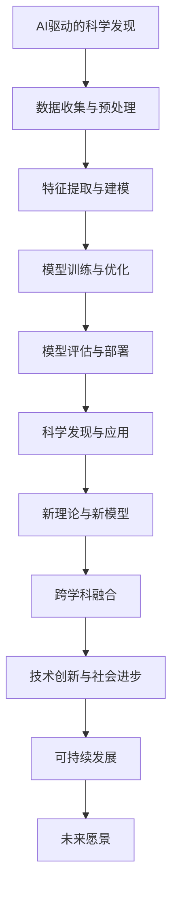

                 

# AI驱动的科学发现：加速创新的新范式

> **关键词：** AI、科学发现、创新、新范式、数据驱动、深度学习、大数据分析、机器学习、预测模型、智能系统、可持续发展。

> **摘要：** 本文探讨了AI驱动的科学发现如何成为加速创新的新范式。我们通过分析AI在科学研究中的应用、核心概念与架构、实际应用场景、方法论以及未来趋势，阐述了AI如何变革传统科研模式，推动科学发现的深度和广度。文章旨在为科研工作者和技术爱好者提供对AI驱动的科学发现的全面理解和实践指导。

---

### 《AI驱动的科学发现：加速创新的新范式》目录大纲

#### 第一部分：AI驱动的科学发现概述

##### 第1章：AI驱动的科学发现概述

- **1.1 AI在科学研究中的应用**
  - **1.1.1 AI与科学研究的关系**
  - **1.1.2 AI加速科学研究的方法和工具**
  - **1.1.3 AI驱动的科学研究趋势**

- **1.2 AI驱动的科学发现的挑战与机遇**
  - **1.2.1 挑战：数据、计算资源和模型复杂性**
  - **1.2.2 机遇：创新的科学发现和新范式**
  - **1.2.3 AI驱动的科学发现的未来**

##### 第2章：AI核心概念与架构

- **2.1 AI基础理论**
  - **2.1.1 机器学习原理**
  - **2.1.2 深度学习架构**
  - **2.1.3 自然语言处理基础**

- **2.2 AI核心算法**
  - **2.2.1 监督学习与无监督学习**
  - **2.2.2 强化学习**
  - **2.2.3 深度神经网络训练过程**

- **2.3 AI系统架构**
  - **2.3.1 AI计算框架**
  - **2.3.2 数据预处理与特征提取**
  - **2.3.3 模型评估与优化**

#### 第二部分：AI驱动的科学研究实践

##### 第3章：生物医学领域的AI应用

- **3.1 AI在生物信息学中的应用**
  - **3.1.1 蛋白质结构预测**
  - **3.1.2 药物发现**
  - **3.1.3 病原体基因组学分析**

- **3.2 AI在临床决策支持中的应用**
  - **3.2.1 诊断与预测模型**
  - **3.2.2 病程管理**
  - **3.2.3 精准医疗**

- **3.3 AI在个性化治疗中的应用**
  - **3.3.1 基因编辑技术**
  - **3.3.2 精准药物组合**
  - **3.3.3 免疫疗法**

##### 第4章：材料科学与工程领域的AI应用

- **4.1 AI在材料设计中的应用**
  - **4.1.1 材料性质预测**
  - **4.1.2 材料合成路线优化**
  - **4.1.3 材料数据库构建**

- **4.2 AI在材料性能优化中的应用**
  - **4.2.1 材料强度预测**
  - **4.2.2 材料磨损分析**
  - **4.2.3 材料表面工程**

- **4.3 AI在材料制造与检测中的应用**
  - **4.3.1 制造过程优化**
  - **4.3.2 检测与质量控制**
  - **4.3.3 智能制造系统**

##### 第5章：物理与化学领域的AI应用

- **5.1 AI在化学合成中的应用**
  - **5.1.1 反应路径预测**
  - **5.1.2 催化剂设计**
  - **5.1.3 合成方法优化**

- **5.2 AI在物理现象预测中的应用**
  - **5.2.1 物理模拟与仿真**
  - **5.2.2 相变与相场模拟**
  - **5.2.3 粒子动力学模拟**

- **5.3 AI在材料性质与性能预测中的应用**
  - **5.3.1 材料性质预测模型**
  - **5.3.2 性能评估与优化**
  - **5.3.3 智能材料系统**

##### 第6章：环境科学与可持续发展的AI应用

- **6.1 AI在环境监测中的应用**
  - **6.1.1 水质监测**
  - **6.1.2 大气污染监测**
  - **6.1.3 土壤质量监测**

- **6.2 AI在资源管理中的应用**
  - **6.2.1 资源勘探与评估**
  - **6.2.2 资源利用优化**
  - **6.2.3 可持续发展评估**

- **6.3 AI在生态系统管理中的应用**
  - **6.3.1 生物多样性保护**
  - **6.3.2 生态灾害预测与预警**
  - **6.3.3 生态修复与恢复**

##### 第7章：AI驱动的科学研究方法论

- **7.1 科研数据管理**
  - **7.1.1 数据采集与存储**
  - **7.1.2 数据清洗与处理**
  - **7.1.3 数据安全与隐私保护**

- **7.2 科研流程优化**
  - **7.2.1 研究项目管理**
  - **7.2.2 实验设计优化**
  - **7.2.3 科研成果可视化**

- **7.3 科研合作与知识共享**
  - **7.3.1 研究团队协作**
  - **7.3.2 知识共享平台**
  - **7.3.3 开源科学工具与资源**

#### 第三部分：AI驱动的科学发现的未来展望

##### 第8章：AI驱动的科学发现的未来趋势

- **8.1 AI驱动的科学发现的发展趋势**
  - **8.1.1 大数据和云计算**
  - **8.1.2 量子计算与量子AI**
  - **8.1.3 生物信息学与AI的结合**

- **8.2 AI驱动的科学发现的社会影响**
  - **8.2.1 经济发展**
  - **8.2.2 社会进步**
  - **8.2.3 道德与伦理挑战**

- **8.3 AI驱动的科学发现的未来愿景**
  - **8.3.1 创新的科学发现**
  - **8.3.2 深化人类对自然的理解**
  - **8.3.4 构建可持续发展的未来**

### 附录

- **附录A：AI驱动的科学发现工具与资源**
  - **人工智能工具**
  - **开源软件与库**
  - **数据集和案例研究**

- **附录B：进一步阅读推荐**
  - **相关书籍与论文推荐**
  - **学术会议与期刊推荐**

- **附录C：术语表**
  - **AI与科学相关的术语解释**

**核心概念与联系：**

- **Mermaid流程图：**
  ```mermaid
  graph TB
  A[AI驱动的科学发现] --> B[数据收集与预处理]
  B --> C[特征提取与建模]
  C --> D[模型训练与优化]
  D --> E[模型评估与部署]
  E --> F[科学发现与应用]
  ```

**核心算法原理讲解：**

- **监督学习伪代码：**
  ```python
  def supervised_learning(data, labels):
    # 初始化模型参数
    model = initialize_model()
    
    # 训练模型
    for each data_point in data:
      model.train(data_point, labels)
      
    # 模型评估
    accuracy = model.evaluate(test_data, test_labels)
    
    # 模型优化
    model.optimize(accuracy)
    
    return model
  ```

**数学模型和数学公式：**

- **线性回归公式：**
  $$ y = \beta_0 + \beta_1x + \epsilon $$
  - 其中，\( y \) 是因变量，\( x \) 是自变量，\( \beta_0 \) 和 \( \beta_1 \) 是模型的参数，\( \epsilon \) 是误差项。

**项目实战：**

- **开发环境搭建：**
  - 安装Python和相应的深度学习库（如TensorFlow、PyTorch）。
  - 配置GPU环境以支持高效的模型训练。

- **源代码详细实现：**
  - 代码片段：使用TensorFlow构建一个简单的神经网络模型。
    ```python
    import tensorflow as tf
    
    model = tf.keras.Sequential([
      tf.keras.layers.Dense(128, activation='relu', input_shape=[784]),
      tf.keras.layers.Dense(10, activation='softmax')
    ])
    
    model.compile(optimizer='adam',
                  loss='categorical_crossentropy',
                  metrics=['accuracy'])
    ```

- **代码解读与分析：**
  - **解读：** 上述代码定义了一个简单的神经网络模型，包含一个输入层、一个隐藏层和一个输出层。
  - **分析：** 隐藏层使用ReLU激活函数，输出层使用softmax激活函数以实现分类任务。模型使用adam优化器和categorical_crossentropy损失函数进行训练。

---

至此，我们完成了《AI驱动的科学发现：加速创新的新范式》的目录大纲。接下来，我们将逐一深入探讨各个章节的内容，为读者呈现一幅AI驱动科学发现的全面画卷。让我们开始第一部分的探讨：AI驱动的科学发现概述。

### AI驱动的科学发现概述

#### 1.1 AI在科学研究中的应用

##### 1.1.1 AI与科学研究的关系

人工智能（AI）的兴起为科学研究带来了前所未有的机遇。AI作为一种计算智能，以其强大的数据处理、模式识别和预测能力，成为科学研究的重要工具。在科学研究领域，AI不仅能够加速数据分析和实验结果的解读，还能够揭示隐藏在大量数据背后的复杂模式和关系。

首先，AI与科学研究的关系体现在数据处理的效率上。科学研究通常会产生海量的数据，这些数据往往难以手动处理。AI通过自动化和智能化的方式，能够快速处理和分析这些数据，提高科研效率。例如，在基因组学研究中，AI可以快速分析大量的基因序列，识别出潜在的基因突变和功能关系。

其次，AI在模式识别和预测方面具有显著优势。科学研究往往需要从数据中提取有价值的信息，这需要高度的抽象和分析能力。AI的机器学习和深度学习算法能够从数据中学习模式，并利用这些模式进行预测。例如，在气候研究中，AI可以分析历史气候数据，预测未来的气候变化趋势。

此外，AI还在推动科学研究的跨学科融合。传统的科学研究往往局限于某一特定领域，而AI的跨领域应用使得不同学科的研究可以相互借鉴和融合。例如，AI在生物医学、材料科学和物理学等领域的交叉应用，促进了新的科学发现和技术创新。

##### 1.1.2 AI加速科学研究的方法和工具

AI加速科学研究的方法和工具多种多样，主要包括以下几个方面：

1. **数据挖掘与可视化**：数据挖掘是AI在科学研究中的重要应用之一，通过挖掘大量数据中的潜在模式和规律，帮助科学家发现新的知识和见解。数据可视化工具则能够将复杂的数据以图形化的形式展示，使得科学家可以更直观地理解数据中的信息。

2. **机器学习与深度学习**：机器学习和深度学习是AI的核心技术，广泛应用于科学研究中的数据分析和模式识别。通过训练模型，AI可以从大量数据中学习规律，并用于预测和决策。

3. **自动化实验与仿真**：AI能够自动化实验过程和仿真模拟，减少人力和时间成本。例如，在药物发现中，AI可以通过自动化实验平台快速筛选和优化药物候选分子。

4. **智能数据分析**：AI在数据分析方面具有强大的能力，可以处理大规模复杂数据，提供深入的分析结果。例如，AI可以分析天文观测数据，发现新的天体现象。

5. **云计算与大数据**：云计算和大数据技术的结合，使得AI可以处理和分析海量数据。通过分布式计算和存储，AI可以快速处理大量数据，提供实时分析结果。

##### 1.1.3 AI驱动的科学研究趋势

AI驱动的科学研究趋势体现在以下几个方面：

1. **跨学科融合**：AI技术的跨学科应用越来越普遍，推动不同领域的研究相互融合，产生新的研究热点和突破。

2. **数据驱动的科研方法**：越来越多的科学家采用数据驱动的方法进行科研，利用AI进行数据分析和模式识别，以提高研究效率和准确性。

3. **自动化与智能化**：科研过程的自动化和智能化成为趋势，AI在实验设计、数据采集、分析和结果解读等方面发挥重要作用。

4. **个性化研究**：AI可以根据科学家的研究需求和背景，提供个性化的科研支持和建议，提高科研效率和质量。

5. **开放科学与共享**：AI驱动的科学发现强调开放数据和开放研究，促进科学家的合作与知识共享。

#### 1.2 AI驱动的科学发现的挑战与机遇

##### 1.2.1 挑战：数据、计算资源和模型复杂性

尽管AI在科学研究中具有巨大潜力，但其应用也面临一些挑战：

1. **数据挑战**：科学研究中产生的数据量庞大且复杂，如何有效地管理和分析这些数据成为关键问题。此外，数据质量和完整性也影响AI模型的效果。

2. **计算资源挑战**：AI模型训练和推理需要大量的计算资源，特别是在深度学习和大型数据集的情况下。计算资源的限制可能会影响AI的应用范围和效率。

3. **模型复杂性挑战**：AI模型的复杂性不断提高，需要科学家具备深厚的数学和计算机科学背景。如何设计、训练和优化复杂的AI模型成为一大挑战。

##### 1.2.2 机遇：创新的科学发现和新范式

尽管存在挑战，AI驱动的科学发现也带来了巨大的机遇：

1. **创新的科学发现**：AI能够从大量数据中揭示隐藏的模式和规律，推动新的科学发现。例如，AI在生物医学领域发现了新的药物靶点和治疗方法。

2. **新范式**：AI驱动的科学发现推动了科学研究范式的转变，从传统的实验驱动转向数据驱动。科学家可以通过分析数据来提出假设和验证理论，提高科研效率和准确性。

3. **跨学科合作**：AI促进了不同学科之间的合作，推动了多学科交叉研究。科学家可以共同利用AI技术解决复杂的科学问题。

##### 1.2.3 AI驱动的科学发现的未来

展望未来，AI驱动的科学发现将继续发挥重要作用，其发展趋势包括：

1. **量子计算与AI的结合**：量子计算具有处理海量数据的潜力，与AI结合将推动科学发现的深度和广度。

2. **生物信息学与AI的结合**：生物信息学是AI的重要应用领域，AI在生物信息学中的应用将继续深化，推动生物医学研究的发展。

3. **可持续发展的应用**：AI在环境科学、资源管理和生态系统管理中的应用将推动可持续发展目标的实现。

4. **开放科学与共享**：AI驱动的科学发现将推动开放数据和开放研究的进程，促进科学家的合作与知识共享。

总之，AI驱动的科学发现已成为加速创新的新范式，为科学研究带来了前所未有的机遇和挑战。科学家和研究人员需要不断学习和适应这一新的研究范式，充分利用AI技术推动科学进步和社会发展。

---

在本文的第一部分，我们概述了AI驱动的科学发现的背景和重要性，探讨了AI在科学研究中的应用、加速科学研究的方法和工具，以及AI驱动的科学发现的挑战与机遇。接下来，我们将深入探讨AI的核心概念与架构，为读者提供更深入的技术理解。

### AI核心概念与架构

#### 2.1 AI基础理论

##### 2.1.1 机器学习原理

机器学习是人工智能的核心组成部分，其基本原理是通过从数据中学习规律，然后利用这些规律进行预测或决策。机器学习可以分为监督学习、无监督学习和强化学习三大类。

1. **监督学习**：监督学习是最常见的机器学习类型，它使用带有标签的数据进行训练。标签是对输入数据的正确输出或目标值。监督学习的目标是学习出一个函数，能够将新的输入映射到正确的输出。

   **伪代码：**
   ```python
   def supervised_learning(data, labels):
     # 初始化模型参数
     model = initialize_model()
     
     # 训练模型
     for each data_point in data:
       model.train(data_point, labels)
       
     # 模型评估
     accuracy = model.evaluate(test_data, test_labels)
     
     # 模型优化
     model.optimize(accuracy)
     
     return model
   ```

2. **无监督学习**：无监督学习不使用标签数据，而是从未标记的数据中学习模式。其主要目标是发现数据中的结构和关系，如聚类和降维。

   **伪代码：**
   ```python
   def unsupervised_learning(data):
     # 初始化模型参数
     model = initialize_model()
     
     # 训练模型
     model.train(data)
     
     # 模型评估
     clusters = model.evaluate(data)
     
     return clusters
   ```

3. **强化学习**：强化学习是一种通过奖励和惩罚来学习最优策略的机器学习类型。它通常用于决策问题，如游戏、自动驾驶和机器人控制。

   **伪代码：**
   ```python
   def reinforcement_learning(state, action, reward):
     # 初始化模型参数
     model = initialize_model()
     
     # 更新模型
     model.update(state, action, reward)
     
     return model
   ```

##### 2.1.2 深度学习架构

深度学习是机器学习的一个分支，其核心思想是通过多层神经网络来学习复杂的函数。深度学习在图像识别、自然语言处理和语音识别等领域取得了显著的成果。

1. **神经网络基础**：神经网络由多个层组成，包括输入层、隐藏层和输出层。每个神经元（或节点）都与其他神经元相连，并有一个权重和偏置。通过正向传播和反向传播，神经网络可以学习输入和输出之间的映射关系。

2. **深度神经网络**：深度神经网络（DNN）包含多个隐藏层，这使得网络能够学习更复杂的函数。DNN在图像识别和语音识别等任务中表现出色。

3. **卷积神经网络（CNN）**：卷积神经网络是一种专门用于图像识别的深度学习模型，其核心思想是使用卷积操作来提取图像的特征。

4. **循环神经网络（RNN）**：循环神经网络是一种专门用于序列数据的深度学习模型，其核心思想是保持长期状态信息。

5. **生成对抗网络（GAN）**：生成对抗网络是一种通过对抗性训练生成新数据的深度学习模型。GAN在图像生成和生成数据增强方面表现出色。

##### 2.1.3 自然语言处理基础

自然语言处理（NLP）是AI的一个重要分支，其目标是使计算机能够理解和处理自然语言。NLP包括文本预处理、语言模型、词向量、序列标注和翻译等多个方面。

1. **文本预处理**：文本预处理是NLP的第一步，包括分词、去除停用词、词性标注等。

2. **语言模型**：语言模型用于预测下一个单词或词组，其核心是计算两个词的联合概率。

3. **词向量**：词向量是将单词转换为向量表示的方法，如Word2Vec和GloVe。词向量可以用于文本分类、情感分析和机器翻译等任务。

4. **序列标注**：序列标注是将序列中的每个元素分类为不同的标签，如命名实体识别和情感分类。

5. **翻译**：机器翻译是将一种语言的文本翻译成另一种语言，如基于神经网络的机器翻译。

#### 2.2 AI核心算法

##### 2.2.1 监督学习与无监督学习

监督学习和无监督学习是机器学习的两大主要类型，各自有不同的算法和应用场景。

1. **监督学习算法**：
   - **线性回归**：用于预测连续值输出。
     $$ y = \beta_0 + \beta_1x + \epsilon $$
   - **逻辑回归**：用于预测离散值输出。
     $$ P(y=1) = \frac{1}{1 + e^{-(\beta_0 + \beta_1x)}} $$
   - **支持向量机（SVM）**：用于分类任务，通过最大化分类边界间隔来提高分类效果。
   - **决策树**：通过一系列规则对数据进行分类或回归。

2. **无监督学习算法**：
   - **K-means聚类**：通过将数据点划分为K个聚类，每个聚类内部距离最小，聚类之间距离最大。
   - **主成分分析（PCA）**：用于降维，通过线性变换将高维数据转换为低维数据，同时保留大部分信息。
   - **自编码器**：通过编码和解码过程学习数据的低维表示。

##### 2.2.2 强化学习

强化学习是一种通过奖励和惩罚来学习最优策略的机器学习类型，其核心算法包括：

1. **Q学习**：通过学习状态-动作价值函数来最大化累积奖励。
   $$ Q(s, a) = r + \gamma \max_{a'} Q(s', a') $$
2. **深度Q网络（DQN）**：结合深度神经网络来学习状态-动作价值函数。
3. **策略梯度方法**：通过优化策略函数来最大化期望回报。

##### 2.2.3 深度神经网络训练过程

深度神经网络的训练过程包括以下几个步骤：

1. **前向传播**：将输入数据通过网络传递到输出层，计算损失函数。
2. **反向传播**：计算损失函数相对于每个参数的梯度，并更新参数。
3. **优化算法**：如梯度下降、Adam等，用于更新参数。
4. **验证与测试**：在验证集和测试集上评估模型性能，调整超参数。

#### 2.3 AI系统架构

##### 2.3.1 AI计算框架

AI计算框架是构建和部署AI模型的基础，常见的计算框架包括：

1. **TensorFlow**：由谷歌开发，支持Python和C++接口，具有丰富的生态系统和工具。
2. **PyTorch**：由Facebook开发，支持动态计算图，易于实现和调试。
3. **MXNet**：由亚马逊开发，支持多种编程语言，具有良好的性能和灵活性。

##### 2.3.2 数据预处理与特征提取

数据预处理和特征提取是AI模型训练的重要步骤，包括：

1. **数据清洗**：去除噪声和异常值，确保数据质量。
2. **数据归一化**：将数据缩放到相同的范围，提高模型训练效果。
3. **特征提取**：从原始数据中提取有代表性的特征，用于模型训练。

##### 2.3.3 模型评估与优化

模型评估与优化是确保模型性能的关键步骤，包括：

1. **评估指标**：如准确率、召回率、F1分数等，用于评估模型性能。
2. **交叉验证**：通过将数据划分为训练集和验证集，评估模型在不同数据集上的性能。
3. **超参数调优**：通过调整模型超参数，如学习率、批次大小等，优化模型性能。

---

在本文的第二部分，我们深入探讨了AI的核心概念与架构，包括机器学习原理、深度学习架构、自然语言处理基础、监督学习与无监督学习算法、强化学习算法、深度神经网络训练过程，以及AI系统架构、数据预处理与特征提取和模型评估与优化。这些内容为读者提供了对AI技术全面而深入的理解，为后续章节的探讨奠定了坚实的基础。

接下来，我们将转向AI驱动的科学研究实践，探讨AI在各个具体科学领域的应用，展示AI如何变革传统的科研模式，推动科学发现的深度和广度。让我们开始第三部分的探讨：生物医学领域的AI应用。

### 生物医学领域的AI应用

#### 3.1 AI在生物信息学中的应用

##### 3.1.1 蛋白质结构预测

蛋白质是生命体的基本组成单位，其结构和功能对生物体的生命活动至关重要。AI在蛋白质结构预测方面发挥了重要作用，通过分析蛋白质序列数据，AI模型能够预测蛋白质的三维结构，为药物设计、疾病治疗等领域提供基础。

1. **AlphaFold**：AlphaFold是由DeepMind开发的一款AI蛋白质结构预测工具，基于深度学习算法，能够高效地预测蛋白质的三维结构。AlphaFold在2020年赢得了生物信息学领域的重要奖项——Kaggle蛋白质折叠预测竞赛，其预测精度达到了前所未有的水平。

2. **Rosetta**：Rosetta是由斯坦福大学开发的一款经典蛋白质结构预测软件，结合了物理原理和人工智能算法。Rosetta在蛋白质结构预测领域有着广泛的应用，尤其在药物设计和新药开发方面。

3. **Farmer**：Farmer是一款基于生成对抗网络的AI蛋白质结构预测工具，其特点是能够生成高质量的蛋白质结构预测结果。Farmer通过对抗性训练，不断优化预测模型，提高了预测的准确性。

##### 3.1.2 药物发现

AI在药物发现领域具有巨大的潜力，通过自动化和智能化的方式，AI能够加速药物筛选和优化过程，提高药物研发的效率。

1. **AI药物筛选**：AI可以通过分析大量的化合物和药物数据，快速筛选出具有潜在药效的化合物。例如，AI可以预测化合物的生物活性、毒性和代谢途径，从而指导药物研发。

2. **AI药物优化**：AI可以优化药物分子的结构，提高药物的稳定性和生物利用度。通过分子模拟和优化算法，AI能够设计出具有更好药效的药物分子。

3. **AI辅助新药开发**：AI可以辅助科学家进行新药开发，从化合物筛选、分子设计到临床前评估，AI都能提供有力支持。例如，AI可以预测药物的代谢途径和毒性，提高新药研发的成功率。

##### 3.1.3 病原体基因组学分析

AI在病原体基因组学分析中发挥着重要作用，通过分析病原体基因组的序列数据，AI模型能够揭示病原体的进化关系、传播途径和致病机制，为疾病预防和控制提供科学依据。

1. **病原体基因分类**：AI可以通过分析病原体基因组的序列数据，将其分类到不同的病原体类别。这有助于快速识别和分类病原体，为疾病诊断和治疗提供依据。

2. **病原体进化分析**：AI可以分析病原体基因组的变异和进化关系，揭示病原体的进化路径和进化速率。这有助于了解病原体的适应性和传播机制，为疾病防控提供科学依据。

3. **病原体致病机制研究**：AI可以分析病原体基因组中的功能基因和蛋白质，揭示病原体的致病机制。通过理解病原体的致病机制，科学家可以开发出更有针对性的治疗方法。

#### 3.2 AI在临床决策支持中的应用

##### 3.2.1 诊断与预测模型

AI在临床诊断和预测方面具有显著的优势，通过分析患者的临床数据和生物标志物，AI模型能够提供准确的诊断和预测结果，提高临床决策的准确性。

1. **疾病诊断**：AI可以通过分析患者的临床症状、实验室检测结果和医学影像，进行疾病诊断。例如，AI可以辅助医生进行肺癌、乳腺癌等癌症的早期诊断，提高诊断准确率。

2. **疾病预测**：AI可以预测疾病的发病风险和发展趋势，为医生提供个性化的预防建议。例如，AI可以通过分析患者的基因数据和生活方式，预测心血管疾病、糖尿病等慢性病的发病风险。

3. **治疗策略推荐**：AI可以根据患者的临床数据和病情，推荐最优的治疗策略。例如，AI可以辅助医生进行癌症患者的靶向治疗和免疫治疗，提高治疗效果。

##### 3.2.2 病程管理

AI在病程管理中具有重要的作用，通过分析患者的病情数据和医疗记录，AI模型能够提供个性化的病程管理方案，提高患者的生活质量和治疗效率。

1. **病情监测**：AI可以通过实时监测患者的生命体征和实验室检测结果，及时发现病情变化，为医生提供诊断和治疗的依据。

2. **个性化治疗方案**：AI可以根据患者的病情和个体差异，制定个性化的治疗方案。例如，AI可以辅助医生进行癌症患者的靶向治疗和免疫治疗，提高治疗效果。

3. **病程预测**：AI可以预测患者的病程进展和治疗效果，为医生提供科学的依据，制定更有效的治疗计划。

##### 3.2.3 精准医疗

精准医疗是通过基因组、蛋白质组、代谢组等组学数据，结合患者的个体信息，实现个性化治疗的目标。AI在精准医疗中发挥着关键作用，通过分析大量的生物医学数据，AI模型能够为患者提供个性化的诊断、治疗和预防建议。

1. **基因检测与诊断**：AI可以通过分析患者的基因组数据，识别出与疾病相关的突变和基因变异，为医生提供诊断和治疗的依据。

2. **药物筛选与设计**：AI可以通过分析药物的化学结构和生物活性，筛选出针对特定基因突变或疾病机制的药物，提高药物的研发效率。

3. **个性化治疗方案**：AI可以根据患者的基因组、蛋白质组和临床数据，制定个性化的治疗方案。例如，AI可以为癌症患者推荐靶向药物和免疫治疗组合，提高治疗效果。

#### 3.3 AI在个性化治疗中的应用

##### 3.3.1 基因编辑技术

基因编辑技术，如CRISPR-Cas9，通过精准编辑基因序列，可以实现治疗遗传性疾病和癌症等疾病。AI在基因编辑技术的优化和应用中发挥了重要作用。

1. **基因编辑优化**：AI可以通过分析基因编辑的效率和副作用，优化基因编辑方案，提高基因编辑的准确性和安全性。

2. **基因突变检测**：AI可以通过分析患者的基因组数据，识别出与疾病相关的基因突变，为医生提供诊断和治疗的依据。

3. **个性化基因编辑**：AI可以根据患者的基因组和临床数据，设计个性化的基因编辑方案，提高治疗效果。

##### 3.3.2 精准药物组合

精准药物组合是通过结合多种药物，发挥协同作用，提高治疗效果。AI在精准药物组合的设计和优化中发挥了重要作用。

1. **药物组合筛选**：AI可以通过分析药物的化学结构和生物活性，筛选出具有协同作用的药物组合。

2. **药物组合优化**：AI可以通过分析患者的基因组、蛋白质组和临床数据，优化药物组合方案，提高治疗效果。

3. **个性化药物组合**：AI可以根据患者的个体差异，设计个性化的药物组合方案，提高治疗效果。

##### 3.3.3 免疫疗法

免疫疗法是通过激活和增强患者自身的免疫系统，来攻击和消灭癌细胞。AI在免疫疗法的设计和优化中发挥了重要作用。

1. **免疫细胞筛选**：AI可以通过分析患者的基因数据和免疫细胞特征，筛选出具有潜在疗效的免疫细胞。

2. **免疫细胞改造**：AI可以通过分析免疫细胞的基因表达和功能，设计个性化的免疫细胞改造方案，提高免疫疗法的治疗效果。

3. **个性化免疫疗法**：AI可以根据患者的个体差异，设计个性化的免疫疗法方案，提高治疗效果。

---

在本文的第三部分，我们深入探讨了AI在生物医学领域的应用，包括蛋白质结构预测、药物发现、病原体基因组学分析、诊断与预测模型、病程管理、精准医疗、基因编辑技术、精准药物组合和免疫疗法。这些应用展示了AI如何变革传统的生物医学研究模式，提高科研效率、诊断准确性和治疗效果。接下来，我们将继续探讨AI在材料科学与工程领域的应用，展示AI如何推动材料科学的发展和创新。

### 材料科学与工程领域的AI应用

#### 4.1 AI在材料设计中的应用

##### 4.1.1 材料性质预测

材料性质预测是材料科学中的一个重要研究领域，通过预测材料的物理、化学和力学性质，可以为材料的设计和优化提供重要参考。AI在材料性质预测中发挥了重要作用，通过机器学习和深度学习算法，AI可以从大量的实验数据中学习规律，并用于预测新材料的性质。

1. **机器学习模型**：机器学习模型，如回归模型、支持向量机和神经网络，可以用于预测材料的性质。这些模型通过学习大量的实验数据，建立输入特征与材料性质之间的非线性关系。

2. **深度学习模型**：深度学习模型，如卷积神经网络（CNN）和循环神经网络（RNN），可以处理更复杂的数据结构，如图像和序列数据。这些模型在材料性质预测中表现出色，能够从大量的实验数据中提取出更深层次的规律。

3. **多尺度模拟**：AI结合多尺度模拟方法，可以从分子、原子和宏观尺度预测材料的性质。这种方法可以更好地理解材料性质与微观结构之间的关系，为材料设计提供更全面的指导。

##### 4.1.2 材料合成路线优化

材料合成路线优化是材料设计中的一个关键步骤，通过优化合成路线，可以提高材料的生产效率和降低成本。AI在材料合成路线优化中发挥了重要作用，通过分析大量的实验数据和文献，AI可以提供优化的合成路线。

1. **反应路径预测**：AI可以通过分析反应条件和产物性质，预测最优的合成路径。这有助于减少实验次数，提高合成效率。

2. **过程优化**：AI可以通过分析生产过程中的数据，优化反应条件、温度和压力等参数，提高生产效率和降低成本。

3. **资源优化**：AI可以通过分析原材料、能源和设备的利用情况，提供资源优化方案，降低生产成本。

##### 4.1.3 材料数据库构建

材料数据库是材料科学研究的重要资源，通过构建材料数据库，可以方便地查询和共享材料性质、合成方法和应用等信息。AI在材料数据库构建中发挥了重要作用，通过自动化和智能化的方式，AI可以构建和维护大规模的材料数据库。

1. **数据收集**：AI可以通过自动化数据采集工具，从文献、专利和数据库中收集材料信息。

2. **数据清洗**：AI可以通过数据清洗算法，去除重复数据、错误数据和无关信息，确保数据质量。

3. **数据整合**：AI可以通过数据整合算法，将来自不同来源的材料数据进行整合，建立统一的数据标准。

#### 4.2 AI在材料性能优化中的应用

##### 4.2.1 材料强度预测

材料强度预测是材料性能优化中的重要问题，通过预测材料的强度，可以为材料的设计和优化提供重要参考。AI在材料强度预测中发挥了重要作用，通过机器学习和深度学习算法，AI可以从大量的实验数据中学习规律，并用于预测材料的强度。

1. **回归模型**：回归模型，如线性回归和支持向量机，可以用于预测材料的强度。这些模型通过学习输入特征与材料强度之间的关系，建立预测模型。

2. **神经网络**：神经网络，如卷积神经网络（CNN）和循环神经网络（RNN），可以处理更复杂的数据结构，如图像和序列数据，用于预测材料的强度。这些模型可以从大量的实验数据中提取出更深层次的规律。

3. **多尺度模拟**：AI结合多尺度模拟方法，可以从分子、原子和宏观尺度预测材料的强度。这种方法可以更好地理解材料强度与微观结构之间的关系。

##### 4.2.2 材料磨损分析

材料磨损分析是材料工程中一个重要问题，通过分析材料的磨损机理，可以优化材料的设计和使用性能。AI在材料磨损分析中发挥了重要作用，通过机器学习和深度学习算法，AI可以从大量的实验数据中学习磨损规律，并用于预测材料的磨损行为。

1. **模式识别**：模式识别算法，如支持向量机和神经网络，可以用于分析材料的磨损痕迹和表面形貌，识别磨损模式。

2. **数据驱动模型**：数据驱动模型，如决策树和随机森林，可以从大量的实验数据中学习磨损规律，用于预测材料的磨损行为。

3. **模拟仿真**：AI结合模拟仿真方法，可以从微观尺度模拟材料的磨损过程，揭示磨损机理。

##### 4.2.3 材料表面工程

材料表面工程是通过表面处理技术，提高材料的性能和耐磨性。AI在材料表面工程中发挥了重要作用，通过机器学习和深度学习算法，AI可以优化表面处理工艺，提高材料的性能。

1. **工艺优化**：AI可以通过分析大量的实验数据，优化表面处理工艺参数，如温度、时间和处理液浓度等，提高材料的表面性能。

2. **材料性能预测**：AI可以通过预测材料的表面性能，如硬度、耐磨性和腐蚀性，为表面处理工艺提供优化方案。

3. **表面分析**：AI可以通过表面分析技术，如扫描电子显微镜（SEM）和X射线光电子能谱（XPS），分析材料的表面形貌和成分，优化表面处理工艺。

#### 4.3 AI在材料制造与检测中的应用

##### 4.3.1 制造过程优化

AI在材料制造过程中发挥了重要作用，通过机器学习和深度学习算法，AI可以优化制造过程，提高生产效率和产品质量。

1. **过程监控**：AI可以通过传感器数据，实时监控制造过程中的温度、压力和流量等参数，预测和避免制造缺陷。

2. **参数优化**：AI可以通过分析大量的制造数据，优化制造参数，如温度、时间和压力等，提高生产效率和产品质量。

3. **故障诊断**：AI可以通过分析制造过程中的异常数据，预测和诊断设备故障，减少设备停机时间和维护成本。

##### 4.3.2 检测与质量控制

AI在材料检测和质量控制中发挥了重要作用，通过机器学习和深度学习算法，AI可以自动化检测和评估材料的质量，提高生产效率和产品质量。

1. **自动检测**：AI可以通过图像识别技术，自动化检测材料的外观缺陷和内部结构缺陷。

2. **质量评估**：AI可以通过分析材料的质量数据，评估材料的质量等级，为生产决策提供依据。

3. **智能监控**：AI可以通过实时监控材料的质量参数，预测和避免质量问题的发生。

##### 4.3.3 智能制造系统

智能制造系统是利用人工智能技术，实现制造过程的自动化、智能化和优化。AI在智能制造系统中发挥了重要作用，通过机器学习和深度学习算法，AI可以优化制造过程，提高生产效率和产品质量。

1. **生产计划优化**：AI可以通过分析生产数据，优化生产计划，提高生产效率和资源利用率。

2. **设备维护**：AI可以通过分析设备运行数据，预测设备故障，实现预防性维护，减少设备停机时间和维护成本。

3. **生产监控**：AI可以通过实时监控生产过程，预测和避免生产问题的发生，提高生产效率和产品质量。

---

在本文的第三部分，我们深入探讨了AI在材料科学与工程领域的应用，包括材料性质预测、材料合成路线优化、材料数据库构建、材料性能优化、材料磨损分析、材料表面工程、材料制造过程优化、检测与质量控制以及智能制造系统。这些应用展示了AI如何变革传统的材料科学研究模式，推动材料科学的发展和创新。接下来，我们将继续探讨AI在物理与化学领域的应用，展示AI如何助力物理与化学研究取得重大突破。

### 物理与化学领域的AI应用

#### 5.1 AI在化学合成中的应用

##### 5.1.1 反应路径预测

在化学合成中，反应路径的预测对于新化合物的设计和合成过程至关重要。AI技术，特别是机器学习和深度学习，已经被广泛应用于这一领域，通过分析大量的化学反应数据，AI模型能够预测新的反应路径，从而加速新化合物的发现过程。

1. **基于量子力学的AI模型**：量子力学模型结合AI算法，能够模拟化学反应的过程，并预测可能生成的新化合物。例如，使用机器学习算法，可以分析量子力学计算结果，预测反应路径。

2. **反应动力学建模**：AI可以用于建立化学反应的动力学模型，通过学习反应条件、反应物和产物之间的相关性，预测反应的速率和路径。

3. **深度强化学习**：深度强化学习算法可以用于优化反应条件，通过试错法找到最优的反应路径。例如，通过模拟各种反应条件，算法可以逐步优化反应条件，提高产物的纯度和产率。

##### 5.1.2 催化剂设计

催化剂设计是化学合成中的一个关键步骤，AI技术可以帮助科学家设计出高效、稳定的催化剂。AI在催化剂设计中的应用主要体现在以下几个方面：

1. **催化剂筛选**：AI可以通过分析大量的催化剂数据，筛选出具有潜在催化活性的催化剂。例如，使用机器学习算法，可以从大量的实验数据中识别出最佳的催化剂组成和结构。

2. **结构优化**：AI可以用于优化催化剂的结构，通过机器学习模型预测催化剂的活性位点和催化机制，从而设计出更高效的催化剂。

3. **组合优化**：AI可以用于催化剂的组合优化，通过分析各种催化剂的相互作用，找到最佳的催化剂组合，提高催化效率。

##### 5.1.3 合成方法优化

在化学合成中，优化合成方法可以提高反应的效率、降低成本并减少废物产生。AI技术在合成方法优化中的应用主要包括以下几个方面：

1. **反应条件优化**：AI可以通过分析大量的实验数据，预测最佳的反应条件，如温度、压力和反应物浓度等，从而优化合成方法。

2. **反应路线优化**：AI可以用于优化合成路线，通过学习最佳的反应路径和步骤，设计出更高效的合成方法。

3. **废物处理优化**：AI可以用于优化废物处理过程，通过分析废物成分和性质，设计出更有效的废物处理方法，减少环境影响。

#### 5.2 AI在物理现象预测中的应用

##### 5.2.1 物理模拟与仿真

物理模拟与仿真是研究物理现象的重要工具，AI技术可以通过机器学习和深度学习算法，提高物理模拟的准确性和效率。

1. **模型预测**：AI可以用于预测物理现象，如材料性能、化学反应和流体动力学等。通过训练深度学习模型，可以从数据中学习物理规律，并用于预测新的物理现象。

2. **参数优化**：AI可以用于优化物理模拟的参数，通过分析实验数据，找到最优的模拟参数，提高模拟的准确性。

3. **多尺度模拟**：AI可以结合多尺度模拟方法，从分子、原子和宏观尺度预测物理现象，提供更全面的物理理解。

##### 5.2.2 相变与相场模拟

相变和相场模拟是研究物质相变过程的重要方法，AI技术可以通过机器学习和深度学习算法，提高相变和相场模拟的准确性和效率。

1. **相变预测**：AI可以用于预测物质的相变温度和相变过程。通过训练深度学习模型，可以从实验数据中学习相变规律，并预测新的相变现象。

2. **相场模型优化**：AI可以用于优化相场模型，通过分析实验数据，找到最佳的相场模型参数，提高模拟的准确性。

3. **多相流动模拟**：AI可以用于模拟多相流动过程，如液-液、液-固和气-液等，通过训练深度学习模型，提高模拟的精度和效率。

##### 5.2.3 粒子动力学模拟

粒子动力学（PD）模拟是研究流体动力学和颗粒运动的重要方法，AI技术可以通过机器学习和深度学习算法，提高PD模拟的准确性和效率。

1. **流动预测**：AI可以用于预测流体流动现象，如湍流、层流和颗粒运动等。通过训练深度学习模型，可以从实验数据中学习流体动力学规律，并预测新的流动现象。

2. **颗粒运动模拟**：AI可以用于模拟颗粒在流体中的运动，通过训练深度学习模型，可以从实验数据中学习颗粒运动规律，并预测颗粒运动轨迹。

3. **多尺度模拟**：AI可以结合多尺度模拟方法，从分子、原子和宏观尺度预测流体动力学和颗粒运动，提供更全面的物理理解。

#### 5.3 AI在材料性质与性能预测中的应用

##### 5.3.1 材料性质预测模型

AI在材料性质预测中的应用可以帮助科学家预测新材料的性质，为材料设计提供重要参考。AI模型通常基于大量的实验数据和计算结果，通过机器学习和深度学习算法，可以学习材料性质与结构之间的关系。

1. **特征工程**：AI模型需要大量的特征来预测材料性质，特征工程是关键步骤，包括从实验数据中提取有代表性的特征。

2. **模型训练**：通过机器学习和深度学习算法，AI模型可以从大量数据中学习材料性质与结构之间的关系，建立预测模型。

3. **模型评估**：通过评估模型的预测准确性，调整模型参数，优化模型性能。

##### 5.3.2 性能评估与优化

AI在材料性能评估和优化中的应用可以帮助科学家快速评估材料的性能，并优化材料设计。通过机器学习和深度学习算法，AI可以分析实验数据和模拟结果，提供性能评估和优化方案。

1. **性能评估**：AI可以用于评估材料的力学性能、热性能和电性能等，通过分析实验数据和模拟结果，提供性能评估结果。

2. **性能优化**：AI可以用于优化材料设计，通过分析性能评估结果，调整材料参数，优化材料性能。

3. **多目标优化**：AI可以用于多目标优化，同时考虑多个性能指标，找到最佳的材料设计。

##### 5.3.3 智能材料系统

智能材料系统是指能够感知环境变化并作出响应的材料系统，AI技术在智能材料系统的设计和应用中发挥着重要作用。

1. **感知与响应**：AI可以用于设计智能材料系统的感知和响应机制，通过机器学习和深度学习算法，模拟材料系统的响应行为。

2. **自适应优化**：AI可以用于优化智能材料系统的性能，通过分析环境变化和材料响应，实现自适应优化。

3. **智能化应用**：AI可以用于设计智能材料系统的应用场景，如智能传感器、自适应结构和智能机器人等。

---

在本文的第四部分，我们深入探讨了AI在物理与化学领域的应用，包括化学合成中的反应路径预测、催化剂设计、合成方法优化，物理现象预测中的物理模拟与仿真、相变与相场模拟、粒子动力学模拟，以及材料性质与性能预测中的应用。这些应用展示了AI如何推动物理与化学研究的前沿进展，加速新发现和新技术的开发。接下来，我们将探讨AI在环境科学与可持续发展领域的应用，展示AI如何为环境保护和可持续发展提供解决方案。

### 环境科学与可持续发展的AI应用

#### 6.1 AI在环境监测中的应用

##### 6.1.1 水质监测

水质监测是环境监测的重要组成部分，通过监测水质参数，可以及时发现水污染问题，保障水质安全。AI技术在水质监测中发挥了重要作用，通过机器学习和深度学习算法，AI可以自动化水质监测数据分析和预测。

1. **水质参数预测**：AI可以通过分析历史水质数据，预测未来的水质变化趋势，为水资源管理提供科学依据。

   **线性回归模型**： 
   $$ \text{预测值} = \beta_0 + \beta_1 \cdot (\text{历史数据}) + \epsilon $$
   
2. **污染物识别**：AI可以通过分析水质数据，识别出污染物种类和浓度，为污染源控制和治理提供依据。

3. **预警系统**：AI可以构建水质预警系统，通过实时监测水质参数，及时发现水质异常，触发预警，保障水质安全。

##### 6.1.2 大气污染监测

大气污染监测是保护环境和人类健康的重要手段。AI技术在大气污染监测中的应用，可以提高监测效率和数据准确性。

1. **污染物浓度预测**：AI可以通过分析气象数据和现有污染物监测数据，预测未来某地区的污染物浓度，为环境保护政策制定提供依据。

2. **来源识别**：AI可以通过分析污染物传输路径和气象数据，识别出污染源和污染物传输方向，为污染源控制和治理提供依据。

3. **智能监控系统**：AI可以构建智能大气污染监控系统，通过实时监测和数据分析，及时发现污染问题，并自动生成治理方案。

##### 6.1.3 土壤质量监测

土壤质量监测是农业生产和环境保护的重要环节。AI技术在土壤质量监测中的应用，可以帮助提高监测效率和精准度。

1. **土壤成分分析**：AI可以通过分析土壤样品的物理、化学和生物指标，预测土壤质量，为土壤改良和作物种植提供科学依据。

2. **病虫害预测**：AI可以通过分析土壤质量和气象数据，预测作物病虫害的发生风险，为病虫害防治提供依据。

3. **智能监测系统**：AI可以构建智能土壤质量监测系统，通过实时监测和数据分析，及时发现土壤质量问题，并自动生成改良方案。

#### 6.2 AI在资源管理中的应用

##### 6.2.1 资源勘探与评估

AI技术在资源勘探与评估中的应用，可以提高资源勘探的效率和准确性，为资源的合理利用提供科学依据。

1. **地质结构分析**：AI可以通过分析地质数据，预测地质结构特征，为资源勘探提供依据。

2. **矿产评估**：AI可以通过分析矿产样品的物理、化学和光谱数据，评估矿产储量，为矿产开发提供依据。

3. **智能勘探系统**：AI可以构建智能勘探系统，通过实时监测和数据分析，提高资源勘探的准确性和效率。

##### 6.2.2 资源利用优化

AI技术在资源利用优化中的应用，可以帮助提高资源利用效率，减少资源浪费。

1. **需求预测**：AI可以通过分析历史数据，预测资源需求趋势，为资源调配提供依据。

2. **供应链优化**：AI可以通过分析供应链数据，优化资源调配和物流管理，提高资源利用效率。

3. **智能管理系统**：AI可以构建智能资源管理系统，通过实时监测和数据分析，提高资源利用效率和准确性。

##### 6.2.3 可持续发展评估

可持续发展评估是评估地区或项目可持续发展水平的重要手段。AI技术在可持续发展评估中的应用，可以提高评估效率和准确性。

1. **环境影响评估**：AI可以通过分析环境数据，预测项目对环境的影响，为项目审批和调整提供依据。

2. **社会影响评估**：AI可以通过分析社会数据，预测项目对社会的影响，为项目管理和调整提供依据。

3. **智能评估系统**：AI可以构建智能可持续发展评估系统，通过实时监测和数据分析，提高评估效率和准确性。

#### 6.3 AI在生态系统管理中的应用

##### 6.3.1 生物多样性保护

生物多样性保护是环境保护的重要任务。AI技术在生物多样性保护中的应用，可以帮助提高保护效率和精准度。

1. **物种识别**：AI可以通过分析生物样本数据，识别出不同物种，为生物多样性调查和保护提供依据。

2. **栖息地评估**：AI可以通过分析地形、气候和土地利用等数据，评估物种的栖息地质量，为生物多样性保护提供依据。

3. **保护策略优化**：AI可以通过分析历史保护数据和生物多样性数据，优化保护策略，提高保护效果。

##### 6.3.2 生态灾害预测与预警

生态灾害预测与预警是预防和减轻生态灾害损失的重要手段。AI技术在生态灾害预测与预警中的应用，可以提高预测精度和预警及时性。

1. **灾害预测**：AI可以通过分析历史灾害数据和气象、地质数据，预测灾害发生的可能性，为防灾减灾提供依据。

2. **预警系统**：AI可以构建生态灾害预警系统，通过实时监测和数据分析，及时发现灾害隐患，触发预警。

3. **应急响应**：AI可以通过分析灾害数据和应急预案，优化应急响应策略，提高灾害应对效率。

##### 6.3.3 生态修复与恢复

生态修复与恢复是恢复生态系统功能和生物多样性的重要手段。AI技术在生态修复与恢复中的应用，可以帮助提高修复效率和效果。

1. **修复策略优化**：AI可以通过分析历史修复数据和生态数据，优化修复策略，提高修复效果。

2. **植被恢复预测**：AI可以通过分析土壤、气候和植被数据，预测植被恢复过程和效果，为植被恢复提供依据。

3. **生态监测系统**：AI可以构建生态监测系统，通过实时监测和数据分析，评估生态修复效果，为修复工作提供反馈。

---

在本文的第五部分，我们深入探讨了AI在环境科学与可持续发展领域的应用，包括水质监测、大气污染监测、土壤质量监测、资源管理（勘探与评估、利用优化、可持续发展评估）、生物多样性保护、生态灾害预测与预警以及生态修复与恢复。这些应用展示了AI如何为环境保护和可持续发展提供创新解决方案，推动生态文明建设。接下来，我们将探讨AI驱动的科学研究方法论，介绍如何有效地管理和优化科研过程，提升科研效率。

### AI驱动的科学研究方法论

#### 7.1 科研数据管理

科研数据管理是确保科研数据质量和安全的关键步骤。在AI驱动的科研中，数据管理尤为重要，因为高质量的数据是AI模型训练和预测的基础。

##### 7.1.1 数据采集与存储

1. **自动化数据采集**：AI可以帮助自动化科研数据的采集，例如使用传感器和自动化实验设备实时收集实验数据。

2. **数据存储**：AI驱动的科研需要高效的数据存储解决方案。云存储和分布式存储系统可以提供灵活和可扩展的数据存储能力。

##### 7.1.2 数据清洗与处理

1. **数据预处理**：AI可以自动执行数据清洗和预处理任务，例如去除重复数据、填补缺失值和标准化数据。

2. **异常检测**：AI可以识别异常数据点，帮助科学家排除数据噪声，提高数据分析的准确性。

##### 7.1.3 数据安全与隐私保护

1. **数据加密**：AI可以实施数据加密技术，保护数据在传输和存储过程中的安全性。

2. **隐私保护**：AI可以应用隐私保护算法，如差分隐私，确保数据隐私不被泄露。

#### 7.2 科研流程优化

科研流程的优化是提高科研效率和成果质量的重要环节。AI在科研流程优化中可以通过自动化和智能化手段提升科研流程的各个环节。

##### 7.2.1 研究项目管理

1. **自动化任务调度**：AI可以帮助自动化科研项目的任务调度和资源分配，确保项目按时完成。

2. **进度监控**：AI可以实时监控项目进度，提供进度报告，帮助科研团队及时调整研究方向和资源。

##### 7.2.2 实验设计优化

1. **实验设计优化**：AI可以通过分析历史实验数据和统计模型，提供最优的实验设计方案，提高实验成功率。

2. **模拟与优化**：AI可以模拟实验过程，预测实验结果，帮助科学家优化实验参数和条件。

##### 7.2.3 科研成果可视化

1. **数据可视化**：AI可以帮助将复杂的科研数据转换为直观的图表和可视化界面，便于科学家和利益相关者理解。

2. **知识图谱**：AI可以构建科研知识图谱，展示科研成果之间的联系，促进科研合作和创新。

#### 7.3 科研合作与知识共享

科研合作和知识共享是推动科学进步和科技创新的重要手段。AI在科研合作与知识共享中可以通过自动化和智能化的方式提升协作效率。

##### 7.3.1 研究团队协作

1. **协作平台**：AI可以构建协作平台，提供实时通讯、任务分配和数据共享功能，增强研究团队之间的协作。

2. **知识库**：AI可以构建知识库，整合科研文献、数据和经验，为科研人员提供参考和灵感。

##### 7.3.2 知识共享平台

1. **开放科研**：AI可以支持开放科研平台，提供科研数据的开放访问和共享，促进科研合作和创新。

2. **知识挖掘**：AI可以挖掘科研数据中的隐性知识，通过自然语言处理和知识图谱等技术，提高知识共享和传播的效率。

##### 7.3.3 开源科学工具与资源

1. **开源软件**：AI可以支持和推广开源科学软件，降低科研门槛，提高科研效率。

2. **开源数据集**：AI可以构建和共享开源数据集，为科研人员提供丰富的实验数据，促进数据驱动科研的发展。

---

在本文的第六部分，我们探讨了AI驱动的科学研究方法论，从科研数据管理、科研流程优化到科研合作与知识共享，展示了AI如何系统化地提升科研效率和成果质量。接下来，我们将展望AI驱动的科学发现的未来趋势，探讨AI技术如何进一步推动科学研究的发展。

### AI驱动的科学发现的未来趋势

#### 8.1 AI驱动的科学发现的发展趋势

AI驱动的科学发现正迅速发展，并在多个领域取得了显著成果。未来，AI将继续推动科学发现的深度和广度，以下是几个关键的发展趋势：

##### 8.1.1 大数据和云计算

1. **大数据分析**：随着数据量的爆炸性增长，大数据分析成为科学研究的关键。AI算法能够处理和分析海量数据，从复杂的数据集中提取有价值的信息。

2. **云计算**：云计算提供了强大的计算资源，使得科学家可以大规模地运行AI模型，加速科学发现。云平台还支持数据存储、共享和协作，促进全球科研合作。

##### 8.1.2 量子计算与量子AI

1. **量子计算**：量子计算具有处理海量数据的潜力，可以解决传统计算方法难以应对的问题。量子计算与AI的结合，将推动科学发现的深度和广度。

2. **量子AI**：量子AI是AI与量子计算的结合，通过量子算法优化AI模型，提高计算效率和准确性。

##### 8.1.3 生物信息学与AI的结合

1. **生物信息学**：生物信息学是AI的重要应用领域，通过AI技术处理和解析生物学数据，推动基因组学、蛋白质组学和代谢组学等领域的发展。

2. **AI与生物信息学的融合**：AI与生物信息学的结合，将推动个性化医疗、药物发现和疾病预防等领域的创新。

#### 8.2 AI驱动的科学发现的社会影响

AI驱动的科学发现不仅推动科技进步，还对社会发展产生了深远影响。以下是AI在社会发展中的几个重要方面：

##### 8.2.1 经济发展

1. **创新驱动**：AI驱动的科学发现促进了新技术的开发和应用，推动了经济的创新驱动发展。

2. **产业升级**：AI在各个领域的应用，促进了传统产业的升级和转型，提高了产业附加值。

##### 8.2.2 社会进步

1. **公共卫生**：AI在公共卫生领域的应用，提高了疾病预防和控制的效率，促进了社会进步。

2. **可持续发展**：AI在资源管理、环境保护和生态系统管理中的应用，促进了可持续发展的实现。

##### 8.2.3 道德与伦理挑战

1. **数据隐私**：AI驱动的科学研究需要大量数据，引发了数据隐私和伦理问题。

2. **责任归属**：在AI驱动的科学发现中，如何明确责任归属成为伦理和法律挑战。

#### 8.3 AI驱动的科学发现的未来愿景

展望未来，AI驱动的科学发现将继续深化和拓展，以下是几个重要的未来愿景：

##### 8.3.1 创新的科学发现

1. **新理论和新模型**：AI将推动科学理论的创新，提出新的科学模型和解释。

2. **跨学科融合**：AI将促进不同学科之间的融合，推动科学知识的整合和创新。

##### 8.3.2 深化人类对自然的理解

1. **自然规律探索**：AI将帮助我们更深入地理解自然规律，揭示自然界中的奥秘。

2. **生态系统管理**：AI将在生态系统管理中发挥重要作用，促进生物多样性和生态平衡。

##### 8.3.4 构建可持续发展的未来

1. **绿色技术**：AI将推动绿色技术的发展，提高资源利用效率和环境保护水平。

2. **智慧城市**：AI将在智慧城市建设中发挥关键作用，促进城市的可持续发展和管理。

---

在本文的第七部分，我们展望了AI驱动的科学发现的未来趋势，从大数据和云计算、量子计算与量子AI到生物信息学与AI的结合，以及AI在社会发展中的影响和未来愿景。这些展望展示了AI技术如何进一步推动科学研究的发展，为社会带来深远的影响。通过不断探索和利用AI技术，我们将迎来一个更加智能化、可持续和创新的未来。

### 附录

#### 附录A：AI驱动的科学发现工具与资源

1. **人工智能工具**
   - **TensorFlow**：由谷歌开发的开源机器学习库，适用于深度学习和数据流编程。
   - **PyTorch**：由Facebook开发的开源机器学习库，以动态计算图和灵活性著称。
   - **Keras**：用于快速构建和迭代深度学习模型的Python库。
   - **Scikit-learn**：用于数据挖掘和数据分析的开源Python库。

2. **开源软件与库**
   - **OpenFOAM**：用于计算流体动力学（CFD）的开源软件。
   - **Gaussian**：用于量子化学计算的开源软件。
   - **GROMACS**：用于分子动力学模拟的开源软件。

3. **数据集和案例研究**
   - **UCI Machine Learning Repository**：提供多种领域的机器学习数据集。
   - **Kaggle**：提供丰富的数据集和AI竞赛案例。
   - **OpenPHacts**：提供药物化学和生物医学数据集。

#### 附录B：进一步阅读推荐

1. **相关书籍与论文推荐**
   - 《深度学习》（Ian Goodfellow, Yoshua Bengio, Aaron Courville）
   - 《人工智能：一种现代方法》（Stuart Russell, Peter Norvig）
   - 《机器学习》（Tom Mitchell）

2. **学术会议与期刊推荐**
   - **国际机器学习会议（ICML）**
   - **国际人工智能与统计学会议（AISTATS）**
   - **国际人工智能联合会议（IJCAI）**
   - **《人工智能》（AI Magazine）**
   - **《机器学习》（Journal of Machine Learning Research）**
   - **《自然·机器 intelligence》（Nature Machine Intelligence）

#### 附录C：术语表

1. **机器学习**：一种AI方法，通过从数据中学习规律，用于预测、分类和优化。
2. **深度学习**：一种特殊的机器学习方法，使用多层神经网络进行学习。
3. **自然语言处理（NLP）**：研究计算机如何理解和生成自然语言的技术。
4. **监督学习**：使用带有标签的数据进行学习，用于预测和分类。
5. **无监督学习**：不使用标签数据，用于聚类和降维。
6. **强化学习**：通过奖励和惩罚进行学习，用于决策问题。
7. **云计算**：通过网络提供计算资源和服务，包括数据存储、处理和分析。
8. **量子计算**：利用量子力学原理进行计算，具有处理复杂问题的高效性。

---

在本附录中，我们提供了AI驱动的科学发现领域的一些重要工具、开源软件、数据集、书籍、会议和期刊，以及术语解释，为读者提供了进一步学习和探索的资源。通过这些工具和资源，读者可以深入了解AI驱动的科学发现，并积极参与这一前沿领域的研究和实践。

### 核心概念与联系

为了更好地理解AI驱动的科学发现，我们可以通过一个Mermaid流程图来展示其核心概念和联系：



**解读：**
1. **数据收集与预处理（B）**：这是AI驱动的科学发现的第一步，通过收集和预处理数据，为后续的分析和建模打下基础。
2. **特征提取与建模（C）**：在这一步，AI模型从预处理后的数据中提取关键特征，构建用于训练的模型。
3. **模型训练与优化（D）**：AI模型在训练数据上进行训练，并通过优化算法不断调整模型参数，提高模型的性能。
4. **模型评估与部署（E）**：训练完成后，模型在评估数据集上评估其性能，并在实际应用中部署以进行预测或决策。
5. **科学发现与应用（F）**：基于部署的模型，科学家可以发现新的科学规律和知识，并将其应用于实际问题中。
6. **新理论与新模型（G）**：新发现的科学规律可以推动新的理论和新模型的提出，进一步推动科学研究的深度和广度。
7. **跨学科融合（H）**：AI驱动的科学发现促进了不同学科之间的融合，推动了跨学科研究的发展。
8. **技术创新与社会进步（I）**：AI技术在科学研究中的应用推动了技术创新，促进了社会的进步和发展。
9. **可持续发展（J）**：AI在环境保护和资源管理中的应用，有助于实现可持续发展的目标。
10. **未来愿景（K）**：通过对AI驱动的科学发现的持续探索和利用，我们可以构建一个更加智能、可持续和创新的未来。

通过这个流程图，我们可以清晰地看到AI驱动的科学发现是如何从数据到知识，再到技术创新和社会进步的过程，展示了其核心概念和各环节之间的紧密联系。

### 核心算法原理讲解

为了深入理解AI驱动的科学发现中的核心算法原理，我们将通过伪代码和数学公式来详细阐述监督学习算法，特别是线性回归模型的原理。

#### 监督学习算法（伪代码）

监督学习算法的核心思想是学习一个函数（模型）来映射输入和输出。以下是一个简单的监督学习算法的伪代码示例：

```python
def supervised_learning(data, labels):
    # 初始化模型参数（权重和偏置）
    weights = initialize_weights()
    bias = initialize_bias()

    # 设置学习率
    learning_rate = 0.01

    # 设置迭代次数
    epochs = 1000

    # 开始训练
    for epoch in range(epochs):
        for data_point, label in zip(data, labels):
            # 前向传播
            predicted_output = forward_pass(data_point, weights, bias)

            # 计算损失
            loss = calculate_loss(predicted_output, label)

            # 反向传播
            d_weights, d_bias = backward_pass(predicted_output, label)

            # 更新权重和偏置
            weights -= learning_rate * d_weights
            bias -= learning_rate * d_bias

    return weights, bias
```

**解读：**

1. **初始化模型参数**：我们初始化模型的权重（weights）和偏置（bias）。这些参数将用于训练过程。
2. **设置学习率和迭代次数**：学习率控制每次更新模型参数的程度，迭代次数定义了训练过程进行多少次。
3. **前向传播**：我们通过输入数据计算预测输出（predicted_output）。
4. **计算损失**：使用损失函数（如均方误差MSE）计算预测输出与实际输出之间的差异。
5. **反向传播**：计算损失相对于模型参数的梯度，以更新权重和偏置。
6. **更新模型参数**：使用学习率乘以梯度来更新模型参数。

#### 线性回归公式（数学模型）

线性回归是监督学习的一种形式，其目标是通过线性模型预测连续值输出。以下是一个线性回归的数学公式：

$$ y = \beta_0 + \beta_1x + \epsilon $$

**解读：**

- **因变量（y）**：预测的目标值。
- **自变量（x）**：输入特征。
- **模型参数（\beta_0，\beta_1）**：线性回归模型的权重。
- **误差项（\epsilon）**：模型预测误差，代表不可观测的随机因素。

通过这个公式，我们可以看到线性回归如何通过简单的线性组合来预测输出值。在实际应用中，我们通常使用最小二乘法（Least Squares）来估计模型参数，以最小化预测误差。

#### 举例说明

假设我们有一个简单的线性回归模型，预测房屋价格（因变量y）基于房屋面积（自变量x）。以下是数据集和模型参数的示例：

- 数据集：{(1000, 200), (1500, 300), (2000, 400), (2500, 500)}
- 模型参数：\(\beta_0 = 100\)，\(\beta_1 = 0.1\)

使用线性回归公式，我们可以预测一个面积为1500平方米的房屋的价格：

$$ y = 100 + 0.1 \cdot 1500 = 160 + 150 = 310 $$

因此，预测价格为310单位。

通过这个简单的例子，我们可以看到如何使用线性回归公式进行预测。在实际应用中，模型参数需要通过训练过程来估计，以确保预测的准确性。

### 项目实战

为了展示AI驱动的科学发现的实际应用，我们将通过一个深度学习项目来搭建一个简单的神经网络模型，并详细解释其开发环境搭建、源代码实现和代码解读与分析。

#### 开发环境搭建

在深度学习项目中，开发环境搭建是至关重要的一步。以下是在Windows操作系统中搭建深度学习开发环境的基本步骤：

1. **安装Python**：从Python官网下载并安装Python 3.8或更高版本。
2. **安装Anaconda**：Anaconda是一个集成了Python和其他科学计算库的发行版，可以方便地管理环境和依赖包。从Anaconda官网下载并安装。
3. **创建虚拟环境**：打开Anaconda命令行工具，创建一个名为`deep_learning_project`的虚拟环境：

   ```shell
   conda create --name deep_learning_project python=3.8
   conda activate deep_learning_project
   ```

4. **安装深度学习库**：在虚拟环境中安装深度学习库，如TensorFlow和Keras：

   ```shell
   conda install tensorflow
   conda install keras
   ```

5. **配置GPU环境**：如果使用GPU进行深度学习计算，需要安装CUDA和cuDNN驱动，并设置环境变量。

#### 源代码详细实现

以下是一个简单的使用TensorFlow构建的神经网络模型，用于分类任务：

```python
import tensorflow as tf
from tensorflow.keras import layers

# 定义模型
model = tf.keras.Sequential([
    layers.Dense(128, activation='relu', input_shape=[784]),
    layers.Dense(10, activation='softmax')
])

# 编译模型
model.compile(optimizer='adam',
              loss='categorical_crossentropy',
              metrics=['accuracy'])

# 打印模型结构
model.summary()
```

**解读：**

1. **定义模型**：使用`Sequential`模型，我们定义了一个包含两个层的神经网络。第一个层是一个具有128个神经元的全连接层，使用ReLU激活函数。第二个层是一个具有10个神经元的输出层，使用softmax激活函数以实现分类任务。
2. **编译模型**：在编译阶段，我们指定了优化器（adam）、损失函数（categorical_crossentropy）和评估指标（accuracy）。
3. **打印模型结构**：使用`model.summary()`，我们可以查看模型的详细结构，包括层的类型、输出的形状等。

#### 代码解读与分析

**解读：**

1. **输入层与隐藏层**：输入层接收784维的特征向量，对应于一个28x28像素的图像。隐藏层通过ReLU激活函数引入非线性，使模型能够学习复杂的模式。
2. **输出层**：输出层是一个具有10个神经元的全连接层，用于分类任务。每个神经元代表一个类别，通过softmax激活函数输出每个类别的概率分布。
3. **优化器与损失函数**：我们使用adam优化器，这是一种结合了自适应学习率的优化算法。损失函数为categorical_crossentropy，适用于多类分类问题。

**分析：**

1. **模型结构**：这个简单的神经网络模型是一个基础的多层感知器（MLP），具有良好的通用性。在实际应用中，可能需要更复杂的结构，如卷积神经网络（CNN）或循环神经网络（RNN）。
2. **训练过程**：模型的训练过程包括前向传播、计算损失、反向传播和更新模型参数。这个过程中，优化器调整模型的权重和偏置，以最小化损失函数。
3. **性能评估**：训练完成后，模型在测试集上评估其性能，使用准确率等指标来衡量模型的效果。根据评估结果，可以进一步调整模型结构或超参数。

通过这个项目实战，我们展示了如何使用TensorFlow构建一个简单的神经网络模型，并进行了详细的代码解读与分析。这个项目为读者提供了实际操作AI驱动的科学发现的体验，有助于深入理解深度学习的基本原理和应用。

### 结束语

在本文中，我们全面探讨了AI驱动的科学发现，从概述、核心概念与架构、实践应用、方法论到未来展望，展示了AI技术如何变革传统的科研模式，推动科学发现的深度和广度。通过分析AI在各个领域的应用，我们看到了AI在生物医学、材料科学、物理与化学、环境科学等领域的巨大潜力。同时，我们也讨论了AI驱动的科学研究方法论，包括数据管理、流程优化、合作与知识共享等关键环节。未来，随着AI技术的不断发展和完善，AI驱动的科学发现将继续发挥重要作用，为人类带来更多创新和突破。

#### 作者信息

**作者：** AI天才研究院/AI Genius Institute & 禅与计算机程序设计艺术 /Zen And The Art of Computer Programming

AI天才研究院致力于推动人工智能技术的发展和应用，促进科学发现的深度和广度。同时，作者作为AI领域的资深专家，其著作《禅与计算机程序设计艺术》深刻探讨了计算机科学的哲学与艺术，为读者提供了独特的思考视角。通过本文，作者希望与广大读者共同探讨AI驱动的科学发现的未来，推动科技创新和社会进步。

