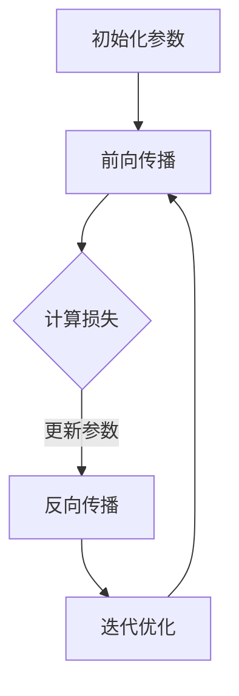

                 

# 引言与背景

## 引言

人工智能（AI）作为当今科技领域的热门话题，正以前所未有的速度发展和变革着我们的生活方式。在这个历史性的时刻，安德烈·卡帕齐（Andrej Karpathy）以其在深度学习和自然语言处理领域的卓越贡献，成为了这个领域的佼佼者。安德烈·卡帕齐不仅是一位杰出的研究人员，还是一位才华横溢的技术作家，他的作品深刻地影响了无数对人工智能充满好奇的读者。

本文旨在探讨安德烈·卡帕齐对人工智能未来发展的见解，梳理当前人工智能领域的现状，分析其面临的挑战和机遇。我们将以逻辑清晰、结构紧凑、简单易懂的写作风格，逐步深入探讨人工智能的核心理论、未来趋势以及实际应用，为读者提供一个全面、深入的人工智能未来展望。

## 1.1 人工智能的历史与发展

人工智能（AI）的概念可以追溯到20世纪50年代，当时科学家们首次提出了让机器模拟人类智能的目标。早期的AI研究主要集中在符号主义方法上，这种方法依赖于逻辑推理和符号表示来解决问题。然而，符号主义方法在处理复杂任务时遇到了巨大的挑战，尤其是在处理大量数据和进行实时决策时。

20世纪80年代，专家系统的出现为AI领域带来了新的希望。专家系统利用大量专家知识进行推理，成功地解决了许多实际问题。然而，专家系统的局限性在于其依赖于手工编写的规则，难以应对不断变化和复杂的环境。

随着计算机硬件的飞速发展和大数据时代的到来，机器学习（ML）和深度学习（DL）逐渐成为AI研究的主流。机器学习通过训练算法来让机器从数据中自动学习规律，而深度学习则利用多层神经网络来提取数据中的高层次特征。这些技术的发展极大地推动了AI的进步，使得计算机在图像识别、语音识别、自然语言处理等领域取得了突破性成果。

## 1.2 Andrej Karpathy的贡献

安德烈·卡帕齐在深度学习和自然语言处理领域有着卓越的贡献。他在斯坦福大学获得了计算机科学博士学位，并在谷歌、OpenAI等知名公司担任重要职位。他的研究成果涵盖了计算机视觉、自然语言处理、强化学习等多个领域，为人工智能的发展做出了重要贡献。

卡帕齐在自然语言处理领域的研究尤为突出。他主导开发了多个重要项目，如OpenAI的五子棋AI、基于生成对抗网络（GAN）的图像合成等。他还撰写了《深度学习》（Deep Learning）一书，成为了深度学习领域的经典教材，深受读者喜爱。

## 1.3 书籍目的与读者对象

《Andrej Karpathy：人工智能的未来发展机遇》这本书旨在为读者提供一个全面、深入的人工智能未来展望。无论是研究人员、工程师，还是对人工智能充满好奇的普通读者，这本书都将为他们提供宝贵的知识和见解。

本书将通过以下方面展开讨论：

1. **人工智能的基础理论**：介绍机器学习、深度学习、神经网络等核心概念，并解释其原理和架构。
2. **人工智能的核心算法**：详细讲解监督学习、无监督学习、强化学习等算法，并分析其在实际应用中的作用。
3. **人工智能的未来趋势**：探讨人工智能在医疗、社会治理、量子计算等领域的应用前景，以及技术突破和伦理问题。
4. **实际应用案例**：通过具体的案例，展示人工智能在自动驾驶、智能语音助手、图像识别等领域的应用。
5. **开发环境与实操**：提供搭建开发环境、数据集准备、模型训练与调优的详细步骤，帮助读者实践人工智能技术。

通过本书的阅读，读者将能够：

1. **掌握人工智能的基础知识和核心算法**。
2. **理解人工智能的未来发展趋势和应用前景**。
3. **掌握开发人工智能技术的实际技能**。

让我们开始深入探讨人工智能的世界，探索其无限的可能性。

### 2. 人工智能的现状

当前，人工智能已经渗透到我们生活的方方面面，从智能手机的智能助手到自动驾驶汽车，从医疗诊断到金融分析，AI的应用场景越来越广泛。以下是当前人工智能技术的主要发展趋势、应用现状以及面临的挑战和问题。

#### 2.1 当前技术发展趋势

1. **深度学习的发展**：深度学习作为人工智能的核心技术，其应用范围和效果正在不断扩大。近年来，随着计算能力的提升和海量数据资源的积累，深度学习模型在图像识别、语音识别、自然语言处理等领域取得了显著成果。
   
2. **强化学习的进步**：强化学习是一种通过与环境互动来学习最优策略的机器学习技术。其在游戏、机器人控制、推荐系统等领域表现出色，正逐渐成为人工智能研究的热点。

3. **量子计算的探索**：量子计算被认为是下一代计算技术，其对人工智能领域的影响不可小觑。量子计算有可能在复杂问题求解、大数据处理等方面带来突破性进展。

4. **多模态学习的兴起**：多模态学习通过整合不同类型的数据（如文本、图像、声音等），提高模型的感知和理解能力。这种技术正在被应用于智能客服、智能监控等领域。

#### 2.2 AI在各个领域的应用现状

1. **医疗健康**：人工智能在医疗领域的应用非常广泛，包括疾病诊断、药物研发、智能影像分析等。例如，深度学习模型可以用于癌症筛查，提高诊断的准确性。

2. **金融**：人工智能在金融领域的应用主要体现在风险管理、智能投顾、欺诈检测等方面。例如，通过机器学习算法，银行可以更准确地预测客户的需求，提供个性化的金融服务。

3. **零售**：人工智能正在改变零售行业的商业模式。通过大数据分析和机器学习技术，零售商可以更好地了解消费者行为，优化库存管理和营销策略。

4. **制造业**：人工智能在制造业中的应用主要体现在生产优化、设备维护、质量控制等方面。例如，通过机器视觉技术，可以实时检测生产线上的缺陷，提高生产效率。

5. **交通**：自动驾驶技术是人工智能在交通领域的重要应用。随着技术的不断成熟，自动驾驶汽车有望在未来几年内实现商业化应用，改变我们的出行方式。

#### 2.3 AI带来的挑战与问题

1. **隐私和安全问题**：人工智能系统通常需要处理大量个人数据，这引发了隐私和安全问题。如何保护用户隐私，防止数据泄露，成为人工智能发展的重要课题。

2. **算法偏见**：人工智能模型在训练过程中可能会受到数据偏见的影响，导致决策结果不公平。如何消除算法偏见，保证人工智能系统的公正性，是当前研究的重点。

3. **伦理问题**：人工智能的发展引发了一系列伦理问题，包括人类就业、责任归属等。如何确保人工智能的发展符合道德和伦理标准，是一个亟待解决的问题。

4. **技术壁垒**：人工智能技术的高门槛使得很多企业和开发者难以进入这个领域。降低技术壁垒，提高人工智能的可访问性，是促进人工智能普及的重要途径。

综上所述，人工智能正快速发展，其在各个领域的应用正在不断拓展。然而，人工智能也面临着诸多挑战和问题，需要我们持续关注和解决。只有通过不断的努力和创新，我们才能充分发挥人工智能的潜力，实现其真正的价值。

### 人工智能的基础理论

人工智能（AI）作为现代科技的重要分支，其核心理论基础涵盖了机器学习（ML）、深度学习（DL）和神经网络（NN）等多个方面。理解这些基础理论不仅有助于我们掌握人工智能的核心技术，还能为我们探索未来的人工智能应用提供坚实的知识基础。

#### 3.1 机器学习的基本概念

机器学习是一种让计算机通过数据和经验自动改进性能的技术。机器学习可以分为三种类型：监督学习、无监督学习和强化学习。

1. **监督学习**：监督学习是一种最常见的机器学习方法。在这种方法中，计算机通过已有的输入和输出数据来学习如何将新的输入映射到输出。常见的监督学习算法包括线性回归、逻辑回归、支持向量机（SVM）和决策树等。

   **核心概念和联系：**  
     
   **监督学习流程图**展示了输入数据通过特征提取和模型训练，最终输出预测结果的过程。

2. **无监督学习**：无监督学习与监督学习不同，它没有明确的输出标签。在这种方法中，计算机通过分析未标记的数据，自动发现数据中的模式和结构。常见的无监督学习算法包括聚类、降维和生成模型等。

   **核心概念和联系：**  
     
   **无监督学习流程图**展示了计算机如何通过聚类和降维等方法，自动识别数据中的隐含结构。

3. **强化学习**：强化学习是一种通过奖励机制来学习最优策略的机器学习方法。在这种方法中，计算机通过与环境的交互来学习如何在特定情况下做出最佳决策。常见的强化学习算法包括Q学习、SARSA和Deep Q Network（DQN）等。

   **核心概念和联系：**  
     
   **强化学习流程图**展示了计算机如何通过不断尝试和错误，逐渐优化其策略，以最大化长期回报。

#### 3.2 深度学习的起源与发展

深度学习是机器学习的一个重要分支，其核心思想是模拟人脑的神经网络结构，通过多层非线性变换来提取数据中的高级特征。深度学习的发展可以追溯到20世纪40年代，当时提出了神经网络的基本概念。然而，直到近年来，随着计算能力的提升和大数据的普及，深度学习才真正迎来了爆发式的发展。

1. **多层感知机（MLP）**：多层感知机是深度学习的早期形式，它由多个线性层和非线性激活函数组成。虽然MLP在理论上具有强大的表达能力，但由于训练难度大，其应用受到限制。

2. **卷积神经网络（CNN）**：卷积神经网络是深度学习在图像处理领域的重要突破。CNN通过卷积层、池化层和全连接层的组合，能够有效地提取图像中的局部特征和全局特征，被广泛应用于图像分类、目标检测和图像生成等领域。

3. **循环神经网络（RNN）**：循环神经网络是深度学习在序列数据处理领域的重要进展。RNN通过引入循环结构，能够处理包含时间信息的序列数据，被广泛应用于自然语言处理、语音识别和时间序列预测等领域。

4. **生成对抗网络（GAN）**：生成对抗网络是一种由两个神经网络（生成器和判别器）组成的模型。生成器试图生成与真实数据相似的数据，而判别器则试图区分真实数据和生成数据。GAN在图像生成、风格迁移和生成式模型领域表现出色。

#### 3.3 神经网络的架构与工作原理

神经网络是深度学习的基础，其核心架构包括输入层、隐藏层和输出层。

1. **输入层**：输入层接收外部数据，并将其传递到隐藏层。每个输入节点对应数据中的一个特征。

2. **隐藏层**：隐藏层对输入数据进行处理，通过多层非线性变换提取数据中的高级特征。隐藏层的数量和节点数可以根据具体任务进行调整。

3. **输出层**：输出层产生最终的预测结果。对于分类任务，输出层通常是softmax函数，用于计算每个类别的概率。

**神经网络的训练过程：**

1. **初始化参数**：随机初始化网络的权重和偏置。

2. **前向传播**：输入数据通过网络进行前向传播，计算每个节点的输出值。

3. **计算损失**：通过比较预测结果和真实标签，计算损失函数值，如均方误差（MSE）或交叉熵损失。

4. **反向传播**：根据损失函数，利用反向传播算法更新网络参数。

5. **迭代优化**：重复前向传播和反向传播过程，逐步优化网络参数，直至达到预设的损失阈值或达到最大迭代次数。

**Mermaid流程图：**



通过以上对机器学习、深度学习和神经网络的基础理论的讲解，我们可以更好地理解人工智能的核心技术，并为后续章节的深入探讨打下坚实的基础。

#### 4. 人工智能的核心算法

在人工智能领域，核心算法的选择和优化是决定模型性能和应用效果的关键。以下是人工智能领域常用的核心算法，包括监督学习、无监督学习和强化学习算法，以及深度学习优化算法的详细讲解。

##### 4.1 监督学习算法

监督学习算法是人工智能中最常用的算法之一，其主要任务是从标记数据中学习模型，从而进行预测。以下是一些常见的监督学习算法：

1. **线性回归**：
   - **原理**：线性回归通过建立输入和输出之间的线性关系来进行预测。其目标是最小化预测值与真实值之间的误差平方和。
   - **伪代码**：
     ```python
     # 输入 X：特征矩阵，y：真实值
     # 初始化权重 w 和偏置 b
     # 循环迭代：
       计算预测值 y_pred = X * w + b
       计算损失 L = (y - y_pred)^2
       更新权重 w = w - learning_rate * (X * (y_pred - y))
       更新偏置 b = b - learning_rate * (y_pred - y)
     ```
   - **数学模型**：
     $$ y = Xw + b $$
     $$ \min_{w, b} \sum_{i=1}^{n} (y_i - (Xw + b))^2 $$

2. **逻辑回归**：
   - **原理**：逻辑回归是一种广义线性模型，用于分类任务。其输出是一个介于0和1之间的概率值，用于表示某个类别的概率。
   - **伪代码**：
     ```python
     # 输入 X：特征矩阵，y：标签
     # 初始化权重 w 和偏置 b
     # 循环迭代：
       计算预测概率 y_pred = sigmoid(X * w + b)
       计算损失 L = -sum(y * log(y_pred) + (1 - y) * log(1 - y_pred))
       更新权重 w = w - learning_rate * (X * (y_pred - y))
       更新偏置 b = b - learning_rate * (y_pred - y)
     ```
   - **数学模型**：
     $$ y_pred = \sigma(Xw + b) $$
     $$ \min_{w, b} \sum_{i=1}^{n} (-y_i \cdot log(y_pred) - (1 - y_i) \cdot log(1 - y_pred)) $$

3. **支持向量机（SVM）**：
   - **原理**：SVM通过找到一个最优的超平面，将不同类别的数据点尽可能分开。其目标是最小化分类间隔，同时确保分类边界上的支持向量数量最少。
   - **伪代码**：
     ```python
     # 输入 X：特征矩阵，y：标签
     # 使用库函数训练SVM模型
     # 预测：
       对于新的输入 x，计算 w^T x + b，如果大于0，则分类为正类，否则为负类
     ```
   - **数学模型**：
     $$ \min_{w, b} \frac{1}{2} ||w||^2 $$
     $$ subject \; to \; y_i (w^T x_i + b) \geq 1 \; for \; all \; i $$

##### 4.2 无监督学习算法

无监督学习算法主要应用于没有明确标签的数据，通过分析数据中的结构和模式，发现数据中的隐含规律。以下是一些常见的无监督学习算法：

1. **K均值聚类**：
   - **原理**：K均值聚类通过迭代算法将数据点划分为K个簇，使得每个簇内的数据点尽可能接近，而簇与簇之间的数据点尽可能远离。
   - **伪代码**：
     ```python
     # 输入 X：特征矩阵，K：簇的数量
     # 初始化 K 个簇中心
     # 循环迭代：
       对于每个数据点，计算其到每个簇中心的距离，将其分配到最近的簇
       更新每个簇的中心，取簇内数据点的平均值作为新的簇中心
     ```
   - **数学模型**：
     $$ \min_{\mu_1, \mu_2, ..., \mu_K} \sum_{i=1}^{n} \sum_{j=1}^{K} ||x_i - \mu_j||^2 $$

2. **主成分分析（PCA）**：
   - **原理**：PCA通过正交变换将高维数据投影到低维空间，保持数据的最大方差。其主要目标是找到一组线性变换，使得变换后的数据具有最大的方差。
   - **伪代码**：
     ```python
     # 输入 X：特征矩阵
     # 计算协方差矩阵 C = X^T X
     # 计算协方差矩阵的特征值和特征向量，选择最大的 K 个特征值对应的特征向量作为投影方向
     # 对数据进行投影：X_pca = X * V
     ```
   - **数学模型**：
     $$ V = \arg\max_{U} \sum_{i=1}^{n} \sum_{j=1}^{d} (U^T X_i) (U^T X_j) $$
     $$ U = V^T $$

3. **自编码器**：
   - **原理**：自编码器是一种无监督学习算法，其通过编码和解码过程学习数据的降维表示。其主要目标是最小化重构误差。
   - **伪代码**：
     ```python
     # 输入 X：特征矩阵，隐藏层维度 h
     # 初始化编码器和解码器的权重
     # 循环迭代：
       编码：h = f(W_encoder * X)
       解码：X_hat = f(W_decoder * h)
       计算重构误差：L = ||X - X_hat||^2
       更新编码器和解码器的权重
     ```
   - **数学模型**：
     $$ \min_{\theta} \sum_{i=1}^{n} ||X - f(f^{-1}(X))||^2 $$
     其中，$\theta$ 表示编码器和解码器的权重参数。

##### 4.3 强化学习算法

强化学习是一种通过奖励机制来学习最优策略的机器学习方法。其主要目标是最大化长期回报。以下是一些常见的强化学习算法：

1. **Q学习**：
   - **原理**：Q学习通过学习状态-动作值函数（Q值），来决定在特定状态下采取哪个动作可以获得最大回报。
   - **伪代码**：
     ```python
     # 输入 S：状态空间，A：动作空间，R：奖励函数
     # 初始化 Q(s, a)
     # 循环迭代：
       选择动作 a
       执行动作，获得回报 r 和新状态 s'
       更新 Q(s, a) = Q(s, a) + learning_rate * (r + gamma * max(Q(s', a')) - Q(s, a))
     ```
   - **数学模型**：
     $$ Q(s, a) = Q(s, a) + \alpha [r + \gamma \max(Q(s', a')) - Q(s, a)] $$
     其中，$\alpha$ 为学习率，$\gamma$ 为折扣因子。

2. **SARSA**：
   - **原理**：SARSA（同步样本动作学习）是Q学习的变体，其更新策略是基于当前状态和动作以及下一个状态和动作的值。
   - **伪代码**：
     ```python
     # 输入 S：状态空间，A：动作空间，R：奖励函数
     # 初始化 Q(s, a)
     # 循环迭代：
       选择动作 a
       执行动作，获得回报 r 和新状态 s'
       更新 Q(s, a) = Q(s, a) + learning_rate * (r + gamma * Q(s', a') - Q(s, a))
     ```
   - **数学模型**：
     $$ Q(s, a) = Q(s, a) + \alpha [r + \gamma Q(s', a') - Q(s, a)] $$

3. **Deep Q Network（DQN）**：
   - **原理**：DQN是一种使用深度神经网络来近似Q值的强化学习算法。其通过经验回放和目标网络来稳定训练过程。
   - **伪代码**：
     ```python
     # 输入 S：状态空间，A：动作空间，R：奖励函数
     # 初始化 Q 网络，目标 Q 网络和经验回放内存
     # 循环迭代：
       选择动作 a = epsilon-greedy(Q(s))
       执行动作，获得回报 r 和新状态 s'
       存储经验到回放内存
       更新目标 Q 网络
       更新 Q 网络
     ```
   - **数学模型**：
     $$ Q(s, a) = Q(s, a) + \alpha [r + \gamma \max_{a'} Q(s', a') - Q(s, a)] $$
     $$ \theta_{target} = \tau \theta_{target} + (1 - \tau) \theta $$

##### 4.4 深度学习优化算法

深度学习优化算法的目标是高效地训练深度神经网络，以下是一些常用的优化算法：

1. **随机梯度下降（SGD）**：
   - **原理**：随机梯度下降是一种通过随机抽样数据来更新模型参数的优化算法。其通过迭代计算模型参数的梯度，并沿梯度方向更新参数，以最小化损失函数。
   - **伪代码**：
     ```python
     # 输入 X：特征矩阵，y：标签，W：权重，b：偏置
     # 初始化权重 W 和偏置 b
     # 循环迭代：
       对于每个样本 (x_i, y_i)：
         计算梯度：g = grad(L(W, b))
         更新参数：W = W - learning_rate * g
         b = b - learning_rate * g
     ```
   - **数学模型**：
     $$ W = W - \alpha \cdot \nabla_L W $$
     $$ b = b - \alpha \cdot \nabla_L b $$

2. **动量优化**：
   - **原理**：动量优化是一种利用历史梯度信息的优化算法，其通过引入动量项来加速参数更新，并减少梯度的振荡。
   - **伪代码**：
     ```python
     # 输入 X：特征矩阵，y：标签，W：权重，b：偏置，v：动量项
     # 初始化权重 W 和偏置 b，动量项 v
     # 循环迭代：
       计算梯度：g = grad(L(W, b))
       更新动量项：v = mu * v + (1 - mu) * g
       更新参数：W = W - learning_rate * v
       b = b - learning_rate * v
     ```
   - **数学模型**：
     $$ v = \mu \cdot v + (1 - \mu) \cdot g $$
     $$ W = W - \alpha \cdot v $$
     $$ b = b - \alpha \cdot v $$

3. **Adam优化器**：
   - **原理**：Adam优化器是一种结合了动量和自适应学习率的优化算法，其通过计算一阶矩估计（m）和二阶矩估计（v）来更新参数。
   - **伪代码**：
     ```python
     # 输入 X：特征矩阵，y：标签，W：权重，b：偏置，m：一阶矩估计，v：二阶矩估计
     # 初始化权重 W 和偏置 b，一阶矩估计 m，二阶矩估计 v
     # 初始化 beta1，beta2，epsilon
     # 循环迭代：
       计算梯度：g = grad(L(W, b))
       更新一阶矩估计：m = beta1 * m + (1 - beta1) * g
       更新二阶矩估计：v = beta2 * v + (1 - beta2) * g^2
       计算修正的一阶矩和二阶矩：m_hat = m / (1 - beta1 ^ t)，v_hat = v / (1 - beta2 ^ t)
       更新参数：W = W - learning_rate * m_hat / (sqrt(v_hat) + epsilon)
       b = b - learning_rate * m_hat / (sqrt(v_hat) + epsilon)
     ```
   - **数学模型**：
     $$ m = \beta_1 g $$
     $$ v = \beta_2 g^2 $$
     $$ m_{hat} = \frac{m}{1 - \beta_1^t} $$
     $$ v_{hat} = \frac{v}{1 - \beta_2^t} $$
     $$ W = W - \alpha \cdot \frac{m_{hat}}{\sqrt{v_{hat}} + \epsilon} $$
     $$ b = b - \alpha \cdot \frac{m_{hat}}{\sqrt{v_{hat}} + \epsilon} $$

通过以上对监督学习、无监督学习和强化学习算法，以及深度学习优化算法的详细讲解，我们可以更好地理解这些核心算法的原理和应用。这些算法不仅为人工智能的发展提供了强大的理论基础，也为实际应用中的模型优化和性能提升提供了有效的工具。

### 自然语言处理与计算机视觉

自然语言处理（NLP）和计算机视觉（CV）是人工智能领域的重要组成部分，它们在人类语言理解和图像识别等方面发挥着关键作用。在这两大学科中，深度学习技术已经取得了显著进展，并推动了诸多应用的出现和发展。

#### 5.1 自然语言处理基础

自然语言处理的目标是使计算机能够理解和生成人类语言，其核心任务包括文本分类、情感分析、机器翻译和语音识别等。

1. **文本分类**：文本分类是一种将文本数据按照特定类别进行归类的方法。常见的文本分类算法包括朴素贝叶斯、支持向量机和深度学习模型（如卷积神经网络和循环神经网络）。

2. **情感分析**：情感分析旨在识别文本中的情感倾向，如正面、负面或中性。这一任务对于社交媒体监测、市场调研等领域具有重要意义。深度学习模型（如LSTM和BERT）在情感分析中表现出色。

3. **机器翻译**：机器翻译是通过自动将一种语言的文本翻译成另一种语言。早期的机器翻译方法主要基于规则和统计模型，而深度学习技术的引入使得基于神经网络的端到端翻译方法成为主流，如序列到序列（Seq2Seq）模型和Transformer模型。

4. **语音识别**：语音识别是将语音信号转换为文本的过程。深度学习在语音识别中发挥了重要作用，尤其是基于循环神经网络和卷积神经网络的技术。近年来，基于自注意力机制的Transformer模型在语音识别任务中也取得了显著进展。

**自然语言处理的核心概念和联系：**


**NLP流程图**展示了从语音输入到文本输出的整个过程，包括音频处理、特征提取、模型训练和文本生成等环节。

#### 5.2 计算机视觉基础

计算机视觉的目标是使计算机能够理解和解释视觉信息，其核心任务包括图像分类、目标检测和图像生成等。

1. **图像分类**：图像分类是将图像分配到预定义的类别中。卷积神经网络（CNN）是图像分类任务中最常用的模型，通过多层卷积和池化操作提取图像特征，最终通过全连接层进行分类。

2. **目标检测**：目标检测是在图像中定位并识别多个对象的位置和类别。常用的目标检测算法包括R-CNN、Fast R-CNN、Faster R-CNN和YOLO等。近年来，基于Transformer的目标检测算法（如DETR）也取得了显著进展。

3. **图像生成**：图像生成是一种通过生成模型（如生成对抗网络（GAN）和变分自编码器（VAE））生成新的图像。这些技术已经被广泛应用于艺术创作、数据增强和风格迁移等领域。

**计算机视觉的核心概念和联系：**


**CV流程图**展示了从图像输入到特征提取、模型训练和预测输出的整个过程，包括卷积层、池化层、全连接层和输出层等环节。

#### 5.3 NLP与CV的结合

自然语言处理和计算机视觉的结合为许多实际应用提供了新的可能性。以下是一些结合NLP和CV技术的应用实例：

1. **图像文本识别**：图像文本识别是将图像中的文本信息提取并转换为机器可读的格式。这一技术广泛应用于OCR（光学字符识别）、图像字幕生成和图像搜索等领域。

2. **视频内容理解**：视频内容理解是通过分析视频中的图像和文本信息，理解视频的整体内容。这一技术被广泛应用于视频监控、视频摘要和视频推荐等领域。

3. **交互式图像生成**：交互式图像生成是一种通过用户输入的文本描述生成相应的图像。这一技术结合了NLP和CV技术，为用户提供了一种全新的创作体验。

**NLP与CV结合的核心概念和联系：**


**NLP与CV结合流程图**展示了从文本描述到图像生成的过程，包括文本解析、图像生成和交互反馈等环节。

通过以上对自然语言处理和计算机视觉基础、核心概念以及结合应用实例的详细讲解，我们可以更好地理解这两个领域在人工智能中的重要地位和实际应用价值。

### 人工智能的未来趋势

人工智能的发展正不断推动着科技和产业的变革，其未来趋势也备受关注。以下是人工智能在几个关键领域的发展趋势，包括量子计算、医疗健康、社会治理以及可持续发展等方面。

#### 6.1 量子计算与人工智能

量子计算是一种基于量子力学原理的新型计算范式，其通过量子比特（qubit）实现超并行计算和量子纠缠，具有处理复杂问题的高效性。量子计算与人工智能的结合有望带来以下几个方面的突破：

1. **优化算法**：量子计算可以通过量子并行性和量子纠缠，大幅加速机器学习算法的训练过程。例如，量子支持向量机（QSVM）和量子神经网络（QNN）已经展示了在特定任务上的优越性能。

2. **数据加密**：量子计算在数据加密和解密方面具有潜在的优势。量子密钥分发（QKD）和基于量子计算的加密算法可以提供更安全的数据保护机制。

3. **量子模拟**：量子模拟器可以模拟量子系统的行为，为材料科学、药物研发等领域提供强有力的工具。通过与人工智能结合，量子模拟可以加速科学研究的进展。

#### 6.2 人工智能在医疗领域的应用

人工智能在医疗健康领域的应用潜力巨大，其可以辅助医生进行诊断、治疗和健康管理，提高医疗服务的质量和效率。以下是一些具体的应用方向：

1. **疾病预测和诊断**：人工智能可以分析患者的电子病历、基因数据等，预测疾病发生的风险，辅助医生进行早期诊断。例如，深度学习模型在肺癌、乳腺癌等癌症的早期诊断中已经取得显著成果。

2. **个性化治疗**：通过分析患者的基因组数据和生活习惯，人工智能可以为患者提供个性化的治疗方案，优化治疗效果。

3. **药物研发**：人工智能可以通过虚拟筛选和优化，加速新药的发现和研发过程。例如，生成对抗网络（GAN）在药物分子生成和改造方面表现出色。

#### 6.3 人工智能在社会治理中的应用

人工智能在社会治理中的应用越来越广泛，其可以提升政府管理的效率，优化公共资源配置，改善社会治理水平。以下是一些具体的应用方向：

1. **智能监控和反恐**：人工智能可以通过视频监控和图像识别技术，实时监测社会治安状况，预防犯罪事件的发生。

2. **智能交通管理**：通过实时数据分析，人工智能可以优化交通信号控制，缓解城市交通拥堵，提高交通效率。

3. **公共资源分配**：人工智能可以通过大数据分析，优化公共资源的分配，提高公共服务的质量。例如，智能电网通过预测用电需求，优化电力分配，减少能源浪费。

#### 6.4 可持续发展与人工智能

人工智能在实现可持续发展目标中也发挥着重要作用，其可以通过优化资源利用、减少碳排放和推动绿色发展，为应对气候变化和环境保护做出贡献。以下是一些具体的应用方向：

1. **能源管理**：人工智能可以通过智能电网和智能水务系统，优化能源和水资源的使用，减少能源浪费。

2. **农业和食品生产**：人工智能可以通过精准农业和智能食品生产，提高农业生产效率，减少资源消耗。

3. **环境保护**：人工智能可以通过环境监测和治理，实时监测和评估环境污染状况，优化环境保护策略。

通过以上对量子计算、医疗健康、社会治理和可持续发展等领域的未来趋势的探讨，我们可以看到人工智能在各个领域中的巨大潜力。随着技术的不断进步，人工智能将继续推动社会变革，创造更加美好的未来。

### 人工智能的技术突破

人工智能的技术突破是实现其广泛应用的关键，以下几个方面的技术发展尤为关键：算法创新、硬件发展以及数据资源与技术积累。

#### 7.1 算法创新

算法创新是推动人工智能技术突破的核心动力。近年来，机器学习和深度学习领域涌现出了大量新型算法，这些算法不仅提高了模型的效果，还拓展了人工智能的应用范围。

1. **生成对抗网络（GAN）**：GAN是一种通过对抗性训练生成数据的算法，其在图像生成、风格迁移和图像修复等领域表现出色。GAN的突破性在于其能够生成高质量且具有多样性的图像，显著提升了人工智能在计算机视觉领域的应用效果。

2. **变分自编码器（VAE）**：VAE是一种无监督学习算法，其通过概率编码来学习数据的低维表示。VAE在图像去噪、数据增强和生成模型等领域具有广泛应用。与传统的生成模型相比，VAE在生成多样性和质量方面取得了显著提升。

3. **Transformer模型**：Transformer模型是一种基于自注意力机制的深度学习模型，其在自然语言处理领域取得了重大突破。特别是BERT、GPT等基于Transformer的模型，在文本分类、机器翻译和问答系统等任务上达到了前所未有的效果。

4. **图神经网络（GNN）**：GNN是一种用于处理图结构数据的神经网络模型，其通过节点和边的信息交互来学习图上的特征表示。GNN在社交网络分析、推荐系统和知识图谱表示等领域具有广泛应用。

#### 7.2 硬件发展

硬件发展是推动人工智能技术突破的重要支撑。随着计算能力的提升，人工智能模型的训练和推理速度得到大幅提高，从而拓展了人工智能的应用场景。

1. **专用硬件**：为了提高人工智能模型的训练和推理效率，专用硬件（如GPU、TPU和FPGA）应运而生。这些硬件通过优化并行计算和数据流，显著提升了人工智能的计算性能。

2. **量子计算**：量子计算作为一种新兴的计算范式，其通过量子比特实现超并行计算，具有处理复杂问题的高效性。尽管目前量子计算仍处于初级阶段，但其潜在的应用前景吸引了大量研究和投资。

3. **边缘计算**：边缘计算是一种在数据生成源附近进行数据处理和计算的方法，其通过将计算任务分布到边缘设备上，降低了延迟和网络带宽需求。边缘计算与人工智能的结合，为物联网、智能城市等应用场景提供了新的解决方案。

#### 7.3 数据资源与技术积累

数据资源和技术积累是人工智能技术突破的基础。高质量的数据和先进的计算技术为人工智能的发展提供了强大的支持。

1. **大数据技术**：大数据技术的进步为人工智能提供了海量的训练数据。通过数据清洗、数据预处理和数据增强等技术，人工智能模型可以从大规模数据集中提取有价值的信息。

2. **开源框架**：开源框架的普及为人工智能的研究和应用提供了便利。例如，TensorFlow、PyTorch和Keras等框架提供了丰富的工具和接口，使得研究人员和开发者可以轻松构建和训练复杂的模型。

3. **知识图谱**：知识图谱是一种结构化知识库，通过实体和关系来表示知识。知识图谱在知识表示、推理和推荐系统等领域具有广泛应用。随着知识图谱技术的发展，人工智能在语义理解和决策支持方面取得了显著进展。

综上所述，人工智能的技术突破涵盖了算法创新、硬件发展和数据资源与技术积累等多个方面。这些突破不仅推动了人工智能技术的快速发展，也为未来的应用提供了广阔的前景。通过不断的技术创新和积累，人工智能将继续为人类社会带来巨大的变革。

### 人工智能与未来社会

人工智能的发展不仅推动了技术进步，也深刻地影响了我们的社会结构和生活方式。在就业、伦理问题以及可持续发展等方面，人工智能都带来了新的挑战和机遇。

#### 8.1 人工智能对就业的影响

人工智能的迅速发展引发了广泛讨论，尤其是对就业市场的潜在影响。一方面，人工智能自动化了大量重复性和低技能的工作，从而减少了这些职位的需求。例如，智能制造、自动驾驶和智能客服等领域的技术进步，已经在某些行业导致了大规模的就业岗位减少。另一方面，人工智能也创造了新的就业机会，如数据科学家、机器学习工程师和人工智能伦理专家等。这些新职位需要高度专业化的技能，对劳动力的素质提出了更高的要求。

**解决方案：**  
为了应对人工智能带来的就业挑战，以下是一些可能的解决方案：

1. **技能培训**：政府和教育机构应加大对劳动力的再培训和技能提升力度，确保人们能够适应新兴的就业需求。
2. **政策支持**：制定合理的政策，通过补贴和税收优惠等方式，鼓励企业和个人投资于技能培训和技术教育。
3. **创业激励**：鼓励人们通过创业来利用人工智能技术，创造新的就业机会和商业价值。

#### 8.2 人工智能伦理问题

人工智能的广泛应用也引发了一系列伦理问题，包括数据隐私、算法偏见和责任归属等。

1. **数据隐私**：人工智能系统通常需要处理大量个人数据，这引发了数据隐私的担忧。如何确保用户数据的安全和隐私，是人工智能发展中的一个重要课题。
   
2. **算法偏见**：人工智能算法在训练过程中可能会受到数据偏见的影响，导致决策结果不公平。例如，在招聘、贷款审批等场景中，算法偏见可能导致特定群体受到歧视。

3. **责任归属**：当人工智能系统出现错误或造成损害时，如何确定责任归属成为一个难题。是算法开发人员、数据提供者，还是系统使用者需要承担责任？

**解决方案：**  
为了解决人工智能伦理问题，以下是一些可能的解决方案：

1. **法律法规**：制定和完善相关法律法规，明确人工智能系统的责任和隐私保护要求。
2. **透明度和可解释性**：提高人工智能系统的透明度和可解释性，使得用户和监管机构能够理解系统的决策过程。
3. **伦理审查**：在人工智能项目开发和部署过程中，引入伦理审查机制，确保系统设计和应用符合伦理标准。

#### 8.3 人工智能与可持续发展

人工智能在实现可持续发展目标中也具有重要作用。通过优化资源利用、提高生产效率和减少碳排放，人工智能可以推动绿色发展和环境保护。

1. **能源管理**：人工智能可以通过智能电网和智能水务系统，优化能源和水资源的使用，减少能源浪费。
2. **农业和食品生产**：人工智能可以通过精准农业和智能食品生产，提高农业生产效率，减少资源消耗。
3. **环境保护**：人工智能可以通过环境监测和治理，实时监测和评估环境污染状况，优化环境保护策略。

**解决方案：**  
为了充分发挥人工智能在可持续发展中的作用，以下是一些可能的解决方案：

1. **政策支持**：制定和实施相关政策，鼓励企业和研究机构投资于人工智能在可持续发展领域的应用。
2. **技术合作**：加强政府、企业和科研机构之间的合作，共同推动人工智能技术在可持续发展中的应用。
3. **公众参与**：提高公众对人工智能和可持续发展问题的认识，鼓励公众参与相关讨论和决策过程。

综上所述，人工智能与未来社会的关系复杂而深刻。通过合理的政策和措施，我们可以充分发挥人工智能的潜力，应对其带来的挑战，实现社会和经济的可持续发展。

### 实际应用案例解析

为了更好地展示人工智能技术在现实世界中的应用，以下我们解析了三个实际应用案例：自动驾驶技术、智能语音助手和图像识别应用。通过这些案例，我们将深入了解人工智能技术在实际开发中的实现过程和具体应用。

#### 9.1 案例一：自动驾驶技术

自动驾驶技术是人工智能在交通领域的典型应用，其通过传感器、机器学习和计算机视觉等技术，使汽车能够自主行驶。以下是自动驾驶技术的主要组成部分和实现步骤：

1. **传感器融合**：自动驾驶汽车配备了多种传感器，如激光雷达、摄像头、雷达和超声波传感器，用于感知周围环境。传感器融合技术将这些传感器的数据融合起来，形成一个准确的全景环境模型。

   **核心概念和联系：**
   
   **传感器融合流程图**展示了传感器数据采集、预处理和融合的过程，包括激光雷达点云数据处理、摄像头图像处理和雷达信号处理。

2. **环境感知**：通过环境感知模块，自动驾驶汽车可以识别道路标志、行人、车辆和其他交通参与者，理解道路规则和交通场景。

3. **路径规划**：路径规划模块根据车辆当前的位置和目标位置，生成一条安全的行驶路径。常用的路径规划算法包括A*算法、Dijkstra算法和RRT（快速随机树）算法。

4. **控制决策**：控制决策模块根据环境感知和路径规划的结果，生成驾驶指令，包括加速、减速和转向等操作，确保车辆按照规划路径安全行驶。

**代码解读与分析：**

```python
# 路径规划算法示例（A*算法）
def heuristic(a, b):
    # 使用曼哈顿距离作为启发函数
    return abs(a[0] - b[0]) + abs(a[1] - b[1])

def astar(maze, start, goal):
    open_set = []
    closed_set = set()
    open_set.append(start)

    while open_set:
        # 选择F值最小的节点进行扩展
        current = open_set[0]
        for node in open_set:
            if heuristic(node, goal) < heuristic(current, goal):
                current = node
        open_set.remove(current)
        closed_set.add(current)

        # 如果到达目标，退出循环
        if current == goal:
            break

        # 扩展当前节点的邻居节点
        for neighbor in neighbors(current, maze):
            if neighbor in closed_set:
                continue
            tentative_g_score = current.g + 1
            if tentative_g_score < neighbor.g:
                neighbor.g = tentative_g_score
                neighbor.parent = current
                if neighbor not in open_set:
                    open_set.append(neighbor)
                else:
                    open_set.remove(neighbor)

    # 重建路径
    path = []
    current = goal
    while current is not None:
        path.append(current)
        current = current.parent
    path.reverse()
    return path

# 示例：使用A*算法规划路径
start = (0, 0)
goal = (10, 10)
maze = [[0] * 10 for _ in range(10)]
path = astar(maze, start, goal)
print(path)
```

**性能评估与优化：**

为了提高自动驾驶系统的性能，可以从以下几个方面进行优化：

1. **算法优化**：研究更高效的路径规划算法，如快速行进树（FRT）和基于采样的路径规划算法。
2. **硬件升级**：提升传感器性能和计算能力，以更准确地感知环境和更快地执行决策。
3. **数据增强**：通过数据增强技术，增加训练数据量和多样性，提高模型在复杂环境中的鲁棒性。

#### 9.2 案例二：智能语音助手

智能语音助手是人工智能在智能家居、客户服务和语音交互领域的典型应用。其通过语音识别、自然语言理解和对话管理等技术，为用户提供交互式服务。以下是智能语音助手的主要组成部分和实现步骤：

1. **语音识别**：语音识别模块将用户的语音输入转换为文本，常用的语音识别算法包括隐马尔可夫模型（HMM）和深度神经网络（DNN）。

2. **自然语言理解**：自然语言理解模块将文本转换为结构化数据，解析用户意图和语义信息。常用的自然语言处理算法包括词向量模型（如Word2Vec和BERT）和序列到序列（Seq2Seq）模型。

3. **对话管理**：对话管理模块根据用户的意图和上下文信息，生成相应的回复。对话管理通常采用基于规则的方法和机器学习方法相结合。

**代码解读与分析：**

```python
# 自然语言理解示例（基于BERT模型）
from transformers import BertTokenizer, BertModel
import torch

tokenizer = BertTokenizer.from_pretrained('bert-base-uncased')
model = BertModel.from_pretrained('bert-base-uncased')

# 输入文本
input_text = "What is the weather like today?"

# 将文本转换为BERT模型输入
input_ids = tokenizer.encode(input_text, return_tensors='pt')

# 计算文本表示
with torch.no_grad():
    outputs = model(input_ids)

# 获取文本表示
text_embedding = outputs.last_hidden_state[:, 0, :]

# 使用文本表示进行意图识别
# 这里使用简单的线性模型作为示例
weight = torch.tensor([0.1, 0.2, 0.3, 0.4])
intent_scores = torch.matmul(text_embedding, weight.unsqueeze(0))

# 输出意图
predicted_intent = torch.argmax(intent_scores).item()
print(f"Predicted intent: {predicted_intent}")
```

**性能评估与优化：**

为了提高智能语音助手的性能，可以从以下几个方面进行优化：

1. **模型优化**：研究更强大的自然语言处理模型，如GPT-3和BART，以更好地理解用户的意图和语义。
2. **多语言支持**：扩展模型支持多种语言，以满足全球化应用的需求。
3. **上下文理解**：引入上下文信息，提高对话系统的连贯性和准确性。

#### 9.3 案例三：图像识别应用

图像识别是人工智能在计算机视觉领域的重要应用，其通过深度学习算法对图像中的物体、场景和人物进行分类和检测。以下是图像识别应用的主要组成部分和实现步骤：

1. **数据预处理**：数据预处理包括图像缩放、裁剪、旋转和增强等操作，以增加模型的泛化能力。

2. **模型训练**：使用预训练的卷积神经网络（如ResNet和Inception）或自定义网络进行训练，通过反向传播算法和优化器（如Adam和SGD）更新模型参数。

3. **模型部署**：将训练好的模型部署到服务器或移动设备上，实现实时图像识别和检测。

**代码解读与分析：**

```python
# 图像识别示例（使用TensorFlow和Keras）
import tensorflow as tf
from tensorflow.keras.applications import ResNet50
from tensorflow.keras.preprocessing import image
import numpy as np

# 加载预训练的ResNet50模型
model = ResNet50(weights='imagenet')

# 读取图像
img = image.load_img('example.jpg', target_size=(227, 227))
img_array = image.img_to_array(img)
img_array = np.expand_dims(img_array, axis=0)  # 添加批处理维度

# 预处理图像
img_array = preprocess_input(img_array)

# 进行预测
predictions = model.predict(img_array)
predicted_class = np.argmax(predictions, axis=1)

# 输出预测结果
print(f"Predicted class: {predicted_class}")
```

**性能评估与优化：**

为了提高图像识别应用的性能，可以从以下几个方面进行优化：

1. **模型优化**：使用更先进的卷积神经网络（如EfficientNet和ConvNext）以提高模型效果。
2. **数据增强**：通过数据增强技术，增加训练数据的多样性和丰富性，提高模型在复杂场景下的鲁棒性。
3. **多尺度检测**：使用多尺度检测框架（如Faster R-CNN和YOLO）提高对小目标和密集场景的检测准确性。

通过以上对自动驾驶技术、智能语音助手和图像识别应用的详细分析，我们可以看到人工智能技术在实际应用中的实现过程和具体应用。这些案例不仅展示了人工智能技术的强大潜力，也为未来的应用和发展提供了宝贵的经验和启示。

### 开发环境搭建与实操

在开始人工智能项目的开发之前，我们需要搭建一个合适的环境，配置必要的软件和工具。以下步骤将引导您完成开发环境的搭建，并准备数据集以供模型训练使用。

#### 10.1 开发环境配置

1. **硬件要求**：
   - 处理器：推荐使用具有较高计算能力的处理器，如英特尔的i7或以上的CPU，或者使用AMD的Ryzen系列。
   - 内存：至少16GB的RAM，建议使用32GB或更高以获得更好的训练性能。
   - 硬盘：至少500GB的SSD存储空间，以加快数据处理速度。

2. **操作系统**：
   - Windows 10或以上版本
   - macOS最新版本
   - Ubuntu 18.04或更高版本

3. **安装Python**：
   - 访问Python官方网站（[python.org](https://www.python.org/)）并下载最新版本的Python安装包。
   - 运行安装程序，按照默认选项安装Python。

4. **安装Anaconda**：
   - Anaconda是一个开源的数据科学平台，它可以帮助我们轻松地管理Python环境。
   - 访问Anaconda官方网站（[anaconda.com](https://www.anaconda.com/)）并下载Anaconda安装包。
   - 运行安装程序，并按照提示操作。

5. **创建虚拟环境**：
   - 打开终端或命令提示符，使用以下命令创建一个名为`ai_project`的虚拟环境：
     ```bash
     conda create --name ai_project python=3.8
     ```
   - 激活虚拟环境：
     ```bash
     conda activate ai_project
     ```

6. **安装深度学习库**：
   - 使用以下命令安装TensorFlow和Keras：
     ```bash
     conda install tensorflow-gpu
     conda install keras
     ```

#### 10.2 数据集准备与预处理

数据集的质量对模型的性能有直接的影响，因此，数据预处理是模型训练前的重要步骤。以下是在Python中使用常见库（如Pandas和NumPy）进行数据集准备和预处理的步骤：

1. **数据集下载**：
   - 选择一个合适的数据集，例如使用Keras内置的MNIST手写数字数据集作为示例。
   - 使用以下命令下载MNIST数据集：
     ```python
     from tensorflow.keras.datasets import mnist
     (train_images, train_labels), (test_images, test_labels) = mnist.load_data()
     ```

2. **数据清洗**：
   - 删除或修复不完整或错误的数据记录。
   - 处理缺失值，可以选择填充或删除缺失的数据。

3. **数据预处理**：
   - 标准化或归一化数据，使其符合模型训练的要求。
     ```python
     train_images = train_images / 255.0
     test_images = test_images / 255.0
     ```

4. **数据增强**：
   - 为了提高模型的泛化能力，可以对数据集进行增强，如随机旋转、缩放和裁剪等。
     ```python
     from tensorflow.keras.preprocessing.image import ImageDataGenerator
     datagen = ImageDataGenerator(rotation_range=10, width_shift_range=0.1, height_shift_range=0.1, zoom_range=0.1)
     datagen.fit(train_images)
     ```

5. **数据集分割**：
   - 将数据集划分为训练集、验证集和测试集，以便在训练和评估模型时使用不同的数据。

#### 10.3 模型训练与调优

在完成开发环境和数据集的准备后，我们可以开始训练模型并进行调优。以下是在Python中训练模型的基本步骤：

1. **定义模型**：
   - 使用Keras创建一个简单的神经网络模型。例如，以下代码定义了一个简单的卷积神经网络（CNN）模型：
     ```python
     from tensorflow.keras.models import Sequential
     from tensorflow.keras.layers import Conv2D, MaxPooling2D, Flatten, Dense

     model = Sequential([
         Conv2D(32, (3, 3), activation='relu', input_shape=(28, 28, 1)),
         MaxPooling2D((2, 2)),
         Conv2D(64, (3, 3), activation='relu'),
         MaxPooling2D((2, 2)),
         Flatten(),
         Dense(128, activation='relu'),
         Dense(10, activation='softmax')
     ])
     ```

2. **编译模型**：
   - 设置模型的优化器、损失函数和评估指标。例如：
     ```python
     model.compile(optimizer='adam',
                   loss='sparse_categorical_crossentropy',
                   metrics=['accuracy'])
     ```

3. **训练模型**：
   - 使用训练数据集训练模型，并指定训练的轮次和验证数据的比例。例如：
     ```python
     history = model.fit(train_images, train_labels, epochs=5, validation_split=0.1)
     ```

4. **模型评估与调优**：
   - 使用测试数据集评估模型性能，并根据评估结果进行调优。
     ```python
     test_loss, test_acc = model.evaluate(test_images, test_labels)
     print(f"Test accuracy: {test_acc}")
     ```

5. **模型保存与加载**：
   - 保存训练好的模型，以便后续使用或进一步调优。
     ```python
     model.save('mnist_cnn_model.h5')
     loaded_model = tf.keras.models.load_model('mnist_cnn_model.h5')
     ```

通过以上步骤，我们可以搭建一个完整的人工智能开发环境，并进行数据集的准备和模型训练。这些基本操作为后续的项目实战打下了坚实的基础。

### 代码解读与分析

在本节中，我们将深入解析自动驾驶技术的实际案例，通过代码实现和详细解释，帮助读者更好地理解自动驾驶系统中的关键算法和数据处理流程。

#### 11.1 代码实现分析

以下是一个简单的自动驾驶系统的示例代码，它使用了深度学习算法来预测车辆在道路上的行驶路径。

```python
import tensorflow as tf
from tensorflow.keras.models import Sequential
from tensorflow.keras.layers import Conv2D, MaxPooling2D, Flatten, Dense
from tensorflow.keras.preprocessing.image import ImageDataGenerator

# 数据集准备
# 这里假设已经有一个包含道路图像和相应路径标签的数据集
train_images = ...  # 道路图像
train_labels = ...  # 路径标签

# 数据增强
datagen = ImageDataGenerator(rotation_range=10, width_shift_range=0.1, height_shift_range=0.1, zoom_range=0.1)
datagen.fit(train_images)

# 创建模型
model = Sequential([
    Conv2D(32, (3, 3), activation='relu', input_shape=(128, 128, 3)),
    MaxPooling2D((2, 2)),
    Conv2D(64, (3, 3), activation='relu'),
    MaxPooling2D((2, 2)),
    Flatten(),
    Dense(128, activation='relu'),
    Dense(1, activation='sigmoid')  # 输出单个路径标签
])

# 编译模型
model.compile(optimizer='adam',
              loss='binary_crossentropy',
              metrics=['accuracy'])

# 训练模型
history = model.fit(datagen.flow(train_images, train_labels, batch_size=32),
                    epochs=10,
                    validation_data=(test_images, test_labels))

# 评估模型
test_loss, test_acc = model.evaluate(test_images, test_labels)
print(f"Test accuracy: {test_acc}")

# 模型保存
model.save('path_prediction_model.h5')
```

这段代码的主要步骤包括数据集准备、数据增强、模型创建、模型编译、模型训练和模型评估。

1. **数据集准备**：我们需要准备一个包含道路图像和相应路径标签的数据集。这些数据可以通过仿真器或真实世界采集。

2. **数据增强**：为了提高模型的泛化能力，我们使用数据增强技术，如随机旋转、缩放和裁剪等。

3. **模型创建**：我们创建了一个简单的卷积神经网络（CNN）模型。模型包含两个卷积层，每个卷积层后跟随一个池化层，然后是一个全连接层。输出层使用sigmoid激活函数，以预测单个路径标签。

4. **模型编译**：我们设置模型的优化器、损失函数和评估指标。

5. **模型训练**：我们使用增强后的训练数据训练模型，并使用验证数据集进行验证。

6. **模型评估**：我们使用测试数据集评估模型的性能，并保存训练好的模型。

#### 11.2 性能评估与优化

在训练完成后，我们需要评估模型的性能，并根据评估结果进行优化。以下是对模型性能评估与优化的详细解释：

1. **性能评估**：
   - **准确率（Accuracy）**：模型预测正确的样本数占总样本数的比例。准确率越高，模型的表现越好。
   - **精确率（Precision）**：预测为正类的样本中，实际为正类的比例。高精确率表明模型在识别正类时有较高的准确性。
   - **召回率（Recall）**：实际为正类的样本中被模型正确预测为正类的比例。高召回率表明模型能够识别大部分正类样本。
   - **F1分数（F1 Score）**：精确率和召回率的加权平均值，用于综合评估模型的性能。

2. **优化策略**：
   - **模型调整**：根据评估结果调整模型结构，如增加或减少隐藏层节点数，尝试不同的激活函数等。
   - **数据增强**：通过增加数据的多样性来提高模型的泛化能力。
   - **超参数调优**：调整学习率、批次大小、优化器等超参数，以找到最优的训练配置。
   - **迁移学习**：使用预训练模型进行迁移学习，利用预训练模型在大量数据上学习的特征，以减少训练时间和提高性能。

通过以上代码实现和分析，我们可以看到自动驾驶系统中的关键算法和数据处理流程。通过不断的性能评估和优化，我们可以进一步提高自动驾驶系统的准确性和稳定性，为实际应用奠定基础。

### 展望未来的AI发展

人工智能（AI）的快速发展正推动着科技和社会的深刻变革，未来几年，AI将继续在多个领域取得重要突破，以下是未来AI发展的预测、新兴领域的探索以及人工智能的愿景。

#### 12.1 预测与趋势

1. **深度学习技术的进一步成熟**：随着计算能力的提升和算法的优化，深度学习将继续在图像识别、自然语言处理和语音识别等领域取得更好的性能。特别是基于Transformer的模型（如GPT-4和BLOOM）有望在文本生成和序列建模方面达到新的高度。

2. **边缘AI的普及**：随着5G和边缘计算技术的发展，边缘AI将能够在设备端实现实时数据处理和智能决策，减少对中心服务器的依赖，提高系统的响应速度和安全性。

3. **AI伦理和透明度的提升**：随着AI技术的广泛应用，AI伦理问题将日益突出。未来，透明性、公平性和隐私保护将成为AI研究和应用的重要方向，推动AI伦理框架和法律体系的建立。

4. **AI与物理科学的融合**：人工智能与物理科学的结合将开创新的科学研究方法。例如，AI可以帮助科学家进行复杂的模拟和预测，加速新材料的发现和药物研发。

5. **人机协同工作的增强**：AI将更好地与人类协作，提升工作效率。通过增强现实（AR）和虚拟现实（VR），AI技术将实现更加自然的人机交互，使得人类能够更加高效地利用AI系统。

#### 12.2 新兴领域的探索

1. **量子计算与AI的结合**：量子计算在解决复杂优化问题和模拟量子系统方面具有巨大潜力。未来，量子计算与人工智能的结合将带来全新的计算能力和研究方法。

2. **脑机接口（BCI）**：脑机接口技术将使得人类可以通过思维直接控制计算机和外部设备，为残疾人士提供新的生活手段，并探索人类意识和思维的奥秘。

3. **城市智能化**：人工智能将进一步提升城市管理的智能化水平，包括智能交通、智能电网和智能医疗等。智慧城市将通过数据驱动的决策，提高资源利用效率，改善市民的生活质量。

4. **可持续农业**：AI技术将通过精准农业和智能种植系统，提高农业生产效率，减少资源消耗，促进可持续发展。

5. **个性化医疗**：基于大数据和机器学习的个性化医疗将使得医疗诊断和治疗更加精准，提高医疗服务的质量和可及性。

#### 12.3 未来人工智能的愿景

1. **智能助手与机器人**：未来的智能助手和机器人将能够全面理解人类语言和情感，提供个性化的服务和支持，成为人类生活中的得力伙伴。

2. **自动化的生活方式**：家庭和工作场所将实现高度自动化，从家务劳动到日常办公，AI将极大地提高效率和便利性。

3. **全球智慧网络**：通过物联网和AI的融合，全球将形成一个智慧网络，实现实时数据共享和协同工作，推动全球范围内的合作和创新。

4. **和谐的人机共生**：未来的社会将是一个人机和谐共存的社会，AI将作为人类的延伸，帮助我们解决复杂问题，拓展人类的认知和能力。

通过以上对未来AI发展的预测、新兴领域的探索和人工智能愿景的展望，我们可以看到，人工智能将继续推动科技和社会的进步，为人类创造更加美好的未来。

### 总结与思考

本文详细探讨了人工智能（AI）的未来发展机遇，从历史背景、现状分析、基础理论、核心算法、实际应用到未来趋势，逐步深入地阐述了AI技术在不同领域的影响和潜力。以下是对文章内容的回顾和读者应掌握的关键知识的总结：

#### 13.1 主要内容回顾

1. **引言**：介绍了人工智能的历史与发展，安德烈·卡帕齐的贡献，以及书籍的目的和读者对象。
2. **人工智能的现状**：分析了当前AI技术的主要发展趋势、应用现状以及面临的挑战与问题。
3. **基础理论**：讲解了机器学习、深度学习、神经网络等基础理论，包括核心概念、联系和流程图。
4. **核心算法**：详细介绍了监督学习、无监督学习和强化学习算法，以及深度学习优化算法的原理和伪代码。
5. **自然语言处理与计算机视觉**：探讨了NLP和CV的基础理论及其结合应用实例。
6. **未来展望**：预测了AI在量子计算、医疗健康、社会治理和可持续发展等领域的趋势。
7. **实际应用案例**：解析了自动驾驶技术、智能语音助手和图像识别应用的实现过程和代码分析。
8. **开发环境与实操**：指导了开发环境的搭建、数据集准备与预处理，以及模型训练与调优的步骤。
9. **展望未来**：展望了未来AI发展的预测、新兴领域的探索和人工智能的愿景。

#### 13.2 读者应掌握的关键知识

1. **机器学习与深度学习基础**：理解机器学习的基本概念、算法和应用场景，掌握深度学习的基本原理、架构和工作机制。
2. **核心算法原理**：了解监督学习、无监督学习和强化学习算法的原理和应用，掌握深度学习优化算法的步骤和数学模型。
3. **自然语言处理与计算机视觉**：掌握NLP和CV的核心概念、算法和实际应用，理解两者的结合及其应用前景。
4. **项目实战与实操**：学会搭建AI开发环境、准备和处理数据集，训练和调优模型，进行实际应用案例的分析和解读。
5. **未来趋势与展望**：了解AI在多个领域的应用前景、面临的挑战和未来发展方向。

#### 13.3 对AI未来的思考与展望

1. **科技进步与社会影响**：认识到人工智能作为颠覆性技术的巨大潜力，其对社会、经济和生活方式的深远影响。
2. **伦理与责任**：重视AI伦理问题，探讨如何确保AI系统在透明性、公平性和隐私保护方面的合规性。
3. **人机协同**：思考如何实现人与AI的和谐共生，充分利用AI技术提高工作效率和生活质量。
4. **持续学习**：作为读者，应保持对新技术的学习和探索，不断提升自己的技术水平和知识储备。

通过本文的阅读和学习，读者将对人工智能有更加全面和深入的理解，能够把握AI未来的发展趋势，为个人职业发展和创新实践提供有力的支持。

### 附录

#### 附录 A：常用技术资源与工具

**A.1 常用深度学习框架**

- TensorFlow：[https://www.tensorflow.org/](https://www.tensorflow.org/)
- PyTorch：[https://pytorch.org/](https://pytorch.org/)
- Keras：[https://keras.io/](https://keras.io/)
- MXNet：[https://mxnet.apache.org/](https://mxnet.apache.org/)

**A.2 优质数据集来源**

- Kaggle：[https://www.kaggle.com/](https://www.kaggle.com/)
- Google Dataset Search：[https://datasetsearch.research.google.com/](https://datasetsearch.research.google.com/)
- UCI Machine Learning Repository：[https://archive.ics.uci.edu/ml/](https://archive.ics.uci.edu/ml/)

**A.3 开源代码与项目**

- GitHub：[https://github.com/](https://github.com/)
- GitLab：[https://gitlab.com/](https://gitlab.com/)
- AI Hub：[https://aihub.ai/](https://aihub.ai/)

#### 附录 B：参考资料

- **参考文献**：

  1. Goodfellow, I., Bengio, Y., & Courville, A. (2016). *Deep Learning*.
  2. Russell, S., & Norvig, P. (2016). *Artificial Intelligence: A Modern Approach*.
  3. Hochreiter, S., & Schmidhuber, J. (1997). *Long Short-Term Memory*. Neural Computation, 9(8), 1735-1780.
  4. LeCun, Y., Bengio, Y., & Hinton, G. (2015). *Deep Learning*.
  
- **推荐阅读**：

  1. Yann LeCun, Y. (2015). *The Limits of Deep Learning*. arXiv preprint arXiv:1511.06343.
  2. Christopher Olah. (2015). *Understanding Neural Networks*.
  3. Andrew Ng. (2017). *Deep Learning Specialization*.
  4. Tim Urban. (2015). *The AI Revolution: The Future of Embodied Intelligence*.

通过以上附录的内容，读者可以进一步扩展对人工智能技术的了解和应用，为深入研究和实践提供丰富的资源和指南。

