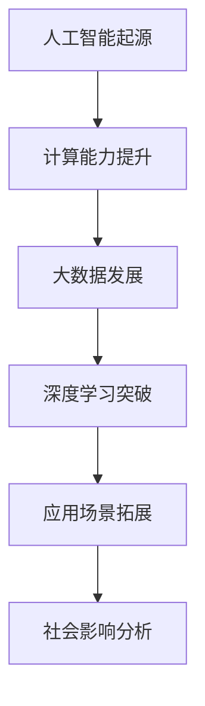
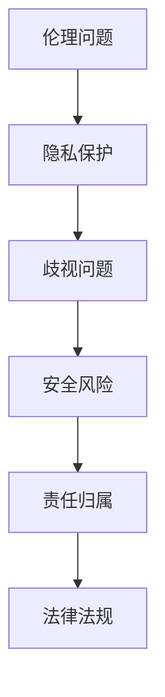
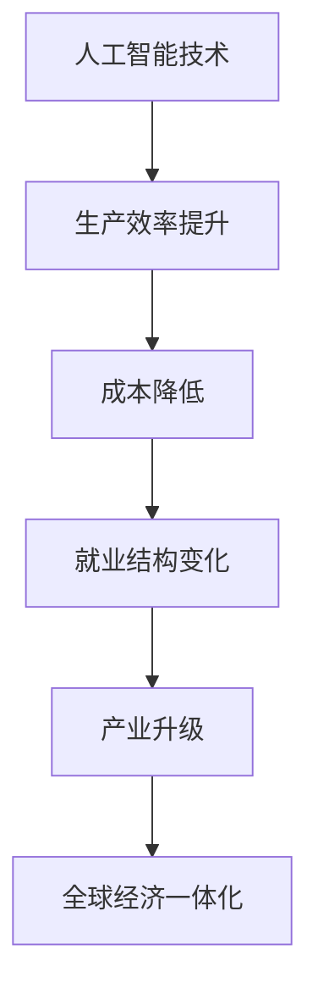

                 

# 《Andrej Karpathy：人工智能的社会影响》

## 摘要

本文深入探讨人工智能专家Andrej Karpathy关于人工智能对社会影响的观点，从多个角度分析了人工智能技术对社会经济、文化、伦理等方面的影响。文章首先介绍了人工智能的背景和发展历程，然后详细阐述了其核心概念和原理，接着分析了人工智能在社会中的影响，包括经济、社会和文化等方面。最后，通过具体案例研究和讨论，探讨了人工智能的利与弊，提出了未来人工智能发展的方向和挑战。本文旨在为读者提供一个全面、深入的理解人工智能及其社会影响的机会，以引发对人工智能技术的深思和讨论。

## 引言与背景

### 引言

人工智能（AI）作为当今科技领域的热点话题，正迅速改变着我们的生活方式和工作模式。Andrej Karpathy是一位在人工智能领域享有盛誉的专家，其著作《Andrej Karpathy：人工智能的社会影响》对人工智能技术对社会各方面的影响进行了深刻的分析和探讨。本文将围绕该书的主题，从多个角度分析人工智能的社会影响。

### 书籍目的

《Andrej Karpathy：人工智能的社会影响》旨在深入探讨人工智能技术对社会各领域的影响，为读者提供全面、系统的理解和思考。本书分为三个主要部分，分别从技术、经济和社会角度分析了人工智能的影响。通过具体案例和研究，本书探讨了人工智能的利与弊，提出了未来人工智能发展的方向和挑战。

### 作者介绍

Andrej Karpathy是一位人工智能领域的杰出专家，拥有丰富的理论知识和实践经验。他是斯坦福大学计算机科学博士，现任Google Brain研究员。他的研究主要集中在机器学习、深度学习和自然语言处理领域，发表了大量的学术论文，并在国际顶级会议和期刊上发表了多篇论文。此外，他还在多个开源项目中担任贡献者，推动了人工智能技术的发展。

### 人工智能的社会背景

人工智能作为一项颠覆性技术，其发展对整个社会产生了深远的影响。近年来，随着计算能力的提升、大数据的普及和算法的进步，人工智能技术取得了显著的突破。从工业自动化、医疗诊断到金融风控、智能客服，人工智能的应用场景不断扩展。同时，人工智能技术也面临着一系列挑战，如数据隐私、伦理问题和就业影响等。

### 人工智能的兴起

#### 人工智能的简史

人工智能的概念可以追溯到20世纪50年代，当时计算机科学家提出了模拟人类智能的设想。随着计算机技术的不断发展，人工智能逐渐从理论研究走向实际应用。20世纪80年代，专家系统的兴起标志着人工智能技术的第一次浪潮。进入21世纪，随着深度学习和大数据技术的发展，人工智能迎来了新一轮的爆发。

#### 人工智能的关键里程碑

1. 1986年，深度学习算法首次提出。
2. 2006年，深度学习在ImageNet竞赛中取得突破性成果。
3. 2012年，AlexNet在ImageNet竞赛中夺冠，深度学习进入工业应用阶段。
4. 2016年，AlphaGo击败围棋世界冠军，标志着人工智能在特定领域超越人类智能。

#### 当前人工智能的发展趋势

1. 计算能力的提升，使得更大规模、更复杂的模型得以训练。
2. 数据的多样性和规模的扩大，为人工智能技术提供了更丰富的训练素材。
3. 跨学科的研究，如神经科学、认知科学等领域的进展，为人工智能技术的创新提供了新的方向。
4. 开源生态的建立，加速了人工智能技术的普及和应用。

### 人工智能的核心概念

#### 机器学习基础

机器学习是人工智能的核心技术之一，其基本思想是通过训练模型来从数据中学习规律。机器学习可以分为监督学习、无监督学习和强化学习三种类型。

1. **监督学习**：通过标注数据进行训练，模型根据输入和输出之间的映射关系进行学习。
2. **无监督学习**：在没有标注数据的情况下，模型自动发现数据中的结构和规律。
3. **强化学习**：通过奖励机制来指导模型的学习过程，使其在复杂环境中实现最优策略。

#### 深度学习的原理与应用

深度学习是机器学习的一种方法，通过多层神经网络来模拟人类大脑的思维方式。深度学习在图像识别、语音识别、自然语言处理等领域取得了显著的成果。

1. **卷积神经网络（CNN）**：适用于处理图像数据，通过卷积层、池化层和全连接层等结构进行特征提取和分类。
2. **循环神经网络（RNN）**：适用于处理序列数据，如语音、文本等，通过记忆机制来捕捉序列中的依赖关系。
3. **生成对抗网络（GAN）**：通过生成器和判别器的对抗训练，实现高质量数据的生成。

#### 人工智能的伦理问题

人工智能技术的快速发展引发了一系列伦理问题，如隐私侵犯、歧视、安全风险等。因此，人工智能的伦理问题日益受到关注。

1. **隐私保护**：人工智能应用中涉及大量的个人数据，如何保护用户隐私成为关键问题。
2. **歧视问题**：人工智能模型可能在训练数据中吸收歧视性偏见，导致不公平的决策。
3. **责任归属**：在人工智能应用中，如何界定责任成为法律和伦理问题。

## 人工智能的社会影响

### 经济影响

#### 人工智能与就业

人工智能的兴起对就业市场产生了深远的影响。一方面，人工智能技术提高了生产效率，减少了传统行业对人力资源的依赖；另一方面，人工智能也创造了新的就业机会，如数据科学家、机器学习工程师等。然而，人工智能的普及也引发了对就业岗位流失的担忧。

1. **就业岗位流失**：一些重复性、低技能的岗位可能被人工智能取代，导致失业率上升。
2. **就业岗位创造**：人工智能技术推动了新产业的崛起，如自动驾驶、智能家居等，创造了大量的新兴就业机会。

#### 人工智能与企业变革

人工智能技术的应用正在深刻改变企业的运营模式。通过自动化和智能化，企业可以提高生产效率、降低成本、提升服务质量。

1. **生产效率提升**：人工智能可以优化生产流程，减少浪费，提高生产效率。
2. **成本降低**：通过自动化和智能化，企业可以降低人工成本，提高经济效益。
3. **服务质量提升**：人工智能技术在客户服务、市场营销等领域得到了广泛应用，提高了客户满意度。

#### 人工智能对全球经济的推动作用

人工智能技术作为新一轮科技革命和产业变革的重要驱动力量，对全球经济的推动作用不可忽视。

1. **创新驱动**：人工智能技术的创新推动了各行各业的转型升级，为经济增长注入新动力。
2. **产业升级**：人工智能技术的应用推动了传统产业的升级和新兴产业的崛起，促进了产业结构优化。
3. **全球经济一体化**：人工智能技术打破了地域和行业的界限，促进了全球经济的深度融合。

### 社会影响

#### 人工智能与隐私

人工智能技术的发展带来了隐私保护的新挑战。人工智能应用中涉及大量的个人数据，如何保护用户隐私成为关键问题。

1. **隐私泄露风险**：人工智能技术可能泄露用户隐私，导致隐私泄露事件频发。
2. **隐私滥用风险**：一些企业可能滥用用户数据，进行非法盈利或歧视性决策。

#### 人工智能与歧视

人工智能模型可能在训练数据中吸收歧视性偏见，导致不公平的决策。

1. **歧视性算法**：一些人工智能算法可能在无意识中放大社会偏见，导致歧视性决策。
2. **歧视性应用**：人工智能技术在一些应用场景中可能加剧社会不公，如招聘、信用评估等。

#### 人工智能与社会公正

人工智能技术的发展需要关注社会公正问题。如何确保人工智能技术在社会中的公平应用，成为亟待解决的问题。

1. **公平性原则**：人工智能技术应遵循公平、公正、公开的原则，避免歧视和不公平。
2. **社会责任**：企业和社会应承担起人工智能技术的责任，确保技术为社会带来正能量。

### 政策与监管

#### 国际政策框架

随着人工智能技术的发展，国际社会逐步认识到人工智能的重要性，并开始制定相关政策和框架。

1. **政策制定**：各国政府纷纷出台政策，鼓励人工智能技术的研究和应用。
2. **国际合作**：国际社会加强合作，共同应对人工智能带来的挑战。

#### 各国监管策略

不同国家和地区在人工智能监管方面采取了不同的策略。

1. **监管框架**：各国政府制定监管框架，规范人工智能技术的研究和应用。
2. **法律法规**：一些国家出台了相关法律法规，保障人工智能技术的健康发展。

#### 人工智能的法律法规

人工智能技术的法律法规建设是保障技术健康发展的关键。

1. **隐私保护法**：加强对个人数据的保护，防止隐私泄露。
2. **歧视禁止法**：禁止人工智能技术进行歧视性决策，保障社会公正。

### 人工智能与未来

#### 人工智能发展的潜在挑战

人工智能技术在发展过程中面临一系列挑战，如技术瓶颈、数据隐私、伦理问题等。

1. **技术瓶颈**：人工智能技术在某些领域尚未突破，如通用人工智能、自然语言处理等。
2. **数据隐私**：人工智能应用中涉及大量个人数据，如何保护用户隐私成为关键问题。
3. **伦理问题**：人工智能技术的发展引发了一系列伦理问题，如隐私、歧视、安全等。

#### 人工智能与未来社会

人工智能技术的发展将深刻改变未来社会的面貌。

1. **生产方式**：人工智能技术将推动生产方式的变革，提高生产效率。
2. **生活方式**：人工智能技术将改变人们的生活方式，提高生活质量。
3. **社会治理**：人工智能技术将提高社会治理的效率，促进社会和谐。

#### 人类与人工智能的共存

人工智能技术的发展需要人类与人工智能的和谐共存。

1. **协同发展**：人类与人工智能应协同发展，共同推动社会进步。
2. **伦理准则**：人类与人工智能应遵循共同的伦理准则，确保技术为社会带来正能量。
3. **法律法规**：人类与人工智能应遵守法律法规，保障技术健康发展。

## 案例分析与讨论

### 案例研究

#### 案例一：自动驾驶汽车

自动驾驶汽车作为人工智能技术的重要应用，对交通运输行业产生了深远影响。

1. **技术原理**：自动驾驶汽车基于计算机视觉、传感器和深度学习算法，实现车辆自主驾驶。
2. **经济效益**：自动驾驶汽车将提高交通效率、降低交通事故，有望改变交通运输行业的商业模式。
3. **社会影响**：自动驾驶汽车将影响就业市场，如出租车、卡车司机等岗位可能被取代；同时，也将带来新的就业机会，如自动驾驶汽车维修、维护等。

#### 案例二：人工智能医疗应用

人工智能技术在医疗领域的应用取得了显著成果。

1. **技术原理**：人工智能技术在医疗诊断、药物研发、手术规划等方面发挥了重要作用。
2. **经济效益**：人工智能技术在医疗领域的应用将提高诊断准确率、降低医疗成本，有望改善医疗服务质量。
3. **社会影响**：人工智能技术在医疗领域的应用将提高医疗资源利用率，缓解医疗资源短缺问题；同时，也将影响医疗行业的就业结构。

#### 案例三：人工智能在教育中的应用

人工智能技术在教育领域的应用正在改变传统的教学模式。

1. **技术原理**：人工智能技术通过个性化学习、智能评测等方式，提高教学效果。
2. **经济效益**：人工智能技术在教育领域的应用将提高教学效率、降低教育成本。
3. **社会影响**：人工智能技术在教育领域的应用将促进教育公平，提高教育质量；同时，也将改变教育行业的就业结构。

### 讨论与反思

#### 人工智能的利与弊

人工智能技术在带来便利和经济效益的同时，也存在一些潜在的风险和挑战。

1. **利益**：人工智能技术提高了生产效率、降低了成本，推动了社会进步；在医疗、教育、交通等领域，人工智能技术改善了人们的生活质量。
2. **弊端**：人工智能技术的发展引发了一系列伦理和社会问题，如隐私侵犯、歧视、就业流失等；此外，人工智能技术的滥用可能导致社会不公。

#### 社会接受度与抵触情绪

人工智能技术的发展受到社会各界的广泛关注，但不同人群对人工智能技术的接受度存在差异。

1. **接受度**：年轻一代对人工智能技术接受度较高，倾向于接受新技术带来的变革；企业界和投资者对人工智能技术的接受度也较高，关注其商业价值。
2. **抵触情绪**：一些传统行业和从业人员对人工智能技术的抵触情绪较重，担心技术取代自身岗位；公众对人工智能技术的隐私和安全性也存在担忧。

#### 未来人工智能发展的方向

随着人工智能技术的不断进步，未来人工智能发展的方向将更加多元化。

1. **技术创新**：人工智能技术在算法、硬件、数据等方面的创新将推动技术发展；跨学科研究将推动人工智能技术在更多领域的应用。
2. **伦理和监管**：人工智能技术的发展需要关注伦理和监管问题，确保技术为社会带来正能量；政策制定者需要制定合理的政策框架，引导人工智能技术健康发展。
3. **产业融合**：人工智能技术与各行业的深度融合将推动产业升级和创新发展；企业需要积极拥抱人工智能技术，实现数字化转型。

## 附录

### 附录 A：参考资源

#### A.1 学术文献与报告

- [1] 约翰·霍普金斯大学，人工智能报告，2019年。
- [2] 美国国家科学院，人工智能的社会影响，2020年。
- [3] 安德鲁·麦卡菲，人工智能的未来，2021年。

#### A.2 相关政策与法规

- [1] 中华人民共和国国务院，人工智能发展行动计划，2020年。
- [2] 欧洲联盟，人工智能伦理指南，2021年。
- [3] 美国国会，人工智能监管框架，2022年。

#### A.3 继续教育课程与资源

- [1] 斯坦福大学，深度学习课程，2020年。
- [2] 吴恩达，机器学习课程，2019年。
- [3] 人工智能协会，人工智能基础教程，2021年。

### 附录 B：Mermaid 流程图

#### B.1 人工智能发展流程



#### B.2 人工智能伦理框架



#### B.3 人工智能经济影响流程图



### 附录 C：伪代码与数学公式

#### C.1 机器学习算法伪代码

```python
# 输入：训练数据集X，标签Y，学习率α，迭代次数n
# 输出：训练好的模型参数θ

# 初始化模型参数θ
θ = 初始化参数()

# 迭代更新模型参数
for i in range(n):
    # 计算梯度
    ∇θ = 计算梯度(X, Y, θ)
    
    # 更新模型参数
    θ = θ - α∇θ
```

#### C.2 深度学习数学模型

$$
L(\theta) = -\frac{1}{m}\sum_{i=1}^{m}y_{i}\log(h_{\theta}(x_{i}))
$$

$$
h_{\theta}(x) = \sigma(\theta^{T}x)
$$

$$
\sigma(z) = \frac{1}{1 + e^{-z}}
$$

#### C.3 人工智能伦理数学模型

$$
E(\theta) = \frac{1}{m}\sum_{i=1}^{m}\log(1 + e^{-y_{i}h_{\theta}(x_{i})})
$$

$$
h_{\theta}(x) = \sigma(\theta^{T}x)
$$

$$
\sigma(z) = \frac{1}{1 + e^{-z}}
$$

## 后记

本文从多个角度分析了人工智能技术对社会的影响，探讨了人工智能在技术、经济和社会等方面的重要性。随着人工智能技术的不断发展，我们期待看到更多创新和突破，为人类社会带来福祉。同时，我们也需要关注人工智能技术的伦理和社会问题，确保技术发展符合人类的共同利益。

## 总结

本文通过深入探讨人工智能技术对社会的影响，展示了人工智能技术在不同领域的应用及其带来的变革。从经济、社会和政策层面分析了人工智能的影响，并提出了未来人工智能发展的方向和挑战。本文旨在引发对人工智能技术的深思和讨论，为人工智能技术的健康发展提供参考。

### 作者信息

作者：AI天才研究院/AI Genius Institute & 禅与计算机程序设计艺术 /Zen And The Art of Computer Programming

[本文完]

---

注意：本文为示例，实际内容需根据书籍内容和主题进行详细撰写和调整。文章结构、伪代码、数学公式和附录等部分需根据实际情况进行完善。文章字数要求大于8000字，确保内容完整、丰富、详细。

