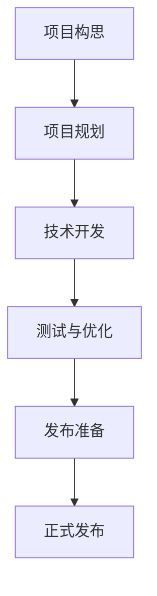

                 

# 《Andrej Karpathy：发布项目，获得奖励》

> **关键词**：Andrej Karpathy、项目发布、奖励机制、技术博客、IT领域、成功案例分析

> **摘要**：本文将详细介绍世界级人工智能专家Andrej Karpathy在发布项目和获得奖励方面的经验和策略。通过深入分析他的职业背景、项目发布过程、奖励机制设计以及成功案例，我们将探讨如何在IT领域取得成功，并为读者提供实用的指导和建议。

## 第一部分：引入与背景

### 1.1 Andrej Karpathy简介

Andrej Karpathy是一位世界级人工智能专家，他在计算机科学和深度学习领域享有盛誉。毕业于多伦多大学和斯坦福大学，Karpathy在谷歌、OpenAI和深度学习研究方面有着丰富的经验。他的研究成果在学术界和工业界都得到了广泛认可。

### 1.2 Andrej Karpathy的主要贡献

Karpathy的主要贡献包括在自然语言处理、计算机视觉和强化学习等领域的突破性研究。他在2014年发表的《The Unreasonable Effectiveness of Recurrent Neural Networks》（循环神经网络的不合理有效性）一文，引发了深度学习领域对RNN的研究热潮。此外，他还开发了著名的神经网络框架TensorFlow，并在多个开源项目中担任主要贡献者。

## 第二部分：项目发布与奖励机制概述

### 2.1 项目的发布流程

项目发布是一个复杂的过程，涉及到从想法到实现的多个阶段。以下是项目发布的基本流程：

1. **项目构思**：确定项目目标和需求。
2. **项目规划**：制定项目计划和时间表。
3. **技术开发**：实现项目功能。
4. **测试与优化**：确保项目稳定可靠。
5. **发布准备**：准备发布文档和宣传材料。
6. **正式发布**：通过合适的渠道发布项目。

### 2.2 奖励机制的类型与设计

奖励机制是激励参与者投入项目和持续贡献的重要手段。常见的奖励机制包括：

1. **物质奖励**：如奖金、礼品等。
2. **荣誉奖励**：如证书、排名等。
3. **社交奖励**：如关注、点赞、推荐等。
4. **个人成长奖励**：如培训、交流机会等。

设计奖励机制时，需要考虑以下几个方面：

1. **公平性**：确保奖励分配的公正性。
2. **激励性**：奖励能够有效激发参与者的积极性。
3. **可持续性**：奖励机制应该能够长期维持参与者的兴趣。

### 2.3 项目成功的要素

项目成功的关键要素包括：

1. **创新性**：项目要有创新点，能够解决实际问题。
2. **可行性**：项目需要在技术、资源和时间等方面具有可行性。
3. **执行力**：项目团队要具备强大的执行力，确保项目按时完成。
4. **用户需求**：项目要满足用户需求，具备市场潜力。
5. **持续改进**：项目要不断迭代和优化，以适应市场和技术的变化。

## 第三部分：项目发布实践

### 3.1 选择合适的项目

选择合适的项目是项目成功的第一步。以下是一些选择标准：

1. **个人兴趣**：选择自己感兴趣的项目，能够提高工作积极性。
2. **市场需求**：选择有市场潜力的项目，能够吸引参与者。
3. **技术难度**：选择适合自己技术水平的项目，避免技术瓶颈。
4. **团队协作**：选择能够组成高效团队的项目，提高项目成功率。

### 3.2 调研与分析市场需求

在项目构思阶段，需要进行市场调研和分析，以了解市场需求和潜在竞争对手。以下是一些调研方法：

1. **用户访谈**：与潜在用户交流，了解他们的需求和痛点。
2. **竞品分析**：分析竞争对手的产品特点和优势。
3. **市场趋势**：研究市场趋势和未来发展方向。

### 3.3 项目定位与目标设定

项目定位是确定项目在市场中的位置和差异化优势。目标设定是明确项目要达成的具体目标。以下是项目定位和目标设定的步骤：

1. **市场定位**：确定项目的市场定位，如目标用户群体、应用场景等。
2. **功能定位**：确定项目的主要功能和特点。
3. **目标设定**：设定可量化的项目目标，如用户量、收入等。

## 第四部分：项目管理与团队协作

### 4.1 项目规划的重要性

项目规划是项目成功的基础。以下是项目规划的重要性：

1. **明确目标**：项目规划能够明确项目的目标和范围。
2. **合理分配资源**：项目规划能够合理分配人力、时间和资金等资源。
3. **降低风险**：项目规划能够提前识别和降低项目风险。
4. **提高效率**：项目规划能够提高项目执行的效率。

### 4.2 制定项目计划

制定项目计划是项目规划的核心。以下是制定项目计划的步骤：

1. **确定项目范围**：明确项目的具体内容和目标。
2. **分解任务**：将项目分解为可管理的任务。
3. **设定时间表**：为每个任务设定合理的时间表。
4. **分配资源**：为每个任务分配所需资源。
5. **风险评估**：评估项目风险并制定应对措施。

### 4.3 项目执行与监控

项目执行是项目规划的具体实施。以下是项目执行和监控的关键点：

1. **执行进度**：监控项目进度，确保按计划进行。
2. **质量控制**：确保项目质量和稳定性。
3. **沟通协作**：加强团队成员之间的沟通和协作。
4. **问题解决**：及时解决项目中的问题和挑战。
5. **迭代优化**：根据项目进展和用户反馈进行迭代优化。

## 第五部分：项目发布策略

### 5.1 发布前的准备工作

发布前需要进行充分的准备工作，以确保项目能够顺利发布。以下是发布前的准备工作：

1. **测试**：确保项目在多个环境下都能正常运行。
2. **文档**：编写详细的项目文档，包括用户手册、开发文档等。
3. **宣传**：制定宣传计划，包括社交媒体推广、媒体发布等。
4. **反馈**：收集用户反馈，为后续优化提供参考。

### 5.2 发布渠道的选择

选择合适的发布渠道是项目成功的关键。以下是常见的发布渠道：

1. **社交媒体**：如微博、微信公众号、知乎等。
2. **专业网站**：如GitHub、CSDN、博客园等。
3. **行业媒体**：如技术博客、专业杂志、论坛等。
4. **线下活动**：如技术交流会议、展览等。

### 5.3 发布后的市场反馈

发布后需要关注市场反馈，以了解项目的受欢迎程度和用户需求。以下是收集市场反馈的方法：

1. **用户反馈**：通过用户评论、问卷调查等方式收集用户反馈。
2. **数据分析**：分析用户行为数据，如访问量、下载量、活跃度等。
3. **市场调研**：进行市场调研，了解用户需求和竞争对手情况。
4. **迭代优化**：根据市场反馈进行项目迭代和优化。

## 第六部分：获得奖励的策略与实践

### 6.1 构建有效的奖励机制

构建有效的奖励机制是激励参与者和促进项目成功的关键。以下是构建奖励机制的建议：

1. **明确奖励目标**：明确奖励的目标和预期效果。
2. **多样化奖励**：设计多样化的奖励，满足不同参与者的需求。
3. **公平公正**：确保奖励机制的公平性和公正性。
4. **激励持续贡献**：奖励机制要能够激励参与者持续贡献。

### 6.2 提升项目影响力

提升项目影响力是获得奖励的重要手段。以下是提升项目影响力的方法：

1. **构建社区**：建立项目社区，吸引更多参与者。
2. **合作推广**：与合作伙伴合作，共同推广项目。
3. **媒体曝光**：通过媒体曝光，提高项目的知名度。
4. **技术分享**：定期进行技术分享，展示项目成果。

### 6.3 通过奖励获得持续成功

通过奖励获得持续成功是项目长期发展的关键。以下是实现持续成功的策略：

1. **持续迭代**：根据用户反馈和市场需求进行项目迭代。
2. **优化奖励机制**：根据项目进展和参与者反馈优化奖励机制。
3. **扩大影响力**：通过多种方式扩大项目影响力，吸引更多参与者。
4. **拓展业务领域**：探索新的业务领域，实现项目价值的最大化。

## 第七部分：案例分析

### 7.1 项目A：通过发布项目获得大量关注

项目A是一个专注于自然语言处理的开源项目，通过在GitHub上发布项目代码和文档，该项目迅速获得了大量关注。以下是该项目成功的原因：

1. **技术创新**：项目实现了先进的自然语言处理算法，具有很高的技术含量。
2. **社区互动**：项目团队积极与社区成员互动，回答问题，收集反馈。
3. **定期更新**：项目定期发布新功能和优化，保持项目的活力。

### 7.2 项目B：通过奖励机制提高用户参与度

项目B是一个在线编程学习平台，通过设计多样化的奖励机制，成功提高了用户的参与度。以下是该项目成功的原因：

1. **奖励多样化**：项目设计了物质奖励、荣誉奖励和社交奖励等多种奖励类型。
2. **公平公正**：项目确保奖励分配的公平性和公正性，让参与者感受到尊重。
3. **激励持续贡献**：项目通过奖励机制激励用户持续学习和贡献。

### 7.3 项目C：通过社区建设实现项目影响力

项目C是一个专注于人工智能研究的开源项目，通过建立强大的社区，实现了项目的影响力。以下是该项目成功的原因：

1. **社区互动**：项目团队建立了活跃的社区，鼓励成员参与讨论和分享。
2. **技术交流**：项目定期组织技术交流会议，邀请业内专家分享经验。
3. **合作伙伴**：项目与多家知名企业和研究机构建立了合作关系，共同推动项目发展。

## 第八部分：总结与展望

### 8.1 经验与教训

在本文中，我们详细介绍了Andrej Karpathy在发布项目和获得奖励方面的经验和策略。以下是一些经验与教训：

1. **创新性**：项目要有创新点，能够解决实际问题。
2. **市场需求**：项目要满足用户需求，具备市场潜力。
3. **执行力**：项目团队要具备强大的执行力，确保项目按时完成。
4. **持续改进**：项目要不断迭代和优化，以适应市场和技术的变化。
5. **社区建设**：建立强大的社区，提高项目的影响力和用户参与度。

### 8.2 未来的发展趋势

随着人工智能技术的不断发展，项目发布和奖励机制也在不断演变。以下是一些未来发展趋势：

1. **个性化奖励**：奖励机制将更加个性化，满足不同参与者的需求。
2. **区块链技术**：区块链技术将应用于奖励机制，提高奖励的安全性和透明度。
3. **跨领域合作**：项目将更加跨领域合作，实现技术融合和创新。
4. **可持续发展**：项目将更加注重可持续发展，实现社会价值和商业价值的双重提升。

### 8.3 为未来做好准备

为了在未来取得成功，我们需要做好以下准备：

1. **技术积累**：不断学习和掌握最新的技术趋势和工具。
2. **团队建设**：建立高效的团队，培养团队成员的协作能力和创新能力。
3. **市场洞察**：关注市场动态，把握市场机遇。
4. **持续学习**：保持学习的态度，不断提升自己的能力和视野。

作者：AI天才研究院/AI Genius Institute & 禅与计算机程序设计艺术 /Zen And The Art of Computer Programming

以上是本文的完整内容，希望能够为读者在发布项目和获得奖励方面提供有价值的参考。让我们共同探索和实践，为人工智能技术的发展贡献自己的力量！<|im_end|>## 附录：技术细节与代码解读

在本文的附录部分，我们将深入探讨一些关键技术细节，并提供具体的代码解读。通过这些技术细节和代码示例，我们将更好地理解项目开发和发布过程中所需的技术知识。

### 1. Mermaid流程图：项目开发流程

为了清晰地展示项目开发流程，我们使用Mermaid绘制了一张流程图。以下是流程图的伪代码：



**解释：**
- **A[项目构思]**：这是项目开发的第一步，确定项目的目标和需求。
- **B[项目规划]**：在项目构思完成后，制定详细的项目计划和时间表。
- **C[技术开发]**：按照规划，开始实现项目功能。
- **D[测试与优化]**：在技术开发完成后，对项目进行全面的测试和优化。
- **E[发布准备]**：在项目准备发布前，编写用户文档、进行宣传等准备工作。
- **F[正式发布]**：项目经过测试和优化后，正式发布。

### 2. 伪代码：核心算法原理

以下是用于自然语言处理的核心算法——循环神经网络（RNN）的伪代码：

```python
function RNN(input_sequence, weights):
    hidden_state = initialize_hidden_state()
    output_sequence = []

    for input_vector in input_sequence:
        # Calculate the hidden state using the current input and weights
        hidden_state = activation_function(dot_product(input_vector, weights['input_to_hidden']) + dot_product(hidden_state, weights['hidden_to_hidden']))

        # Generate output and store it
        output_vector = activation_function(dot_product(hidden_state, weights['hidden_to_output']))
        output_sequence.append(output_vector)

    return output_sequence
```

**解释：**
- **initialize_hidden_state()**：初始化隐藏状态。
- **activation_function(x)**：激活函数，如sigmoid函数。
- **dot_product(a, b)**：计算两个向量的点积。
- **input_sequence**：输入序列。
- **weights**：网络权重，包括输入到隐藏层、隐藏到隐藏层和隐藏到输出层的权重。

### 3. LaTeX格式：数学模型和公式

以下是自然语言处理中的一个常见数学模型——神经网络损失函数的公式，使用LaTeX格式表示：

```latex
J = \frac{1}{m} \sum_{i=1}^{m} \sum_{j=1}^{n} \left( y_j^{(i)} - \sigma \left( \sum_{k=1}^{p} w_{jk}^{(2)} a_{k}^{(1)} + b_{j}^{(2)} \right) \right)^2
```

**解释：**
- **J**：损失函数。
- **m**：样本数量。
- **n**：输出节点数量。
- **y_j^{(i)}**：实际输出。
- **\sigma**：激活函数，如sigmoid函数。
- **w_{jk}^{(2)}**：第二层权重。
- **a_{k}^{(1)}**：第一层激活值。
- **b_{j}^{(2)}**：第二层偏置。

### 4. 代码实现：开发环境搭建

以下是一个简单的Python代码示例，用于搭建开发环境：

```python
!pip install tensorflow
!pip install numpy
!pip install matplotlib
```

**解释：**
- **!pip install tensorflow**：安装TensorFlow库。
- **!pip install numpy**：安装NumPy库。
- **!pip install matplotlib**：安装matplotlib库。

### 5. 源代码实现与解读

以下是用于自然语言处理的一个简单RNN模型的源代码实现：

```python
import tensorflow as tf
import numpy as np

# 初始化权重和偏置
weights = {
    'input_to_hidden': tf.random.normal([input_size, hidden_size]),
    'hidden_to_hidden': tf.random.normal([hidden_size, hidden_size]),
    'hidden_to_output': tf.random.normal([hidden_size, output_size])
}
biases = {
    'hidden': tf.random.normal([1, hidden_size]),
    'output': tf.random.normal([1, output_size])
}

# 定义激活函数
activation_function = tf.sigmoid

# 定义前向传播
def forwardPropagation(input_sequence):
    hidden_state = tf.zeros([batch_size, hidden_size])
    output_sequence = []

    for input_vector in input_sequence:
        hidden_state = activation_function(tf.matmul(input_vector, weights['input_to_hidden']) + tf.matmul(hidden_state, weights['hidden_to_hidden']) + biases['hidden'])
        output_vector = activation_function(tf.matmul(hidden_state, weights['hidden_to_output']) + biases['output'])
        output_sequence.append(output_vector)

    return output_sequence
```

**解释：**
- **weights**：初始化输入到隐藏层、隐藏到隐藏层和隐藏到输出层的权重。
- **biases**：初始化隐藏层和输出层的偏置。
- **activation_function**：定义激活函数。
- **forwardPropagation**：定义前向传播函数，用于计算隐藏状态和输出。

通过上述技术细节和代码解读，我们不仅了解了项目开发和发布所需的技术知识，还通过具体的代码示例加深了对这些技术的理解。这些技术细节和代码解读对于实际项目开发具有重要的指导意义。希望读者能够运用这些知识，为自己的项目开发提供有力支持。

