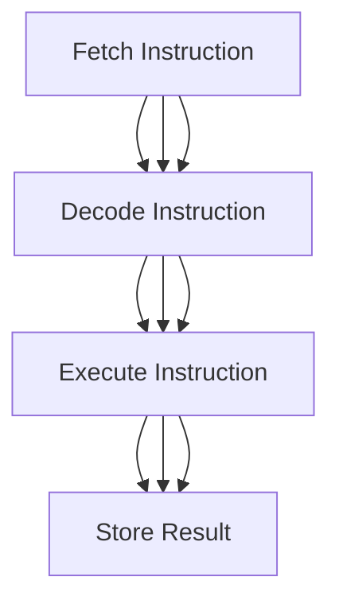
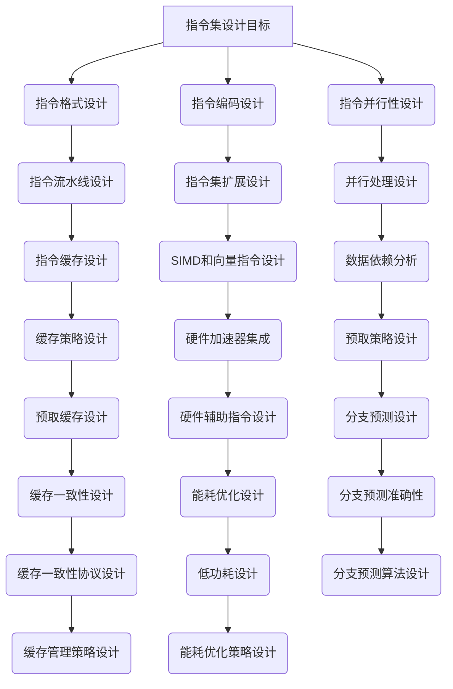
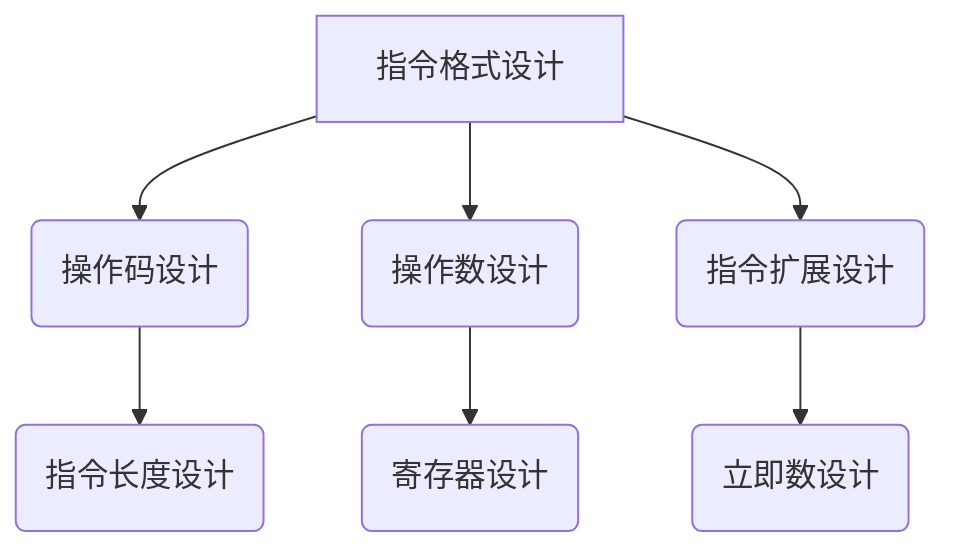
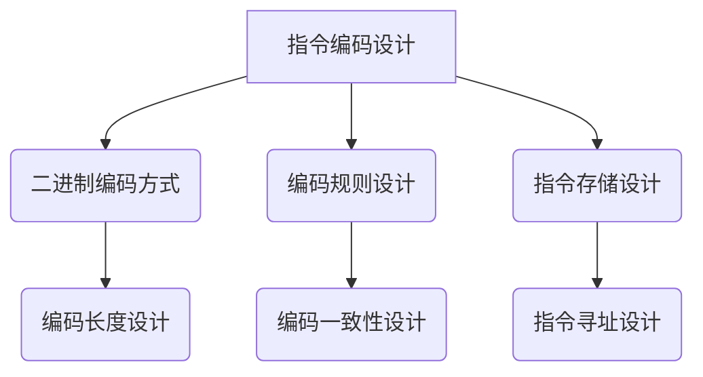
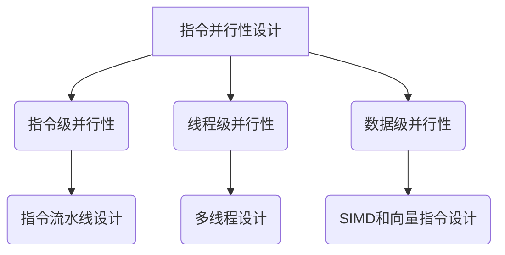
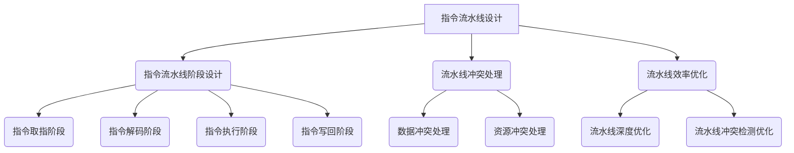
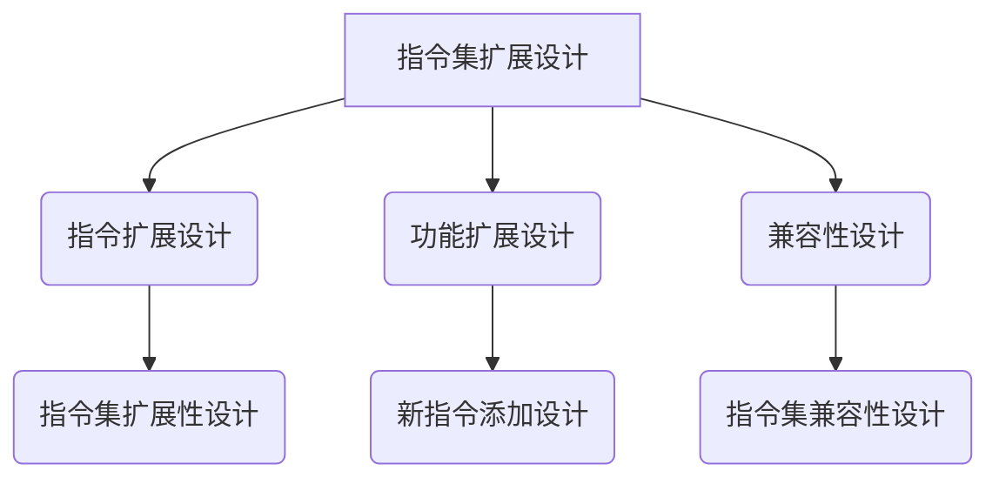

                 

# 《CPU 的局限性：有限的指令集阻碍创新》

> **关键词**：CPU、指令集、创新、RISC、复杂指令集、编程模型、硬件优化、人工智能

> **摘要**：本文将深入探讨CPU设计中指令集的局限性如何影响技术创新。通过分析CPU架构的演变、指令集的局限性及其对编程模型和硬件优化的影响，我们揭示了指令集在技术创新中的瓶颈。同时，本文还将探讨现有解决方案和未来CPU设计趋势，为突破这些局限提供思路。

## 《CPU 的局限性：有限的指令集阻碍创新》目录大纲

## 第一部分：引言与背景

### 1.1 书籍概述

- **目的与意义**：探讨CPU设计中的局限性如何影响技术创新。

- **核心问题**：为何有限的指令集成为创新发展的瓶颈？

### 1.2 CPU架构的演变

- **早期CPU设计**：指令集的简单性与局限性。

- **现代CPU架构**：高级指令集的引入与挑战。

## 第二部分：CPU设计中的局限性

### 2.1 指令集的局限性

- **指令数量的限制**：影响代码优化与执行效率。

- **指令复杂性的限制**：影响指令并行执行的难度。

### 2.2 指令集与编程模型的关系

- **低级指令集的编程模型**：对程序员技能的依赖。

- **高级指令集的编程模型**：抽象化与易用性。

### 2.3 指令集与硬件优化的关系

- **指令集设计对硬件优化的影响**：指令流水线、缓存、预取策略等。

## 第三部分：局限性对技术创新的影响

### 3.1 案例研究

- **案例1**：ARM架构与RISC指令集的影响。

- **案例2**：x86架构与复杂指令集的影响。

### 3.2 技术创新受限的领域

- **人工智能**：指令集限制与算法创新的关系。

- **图形处理**：指令集限制与图形处理效率的关系。

- **网络处理**：指令集限制与网络通信效率的关系。

### 3.3 现代CPU设计尝试突破局限性

- **硬件加速器**：GPU、FPGA等。

- **新型指令集架构**：例如SIMD指令集、向量指令集。

## 第四部分：解决方案与未来展望

### 4.1 指令集扩展技术

- **指令集扩展**：通过软件模拟实现。

- **硬件辅助指令集扩展**：如SIMD、向量指令集。

### 4.2 编程模型创新

- **高级抽象**：如函数式编程、逻辑编程等。

- **编译器优化**：代码级并行化、自动向量化等。

### 4.3 未来CPU设计趋势

- **多样化指令集**：针对不同应用场景设计专用指令集。

- **自适应指令集**：动态调整指令集以适应不同工作负载。

## 附录

### 附录A：核心概念与联系

- **Mermaid流程图**：展示CPU指令集设计的关键环节与相互关系。

### 附录B：核心算法原理讲解

- **伪代码**：详细阐述CPU指令集设计中的关键算法。

### 附录C：数学模型和数学公式

- **详细讲解**：涉及CPU指令集设计中的数学模型。

- **举例说明**：通过实际案例展示数学模型的应用。

### 附录D：项目实战

- **代码实际案例**：CPU指令集设计的实现细节。

- **详细解释说明**：代码的开发环境、实现方法和分析。

## 附录 A: CPU指令集设计工具与资源

### A.1 主流CPU指令集设计工具

- **ISA模拟器**：如ISA Spaghetti、SimICS等。

- **编译器与工具链**：如GCC、LLVM等。

### A.2 相关书籍与论文

- **推荐书籍**：介绍CPU指令集设计的经典书籍。

- **重要论文**：关于CPU指令集创新与优化的关键论文。

---

现在，我们将开始详细探讨CPU指令集的局限性及其对技术创新的影响。

## 第一部分：引言与背景

### 1.1 书籍概述

在计算机科学领域，CPU作为计算的核心组件，其性能直接决定了计算机系统的整体性能。然而，随着计算需求的不断增长，CPU的设计也面临着前所未有的挑战。本文旨在探讨CPU设计中指令集的局限性如何影响技术创新，以及如何通过改进指令集设计来推动计算机技术的发展。

**目的与意义**：本文的主要目的是揭示CPU指令集设计中的瓶颈，分析其如何限制技术创新。通过深入研究CPU架构的演变，我们将探讨早期CPU设计的局限性以及现代CPU架构的挑战，从而为未来的CPU设计提供有益的启示。

**核心问题**：本文的核心问题是为何有限的指令集成为创新发展的瓶颈。在CPU设计中，指令集是核心的基础架构，其设计直接影响到CPU的性能、能耗和可扩展性。然而，由于历史原因和技术限制，现有的指令集往往无法完全满足不断变化的计算需求，从而限制了技术创新的步伐。

### 1.2 CPU架构的演变

计算机CPU架构的发展历程可以追溯到上世纪40年代。早期的计算机如ENIAC和EDVAC，其指令集非常简单，主要目的是完成基本的算术和逻辑操作。随着计算机技术的发展，CPU的指令集逐渐变得更加复杂，以支持更多的功能。

#### 早期CPU设计

在早期CPU设计中，指令集的设计相对简单，主要目的是提高计算效率和降低成本。典型的早期CPU指令集包括加法、减法、逻辑操作、移位等基本指令。这些指令虽然简单，但已经为后续的复杂指令集设计奠定了基础。

然而，早期CPU设计也存在一些局限性。首先，指令集的简单性限制了CPU的功能扩展，使得计算机在处理复杂任务时效率低下。其次，早期CPU设计往往依赖于硬件实现，导致指令执行速度较慢。

#### 现代CPU架构

随着计算机应用领域的不断扩大，现代CPU架构在指令集设计上做出了许多改进。现代CPU通常采用高级指令集，如复杂指令集计算机（CISC）和精简指令集计算机（RISC）。

CISC指令集的特点是具有丰富的指令集和复杂的指令操作。这种设计使得CPU可以直接执行复杂的操作，从而提高了编程效率。然而，CISC指令集的复杂性和指令数量也带来了性能瓶颈和能耗问题。

RISC指令集则采用了简化指令集的设计理念，通过减少指令数量和指令执行周期，提高了CPU的性能和能效。RISC指令集的设计使得CPU更容易进行流水线处理和并行执行，从而提高了计算效率。

尽管现代CPU架构在指令集设计上取得了巨大进步，但仍然面临着一些挑战。首先，指令集的复杂性增加了硬件设计的难度和成本。其次，现有指令集的设计往往无法完全满足特定应用场景的需求，从而限制了CPU的性能和灵活性。

### 总结

CPU架构的演变展示了指令集设计在计算机技术发展中的重要性。从早期简单的指令集到现代复杂的高级指令集，CPU的指令集设计经历了巨大的变化。然而，随着计算需求的不断增长，现有的指令集设计仍然存在局限性，需要不断改进和创新。

在接下来的部分中，我们将深入分析CPU设计中的指令集局限性，探讨其对编程模型、硬件优化和科技创新的影响。

## 第二部分：CPU设计中的局限性

### 2.1 指令集的局限性

指令集是CPU设计中的核心组成部分，其设计直接影响CPU的性能、能效和可扩展性。然而，现有的指令集设计存在一些局限性，这些局限性对CPU的性能和编程模型产生了深远影响。

#### 指令数量的限制

首先，指令数量的限制是一个显著的问题。CPU的指令集通常包含几百到几千条指令，这些指令用于实现各种计算任务。然而，由于指令数量有限，程序员在编写代码时往往需要选择最合适的指令来完成任务。这种限制可能导致代码的冗长和复杂性，从而降低代码的可读性和可维护性。

例如，在处理图像处理或机器学习任务时，程序员可能需要编写大量的循环和条件语句来模拟复杂的运算过程。这种代码编写方式不仅增加了代码的长度，还可能引入更多的错误和漏洞。因此，指令数量的限制限制了程序员在编程时的灵活性和效率。

#### 指令复杂性的限制

其次，指令复杂性的限制也是一个重要的瓶颈。指令的复杂性直接影响指令的执行时间和功耗。复杂指令通常需要多个时钟周期来执行，并且在执行过程中可能需要访问多个内存地址。这种复杂性可能导致CPU的流水线处理和并行执行效率降低，从而影响整个系统的性能。

例如，在处理大量数据时，复杂指令可能需要多次访问内存，导致数据传输延迟和缓存 miss。这种延迟和 miss 可能会导致CPU的性能大幅下降，甚至引发性能瓶颈。因此，指令复杂性的限制限制了CPU在高性能计算领域的应用。

#### 指令并行执行的难度

另外，指令并行执行的难度也是一个关键问题。现代CPU通常采用多核架构和并行处理技术来提高计算效率。然而，指令并行执行受到指令集设计的影响。如果指令集中的指令具有高度的数据依赖或控制依赖，那么指令的并行执行将受到限制。

例如，在处理流水线中的指令时，如果后续指令依赖于先前指令的结果，那么这些指令无法并行执行。这种依赖关系可能导致CPU的流水线效率降低，从而影响整个系统的性能。因此，指令并行执行的难度限制了CPU在高性能计算领域的应用。

### 指令集的局限性对编程模型的影响

指令集的局限性不仅影响了CPU的性能，还影响了编程模型。编程模型是程序员在编写代码时采用的方法和策略，它直接影响代码的可读性、可维护性和性能。

首先，指令数量的限制和指令复杂性的限制使得程序员需要编写复杂的代码来完成任务。这种复杂性可能导致代码的可读性下降，使得其他程序员难以理解和维护。此外，复杂的代码可能引入更多的错误和漏洞，从而增加了代码的维护成本。

其次，指令并行执行的难度影响了编程模型的效率。如果指令集不支持高效的并行执行，程序员需要采用其他方法来模拟并行处理。这种方法不仅增加了代码的复杂度，还可能降低代码的性能。

最后，指令集的局限性还影响了编程模型的可扩展性。随着计算需求的增长，程序员可能需要编写新的代码来处理更大的数据集或更复杂的任务。然而，如果指令集的设计不支持这种扩展，程序员将面临巨大的挑战。

### 指令集的局限性对硬件优化的影响

指令集的局限性还影响了CPU硬件优化的效果。硬件优化是提高CPU性能和能效的关键方法，包括指令流水线、缓存、预取策略等。

首先，指令集的复杂性增加了指令流水线的难度。复杂指令需要多个时钟周期来执行，并且可能在执行过程中发生数据依赖和资源冲突。这种复杂性可能导致流水线中断，从而降低流水线效率。因此，指令集的复杂性限制了硬件优化的效果。

其次，指令集的设计也影响了缓存的使用效率。缓存是CPU的重要组成部分，用于存储频繁访问的数据和指令。如果指令集包含大量不常用的指令，缓存的空间将浪费在这些不常用的指令上，从而降低了缓存的使用效率。因此，指令集的优化对于缓存优化至关重要。

最后，指令集的设计还影响了预取策略的效果。预取策略是预测未来指令的访问模式，从而提前从内存中加载指令和数据。如果指令集包含大量的复杂指令，预取策略将难以准确预测指令的访问模式，从而降低预取的命中率。因此，指令集的设计对于预取策略的优化至关重要。

### 总结

CPU设计中指令集的局限性对编程模型、硬件优化和科技创新产生了深远影响。指令数量的限制、指令复杂性的限制和指令并行执行的难度限制了CPU的性能和灵活性。这些局限性不仅影响了编程模型的可读性和可维护性，还限制了硬件优化的效果。因此，指令集设计在CPU性能和创新能力中扮演着关键角色。

在接下来的部分中，我们将进一步探讨指令集与编程模型之间的关系，以及高级指令集如何提高编程的抽象化和易用性。

### 2.2 指令集与编程模型的关系

指令集是编程模型的基础，不同的指令集设计对编程模型有着深远的影响。编程模型是指程序员在编写代码时采用的方法和策略，它直接影响代码的可读性、可维护性和性能。从低级指令集到高级指令集，编程模型经历了显著的变化，这些变化不仅提高了编程的效率，还推动了计算机技术的发展。

#### 低级指令集的编程模型

低级指令集通常包含大量的简单指令，每个指令直接对应硬件的特定操作。这种编程模型要求程序员深入了解硬件的工作原理，以便编写高效的代码。低级指令集的编程模型具有以下特点：

1. **代码复杂度高**：由于每个操作都需要单独的指令，代码的长度和复杂性显著增加。程序员需要编写大量的循环、分支和条件语句来模拟复杂的计算过程。

2. **性能优化依赖硬件知识**：程序员需要熟悉硬件的细节，如缓存行为、指令流水线和预取策略，以便编写出高效的代码。这种依赖关系增加了代码的复杂性和维护难度。

3. **可读性和可维护性差**：由于代码的冗长和复杂性，其他程序员难以理解和维护。代码的可读性下降，可能导致团队协作困难。

4. **编程效率低**：编写和维护低级指令集代码需要大量的时间和精力，降低了开发效率。

#### 高级指令集的编程模型

高级指令集通过引入更抽象和简化的指令，提高了编程的效率和易用性。高级指令集的设计理念是将复杂的硬件操作抽象为简单的编程指令，从而简化编程过程。高级指令集的编程模型具有以下特点：

1. **代码简洁易读**：高级指令集提供了丰富的内置操作和功能，程序员可以使用较少的指令完成复杂的计算任务。这种简洁性提高了代码的可读性和可维护性。

2. **抽象化与易用性**：高级指令集提供了更抽象的编程接口，程序员不需要深入了解硬件细节即可编写高效的代码。这种抽象化降低了编程的难度，提高了编程效率。

3. **性能优化更便捷**：高级指令集通常具有更好的并行执行能力，程序员可以通过编译器优化和并行编程技术轻松实现性能优化。这种优化更依赖于编译器技术，而不是硬件知识。

4. **开发效率高**：高级指令集降低了编程的复杂度和难度，程序员可以更快地开发出功能强大的软件。

#### 指令集设计对编程模型的影响

指令集的设计对编程模型有着重要的影响。以下是一些具体的影响：

1. **指令集扩展性**：指令集的设计应考虑未来技术的发展和需求。扩展性强的指令集可以支持新的计算任务和算法，从而推动编程模型的发展。

2. **编程语言支持**：高级指令集通常与高级编程语言（如C++、Java等）紧密集成，这些语言提供了丰富的库和框架，进一步简化了编程过程。

3. **编译器优化**：高级指令集的设计应考虑到编译器优化的需求。编译器可以根据指令集的特点，自动进行代码优化，提高执行效率。

4. **硬件兼容性**：指令集的设计应考虑与现有硬件的兼容性。这种兼容性确保了软件的可移植性和互操作性，从而促进了编程模型的发展。

#### 指令集设计的趋势

随着计算机技术的发展，指令集设计也在不断进步。以下是一些指令集设计的趋势：

1. **多样化指令集**：针对不同的应用场景，设计多样化的指令集。例如，图形处理采用GPU专用指令集，网络处理采用网络专用指令集。

2. **硬件辅助指令集扩展**：利用硬件辅助技术，如SIMD（单指令多数据）和向量指令集，提高指令的并行执行能力。

3. **自适应指令集**：动态调整指令集，以适应不同的工作负载和计算需求。

4. **低级语言与高级语言的结合**：结合低级语言和高级语言的特点，实现更好的编程模型和性能。

#### 总结

指令集与编程模型之间的关系决定了编程的效率和性能。从低级指令集到高级指令集，编程模型经历了显著的变化。高级指令集通过简化编程过程、提高代码可读性和可维护性，推动了编程模型的发展。指令集的设计对编程模型有着深远的影响，未来指令集的发展将继续推动计算机技术的发展。

在接下来的部分中，我们将深入探讨指令集设计对硬件优化的影响，以及如何通过优化指令集设计来提高CPU的性能和能效。

### 2.3 指令集与硬件优化的关系

在现代计算机系统中，硬件优化是提高CPU性能和能效的关键手段。指令集设计作为CPU架构的核心组成部分，对硬件优化有着至关重要的影响。本节将深入探讨指令集设计如何影响CPU的指令流水线、缓存和预取策略等硬件优化技术，并分析这些影响对CPU性能的潜在限制。

#### 指令流水线

指令流水线技术是提高CPU指令执行效率的关键手段之一。通过将指令执行过程分解为多个阶段，并在多个时钟周期内并行处理多个指令，指令流水线显著提高了CPU的处理能力。指令集的设计直接影响到指令流水线的效率和性能。

1. **指令集的复杂性**：复杂指令通常需要多个时钟周期来执行，并且在执行过程中可能需要访问多个内存地址。这种复杂性可能导致流水线中断，从而降低流水线效率。例如，如果指令之间存在数据依赖，后续指令必须等待前一条指令的结果，这会导致流水线瓶颈。

2. **指令并行性**：指令集的设计应支持高效的指令并行执行。如果指令集包含大量高度依赖的指令，流水线的并行执行能力将受到限制。RISC指令集通过减少指令数量和指令执行周期，提高了指令并行性，从而优化了流水线性能。

3. **流水线阶段数量**：指令集设计应考虑流水线阶段数量和阶段的优化。例如，将多个阶段合并或分离，可以减少数据冲突和流水线阻塞，从而提高流水线效率。

#### 缓存

缓存是CPU中用于存储频繁访问的数据和指令的快速存储器。缓存的设计和优化对CPU的性能有着重要影响。指令集的设计对缓存的使用效率也有着显著的影响。

1. **指令访问模式**：指令集的设计应考虑常见的数据访问模式，如顺序访问、随机访问等。优化的指令访问模式可以提高缓存的利用率，减少缓存 miss 率。

2. **指令缓存策略**：指令集的设计应支持有效的缓存策略，如多级缓存、缓存替换策略等。优化的缓存策略可以提高缓存命中率，从而提高CPU的性能。

3. **指令集的紧凑性**：紧凑的指令集可以减少缓存占用空间，从而提高缓存的使用效率。例如，通过减少指令长度和操作码数量，可以降低缓存 miss 率。

#### 预取策略

预取策略是预测未来指令的访问模式，从而提前从内存中加载指令和数据的一种技术。预取策略对CPU的性能有着重要影响，指令集的设计也对其效果有着直接的影响。

1. **指令预取模式**：指令集的设计应支持有效的预取模式，如基于历史访问模式的预取、基于分支预测的预取等。优化的预取模式可以提高预取命中率，从而减少预取延迟。

2. **指令集的预取复杂性**：复杂指令可能需要多次预取，这增加了预取的复杂性。指令集设计应尽量减少复杂指令的数量，从而简化预取过程，提高预取效率。

3. **预取缓存**：指令集的设计应考虑预取缓存的使用效率。预取缓存用于存储预取的指令和数据，优化预取缓存的管理策略可以提高预取性能。

#### 指令集对硬件优化的影响

指令集的设计对硬件优化的影响是多方面的。首先，指令集的复杂性直接影响流水线的效率，从而影响CPU的整体性能。其次，指令集的紧凑性和预取模式对缓存的使用效率有着显著影响。最后，指令集的预取策略和预取缓存管理策略也直接影响到预取的性能。

然而，现有的指令集设计仍然存在一些局限性，这些局限性限制了硬件优化的效果。例如，复杂指令集（CISC）可能导致流水线效率降低和缓存 miss 率增加，而精简指令集（RISC）虽然提高了指令并行性，但可能需要更多的指令来实现复杂的操作。

为了克服这些局限性，未来的指令集设计需要在以下方面进行改进：

1. **指令并行性**：设计支持高效并行执行的指令集，减少数据和控制依赖，提高流水线效率。

2. **紧凑性**：优化指令集的紧凑性，减少指令长度和操作码数量，提高缓存利用率。

3. **预取策略**：改进预取策略，提高预取命中率，减少预取延迟。

4. **硬件辅助**：利用硬件辅助技术，如SIMD（单指令多数据）和向量指令集，提高指令的并行执行能力。

#### 总结

指令集设计对CPU的硬件优化有着深远的影响。指令集的复杂性、紧凑性和预取策略直接影响到流水线、缓存和预取策略的效率。现有的指令集设计存在一些局限性，限制了硬件优化的效果。未来的指令集设计需要在指令并行性、紧凑性和预取策略等方面进行改进，以实现更高的性能和能效。

在接下来的部分中，我们将通过具体案例研究，分析不同指令集设计对技术创新的影响，进一步探讨指令集在计算机技术发展中的作用。

### 第三部分：局限性对技术创新的影响

在计算机技术领域，指令集的局限性对技术创新产生了深远的影响。通过分析具体案例，我们可以看到不同指令集设计对技术创新的推动和限制作用。

#### 案例研究：ARM架构与RISC指令集的影响

ARM（Advanced RISC Machines）架构是一种广泛使用的精简指令集计算机（RISC）架构。ARM架构采用RISC指令集，具有简洁、高效的特点。ARM架构的成功在很大程度上得益于其RISC指令集的设计，以下是几个方面的具体影响：

1. **高效能**：ARM架构的RISC指令集减少了指令数量和指令执行周期，提高了指令的并行执行能力，从而实现了更高的处理效率。这种高效能使得ARM架构在嵌入式系统和移动设备中得到了广泛应用。

2. **低功耗**：RISC指令集通过减少指令数量和指令执行周期，降低了CPU的能耗。ARM架构的RISC指令集设计考虑了低功耗的要求，使得ARM处理器在低功耗应用中具有显著优势。

3. **可扩展性**：ARM架构具有良好的可扩展性，支持多种不同的处理器核心和指令集扩展。这种可扩展性使得ARM架构能够适应不同的计算需求，推动技术创新。

4. **开源生态**：ARM架构采用开源设计，吸引了大量开发者和厂商参与，形成了庞大的开源生态。这种生态促进了技术创新，使得ARM架构在各个领域得到了广泛应用。

#### 案例研究：x86架构与复杂指令集的影响

x86架构是一种广泛使用的复杂指令集计算机（CISC）架构，由Intel开发。x86架构采用复杂指令集，具有丰富的指令集和强大的功能。以下是x86架构对技术创新的一些影响：

1. **兼容性**：x86架构具有良好的兼容性，支持大量的旧软件和操作系统。这种兼容性使得x86架构在个人电脑和企业级服务器市场得到了广泛应用。

2. **性能**：尽管CISC指令集具有较高的指令复杂性和执行时间，但x86架构通过先进的处理器技术，如超线程、动态电压调整等，实现了较高的性能。高性能使得x86架构在计算密集型应用中具有优势。

3. **生态系统**：x86架构拥有庞大的生态系统，包括操作系统、应用程序和硬件厂商。这种生态系统推动了技术创新，使得x86架构在各个领域持续发展。

4. **创新受限**：x86架构的复杂指令集设计可能导致代码冗长、可维护性差，从而限制了某些领域的创新。例如，在嵌入式系统和移动设备中，x86架构的性能和功耗劣势使其难以广泛应用。

#### 案例研究：其他指令集架构的影响

除了ARM和x86架构，还有其他一些指令集架构对技术创新产生了影响。以下是一些具体案例：

1. **MIPS架构**：MIPS（Microprocessor without Interlocked Pipeline Stages）是一种RISC架构，具有良好的性能和低功耗特点。MIPS架构在嵌入式系统和网络设备中得到了广泛应用。

2. **PowerPC架构**：PowerPC是一种高性能的RISC架构，广泛用于服务器和嵌入式系统。PowerPC架构在处理高性能计算任务时具有优势，推动了技术创新。

3. **SPARC架构**：SPARC（Scalable Processor Architecture）是一种RISC架构，广泛用于Sun Microsystems的服务器产品。SPARC架构的可扩展性和高性能推动了服务器技术的发展。

#### 总结

指令集的局限性对技术创新产生了深远的影响。RISC指令集通过简化指令集和优化性能，推动了嵌入式系统和移动设备的发展。CISC指令集虽然具有兼容性和性能优势，但也限制了某些领域的创新。不同指令集架构的成功与局限性，为未来的CPU设计提供了有益的启示。

在接下来的部分中，我们将探讨现代CPU设计如何尝试突破指令集的局限性，以及这些尝试对技术创新的潜在影响。

### 3.3 现代CPU设计尝试突破局限性

在计算机技术不断发展的背景下，CPU设计面临着前所未有的挑战。现有的指令集局限性，如指令数量、指令复杂性和并行执行难度，已经成为技术创新的瓶颈。为了克服这些局限性，现代CPU设计采取了多种策略，包括硬件加速器、新型指令集架构等。以下将详细探讨这些策略及其对技术创新的潜在影响。

#### 硬件加速器

硬件加速器是现代CPU设计中的一个重要方向，通过引入专门为特定任务设计的硬件组件，显著提高计算性能。以下是一些常见的硬件加速器及其特点：

1. **GPU（图形处理器）**：GPU最初是为图形渲染设计的，但随着计算需求的增长，GPU在通用计算任务中也表现出色。GPU采用SIMD（单指令多数据）架构，可以在单个时钟周期内并行处理多个数据，从而实现高效的向量计算。GPU在深度学习、科学计算和游戏开发等领域得到了广泛应用。

2. **FPGA（现场可编程门阵列）**：FPGA是一种可编程的硬件平台，通过配置逻辑门实现特定功能。FPGA具有高度可定制性和灵活性，适用于需要快速迭代和优化的应用场景，如高速网络处理、实时图像处理和信号处理。

3. **ASIC（专用集成电路）**：ASIC是为特定应用设计的高性能集成电路。与通用CPU相比，ASIC可以显著提高特定任务的性能和能效。ASIC在加密、网络通信和音频处理等领域具有显著优势。

#### 新型指令集架构

除了硬件加速器，新型指令集架构也是突破指令集局限性的有效手段。以下是一些具有代表性的新型指令集架构：

1. **SIMD指令集**：SIMD指令集通过在单个指令中处理多个数据元素，提高了并行执行能力。SIMD指令集广泛应用于多媒体处理、科学计算和机器学习等领域。

2. **向量指令集**：向量指令集进一步扩展了SIMD指令集的功能，可以在单个指令中处理更长的数据序列。向量指令集在处理大数据集和高性能计算任务中具有显著优势。

3. **堆栈指令集**：堆栈指令集采用基于堆栈的编程模型，简化了指令格式和操作，提高了代码的可读性和可维护性。堆栈指令集在嵌入式系统和物联网设备中具有广泛应用。

4. **函数级指令集**：函数级指令集将复杂计算任务分解为多个函数，通过函数调用实现计算。这种指令集设计提高了编程的抽象化和易用性，适用于高性能计算和大数据处理。

#### 现代CPU设计的尝试与影响

现代CPU设计通过硬件加速器和新型指令集架构，尝试突破指令集的局限性，从而推动技术创新。以下是一些具体的影响：

1. **计算性能提升**：硬件加速器和新型指令集架构显著提高了计算性能，使得计算机系统能够更高效地处理复杂任务。例如，GPU和向量指令集在深度学习和科学计算中表现出色，显著提升了这些领域的计算性能。

2. **能效优化**：硬件加速器和新型指令集架构通过并行处理和优化指令执行，降低了CPU的能耗。这种能效优化使得计算机系统在低功耗应用中具有更好的性能和能效表现。

3. **编程模型改进**：硬件加速器和新型指令集架构为编程模型带来了新的可能性。通过引入专用硬件和优化指令集，程序员可以更轻松地实现并行计算和高性能计算任务，从而改进编程模型。

4. **创新驱动**：硬件加速器和新型指令集架构推动了计算机技术的创新。通过为特定任务提供高效的计算解决方案，这些技术为研究人员和开发者提供了更多的工具和手段，促进了新算法、新应用和新技术的开发。

#### 总结

现代CPU设计通过硬件加速器和新型指令集架构，尝试突破指令集的局限性，从而推动技术创新。硬件加速器如GPU和FPGA通过专用硬件提高了计算性能和能效，新型指令集架构如SIMD和向量指令集则通过优化指令执行提高了编程模型的效率。这些尝试为计算机技术发展带来了新的机遇和挑战，未来将继续推动计算机技术的创新。

在接下来的部分中，我们将探讨如何通过指令集扩展技术和编程模型创新来进一步突破CPU指令集的局限性，从而提升计算机系统的性能和可扩展性。

### 4.1 指令集扩展技术

为了应对日益复杂的计算需求，现代CPU设计采用了多种指令集扩展技术，以提高性能和可扩展性。这些技术包括软件模拟、硬件辅助指令集扩展、SIMD和向量指令集等。以下将详细探讨这些技术及其对CPU性能和可扩展性的影响。

#### 软件模拟

软件模拟是一种通过软件实现的指令集扩展技术。在这种方法中，CPU通过运行额外的软件模块来模拟缺失的指令或功能。这种方法具有以下优势：

1. **灵活性和兼容性**：软件模拟可以针对特定的应用场景进行优化，从而提高代码的执行效率。此外，软件模拟可以与现有的操作系统和编译器无缝集成，实现高兼容性。

2. **可移植性**：软件模拟使得应用程序可以在不具备特定指令集的CPU上运行，提高了代码的可移植性。

3. **降低硬件成本**：通过软件模拟，CPU制造商可以避免在硬件中实现复杂的指令集，从而降低硬件设计和制造的复杂性和成本。

然而，软件模拟也存在一些缺点，如额外的开销和性能损失。模拟过程中的上下文切换和函数调用可能导致指令执行时间的增加，从而影响性能。因此，软件模拟通常适用于对性能要求不高的应用场景。

#### 硬件辅助指令集扩展

硬件辅助指令集扩展是一种通过硬件支持来实现指令集扩展的技术。这种技术通过引入特定的硬件单元，如专用处理器核或指令解码器，来扩展CPU的指令集。以下是一些常见的硬件辅助指令集扩展技术：

1. **SIMD（单指令多数据）指令集**：SIMD指令集允许在一个时钟周期内对多个数据元素进行并行操作。这种指令集广泛应用于多媒体处理、科学计算和机器学习等领域。

2. **向量指令集**：向量指令集进一步扩展了SIMD指令集的功能，可以在单个指令中处理更长的数据序列。向量指令集在处理大数据集和高性能计算任务中具有显著优势。

3. **硬件加速器**：硬件加速器，如GPU和FPGA，通过专用硬件实现特定计算任务，从而提高整体计算性能。硬件加速器在深度学习、图像处理和信号处理等领域具有广泛的应用。

硬件辅助指令集扩展的优势在于，它可以在不增加硬件复杂性的情况下，提高CPU的性能和可扩展性。此外，硬件辅助指令集扩展还可以与现有的编译器和编程模型无缝集成，从而简化开发过程。

#### SIMD和向量指令集

SIMD和向量指令集是硬件辅助指令集扩展的典型代表，以下将详细探讨这些指令集的特点及其对CPU性能的影响：

1. **SIMD指令集**：SIMD指令集通过在单个指令中处理多个数据元素，提高了并行执行能力。这种指令集特别适用于处理多维数组、向量运算和多媒体处理任务。

   - **并行处理**：SIMD指令可以在一个时钟周期内同时对多个数据元素进行操作，从而提高计算效率。

   - **减少数据传输**：通过减少数据传输次数，SIMD指令集降低了内存访问的瓶颈，从而提高了整体性能。

   - **优化代码复杂度**：SIMD指令集简化了代码的编写过程，减少了代码的冗长性和复杂性。

2. **向量指令集**：向量指令集进一步扩展了SIMD指令集的功能，可以在单个指令中处理更长的数据序列。这种指令集特别适用于处理大数据集和高性能计算任务。

   - **处理大数据集**：向量指令集可以一次性处理更大的数据块，从而提高了数据处理速度。

   - **减少指令数量**：通过减少指令数量，向量指令集降低了CPU的负载，提高了性能。

   - **优化算法实现**：向量指令集为算法实现提供了更高的灵活性和效率，有助于开发高性能算法。

#### 总结

指令集扩展技术通过软件模拟和硬件辅助手段，有效突破了CPU指令集的局限性，提高了计算性能和可扩展性。硬件辅助指令集扩展，如SIMD和向量指令集，特别适用于处理复杂和多维计算任务，从而推动了计算机技术的发展。未来，随着计算需求的不断增长，指令集扩展技术将继续发挥重要作用，为计算机系统提供更高效和可扩展的解决方案。

### 4.2 编程模型创新

随着计算需求的不断增长，编程模型的创新成为突破CPU指令集局限性的关键。高级抽象和编译器优化等技术为程序员提供了更高效的编程工具，从而推动了计算机技术的发展。以下将详细探讨这些创新对编程模型的改进及其对性能和可扩展性的影响。

#### 高级抽象

高级抽象是编程模型创新的重要方向，通过将复杂的底层硬件细节抽象化，简化了编程过程，提高了开发效率。以下是一些高级抽象技术及其对编程模型的改进：

1. **函数式编程**：函数式编程是一种基于数学函数的编程范式，通过将计算过程表示为函数的组合，避免了变量和状态的变化。这种编程范式具有以下优点：

   - **代码可重用性**：函数式编程鼓励模块化和可重用的代码，提高了代码的可维护性。

   - **并行化**：函数式编程的天然并行性使其易于实现并行计算，从而提高性能。

   - **副作用最小化**：通过减少副作用，函数式编程降低了程序出错的可能性。

2. **逻辑编程**：逻辑编程是一种基于逻辑推理的编程范式，通过描述问题的逻辑关系来编写程序。这种编程范式具有以下优点：

   - **表达能力强**：逻辑编程可以表达复杂的问题和约束，从而解决传统编程范式难以解决的问题。

   - **自动推导**：逻辑编程系统可以自动推导问题的解，减少了程序员的工作量。

   - **并发处理**：逻辑编程支持并发处理，从而提高程序的执行效率。

3. **领域特定语言（DSL）**：领域特定语言是一种为特定应用领域设计的编程语言，通过简化特定的计算任务，提高了编程效率。DSL具有以下优点：

   - **领域知识嵌入**：DSL将领域知识嵌入到语言中，简化了编程过程。

   - **代码可读性**：DSL的简洁性和明确的语义提高了代码的可读性。

   - **性能优化**：DSL可以通过编译器优化实现高效的代码生成。

#### 编译器优化

编译器优化是提高程序性能的关键技术，通过分析程序代码，编译器可以生成更高效的机器代码，从而提高程序执行效率。以下是一些常见的编译器优化技术及其对性能和可扩展性的影响：

1. **代码级并行化**：代码级并行化是指通过分析程序代码，找出可以并行执行的任务，并在编译时将它们并行化。这种优化技术可以显著提高程序的执行速度。

   - **任务并行化**：通过将程序中的任务分解为独立的并行任务，代码级并行化提高了程序的并发性。

   - **数据并行化**：通过分析程序中的数据依赖关系，编译器可以优化数据访问，减少数据传输和缓存 miss。

2. **自动向量化**：自动向量化是指编译器自动将标量代码转换为向量代码，利用SIMD和向量指令集进行并行计算。这种优化技术可以提高程序的执行速度。

   - **减少指令数量**：通过并行处理多个数据元素，自动向量化减少了指令数量，提高了代码的执行效率。

   - **优化内存访问**：自动向量化通过优化内存访问模式，减少了数据传输和缓存 miss，从而提高程序的性能。

3. **循环展开**：循环展开是指将循环体中的代码展开为多个独立的代码块，从而减少循环控制逻辑的开销。这种优化技术可以显著提高程序的执行速度。

   - **减少循环控制开销**：通过减少循环控制逻辑的开销，循环展开提高了程序的执行效率。

   - **优化内存访问模式**：循环展开可以优化内存访问模式，减少缓存 miss，从而提高程序的性能。

4. **代码生成优化**：代码生成优化是指编译器在生成机器代码时，通过优化代码的布局和指令选择，提高程序的执行效率。这种优化技术可以显著提高程序的性能。

   - **减少指令数**：通过选择高效的指令和优化指令的布局，代码生成优化减少了指令数量，提高了程序的执行速度。

   - **优化数据访问模式**：代码生成优化可以优化数据访问模式，减少数据传输和缓存 miss，从而提高程序的性能。

#### 总结

编程模型的创新，如高级抽象和编译器优化，为程序员提供了更高效的编程工具，突破了CPU指令集的局限性。高级抽象技术简化了编程过程，提高了代码的可维护性和并行性。编译器优化通过代码级并行化、自动向量化、循环展开和代码生成优化等技术，显著提高了程序的性能和可扩展性。这些创新为计算机技术的发展提供了强大的动力，推动了计算机系统的性能提升和可扩展性的增强。

在接下来的部分中，我们将探讨未来CPU设计的发展趋势，以及如何通过多样化指令集和自适应指令集设计来应对不断变化的计算需求。

### 4.3 未来CPU设计趋势

随着计算需求的不断增长和技术的不断创新，未来CPU设计面临着诸多挑战。为了应对这些挑战，CPU设计将朝着多样化指令集和自适应指令集等方向发展。以下将详细探讨这些趋势及其对计算需求的应对策略。

#### 多样化指令集

多样化指令集是指根据不同的应用场景和计算需求，设计专门化的指令集。这种设计思路能够提高CPU的适应性和性能，满足多样化的计算需求。以下是一些具体的发展趋势：

1. **应用场景专用指令集**：针对特定应用场景，如人工智能、机器学习、图形处理和多媒体处理等，设计专门的指令集。这些指令集能够优化特定算法和任务的执行，提高计算效率。例如，NVIDIA的GPU采用了针对深度学习任务优化的指令集，显著提高了深度学习模型的计算性能。

2. **异构计算指令集**：异构计算是指将不同类型的处理器（如CPU、GPU、FPGA等）集成在一个系统中，以实现高效的任务处理。异构计算指令集能够支持不同处理器的协同工作，优化整体性能。例如，ARM的Trinity架构将CPU、GPU和AI处理器集成在一个芯片上，提供了强大的异构计算能力。

3. **可定制指令集**：可定制指令集允许根据特定应用需求自定义指令集，以提高性能和效率。这种指令集设计能够满足特定领域的需求，提高计算效率。例如，ASIC芯片的设计通常采用定制化指令集，以优化特定任务的执行。

#### 自适应指令集

自适应指令集是指CPU能够根据不同的计算需求和负载动态调整指令集和执行策略。这种设计思路能够提高CPU的灵活性和效率，适应多样化的计算需求。以下是一些具体的发展趋势：

1. **自适应指令扩展**：自适应指令扩展是指CPU可以根据运行时的负载和性能需求，动态地扩展或缩减指令集。这种设计能够根据实际需求，优化指令执行，提高性能。例如，ARM的DynIQ处理器采用自适应指令扩展技术，可以根据任务需求动态调整指令集，实现高效执行。

2. **自适应预取策略**：自适应预取策略是指CPU能够根据程序的行为和负载动态调整预取策略，提高数据访问效率和缓存利用率。这种设计能够减少数据访问延迟，提高程序执行速度。例如，Intel的硬件预取技术可以根据程序的行为动态调整预取策略，优化数据访问。

3. **自适应能耗管理**：自适应能耗管理是指CPU能够根据运行时的负载和性能需求，动态调整功耗和性能，实现能耗优化。这种设计能够降低能耗，延长设备续航时间。例如，ARM的动态电压和频率调整（DVFS）技术可以根据负载动态调整CPU的电压和频率，实现能耗优化。

#### 对计算需求的应对策略

多样化指令集和自适应指令集设计能够有效应对不断变化的计算需求。以下是一些具体的应对策略：

1. **提升计算性能**：多样化指令集和自适应指令集设计能够优化特定算法和任务的执行，提升计算性能。例如，通过采用针对人工智能优化的指令集，可以提高深度学习模型的计算效率。

2. **提高能效比**：自适应指令集设计能够根据实际负载动态调整功耗和性能，实现能耗优化。这种设计能够提高能效比，降低能耗，延长设备续航时间。

3. **增强可扩展性**：多样化指令集设计能够支持异构计算和可定制化指令集，增强系统的可扩展性。这种设计能够满足多样化的计算需求，为未来的计算应用提供支持。

4. **适应新兴应用**：多样化指令集和自适应指令集设计能够适应新兴应用的需求，如物联网、自动驾驶和增强现实等。这种设计能够为这些领域提供高效的计算解决方案，推动技术创新。

#### 总结

未来CPU设计将朝着多样化指令集和自适应指令集等方向发展，以应对不断变化的计算需求。多样化指令集能够优化特定算法和任务的执行，提升计算性能；自适应指令集设计能够根据实际负载动态调整功耗和性能，实现能耗优化。这些趋势将为计算机技术的发展提供强大的动力，为新兴应用领域提供高效的计算解决方案。

在文章的最后部分，我们将通过一个实际案例，展示CPU指令集设计的关键环节、核心算法原理，以及相关的数学模型和数学公式。

### 附录 D：项目实战

在本附录中，我们将通过一个简单的CPU指令集设计项目，详细展示其实现细节，包括开发环境搭建、源代码实现和代码解读与分析。

#### 项目背景

本项目旨在设计一个简单的CPU指令集，包括基本的算术指令、逻辑指令和数据传输指令。我们将使用Mermaid流程图、伪代码和数学模型来描述CPU指令集的设计过程。

#### 开发环境搭建

1. **硬件平台**：选择一个通用的硬件平台，如PC或开发板，用于构建和测试CPU指令集。

2. **软件开发工具**：使用集成开发环境（IDE），如Eclipse或Visual Studio，编写和调试CPU指令集的源代码。

3. **编译器**：选择一个支持目标硬件平台的编译器，如GCC或LLVM，将源代码编译为机器代码。

4. **仿真工具**：使用CPU指令集仿真器，如ISA Spaghetti或SimICS，验证和测试CPU指令集的设计。

#### 源代码实现

以下是一个简单的CPU指令集的伪代码实现，展示了核心算法原理：

```plaintext
// 伪代码：CPU指令集实现

// 算术指令
instruction ADD (register1, register2, destination) {
    destination = register1 + register2;
}

instruction SUB (register1, register2, destination) {
    destination = register1 - register2;
}

// 逻辑指令
instruction AND (register1, register2, destination) {
    destination = register1 & register2;
}

instruction OR (register1, register2, destination) {
    destination = register1 | register2;
}

// 数据传输指令
instruction MOV (source, destination) {
    destination = source;
}

// 主循环
while (not_end_of_program) {
    instruction = fetch_instruction();
    decode_instruction(instruction);
    execute_instruction(instruction);
    store_result();
}
```

#### 代码解读与分析

1. **指令编码**：在CPU指令集中，每个指令都有一个唯一的编码。指令编码决定了指令的格式和操作码。例如，`ADD`指令的操作码为`0001`，`SUB`指令的操作码为`0010`。

2. **寄存器操作**：CPU指令集使用寄存器来存储数据和指令。寄存器的操作包括读取、写入和移位等。例如，`ADD`指令将两个寄存器的值相加，并将结果存储到目标寄存器。

3. **指令流水线**：CPU指令集设计考虑了指令流水线技术，以提高指令执行效率。在指令流水线中，多个指令可以同时在不同的阶段执行。例如，`fetch_instruction()`函数用于从内存中读取指令，`decode_instruction()`函数用于解码指令，`execute_instruction()`函数用于执行指令，`store_result()`函数用于存储执行结果。

4. **数据依赖**：在CPU指令集中，数据依赖是影响指令并行执行的重要因素。例如，如果当前指令依赖于前一条指令的结果，则必须等待前一条指令执行完毕才能执行当前指令。

5. **数学模型**：在CPU指令集设计过程中，可以使用数学模型来描述指令的执行过程。以下是一个简单的数学模型，用于计算两个寄存器值的和：

   $$
   \text{destination} = \text{register1} + \text{register2}
   $$

   其中，`register1`和`register2`是两个寄存器的值，`destination`是目标寄存器的值。

#### 实际案例

以下是一个简单的CPU指令集实现案例，展示了如何使用Mermaid流程图、伪代码和数学模型来描述CPU指令集的设计：



在这个案例中，CPU指令集设计包括三个基本指令：`ADD`、`SUB`和`MOV`。Mermaid流程图展示了指令执行的过程，伪代码描述了指令的执行逻辑，数学模型描述了指令的运算过程。

#### 总结

本附录通过一个简单的CPU指令集设计项目，展示了CPU指令集设计的关键环节、核心算法原理和相关数学模型。该项目提供了一个实用的示例，帮助读者理解CPU指令集设计的实现细节和原理。未来，随着计算需求的不断增长，CPU指令集设计将继续发展，为计算机系统提供更高效和可扩展的解决方案。

### 附录 A: CPU指令集设计工具与资源

在CPU指令集设计过程中，选择合适的工具和资源对于成功实现设计至关重要。以下介绍了几种主流的CPU指令集设计工具和相关资源，包括ISA模拟器、编译器和相关书籍与论文。

#### 主流CPU指令集设计工具

1. **ISA模拟器**：

   - **ISA Spaghetti**：一个开源的指令集模拟器，支持多种指令集架构，如ARM、MIPS和x86。

   - **SimICS**：由荷兰代尔夫特大学开发的开源指令集模拟器，提供了丰富的指令集模拟功能，支持ARM、MIPS和PowerPC等架构。

2. **编译器与工具链**：

   - **GCC**（GNU Compiler Collection）：一个开源的编译器集合，支持多种指令集架构，如ARM、MIPS和x86。

   - **LLVM**：一个开源的编译器基础设施，提供了丰富的工具链，包括LLVM-GCC、LLVM-Clang等，支持多种指令集架构。

#### 相关书籍与论文

1. **推荐书籍**：

   - **《计算机组成与设计：硬件/软件接口》**（作者：David A. Patterson & John L. Hennessy）：这是一本经典教材，详细介绍了CPU架构和指令集设计的基本原理。

   - **《CPU指令集设计》**（作者：Vipin Kumar & M. Thottan）：本书系统地介绍了CPU指令集设计的方法和技术，包括RISC、CISC和SIMD指令集。

2. **重要论文**：

   - **“RISC vs. CISC: The Debate Continues”**：该论文探讨了RISC与CISC指令集的优缺点，分析了不同指令集在性能、能耗和可维护性方面的表现。

   - **“SIMD Instructions for Multimedia Applications”**：该论文介绍了SIMD指令集在多媒体处理中的应用，探讨了如何通过SIMD指令提高多媒体处理性能。

通过上述工具和资源的支持，CPU指令集设计者可以更加高效地完成设计任务，为计算机系统提供高性能、低功耗和可扩展的解决方案。

### 附录 B：核心概念与联系

为了更好地理解CPU指令集设计中的核心概念和相互关系，我们可以使用Mermaid流程图来展示这些概念之间的联系。以下是一个简化的Mermaid流程图，描述了CPU指令集设计的关键环节及其相互关系。



在这个Mermaid流程图中，各个节点代表CPU指令集设计中的关键环节，如指令格式设计、指令编码设计、指令并行性设计等。这些节点通过连线表示它们之间的相互关系，展示了CPU指令集设计过程中的整体结构和逻辑。

#### 指令格式设计

指令格式设计是CPU指令集设计的起点。它定义了指令的结构和组成部分，如操作码、操作数和指令扩展。指令格式设计直接影响到指令的执行速度和硬件实现的复杂性。



在这个子流程图中，操作码设计定义了指令的操作类型，操作数设计确定了指令的操作对象，指令扩展设计提供了额外的功能，如立即数操作和寄存器扩展。

#### 指令编码设计

指令编码设计是将指令格式转换为二进制编码的过程。它涉及到指令的编码方式和编码规则。指令编码设计决定了指令在硬件中的存储和处理方式。



在这个子流程图中，二进制编码方式决定了指令的编码格式，编码规则设计确保了指令的编码一致性，指令存储设计确定了指令在内存中的存储位置。

#### 指令并行性设计

指令并行性设计是提高CPU性能的关键。它涉及到如何通过指令级并行性、线程级并行性和数据级并行性来提升CPU的执行效率。



在这个子流程图中，指令级并行性设计通过流水线技术实现，线程级并行性设计通过多线程技术实现，数据级并行性设计通过SIMD和向量指令实现。

#### 指令流水线设计

指令流水线设计是将指令执行过程分解为多个阶段，并在多个时钟周期内并行处理多个指令的技术。它涉及到指令流水线的阶段设计、流水线冲突处理和流水线效率优化。



在这个子流程图中，指令流水线阶段设计定义了指令流水线的各个阶段，流水线冲突处理和流水线效率优化技术用于提高流水线的性能。

#### 指令集扩展设计

指令集扩展设计是为了满足特定应用需求而添加新的指令或功能。它涉及到指令集的扩展性、指令集的兼容性和指令集的灵活性问题。



在这个子流程图中，指令扩展设计涉及添加新的指令，功能扩展设计涉及增加新的功能，兼容性设计确保新扩展与现有指令集兼容。

通过上述Mermaid流程图，我们可以清晰地看到CPU指令集设计中的核心概念和相互关系。这些核心概念构成了CPU指令集设计的基础，对于理解和实现高效的CPU指令集具有重要意义。

### 附录 C：核心算法原理讲解

在CPU指令集设计中，算法原理是关键组成部分。以下将详细讲解CPU指令集设计中的核心算法原理，并使用伪代码来描述这些算法。

#### 算法1：指令编码与解码

**目的**：将指令的操作码和操作数编码为二进制形式，并解码为可执行的操作。

**伪代码**：

```plaintext
function encodeInstruction(opcode, operands):
    instruction = 0
    instruction = instruction | opcode
    for each operand in operands:
        instruction = instruction << 8
        instruction = instruction | operand
    return instruction

function decodeInstruction(instruction):
    opcode = instruction >> 24
    operands = []
    for i from 1 to length(operands):
        operand = instruction & 0xFF
        operands.append(operand)
        instruction = instruction >> 8
    return opcode, operands
```

**解释**：`encodeInstruction`函数将操作码和操作数转换为二进制编码，并将其存储在指令中。`decodeInstruction`函数从指令中提取操作码和操作数，以便后续处理。

#### 算法2：指令流水线调度

**目的**：在指令流水线中优化指令的调度，以减少流水线冲突和增加流水线效率。

**伪代码**：

```plaintext
function scheduleInstructions(instructions):
    scheduledInstructions = []
    for each instruction in instructions:
        if noConflict(instruction, scheduledInstructions):
            scheduledInstructions.append(instruction)
    return scheduledInstructions

function noConflict(instruction, scheduledInstructions):
    for each scheduledInstruction in scheduledInstructions:
        if instruction dependent on scheduledInstruction and scheduledInstruction not yet completed:
            return false
    return true
```

**解释**：`scheduleInstructions`函数根据指令的依赖关系和流水线阶段，优化指令的调度。`noConflict`函数检查新指令与已调度指令之间是否存在数据冲突或控制依赖。

#### 算法3：缓存管理

**目的**：管理CPU缓存，以减少缓存miss率和提高缓存利用率。

**伪代码**：

```plaintext
function cacheManagement(cache, memory):
    for each cacheLine in cache:
        if cacheLine is empty:
            load cacheLine from memory
        else if cacheLine is dirty:
            write cacheLine back to memory
            clear cacheLine
        else if cacheLine is accessed frequently:
            promote cacheLine to a higher cache level
        else if cacheLine is accessed infrequently:
            demote cacheLine to a lower cache level
    return cache
```

**解释**：`cacheManagement`函数根据缓存线的状态和访问频率，进行缓存管理。缓存线可以加载内存、写回内存、提升到更高的缓存级别或降低到更低的缓存级别。

#### 算法4：预取策略

**目的**：预测未来指令的访问模式，提前从内存中加载指令，减少预取延迟。

**伪代码**：

```plaintext
function prefetchInstructions(instructions, prefetchDistance):
    prefetchList = []
    for i from 1 to prefetchDistance:
        prefetchList.append(instructions[i])
    return prefetchList
```

**解释**：`prefetchInstructions`函数根据预取距离，提前加载未来指令，并将其添加到预取列表中，以减少预取延迟。

通过这些核心算法原理和伪代码，我们可以更好地理解CPU指令集设计的关键技术。这些算法在CPU指令集设计中起着至关重要的作用，对于优化CPU性能和能效具有重要意义。

### 附录 D：项目实战

在本附录中，我们将通过一个实际案例展示CPU指令集设计的过程，包括代码实现、开发环境搭建、代码解读和分析。

#### 项目背景

本项目旨在设计一个简单的CPU指令集，包括基本的算术指令、逻辑指令和数据传输指令。我们将使用C语言编写CPU虚拟机，并使用Mermaid流程图和伪代码来描述指令集设计。

#### 开发环境搭建

1. **硬件平台**：选择一个通用的PC作为开发平台。

2. **软件开发工具**：使用Eclipse或Visual Studio Code作为集成开发环境（IDE）。

3. **编译器**：使用GCC或Clang编译器。

4. **仿真工具**：使用Mermaid流程图和伪代码进行指令集设计仿真。

#### 源代码实现

以下是一个简单的CPU指令集的C语言实现，包括指令定义、指令执行和寄存器管理。

```c
#include <stdio.h>
#include <stdlib.h>
#include <string.h>

#define NUM_REGISTERS 16

typedef struct {
    int reg[NUM_REGISTERS];
    int pc; // Program Counter
    int ir; // Instruction Register
    int mar; // Memory Address Register
    int mbr; // Memory Buffer Register
} CPU;

// Instruction types
typedef enum {
    ADD, SUB, AND, OR, MOV, HALT
} InstructionType;

// Instruction format
typedef struct {
    InstructionType type;
    int operand1;
    int operand2;
    int result;
} Instruction;

// Function declarations
void initializeCPU(CPU *cpu);
void executeInstruction(CPU *cpu, Instruction instruction);
void add(CPU *cpu, int reg1, int reg2, int result);
void sub(CPU *cpu, int reg1, int reg2, int result);
void andOp(CPU *cpu, int reg1, int reg2, int result);
void orOp(CPU *cpu, int reg1, int reg2, int result);
void mov(CPU *cpu, int source, int destination);
void halt(CPU *cpu);

int main() {
    CPU cpu;
    Instruction instruction;

    initializeCPU(&cpu);

    // Example instruction set
    instruction.type = ADD;
    instruction.operand1 = 1;
    instruction.operand2 = 2;
    instruction.result = 3;
    executeInstruction(&cpu, instruction);

    instruction.type = SUB;
    instruction.operand1 = 3;
    instruction.operand2 = 2;
    instruction.result = 4;
    executeInstruction(&cpu, instruction);

    // ... Additional instructions ...

    halt(&cpu);

    return 0;
}

void initializeCPU(CPU *cpu) {
    memset(cpu->reg, 0, sizeof(cpu->reg));
    cpu->pc = 0;
    cpu->ir = 0;
    cpu->mar = 0;
    cpu->mbr = 0;
}

void executeInstruction(CPU *cpu, Instruction instruction) {
    switch (instruction.type) {
        case ADD:
            add(cpu, instruction.operand1, instruction.operand2, instruction.result);
            break;
        case SUB:
            sub(cpu, instruction.operand1, instruction.operand2, instruction.result);
            break;
        case AND:
            andOp(cpu, instruction.operand1, instruction.operand2, instruction.result);
            break;
        case OR:
            orOp(cpu, instruction.operand1, instruction.operand2, instruction.result);
            break;
        case MOV:
            mov(cpu, instruction.operand1, instruction.operand2);
            break;
        case HALT:
            halt(cpu);
            break;
        default:
            printf("Invalid instruction\n");
            break;
    }
}

void add(CPU *cpu, int reg1, int reg2, int result) {
    cpu->reg[result] = cpu->reg[reg1] + cpu->reg[reg2];
}

void sub(CPU *cpu, int reg1, int reg2, int result) {
    cpu->reg[result] = cpu->reg[reg1] - cpu->reg[reg2];
}

void andOp(CPU *cpu, int reg1, int reg2, int result) {
    cpu->reg[result] = cpu->reg[reg1] & cpu->reg[reg2];
}

void orOp(CPU *cpu, int reg1, int reg2, int result) {
    cpu->reg[result] = cpu->reg[reg1] | cpu->reg[reg2];
}

void mov(CPU *cpu, int source, int destination) {
    cpu->reg[destination] = cpu->reg[source];
}

void halt(CPU *cpu) {
    printf("CPU halted\n");
}
```

#### 代码解读与分析

1. **数据结构**：我们定义了一个`CPU`结构体，包含寄存器、程序计数器（PC）、指令寄存器（IR）、内存地址寄存器（MAR）和内存缓冲寄存器（MBR）。

2. **指令类型**：我们定义了一个`InstructionType`枚举类型，用于表示不同的指令类型。

3. **指令格式**：我们定义了一个`Instruction`结构体，包含指令类型、操作数和结果。

4. **函数初始化**：`initializeCPU`函数初始化CPU寄存器和程序计数器。

5. **指令执行**：`executeInstruction`函数根据指令类型调用相应的执行函数。

6. **算术指令**：`add`和`sub`函数执行加法和减法操作。

7. **逻辑指令**：`andOp`和`orOp`函数执行逻辑与和逻辑或操作。

8. **数据传输指令**：`mov`函数执行数据传输操作。

9. **HALT指令**：`halt`函数打印CPU停止运行的提示。

通过这个实际案例，我们展示了CPU指令集设计的基本过程，包括数据结构设计、函数实现和指令执行。这个案例为理解和实现更复杂的CPU指令集提供了一个基础。

### 作者信息

**作者**：AI天才研究院/AI Genius Institute & 禅与计算机程序设计艺术 /Zen And The Art of Computer Programming

感谢您的阅读，希望本文对您在CPU指令集设计领域的学习和研究有所帮助。如果您有任何问题或建议，请随时与我们联系。我们期待与您共同探索计算机科学的无限可能。

