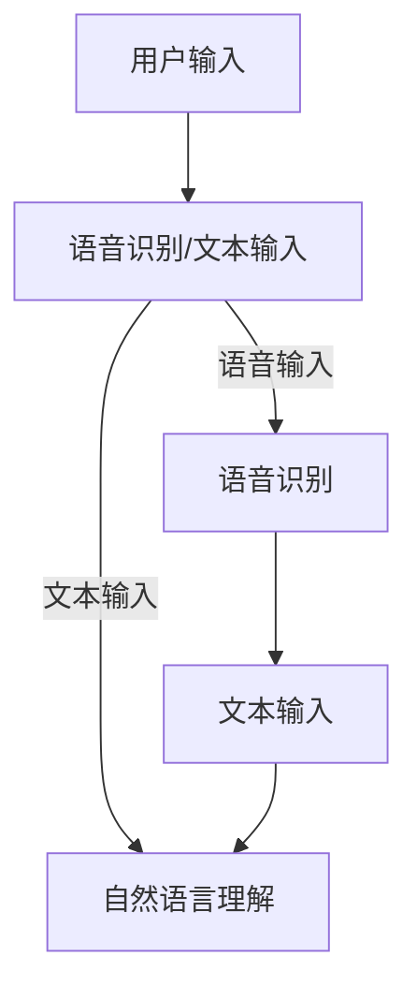
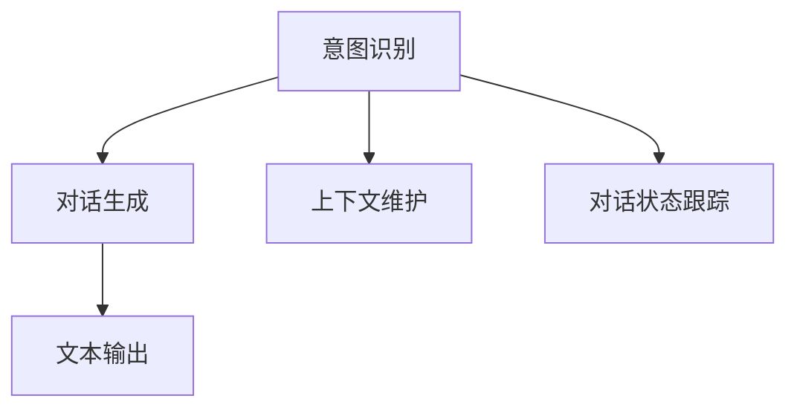
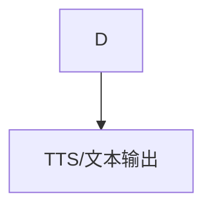
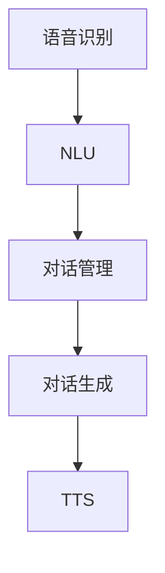
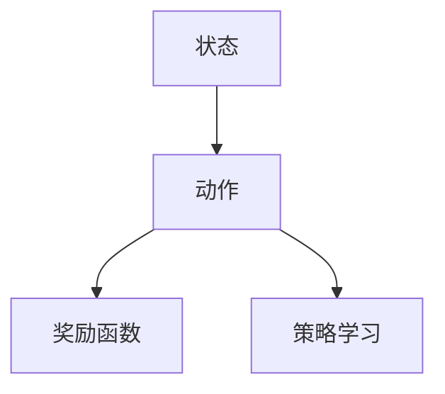
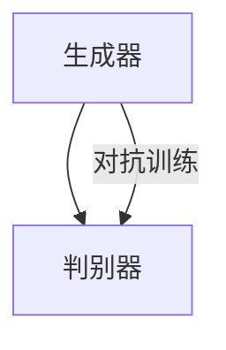
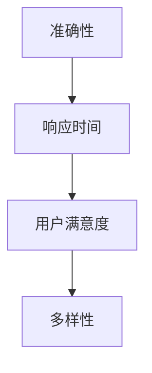
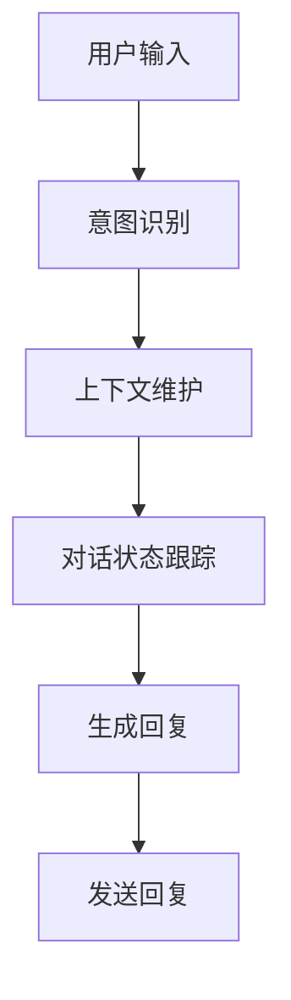
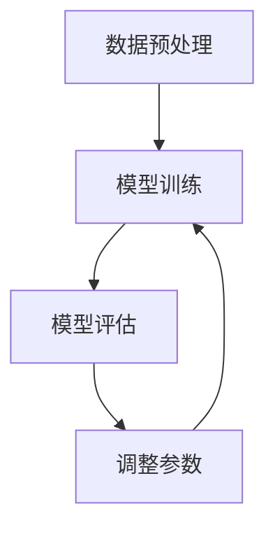
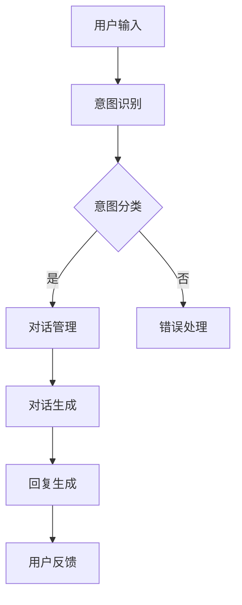

                 

### 引言

近年来，随着人工智能技术的快速发展，自然语言处理（Natural Language Processing，NLP）领域取得了显著的进展。在这其中，生成式预训练语言模型（Generative Pre-trained Language Model）如GPT（Generative Pre-trained Transformer）系列模型的出现，引发了广泛关注。GPT模型不仅提升了文本生成和语言理解的任务性能，还催生了ChatGPT等先进的对话系统。本文旨在深入探讨ChatGPT背后的技术，从GPT模型的原理、实现到对话系统的设计与应用，逐步剖析这一革命性技术的内在逻辑。

首先，我们将回顾人工智能和对话系统的概述，了解它们的发展历程和基本概念。接着，我们将介绍自然语言处理的基础技术，包括语言模型、词嵌入和序列模型等。在此基础上，我们将详细探讨GPT模型的工作原理、实现细节和应用。随后，我们将进入对话系统的设计，包括对话系统的架构、对话策略和对话管理。接着，我们将分析对话系统的评估与优化，探讨如何提高对话系统的性能和用户体验。随后，我们将通过实战案例展示如何实现对话系统，并提供代码解读与分析。最后，我们将讨论对话系统的未来发展趋势，展望其应用前景。

通过这篇文章，读者将全面了解从GPT模型到对话系统的技术演进过程，掌握相关核心概念和关键技术，为未来的研究和应用打下坚实基础。

### 文章关键词

人工智能、自然语言处理、GPT模型、对话系统、生成式预训练、语言模型、词嵌入、序列模型、注意力机制、对话管理、对话策略、评估与优化。

### 摘要

本文围绕ChatGPT背后的技术，从GPT模型的原理与实现、对话系统的设计与应用、评估与优化等多个角度，深入探讨自然语言处理与对话系统的前沿技术。首先，我们回顾了人工智能和对话系统的发展历程，介绍了相关的基础概念。然后，我们详细分析了自然语言处理的关键技术，包括语言模型、词嵌入和序列模型。在此基础上，我们深入探讨了GPT模型的工作原理、实现细节和应用场景。随后，我们介绍了对话系统的设计与架构，探讨了对话策略、对话管理以及评估与优化方法。通过实际案例和代码解读，我们展示了对话系统的实现过程。最后，我们展望了对话系统的未来发展趋势，探讨了其在商业和社交领域的应用前景。本文旨在为读者提供全面、深入的技术解析，帮助读者理解和掌握从GPT模型到对话系统的关键技术。

### 第一部分：基础概念与原理

在探讨ChatGPT背后的技术之前，我们需要先了解人工智能和对话系统的基本概念与原理。人工智能（Artificial Intelligence，AI）是指通过计算机程序模拟人类智能行为的技术，包括机器学习、深度学习、自然语言处理、计算机视觉等。对话系统（Dialogue System）是一种能够与人类进行自然语言交互的计算机系统，旨在实现人机对话的自动化。

#### 1.1 人工智能的起源与发展

人工智能的起源可以追溯到20世纪50年代。当时，随着计算机技术的发展，科学家们开始探索如何使计算机模拟人类的智能行为。1956年，达特茅斯会议（Dartmouth Conference）标志着人工智能领域的正式诞生。会议提出了人工智能的定义和研究目标，引发了人工智能研究的热潮。从那时起，人工智能经历了多个发展阶段，包括符号主义、连接主义和统计学习等。

##### 1.1.1 人工智能的定义

人工智能是指通过计算机程序模拟人类智能行为的技术。它包括多个子领域，如机器学习、自然语言处理、计算机视觉、智能决策等。人工智能的目标是实现机器的智能，使其能够解决复杂问题、进行推理和学习。

##### 1.1.2 人工智能的发展阶段

人工智能的发展可以分为以下几个阶段：

1. 符号主义阶段（Symbolic AI）：早期的人工智能研究主要基于符号主义方法，通过符号和规则来表示知识和推理。这种方法在逻辑推理和数学证明等领域取得了成功，但在处理复杂问题和不确定情境时面临挑战。

2. 连接主义阶段（Connectionist AI）：随着神经网络技术的发展，连接主义方法逐渐成为人工智能研究的主流。神经网络通过大量的神经元和连接模拟人类大脑的工作方式，实现了对复杂问题的建模和学习。这一阶段的代表性工作是1986年提出的反向传播算法（Backpropagation Algorithm）。

3. 统计学习阶段（Statistical Learning）：近年来，随着大数据和计算能力的提升，统计学习方法在人工智能领域得到广泛应用。统计学习通过训练大量的数据来学习特征和模式，从而实现智能决策和预测。这一阶段的代表性工作是支持向量机（Support Vector Machine，SVM）和深度学习（Deep Learning）。

##### 1.1.3 人工智能的主要领域

人工智能的主要领域包括：

1. 机器学习（Machine Learning）：机器学习是人工智能的核心技术之一，通过训练模型从数据中学习规律和模式，实现预测和决策。

2. 自然语言处理（Natural Language Processing，NLP）：自然语言处理旨在使计算机能够理解和处理自然语言，包括文本分类、情感分析、机器翻译、语音识别等任务。

3. 计算机视觉（Computer Vision）：计算机视觉是使计算机能够从图像或视频中提取有用信息的技术，包括图像分类、目标检测、图像识别等。

4. 智能决策（Intelligent Decision Making）：智能决策是通过计算机模拟人类的决策过程，实现自动化决策和优化。

#### 1.2 对话系统的定义与分类

对话系统是一种能够与人类进行自然语言交互的计算机系统，旨在实现人机对话的自动化。对话系统通常包括语音识别、自然语言理解、对话生成、语音合成等模块。

##### 1.2.1 对话系统的定义

对话系统是指能够理解自然语言输入、产生自然语言输出的系统，用户可以通过文字或语音与系统进行交互。对话系统的目标是使人与机器之间的交流更加自然和高效。

##### 1.2.2 对话系统的分类

根据交互方式，对话系统可以分为以下几类：

1. 基于文本的对话系统（Text-based Dialogue System）：用户通过文本输入与系统进行交互，系统通过文本输出回复用户。这类对话系统广泛应用于聊天机器人、智能客服等场景。

2. 基于语音的对话系统（Voice-based Dialogue System）：用户通过语音输入与系统进行交互，系统通过语音输出回复用户。这类对话系统广泛应用于智能音箱、车载系统等场景。

3. 混合式对话系统（Hybrid Dialogue System）：结合文本和语音交互的对话系统，用户可以选择文本或语音输入，系统根据场景和用户偏好进行相应的输出。

##### 1.2.3 对话系统的组成

一个典型的对话系统通常包括以下几个模块：

1. 语音识别（Speech Recognition）：将用户的语音输入转换为文本输入。

2. 自然语言理解（Natural Language Understanding，NLU）：解析用户输入的文本，提取关键信息，如意图、实体等。

3. 对话管理（Dialogue Management）：根据对话历史和系统状态，生成下一步的对话策略。

4. 对话生成（Dialogue Generation）：根据对话策略和上下文，生成自然语言回复。

5. 语音合成（Text-to-Speech，TTS）：将生成的文本转换为语音输出。

#### 1.3 GPT模型的简介

GPT（Generative Pre-trained Transformer）模型是由OpenAI提出的一种基于转换器（Transformer）架构的预训练语言模型。GPT模型在自然语言处理任务中取得了显著的成果，推动了对话系统的发展。

##### 1.3.1 GPT模型的定义

GPT模型是一种基于转换器（Transformer）架构的大型神经网络模型，通过在大量文本数据上进行预训练，学习语言的统计规律和上下文关系，从而实现文本生成、问答、分类等任务。

##### 1.3.2 GPT模型的基本原理

GPT模型的核心是转换器（Transformer）架构，该架构通过自注意力机制（Self-Attention）和多头注意力（Multi-Head Attention）机制，实现了对输入文本序列的全局信息建模。GPT模型的工作流程包括预训练和微调两个阶段。

1. 预训练阶段：在大量文本数据上进行预训练，学习语言的统计规律和上下文关系。预训练过程包括两个任务：填空和文本分类。填空任务旨在通过预测输入文本中的缺失词来学习语言模式；文本分类任务旨在通过预测文本的类别来学习语义信息。

2. 微调阶段：在预训练的基础上，针对特定任务进行微调。微调过程通过在特定任务的数据集上重新训练模型，调整模型的参数，使其适应特定任务。

##### 1.3.3 GPT模型的演进

GPT模型从GPT-1到GPT-3，参数规模和性能不断提升，成为当前最先进的预训练语言模型。GPT-1是第一个GPT模型，于2018年发布；GPT-2于2019年发布，引入了更长的序列处理能力；GPT-3于2020年发布，具有1750亿个参数，显著提升了模型性能。

#### 1.4 自然语言处理基础

自然语言处理（Natural Language Processing，NLP）是人工智能的重要分支，旨在使计算机能够理解和处理自然语言。NLP的关键技术包括语言模型、词嵌入和序列模型等。

##### 1.4.1 语言模型

语言模型（Language Model）是一种用于预测下一个单词或字符的概率分布的模型。语言模型在NLP任务中具有重要的应用，如文本生成、语音识别、机器翻译等。

1. 语言模型的基本概念

语言模型的基本概念包括：

- 输入序列：输入序列是由一系列单词或字符组成的序列。
- 预测概率：语言模型通过计算输入序列的概率分布，预测下一个单词或字符。

2. 语言模型的分类

语言模型可以分为基于规则模型和统计模型。基于规则模型通过定义语法规则来生成文本；统计模型通过学习大量文本数据，预测输入序列的概率分布。

3. 语言模型的评估指标

语言模型的评估指标包括：

- perplexity（困惑度）：评估语言模型对测试数据集的拟合程度，越小表示模型越好。
- accuracy（准确率）：评估模型在文本分类任务中的表现，越高表示模型越好。
- BLEU（双语评估单元）：用于评估机器翻译模型的性能，值越高表示翻译结果越接近人工翻译。

##### 1.4.2 词嵌入技术

词嵌入（Word Embedding）是将单词映射到低维连续向量空间的技术。词嵌入在NLP任务中具有广泛的应用，如文本分类、情感分析、命名实体识别等。

1. 词嵌入的基本概念

词嵌入的基本概念包括：

- 向量空间：词嵌入将单词映射到一个高维向量空间。
- 相似性度量：词嵌入可以通过计算单词之间的向量距离来度量它们之间的相似性。

2. 常见的词嵌入算法

常见的词嵌入算法包括：

- Word2Vec：基于神经网络和滑动窗口的词嵌入算法。
- GloVe（Global Vectors for Word Representation）：基于全局上下文的词嵌入算法。
- FastText：基于字符神经网络的词嵌入算法。

3. 词嵌入的应用

词嵌入在NLP任务中的应用包括：

- 文本分类：通过将文本转换为词嵌入向量，可以应用传统的机器学习算法进行文本分类。
- 情感分析：通过词嵌入，可以计算文本的向量表示，从而判断文本的情感倾向。
- 命名实体识别：通过词嵌入和序列模型，可以识别文本中的命名实体。

##### 1.4.3 序列模型与注意力机制

序列模型（Sequence Model）是一种用于处理序列数据的模型，如循环神经网络（Recurrent Neural Network，RNN）、长短时记忆网络（Long Short-Term Memory，LSTM）等。注意力机制（Attention Mechanism）是一种用于提高模型处理长序列数据的能力的技术。

1. 序列模型的基本概念

序列模型的基本概念包括：

- 序列：序列是由一系列数据点组成的序列。
- 状态转移函数：序列模型通过状态转移函数来处理序列数据。

2. 注意力机制的基本概念

注意力机制的基本概念包括：

- 注意力权重：注意力机制通过计算注意力权重，为序列中的不同位置分配不同的重要性。
- 自注意力：自注意力机制是一种用于序列模型的自注意力机制，能够有效地处理长序列数据。

3. 序列模型与注意力机制的应用

序列模型与注意力机制在NLP任务中的应用包括：

- 机器翻译：通过序列模型和注意力机制，可以有效地实现机器翻译任务。
- 文本生成：通过序列模型和注意力机制，可以生成高质量的文本。

### 第2章：自然语言处理基础

自然语言处理（Natural Language Processing，NLP）是人工智能的重要分支，旨在使计算机能够理解和处理自然语言。NLP的关键技术包括语言模型、词嵌入和序列模型等。本章将详细探讨这些基础技术，为后续章节的深入分析奠定基础。

#### 2.1 语言模型

语言模型（Language Model）是一种用于预测下一个单词或字符的概率分布的模型。在自然语言处理中，语言模型广泛应用于文本生成、语音识别、机器翻译等任务。以下是关于语言模型的一些基本概念：

##### 2.1.1 语言模型的基本概念

1. **输入序列**：在语言模型中，输入序列是由一系列单词或字符组成的序列。例如，“我想要一杯咖啡”可以表示为一个输入序列。

2. **预测概率**：语言模型的目标是预测输入序列的下一个单词或字符的概率分布。在给定前文的情况下，语言模型能够计算出每个单词或字符出现的概率。

##### 2.1.2 语言模型的主要算法

语言模型可以分为基于规则模型和统计模型。基于规则模型通过定义语法规则来生成文本，而统计模型通过学习大量文本数据来预测概率分布。

1. **基于规则模型**：基于规则模型（如n元语法模型）通过定义一组规则来生成文本。这些规则通常基于词汇表和语法规则，例如，如果前一个单词是“我”，那么下一个单词可能是“想要”。

2. **统计模型**：统计模型（如n元语法模型、N-gram Model）通过学习大量文本数据，计算每个单词或字符在特定上下文中的出现频率，从而预测其概率。N-gram模型是最常见的统计模型之一，它考虑了前n个单词对下一个单词的影响。

##### 2.1.3 语言模型的评估指标

评估语言模型的性能需要使用一些指标。以下是几个常用的评估指标：

1. **困惑度（Perplexity）**：困惑度是评估语言模型性能的一个常用指标。它的定义是预测概率的负对数，即\(P(w_1, w_2, ..., w_n) = \frac{1}{N}\sum_{i=1}^{N} -\log_2(p(w_i | w_{i-1}, ..., w_{i-n+1}))\)。困惑度越小，表示模型对数据集的拟合程度越好。

2. **准确率（Accuracy）**：准确率是评估模型在文本分类任务中的表现。它定义为正确预测的样本数占总样本数的比例。

3. **BLEU（Bilingual Evaluation Understudy）**：BLEU是一个用于评估机器翻译模型性能的指标。它通过比较机器翻译结果和人工翻译结果，计算相似度得分。BLEU得分越高，表示翻译结果越接近人工翻译。

#### 2.2 词嵌入技术

词嵌入（Word Embedding）是将单词映射到低维连续向量空间的技术。词嵌入在自然语言处理中具有广泛的应用，如文本分类、情感分析、命名实体识别等。以下是关于词嵌入的一些基本概念：

##### 2.2.1 词嵌入的原理

词嵌入的基本原理是将每个单词表示为一个向量，使得具有相似意义的单词在向量空间中彼此靠近。通过这种方式，词嵌入能够捕捉单词之间的语义关系，从而在许多NLP任务中提高模型的性能。

##### 2.2.2 常见的词嵌入算法

常见的词嵌入算法包括：

1. **Word2Vec**：Word2Vec是最早的词嵌入算法之一，由Google提出。它通过优化神经网络来学习单词的向量表示。Word2Vec算法包括两种训练方法：连续词袋（Continuous Bag of Words，CBOW）和Skip-Gram。

   - **连续词袋（CBOW）**：CBOW算法通过预测中心词周围的单词来学习词向量。给定一个中心词，CBOW算法从周围单词中构建一个上下文窗口，然后预测中心词。

   - **Skip-Gram**：Skip-Gram算法与CBOW算法相反，它通过预测中心词的上下文单词来学习词向量。给定一个中心词，Skip-Gram算法从整个文本中随机抽取上下文单词。

2. **GloVe（Global Vectors for Word Representation）**：GloVe算法是由Stanford大学提出的。与Word2Vec不同，GloVe使用全局文本统计信息来学习词向量。GloVe算法通过优化一个目标函数来同时学习词向量和词之间的相似度。

3. **FastText**：FastText是由Facebook AI研究院提出的。FastText是一种基于字符神经网络的词嵌入算法。它通过将单词分解成字符序列，为每个字符和单词学习向量表示，从而捕获词的内部结构。

##### 2.2.3 词嵌入的应用

词嵌入在自然语言处理中的应用非常广泛，包括：

- **文本分类**：通过将文本转换为词嵌入向量，可以应用传统的机器学习算法进行文本分类。
- **情感分析**：通过词嵌入，可以计算文本的向量表示，从而判断文本的情感倾向。
- **命名实体识别**：通过词嵌入和序列模型，可以识别文本中的命名实体。

#### 2.3 序列模型与注意力机制

序列模型（Sequence Model）是一种用于处理序列数据的模型，如循环神经网络（Recurrent Neural Network，RNN）、长短时记忆网络（Long Short-Term Memory，LSTM）等。注意力机制（Attention Mechanism）是一种用于提高模型处理长序列数据的能力的技术。以下是关于序列模型和注意力机制的一些基本概念：

##### 2.3.1 序列模型的基本原理

序列模型的基本原理是利用历史信息来预测未来的值。在自然语言处理中，序列模型可以处理文本序列、语音信号等。以下是一些常见的序列模型：

1. **循环神经网络（RNN）**：RNN是一种基于递归结构的神经网络，可以处理序列数据。RNN通过循环利用上一个时间步的输出作为当前时间步的输入，从而捕捉序列信息。

2. **长短时记忆网络（LSTM）**：LSTM是RNN的一种改进，能够更好地处理长序列数据。LSTM通过引入门控机制（gate）来控制信息的传递和遗忘，从而避免梯度消失和梯度爆炸问题。

##### 2.3.2 注意力机制的工作原理

注意力机制是一种用于提高模型处理长序列数据的能力的技术。注意力机制的基本原理是模型能够为序列中的不同位置分配不同的权重，从而更加关注重要的信息。以下是一个简化的注意力机制的例子：

1. **自注意力（Self-Attention）**：自注意力机制是一种用于序列模型的注意力机制，它能够为序列中的不同位置分配权重。自注意力机制的核心是计算序列中每个元素与其他元素之间的相似性，并将这些相似性作为权重来加权序列。

2. **多头注意力（Multi-Head Attention）**：多头注意力是一种扩展自注意力机制的方案。它将序列分解成多个子序列，并为每个子序列应用独立的自注意力机制。多头注意力能够捕捉更复杂的序列关系。

##### 2.3.3 序列模型与注意力机制的应用

序列模型与注意力机制在自然语言处理中的应用非常广泛，包括：

- **机器翻译**：通过序列模型和注意力机制，可以有效地实现机器翻译任务。
- **文本生成**：通过序列模型和注意力机制，可以生成高质量的文本。
- **情感分析**：通过序列模型和注意力机制，可以识别文本中的情感倾向。

### 第3章：GPT模型的原理与实现

GPT（Generative Pre-trained Transformer）模型是由OpenAI提出的一种基于转换器（Transformer）架构的预训练语言模型。GPT模型通过在大量文本数据上进行预训练，学习语言的统计规律和上下文关系，从而实现文本生成、问答、分类等任务。本章将详细探讨GPT模型的工作原理、实现细节和应用。

#### 3.1 GPT模型的基本原理

GPT模型的核心是转换器（Transformer）架构，该架构通过自注意力机制（Self-Attention）和多头注意力（Multi-Head Attention）机制，实现了对输入文本序列的全局信息建模。GPT模型的工作流程包括预训练和微调两个阶段。

##### 3.1.1 GPT模型的架构

GPT模型采用Transformer架构，该架构由以下组件组成：

1. **嵌入层（Embedding Layer）**：嵌入层将单词转换为向量表示。GPT模型使用词嵌入（Word Embedding）来将单词映射到高维向量空间。

2. **位置编码（Positional Encoding）**：由于Transformer架构中没有显式的时间步（time steps），位置编码用于为序列中的不同位置赋予信息。

3. **多头自注意力（Multi-Head Self-Attention）**：多头自注意力机制通过计算序列中每个元素与其他元素之间的相似性，并将这些相似性作为权重来加权序列。多头自注意力机制能够捕捉更复杂的序列关系。

4. **前馈神经网络（Feedforward Neural Network）**：前馈神经网络对自注意力层的输出进行进一步处理。

5. **输出层（Output Layer）**：输出层将序列的最终表示转换为概率分布，用于生成文本。

##### 3.1.2 GPT模型的核心算法

GPT模型的核心算法是基于转换器（Transformer）架构的预训练语言模型。以下是GPT模型的基本算法步骤：

1. **预训练阶段**：
   - **填空任务**：在大量文本数据上，通过填空任务来训练模型。给定一个输入序列，模型需要预测序列中的一个缺失词。
   - **文本分类任务**：在大量文本数据上，通过文本分类任务来训练模型。给定一个输入序列，模型需要预测序列的类别。

2. **微调阶段**：
   - **任务数据集**：在特定任务的数据集上进行微调。模型在预训练的基础上，进一步调整参数，使其适应特定任务。

##### 3.1.3 GPT模型的工作流程

GPT模型的工作流程包括预训练和微调两个阶段。以下是GPT模型的工作流程：

1. **预训练阶段**：
   - **数据预处理**：将文本数据转换为单词序列，并对单词进行嵌入。
   - **填空任务**：在训练数据上，通过填空任务来训练模型。给定一个输入序列，模型需要预测序列中的一个缺失词。
   - **文本分类任务**：在训练数据上，通过文本分类任务来训练模型。给定一个输入序列，模型需要预测序列的类别。

2. **微调阶段**：
   - **数据预处理**：将任务数据集转换为单词序列，并对单词进行嵌入。
   - **模型微调**：在任务数据集上，对预训练模型进行微调。模型在预训练的基础上，进一步调整参数，使其适应特定任务。

#### 3.2 GPT模型的关键参数

GPT模型的关键参数包括层数、隐藏层尺寸、学习率等。以下是对这些参数的详细说明：

##### 3.2.1 预训练参数

1. **层数（Number of Layers）**：GPT模型通常具有多个隐藏层，层数越多，模型的容量越大，能够捕获更多的语言特征。

2. **隐藏层尺寸（Hidden Size）**：隐藏层尺寸决定了模型的容量，通常越大越好。但是，较大的隐藏层尺寸会导致计算成本和内存消耗增加。

3. **学习率（Learning Rate）**：学习率是调整模型参数的步长。较小的学习率可能导致训练过程缓慢，而较大的学习率可能导致模型过拟合。

##### 3.2.2 微调参数

1. **迭代次数（Number of Iterations）**：微调阶段通常设置一定的迭代次数，以确保模型在任务数据集上充分训练。

2. **批处理大小（Batch Size）**：批处理大小决定了每次训练的样本数。较大的批处理大小可以提高模型的稳定性，但会降低训练速度。

3. **权重初始化（Weight Initialization）**：权重初始化是模型训练的重要步骤。合理的权重初始化可以加快训练过程，提高模型性能。

#### 3.3 GPT模型的实现

GPT模型的实现涉及多个组件，包括数据预处理、模型训练、模型评估等。以下是对这些组件的简要介绍：

##### 3.3.1 GPT模型的搭建

GPT模型的搭建通常使用深度学习框架，如TensorFlow或PyTorch。以下是一个简单的GPT模型搭建示例：

```python
import torch
import torch.nn as nn

class GPTModel(nn.Module):
    def __init__(self, vocab_size, d_model, n_layers, n_head, d_inner, dropout):
        super(GPTModel, self).__init__()
        self.embedding = nn.Embedding(vocab_size, d_model)
        self.pos_encoder = PositionalEncoding(d_model)
        self.transformer = Transformer(d_model, n_layers, n_head, d_inner, dropout)
        self.fc = nn.Linear(d_model, vocab_size)

    def forward(self, x, lengths):
        embedded = self.embedding(x)
        pos_encoded = self.pos_encoder(embedded)
        output = self.transformer(pos_encoded, lengths)
        logits = self.fc(output)
        return logits

# 定义模型参数
vocab_size = 10000
d_model = 512
n_layers = 3
n_head = 8
d_inner = 1024
dropout = 0.1

# 实例化模型
model = GPTModel(vocab_size, d_model, n_layers, n_head, d_inner, dropout)
```

##### 3.3.2 GPT模型的训练与评估

GPT模型的训练与评估包括以下步骤：

1. **数据预处理**：将文本数据转换为单词序列，并对单词进行嵌入。将序列数据划分成输入序列和目标序列。

2. **模型训练**：使用训练数据对模型进行训练。在训练过程中，使用优化器（如Adam）调整模型参数。

3. **模型评估**：使用验证数据对模型进行评估。评估指标包括困惑度（Perplexity）和准确率（Accuracy）。

以下是一个简单的GPT模型训练和评估示例：

```python
# 加载训练数据
train_data = load_data('train_data.txt')
val_data = load_data('val_data.txt')

# 初始化模型
model = GPTModel(vocab_size, d_model, n_layers, n_head, d_inner, dropout)
optimizer = torch.optim.Adam(model.parameters(), lr=0.001)

# 训练模型
num_epochs = 10
for epoch in range(num_epochs):
    for inputs, targets in train_data:
        optimizer.zero_grad()
        logits = model(inputs)
        loss = criterion(logits, targets)
        loss.backward()
        optimizer.step()

    # 评估模型
    with torch.no_grad():
        val_loss = 0
        for inputs, targets in val_data:
            logits = model(inputs)
            val_loss += criterion(logits, targets)
        val_loss /= len(val_data)
    print(f'Epoch {epoch+1}/{num_epochs}, Val Loss: {val_loss:.4f}')

# 测试模型
with torch.no_grad():
    test_loss = 0
    for inputs, targets in test_data:
        logits = model(inputs)
        test_loss += criterion(logits, targets)
    test_loss /= len(test_data)
print(f'Test Loss: {test_loss:.4f}')
```

#### 3.4 GPT模型的进阶应用

GPT模型在自然语言处理领域具有广泛的应用，包括文本生成、问答系统、文本分类等。以下是一些GPT模型的进阶应用：

##### 3.4.1 文本生成

文本生成是GPT模型最典型的应用之一。通过在给定文本序列的上下文中，GPT模型可以生成连贯、有意义的文本。以下是一个简单的文本生成示例：

```python
# 文本生成
prompt = "人工智能是一种计算机科学领域，它旨在使计算机能够模拟人类的智能行为。"
input_sequence = torch.tensor([vocab.word2idx[word] for word in prompt.split()])

generated_sequence = []
for _ in range(50):
    logits = model(input_sequence)
    next_word = torch.argmax(logits[-1]).item()
    generated_sequence.append(vocab.idx2word[next_word])
    input_sequence = torch.cat([input_sequence, torch.tensor([next_word])])

print(' '.join(generated_sequence))
```

##### 3.4.2 问答系统

问答系统是GPT模型在自然语言处理领域的另一个重要应用。通过在给定问题和上下文的上下文中，GPT模型可以生成准确的答案。以下是一个简单的问答系统示例：

```python
# 问答系统
question = "什么是人工智能？"
context = "人工智能是一种计算机科学领域，它旨在使计算机能够模拟人类的智能行为。"
input_sequence = torch.tensor([vocab.word2idx[word] for word in context.split()])

while True:
    logits = model(input_sequence)
    next_word = torch.argmax(logits[-1]).item()
    if next_word == vocab.word2idx['<EOS>']:
        break
    input_sequence = torch.cat([input_sequence, torch.tensor([next_word])])

answer = vocab.idx2word[next_word]
print(answer)
```

##### 3.4.3 文本分类

文本分类是GPT模型在自然语言处理领域的另一个重要应用。通过在给定文本的上下文中，GPT模型可以将其分类到相应的类别中。以下是一个简单的文本分类示例：

```python
# 文本分类
text = "人工智能是一种计算机科学领域，它旨在使计算机能够模拟人类的智能行为。"
input_sequence = torch.tensor([vocab.word2idx[word] for word in text.split()])

logits = model(input_sequence)
predicted_class = torch.argmax(logits).item()
print(vocab.label2idx[predicted_class])
```

### 第4章：对话系统的设计

对话系统（Dialogue System）是一种能够与人类进行自然语言交互的计算机系统。它通过语音识别、自然语言理解、对话生成和语音合成等模块，实现人与计算机之间的对话。本章将详细探讨对话系统的设计，包括对话系统的基本工作流程、对话策略和对话管理。

#### 4.1 对话系统的基本工作流程

对话系统的工作流程可以概括为以下几个步骤：

##### 4.1.1 用户的输入处理

用户的输入可能是语音或文本形式。对于语音输入，对话系统首先需要通过语音识别（Speech Recognition）模块将语音转换为文本。对于文本输入，系统可以直接接收文本。



##### 4.1.2 对话管理

对话管理（Dialogue Management）是对话系统的核心组件，负责维护对话状态和对话流程。对话管理包括以下几个关键任务：

1. **意图识别（Intent Recognition）**：识别用户的意图，即用户想要完成的任务或请求。
2. **上下文维护（Context Maintenance）**：维护对话的历史信息和当前状态，以便后续对话能够顺利进行。
3. **对话状态跟踪（Dialogue State Tracking）**：跟踪对话中的关键信息，如用户提供的实体和参数。

##### 4.1.3 对话生成

对话生成（Dialogue Generation）模块根据用户的意图和上下文信息，生成合适的回复文本。对话生成可以采用模板匹配、规则驱动或生成式方法。



##### 4.1.4 对话生成

对话生成模块生成回复文本后，还需要通过语音合成（Text-to-Speech，TTS）模块将其转换为语音输出，或者直接输出文本回复。



#### 4.2 对话系统的模块划分

对话系统可以划分为多个模块，每个模块负责不同的任务。以下是常见的对话系统模块及其功能：

1. **语音识别（Speech Recognition）**：将语音输入转换为文本输入。
2. **自然语言理解（Natural Language Understanding，NLU）**：解析用户输入，提取关键信息，如意图、实体和上下文。
3. **对话管理（Dialogue Management）**：维护对话状态和对话流程，包括意图识别、上下文维护和对话状态跟踪。
4. **对话生成（Dialogue Generation）**：根据意图和上下文生成合适的回复文本。
5. **语音合成（Text-to-Speech，TTS）**：将生成的文本转换为语音输出。



#### 4.3 对话策略的设计

对话策略（Dialogue Policy）是指对话系统如何根据用户的输入和对话历史，选择合适的对话行动。对话策略的设计对于对话系统的用户体验和性能至关重要。

##### 4.3.1 强化学习策略

强化学习（Reinforcement Learning）是一种用于学习策略的机器学习方法。在对话系统中，强化学习可以通过以下步骤设计对话策略：

1. **状态表示（State Representation）**：将对话状态编码为向量表示。
2. **动作表示（Action Representation）**：将对话系统的动作编码为向量表示。
3. **奖励函数（Reward Function）**：定义奖励函数来评估对话系统的行动是否有效。
4. **策略学习（Policy Learning）**：使用强化学习算法，如Q学习（Q-Learning）或策略梯度（Policy Gradient），学习对话策略。



##### 4.3.2 生成对抗网络策略

生成对抗网络（Generative Adversarial Network，GAN）是一种用于生成数据的深度学习模型。在对话系统中，GAN可以通过以下步骤设计对话策略：

1. **生成器（Generator）**：生成对话系统的回复文本。
2. **判别器（Discriminator）**：判断生成的回复文本是否真实。
3. **训练过程**：生成器和判别器相互对抗训练，直到生成器生成的文本几乎无法区分真假。



##### 4.3.3 对话策略的评估与优化

对话策略的评估与优化是确保对话系统性能的重要步骤。以下是一些评估与优化的方法：

1. **自动评估**：使用自动化评估工具，如自动对话评估器（Automated Dialogue Evaluation），评估对话系统的性能。
2. **用户评估**：通过用户测试和反馈，评估对话系统的用户体验和满意度。
3. **模型优化**：使用强化学习或GAN等算法，优化对话策略的参数，提高对话系统的性能。

#### 4.4 对话系统的评估

对话系统的评估是确保其性能和用户体验的重要步骤。以下是一些评估方法和指标：

1. **准确性（Accuracy）**：评估对话系统在意图识别和实体提取等任务中的准确性。
2. **响应时间（Response Time）**：评估对话系统处理用户输入并生成回复的时间。
3. **用户满意度（User Satisfaction）**：通过用户测试和反馈，评估对话系统的用户体验和满意度。
4. **多样性（Diversity）**：评估对话系统生成的回复文本的多样性，确保对话不会过于单调和重复。



#### 4.5 对话系统的实现

对话系统的实现涉及多个组件和模块。以下是一个简单的对话系统实现示例：

```python
# 对话系统实现
class DialogueSystem:
    def __init__(self):
        self.nlu = NLUComponent()
        self.dmg = DialogueManagement()
        self.dgg = DialogueGeneration()
        self.tts = TextToSpeech()

    def process_input(self, input_text):
        intent, entities = self.nlu.parse(input_text)
        context = self.dmg.update_context(intent, entities)
        response_text = self.dgg.generate_response(context)
        return self.tts.synthesize(response_text)

# 使用对话系统
ds = DialogueSystem()
user_input = "你好，我想订一张明天的机票。"
response = ds.process_input(user_input)
print(response)
```

### 第5章：对话策略与对话管理

对话策略（Dialogue Policy）和对话管理（Dialogue Management）是构建高效对话系统的关键组件。对话策略决定了系统如何响应用户的输入，而对话管理则负责维护对话的流程和上下文。本章将深入探讨对话策略的设计、对话管理的工作机制以及对话系统的评估方法。

#### 5.1 对话策略的设计

对话策略的设计旨在确定对话系统在不同情境下应采取的行动。对话策略可以基于不同的方法，如规则驱动、数据驱动和模型驱动。

##### 5.1.1 强化学习策略

强化学习是一种通过试错来学习策略的机器学习方法。在对话系统中，强化学习策略可以通过以下步骤设计：

1. **状态表示（State Representation）**：将对话状态编码为一个向量表示，包括用户的意图、上下文信息和对话历史。
2. **动作表示（Action Representation）**：将对话系统的动作编码为一个向量表示，如生成不同类型的回复文本。
3. **奖励函数（Reward Function）**：定义奖励函数来评估对话系统的行动是否有效，如用户满意度、响应时间等。
4. **策略学习（Policy Learning）**：使用强化学习算法，如Q学习、策略梯度等，学习最优策略。

以下是强化学习策略的伪代码示例：

```python
# 强化学习策略的伪代码
initialize Q(s, a)
for episode in 1 to MAX_EPISODES:
    s = initialize_state()
    while not done:
        a = choose_action(s, Q)
        next_s, reward = get_next_state_and_reward(s, a)
        Q[s, a] = Q[s, a] + alpha * (reward + gamma * max(Q[next_s, :] ) - Q[s, a])
        s = next_s
```

##### 5.1.2 生成对抗网络策略

生成对抗网络（GAN）是一种通过对抗训练生成数据的模型。在对话系统中，GAN可以通过以下步骤设计对话策略：

1. **生成器（Generator）**：生成对话系统的回复文本。
2. **判别器（Discriminator）**：判断生成的回复文本是否真实。
3. **训练过程**：生成器和判别器相互对抗训练，直到生成器生成的文本几乎无法区分真假。

以下是生成对抗网络策略的伪代码示例：

```python
# 生成对抗网络策略的伪代码
for epoch in 1 to MAX_EPOCHS:
    for real_data in real_data_loader:
        # 训练判别器
        D_real =判别器(real_data)
        D_fake =判别器(生成器())
        D_loss = 损失函数(D_real + D_fake)

        # 训练生成器
        G_loss = 损失函数(D_fake)
    D_optimizer.zero_grad()
    G_optimizer.zero_grad()
    D_loss.backward()
    G_loss.backward()
    D_optimizer.step()
    G_optimizer.step()
```

##### 5.1.3 对话策略的评估与优化

对话策略的评估与优化是确保对话系统性能的重要步骤。以下是一些评估与优化的方法：

1. **自动评估**：使用自动化评估工具，如自动对话评估器（Automated Dialogue Evaluation），评估对话系统的性能。
2. **用户评估**：通过用户测试和反馈，评估对话系统的用户体验和满意度。
3. **模型优化**：使用强化学习或GAN等算法，优化对话策略的参数，提高对话系统的性能。

#### 5.2 对话管理

对话管理是维护对话流程和上下文的关键组件。对话管理包括意图识别、上下文维护和对话状态跟踪等任务。

##### 5.2.1 对话管理的工作机制

对话管理的工作机制如下：

1. **意图识别（Intent Recognition）**：解析用户输入，识别用户的意图，如查询天气、订餐等。
2. **上下文维护（Context Maintenance）**：维护对话的历史信息和当前状态，如用户的需求、偏好等。
3. **对话状态跟踪（Dialogue State Tracking）**：跟踪对话中的关键信息，如用户的输入、系统的回复等。

以下是对话管理的工作流程：



##### 5.2.2 对话管理的算法实现

对话管理的算法实现可以基于规则驱动或数据驱动。以下是一个简单的对话管理算法实现：

```python
# 对话管理算法实现
class DialogueManager:
    def __init__(self):
        self.intents = load_intents()
        self.context = {}

    def process_input(self, input_text):
        intent = self.recognize_intent(input_text)
        self.update_context(intent)
        response = self.generate_response(self.context)
        return response

    def recognize_intent(self, input_text):
        # 使用自然语言处理技术识别意图
        return intent

    def update_context(self, intent):
        # 更新对话上下文
        self.context[intent] = True

    def generate_response(self, context):
        # 生成回复文本
        if context['intent'] == '订餐':
            return "请问您需要什么样的菜品？"
        else:
            return "抱歉，我无法理解您的需求。"
```

#### 5.3 对话系统的评估

对话系统的评估是确保其性能和用户体验的重要步骤。以下是一些评估方法和指标：

1. **准确性（Accuracy）**：评估对话系统在意图识别和实体提取等任务中的准确性。
2. **响应时间（Response Time）**：评估对话系统处理用户输入并生成回复的时间。
3. **用户满意度（User Satisfaction）**：通过用户测试和反馈，评估对话系统的用户体验和满意度。
4. **多样性（Diversity）**：评估对话系统生成的回复文本的多样性，确保对话不会过于单调和重复。

以下是对话系统评估的伪代码示例：

```python
# 对话系统评估的伪代码
evaluate_dialogue_system(dialogue_system, test_data):
    total_accuracy = 0
    total_response_time = 0
    total_user_satisfaction = 0
    total_diversity = 0

    for input_text, expected_output in test_data:
        response = dialogue_system.process_input(input_text)
        response_time = measure_response_time(response)
        user_satisfaction = measure_user_satisfaction(response)
        diversity = measure_diversity(response)

        total_accuracy += accuracy(response, expected_output)
        total_response_time += response_time
        total_user_satisfaction += user_satisfaction
        total_diversity += diversity

    average_accuracy = total_accuracy / len(test_data)
    average_response_time = total_response_time / len(test_data)
    average_user_satisfaction = total_user_satisfaction / len(test_data)
    average_diversity = total_diversity / len(test_data)

    return average_accuracy, average_response_time, average_user_satisfaction, average_diversity
```

### 第6章：对话系统的评估与优化

对话系统的评估与优化是确保其性能和用户体验的重要步骤。本章将介绍对话系统的评估指标、评估方法，以及如何通过数据增强和模型压缩等技术来优化对话系统的性能。

#### 6.1 对话系统的评估指标

对话系统的评估指标是衡量系统性能的关键参数。以下是一些常用的评估指标：

1. **准确性（Accuracy）**：准确性是评估对话系统在意图识别和实体提取任务中表现的重要指标。它定义为正确识别的意图或实体占总意图或实体的比例。

2. **响应时间（Response Time）**：响应时间是衡量对话系统处理用户输入并生成回复所需的时间。较短的响应时间可以提供更流畅的用户体验。

3. **用户满意度（User Satisfaction）**：用户满意度是通过用户测试和反馈来评估的，它反映了用户对对话系统的整体满意度。

4. **多样性（Diversity）**：多样性是评估对话系统生成回复文本丰富性的指标。一个优秀的对话系统应该能够生成多样且不重复的回复。

5. **流畅性（Fluency）**：流畅性是评估对话系统生成回复文本自然度和连贯性的指标。流畅的对话系统能够生成更自然的对话体验。

#### 6.2 对话系统的评估方法

对话系统的评估方法可以分为自动评估和用户评估两种。

1. **自动评估**：自动评估使用预设的评估指标和评估工具来评估对话系统的性能。以下是一些常用的自动评估方法：

   - **混淆矩阵（Confusion Matrix）**：混淆矩阵用于评估对话系统在意图识别任务中的准确性。它可以显示系统在不同意图类别上的预测结果。
   
   - **BLEU分数（BLEU Score）**：BLEU分数是用于评估对话系统生成回复文本与人工回复相似度的指标。它基于重叠率、长度等度量来评估文本的相似度。

   - **F1分数（F1 Score）**：F1分数是评估对话系统在意图识别和实体提取任务中准确性和召回率的综合指标。

2. **用户评估**：用户评估通过用户测试和反馈来评估对话系统的用户体验。以下是一些常用的用户评估方法：

   - **问卷调查**：通过设计问卷，收集用户对对话系统的满意度、流畅性等指标的评价。
   
   - **用户访谈**：通过与用户进行面对面或在线访谈，深入了解用户对对话系统的使用体验和改进建议。

#### 6.3 对话系统的优化方法

对话系统的优化方法旨在提高系统的性能和用户体验。以下是一些常用的优化方法：

1. **数据增强（Data Augmentation）**：数据增强是一种通过生成新的训练样本来提高模型性能的技术。以下是一些常见的数据增强方法：

   - **文本扩充（Text Augmentation）**：通过添加标点符号、同义词替换、语法变换等操作来扩充文本数据。
   
   - **对话扩充（Dialogue Augmentation）**：通过添加上下文信息、对话轮次或修改对话内容来扩充对话数据。

2. **模型压缩（Model Compression）**：模型压缩是一种通过减少模型参数数量和计算复杂度来优化模型性能的技术。以下是一些常见的模型压缩方法：

   - **剪枝（Pruning）**：通过移除模型中不重要的连接或神经元来减少模型参数数量。
   
   - **量化（Quantization）**：通过将模型中的浮点数参数转换为低比特宽度的整数来减少模型的存储和计算需求。

3. **多任务学习（Multi-Task Learning）**：多任务学习是一种通过同时训练多个相关任务来提高模型性能的技术。以下是一些常见的方法：

   - **共享权重（Shared Weights）**：在不同任务中使用共享的权重来提高模型的泛化能力。
   
   - **任务迁移（Task Transfer）**：通过将一个任务中的知识迁移到其他相关任务中来提高模型在多个任务上的性能。

4. **模型融合（Model Fusion）**：模型融合是一种通过结合多个模型的预测结果来提高预测准确性的技术。以下是一些常见的模型融合方法：

   - **加权平均（Weighted Average）**：将多个模型的预测结果进行加权平均来生成最终的预测结果。
   
   - **集成学习（Ensemble Learning）**：通过组合多个独立的模型来生成最终的预测结果。

### 第7章：对话系统在具体场景中的应用

对话系统在各个行业和领域中的应用日益广泛，为用户提供更加智能化、个性化的服务。本章将探讨对话系统在客服领域和智能助手领域的应用，介绍其工作流程、实现方法以及评估方法。

#### 7.1 对话系统在客服领域的应用

客服领域是对话系统应用的重要场景之一，通过对话系统能够提供高效、智能的客户服务。以下是客服领域对话系统的工作流程、实现方法以及评估方法。

##### 7.1.1 客服对话系统的工作流程

客服对话系统的工作流程主要包括以下几个步骤：

1. **用户输入处理**：用户通过文本或语音输入与客服对话系统交互。
2. **意图识别**：系统通过自然语言理解技术识别用户的意图，如查询信息、投诉建议等。
3. **对话管理**：系统维护对话上下文，并根据用户的意图和历史记录生成合适的回复。
4. **对话生成**：系统生成回复文本，并将其转换为语音或文本输出。
5. **用户反馈**：用户对系统的回复进行反馈，系统根据用户反馈调整对话策略。

##### 7.1.2 客服对话系统的实现方法

客服对话系统的实现方法通常包括以下几个模块：

1. **语音识别（Speech Recognition）**：将用户的语音输入转换为文本输入。
2. **自然语言理解（Natural Language Understanding，NLU）**：识别用户的意图和实体。
3. **对话管理（Dialogue Management）**：维护对话上下文和对话状态。
4. **对话生成（Dialogue Generation）**：根据意图和上下文生成回复文本。
5. **语音合成（Text-to-Speech，TTS）**：将回复文本转换为语音输出。

以下是客服对话系统的一个简例：

```python
class Chatbot:
    def __init__(self, nlu, dialog_manager, tts):
        self.nlu = nlu
        self.dialog_manager = dialog_manager
        self.tts = tts

    def handle_input(self, user_input):
        intent, entities = self.nlu.parse(user_input)
        context = self.dialog_manager.update_context(intent, entities)
        response = self.dialog_manager.generate_response(context)
        return self.tts.synthesize(response)

# 假设已经实现了NLU、Dialogue Manager和TTS模块
nlu = NLUComponent()
dialog_manager = DialogueManager()
tts = TextToSpeech()

chatbot = Chatbot(nlu, dialog_manager, tts)
user_input = "你好，我想查询最近的航班信息。"
response = chatbot.handle_input(user_input)
print(response)
```

##### 7.1.3 客服对话系统的评估方法

客服对话系统的评估方法包括以下几个方面：

1. **准确性**：评估系统在意图识别和实体提取任务中的准确性。
2. **响应时间**：评估系统处理用户输入并生成回复所需的时间。
3. **用户满意度**：通过用户问卷调查或用户访谈评估用户对系统服务的满意度。
4. **多样性**：评估系统生成回复文本的多样性，确保对话不会过于单调和重复。

#### 7.2 对话系统在智能助手领域的应用

智能助手是另一个对话系统应用的重要场景，通过对话系统能够为用户提供个性化、智能化的帮助。以下是智能助手对话系统的工作流程、实现方法以及评估方法。

##### 7.2.1 智能助手的工作流程

智能助手的工作流程与客服对话系统类似，主要包括以下几个步骤：

1. **用户输入处理**：用户通过文本或语音输入与智能助手交互。
2. **意图识别**：系统通过自然语言理解技术识别用户的意图，如查询信息、执行任务等。
3. **对话管理**：系统维护对话上下文和对话状态。
4. **对话生成**：系统根据意图和上下文生成回复文本或执行任务。
5. **用户反馈**：用户对系统的回复进行反馈，系统根据用户反馈调整对话策略。

##### 7.2.2 智能助手的实现方法

智能助手的实现方法与客服对话系统类似，也需要包括以下几个模块：

1. **语音识别（Speech Recognition）**：将用户的语音输入转换为文本输入。
2. **自然语言理解（Natural Language Understanding，NLU）**：识别用户的意图和实体。
3. **对话管理（Dialogue Management）**：维护对话上下文和对话状态。
4. **对话生成（Dialogue Generation）**：根据意图和上下文生成回复文本。
5. **任务执行**：系统执行用户请求的任务，如查询信息、执行命令等。
6. **语音合成（Text-to-Speech，TTS）**：将回复文本转换为语音输出。

以下是智能助手的一个简例：

```python
class SmartAssistant:
    def __init__(self, nlu, dialog_manager, tts, task_executor):
        self.nlu = nlu
        self.dialog_manager = dialog_manager
        self.tts = tts
        self.task_executor = task_executor

    def handle_input(self, user_input):
        intent, entities = self.nlu.parse(user_input)
        context = self.dialog_manager.update_context(intent, entities)
        if intent == "查询天气":
            weather_info = self.task_executor.query_weather(entities["地点"])
            response = f"{entities['地点']}的天气是{weather_info}"
        else:
            response = self.dialog_manager.generate_response(context)
        return self.tts.synthesize(response)

# 假设已经实现了NLU、Dialogue Manager、TTS和Task Executor模块
nlu = NLUComponent()
dialog_manager = DialogueManager()
tts = TextToSpeech()
task_executor = TaskExecutor()

assistant = SmartAssistant(nlu, dialog_manager, tts, task_executor)
user_input = "我想查询北京的天气。"
response = assistant.handle_input(user_input)
print(response)
```

##### 7.2.3 智能助手的评估方法

智能助手的评估方法与客服对话系统类似，包括以下几个方面：

1. **准确性**：评估系统在意图识别和实体提取任务中的准确性。
2. **响应时间**：评估系统处理用户输入并生成回复所需的时间。
3. **用户满意度**：通过用户问卷调查或用户访谈评估用户对系统服务的满意度。
4. **任务执行效果**：评估系统执行用户请求任务的效果，如查询信息的准确性、执行命令的效率等。

### 第8章：对话系统的未来发展趋势

随着人工智能技术的快速发展，对话系统（Dialogue System）在各个领域的应用越来越广泛。未来，对话系统将继续在技术、应用场景和用户体验方面取得突破。以下是对话系统的未来发展趋势的展望。

#### 8.1 人工智能技术的发展趋势

人工智能技术是推动对话系统发展的重要力量。以下是一些未来人工智能技术的发展趋势：

1. **大模型技术**：随着计算资源和数据资源的增加，大模型技术将得到进一步发展。大模型能够捕捉更复杂的语言结构和上下文关系，提高对话系统的性能。

2. **多模态交互**：未来，对话系统将支持多模态交互，如语音、文本、图像等。多模态交互能够提供更丰富的交互体验，提高用户满意度。

3. **强化学习**：强化学习技术在对话系统中的应用将不断深化。通过强化学习，对话系统能够更好地适应不同的对话情境，提高对话策略的适应性。

4. **迁移学习**：迁移学习技术将使得对话系统能够在不同任务和数据集之间共享知识，提高模型的泛化能力。

5. **生成对抗网络**：生成对抗网络（GAN）技术在对话系统中的应用将逐渐增多。GAN能够生成高质量的对话数据，有助于对话系统的训练和评估。

#### 8.2 对话系统的未来发展方向

未来，对话系统将在以下几个方面取得发展：

1. **智能客服**：随着人工智能技术的进步，智能客服系统将能够处理更复杂的用户请求，提供更个性化的服务。智能客服系统将涵盖更多领域，如电商、金融、医疗等。

2. **智能助手**：智能助手将更好地融入用户的日常生活，提供更加智能化的帮助。智能助手将能够处理更多的任务，如日程管理、信息查询、任务执行等。

3. **多语言支持**：随着全球化的发展，对话系统将需要支持更多语言。未来，对话系统将能够处理多种语言的输入和输出，提供更广泛的服务。

4. **个性化交互**：未来，对话系统将更加注重个性化交互。通过对用户的偏好和行为进行分析，对话系统将能够提供更符合用户需求的交互体验。

5. **隐私保护**：随着对用户隐私保护的重视，对话系统将在数据采集和使用方面采取更多措施，确保用户隐私不被泄露。

#### 8.3 对话系统的挑战与机遇

尽管对话系统在未来有着广阔的发展前景，但仍然面临一些挑战和机遇：

1. **挑战**：
   - **数据隐私**：对话系统在处理用户数据时需要确保数据的安全和隐私。
   - **多语言处理**：多语言处理技术需要进一步优化，以支持多种语言的输入和输出。
   - **用户体验**：对话系统需要提供更加自然和流畅的用户体验。
   - **适应性**：对话系统需要具备更强的适应性，以应对不同的对话情境和用户需求。

2. **机遇**：
   - **人工智能技术**：随着人工智能技术的不断发展，对话系统的性能和功能将得到显著提升。
   - **多模态交互**：多模态交互将提供更加丰富的交互体验，提高用户满意度。
   - **迁移学习**：迁移学习技术将有助于对话系统在不同任务和数据集之间共享知识。
   - **生成对抗网络**：生成对抗网络技术将有助于生成高质量的对话数据，提高对话系统的训练和评估效果。

总之，对话系统在未来将迎来更多的发展机遇，同时也需要克服一些挑战。通过不断优化技术、拓展应用场景和提高用户体验，对话系统将更好地服务于人类社会。

### 附录

#### 附录A：常用工具与资源

以下是构建和优化对话系统时常用的一些工具和资源：

##### A.1 开发工具

1. **Python**：Python是自然语言处理和人工智能领域广泛使用的编程语言，提供了丰富的库和框架。
2. **TensorFlow**：TensorFlow是Google开发的开源机器学习框架，用于构建和训练深度学习模型。
3. **PyTorch**：PyTorch是Facebook AI研究院开发的开源深度学习框架，提供了灵活的动态计算图和强大的GPU支持。

##### A.2 开源库与框架

1. **spaCy**：spaCy是一个快速且易于使用的自然语言处理库，提供了词性标注、实体识别、依存句法分析等功能。
2. **NLTK**：NLTK是一个强大的自然语言处理库，提供了文本处理、词性标注、词嵌入等功能。
3. **transformers**：transformers库提供了基于转换器（Transformer）架构的预训练语言模型，如GPT、BERT等。

##### A.3 数据集

1. **GLUE**：GLUE（General Language Understanding Evaluation）是一个包含多种自然语言处理任务的公共数据集，用于评估和比较不同模型的表现。
2. **SQuAD**：SQuAD（Stanford Question Answering Dataset）是一个问答数据集，用于评估模型在自然语言理解任务中的表现。
3. **Wit.ai**：Wit.ai是一个提供对话系统和自然语言处理服务的平台，提供了大量的训练数据集。

#### 附录B：Mermaid流程图

以下是使用Mermaid绘制的一些流程图示例：

##### B.1 GPT模型训练流程图



##### B.2 对话系统工作流程图



#### 附录C：数学公式与解释

以下是自然语言处理中常用的数学公式及其解释：

##### C.1 数学公式基本语法

- **加法**：\( a + b \)
- **减法**：\( a - b \)
- **乘法**：\( a \times b \)
- **除法**：\( a \div b \)

##### C.2 GPT模型中的数学公式

- **损失函数**：\( J = -\sum_{i=1}^{n} \log(p(y_i | \theta)) \)
  - **解释**：损失函数用于评估模型的预测性能，其中\( p(y_i | \theta) \)是模型对第i个样本的预测概率。

- **反向传播**：\( \frac{\partial J}{\partial \theta} = \frac{\partial L}{\partial a} \cdot \frac{\partial a}{\partial \theta} \)
  - **解释**：反向传播算法用于计算模型参数的梯度，其中\( L \)是损失函数，\( a \)是激活值。

##### C.3 对话系统中的数学公式

- **置信度**：\( \alpha = \frac{p(r_1, r_2, ..., r_n) \cdot p(d_1, d_2, ..., d_n)}{p(r_1, r_2, ..., r_n, d_1, d_2, ..., d_n)} \)
  - **解释**：置信度用于评估对话系统的可靠性，其中\( p(r_1, r_2, ..., r_n) \)是回复文本的概率，\( p(d_1, d_2, ..., d_n) \)是对话文本的概率。

- **熵**：\( H = -\sum_{i=1}^{n} p(x_i) \log_2(p(x_i)) \)
  - **解释**：熵用于衡量对话系统的随机性，其中\( p(x_i) \)是每个单词或字符的概率。

#### 附录D：示例代码

以下是构建对话系统的示例代码：

```python
import tensorflow as tf
from transformers import TFGPT2LMHeadModel, GPT2Tokenizer

# 加载预训练模型和分词器
tokenizer = GPT2Tokenizer.from_pretrained('gpt2')
model = TFGPT2LMHeadModel.from_pretrained('gpt2')

# 定义对话系统
class DialogueSystem:
    def __init__(self, model, tokenizer):
        self.model = model
        self.tokenizer = tokenizer

    def generate_response(self, input_text):
        inputs = self.tokenizer.encode(input_text, return_tensors='tf')
        outputs = self.model(inputs, padding='max_length', max_length=40, truncation=True)
        predicted_ids = tf.argmax(outputs.logits, axis=-1)
        response = self.tokenizer.decode(predicted_ids[:, :-1], skip_special_tokens=True)
        return response

# 使用对话系统
dialogue_system = DialogueSystem(model, tokenizer)
user_input = "你好，有什么可以帮助你的吗？"
response = dialogue_system.generate_response(user_input)
print(response)
```

### 作者

**作者：AI天才研究院/AI Genius Institute & 禅与计算机程序设计艺术 /Zen And The Art of Computer Programming**

