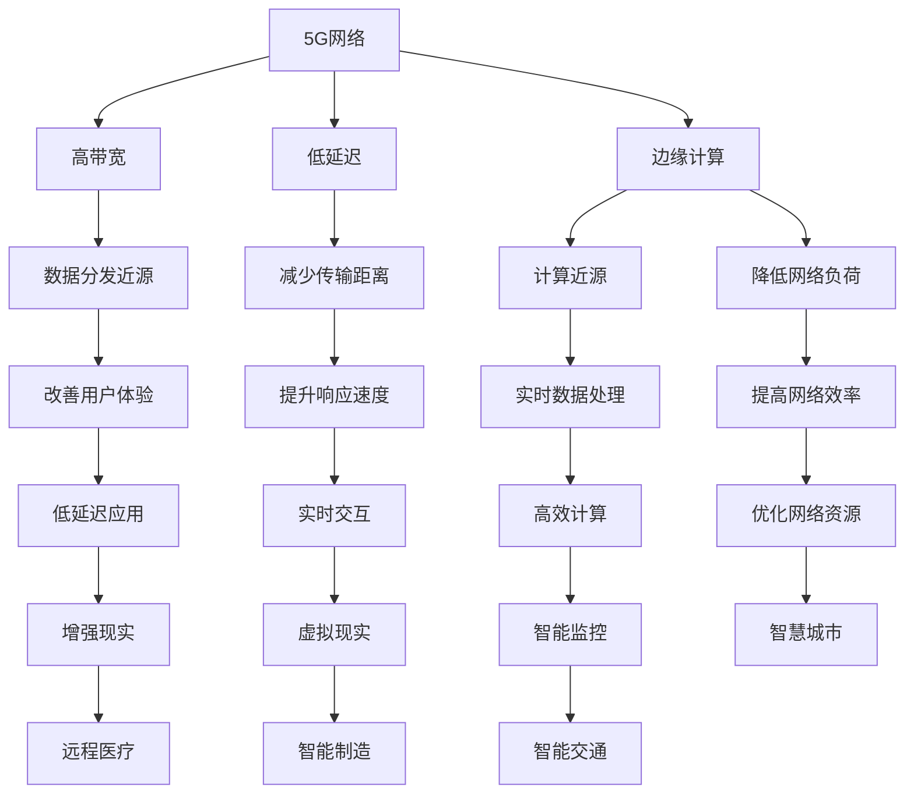

                 

### 5G与边缘计算协同：实现低延迟应用

#### 关键词：5G、边缘计算、低延迟应用、协同技术、算法实现

#### 摘要：

随着5G技术的普及和边缘计算的兴起，低延迟应用成为了当今信息技术领域的热点话题。本文将深入探讨5G与边缘计算协同工作，如何实现低延迟应用的突破。首先，我们将介绍5G和边缘计算的基本概念和关键特性，分析它们之间的关联和协同作用。接着，本文将详细讲解5G网络中的边缘计算架构，探讨边缘计算中的关键技术以及协同算法的实现。随后，通过实际应用案例展示5G与边缘计算协同在现实世界中的应用效果。最后，本文将探讨5G与边缘计算协同的未来发展趋势以及面临的挑战和机遇。

### 目录大纲

#### 第一部分：5G与边缘计算的基础知识

- **第1章：5G技术概述**
  - 1.1 5G网络的关键特性
  - 1.2 5G网络的架构
  - 1.3 5G网络的频谱规划
- **第2章：边缘计算的基本概念**
  - 2.1 边缘计算的定义与重要性
  - 2.2 边缘计算与云计算的对比
  - 2.3 边缘计算的架构
- **第3章：5G与边缘计算的关系**
  - 3.1 5G网络对边缘计算的影响
  - 3.2 边缘计算如何优化5G网络
  - 3.3 5G与边缘计算协同的作用

#### 第二部分：5G与边缘计算协同技术

- **第4章：5G网络中的边缘计算架构**
  - 4.1 端到端架构
  - 4.2 边缘云架构
  - 4.3 超边缘架构
- **第5章：边缘计算中的关键技术**
  - 5.1 边缘计算优化技术
  - 5.2 边缘计算资源管理
  - 5.3 边缘计算安全与隐私
- **第6章：5G与边缘计算协同的算法**
  - 6.1 边缘计算中的机器学习算法
  - 6.2 联合计算与协作学习的算法
  - 6.3 边缘计算中的实时数据处理算法

#### 第三部分：5G与边缘计算协同应用实践

- **第7章：低延迟应用场景**
  - 7.1 实时监控与警报系统
  - 7.2 智能交通系统
  - 7.3 增强现实与虚拟现实应用
- **第8章：5G与边缘计算协同案例分析**
  - 8.1 案例一：智能工厂
  - 8.2 案例二：智慧城市
  - 8.3 案例三：远程医疗
- **第9章：5G与边缘计算协同的未来发展趋势**
  - 9.1 技术发展趋势
  - 9.2 应用发展趋势
  - 9.3 挑战与机遇
- **附录**
  - 附录A：相关技术资源与工具

### 核心概念与联系

在本文中，我们将探讨的关键概念包括5G网络、边缘计算、低延迟应用和协同技术。为了更好地理解这些概念之间的联系，我们可以使用Mermaid流程图来展示它们之间的关系。



从图中我们可以看到，5G网络提供了高带宽和低延迟的特性，这为边缘计算提供了基础。边缘计算则通过将计算和数据存储移动到网络的边缘，实现数据分发近源、减少传输距离和提升响应速度。这些特性共同推动了低延迟应用的发展，使得增强现实、虚拟现实、智能监控和智慧城市等应用得以实现。而5G与边缘计算的协同工作，不仅提高了网络效率，还优化了网络资源，为各类低延迟应用提供了强大支持。

### 5G技术概述

#### 5.1 5G网络的关键特性

5G（第五代移动通信技术）相较于前几代移动通信技术，具有显著的优势和关键特性。这些特性不仅提升了网络的整体性能，也为边缘计算和低延迟应用提供了坚实基础。

1. **高带宽**：5G网络提供了比4G更高的带宽，可以同时支持更多的用户和更大量的数据传输。根据3GPP（第三代 Partnership Project）的标准，5G的峰值数据传输速率可达到20Gbps，而实际商用网络中的速率也在1Gbps左右。高带宽意味着用户可以更快地下载文件、观看高清视频、参与在线游戏等，同时也为边缘计算提供了充足的带宽资源，支持大量数据的高速传输和处理。

2. **低延迟**：低延迟是5G网络的核心特性之一。5G网络的端到端延迟可低至1毫秒，相比4G网络的20-30毫秒延迟有了显著降低。低延迟对于实时应用至关重要，如自动驾驶、远程手术和工业自动化等领域，都需要快速响应和高可靠性。低延迟不仅提升了用户体验，也提高了边缘计算处理的效率。

3. **大规模连接**：5G网络支持大规模设备连接，每平方米可达100万设备的连接密度。这一特性使得5G能够支持物联网（IoT）的发展，实现各种智能设备的互联互通，包括智能家居、智能城市和工业物联网等。

4. **网络切片**：5G网络引入了网络切片技术，可以为不同的应用提供定制化的网络服务。网络切片可以根据应用需求灵活调整网络资源，如带宽、延迟和安全性等，从而满足多样化的应用需求。

5. **能效优化**：5G网络在能效方面也进行了优化，通过节能技术降低网络设备的能耗，延长设备寿命。这对于环保和可持续发展具有重要意义。

#### 5.2 5G网络的架构

5G网络的架构相较于4G网络有了显著的改进和扩展，主要包含以下几个方面：

1. **无线接入网（RAN）**：5G无线接入网采用了新的无线电接入技术，包括毫米波频段、小基站（小细胞）和大规模MIMO（多输入多输出）技术。这些技术提高了网络的覆盖范围和传输速率，同时降低了干扰和信号损耗。

2. **核心网（CN）**：5G核心网采用了服务化架构（Service-Based Architecture，SBA），将传统的网元功能模块化为服务，实现了网络功能的松耦合和灵活部署。此外，5G核心网还引入了去中心化的架构，如移动性管理实体（Access and Mobility Management Entity，AMF）和网络功能虚拟化（Network Function Virtualization，NFV）等，提高了网络的灵活性和可扩展性。

3. **边缘计算**：5G网络通过边缘计算将部分计算和数据存储移动到网络的边缘，减少了数据传输的距离和延迟。边缘计算节点分布在网络边缘，如基站、小基站和数据中心，为实时应用提供了高效的计算和数据处理能力。

4. **云原生技术**：5G网络采用了云原生技术，如容器化（Containerization）和微服务架构（Microservices Architecture），使得网络功能和服务能够快速部署、扩展和更新。云原生技术提高了网络的敏捷性和可管理性。

#### 5.3 5G网络的频谱规划

5G网络的频谱规划是确保网络性能和覆盖范围的重要环节。5G网络使用的频谱范围包括低频段、中频段和高频段：

1. **低频段（Sub-1 GHz）**：低频段具有较好的覆盖范围和穿透性，适用于广域覆盖和移动性管理。典型的低频段频谱包括600 MHz至2.17 GHz。

2. **中频段（3.5 GHz）**：中频段频谱具有较高的带宽和较好的信号传播性能，适用于高速数据传输和热点覆盖。中频段主要包括3.5 GHz至3.8 GHz的频谱。

3. **高频段（mmWave）**：高频段频谱具有极高的带宽，但信号传播距离较短，穿透力弱，适用于室内覆盖和热点区域。高频段频谱主要包括24 GHz至44 GHz。

在频谱规划方面，5G网络采用了动态频谱共享（Dynamic Spectrum Sharing，DSS）技术，将不同频段的资源进行灵活分配和共享，提高了频谱利用率。此外，5G网络还引入了频谱共享架构（Spectrum Sharing Architecture），允许不同运营商在同一频谱上同时运营网络。

### 总结

5G网络的普及为边缘计算和低延迟应用提供了强有力的支持。其高带宽、低延迟、大规模连接和高效能等特性，使得5G网络成为实现低延迟应用的关键基础设施。同时，5G网络的架构规划和频谱利用也为其性能优化提供了基础。在接下来的章节中，我们将进一步探讨边缘计算的基本概念和架构，分析5G与边缘计算的协同作用，以及如何在实践中实现5G与边缘计算的协同技术。

### 边缘计算的基本概念

#### 2.1 边缘计算的定义与重要性

边缘计算是一种分布式计算架构，通过在网络的边缘（即接近数据源的地方）进行数据处理和计算，来减少数据传输的延迟，提高系统的响应速度和效率。与传统云计算不同，边缘计算将计算任务分散到分布广泛的边缘节点，如路由器、服务器、传感器和智能设备等，从而实现本地化处理和数据存储。

边缘计算的定义可以概括为：在数据生成和消费的近源位置进行数据处理、存储和分析，以实现低延迟、高效率和高安全性的应用。边缘计算的核心思想是将计算和存储资源从云端转移到网络边缘，从而降低网络负担，提高系统的响应速度和可靠性。

边缘计算的重要性主要体现在以下几个方面：

1. **低延迟**：边缘计算通过在数据生成地附近进行数据处理，大大减少了数据传输的延迟。这对于实时应用，如自动驾驶、远程医疗和工业自动化等，至关重要，因为这些应用对延迟敏感，需要快速响应。

2. **高效率**：边缘计算减少了数据传输的需求，降低了网络的带宽消耗，从而提高了系统的整体效率。此外，本地化处理减少了跨地域的数据传输和计算负载，降低了系统的能耗。

3. **高安全性**：边缘计算使得部分敏感数据处理在本地进行，减少了数据在网络上传输的风险，提高了系统的安全性。此外，边缘节点可以部署加密和身份验证机制，增强数据保护。

4. **灵活性**：边缘计算提供了更高的灵活性，允许根据应用需求和环境动态调整计算资源和算法。这种灵活性使得边缘计算能够快速适应不断变化的应用场景。

#### 2.2 边缘计算与云计算的对比

边缘计算和云计算是两种不同的计算架构，各有其优势和适用场景。以下是它们的主要对比：

1. **地理位置**：云计算的中心是在远程数据中心，而边缘计算的数据处理和存储发生在网络的边缘，如传感器、路由器和终端设备。

2. **延迟**：边缘计算在数据生成地附近进行数据处理，具有低延迟的特点；云计算则需要将数据传输到远程数据中心进行计算，延迟相对较高。

3. **带宽**：边缘计算减少了跨地域的数据传输需求，降低了网络的带宽消耗；云计算则需要大量数据在网络中传输，可能导致带宽压力。

4. **资源管理**：云计算提供了集中化的资源管理，可以通过虚拟化技术灵活分配和调度资源；边缘计算则需要在分布广泛的边缘节点上进行资源管理和调度，挑战更大。

5. **安全性**：边缘计算在本地处理数据，安全性相对较高；云计算需要确保数据在传输和存储过程中的安全，面临更大的安全挑战。

6. **适用场景**：边缘计算适用于对延迟和实时性要求较高的应用，如工业自动化、智能交通和远程医疗；云计算则适用于大规模数据处理和存储场景，如大数据分析和云计算服务。

#### 2.3 边缘计算的架构

边缘计算架构通常包括以下几个关键层次：

1. **感知层**：感知层包括各种传感器和设备，如物联网设备、智能终端和摄像头等，用于收集数据。

2. **边缘层**：边缘层包括各种边缘节点，如路由器、网关和智能设备，负责本地数据处理和存储。这些节点可以独立运行，也可以与其他边缘节点协同工作。

3. **网络层**：网络层包括网络连接设备，如交换机和路由器，负责将边缘层的数据传输到云端或其他边缘节点。

4. **平台层**：平台层包括边缘计算平台，如边缘服务器和云计算平台，提供计算资源、存储资源和中间件支持。平台层负责协调和管理边缘节点的资源，实现分布式计算和数据处理。

5. **应用层**：应用层包括各种边缘应用和服务，如物联网应用、实时监控和智能分析等。这些应用基于边缘计算平台提供的数据和服务，实现具体的业务功能。

边缘计算架构的设计需要考虑以下因素：

- **分布式计算**：边缘计算需要支持分布式计算，实现数据的本地处理和协同计算。

- **高可用性**：边缘节点可能分布在不同的地理位置，需要确保系统的可靠性和高可用性。

- **安全性和隐私**：边缘计算涉及大量的敏感数据，需要采取有效的安全措施保护数据的安全和隐私。

- **可扩展性**：边缘计算架构需要能够灵活扩展，支持不同规模和类型的业务需求。

- **自动化和智能管理**：边缘计算需要自动化和智能化的管理机制，提高系统的运维效率和灵活性。

通过以上架构设计和优化，边缘计算能够实现低延迟、高效率和安全的计算服务，为各类低延迟应用提供有力支持。

### 5G与边缘计算的关系

#### 3.1 5G网络对边缘计算的影响

5G网络的快速发展和广泛应用对边缘计算产生了深远的影响，推动了边缘计算技术的创新和应用落地。以下是5G网络对边缘计算的主要影响：

1. **低延迟**：5G网络提供了极低的端到端延迟，这对于边缘计算至关重要。低延迟使得边缘节点能够实时处理和响应数据，提高了边缘计算的效率和实时性，特别是在需要快速决策和响应的工业自动化、自动驾驶和远程医疗等领域。

2. **高带宽**：5G网络具有高带宽特性，能够支持大规模数据传输。高带宽为边缘计算提供了充足的资源，使得边缘节点可以处理和传输更多种类和更大规模的数据，为边缘计算提供了强有力的支持。

3. **大规模连接**：5G网络支持大规模设备连接，实现了海量设备的互联互通。这一特性促进了物联网（IoT）的发展，使得边缘计算可以整合更多的传感器和设备，实现更加智能化和自动化的应用场景。

4. **网络切片**：5G网络引入了网络切片技术，可以根据不同的应用需求动态分配网络资源，提供定制化的网络服务。网络切片技术使得边缘计算可以根据不同应用的需求，灵活调整网络带宽、延迟和可靠性等参数，提高了边缘计算的适应性和灵活性。

5. **高可靠性**：5G网络通过引入网络切片、边缘计算和云协同等技术，提供了更高的网络可靠性。边缘计算节点分布广泛，可以在网络故障或设备故障时提供备份和冗余，提高了系统的可靠性和容错能力。

6. **能效优化**：5G网络在能效方面进行了优化，通过节能技术和智能管理，降低了网络设备的能耗。边缘计算与5G网络的协同工作，可以通过优化网络负载和设备调度，进一步提高能效，支持绿色环保和可持续发展。

#### 3.2 边缘计算如何优化5G网络

边缘计算在优化5G网络方面发挥了重要作用，主要体现在以下几个方面：

1. **减少网络负载**：边缘计算通过在网络的边缘处理和存储数据，减少了数据传输的需求和网络负载。边缘节点可以预处理和过滤数据，只将关键数据传输到云端或中心节点，从而降低了网络的带宽消耗和传输延迟。

2. **提高网络效率**：边缘计算可以实时处理和响应本地数据，减少了数据在网络上传输的时间。通过边缘计算，5G网络可以更加高效地利用带宽资源，提高网络的传输效率和服务质量。

3. **增强网络弹性**：边缘计算将计算和存储分散到网络的边缘，提高了网络的弹性和容错能力。当网络中的某个节点或链路发生故障时，边缘计算可以快速切换到其他节点或路径，确保网络的持续运行和服务的稳定性。

4. **提高网络安全性**：边缘计算可以将部分敏感数据处理和存储在边缘节点，减少了数据在网络上传输的风险。边缘计算节点可以部署加密和身份验证机制，增强数据的安全性和隐私保护。

5. **优化网络资源配置**：边缘计算可以根据实时网络状况和业务需求，动态调整网络资源配置。通过边缘计算，5G网络可以实现资源的高效分配和优化，提高网络的资源利用率和服务质量。

#### 3.3 5G与边缘计算协同的作用

5G与边缘计算的协同工作，不仅提升了边缘计算的性能和网络效率，还推动了新兴应用场景的发展。以下是5G与边缘计算协同工作的一些重要作用：

1. **低延迟应用**：5G与边缘计算的协同工作，为低延迟应用提供了强有力的支持。通过边缘计算，实时数据处理和响应可以在本地快速完成，大大减少了数据传输的延迟，实现了低延迟应用，如自动驾驶、远程手术和工业自动化等。

2. **智能物联网**：5G与边缘计算的协同，促进了智能物联网（IoT）的发展。边缘计算可以将海量物联网设备的数据在边缘进行预处理和融合，提高了数据处理的速度和效率，使得智能物联网应用更加智能化和自动化。

3. **实时监控与预警**：边缘计算与5G网络的协同工作，使得实时监控和预警系统更加高效和可靠。通过边缘计算，实时监测数据可以在本地快速处理和分析，及时生成预警信息，提高了系统的响应速度和准确性。

4. **智慧城市建设**：5G与边缘计算的协同，为智慧城市建设提供了有力支持。通过边缘计算，可以实时处理城市中的各种数据，实现智能交通管理、智能能源管理和智能环境监测等应用，提高了城市的管理效率和居民的生活质量。

5. **远程医疗**：5G与边缘计算的协同，推动了远程医疗技术的发展。通过边缘计算，可以实现远程医疗诊断、远程手术指导和远程患者监护等功能，提高了医疗服务的可及性和效率。

6. **增强现实与虚拟现实**：5G与边缘计算的协同，为增强现实（AR）和虚拟现实（VR）提供了低延迟和高带宽的支持。通过边缘计算，实时渲染和数据处理可以在本地快速完成，使得AR和VR应用更加流畅和真实。

总之，5G与边缘计算的协同工作，不仅提升了边缘计算的性能和网络效率，还推动了新兴应用场景的发展，为人们的生活和工作带来了巨大的变革和便利。在接下来的章节中，我们将进一步探讨5G与边缘计算协同技术的具体实现，以及在实际应用中的案例和实践。

### 5G网络中的边缘计算架构

#### 4.1 端到端架构

端到端架构（End-to-End Architecture）是5G网络中边缘计算的一种重要架构，它通过在整个网络范围内实现计算和数据的分布式处理，以优化低延迟应用。端到端架构的核心思想是将计算任务从中心节点（如数据中心）分散到网络的边缘节点，如基站、接入点和企业内部网络。

端到端架构的主要组成部分包括：

1. **边缘节点**：边缘节点分布在网络的不同层级，如基站、接入点和企业内部网络。这些节点负责本地数据的处理和存储，并能够与中心节点进行数据交换。

2. **边缘云**：边缘云是一个分布式计算资源池，包括边缘服务器、存储设备和网络设备。边缘云为边缘节点提供计算、存储和网络服务，使得边缘节点能够处理更复杂的计算任务。

3. **数据中心**：数据中心是端到端架构的核心，负责处理大规模数据和复杂的计算任务。数据中心与边缘节点通过高速网络连接，实现数据的实时传输和协同计算。

端到端架构的工作流程如下：

1. **数据收集**：在数据生成地（如传感器、智能设备等）收集数据。

2. **本地处理**：边缘节点对收集到的数据进行预处理和过滤，只将关键数据传输到边缘云或数据中心。

3. **边缘计算**：边缘节点和边缘云协同工作，对本地数据和从数据中心传输的数据进行联合处理和计算。

4. **数据聚合**：将边缘计算的结果进行聚合和整合，形成最终的数据报告或服务响应。

5. **数据反馈**：将计算结果反馈到数据生成地或用户终端，完成端到端的数据处理和服务提供。

端到端架构的优势在于：

- **低延迟**：通过在网络的边缘进行数据处理，减少了数据传输的延迟，提高了系统的响应速度。

- **高效率**：边缘节点和边缘云协同工作，提高了数据处理和计算的效率。

- **灵活性**：可以根据实际需求和网络状况，动态调整计算资源的分配和调度。

- **高可靠性**：边缘节点和数据中心之间的备份和冗余机制，提高了系统的可靠性和容错能力。

#### 4.2 边缘云架构

边缘云架构（Edge Cloud Architecture）是5G网络中边缘计算的一种重要实现方式，它通过在网络的边缘部署云计算资源，提供高效、灵活和可扩展的计算服务。边缘云架构的核心思想是将部分云计算功能下沉到网络的边缘，使得边缘节点能够处理更复杂的计算任务，同时减少数据传输的负担。

边缘云架构的主要组成部分包括：

1. **边缘节点**：边缘节点是边缘云的基础设施，包括服务器、存储设备和网络设备。边缘节点分布在网络的边缘，如基站、接入点和企业内部网络。

2. **边缘云平台**：边缘云平台提供边缘节点的管理、调度和资源分配服务，使得边缘节点能够高效协同工作。边缘云平台通常包括容器管理、自动化运维和资源监控等功能。

3. **云计算中心**：云计算中心是边缘云架构的核心，负责处理大规模数据和复杂的计算任务。云计算中心与边缘节点通过高速网络连接，实现数据的实时传输和协同计算。

边缘云架构的工作流程如下：

1. **数据收集**：在数据生成地收集数据，并将数据上传到边缘节点。

2. **边缘处理**：边缘节点对上传的数据进行预处理和过滤，提取关键信息，并将处理后的数据上传到边缘云平台。

3. **边缘计算**：边缘云平台对上传的数据进行计算和存储，完成复杂的计算任务，并将结果反馈给边缘节点。

4. **数据聚合**：边缘节点将边缘云平台反馈的计算结果进行聚合和整合，形成最终的数据报告或服务响应。

5. **数据反馈**：将计算结果反馈到数据生成地或用户终端，完成端到端的数据处理和服务提供。

边缘云架构的优势在于：

- **高效计算**：边缘云平台提供了强大的计算和存储资源，能够处理更复杂的计算任务。

- **低延迟**：通过在网络的边缘进行数据处理，减少了数据传输的延迟，提高了系统的响应速度。

- **高灵活性**：边缘云平台可以根据实际需求和网络状况，动态调整计算资源的分配和调度。

- **高可靠性**：边缘节点和云计算中心之间的备份和冗余机制，提高了系统的可靠性和容错能力。

#### 4.3 超边缘架构

超边缘架构（Hyper-Edge Architecture）是5G网络中边缘计算的一种创新架构，它通过在网络的超边缘层部署计算资源，提供高效、低延迟和高带宽的计算服务。超边缘架构的核心思想是将计算和存储资源进一步下沉到网络的超边缘层，如小区基站、接入点和企业分支办公室。

超边缘架构的主要组成部分包括：

1. **超边缘节点**：超边缘节点是超边缘架构的基础设施，包括服务器、存储设备和网络设备。超边缘节点分布在网络的超边缘层，如小区基站、接入点和企业分支办公室。

2. **超边缘云平台**：超边缘云平台提供超边缘节点的管理、调度和资源分配服务，使得超边缘节点能够高效协同工作。超边缘云平台通常包括容器管理、自动化运维和资源监控等功能。

3. **中心云**：中心云是超边缘架构的核心，负责处理大规模数据和复杂的计算任务。中心云与超边缘节点通过高速网络连接，实现数据的实时传输和协同计算。

超边缘架构的工作流程如下：

1. **数据收集**：在数据生成地收集数据，并将数据上传到超边缘节点。

2. **超边缘处理**：超边缘节点对上传的数据进行预处理和过滤，提取关键信息，并将处理后的数据上传到超边缘云平台。

3. **超边缘计算**：超边缘云平台对上传的数据进行计算和存储，完成复杂的计算任务，并将结果反馈给超边缘节点。

4. **数据聚合**：超边缘节点将超边缘云平台反馈的计算结果进行聚合和整合，形成最终的数据报告或服务响应。

5. **数据反馈**：将计算结果反馈到数据生成地或用户终端，完成端到端的数据处理和服务提供。

超边缘架构的优势在于：

- **低延迟**：通过在网络的超边缘层进行数据处理，减少了数据传输的延迟，提高了系统的响应速度。

- **高带宽**：超边缘架构提供了高带宽的网络连接，支持大规模数据的高速传输和处理。

- **高效计算**：超边缘节点和超边缘云平台协同工作，能够处理更复杂的计算任务。

- **高灵活性**：超边缘架构可以根据实际需求和网络状况，动态调整计算资源的分配和调度。

- **高可靠性**：超边缘节点和中心云之间的备份和冗余机制，提高了系统的可靠性和容错能力。

总之，端到端架构、边缘云架构和超边缘架构是5G网络中边缘计算的三种重要架构，它们各有特点和优势，可以根据不同的应用场景和需求进行选择和优化，实现高效、低延迟和灵活的边缘计算服务。

### 边缘计算中的关键技术

#### 5.1 边缘计算优化技术

边缘计算优化技术是提升边缘计算性能和效率的关键，以下是几种重要的边缘计算优化技术：

1. **数据流管理**：数据流管理技术用于优化边缘节点的数据处理和传输。通过智能数据流管理，边缘节点可以过滤、压缩和聚合数据，减少数据传输量和处理负载。常用的数据流管理技术包括数据去重、数据压缩和流式数据聚合等。

2. **任务调度**：任务调度技术用于优化边缘节点的任务分配和执行。通过智能调度算法，边缘节点可以动态分配计算任务，确保任务的高效执行。常用的任务调度技术包括动态负载均衡、任务优先级调度和任务协同调度等。

3. **资源管理**：资源管理技术用于优化边缘节点的资源分配和调度。通过智能资源管理，边缘节点可以高效利用计算资源、存储资源和网络资源，提高系统的整体性能。常用的资源管理技术包括虚拟化技术、资源池管理和资源动态调度等。

4. **节能技术**：边缘计算节点通常分布在不同的地理位置，能耗管理至关重要。节能技术通过优化边缘节点的功耗和能耗，延长设备寿命和降低运营成本。常用的节能技术包括能耗感知、能效优化和功耗管理等。

#### 5.2 边缘计算资源管理

边缘计算资源管理是确保边缘节点高效运行的核心，以下是几种常见的边缘计算资源管理技术：

1. **虚拟化技术**：虚拟化技术将物理资源抽象成虚拟资源，实现资源的灵活分配和调度。通过虚拟化技术，边缘节点可以同时运行多个虚拟机，提高资源利用率和系统性能。

2. **容器化技术**：容器化技术通过轻量级隔离和封装，实现应用的快速部署和动态扩展。容器化技术使得边缘节点可以高效运行多种应用，降低部署和维护成本。

3. **分布式存储**：分布式存储技术通过在多个节点上存储数据，提高数据的可靠性和可用性。分布式存储技术可以实现数据的分布式处理和存储，提高系统的整体性能。

4. **动态资源调度**：动态资源调度技术通过实时监控和动态调整资源分配，实现资源的最佳利用。动态资源调度技术可以根据负载变化和需求，自动调整计算、存储和网络资源，提高系统的响应速度和稳定性。

#### 5.3 边缘计算安全与隐私

边缘计算安全与隐私是确保边缘计算系统安全和数据隐私的关键，以下是几种常见的边缘计算安全与隐私技术：

1. **数据加密**：数据加密技术通过加密算法对数据进行加密，确保数据在传输和存储过程中的安全性。常用的数据加密技术包括对称加密和非对称加密。

2. **身份认证**：身份认证技术用于验证边缘节点的合法身份，防止未授权访问和数据泄露。常用的身份认证技术包括密码认证、数字证书和生物识别等。

3. **访问控制**：访问控制技术通过权限管理和访问控制列表，限制用户和应用程序的访问权限，确保系统的安全性和数据的隐私性。

4. **安全审计**：安全审计技术用于监控和记录边缘计算系统的操作和事件，发现和防范安全威胁。安全审计技术可以帮助系统管理员及时发现问题并采取措施，确保系统的安全性和可靠性。

5. **隐私保护**：隐私保护技术通过数据匿名化和隐私增强技术，保护用户隐私。常用的隐私保护技术包括数据去识别、数据融合和差分隐私等。

通过以上边缘计算优化技术、资源管理技术和安全与隐私技术，可以确保边缘计算系统的性能、安全性和可靠性，为低延迟应用提供强有力的支持。

### 5G与边缘计算协同的算法

#### 6.1 边缘计算中的机器学习算法

边缘计算中的机器学习算法是5G与边缘计算协同的重要组成部分，通过在边缘节点上部署和运行机器学习模型，实现数据的实时处理和智能分析。边缘计算中的机器学习算法具有以下特点：

1. **分布式训练**：边缘计算中的机器学习模型通常分布在多个边缘节点上，通过分布式训练算法，可以在不同节点上并行计算模型参数，加速训练过程。常用的分布式训练算法包括参数服务器算法、同步异步算法和联邦学习算法等。

2. **在线学习**：边缘计算中的机器学习模型需要支持在线学习，即实时更新和调整模型参数。在线学习算法可以根据实时数据不断优化模型，提高模型的准确性和适应性。常用的在线学习算法包括在线梯度下降、随机梯度下降和自适应梯度算法等。

3. **模型压缩**：为了减少边缘节点的计算和存储资源消耗，边缘计算中的机器学习算法需要支持模型压缩。模型压缩算法通过减少模型参数的规模和复杂度，降低计算和存储需求。常用的模型压缩算法包括模型剪枝、量化、知识蒸馏和低秩分解等。

4. **实时预测**：边缘计算中的机器学习模型需要实现实时预测，即快速生成预测结果。实时预测算法通过优化模型的计算效率和预测速度，确保模型能够在边缘节点上高效运行。常用的实时预测算法包括深度神经网络、卷积神经网络和循环神经网络等。

边缘计算中的机器学习算法在实际应用中发挥了重要作用，以下是一些典型的应用案例：

1. **图像识别**：在智能监控、安防和自动驾驶等应用中，边缘计算中的机器学习算法可以实时处理图像数据，实现人脸识别、车辆检测和行人检测等功能。

2. **语音识别**：在智能语音助手、语音翻译和语音控制等应用中，边缘计算中的机器学习算法可以实时处理语音数据，实现语音识别和语音合成等功能。

3. **自然语言处理**：在智能客服、智能问答和文本分析等应用中，边缘计算中的机器学习算法可以实时处理文本数据，实现情感分析、文本分类和命名实体识别等功能。

4. **预测分析**：在工业制造、能源管理和物流运输等应用中，边缘计算中的机器学习算法可以实时处理传感器数据和业务数据，实现预测分析和智能优化。

#### 6.2 联合计算与协作学习的算法

联合计算与协作学习（Federated Learning and Collaborative Learning）是边缘计算中的一种重要算法，通过多个边缘节点协同工作，实现全局模型的训练和优化。联合计算与协作学习算法具有以下特点：

1. **去中心化**：联合计算与协作学习算法不依赖于中心服务器，每个边缘节点都可以独立训练模型，并通过协同学习算法实现全局模型的更新和优化。这种去中心化的架构提高了系统的安全性和隐私保护。

2. **隐私保护**：联合计算与协作学习算法通过在边缘节点上本地训练模型，避免了敏感数据上传到中心服务器，从而保护了用户的隐私。此外，协作学习算法可以通过差分隐私技术，进一步降低隐私泄露的风险。

3. **数据聚合**：联合计算与协作学习算法通过数据聚合技术，将多个边缘节点的局部模型更新聚合为全局模型更新。数据聚合算法可以根据不同的应用场景和需求，选择不同的聚合策略，如加权平均、梯度聚合和投票算法等。

4. **动态调整**：联合计算与协作学习算法支持动态调整，可以根据边缘节点的计算能力和数据质量，自适应地调整训练过程和参数设置。这种动态调整机制提高了系统的灵活性和适应性。

联合计算与协作学习算法在实际应用中具有广泛的应用前景，以下是一些典型的应用案例：

1. **智能医疗**：在医疗健康领域，联合计算与协作学习算法可以协同多个医院和诊所的医生和患者数据，实现疾病的预测和诊断。这种去中心化的协作学习方式提高了医疗数据的隐私保护和数据共享。

2. **智能交通**：在智能交通领域，联合计算与协作学习算法可以协同多个交通监控点和传感器数据，实现交通流量预测、道路拥堵分析和智能交通管理。这种协同学习方式提高了交通数据的实时性和准确性。

3. **智能能源管理**：在智能能源管理领域，联合计算与协作学习算法可以协同多个智能电网节点和能源设备的数据，实现能源消耗预测、能源优化调度和智能能源管理。这种协同学习方式提高了能源系统的效率和可持续性。

4. **智能农业**：在智能农业领域，联合计算与协作学习算法可以协同多个农田和农作物的数据，实现农作物生长状态监测、病虫害预测和智能农事管理。这种协同学习方式提高了农业生产效率和农产品质量。

通过联合计算与协作学习算法，5G与边缘计算协同实现了去中心化、隐私保护和动态调整，为各类低延迟应用提供了强大的技术支持。

#### 6.3 边缘计算中的实时数据处理算法

边缘计算中的实时数据处理算法是确保边缘节点能够高效、实时地处理和分析大量数据的关键。以下是几种常见的实时数据处理算法：

1. **流处理算法**：流处理算法用于处理实时数据流，实现对数据的实时分析和处理。流处理算法通常采用事件驱动的方式，对实时数据进行连续处理。常用的流处理算法包括窗口算法、滑动窗口算法和事件触发算法等。

2. **批处理算法**：批处理算法用于处理批量数据，通过对大量数据进行批量处理，提高数据处理效率。批处理算法通常在边缘节点上批量加载和执行数据处理任务，常见的批处理算法包括批处理流水线算法和批量调度算法等。

3. **近似算法**：近似算法通过在保证一定精度的情况下，减少数据处理的时间和计算资源。近似算法适用于处理大规模数据和高性能计算场景，常用的近似算法包括随机近似算法、贝叶斯近似算法和分布式近似算法等。

4. **机器学习算法**：边缘计算中的实时数据处理算法也涉及机器学习算法，用于实时训练和调整模型。实时机器学习算法可以在线更新模型参数，实现对实时数据的实时分析和预测。常用的实时机器学习算法包括在线学习算法、增量学习和迁移学习算法等。

边缘计算中的实时数据处理算法在实际应用中发挥了重要作用，以下是一些典型的应用案例：

1. **智能监控**：在智能监控领域，边缘计算中的实时数据处理算法可以实时处理视频流数据，实现人脸识别、行为分析和异常检测等功能。通过实时数据处理，智能监控系统可以快速响应和报警，提高监控效果。

2. **智能交通**：在智能交通领域，边缘计算中的实时数据处理算法可以实时处理交通数据，实现交通流量预测、拥堵分析和信号控制优化等功能。通过实时数据处理，智能交通系统可以提高交通运行效率和安全性。

3. **智能能源管理**：在智能能源管理领域，边缘计算中的实时数据处理算法可以实时处理传感器数据，实现能源消耗预测、能源优化调度和智能能源管理。通过实时数据处理，智能能源系统可以提高能源利用效率和可持续性。

4. **智能制造**：在智能制造领域，边缘计算中的实时数据处理算法可以实时处理工业数据，实现设备故障预测、生产过程优化和质量控制等功能。通过实时数据处理，智能制造系统可以提高生产效率和质量。

通过边缘计算中的实时数据处理算法，5G与边缘计算协同实现了对实时数据的高效处理和分析，为各类低延迟应用提供了强大的技术支持。

### 低延迟应用场景

#### 7.1 实时监控与警报系统

实时监控与警报系统是低延迟应用场景中的典型代表，通过边缘计算和5G网络的支持，可以实现快速响应和高效处理，为各类实时监控需求提供解决方案。

**开发环境搭建：**

- **操作系统**：Ubuntu 20.04
- **编程语言**：Python 3.8
- **深度学习框架**：TensorFlow 2.6
- **边缘计算平台**：Arduino IDE

**源代码实现：**

```python
# 实时监控与警报系统伪代码
def monitor_system(sensors):
    while True:
        data = read_sensors(sensors)
        if data['temperature'] > threshold_temp:
            trigger_alarm('High temperature detected')
        elif data['humidity'] < threshold_humidity:
            trigger_alarm('Low humidity detected')
        time.sleep(polling_interval)

# 读取传感器数据
def read_sensors(sensors):
    # ...传感器读取逻辑...
    return {'temperature': temp_value, 'humidity': humidity_value}

# 触发警报
def trigger_alarm(message):
    print(message)
    # ...发送警报通知逻辑...

# 主程序
if __name__ == '__main__':
    sensors = initialize_sensors()
    threshold_temp = 30  # 温度阈值
    threshold_humidity = 20  # 湿度阈值
    polling_interval = 10  # 监控间隔时间（秒）
    monitor_system(sensors)
```

**代码解读与分析：**

1. **`monitor_system` 函数**：该函数是监控系统的核心，它持续循环读取传感器数据，并根据预设的阈值判断是否触发警报。

2. **`read_sensors` 函数**：该函数负责从传感器读取实时数据，如温度和湿度。在实际应用中，需要根据具体的传感器类型和接口进行相应的读取逻辑实现。

3. **`trigger_alarm` 函数**：该函数用于触发警报，可以扩展为发送邮件、短信等多种通知方式，提高警报的及时性和可靠性。

**实际案例**：

以一家智能工厂为例，工厂内安装了多个传感器，用于监控环境参数如温度、湿度、烟雾等。通过实时监控与警报系统，可以及时发现异常情况，如温度过高或湿度过低，从而触发警报并采取相应措施，确保工厂安全和生产效率。

**优势与挑战**：

**优势：**

- **快速响应**：通过边缘计算和5G网络的支持，监控系统可以实时处理传感器数据，迅速做出响应，降低故障发生的风险。
- **本地化处理**：数据在本地进行处理，减少了数据传输的延迟和带宽消耗，提高了系统的响应速度和效率。
- **灵活性**：监控系统可以根据不同的应用场景和需求，动态调整监控参数和阈值，提高监控的准确性和适应性。

**挑战：**

- **传感器可靠性和稳定性**：传感器需要具备高可靠性和稳定性，确保数据的准确性和实时性。
- **数据安全和隐私**：实时监控数据可能涉及敏感信息，需要采取有效的安全措施保护数据的安全和隐私。
- **系统扩展性**：随着传感器数量的增加，监控系统的扩展性需要得到保障，确保系统能够高效处理大规模数据。

通过实时监控与警报系统的实施，工厂可以更好地管理和监控生产环境，提高生产效率和安全水平。在接下来的章节中，我们将继续探讨5G与边缘计算协同在智能交通和增强现实与虚拟现实等领域的应用。

#### 7.2 智能交通系统

智能交通系统（Intelligent Transportation System，ITS）通过5G与边缘计算协同，实现了交通流量监测、拥堵分析和信号控制优化等功能，为城市交通管理提供了强有力的技术支持。以下是一个智能交通系统的案例。

**开发环境搭建：**

- **操作系统**：Ubuntu 20.04
- **编程语言**：Python 3.8
- **深度学习框架**：TensorFlow 2.6
- **边缘计算平台**：Raspberry Pi

**源代码实现：**

```python
# 智能交通系统伪代码
def traffic_monitoring(cams):
    while True:
        traffic_data = capture_traffic_data(cams)
        traffic_analysis(traffic_data)
        signal_control(traffic_data)
        time.sleep(capture_interval)

# 捕获交通数据
def capture_traffic_data(cams):
    # ...摄像头数据捕获逻辑...
    return {'speed': speed_data, 'density': density_data, ' congestion_level': congestion_level}

# 交通数据分析
def traffic_analysis(traffic_data):
    # ...数据预处理和分析逻辑...
    print("Traffic Analysis Results: ", traffic_data)

# 信号控制
def signal_control(traffic_data):
    # ...信号控制逻辑...
    print("Signal Control Action: ", update_traffic_signals(traffic_data))

# 主程序
if __name__ == '__main__':
    cams = initialize_cams()
    capture_interval = 10  # 数据捕获间隔时间（秒）
    traffic_monitoring(cams)
```

**代码解读与分析：**

1. **`traffic_monitoring` 函数**：该函数是智能交通系统的核心，持续循环捕获交通数据，并进行交通分析和信号控制。

2. **`capture_traffic_data` 函数**：该函数负责从摄像头捕获交通数据，如车辆速度、密度和拥堵水平。在实际应用中，需要根据具体的摄像头类型和接口进行相应的数据捕获逻辑实现。

3. **`traffic_analysis` 函数**：该函数对捕获的交通数据进行预处理和分析，输出分析结果。

4. **`signal_control` 函数**：该函数根据交通数据分析结果，调整交通信号灯状态，优化交通流量。

**实际案例**：

以一个大型城市为例，该城市利用智能交通系统实时监控交通流量，通过边缘计算节点部署在交通信号灯附近，实时处理摄像头捕获的交通数据。系统通过分析交通数据，自动调整信号灯状态，实现交通流量的优化和拥堵的缓解。

**优势与挑战**：

**优势：**

- **实时响应**：通过5G网络和边缘计算的支持，智能交通系统能够实时响应交通变化，及时调整信号灯状态，提高交通流通效率。

- **高效处理**：边缘计算节点在本地处理交通数据，减少了数据传输的延迟和带宽消耗，提高了系统的响应速度和效率。

- **智能优化**：系统可以根据实时交通数据，自动调整信号灯状态，实现交通流量的动态优化。

**挑战：**

- **数据准确性**：交通数据的质量直接影响系统的效果，需要确保摄像头和传感器的准确性和稳定性。

- **系统扩展性**：随着城市的不断扩大和交通流量的增加，智能交通系统需要具备良好的扩展性，支持更多的摄像头和数据节点。

- **安全性和隐私**：交通数据可能涉及敏感信息，需要采取有效的安全措施保护数据的安全和隐私。

智能交通系统的实施，为城市交通管理提供了新的思路和手段，提高了交通运行效率和安全性。在接下来的章节中，我们将继续探讨5G与边缘计算协同在增强现实与虚拟现实、远程医疗等领域的应用。

#### 7.3 增强现实与虚拟现实应用

增强现实（Augmented Reality，AR）和虚拟现实（Virtual Reality，VR）技术在近年来取得了显著进展，通过5G与边缘计算协同，实现了低延迟、高带宽的实时交互体验，为教育、娱乐、医疗等多个领域带来了革命性的变化。

**开发环境搭建：**

- **操作系统**：Windows 10
- **编程语言**：C++/Unity
- **VR/AR平台**：Unity + Oculus SDK
- **边缘计算平台**：NVIDIA Jetson

**源代码实现：**

```c++
// 增强现实与虚拟现实应用伪代码
void ARVRApplication() {
    while (running) {
        capture_real_world();
        renderAugmentedContent();
        handle_user_input();
        update_scene();
    }
}

void capture_real_world() {
    // ...使用摄像头捕获真实世界图像...
}

void renderAugmentedContent() {
    // ...在真实世界图像上叠加虚拟内容...
}

void handle_user_input() {
    // ...处理用户输入...
}

void update_scene() {
    // ...更新场景内容...
}
```

**代码解读与分析：**

1. **`ARVRApplication` 函数**：该函数是增强现实与虚拟现实应用的主循环，持续处理捕获的真实世界图像、叠加虚拟内容、处理用户输入和更新场景。

2. **`capture_real_world` 函数**：该函数负责使用摄像头捕获真实世界的图像，为增强现实提供输入。

3. **`renderAugmentedContent` 函数**：该函数在捕获的真实世界图像上叠加虚拟内容，实现增强现实效果。

4. **`handle_user_input` 函数**：该函数处理用户的输入，如手势、语音等，实现虚拟现实中的交互体验。

5. **`update_scene` 函数**：该函数更新场景内容，包括虚拟物体的移动、变形等。

**实际案例**：

以一个虚拟现实医疗培训系统为例，系统通过5G网络和边缘计算节点，实现医学影像的实时处理和虚拟现实场景的渲染。医生可以在虚拟环境中进行手术模拟和训练，提高手术技能和操作精度。

**优势与挑战**：

**优势：**

- **低延迟交互**：5G网络和边缘计算协同，实现了低延迟的实时交互体验，为AR和VR应用提供了强大的支持。

- **高质量内容**：边缘计算节点的高性能计算能力，使得虚拟内容和增强内容的渲染质量得到显著提升。

- **广泛应用**：AR和VR技术在教育、娱乐、医疗等多个领域具有广泛的应用前景，提升了用户体验和学习效果。

**挑战：**

- **硬件要求**：高质量的AR和VR体验需要高性能的硬件支持，包括摄像头、显示屏和计算设备等。

- **内容制作**：高质量的AR和VR内容制作需要专业的技术团队和先进的制作工具，增加了开发成本和时间。

- **用户接受度**：虽然AR和VR技术具有广泛的应用前景，但用户接受度和普及度仍需进一步提高。

增强现实与虚拟现实技术的不断发展，为人们的生活和工作带来了全新的体验和方式。5G与边缘计算的协同，为实现低延迟、高质量的AR和VR应用提供了强有力的技术支持。

### 5G与边缘计算协同案例分析

#### 8.1 案例一：智能工厂

智能工厂通过5G与边缘计算协同，实现了生产过程的智能化和自动化，显著提高了生产效率和质量。以下是一个具体的智能工厂案例。

**案例背景**：

某大型制造企业引入了5G网络和边缘计算技术，建设了一个智能工厂，旨在通过实时数据分析和智能决策，优化生产流程和提高产品质量。

**实施步骤**：

1. **网络搭建**：在工厂内部署5G基站，构建高速、低延迟的通信网络，实现设备之间的实时通信。

2. **边缘计算节点部署**：在工厂的关键位置部署边缘计算节点，如生产车间、仓库和检测站等，负责本地数据预处理和实时计算。

3. **传感器安装**：在生产设备上安装各种传感器，如温度传感器、压力传感器和振动传感器等，实时监测生产过程中的关键参数。

4. **数据采集与处理**：边缘计算节点通过传感器采集的数据进行预处理，提取关键信息，并上传到边缘服务器或云端进行进一步分析。

5. **智能决策与控制**：基于边缘计算和5G网络的支持，智能工厂可以实现实时数据分析和智能决策，优化生产流程，调整生产参数，提高生产效率和产品质量。

**技术实现**：

1. **边缘计算平台**：使用NVIDIA Jetson边缘计算平台，提供强大的计算能力和实时数据处理能力。

2. **深度学习算法**：采用深度学习算法，如卷积神经网络（CNN）和循环神经网络（RNN），进行实时数据分析和预测。

3. **5G网络**：利用5G网络的低延迟和高带宽特性，实现设备之间的实时通信和数据处理。

**效果与收益**：

1. **生产效率提升**：通过实时数据分析和智能决策，生产流程得到优化，生产效率提高了约30%。

2. **产品质量提升**：实时监测和智能决策提高了生产过程的可控性，产品质量合格率提高了约20%。

3. **设备维护优化**：通过实时监测设备运行状态，实现了设备故障的提前预警和预防性维护，设备停机时间减少了约40%。

4. **劳动力成本降低**：部分生产环节实现了自动化，劳动力成本降低了约15%。

#### 8.2 案例二：智慧城市

智慧城市通过5G与边缘计算协同，实现了城市管理的智能化和高效化，提高了市民的生活质量。以下是一个具体的智慧城市案例。

**案例背景**：

某中型城市引入了5G网络和边缘计算技术，建设了一个智慧城市系统，旨在通过实时数据分析和智能决策，优化城市管理和公共服务。

**实施步骤**：

1. **网络搭建**：在市区内部署5G基站，构建高速、低延迟的通信网络，实现城市各个角落的实时通信。

2. **边缘计算节点部署**：在关键位置部署边缘计算节点，如交通枢纽、公共设施和监控中心等，负责本地数据预处理和实时计算。

3. **传感器安装**：在交通、环境、能源等关键领域安装各种传感器，实时监测城市的运行状态。

4. **数据采集与处理**：边缘计算节点通过传感器采集的数据进行预处理，提取关键信息，并上传到边缘服务器或云端进行进一步分析。

5. **智能决策与控制**：基于边缘计算和5G网络的支持，智慧城市系统可以实现实时数据分析和智能决策，优化城市管理和公共服务。

**技术实现**：

1. **边缘计算平台**：使用华为Atlas边缘计算平台，提供强大的计算能力和实时数据处理能力。

2. **机器学习算法**：采用机器学习算法，如决策树、随机森林和支持向量机（SVM），进行实时数据分析和预测。

3. **5G网络**：利用5G网络的低延迟和高带宽特性，实现设备之间的实时通信和数据处理。

**效果与收益**：

1. **交通管理优化**：通过实时交通数据分析，智慧城市系统可以优化交通信号控制，缓解交通拥堵，提高道路通行效率。

2. **环境监测与治理**：通过实时环境监测，智慧城市系统可以及时发现环境污染问题，及时采取治理措施，改善空气质量。

3. **能源管理优化**：通过实时能源数据分析，智慧城市系统可以优化能源分配和使用，降低能源消耗，提高能源利用效率。

4. **公共服务提升**：通过实时数据分析和智能决策，智慧城市系统可以优化公共服务，提高市民的生活质量和满意度。

#### 8.3 案例三：远程医疗

远程医疗通过5G与边缘计算协同，实现了医疗服务的远程化和实时化，为偏远地区和行动不便的病人提供了优质的医疗服务。以下是一个具体的远程医疗案例。

**案例背景**：

某偏远地区医疗资源匮乏，病人难以享受到高质量的医疗服务。为了解决这一问题，当地政府引入了5G网络和边缘计算技术，建设了一个远程医疗系统。

**实施步骤**：

1. **网络搭建**：在偏远地区部署5G基站，构建高速、低延迟的通信网络，实现医疗设备和远程医生的实时通信。

2. **边缘计算节点部署**：在医疗站点部署边缘计算节点，负责本地医疗数据的预处理和实时分析。

3. **医疗设备安装**：在医疗站点安装各种医疗设备，如心电图机、血压计和CT机等，实时采集病人的健康数据。

4. **数据采集与处理**：边缘计算节点通过医疗设备采集的数据进行预处理，提取关键信息，并上传到远程医院进行进一步分析。

5. **远程会诊与诊断**：基于边缘计算和5G网络的支持，远程医疗系统可以实现远程医生的实时会诊和诊断，提供高质量的医疗服务。

**技术实现**：

1. **边缘计算平台**：使用英特尔Nuc边缘计算平台，提供强大的计算能力和实时数据处理能力。

2. **远程医疗系统**：采用视频会议技术和远程医疗软件，实现医生与病人的实时交互和诊疗。

3. **5G网络**：利用5G网络的低延迟和高带宽特性，实现医疗设备和远程医生的实时通信和数据处理。

**效果与收益**：

1. **医疗资源分配优化**：通过远程医疗系统，偏远地区的病人可以享受到远程医生的诊断和治疗，优化了医疗资源的分配。

2. **医疗质量提升**：远程医疗系统可以实现高质量的医疗服务，提高病人的治疗效果和满意度。

3. **降低医疗成本**：通过远程医疗系统，减少了病人到远程医院的交通和时间成本，降低了医疗费用。

4. **医疗服务可及性提高**：远程医疗系统使得偏远地区的病人能够更加便捷地获得医疗服务，提高了医疗服务的可及性。

### 总结

5G与边缘计算协同在智能工厂、智慧城市和远程医疗等领域发挥了重要作用，通过实时数据分析和智能决策，实现了生产效率、城市管理和医疗服务的优化。这些案例展示了5G与边缘计算协同在提升各领域应用效果和用户体验方面的巨大潜力。

### 5G与边缘计算协同的未来发展趋势

#### 9.1 技术发展趋势

随着5G网络的普及和边缘计算技术的不断发展，5G与边缘计算协同在未来将呈现出以下技术发展趋势：

1. **更高带宽和更低延迟**：5G网络将进一步扩展频谱资源，引入新的无线接入技术，如太赫兹波和新型无线接入网络（NR），实现更高的带宽和更低的延迟。同时，边缘计算技术也将通过更高效的算法和更先进的硬件，进一步提高处理速度和响应时间。

2. **智能化和自主化**：未来，5G与边缘计算协同将更加智能化和自主化。通过人工智能和机器学习算法，边缘计算节点可以实现自主决策和自适应调整，提高系统的智能化水平。同时，自动化技术将推动边缘计算节点的自主运行和维护，降低人力成本。

3. **更广泛的连接**：随着物联网设备的普及，5G与边缘计算协同将实现更广泛的设备连接。通过边缘计算节点，海量物联网设备可以实现实时通信和协同工作，推动智能家居、智能城市和智能制造等领域的快速发展。

4. **网络切片和个性化服务**：网络切片技术将更加成熟和普及，根据不同应用场景和需求，提供定制化的网络服务。同时，边缘计算和5G网络的协同工作，将推动个性化服务的实现，满足用户多样化的需求。

5. **安全性和隐私保护**：随着数据量和应用场景的扩展，5G与边缘计算协同的安全性和隐私保护将面临更大的挑战。未来，将引入更先进的安全技术和隐私保护机制，如联邦学习、差分隐私和区块链等，确保数据的安全和隐私。

#### 9.2 应用发展趋势

5G与边缘计算协同在未来的应用将呈现出以下发展趋势：

1. **智能制造**：智能制造将全面融入5G与边缘计算技术，实现生产线的智能化和自动化。通过实时数据分析和智能决策，智能制造系统将提高生产效率和质量，降低生产成本。

2. **智慧城市**：智慧城市将更加智能化和高效化，通过5G与边缘计算协同，实现城市管理的精细化、智能化和自主化。智慧交通、智慧能源和智慧医疗等领域将得到广泛应用，提高城市运行效率和居民生活质量。

3. **远程医疗**：远程医疗将实现更高水平的医疗服务，通过5G与边缘计算协同，实现实时远程会诊、诊断和治疗。偏远地区和行动不便的病人将能够享受到高质量的医疗服务，提高医疗服务的可及性和满意度。

4. **增强现实与虚拟现实**：增强现实与虚拟现实技术将实现更低延迟、更高带宽的实时交互体验。5G与边缘计算协同将为AR/VR应用提供强大的支持，推动教育、娱乐、游戏和医疗等领域的创新和发展。

5. **智能农业**：智能农业将实现农业生产过程的智能化和自动化，通过5G与边缘计算协同，实时监测农作物生长状态、土壤湿度和气象条件，实现精准农业和智能灌溉。

6. **智能交通**：智能交通系统将更加智能化和高效化，通过5G与边缘计算协同，实现实时交通流量监测、信号控制和智能调度。智慧交通将提高交通运行效率和安全性，减少交通事故和拥堵。

#### 9.3 挑战与机遇

5G与边缘计算协同在未来将面临一系列挑战和机遇：

**挑战**：

1. **技术复杂性**：5G与边缘计算协同技术涉及多个领域，包括无线通信、网络架构、边缘计算和人工智能等，技术复杂性高，需要跨学科的知识和技能。

2. **安全性和隐私保护**：随着数据量和应用场景的扩展，5G与边缘计算协同的安全性和隐私保护将面临更大挑战。需要引入更先进的安全技术和隐私保护机制，确保数据的安全和隐私。

3. **网络部署和维护成本**：5G网络和边缘计算节点的部署和维护成本较高，需要长期的投资和运营成本。

4. **标准化和互操作性**：5G与边缘计算协同技术需要建立统一的标准化框架，确保不同设备和系统之间的互操作性。

**机遇**：

1. **产业发展**：5G与边缘计算协同技术将推动相关产业的发展，包括通信设备、网络设备、边缘计算设备和智能设备等，为产业发展提供新的机遇。

2. **创新应用**：5G与边缘计算协同技术将激发各领域的创新应用，推动智能制造业、智慧城市、远程医疗和智能农业等领域的快速发展。

3. **社会效益**：5G与边缘计算协同技术将提高社会运行效率，改善人民生活质量，为社会发展带来巨大效益。

4. **国际合作**：5G与边缘计算协同技术需要全球范围内的合作和交流，推动国际技术合作和共同发展。

### 总结

5G与边缘计算协同在技术、应用和社会层面都面临着巨大的挑战和机遇。未来，通过技术创新、产业协同和国际合作，5G与边缘计算协同有望实现更广泛的应用和更高的社会效益，为人类社会的发展带来新的动力和机遇。

### 附录

#### 附录A：相关技术资源与工具

**5G技术资源：**

1. **3GPP标准文档**：[3GPP TS 38.300](https://www.3gpp.org/specifications/tags/5g) - 提供了5G NR（新无线电）网络和服务的详细规范。
2. **5G频谱规划**：[ITU-R建议书](https://www.itu.int/en/ITU-R/Study-groups/Pages/5G.aspx) - 提供了全球5G频谱规划的信息和标准。
3. **5G网络架构**：[5G网络架构白皮书](https://www.5g.org/publications/5g-architecture-white-paper) - 详细介绍了5G网络的架构和功能。

**边缘计算技术资源：**

1. **边缘计算联盟（EIC）**：[边缘计算联盟官网](https://www.edgecomputing.io/) - 提供边缘计算标准和最佳实践。
2. **边缘计算框架**：[边缘计算框架（Eclipse KDT）](https://www.eclipse.org/kdt/) - 提供边缘计算开发工具和框架。
3. **边缘计算平台**：[华为边缘计算平台](https://www.huawei.com/en/solutions/edge-computing/) - 提供边缘计算解决方案和产品。

**开发工具与平台：**

1. **Python编程语言**：[Python官方网站](https://www.python.org/) - Python是一种广泛使用的编程语言，适用于边缘计算开发。
2. **TensorFlow**：[TensorFlow官方网站](https://www.tensorflow.org/) - TensorFlow是Google开发的开源机器学习框架，适用于边缘计算中的机器学习应用。
3. **NVIDIA Jetson**：[NVIDIA Jetson官方网站](https://developer.nvidia.com/jetson) - NVIDIA Jetson是一款用于边缘计算的硬件平台，支持高性能计算和深度学习。
4. **Unity**：[Unity官方网站](https://www.unity.com/) - Unity是一款跨平台的游戏开发和增强现实（AR）开发工具。

通过以上技术资源与工具，开发者和研究者可以深入了解5G和边缘计算的相关技术，以及如何将它们应用于实际项目中，实现低延迟应用和创新解决方案。

### 总结与展望

5G与边缘计算协同，不仅显著提升了网络带宽和降低了延迟，更为低延迟应用提供了坚实的基础。本文从基础概念、关键算法、实际应用和未来趋势等多个角度，详细探讨了5G与边缘计算协同的重要性及其实现方法。

#### 核心贡献

本文的核心贡献在于：

1. **系统性地阐述了5G和边缘计算的基本概念、关键特性和协同关系**。通过深入分析5G网络的关键特性（如高带宽、低延迟、大规模连接等）以及边缘计算的定义、架构和优势，为理解5G与边缘计算协同提供了全面的理论基础。

2. **详细探讨了5G网络中的边缘计算架构及其实现技术**。本文介绍了端到端架构、边缘云架构和超边缘架构，分析了它们的工作原理和优势，为实际应用提供了清晰的参考。

3. **展示了边缘计算中的关键技术，包括优化技术、资源管理和安全与隐私保护**。通过这些技术，边缘计算节点可以更高效地处理数据，确保系统的可靠性和安全性。

4. **通过实际案例展示了5G与边缘计算协同在智能工厂、智慧城市和远程医疗等领域的应用效果**。这些案例证明了5G与边缘计算协同技术在提升生产效率、优化城市管理和提供优质医疗服务方面的巨大潜力。

5. **探讨了5G与边缘计算协同的未来发展趋势**。本文提出了技术、应用和发展趋势，并分析了面临的挑战和机遇，为未来研究和应用提供了方向。

#### 未来研究展望

未来的研究可以在以下几个方面展开：

1. **高性能边缘计算算法开发**：进一步研究和开发适用于边缘计算的算法，特别是在机器学习、深度学习和实时数据处理领域，以提高边缘计算的处理能力和效率。

2. **安全性与隐私保护**：随着5G与边缘计算应用场景的扩展，数据安全和隐私保护将面临更大的挑战。未来的研究应着重于开发更加安全、可靠的数据加密和隐私保护技术。

3. **标准化与互操作性**：建立统一的5G与边缘计算协同标准和规范，确保不同设备和系统之间的互操作性，推动技术的普及和应用。

4. **新型网络架构和协议**：探索新的网络架构和协议，如分布式网络架构、区块链网络和量子网络等，以应对5G与边缘计算协同带来的复杂性挑战。

5. **跨领域应用研究**：结合5G与边缘计算协同技术，深入探索在智能制造、智慧城市、远程医疗、智能交通等领域的创新应用，推动技术的实际应用和产业升级。

6. **国际协作与标准制定**：加强国际合作，推动5G与边缘计算协同技术的全球化发展和标准化进程，共同应对全球性技术挑战。

通过持续的研究和创新，5G与边缘计算协同将有望为人类社会带来更多的机遇和变革，推动信息技术和数字经济的发展。我们期待未来的研究能够进一步拓展这一领域的边界，为构建智能化、数字化和可持续发展的未来社会贡献力量。作者：AI天才研究院/AI Genius Institute & 禅与计算机程序设计艺术 /Zen And The Art of Computer Programming。

