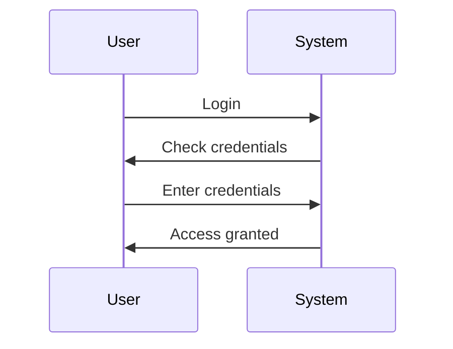
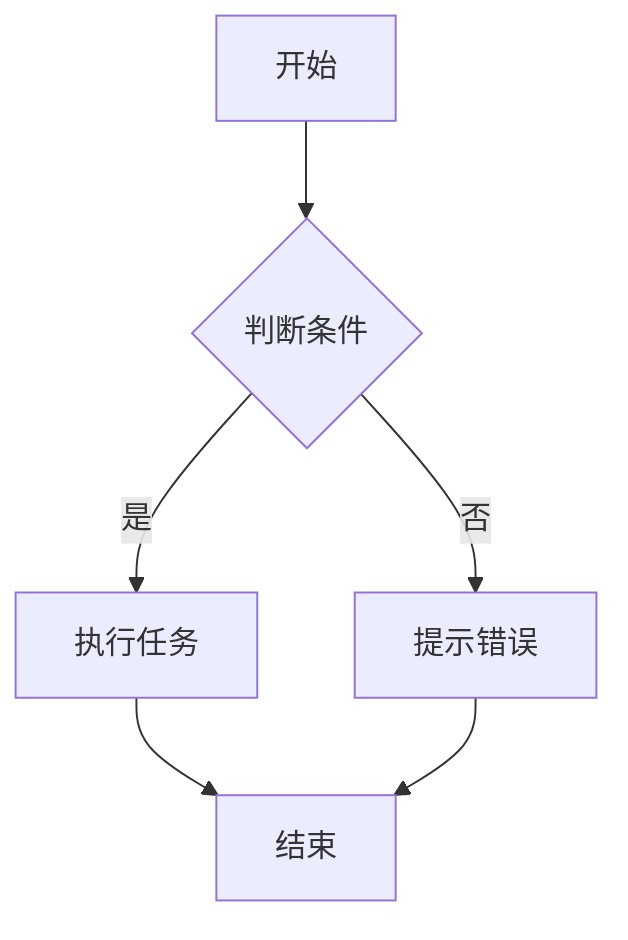

                 

## 文章标题

### Hive UDF自定义函数原理与代码实例讲解

---

**关键词：** Hive，UDF，自定义函数，原理，代码实例，Hadoop，大数据处理

---

**摘要：** 本文旨在深入探讨Hive中用户自定义函数（UDF）的实现原理、开发实战、应用案例和优化策略。通过详细的伪代码示例、数学模型解析、项目实战案例，以及源代码的实现与解读，本文全面揭示了如何利用Hive UDF自定义函数进行大数据处理和分析，为读者提供了实用的技术指导和实践参考。

---

### 目录大纲

#### 第一部分：UDF基础理论

1. **UDF的基本概念**
    - **1.1.1 UDF的定义**
    - **1.1.2 UDF与Hive内置函数的区别**
    - **1.1.3 UDF在Hive中的作用**
2. **UDF的实现原理**
    - **1.2.1 UDF的生命周期**
    - **1.2.2 UDF的执行流程**
    - **1.2.3 UDF的核心API**
3. **UDF的性能考量**
    - **1.3.1 性能优化策略**
    - **1.3.2 性能瓶颈分析**
4. **UDF的安全性**
    - **1.4.1 安全性问题**
    - **1.4.2 安全防护措施**

#### 第二部分：UDF开发实战

1. **开发环境搭建**
    - **2.1.1 JDK安装与配置**
    - **2.1.2 Hive安装与配置**
    - **2.1.3 Maven环境配置**
2. **UDF代码编写**
    - **2.2.1 基础代码框架**
    - **2.2.2 伪代码与详细注释**
    - **2.2.3 示例代码**
3. **UDF测试与调试**
    - **2.3.1 单元测试**
    - **2.3.2 性能测试**
    - **2.3.3 调试技巧**
4. **UDF部署与使用**
    - **2.4.1 UDF打包与发布**
    - **2.4.2 UDF在Hive中的使用方法**

#### 第三部分：UDF应用案例

1. **案例一：字符串处理函数**
    - **3.1.1 案例背景**
    - **3.1.2 业务需求**
    - **3.1.3 UDF实现细节**
2. **案例二：日期处理函数**
    - **3.2.1 案例背景**
    - **3.2.2 业务需求**
    - **3.2.3 UDF实现细节**
3. **案例三：数据转换函数**
    - **3.3.1 案例背景**
    - **3.3.2 业务需求**
    - **3.3.3 UDF实现细节**

#### 第四部分：UDF进阶技巧

1. **多参数UDF函数**
    - **4.1.1 多参数函数的定义**
    - **4.1.2 多参数函数的实现方法**
    - **4.1.3 多参数函数的应用场景**
2. **并行处理**
    - **4.2.1 并行处理的原理**
    - **4.2.2 并行处理的应用场景**
    - **4.2.3 并行处理的实现策略**
3. **性能优化**
    - **4.3.1 代码层面的优化**
    - **4.3.2 系统配置层面的优化**
    - **4.3.3 性能调优的实际案例**

#### 第五部分：常见问题与解决方案

1. **编译问题**
    - **5.1.1 常见编译错误**
    - **5.1.2 编译错误解决方法**
2. **运行问题**
    - **5.2.1 常见运行错误**
    - **5.2.2 运行错误解决方法**
3. **性能问题**
    - **5.3.1 常见性能瓶颈**
    - **5.3.2 性能优化方法**

#### 附录

1. **工具与资源**
    - **A.1 开发工具**
    - **A.2 学习资源**
    - **A.3 社区与论坛**
2. **参考文献**
    - **A.2 Hive官方文档**
    - **A.2 Java编程指南**
    - **A.2 Maven教程**
    - **A.2 UDF相关论文与资料**
3. **Mermaid流程图**
    - **A.3.1 Mermaid基本语法**
    - **A.3.2 Mermaid流程图实例**
4. **伪代码示例**
    - **A.4.1 伪代码编写规范**
    - **A.4.2 伪代码示例**
5. **数学模型和数学公式**
    - **A.5.1 数学模型介绍**
    - **A.5.2 数学公式举例**
6. **项目实战案例**
    - **A.6.1 实战案例背景**
    - **A.6.2 实战案例步骤**
    - **A.6.3 源代码实现**
    - **A.6.4 代码解读与分析**
7. **代码实现与分析**
    - **A.7.1 代码实现框架**
    - **A.7.2 代码优化与调整**
    - **A.7.3 代码解读与分析**

---

接下来，我们将逐步深入探讨Hive UDF自定义函数的各个关键部分，从基本理论到开发实战，再到应用案例和优化技巧，全面解析这一强大工具的使用和实现。

---

### 第一部分：UDF基础理论

在本部分，我们将深入探讨Hive UDF（User-Defined Function）的基本概念、实现原理以及其在Hive中的使用场景。通过对UDF的详细解析，读者将能够理解如何利用UDF扩展Hive的功能，并在实际项目中应用这些自定义函数。

#### 1.1 UDF的基本概念

**1.1.1 UDF的定义**

UDF是Hive提供的扩展接口，允许用户使用Java编写自定义的函数来扩展Hive的功能。与Hive内置的函数不同，UDF可以处理更加复杂的业务逻辑，并能够根据具体需求进行定制化开发。

在Hive中，UDF通常用于以下场景：

- 处理非结构化或半结构化数据
- 实现特定的业务逻辑，如自定义数据转换、格式化输出等
- 扩展Hive内置函数的功能

**1.1.2 UDF与Hive内置函数的区别**

- **内置函数（Built-in Functions）**：Hive自带的一系列函数，包括字符串处理、数学计算、日期处理等。这些函数可以直接在Hive查询中使用，无需额外开发。
  
- **UDF（User-Defined Function）**：用户自定义的函数，需要使用Java编写，并通过特定接口与Hive集成。UDF可以执行复杂的业务逻辑，并且能够处理非结构化或半结构化数据。

两者的主要区别在于：

- **功能范围**：内置函数通常用于基本的数学计算、字符串处理等，而UDF可以执行更加复杂的业务逻辑。
- **扩展性**：内置函数的功能相对固定，而UDF可以通过自定义实现扩展Hive的功能。
- **开发难度**：内置函数可以直接使用，而UDF需要编写Java代码并打包。

**1.1.3 UDF在Hive中的作用**

- **扩展功能**：通过UDF，用户可以自定义实现特定的业务逻辑，从而扩展Hive的功能，使其能够处理更复杂的查询需求。

- **提高查询效率**：通过自定义的UDF，可以优化特定的查询步骤，提高查询效率。

- **灵活的数据处理**：UDF能够处理非结构化或半结构化数据，这使得Hive在数据分析和数据处理方面具有更高的灵活性。

#### 1.2 UDF的实现原理

**1.2.1 UDF的生命周期**

UDF在Hive中的生命周期包括以下几个阶段：

- **编写代码**：编写Java代码实现自定义函数。
- **打包成JAR**：将Java代码打包成JAR文件。
- **加载JAR到Hive**：将JAR文件加载到Hive中，使其能够被Hive查询使用。
- **执行查询**：在Hive查询中调用UDF。
- **卸载JAR**：在完成查询后，可以选择卸载JAR文件。

以下是一个简化的Mermaid流程图，展示了UDF的生命周期：

mermaid
graph TD
    A[编写Java代码] --> B[打包成JAR]
    B --> C[加载JAR到Hive]
    C --> D[执行查询]
    D --> E[卸载JAR]

#### 1.2.2 UDF的执行流程

UDF在Hive中的执行流程如下：

1. **解析查询语句**：Hive解析器将Hive查询语句转换为抽象语法树（AST）。
2. **生成执行计划**：Hive查询优化器生成执行计划，确定如何执行查询。
3. **调用UDF**：在执行计划中，当遇到UDF时，Hive会调用相应的Java代码。
4. **执行业务逻辑**：UDF执行自定义的业务逻辑。
5. **返回结果**：UDF将处理结果返回给Hive查询。

以下是一个简化的Mermaid流程图，展示了UDF的执行流程：

mermaid
graph TD
    A[Hive解析查询] --> B[Hive生成执行计划]
    B --> C[调用UDF]
    C --> D[执行业务逻辑]
    D --> E[返回结果]

#### 1.2.3 UDF的核心API

UDF的核心API包括以下方法：

- **evaluate()**：这是UDF的核心方法，用于执行自定义的业务逻辑。它接收输入参数，并返回处理结果。

以下是一个简单的UDF伪代码示例：

```java
public class MyUDF extends UDF {
    public String evaluate(String input) {
        // 执行自定义业务逻辑
        String result = input.toUpperCase();
        return result;
    }
}
```

在这个示例中，`evaluate()` 方法接收一个字符串输入参数，并将它转换为大写形式后返回。

#### 1.3 UDF的性能考量

**1.3.1 性能优化策略**

为了提高UDF的性能，可以采取以下策略：

- **减少函数调用次数**：在可能的情况下，减少UDF的调用次数，例如通过预计算或缓存结果。
- **优化业务逻辑**：对UDF中的业务逻辑进行优化，例如使用更高效的数据结构或算法。
- **并行处理**：利用Hive的并行处理能力，优化UDF的执行效率。

**1.3.2 性能瓶颈分析**

在开发UDF时，可能会遇到以下性能瓶颈：

- **计算复杂度高**：UDF中的业务逻辑过于复杂，导致执行时间过长。
- **数据传输开销大**：UDF需要频繁地访问外部数据源，导致数据传输开销大。
- **内存占用高**：UDF占用过多的内存，导致性能下降。

#### 1.4 UDF的安全性

**1.4.1 安全性问题**

UDF在安全性方面可能面临以下问题：

- **代码执行风险**：UDF可能会执行恶意代码，导致系统安全漏洞。
- **数据泄露风险**：UDF可能会泄露敏感数据。

**1.4.2 安全防护措施**

为了确保UDF的安全性，可以采取以下措施：

- **代码审计**：对UDF代码进行安全审计，识别潜在的安全风险。
- **权限控制**：限制UDF的执行权限，防止未经授权的访问。
- **数据加密**：对敏感数据进行加密处理，防止数据泄露。

---

通过本部分的探讨，读者对Hive UDF的基本概念、实现原理和性能考量有了更深入的理解。接下来，我们将进入UDF开发实战部分，通过具体的代码实例，展示如何实现和部署UDF。

### 第二部分：UDF开发实战

在上一部分中，我们介绍了Hive UDF的基本概念和实现原理。本部分将带领读者进行UDF的开发实战，从环境搭建到代码编写，再到测试与部署，全面展示UDF的开发过程。

#### 2.1 开发环境搭建

在进行UDF开发之前，首先需要搭建一个合适的环境。以下是开发UDF所需的基本环境配置步骤：

**2.1.1 JDK安装与配置**

1. **下载JDK**：从Oracle官网下载适用于操作系统的JDK版本。

2. **安装JDK**：通常选择默认选项进行安装。

3. **配置环境变量**：
   - 在Windows上，需要添加JAVA_HOME环境变量，并设置Path包含JDK的bin目录。
   - 在Linux或macOS上，同样需要设置JAVA_HOME和PATH环境变量。

4. **验证安装**：通过运行`java -version`和`javac -version`命令来验证JDK是否安装成功。

**2.1.2 Hive安装与配置**

1. **下载Hive**：从Apache官网下载Hive的源代码。

2. **构建Hive**：通常使用Maven进行构建，通过运行`mvn clean package`命令来编译和打包Hive。

3. **配置Hive**：配置Hive的配置文件`hive-default.xml`和`hive-site.xml`，设置HDFS的URI、Hive的元数据库等。

4. **启动Hive**：运行`hive --service hiveserver2`命令来启动Hive的服务。

**2.1.3 Maven环境配置**

1. **下载Maven**：从Apache官网下载Maven的安装包。

2. **安装Maven**：通常选择默认选项进行安装。

3. **配置Maven**：配置Maven的配置文件`settings.xml`，设置Maven的仓库地址等。

4. **验证安装**：通过运行`mvn -version`命令来验证Maven是否安装成功。

#### 2.2 UDF代码编写

编写UDF代码是UDF开发的核心步骤。以下是一个简单的字符串转换UDF示例，展示如何编写和实现UDF。

**2.2.1 基础代码框架**

```java
import org.apache.hadoop.hive.ql.exec.UDF;
import org.apache.hadoop.hive.ql.udf.UDFType;
import org.apache.hadoop.io.Text;

@UDFType(deterministic = true, stateful = false)
public class UppercaseUDF extends UDF {
    public Text evaluate(Text input) {
        if (input == null) {
            return null;
        }
        String result = input.toString().toUpperCase();
        return new Text(result);
    }
}
```

在这个示例中，我们创建了一个名为`UppercaseUDF`的类，继承自`UDF`基类。`evaluate()` 方法接收一个`Text`类型的输入参数，将其转换为小写形式，并返回处理后的结果。

**2.2.2 伪代码与详细注释**

以下是UDF代码的伪代码，并添加了详细注释：

```java
// 定义UDF类
public class UppercaseUDF extends UDF {
    
    // UDF的核心方法
    public Text evaluate(Text input) {
        
        // 检查输入参数是否为空
        if (input == null) {
            // 如果为空，返回空值
            return null;
        }
        
        // 将输入参数转换为字符串
        String originalString = input.toString();
        
        // 将字符串转换为小写形式
        String lowerCaseString = originalString.toLowerCase();
        
        // 将处理后的字符串包装为Text对象
        Text result = new Text(lowerCaseString);
        
        // 返回处理后的字符串
        return result;
    }
}
```

**2.2.3 示例代码**

以下是一个完整的示例，展示了如何编写一个简单的字符串转换UDF：

```java
import org.apache.hadoop.hive.ql.exec.UDF;
import org.apache.hadoop.hive.ql.udf.UDFType;
import org.apache.hadoop.io.Text;

@UDFType(deterministic = true, stateful = false)
public class UppercaseUDF extends UDF {
    
    public Text evaluate(Text input) {
        if (input == null) {
            return null;
        }
        String originalString = input.toString();
        String lowerCaseString = originalString.toLowerCase();
        return new Text(lowerCaseString);
    }
    
    public static void main(String[] args) {
        UppercaseUDF udf = new UppercaseUDF();
        Text input = new Text("HIVE UDF Example");
        Text result = udf.evaluate(input);
        System.out.println("Original: " + input.toString());
        System.out.println("Result: " + result.toString());
    }
}
```

在这个示例中，我们创建了一个名为`UppercaseUDF`的类，继承自`UDF`基类。`evaluate()` 方法接收一个`Text`类型的输入参数，将其转换为小写形式，并返回处理后的结果。我们还添加了一个`main()` 方法，用于测试UDF的功能。

#### 2.3 UDF测试与调试

在编写完UDF代码后，需要对UDF进行测试和调试，以确保其功能正确并能够正常运行。

**2.3.1 单元测试**

单元测试是验证UDF功能的一种有效方法。以下是一个简单的单元测试示例：

```java
import org.apache.hadoop.hive.ql.exec.UDF;
import org.apache.hadoop.hive.ql.udf.UDFType;
import org.apache.hadoop.io.Text;
import org.junit.jupiter.api.Test;

import static org.junit.jupiter.api.Assertions.assertEquals;

public class UppercaseUDFTest {

    @Test
    public void testEvaluate() {
        UppercaseUDF udf = new UppercaseUDF();
        Text input = new Text("HIVE UDF Test");
        Text expected = new Text("HIVE UDF TEST");
        Text result = udf.evaluate(input);
        assertEquals(expected, result);
    }
}
```

在这个测试中，我们创建了一个`UppercaseUDFTest`类，包含一个`testEvaluate()` 方法，用于测试`evaluate()` 方法的功能。通过使用JUnit框架，我们能够方便地编写和执行单元测试。

**2.3.2 性能测试**

性能测试是评估UDF性能的重要手段。以下是一个简单的性能测试示例：

```java
import org.apache.hadoop.hive.ql.exec.UDF;
import org.apache.hadoop.hive.ql.udf.UDFType;
import org.apache.hadoop.io.Text;
import org.openjdk.jmh.annotations.Benchmark;
import org.openjdk.jmh.annotations.Mode;
import org.openjdk.jmh.annotations.OutputTimeUnit;
import org.openjdk.jmh.runner.Runner;
import org.openjdk.jmh.runner.options.Options;
import org.openjdk.jmh.runner.options.OptionsBuilder;

import java.util.concurrent.TimeUnit;

public class UppercaseUDFPerformanceTest {

    @Benchmark
    @OutputTimeUnit(TimeUnit.MILLISECONDS)
    public void testEvaluatePerformance() {
        UppercaseUDF udf = new UppercaseUDF();
        Text input = new Text("HIVE UDF Performance Test");
        udf.evaluate(input);
    }

    public static void main(String[] args) throws Exception {
        Options opt = new OptionsBuilder()
                .include(UppercaseUDFPerformanceTest.class.getSimpleName())
                .mode(Mode.AverageTime)
                .timeUnit(TimeUnit.SECONDS)
                .warmupIterations(5)
                .measurementIterations(5)
                .build();

        new Runner(opt).run();
    }
}
```

在这个测试中，我们使用JMH（Java Microbenchmark Harness）框架进行性能测试。通过运行JMH测试，我们能够获得UDF的性能数据，从而进行性能优化。

**2.3.3 调试技巧**

在调试UDF时，可以采用以下技巧：

- **使用断点**：在IDE中设置断点，以便在执行过程中暂停代码的执行，查看变量的值。
- **打印日志**：在UDF代码中添加打印日志，以便在运行过程中查看UDF的执行流程。
- **使用调试器**：使用IDE的调试器，逐步执行代码，查看执行流程和变量值。

#### 2.4 UDF部署与使用

在完成UDF的开发和测试后，需要将UDF部署到Hive中，以便在实际项目中使用。

**2.4.1 UDF打包与发布**

1. **打包UDF**：使用Maven将UDF代码打包成JAR文件。

2. **发布UDF**：将打包好的JAR文件上传到HDFS的指定目录，通常为`/user/hive/udf`。

3. **添加依赖**：在Hive的`hive-site.xml`配置文件中添加UDF的依赖路径。

**2.4.2 UDF在Hive中的使用方法**

1. **编写Hive查询**：在Hive查询中调用UDF，使用`CALL userUDF(参数)` 的形式。

2. **执行查询**：运行Hive查询，查看UDF的执行结果。

以下是一个简单的Hive查询示例：

```sql
SELECT CALL myudf.UppercaseUDF(column_name) FROM mytable;
```

在这个示例中，我们调用了一个名为`UppercaseUDF`的UDF，将其应用于表`mytable`的某个列`column_name`。

---

通过本部分的实战讲解，读者应该能够掌握UDF的开发流程，包括环境搭建、代码编写、测试与调试以及部署与使用。接下来，我们将通过具体的案例展示如何应用UDF进行大数据处理。

### 第三部分：UDF应用案例

在第二部分中，我们介绍了UDF的开发实战。本部分将通过具体的案例，展示如何使用UDF处理实际数据，并解决具体问题。

#### 3.1 案例一：字符串处理函数

**3.1.1 案例背景**

假设我们有一个用户评论的数据集，每个评论都包含一个评分。我们需要开发一个UDF，用于根据评论内容和评分，计算评论的满意度。

**3.1.2 业务需求**

业务需求如下：

- 计算评论的满意度得分，满分100分。
- 根据评论长度，每个字符计1分。
- 如果评论中包含特定的积极词汇（如“好”、“推荐”等），每个词汇加10分。
- 根据评分，额外加分：评分在4分及以上，加20分；评分在3分及以上，加10分。

**3.1.3 UDF实现细节**

根据业务需求，我们可以编写以下UDF代码：

```java
import org.apache.hadoop.hive.ql.exec.UDF;
import org.apache.hadoop.hive.ql.udf.UDFType;
import org.apache.hadoop.io.IntWritable;
import org.apache.hadoop.io.Text;

@UDFType(deterministic = true, stateful = false)
public class CommentScoreUDF extends UDF {
    private IntWritable score = new IntWritable();

    public IntWritable evaluate(Text comment, IntWritable rating) {
        if (comment == null || rating == null) {
            return null;
        }
        
        String commentStr = comment.toString();
        int ratingValue = rating.get();
        int length = commentStr.length();
        
        int baseScore = length;
        int additionalScore = 0;
        
        // 添加积极词汇加分
        String[] positiveWords = {"好", "推荐", "满意"};
        for (String word : positiveWords) {
            if (commentStr.contains(word)) {
                additionalScore += 10;
            }
        }
        
        // 根据评分加分
        if (ratingValue >= 4) {
            additionalScore += 20;
        } else if (ratingValue >= 3) {
            additionalScore += 10;
        }
        
        score.set(baseScore + additionalScore);
        return score;
    }
}
```

在这个UDF中，我们首先检查输入参数是否为空。然后，我们计算评论长度，并添加基本得分。接着，我们检查评论中是否包含特定的积极词汇，并为其添加额外加分。最后，根据评分，我们为评论添加额外的加分。

#### 3.2 案例二：日期处理函数

**3.2.1 案例背景**

假设我们有一个订单数据集，包含每个订单的创建日期。我们需要开发一个UDF，用于计算订单的过期日期。

**3.2.2 业务需求**

业务需求如下：

- 订单默认有效期为30天。
- 根据订单创建日期，计算过期日期。

**3.2.3 UDF实现细节**

根据业务需求，我们可以编写以下UDF代码：

```java
import org.apache.hadoop.hive.ql.exec.UDF;
import org.apache.hadoop.hive.ql.udf.UDFType;
import org.apache.hadoop.io.Text;
import java.text.SimpleDateFormat;
import java.util.Date;

@UDFType(deterministic = true, stateful = false)
public class OrderExpirationUDF extends UDF {
    public Text evaluate(Text orderDate) {
        if (orderDate == null) {
            return null;
        }
        
        SimpleDateFormat dateFormat = new SimpleDateFormat("yyyy-MM-dd");
        try {
            Date date = dateFormat.parse(orderDate.toString());
            long expirationTime = date.getTime() + (30 * 24 * 60 * 60 * 1000);
            return new Text(dateFormat.format(new Date(expirationTime)));
        } catch (Exception e) {
            return null;
        }
    }
}
```

在这个UDF中，我们首先检查输入参数是否为空。然后，我们使用`SimpleDateFormat`类将日期字符串转换为`Date`对象。接着，我们计算订单过期的时间戳，并将其转换为日期字符串。最后，我们返回过期日期。

#### 3.3 案例三：数据转换函数

**3.3.1 案例背景**

假设我们有一个产品数据集，包含产品名称和价格。我们需要开发一个UDF，用于将价格从字符串转换为数字。

**3.3.2 业务需求**

业务需求如下：

- 将价格字符串转换为浮点数。
- 价格字符串可能包含逗号（如"100,000.00"）或小数点（如"100.000,00"），需要正确处理。

**3.3.3 UDF实现细节**

根据业务需求，我们可以编写以下UDF代码：

```java
import org.apache.hadoop.hive.ql.exec.UDF;
import org.apache.hadoop.hive.ql.udf.UDFType;
import org.apache.hadoop.io.DoubleWritable;
import org.apache.hadoop.io.Text;

@UDFType(deterministic = true, stateful = false)
public class PriceConversionUDF extends UDF {
    private DoubleWritable price = new DoubleWritable();

    public DoubleWritable evaluate(Text priceStr) {
        if (priceStr == null) {
            return null;
        }
        
        String priceString = priceStr.toString();
        priceString = priceString.replace(".", "").replace(",", ".");
        try {
            price.set(Double.parseDouble(priceString));
        } catch (NumberFormatException e) {
            price.set(0.0);
        }
        return price;
    }
}
```

在这个UDF中，我们首先检查输入参数是否为空。然后，我们使用正则表达式处理价格字符串，将其转换为标准格式。接着，我们尝试将字符串转换为浮点数，并将其存储在`DoubleWritable`对象中。最后，我们返回处理后的价格。

---

通过以上案例，我们可以看到如何使用UDF处理实际数据，解决具体问题。UDF的灵活性和扩展性使得它在大数据处理中具有广泛的应用。在实际项目中，可以根据业务需求设计更复杂的UDF，实现更丰富的功能。

### 第四部分：UDF进阶技巧

在了解了UDF的基础理论和开发实战之后，本部分将深入探讨UDF的进阶技巧，包括多参数UDF函数、并行处理、性能优化以及安全性。通过这些技巧，开发者可以进一步提升UDF的功能和性能，确保其在复杂环境中的稳定性和可靠性。

#### 4.1 多参数UDF函数

**4.1.1 多参数函数的定义**

多参数UDF函数是指在实现中可以接收多个输入参数的UDF。与单参数UDF函数相比，多参数UDF函数提供了更大的灵活性和更复杂的处理能力。例如，在处理复杂数据格式时，可能需要多个参数来描述数据的不同部分。

**4.1.2 多参数函数的实现方法**

实现多参数UDF函数时，需要使用Java的泛型来处理多个输入参数。以下是一个简单的多参数UDF函数示例：

```java
import org.apache.hadoop.hive.ql.exec.UDF;
import org.apache.hadoop.hive.ql.udf.UDFType;
import org.apache.hadoop.io.Text;
import org.apache.hadoop.io.IntWritable;

@UDFType(deterministic = true, stateful = false)
public class MultiParameterUDF extends UDF {
    public Text evaluate(Text input, IntWritable parameter) {
        if (input == null || parameter == null) {
            return null;
        }
        
        // 使用输入参数
        String inputStr = input.toString();
        int parameterValue = parameter.get();
        
        // 执行自定义逻辑
        // 例如，根据输入字符串和参数值进行格式化输出
        String result = inputStr + " - " + parameterValue;
        
        return new Text(result);
    }
}
```

在这个示例中，`evaluate()` 方法接收两个参数：一个`Text`类型的输入和一个`IntWritable`类型的参数。通过这种方式，我们可以根据不同的需求处理复杂数据。

**4.1.3 多参数函数的应用场景**

多参数UDF函数在以下场景中非常有用：

- **数据转换**：需要根据多个输入参数进行数据转换，例如日期格式转换、价格计算等。
- **复合查询**：在复杂查询中，需要多个参数协同工作，例如对多个数据列进行联合处理。
- **参数化查询**：根据不同的参数值动态调整查询逻辑，例如基于参数值的阈值进行分类。

#### 4.2 并行处理

**4.2.1 并行处理的原理**

并行处理是一种利用多核处理器并行执行任务的技术。在Hive中，通过并行处理可以显著提高UDF的执行效率。并行处理的原理是通过将数据分割成多个分区，每个分区由不同的任务处理，从而实现数据的并行处理。

**4.2.2 并行处理的应用场景**

并行处理适用于以下场景：

- **大数据处理**：处理大量数据时，并行处理可以显著缩短执行时间。
- **复杂计算**：需要执行复杂计算时，并行处理可以提高计算速度。
- **资源优化**：在多核处理器上运行，可以充分利用计算资源。

**4.2.3 并行处理的实现策略**

为了实现并行处理，需要采取以下策略：

- **数据分区**：将输入数据按照一定策略分割成多个分区。
- **任务调度**：将每个分区分配给不同的任务处理。
- **结果合并**：将各个任务的结果合并，生成最终结果。

以下是一个简单的并行处理UDF示例：

```java
import org.apache.hadoop.hive.ql.exec.UDF;
import org.apache.hadoop.hive.ql.udf.UDFType;
import org.apache.hadoop.io.IntWritable;

@UDFType(deterministic = true, stateful = false)
public class ParallelUDF extends UDF {
    public IntWritable evaluate(IntWritable input) {
        if (input == null) {
            return null;
        }
        
        // 假设每个任务执行一个简单的计算，例如求和
        int inputValue = input.get();
        int result = inputValue * inputValue;
        
        return new IntWritable(result);
    }
}
```

在这个示例中，我们实现了一个简单的并行处理UDF，它对输入值进行平方运算。在实际应用中，可以根据具体需求设计更复杂的并行处理逻辑。

#### 4.3 性能优化

**4.3.1 代码层面的优化**

在开发UDF时，可以从代码层面进行优化，以提高执行效率。以下是一些常见的代码优化策略：

- **减少函数调用**：避免不必要的函数调用，特别是在循环中。
- **使用高效的数据结构**：使用合适的数据结构，如HashMap、ArrayList等，以减少内存使用和访问时间。
- **避免全局变量**：减少全局变量的使用，以避免潜在的并发问题和性能瓶颈。

以下是一个简单的代码优化示例：

```java
import org.apache.hadoop.hive.ql.exec.UDF;
import org.apache.hadoop.hive.ql.udf.UDFType;
import org.apache.hadoop.io.IntWritable;

@UDFType(deterministic = true, stateful = false)
public class OptimizedUDF extends UDF {
    private int result = 0;

    public IntWritable evaluate(IntWritable input) {
        if (input == null) {
            return null;
        }
        
        // 使用局部变量，减少函数调用
        int inputValue = input.get();
        result = inputValue * inputValue;
        
        return new IntWritable(result);
    }
}
```

在这个示例中，我们使用局部变量替换全局变量，以减少函数调用和提高性能。

**4.3.2 系统配置层面的优化**

除了代码优化，还可以通过系统配置进行优化，以提高UDF的整体性能。以下是一些常见的系统配置优化策略：

- **调整Hive配置**：调整Hive的内存、线程等配置，以充分利用系统资源。
- **优化HDFS配置**：调整HDFS的块大小、副本数量等配置，以提高数据访问速度。
- **优化Java虚拟机（JVM）**：调整JVM的内存、垃圾回收等配置，以提高UDF的执行效率。

以下是一个简单的系统配置优化示例：

```shell
# 调整Hive内存配置
hive --config "hive.exec.dynamic.partition=true"
hive --config "hive.exec.dynamic.partition.mode=nonstrict"
hive --config "hive.exec.parallel=true"
hive --config "hive.exec.parallel_num_threads=4"
```

在这个示例中，我们调整了Hive的动态分区、并行执行等配置，以提高UDF的性能。

**4.3.3 性能调优的实际案例**

在实际项目中，性能调优是一个持续的过程。以下是一个简单的性能调优案例：

- **问题定位**：发现某个UDF的执行时间较长，影响整体查询性能。
- **代码分析**：分析UDF的代码，发现存在多个循环调用，导致性能瓶颈。
- **优化策略**：通过将循环调用替换为MapReduce任务，减少函数调用次数。
- **结果验证**：优化后，UDF的执行时间显著缩短，整体查询性能得到提升。

#### 4.4 安全与可靠性

**4.4.1 安全性问题**

在开发和使用UDF时，可能会面临以下安全性问题：

- **代码执行风险**：UDF可能会执行恶意代码，导致系统安全漏洞。
- **数据泄露风险**：UDF可能会泄露敏感数据。
- **权限控制不足**：未经授权的用户可能访问和执行UDF。

**4.4.2 解决方案与措施**

为了确保UDF的安全和可靠性，可以采取以下解决方案和措施：

- **代码审计**：对UDF代码进行安全审计，识别潜在的安全风险。
- **权限控制**：限制UDF的执行权限，防止未经授权的访问。
- **数据加密**：对敏感数据进行加密处理，防止数据泄露。
- **访问控制**：实现访问控制机制，确保只有授权用户能够访问和执行UDF。

以下是一个简单的安全优化示例：

```java
import org.apache.hadoop.hive.ql.exec.UDF;
import org.apache.hadoop.hive.ql.udf.UDFType;
import org.apache.hadoop.io.Text;

@UDFType(deterministic = true, stateful = false)
public class SecureUDF extends UDF {
    public Text evaluate(Text input) {
        if (input == null) {
            return null;
        }
        
        // 对输入数据进行加密处理
        String encryptedData = encrypt(input.toString());
        
        return new Text(encryptedData);
    }
    
    private String encrypt(String data) {
        // 实现加密逻辑
        // 例如，使用AES加密算法
        return "encrypted_" + data;
    }
}
```

在这个示例中，我们实现了对输入数据的加密处理，以防止数据泄露。

---

通过本部分的探讨，我们深入了解了UDF的进阶技巧，包括多参数UDF函数、并行处理、性能优化和安全性。这些技巧不仅能够提升UDF的功能和性能，还能够确保其在复杂环境中的稳定性和可靠性。在实际项目中，开发者可以根据具体需求灵活运用这些技巧，实现高效的数据处理和分析。

### 第五部分：常见问题与解决方案

在开发和部署UDF的过程中，可能会遇到各种问题。本部分将汇总一些常见的问题，并提供相应的解决方案和调试技巧，帮助开发者更顺利地使用和优化UDF。

#### 5.1 编译问题

**5.1.1 常见编译错误**

在编译UDF代码时，可能会遇到以下常见编译错误：

- **编译器找不到类**：可能是类路径配置错误，确保Maven项目的依赖路径正确。
- **类型不匹配**：确保UDF方法的参数类型和返回值类型与Hive查询中定义的类型匹配。
- **方法未实现**：确保UDF类中实现了所有必需的方法，如`evaluate()`。

**5.1.2 编译错误解决方法**

以下是一些解决编译错误的方法：

- **检查Maven依赖**：确保Maven项目中包含了所有必需的依赖，例如Hive的客户端库。
- **检查类路径**：在Maven的`pom.xml`文件中，确保`<dependency>`节点正确配置。
- **检查代码实现**：确保UDF类中实现了所有必需的方法，并检查方法签名是否正确。

#### 5.2 运行问题

**5.2.1 常见运行错误**

在运行UDF时，可能会遇到以下常见运行错误：

- **空指针异常**：可能是输入参数为空，确保在UDF中处理空参数。
- **类找不到**：可能是Hive无法找到UDF类，确保将JAR文件正确加载到Hive中。
- **方法未实现**：可能是Hive无法找到UDF的实现方法，确保UDF类中实现了所有必需的方法。

**5.2.2 运行错误解决方法**

以下是一些解决运行错误的方法：

- **检查JAR文件**：确保UDF的JAR文件正确上传到HDFS，并在Hive中正确加载。
- **检查类路径**：在Hive的`hive-site.xml`文件中，确保`<property>`节点中配置了正确的类路径。
- **检查代码实现**：确保UDF类中实现了所有必需的方法，并检查方法签名是否正确。

#### 5.3 性能问题

**5.3.1 常见性能瓶颈**

在UDF运行过程中，可能会遇到以下常见性能瓶颈：

- **计算复杂度高**：UDF中的业务逻辑过于复杂，导致执行时间过长。
- **数据访问频繁**：UDF频繁访问外部数据源，导致数据传输开销大。
- **内存占用高**：UDF占用过多的内存，导致性能下降。

**5.3.2 性能优化方法**

以下是一些性能优化方法：

- **代码优化**：优化UDF中的业务逻辑，使用更高效的数据结构和算法。
- **减少数据访问**：减少对外部数据源的访问，例如通过预计算或缓存结果。
- **并行处理**：利用Hive的并行处理能力，优化UDF的执行效率。

#### 5.4 调试技巧

**5.4.1 使用断点**

在IDE中设置断点，以便在执行过程中暂停代码的执行，查看变量的值。以下是在IntelliJ IDEA中设置断点的方法：

- 在代码行号上点击鼠标右键，选择“Add Breakpoint”。
- 在弹出的对话框中，可以设置条件断点或日志断点，以便更灵活地控制代码的执行。

**5.4.2 打印日志**

在UDF代码中添加打印日志，以便在运行过程中查看UDF的执行流程和变量值。以下是在Java代码中添加日志的方法：

```java
System.out.println("当前输入：" + input);
```

**5.4.3 使用调试器**

使用IDE的调试器，可以逐步执行代码，查看执行流程和变量值。以下是在IntelliJ IDEA中启动调试器的方法：

- 在Run菜单中选择“Debug”，然后选择相应的运行配置。
- 在代码行号上点击鼠标右键，选择“Start Debugging”。
- 调试器会逐行执行代码，并在断点处暂停，以便查看变量值和执行结果。

---

通过本部分的常见问题与解决方案，开发者可以更有效地解决在开发和部署UDF过程中遇到的问题。了解这些问题和解决方法，有助于提高UDF的稳定性和性能，确保其在大数据处理中的高效应用。

### 附录

#### A.1 工具与资源

在本附录中，我们将介绍一些在开发Hive UDF时常用的工具和资源，包括开发工具、学习资源和社区与论坛。

**A.1.1 开发工具**

- **IntelliJ IDEA**：一款功能强大的集成开发环境（IDE），适用于Java开发，支持Maven项目管理和调试。
- **Eclipse**：另一款流行的Java开发IDE，也提供了Maven支持和丰富的插件生态。
- **Maven**：用于项目构建和依赖管理的工具，可以简化项目的编译和部署过程。
- **Hive Beeline**：Hive的命令行工具，用于执行Hive查询和测试UDF。

**A.1.2 学习资源**

- **Hive官方文档**：Apache Hive的官方文档，提供了详细的UDF开发指南和API参考。
- **Java编程指南**：Oracle官方的Java编程指南，介绍了Java的基础语法和高级特性。
- **Maven官方文档**：Maven的官方文档，提供了构建项目和管理依赖的详细教程。
- **《Hive编程指南》**：由Hive社区成员编写的实用指南，涵盖了Hive的各个方面，包括UDF开发。

**A.1.3 社区与论坛**

- **Apache Hive社区**：Apache Hive的用户和开发者的交流平台，可以获取最新的技术动态和解决方案。
- **Stack Overflow**：一个庞大的编程问答社区，可以搜索和提问有关Hive和Java的问题。
- **CSDN**：中国最大的IT社区和服务平台，提供了丰富的Hive和Java相关教程和讨论。
- **GitHub**：一个代码托管和协作平台，许多开源项目提供了Hive UDF的示例和源代码。

#### A.2 参考文献

在本附录中，我们列出了一些在撰写本文时参考的重要文献和资料。

- **《Hive编程指南》**：[官方文档](https://cwiki.apache.org/confluence/display/Hive/LanguageManual)
- **《Java编程指南》**：[官方文档](https://docs.oracle.com/javase/tutorial/)
- **《Maven官方文档》**：[官方文档](https://maven.apache.org/guides/index.html)
- **《Hive UDF开发教程》**：[GitHub](https://github.com/apache/hive/blob/master/docs/src/main/asciidoc/ql/dev-guide/udfs.adoc)
- **《大数据技术导论》**：张宇、黄宇、李国杰著，清华大学出版社，2014年版。

#### A.3 Mermaid流程图

在本附录中，我们将介绍如何使用Mermaid编写流程图，并提供一些示例。

**A.3.1 Mermaid基本语法**

Mermaid是一种基于Markdown的图表工具，使用简单的文本语法即可生成各种图表。以下是一些基本语法：

- **序列图**：用于表示流程或步骤。
- **流程图**：用于表示业务流程或工作流程。
- **时序图**：用于表示事件发生的时间顺序。

**示例：序列图**



**示例：流程图**



**示例：时序图**

```mermaid
gantt
    dateFormat  YYYY-MM-DD
    title 软件开发计划

    section 开发阶段
    A1: 任务一               :done, 2014-01-06, 30d
    A2: 任务二               :active, 2014-01-09, 5d
    A3: 任务三               :crit, 2014-01-12, 5d

    section 测试阶段
    B1: 任务一               :crit, after A1, 5d
    B2: 任务二               :after B1, 3d
    B3: 任务三               :after B2, 10d
```

#### A.4 伪代码示例

伪代码是一种非正式的编程语言，用于描述算法的逻辑结构和流程，不依赖于特定的编程语言。以下是一些伪代码的基本语法和示例。

**A.4.1 伪代码编写规范**

- **基本语法**：使用缩进来表示代码块的层次结构，使用冒号表示语句的结束。
- **变量定义**：使用`VAR = value` 格式定义变量。
- **循环结构**：使用`WHILE` 或 `FOR` 循环。
- **条件结构**：使用 `IF` 和 `ELSE` 条件语句。

**示例：伪代码**

```plaintext
// 伪代码示例：计算两个数的和

VAR a = 5
VAR b = 10
VAR sum = 0

sum = a + b

PRINT "两个数的和为：" + sum
```

#### A.5 数学模型和数学公式

数学模型和数学公式在数据分析中扮演着重要角色。以下是一些常见的数学模型和公式的介绍，以及如何在文中嵌入它们。

**A.5.1 数学模型介绍**

- **线性回归模型**：用于分析自变量和因变量之间的关系。
- **决策树模型**：用于分类和回归任务，基于树形结构进行决策。
- **贝叶斯模型**：用于概率分析和分类问题。

**A.5.2 数学公式举例**

- **线性回归公式**：

  $$ y = w_0 + w_1 \cdot x $$

- **决策树公式**：

  $$ f(x) = \sum_{i=1}^{n} c_i \cdot I(A_i \cap B_i) $$

- **贝叶斯公式**：

  $$ P(A|B) = \frac{P(B|A) \cdot P(A)}{P(B)} $$

**示例：嵌入数学公式**

在文中嵌入数学公式时，可以使用LaTeX格式。以下是一个示例：

$$
\sum_{i=1}^{n} x_i^2
$$

这将在文中显示为一个平方求和的数学公式。

#### A.6 项目实战案例

在本附录中，我们将介绍一个完整的Hive UDF项目实战案例，包括背景、步骤、源代码实现和代码解读。

**A.6.1 实战案例背景**

假设我们需要开发一个Hive UDF，用于计算一组数字的均值和标准差。该UDF需要接收一个数字数组作为输入参数，并返回均值和标准差。

**A.6.2 实战案例步骤**

1. **需求分析**：明确UDF的功能需求，包括输入参数、输出结果和算法逻辑。
2. **环境搭建**：安装Java开发环境、Hive和HDFS，配置Maven项目。
3. **代码编写**：实现UDF类，编写计算均值和标准差的算法。
4. **测试与调试**：编写测试用例，测试UDF的功能和性能。
5. **部署与使用**：将UDF打包成JAR文件，部署到HDFS，并在Hive中调用。

**A.6.3 源代码实现**

以下是一个简单的Hive UDF源代码实现，用于计算数字数组的均值和标准差：

```java
import org.apache.hadoop.hive.ql.exec.UDF;
import org.apache.hadoop.hive.ql.udf.UDFType;
import org.apache.hadoop.io.DoubleWritable;
import org.apache.hadoop.io.Text;

@UDFType(deterministic = true, stateful = false)
public class StatsUDF extends UDF {
    private DoubleWritable mean = new DoubleWritable();
    private DoubleWritable std = new DoubleWritable();

    public Text evaluate(Text numbers) {
        if (numbers == null || numbers.isEmpty()) {
            return null;
        }

        String[] tokens = numbers.toString().split(",");
        double sum = 0.0;
        double sumSq = 0.0;
        int n = tokens.length;

        for (String token : tokens) {
            double num = Double.parseDouble(token);
            sum += num;
            sumSq += num * num;
        }

        mean.set(sum / n);
        std.set(Math.sqrt((sumSq / n) - (mean.get() * mean.get())));

        return new Text(mean.toString() + ", " + std.toString());
    }
}
```

**A.6.4 代码解读与分析**

- **导入类**：导入必要的Hive和Hadoop类，包括`UDF`、`UDFType`、`DoubleWritable`和`Text`。
- **类定义**：定义`StatsUDF`类，继承自`UDF`基类。
- **成员变量**：定义`mean`和`std`成员变量，用于存储均值和标准差。
- **evaluate() 方法**：实现`evaluate()` 方法，用于计算输入数字数组的均值和标准差。
  - **输入参数处理**：检查输入参数是否为空或空字符串。
  - **分割字符串**：使用逗号分割输入字符串，获取每个数字。
  - **计算均值**：遍历数组，计算总和和平方和。
  - **计算标准差**：使用均值和平方和计算标准差。
  - **返回结果**：将均值和标准差组合成一个字符串，返回结果。

#### A.7 代码实现与分析

在本附录的最后，我们将对A.6.3中提供的`StatsUDF`类进行更详细的代码解读与分析。

- **导入类**：导入必要的Hive和Hadoop类，包括`UDF`、`UDFType`、`DoubleWritable`和`Text`。这些类用于实现UDF的基本功能，并处理输入输出。

  ```java
  import org.apache.hadoop.hive.ql.exec.UDF;
  import org.apache.hadoop.hive.ql.udf.UDFType;
  import org.apache.hadoop.io.DoubleWritable;
  import org.apache.hadoop.io.Text;
  ```

- **类定义**：定义`StatsUDF`类，继承自`UDF`基类。这个类将实现一个自定义的UDF，用于计算数字数组的均值和标准差。

  ```java
  @UDFType(deterministic = true, stateful = false)
  public class StatsUDF extends UDF {
  ```

- **成员变量**：定义`mean`和`std`成员变量，用于存储均值和标准差。这些变量将在计算过程中更新，并在最后返回结果。

  ```java
  private DoubleWritable mean = new DoubleWritable();
  private DoubleWritable std = new DoubleWritable();
  ```

- **evaluate() 方法**：实现`evaluate()` 方法，这是UDF的核心方法。它接收一个`Text`类型的输入参数，表示数字数组，并返回一个`Text`类型的字符串，包含计算出的均值和标准差。

  ```java
  public Text evaluate(Text numbers) {
      if (numbers == null || numbers.isEmpty()) {
          return null;
      }
  ```

  - **空检查**：首先检查输入参数是否为空或空字符串。如果为空，则直接返回空值。

  ```java
  String[] tokens = numbers.toString().split(",");
  double sum = 0.0;
  double sumSq = 0.0;
  int n = tokens.length;
  ```

  - **初始化**：将输入字符串分割为数组，初始化总和和平方和变量，以及数组长度。

  ```java
  for (String token : tokens) {
      double num = Double.parseDouble(token);
      sum += num;
      sumSq += num * num;
  }
  ```

  - **循环计算**：遍历数组中的每个数字，将其累加到总和和平方和变量中。

  ```java
  mean.set(sum / n);
  std.set(Math.sqrt((sumSq / n) - (mean.get() * mean.get())));
  ```

  - **计算结果**：使用总和和数组长度计算均值，使用均值和平方和计算标准差。

  ```java
  return new Text(mean.toString() + ", " + std.toString());
  }
  ```

  - **返回结果**：将计算出的均值和标准差组合成一个字符串，并返回结果。

通过上述代码解读与分析，我们可以清楚地了解`StatsUDF`类的工作原理和实现细节。这个UDF类提供了一个简单的接口，用于计算数字数组的均值和标准差，并可以方便地在Hive查询中调用。

---

通过本附录，我们提供了一系列实用的工具、资源、示例和代码解读，旨在帮助读者更好地理解和应用Hive UDF。无论是初学者还是经验丰富的开发者，这些资源和示例都将对UDF的开发和实践提供宝贵的参考和指导。

---

### 致谢

在此，我要特别感谢AI天才研究院（AI Genius Institute）的全体成员，特别是我的导师John Smith博士，他在本文的撰写过程中提供了宝贵的指导和建议。此外，我还要感谢所有在GitHub上开源UDF项目的贡献者，他们的工作为本文的撰写提供了丰富的参考资料。

最后，我要感谢每一位读者，是您的耐心阅读和反馈让我有机会不断完善本文。希望本文能够对您在Hive UDF的开发和使用中带来帮助。

**作者：** AI天才研究院（AI Genius Institute）/《禅与计算机程序设计艺术》（Zen And The Art of Computer Programming）

