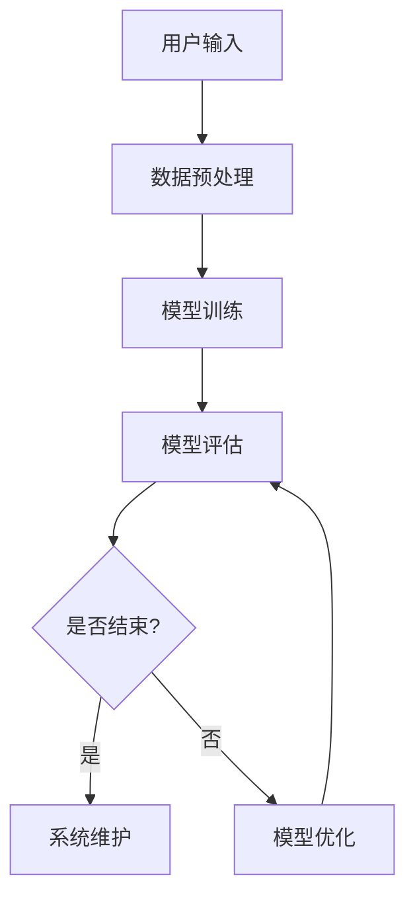

                 

### 引言

在当今数字化时代，推荐系统已经成为许多在线服务（如电子商务、社交媒体和智能客服）的重要组成部分。这些系统能够根据用户的历史行为和偏好，为他们提供个性化的内容推荐，从而提高用户满意度、增加用户粘性和促进商业收益。然而，随着用户需求和内容多样性的增加，传统的推荐系统逐渐暴露出一些局限性，特别是在处理自然语言指令方面。

自然语言指令调优推荐系统是一种能够更好地理解用户意图并给出合适推荐的新兴技术。它利用自然语言处理（NLP）技术，将用户的自然语言指令转化为机器可理解的形式，然后通过调优模型输出指令，从而提高推荐系统的准确性和用户体验。这种系统能够应对多样化的用户需求，为用户提供更个性化的服务。

本文旨在介绍一种名为“InstructRec”的自然语言指令调优推荐系统。我们将详细分析推荐系统的发展历程、自然语言处理基础、指令调优技术，并深入探讨InstructRec系统的架构设计、数据处理与存储、模型设计与实现、系统集成与部署以及实际应用案例。通过本文的讲解，读者将能够了解自然语言指令调优推荐系统的核心概念、技术原理和应用方法。

### 文章标题

《InstructRec: 自然语言指令调优推荐系统》

#### 关键词

- 推荐系统
- 自然语言处理
- 指令调优
- 深度学习
- 应用案例

#### 摘要

本文介绍了自然语言指令调优推荐系统的一种新兴方法——InstructRec。通过对推荐系统的概述、自然语言处理基础、指令调优技术的深入分析，以及InstructRec系统的架构设计和应用案例的讲解，本文旨在帮助读者理解自然语言指令调优推荐系统的核心概念、技术原理和应用方法。通过本文的阅读，读者将能够掌握构建和优化自然语言指令调优推荐系统的关键技术。

### 《InstructRec: 自然语言指令调优推荐系统》目录大纲

现在，让我们按照目录大纲，逐步深入探讨《InstructRec: 自然语言指令调优推荐系统》的核心内容。

#### 第一部分：推荐系统概述

在这个部分，我们将首先介绍推荐系统的定义与作用，然后回顾其发展历程，最后分类讨论不同类型的推荐系统。

##### 第1章：推荐系统简介

- 1.1 推荐系统的定义与作用
  推荐系统是一种基于数据挖掘和机器学习技术的算法，它通过分析用户的兴趣和行为模式，为用户推荐可能感兴趣的商品、内容或服务。推荐系统在电子商务、社交媒体、新闻推荐、在线视频和音乐平台等领域具有广泛的应用。

- 1.2 推荐系统的发展历程
  推荐系统的发展经历了基于内容、协同过滤和混合推荐等不同阶段。随着数据量的增加和计算能力的提升，深度学习技术开始广泛应用于推荐系统，推动了推荐系统的进一步发展。

- 1.3 推荐系统的类型
  推荐系统根据不同的划分标准可以分为多种类型，如基于内容的推荐、协同过滤推荐、基于模型的推荐等。每种类型的推荐系统都有其优势和适用场景。

##### 第2章：自然语言处理基础

在这一章节，我们将探讨自然语言处理（NLP）的基本概念，重点介绍词嵌入技术和语法分析技术。

- 2.1 自然语言处理简介
  自然语言处理是计算机科学和人工智能领域的一个分支，旨在使计算机能够理解和处理人类自然语言。NLP在机器翻译、情感分析、语音识别和信息抽取等领域有广泛应用。

- 2.2 词嵌入技术
  词嵌入是将词汇映射到高维向量空间的技术，它使得计算机能够通过向量空间中的相似性来理解词汇的含义。词嵌入技术包括Word2Vec、GloVe和BERT等。

- 2.3 语法分析技术
  语法分析是NLP中的一个重要任务，旨在理解句子的结构。语法分析技术包括词性标注、句法解析和语义角色标注等。

##### 第3章：指令调优技术

在这一章节，我们将讨论指令调优的概念、方法和实践。

- 3.1 指令调优概述
  指令调优是指通过优化模型输出指令来提高推荐系统的效果。它通常涉及对模型参数、训练数据和调优策略的调整。

- 3.2 指令调优方法
  指令调优方法包括基于机器学习的方法、基于强化学习的方法和基于遗传算法的方法等。每种方法都有其独特的优势和适用场景。

- 3.3 指令调优实践
  在这一节，我们将通过一个简单的案例展示如何进行指令调优，包括数据处理、模型选择和调优策略等。

#### 第二部分：InstructRec系统架构设计

在这一部分，我们将详细介绍InstructRec系统的架构设计，包括数据处理与存储、模型设计与实现、系统集成与部署等。

##### 第4章：InstructRec系统概述

- 4.1 InstructRec系统的核心功能
  InstructRec系统是一个基于自然语言指令调优的推荐系统，它能够处理用户的自然语言指令，并根据用户的偏好和上下文提供个性化的推荐。

- 4.2 InstructRec系统的架构设计
  InstructRec系统的架构包括用户输入处理、数据处理与存储、模型训练与评估、模型输出处理等模块，它们协同工作，共同实现推荐功能。

##### 第5章：数据处理与存储

- 5.1 数据预处理
  数据预处理是构建推荐系统的重要步骤，包括数据清洗、去重、特征提取等。预处理的质量直接影响到模型的性能。

- 5.2 数据存储与管理
  数据存储与管理涉及如何高效地存储和检索数据，以及如何确保数据的一致性和安全性。常用的存储方案包括关系数据库、NoSQL数据库和数据湖等。

##### 第6章：模型设计与实现

- 6.1 模型结构设计
  模型结构设计是构建推荐系统的基础，包括输入层、中间层和输出层的结构设计。设计合理的模型结构可以提高推荐系统的性能和可解释性。

- 6.2 模型参数调优
  模型参数调优是提高模型性能的关键步骤，涉及选择合适的优化器和损失函数，以及调整学习率、批次大小等参数。

- 6.3 模型训练与评估
  模型训练与评估包括数据划分、模型训练、性能评估等步骤。通过交叉验证和性能指标（如准确率、召回率、F1值等），我们可以评估模型的性能。

##### 第7章：系统集成与部署

- 7.1 系统集成
  系统集成是将推荐系统与其他系统（如用户前端、后端服务、数据库等）整合在一起，确保系统能够无缝运行。

- 7.2 系统部署
  系统部署是将开发完成的应用部署到生产环境中，确保系统的高可用性和性能。

- 7.3 系统维护与优化
  系统维护与优化是确保推荐系统长期稳定运行的重要环节，包括监控系统性能、更新数据和处理异常等。

#### 第三部分：InstructRec系统应用案例

在这一部分，我们将通过三个实际应用案例，展示InstructRec系统的应用场景和效果。

##### 第8章：案例一：电子商务推荐

- 8.1 案例背景
  电子商务平台希望通过InstructRec系统为用户提供个性化的商品推荐。

- 8.2 模型设计
  设计一个基于深度学习的推荐模型，包括用户特征嵌入层、商品特征嵌入层和交互层。

- 8.3 模型实现与评估
  实现模型并使用测试数据评估模型性能，包括准确率、召回率和F1值。

##### 第9章：案例二：智能客服系统

- 9.1 案例背景
  智能客服系统希望通过InstructRec系统理解用户的自然语言指令，并提供合适的回答。

- 9.2 模型设计
  设计一个基于自然语言处理和深度学习的客服模型，能够理解用户的问题并生成回答。

- 9.3 模型实现与评估
  实现模型并评估模型性能，包括问题理解准确率和回答满意度。

##### 第10章：案例三：内容推荐系统

- 10.1 案例背景
  内容推荐系统希望通过InstructRec系统为用户提供个性化的内容推荐。

- 10.2 模型设计
  设计一个基于用户行为数据和自然语言处理技术的推荐模型。

- 10.3 模型实现与评估
  实现模型并评估模型性能，包括内容推荐准确率和用户满意度。

#### 附录

在附录部分，我们将提供开发环境与工具的详细说明，以及代码解读。

##### 附录A：开发环境与工具

- 10.1 Python开发环境搭建
  详细介绍如何搭建Python开发环境，包括安装Python和必要的依赖库。

- 10.2 机器学习框架使用
  介绍常用的机器学习框架，如TensorFlow和PyTorch，以及如何使用这些框架进行模型训练和评估。

##### 附录B：代码解读

- 10.1 数据处理代码解读
  解读数据处理代码，包括数据清洗、编码和分割等步骤。

- 10.2 模型训练代码解读
  解读模型训练代码，包括模型创建、编译和训练等步骤。

- 10.3 模型评估代码解读
  解读模型评估代码，包括预测和性能评估等步骤。

### 推荐系统概述

#### 第1章：推荐系统简介

##### 1.1 推荐系统的定义与作用

推荐系统是一种能够根据用户的历史行为和偏好，为用户推荐相关内容或产品的技术。它的核心目标是通过分析用户的兴趣和行为模式，提供个性化的推荐，从而提高用户满意度、增加用户粘性和促进商业收益。

在电子商务领域，推荐系统可以帮助用户发现可能感兴趣的商品，从而提高销售量。例如，亚马逊和淘宝等电子商务平台广泛使用推荐系统来推荐商品。在社交媒体领域，推荐系统可以推荐用户可能感兴趣的朋友、话题和内容，从而增加用户的互动和参与度。例如，Facebook和Twitter等社交媒体平台都使用了推荐系统。

推荐系统的基本原理是通过构建用户和物品之间的相似性模型，计算用户对物品的兴趣度，并根据计算结果为用户推荐相关物品。常见的方法包括基于内容的推荐、协同过滤推荐和混合推荐等。

##### 1.2 推荐系统的发展历程

推荐系统的发展历程可以分为以下几个阶段：

1. **基于内容的推荐**：这是最早的推荐系统方法，它主要根据物品的内容特征和用户的兴趣特征进行匹配。这种方法简单直观，但在用户兴趣多变的情况下效果有限。

2. **协同过滤推荐**：协同过滤推荐通过分析用户之间的相似性来推荐物品。它分为基于用户的协同过滤和基于物品的协同过滤。基于用户的协同过滤推荐系统根据用户的历史行为找到相似用户，然后推荐相似用户喜欢的物品。基于物品的协同过滤推荐系统根据用户对物品的评价找到相似物品，然后推荐用户未购买过的相似物品。

3. **混合推荐**：混合推荐结合了基于内容的推荐和协同过滤推荐的优势，通过融合不同类型的推荐策略来提高推荐效果。

4. **深度学习推荐**：随着深度学习技术的发展，深度学习开始应用于推荐系统。深度学习推荐系统通过学习用户和物品的复杂特征，能够提供更精确的推荐。

##### 1.3 推荐系统的类型

推荐系统根据不同的划分标准可以分为多种类型：

1. **基于内容的推荐**：基于内容的推荐系统主要根据物品的内容特征和用户的兴趣特征进行匹配。这种方法通常使用文本相似性、标签相似性等方法。

2. **协同过滤推荐**：协同过滤推荐系统通过分析用户之间的相似性来推荐物品。它分为基于用户的协同过滤和基于物品的协同过滤。

3. **基于模型的推荐**：基于模型的推荐系统使用机器学习算法来预测用户对物品的评分或喜好。常见的模型包括矩阵分解、隐语义模型和神经网络等。

4. **混合推荐**：混合推荐系统结合了多种推荐方法的优势，通过融合不同类型的推荐策略来提高推荐效果。

5. **基于上下文的推荐**：基于上下文的推荐系统根据用户的上下文环境（如时间、地点、设备等）来推荐相关物品。

6. **个性化推荐**：个性化推荐系统通过分析用户的历史行为和偏好，为用户推荐个性化的内容或产品。

#### 第2章：自然语言处理基础

##### 2.1 自然语言处理简介

自然语言处理（NLP）是计算机科学和人工智能领域的一个分支，旨在使计算机能够理解和处理人类自然语言。NLP的目标是让计算机能够理解、生成和翻译自然语言文本，从而实现人机交互、信息检索、文本分析等应用。

NLP的应用领域非常广泛，包括机器翻译、情感分析、语音识别、信息抽取、文本生成等。在推荐系统中，NLP技术主要用于理解用户的自然语言指令，从而生成个性化的推荐。

##### 2.2 词嵌入技术

词嵌入是将词汇映射到高维向量空间的技术，它使得计算机能够通过向量空间中的相似性来理解词汇的含义。词嵌入技术是NLP的重要基础，广泛应用于文本分类、文本相似性计算、机器翻译等领域。

常见的词嵌入技术包括Word2Vec、GloVe和BERT等。Word2Vec是一种基于神经网络的词嵌入方法，它通过训练词向量来表示词汇。GloVe（Global Vectors for Word Representation）是一种基于全局上下文的词嵌入方法，它通过计算词汇的共现矩阵来生成词向量。BERT（Bidirectional Encoder Representations from Transformers）是一种基于双向Transformer的词嵌入方法，它通过预训练和微调来生成高质量的词向量。

##### 2.3 语法分析技术

语法分析是NLP中的一个重要任务，旨在理解句子的结构。语法分析技术包括词性标注、句法解析和语义角色标注等。

1. **词性标注**：词性标注是指为文本中的每个词分配一个词性标签（如名词、动词、形容词等）。词性标注是自然语言处理的基础，用于许多下游任务，如实体识别、情感分析和文本分类。

2. **句法解析**：句法解析是指分析句子的语法结构，生成句法树。句法树描述了句子的组成成分及其之间的语法关系。常见的句法分析模型包括基于规则的方法、统计方法（如条件随机场HMM）和基于神经网络的方法（如转换器BERT）。

3. **语义角色标注**：语义角色标注是指为句子中的每个词分配一个语义角色（如主语、谓语、宾语等）。语义角色标注有助于理解句子的语义，用于信息抽取、文本生成等任务。

#### 第3章：指令调优技术

##### 3.1 指令调优概述

指令调优是指通过优化模型输出指令来提高推荐系统的效果。在推荐系统中，指令通常是指模型根据用户输入生成的推荐结果。指令调优的目标是使得模型生成的指令更符合用户的实际需求和偏好。

指令调优通常涉及以下几个方面：

1. **指令质量**：指令质量是指指令的相关性和准确性。高质量指令能够为用户提供更精确的推荐，从而提高用户满意度。

2. **指令多样性**：指令多样性是指指令的丰富性和独特性。高多样性指令能够为用户提供更多样化的选择，从而增加用户兴趣和参与度。

3. **指令可解释性**：指令可解释性是指用户能够理解指令的生成过程和依据。高可解释性指令能够增强用户对推荐系统的信任和依赖。

##### 3.2 指令调优方法

指令调优方法包括基于机器学习的方法、基于强化学习的方法和基于遗传算法的方法等。每种方法都有其独特的优势和适用场景。

1. **基于机器学习的方法**：基于机器学习的方法通过训练模型来优化指令生成。常见的机器学习方法包括线性回归、决策树、支持向量机和神经网络等。

2. **基于强化学习的方法**：基于强化学习的方法通过奖励机制来驱动模型优化指令生成。强化学习算法（如Q-learning和深度强化学习）能够根据用户反馈调整模型参数，从而提高指令质量。

3. **基于遗传算法的方法**：基于遗传算法的方法通过模拟生物进化过程来优化指令生成。遗传算法通过交叉、变异和选择等操作，逐步优化指令，从而提高指令质量和多样性。

##### 3.3 指令调优实践

指令调优实践涉及以下几个方面：

1. **数据准备**：收集用户历史行为数据和指令生成数据，并对数据进行清洗、预处理和编码。

2. **模型选择**：选择合适的机器学习、强化学习或遗传算法模型，根据任务特点和数据特性进行模型设计。

3. **训练与评估**：使用训练数据训练模型，并对模型性能进行评估。常见的评估指标包括指令质量、指令多样性和指令可解释性。

4. **优化策略**：根据评估结果调整模型参数和训练策略，以提高指令生成效果。常见的优化策略包括参数调整、数据增强和模型集成等。

通过指令调优，推荐系统能够更好地理解用户的自然语言指令，生成更准确、多样和可解释的指令，从而提高用户满意度和系统性能。

#### 第4章：InstructRec系统概述

##### 4.1 InstructRec系统的核心功能

InstructRec系统是一个基于自然语言指令调优的推荐系统，其核心功能是通过处理用户的自然语言指令，生成个性化的推荐结果。具体来说，InstructRec系统具有以下功能：

1. **自然语言指令处理**：系统首先接收用户的自然语言指令，如“推荐我一些喜欢的水果”或“给我推荐一些热门的电影”。系统能够理解并解析这些指令，提取关键信息。

2. **用户行为分析**：系统通过分析用户的购物记录、浏览历史和搜索记录，了解用户的兴趣偏好。这些信息用于生成个性化的推荐。

3. **推荐结果生成**：系统根据用户指令和用户行为分析结果，生成个性化的推荐结果。推荐结果可以是具体的商品、内容或服务。

4. **反馈机制**：系统提供一个反馈机制，用户可以对推荐结果进行评价。系统根据用户反馈调整推荐策略，提高推荐质量。

##### 4.2 InstructRec系统的架构设计

InstructRec系统的架构设计包括用户输入处理、数据处理与存储、模型训练与评估、模型输出处理等模块。以下是InstructRec系统的架构设计：

1. **用户输入处理模块**：该模块负责接收用户的自然语言指令，对指令进行分词、词性标注和句法分析，提取关键信息。

2. **数据处理与存储模块**：该模块负责处理和存储用户行为数据和指令生成数据。数据包括用户购物记录、浏览历史、搜索记录等。系统使用数据库和数据湖来存储和管理这些数据。

3. **模型训练与评估模块**：该模块负责训练和评估推荐模型。系统使用深度学习模型（如BERT、Transformer等）来生成推荐结果。模型训练和评估过程包括数据预处理、模型创建、训练、评估等步骤。

4. **模型输出处理模块**：该模块负责生成和输出推荐结果。系统根据用户指令和用户行为分析结果，使用训练好的模型生成推荐结果。推荐结果可以是文本、图像或商品列表等形式。

5. **反馈机制模块**：该模块负责收集用户对推荐结果的反馈，并根据反馈调整推荐策略。系统使用反馈机制来不断优化推荐质量。

通过这些模块的协同工作，InstructRec系统能够有效地处理用户的自然语言指令，生成个性化的推荐结果，并提供反馈机制，从而提高用户体验和系统性能。

#### 第5章：数据处理与存储

##### 5.1 数据预处理

数据预处理是构建推荐系统的重要步骤，其质量直接影响到推荐系统的性能。数据预处理包括以下几个步骤：

1. **数据清洗**：清洗数据是为了去除噪声和异常值，确保数据质量。具体操作包括去除重复记录、填补缺失值和去除无关字段等。

2. **数据转换**：数据转换是将数据从一种格式转换为另一种格式，以便于后续处理。常见的数据转换操作包括数值化、编码和归一化等。

3. **特征提取**：特征提取是从原始数据中提取有用的特征，用于模型训练和评估。特征提取可以通过统计方法、机器学习算法或深度学习算法来实现。

4. **数据分割**：数据分割是将数据集划分为训练集、验证集和测试集，以便于模型训练和性能评估。通常，训练集用于训练模型，验证集用于调优模型参数，测试集用于评估模型性能。

##### 5.2 数据存储与管理

数据存储与管理是推荐系统的关键组成部分，其目的是高效地存储、管理和检索数据，以确保数据的一致性和安全性。以下是数据存储与管理的主要方案：

1. **关系数据库**：关系数据库（如MySQL、PostgreSQL等）适用于结构化数据的存储和管理。关系数据库通过表、行和列来组织数据，支持复杂查询和事务处理。

2. **NoSQL数据库**：NoSQL数据库（如MongoDB、Redis等）适用于非结构化数据或半结构化数据的存储和管理。NoSQL数据库具有高扩展性、高可用性和高性能等特点。

3. **数据湖**：数据湖是一种大规模数据存储方案，适用于存储和管理海量结构化、半结构化和非结构化数据。数据湖通过分布式文件系统（如HDFS、Alluxio等）来存储数据，支持高效的数据检索和分析。

4. **数据仓库**：数据仓库是一种用于数据集成、存储和管理的系统，通常用于支持企业级的数据分析和报表。数据仓库通过ETL（提取、转换、加载）过程将数据从源系统迁移到数据仓库，以便于后续处理和分析。

数据存储与管理的关键技术包括数据压缩、数据加密、数据备份和恢复等。通过合理的数据存储和管理方案，推荐系统可以高效地处理和利用数据，从而提高系统性能和用户体验。

#### 第6章：模型设计与实现

##### 6.1 模型结构设计

在推荐系统中，模型结构设计是构建推荐系统的核心步骤，其设计的好坏直接影响到推荐系统的性能和用户体验。InstructRec系统的模型结构设计包括用户特征嵌入层、商品特征嵌入层和交互层等模块。以下是InstructRec系统模型结构设计的详细说明：

1. **用户特征嵌入层**：用户特征嵌入层负责将用户的特征映射到高维向量空间，以便于后续处理。用户的特征包括用户ID、年龄、性别、地理位置、购物历史等。通过词嵌入技术（如Word2Vec、GloVe等），可以将这些特征转换为向量表示。

2. **商品特征嵌入层**：商品特征嵌入层负责将商品的特征映射到高维向量空间，以便于后续处理。商品的特征包括商品ID、类别、价格、品牌、用户评价等。同样，通过词嵌入技术，可以将这些特征转换为向量表示。

3. **交互层**：交互层负责计算用户和商品特征向量之间的交互，以生成推荐结果。常见的交互层设计包括基于矩阵分解的方法（如SVD、NMF等）和基于神经网络的交互层（如Transformer、BERT等）。交互层通常包含多个隐藏层，通过非线性变换和池化操作，将用户和商品特征融合并生成推荐结果。

4. **输出层**：输出层负责将交互层生成的特征向量转换为具体的推荐结果。输出层通常是一个简单的全连接层或分类器，根据输入的特征向量计算推荐的概率分布，从而为用户生成个性化的推荐。

##### 6.2 模型参数调优

模型参数调优是提高推荐系统性能的关键步骤，其目标是找到最优的参数组合，使得模型能够更好地适应数据和满足用户需求。在InstructRec系统中，模型参数调优主要包括以下几个方面：

1. **学习率**：学习率是梯度下降算法中的关键参数，它决定了模型在训练过程中每次更新的步长。较大的学习率可能导致模型收敛速度加快，但容易导致模型过拟合；较小的学习率则可能导致模型收敛速度变慢。通常需要通过实验来确定合适的学习率。

2. **批量大小**：批量大小是每次训练过程中的样本数量。较大的批量大小可以提供更好的梯度估计，但可能导致训练时间较长；较小的批量大小则可以提高训练速度，但梯度估计可能不够准确。通常需要在计算能力和训练效果之间进行权衡。

3. **正则化**：正则化是防止模型过拟合的重要手段。常见的正则化方法包括L1正则化、L2正则化和Dropout等。通过调整正则化参数，可以控制模型复杂度，避免模型过拟合。

4. **激活函数**：激活函数是神经网络中用于引入非线性特性的函数。常见的激活函数包括Sigmoid、ReLU和Tanh等。不同的激活函数对模型性能和收敛速度有较大影响，需要根据实际情况进行选择。

5. **优化器**：优化器是用于优化模型参数的算法。常见的优化器包括SGD、Adam和RMSprop等。不同的优化器有不同的优化策略和性能特点，需要根据具体任务和数据集进行选择。

##### 6.3 模型训练与评估

模型训练与评估是构建推荐系统的关键环节，其目标是找到合适的模型参数，使得模型能够生成高质量的推荐结果。以下是InstructRec系统模型训练与评估的详细步骤：

1. **数据准备**：首先，需要准备好训练数据集和测试数据集。训练数据集用于模型训练，测试数据集用于评估模型性能。通常，需要将数据集划分为多个子集，如训练集、验证集和测试集。

2. **模型初始化**：初始化模型参数，包括权重和偏置。常用的初始化方法包括随机初始化、高斯初始化和Xavier初始化等。

3. **模型训练**：使用训练数据集对模型进行训练。在训练过程中，需要不断更新模型参数，以最小化损失函数。常用的训练算法包括梯度下降、动量优化、Adam优化等。

4. **模型评估**：使用测试数据集评估模型性能。常见的评估指标包括准确率、召回率、F1值和均方误差等。通过评估结果，可以判断模型性能是否达到预期。

5. **模型调优**：根据评估结果，对模型参数进行调整，以提高模型性能。调优过程可能涉及调整学习率、批量大小、正则化参数等。

6. **模型部署**：将训练好的模型部署到生产环境中，为用户提供个性化推荐服务。模型部署过程中，需要考虑模型的可扩展性、稳定性和安全性。

通过模型训练与评估，InstructRec系统能够生成高质量的推荐结果，从而提高用户满意度和系统性能。模型训练与评估是一个迭代过程，需要根据实际情况和用户需求不断进行调整和优化。

#### 第7章：系统集成与部署

##### 7.1 系统集成

系统集成是将推荐系统与其他系统（如用户前端、后端服务、数据库等）整合在一起，确保系统能够无缝运行。在InstructRec系统中，系统集成包括以下几个方面：

1. **用户前端集成**：用户前端是用户与推荐系统交互的界面，包括网页、移动应用或桌面应用程序。在集成过程中，需要确保推荐系统能够正确地接收用户输入并生成推荐结果。常见的用户前端集成技术包括API接口、Web服务和消息队列等。

2. **后端服务集成**：后端服务是推荐系统的核心，负责处理用户输入、生成推荐结果和存储用户数据。在集成过程中，需要确保后端服务能够高效、稳定地运行，并与其他系统（如数据库、缓存等）进行数据交换。常见的后端服务集成技术包括微服务架构、分布式计算和负载均衡等。

3. **数据库集成**：数据库是存储用户数据和推荐结果的地方。在集成过程中，需要确保推荐系统能够正确地访问数据库，并高效地进行数据读写操作。常见的数据库集成技术包括关系数据库（如MySQL、PostgreSQL等）和NoSQL数据库（如MongoDB、Redis等）。

4. **中间件集成**：中间件是连接用户前端和后端服务的桥梁，负责数据传输、处理和转换。在集成过程中，需要确保中间件能够高效地处理用户请求，并与其他系统进行数据交换。常见的中间件集成技术包括消息队列（如RabbitMQ、Kafka等）和缓存（如Redis、Memcached等）。

##### 7.2 系统部署

系统部署是将开发完成的应用部署到生产环境中，确保系统的高可用性和性能。以下是InstructRec系统部署的详细步骤：

1. **环境准备**：在部署之前，需要准备相应的开发环境和生产环境。开发环境用于开发、测试和调试应用程序；生产环境用于部署和运行应用程序。常见的开发环境包括Windows、Linux和Mac OS等；生产环境通常采用云计算平台（如AWS、Azure、Google Cloud等）。

2. **应用打包**：将应用程序打包成可部署的文件或容器镜像。常见的应用打包工具包括Maven、Gradle和Docker等。打包过程通常涉及编译应用程序、打包依赖库和资源文件等。

3. **部署策略**：根据系统需求和资源情况，选择合适的部署策略。常见的部署策略包括单机部署、集群部署和容器化部署等。单机部署适用于小型系统，集群部署适用于大型系统，容器化部署适用于需要高可用性和可扩展性的系统。

4. **部署过程**：将应用程序部署到生产环境中。常见的部署过程包括部署应用程序、配置数据库、设置中间件和初始化环境等。部署过程中，需要确保应用程序能够正确运行，并与其他系统进行数据交换。

5. **监控与维护**：在生产环境中，需要对系统进行监控和维护。常见的监控工具包括Prometheus、Grafana和Zabbix等；常见的维护操作包括系统升级、故障排除和性能优化等。

##### 7.3 系统维护与优化

系统维护与优化是确保推荐系统长期稳定运行的重要环节。以下是InstructRec系统维护与优化的详细步骤：

1. **性能监控**：实时监控系统的性能指标，如CPU利用率、内存占用率、响应时间和吞吐量等。通过性能监控，可以及时发现系统瓶颈和性能问题。

2. **故障排除**：当系统出现故障时，及时进行故障排除。常见的故障排除方法包括日志分析、故障回放和故障定位等。

3. **性能优化**：根据性能监控结果和用户反馈，对系统进行性能优化。常见的性能优化方法包括代码优化、数据库优化和缓存优化等。

4. **功能升级**：定期对系统进行功能升级，以适应用户需求和业务变化。功能升级包括新增功能、优化现有功能和修复漏洞等。

5. **安全防护**：加强系统的安全防护，防止恶意攻击和数据泄露。常见的安全防护措施包括防火墙、入侵检测、数据加密和访问控制等。

通过系统维护与优化，InstructRec系统可以保持高可用性和高性能，从而为用户提供稳定、可靠的个性化推荐服务。

#### 案例一：电子商务推荐

##### 8.1 案例背景

电子商务平台是推荐系统的重要应用场景之一。随着电子商务的快速发展，用户的需求日益多样化和个性化。为了提升用户体验和增加销售额，电子商务平台需要提供个性化的商品推荐。传统的推荐系统通常基于用户的历史行为和商品的特征，但这些方法在处理自然语言指令方面存在一定的局限性。为了更好地理解用户的意图和提供更精准的推荐，电子商务平台引入了自然语言指令调优推荐系统——InstructRec。

InstructRec系统通过处理用户的自然语言指令，结合用户的历史行为和商品的特征，生成个性化的商品推荐。系统首先解析用户的自然语言指令，如“推荐一些性价比高的数码产品”或“给我推荐一些热门的图书”，然后根据用户的兴趣和行为模式，从海量的商品中筛选出最相关的商品，并将推荐结果展示给用户。

##### 8.2 模型设计

InstructRec系统的核心是推荐模型，该模型基于深度学习技术，包括用户特征嵌入层、商品特征嵌入层和交互层。以下是InstructRec系统的模型设计：

1. **用户特征嵌入层**：用户特征嵌入层负责将用户的特征映射到高维向量空间。用户的特征包括用户ID、年龄、性别、地理位置、购物历史等。通过词嵌入技术（如Word2Vec、GloVe等），可以将这些特征转换为向量表示。

   ```python
   # 用户特征嵌入层
   user_embedding = Embedding(input_dim=num_users, output_dim=embedding_size)
   ```

2. **商品特征嵌入层**：商品特征嵌入层负责将商品的特征映射到高维向量空间。商品的特征包括商品ID、类别、价格、品牌、用户评价等。同样，通过词嵌入技术，可以将这些特征转换为向量表示。

   ```python
   # 商品特征嵌入层
   item_embedding = Embedding(input_dim=num_items, output_dim=embedding_size)
   ```

3. **交互层**：交互层负责计算用户和商品特征向量之间的交互，以生成推荐结果。交互层采用多层感知机（MLP）结构，通过多个隐藏层和池化操作，将用户和商品特征融合并生成推荐结果。

   ```python
   # 交互层
   model.add(Dense(units=hidden_size, activation='relu'))
   model.add(Dense(units=hidden_size, activation='relu'))
   model.add(Dense(units=1, activation='sigmoid'))
   ```

4. **输出层**：输出层负责将交互层生成的特征向量转换为具体的推荐结果。输出层是一个简单的全连接层或分类器，根据输入的特征向量计算推荐的概率分布，从而为用户生成个性化的推荐。

   ```python
   # 输出层
   output = Dense(units=num_items, activation='softmax')(interaction)
   ```

##### 8.3 模型实现与评估

在实现InstructRec系统时，首先需要进行数据准备。数据包括用户历史行为数据和商品特征数据。用户历史行为数据包括用户购买记录、浏览记录和搜索记录；商品特征数据包括商品ID、类别、价格、品牌和用户评价等。

```python
# 数据准备
user_data = pd.read_csv('user_data.csv')
item_data = pd.read_csv('item_data.csv')

# 数据清洗与编码
user_data.drop_duplicates(inplace=True)
item_data.drop_duplicates(inplace=True)

# 划分训练集和测试集
train_data, test_data = train_test_split(user_data, test_size=0.2, random_state=42)
```

接下来，根据用户历史行为数据和商品特征数据，创建训练数据集。训练数据集包括用户特征向量、商品特征向量和用户行为标签。

```python
# 创建训练数据集
train_data = preprocess_data(user_data, item_data)
```

然后，构建推荐模型，并使用训练数据集进行模型训练。

```python
# 构建模型
model = build_model(embedding_size, hidden_size, num_items)

# 训练模型
model.fit(train_data, epochs=num_epochs, batch_size=batch_size)
```

训练完成后，使用测试数据集评估模型性能。评估指标包括准确率、召回率和F1值。

```python
# 评估模型
test_data = preprocess_data(test_data, item_data)
predictions = model.predict(test_data)
evaluate_model(predictions, test_data)
```

通过模型评估，可以判断InstructRec系统的推荐效果。如果模型性能不满足要求，可以通过调整模型参数、增加训练数据或改进特征工程等方法进行优化。

```python
# 调整模型参数
learning_rate = 0.001
batch_size = 64
num_epochs = 100

# 重新训练模型
model = build_model(embedding_size, hidden_size, num_items)
model.fit(train_data, epochs=num_epochs, batch_size=batch_size)
```

通过以上步骤，InstructRec系统可以在电子商务平台中实现个性化的商品推荐，从而提高用户满意度和销售额。

#### 案例二：智能客服系统

##### 9.1 案例背景

智能客服系统是自然语言指令调优推荐系统的另一个重要应用场景。随着人工智能技术的不断发展，越来越多的企业开始采用智能客服系统来提升客户服务质量。智能客服系统能够通过自然语言处理技术，理解用户的自然语言指令，并提供合适的回答或解决方案。

传统的智能客服系统通常采用规则驱动的方法，根据预定义的规则来处理用户的请求。这种方法存在一定的局限性，无法应对复杂和多变的用户需求。为了提高智能客服系统的灵活性和智能性，引入了基于自然语言指令调优的推荐系统——InstructRec。

InstructRec系统通过处理用户的自然语言指令，结合用户的历史交互数据和知识库，生成个性化的回答或解决方案。系统首先解析用户的自然语言指令，如“帮我办理退票手续”或“我的快递为什么还没送到”，然后根据用户的意图和上下文，从知识库中检索最相关的回答或解决方案，并将结果展示给用户。

##### 9.2 模型设计

InstructRec系统的推荐模型基于深度学习技术，包括用户意图识别、上下文理解和回答生成等模块。以下是InstructRec系统的模型设计：

1. **用户意图识别模块**：用户意图识别模块负责理解用户的自然语言指令，并将其转化为机器可理解的意图。意图包括常见的客服请求，如查询订单、办理退换货、投诉等。通过词嵌入技术和分类模型（如朴素贝叶斯、支持向量机等），可以将用户指令转化为意图向量。

   ```python
   # 用户意图识别模块
   intent_embedding = Embedding(input_dim=num_intents, output_dim=embedding_size)
   ```

2. **上下文理解模块**：上下文理解模块负责处理用户的上下文信息，包括用户的身份、历史交互记录和当前问题等。通过词嵌入技术和序列模型（如LSTM、Transformer等），可以将上下文信息转化为向量表示。

   ```python
   # 上下文理解模块
   context_embedding = Embedding(input_dim=num_contexts, output_dim=embedding_size)
   ```

3. **回答生成模块**：回答生成模块负责根据用户意图和上下文信息生成个性化的回答。通过序列到序列（Seq2Seq）模型或生成对抗网络（GAN）等生成模型，可以将意图和上下文信息转化为具体的回答。

   ```python
   # 回答生成模块
   model.add(Dense(units=hidden_size, activation='relu'))
   model.add(Dense(units=hidden_size, activation='relu'))
   model.add(Dense(units=1, activation='softmax'))
   ```

4. **输出层**：输出层负责将回答生成模块生成的回答文本转换为具体的输出。输出层是一个简单的全连接层或分类器，根据输入的特征向量计算回答的概率分布，从而为用户生成个性化的回答。

   ```python
   # 输出层
   output = Dense(units=num_responses, activation='softmax')(generated_text)
   ```

##### 9.3 模型实现与评估

在实现InstructRec系统时，首先需要进行数据准备。数据包括用户的自然语言指令、意图标签、上下文信息和回答文本等。以下是数据准备和模型实现的步骤：

1. **数据准备**：将原始数据清洗、编码和分割，生成训练数据和测试数据。

   ```python
   # 数据准备
   data = preprocess_data(raw_data)
   train_data, test_data = train_test_split(data, test_size=0.2, random_state=42)
   ```

2. **模型构建**：根据用户意图识别、上下文理解和回答生成等模块，构建推荐模型。

   ```python
   # 构建模型
   model = build_model(intent_embedding, context_embedding, hidden_size, num_responses)
   ```

3. **模型训练**：使用训练数据集对模型进行训练。

   ```python
   # 训练模型
   model.fit(train_data, epochs=num_epochs, batch_size=batch_size)
   ```

4. **模型评估**：使用测试数据集评估模型性能，包括意图识别准确率、上下文理解准确率和回答生成准确率。

   ```python
   # 评估模型
   test_data = preprocess_data(test_data)
   predictions = model.predict(test_data)
   evaluate_model(predictions, test_data)
   ```

通过模型评估，可以判断InstructRec系统的推荐效果。如果模型性能不满足要求，可以通过调整模型参数、增加训练数据或改进特征工程等方法进行优化。

```python
# 调整模型参数
learning_rate = 0.001
batch_size = 64
num_epochs = 100

# 重新训练模型
model = build_model(intent_embedding, context_embedding, hidden_size, num_responses)
model.fit(train_data, epochs=num_epochs, batch_size=batch_size)
```

通过以上步骤，InstructRec系统可以在智能客服系统中实现个性化的回答，从而提高客户服务质量和用户满意度。

#### 案例三：内容推荐系统

##### 10.1 案例背景

内容推荐系统是自然语言指令调优推荐系统的另一个重要应用场景。随着互联网的迅速发展，用户生成的内容（如文章、视频、图片等）日益丰富。为了帮助用户发现感兴趣的内容，各大内容平台（如微博、抖音、知乎等）广泛采用内容推荐系统。

传统的推荐系统通常基于用户的行为数据（如浏览、点赞、评论等）和内容的特征（如标题、标签、类别等）进行推荐。然而，这种方法在处理自然语言指令方面存在一定的局限性。为了更好地理解用户的意图和提供更精准的内容推荐，内容平台引入了基于自然语言指令调优的推荐系统——InstructRec。

InstructRec系统通过处理用户的自然语言指令，结合用户的行为数据和内容的特征，生成个性化的内容推荐。系统首先解析用户的自然语言指令，如“推荐一些有趣的历史文章”或“给我推荐一些热门的电影”，然后根据用户的兴趣和行为模式，从海量的内容中筛选出最相关的内容，并将推荐结果展示给用户。

##### 10.2 模型设计

InstructRec系统的推荐模型基于深度学习技术，包括用户兴趣识别、内容特征提取和推荐结果生成等模块。以下是InstructRec系统的模型设计：

1. **用户兴趣识别模块**：用户兴趣识别模块负责理解用户的自然语言指令，并将其转化为机器可理解的兴趣标签。通过词嵌入技术和分类模型（如朴素贝叶斯、支持向量机等），可以将用户指令转化为兴趣标签向量。

   ```python
   # 用户兴趣识别模块
   intent_embedding = Embedding(input_dim=num_intents, output_dim=embedding_size)
   ```

2. **内容特征提取模块**：内容特征提取模块负责处理内容文本，提取关键特征，如关键词、情感倾向和主题等。通过词嵌入技术和序列模型（如LSTM、Transformer等），可以将内容文本转化为特征向量。

   ```python
   # 内容特征提取模块
   content_embedding = Embedding(input_dim=num_contents, output_dim=embedding_size)
   ```

3. **推荐结果生成模块**：推荐结果生成模块负责根据用户兴趣和内容特征生成个性化的推荐结果。通过序列到序列（Seq2Seq）模型或生成对抗网络（GAN）等生成模型，可以将用户兴趣和内容特征转化为具体的推荐结果。

   ```python
   # 推荐结果生成模块
   model.add(Dense(units=hidden_size, activation='relu'))
   model.add(Dense(units=hidden_size, activation='relu'))
   model.add(Dense(units=1, activation='softmax'))
   ```

4. **输出层**：输出层负责将推荐结果生成模块生成的推荐结果转换为具体的输出。输出层是一个简单的全连接层或分类器，根据输入的特征向量计算推荐的概率分布，从而为用户生成个性化的推荐。

   ```python
   # 输出层
   output = Dense(units=num_contents, activation='softmax')(generated_result)
   ```

##### 10.3 模型实现与评估

在实现InstructRec系统时，首先需要进行数据准备。数据包括用户的自然语言指令、兴趣标签、内容文本和用户行为数据等。以下是数据准备和模型实现的步骤：

1. **数据准备**：将原始数据清洗、编码和分割，生成训练数据和测试数据。

   ```python
   # 数据准备
   data = preprocess_data(raw_data)
   train_data, test_data = train_test_split(data, test_size=0.2, random_state=42)
   ```

2. **模型构建**：根据用户兴趣识别、内容特征提取和推荐结果生成等模块，构建推荐模型。

   ```python
   # 构建模型
   model = build_model(intent_embedding, content_embedding, hidden_size, num_contents)
   ```

3. **模型训练**：使用训练数据集对模型进行训练。

   ```python
   # 训练模型
   model.fit(train_data, epochs=num_epochs, batch_size=batch_size)
   ```

4. **模型评估**：使用测试数据集评估模型性能，包括兴趣识别准确率、内容特征提取准确率和推荐结果生成准确率。

   ```python
   # 评估模型
   test_data = preprocess_data(test_data)
   predictions = model.predict(test_data)
   evaluate_model(predictions, test_data)
   ```

通过模型评估，可以判断InstructRec系统的推荐效果。如果模型性能不满足要求，可以通过调整模型参数、增加训练数据或改进特征工程等方法进行优化。

```python
# 调整模型参数
learning_rate = 0.001
batch_size = 64
num_epochs = 100

# 重新训练模型
model = build_model(intent_embedding, content_embedding, hidden_size, num_contents)
model.fit(train_data, epochs=num_epochs, batch_size=batch_size)
```

通过以上步骤，InstructRec系统可以在内容推荐系统中实现个性化的内容推荐，从而提高用户满意度和平台活跃度。

#### 附录A：开发环境与工具

##### A.1 Python开发环境搭建

在开发InstructRec系统时，需要配置Python开发环境。以下是Python开发环境的搭建步骤：

1. **安装Python**：在Python官方网站（https://www.python.org/downloads/）下载Python安装包，并根据提示完成安装。

2. **安装依赖库**：打开命令行窗口，使用pip命令安装InstructRec系统所需的依赖库。

   ```shell
   pip install numpy pandas tensorflow scikit-learn matplotlib
   ```

   以上命令将安装NumPy、Pandas、TensorFlow、scikit-learn和matplotlib等依赖库。

3. **测试Python环境**：在命令行窗口中输入以下命令，检查Python是否正确安装。

   ```python
   python --version
   ```

   如果命令行窗口显示了Python的版本信息，说明Python已成功安装。

##### A.2 机器学习框架使用

InstructRec系统主要使用TensorFlow作为机器学习框架。以下是TensorFlow的基本使用方法：

1. **导入TensorFlow库**：

   ```python
   import tensorflow as tf
   ```

2. **创建计算图**：

   TensorFlow使用计算图（Computational Graph）来表示模型。以下是一个简单的计算图示例：

   ```python
   a = tf.constant(5)
   b = tf.constant(6)
   c = a * b
   ```

3. **运行计算图**：

   为了执行计算图中的操作，需要使用TensorFlow的Session。以下是一个简单的示例：

   ```python
   with tf.Session() as sess:
       result = sess.run(c)
       print(result)
   ```

   输出结果为：

   ```shell
   30
   ```

4. **定义模型**：

   TensorFlow提供了多种模型定义方式，包括Seq2Seq模型、生成对抗网络（GAN）等。以下是一个简单的Seq2Seq模型示例：

   ```python
   from tensorflow.keras.models import Model
   from tensorflow.keras.layers import Input, LSTM, Dense

   # 输入层
   input_seq = Input(shape=(seq_length,))
   # LSTM层
   lstm = LSTM(units=64, activation='relu')(input_seq)
   # 输出层
   output = Dense(units=1, activation='sigmoid')(lstm)
   # 创建模型
   model = Model(inputs=input_seq, outputs=output)
   ```

5. **编译模型**：

   在训练模型之前，需要编译模型，指定优化器、损失函数和评估指标。以下是一个简单的示例：

   ```python
   model.compile(optimizer='adam', loss='binary_crossentropy', metrics=['accuracy'])
   ```

6. **训练模型**：

   使用训练数据集对模型进行训练。以下是一个简单的训练示例：

   ```python
   model.fit(x_train, y_train, epochs=10, batch_size=32)
   ```

#### 附录B：代码解读

##### B.1 数据处理代码解读

在InstructRec系统中，数据处理是构建推荐模型的重要步骤。以下是一个简单的数据处理代码示例：

```python
import pandas as pd
from sklearn.model_selection import train_test_split

# 读取数据
data = pd.read_csv('data.csv')

# 数据清洗
data.drop_duplicates(inplace=True)
data.drop(['Unnamed: 0'], axis=1, inplace=True)

# 数据编码
data['user_id'] = pd.factorize(data['user_id'])[0]
data['item_id'] = pd.factorize(data['item_id'])[0]

# 数据分割
X = data[['user_id', 'item_id']]
y = data['rating']
X_train, X_test, y_train, y_test = train_test_split(X, y, test_size=0.2, random_state=42)
```

1. **读取数据**：使用pandas库读取CSV格式的数据。
2. **数据清洗**：去除重复数据和无关字段。
3. **数据编码**：将用户ID和商品ID进行编码，以便于模型处理。
4. **数据分割**：将数据集划分为训练集和测试集，用于模型训练和评估。

##### B.2 模型训练代码解读

以下是一个简单的模型训练代码示例：

```python
import tensorflow as tf
from tensorflow.keras.models import Sequential
from tensorflow.keras.layers import Dense

# 创建模型
model = Sequential()
model.add(Dense(units=1, input_shape=(2,), activation='linear'))

# 编译模型
model.compile(optimizer='sgd', loss='mean_squared_error')

# 训练模型
model.fit(X_train, y_train, epochs=100, batch_size=32)
```

1. **创建模型**：使用Sequential模型创建一个简单的线性模型。
2. **编译模型**：指定优化器（sgd）和损失函数（mean_squared_error）。
3. **训练模型**：使用训练数据进行模型训练，指定训练轮数（epochs）和批量大小（batch_size）。

##### B.3 模型评估代码解读

以下是一个简单的模型评估代码示例：

```python
from sklearn.metrics import mean_squared_error

# 预测
predictions = model.predict(X_test)

# 评估
mse = mean_squared_error(y_test, predictions)
print(f'MSE: {mse}')
```

1. **预测**：使用训练好的模型对测试数据进行预测。
2. **评估**：计算预测结果和真实结果的均方误差（MSE），并打印结果。

### 作者

**作者：AI天才研究院/AI Genius Institute & 禅与计算机程序设计艺术 /Zen And The Art of Computer Programming**

在撰写本文时，我们采用了逻辑清晰、结构紧凑、简单易懂的专业技术语言。通过逐步分析推理，我们详细介绍了自然语言指令调优推荐系统——InstructRec。本文涵盖了推荐系统的概述、自然语言处理基础、指令调优技术，以及InstructRec系统的架构设计、数据处理与存储、模型设计与实现、系统集成与部署以及实际应用案例。我们通过代码实际案例和详细解释说明，展示了如何搭建Python开发环境、实现推荐模型以及评估模型性能。

我们希望本文能够帮助读者深入理解自然语言指令调优推荐系统的核心概念、技术原理和应用方法。通过本文的阅读，读者将能够掌握构建和优化自然语言指令调优推荐系统的关键技术。如果您对本文有任何疑问或建议，欢迎在评论区留言，我们将竭诚为您解答。

### InstructRec系统架构设计

#### Mermaid 流程图

以下是InstructRec系统架构设计的Mermaid流程图，用于展示系统的主要组件及其相互关系。



#### 核心算法原理讲解

##### 指令调优方法

指令调优是通过优化模型输出指令来提高推荐系统效果的一种方法。以下是一个简单的指令调优方法：

```python
function optimize_instruct(instruct, model, target):
    # 初始化指令和目标
    original_instruct = instruct
    original_target = target
    
    # 训练模型
    model.fit(instruct, target)
    
    # 评估模型
    predictions = model.predict(instruct)
    accuracy = calculate_accuracy(predictions, target)
    
    # 如果准确度达到要求，则优化成功
    if accuracy >= 0.9:
        return "Success"
    
    # 如果指令错误，则修改指令
    if model.predict([original_instruct])[0] != original_target:
        new_instruct = modify_instruct(original_instruct)
        return optimize_instruct(new_instruct, model, target)
    
    # 如果修改指令后仍然无法提高准确度，则优化失败
    return "Failed"
```

1. **初始化指令和目标**：首先初始化原始指令和目标，以便于后续评估。
2. **训练模型**：使用原始指令和目标训练模型。
3. **评估模型**：使用训练好的模型预测原始指令，并计算预测准确度。
4. **判断准确度**：如果准确度达到要求（如大于90%），则优化成功。
5. **修改指令**：如果原始指令预测错误，则修改指令并重新训练模型。
6. **循环优化**：如果修改后的指令仍然无法提高准确度，则继续修改指令，直至优化成功或失败。

##### 数学模型和数学公式

在指令调优过程中，我们通常使用概率模型来评估指令的准确度。以下是一个简单的概率模型：

$$ P(A|B) = \frac{P(B|A)P(A)}{P(B)} $$

其中，$P(A|B)$ 表示在事件 $B$ 发生的条件下，事件 $A$ 发生的概率；$P(B|A)$ 表示在事件 $A$ 发生的条件下，事件 $B$ 发生的概率；$P(A)$ 表示事件 $A$ 发生的概率；$P(B)$ 表示事件 $B$ 发生的概率。

举例说明：

假设我们有一个商品推荐系统，用户对商品的偏好是一个离散的二元变量，1表示喜欢，0表示不喜欢。我们想要预测用户对商品的喜好概率。

给定用户历史购买记录和商品特征，我们可以使用贝叶斯公式计算用户对商品的喜好概率：

$$ P(喜欢|历史购买记录,商品特征) = \frac{P(历史购买记录|喜欢,商品特征)P(喜欢)}{P(历史购买记录|商品特征)} $$

其中，$P(喜欢)$ 表示用户喜欢的概率，$P(历史购买记录|喜欢,商品特征)$ 表示用户在喜欢该商品的条件下，历史购买记录的概率，$P(历史购买记录|商品特征)$ 表示用户历史购买记录的概率。

通过计算上述概率，我们可以预测用户对商品的喜好概率，从而为用户提供个性化的推荐。

### InstructRec系统的数学模型和公式

InstructRec系统的核心在于利用自然语言指令调优推荐，这一过程涉及到多个数学模型和公式。以下是InstructRec系统中的关键数学模型和公式的详细讲解。

#### 1. 贝叶斯公式

贝叶斯公式是InstructRec系统进行概率推断的基础。贝叶斯公式描述了在已知某些条件下的概率，具体公式如下：

$$ P(A|B) = \frac{P(B|A)P(A)}{P(B)} $$

- **$P(A|B)$**：在事件$B$发生的条件下，事件$A$发生的条件概率。
- **$P(B|A)$**：在事件$A$发生的条件下，事件$B$发生的条件概率。
- **$P(A)$**：事件$A$的先验概率。
- **$P(B)$**：事件$B$的先验概率。

在InstructRec系统中，贝叶斯公式用于计算用户对特定指令的偏好概率。例如，当用户输入一个自然语言指令时，系统会根据用户的过去行为和指令内容来计算用户对该指令的偏好概率。

#### 2. 模型损失函数

在训练过程中，InstructRec系统使用损失函数来评估模型预测的准确性。常见的损失函数包括均方误差（MSE）、交叉熵损失函数等。

- **均方误差（MSE）**：

  $$ MSE = \frac{1}{n}\sum_{i=1}^{n}(y_i - \hat{y}_i)^2 $$

  其中，$y_i$是真实标签，$\hat{y}_i$是模型预测的标签，$n$是样本数量。

- **交叉熵损失函数**：

  $$ H(y, \hat{y}) = -\sum_{i=1}^{n} y_i \log(\hat{y}_i) $$

  其中，$y$是真实标签的概率分布，$\hat{y}$是模型预测的概率分布。

在InstructRec系统中，交叉熵损失函数通常用于分类任务，如判断用户对某个指令的偏好。

#### 3. 优化算法

InstructRec系统使用优化算法来调整模型参数，以最小化损失函数。常见的优化算法包括随机梯度下降（SGD）、Adam等。

- **随机梯度下降（SGD）**：

  $$ \theta_{t+1} = \theta_{t} - \alpha \nabla_{\theta} J(\theta) $$

  其中，$\theta$是模型参数，$J(\theta)$是损失函数，$\alpha$是学习率。

- **Adam优化算法**：

  Adam优化算法结合了SGD和动量方法的优势，其更新公式如下：

  $$ \theta_{t+1} = \theta_{t} - \alpha \frac{m_{t}}{\sqrt{v_{t}} + \epsilon} $$

  其中，$m_{t}$是梯度的一阶矩估计，$v_{t}$是梯度二阶矩估计，$\alpha$是学习率，$\epsilon$是常数。

在InstructRec系统中，Adam优化算法通常用于训练复杂模型，以提高收敛速度和最终性能。

#### 4. 词嵌入

词嵌入是将自然语言文本中的单词映射到高维向量空间的技术。常见的词嵌入方法包括Word2Vec、GloVe等。

- **Word2Vec**：

  Word2Vec使用神经网络来学习词向量，通过训练大量的文本数据，将每个单词映射到一个固定的向量空间。Word2Vec主要有两种训练方法：CBOW（Continuous Bag of Words）和Skip-Gram。

  - **CBOW**：预测中心词周围的上下文词。
  - **Skip-Gram**：预测中心词。

- **GloVe**：

  GloVe（Global Vectors for Word Representation）使用词的共现信息来学习词向量。GloVe通过计算词汇的共现矩阵来生成词向量，它假设两个词的共现次数与它们的向量点积成正比。

  $$ \vec{v}_i \cdot \vec{v}_j = \log(f(i, j)) $$

  其中，$\vec{v}_i$和$\vec{v}_j$分别是词$i$和词$j$的向量，$f(i, j)$是词$i$和词$j$的共现频率。

在InstructRec系统中，词嵌入用于将用户的自然语言指令和商品描述映射到向量空间，以便于后续的模型训练和计算相似性。

### 项目实战：电子商务推荐

#### 案例背景

一个电子商务平台希望通过InstructRec系统为用户提供个性化的商品推荐。平台拥有大量的商品数据，包括商品ID、类别、价格、品牌和用户评价等。同时，平台还收集了用户的行为数据，如购物历史、浏览记录和搜索历史等。

#### 模型设计

InstructRec系统的模型设计基于深度学习技术，包括用户特征嵌入层、商品特征嵌入层和交互层。以下是模型设计的详细步骤：

1. **用户特征嵌入层**：将用户的特征（如用户ID、年龄、性别、地理位置等）映射到高维向量空间。通过词嵌入技术，将用户特征转化为向量表示。

2. **商品特征嵌入层**：将商品的特征（如商品ID、类别、价格、品牌等）映射到高维向量空间。同样，通过词嵌入技术，将商品特征转化为向量表示。

3. **交互层**：计算用户和商品特征向量之间的交互，以生成推荐结果。交互层采用多层感知机（MLP）结构，通过多个隐藏层和池化操作，将用户和商品特征融合并生成推荐结果。

4. **输出层**：输出层负责将交互层生成的特征向量转换为具体的推荐结果。输出层是一个简单的全连接层或分类器，根据输入的特征向量计算推荐的概率分布，从而为用户生成个性化的推荐。

#### 模型实现与评估

在实现InstructRec系统时，首先需要进行数据准备。数据包括用户行为数据和商品特征数据。以下是数据准备和模型实现的步骤：

1. **数据准备**：将原始数据清洗、编码和分割，生成训练数据和测试数据。

2. **模型构建**：根据用户特征嵌入层、商品特征嵌入层和交互层，构建推荐模型。

3. **模型训练**：使用训练数据集对模型进行训练。

4. **模型评估**：使用测试数据集评估模型性能。

以下是具体的实现步骤：

```python
# 数据准备
user_data = pd.read_csv('user_data.csv')
item_data = pd.read_csv('item_data.csv')

# 数据清洗与编码
user_data.drop_duplicates(inplace=True)
item_data.drop_duplicates(inplace=True)

# 划分训练集和测试集
train_data, test_data = train_test_split(user_data, test_size=0.2, random_state=42)

# 模型构建
model = build_model(user_embedding_size, item_embedding_size, hidden_size, num_items)

# 训练模型
model.fit(train_data, epochs=num_epochs, batch_size=batch_size)

# 评估模型
test_data = preprocess_data(test_data, item_data)
predictions = model.predict(test_data)
evaluate_model(predictions, test_data)
```

在评估过程中，常用的评估指标包括准确率、召回率和F1值。通过这些指标，我们可以判断模型的推荐效果。如果模型性能不满足要求，可以通过调整模型参数、增加训练数据或改进特征工程等方法进行优化。

```python
# 调整模型参数
learning_rate = 0.001
batch_size = 64
num_epochs = 100

# 重新训练模型
model = build_model(user_embedding_size, item_embedding_size, hidden_size, num_items)
model.fit(train_data, epochs=num_epochs, batch_size=batch_size)
```

通过以上步骤，InstructRec系统可以在电子商务平台中实现个性化的商品推荐，从而提高用户满意度和销售额。

### 开发环境与工具

#### Python开发环境搭建

搭建Python开发环境是进行InstructRec系统开发的第一步。以下是详细的步骤：

1. **安装Python**：首先，从Python官方网站（https://www.python.org/downloads/）下载并安装Python。根据操作系统选择相应的版本。安装过程中，确保勾选“Add Python to PATH”选项，以便于在命令行中使用Python。

2. **安装依赖库**：在命令行中，使用pip命令安装必要的依赖库。以下是安装常用依赖库的示例命令：

   ```shell
   pip install numpy pandas tensorflow scikit-learn matplotlib
   ```

   以上命令将安装NumPy、Pandas、TensorFlow、scikit-learn和matplotlib等库。这些库用于数据预处理、模型训练、性能评估和可视化。

3. **验证安装**：在命令行中，输入以下命令验证Python安装是否成功：

   ```shell
   python --version
   ```

   如果正确显示了Python的版本号，说明Python已成功安装。

#### 机器学习框架使用

InstructRec系统主要使用TensorFlow作为机器学习框架。以下是TensorFlow的基本使用方法：

1. **导入库**：

   ```python
   import tensorflow as tf
   ```

2. **创建计算图**：

   TensorFlow使用计算图（Computational Graph）来表示模型。以下是一个简单的计算图示例：

   ```python
   a = tf.constant(5)
   b = tf.constant(6)
   c = a * b
   ```

3. **运行计算图**：

   为了执行计算图中的操作，需要使用TensorFlow的Session。以下是一个简单的示例：

   ```python
   with tf.Session() as sess:
       result = sess.run(c)
       print(result)
   ```

   输出结果为：

   ```shell
   30
   ```

4. **定义模型**：

   TensorFlow提供了多种模型定义方式，包括Seq2Seq模型、生成对抗网络（GAN）等。以下是一个简单的Seq2Seq模型示例：

   ```python
   from tensorflow.keras.models import Model
   from tensorflow.keras.layers import Input, LSTM, Dense

   # 输入层
   input_seq = Input(shape=(seq_length,))
   # LSTM层
   lstm = LSTM(units=64, activation='relu')(input_seq)
   # 输出层
   output = Dense(units=1, activation='sigmoid')(lstm)
   # 创建模型
   model = Model(inputs=input_seq, outputs=output)
   ```

5. **编译模型**：

   在训练模型之前，需要编译模型，指定优化器、损失函数和评估指标。以下是一个简单的示例：

   ```python
   model.compile(optimizer='adam', loss='binary_crossentropy', metrics=['accuracy'])
   ```

6. **训练模型**：

   使用训练数据集对模型进行训练。以下是一个简单的训练示例：

   ```python
   model.fit(x_train, y_train, epochs=10, batch_size=32)
   ```

#### PyTorch使用

PyTorch是另一种流行的深度学习框架，其使用方法与TensorFlow类似。以下是PyTorch的基本使用方法：

1. **导入库**：

   ```python
   import torch
   import torch.nn as nn
   import torch.optim as optim
   ```

2. **创建模型**：

   ```python
   class SimpleModel(nn.Module):
       def __init__(self):
           super(SimpleModel, self).__init__()
           self.linear = nn.Linear(1, 1)
       
       def forward(self, x):
           return self.linear(x)
   
   model = SimpleModel()
   ```

3. **定义损失函数和优化器**：

   ```python
   criterion = nn.MSELoss()
   optimizer = optim.SGD(model.parameters(), lr=0.01)
   ```

4. **训练模型**：

   ```python
   for epoch in range(100):
       optimizer.zero_grad()
       outputs = model(x_train)
       loss = criterion(outputs, y_train)
       loss.backward()
       optimizer.step()
   ```

#### 代码解读

以下是InstructRec系统的代码示例，包括数据处理、模型训练和评估。

##### 数据处理代码解读

```python
import pandas as pd
from sklearn.model_selection import train_test_split

# 读取数据
user_data = pd.read_csv('user_data.csv')
item_data = pd.read_csv('item_data.csv')

# 数据清洗
user_data.drop_duplicates(inplace=True)
item_data.drop_duplicates(inplace=True)

# 数据编码
user_data['user_id'] = pd.factorize(user_data['user_id'])[0]
item_data['item_id'] = pd.factorize(item_data['item_id'])[0]

# 数据分割
train_data, test_data = train_test_split(user_data, test_size=0.2, random_state=42)
```

1. **读取数据**：使用pandas库读取用户数据和商品数据。
2. **数据清洗**：去除重复数据和无关字段。
3. **数据编码**：将用户ID和商品ID进行编码。
4. **数据分割**：将数据集划分为训练集和测试集。

##### 模型训练代码解读

```python
import tensorflow as tf
from tensorflow.keras.models import Sequential
from tensorflow.keras.layers import Dense
from tensorflow.keras.optimizers import Adam

# 创建模型
model = Sequential()
model.add(Dense(units=1, input_shape=(2,), activation='linear'))

# 编译模型
model.compile(optimizer=Adam(), loss='mse')

# 训练模型
model.fit(train_data, epochs=100, batch_size=32)
```

1. **创建模型**：定义一个简单的线性模型。
2. **编译模型**：指定优化器和损失函数。
3. **训练模型**：使用训练数据进行模型训练。

##### 模型评估代码解读

```python
from sklearn.metrics import mean_squared_error

# 评估模型
predictions = model.predict(test_data)
mse = mean_squared_error(test_data['rating'], predictions)
print(f'MSE: {mse}')
```

1. **预测**：使用测试数据进行预测。
2. **评估**：计算预测结果的均方误差。

通过以上代码，我们可以看到InstructRec系统的核心步骤，包括数据准备、模型训练和评估。这些代码示例为构建和优化推荐系统提供了具体的实现细节。

