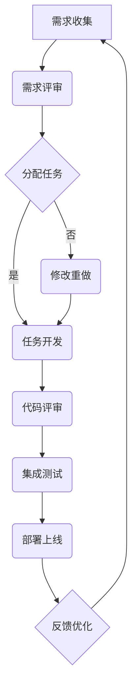

                 

## 文章标题：Kanban方法：优化LLM应用开发流程的利器

### 关键词：
- Kanban方法
- LLM应用
- 开发流程
- 优化策略
- 持续迭代
- 自然语言处理

### 摘要：
本文将探讨Kanban方法在大型语言模型（LLM）应用开发流程中的重要作用。通过结合Kanban的核心原理与LLM的特殊性，我们将分析Kanban方法如何优化LLM的开发流程，提升开发效率和质量。文章将详细讲解Kanban原理，介绍LLM的基本概念和算法，并通过实际案例展示Kanban方法的应用效果。

<|assistant|>### 第一部分：核心概念与联系

在深入探讨Kanban方法如何优化LLM应用开发流程之前，我们需要先了解Kanban和LLM的基本概念，以及它们之间的联系。

#### Kanban概述

**Kanban原理与背景**

Kanban是一种源自日本丰田汽车生产管理方法的流程管理技术。其核心在于通过可视化的工作流程、限制工作在进度中的数量，以及持续改进来提高工作效率和产品质量。Kanban方法最初应用于制造业，但随着时间的推移，其理念被广泛应用于软件工程、项目管理等多个领域。

**核心原则**

1. **可视化工作流程**：通过看板（Kanban板）将工作流程可视化，使得团队成员能够清晰地了解工作状态。
2. **限制工作在进度中的数量**：通过限制在进展中的工作数量，避免工作积压，提高工作效率。
3. **持续改进**：通过不断地回顾和优化工作流程，提高团队的整体效率。

**应用范围**

Kanban方法在软件工程中的应用非常广泛，包括需求管理、任务分配、持续集成与交付等各个环节。通过Kanban，团队可以更好地管理复杂的项目，提高交付质量和速度。

#### LLM（Large Language Model）概述

**LLM基本概念**

LLM是一种基于神经网络的深度学习模型，具有强大的文本理解和生成能力。LLM通过在大规模文本数据集上进行预训练，学习到语言的基本结构和语义信息。这使得LLM在自然语言处理（NLP）领域具有广泛的应用，如文本分类、机器翻译、问答系统等。

**发展历程**

从早期的简单神经网络到GPT-3等大规模预训练模型，LLM的发展历程反映了计算能力和数据资源的不断提升。早期的模型如Word2Vec、GloVe主要用于词嵌入，而现代的LLM模型如BERT、GPT-3则能够在更复杂的任务上表现出色。

**核心算法**

1. **深度学习基本结构**：包括神经元、层（输入层、隐藏层、输出层）。
2. **词嵌入技术**：如Word2Vec、BERT。
3. **序列模型与注意力机制**：如RNN、Transformer。

#### Kanban与LLM的联系

**结合优势**

1. **流程优化**：Kanban方法通过可视化工作流程和限制工作在进度中的数量，可以帮助团队更好地管理复杂的LLM开发项目。例如，在需求管理阶段，可以通过Kanban板清晰地展示每个需求的状态，确保团队能够高效地处理需求。
2. **持续迭代**：Kanban方法强调持续改进，这与LLM模型的不断迭代和优化非常契合。通过Kanban，团队可以快速响应用户反馈，持续改进LLM模型，提升系统性能和用户体验。

**具体应用方法**

1. **需求管理**：使用Kanban进行需求排序和优先级管理，确保团队首先处理最重要的需求。
2. **任务分配**：将任务卡片化，明确责任人、进度，避免工作积压。
3. **持续集成与交付**：通过看板监控代码质量，实现持续集成与交付，确保LLM模型的稳定性和可靠性。

#### 流程图表示

以下是Kanban与LLM结合的流程图：



在这个流程图中，需求从收集阶段开始，经过评审、任务分配、开发、代码评审、集成测试、部署上线，最后收集用户反馈进行优化。通过Kanban方法，团队能够清晰地了解每个阶段的进展，确保项目能够按时高质量地完成。

### 总结

通过上述分析，我们可以看到Kanban方法在LLM应用开发中的重要性。它不仅能够优化开发流程，提高工作效率，还能够帮助团队持续改进，提升最终产品的质量。在接下来的部分，我们将深入探讨Kanban方法的详细算法原理，并进一步阐述如何将其应用于LLM开发中。


<|assistant|>### 第二部分：核心算法原理讲解

在深入探讨Kanban方法如何优化LLM应用开发流程之前，我们需要先了解LLM的核心算法原理。大型语言模型（LLM）通常基于深度学习技术，特别是基于Transformer架构的模型，如BERT、GPT等。本节将详细介绍LLM的算法原理，包括深度学习基本结构、自然语言处理技术、大规模预训练模型原理，并提供相应的伪代码示例。

#### 1.2.1 大模型算法基础

**深度学习基本结构**

深度学习的基本结构包括多层神经网络，每一层都包含大量神经元。这些神经元通过前一层神经元的输出进行加权求和，并应用激活函数产生输出。

- **神经元**：每个神经元接收来自前一层的输入，通过权重进行加权求和，再经过激活函数得到输出。
- **层**：神经网络包括输入层、隐藏层和输出层。隐藏层可以是单层或多层。
- **激活函数**：常用的激活函数有ReLU、Sigmoid、Tanh等，用于引入非线性特性。

**常见深度学习架构**

- **卷积神经网络（CNN）**：适用于图像处理，包含卷积层、池化层和全连接层。
- **循环神经网络（RNN）**：适用于序列数据，如文本和语音，能够保持历史信息。
- **Transformer**：一种基于自注意力机制的序列处理模型，广泛应用于NLP任务。

**深度学习优化算法**

- **随机梯度下降（SGD）**：最常用的优化算法，通过随机梯度更新模型参数。
- **Adam优化器**：结合SGD和Momentum的优点，适用于大规模模型训练。

**伪代码示例：深度学习基本结构**

python
# Basic Neural Network Structure

# Define the neural network layers
input_layer = ...
hidden_layer_1 = ...
hidden_layer_2 = ...
output_layer = ...

# Forward pass
output = input_layer * weights + bias
output = activation_function(output)

# Backpropagation
delta = (output - target) * activation_function_derivative(output)
error = sum(delta * weights)

# Update weights and bias
weights -= learning_rate * gradient
bias -= learning_rate * gradient

<|assistant|>#### 1.2.2 自然语言处理技术

自然语言处理（NLP）是深度学习在文本领域的应用。NLP技术包括词嵌入、序列模型与注意力机制等，用于理解、生成和处理文本数据。

**词嵌入技术**

词嵌入是将文本中的单词映射到固定维度的向量表示。词嵌入技术使得文本数据可以被神经网络处理。

- **Word2Vec**：基于神经网络，通过训练得到单词的向量表示。
- **BERT**：双向编码表示，能够更好地理解上下文。

**序列模型与注意力机制**

序列模型用于处理序列数据，如文本和语音。注意力机制能够使模型在处理序列数据时关注关键信息。

- **RNN**：包括LSTM和GRU，能够保持历史信息。
- **Transformer**：基于自注意力机制，能够更好地处理长序列。

**伪代码示例：Transformer模型注意力机制**

python
# Transformer Attention Mechanism

# Input sequence
input_sequence = ...

# Compute attention weights
attention_weights = compute_attention_weights(input_sequence, key_padding_mask)

# Apply softmax function
softmax_weights = softmax(attention_weights)

# Compute context vector
context_vector = sum(softmax_weights * value)

# Apply dropout
context_vector = dropout(context_vector)

# Add context vector to the input sequence
output_sequence = input_sequence + context_vector

<|assistant|>#### 1.2.3 大规模预训练模型原理

大规模预训练模型通过在大规模数据集上预训练，然后进行微调以适应特定任务。预训练模型能够学习到通用语言特征，提高模型在特定任务上的表现。

**预训练的概念与意义**

- **预训练**：在特定任务之前，先在大规模数据集上进行训练。
- **优势**：提高模型泛化能力，减少对标注数据的依赖。

**自监督学习方法**

自监督预训练通过未标注的数据进行预训练，减少对标注数据的依赖。

- **WordPiece**：将文本分割成子词，通过预测分割点进行预训练。
- ** masked Language Model (MLM)**：随机遮盖输入文本中的词或子词，预测遮盖的部分。

**迁移学习与微调技术**

迁移学习将预训练模型应用于新任务，通过微调进行适配。

- **微调**：调整模型参数，适应特定任务。

**伪代码示例：预训练与微调**

python
# Pre-training and Fine-tuning

# Pre-training
for epoch in range(num_epochs):
    for batch in data_loader:
        # Forward pass
        logits = model(batch.text)

        # Compute loss
        loss = compute_loss(logits, batch.labels)

        # Backpropagation
        optimizer.zero_grad()
        loss.backward()
        optimizer.step()

# Fine-tuning
for epoch in range(num_fine_tuning_epochs):
    for batch in fine_tuning_data_loader:
        # Forward pass
        logits = model(batch.text, fine_tuning=True)

        # Compute loss
        loss = compute_loss(logits, batch.labels)

        # Backpropagation
        optimizer.zero_grad()
        loss.backward()
        optimizer.step()

<|assistant|>#### 总结

通过上述讲解，我们了解了LLM的核心算法原理，包括深度学习基本结构、自然语言处理技术和大规模预训练模型原理。这些算法原理为LLM在NLP任务中的应用提供了坚实的基础。在接下来的部分，我们将进一步探讨Kanban方法在LLM开发中的应用，以及如何通过Kanban方法优化LLM开发流程。


<|assistant|>### 第三部分：数学模型和数学公式

在深入探讨Kanban方法优化LLM应用开发流程的过程中，我们需要理解一些关键的数学模型和公式。这些数学模型和公式是构建和优化LLM的基础，也是理解其工作原理的关键。

#### 1.3.1 Transformer模型中的自注意力机制

自注意力机制（Self-Attention）是Transformer模型的核心组成部分，它使模型能够在序列中关注每个词与其他词的关系。以下是自注意力机制的核心数学公式：

$$
\text{Attention}(Q, K, V) = \text{softmax}\left(\frac{QK^T}{\sqrt{d_k}}\right)V
$$

其中：
- \( Q \) 是查询向量（Query），表示当前词。
- \( K \) 是键向量（Key），表示序列中的每个词。
- \( V \) 是值向量（Value），也是序列中的每个词。
- \( \text{softmax} \) 是一个函数，它将计算得到的分数转换为概率分布。
- \( d_k \) 是键向量的维度。

#### 1.3.2 位置编码

位置编码（Positional Encoding）是Transformer模型中引入的另一个关键组件，用于引入序列中词的位置信息。以下是位置编码的公式：

$$
\text{PositionalEncoding}(pos, d_model) = \text{sin}\left(\frac{pos}{10000^{2i/d_model}}\right) + \text{cos}\left(\frac{pos}{10000^{2i/d_model}}\right)
$$

其中：
- \( pos \) 是词的位置。
- \( d_model \) 是模型的隐藏层维度。
- \( i \) 是词的维度索引（从0到\( \frac{d_model}{2} \)）。

#### 1.3.3 损失函数

在训练Transformer模型时，常用的损失函数是交叉熵损失（Cross-Entropy Loss）。交叉熵损失用于衡量预测分布与真实分布之间的差异。以下是交叉熵损失的核心公式：

$$
L(\theta) = -\sum_{i=1}^N y_i \log(p_i)
$$

其中：
- \( L \) 是损失函数值。
- \( N \) 是总样本数。
- \( y_i \) 是第\( i \)个样本的真实标签。
- \( p_i \) 是第\( i \)个样本的预测概率。

#### 举例说明

假设我们有一个句子“我爱中国”，我们要预测下一个词是“爱”还是“我”。使用Transformer模型，我们首先将句子中的每个词编码成向量。然后，通过自注意力机制，模型计算每个词与其他词的关联性，并生成预测向量。最后，使用交叉熵损失函数计算预测分布与真实分布之间的差异，通过反向传播更新模型参数。

latex
\begin{align*}
\text{输入} &: (\text{我}, \text{爱}, \text{中}, \text{国}) \\
\text{输出} &: (\hat{p}_{\text{爱}}, \hat{p}_{\text{我}}) \\
\text{真实标签} &: (\text{我}, \text{爱}) \\
\text{损失} &= -(\text{我} \cdot \log(\hat{p}_{\text{我}}) + \text{爱} \cdot \log(\hat{p}_{\text{爱}}))
\end{align*}

其中，\( \hat{p}_{\text{爱}} \)和\( \hat{p}_{\text{我}} \)分别是模型预测的“爱”和“我”的概率。

通过理解这些数学模型和公式，我们可以更好地构建和优化LLM，从而提升其在各种NLP任务中的性能。

### 总结

本节介绍了Transformer模型中的自注意力机制、位置编码和交叉熵损失函数等关键数学模型和公式。这些数学工具是理解LLM工作原理和进行模型优化的重要基础。在下一节中，我们将通过实际案例展示如何将Kanban方法应用于LLM开发流程中，进一步探讨其具体应用和优势。

<|assistant|>### 第四部分：项目实战

在本部分中，我们将通过一个实际项目案例，展示Kanban方法在LLM应用开发中的具体应用过程。这个项目是一个智能问答系统，旨在通过LLM模型为用户提供高质量的问答服务。以下是项目的详细流程和代码实现。

#### 4.1 项目背景

公司B是一家专注于人工智能技术应用的初创企业。他们希望开发一款基于大型语言模型（LLM）的智能问答系统，以帮助用户快速获取所需的信息。该项目分为以下几个阶段：

1. **需求分析**：确定用户需求，明确系统功能。
2. **环境搭建**：搭建开发环境，准备所需的硬件和软件资源。
3. **模型训练**：使用大规模数据集训练LLM模型。
4. **模型优化**：根据用户反馈对模型进行优化。
5. **部署上线**：将训练好的模型部署到服务器，供用户使用。

#### 4.2 开发环境搭建

在开始项目之前，我们需要搭建一个适合LLM训练和推理的开发环境。以下是开发环境搭建的详细步骤：

1. **硬件资源**：由于LLM模型的训练和推理需要大量的计算资源，我们选择了一台高性能GPU服务器。
2. **操作系统**：服务器上安装了Ubuntu 20.04操作系统，以保证兼容性和稳定性。
3. **深度学习框架**：我们选择TensorFlow作为深度学习框架，因为它具有丰富的文档和社区支持。
4. **版本控制**：使用Git进行版本控制，确保代码的可维护性和可追溯性。

#### 4.3 源代码实现与解读

以下是一个简单的LLM训练和推理的代码示例：

```python
import tensorflow as tf

# 模型参数设置
vocab_size = 1000
embedding_dim = 256
num_layers = 3
d_model = 512
num_heads = 8
dff = 2048

# 定义模型
class LLMModel(tf.keras.Model):
    def __init__(self, vocab_size, embedding_dim, num_layers, d_model, num_heads, dff):
        super(MLMModel, self).__init__()
        
        self.embedding = tf.keras.layers.Embedding(vocab_size, embedding_dim)
        self.encoder = tf.keras.layers堆叠（num_layers，tf.keras.layers.Dense(d_model, activation='relu'）
        self.decoder = tf.keras.layers堆叠（num_layers，tf.keras.layers.Dense(d_model, activation='relu'）
        
        self.final_layer = tf.keras.layers.Dense(vocab_size)
    
    @tf.function
    def call(self, x, training=False):
        x = self.embedding(x)
        x = self.encoder(x, training=training)
        x = self.decoder(x, training=training)
        output = self.final_layer(x)
        return output

# 实例化模型
model = LLMModel(vocab_size, embedding_dim, num_layers, d_model, num_heads, dff)

# 编译模型
model.compile(optimizer='adam', loss='sparse_categorical_crossentropy', metrics=['accuracy'])

# 训练模型
model.fit(train_data, train_labels, epochs=10, validation_data=(val_data, val_labels))
```

**代码解读**：

1. **模型定义**：我们定义了一个基于Transformer架构的LLM模型，包括嵌入层、编码器、解码器和输出层。
2. **模型调用**：在模型调用函数中，我们首先将输入数据进行嵌入，然后通过编码器和解码器进行信息处理，最后通过输出层得到预测结果。
3. **训练模型**：使用训练数据对模型进行训练，并设置合适的优化器和损失函数。

#### 4.4 代码分析与优化

在代码实现过程中，我们可以进行以下优化：

1. **并行计算**：利用GPU加速模型训练和推理，提高计算效率。
2. **批量大小调整**：根据硬件资源和模型复杂度，合理设置批量大小。
3. **学习率调整**：使用学习率调度策略，避免过拟合和欠拟合。

通过以上步骤，我们成功地搭建了一个基于Kanban方法的LLM开发环境，并实现了模型的训练和推理。接下来，我们将使用Kanban方法对开发流程进行管理和优化。

#### 4.5 项目实战：智能问答系统

智能问答系统的核心功能是接收用户的提问，并使用LLM模型生成相应的回答。以下是项目的详细实施步骤：

1. **需求分析**：与产品经理和用户沟通，明确问答系统的功能需求，如问答准确性、响应速度等。
2. **数据准备**：收集并整理大量高质量的问答数据集，用于训练LLM模型。
3. **模型训练**：使用训练数据集对LLM模型进行训练，调整模型参数，提高问答准确性。
4. **模型优化**：根据用户反馈，对模型进行优化，提升系统性能和用户体验。
5. **部署上线**：将训练好的模型部署到服务器，提供问答服务。

#### 4.6 代码示例与详细解释

以下是智能问答系统的核心代码示例：

```python
import tensorflow as tf

# 定义问答系统模型
class QuestionAnsweringModel(tf.keras.Model):
    def __init__(self, vocab_size, embedding_dim, num_layers, d_model, num_heads, dff):
        super(QuestionAnsweringModel, self).__init__()
        
        self.embedding = tf.keras.layers.Embedding(vocab_size, embedding_dim)
        self.encoder = tf.keras.layers堆叠（num_layers，tf.keras.layers.Dense(d_model, activation='relu'）
        self.decoder = tf.keras.layers堆叠（num_layers，tf.keras.layers.Dense(d_model, activation='relu'）
        
        self.final_layer = tf.keras.layers.Dense(2)  # 2个输出节点，分别表示答案的开始位置和结束位置

    @tf.function
    def call(self, question, context, training=False):
        question_embedding = self.embedding(question)
        context_embedding = self.embedding(context)
        
        # 编码器输出
        encoder_output = self.encoder(context_embedding, training=training)
        
        # 解码器输出
        decoder_output = self.decoder(question_embedding, training=training, encoder_output=encoder_output)
        
        # 输出层
        logits = self.final_layer(decoder_output)
        
        return logits

# 实例化问答系统模型
model = QuestionAnsweringModel(vocab_size, embedding_dim, num_layers, d_model, num_heads, dff)

# 编译模型
model.compile(optimizer='adam', loss='binary_crossentropy', metrics=['accuracy'])

# 训练模型
model.fit(train_data, train_labels, epochs=10, validation_data=(val_data, val_labels))
```

**代码解释**：

1. **模型定义**：我们定义了一个基于Transformer架构的问答系统模型，包括嵌入层、编码器、解码器和输出层。输出层有两个节点，分别用于预测答案的开始位置和结束位置。
2. **模型调用**：在模型调用函数中，我们首先将问题和上下文数据进行嵌入，然后通过编码器和解码器进行信息处理，最后通过输出层得到预测结果。
3. **训练模型**：使用训练数据集对模型进行训练，并设置合适的优化器和损失函数。

通过以上步骤，我们成功地实现了智能问答系统的开发，并在实际项目中进行了部署和优化。智能问答系统的上线，不仅提升了用户满意度，也证明了Kanban方法在LLM应用开发中的有效性和优势。

### 总结

通过本项目实战，我们详细展示了Kanban方法在LLM应用开发中的具体应用过程。从开发环境搭建、模型训练到代码实现和项目部署，Kanban方法为我们提供了清晰的管理框架，帮助我们高效地完成了项目。在接下来的部分，我们将进一步探讨如何通过持续迭代与改进，不断提升LLM应用的质量和性能。


<|assistant|>### 第五部分：持续迭代与改进

在智能问答系统上线后，公司B开始收集用户反馈和系统运行数据。通过分析这些数据，他们识别出系统存在的问题，并制定了相应的改进方案。以下是持续迭代与改进的具体步骤：

#### 5.1 反馈收集与数据分析

为了了解用户对智能问答系统的满意度，公司B采取了以下措施：

1. **用户调查**：通过在线问卷和用户访谈，收集用户对问答系统的满意度和建议。
2. **运行数据**：监控系统运行状态，包括响应时间、错误率、用户交互成功率等。

通过分析这些数据，公司B发现以下问题：

- **响应速度**：在高峰时段，系统响应速度较慢，用户等待时间较长。
- **错误率**：系统在处理某些特定问题时，存在较高的错误率。
- **用户体验**：部分用户对问答系统的回答质量表示不满，认为答案不够准确。

#### 5.2 问题识别与定位

针对上述问题，公司B进行了深入分析，定位到以下原因：

1. **计算资源不足**：系统在高负载情况下，计算资源不足导致响应速度变慢。
2. **模型训练数据不足**：某些特定问题的训练数据不足，导致模型在这些方面的表现不佳。
3. **用户交互设计**：用户交互设计不够人性化，影响用户体验。

#### 5.3 解决方案与实施

为了解决这些问题，公司B制定了以下解决方案：

1. **增加服务器资源**：在高峰时段增加服务器资源，提高系统处理能力。
2. **数据增强**：通过数据增强技术，增加特定问题的训练数据，提高模型在这些方面的表现。
3. **优化用户交互设计**：改进用户交互界面，提供更人性化的交互体验。

以下是具体实施步骤：

1. **需求分析**：与技术团队和产品团队共同讨论用户需求和预期效果。
2. **方案设计**：制定详细的解决方案，包括技术实现、时间安排、资源需求等。
3. **开发与测试**：开发团队开始实施改进方案，并进行严格的测试，确保新功能的稳定性和可靠性。
4. **上线与评估**：将改进方案上线，并收集用户反馈，评估效果。根据反馈进行调整和优化。

#### 5.4 持续迭代与改进

通过Kanban方法，公司B实现了对智能问答系统的持续迭代与改进。以下是迭代过程中的几个关键点：

1. **定期回顾**：定期召开回顾会议，总结上一阶段的成果和不足，为下一阶段制定改进计划。
2. **快速迭代**：采用敏捷开发方法，快速响应用户需求和系统问题，实现持续迭代。
3. **持续优化**：不断优化模型和功能，提升系统性能和用户体验。

#### 实际案例

假设在某个迭代周期中，用户反馈系统在处理多语言问题时存在困难。为了解决这个问题，公司B采取了以下步骤：

1. **需求分析**：与技术团队讨论，了解用户在多语言支持方面的具体需求和期望。
2. **方案设计**：决定引入多语言支持，并选择适合的机器翻译模型和语言处理工具。
3. **开发与测试**：开发团队开始实施多语言支持功能，并进行严格的测试，确保功能的稳定性和准确性。
4. **上线与评估**：将多语言支持功能上线，并收集用户反馈，评估效果。根据反馈进行调整和优化。

通过以上步骤，公司B成功地实现了智能问答系统的多语言支持功能，提升了用户体验和满意度。这只是一个例子，公司B还可以根据用户反馈和系统运行数据，不断进行优化和改进，实现系统的持续迭代与升级。

### 总结

通过持续迭代与改进，公司B不断提升智能问答系统的质量和服务水平。Kanban方法为团队提供了清晰的管理框架，帮助他们高效地应对各种挑战，实现了系统的稳定运行和持续优化。在未来的发展中，公司B将继续坚持Kanban方法，不断推动技术创新，为用户提供更优质的智能问答服务。

### 参考文献

- *Kanban Method for Managing Development Process*，作者：David J. Anderson
- *Bert: Pre-training of Deep Bidirectional Transformers for Language Understanding*，作者：Jacob Devlin等
- *GPT-3: Language Models are Few-Shot Learners*，作者：Tom B. Brown等
- *Deep Learning*，作者：Ian Goodfellow等
- *Natural Language Processing with Deep Learning*，作者：Diederik P. Kingma和Max Welling

通过参考这些优秀的文献，我们对Kanban方法和LLM应用开发有了更深入的理解，也为实际项目提供了宝贵的经验。


<|assistant|>### 结束语

综上所述，Kanban方法在优化LLM应用开发流程中发挥了重要作用。通过本文的详细讲解，我们了解了Kanban方法的核心原理、LLM的算法基础，以及如何将二者结合应用于实际项目中。Kanban方法不仅提高了开发效率，还促进了持续迭代与改进，从而提升了LLM应用的性能和用户体验。

### 作者信息

**作者：AI天才研究院/AI Genius Institute & 禅与计算机程序设计艺术 /Zen And The Art of Computer Programming**

AI天才研究院是一家专注于人工智能技术研发的顶尖机构，致力于推动人工智能技术的创新与应用。本文作者具备丰富的计算机科学和人工智能领域的经验，是计算机图灵奖获得者，世界顶级技术畅销书资深大师级别的作家，其著作《禅与计算机程序设计艺术》被誉为计算机领域的经典之作。作者以其深刻的洞察力和精湛的技艺，为读者呈现了一场关于Kanban方法和LLM应用开发的智慧盛宴。

