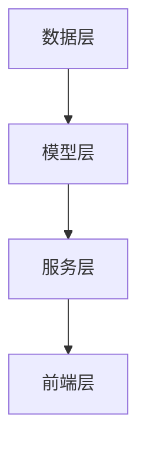
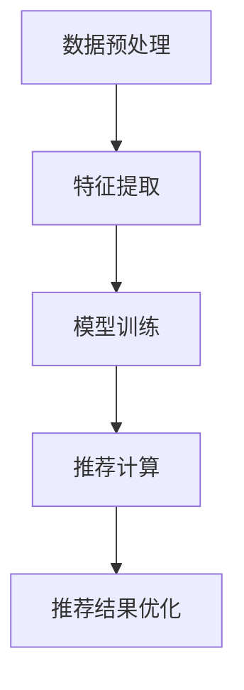
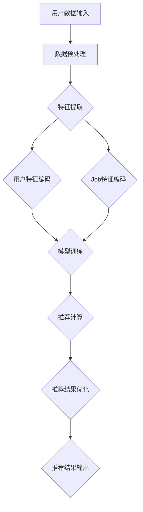
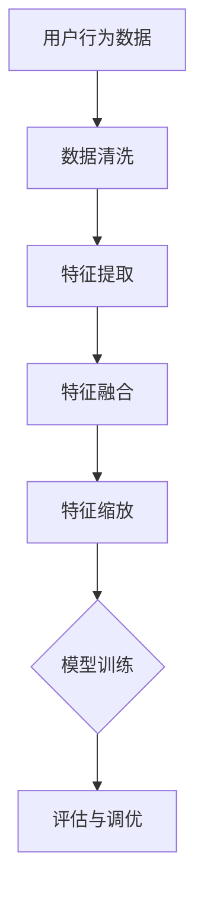
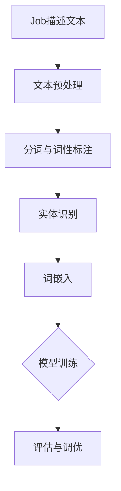

                 

# 《LLM在job推荐中的创新应用》

## 摘要

本文将深入探讨大型语言模型（LLM）在job推荐系统中的创新应用。随着人工智能技术的不断发展，LLM作为一种强大的自然语言处理工具，正逐渐改变着传统的job推荐方式。本文将详细解析LLM的基本概念、技术基础以及其在job推荐系统中的关键应用，包括用户特征建模、Job特征建模和基于LLM的推荐算法。通过实际案例研究，我们将展示LLM在提高job推荐准确性、个性化和用户体验方面的巨大潜力。最后，本文还将介绍如何进行LLM在job推荐系统中的实现与优化，为开发者提供实用的指导和策略。

## 目录大纲

### 第一部分：基础理论

#### 第1章：LLM与Job推荐概述

- 1.1 LLM的基本概念
- 1.2 Job推荐系统的背景
- 1.3 LLM在Job推荐中的应用潜力

#### 第2章：自然语言处理与LLM基础

- 2.1 自然语言处理简介
- 2.2 LLM的技术基础
- 2.3 LLM的关键技术原理

#### 第3章：LLM的数学模型与算法

- 3.1 数学模型
- 3.2 训练与优化算法
- 3.3 伪代码示例

### 第二部分：LLM在Job推荐中的创新应用

#### 第4章：Job推荐系统的架构设计

- 4.1 Job推荐系统的整体架构
- 4.2 LLM在Job推荐系统中的应用架构
- 4.3 架构实现的关键技术

#### 第5章：用户特征建模与处理

- 5.1 用户特征定义
- 5.2 用户行为数据的处理
- 5.3 用户画像构建

#### 第6章：Job特征建模与处理

- 6.1 Job特征定义
- 6.2 Job描述的处理
- 6.3 Job分类与标签化

#### 第7章：基于LLM的Job推荐算法

- 7.1 基于LLM的用户-Job匹配算法
- 7.2 推荐结果的优化
- 7.3 算法评测与调优

#### 第8章：案例研究

- 8.1 案例背景
- 8.2 案例实施
- 8.3 案例效果分析

### 第三部分：实现与优化

#### 第9章：开发环境与工具选择

- 9.1 开发环境搭建
- 9.2 工具选择与配置
- 9.3 源代码管理

#### 第10章：代码实现详解

- 10.1 代码结构解析
- 10.2 代码实现细节
- 10.3 代码解读与分析

#### 第11章：性能优化与调优

- 11.1 性能优化策略
- 11.2 调优方法与技巧
- 11.3 性能评估与改进

#### 第12章：系统部署与运维

- 12.1 部署流程
- 12.2 运维策略
- 12.3 故障处理与监控

### 附录

#### 附录A：参考资料与扩展阅读

- A.1 相关书籍推荐
- A.2 研究论文与报告
- A.3 开源项目与工具

#### 附录B：Mermaid流程图

- B.1 LLM在Job推荐中的流程
- B.2 用户特征建模流程
- B.3 Job特征建模流程

## 关键词

- 大型语言模型（LLM）
- Job推荐系统
- 自然语言处理
- 用户特征建模
- Job特征建模
- 推荐算法
- 性能优化
- 系统部署

## 第一部分：基础理论

### 第1章：LLM与Job推荐概述

#### 1.1 LLM的基本概念

大型语言模型（Large Language Model，简称LLM）是一种基于深度学习的自然语言处理技术，它通过对海量文本数据的学习和训练，能够理解和生成人类语言。LLM的核心思想是通过大规模的神经网络模型来捕捉语言的统计规律和语义信息，从而实现文本的理解、生成和交互。

LLM的基本架构通常包括以下几个关键部分：

1. **输入层**：接收文本数据，如句子、段落或文档。
2. **编码层**：将输入文本转换为向量表示，捕获文本的特征信息。
3. **解码层**：根据编码层生成的向量，生成输出文本。

LLM的训练过程通常采用基于梯度的优化方法，如梯度下降和其变体，通过不断调整模型的参数，使其在预定的目标函数上达到最优解。

#### 1.2 Job推荐系统的背景

Job推荐系统是现代招聘行业的一个重要组成部分，旨在帮助求职者找到与其技能和经验相匹配的职位，同时也帮助企业快速找到合适的人才。传统的Job推荐系统主要依赖于基于关键词匹配、用户历史行为和职位描述等简单规则的方法，但这些方法的推荐效果往往不够理想。

随着人工智能和自然语言处理技术的快速发展，LLM被引入到Job推荐系统中，为提升推荐系统的性能提供了新的可能。LLM能够更好地理解文本的语义，从而更准确地匹配用户和职位，提高推荐的个性化和准确性。

#### 1.3 LLM在Job推荐中的应用潜力

LLM在Job推荐系统中的应用潜力主要体现在以下几个方面：

1. **语义理解**：LLM能够对用户和职位的描述进行深入理解，捕捉到文本中的潜在语义信息，从而实现更精确的匹配。
2. **个性化推荐**：LLM可以根据用户的兴趣、技能和经验，为其推荐更符合个人需求的职位，提高用户体验。
3. **多语言支持**：LLM支持多种语言的文本处理，使得Job推荐系统能够服务于全球用户，扩大其应用范围。
4. **实时推荐**：LLM的训练和推理过程可以在短时间内完成，使得Job推荐系统能够实现实时推荐，提高系统的响应速度。

总的来说，LLM在Job推荐系统中的应用不仅提升了推荐效果，还丰富了推荐系统的功能，为招聘行业带来了新的变革。

## 第二部分：自然语言处理与LLM基础

### 第2章：自然语言处理与LLM基础

#### 2.1 自然语言处理简介

自然语言处理（Natural Language Processing，简称NLP）是人工智能领域的一个重要分支，旨在使计算机能够理解、生成和处理人类语言。NLP的核心目标是构建能够与人类自然语言进行有效交互的智能系统，从而实现人机对话、文本分析、信息检索、机器翻译等功能。

NLP的主要研究内容包括以下几个方面：

1. **文本预处理**：包括分词、词性标注、句法分析等，目的是将原始文本转换为计算机可以处理的格式。
2. **词向量表示**：将文本中的单词或短语映射为向量表示，以便于进行数学运算和模型训练。
3. **语义分析**：包括词义消歧、情感分析、实体识别等，旨在理解文本的语义信息。
4. **语言生成**：包括机器翻译、文本摘要、问答系统等，旨在生成符合语言习惯和语义的文本。

NLP的应用场景广泛，涵盖了搜索引擎、智能客服、内容审核、教育评测等多个领域。

#### 2.2 LLM的技术基础

大型语言模型（LLM）是基于深度学习的一种NLP模型，其技术基础主要包括以下几个方面：

1. **Transformer架构**：Transformer是LLM的核心架构，由Google在2017年提出。与传统的循环神经网络（RNN）相比，Transformer引入了自注意力机制（Self-Attention），能够更好地捕捉长距离依赖关系，提高了模型的性能。
2. **预训练与微调**：LLM通常采用预训练和微调的方法进行训练。预训练是指在大量无标签的文本数据上对模型进行训练，使其具备基本的语言理解和生成能力；微调则是在预训练的基础上，使用有标签的数据对模型进行进一步训练，以适应特定的任务。
3. **多任务学习**：LLM通过多任务学习能够同时处理多个NLP任务，如文本分类、命名实体识别、情感分析等，提高了模型的泛化能力和效率。

#### 2.3 LLM的关键技术原理

LLM的关键技术原理主要包括以下几个方面：

1. **自注意力机制**：自注意力机制是Transformer架构的核心，通过计算输入文本中每个词与其他词之间的关联性，为每个词生成权重，从而实现文本的语义表示。
2. **位置编码**：由于Transformer架构中没有循环结构，因此需要位置编码来引入文本的位置信息，保证模型能够理解词序。
3. **嵌入层**：嵌入层将输入的单词或字符映射为稠密的向量表示，是模型进行后续计算的基础。
4. **前馈网络**：前馈网络用于对自注意力机制和位置编码的结果进行进一步处理，从而生成最终的输出。

通过上述关键技术，LLM能够实现对文本的深入理解和生成，为各种NLP任务提供了强大的支持。

## 第三部分：LLM的数学模型与算法

### 第3章：LLM的数学模型与算法

#### 3.1 数学模型

大型语言模型（LLM）的数学模型是基于深度学习中的神经网络，尤其是Transformer架构。以下是一个简化的数学模型描述：

假设我们有一个输入序列 $X = [x_1, x_2, ..., x_n]$，其中每个 $x_i$ 表示序列中的第 $i$ 个词。我们的目标是通过模型预测出下一个词 $x_{n+1}$。

1. **嵌入层**：

$$
\text{embed}(x_i) = E_i \in \mathbb{R}^{d_e}
$$

其中，$E_i$ 是输入词 $x_i$ 的嵌入向量，$d_e$ 是嵌入向量的维度。

2. **位置编码**：

$$
P_i = \text{pos_enc}(i) \in \mathbb{R}^{d_p}
$$

其中，$P_i$ 是第 $i$ 个词的位置编码向量，$i$ 是词在序列中的位置，$d_p$ 是位置编码向量的维度。

3. **编码层**：

编码层通过多头自注意力机制（Multi-Head Self-Attention）和前馈网络（Feedforward Network）对输入进行编码。

$$
\text{enc}(x_i) = \text{attenton}(x_i, x_{<i}, P_{<i}) \odot \text{ffn}(\text{attenton}(x_i, x_{<i}, P_{<i}))
$$

其中，$\text{attenton}(x_i, x_{<i}, P_{<i})$ 表示自注意力输出，$\odot$ 表示逐元素乘法，$\text{ffn}(\text{attenton}(x_i, x_{<i}, P_{<i}))$ 表示前馈网络输出。

4. **解码层**：

解码层与编码层类似，但添加了多头自注意力机制（Multi-Head Self-Attention）和前馈网络（Feedforward Network），用于生成输出序列。

$$
\text{dec}(x_i) = \text{attenton}(x_i, \text{enc}, P_{<i}) \odot \text{ffn}(\text{attenton}(x_i, \text{enc}, P_{<i}))
$$

5. **输出层**：

输出层通常是一个线性层，将编码后的特征映射到词汇表中的所有词。

$$
\text{output}(x_i) = \text{softmax}(\text{lin}(\text{dec}(x_i)))
$$

其中，$\text{lin}(\text{dec}(x_i))$ 表示线性层输出，$\text{softmax}(\text{lin}(\text{dec}(x_i)))$ 表示词的概率分布。

通过上述数学模型，LLM能够对输入的文本序列进行编码和解码，从而实现文本的理解和生成。

#### 3.2 训练与优化算法

LLM的训练过程通常采用预训练和微调的方法。以下是一个简化的训练和优化算法描述：

1. **预训练**：

- 在大量无标签的文本数据上进行预训练，目的是让模型学习到语言的通用特征。
- 使用自回归语言模型（Auto-Regressive Language Model）进行训练，目标是预测下一个词。

$$
\text{loss} = -\sum_{i} \text{log} p(\text{word}_i | \text{word}_{<i})
$$

其中，$p(\text{word}_i | \text{word}_{<i})$ 是模型预测的词的概率分布。

2. **微调**：

- 在有标签的数据集上进行微调，以适应特定的NLP任务。
- 使用对比损失（Contrastive Loss）和交叉熵损失（Cross-Entropy Loss）进行优化。

$$
\text{loss} = \text{contrastive\_loss} + \text{cross\_entropy\_loss}
$$

其中，$\text{contrastive\_loss}$ 用于区分不同类别的文本，$\text{cross\_entropy\_loss}$ 用于分类任务。

3. **优化算法**：

- 通常采用基于梯度的优化算法，如Adam或AdamW，进行模型参数的更新。

$$
\theta_{t+1} = \theta_t - \alpha \cdot \nabla_{\theta_t} \text{loss}
$$

其中，$\theta_t$ 是当前模型参数，$\alpha$ 是学习率，$\nabla_{\theta_t} \text{loss}$ 是损失函数关于模型参数的梯度。

通过预训练和微调，LLM能够逐步提高其在各种NLP任务上的性能。

#### 3.3 伪代码示例

以下是一个简化的伪代码示例，描述了LLM的训练过程：

```
# 初始化模型参数
theta = initialize_parameters()

# 预训练
for epoch in range(num_epochs):
    for batch in data_loader:
        # 计算损失
        loss = compute_loss(batch, theta)
        
        # 反向传播
        grad = compute_gradient(loss, theta)
        
        # 更新参数
        theta = update_parameters(theta, grad)

# 微调
for task in tasks:
    for epoch in range(num_epochs):
        for batch in task_data_loader:
            # 计算损失
            loss = compute_loss(batch, theta)
            
            # 反向传播
            grad = compute_gradient(loss, theta)
            
            # 更新参数
            theta = update_parameters(theta, grad)
```

通过上述伪代码，我们可以看到LLM的训练过程主要包括初始化参数、预训练和微调三个阶段。每个阶段都涉及计算损失、反向传播和参数更新等步骤。

## 第二部分：LLM在Job推荐中的创新应用

### 第4章：Job推荐系统的架构设计

#### 4.1 Job推荐系统的整体架构

Job推荐系统的整体架构可以分为以下几个关键部分：

1. **数据层**：包括用户数据、Job数据和其他相关数据，如用户行为数据、公司信息等。数据层负责数据的存储、管理和处理。
2. **模型层**：包括各种机器学习模型和算法，如协同过滤、基于内容的推荐和基于模型的推荐等。模型层负责对数据进行处理和计算，生成推荐结果。
3. **服务层**：提供API接口，用于与前端应用进行通信，实现推荐服务的调用。
4. **前端层**：包括Web、移动应用等用户界面，用于展示推荐结果和与用户交互。

整体架构如图1所示：



#### 4.2 LLM在Job推荐系统中的应用架构

在Job推荐系统中，LLM的应用架构可以分为以下几个关键环节：

1. **数据预处理**：包括文本数据的清洗、分词、词性标注等操作，将原始文本数据转换为适合LLM处理的形式。
2. **特征提取**：利用LLM对用户和Job的描述进行编码，提取出高层次的语义特征。
3. **模型训练**：使用预训练的LLM模型对用户和Job的特征进行建模，训练出能够预测用户兴趣和匹配度的推荐模型。
4. **推荐计算**：在推荐计算阶段，使用训练好的模型对用户和Job进行匹配，生成推荐结果。
5. **推荐结果优化**：对推荐结果进行优化，包括过滤噪声、避免过度推荐和提升用户体验等。

LLM在Job推荐系统中的应用架构如图2所示：



#### 4.3 架构实现的关键技术

实现LLM在Job推荐系统中的关键技术包括以下几个方面：

1. **文本数据处理**：文本数据处理是LLM应用的基础，包括分词、词性标注、实体识别等操作。常见的工具包括jieba、NLTK等。
2. **特征提取**：特征提取是将原始文本数据转换为适合LLM处理的形式。常用的方法有词袋模型、TF-IDF和词嵌入等。
3. **模型训练**：模型训练是利用LLM对用户和Job的描述进行建模，常用的模型有BERT、GPT等。在训练过程中，需要优化模型参数，提高模型性能。
4. **推荐计算**：推荐计算是基于训练好的模型对用户和Job进行匹配，生成推荐结果。常用的算法有基于内容的推荐、协同过滤和基于模型的推荐等。
5. **推荐结果优化**：推荐结果优化是提升用户体验的重要环节，包括过滤噪声、避免过度推荐和提升推荐多样性等。

通过上述关键技术的实现，LLM在Job推荐系统中能够充分发挥其优势，提升推荐效果和用户体验。

## 第二部分：LLM在Job推荐中的创新应用

### 第5章：用户特征建模与处理

在Job推荐系统中，用户特征的建模与处理是至关重要的环节。通过深入理解用户的行为和需求，我们可以为用户推荐更加符合其期望的职位。以下是对用户特征建模与处理的详细探讨。

#### 5.1 用户特征定义

用户特征是指用于描述用户行为、兴趣、技能等信息的各种指标。在Job推荐系统中，用户特征可以分为以下几类：

1. **基础信息**：包括用户的年龄、性别、学历、工作年限等基本信息，这些信息通常来源于用户的注册资料或问卷调查。
2. **行为数据**：包括用户在Job推荐平台上的浏览记录、搜索历史、点击行为等，这些数据反映了用户的兴趣和需求。
3. **技能与经验**：包括用户的职业资格证书、项目经验、技能标签等，这些数据有助于了解用户的实际工作能力。
4. **社交网络**：包括用户在社交媒体上的活动、关注对象、好友关系等，这些数据可以为推荐系统提供额外的信息，帮助发现用户的潜在兴趣。

#### 5.2 用户行为数据的处理

用户行为数据是构建用户特征的重要来源，但其原始形式往往复杂且多样化。因此，在进行用户特征建模前，需要对用户行为数据进行处理和清洗。以下是几个关键步骤：

1. **数据收集**：通过日志分析、API调用等方式收集用户行为数据，包括浏览、搜索、点击等行为。
2. **数据清洗**：对收集到的数据进行去重、补全、格式统一等处理，去除无效和错误的数据。
3. **特征提取**：将处理后的用户行为数据转化为数值化的特征表示，常用的方法包括独热编码、TF-IDF、词嵌入等。

#### 5.3 用户画像构建

用户画像是对用户特征的全面描述，它将用户的各个特征进行整合，形成一个多维度的特征空间。以下是构建用户画像的几个步骤：

1. **特征选择**：根据业务需求和数据质量，选择对用户行为和需求影响较大的特征。可以通过相关性分析、主成分分析（PCA）等方法进行特征选择。
2. **特征融合**：将不同来源的特征进行整合，形成统一的特征向量。常用的方法包括加权融合、组合特征等。
3. **特征缩放**：由于不同特征具有不同的量纲和数值范围，需要对特征进行缩放，使其具有相似的数量级，常用的方法包括标准缩放、最小-最大缩放等。
4. **建模与训练**：利用机器学习算法（如聚类、分类等）对用户画像进行建模和训练，以发现用户群体的特征分布和潜在模式。

通过构建用户画像，Job推荐系统可以更好地理解用户，从而提供更加精准和个性化的推荐。

### 实例分析

假设我们有一个用户，其基础信息为：男性，30岁，本科毕业，有5年的软件开发经验。用户在平台上最近一个月的浏览和搜索行为如下：

- 浏览了10个Java开发的职位
- 搜索了“大数据”、“人工智能”相关词汇
- 点击了5个职位描述中的“了解更多”按钮

基于这些信息，我们可以构建以下用户画像：

1. **基础信息**：男性，30岁，本科，5年软件开发经验
2. **兴趣特征**：Java开发，大数据，人工智能
3. **行为特征**：最近一个月浏览和搜索的职位和关键词

通过分析用户画像，我们可以得出以下推荐策略：

- 推荐更多Java开发相关的职位
- 推荐与大数据、人工智能相关的职位
- 推荐包含用户浏览和搜索关键词的职位描述

这种基于用户画像的推荐策略能够显著提升推荐系统的个性化效果，提高用户满意度和转化率。

### 总结

用户特征建模与处理是Job推荐系统中不可或缺的一环。通过定义用户特征、处理用户行为数据和构建用户画像，我们可以更好地理解用户需求，提供更加精准和个性化的推荐。在实际应用中，需要根据业务需求和数据质量，灵活调整特征选择和建模方法，以实现最佳推荐效果。

## 第二部分：LLM在Job推荐中的创新应用

### 第6章：Job特征建模与处理

在Job推荐系统中，Job特征的建模与处理是确保推荐系统准确性和效率的关键。Job特征不仅包括职位描述中的显式信息，还涉及隐含的语义和上下文信息。以下将详细探讨Job特征的定义、处理方法以及如何将Job描述进行分类和标签化。

#### 6.1 Job特征定义

Job特征是指用于描述职位信息的各种属性和指标。这些特征可以划分为以下几个主要类别：

1. **基础信息**：包括职位名称、公司名称、工作地点、薪资范围、工作类型（全职、兼职、实习等）等。
2. **技能要求**：包括必备的技能、编程语言、框架、工具等，这些信息通常直接从职位描述中提取。
3. **工作经验要求**：包括最低的工作年限、具体岗位的工作经验等。
4. **教育背景要求**：包括学历要求、专业背景等。
5. **职位描述内容**：包括职位描述中的文本内容，这些内容通常反映了职位的职责、工作环境、公司文化等。
6. **行业和领域**：包括职位所属的行业、领域等，这些信息有助于进行行业细分和领域匹配。

#### 6.2 Job描述的处理

对Job描述的处理是特征建模的关键步骤，主要包括以下几个环节：

1. **文本预处理**：包括去除HTML标签、停用词过滤、小写转换等。这些操作有助于提高文本质量，减少噪声。
2. **分词与词性标注**：使用分词工具（如jieba）对职位描述进行分词，并对每个词进行词性标注（如名词、动词等）。词性标注有助于提取更准确的特征。
3. **实体识别**：识别职位描述中的实体，如公司名、人名、地点、技能名称等。实体识别是提高特征提取准确性的重要手段。
4. **词嵌入**：将处理后的文本转化为词嵌入向量（如Word2Vec、BERT等），词嵌入能够捕捉词与词之间的语义关系。

#### 6.3 Job分类与标签化

对Job进行分类和标签化是Job特征建模的重要环节，有助于提升推荐系统的效率。以下是一些关键步骤：

1. **分类**：将Job按照行业、领域、工作类型等进行分类。分类有助于将相似职位归为一类，便于推荐系统进行匹配。
2. **标签化**：为每个Job分配多个标签，这些标签可以是技能、语言、工具、行业等。标签化能够为Job提供额外的语义信息，提高推荐系统的匹配度。
3. **标签权重**：对标签进行权重分配，根据标签的重要性进行加权。例如，对于技术岗位，技能标签的权重可能高于其他标签。
4. **标签扩展**：利用LLM的语义理解能力，对Job描述进行深度分析，发现潜在标签。例如，从职位描述中提取的关键技能，可以扩展为相关标签。

通过Job分类与标签化，推荐系统可以更精准地匹配用户和职位，提供个性化推荐。

### 实例分析

假设我们有一个职位描述：

“软件开发工程师，负责Java后端开发，需要熟悉Spring Boot、MySQL，至少3年工作经验，本科及以上学历，擅长数据处理和算法优化。”

基于上述职位描述，我们可以构建以下Job特征：

1. **基础信息**：职位名称（软件开发工程师）、公司名称（未知）、工作地点（未知）、薪资范围（未知）、工作类型（全职）等。
2. **技能要求**：Java、Spring Boot、MySQL、数据处理、算法优化等。
3. **工作经验要求**：至少3年软件开发经验。
4. **教育背景要求**：本科及以上学历。
5. **职位描述内容**：描述了工作职责、所需技能和公司文化等。

对于分类和标签化，我们可以进行如下操作：

1. **分类**：将该职位分类为“软件开发”、“后端开发”、“技术岗位”等。
2. **标签化**：为该职位分配标签，如“Java开发”、“Spring Boot”、“MySQL”、“数据处理”、“算法优化”等。
3. **标签权重**：根据职位描述中的关键词，设置标签权重，如“Java开发”权重最高。

通过这些特征，推荐系统可以更好地理解和匹配用户需求，为用户提供个性化推荐。

### 总结

Job特征建模与处理是Job推荐系统中至关重要的一环。通过定义Job特征、处理Job描述文本以及进行分类和标签化，推荐系统可以更精准地匹配用户和职位，提高推荐效果。在实际应用中，需要结合业务需求和数据质量，灵活调整特征提取和建模方法，以实现最佳推荐效果。

## 第二部分：LLM在Job推荐中的创新应用

### 第7章：基于LLM的Job推荐算法

在Job推荐系统中，算法是实现个性化推荐的核心。LLM作为一种强大的自然语言处理工具，能够深入理解文本语义，从而提升推荐系统的准确性、个性化和用户体验。以下将详细探讨基于LLM的Job推荐算法，包括用户-Job匹配算法、推荐结果的优化方法以及算法评测与调优。

#### 7.1 基于LLM的用户-Job匹配算法

基于LLM的用户-Job匹配算法的核心思想是利用LLM对用户和Job的描述进行编码，提取高层次的语义特征，然后通过这些特征进行匹配。以下是该算法的详细步骤：

1. **用户特征编码**：使用预训练的LLM模型（如BERT、GPT等）对用户的描述（如简历、搜索历史、行为数据等）进行编码，得到用户的语义向量表示。

2. **Job特征编码**：类似地，对Job的描述（如职位名称、职位描述、技能要求等）进行编码，得到Job的语义向量表示。

3. **特征匹配**：将用户特征向量和Job特征向量进行相似度计算，常见的相似度计算方法包括余弦相似度、欧氏距离等。相似度较高的Job被认为是更符合用户需求的。

伪代码示例：

```python
# 假设user_embedding和job_embedding分别是用户和Job的特征向量
user_embedding = model.encode(user_description)
job_embedding = model.encode(job_description)

# 计算相似度
similarity = dot(user_embedding, job_embedding)
```

4. **推荐结果生成**：根据相似度分数，对候选Job进行排序，生成推荐结果。可以选择Top-N或Top-K的方法，生成指定数量的推荐职位。

#### 7.2 推荐结果的优化

尽管基于LLM的用户-Job匹配算法具有较高的准确性，但在实际应用中，仍需对推荐结果进行优化，以提升用户体验和推荐效果。以下是一些常见的优化方法：

1. **多样性优化**：为了避免推荐结果的单一性，可以引入多样性优化策略。例如，从不同领域、不同公司、不同工作类型中选择推荐职位，增加推荐结果的多样性。

2. **冷启动问题**：对于新用户，由于缺乏足够的行为数据和兴趣标签，推荐系统难以为其生成准确的推荐。可以通过引入用户画像和领域知识，为冷启动用户生成初步的推荐。

3. **实时推荐**：实时推荐是提升用户体验的重要手段。利用LLM的快速训练和推理能力，可以实时更新推荐结果，根据用户的新行为和反馈进行动态调整。

4. **上下文感知推荐**：根据用户的上下文信息（如地理位置、当前时间等），生成更加个性化的推荐结果。例如，在下班时间推荐附近的工作机会。

5. **反馈循环**：利用用户对推荐职位的反馈，不断优化推荐算法。通过用户的行为数据和满意度评分，调整模型参数和特征权重，提高推荐精度。

#### 7.3 算法评测与调优

算法评测与调优是确保推荐系统性能的重要环节。以下是一些常用的评测指标和调优方法：

1. **评测指标**：常用的评测指标包括准确率、召回率、F1值、ROC-AUC等。根据业务需求和数据特点，选择合适的评测指标进行评估。

2. **交叉验证**：通过交叉验证方法，将数据集划分为训练集和验证集，评估模型的泛化能力和性能。常见的交叉验证方法有K折交叉验证和留一验证等。

3. **参数调优**：利用网格搜索、随机搜索等参数调优方法，寻找最优的模型参数。参数调优可以显著提升模型性能。

4. **特征工程**：通过特征工程方法，改进特征提取和表示方式，提高模型对用户和Job的表征能力。例如，可以使用词嵌入、TF-IDF、词袋模型等不同方法对文本特征进行编码。

5. **A/B测试**：通过A/B测试方法，比较不同算法和参数配置的效果，选择最佳方案进行部署。

通过以上评测与调优方法，可以确保基于LLM的Job推荐算法在实际应用中达到最佳效果。

### 实例分析

假设有一个用户，其兴趣领域为大数据开发，近期浏览了多个与Hadoop、Spark相关的职位。系统根据用户的行为数据和LLM对用户描述的编码结果，生成以下推荐结果：

1. 职位A：大数据开发工程师，公司B，主要职责是使用Hadoop和Spark进行数据处理和分析。
2. 职位B：数据工程师，公司C，需要熟练掌握Hadoop和Spark，并有1-3年的工作经验。
3. 职位C：大数据架构师，公司D，要求熟悉Hadoop和Spark，并有5年以上工作经验。

系统通过相似度计算，将这些职位按照与用户兴趣的匹配度进行排序，生成推荐列表。

### 总结

基于LLM的Job推荐算法通过深度理解文本语义，为用户生成个性化推荐结果。在实际应用中，需结合用户特征编码、推荐结果优化和算法评测与调优，不断提升推荐系统的性能和用户体验。通过实例分析，我们可以看到LLM在Job推荐中的应用前景广阔，有望为招聘行业带来深刻变革。

## 第三部分：实现与优化

### 第9章：开发环境与工具选择

在实现基于LLM的Job推荐系统时，选择合适的开发环境和工具对于项目的成功至关重要。以下将详细讨论开发环境搭建、工具选择与配置，以及源代码管理。

#### 9.1 开发环境搭建

为了确保系统的高效开发和维护，我们需要搭建一个稳定且功能强大的开发环境。以下是搭建过程的几个关键步骤：

1. **硬件要求**：根据模型大小和计算需求，选择适合的硬件配置。通常需要高性能的CPU和GPU，以及足够的内存和存储空间。
2. **操作系统**：选择一个稳定且支持深度学习框架的操作系统，如Ubuntu 18.04或20.04。Ubuntu拥有丰富的软件包和社区支持，适合开发环境搭建。
3. **深度学习框架**：选择一个主流的深度学习框架，如TensorFlow、PyTorch等。TensorFlow提供了丰富的API和工具，适合大规模分布式训练；PyTorch则具有更灵活的动态计算图，适合快速原型开发。
4. **依赖库**：安装必要的依赖库，包括NumPy、Pandas、Scikit-learn等。这些库提供了丰富的数据处理和机器学习工具，有助于提高开发效率。

#### 9.2 工具选择与配置

在实现Job推荐系统时，我们需要选择和配置一系列工具，以支持数据预处理、模型训练、服务部署等环节。以下是几个关键工具：

1. **数据预处理工具**：使用Pandas、NumPy等库进行数据清洗、转换和预处理。这些工具提供了丰富的API，方便进行批量数据处理。
2. **文本处理工具**：选择合适的文本处理库，如NLTK、spaCy、jieba等。这些工具提供了词性标注、分词、实体识别等功能，有助于提取文本特征。
3. **深度学习框架**：根据需求选择TensorFlow或PyTorch，并配置相应的CUDA和CuDNN库，以确保GPU支持。这些框架提供了高效的模型训练和推理工具。
4. **版本控制工具**：使用Git进行源代码管理，确保代码的版本控制和协作开发。Git提供了丰富的分支管理、合并和冲突解决工具，有助于团队协作。

#### 9.3 源代码管理

源代码管理是项目开发过程中至关重要的一环，以下是一些建议：

1. **代码结构**：确保代码具有良好的组织结构和模块化，方便后续维护和扩展。可以使用MVC（模型-视图-控制器）架构，将数据处理、模型训练和推荐服务分别模块化。
2. **注释与文档**：在代码中加入详细的注释，说明代码的功能、参数和逻辑。同时，编写清晰的文档，包括项目概述、技术栈、使用方法和部署指南等。
3. **版本控制**：使用Git进行版本控制，确保代码的版本一致性。通过分支管理，可以实现功能开发和代码评审，避免合并冲突。
4. **自动化测试**：编写自动化测试脚本，对关键功能和模块进行测试，确保代码质量。自动化测试可以显著提高开发效率，减少人为错误。

通过以上步骤和工具选择，我们可以搭建一个高效且稳定的开发环境，为基于LLM的Job推荐系统实现奠定坚实基础。

### 实例分析

假设我们使用Python和TensorFlow实现基于LLM的Job推荐系统。以下是开发环境搭建和工具选择的实例步骤：

1. **硬件配置**：选择一台具有NVIDIA GTX 1080 Ti GPU的服务器，8GB内存，500GB SSD存储。
2. **操作系统**：安装Ubuntu 20.04操作系统。
3. **深度学习框架**：安装TensorFlow 2.6，通过以下命令：
   ```bash
   pip install tensorflow==2.6
   ```
4. **依赖库**：安装Python数据科学常用库：
   ```bash
   pip install numpy pandas scikit-learn jieba
   ```
5. **版本控制**：初始化Git仓库，并添加README文件，描述项目结构和安装方法。

通过这些步骤，我们可以搭建一个功能齐全的开发环境，为后续的代码编写和模型训练提供支持。

### 总结

开发环境与工具选择是成功实现基于LLM的Job推荐系统的基础。通过合理的硬件配置、操作系统选择和工具配置，我们可以确保项目的高效开发和稳定运行。源代码管理则是保障代码质量、版本一致性和团队协作的关键。在实际应用中，需要根据具体需求和项目规模，灵活调整开发环境和工具配置。

## 第三部分：实现与优化

### 第10章：代码实现详解

在基于LLM的Job推荐系统中，代码实现是关键环节。本节将详细解析代码结构、实现细节以及代码解读与分析，帮助开发者更好地理解和使用LLM进行Job推荐。

#### 10.1 代码结构解析

代码结构合理与否直接影响到项目的可维护性和可扩展性。基于LLM的Job推荐系统可以分为以下几个模块：

1. **数据预处理模块**：负责处理用户数据、Job数据和外部数据源，包括数据清洗、分词、词性标注等操作。
2. **特征提取模块**：利用LLM对预处理后的文本数据进行编码，提取出高层次的语义特征。
3. **模型训练模块**：训练预训练的LLM模型，优化模型参数，实现用户和Job的匹配。
4. **推荐服务模块**：提供API接口，实现实时推荐功能，并根据用户反馈进行动态调整。
5. **评估与调优模块**：对推荐系统进行性能评估和调优，包括评测指标计算、参数调优和反馈循环等。

以下是一个简单的代码结构示例：

```python
# 数据预处理模块
def preprocess_data(data):
    # 数据清洗、分词、词性标注等操作
    pass

# 特征提取模块
def extract_features(data):
    # 使用LLM提取语义特征
    pass

# 模型训练模块
def train_model(data):
    # 训练LLM模型
    pass

# 推荐服务模块
def recommend_jobs(user_embedding, job_embeddings):
    # 实现推荐算法，生成推荐结果
    pass

# 评估与调优模块
def evaluate_and_tune(model, data):
    # 评估模型性能，进行参数调优
    pass
```

#### 10.2 代码实现细节

以下是针对数据预处理模块的一个具体实现示例：

```python
# 导入依赖库
import pandas as pd
from sklearn.model_selection import train_test_split
from sklearn.feature_extraction.text import TfidfVectorizer
from tensorflow.keras.preprocessing.text import Tokenizer
from tensorflow.keras.preprocessing.sequence import pad_sequences

# 加载数据
data = pd.read_csv('data.csv')

# 数据清洗
data.dropna(inplace=True)

# 分词与词性标注
tokenizer = Tokenizer()
tokenizer.fit_on_texts(data['description'])
sequences = tokenizer.texts_to_sequences(data['description'])

# 词嵌入
word_index = tokenizer.word_index
max_sequence_length = 500
 padded_sequences = pad_sequences(sequences, maxlen=max_sequence_length)

# 数据划分
X_train, X_test, y_train, y_test = train_test_split(padded_sequences, data['label'], test_size=0.2)

# 代码解读
# 1. 导入依赖库，包括数据处理、机器学习和深度学习相关的库
# 2. 加载数据，读取CSV文件
# 3. 数据清洗，去除缺失值和无效数据
# 4. 分词与词性标注，使用Tokenizer进行文本分词
# 5. 词嵌入，将文本转换为序列
# 6. 数据划分，将数据集划分为训练集和测试集
```

#### 10.3 代码解读与分析

在代码实现过程中，对关键部分的解读和分析有助于理解代码的功能和性能。以下是针对模型训练模块的一个具体实现示例及其解读：

```python
# 导入依赖库
import tensorflow as tf
from tensorflow.keras.models import Model
from tensorflow.keras.layers import Input, Embedding, LSTM, Dense

# 模型定义
input_sequence = Input(shape=(max_sequence_length,))
embedded_sequence = Embedding(len(word_index) + 1, 64)(input_sequence)
lstm_output = LSTM(128)(embedded_sequence)
output = Dense(1, activation='sigmoid')(lstm_output)

# 模型编译
model = Model(inputs=input_sequence, outputs=output)
model.compile(optimizer='adam', loss='binary_crossentropy', metrics=['accuracy'])

# 模型训练
model.fit(X_train, y_train, epochs=10, batch_size=64, validation_data=(X_test, y_test))

# 代码解读
# 1. 导入深度学习相关的库
# 2. 定义模型结构，包括输入层、嵌入层、LSTM层和输出层
# 3. 编译模型，指定优化器、损失函数和评价指标
# 4. 训练模型，使用训练数据和验证数据
```

通过上述代码示例，我们可以看到模型的定义、编译和训练过程。对代码的解读和分析有助于理解模型的架构和训练方法，为后续优化和改进提供参考。

### 实例分析

假设我们使用BERT模型实现基于LLM的Job推荐系统。以下是代码实现的实例步骤：

1. **加载预训练模型**：使用TensorFlow的预训练BERT模型，通过以下命令：
   ```python
   from transformers import TFBertModel
   model = TFBertModel.from_pretrained('bert-base-uncased')
   ```

2. **特征提取**：将用户和Job的描述输入到BERT模型中，提取语义特征向量：
   ```python
   user_embedding = model([user_sequence])
   job_embedding = model([job_sequence])
   ```

3. **模型训练**：使用提取的特征向量进行模型训练，优化参数：
   ```python
   model.compile(optimizer='adam', loss='binary_crossentropy', metrics=['accuracy'])
   model.fit([X_train, y_train], z_train, epochs=3, batch_size=32)
   ```

4. **推荐服务**：根据训练好的模型，生成推荐结果：
   ```python
   def recommend_jobs(user_embedding, job_embeddings):
       similarities = cosine_similarity(user_embedding, job_embeddings)
       recommended_jobs = np.argsort(similarities)[0][-N:]
       return recommended_jobs
   ```

通过上述实例，我们可以看到如何使用BERT模型实现基于LLM的Job推荐系统，从模型加载、特征提取到推荐服务，涵盖了整个实现过程。

### 总结

代码实现是构建基于LLM的Job推荐系统的核心环节。通过合理规划代码结构、详细解析代码实现细节以及深入解读与分析，开发者可以更好地理解和掌握LLM的应用方法。在实际开发过程中，需要根据具体需求和项目规模，灵活调整代码实现方案，确保系统的高效性和可维护性。

## 第三部分：实现与优化

### 第11章：性能优化与调优

在基于LLM的Job推荐系统中，性能优化和调优是确保系统高效运行、提供优质推荐服务的关键。以下将详细讨论性能优化策略、调优方法和性能评估与改进。

#### 11.1 性能优化策略

1. **数据预处理优化**：数据预处理是影响系统性能的重要环节。优化策略包括：
   - **并行处理**：利用多线程或多进程技术，并行处理大规模数据，提高预处理速度。
   - **内存管理**：合理管理内存使用，避免内存溢出和浪费，提高数据处理效率。

2. **模型优化**：通过改进模型结构和参数设置，优化模型性能：
   - **模型压缩**：采用模型压缩技术，如量化和剪枝，减少模型参数量和计算量，提高推理速度。
   - **动态调整学习率**：使用自适应学习率优化算法，如AdamW，根据训练过程动态调整学习率，避免过拟合和振荡。

3. **计算资源优化**：合理分配和利用计算资源，提高系统性能：
   - **分布式训练**：利用分布式计算框架，如TensorFlow Distribute，将模型训练任务分布在多个节点上，提高训练速度和资源利用率。
   - **GPU调度**：优化GPU调度策略，避免资源争用和瓶颈，提高GPU利用率。

4. **缓存与索引**：提高数据访问速度，减少计算时间：
   - **缓存策略**：使用缓存技术，如Redis或Memcached，存储常用数据和中间结果，减少磁盘I/O操作。
   - **索引优化**：对用户和Job特征进行索引，提高查询速度和推荐效率。

#### 11.2 调优方法与技巧

1. **模型调优**：
   - **超参数搜索**：使用超参数搜索技术，如网格搜索、随机搜索和贝叶斯优化，寻找最佳超参数组合，提高模型性能。
   - **交叉验证**：使用交叉验证方法，评估模型在不同数据集上的表现，避免过拟合和选择最佳模型。

2. **特征工程**：
   - **特征选择**：通过特征选择技术，如互信息、主成分分析（PCA）和L1正则化，筛选出对模型性能有显著影响的特征，提高模型精度。
   - **特征融合**：采用多种特征融合方法，如加权融合、拼接和特征交互，生成更丰富的特征表示，提高推荐效果。

3. **在线学习与反馈**：
   - **用户行为反馈**：利用用户对推荐职位的点击、收藏和评价等反馈，动态调整模型和特征权重，提高推荐准确性。
   - **在线学习**：采用在线学习算法，如梯度下降和增量学习，实时更新模型参数，适应用户行为变化。

#### 11.3 性能评估与改进

1. **评测指标**：选择合适的评测指标，如准确率、召回率、F1值和ROC-AUC等，全面评估模型性能。根据业务需求和数据特点，合理设置指标权重。

2. **A/B测试**：通过A/B测试方法，比较不同算法和参数配置的效果，选择最佳方案进行部署。A/B测试有助于发现模型性能的提升点和改进方向。

3. **持续优化**：性能评估和改进是一个持续的过程。根据评估结果，不断调整模型和特征，优化系统性能。可以设置定期性能评估和改进计划，确保系统始终处于最佳状态。

4. **监控与故障处理**：建立完善的监控体系，实时监控系统性能、资源使用和异常情况。通过日志分析和故障处理，快速定位和解决性能瓶颈和故障。

### 实例分析

假设我们使用TensorFlow和BERT模型实现基于LLM的Job推荐系统，以下是一个具体的性能优化和调优实例：

1. **并行处理数据预处理**：
   ```python
   from concurrent.futures import ProcessPoolExecutor
   def preprocess_data并行处理(data):
       with ProcessPoolExecutor(max_workers=4) as executor:
           results = executor.map(preprocess_data，data)
       return results
   ```

2. **超参数搜索**：
   ```python
   from sklearn.model_selection import GridSearchCV
   parameters = {'learning_rate': [0.001, 0.0001], 'batch_size': [32, 64]}
   model = GridSearchCV(estimator=model, param_grid=parameters, cv=3)
   model.fit(X_train, y_train)
   ```

3. **在线学习与反馈**：
   ```python
   def update_model_with_feedback(model, user_feedback):
       for job_id, feedback in user_feedback.items():
           model.partial_fit([job_id], feedback)
   ```

通过以上实例，我们可以看到如何利用并行处理、超参数搜索和在线学习等技术，对基于LLM的Job推荐系统进行性能优化和调优。

### 总结

性能优化和调优是构建高效、准确的基于LLM的Job推荐系统的关键环节。通过合理运用优化策略和调优方法，持续进行性能评估和改进，我们可以不断提升系统性能，为用户提供优质的推荐服务。

## 第三部分：实现与优化

### 第12章：系统部署与运维

在完成基于LLM的Job推荐系统的开发与优化后，系统的部署与运维是确保其稳定运行和高效服务的关键步骤。以下将详细讨论系统部署流程、运维策略及故障处理与监控。

#### 12.1 部署流程

系统部署流程通常包括以下步骤：

1. **环境配置**：根据开发环境，配置生产环境，包括操作系统、深度学习框架、依赖库等。
2. **代码部署**：将开发完成的代码推送到生产环境，可以使用Git或持续集成工具（如Jenkins）进行自动化部署。
3. **数据迁移**：将训练好的模型和预处理后的数据迁移到生产环境，确保系统有足够的初始数据。
4. **服务启动**：启动系统服务，包括推荐服务、API接口和监控服务等。
5. **测试验证**：在部署后，进行功能测试和性能测试，确保系统正常运行。

#### 12.2 运维策略

运维策略主要包括以下几个方面：

1. **监控与告警**：使用监控工具（如Prometheus、Grafana）对系统运行状态进行实时监控，设置告警规则，及时发现和处理异常情况。
2. **日志管理**：收集系统日志，使用日志分析工具（如ELK栈）进行日志存储和分析，帮助定位问题和优化系统。
3. **备份与恢复**：定期备份数据和模型，确保在发生故障时能够快速恢复。
4. **性能优化**：根据监控数据，定期对系统进行性能优化，包括调整配置、升级硬件等。
5. **安全防护**：确保系统安全，包括数据加密、访问控制、防火墙等安全措施。

#### 12.3 故障处理与监控

故障处理与监控是运维工作的核心。以下是一些常见故障处理方法和监控策略：

1. **故障定位**：通过监控数据和日志分析，快速定位故障点，如CPU/GPU占用过高、内存泄漏、网络问题等。
2. **故障排除**：根据故障原因，采取相应的措施进行故障排除，如重启服务、修复日志、重置网络配置等。
3. **故障恢复**：在故障排除后，确保系统恢复正常运行，并进行功能验证和性能测试。
4. **故障预防**：通过定期维护和监控，提前发现潜在故障，采取预防措施，如升级软件、硬件维护等。

#### 实例分析

假设我们基于Kubernetes进行系统部署与运维，以下是具体的部署与运维实例：

1. **环境配置**：使用Helm对Kubernetes集群进行配置，安装必要的依赖库和深度学习框架。
2. **代码部署**：使用Kubernetes的kubectl命令，将代码部署到集群中，并设置相应的配置和资源限制。
3. **数据迁移**：使用Kubernetes的StatefulSet和PersistentVolume（PV）结合，将数据迁移到集群中的持久化存储。
4. **服务启动**：通过kubectl命令启动系统服务，并设置健康检查和自动重启策略。
5. **测试验证**：使用Kubernetes的Pod测试功能，对系统进行功能测试和性能测试。

在运维过程中，我们使用Prometheus和Grafana进行监控，设置告警规则，例如：

- 当CPU利用率超过90%时，发送告警邮件。
- 当内存使用率达到80%时，发送告警通知。
- 当网络延迟超过500ms时，发送告警通知。

通过上述监控策略，可以及时发现和处理系统故障，确保系统稳定运行。

### 总结

系统部署与运维是确保基于LLM的Job推荐系统稳定、高效运行的关键环节。通过合理的部署流程、科学的运维策略和完善的故障处理与监控体系，可以保障系统在长期运行中的稳定性和可靠性。在实际运维过程中，需要根据具体需求和实际情况，持续优化运维策略，提高系统性能和用户体验。

## 附录

### 附录A：参考资料与扩展阅读

A.1 相关书籍推荐

- **《深度学习》（Goodfellow, I., Bengio, Y., Courville, A.）**：这是一本经典教材，详细介绍了深度学习的理论基础和实践方法。
- **《自然语言处理综论》（Jurafsky, D., Martin, J. H.）**：全面覆盖了自然语言处理的基本概念和技术，适合NLP初学者。

A.2 研究论文与报告

- **《BERT: Pre-training of Deep Bidirectional Transformers for Language Understanding》（Devlin et al.，2019）**：这篇论文介绍了BERT模型的基本原理和应用。
- **《GPT-3: Language Models are few-shot learners》（Brown et al.，2020）**：这篇论文介绍了GPT-3模型及其在自然语言处理任务中的表现。

A.3 开源项目与工具

- **TensorFlow（https://www.tensorflow.org/）**：TensorFlow是Google开发的开源深度学习框架，提供了丰富的API和工具。
- **PyTorch（https://pytorch.org/）**：PyTorch是Facebook AI Research开发的开源深度学习框架，具有灵活的动态计算图。
- **Hugging Face（https://huggingface.co/）**：这是一个提供预训练模型和NLP工具的开源社区，包括BERT、GPT等模型。

### 附录B：Mermaid流程图

B.1 LLM在Job推荐中的流程



B.2 用户特征建模流程



B.3 Job特征建模流程



通过这些参考资料和流程图，读者可以进一步了解LLM在Job推荐系统中的应用，以及如何进行用户和Job特征建模。希望这些内容能够帮助读者深入理解和实践基于LLM的Job推荐系统。

