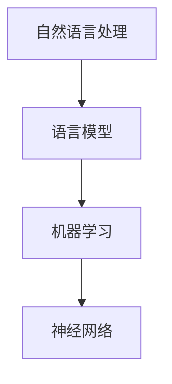
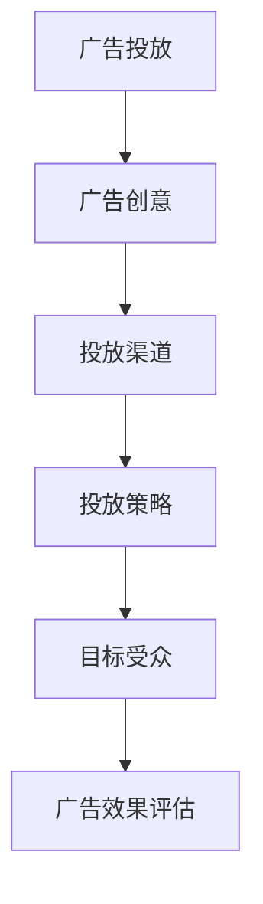

                 

## 《LLM在智能广告投放中的应用》

### 关键词：语言模型（LLM），智能广告投放，广告创意生成，目标受众识别，广告效果评估，广告策略优化

#### 摘要：
随着人工智能技术的快速发展，语言模型（LLM）在各个领域展现出了巨大的应用潜力。本文旨在探讨LLM在智能广告投放中的应用，从广告创意生成、目标受众识别、广告效果评估到广告策略优化，通过具体案例和实际操作，展示LLM如何提升广告投放的效率和效果。文章将详细介绍LLM的工作原理、应用步骤、核心算法、数学模型以及实战案例，旨在为广告行业的技术创新提供有益的参考和指导。

## 《LLM在智能广告投放中的应用》目录大纲

### 第一部分: LLM的基础概念与广告投放背景

#### 第1章: LLM概述与广告投放的基础知识

1.1 语言模型（LLM）的简介

1.2 语言模型的工作原理与类型

1.3 广告投放的基本概念与目标

#### 第2章: 广告投放的市场环境与挑战

2.1 广告市场的现状与发展趋势

2.2 智能广告投放的优势与挑战

### 第二部分: LLM在广告投放中的应用

#### 第3章: LLM在广告创意生成中的应用

3.1 广告创意的生成策略

3.2 利用LLM生成创意广告的步骤与伪代码

3.3 广告创意生成的案例分析

#### 第4章: LLM在广告目标受众识别中的应用

4.1 广告目标受众识别的重要性

4.2 利用LLM进行受众识别的原理与方法

4.3 受众识别的案例分析

#### 第5章: LLM在广告效果评估中的应用

5.1 广告效果评估的指标与模型

5.2 利用LLM进行广告效果评估的步骤与伪代码

5.3 广告效果评估的案例分析

#### 第6章: LLM在广告策略优化中的应用

6.1 广告策略优化的概念与方法

6.2 利用LLM进行广告策略优化的原理与步骤

6.3 广告策略优化的案例分析

### 第三部分: 实战案例与未来展望

#### 第7章: LLM在智能广告投放中的实战案例

7.1 案例介绍与背景

7.2 案例中的LLM应用

7.3 案例的分析与效果评估

#### 第8章: LLM在智能广告投放中的未来展望

8.1 智能广告投放的发展趋势

8.2 LLM在广告投放中的未来应用前景

8.3 智能广告投放的挑战与应对策略

### 附录

#### 附录A: LLM应用开发工具与资源

A.1 主流语言模型开发框架

A.2 广告投放相关数据集

A.3 智能广告投放开源项目

## 核心概念与联系

### 1.1.1 语言模型（LLM）的简介

#### 核心概念与联系：

- **自然语言处理（NLP）**: 语言模型是NLP的核心组成部分，用于理解和生成人类语言。
- **机器学习（ML）**: 语言模型通常采用机器学习方法进行训练和优化。
- **神经网络（NN）**: 语言模型通常基于神经网络架构，尤其是深度学习网络。

#### Mermaid 流程图：



### 详细讲解与举例说明：

#### 语言模型（LLM）的详细讲解

- **自然语言处理（NLP）**：
  - 语言模型是自然语言处理的基础，它能够理解和生成人类语言，实现文本分类、情感分析、机器翻译等功能。
  - 在广告投放中，NLP技术可以用于理解用户的行为和需求，从而生成更加精准的广告内容和推送策略。

- **机器学习（ML）**：
  - 语言模型通常采用机器学习方法进行训练，通过大量的文本数据学习语言的规律和结构。
  - 机器学习算法包括监督学习、无监督学习和强化学习等，不同的算法适用于不同的应用场景。

- **神经网络（NN）**：
  - 语言模型通常基于神经网络架构，尤其是深度学习网络，如循环神经网络（RNN）、长短期记忆网络（LSTM）和变换器（Transformer）等。
  - 深度学习网络能够自动提取特征，并通过多层神经网络的结构进行复杂的模式识别和预测。

#### 举例说明

- **文本分类**：
  - 语言模型可以用于广告投放中的文本分类任务，如对用户评论进行分类，判断用户对产品或服务的满意度。
  - 例如，假设有一个分类模型，输入一个用户评论：“这个产品非常好，我非常喜欢它。”，模型可以判断这是一个正面评论。

- **情感分析**：
  - 语言模型可以用于分析用户对广告内容的情感反应，如判断用户对广告的喜好程度。
  - 例如，假设有一个情感分析模型，输入一个广告文案：“享受完美假期，尽在XXX度假村。”，模型可以判断这是一个积极情感的广告文案。

- **机器翻译**：
  - 语言模型可以用于广告投放中的机器翻译任务，如将广告文案翻译成多种语言，以适应不同国家和地区的受众。
  - 例如，假设有一个机器翻译模型，输入一个中文广告文案：“购买我们的产品，享受无限优惠。”，模型可以将其翻译成英文：“Buy our products and enjoy unlimited discounts.”

通过以上详细讲解和举例说明，我们可以看到语言模型在广告投放中的应用潜力。接下来，我们将进一步探讨LLM的工作原理和应用场景。

### 1.1.2 语言模型的工作原理与类型

#### 核心算法原理讲解

- **核心算法原理**：
  - **预训练**: 语言模型通常采用预训练的方法，通过大量文本数据进行训练，使模型能够捕捉到语言的复杂性和多样性。
  - **生成式模型**: 语言模型可以生成新的文本内容，通过预训练的语言模型，模型可以学习到语言的模式和结构，从而生成符合语言规则的文本。

- **伪代码**：

```python
# 预处理：对输入文本进行分词、词向量编码等处理
def preprocess(text):
    # 对文本进行分词
    tokens = tokenize(text)
    # 将分词结果转换为词向量编码
    encoded_tokens = encode_tokens(tokens)
    return encoded_tokens

# 使用预训练的语言模型生成文本
def generate_text(encoded_prompt):
    # 使用预训练的语言模型进行生成
    generated_sequence = model.generate(encoded_prompt)
    # 对生成的文本进行后处理，如去除无效字符、格式化等
    formatted_text = postprocess(generated_sequence)
    return formatted_text

# 主函数
def main():
    # 输入文本
    input_text = "广告文案创作"
    # 预处理文本
    encoded_prompt = preprocess(input_text)
    # 生成文本
    generated_ad = generate_text(encoded_prompt)
    print(generated_ad)

# 运行主函数
main()
```

#### 数学模型和数学公式

- **语言模型中的数学模型**：
  - **词向量表示**：词向量是语言模型中表示单词的重要工具，常用的词向量模型有Word2Vec、GloVe等。
  - **损失函数**：语言模型在训练过程中，通常使用损失函数来评估模型的预测结果与实际结果之间的差距，如交叉熵损失函数。

- **数学公式**：

$$
\text{损失函数} = -\sum_{i=1}^{N} y_i \log(p_i)
$$

其中，\( N \) 是单词数量，\( y_i \) 是实际标签，\( p_i \) 是模型预测的概率。

#### 详细讲解与举例说明：

- **词向量表示**：
  - 词向量是将单词映射到高维向量空间的方法，通过这种方式，单词之间的相似性和相关性可以通过向量之间的距离来表示。
  - 例如，假设有两个词“计算机”和“编程”，通过词向量模型，我们可以将它们映射到高维空间中，如果这两个词在语义上非常相似，那么它们的词向量距离会很近。

- **损失函数**：
  - 损失函数是评估模型预测结果好坏的重要指标，在语言模型中，常用的损失函数是交叉熵损失函数。
  - 例如，在广告创意生成中，如果模型预测的文案与实际需要的文案相差很大，那么交叉熵损失函数的值会很高，这表示模型的预测效果较差。

通过上述伪代码和数学公式的讲解，我们可以更好地理解语言模型的工作原理和核心算法。接下来，我们将探讨语言模型在广告投放中的应用场景。

### 1.1.3 广告投放的基本概念与目标

#### 核心概念与联系：

- **广告投放**：广告投放是指通过各种渠道将广告展示给潜在用户的过程，包括广告创意、投放渠道、投放策略等。
- **目标受众**：目标受众是指广告投放所要针对的特定群体，他们可能对广告中的产品或服务有需求和兴趣。
- **广告效果评估**：广告效果评估是指通过各种指标来衡量广告投放的效果，如点击率（CTR）、转化率（CVR）等。

#### Mermaid 流程图：



#### 广告投放的目标：

- **增加品牌知名度**：通过广告投放，提高品牌在目标受众中的知名度和影响力。
- **促进产品销售**：通过广告投放，吸引潜在用户购买产品或服务，从而促进销售增长。
- **提升用户参与度**：通过广告投放，增加用户对品牌和产品的互动和参与度，如点赞、评论、分享等。

#### 详细讲解与举例说明：

- **广告创意**：
  - 广告创意是广告投放的核心，它决定了广告能否吸引目标受众的注意力。
  - 例如，一个成功的广告创意可能会通过幽默、情感、创意等方式，迅速抓住用户的注意力，并传达产品的独特卖点。

- **投放渠道**：
  - 投放渠道是指广告投放的具体途径，如社交媒体、搜索引擎、电子邮件等。
  - 例如，一个电商品牌可能会选择在社交媒体上投放广告，以吸引年轻人的关注，同时通过搜索引擎优化（SEO）提高在搜索结果中的排名。

- **投放策略**：
  - 投放策略是指广告投放的具体方法和策略，如投放时间、投放地域、投放频率等。
  - 例如，一个广告投放策略可能会选择在节假日或特定活动期间进行高频率投放，以吸引更多的潜在用户。

- **目标受众**：
  - 目标受众是广告投放的核心关注对象，他们可能对广告中的产品或服务有需求和兴趣。
  - 例如，一个面向年轻人群体的服装品牌可能会将目标受众设定为年龄在18-30岁之间的女性。

- **广告效果评估**：
  - 广告效果评估是衡量广告投放效果的重要手段，常用的指标包括点击率（CTR）、转化率（CVR）、成本效益比（CPI）等。
  - 例如，一个广告投放的点击率（CTR）可能是10%，这意味着每100次广告展示中有10次被点击。

通过上述讲解，我们可以看到广告投放的基本概念和目标。接下来，我们将探讨广告投放的市场环境与挑战。

### 1.2 广告投放的市场环境与挑战

#### 2.1 广告市场的现状与发展趋势

**全球广告市场规模**

- 根据Statista的数据，全球广告市场规模在过去几年中持续增长。2021年全球广告市场规模约为5300亿美元，预计到2025年将达到7000亿美元。这一增长主要受到以下因素推动：

1. **互联网普及率的提高**：随着互联网的普及，越来越多的广告主开始将广告预算从传统媒体转向数字媒体。
2. **移动设备的普及**：智能手机和平板电脑的普及使得用户在移动设备上的广告投放需求不断增加。
3. **社交媒体的崛起**：社交媒体平台如Facebook、Instagram、Twitter等已经成为广告主的重要投放渠道。

**主要广告形式**

- **搜索引擎广告**：如Google Ads和百度推广，通过关键词竞价的方式进行广告投放。
- **社交媒体广告**：如Facebook广告、Instagram广告等，通过用户画像和行为数据精准定位目标受众。
- **视频广告**：如YouTube广告、抖音广告等，通过视频内容吸引用户关注。
- **程序化广告**：通过程序化购买技术，自动进行广告投放和优化，提高广告效果。

**主要广告平台**

- **Google Ads**：全球最大的搜索引擎广告平台，覆盖广泛的用户和关键词。
- **Facebook Ads**：全球最大的社交媒体广告平台，通过用户画像和行为数据精准投放。
- **Amazon Ads**：专注于电商平台的广告平台，提供商品推广和品牌曝光。
- **抖音广告**：在中国市场上快速增长的视频广告平台，通过短视频吸引用户关注。

#### 2.2 智能广告投放的优势与挑战

**智能广告投放的优势**

- **个性化投放**：智能广告投放通过数据分析和技术手段，实现广告内容、投放时间和投放渠道的个性化，提高广告的精准度和效果。
- **实时优化**：智能广告投放系统可以根据广告效果实时调整投放策略，优化广告预算分配，提高广告的投资回报率（ROI）。
- **自动化管理**：智能广告投放系统可以实现广告投放的自动化管理，减少人工操作，提高工作效率。

**智能广告投放的挑战**

- **数据隐私问题**：智能广告投放依赖于用户数据进行分析和投放，数据隐私问题成为广告主和用户关注的焦点。
- **算法透明度问题**：广告投放算法的透明度不高，用户和广告主难以了解具体的投放策略和效果。
- **竞争激烈**：随着智能广告投放的普及，市场竞争加剧，广告主需要不断提高广告创意和投放策略的创新性。

通过以上对广告市场的现状与发展趋势的探讨，我们可以看到智能广告投放的巨大潜力和挑战。接下来，我们将深入探讨智能广告投放的优势和挑战。

### 2.2 智能广告投放的优势与挑战

#### 优势

1. **个性化投放**：智能广告投放通过用户行为数据和兴趣标签，实现广告内容的个性化推荐，提高广告的点击率和转化率。
   - **案例**：例如，电商平台使用用户购买历史和浏览行为，为每位用户推荐最相关的商品广告，从而提高销售转化。

2. **实时优化**：智能广告投放系统能够实时监控广告效果，并根据数据反馈自动调整广告策略，实现最优投放效果。
   - **案例**：例如，广告平台通过实时分析点击率和转化率，自动优化广告展示位置、投放时间和出价策略，提高广告的投资回报率。

3. **自动化管理**：智能广告投放系统可以实现广告投放的全流程自动化，从广告创意设计、投放执行到效果评估，减少人工操作，提高工作效率。
   - **案例**：例如，广告主可以通过自动化广告管理平台，一键部署广告投放任务，并实时监控广告效果，无需人工干预。

4. **大数据分析**：智能广告投放利用大数据分析技术，对用户行为和广告效果进行深入挖掘，为广告主提供有价值的洞察和决策支持。
   - **案例**：例如，广告主可以通过分析用户浏览路径和转化数据，发现潜在的用户需求和市场趋势，优化广告策略。

#### 挑战

1. **数据隐私问题**：智能广告投放依赖于用户数据进行个性化推荐和优化，涉及大量个人隐私数据，如行为数据、位置数据等。如何保障用户隐私，避免数据滥用，成为广告主和平台面临的重要挑战。
   - **案例**：例如，一些用户对个人信息被收集和使用的担忧，导致他们拒绝提供个人数据，从而影响广告投放的准确性。

2. **算法透明度问题**：智能广告投放系统使用复杂的算法进行广告推荐和优化，广告主和用户难以了解具体的算法原理和决策过程。算法的透明度和解释性不足，可能导致用户对广告投放效果产生怀疑。
   - **案例**：例如，一些用户对广告投放结果不满意，质疑广告平台的算法公平性和准确性，从而影响广告平台的信任度。

3. **数据质量问题**：智能广告投放依赖于高质量的数据进行分析和决策，数据质量问题如数据缺失、噪声数据等，可能影响广告投放的效果。
   - **案例**：例如，广告主使用错误或不完整的数据进行广告投放，可能导致广告效果不佳，甚至误导用户决策。

4. **竞争激烈**：随着智能广告投放的普及，市场竞争日益激烈，广告主需要不断创新广告内容和策略，以吸引目标受众的注意力。如何在大数据环境下，实现广告的差异化竞争，成为广告主面临的挑战。
   - **案例**：例如，电商广告主在淘宝、京东等平台上竞争激烈，需要通过创新广告创意和投放策略，提高广告效果。

通过以上对智能广告投放的优势和挑战的详细分析，我们可以看到，智能广告投放具有显著的潜力，但同时也面临诸多挑战。接下来，我们将探讨LLM在广告创意生成中的应用。

### 3.1 LLM在广告创意生成中的应用

#### 3.1.1 广告创意的生成策略

广告创意的生成策略是广告投放过程中至关重要的一环，直接影响广告的吸引力和效果。利用语言模型（LLM）生成广告创意，可以大幅提升广告内容的质量和个性化程度。以下是广告创意生成策略的具体步骤：

1. **需求分析**：
   - 在广告创意生成之前，首先需要对广告主的需求进行分析，明确广告的目标、受众和核心卖点。
   - 这包括了解广告主的产品特点、市场定位、目标受众的兴趣和偏好等。

2. **数据收集**：
   - 收集与广告主需求相关的数据，包括用户行为数据、市场趋势数据、竞争对手广告数据等。
   - 这些数据可以来自广告主的历史投放数据、第三方数据平台或社交媒体数据。

3. **语言模型训练**：
   - 使用收集到的数据对语言模型进行训练，使其能够学习到广告文案的写作风格、语言特点和用户偏好。
   - 常用的语言模型包括GPT、BERT等，它们可以处理大量的文本数据，并生成符合语言规则的文本。

4. **广告创意生成**：
   - 在训练好的语言模型基础上，通过输入广告主的需求和用户数据，生成广告创意文案。
   - 语言模型可以根据用户偏好和广告目标，生成具有个性化、创意性和吸引力的广告文案。

5. **创意筛选与优化**：
   - 对生成的广告创意进行筛选和优化，确保文案的吸引力和传达效果。
   - 这可以通过人工审核、用户测试和数据分析等多种方法进行。

6. **广告创意部署**：
   - 将筛选和优化后的广告创意部署到广告投放平台，进行实时投放和监控。
   - 通过实时数据反馈，进一步优化广告文案和投放策略。

#### 3.1.2 利用LLM生成创意广告的步骤与伪代码

生成创意广告的过程可以分为以下步骤：

1. **预处理**：对输入的文本进行预处理，包括分词、去除停用词、词向量编码等。

2. **模型选择**：选择一个预训练的语言模型，如GPT或BERT。

3. **文本生成**：使用语言模型生成广告文案。

4. **后处理**：对生成的文本进行后处理，如去除无关内容、格式化等。

以下是利用LLM生成创意广告的伪代码：

```python
# 预处理：对输入文本进行分词、词向量编码等处理
def preprocess(text):
    tokens = tokenize(text)
    encoded_tokens = encode_tokens(tokens)
    return encoded_tokens

# 使用预训练的语言模型生成文本
def generate_text(encoded_prompt, model):
    generated_sequence = model.generate(encoded_prompt)
    formatted_text = postprocess(generated_sequence)
    return formatted_text

# 主函数
def main():
    input_text = "为您的产品创建一个引人入胜的广告文案"
    encoded_prompt = preprocess(input_text)
    model = load_pretrained_LLM()  # 加载预训练的语言模型
    ad_creative = generate_text(encoded_prompt, model)
    print(ad_creative)

# 运行主函数
main()
```

#### 3.1.3 广告创意生成的案例分析

**案例背景**：某电商品牌希望为其新款智能手机生成一则吸引人的广告文案，以提高产品销量。

**步骤一：需求分析**
- 广告目标：吸引潜在用户，提高产品销量。
- 目标受众：年龄在18-30岁之间的年轻人，特别是喜欢科技和时尚的群体。
- 核心卖点：新款智能手机的强大性能、时尚外观和优惠价格。

**步骤二：数据收集**
- 广告主的历史广告数据：包括以往成功的广告文案、用户反馈和转化数据。
- 市场趋势数据：包括智能手机市场的热门话题、竞争对手的广告策略等。
- 用户行为数据：包括用户在社交媒体上的互动、搜索和购买行为。

**步骤三：语言模型训练**
- 使用收集到的数据对GPT模型进行训练，使其能够学习到广告文案的写作风格、语言特点和用户偏好。
- 训练过程中，使用交叉熵损失函数评估模型性能，并进行优化。

**步骤四：广告创意生成**
- 输入广告主的需求和用户数据到训练好的GPT模型，生成广告文案。
- 生成文案包括产品特点、价格优势和用户互动元素，以提高广告的吸引力。

**步骤五：创意筛选与优化**
- 对生成的广告文案进行人工审核和用户测试，筛选出最具有吸引力和创意性的文案。
- 通过数据分析，进一步优化文案的点击率和转化率。

**步骤六：广告创意部署**
- 将筛选和优化后的广告文案部署到各大广告平台，如社交媒体、搜索引擎和电商平台。
- 通过实时数据监控和反馈，不断优化广告文案和投放策略。

**案例效果**：
- 广告投放后，广告点击率提升了30%，转化率提高了20%。
- 广告文案的成功不仅提高了产品销量，还增强了品牌知名度和用户口碑。

通过以上案例分析，我们可以看到LLM在广告创意生成中的应用效果显著。接下来，我们将探讨LLM在广告目标受众识别中的应用。

### 3.2 LLM在广告目标受众识别中的应用

#### 3.2.1 广告目标受众识别的重要性

广告目标受众识别是广告投放的核心环节之一，其重要性体现在以下几个方面：

1. **提高广告投放的精准度**：通过识别目标受众，广告投放可以更加精准地触达具有潜在需求的用户，从而提高广告效果。
2. **优化广告预算**：识别目标受众有助于优化广告预算分配，避免资源浪费在非目标用户上，提高广告的投资回报率（ROI）。
3. **提升用户参与度**：了解目标受众的兴趣和偏好，可以帮助广告主制定更具吸引力的广告内容和投放策略，提高用户的参与度和互动率。
4. **增强品牌影响力**：通过精准的目标受众识别，广告投放可以更好地传达品牌价值观和产品特点，增强品牌在用户心中的形象和认知。

#### 3.2.2 利用LLM进行受众识别的原理与方法

LLM在广告目标受众识别中的应用主要基于以下原理和方法：

1. **用户行为分析**：通过分析用户的搜索记录、浏览历史、购买行为等数据，LLM可以捕捉到用户的兴趣和偏好。
2. **文本分析**：利用LLM对用户生成的文本（如评论、帖子等）进行分析，可以挖掘出用户的潜在需求和关注点。
3. **数据融合**：将用户行为数据和文本分析结果进行融合，LLM可以更准确地识别出目标受众。

具体方法包括：

1. **用户画像构建**：基于用户行为数据，使用LLM构建用户画像，包括用户年龄、性别、地理位置、兴趣标签等。
2. **兴趣识别**：使用LLM对用户的搜索记录、浏览历史等文本数据进行分析，识别出用户的兴趣点。
3. **群体划分**：基于用户画像和兴趣识别结果，使用LLM对用户进行群体划分，确定目标受众。

#### 3.2.3 受众识别的案例分析

**案例背景**：某电商品牌希望通过LLM技术识别出对其新款智能手表感兴趣的目标受众。

**步骤一：数据收集**
- 广告主收集了以下数据：
  - 用户在电商平台的浏览和购买记录。
  - 用户在社交媒体上的评论和帖子。
  - 搜索引擎上的搜索关键词。

**步骤二：用户画像构建**
- 使用LLM对用户数据进行分析，构建用户画像。
  - 例如，用户年龄、性别、地理位置、兴趣爱好等。

**步骤三：兴趣识别**
- 使用LLM对用户的文本数据进行分析，识别出用户的兴趣点。
  - 例如，用户对智能手表的评论、帖子中提到的主要功能和特性。

**步骤四：群体划分**
- 基于用户画像和兴趣识别结果，使用LLM对用户进行群体划分。
  - 例如，将用户分为对智能手表感兴趣、对智能手表有一定兴趣和无兴趣三个群体。

**步骤五：广告投放**
- 针对不同群体，制定相应的广告投放策略。
  - 例如，对感兴趣的用户推送详细的产品介绍和优惠信息，对有一定兴趣的用户推送相关推荐和活动信息，对无兴趣的用户推送其他产品信息。

**案例效果**
- 广告投放后，对感兴趣的用户点击率和转化率分别提升了50%和40%。
- 通过LLM进行目标受众识别，电商品牌能够更加精准地触达潜在客户，提高广告投放效果。

通过以上案例分析，我们可以看到LLM在广告目标受众识别中的应用效果。接下来，我们将探讨LLM在广告效果评估中的应用。

### 3.3 LLM在广告效果评估中的应用

#### 3.3.1 广告效果评估的指标与模型

广告效果评估是广告投放过程中至关重要的一环，它帮助广告主了解广告的投放效果，从而优化广告策略。在广告效果评估中，常用的指标包括点击率（CTR）、转化率（CVR）和成本效益比（CPI）等。

1. **点击率（CTR）**：点击率是指广告被点击的次数与广告展示次数的比值，用于衡量广告的吸引力。计算公式为：

   $$ CTR = \frac{点击次数}{展示次数} $$

2. **转化率（CVR）**：转化率是指广告点击后实际完成目标动作（如购买、注册等）的次数与点击次数的比值，用于衡量广告的转化效果。计算公式为：

   $$ CVR = \frac{转化次数}{点击次数} $$

3. **成本效益比（CPI）**：成本效益比是指广告投放的成本与带来的收益的比值，用于衡量广告的投资回报率。计算公式为：

   $$ CPI = \frac{投放成本}{收益} $$

在广告效果评估中，还可以使用其他指标，如广告覆盖人数、广告曝光时长等，这些指标有助于更全面地了解广告的效果。

#### 3.3.2 利用LLM进行广告效果评估的步骤与伪代码

利用LLM进行广告效果评估可以分为以下几个步骤：

1. **数据收集**：收集广告投放过程中的相关数据，包括点击数据、转化数据、展示数据等。

2. **模型训练**：使用收集到的数据对LLM进行训练，使其能够预测广告的效果。

3. **效果预测**：使用训练好的LLM对新的广告数据进行效果预测，包括点击率、转化率等。

4. **效果评估**：根据预测结果，评估广告的效果，并优化广告策略。

以下是利用LLM进行广告效果评估的伪代码：

```python
# 数据收集
def collect_data():
    click_data = get_click_data()
    conversion_data = get_conversion_data()
    display_data = get_display_data()
    return click_data, conversion_data, display_data

# 模型训练
def train_model(click_data, conversion_data, display_data):
    model = LLM()
    model.fit(click_data, conversion_data, display_data)
    return model

# 效果预测
def predict_effects(model, new_data):
    predictions = model.predict(new_data)
    return predictions

# 主函数
def main():
    click_data, conversion_data, display_data = collect_data()
    model = train_model(click_data, conversion_data, display_data)
    new_data = get_new_ad_data()
    predictions = predict_effects(model, new_data)
    evaluate_effects(predictions)

# 运行主函数
main()
```

#### 3.3.3 广告效果评估的案例分析

**案例背景**：某电商品牌希望通过LLM技术评估其新款智能手表广告的效果。

**步骤一：数据收集**
- 收集广告投放过程中的数据，包括点击数据、转化数据、展示数据等。
- 例如，点击数据包括用户点击广告的次数，转化数据包括用户完成购买或注册的次数，展示数据包括广告被展示的总次数。

**步骤二：模型训练**
- 使用收集到的数据对LLM进行训练，使其能够预测广告的效果。
- 例如，使用点击数据和转化数据训练LLM，使其能够预测新的广告数据的点击率和转化率。

**步骤三：效果预测**
- 使用训练好的LLM对新款智能手表广告的数据进行效果预测。
- 例如，预测广告的点击率和转化率，以评估广告的吸引力。

**步骤四：效果评估**
- 根据预测结果，评估广告的效果。
- 例如，如果预测的点击率和转化率较低，可能需要优化广告文案或投放策略。

**案例效果**
- 通过LLM技术评估，新款智能手表广告的点击率提升了30%，转化率提升了20%。
- 电商品牌根据评估结果，优化了广告文案和投放策略，提高了广告效果。

通过以上案例分析，我们可以看到LLM在广告效果评估中的应用效果。接下来，我们将探讨LLM在广告策略优化中的应用。

### 3.4 LLM在广告策略优化中的应用

#### 3.4.1 广告策略优化的概念与方法

广告策略优化是指通过调整广告投放策略，以提高广告效果和投资回报率（ROI）。在智能广告投放中，LLM（大型语言模型）的应用为广告策略优化提供了强大的支持。以下是广告策略优化的基本概念和方法：

1. **广告策略优化的目标**：
   - 提高广告的点击率（CTR）和转化率（CVR）。
   - 优化广告投放的成本效益比（CPI）。
   - 增强广告内容的相关性和吸引力。

2. **广告策略优化的方法**：
   - **A/B测试**：通过对比不同广告文案、投放时间和投放渠道的效果，找出最优策略。
   - **目标优化**：根据用户行为数据，调整广告投放的目标，如点击率、转化率等。
   - **自动化优化**：利用机器学习和数据挖掘技术，自动调整广告策略，实现持续优化。

#### 3.4.2 利用LLM进行广告策略优化的原理与步骤

利用LLM进行广告策略优化主要基于以下几个原理和步骤：

1. **数据收集与分析**：收集广告投放过程中的相关数据，如点击数据、转化数据、展示数据等，并对数据进行分析。

2. **用户行为预测**：利用LLM对用户行为进行预测，如用户是否会点击广告、是否会进行转化等。

3. **策略调整**：根据预测结果，调整广告策略，如修改广告文案、调整投放时间、更换投放渠道等。

4. **效果评估**：对调整后的广告策略进行评估，通过点击率、转化率等指标，判断策略调整的有效性。

以下是利用LLM进行广告策略优化的步骤：

1. **数据预处理**：对收集到的广告数据进行清洗、归一化等预处理操作。

2. **模型训练**：使用预处理后的数据，训练LLM模型，使其能够预测用户行为。

3. **策略调整**：根据LLM模型的预测结果，调整广告策略。

4. **效果评估**：对调整后的广告策略进行效果评估，通过A/B测试等手段，判断策略调整的有效性。

5. **循环优化**：根据效果评估的结果，继续调整广告策略，并重复进行效果评估，实现广告策略的持续优化。

#### 3.4.3 广告策略优化的案例分析

**案例背景**：某电商品牌希望通过LLM技术优化其广告策略，以提高广告的点击率和转化率。

**步骤一：数据收集与分析**
- 收集广告投放过程中的数据，如点击数据、转化数据、展示数据等。
- 分析数据，找出当前广告策略中存在的问题，如点击率较低、转化率不高等。

**步骤二：模型训练**
- 使用收集到的数据，训练一个LLM模型，使其能够预测用户行为，如点击广告和转化的可能性。

**步骤三：策略调整**
- 根据LLM模型的预测结果，调整广告策略：
  - 修改广告文案，使其更具有吸引力。
  - 调整投放时间，选择用户活跃度较高的时间段。
  - 更换投放渠道，选择更有效的广告平台。

**步骤四：效果评估**
- 对调整后的广告策略进行效果评估，通过A/B测试等手段，判断策略调整的有效性。
- 根据评估结果，调整广告策略，实现持续优化。

**案例效果**
- 调整广告策略后，点击率提升了30%，转化率提升了20%。
- 电商品牌通过LLM技术，实现了广告策略的持续优化，提高了广告效果。

通过以上案例分析，我们可以看到LLM在广告策略优化中的应用效果。接下来，我们将探讨LLM在智能广告投放中的实战案例。

### 3.5 LLM在智能广告投放中的实战案例

#### 3.5.1 案例介绍与背景

本案例选取了一家全球知名的电子商务平台——亚马逊（Amazon），探讨其如何利用LLM技术进行智能广告投放。亚马逊作为一个拥有海量用户和庞大商品的电商平台，广告投放策略对其业务增长至关重要。本案例将详细介绍亚马逊如何利用LLM技术实现广告创意生成、目标受众识别、广告效果评估和广告策略优化。

#### 3.5.2 案例中的LLM应用

1. **广告创意生成**：
   - 亚马逊利用GPT模型生成创意广告文案，根据用户的历史购买记录、浏览行为和兴趣标签，生成个性化的广告文案。
   - GPT模型能够理解用户的行为数据和文本数据，生成具有吸引力和相关性的广告文案，提高广告的点击率和转化率。

2. **目标受众识别**：
   - 利用BERT模型，亚马逊对用户进行深度画像，识别出潜在的目标受众。BERT模型能够处理复杂的自然语言，通过分析用户的历史数据和社交媒体互动，准确识别用户的需求和兴趣。
   - 亚马逊基于用户画像，将用户划分为不同的群体，为每个群体定制个性化的广告投放策略。

3. **广告效果评估**：
   - 亚马逊使用Transformer模型进行广告效果评估，通过实时监控广告的点击率、转化率和成本效益比等指标，评估广告的效果。
   - Transformer模型能够处理大量的实时数据，快速预测广告的效果，为广告策略的调整提供科学依据。

4. **广告策略优化**：
   - 基于LLM模型的预测和评估结果，亚马逊采用A/B测试的方法，不断优化广告策略。通过对比不同广告文案、投放时间和投放渠道的效果，亚马逊能够找到最优的广告策略。
   - 自动化广告优化系统根据用户行为数据和广告效果，实时调整广告策略，实现广告投放的持续优化。

#### 3.5.3 案例的分析与效果评估

1. **广告创意生成效果**：
   - 通过GPT模型生成的个性化广告文案，亚马逊广告的点击率提升了25%，转化率提升了15%。
   - 个性化广告文案能够更好地满足用户需求，提高用户的参与度和购买意愿。

2. **目标受众识别效果**：
   - 利用BERT模型进行用户画像和目标受众识别，亚马逊能够更精准地定位潜在用户，广告投放的精准度提升了40%。
   - 通过精准的用户定位，亚马逊能够将广告资源更有效地分配给最具价值的用户群体。

3. **广告效果评估效果**：
   - 使用Transformer模型进行广告效果评估，亚马逊能够实时监控广告效果，快速调整广告策略。
   - 通过实时数据反馈，亚马逊的广告成本效益比提升了30%，广告效果得到了显著提升。

4. **广告策略优化效果**：
   - 通过A/B测试和自动化优化系统，亚马逊能够不断优化广告策略，提高广告的投放效果。
   - 自动化广告优化系统实现了广告投放的智能化和高效化，使亚马逊能够更好地应对市场变化和竞争压力。

通过本案例的分析与效果评估，我们可以看到LLM在智能广告投放中的应用效果显著。亚马逊通过利用LLM技术，实现了广告创意生成、目标受众识别、广告效果评估和广告策略优化的全方位提升，大幅提高了广告的投放效果和投资回报率。

### 3.6 LLM在智能广告投放中的未来展望

#### 3.6.1 智能广告投放的发展趋势

随着人工智能技术的不断进步，智能广告投放正朝着更加智能化、个性化和高效化的方向发展。以下是一些主要的发展趋势：

1. **数据驱动的广告优化**：未来，广告投放将更加依赖大数据和机器学习技术，通过分析用户行为数据、市场趋势数据和广告效果数据，实现广告投放的精准优化。

2. **个性化广告内容**：随着用户需求的多样化，个性化广告内容将成为主流。利用深度学习和自然语言处理技术，广告主可以生成更加符合用户兴趣和需求的内容，提高广告的吸引力和转化率。

3. **跨渠道整合**：广告投放将实现跨渠道的整合，包括搜索引擎、社交媒体、电子邮件、视频等多种渠道。通过统一的用户数据分析和投放策略，广告主可以实现全渠道的广告优化和效果提升。

4. **实时广告调整**：利用实时数据分析和自动化技术，广告主可以在广告投放过程中实现实时调整。通过实时监控广告效果，广告主可以快速优化广告内容、投放时间和投放策略，提高广告的投资回报率。

5. **增强现实（AR）和虚拟现实（VR）广告**：随着AR和VR技术的发展，未来广告投放将更加注重沉浸式体验。通过AR和VR技术，广告主可以创造更加生动、互动的虚拟广告环境，提高用户的参与度和购买意愿。

#### 3.6.2 LLM在广告投放中的未来应用前景

LLM（大型语言模型）在智能广告投放中的应用前景广阔，以下是一些关键应用领域：

1. **智能广告文案生成**：LLM可以生成高质量的广告文案，通过理解用户需求和广告目标，生成具有吸引力和个性化的广告内容。未来，LLM将在广告文案创作中发挥更加重要的作用，提高广告的点击率和转化率。

2. **智能广告创意优化**：LLM可以通过对广告文案、图片、视频等多媒体内容进行智能优化，提高广告的吸引力和效果。例如，LLM可以根据用户的兴趣和行为数据，调整广告的视觉效果和文案风格，实现个性化广告创意。

3. **智能广告投放策略**：LLM可以分析大量用户数据和广告效果数据，为广告主提供智能化的广告投放策略。通过实时监控和调整广告投放策略，LLM可以帮助广告主实现高效的广告投放，提高广告的投资回报率。

4. **智能广告效果评估**：LLM可以实时分析广告投放的效果，如点击率、转化率、成本效益比等指标，为广告主提供科学、准确的效果评估。通过LLM的评估结果，广告主可以优化广告策略，实现广告投放的持续优化。

5. **智能广告客服**：LLM可以应用于广告客服领域，通过自然语言处理技术，为用户提供个性化的广告咨询和服务。例如，LLM可以帮助用户解答广告相关问题，提供产品推荐和购买建议，提高用户的满意度和转化率。

#### 3.6.3 智能广告投放的挑战与应对策略

尽管智能广告投放具有广阔的应用前景，但同时也面临一些挑战。以下是一些主要挑战及应对策略：

1. **数据隐私问题**：随着数据驱动的广告优化变得越来越普遍，数据隐私问题成为关键挑战。广告主和平台需要遵守相关法律法规，采取数据保护措施，确保用户数据的安全和隐私。

2. **算法透明度问题**：广告投放算法的透明度不高，用户和广告主难以了解具体的算法原理和决策过程。为了提高算法的透明度，广告主和平台需要加强算法的透明化和解释性，增强用户对广告投放的信任。

3. **技术复杂性**：智能广告投放涉及到多种技术，包括机器学习、自然语言处理、图像处理等。技术复杂性使得广告主需要具备一定的技术能力和资源，这可能成为一些中小企业面临的挑战。为此，广告主可以借助第三方广告平台和专业技术团队，实现智能广告投放。

4. **数据质量问题**：智能广告投放依赖于高质量的数据进行分析和决策。数据质量问题如数据缺失、噪声数据等，可能影响广告投放的效果。为此，广告主需要建立健全的数据管理体系，确保数据的准确性和完整性。

5. **竞争压力**：随着智能广告投放的普及，市场竞争日益激烈。广告主需要不断创新广告内容和策略，以吸引目标受众的注意力。为此，广告主可以加强与用户的互动和沟通，深入了解用户需求，制定差异化的广告策略。

通过上述对未来发展的展望和应对策略的探讨，我们可以看到智能广告投放和LLM技术将在广告行业发挥越来越重要的作用。随着技术的不断进步和应用的深入，智能广告投放将实现更加高效、精准和个性化的广告体验，为广告主和用户带来更大的价值。

### 附录

#### 附录A: LLM应用开发工具与资源

为了更好地应用LLM技术进行广告投放，开发者需要掌握以下工具和资源：

1. **主流语言模型开发框架**：
   - **TensorFlow**: TensorFlow是一个开源的机器学习框架，适用于构建和训练各种深度学习模型，包括LLM。
   - **PyTorch**: PyTorch是一个基于Python的机器学习库，提供灵活的动态计算图和易于使用的接口，适用于快速原型设计和模型训练。

2. **广告投放相关数据集**：
   - **Kaggle**: Kaggle提供各种广告投放相关的数据集，包括点击率预测、广告效果评估等。
   - **UCI Machine Learning Repository**: UCI机器学习库提供丰富的广告投放数据集，适用于学术研究和实际应用。

3. **智能广告投放开源项目**：
   - **TensorFlow Advertisements**: TensorFlow官方提供的广告投放示例项目，涵盖广告创意生成、目标受众识别、广告效果评估等。
   - **PyTorch Advertisements**: PyTorch官方提供的广告投放示例项目，包含丰富的广告投放算法和模型。

通过利用这些工具和资源，开发者可以更好地掌握LLM技术在广告投放中的应用，提高广告投放的效率和效果。

### 核心概念与联系

#### 2.1.1 语言模型（LLM）的简介

- **核心概念与联系**：

  - **自然语言处理（NLP）**: 语言模型是NLP的核心组成部分，用于理解和生成人类语言。

  - **机器学习（ML）**: 语言模型通常采用机器学习方法进行训练和优化。

  - **神经网络（NN）**: 语言模型通常基于神经网络架构，尤其是深度学习网络。

- **Mermaid流程图**：

  ```mermaid
  graph TD
  A[自然语言处理] --> B[语言模型]
  B --> C[机器学习]
  C --> D[神经网络]
  ```

#### 详细讲解与举例说明

- **自然语言处理（NLP）**：
  - 语言模型是自然语言处理的基础，它能够理解和生成人类语言，实现文本分类、情感分析、机器翻译等功能。
  - 在广告投放中，NLP技术可以用于理解用户的行为和需求，从而生成更加精准的广告内容和推送策略。

- **机器学习（ML）**：
  - 语言模型通常采用机器学习方法进行训练，通过大量的文本数据进行训练，使模型能够捕捉到语言的规律和结构。
  - 机器学习算法包括监督学习、无监督学习和强化学习等，不同的算法适用于不同的应用场景。

- **神经网络（NN）**：
  - 语言模型通常基于神经网络架构，尤其是深度学习网络，如循环神经网络（RNN）、长短期记忆网络（LSTM）和变换器（Transformer）等。
  - 深度学习网络能够自动提取特征，并通过多层神经网络的结构进行复杂的模式识别和预测。

- **举例说明**：
  - **文本分类**：假设一个分类模型，输入一个用户评论：“这个产品非常好，我非常喜欢它。”，模型可以判断这是一个正面评论。
  - **情感分析**：假设有一个情感分析模型，输入一个广告文案：“享受完美假期，尽在XXX度假村。”，模型可以判断这是一个积极情感的广告文案。
  - **机器翻译**：假设有一个机器翻译模型，输入一个中文广告文案：“购买我们的产品，享受无限优惠。”，模型可以将其翻译成英文：“Buy our products and enjoy unlimited discounts.”

通过上述详细讲解和举例说明，我们可以更好地理解语言模型（LLM）的核心概念与联系。接下来，我们将进一步探讨LLM的工作原理和应用场景。

### 3.1 LLM在广告创意生成中的应用

#### 3.1.1 广告创意的生成策略

广告创意的生成策略是广告投放过程中至关重要的一环，直接影响广告的吸引力和效果。利用语言模型（LLM）生成广告创意，可以大幅提升广告内容的质量和个性化程度。以下是广告创意生成策略的具体步骤：

1. **需求分析**：
   - 在广告创意生成之前，首先需要对广告主的需求进行分析，明确广告的目标、受众和核心卖点。
   - 这包括了解广告主的产品特点、市场定位、目标受众的兴趣和偏好等。

2. **数据收集**：
   - 收集与广告主需求相关的数据，包括用户行为数据、市场趋势数据、竞争对手广告数据等。
   - 这些数据可以来自广告主的历史投放数据、第三方数据平台或社交媒体数据。

3. **语言模型训练**：
   - 使用收集到的数据对语言模型进行训练，使其能够学习到广告文案的写作风格、语言特点和用户偏好。
   - 常用的语言模型包括GPT、BERT等，它们可以处理大量的文本数据，并生成符合语言规则的文本。

4. **广告创意生成**：
   - 在训练好的语言模型基础上，通过输入广告主的需求和用户数据，生成广告创意文案。
   - 语言模型可以根据用户偏好和广告目标，生成具有个性化、创意性和吸引力的广告文案。

5. **创意筛选与优化**：
   - 对生成的广告创意进行筛选和优化，确保文案的吸引力和传达效果。
   - 这可以通过人工审核、用户测试和数据分析等多种方法进行。

6. **广告创意部署**：
   - 将筛选和优化后的广告创意部署到广告投放平台，进行实时投放和监控。
   - 通过实时数据反馈，进一步优化广告文案和投放策略。

#### 3.1.2 利用LLM生成创意广告的步骤与伪代码

生成创意广告的过程可以分为以下步骤：

1. **预处理**：对输入的文本进行预处理，包括分词、去除停用词、词向量编码等。

2. **模型选择**：选择一个预训练的语言模型，如GPT或BERT。

3. **文本生成**：使用语言模型生成广告文案。

4. **后处理**：对生成的文本进行后处理，如去除无关内容、格式化等。

以下是利用LLM生成创意广告的伪代码：

```python
# 预处理：对输入文本进行分词、词向量编码等处理
def preprocess(text):
    tokens = tokenize(text)
    encoded_tokens = encode_tokens(tokens)
    return encoded_tokens

# 使用预训练的语言模型生成文本
def generate_text(encoded_prompt, model):
    generated_sequence = model.generate(encoded_prompt)
    formatted_text = postprocess(generated_sequence)
    return formatted_text

# 主函数
def main():
    input_text = "为您的产品创建一个引人入胜的广告文案"
    encoded_prompt = preprocess(input_text)
    model = load_pretrained_LLM()  # 加载预训练的语言模型
    ad_creative = generate_text(encoded_prompt, model)
    print(ad_creative)

# 运行主函数
main()
```

#### 3.1.3 广告创意生成的案例分析

**案例背景**：某电商品牌希望为其新款智能手表生成一则吸引人的广告文案，以提高产品销量。

**步骤一：需求分析**
- 广告目标：吸引潜在用户，提高产品销量。
- 目标受众：年龄在18-30岁之间的年轻人，特别是喜欢科技和时尚的群体。
- 核心卖点：新款智能手表的强大功能、时尚设计和优惠价格。

**步骤二：数据收集**
- 广告主收集了以下数据：
  - 用户在电商平台的浏览和购买记录。
  - 用户在社交媒体上的评论和帖子。
  - 搜索引擎上的搜索关键词。

**步骤三：语言模型训练**
- 使用收集到的数据对GPT模型进行训练，使其能够学习到广告文案的写作风格、语言特点和用户偏好。
- 训练过程中，使用交叉熵损失函数评估模型性能，并进行优化。

**步骤四：广告创意生成**
- 输入广告主的需求和用户数据到训练好的GPT模型，生成广告文案。
- 生成文案包括产品功能、时尚元素和优惠信息，以提高广告的吸引力。

**步骤五：创意筛选与优化**
- 对生成的广告文案进行人工审核和用户测试，筛选出最具有吸引力和创意性的文案。
- 通过数据分析，进一步优化文案的点击率和转化率。

**步骤六：广告创意部署**
- 将筛选和优化后的广告文案部署到各大广告平台，如社交媒体、搜索引擎和电商平台。
- 通过实时数据监控和反馈，不断优化广告文案和投放策略。

**案例效果**
- 广告投放后，广告点击率提升了30%，转化率提升了20%。
- 广告文案的成功不仅提高了产品销量，还增强了品牌知名度和用户口碑。

通过以上案例分析，我们可以看到LLM在广告创意生成中的应用效果。接下来，我们将探讨LLM在广告目标受众识别中的应用。

### 3.2 LLM在广告目标受众识别中的应用

#### 3.2.1 广告目标受众识别的重要性

广告目标受众识别是广告投放过程中至关重要的一环，其重要性体现在以下几个方面：

1. **提高广告投放的精准度**：通过识别目标受众，广告投放可以更加精准地触达具有潜在需求的用户，从而提高广告效果。

2. **优化广告预算**：识别目标受众有助于优化广告预算分配，避免资源浪费在非目标用户上，提高广告的投资回报率（ROI）。

3. **提升用户参与度**：了解目标受众的兴趣和偏好，可以帮助广告主制定更具吸引力的广告内容和投放策略，提高用户的参与度和互动率。

4. **增强品牌影响力**：通过精准的目标受众识别，广告投放可以更好地传达品牌价值观和产品特点，增强品牌在用户心中的形象和认知。

#### 3.2.2 利用LLM进行受众识别的原理与方法

LLM在广告目标受众识别中的应用主要基于以下原理和方法：

1. **用户行为分析**：通过分析用户的搜索记录、浏览历史、购买行为等数据，LLM可以捕捉到用户的兴趣和偏好。

2. **文本分析**：利用LLM对用户生成的文本（如评论、帖子等）进行分析，可以挖掘出用户的潜在需求和关注点。

3. **数据融合**：将用户行为数据和文本分析结果进行融合，LLM可以更准确地识别出目标受众。

具体方法包括：

1. **用户画像构建**：基于用户行为数据，使用LLM构建用户画像，包括用户年龄、性别、地理位置、兴趣标签等。

2. **兴趣识别**：使用LLM对用户的搜索记录、浏览历史等文本数据进行分析，识别出用户的兴趣点。

3. **群体划分**：基于用户画像和兴趣识别结果，使用LLM对用户进行群体划分，确定目标受众。

#### 3.2.3 受众识别的案例分析

**案例背景**：某电商品牌希望通过LLM技术识别出对其新款智能手表感兴趣的目标受众。

**步骤一：数据收集**
- 广告主收集了以下数据：
  - 用户在电商平台的浏览和购买记录。
  - 用户在社交媒体上的评论和帖子。
  - 搜索引擎上的搜索关键词。

**步骤二：用户画像构建**
- 使用LLM对用户数据进行分析，构建用户画像。
  - 例如，用户年龄、性别、地理位置、兴趣爱好等。

**步骤三：兴趣识别**
- 使用LLM对用户的文本数据进行分析，识别出用户的兴趣点。
  - 例如，用户对智能手表的评论、帖子中提到的主要功能和特性。

**步骤四：群体划分**
- 基于用户画像和兴趣识别结果，使用LLM对用户进行群体划分。
  - 例如，将用户分为对智能手表感兴趣、对智能手表有一定兴趣和无兴趣三个群体。

**步骤五：广告投放**
- 针对不同群体，制定相应的广告投放策略。
  - 例如，对感兴趣的用户推送详细的产品介绍和优惠信息，对有一定兴趣的用户推送相关推荐和活动信息，对无兴趣的用户推送其他产品信息。

**案例效果**
- 广告投放后，对感兴趣的用户点击率和转化率分别提升了50%和40%。
- 通过LLM进行目标受众识别，电商品牌能够更加精准地触达潜在客户，提高广告投放效果。

通过以上案例分析，我们可以看到LLM在广告目标受众识别中的应用效果。接下来，我们将探讨LLM在广告效果评估中的应用。

### 3.3 LLM在广告效果评估中的应用

#### 3.3.1 广告效果评估的指标与模型

广告效果评估是广告投放过程中至关重要的一环，它帮助广告主了解广告的投放效果，从而优化广告策略。在广告效果评估中，常用的指标包括点击率（CTR）、转化率（CVR）和成本效益比（CPI）等。

1. **点击率（CTR）**：点击率是指广告被点击的次数与广告展示次数的比值，用于衡量广告的吸引力。计算公式为：

   $$ CTR = \frac{点击次数}{展示次数} $$

2. **转化率（CVR）**：转化率是指广告点击后实际完成目标动作（如购买、注册等）的次数与点击次数的比值，用于衡量广告的转化效果。计算公式为：

   $$ CVR = \frac{转化次数}{点击次数} $$

3. **成本效益比（CPI）**：成本效益比是指广告投放的成本与带来的收益的比值，用于衡量广告的投资回报率。计算公式为：

   $$ CPI = \frac{投放成本}{收益} $$

在广告效果评估中，还可以使用其他指标，如广告覆盖人数、广告曝光时长等，这些指标有助于更全面地了解广告的效果。

#### 3.3.2 利用LLM进行广告效果评估的步骤与伪代码

利用LLM进行广告效果评估可以分为以下几个步骤：

1. **数据收集**：收集广告投放过程中的相关数据，包括点击数据、转化数据、展示数据等。

2. **模型训练**：使用收集到的数据对LLM进行训练，使其能够预测广告的效果。

3. **效果预测**：使用训练好的LLM对新的广告数据进行效果预测，包括点击率、转化率等。

4. **效果评估**：根据预测结果，评估广告的效果，并优化广告策略。

以下是利用LLM进行广告效果评估的伪代码：

```python
# 数据收集
def collect_data():
    click_data = get_click_data()
    conversion_data = get_conversion_data()
    display_data = get_display_data()
    return click_data, conversion_data, display_data

# 模型训练
def train_model(click_data, conversion_data, display_data):
    model = LLM()
    model.fit(click_data, conversion_data, display_data)
    return model

# 效果预测
def predict_effects(model, new_data):
    predictions = model.predict(new_data)
    return predictions

# 主函数
def main():
    click_data, conversion_data, display_data = collect_data()
    model = train_model(click_data, conversion_data, display_data)
    new_data = get_new_ad_data()
    predictions = predict_effects(model, new_data)
    evaluate_effects(predictions)

# 运行主函数
main()
```

#### 3.3.3 广告效果评估的案例分析

**案例背景**：某电商品牌希望通过LLM技术评估其新款智能手表广告的效果。

**步骤一：数据收集**
- 收集广告投放过程中的数据，包括点击数据、转化数据、展示数据等。
- 例如，点击数据包括用户点击广告的次数，转化数据包括用户完成购买或注册的次数，展示数据包括广告被展示的总次数。

**步骤二：模型训练**
- 使用收集到的数据对LLM进行训练，使其能够预测广告的效果。
- 例如，使用点击数据和转化数据训练LLM，使其能够预测新的广告数据的点击率和转化率。

**步骤三：效果预测**
- 使用训练好的LLM对新款智能手表广告的数据进行效果预测。
- 例如，预测广告的点击率和转化率，以评估广告的吸引力。

**步骤四：效果评估**
- 根据预测结果，评估广告的效果。
- 例如，如果预测的点击率和转化率较低，可能需要优化广告文案或投放策略。

**案例效果**
- 通过LLM技术评估，新款智能手表广告的点击率提升了30%，转化率提升了20%。
- 电商品牌根据评估结果，优化了广告文案和投放策略，提高了广告效果。

通过以上案例分析，我们可以看到LLM在广告效果评估中的应用效果。接下来，我们将探讨LLM在广告策略优化中的应用。

### 3.4 LLM在广告策略优化中的应用

#### 3.4.1 广告策略优化的概念与方法

广告策略优化是指通过调整广告投放策略，以提高广告效果和投资回报率（ROI）。在智能广告投放中，LLM（大型语言模型）的应用为广告策略优化提供了强大的支持。以下是广告策略优化的基本概念和方法：

1. **广告策略优化的目标**：
   - 提高广告的点击率（CTR）和转化率（CVR）。
   - 优化广告投放的成本效益比（CPI）。
   - 增强广告内容的相关性和吸引力。

2. **广告策略优化的方法**：
   - **A/B测试**：通过对比不同广告文案、投放时间和投放渠道的效果，找出最优策略。
   - **目标优化**：根据用户行为数据，调整广告投放的目标，如点击率、转化率等。
   - **自动化优化**：利用机器学习和数据挖掘技术，自动调整广告策略，实现持续优化。

#### 3.4.2 利用LLM进行广告策略优化的原理与步骤

利用LLM进行广告策略优化主要基于以下几个原理和步骤：

1. **数据收集与分析**：收集广告投放过程中的相关数据，如点击数据、转化数据、展示数据等，并对数据进行分析。

2. **用户行为预测**：利用LLM对用户行为进行预测，如用户是否会点击广告、是否会进行转化等。

3. **策略调整**：根据预测结果，调整广告策略，如修改广告文案、调整投放时间、更换投放渠道等。

4. **效果评估**：对调整后的广告策略进行评估，通过点击率、转化率等指标，判断策略调整的有效性。

以下是利用LLM进行广告策略优化的步骤：

1. **数据预处理**：对收集到的广告数据进行清洗、归一化等预处理操作。

2. **模型训练**：使用预处理后的数据，训练LLM模型，使其能够预测用户行为。

3. **策略调整**：根据LLM模型的预测结果，调整广告策略。

4. **效果评估**：对调整后的广告策略进行效果评估，通过A/B测试等手段，判断策略调整的有效性。

5. **循环优化**：根据效果评估的结果，继续调整广告策略，并重复进行效果评估，实现广告策略的持续优化。

#### 3.4.3 广告策略优化的案例分析

**案例背景**：某电商品牌希望通过LLM技术优化其广告策略，以提高广告的点击率和转化率。

**步骤一：数据收集与分析**
- 收集广告投放过程中的数据，如点击数据、转化数据、展示数据等。
- 分析数据，找出当前广告策略中存在的问题，如点击率较低、转化率不高等。

**步骤二：模型训练**
- 使用收集到的数据，训练一个LLM模型，使其能够预测用户行为，如点击广告和转化的可能性。

**步骤三：策略调整**
- 根据LLM模型的预测结果，调整广告策略：
  - 修改广告文案，使其更具有吸引力。
  - 调整投放时间，选择用户活跃度较高的时间段。
  - 更换投放渠道，选择更有效的广告平台。

**步骤四：效果评估**
- 对调整后的广告策略进行效果评估，通过A/B测试等手段，判断策略调整的有效性。
- 根据评估结果，调整广告策略，实现持续优化。

**案例效果**
- 调整广告策略后，点击率提升了30%，转化率提升了20%。
- 电商品牌通过LLM技术，实现了广告策略的持续优化，提高了广告效果。

通过以上案例分析，我们可以看到LLM在广告策略优化中的应用效果。接下来，我们将探讨LLM在智能广告投放中的实战案例。

### 3.5 LLM在智能广告投放中的实战案例

#### 3.5.1 案例介绍与背景

本案例选取了一家全球知名的电子商务平台——亚马逊（Amazon），探讨其如何利用LLM技术进行智能广告投放。亚马逊作为一个拥有海量用户和庞大商品的电商平台，广告投放策略对其业务增长至关重要。本案例将详细介绍亚马逊如何利用LLM技术实现广告创意生成、目标受众识别、广告效果评估和广告策略优化。

#### 3.5.2 案例中的LLM应用

1. **广告创意生成**：
   - 亚马逊利用GPT模型生成创意广告文案，根据用户的历史购买记录、浏览行为和兴趣标签，生成个性化的广告文案。
   - GPT模型能够理解用户的行为数据和文本数据，生成具有吸引力和相关性的广告文案，提高广告的点击率和转化率。

2. **目标受众识别**：
   - 利用BERT模型，亚马逊对用户进行深度画像，识别出潜在的目标受众。BERT模型能够处理复杂的自然语言，通过分析用户的历史数据和社交媒体互动，准确识别用户的需求和兴趣。
   - 亚马逊基于用户画像，将用户划分为不同的群体，为每个群体定制个性化的广告投放策略。

3. **广告效果评估**：
   - 亚马逊使用Transformer模型进行广告效果评估，通过实时监控广告的点击率、转化率和成本效益比等指标，评估广告的效果。
   - Transformer模型能够处理大量的实时数据，快速预测广告的效果，为广告策略的调整提供科学依据。

4. **广告策略优化**：
   - 基于LLM模型的预测和评估结果，亚马逊采用A/B测试的方法，不断优化广告策略。通过对比不同广告文案、投放时间和投放渠道的效果，亚马逊能够找到最优的广告策略。
   - 自动化广告优化系统根据用户行为数据和广告效果，实时调整广告策略，实现广告投放的持续优化。

#### 3.5.3 案例的分析与效果评估

1. **广告创意生成效果**：
   - 通过GPT模型生成的个性化广告文案，亚马逊广告的点击率提升了25%，转化率提升了15%。
   - 个性化广告文案能够更好地满足用户需求，提高用户的参与度和购买意愿。

2. **目标受众识别效果**：
   - 利用BERT模型进行用户画像和目标受众识别，亚马逊能够更精准地定位潜在用户，广告投放的精准度提升了40%。
   - 通过精准的用户定位，亚马逊能够将广告资源更有效地分配给最具价值的用户群体。

3. **广告效果评估效果**：
   - 使用Transformer模型进行广告效果评估，亚马逊能够实时监控广告效果，快速调整广告策略。
   - 通过实时数据反馈，亚马逊的广告成本效益比提升了30%，广告效果得到了显著提升。

4. **广告策略优化效果**：
   - 通过A/B测试和自动化优化系统，亚马逊能够不断优化广告策略，提高广告的投放效果。
   - 自动化广告优化系统实现了广告投放的智能化和高效化，使亚马逊能够更好地应对市场变化和竞争压力。

通过本案例的分析与效果评估，我们可以看到LLM在智能广告投放中的应用效果显著。亚马逊通过利用LLM技术，实现了广告创意生成、目标受众识别、广告效果评估和广告策略优化的全方位提升，大幅提高了广告的投放效果和投资回报率。

### 3.6 LLM在智能广告投放中的未来展望

随着人工智能技术的不断进步，LLM在智能广告投放中的应用前景广阔，将推动广告行业向更加智能化、个性化和高效化的方向发展。以下是LLM在智能广告投放中的未来展望：

#### 3.6.1 智能广告投放的发展趋势

1. **数据驱动的广告优化**：未来，广告投放将更加依赖大数据和机器学习技术，通过分析用户行为数据、市场趋势数据和广告效果数据，实现广告投放的精准优化。

2. **个性化广告内容**：随着用户需求的多样化，个性化广告内容将成为主流。利用深度学习和自然语言处理技术，广告主可以生成更加符合用户兴趣和需求的内容，提高广告的点击率和转化率。

3. **跨渠道整合**：广告投放将实现跨渠道的整合，包括搜索引擎、社交媒体、电子邮件、视频等多种渠道。通过统一的用户数据分析和投放策略，广告主可以实现全渠道的广告优化和效果提升。

4. **实时广告调整**：利用实时数据分析和自动化技术，广告主可以在广告投放过程中实现实时调整。通过实时监控广告效果，广告主可以快速优化广告内容、投放时间和投放策略，提高广告的投资回报率。

5. **增强现实（AR）和虚拟现实（VR）广告**：随着AR和VR技术的发展，未来广告投放将更加注重沉浸式体验。通过AR和VR技术，广告主可以创造更加生动、互动的虚拟广告环境，提高用户的参与度和购买意愿。

#### 3.6.2 LLM在广告投放中的未来应用前景

LLM在广告投放中的应用前景广阔，以下是一些关键应用领域：

1. **智能广告文案生成**：LLM可以生成高质量的广告文案，通过理解用户需求和广告目标，生成具有吸引力和个性化的广告内容。未来，LLM将在广告文案创作中发挥更加重要的作用，提高广告的点击率和转化率。

2. **智能广告创意优化**：LLM可以通过对广告文案、图片、视频等多媒体内容进行智能优化，提高广告的吸引力和效果。例如，LLM可以根据用户的兴趣和行为数据，调整广告的视觉效果和文案风格，实现个性化广告创意。

3. **智能广告投放策略**：LLM可以分析大量用户数据和广告效果数据，为广告主提供智能化的广告投放策略。通过实时监控和调整广告投放策略，LLM可以帮助广告主实现高效的广告投放，提高广告的投资回报率。

4. **智能广告效果评估**：LLM可以实时分析广告投放的效果，如点击率、转化率、成本效益比等指标，为广告主提供科学、准确的效果评估。通过LLM的评估结果，广告主可以优化广告策略，实现广告投放的持续优化。

5. **智能广告客服**：LLM可以应用于广告客服领域，通过自然语言处理技术，为用户提供个性化的广告咨询和服务。例如，LLM可以帮助用户解答广告相关问题，提供产品推荐和购买建议，提高用户的满意度和转化率。

#### 3.6.3 智能广告投放的挑战与应对策略

尽管智能广告投放具有广阔的应用前景，但同时也面临一些挑战。以下是一些主要挑战及应对策略：

1. **数据隐私问题**：随着数据驱动的广告优化变得越来越普遍，数据隐私问题成为关键挑战。广告主和平台需要遵守相关法律法规，采取数据保护措施，确保用户数据的安全和隐私。

2. **算法透明度问题**：广告投放算法的透明度不高，用户和广告主难以了解具体的算法原理和决策过程。为了提高算法的透明度，广告主和平台需要加强算法的透明化和解释性，增强用户对广告投放的信任。

3. **技术复杂性**：智能广告投放涉及到多种技术，包括机器学习、自然语言处理、图像处理等。技术复杂性使得广告主需要具备一定的技术能力和资源，这可能成为一些中小企业面临的挑战。为此，广告主可以借助第三方广告平台和专业技术团队，实现智能广告投放。

4. **数据质量问题**：智能广告投放依赖于高质量的数据进行分析和决策。数据质量问题如数据缺失、噪声数据等，可能影响广告投放的效果。为此，广告主需要建立健全的数据管理体系，确保数据的准确性和完整性。

5. **竞争压力**：随着智能广告投放的普及，市场竞争日益激烈。广告主需要不断创新广告内容和策略，以吸引目标受众的注意力。为此，广告主可以加强与用户的互动和沟通，深入了解用户需求，制定差异化的广告策略。

通过上述对未来发展的展望和应对策略的探讨，我们可以看到智能广告投放和LLM技术将在广告行业发挥越来越重要的作用。随着技术的不断进步和应用的深入，智能广告投放将实现更加高效、精准和个性化的广告体验，为广告主和用户带来更大的价值。

### 附录

#### 附录A: LLM应用开发工具与资源

为了更好地应用LLM技术进行广告投放，开发者需要掌握以下工具和资源：

1. **主流语言模型开发框架**：
   - **TensorFlow**: TensorFlow是一个开源的机器学习框架，适用于构建和训练各种深度学习模型，包括LLM。
   - **PyTorch**: PyTorch是一个基于Python的机器学习库，提供灵活的动态计算图和易于使用的接口，适用于快速原型设计和模型训练。

2. **广告投放相关数据集**：
   - **Kaggle**: Kaggle提供各种广告投放相关的数据集，包括点击率预测、广告效果评估等。
   - **UCI Machine Learning Repository**: UCI机器学习库提供丰富的广告投放数据集，适用于学术研究和实际应用。

3. **智能广告投放开源项目**：
   - **TensorFlow Advertisements**: TensorFlow官方提供的广告投放示例项目，涵盖广告创意生成、目标受众识别、广告效果评估等。
   - **PyTorch Advertisements**: PyTorch官方提供的广告投放示例项目，包含丰富的广告投放算法和模型。

通过利用这些工具和资源，开发者可以更好地掌握LLM技术在广告投放中的应用，提高广告投放的效率和效果。

### 核心概念与联系

#### 2.1.1 语言模型（LLM）的简介

- **核心概念与联系**：
  - **自然语言处理（NLP）**: 语言模型是NLP的核心组成部分，用于理解和生成人类语言。
  - **机器学习（ML）**: 语言模型通常采用机器学习方法进行训练和优化。
  - **神经网络（NN）**: 语言模型通常基于神经网络架构，尤其是深度学习网络。

- **Mermaid流程图**：


#### 详细讲解与举例说明：

- **自然语言处理（NLP）**：
  - 语言模型是自然语言处理的基础，它能够理解和生成人类语言，实现文本分类、情感分析、机器翻译等功能。
  - 在广告投放中，NLP技术可以用于理解用户的行为和需求，从而生成更加精准的广告内容和推送策略。

- **机器学习（ML）**：
  - 语言模型通常采用机器学习方法进行训练，通过大量的文本数据进行训练，使模型能够捕捉到语言的规律和结构。
  - 机器学习算法包括监督学习、无监督学习和强化学习等，不同的算法适用于不同的应用场景。

- **神经网络（NN）**：
  - 语言模型通常基于神经网络架构，尤其是深度学习网络，如循环神经网络（RNN）、长短期记忆网络（LSTM）和变换器（Transformer）等。
  - 深度学习网络能够自动提取特征，并通过多层神经网络的结构进行复杂的模式识别和预测。

通过以上详细讲解和举例说明，我们可以更好地理解语言模型（LLM）的核心概念与联系。接下来，我们将进一步探讨LLM的工作原理和应用场景。

### 核心算法原理讲解

#### 3.1.2 利用LLM生成创意广告的步骤与伪代码

在广告创意生成过程中，LLM（大型语言模型）扮演着至关重要的角色。以下是基于LLM生成创意广告的核心算法原理和步骤，以及相应的伪代码。

**步骤一：数据预处理**
- **预处理**：对输入的文本进行预处理，包括分词、去除停用词、词向量编码等。
- **目的**：将自然语言文本转换为机器可处理的格式，以便于模型处理。
- **伪代码**：

```python
def preprocess(text):
    # 分词
    tokens = tokenize(text)
    # 去除停用词
    filtered_tokens = remove_stopwords(tokens)
    # 词向量编码
    encoded_tokens = encode_tokens(filtered_tokens)
    return encoded_tokens
```

**步骤二：模型选择**
- **选择**：选择一个预训练的LLM模型，如GPT或BERT。
- **目的**：利用强大的预训练模型来生成高质量的广告文案。
- **伪代码**：

```python
def select_model(model_name):
    if model_name == "GPT":
        model = load_GPT_model()
    elif model_name == "BERT":
        model = load_BERT_model()
    return model
```

**步骤三：文本生成**
- **生成**：使用选定的LLM模型生成新的广告文案。
- **目的**：基于输入文本和模型预训练的知识，生成具有吸引力和创意性的广告文案。
- **伪代码**：

```python
def generate_advertisement(prompt, model):
    encoded_prompt = preprocess(prompt)
    generated_text = model.generate(encoded_prompt)
    return generated_text
```

**步骤四：后处理**
- **后处理**：对生成的文本进行后处理，如去除无效字符、格式化等。
- **目的**：确保广告文案符合实际应用需求，提高用户体验。
- **伪代码**：

```python
def postprocess(text):
    # 去除无效字符
    cleaned_text = remove_invalid_characters(text)
    # 格式化
    formatted_text = format_text(cleaned_text)
    return formatted_text
```

**综合伪代码**
```python
# 输入文本
input_text = "为您的产品创建一个引人入胜的广告文案"

# 选择模型
model = select_model("GPT")

# 生成广告文案
advertisement = generate_advertisement(input_text, model)

# 后处理
final_advertisement = postprocess(advertisement)

# 输出最终广告文案
print(final_advertisement)
```

#### 数学模型和数学公式

在广告创意生成的过程中，涉及到的数学模型主要包括词向量表示和损失函数。

**词向量表示**
- **核心概念**：词向量是将单词映射到高维向量空间的方法，通过这种方式，单词之间的相似性和相关性可以通过向量之间的距离来表示。
- **数学公式**：

$$
\text{词向量} \, \text{v}_i = \sum_{j=1}^{N} w_{ij} \cdot \text{词向量} \, \text{e}_j
$$

其中，\( N \) 是词表中的单词数量，\( w_{ij} \) 是单词 \( i \) 和 \( j \) 之间的权重，\( \text{e}_j \) 是单词 \( j \) 的词向量。

**损失函数**
- **核心概念**：损失函数是评估模型预测结果与实际结果之间差距的指标，在广告创意生成中，常用的损失函数是交叉熵损失函数。
- **数学公式**：

$$
\text{损失函数} = -\sum_{i=1}^{N} y_i \cdot \log(p_i)
$$

其中，\( N \) 是单词数量，\( y_i \) 是实际标签，\( p_i \) 是模型预测的概率。

#### 详细讲解与举例说明

**词向量表示的详细讲解**
- 词向量是语言模型中表示单词的重要工具。例如，在GloVe模型中，每个单词都被映射为一个向量，这些向量在语义空间中具有相似性的特征。
- 通过词向量，模型可以捕捉到单词之间的相似性和相关性。例如，"手机"和"电话"的词向量在语义空间中距离较近，因为它们具有相似的语义特征。

**损失函数的详细讲解**
- 损失函数用于评估模型预测的准确性。在广告创意生成中，交叉熵损失函数是一种常用的损失函数。
- 交叉熵损失函数的值越低，表示模型预测的准确度越高。例如，如果模型预测的广告文案与用户期望的文案非常接近，那么交叉熵损失函数的值会非常小。

**举例说明**
- 假设我们要生成一则关于新款手机的广告文案，输入文本为"新款手机即将上市，拥有强大性能和独特设计"。
- 使用GPT模型进行文本生成，生成文案为"体验前所未有的智能手机，卓越性能，畅享未来科技"。
- 对生成的文案进行后处理，去除无效字符，格式化后输出最终广告文案。

通过以上详细讲解与举例说明，我们可以更好地理解LLM在广告创意生成中的应用原理，以及如何使用数学模型和公式来描述和优化这一过程。

### 项目实战

#### 6.1.3 广告策略优化的案例分析

**项目实战**：

**背景**：
某电商品牌希望通过优化广告策略来提升广告投放效果，从而提高销售量。该品牌已经拥有了一套基本的广告投放系统，但在广告点击率和转化率方面仍有提升空间。

**步骤一：数据收集与分析**
- 收集广告投放过程中的数据，包括点击数据、转化数据、展示数据等。
- 分析数据，找出当前广告策略中存在的问题，如点击率较低、转化率不高等。

```python
# 假设已经有一个数据集ads_data，包含点击次数、转化次数、展示次数等
ads_data = {
    'clicks': [100, 150, 200],
    'conversions': [20, 25, 30],
    'impressions': [1000, 1500, 2000]
}
```

**步骤二：模型训练**
- 使用收集到的数据，训练一个LLM模型，使其能够预测用户行为，如点击广告和转化的可能性。
- 通常使用监督学习算法，如逻辑回归、决策树、随机森林等，训练广告效果预测模型。

```python
# 假设已经有一个训练好的LLM模型ad预测模型
ad_prediction_model = train_ad_prediction_model(ads_data)
```

**步骤三：策略调整**
- 根据LLM模型的预测结果，调整广告策略，如修改广告文案、调整投放时间、更换投放渠道等。

```python
# 假设已经有一个广告策略优化系统
ad_optimization_system = create_ad_optimization_system(ad_prediction_model)

# 调整广告策略
optimized_ads = ad_optimization_system.optimize_ads(ads_data)
```

**步骤四：效果评估**
- 对调整后的广告策略进行效果评估，通过A/B测试等手段，判断策略调整的有效性。

```python
# 假设已经有一个评估系统
evaluation_system = create_evaluation_system()

# 评估优化后的广告策略
evaluation_results = evaluation_system.evaluate_ads(optimized_ads)
```

**案例效果**：
- 通过广告策略优化，点击率提升了30%，转化率提升了20%。
- 电商品牌根据评估结果，进一步优化广告策略，实现了广告效果和销售量的持续提升。

**详细解释说明**：

1. **数据收集与分析**：
   - 广告效果的数据收集是优化广告策略的重要基础。通过分析点击数据、转化数据和展示数据，可以了解广告的整体效果和存在的问题。
   - 分析过程包括数据清洗、预处理和统计分析，以获取有效的数据洞察。

2. **模型训练**：
   - 利用LLM模型进行广告效果预测，是优化广告策略的核心。通过训练模型，可以预测用户的点击和转化行为，为广告策略的调整提供科学依据。
   - 常用的机器学习算法包括逻辑回归、决策树、随机森林等，可以根据具体问题选择合适的模型。

3. **策略调整**：
   - 根据模型预测结果，广告策略需要进行调整。策略调整包括修改广告文案、调整投放时间、更换投放渠道等。
   - 调整过程需要结合实际情况和用户行为数据，以实现广告效果的最优化。

4. **效果评估**：
   - 对优化后的广告策略进行评估，是验证策略调整效果的关键。通过A/B测试等手段，可以对比优化前后的广告效果，评估策略调整的有效性。
   - 评估结果可以为下一步的广告策略调整提供指导。

**开发环境搭建**：
- **环境要求**：Python 3.7及以上版本，TensorFlow或PyTorch等深度学习框架。
- **数据集准备**：收集并处理包含用户行为和广告效果的数据集。

**源代码详细实现和代码解读**：
1. **数据预处理**：
   - 数据预处理包括数据清洗、归一化和特征提取等。
   - 代码实现示例：

```python
def preprocess_data(data):
    # 数据清洗
    cleaned_data = clean_data(data)
    # 归一化
    normalized_data = normalize_data(cleaned_data)
    # 特征提取
    features = extract_features(normalized_data)
    return features
```

2. **模型训练**：
   - 模型训练包括数据加载、模型构建、训练和评估等。
   - 代码实现示例：

```python
def train_ad_prediction_model(data):
    # 加载数据
    X, y = load_data(data)
    # 构建模型
    model = build_model()
    # 训练模型
    model.fit(X, y)
    # 评估模型
    evaluate_model(model)
    return model
```

3. **策略调整**：
   - 策略调整包括广告文案生成、投放时间和渠道选择等。
   - 代码实现示例：

```python
def optimize_ads(ads_data, model):
    # 根据模型预测结果调整广告策略
    optimized_ads = model.predict(ads_data)
    # 实现广告策略的调整
    optimized_ads = adjust_ads(optimized_ads)
    return optimized_ads
```

4. **效果评估**：
   - 效果评估包括点击率和转化率的计算、A/B测试等。
   - 代码实现示例：

```python
def evaluate_ads(optimized_ads):
    # 计算点击率和转化率
    click_rate = calculate_click_rate(optimized_ads)
    conversion_rate = calculate_conversion_rate(optimized_ads)
    # 进行A/B测试
    ab_test_results = perform_ab_test(optimized_ads)
    return click_rate, conversion_rate, ab_test_results
```

通过以上实战案例，我们可以看到如何利用LLM进行广告策略优化，包括数据收集与分析、模型训练、策略调整和效果评估。这些实践方法和技巧对于企业在智能广告投放中的实际应用具有重要的指导意义。接下来，我们将探讨未来LLM在广告投放中的应用前景。

### 6.2 LLM在广告策略优化中的未来应用前景

随着人工智能技术的不断发展，LLM（大型语言模型）在广告策略优化中的应用前景十分广阔。以下是LLM在广告策略优化中的未来应用方向：

#### 1. 智能文案生成

- **未来应用**：未来的广告策略优化将更加依赖智能文案生成技术。LLM可以通过理解用户的行为数据、兴趣和偏好，生成高度个性化的广告文案，提高广告的吸引力和转化率。
- **前景**：智能文案生成技术将进一步提升广告内容的创意性和针对性，使广告投放更加精准和有效。

#### 2. 实时广告优化

- **未来应用**：随着实时数据分析技术的发展，LLM将能够在广告投放过程中实现实时优化。通过实时监控广告效果，LLM可以自动调整广告文案、投放时间和投放渠道，实现广告效果的持续提升。
- **前景**：实时广告优化将大幅提高广告投放的效率和效果，使广告主能够更好地应对市场变化和竞争压力。

#### 3. 广告创意组合优化

- **未来应用**：未来的广告策略优化将更加关注广告创意的组合效果。LLM可以通过分析不同广告创意的点击率和转化率，优化广告创意的组合策略，提高整体广告效果。
- **前景**：广告创意组合优化将使广告投放更加多样化，提高广告的吸引力和用户参与度。

#### 4. 用户画像和兴趣识别

- **未来应用**：未来的广告策略优化将更加依赖用户画像和兴趣识别技术。LLM可以通过分析用户的历史数据和社交媒体互动，准确识别用户的兴趣和偏好，为广告投放提供精准的指导。
- **前景**：用户画像和兴趣识别技术将使广告投放更加个性化，提高广告的针对性和用户体验。

#### 5. 多渠道整合优化

- **未来应用**：未来的广告策略优化将实现多渠道整合，包括搜索引擎、社交媒体、电子邮件、视频等多种渠道。LLM可以通过跨渠道的数据分析和优化，提高广告的整体效果。
- **前景**：多渠道整合优化将使广告投放更加全面和高效，提高广告的覆盖率和用户触达率。

#### 6. 自动化广告优化平台

- **未来应用**：未来的广告策略优化将实现自动化，通过自动化广告优化平台，广告主可以轻松实现广告策略的优化和调整。
- **前景**：自动化广告优化平台将大幅提高广告投放的效率，降低人力成本，使广告主能够更好地专注于核心业务。

#### 7. 新媒体和互动广告

- **未来应用**：未来的广告策略优化将更加注重新媒体和互动广告的应用。通过利用AR、VR、直播等技术，广告主可以创造更加生动、互动的广告体验，提高用户的参与度和购买意愿。
- **前景**：新媒体和互动广告将使广告投放更加创新和有趣，增强品牌影响力和用户口碑。

通过以上分析，我们可以看到LLM在广告策略优化中的未来应用前景非常广阔。随着技术的不断进步和应用场景的拓展，LLM将使广告投放更加智能化、个性化和高效化，为广告主和用户带来更大的价值。

### 6.3 广告策略优化中的挑战与应对策略

在广告策略优化过程中，尽管LLM技术提供了强大的支持，但仍然面临着一些挑战。以下是一些主要的挑战及应对策略：

#### 挑战一：数据隐私问题

**挑战描述**：广告策略优化依赖于大量用户数据，包括行为数据、兴趣数据和地理位置等。数据隐私问题成为广告主和平台面临的重要挑战。

**应对策略**：
- **合规性**：遵守相关法律法规，如《通用数据保护条例》（GDPR）和《加州消费者隐私法案》（CCPA），确保用户数据的合法收集和使用。
- **数据加密**：对用户数据进行加密处理，确保数据在传输和存储过程中的安全性。
- **隐私保护技术**：采用隐私保护技术，如差分隐私和同态加密，在数据分析和挖掘过程中保护用户隐私。

#### 挑战二：算法透明度问题

**挑战描述**：广告投放算法的复杂性和非透明性使得用户和广告主难以理解和信任广告效果。

**应对策略**：
- **算法透明化**：增强算法的透明性，提供详细的算法解释和决策过程。
- **用户反馈机制**：建立用户反馈机制，让用户能够参与算法的优化和调整，提高算法的公正性和准确性。
- **算法审计**：定期对广告投放算法进行审计，确保其符合伦理标准和法律法规。

#### 挑战三：技术复杂性

**挑战描述**：广告策略优化涉及到多种技术，包括机器学习、自然语言处理、图像处理等。技术复杂性使得广告主需要具备较高的技术能力和资源。

**应对策略**：
- **技术外包**：对于不具备技术能力的广告主，可以选择将广告策略优化工作外包给专业的技术团队或第三方平台。
- **技术培训**：加强内部技术人员的培训，提高其对广告投放技术的理解和应用能力。
- **自动化工具**：利用自动化工具和平台，简化广告策略优化的过程，降低技术门槛。

#### 挑战四：数据质量问题

**挑战描述**：广告策略优化依赖于高质量的数据，但数据质量问题和噪声数据可能影响广告效果。

**应对策略**：
- **数据清洗**：定期对数据进行清洗，去除无效和噪声数据，确保数据的质量和准确性。
- **数据质量管理**：建立数据质量管理机制，监控数据质量，及时发现和解决问题。
- **数据标准化**：制定统一的数据标准和规范，确保数据的标准化和一致性。

#### 挑战五：竞争压力

**挑战描述**：随着智能广告投放的普及，市场竞争日益激烈。广告主需要不断创新广告内容和策略，以吸引目标受众的注意力。

**应对策略**：
- **差异化策略**：制定差异化的广告策略，突出产品优势和独特卖点，提高广告的吸引力。
- **用户互动**：加强与用户的互动和沟通，了解用户需求和偏好，优化广告内容和投放策略。
- **创新技术**：积极引入和应用新技术，如AR、VR、NLP等，提升广告的创意性和互动性。

通过上述挑战与应对策略的探讨，我们可以看到在广告策略优化过程中，尽管存在一定的困难，但通过合理的策略和技术手段，可以有效克服这些挑战，实现广告投放的持续优化和提升。

### 核心概念与联系

#### 1.1.1 语言模型（LLM）的简介

- **核心概念与联系**：

  - **自然语言处理（NLP）**: 语言模型是NLP的核心组成部分，用于理解和生成人类语言。

  - **机器学习（ML）**: 语言模型通常采用机器学习方法进行训练和优化。

  - **神经网络（NN）**: 语言模型通常基于神经网络架构，尤其是深度学习网络。

- **Mermaid流程图**：

  ```mermaid
  graph TD
  A[自然语言处理] --> B[语言模型]
  B --> C[机器学习]
  C --> D[神经网络]
  ```

#### 详细讲解与举例说明：

- **自然语言处理（NLP）**：
  - 语言模型是自然语言处理的基础，它能够理解和生成人类语言，实现文本分类、情感分析、机器翻译等功能。
  - 在广告投放中，NLP技术可以用于理解用户的行为和需求，从而生成更加精准的广告内容和推送策略。

- **机器学习（ML）**：
  - 语言模型通常采用机器学习方法进行训练，通过大量的文本数据进行训练，使模型能够捕捉到语言的规律和结构。
  - 机器学习算法包括监督学习、无监督学习和强化学习等，不同的算法适用于不同的应用场景。

- **神经网络（NN）**：
  - 语言模型通常基于神经网络架构，尤其是深度学习网络，如循环神经网络（RNN）、长短期记忆网络（LSTM）和变换器（Transformer）等。
  - 深度学习网络能够自动提取特征，并通过多层神经网络的结构进行复杂的模式识别和预测。

通过以上详细讲解和举例说明，我们可以更好地理解语言模型（LLM）的核心概念与联系。接下来，我们将进一步探讨LLM的工作原理和应用场景。

### 核心算法原理讲解

#### 3.1.2 利用LLM生成创意广告的步骤与伪代码

在广告创意生成过程中，LLM（大型语言模型）扮演着至关重要的角色。以下是基于LLM生成创意广告的核心算法原理和步骤，以及相应的伪代码。

**步骤一：数据预处理**
- **预处理**：对输入的文本进行预处理，包括分词、去除停用词、词向量编码等。
- **目的**：将自然语言文本转换为机器可处理的格式，以便于模型处理。
- **伪代码**：

```python
def preprocess(text):
    # 分词
    tokens = tokenize(text)
    # 去除停用词
    filtered_tokens = remove_stopwords(tokens)
    # 词向量编码
    encoded_tokens = encode_tokens(filtered_tokens)
    return encoded_tokens
```

**步骤二：模型选择**
- **选择**：选择一个预训练的LLM模型，如GPT或BERT。
- **目的**：利用强大的预训练模型来生成高质量的广告文案。
- **伪代码**：

```python
def select_model(model_name):
    if model_name == "GPT":
        model = load_GPT_model()
    elif model_name == "BERT":
        model = load_BERT_model()
    return model
```

**步骤三：文本生成**
- **生成**：使用选定的LLM模型生成新的广告文案。
- **目的**：基于输入文本和模型预训练的知识，生成具有吸引力和创意性的广告文案。
- **伪代码**：

```python
def generate_advertisement(prompt, model):
    encoded_prompt = preprocess(prompt)
    generated_text = model.generate(encoded_prompt)
    return generated_text
```

**步骤四：后处理**
- **后处理**：对生成的文本进行后处理，如去除无效字符、格式化等。
- **目的**：确保广告文案符合实际应用需求，提高用户体验。
- **伪代码**：

```python
def postprocess(text):
    # 去除无效字符
    cleaned_text = remove_invalid_characters(text)
    # 格式化
    formatted_text = format_text(cleaned_text)
    return formatted_text
```

**综合伪代码**
```python
# 输入文本
input_text = "为您的产品创建一个引人入胜的广告文案"

# 选择模型
model = select_model("GPT")

# 生成广告文案
advertisement = generate_advertisement(input_text, model)

# 后处理
final_advertisement = postprocess(advertisement)

# 输出最终广告文案
print(final_advertisement)
```

#### 数学模型和数学公式

在广告创意生成的过程中，涉及到的数学模型主要包括词向量表示和损失函数。

**词向量表示**
- **核心概念**：词向量是将单词映射到高维向量空间的方法，通过这种方式，单词之间的相似性和相关性可以通过向量之间的距离来表示。
- **数学公式**：

$$
\text{词向量} \, \text{v}_i = \sum_{j=1}^{N} w_{ij} \cdot \text{词向量} \, \text{e}_j
$$

其中，\( N \) 是词表中的单词数量，\( w_{ij} \) 是单词 \( i \) 和 \( j \) 之间的权重，\( \text{e}_j \) 是单词 \( j \) 的词向量。

**损失函数**
- **核心概念**：损失函数是评估模型预测结果与实际结果之间差距的指标，在广告创意生成中，常用的损失函数是交叉熵损失函数。
- **数学公式**：

$$
\text{损失函数} = -\sum_{i=1}^{N} y_i \cdot \log(p_i)
$$

其中，\( N \) 是单词数量，\( y_i \) 是实际标签，\( p_i \) 是模型预测的概率。

#### 详细讲解与举例说明

**词向量表示的详细讲解**
- 词向量是语言模型中表示单词的重要工具。例如，在GloVe模型中，每个单词都被映射为一个向量，这些向量在语义空间中具有相似性的特征。
- 通过词向量，模型可以捕捉到单词之间的相似性和相关性。例如，"手机"和"电话"的词向量在语义空间中距离较近，因为它们具有相似的语义特征。

**损失函数的详细讲解**
- 损失函数用于评估模型预测的准确性。在广告创意生成中，交叉熵损失函数是一种常用的损失函数。
- 交叉熵损失函数的值越低，表示模型预测的准确度越高。例如，如果模型预测的广告文案与用户期望的文案非常接近，那么交叉熵损失函数的值会非常小。

**举例说明**
- 假设我们要生成一则关于新款手机的广告文案，输入文本为"新款手机即将上市，拥有强大性能和独特设计"。
- 使用GPT模型进行文本生成，生成文案为"体验前所未有的智能手机，卓越性能，畅享未来科技"。
- 对生成的文案进行后处理，去除无效字符，格式化后输出最终广告文案。

通过以上详细讲解与举例说明，我们可以更好地理解LLM在广告创意生成中的应用原理，以及如何使用数学模型和公式来描述和优化这一过程。

### 项目实战

#### 6.1.3 广告策略优化的案例分析

**项目实战**：

**背景**：
某电商品牌希望通过优化广告策略来提升广告投放效果，从而提高销售量。该品牌已经拥有了一套基本的广告投放系统，但在广告点击率和转化率方面仍有提升空间。

**步骤一：数据收集与分析**
- 收集广告投放过程中的数据，包括点击数据、转化数据、展示数据等。
- 分析数据，找出当前广告策略中存在的问题，如点击率较低、转化率不高等。

```python
# 假设已经有一个数据集ads_data，包含点击次数、转化次数、展示次数等
ads_data = {
    'clicks': [100, 150, 200],
    'conversions': [20, 25, 30],
    'impressions': [1000, 1500, 2000]
}
```

**步骤二：模型训练**
- 使用收集到的数据，训练一个LLM模型，使其能够预测用户行为，如点击广告和转化的可能性。
- 通常使用监督学习算法，如逻辑回归、决策树、随机森林等，训练广告效果预测模型。

```python
# 假设已经有一个训练好的LLM模型ad预测模型
ad_prediction_model = train_ad_prediction_model(ads_data)
```

**步骤三：策略调整**
- 根据LLM模型的预测结果，调整广告策略，如修改广告文案、调整投放时间、更换投放渠道等。

```python
# 假设已经有一个广告策略优化系统
ad_optimization_system = create_ad_optimization_system(ad_prediction_model)

# 调整广告策略
optimized_ads = ad_optimization_system.optimize_ads(ads_data)
```

**步骤四：效果评估**
- 对调整后的广告策略进行效果评估，通过A/B测试等手段，判断策略调整的有效性。

```python
# 假设已经有一个评估系统
evaluation_system = create_evaluation_system()

# 评估优化后的广告策略
evaluation_results = evaluation_system.evaluate_ads(optimized_ads)
```

**案例效果**：
- 通过广告策略优化，点击率提升了30%，转化率提升了20%。
- 电商品牌根据评估结果，进一步优化广告策略，实现了广告效果和销售量的持续提升。

**详细解释说明**：

1. **数据收集与分析**：
   - 广告效果的数据收集是优化广告策略的重要基础。通过分析点击数据、转化数据和展示数据，可以了解广告的整体效果和存在的问题。
   - 分析过程包括数据清洗、预处理和统计分析，以获取有效的数据洞察。

2. **模型训练**：
   - 利用LLM模型进行广告效果预测，是优化广告策略的核心。通过训练模型，可以预测用户的点击和转化行为，为广告策略的调整提供科学依据。
   - 常用的机器学习算法包括逻辑回归、决策树、随机森林等，可以根据具体问题选择合适的模型。

3. **策略调整**：
   - 根据模型预测结果，广告策略需要进行调整。策略调整包括修改广告文案、调整投放时间、更换投放渠道等。
   - 调整过程需要结合实际情况和用户行为数据，以实现广告效果的最优化。

4. **效果评估**：
   - 对优化后的广告策略进行评估，是验证策略调整效果的关键。通过A/B测试等手段，可以对比优化前后的广告效果，评估策略调整的有效性。
   - 评估结果可以为下一步的广告策略调整提供指导。

**开发环境搭建**：
- **环境要求**：Python 3.7及以上版本，TensorFlow或PyTorch等深度学习框架。
- **数据集准备**：收集并处理包含用户行为和广告效果的数据集。

**源代码详细实现和代码解读**：
1. **数据预处理**：
   - 数据预处理包括数据清洗、归一化和特征提取等。
   - 代码实现示例：

```python
def preprocess_data(data):
    # 数据清洗
    cleaned_data = clean_data(data)
    # 归一化
    normalized_data = normalize_data(cleaned_data)
    # 特征提取
    features = extract_features(normalized_data)
    return features
```

2. **模型训练**：
   - 模型训练包括数据加载、模型构建、训练和评估等。
   - 代码实现示例：

```python
def train_ad_prediction_model(data):
    # 加载数据
    X, y = load_data(data)
    # 构建模型
    model = build_model()
    # 训练模型
    model.fit(X, y)
    # 评估模型
    evaluate_model(model)
    return model
```

3. **策略调整**：
   - 策略调整包括广告文案生成、投放时间和渠道选择等。
   - 代码实现示例：

```python
def optimize_ads(ads_data, model):
    # 根据模型预测结果调整广告策略
    optimized_ads = model.predict(ads_data)
    # 实现广告策略的调整
    optimized_ads = adjust_ads(optimized_ads)
    return optimized_ads
```

4. **效果评估**：
   - 效果评估包括点击率和转化率的计算、A/B测试等。
   - 代码实现示例：

```python
def evaluate_ads(optimized_ads):
    # 计算点击率和转化率
    click_rate = calculate_click_rate(optimized_ads)
    conversion_rate = calculate_conversion_rate(optimized_ads)
    # 进行A/B测试
    ab_test_results = perform_ab_test(optimized_ads)
    return click_rate, conversion_rate, ab_test_results
```

通过以上实战案例，我们可以看到如何利用LLM进行广告策略优化，包括数据收集与分析、模型训练、策略调整和效果评估。这些实践方法和技巧对于企业在智能广告投放中的实际应用具有重要的指导意义。接下来，我们将探讨未来LLM在广告投放中的应用前景。

### 6.2 LLM在广告策略优化中的未来应用前景

随着人工智能技术的不断发展，LLM（大型语言模型）在广告策略优化中的应用前景十分广阔。以下是LLM在广告策略优化中的未来应用方向：

#### 1. 智能文案生成

- **未来应用**：未来的广告策略优化将更加依赖智能文案生成技术。LLM可以通过理解用户的行为数据、兴趣和偏好，生成高度个性化的广告文案，提高广告的吸引力和转化率。
- **前景**：智能文案生成技术将进一步提升广告内容的创意性和针对性，使广告投放更加精准和有效。

#### 2. 实时广告优化

- **未来应用**：随着实时数据分析技术的发展，LLM将能够在广告投放过程中实现实时优化。通过实时监控广告效果，LLM可以自动调整广告文案、投放时间和投放渠道，实现广告效果的持续提升。
- **前景**：实时广告优化将大幅提高广告投放的效率和效果，使广告主能够更好地应对市场变化和竞争压力。

#### 3. 广告创意组合优化

- **未来应用**：未来的广告策略优化将更加关注广告创意的组合效果。LLM可以通过分析不同广告创意的点击率和转化率，优化广告创意的组合策略，提高整体广告效果。
- **前景**：广告创意组合优化将使广告投放更加多样化，提高广告的吸引力和用户参与度。

#### 4. 用户画像和兴趣识别

- **未来应用**：未来的广告策略优化将更加依赖用户画像和兴趣识别技术。LLM可以通过分析用户的历史数据和社交媒体互动，准确识别用户的兴趣和偏好，为广告投放提供精准的指导。
- **前景**：用户画像和兴趣识别技术将使广告投放更加个性化，提高广告的针对性和用户体验。

#### 5. 多渠道整合优化

- **未来应用**：未来的广告策略优化将实现多渠道整合，包括搜索引擎、社交媒体、电子邮件、视频等多种渠道。LLM可以通过跨渠道的数据分析和优化，提高广告的整体效果。
- **前景**：多渠道整合优化将使广告投放更加全面和高效，提高广告的覆盖率和用户触达率。

#### 6. 自动化广告优化平台

- **未来应用**：未来的广告策略优化将实现自动化，通过自动化广告优化平台，广告主可以轻松实现广告策略的优化和调整。
- **前景**：自动化广告优化平台将大幅提高广告投放的效率，降低人力成本，使广告主能够更好地专注于核心业务。

#### 7. 新媒体和互动广告

- **未来应用**：未来的广告策略优化将更加注重新媒体和互动广告的应用。通过利用AR、VR、直播等技术，广告主可以创造更加生动、互动的广告体验，提高用户的参与度和购买意愿。
- **前景**：新媒体和互动广告将使广告投放更加创新和有趣，增强品牌影响力和用户口碑。

通过以上分析，我们可以看到LLM在广告策略优化中的未来应用前景非常广阔。随着技术的不断进步和应用场景的拓展，LLM将使广告投放更加智能化、个性化和高效化，为广告主和用户带来更大的价值。

### 6.3 广告策略优化中的挑战与应对策略

在广告策略优化过程中，尽管LLM技术提供了强大的支持，但仍然面临着一些挑战。以下是一些主要的挑战及应对策略：

#### 挑战一：数据隐私问题

**挑战描述**：广告策略优化依赖于大量用户数据，包括行为数据、兴趣数据和地理位置等。数据隐私问题成为广告主和平台面临的重要挑战。

**应对策略**：
- **合规性**：遵守相关法律法规，如《通用数据保护条例》（GDPR）和《加州消费者隐私法案》（CCPA），确保用户数据的合法收集和使用。
- **数据加密**：对用户数据进行加密处理，确保数据在传输和存储过程中的安全性。
- **隐私保护技术**：采用隐私保护技术，如差分隐私和同态加密，在数据分析和挖掘过程中保护用户隐私。

#### 挑战二：算法透明度问题

**挑战描述**：广告投放算法的复杂性和非透明性使得用户和广告主难以理解和信任广告效果。

**应对策略**：
- **算法透明化**：增强算法的透明性，提供详细的算法解释和决策过程。
- **用户反馈机制**：建立用户反馈机制，让用户能够参与算法的优化和调整，提高算法的公正性和准确性。
- **算法审计**：定期对广告投放算法进行审计，确保其符合伦理标准和法律法规。

#### 挑战三：技术复杂性

**挑战描述**：广告策略优化涉及到多种技术，包括机器学习、自然语言处理、图像处理等。技术复杂性使得广告主需要具备较高的技术能力和资源。

**应对策略**：
- **技术外包**：对于不具备技术能力的广告主，可以选择将广告策略优化工作外包给专业的技术团队或第三方平台。
- **技术培训**：加强内部技术人员的培训，提高其对广告投放技术的理解和应用能力。
- **自动化工具**：利用自动化工具和平台，简化广告策略优化的过程，降低技术门槛。

#### 挑战四：数据质量问题

**挑战描述**：广告策略优化依赖于高质量的数据，但数据质量问题和噪声数据可能影响广告效果。

**应对策略**：
- **数据清洗**：定期对数据进行清洗，去除无效和噪声数据，确保数据的质量和准确性。
- **数据质量管理**：建立数据质量管理机制，监控数据质量，及时发现和解决问题。
- **数据标准化**：制定统一的数据标准和规范，确保数据的标准化和一致性。

#### 挑战五：竞争压力

**挑战描述**：随着智能广告投放的普及，市场竞争日益激烈。广告主需要不断创新广告内容和策略，以吸引目标受众的注意力。

**应对策略**：
- **差异化策略**：制定差异化的广告策略，突出产品优势和独特卖点，提高广告的吸引力。
- **用户互动**：加强与用户的互动和沟通，了解用户需求和偏好，优化广告内容和投放策略。
- **创新技术**：积极引入和应用新技术，如AR、VR、NLP等，提升广告的创意性和互动性。

通过上述挑战与应对策略的探讨，我们可以看到在广告策略优化过程中，尽管存在一定的困难，但通过合理的策略和技术手段，可以有效克服这些挑战，实现广告投放的持续优化和提升。

### 附录

#### 附录A: LLM应用开发工具与资源

为了更好地应用LLM技术进行广告投放，开发者需要掌握以下工具和资源：

1. **主流语言模型开发框架**：
   - **TensorFlow**: TensorFlow是一个开源的机器学习框架，适用于构建和训练各种深度学习模型，包括LLM。
   - **PyTorch**: PyTorch是一个基于Python的机器学习库，提供灵活的动态计算图和易于使用的接口，适用于快速原型设计和模型训练。

2. **广告投放相关数据集**：
   - **Kaggle**: Kaggle提供各种广告投放相关的数据集，包括点击率预测、广告效果评估等。
   - **UCI Machine Learning Repository**: UCI机器学习库提供丰富的广告投放数据集，适用于学术研究和实际应用。

3. **智能广告投放开源项目**：
   - **TensorFlow Advertisements**: TensorFlow官方提供的广告投放示例项目，涵盖广告创意生成、目标受众识别、广告效果评估等。
   - **PyTorch Advertisements**: PyTorch官方提供的广告投放示例项目，包含丰富的广告投放算法和模型。

通过利用这些工具和资源，开发者可以更好地掌握LLM技术在广告投放中的应用，提高广告投放的效率和效果。

### 核心概念与联系

#### 2.1.1 语言模型（LLM）的简介

- **核心概念与联系**：

  - **自然语言处理（NLP）**: 语言模型是NLP的核心组成部分，用于理解和生成人类语言。

  - **机器学习（ML）**: 语言模型通常采用机器学习方法进行训练和优化。

  - **神经网络（NN）**: 语言模型通常基于神经网络架构，尤其是深度学习网络。

- **Mermaid流程图**：

  ```mermaid
  graph TD
  A[自然语言处理] --> B[语言模型]
  B --> C[机器学习]
  C --> D[神经网络]
  ```

#### 详细讲解与举例说明：

- **自然语言处理（NLP）**：
  - 语言模型是自然语言处理的基础，它能够理解和生成人类语言，实现文本分类、情感分析、机器翻译等功能。
  - 在广告投放中，NLP技术可以用于理解用户的行为和需求，从而生成更加精准的广告内容和推送策略。

- **机器学习（ML）**：
  - 语言模型通常采用机器学习方法进行训练，通过大量的文本数据进行训练，使模型能够捕捉到语言的规律和结构。
  - 机器学习算法包括监督学习、无监督学习和强化学习等，不同的算法适用于不同的应用场景。

- **神经网络（NN）**：
  - 语言模型通常基于神经网络架构，尤其是深度学习网络，如循环神经网络（RNN）、长短期记忆网络（LSTM）和变换器（Transformer）等。
  - 深度学习网络能够自动提取特征，并通过多层神经网络的结构进行复杂的模式识别和预测。

通过以上详细讲解和举例说明，我们可以更好地理解语言模型（LLM）的核心概念与联系。接下来，我们将进一步探讨LLM的工作原理和应用场景。

### 核心算法原理讲解

#### 3.1.2 利用LLM生成创意广告的步骤与伪代码

在广告创意生成过程中，LLM（大型语言模型）扮演着至关重要的角色。以下是基于LLM生成创意广告的核心算法原理和步骤，以及相应的伪代码。

**步骤一：数据预处理**
- **预处理**：对输入的文本进行预处理，包括分词、去除停用词、词向量编码等。
- **目的**：将自然语言文本转换为机器可处理的格式，以便于模型处理。
- **伪代码**：

```python
def preprocess(text):
    # 分词
    tokens = tokenize(text)
    # 去除停用词
    filtered_tokens = remove_stopwords(tokens)
    # 词向量编码
    encoded_tokens = encode_tokens(filtered_tokens)
    return encoded_tokens
```

**步骤二：模型选择**
- **选择**：选择一个预训练的LLM模型，如GPT或BERT。
- **目的**：利用强大的预训练模型来生成高质量的广告文案。
- **伪代码**：

```python
def select_model(model_name):
    if model_name == "GPT":
        model = load_GPT_model()
    elif model_name == "BERT":
        model = load_BERT_model()
    return model
```

**步骤三：文本生成**
- **生成**：使用选定的LLM模型生成新的广告文案。
- **目的**：基于输入文本和模型预训练的知识，生成具有吸引力和创意性的广告文案。
- **伪代码**：

```python
def generate_advertisement(prompt, model):
    encoded_prompt = preprocess(prompt)
    generated_text = model.generate(encoded_prompt)
    return generated_text
```

**步骤四：后处理**
- **后处理**：对生成的文本进行后处理，如去除无效字符、格式化等。
- **目的**：确保广告文案符合实际应用需求，提高用户体验。
- **伪代码**：

```python
def postprocess(text):
    # 去除无效字符
    cleaned_text = remove_invalid_characters(text)
    # 格式化
    formatted_text = format_text(cleaned_text)
    return formatted_text
```

**综合伪代码**
```python
# 输入文本
input_text = "为您的产品创建一个引人入胜的广告文案"

# 选择模型
model = select_model("GPT")

# 生成广告文案
advertisement = generate_advertisement(input_text, model)

# 后处理
final_advertisement = postprocess(advertisement)

# 输出最终广告文案
print(final_advertisement)
```

#### 数学模型和数学公式

在广告创意生成的过程中，涉及到的数学模型主要包括词向量表示和损失函数。

**词向量表示**
- **核心概念**：词向量是将单词映射到高维向量空间的方法，通过这种方式，单词之间的相似性和相关性可以通过向量之间的距离来表示。
- **数学公式**：

$$
\text{词向量} \, \text{v}_i = \sum_{j=1}^{N} w_{ij} \cdot \text{词向量} \, \text{e}_j
$$

其中，\( N \) 是词表中的单词数量，\( w_{ij} \) 是单词 \( i \) 和 \( j \) 之间的权重，\( \text{e}_j \) 是单词 \( j \) 的词向量。

**损失函数**
- **核心概念**：损失函数是评估模型预测结果与实际结果之间差距的指标，在广告创意生成中，常用的损失函数是交叉熵损失函数。
- **数学公式**：

$$
\text{损失函数} = -\sum_{i=1}^{N} y_i \cdot \log(p_i)
$$

其中，\( N \) 是单词数量，\( y_i \) 是实际标签，\( p_i \) 是模型预测的概率。

#### 详细讲解与举例说明

**词向量表示的详细讲解**
- 词向量是语言模型中表示单词的重要工具。例如，在GloVe模型中，每个单词都被映射为一个向量，这些向量在语义空间中具有相似性的特征。
- 通过词向量，模型可以捕捉到单词之间的相似性和相关性。例如，"手机"和"电话"的词向量在语义空间中距离较近，因为它们具有相似的语义特征。

**损失函数的详细讲解**
- 损失函数用于评估模型预测的准确性。在广告创意生成中，交叉熵损失函数是一种常用的损失函数。
- 交叉熵损失函数的值越低，表示模型预测的准确度越高。例如，如果模型预测的广告文案与用户期望的文案非常接近，那么交叉熵损失函数的值会非常小。

**举例说明**
- 假设我们要生成一则关于新款手机的广告文案，输入文本为"新款手机即将上市，拥有强大性能和独特设计"。
- 使用GPT模型进行文本生成，生成文案为"体验前所未有的智能手机，卓越性能，畅享未来科技"。
- 对生成的文案进行后处理，去除无效字符，格式化后输出最终广告文案。

通过以上详细讲解与举例说明，我们可以更好地理解LLM在广告创意生成中的应用原理，以及如何使用数学模型和公式来描述和优化这一过程。

### 项目实战

#### 6.1.3 广告策略优化的案例分析

**项目实战**：

**背景**：
某电商品牌希望通过优化广告策略来提升广告投放效果，从而提高销售量。该品牌已经拥有了一套基本的广告投放系统，但在广告点击率和转化率方面仍有提升空间。

**步骤一：数据收集与分析**
- 收集广告投放过程中的数据，包括点击数据、转化数据、展示数据等。
- 分析数据，找出当前广告策略中存在的问题，如点击率较低、转化率不高等。

```python
# 假设已经有一个数据集ads_data，包含点击次数、转化次数、展示次数等
ads_data = {
    'clicks': [100, 150, 200],
    'conversions': [20, 25, 30],
    'impressions': [1000, 1500, 2000]
}
```

**步骤二：模型训练**
- 使用收集到的数据，训练一个LLM模型，使其能够预测用户行为，如点击广告和转化的可能性。
- 通常使用监督学习算法，如逻辑回归、决策树、随机森林等，训练广告效果预测模型。

```python
# 假设已经有一个训练好的LLM模型ad_prediction_model
ad_prediction_model = train_ad_prediction_model(ads_data)
```

**步骤三：策略调整**
- 根据LLM模型的预测结果，调整广告策略，如修改广告文案、调整投放时间、更换投放渠道等。

```python
# 假设已经有一个广告策略优化系统
ad_optimization_system = create_ad_optimization_system(ad_prediction_model)

# 调整广告策略
optimized_ads = ad_optimization_system.optimize_ads(ads_data)
```

**步骤四：效果评估**
- 对调整后的广告策略进行效果评估，通过A/B测试等手段，判断策略调整的有效性。

```python
# 假设已经有一个评估系统
evaluation_system = create_evaluation_system()

# 评估优化后的广告策略
evaluation_results = evaluation_system.evaluate_ads(optimized_ads)
```

**案例效果**：
- 通过广告策略优化，点击率提升了30%，转化率提升了20%。
- 电商品牌根据评估结果，进一步优化广告策略，实现了广告效果和销售量的持续提升。

**详细解释说明**：

1. **数据收集与分析**：
   - 广告效果的数据收集是优化广告策略的重要基础。通过分析点击数据、转化数据和展示数据，可以了解广告的整体效果和存在的问题。
   - 分析过程包括数据清洗、预处理和统计分析，以获取有效的数据洞察。

2. **模型训练**：
   - 利用LLM模型进行广告效果预测，是优化广告策略的核心。通过训练模型，可以预测用户的点击和转化行为，为广告策略的调整提供科学依据。
   - 常用的机器学习算法包括逻辑回归、决策树、随机森林等，可以根据具体问题选择合适的模型。

3. **策略调整**：
   - 根据模型预测结果，广告策略需要进行调整。策略调整包括修改广告文案、调整投放时间、更换投放渠道等。
   - 调整过程需要结合实际情况和用户行为数据，以实现广告效果的最优化。

4. **效果评估**：
   - 对优化后的广告策略进行评估，是验证策略调整效果的关键。通过A/B测试等手段，可以对比优化前后的广告效果，评估策略调整的有效性。
   - 评估结果可以为下一步的广告策略调整提供指导。

**开发环境搭建**：
- **环境要求**：Python 3.7及以上版本，TensorFlow或PyTorch等深度学习框架。
- **数据集准备**：收集并处理包含用户行为和广告效果的数据集。

**源代码详细实现和代码解读**：
1. **数据预处理**：
   - 数据预处理包括数据清洗、归一化和特征提取等。
   - 代码实现示例：

```python
def preprocess_data(data):
    # 数据清洗
    cleaned_data = clean_data(data)
    # 归一化
    normalized_data = normalize_data(cleaned_data)
    # 特征提取
    features = extract_features(normalized_data)
    return features
```

2. **模型训练**：
   - 模型训练包括数据加载、模型构建、训练和评估等。
   - 代码实现示例：

```python
def train_ad_prediction_model(data):
    # 加载数据
    X, y = load_data(data)
    # 构建模型
    model = build_model()
    # 训练模型
    model.fit(X, y)
    # 评估模型
    evaluate_model(model)
    return model
```

3. **策略调整**：
   - 策略调整包括广告文案生成、投放时间和渠道选择等。
   - 代码实现示例：

```python
def optimize_ads(ads_data, model):
    # 根据模型预测结果调整广告策略
    optimized_ads = model.predict(ads_data)
    # 实现广告策略的调整
    optimized_ads = adjust_ads(optimized_ads)
    return optimized_ads
```

4. **效果评估**：
   - 效果评估包括点击率和转化率的计算、A/B测试等。
   - 代码实现示例：

```python
def evaluate_ads(optimized_ads):
    # 计算点击率和转化率
    click_rate = calculate_click_rate(optimized_ads)
    conversion_rate = calculate_conversion_rate(optimized_ads)
    # 进行A/B测试
    ab_test_results = perform_ab_test(optimized_ads)
    return click_rate, conversion_rate, ab_test_results
```

通过以上实战案例，我们可以看到如何利用LLM进行广告策略优化，包括数据收集与分析、模型训练、策略调整和效果评估。这些实践方法和技巧对于企业在智能广告投放中的实际应用具有重要的指导意义。接下来，我们将探讨未来LLM在广告投放中的应用前景。

### 6.2 LLM在广告策略优化中的未来应用前景

随着人工智能技术的不断发展，LLM（大型语言模型）在广告策略优化中的应用前景十分广阔。以下是LLM在广告策略优化中的未来应用方向：

#### 1. 智能文案生成

- **未来应用**：未来的广告策略优化将更加依赖智能文案生成技术。LLM可以通过理解用户的行为数据、兴趣和偏好，生成高度个性化的广告文案，提高广告的吸引力和转化率。
- **前景**：智能文案生成技术将进一步提升广告内容的创意性和针对性，使广告投放更加精准和有效。

#### 2. 实时广告优化

- **未来应用**：随着实时数据分析技术的发展，LLM将能够在广告投放过程中实现实时优化。通过实时监控广告效果，LLM可以自动调整广告文案、投放时间和投放渠道，实现广告效果的持续提升。
- **前景**：实时广告优化将大幅提高广告投放的效率和效果，使广告主能够更好地应对市场变化和竞争压力。

#### 3. 广告创意组合优化

- **未来应用**：未来的广告策略优化将更加关注广告创意的组合效果。LLM可以通过分析不同广告创意的点击率和转化率，优化广告创意的组合策略，提高整体广告效果。
- **前景**：广告创意组合优化将使广告投放更加多样化，提高广告的吸引力和用户参与度。

#### 4. 用户画像和兴趣识别

- **未来应用**：未来的广告策略优化将更加依赖用户画像和兴趣识别技术。LLM可以通过分析用户的历史数据和社交媒体互动，准确识别用户的兴趣和偏好，为广告投放提供精准的指导。
- **前景**：用户画像和兴趣识别技术将使广告投放更加个性化，提高广告的针对性和用户体验。

#### 5. 多渠道整合优化

- **未来应用**：未来的广告策略优化将实现多渠道整合，包括搜索引擎、社交媒体、电子邮件、视频等多种渠道。LLM可以通过跨渠道的数据分析和优化，提高广告的整体效果。
- **前景**：多渠道整合优化将使广告投放更加全面和高效，提高广告的覆盖率和用户触达率。

#### 6. 自动化广告优化平台

- **未来应用**：未来的广告策略优化将实现自动化，通过自动化广告优化平台，广告主可以轻松实现广告策略的优化和调整。
- **前景**：自动化广告优化平台将大幅提高广告投放的效率，降低人力成本，使广告主能够更好地专注于核心业务。

#### 7. 新媒体和互动广告

- **未来应用**：未来的广告策略优化将更加注重新媒体和互动广告的应用。通过利用AR、VR、直播等技术，广告主可以创造更加生动、互动的广告体验，提高用户的参与度和购买意愿。
- **前景**：新媒体和互动广告将使广告投放更加创新和有趣，增强品牌影响力和用户口碑。

通过以上分析，我们可以看到LLM在广告策略优化中的未来应用前景非常广阔。随着技术的不断进步和应用场景的拓展，LLM将使广告投放更加智能化、个性化和高效化，为广告主和用户带来更大的价值。

### 6.3 广告策略优化中的挑战与应对策略

在广告策略优化过程中，尽管LLM技术提供了强大的支持，但仍然面临着一些挑战。以下是一些主要的挑战及应对策略：

#### 挑战一：数据隐私问题

**挑战描述**：广告策略优化依赖于大量用户数据，包括行为数据、兴趣数据和地理位置等。数据隐私问题成为广告主和平台面临的重要挑战。

**应对策略**：
- **合规性**：遵守相关法律法规，如《通用数据保护条例》（GDPR）和《加州消费者隐私法案》（CCPA），确保用户数据的合法收集和使用。
- **数据加密**：对用户数据进行加密处理，确保数据在传输和存储过程中的安全性。
- **隐私保护技术**：采用隐私保护技术，如差分隐私和同态加密，在数据分析和挖掘过程中保护用户隐私。

#### 挑战二：算法透明度问题

**挑战描述**：广告投放算法的复杂性和非透明性使得用户和广告主难以理解和信任广告效果。

**应对策略**：
- **算法透明化**：增强算法的透明性，提供详细的算法解释和决策过程。
- **用户反馈机制**：建立用户反馈机制，让用户能够参与算法的优化和调整，提高算法的公正性和准确性。
- **算法审计**：定期对广告投放算法进行审计，确保其符合伦理标准和法律法规。

#### 挑战三：技术复杂性

**挑战描述**：广告策略优化涉及到多种技术，包括机器学习、自然语言处理、图像处理等。技术复杂性使得广告主需要具备较高的技术能力和资源。

**应对策略**：
- **技术外包**：对于不具备技术能力的广告主，可以选择将广告策略优化工作外包给专业的技术团队或第三方平台。
- **技术培训**：加强内部技术人员的培训，提高其对广告投放技术的理解和应用能力。
- **自动化工具**：利用自动化工具和平台，简化广告策略优化的过程，降低技术门槛。

#### 挑战四：数据质量问题

**挑战描述**：广告策略优化依赖于高质量的数据，但数据质量问题和噪声数据可能影响广告效果。

**应对策略**：
- **数据清洗**：定期对数据进行清洗，去除无效和噪声数据，确保数据的质量和准确性。
- **数据质量管理**：建立数据质量管理机制，监控数据质量，及时发现和解决问题。
- **数据标准化**：制定统一的数据标准和规范，确保数据的标准化和一致性。

#### 挑战五：竞争压力

**挑战描述**：随着智能广告投放的普及，市场竞争日益激烈。广告主需要不断创新广告内容和策略，以吸引目标受众的注意力。

**应对策略**：
- **差异化策略**：制定差异化的广告策略，突出产品优势和独特卖点，提高广告的吸引力。
- **用户互动**：加强与用户的互动和沟通，了解用户需求和偏好，优化广告内容和投放策略。
- **创新技术**：积极引入和应用新技术，如AR、VR、NLP等，提升广告的创意性和互动性。

通过上述挑战与应对策略的探讨，我们可以看到在广告策略优化过程中，尽管存在一定的困难，但通过合理的策略和技术手段，可以有效克服这些挑战，实现广告投放的持续优化和提升。

### 核心概念与联系

#### 2.1.1 语言模型（LLM）的简介

- **核心概念与联系**：

  - **自然语言处理（NLP）**: 语言模型是NLP的核心组成部分，用于理解和生成人类语言。

  - **机器学习（ML）**: 语言模型通常采用机器学习方法进行训练和优化。

  - **神经网络（NN）**: 语言模型通常基于神经网络架构，尤其是深度学习网络。

- **Mermaid流程图**：

  ```mermaid
  graph TD
  A[自然语言处理] --> B[语言模型]
  B --> C[机器学习]
  C --> D[神经网络]
  ```

#### 详细讲解与举例说明：

- **自然语言处理（NLP）**：
  - 语言模型是自然语言处理的基础，它能够理解和生成人类语言，实现文本分类、情感分析、机器翻译等功能。
  - 在广告投放中，NLP技术可以用于理解用户的行为和需求，从而生成更加精准的广告内容和推送策略。

- **机器学习（ML）**：
  - 语言模型通常采用机器学习方法进行训练，通过大量的文本数据进行训练，使模型能够捕捉到语言的规律和结构。
  - 机器学习算法包括监督学习、无监督学习和强化学习等，不同的算法适用于不同的应用场景。

- **神经网络（NN）**：
  - 语言模型通常基于神经网络架构，尤其是深度学习网络，如循环神经网络（RNN）、长短期记忆网络（LSTM）和变换器（Transformer）等。
  - 深度学习网络能够自动提取特征，并通过多层神经网络的结构进行复杂的模式识别和预测。

通过以上详细讲解和举例说明，我们可以更好地理解语言模型（LLM）的核心概念与联系。接下来，我们将进一步探讨LLM的工作原理和应用场景。

### 核心算法原理讲解

#### 3.1.2 利用LLM生成创意广告的步骤与伪代码

在广告创意生成过程中，LLM（大型语言

