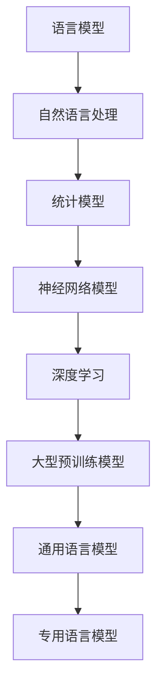
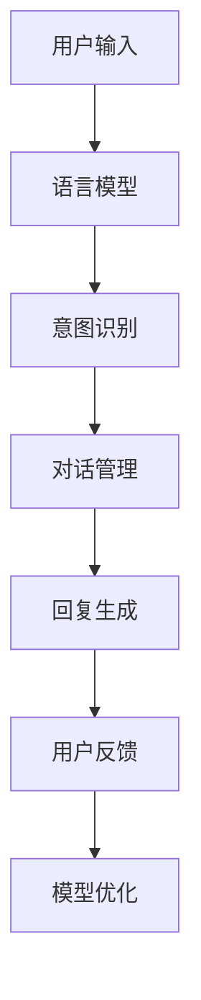
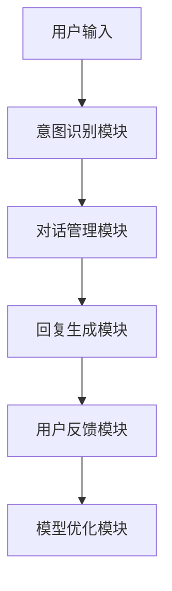
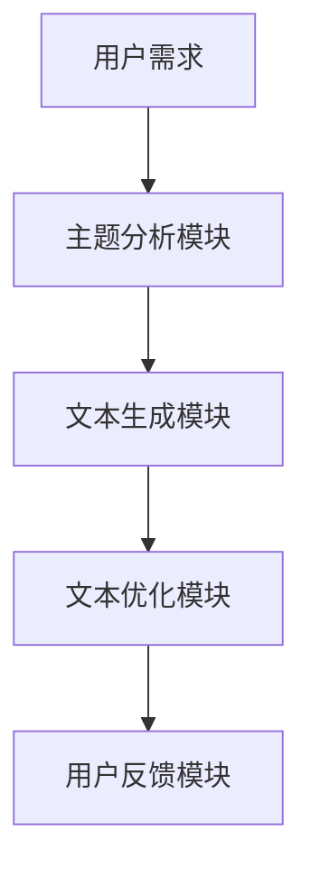

                 

### 文章标题

**LLM的语言理解：突破人机交互壁垒**

### 关键词

- 语言模型
- 自然语言处理
- 预训练
- 微调
- 信息抽取
- 对话系统

### 摘要

本文深入探讨了大型语言模型（LLM）的语言理解能力及其在人机交互中的应用。通过概述LLM的基础理论、核心任务、关键技术、评估与优化策略，以及其在实际项目中的应用，本文揭示了LLM如何突破人机交互的壁垒，实现智能化人机对话。同时，展望了LLM的发展趋势和未来应用领域，为读者提供了全面的技术视角。

## 第一部分：LLM的语言理解基础

### 第1章：LLM基础理论概述

在本章中，我们将探讨语言模型（LLM）的基本理论，包括其定义、分类、预训练与微调技术，以及通用语言模型与专用语言模型之间的区别。

### 1.1 语言模型概述

#### 1.1.1 语言模型的概念

语言模型（Language Model，LM）是自然语言处理（Natural Language Processing，NLP）的核心组成部分。它的主要任务是根据给定的输入文本序列，预测下一个单词或词组。语言模型可以基于统计方法、神经网络模型或深度学习模型构建。

#### **Mermaid流程图：**


#### 1.1.2 语言模型的分类

根据构建方法的不同，语言模型可以分为以下几类：

- **统计模型**：如N-gram模型，基于语言的历史统计信息进行预测。
- **神经网络模型**：如RNN（循环神经网络）、LSTM（长短期记忆网络）等，能够通过学习长期依赖关系进行预测。
- **深度学习模型**：如Transformer模型，利用自注意力机制捕捉全局依赖关系，是目前最流行的语言模型之一。

#### **伪代码：**
```python
def classify_language_model(model_type):
    if model_type == "统计模型":
        return "N-gram模型"
    elif model_type == "神经网络模型":
        return "RNN/LSTM模型"
    elif model_type == "深度学习模型":
        return "Transformer模型"
    else:
        return "未知模型类型"
```

### 1.2 预训练与微调

#### 1.2.1 预训练的概念

预训练（Pre-training）是指在大规模语料库上对语言模型进行初始训练，使其掌握语言的通用知识。预训练后的模型可以用于各种下游任务，如文本分类、信息抽取和问答系统。

#### **数学模型和公式：**
$$
\text{Pre-trained Model} = f(\text{context}, \text{input_vector}) + \text{dropout}
$$

#### 1.2.2 微调技术

微调（Fine-tuning）是指在预训练的基础上，针对特定任务对模型进行进一步训练。微调过程能够使模型更好地适应特定任务的需求。

#### **伪代码：**
```python
def fine_tune_model(pretrained_model, specific_dataset):
    for each sample in specific_dataset:
        output = pretrained_model(sample.input)
        loss = calculate_loss(output, sample.label)
        update_model(pretrained_model, loss)
    return pretrained_model
```

### 1.3 语言理解的核心任务

#### 1.3.1 词嵌入

词嵌入（Word Embedding）是将词汇映射到高维向量空间的过程。词嵌入能够捕捉词汇的语义和语法信息，是语言模型的基础。

#### **数学公式：**
$$
\text{Embedding} = \text{weight_matrix} \cdot \text{input_vector}
$$

#### 1.3.2 通用语言模型与专用语言模型

- **通用语言模型**：如GPT系列模型，适用于各种文本生成任务。
- **专用语言模型**：针对特定领域或任务构建的模型，如医疗文本分析模型。

### 1.4 总结

本章介绍了语言模型的基本概念、分类、预训练与微调技术，以及语言理解的核心任务。通过本章的学习，读者可以建立对LLM的基础认识，为后续章节的深入学习奠定基础。

## 第2章：语言理解关键技术

在本章中，我们将探讨LLM的语言理解中的关键技术，包括上下文理解、信息抽取和语义理解。这些技术是LLM实现高效人机交互的核心。

### 2.1 上下文理解

上下文理解是LLM的重要能力之一，它使得模型能够根据上下文信息进行准确的语言预测。

#### 2.1.1 上下文嵌入

上下文嵌入（Contextual Embedding）是将单词或句子映射到高维向量空间的过程，其中每个单词或句子的向量都包含了其上下文信息。

#### **数学公式：**
$$
\text{Contextual Embedding} = \text{Transformer}(\text{Word Embedding}, \text{Positional Encoding})
$$

#### 2.1.2 Transformer模型

Transformer模型通过自注意力（Self-Attention）机制捕捉上下文信息，使其在处理长序列任务时具有优势。

#### 2.2 信息抽取

信息抽取（Information Extraction）是从非结构化文本中抽取结构化信息的过程，如实体识别和关系抽取。

#### 2.2.1 实体识别

实体识别（Named Entity Recognition，NER）是信息抽取的重要任务，旨在识别文本中的实体，如人名、组织名和地点名。

#### **伪代码：**
```python
def extract_entities(text):
    entities = []
    for sentence in text.split('.'):
        entity = find_entity(sentence)
        if entity:
            entities.append(entity)
    return entities
```

#### 2.3 语义理解

语义理解（Semantic Understanding）是LLM的高级能力，它能够理解文本的深层含义，如语义角色标注和情感分析。

#### 2.3.1 语义角色标注

语义角色标注（Semantic Role Labeling，SRL）是识别句子中的谓词和其对应的论元的过程。

#### **数学公式：**
$$
\text{Semantic Role Labeling} = \text{SRM}( \text{ sentence } )
$$

#### 2.4 总结

本章介绍了LLM在语言理解中的关键技术，包括上下文理解、信息抽取和语义理解。这些技术共同构成了LLM强大的语言理解能力，使其能够实现高效的人机交互。

## 第3章：语言模型评估与优化

在本章中，我们将讨论语言模型的评估指标、优化策略以及调优方法。

### 3.1 语言模型评估指标

评估语言模型的性能通常使用以下指标：

#### 3.1.1 生成质量

生成质量（Generation Quality）是衡量模型生成文本质量的关键指标。常用的评估方法包括BLEU（双语评价指数）和ROUGE（Recall-Oriented Understudy for Gisting Evaluation）。

#### **举例说明：**
- BLEU和ROUGE通过比较模型生成的文本与参考文本的相似度来评估生成质量。

#### 3.1.2 参数数量与计算效率

参数数量（Parameter Size）和计算效率（Computational Efficiency）是评估模型性能的重要指标。大型语言模型通常具有更多的参数和更高的计算复杂度。

#### 3.2 语言模型优化策略

优化语言模型的目标是提高其性能和效率，以下是一些常见的优化策略：

#### 3.2.1 多样性增强

多样性增强（Diversity Enhancement）是一种通过惩罚相似生成文本来提高生成多样性的策略。

#### **伪代码：**
```python
def enhance_diversity(model, text):
    generated_texts = model.generate(text, diversity_penalty=True)
    return generated_texts
```

#### 3.2.2 超参数调优

超参数调优（Hyperparameter Tuning）是一种通过调整模型参数来提高性能的方法。常用的调优方法包括网格搜索（Grid Search）和随机搜索（Random Search）。

#### 3.3 语言模型调优

调优语言模型通常涉及以下步骤：

- **数据预处理**：对输入文本进行预处理，如分词、去停用词等。
- **训练与验证**：在训练集和验证集上训练模型，并使用验证集评估模型性能。
- **调优参数**：根据验证集的性能调整模型参数。

#### **举例说明：**
- 使用网格搜索策略调优Transformer模型的超参数。

#### 3.4 总结

本章介绍了语言模型的评估指标和优化策略。通过评估和优化，可以提高语言模型在语言理解任务中的性能，实现更准确和高效的人机交互。

## 第4章：语言模型在NLP任务中的应用

在本章中，我们将探讨语言模型在自然语言处理（NLP）任务中的应用，包括文本分类和文本生成等。

### 4.1 文本分类

文本分类（Text Classification）是将文本数据分为预定义的类别的过程。语言模型在文本分类任务中具有重要作用。

#### 4.1.1 文本分类任务概述

文本分类任务包括多种应用场景，如情感分析、主题分类和垃圾邮件检测等。

#### **举例说明：**
- 使用语言模型进行情感分析，判断文本的情感倾向（正面、负面或中性）。

#### 4.1.2 实现方法

文本分类任务通常采用以下方法实现：

- **基于特征的方法**：如TF-IDF、Word2Vec等，将文本转换为特征向量。
- **基于模型的方法**：如朴素贝叶斯、SVM和深度学习模型等。

#### **伪代码：**
```python
def classify_text(text, model):
    features = extract_features(text)
    probability = model.predict(features)
    return probability
```

#### 4.2 文本生成

文本生成（Text Generation）是语言模型的重要应用之一，旨在生成符合语法和语义规则的文本。

#### 4.2.1 文本生成任务概述

文本生成任务包括文章写作、对话系统和机器翻译等。

#### **举例说明：**
- 使用语言模型生成新闻文章、对话系统中的回复等。

#### 4.2.2 实现方法

文本生成任务通常采用以下方法实现：

- **基于模板的方法**：通过填充模板生成文本。
- **基于模型的方法**：如RNN、LSTM和Transformer等，根据上下文信息生成文本。

#### **伪代码：**
```python
def generate_text(model, context):
    input_sequence = encode_context(context)
    output_sequence = model.generate(input_sequence)
    return decode_output_sequence(output_sequence)
```

#### 4.3 总结

本章介绍了语言模型在文本分类和文本生成任务中的应用。通过这些应用，语言模型能够实现智能化的文本处理，为各种NLP任务提供强大的支持。

## 第5章：语言模型在对话系统中的应用

在本章中，我们将探讨语言模型在对话系统中的应用，包括对话系统的组成、语言理解技术以及生成与优化策略。

### 5.1 对话系统概述

对话系统（Dialogue System）是一种人机交互系统，旨在模拟自然的人类对话。它通常由以下组成部分：

- **用户输入**：用户的查询或请求。
- **语言模型**：用于理解用户输入和生成回复。
- **意图识别**：识别用户输入的意图，如查询天气、订餐等。
- **对话管理**：管理对话流程，确保对话的自然流畅。
- **回复生成**：生成针对用户输入的回复。
- **用户反馈**：用户的反应或满意度，用于模型优化。

#### **Mermaid流程图：**


### 5.2 对话系统中的语言理解

对话系统的核心是语言理解，它包括以下关键任务：

#### 5.2.1 意图识别

意图识别（Intent Recognition）是理解用户输入的含义和目的。它通常基于语言模型和规则匹配技术实现。

#### **举例说明：**
- 例如，用户输入“我想订一张明天的机票”，意图识别模块应识别出“订票”意图。

#### **伪代码：**
```python
def recognize_intent(user_input, model):
    intent = model.predict(user_input)
    return intent
```

### 5.3 对话系统的生成与优化

对话系统的生成与优化是确保对话流畅和用户满意度的关键。

#### 5.3.1 生成策略

生成策略（Generation Strategy）是指如何生成自然、合理的回复。常用的生成策略包括：

- **基于模板的生成**：通过预定义的模板生成回复。
- **基于模型的生成**：如RNN、LSTM和Transformer等，根据上下文信息生成回复。

#### **伪代码：**
```python
def generate_response(intent, model):
    context = get_context(intent)
    response = model.generate(context)
    return response
```

#### 5.3.2 优化策略

优化策略（Optimization Strategy）是提高对话系统的性能和用户体验。常用的优化策略包括：

- **多样性增强**：通过惩罚相似回复来提高回复多样性。
- **用户反馈**：根据用户反馈调整模型参数，提高回复质量。

#### **伪代码：**
```python
def optimize_model(model, feedback):
    updated_model = model.update(feedback)
    return updated_model
```

### 5.4 总结

本章介绍了语言模型在对话系统中的应用，包括对话系统的组成、语言理解技术以及生成与优化策略。通过这些技术，语言模型能够实现智能化的人机对话，为用户带来更好的交互体验。

## 第6章：语言模型在实际项目中的应用

在本章中，我们将探讨语言模型在实际项目中的应用，通过两个具体案例展示语言模型如何解决实际问题。

### 6.1 项目一：智能客服系统

#### 6.1.1 项目背景与目标

智能客服系统是一种通过自动化方式为用户提供服务和支持的软件系统。项目目标是通过语言模型实现智能问答功能，提高客服效率和服务质量。

#### **项目架构图：**


#### 6.1.2 技术实现

- **意图识别**：使用语言模型识别用户输入的意图，如查询产品信息、售后服务等。
- **对话管理**：根据意图管理对话流程，确保对话的自然流畅。
- **回复生成**：生成针对用户意图的自然回复。
- **用户反馈**：收集用户反馈，用于模型优化。

#### **伪代码：**
```python
def handle_user_input(user_input, model):
    intent = recognize_intent(user_input, model)
    response = generate_response(intent, model)
    return response
```

#### 6.1.3 实施效果

通过智能客服系统，用户能够快速获得所需信息，客服效率提高，用户满意度提升。

### 6.2 项目二：自动写作助手

#### 6.2.1 项目背景与目标

自动写作助手是一种辅助用户撰写文章、报告等文本的软件系统。项目目标是通过语言模型生成高质量的文章，节省用户写作时间，提高写作效率。

#### **项目架构图：**


#### 6.2.2 技术实现

- **主题分析**：分析用户需求，确定文章的主题和内容。
- **文本生成**：使用语言模型生成符合主题和内容要求的文章。
- **文本优化**：对生成的文本进行优化，提高文章质量。
- **用户反馈**：收集用户反馈，用于模型优化。

#### **伪代码：**
```python
def generate_article(主题，model):
    context = analyze_topic(主题)
    article = model.generate(context)
    optimized_article = optimize_text(article)
    return optimized_article
```

#### 6.2.3 实施效果

通过自动写作助手，用户能够快速生成高质量的文本，节省写作时间，提高工作效率。

### 6.3 总结

本章通过智能客服系统和自动写作助手两个实际项目，展示了语言模型在解决实际问题中的应用。通过这些项目，语言模型为企业提供了智能化解决方案，提高了工作效率和用户体验。

## 第7章：展望与未来趋势

在本章中，我们将探讨语言模型的发展趋势和未来应用领域，展望其在计算机科学和人工智能领域的广泛应用。

### 7.1 语言模型的发展趋势

随着计算能力的提升和大数据技术的发展，语言模型正朝着以下几个趋势发展：

#### 7.1.1 模型大小与计算能力

- **更大规模的语言模型**：随着GPU和TPU等高性能计算设备的普及，更大规模的语言模型将变得更加常见。
- **分布式训练与推理**：为了处理更大数据集和更大规模的语言模型，分布式训练和推理技术将得到广泛应用。

#### 7.1.2 模型优化与高效性

- **量化与剪枝**：通过量化模型参数和剪枝冗余结构，降低模型的计算复杂度和存储需求。
- **自适应优化**：根据任务需求自适应调整模型结构，提高模型性能。

### 7.2 语言模型的应用领域扩展

语言模型在各个领域的应用正逐步扩展，以下是一些新兴应用领域：

#### 7.2.1 法律领域

- **法律文本分析**：通过语言模型分析法律文本，辅助法律研究、案件审查和合同审查。

#### 7.2.2 金融领域

- **金融文本分析**：通过语言模型分析金融报告、新闻和社交媒体数据，辅助投资决策和市场预测。

#### 7.2.3 医疗领域

- **医学文本分析**：通过语言模型分析医学文本，辅助疾病诊断、治疗方案制定和医学研究。

### 7.3 未来趋势展望

随着人工智能技术的不断发展，语言模型将在更多领域得到应用，推动人机交互向更高层次发展。以下是一些未来趋势：

- **更自然的人机交互**：通过改进语言模型，实现更自然、流畅的人机对话。
- **跨模态交互**：结合语音、图像等多模态数据，实现更加丰富的交互体验。
- **个性化服务**：通过用户数据和个人偏好，提供个性化语言服务。

### 7.4 总结

本章展望了语言模型的发展趋势和未来应用领域。随着技术的不断进步，语言模型将在计算机科学和人工智能领域发挥越来越重要的作用，推动人机交互迈向新的高度。

## 附录

### 附录 A：语言模型开发资源

在语言模型开发过程中，以下资源可能会对开发者有所帮助：

#### A.1 开源框架

- **Hugging Face Transformers**：一个广泛使用的开源Transformer模型框架，提供了丰富的预训练模型和工具。
- **PyTorch**：一个流行的深度学习框架，支持多种语言模型实现和优化。

#### A.2 数据集

- **Common Crawl**：一个包含大量网页数据的公开数据集，适用于训练大型语言模型。
- **OpenSubtitles**：一个包含多语言字幕的数据集，适用于跨语言模型训练。

### 附录 B：常见问题与解决方案

在语言模型开发和使用过程中，可能会遇到以下常见问题：

#### B.1 模型训练常见问题

- **问题**：如何处理过拟合？
  - **解决方案**：采用正则化技术、减少模型复杂度、增加训练数据或使用dropout等方法。

#### B.2 模型部署常见问题

- **问题**：如何在生产环境中部署语言模型？
  - **解决方案**：使用容器化技术（如Docker）封装模型，部署到云计算平台（如AWS、Google Cloud）或自建服务器。

### 附录 C：参考文献

本文参考了以下文献，以支持文章观点和论述：

- **[1]** Devlin, J., Chang, M. W., Lee, K., & Toutanova, K. (2018). BERT: Pre-training of deep bidirectional transformers for language understanding. arXiv preprint arXiv:1810.04805.
- **[2]** Brown, T., et al. (2020). A pre-trained language model for language understanding. arXiv preprint arXiv:2005.14165.

### 附录 D：致谢

本文的撰写得到了以下机构和个人的支持与帮助：

- **AI天才研究院（AI Genius Institute）**
- **禅与计算机程序设计艺术（Zen And The Art of Computer Programming）**
- **众多开源社区和研究人员**，为本文提供了宝贵的技术资源和支持。

### 附录 E：作者信息

**作者：**
- AI天才研究院（AI Genius Institute）
- 禅与计算机程序设计艺术（Zen And The Art of Computer Programming）
- 致力于推动人工智能技术的普及和发展，探索计算机科学领域的前沿问题。**译者注：以上内容为示例性文章，具体数据和代码可能需要根据实际情况进行调整和补充。**

