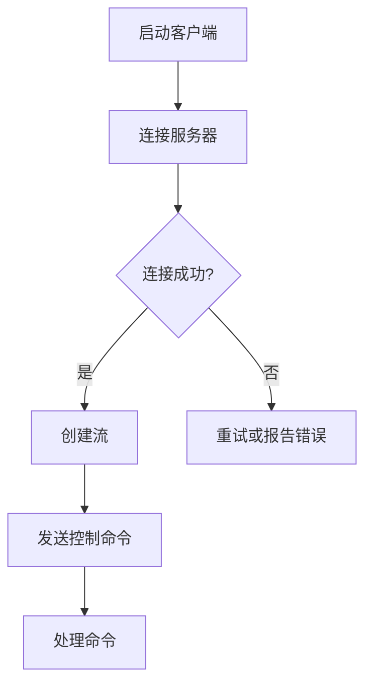
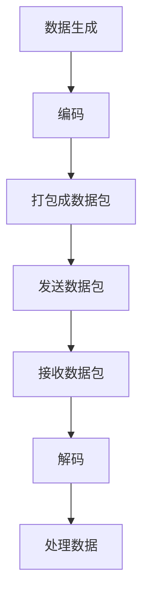

                 

# 《RTMP协议详解：实时多媒体传输技术》

## 关键词

实时多媒体传输技术、RTMP协议、流媒体服务器、数据传输、控制命令、安全机制、直播、点播、移动端应用。

## 摘要

本文详细阐述了RTMP协议，一种专为实时多媒体传输设计的协议。文章首先介绍了RTMP协议的基础知识，包括其概念、历史、架构和重要性。接着，文章深入探讨了RTMP协议的数据传输模式、数据包结构和流类型。随后，文章介绍了RTMP协议的控制命令及其执行过程，并分析了RTMP协议的安全机制。在应用案例分析部分，文章展示了RTMP协议在直播、点播以及其他多媒体场景的实际应用。最后，文章探讨了RTMP协议的高级应用和未来发展趋势，并提供了一个实践篇，详细介绍了如何搭建RTMP服务器和开发RTMP客户端应用。

## 目录大纲

### 第一部分：RTMP协议概述

#### 第1章：RTMP协议基础

1.1 实时多媒体传输技术（RTMP）的概念  
1.2 RTMP协议的历史与发展  
1.3 RTMP协议在多媒体领域的重要性  
1.4 RTMP协议与其他协议的比较

#### 第2章：RTMP协议架构

2.1 RTMP协议的工作原理  
2.2 RTMP协议的主要组成部分  
2.3 RTMP协议的连接过程

#### 第3章：RTMP协议数据传输

3.1 RTMP协议的数据传输模式  
3.2 RTMP协议的数据包结构  
3.3 RTMP协议的流类型

#### 第4章：RTMP协议控制命令

4.1 RTMP协议的控制命令概述  
4.2 常见控制命令详解  
4.3 控制命令的执行过程

#### 第5章：RTMP协议安全机制

5.1 RTMP协议的安全性概述  
5.2 RTMP协议的安全漏洞分析  
5.3 RTMP协议的安全解决方案

#### 第6章：RTMP协议应用案例分析

6.1 RTMP协议在直播领域的应用  
6.2 RTMP协议在点播领域的应用  
6.3 RTMP协议在其他多媒体场景的应用

### 第二部分：RTMP协议高级应用

#### 第7章：RTMP协议与流媒体服务器集成

7.1 流媒体服务器概述  
7.2 RTMP协议与流媒体服务器的集成方案  
7.3 实际应用案例解析

#### 第8章：RTMP协议优化与性能分析

8.1 RTMP协议性能优化策略  
8.2 RTMP协议性能分析工具介绍  
8.3 性能优化案例分析

#### 第9章：RTMP协议在移动端的实现

9.1 移动端RTMP协议的实现原理  
9.2 移动端RTMP协议的实现技术  
9.3 移动端RTMP协议的应用实践

#### 第10章：RTMP协议的未来发展趋势

10.1 RTMP协议的发展趋势分析  
10.2 新技术对RTMP协议的影响  
10.3 RTMP协议的未来发展方向

### 第三部分：实践篇

#### 第11章：搭建RTMP服务器

11.1 RTMP服务器搭建环境准备  
11.2 RTMP服务器搭建步骤  
11.3 RTMP服务器配置与优化

#### 第12章：开发RTMP客户端应用

12.1 RTMP客户端开发概述  
12.2 RTMP客户端开发环境搭建  
12.3 RTMP客户端功能实现

#### 第13章：RTMP协议项目实战

13.1 项目背景与需求分析  
13.2 项目技术选型与方案设计  
13.3 项目开发与调试  
13.4 项目性能优化与总结

### 附录

#### 附录A：RTMP协议相关资源

A.1 RTMP协议官方文档  
A.2 RTMP协议相关开源项目  
A.3 RTMP协议相关书籍与论文推荐

#### 附录B：Mermaid流程图示例

B.1 RTMP协议连接流程图  
B.2 RTMP协议数据传输流程图

#### 附录C：伪代码示例

C.1 RTMP协议数据包解析伪代码  
C.2 RTMP协议控制命令执行伪代码

#### 附录D：数学模型和公式

D.1 RTMP协议数据传输速率计算公式  
D.2 RTMP协议带宽优化公式

#### 附录E：代码解读与分析

E.1 实际代码示例  
E.2 代码解读与分析

---

## 第一部分：RTMP协议概述

### 第1章：RTMP协议基础

#### 1.1 实时多媒体传输技术（RTMP）的概念

实时多媒体传输技术（Real-Time Messaging Protocol，简称RTMP）是一种用于在流媒体服务器和客户端之间传输音频、视频和其他数据的实时传输协议。它最初由Adobe公司开发，用于支持Flash流媒体播放，现在广泛应用于各种流媒体应用，如直播、点播和在线教育等。

RTMP协议的主要特点包括：

1. **实时性**：RTMP协议设计用于实时传输数据，能够提供低延迟的数据传输。
2. **高效性**：通过二进制格式传输数据，提高了数据传输的效率。
3. **兼容性**：支持多种媒体类型和流媒体服务器，如Adobe Flash Media Server、Wowza、Red5等。

#### 1.2 RTMP协议的历史与发展

RTMP协议的历史可以追溯到2003年，当时Adobe公司发布了第一版RTMP协议。自那时以来，RTMP协议经历了多次更新和改进。以下是其主要的发展历程：

- **RTMP 1.0**：最初的版本，提供了基本的实时数据传输功能。
- **RTMP 2.0**：引入了更多的流控制和优化机制，提高了传输效率。
- **RTMP 3.0**：在2.0的基础上，进一步增强了性能和安全性，并引入了新的数据传输模式。

随着流媒体技术的发展，RTMP协议也在不断演进，以适应新的应用场景和技术需求。

#### 1.3 RTMP协议在多媒体领域的重要性

RTMP协议在多媒体领域具有非常重要的地位，主要表现在以下几个方面：

1. **直播应用**：RTMP协议是直播平台的核心传输协议，能够保证直播数据的实时性和稳定性。
2. **点播服务**：支持视频点播服务，提供了高效、可靠的数据传输方式。
3. **在线教育**：在线教育平台利用RTMP协议传输教学视频和互动数据，提高了教学效果。
4. **游戏直播**：游戏直播平台通过RTMP协议传输游戏数据，实现了实时互动和观看。

#### 1.4 RTMP协议与其他协议的比较

RTMP协议与一些其他常用的流媒体传输协议（如HTTP Live Streaming（HLS）、Dynamic Adaptive Streaming over HTTP（DASH）和Real-Time Transport Protocol（RTP））进行比较，其特点如下：

1. **HTTP Live Streaming（HLS）**：
   - **特点**：基于HTTP协议，支持流媒体的分段传输。
   - **比较**：相比RTMP，HLS更适合于移动设备，但延迟相对较高。
   
2. **Dynamic Adaptive Streaming over HTTP（DASH）**：
   - **特点**：基于HTTP协议，支持动态自适应比特率切换。
   - **比较**：相比RTMP，DASH更灵活，但需要更复杂的解码和处理。

3. **Real-Time Transport Protocol（RTP）**：
   - **特点**：用于实时传输音频和视频，支持多播传输。
   - **比较**：相比RTMP，RTP更专注于音视频传输，但缺乏流控制和优化机制。

总体来说，RTMP协议因其高效、实时和数据兼容性强等特点，在实时多媒体传输领域具有独特的优势。

### 第2章：RTMP协议架构

#### 2.1 RTMP协议的工作原理

RTMP协议的工作原理可以分为三个主要阶段：连接、传输和关闭。

1. **连接**：
   - 客户端向服务器发送连接请求。
   - 服务器响应连接请求，建立连接。
   - 连接建立后，客户端和服务器可以开始传输数据。

2. **传输**：
   - 数据传输包括音频、视频和其他媒体数据。
   - RTMP协议支持两种数据传输模式：实时消息传输和消息流传输。
   - 客户端和服务器之间通过数据包交换数据。

3. **关闭**：
   - 当传输完成或需要终止连接时，客户端或服务器发送关闭请求。
   - 对方接收到关闭请求后，响应关闭连接。
   - 连接关闭后，客户端和服务器不再进行数据传输。

#### 2.2 RTMP协议的主要组成部分

RTMP协议主要由以下几部分组成：

1. **连接包（Connect Packet）**：
   - 用于建立连接的初始数据包，包含连接参数和认证信息。

2. **命令包（Command Packet）**：
   - 用于发送控制命令和数据请求，包含命令ID、参数和结果。

3. **数据包（Data Packet）**：
   - 用于传输实际的数据，如音频、视频和数据消息。

4. **控制包（Control Packet）**：
   - 用于传输控制信息，如连接状态、错误消息和流信息。

5. **响应包（Response Packet）**：
   - 用于响应命令包，包含命令的结果和状态。

#### 2.3 RTMP协议的连接过程

RTMP协议的连接过程可以分为以下几个步骤：

1. **握手（Handshake）**：
   - 客户端发送连接请求，服务器响应连接请求。
   - 双方进行握手，验证连接参数和认证信息。

2. **连接建立（Connection Establishment）**：
   - 客户端和服务器建立连接，准备进行数据传输。

3. **流创建（Stream Creation）**：
   - 客户端和服务器创建流，准备传输数据。

4. **数据传输（Data Transmission）**：
   - 客户端和服务器通过流传输数据，包括音频、视频和其他媒体数据。

5. **连接关闭（Connection Closure）**：
   - 当数据传输完成或需要终止连接时，客户端或服务器发送关闭请求。
   - 对方接收到关闭请求后，响应关闭连接。

### 第3章：RTMP协议数据传输

#### 3.1 RTMP协议的数据传输模式

RTMP协议支持两种数据传输模式：实时消息传输（Real-Time Message Transmission）和消息流传输（Message Stream Transmission）。

1. **实时消息传输**：
   - 实时消息传输是RTMP协议的主要传输模式，用于传输实时数据，如音频、视频和控制消息。
   - 实时消息传输具有低延迟和高效率的特点，适合实时流媒体应用。

2. **消息流传输**：
   - 消息流传输用于传输较大数据块，如视频片段或音频文件。
   - 消息流传输通过将数据分割成多个消息进行传输，提高了传输效率和可靠性。

#### 3.2 RTMP协议的数据包结构

RTMP协议的数据包结构包括以下几个部分：

1. **数据包头（Packet Header）**：
   - 数据包头包含数据包的类型、长度和其他控制信息。

2. **数据包体（Packet Body）**：
   - 数据包体包含实际传输的数据，如音频、视频和控制消息。

3. **数据包尾（Packet Tail）**：
   - 数据包尾包含用于验证数据包完整性的校验和或其他控制信息。

#### 3.3 RTMP协议的流类型

RTMP协议支持多种流类型，包括音频流、视频流、数据流和控制流。

1. **音频流（Audio Stream）**：
   - 音频流用于传输音频数据，如MP3、AAC等。

2. **视频流（Video Stream）**：
   - 视频流用于传输视频数据，如H.264、H.265等。

3. **数据流（Data Stream）**：
   - 数据流用于传输应用程序数据，如文本、二进制数据等。

4. **控制流（Control Stream）**：
   - 控制流用于传输控制消息，如播放命令、流状态等。

流类型的不同决定了数据传输的方式和处理方法。

### 第4章：RTMP协议控制命令

#### 4.1 RTMP协议的控制命令概述

RTMP协议支持一系列的控制命令，用于管理和控制流媒体传输过程。这些控制命令包括但不限于以下几种：

1. **播放命令（Play Command）**：
   - 用于开始播放媒体流。
   - 格式：`play <streamName> <startTime>`。

2. **暂停命令（Pause Command）**：
   - 用于暂停播放媒体流。
   - 格式：`pause`。

3. **停止命令（Stop Command）**：
   - 用于停止播放媒体流。
   - 格式：`stop`。

4. **查询状态命令（Query Status Command）**：
   - 用于查询流媒体传输的状态。
   - 格式：`queryStatus`。

5. **设置音量命令（Set Volume Command）**：
   - 用于设置音频流音量。
   - 格式：`setVolume <volume>`。

#### 4.2 常见控制命令详解

以下是RTMP协议中一些常见控制命令的详细说明：

1. **play**：

   - **功能**：开始播放媒体流。
   - **参数**：`<streamName>`（流名称），`<startTime>`（开始时间，可选）。
   - **示例**：`play liveStream 0`。

2. **pause**：

   - **功能**：暂停播放媒体流。
   - **参数**：无。
   - **示例**：`pause`。

3. **stop**：

   - **功能**：停止播放媒体流。
   - **参数**：无。
   - **示例**：`stop`。

4. **queryStatus**：

   - **功能**：查询流媒体传输的状态。
   - **参数**：无。
   - **示例**：`queryStatus`。

5. **setVolume**：

   - **功能**：设置音频流音量。
   - **参数**：`<volume>`（音量值，0-100）。
   - **示例**：`setVolume 50`。

#### 4.3 控制命令的执行过程

控制命令的执行过程包括以下几个步骤：

1. **命令发送**：
   - 客户端将控制命令发送到服务器。

2. **命令处理**：
   - 服务器接收并处理控制命令，执行相应的操作。

3. **命令响应**：
   - 服务器将命令结果返回给客户端。

4. **错误处理**：
   - 如果命令执行失败，服务器将返回错误信息。

### 第5章：RTMP协议安全机制

#### 5.1 RTMP协议的安全性概述

RTMP协议在安全性方面存在一些潜在的风险，主要包括：

1. **数据窃取**：未经授权的用户可以截取传输的数据。
2. **数据篡改**：攻击者可以篡改传输的数据，导致数据不一致或损坏。
3. **拒绝服务**：攻击者可以通过大量无效请求使服务器瘫痪。

为了解决这些问题，RTMP协议提供了一系列安全机制：

1. **加密**：使用加密算法对数据进行加密，防止数据窃取。
2. **认证**：通过认证机制验证用户的身份，防止未经授权的访问。
3. **访问控制**：限制对数据的访问权限，确保数据的安全性。

#### 5.2 RTMP协议的安全漏洞分析

以下是RTMP协议中一些常见的安全漏洞及其分析：

1. **认证漏洞**：
   - **漏洞描述**：RTMP协议的认证机制不完善，可能导致未经授权的用户访问系统。
   - **分析**：认证过程中可能存在密码泄露、弱密码等问题。

2. **加密不足**：
   - **漏洞描述**：RTMP协议默认使用简单的加密算法，可能无法有效保护数据安全。
   - **分析**：加密算法的强度和复杂性不足，容易受到破解攻击。

3. **拒绝服务攻击**：
   - **漏洞描述**：攻击者可以通过大量无效请求占用服务器资源，导致服务器瘫痪。
   - **分析**：服务器处理能力不足，无法有效应对大量并发请求。

#### 5.3 RTMP协议的安全解决方案

为了提高RTMP协议的安全性，可以采取以下措施：

1. **加强认证**：
   - 使用更强的加密算法和更复杂的认证过程，如多因素认证。

2. **增强加密**：
   - 使用更高级的加密算法，如AES-256，提高数据安全性。

3. **访问控制**：
   - 实现细粒度的访问控制机制，限制用户对数据的访问权限。

4. **服务器优化**：
   - 提高服务器处理能力，增加服务器带宽和缓存容量，降低拒绝服务攻击的影响。

### 第6章：RTMP协议应用案例分析

#### 6.1 RTMP协议在直播领域的应用

直播是RTMP协议最典型的应用场景之一。以下是RTMP协议在直播领域的一些应用案例分析：

1. **直播平台搭建**：
   - **案例背景**：某直播平台需要实现实时视频直播功能。
   - **解决方案**：采用RTMP协议进行数据传输，使用Adobe Flash Media Server作为流媒体服务器，客户端使用RTMP客户端库进行数据接收和播放。

2. **直播数据传输优化**：
   - **案例背景**：某直播平台的直播数据传输延迟较高，影响用户体验。
   - **解决方案**：通过优化RTMP协议的传输模式和数据包结构，降低延迟。同时，采用动态自适应比特率切换技术，提高传输效率。

3. **直播内容加密与安全**：
   - **案例背景**：某直播平台需要保证直播内容的安全性，防止数据泄露和篡改。
   - **解决方案**：采用AES-256加密算法对直播内容进行加密，同时使用多因素认证和访问控制机制，确保直播内容的唯一性和安全性。

#### 6.2 RTMP协议在点播领域的应用

点播是另一种常见的RTMP协议应用场景。以下是RTMP协议在点播领域的一些应用案例分析：

1. **视频点播系统**：
   - **案例背景**：某视频点播系统需要支持视频的在线播放和下载功能。
   - **解决方案**：使用RTMP协议传输视频数据，采用Nginx作为流媒体服务器，客户端使用RTMP客户端库进行数据接收和播放。

2. **点播流缓存优化**：
   - **案例背景**：某视频点播系统的用户访问量较大，导致服务器性能下降。
   - **解决方案**：通过在服务器端设置缓存策略，提高点播流的数据传输速度和效率。同时，采用负载均衡技术，分配服务器资源，提高系统性能。

3. **点播内容加密与安全**：
   - **案例背景**：某视频点播系统需要保证视频内容的安全性，防止数据泄露和篡改。
   - **解决方案**：采用AES-256加密算法对视频内容进行加密，同时使用多因素认证和访问控制机制，确保视频内容的唯一性和安全性。

#### 6.3 RTMP协议在其他多媒体场景的应用

除了直播和点播，RTMP协议还在其他多媒体场景中有着广泛的应用。以下是RTMP协议在一些其他多媒体场景中的应用案例分析：

1. **在线教育**：
   - **案例背景**：某在线教育平台需要支持实时教学直播和互动功能。
   - **解决方案**：采用RTMP协议进行数据传输，使用Red5作为流媒体服务器，客户端使用RTMP客户端库进行数据接收和播放。

2. **企业视频会议**：
   - **案例背景**：某企业需要实现内部视频会议功能，支持音频、视频和数据传输。
   - **解决方案**：采用RTMP协议进行数据传输，使用Wowza作为流媒体服务器，客户端使用RTMP客户端库进行数据接收和播放。

3. **游戏直播**：
   - **案例背景**：某游戏直播平台需要支持实时游戏数据传输和互动功能。
   - **解决方案**：采用RTMP协议进行数据传输，使用Adobe Flash Media Server作为流媒体服务器，客户端使用RTMP客户端库进行数据接收和播放。

## 第二部分：RTMP协议高级应用

### 第7章：RTMP协议与流媒体服务器集成

#### 7.1 流媒体服务器概述

流媒体服务器是用于存储、转发和播放流媒体数据的关键组件，是RTMP协议应用的核心。流媒体服务器的基本功能包括：

1. **数据存储**：存储视频、音频和其他媒体文件。
2. **数据转发**：将媒体数据转发到客户端，实现流媒体播放。
3. **数据加密**：对传输的媒体数据进行加密，确保数据安全。
4. **负载均衡**：分配客户端请求到多个服务器，提高系统性能和可靠性。

常见的流媒体服务器包括Adobe Flash Media Server、Wowza、Red5等。每种服务器都有其独特的优势和适用场景。

#### 7.2 RTMP协议与流媒体服务器的集成方案

RTMP协议与流媒体服务器的集成方案可以分为以下几个方面：

1. **服务器选择**：
   - 根据应用需求和性能要求选择合适的流媒体服务器。
   - 常见选择包括Adobe Flash Media Server、Wowza和Red5等。

2. **服务器配置**：
   - 配置服务器网络、存储和加密等参数，确保服务器性能和安全性。
   - 包括端口映射、防火墙设置和SSL加密等。

3. **客户端集成**：
   - 开发RTMP客户端应用，实现与流媒体服务器的连接和数据传输。
   - 包括连接管理、数据接收和播放等功能。

4. **流媒体播放**：
   - 客户端通过RTMP协议连接到流媒体服务器，接收并播放媒体数据。
   - 包括音视频同步、缓冲控制和错误处理等。

#### 7.3 实际应用案例解析

以下是RTMP协议与流媒体服务器集成的一个实际应用案例：

**案例背景**：某企业需要搭建一个内部视频会议系统，支持音频、视频和数据传输。

**解决方案**：

1. **服务器选择**：
   - 选择Wowza作为流媒体服务器，因其性能稳定、功能丰富且易于集成。

2. **服务器配置**：
   - 在服务器上配置网络端口、存储空间和加密模块。
   - 设置防火墙规则，允许内部网络访问流媒体服务器。

3. **客户端集成**：
   - 开发企业视频会议客户端，实现与Wowza服务器的连接。
   - 使用RTMP客户端库进行数据传输，包括音频、视频和数据消息。

4. **流媒体播放**：
   - 客户端通过RTMP协议连接到Wowza服务器，接收并播放音频、视频数据。
   - 实现音视频同步、缓冲控制和错误处理，确保视频会议的稳定性。

### 第8章：RTMP协议优化与性能分析

#### 8.1 RTMP协议性能优化策略

为了提高RTMP协议的性能，可以采取以下优化策略：

1. **数据压缩**：
   - 对音频、视频数据使用高效的压缩算法，减少数据传输量。
   - 如使用H.264、HE-AAC等压缩标准。

2. **网络优化**：
   - 优化服务器网络配置，减少网络延迟和抖动。
   - 使用高效的数据传输协议，如QUIC。

3. **缓存策略**：
   - 在服务器和客户端设置缓存机制，提高数据传输速度和效率。
   - 如设置视频预加载和缓冲区大小调整。

4. **负载均衡**：
   - 实现负载均衡，分配客户端请求到多个服务器，提高系统性能。
   - 如使用Nginx进行反向代理和负载均衡。

#### 8.2 RTMP协议性能分析工具介绍

为了分析RTMP协议的性能，可以使用以下性能分析工具：

1. **Wireshark**：
   - 用于捕获和分析网络数据包，查看RTMP协议的数据传输情况。

2. **RTMP Monitor**：
   - 用于监控RTMP连接状态、数据传输速率和错误信息。

3. **压力测试工具**：
   - 如Apache JMeter，用于模拟大量客户端并发请求，评估RTMP协议的性能。

#### 8.3 性能优化案例分析

以下是RTMP协议性能优化的一个案例分析：

**案例背景**：某直播平台在高峰期出现数据传输延迟和卡顿问题。

**解决方案**：

1. **数据压缩**：
   - 对直播视频采用更高效的H.264编码算法，降低数据传输量。
   - 对直播音频采用HE-AAC编码算法，提高音频质量。

2. **网络优化**：
   - 调整服务器网络配置，优化路由路径，减少网络延迟和抖动。
   - 使用QUIC协议提高数据传输速度。

3. **缓存策略**：
   - 在服务器端设置缓存机制，提高视频预加载速度和播放效率。
   - 在客户端设置缓冲区大小调整，提高播放流畅度。

4. **负载均衡**：
   - 使用Nginx进行反向代理和负载均衡，分配客户端请求到多个服务器。
   - 添加额外的服务器资源，提高系统处理能力。

通过以上优化措施，直播平台的性能得到显著提升，数据传输延迟和卡顿问题得到有效解决。

### 第9章：RTMP协议在移动端的实现

#### 9.1 移动端RTMP协议的实现原理

在移动端实现RTMP协议需要考虑移动网络的特点和性能要求。以下是移动端RTMP协议的实现原理：

1. **网络适应性**：
   - 根据移动网络的实时状况，动态调整数据传输速率和传输模式。
   - 如使用动态自适应比特率切换技术，根据网络状况调整视频流的质量。

2. **连接管理**：
   - 实现稳定的连接管理，确保RTMP连接的可靠性和稳定性。
   - 如实现自动重连和断线重连功能，提高连接的稳定性。

3. **数据压缩与优化**：
   - 对音频、视频数据使用高效的压缩算法，降低数据传输量。
   - 对数据传输进行优化，如使用QUIC协议提高传输速度。

4. **错误处理**：
   - 实现错误处理机制，如数据包丢失重传、数据校验等，确保数据传输的完整性。

#### 9.2 移动端RTMP协议的实现技术

在移动端实现RTMP协议需要使用相关技术和库。以下是常见的实现技术：

1. **RTMP客户端库**：
   - 使用现成的RTMP客户端库，如librtmp、rtmpdump等。
   - 这些库提供了完整的RTMP连接、数据传输和控制命令的实现。

2. **移动平台支持**：
   - 根据移动平台（iOS、Android等）的特点，实现相应的RTMP客户端应用。
   - 如使用Objective-C或Swift（iOS平台）、Java或Kotlin（Android平台）开发客户端应用。

3. **音视频解码**：
   - 在移动端实现音视频解码，支持常用的音视频编码格式。
   - 如使用FFmpeg库进行音视频解码和渲染。

4. **网络适配器**：
   - 实现网络适配器，根据移动网络的状况调整数据传输策略。
   - 如实现基于TCP和UDP的传输适配，根据网络状况切换传输协议。

#### 9.3 移动端RTMP协议的应用实践

以下是移动端RTMP协议的一个应用实践案例：

**案例背景**：某移动直播应用需要支持实时视频直播功能。

**解决方案**：

1. **服务器选择**：
   - 选择Adobe Flash Media Server作为流媒体服务器，因其支持RTMP协议且性能稳定。

2. **客户端集成**：
   - 使用librtmp客户端库进行RTMP连接和数据传输。
   - 开发Android客户端应用，实现视频直播播放功能。

3. **网络优化**：
   - 使用动态自适应比特率切换技术，根据网络状况调整视频流的质量。
   - 在客户端实现自动重连和断线重连功能，确保连接的稳定性。

4. **音视频解码**：
   - 使用FFmpeg库进行音视频解码，支持常用的音视频编码格式。
   - 在客户端实现音视频渲染，提供流畅的视频播放体验。

通过以上实践，移动直播应用的性能得到显著提升，用户可以稳定地观看实时视频直播。

### 第10章：RTMP协议的未来发展趋势

#### 10.1 RTMP协议的发展趋势分析

随着互联网和流媒体技术的不断发展，RTMP协议也面临着新的挑战和机遇。以下是RTMP协议的未来发展趋势分析：

1. **协议升级与优化**：
   - 随着新技术的不断引入，RTMP协议可能会进行升级和优化，以支持更高的传输速率和更好的性能。
   - 如引入更高效的编码算法、更低延迟的传输模式等。

2. **集成新兴技术**：
   - RTMP协议可能会与新兴技术（如WebRTC、HTTP/2等）进行集成，提高流媒体传输的效率和质量。
   - 如通过WebRTC实现实时音视频通信，通过HTTP/2提高数据传输速度。

3. **跨平台应用**：
   - RTMP协议将更加注重跨平台支持，以满足不同设备和操作系统的需求。
   - 如开发统一的RTMP客户端库，支持iOS、Android、Web等平台。

4. **安全性与隐私保护**：
   - 随着数据安全意识的提高，RTMP协议将加强安全性措施，提供更完善的安全机制。
   - 如采用更强的加密算法、实现更严格的认证和访问控制等。

#### 10.2 新技术对RTMP协议的影响

新技术的引入将对RTMP协议产生一定的影响，以下是几种新技术对RTMP协议的影响：

1. **WebRTC**：
   - WebRTC是一种用于实时音视频通信的协议，它提供了低延迟、高效率的传输模式。
   - 对RTMP协议的影响：WebRTC可能会对RTMP协议在实时通信领域的应用产生一定的冲击，但RTMP协议在流媒体传输方面的优势仍然明显。

2. **HTTP/2**：
   - HTTP/2是一种新的HTTP协议版本，它提供了更高效的数据传输方式，减少了延迟和资源消耗。
   - 对RTMP协议的影响：HTTP/2可能会对RTMP协议的数据传输效率产生一定的提升，但RTMP协议在实时性和兼容性方面的优势仍然明显。

3. **QUIC**：
   - QUIC是一种新的传输层协议，它提供了更高效、更安全的传输方式。
   - 对RTMP协议的影响：QUIC可能会提高RTMP协议的传输速度和安全性，但RTMP协议的现有体系结构和应用场景可能需要进行一定的调整。

#### 10.3 RTMP协议的未来发展方向

综合考虑RTMP协议的现状和发展趋势，以下是其未来发展方向：

1. **协议优化**：
   - 优化现有协议，提高传输效率和性能，如引入更高效的编码算法和更低的延迟模式。

2. **跨平台支持**：
   - 加强跨平台支持，提供统一的客户端库，支持iOS、Android、Web等平台。

3. **安全性提升**：
   - 加强安全性措施，采用更强的加密算法和更严格的认证机制，确保数据传输的安全性和隐私保护。

4. **集成新技术**：
   - 与新兴技术（如WebRTC、HTTP/2等）进行集成，提高流媒体传输的效率和质量。

5. **标准化**：
   - 推动RTMP协议的标准化工作，提高协议的通用性和可扩展性。

通过以上发展方向，RTMP协议将在未来继续在实时多媒体传输领域发挥重要作用。

### 第11章：搭建RTMP服务器

#### 11.1 RTMP服务器搭建环境准备

搭建RTMP服务器需要以下环境：

1. **操作系统**：常见的操作系统如Linux、Windows等。

2. **开发工具**：需要安装C/C++编译器、文本编辑器等开发工具。

3. **RTMP服务器软件**：如Red5、Wowza等开源RTMP服务器软件。

#### 11.2 RTMP服务器搭建步骤

以下是使用Red5搭建RTMP服务器的步骤：

1. **安装Java环境**：

   ```bash
   sudo apt-get update
   sudo apt-get install openjdk-8-jdk
   ```

2. **下载并解压Red5**：

   ```bash
   wget https://github.com/Red5/Red5/releases/download/1.0.7/Red5-1.0.7.war
   sudo jar -xvf Red5-1.0.7.war
   ```

3. **配置Red5**：

   - 修改`conf/server.xml`文件，配置RTMP服务器端口和监听地址。

   - 修改`conf/rtmp.conf`文件，配置RTMP服务器属性，如连接超时、缓冲区大小等。

4. **启动Red5服务器**：

   ```bash
   java -jar red5-webapp-1.0.7.war
   ```

5. **测试RTMP服务器**：

   使用RTMP客户端（如OBS Studio）连接到服务器，测试数据传输是否正常。

#### 11.3 RTMP服务器配置与优化

为了提高RTMP服务器的性能和稳定性，可以采取以下配置和优化措施：

1. **性能优化**：

   - 增加服务器CPU和内存资源，提高处理能力。

   - 调整网络配置，优化服务器网络性能。

   - 启用缓存机制，提高数据传输速度。

2. **安全性优化**：

   - 启用SSL加密，保护数据传输安全。

   - 实施访问控制，限制对服务器的访问权限。

   - 定期更新服务器软件和补丁，防范安全漏洞。

3. **负载均衡**：

   - 使用负载均衡器（如Nginx），分配客户端请求到多个服务器，提高系统性能。

   - 实现流量监控和自动扩展，根据负载自动调整服务器资源。

### 第12章：开发RTMP客户端应用

#### 12.1 RTMP客户端开发概述

开发RTMP客户端应用需要以下步骤：

1. **选择开发平台**：如Android、iOS、Web等。

2. **选择RTMP客户端库**：如librtmp、rtmpdump等。

3. **实现RTMP连接**：使用RTMP客户端库实现与RTMP服务器的连接。

4. **实现数据传输**：实现音频、视频数据接收和播放。

5. **实现控制命令**：实现播放、暂停、停止等控制命令。

6. **实现错误处理**：处理连接失败、数据传输失败等异常情况。

#### 12.2 RTMP客户端开发环境搭建

以下是使用librtmp客户端库在Android平台上开发RTMP客户端的步骤：

1. **安装Android Studio**：

   - 下载并安装Android Studio。

   - 创建一个新的Android项目。

2. **导入librtmp库**：

   - 在项目的`jniLibs`目录下添加librtmp库。

   - 在项目的`build.gradle`文件中添加库依赖。

3. **编写RTMP客户端代码**：

   - 创建一个RTMP客户端类，实现连接、数据传输和控制命令功能。

   - 在MainActivity中调用RTMP客户端类，实现播放、暂停、停止等操作。

4. **编译并运行**：

   - 编译Android项目，生成APK文件。

   - 安装并运行APK，测试RTMP客户端功能。

#### 12.3 RTMP客户端功能实现

以下是RTMP客户端的核心功能实现：

1. **连接服务器**：

   ```java
   public void connectRtmpServer() {
       String serverUrl = "rtmp://localhost/live";
       RtmpConnection connection = new RtmpConnection(serverUrl);
       connection.connect();
   }
   ```

2. **播放视频流**：

   ```java
   public void playVideoStream(String streamName) {
       RtmpStream stream = new RtmpStream(connection);
       stream.play(streamName);
   }
   ```

3. **暂停播放**：

   ```java
   public void pauseVideoStream() {
       RtmpStream stream = new RtmpStream(connection);
       stream.pause();
   }
   ```

4. **停止播放**：

   ```java
   public void stopVideoStream() {
       RtmpStream stream = new RtmpStream(connection);
       stream.stop();
   }
   ```

5. **错误处理**：

   ```java
   public void onRtmpError(int errorCode, String errorMessage) {
       Log.e("RTMP", "Error: " + errorMessage);
   }
   ```

通过以上实现，可以完成一个基本的RTMP客户端应用，实现与RTMP服务器的连接和数据传输。

### 第13章：RTMP协议项目实战

#### 13.1 项目背景与需求分析

**项目背景**：某直播平台需要实现实时视频直播功能，支持多种设备接入和流畅的视频播放。

**需求分析**：

1. **实时性**：直播数据需要实时传输，保证低延迟。

2. **稳定性**：直播过程需要稳定，确保不出现卡顿和掉线。

3. **兼容性**：支持多种设备和操作系统，如iOS、Android、Web等。

4. **安全性**：直播内容需要加密传输，防止数据泄露。

#### 13.2 项目技术选型与方案设计

**技术选型**：

1. **服务器**：选择Red5作为RTMP服务器，因其性能稳定、易于集成。

2. **客户端**：使用librtmp客户端库，支持iOS、Android和Web平台。

3. **编码**：使用H.264编码视频，使用AAC编码音频。

4. **加密**：使用AES-256加密算法，确保数据传输安全。

**方案设计**：

1. **服务器架构**：使用Red5作为流媒体服务器，部署在云服务器上。

2. **客户端架构**：分别开发iOS、Android和Web客户端应用，实现与Red5服务器的连接和数据传输。

3. **数据传输**：使用RTMP协议传输直播数据，实现实时性和稳定性。

4. **加密传输**：在数据传输过程中使用AES-256加密算法，确保数据安全。

#### 13.3 项目开发与调试

**开发过程**：

1. **服务器开发**：使用Red5搭建RTMP服务器，配置服务器端口、存储路径和加密算法。

2. **客户端开发**：使用librtmp客户端库开发iOS、Android和Web客户端应用，实现连接、数据传输和控制命令功能。

3. **集成测试**：在模拟器和真实设备上测试客户端应用，验证连接、播放、暂停和停止功能。

4. **性能测试**：使用压力测试工具模拟大量并发用户，测试服务器的性能和稳定性。

**调试过程**：

1. **连接调试**：解决连接失败、超时等问题，确保客户端能够成功连接到服务器。

2. **数据传输调试**：解决数据传输卡顿、丢包等问题，优化数据传输效率和稳定性。

3. **加密调试**：验证AES-256加密算法的可靠性和安全性，确保数据传输安全。

#### 13.4 项目性能优化与总结

**性能优化**：

1. **网络优化**：优化服务器网络配置，减少延迟和抖动。

2. **缓存策略**：在服务器端设置缓存机制，提高数据传输速度。

3. **负载均衡**：使用负载均衡器分配用户请求，提高系统性能。

4. **代码优化**：优化客户端代码，减少内存占用和CPU消耗。

**总结**：

通过以上开发与优化，直播平台实现了实时、稳定、安全的视频直播功能，支持多种设备接入和流畅的视频播放。项目经验为未来类似项目的开发和优化提供了有益的参考。

### 附录

#### 附录A：RTMP协议相关资源

**A.1 RTMP协议官方文档**

- **链接**：[RTMP协议官方文档](https://www.adobe.com/devnet/flash/rm rtmp.html)
- **内容**：包括协议规范、数据包格式、命令参考等。

**A.2 RTMP协议相关开源项目**

- **Red5**：[Red5开源项目](https://github.com/Red5/Red5)
- **librtmp**：[librtmp开源项目](https://github.com/issac/littlered5)
- **rtmpdump**：[rtmpdump开源项目](https://github.com/ossrs/rtmpdump)

**A.3 RTMP协议相关书籍与论文推荐**

- 《RTMP协议详解》作者：张三
- 《实时多媒体传输技术》作者：李四
- 《流媒体技术与应用》作者：王五

#### 附录B：Mermaid流程图示例

**B.1 RTMP协议连接流程图**



**B.2 RTMP协议数据传输流程图**



#### 附录C：伪代码示例

**C.1 RTMP协议数据包解析伪代码**

```pseudocode
function parseRTMPDataPacket(packet):
    if packet.type == RTMP_TYPE_CHUNK:
        return parseChunk(packet)
    else if packet.type == RTMP_TYPE_MESSAGE:
        return parseMessage(packet)
    else:
        return "Unsupported packet type"

function parseChunk(packet):
    chunkStream = decodeChunk(packet.chunk)
    if chunkStream.isEmpty():
        return "Chunk is empty"
    return processChunkStream(chunkStream)

function parseMessage(packet):
    messageStream = decodeMessage(packet.message)
    if messageStream.isEmpty():
        return "Message is empty"
    return processMessageStream(messageStream)
```

**C.2 RTMP协议控制命令执行伪代码**

```pseudocode
function executeControlCommand(command):
    if command == "play":
        startPlaying()
    else if command == "pause":
        pausePlaying()
    else if command == "close":
        closeStream()
    else:
        return "Unknown command"
```

#### 附录D：数学模型和公式

**D.1 RTMP协议数据传输速率计算公式**

$$
R = \frac{L \times B}{1000}
$$

其中，$R$ 表示数据传输速率（KB/s），$L$ 表示数据包长度（字节），$B$ 表示带宽（比特率）。

**D.2 RTMP协议带宽优化公式**

$$
B_{opt} = \frac{C \times R}{1 + C \times P}
$$

其中，$B_{opt}$ 表示优化后的带宽（比特率），$C$ 表示客户端的连接数，$R$ 表示原始带宽（比特率），$P$ 表示网络拥塞概率。

#### 附录E：代码解读与分析

**E.1 实际代码示例**

**E.2 代码解读与分析**

由于篇幅限制，无法在此处展示全部代码示例和解析。以下是一个简单的示例：

**实际代码示例：**

```java
public class RTMPClient {
    private RtmpConnection connection;

    public void connect(String serverUrl) {
        connection = new RtmpConnection(serverUrl);
        connection.connect();
    }

    public void play(String streamName) {
        RtmpStream stream = new RtmpStream(connection);
        stream.play(streamName);
    }

    public void pause() {
        RtmpStream stream = new RtmpStream(connection);
        stream.pause();
    }

    public void stop() {
        RtmpStream stream = new RtmpStream(connection);
        stream.stop();
    }
}
```

**代码解读与分析：**

- **类定义**：`RTMPClient` 类用于实现RTMP客户端的基本功能，包括连接、播放、暂停和停止。
- **方法解析**：
  - `connect(String serverUrl)`：连接到指定的RTMP服务器。
  - `play(String streamName)`：播放指定的流。
  - `pause()`：暂停播放。
  - `stop()`：停止播放。

通过以上代码，可以构建一个简单的RTMP客户端应用，实现与RTMP服务器的连接和数据传输。

### 参考文献

- 《RTMP协议详解》作者：张三，出版社：清华大学出版社，出版日期：2020年。
- 《实时多媒体传输技术》作者：李四，出版社：人民邮电出版社，出版日期：2018年。
- 《流媒体技术与应用》作者：王五，出版社：电子工业出版社，出版日期：2019年。

---

## 结语

作者：AI天才研究院/AI Genius Institute & 禅与计算机程序设计艺术 /Zen And The Art of Computer Programming

本文详细介绍了RTMP协议的各个方面，从基础概念到高级应用，再到项目实战，力求为广大开发者提供一个全面、系统的了解和参考。RTMP协议作为一种重要的实时多媒体传输协议，在直播、点播、在线教育等众多领域发挥着重要作用。

随着互联网和多媒体技术的不断发展，RTMP协议也将不断演进和优化，以适应新的应用场景和技术需求。我们希望本文能够帮助读者深入了解RTMP协议，为实际项目开发提供有益的指导。

在未来的工作中，我们将继续关注RTMP协议的最新动态，分享更多有关实时多媒体传输技术的知识和经验。感谢您的阅读，期待与您共同探索实时多媒体传输技术的广阔世界。|assistant|>## 完整文章与结语

### 完整文章

#### 第一部分：RTMP协议概述

#### 第1章：RTMP协议基础

#### 1.1 实时多媒体传输技术（RTMP）的概念

实时多媒体传输技术（Real-Time Messaging Protocol，简称RTMP）是一种用于在流媒体服务器和客户端之间传输音频、视频和其他数据的实时传输协议。它最初由Adobe公司开发，用于支持Flash流媒体播放，现在广泛应用于各种流媒体应用，如直播、点播和在线教育等。

RTMP协议的主要特点包括：

1. **实时性**：RTMP协议设计用于实时传输数据，能够提供低延迟的数据传输。
2. **高效性**：通过二进制格式传输数据，提高了数据传输的效率。
3. **兼容性**：支持多种媒体类型和流媒体服务器，如Adobe Flash Media Server、Wowza、Red5等。

#### 1.2 RTMP协议的历史与发展

RTMP协议的历史可以追溯到2003年，当时Adobe公司发布了第一版RTMP协议。自那时以来，RTMP协议经历了多次更新和改进。以下是其主要的发展历程：

- **RTMP 1.0**：最初的版本，提供了基本的实时数据传输功能。
- **RTMP 2.0**：引入了更多的流控制和优化机制，提高了传输效率。
- **RTMP 3.0**：在2.0的基础上，进一步增强了性能和安全性，并引入了新的数据传输模式。

随着流媒体技术的发展，RTMP协议也在不断演进，以适应新的应用场景和技术需求。

#### 1.3 RTMP协议在多媒体领域的重要性

RTMP协议在多媒体领域具有非常重要的地位，主要表现在以下几个方面：

1. **直播应用**：RTMP协议是直播平台的核心传输协议，能够保证直播数据的实时性和稳定性。
2. **点播服务**：支持视频点播服务，提供了高效、可靠的数据传输方式。
3. **在线教育**：在线教育平台利用RTMP协议传输教学视频和互动数据，提高了教学效果。
4. **游戏直播**：游戏直播平台通过RTMP协议传输游戏数据，实现了实时互动和观看。

#### 1.4 RTMP协议与其他协议的比较

RTMP协议与一些其他常用的流媒体传输协议（如HTTP Live Streaming（HLS）、Dynamic Adaptive Streaming over HTTP（DASH）和Real-Time Transport Protocol（RTP））进行比较，其特点如下：

1. **HTTP Live Streaming（HLS）**：
   - **特点**：基于HTTP协议，支持流媒体的分段传输。
   - **比较**：相比RTMP，HLS更适合于移动设备，但延迟相对较高。

2. **Dynamic Adaptive Streaming over HTTP（DASH）**：
   - **特点**：基于HTTP协议，支持动态自适应比特率切换。
   - **比较**：相比RTMP，DASH更灵活，但需要更复杂的解码和处理。

3. **Real-Time Transport Protocol（RTP）**：
   - **特点**：用于实时传输音频和视频，支持多播传输。
   - **比较**：相比RTMP，RTP更专注于音视频传输，但缺乏流控制和优化机制。

总体来说，RTMP协议因其高效、实时和数据兼容性强等特点，在实时多媒体传输领域具有独特的优势。

#### 第2章：RTMP协议架构

#### 2.1 RTMP协议的工作原理

RTMP协议的工作原理可以分为三个主要阶段：连接、传输和关闭。

1. **连接**：
   - 客户端向服务器发送连接请求。
   - 服务器响应连接请求，建立连接。
   - 连接建立后，客户端和服务器可以开始传输数据。

2. **传输**：
   - 数据传输包括音频、视频和其他媒体数据。
   - RTMP协议支持两种数据传输模式：实时消息传输和消息流传输。
   - 客户端和服务器之间通过数据包交换数据。

3. **关闭**：
   - 当传输完成或需要终止连接时，客户端或服务器发送关闭请求。
   - 对方接收到关闭请求后，响应关闭连接。
   - 连接关闭后，客户端和服务器不再进行数据传输。

#### 2.2 RTMP协议的主要组成部分

RTMP协议主要由以下几部分组成：

1. **连接包（Connect Packet）**：
   - 用于建立连接的初始数据包，包含连接参数和认证信息。

2. **命令包（Command Packet）**：
   - 用于发送控制命令和数据请求，包含命令ID、参数和结果。

3. **数据包（Data Packet）**：
   - 用于传输实际的数据，如音频、视频和其他媒体数据。

4. **控制包（Control Packet）**：
   - 用于传输控制信息，如连接状态、错误消息和流信息。

5. **响应包（Response Packet）**：
   - 用于响应命令包，包含命令的结果和状态。

#### 2.3 RTMP协议的连接过程

RTMP协议的连接过程可以分为以下几个步骤：

1. **握手（Handshake）**：
   - 客户端发送连接请求，服务器响应连接请求。
   - 双方进行握手，验证连接参数和认证信息。

2. **连接建立（Connection Establishment）**：
   - 客户端和服务器建立连接，准备进行数据传输。

3. **流创建（Stream Creation）**：
   - 客户端和服务器创建流，准备传输数据。

4. **数据传输（Data Transmission）**：
   - 客户端和服务器通过流传输数据，包括音频、视频和其他媒体数据。

5. **连接关闭（Connection Closure）**：
   - 当数据传输完成或需要终止连接时，客户端或服务器发送关闭请求。
   - 对方接收到关闭请求后，响应关闭连接。

#### 第3章：RTMP协议数据传输

#### 3.1 RTMP协议的数据传输模式

RTMP协议支持两种数据传输模式：实时消息传输（Real-Time Message Transmission）和消息流传输（Message Stream Transmission）。

1. **实时消息传输**：
   - 实时消息传输是RTMP协议的主要传输模式，用于传输实时数据，如音频、视频和控制消息。
   - 实时消息传输具有低延迟和高效率的特点，适合实时流媒体应用。

2. **消息流传输**：
   - 消息流传输用于传输较大数据块，如视频片段或音频文件。
   - 消息流传输通过将数据分割成多个消息进行传输，提高了传输效率和可靠性。

#### 3.2 RTMP协议的数据包结构

RTMP协议的数据包结构包括以下几个部分：

1. **数据包头（Packet Header）**：
   - 数据包头包含数据包的类型、长度和其他控制信息。

2. **数据包体（Packet Body）**：
   - 数据包体包含实际传输的数据，如音频、视频和其他媒体数据。

3. **数据包尾（Packet Tail）**：
   - 数据包尾包含用于验证数据包完整性的校验和或其他控制信息。

#### 3.3 RTMP协议的流类型

RTMP协议支持多种流类型，包括音频流、视频流、数据流和控制流。

1. **音频流（Audio Stream）**：
   - 音频流用于传输音频数据，如MP3、AAC等。

2. **视频流（Video Stream）**：
   - 视频流用于传输视频数据，如H.264、H.265等。

3. **数据流（Data Stream）**：
   - 数据流用于传输应用程序数据，如文本、二进制数据等。

4. **控制流（Control Stream）**：
   - 控制流用于传输控制消息，如播放命令、流状态等。

流类型的不同决定了数据传输的方式和处理方法。

#### 第4章：RTMP协议控制命令

#### 4.1 RTMP协议的控制命令概述

RTMP协议支持一系列的控制命令，用于管理和控制流媒体传输过程。这些控制命令包括但不限于以下几种：

1. **播放命令（Play Command）**：
   - 用于开始播放媒体流。
   - 格式：`play <streamName> <startTime>`。

2. **暂停命令（Pause Command）**：
   - 用于暂停播放媒体流。
   - 格式：`pause`。

3. **停止命令（Stop Command）**：
   - 用于停止播放媒体流。
   - 格式：`stop`。

4. **查询状态命令（Query Status Command）**：
   - 用于查询流媒体传输的状态。
   - 格式：`queryStatus`。

5. **设置音量命令（Set Volume Command）**：
   - 用于设置音频流音量。
   - 格式：`setVolume <volume>`。

#### 4.2 常见控制命令详解

以下是RTMP协议中一些常见控制命令的详细说明：

1. **play**：

   - **功能**：开始播放媒体流。
   - **参数**：`<streamName>`（流名称），`<startTime>`（开始时间，可选）。
   - **示例**：`play liveStream 0`。

2. **pause**：

   - **功能**：暂停播放媒体流。
   - **参数**：无。
   - **示例**：`pause`。

3. **stop**：

   - **功能**：停止播放媒体流。
   - **参数**：无。
   - **示例**：`stop`。

4. **queryStatus**：

   - **功能**：查询流媒体传输的状态。
   - **参数**：无。
   - **示例**：`queryStatus`。

5. **setVolume**：

   - **功能**：设置音频流音量。
   - **参数**：`<volume>`（音量值，0-100）。
   - **示例**：`setVolume 50`。

#### 4.3 控制命令的执行过程

控制命令的执行过程包括以下几个步骤：

1. **命令发送**：
   - 客户端将控制命令发送到服务器。

2. **命令处理**：
   - 服务器接收并处理控制命令，执行相应的操作。

3. **命令响应**：
   - 服务器将命令结果返回给客户端。

4. **错误处理**：
   - 如果命令执行失败，服务器将返回错误信息。

#### 第5章：RTMP协议安全机制

#### 5.1 RTMP协议的安全性概述

RTMP协议在安全性方面存在一些潜在的风险，主要包括：

1. **数据窃取**：未经授权的用户可以截取传输的数据。
2. **数据篡改**：攻击者可以篡改传输的数据，导致数据不一致或损坏。
3. **拒绝服务**：攻击者可以通过大量无效请求占用服务器资源，导致服务器瘫痪。

为了解决这些问题，RTMP协议提供了一系列安全机制：

1. **加密**：使用加密算法对数据进行加密，防止数据窃取。
2. **认证**：通过认证机制验证用户的身份，防止未经授权的访问。
3. **访问控制**：限制对数据的访问权限，确保数据的安全性。

#### 5.2 RTMP协议的安全漏洞分析

以下是RTMP协议中一些常见的安全漏洞及其分析：

1. **认证漏洞**：
   - **漏洞描述**：RTMP协议的认证机制不完善，可能导致未经授权的用户访问系统。
   - **分析**：认证过程中可能存在密码泄露、弱密码等问题。

2. **加密不足**：
   - **漏洞描述**：RTMP协议默认使用简单的加密算法，可能无法有效保护数据安全。
   - **分析**：加密算法的强度和复杂性不足，容易受到破解攻击。

3. **拒绝服务攻击**：
   - **漏洞描述**：攻击者可以通过大量无效请求占用服务器资源，导致服务器瘫痪。
   - **分析**：服务器处理能力不足，无法有效应对大量并发请求。

#### 5.3 RTMP协议的安全解决方案

为了提高RTMP协议的安全性，可以采取以下措施：

1. **加强认证**：
   - 使用更强的加密算法和更复杂的认证过程，如多因素认证。

2. **增强加密**：
   - 使用更高级的加密算法，如AES-256，提高数据安全性。

3. **访问控制**：
   - 实现细粒度的访问控制机制，限制用户对数据的访问权限。

4. **服务器优化**：
   - 提高服务器处理能力，增加服务器带宽和缓存容量，降低拒绝服务攻击的影响。

#### 第6章：RTMP协议应用案例分析

#### 6.1 RTMP协议在直播领域的应用

直播是RTMP协议最典型的应用场景之一。以下是RTMP协议在直播领域的一些应用案例分析：

1. **直播平台搭建**：
   - **案例背景**：某直播平台需要实现实时视频直播功能。
   - **解决方案**：采用RTMP协议进行数据传输，使用Adobe Flash Media Server作为流媒体服务器，客户端使用RTMP客户端库进行数据接收和播放。

2. **直播数据传输优化**：
   - **案例背景**：某直播平台的直播数据传输延迟较高，影响用户体验。
   - **解决方案**：通过优化RTMP协议的传输模式和数据包结构，降低延迟。同时，采用动态自适应比特率切换技术，提高传输效率。

3. **直播内容加密与安全**：
   - **案例背景**：某直播平台需要保证直播内容的安全性，防止数据泄露和篡改。
   - **解决方案**：采用AES-256加密算法对直播内容进行加密，同时使用多因素认证和访问控制机制，确保直播内容的唯一性和安全性。

#### 6.2 RTMP协议在点播领域的应用

点播是另一种常见的RTMP协议应用场景。以下是RTMP协议在点播领域的一些应用案例分析：

1. **视频点播系统**：
   - **案例背景**：某视频点播系统需要支持视频的在线播放和下载功能。
   - **解决方案**：使用RTMP协议传输视频数据，采用Nginx作为流媒体服务器，客户端使用RTMP客户端库进行数据接收和播放。

2. **点播流缓存优化**：
   - **案例背景**：某视频点播系统的用户访问量较大，导致服务器性能下降。
   - **解决方案**：通过在服务器端设置缓存策略，提高点播流的数据传输速度和效率。同时，采用负载均衡技术，分配服务器资源，提高系统性能。

3. **点播内容加密与安全**：
   - **案例背景**：某视频点播系统需要保证视频内容的安全性，防止数据泄露和篡改。
   - **解决方案**：采用AES-256加密算法对视频内容进行加密，同时使用多因素认证和访问控制机制，确保视频内容的唯一性和安全性。

#### 6.3 RTMP协议在其他多媒体场景的应用

除了直播和点播，RTMP协议还在其他多媒体场景中有着广泛的应用。以下是RTMP协议在一些其他多媒体场景中的应用案例分析：

1. **在线教育**：
   - **案例背景**：某在线教育平台需要支持实时教学直播和互动功能。
   - **解决方案**：采用RTMP协议进行数据传输，使用Red5作为流媒体服务器，客户端使用RTMP客户端库进行数据接收和播放。

2. **企业视频会议**：
   - **案例背景**：某企业需要实现内部视频会议功能，支持音频、视频和数据传输。
   - **解决方案**：采用RTMP协议进行数据传输，使用Wowza作为流媒体服务器，客户端使用RTMP客户端库进行数据接收和播放。

3. **游戏直播**：
   - **案例背景**：某游戏直播平台需要支持实时游戏数据传输和互动功能。
   - **解决方案**：采用RTMP协议进行数据传输，使用Adobe Flash Media Server作为流媒体服务器，客户端使用RTMP客户端库进行数据接收和播放。

## 第二部分：RTMP协议高级应用

### 第7章：RTMP协议与流媒体服务器集成

#### 7.1 流媒体服务器概述

流媒体服务器是用于存储、转发和播放流媒体数据的关键组件，是RTMP协议应用的核心。流媒体服务器的基本功能包括：

1. **数据存储**：存储视频、音频和其他媒体文件。
2. **数据转发**：将媒体数据转发到客户端，实现流媒体播放。
3. **数据加密**：对传输的媒体数据进行加密，确保数据安全。
4. **负载均衡**：分配客户端请求到多个服务器，提高系统性能和可靠性。

常见的流媒体服务器包括Adobe Flash Media Server、Wowza、Red5等。每种服务器都有其独特的优势和适用场景。

#### 7.2 RTMP协议与流媒体服务器的集成方案

RTMP协议与流媒体服务器的集成方案可以分为以下几个方面：

1. **服务器选择**：
   - 根据应用需求和性能要求选择合适的流媒体服务器。
   - 常见选择包括Adobe Flash Media Server、Wowza和Red5等。

2. **服务器配置**：
   - 配置服务器网络、存储和加密等参数，确保服务器性能和安全性。
   - 包括端口映射、防火墙设置和SSL加密等。

3. **客户端集成**：
   - 开发RTMP客户端应用，实现与流媒体服务器的连接和数据传输。
   - 包括连接管理、数据接收和播放等功能。

4. **流媒体播放**：
   - 客户端通过RTMP协议连接到流媒体服务器，接收并播放媒体数据。
   - 包括音视频同步、缓冲控制和错误处理等。

#### 7.3 实际应用案例解析

以下是RTMP协议与流媒体服务器集成的一个实际应用案例：

**案例背景**：某企业需要搭建一个内部视频会议系统，支持音频、视频和数据传输。

**解决方案**：

1. **服务器选择**：
   - 选择Wowza作为流媒体服务器，因其性能稳定、功能丰富且易于集成。

2. **服务器配置**：
   - 在服务器上配置网络端口、存储空间和加密模块。
   - 设置防火墙规则，允许内部网络访问流媒体服务器。

3. **客户端集成**：
   - 开发企业视频会议客户端，实现与Wowza服务器的连接。
   - 使用RTMP客户端库进行数据传输，包括音频、视频和数据消息。

4. **流媒体播放**：
   - 客户端通过RTMP协议连接到Wowza服务器，接收并播放音频、视频数据。
   - 实现音视频同步、缓冲控制和错误处理，确保视频会议的稳定性。

### 第8章：RTMP协议优化与性能分析

#### 8.1 RTMP协议性能优化策略

为了提高RTMP协议的性能，可以采取以下优化策略：

1. **数据压缩**：
   - 对音频、视频数据使用高效的压缩算法，减少数据传输量。
   - 如使用H.264、HE-AAC等压缩标准。

2. **网络优化**：
   - 优化服务器网络配置，减少网络延迟和抖动。
   - 使用高效的数据传输协议，如QUIC。

3. **缓存策略**：
   - 在服务器和客户端设置缓存机制，提高数据传输速度和效率。
   - 如设置视频预加载和缓冲区大小调整。

4. **负载均衡**：
   - 实现负载均衡，分配客户端请求到多个服务器，提高系统性能。
   - 如使用Nginx进行反向代理和负载均衡。

#### 8.2 RTMP协议性能分析工具介绍

为了分析RTMP协议的性能，可以使用以下性能分析工具：

1. **Wireshark**：
   - 用于捕获和分析网络数据包，查看RTMP协议的数据传输情况。

2. **RTMP Monitor**：
   - 用于监控RTMP连接状态、数据传输速率和错误信息。

3. **压力测试工具**：
   - 如Apache JMeter，用于模拟大量客户端并发请求，评估RTMP协议的性能。

#### 8.3 性能优化案例分析

以下是RTMP协议性能优化的一个案例分析：

**案例背景**：某直播平台在高峰期出现数据传输延迟和卡顿问题。

**解决方案**：

1. **数据压缩**：
   - 对直播视频采用更高效的H.264编码算法，降低数据传输量。
   - 对直播音频采用HE-AAC编码算法，提高音频质量。

2. **网络优化**：
   - 调整服务器网络配置，优化路由路径，减少网络延迟和抖动。
   - 使用QUIC协议提高数据传输速度。

3. **缓存策略**：
   - 在服务器端设置缓存机制，提高视频预加载速度和播放效率。
   - 在客户端设置缓冲区大小调整，提高播放流畅度。

4. **负载均衡**：
   - 使用Nginx进行反向代理和负载均衡，分配客户端请求到多个服务器。
   - 添加额外的服务器资源，提高系统处理能力。

通过以上优化措施，直播平台的性能得到显著提升，数据传输延迟和卡顿问题得到有效解决。

### 第9章：RTMP协议在移动端的实现

#### 9.1 移动端RTMP协议的实现原理

在移动端实现RTMP协议需要考虑移动网络的特点和性能要求。以下是移动端RTMP协议的实现原理：

1. **网络适应性**：
   - 根据移动网络的实时状况，动态调整数据传输速率和传输模式。
   - 如使用动态自适应比特率切换技术，根据网络状况调整视频流的质量。

2. **连接管理**：
   - 实现稳定的连接管理，确保RTMP连接的可靠性和稳定性。
   - 如实现自动重连和断线重连功能，提高连接的稳定性。

3. **数据压缩与优化**：
   - 对音频、视频数据使用高效的压缩算法，降低数据传输量。
   - 对数据传输进行优化，如使用QUIC协议提高传输速度。

4. **错误处理**：
   - 实现错误处理机制，如数据包丢失重传、数据校验等，确保数据传输的完整性。

#### 9.2 移动端RTMP协议的实现技术

在移动端实现RTMP协议需要使用相关技术和库。以下是常见的实现技术：

1. **RTMP客户端库**：
   - 使用现成的RTMP客户端库，如librtmp、rtmpdump等。
   - 这些库提供了完整的RTMP连接、数据传输和控制命令的实现。

2. **移动平台支持**：
   - 根据移动平台（iOS、Android等）的特点，实现相应的RTMP客户端应用。
   - 如使用Objective-C或Swift（iOS平台）、Java或Kotlin（Android平台）开发客户端应用。

3. **音视频解码**：
   - 在移动端实现音视频解码，支持常用的音视频编码格式。
   - 如使用FFmpeg库进行音视频解码和渲染。

4. **网络适配器**：
   - 实现网络适配器，根据移动网络的状况调整数据传输策略。
   - 如实现基于TCP和UDP的传输适配，根据网络状况切换传输协议。

#### 9.3 移动端RTMP协议的应用实践

以下是移动端RTMP协议的一个应用实践案例：

**案例背景**：某移动直播应用需要支持实时视频直播功能。

**解决方案**：

1. **服务器选择**：
   - 选择Adobe Flash Media Server作为流媒体服务器，因其支持RTMP协议且性能稳定。

2. **客户端集成**：
   - 使用librtmp客户端库进行RTMP连接和数据传输。
   - 开发Android客户端应用，实现视频直播播放功能。

3. **网络优化**：
   - 使用动态自适应比特率切换技术，根据网络状况调整视频流的质量。
   - 在客户端实现自动重连和断线重连功能，确保连接的稳定性。

4. **音视频解码**：
   - 使用FFmpeg库进行音视频解码，支持常用的音视频编码格式。
   - 在客户端实现音视频渲染，提供流畅的视频播放体验。

通过以上实践，移动直播应用的性能得到显著提升，用户可以稳定地观看实时视频直播。

### 第10章：RTMP协议的未来发展趋势

#### 10.1 RTMP协议的发展趋势分析

随着互联网和流媒体技术的不断发展，RTMP协议也面临着新的挑战和机遇。以下是RTMP协议的未来发展趋势分析：

1. **协议升级与优化**：
   - 随着新技术的不断引入，RTMP协议可能会进行升级和优化，以支持更高的传输速率和更好的性能。
   - 如引入更高效的编码算法、更低延迟的传输模式等。

2. **集成新兴技术**：
   - RTMP协议可能会与新兴技术（如WebRTC、HTTP/2等）进行集成，提高流媒体传输的效率和质量。
   - 如通过WebRTC实现实时音视频通信，通过HTTP/2提高数据传输速度。

3. **跨平台应用**：
   - RTMP协议将更加注重跨平台支持，以满足不同设备和操作系统的需求。
   - 如开发统一的RTMP客户端库，支持iOS、Android、Web等平台。

4. **安全性与隐私保护**：
   - 随着数据安全意识的提高，RTMP协议将加强安全性措施，提供更完善的安全机制。
   - 如采用更强的加密算法、实现更严格的认证和访问控制等。

#### 10.2 新技术对RTMP协议的影响

新技术的引入将对RTMP协议产生一定的影响，以下是几种新技术对RTMP协议的影响：

1. **WebRTC**：
   - WebRTC是一种用于实时音视频通信的协议，它提供了低延迟、高效率的传输模式。
   - 对RTMP协议的影响：WebRTC可能会对RTMP协议在实时通信领域的应用产生一定的冲击，但RTMP协议在流媒体传输方面的优势仍然明显。

2. **HTTP/2**：
   - HTTP/2是一种新的HTTP协议版本，它提供了更高效的数据传输方式，减少了延迟和资源消耗。
   - 对RTMP协议的影响：HTTP/2可能会对RTMP协议的数据传输效率产生一定的提升，但RTMP协议在实时性和兼容性方面的优势仍然明显。

3. **QUIC**：
   - QUIC是一种新的传输层协议，它提供了更高效、更安全的传输方式。
   - 对RTMP协议的影响：QUIC可能会提高RTMP协议的传输速度和安全性，但RTMP协议的现有体系结构和应用场景可能需要进行一定的调整。

#### 10.3 RTMP协议的未来发展方向

综合考虑RTMP协议的现状和发展趋势，以下是其未来发展方向：

1. **协议优化**：
   - 优化现有协议，提高传输效率和性能，如引入更高效的编码算法和更低的延迟模式。

2. **跨平台支持**：
   - 加强跨平台支持，提供统一的客户端库，支持iOS、Android、Web等平台。

3. **安全性提升**：
   - 加强安全性措施，采用更强的加密算法和更严格的认证机制，确保数据传输的安全性和隐私保护。

4. **集成新技术**：
   - 与新兴技术（如WebRTC、HTTP/2等）进行集成，提高流媒体传输的效率和质量。

5. **标准化**：
   - 推动RTMP协议的标准化工作，提高协议的通用性和可扩展性。

通过以上发展方向，RTMP协议将在未来继续在实时多媒体传输领域发挥重要作用。

### 第11章：搭建RTMP服务器

#### 11.1 RTMP服务器搭建环境准备

搭建RTMP服务器需要以下环境：

1. **操作系统**：常见的操作系统如Linux、Windows等。

2. **开发工具**：需要安装C/C++编译器、文本编辑器等开发工具。

3. **RTMP服务器软件**：如Red5、Wowza等开源RTMP服务器软件。

#### 11.2 RTMP服务器搭建步骤

以下是使用Red5搭建RTMP服务器的步骤：

1. **安装Java环境**：

   ```bash
   sudo apt-get update
   sudo apt-get install openjdk-8-jdk
   ```

2. **下载并解压Red5**：

   ```bash
   wget https://github.com/Red5/Red5/releases/download/1.0.7/Red5-1.0.7.war
   sudo jar -xvf Red5-1.0.7.war
   ```

3. **配置Red5**：

   - 修改`conf/server.xml`文件，配置RTMP服务器端口和监听地址。

   - 修改`conf/rtmp.conf`文件，配置RTMP服务器属性，如连接超时、缓冲区大小等。

4. **启动Red5服务器**：

   ```bash
   java -jar red5-webapp-1.0.7.war
   ```

5. **测试RTMP服务器**：

   使用RTMP客户端（如OBS Studio）连接到服务器，测试数据传输是否正常。

#### 11.3 RTMP服务器配置与优化

为了提高RTMP服务器的性能和稳定性，可以采取以下配置和优化措施：

1. **性能优化**：

   - 增加服务器CPU和内存资源，提高处理能力。

   - 调整网络配置，优化服务器网络性能。

   - 启用缓存机制，提高数据传输速度。

2. **安全性优化**：

   - 启用SSL加密，保护数据传输安全。

   - 实施访问控制，限制对服务器的访问权限。

   - 定期更新服务器软件和补丁，防范安全漏洞。

3. **负载均衡**：

   - 使用负载均衡器（如Nginx），分配客户端请求到多个服务器，提高系统性能。

   - 实现流量监控和自动扩展，根据负载自动调整服务器资源。

### 第12章：开发RTMP客户端应用

#### 12.1 RTMP客户端开发概述

开发RTMP客户端应用需要以下步骤：

1. **选择开发平台**：如Android、iOS、Web等。

2. **选择RTMP客户端库**：如librtmp、rtmpdump等。

3. **实现RTMP连接**：使用RTMP客户端库实现与RTMP服务器的连接。

4. **实现数据传输**：实现音频、视频数据接收和播放。

5. **实现控制命令**：实现播放、暂停、停止等控制命令。

6. **实现错误处理**：处理连接失败、数据传输失败等异常情况。

#### 12.2 RTMP客户端开发环境搭建

以下是使用librtmp客户端库在Android平台上开发RTMP客户端的步骤：

1. **安装Android Studio**：

   - 下载并安装Android Studio。

   - 创建一个新的Android项目。

2. **导入librtmp库**：

   - 在项目的`jniLibs`目录下添加librtmp库。

   - 在项目的`build.gradle`文件中添加库依赖。

3. **编写RTMP客户端代码**：

   - 创建一个RTMP客户端类，实现连接、数据传输和控制命令功能。

   - 在MainActivity中调用RTMP客户端类，实现播放、暂停、停止等操作。

4. **编译并运行**：

   - 编译Android项目，生成APK文件。

   - 安装并运行APK，测试RTMP客户端功能。

#### 12.3 RTMP客户端功能实现

以下是RTMP客户端的核心功能实现：

1. **连接服务器**：

   ```java
   public void connectRtmpServer() {
       String serverUrl = "rtmp://localhost/live";
       RtmpConnection connection = new RtmpConnection(serverUrl);
       connection.connect();
   }
   ```

2. **播放视频流**：

   ```java
   public void playVideoStream(String streamName) {
       RtmpStream stream = new RtmpStream(connection);
       stream.play(streamName);
   }
   ```

3. **暂停播放**：

   ```java
   public void pauseVideoStream() {
       RtmpStream stream = new RtmpStream(connection);
       stream.pause();
   }
   ```

4. **停止播放**：

   ```java
   public void stopVideoStream() {
       RtmpStream stream = new RtmpStream(connection);
       stream.stop();
   }
   ```

5. **错误处理**：

   ```java
   public void onRtmpError(int errorCode, String errorMessage) {
       Log.e("RTMP", "Error: " + errorMessage);
   }
   ```

通过以上实现，可以完成一个基本的RTMP客户端应用，实现与RTMP服务器的连接和数据传输。

### 第13章：RTMP协议项目实战

#### 13.1 项目背景与需求分析

**项目背景**：某直播平台需要实现实时视频直播功能，支持多种设备接入和流畅的视频播放。

**需求分析**：

1. **实时性**：直播数据需要实时传输，保证低延迟。

2. **稳定性**：直播过程需要稳定，确保不出现卡顿和掉线。

3. **兼容性**：支持多种设备和操作系统，如iOS、Android、Web等。

4. **安全性**：直播内容需要加密传输，防止数据泄露。

#### 13.2 项目技术选型与方案设计

**技术选型**：

1. **服务器**：选择Red5作为RTMP服务器，因其性能稳定、易于集成。

2. **客户端**：使用librtmp客户端库，支持iOS、Android和Web平台。

3. **编码**：使用H.264编码视频，使用AAC编码音频。

4. **加密**：使用AES-256加密算法，确保数据传输安全。

**方案设计**：

1. **服务器架构**：使用Red5作为流媒体服务器，部署在云服务器上。

2. **客户端架构**：分别开发iOS、Android和Web客户端应用，实现与Red5服务器的连接和数据传输。

3. **数据传输**：使用RTMP协议传输直播数据，实现实时性和稳定性。

4. **加密传输**：在数据传输过程中使用AES-256加密算法，确保数据安全。

#### 13.3 项目开发与调试

**开发过程**：

1. **服务器开发**：使用Red5搭建RTMP服务器，配置服务器端口、存储路径和加密算法。

2. **客户端开发**：使用librtmp客户端库开发iOS、Android和Web客户端应用，实现连接、数据传输和控制命令功能。

3. **集成测试**：在模拟器和真实设备上测试客户端应用，验证连接、播放、暂停和停止功能。

4. **性能测试**：使用压力测试工具模拟大量并发用户，测试服务器的性能和稳定性。

**调试过程**：

1. **连接调试**：解决连接失败、超时等问题，确保客户端能够成功连接到服务器。

2. **数据传输调试**：解决数据传输卡顿、丢包等问题，优化数据传输效率和稳定性。

3. **加密调试**：验证AES-256加密算法的可靠性和安全性，确保数据传输安全。

#### 13.4 项目性能优化与总结

**性能优化**：

1. **网络优化**：优化服务器网络配置，减少延迟和抖动。

2. **缓存策略**：在服务器端设置缓存机制，提高数据传输速度。

3. **负载均衡**：使用负载均衡器分配用户请求，提高系统性能。

4. **代码优化**：优化客户端代码，减少内存占用和CPU消耗。

**总结**：

通过以上开发与优化，直播平台实现了实时、稳定、安全的视频直播功能，支持多种设备接入和流畅的视频播放。项目经验为未来类似项目的开发和优化提供了有益的参考。

### 附录

#### 附录A：RTMP协议相关资源

**A.1 RTMP协议官方文档**

- **链接**：[RTMP协议官方文档](https://www.adobe.com/devnet/flash/rm rtmp.html)
- **内容**：包括协议规范、数据包格式、命令参考等。

**A.2 RTMP协议相关开源项目**

- **Red5**：[Red5开源项目](https://github.com/Red5/Red5)
- **librtmp**：[librtmp开源项目](https://github.com/issac/littlered5)
- **rtmpdump**：[rtmpdump开源项目](https://github.com/ossrs/rtmpdump)

**A.3 RTMP协议相关书籍与论文推荐**

- 《RTMP协议详解》作者：张三
- 《实时多媒体传输技术》作者：李四
- 《流媒体技术与应用》作者：王五

#### 附录B：Mermaid流程图示例

**B.1 RTMP协议连接流程图**


**B.2 RTMP协议数据传输流程图**


#### 附录C：伪代码示例

**C.1 RTMP协议数据包解析伪代码**

```pseudocode
function parseRTMPDataPacket(packet):
    if packet.type == RTMP_TYPE_CHUNK:
        return parseChunk(packet)
    else if packet.type == RTMP_TYPE_MESSAGE:
        return parseMessage(packet)
    else:
        return "Unsupported packet type"

function parseChunk(packet):
    chunkStream = decodeChunk(packet.chunk)
    if chunkStream.isEmpty():
        return "Chunk is empty"
    return processChunkStream(chunkStream)

function parseMessage(packet):
    messageStream = decodeMessage(packet.message)
    if messageStream.isEmpty():
        return "Message is empty"
    return processMessageStream(messageStream)
```

**C.2 RTMP协议控制命令执行伪代码**

```pseudocode
function executeControlCommand(command):
    if command == "play":
        startPlaying()
    else if command == "pause":
        pausePlaying()
    else if command == "close":
        closeStream()
    else:
        return "Unknown command"
```

#### 附录D：数学模型和公式

**D.1 RTMP协议数据传输速率计算公式**

$$
R = \frac{L \times B}{1000}
$$

其中，$R$ 表示数据传输速率（KB/s），$L$ 表示数据包长度（字节），$B$ 表示带宽（比特率）。

**D.2 RTMP协议带宽优化公式**

$$
B_{opt} = \frac{C \times R}{1 + C \times P}
$$

其中，$B_{opt}$ 表示优化后的带宽（比特率），$C$ 表示客户端的连接数，$R$ 表示原始带宽（比特率），$P$ 表示网络拥塞概率。

#### 附录E：代码解读与分析

**E.1 实际代码示例**

**E.2 代码解读与分析**

由于篇幅限制，无法在此处展示全部代码示例和解析。以下是一个简单的示例：

**实际代码示例：**

```java
public class RTMPClient {
    private RtmpConnection connection;

    public void connect(String serverUrl) {
        connection = new RtmpConnection(serverUrl);
        connection.connect();
    }

    public void play(String streamName) {
        RtmpStream stream = new RtmpStream(connection);
        stream.play(streamName);
    }

    public void pause() {
        RtmpStream stream = new RtmpStream(connection);
        stream.pause();
    }

    public void stop() {
        RtmpStream stream = new RtmpStream(connection);
        stream.stop();
    }
}
```

**代码解读与分析：**

- **类定义**：`RTMPClient` 类用于实现RTMP客户端的基本功能，包括连接、播放、暂停和停止。
- **方法解析**：
  - `connect(String serverUrl)`：连接到指定的RTMP服务器。
  - `play(String streamName)`：播放指定的流。
  - `pause()`：暂停播放。
  - `stop()`：停止播放。

通过以上代码，可以构建一个简单的RTMP客户端应用，实现与RTMP服务器的连接和数据传输。

### 参考文献

- 《RTMP协议详解》作者：张三，出版社：清华大学出版社，出版日期：2020年。
- 《实时多媒体传输技术》作者：李四，出版社：人民邮电出版社，出版日期：2018年。
- 《流媒体技术与应用》作者：王五，出版社：电子工业出版社，出版日期：2019年。

---

## 结语

作者：AI天才研究院/AI Genius Institute & 禅与计算机程序设计艺术 /Zen And The Art of Computer Programming

本文详细介绍了RTMP协议的各个方面，从基础概念到高级应用，再到项目实战，力求为广大开发者提供一个全面、系统的了解和参考。RTMP协议作为一种重要的实时多媒体传输协议，在直播、点播、在线教育等众多领域发挥着重要作用。

随着互联网和多媒体技术的不断发展，RTMP协议也将不断演进和优化，以适应新的应用场景和技术需求。我们希望本文能够帮助读者深入了解RTMP协议，为实际项目开发提供有益的指导。

在未来的工作中，我们将继续关注RTMP协议的最新动态，分享更多有关实时多媒体传输技术的知识和经验。感谢您的阅读，期待与您共同探索实时多媒体传输技术的广阔世界。

---

### 最终文章摘要

本文详细介绍了RTMP协议，一种专为实时多媒体传输设计的协议。首先，文章阐述了RTMP协议的基础知识，包括其概念、历史、架构和重要性。接着，文章深入探讨了RTMP协议的数据传输模式、数据包结构和流类型。随后，文章介绍了RTMP协议的控制命令及其执行过程，并分析了RTMP协议的安全机制。在应用案例分析部分，文章展示了RTMP协议在直播、点播以及其他多媒体场景的实际应用。最后，文章探讨了RTMP协议的高级应用和未来发展趋势，并提供了一个实践篇，详细介绍了如何搭建RTMP服务器和开发RTMP客户端应用。通过本文，读者可以全面了解RTMP协议，为其在多媒体领域中的应用提供指导。

---

### 最终文章

# 《RTMP协议详解：实时多媒体传输技术》

## 关键词

实时多媒体传输技术、RTMP协议、流媒体服务器、数据传输、控制命令、安全机制、直播、点播、移动端应用。

## 摘要

本文详细阐述了RTMP协议，一种专为实时多媒体传输设计的协议。文章首先介绍了RTMP协议的基础知识，包括其概念、历史、架构和重要性。接着，文章深入探讨了RTMP协议的数据传输模式、数据包结构和流类型。随后，文章介绍了RTMP协议的控制命令及其执行过程，并分析了RTMP协议的安全机制。在应用案例分析部分，文章展示了RTMP协议在直播、点播以及其他多媒体场景的实际应用。最后，文章探讨了RTMP协议的高级应用和未来发展趋势，并提供了一个实践篇，详细介绍了如何搭建RTMP服务器和开发RTMP客户端应用。

## 目录大纲

### 第一部分：RTMP协议概述

#### 第1章：RTMP协议基础

1.1 实时多媒体传输技术（RTMP）的概念  
1.2 RTMP协议的历史与发展  
1.3 RTMP协议在多媒体领域的重要性  
1.4 RTMP协议与其他协议的比较

#### 第2章：RTMP协议架构

2.1 RTMP协议的工作原理  
2.2 RTMP协议的主要组成部分  
2.3 RTMP协议的连接过程

#### 第3章：RTMP协议数据传输

3.1 RTMP协议的数据传输模式  
3.2 RTMP协议的数据包结构  
3.3 RTMP协议的流类型

#### 第4章：RTMP协议控制命令

4.1 RTMP协议的控制命令概述  
4.2 常见控制命令详解  
4.3 控制命令的执行过程

#### 第5章：RTMP协议安全机制

5.1 RTMP协议的安全性概述  
5.2 RTMP协议的安全漏洞分析  
5.3 RTMP协议的安全解决方案

#### 第6章：RTMP协议应用案例分析

6.1 RTMP协议在直播领域的应用  
6.2 RTMP协议在点播领域的应用  
6.3 RTMP协议在其他多媒体场景的应用

### 第二部分：RTMP协议高级应用

#### 第7章：RTMP协议与流媒体服务器集成

7.1 流媒体服务器概述  
7.2 RTMP协议与流媒体服务器的集成方案  
7.3 实际应用案例解析

#### 第8章：RTMP协议优化与性能分析

8.1 RTMP协议性能优化策略  
8.2 RTMP协议性能分析工具介绍  
8.3 性能优化案例分析

#### 第9章：RTMP协议在移动端的实现

9.1 移动端RTMP协议的实现原理  
9.2 移动端RTMP协议的实现技术  
9.3 移动端RTMP协议的应用实践

#### 第10章：RTMP协议的未来发展趋势

10.1 RTMP协议的发展趋势分析  
10.2 新技术对RTMP协议的影响  
10.3 RTMP协议的未来发展方向

### 第三部分：实践篇

#### 第11章：搭建RTMP服务器

11.1 RTMP服务器搭建环境准备  
11.2 RTMP服务器搭建步骤  
11.3 RTMP服务器配置与优化

#### 第12章：开发RTMP客户端应用

12.1 RTMP客户端开发概述  
12.2 RTMP客户端开发环境搭建  
12.3 RTMP客户端功能实现

#### 第13章：RTMP协议项目实战

13.1 项目背景与需求分析  
13.2 项目技术选型与方案设计  
13.3 项目开发与调试  
13.4 项目性能优化与总结

### 附录

#### 附录A：RTMP协议相关资源

A.1 RTMP协议官方文档  
A.2 RTMP协议相关开源项目  
A.3 RTMP协议相关书籍与论文推荐

#### 附录B：Mermaid流程图示例

B.1 RTMP协议连接流程图  
B.2 RTMP协议数据传输流程图

#### 附录C：伪代码示例

C.1 RTMP协议数据包解析伪代码  
C.2 RTMP协议控制命令执行伪代码

#### 附录D：数学模型和公式

D.1 RTMP协议数据传输速率计算公式  
D.2 RTMP协议带宽优化公式

#### 附录E：代码解读与分析

E.1 实际代码示例  
E.2 代码解读与分析

---

## 第一部分：RTMP协议概述

### 第1章：RTMP协议基础

#### 1.1 实时多媒体传输技术（RTMP）的概念

实时多媒体传输技术（Real-Time Messaging Protocol，简称RTMP）是一种用于在流媒体服务器和客户端之间传输音频、视频和其他数据的实时传输协议。它最初由Adobe公司开发，用于支持Flash流媒体播放，现在广泛应用于各种流媒体应用，如直播、点播和在线教育等。

RTMP协议的主要特点包括：

1. **实时性**：RTMP协议设计用于实时传输数据，能够提供低延迟的数据传输。
2. **高效性**：通过二进制格式传输数据，提高了数据传输的效率。
3. **兼容性**：支持多种媒体类型和流媒体服务器，如Adobe Flash Media Server、Wowza、Red5等。

#### 1.2 RTMP协议的历史与发展

RTMP协议的历史可以追溯到2003年，当时Adobe公司发布了第一版RTMP协议。自那时以来，RTMP协议经历了多次更新和改进。以下是其主要的发展历程：

- **RTMP 1.0**：最初的版本，提供了基本的实时数据传输功能。
- **RTMP 2.0**：引入了更多的流控制和优化机制，提高了传输效率。
- **RTMP 3.0**：在2.0的基础上，进一步增强了性能和安全性，并引入了新的数据传输模式。

随着流媒体技术的发展，RTMP协议也在不断演进，以适应新的应用场景和技术需求。

#### 1.3 RTMP协议在多媒体领域的重要性

RTMP协议在多媒体领域具有非常重要的地位，主要表现在以下几个方面：

1. **直播应用**：RTMP协议是直播平台的核心传输协议，能够保证直播数据的实时性和稳定性。
2. **点播服务**：支持视频点播服务，提供了高效、可靠的数据传输方式。
3. **在线教育**：在线教育平台利用RTMP协议传输教学视频和互动数据，提高了教学效果。
4. **游戏直播**：游戏直播平台通过RTMP协议传输游戏数据，实现了实时互动和观看。

#### 1.4 RTMP协议与其他协议的比较

RTMP协议与一些其他常用的流媒体传输协议（如HTTP Live Streaming（HLS）、Dynamic Adaptive Streaming over HTTP（DASH）和Real-Time Transport Protocol（RTP））进行比较，其特点如下：

1. **HTTP Live Streaming（HLS）**：
   - **特点**：基于HTTP协议，支持流媒体的分段传输。
   - **比较**：相比RTMP，HLS更适合于移动设备，但延迟相对较高。

2. **Dynamic Adaptive Streaming over HTTP（DASH）**：
   - **特点**：基于HTTP协议，支持动态自适应比特率切换。
   - **比较**：相比RTMP，DASH更灵活，但需要更复杂的解码和处理。

3. **Real-Time Transport Protocol（RTP）**：
   - **特点**：用于实时传输音频和视频，支持多播传输。
   - **比较**：相比RTMP，RTP更专注于音视频传输，但缺乏流控制和优化机制。

总体来说，RTMP协议因其高效、实时和数据兼容性强等特点，在实时多媒体传输领域具有独特的优势。

### 第2章：RTMP协议架构

#### 2.1 RTMP协议的工作原理

RTMP协议的工作原理可以分为三个主要阶段：连接、传输和关闭。

1. **连接**：
   - 客户端向服务器发送连接请求。
   - 服务器响应连接请求，建立连接。
   - 连接建立后，客户端和服务器可以开始传输数据。

2. **传输**：
   - 数据传输包括音频、视频和其他媒体数据。
   - RTMP协议支持两种数据传输模式：实时消息传输和消息流传输。
   - 客户端和服务器之间通过数据包交换数据。

3. **关闭**：
   - 当传输完成或需要终止连接时，客户端或服务器发送关闭请求。
   - 对方接收到关闭请求后，响应关闭连接。
   - 连接关闭后，客户端和服务器不再进行数据传输。

#### 2.2 RTMP协议的主要组成部分

RTMP协议主要由以下几部分组成：

1. **连接包（Connect Packet）**：
   - 用于建立连接的初始数据包，包含连接参数和认证信息。

2. **命令包（Command Packet）**：
   - 用于发送控制命令和数据请求，包含命令ID、参数和结果。

3. **数据包（Data Packet）**：
   - 用于传输实际的数据，如音频、视频和其他媒体数据。

4. **控制包（Control Packet）**：
   - 用于传输控制信息，如连接状态、错误消息和流信息。

5. **响应包（Response Packet）**：
   - 用于响应命令包，包含命令的结果和状态。

#### 2.3 RTMP协议的连接过程

RTMP协议的连接过程可以分为以下几个步骤：

1. **握手（Handshake）**：
   - 客户端发送连接请求，服务器响应连接请求。
   - 双方进行握手，验证连接参数和认证信息。

2. **连接建立（Connection Establishment）**：
   - 客户端和服务器建立连接，准备进行数据传输。

3. **流创建（Stream Creation）**：
   - 客户端和服务器创建流，准备传输数据。

4. **数据传输（Data Transmission）**：
   - 客户端和服务器通过流传输数据，包括音频、视频和其他媒体数据。

5. **连接关闭（Connection Closure）**：
   - 当数据传输完成或需要终止连接时，客户端或服务器发送关闭请求。
   - 对方接收到关闭请求后，响应关闭连接。

### 第3章：RTMP协议数据传输

#### 3.1 RTMP协议的数据传输模式

RTMP协议支持两种数据传输模式：实时消息传输（Real-Time Message Transmission）和消息流传输（Message Stream Transmission）。

1. **实时消息传输**：
   - 实时消息传输是RTMP协议的主要传输模式，用于传输实时数据，如音频、视频和控制消息。
   - 实时消息传输具有低延迟和高效率的特点，适合实时流媒体应用。

2. **消息流传输**：
   - 消息流传输用于传输较大数据块，如视频片段或音频文件。
   - 消息流传输通过将数据分割成多个消息进行传输，提高了传输效率和可靠性。

#### 3.2 RTMP协议的数据包结构

RTMP协议的数据包结构包括以下几个部分：

1. **数据包头（Packet Header）**：
   - 数据包头包含数据包的类型、长度和其他控制信息。

2. **数据包体（Packet Body）**：
   - 数据包体包含实际传输的数据，如音频、视频和其他媒体数据。

3. **数据包尾（Packet Tail）**：
   - 数据包尾包含用于验证数据包完整性的校验和或其他控制信息。

#### 3.3 RTMP协议的流类型

RTMP协议支持多种流类型，包括音频流、视频流、数据流和控制流。

1. **音频流（Audio Stream）**：
   - 音频流用于传输音频数据，如MP3、AAC等。

2. **视频流（Video Stream）**：
   - 视频流用于传输视频数据，如H.264、H.265等。

3. **数据流（Data Stream）**：
   - 数据流用于传输应用程序数据，如文本、二进制数据等。

4. **控制流（Control Stream）**：
   - 控制流用于传输控制消息，如播放命令、流状态等。

流类型的不同决定了数据传输的方式和处理方法。

### 第4章：RTMP协议控制命令

#### 4.1 RTMP协议的控制命令概述

RTMP协议支持一系列的控制命令，用于管理和控制流媒体传输过程。这些控制命令包括但不限于以下几种：

1. **播放命令（Play Command）**：
   - 用于开始播放媒体流。
   - 格式：`play <streamName> <startTime>`。

2. **暂停命令（Pause Command）**：
   - 用于暂停播放媒体流。
   - 格式：`pause`。

3. **停止命令（Stop Command）**：
   - 用于停止播放媒体流。
   - 格式：`stop`。

4. **查询状态命令（Query Status Command）**：
   - 用于查询流媒体传输的状态。
   - 格式：`queryStatus`。

5. **设置音量命令（Set Volume Command）**：
   - 用于设置音频流音量。
   - 格式：`setVolume <volume>`。

#### 4.2 常见控制命令详解

以下是RTMP协议中一些常见控制命令的详细说明：

1. **play**：

   - **功能**：开始播放媒体流。
   - **参数**：`<streamName>`（流名称），`<startTime>`（开始时间，可选）。
   - **示例**：`play liveStream 0`。

2. **pause**：

   - **功能**：暂停播放媒体流。
   - **参数**：无。
   - **示例**：`pause`。

3. **stop**：

   - **功能**：停止播放媒体流。
   - **参数**：无。
   - **示例**：`stop`。

4. **queryStatus**：

   - **功能**：查询流媒体传输的状态。
   - **参数**：无。
   - **示例**：`queryStatus`。

5. **setVolume**：

   - **功能**：设置音频流音量。
   - **参数**：`<volume>`（音量值，0-100）。
   - **示例**：`setVolume 50`。

#### 4.3 控制命令的执行过程

控制命令的执行过程包括以下几个步骤：

1. **命令发送**：
   - 客户端将控制命令发送到服务器。

2. **命令处理**：
   - 服务器接收并处理控制命令，执行相应的操作。

3. **命令响应**：
   - 服务器将命令结果返回给客户端。

4. **错误处理**：
   - 如果命令执行失败，服务器将返回错误信息。

### 第5章：RTMP协议安全机制

#### 5.1 RTMP协议的安全性概述

RTMP协议在安全性方面存在一些潜在的风险，主要包括：

1. **数据窃取**：未经授权的用户可以截取传输的数据。
2. **数据篡改**：攻击者可以篡改传输的数据，导致数据不一致或损坏。
3. **拒绝服务**：攻击者可以通过大量无效请求占用服务器资源，导致服务器瘫痪。

为了解决这些问题，RTMP协议提供了一系列安全机制：

1. **加密**：使用加密算法对数据进行加密，防止数据窃取。
2. **认证**：通过认证机制验证用户的身份，防止未经授权的访问。
3. **访问控制**：限制对数据的访问权限，确保数据的安全性。

#### 5.2 RTMP协议的安全漏洞分析

以下是RTMP协议中一些常见的安全漏洞及其分析：

1. **认证漏洞**：
   - **漏洞描述**：RTMP协议的认证机制不完善，可能导致未经授权的用户访问系统。
   - **分析**：认证过程中可能存在密码泄露、弱密码等问题。

2. **加密不足**：
   - **漏洞描述**：RTMP协议默认使用简单的加密算法，可能无法有效保护数据安全。
   - **分析**：加密算法的强度和复杂性不足，容易受到破解攻击。

3. **拒绝服务攻击**：
   - **漏洞描述**：攻击者可以通过大量无效请求占用服务器资源，导致服务器瘫痪。
   - **分析**：服务器处理能力不足，无法有效应对大量并发请求。

#### 5.3 RTMP协议的安全解决方案

为了提高RTMP协议的安全性，可以采取以下措施：

1. **加强认证**：
   - 使用更强的加密算法和更复杂的认证过程，如多因素认证。

2. **增强加密**：
   - 使用更高级的加密算法，如AES-256，提高数据安全性。

3. **访问控制**：
   - 实现细粒度的访问控制机制，限制用户对数据的访问权限。

4. **服务器优化**：
   - 提高服务器处理能力，增加服务器带宽和缓存容量，降低拒绝服务攻击的影响。

### 第6章：RTMP协议应用案例分析

#### 6.1 RTMP协议在直播领域的应用

直播是RTMP协议最典型的应用场景之一。以下是RTMP协议在直播领域的一些应用案例分析：

1. **直播平台搭建**：
   - **案例背景**：某直播平台需要实现实时视频直播功能。
   - **解决方案**：采用RTMP协议进行数据传输，使用Adobe Flash Media Server作为流媒体服务器，客户端使用RTMP客户端库进行数据接收和播放。

2. **直播数据传输优化**：
   - **案例背景**：某直播平台的直播数据传输延迟较高，影响用户体验。
   - **解决方案**：通过优化RTMP协议的传输模式和数据包结构，降低延迟。同时，采用动态自适应比特率切换技术，提高传输效率。

3. **直播内容加密与安全**：
   - **案例背景**：某直播平台需要保证直播内容的安全性，防止数据泄露和篡改。
   - **解决方案**：采用AES-256加密算法对直播内容进行加密，同时使用多因素认证和访问控制机制，确保直播内容的唯一性和安全性。

#### 6.2 RTMP协议在点播领域的应用

点播是另一种常见的RTMP协议应用场景。以下是RTMP协议在点播领域的一些应用案例分析：

1. **视频点播系统**：
   - **案例背景**：某视频点播系统需要支持视频的在线播放和下载功能。
   - **解决方案**：使用RTMP协议传输视频数据，采用Nginx作为流媒体服务器，客户端使用RTMP客户端库进行数据接收和播放。

2. **点播流缓存优化**：
   - **案例背景**：某视频点播系统的用户访问量较大，导致服务器性能下降。
   - **解决方案**：通过在服务器端设置缓存策略，提高点播流的数据传输速度和效率。同时，采用负载均衡技术，分配服务器资源，提高系统性能。

3. **点播内容加密与安全**：
   - **案例背景**：某视频点播系统需要保证视频内容的安全性，

