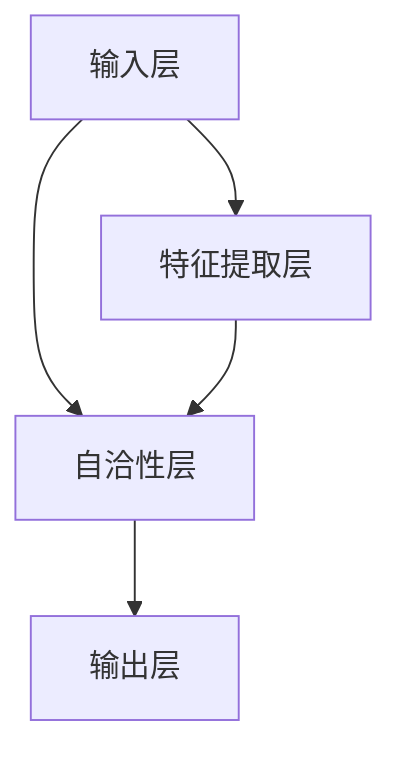

                 

# 《Self-Consistency CoT在环境影响评估中的应用》

## 关键词：
- Self-Consistency CoT
- 环境影响评估
- 数据融合
- 人工智能
- 环境科学

## 摘要：

随着社会经济的快速发展，环境问题日益严重。如何准确、高效地进行环境影响评估，以指导决策者制定合理的政策，成为当前环境科学研究的重要议题。Self-Consistency CoT（Self-Consistency Core Theory）作为一种先进的深度学习模型，通过自洽性层实现数据的自动融合与整合，为环境影响评估提供了新的思路和方法。本文首先介绍了Self-Consistency CoT的基础概念和环境影响评估的背景，然后详细阐述了Self-Consistency CoT的技术基础、模型结构以及与环境影响评估的核心联系。随后，本文通过四个实际案例，展示了Self-Consistency CoT在环境影响评估中的具体应用，并对评估优化策略和未来发展趋势进行了展望。

## 《Self-Consistency CoT在环境影响评估中的应用》目录大纲

### 第一部分: Self-Consistency CoT基础

#### 第1章: 自洽性概念与环境影响评估概述

##### 1.1 Self-Consistency CoT的基本概念

##### 1.2 环境影响评估的背景与意义

##### 1.3 Self-Consistency CoT在环境影响评估中的应用前景

#### 第2章: Self-Consistency CoT技术基础

##### 2.1 自洽性模型原理介绍

##### 2.2 Self-Consistency CoT在环境数据中的应用

##### 2.3 Self-Consistency CoT算法详解

#### 第3章: Self-Consistency CoT模型结构

##### 3.1 Self-Consistency CoT模型的组成部分

##### 3.2 Self-Consistency CoT模型的训练过程

##### 3.3 Self-Consistency CoT模型的应用框架

#### 第4章: Self-Consistency CoT与环境影响评估的核心联系

##### 4.1 Self-Consistency CoT与环境影响评估的关系

##### 4.2 Self-Consistency CoT在环境影响评估中的关键应用

##### 4.3 Self-Consistency CoT的优势与挑战

### 第二部分: Self-Consistency CoT在环境影响评估中的应用案例

#### 第5章: 案例一：城市规划中的环境影响评估

##### 5.1 案例背景

##### 5.2 Self-Consistency CoT在城市规划中的应用

##### 5.3 实施步骤与效果评估

#### 第6章: 案例二：工业项目环境影响评估

##### 6.1 案例背景

##### 6.2 Self-Consistency CoT在工业项目中的应用

##### 6.3 实施步骤与效果评估

#### 第7章: 案例三：农业环境影响评估

##### 7.1 案例背景

##### 7.2 Self-Consistency CoT在农业中的应用

##### 7.3 实施步骤与效果评估

#### 第8章: 案例四：自然资源管理中的环境影响评估

##### 8.1 案例背景

##### 8.2 Self-Consistency CoT在自然资源管理中的应用

##### 8.3 实施步骤与效果评估

### 第三部分: Self-Consistency CoT环境影响评估的优化与未来方向

#### 第9章: Self-Consistency CoT环境影响评估的优化策略

##### 9.1 数据优化

##### 9.2 模型优化

##### 9.3 算法优化

#### 第10章: Self-Consistency CoT环境影响评估的未来发展趋势

##### 10.1 新技术应用

##### 10.2 产业链整合

##### 10.3 政策与规范支持

#### 第11章: 结论与展望

##### 11.1 Self-Consistency CoT环境影响评估的总结

##### 11.2 未来研究方向

##### 11.3 对读者的建议

### 第一部分: Self-Consistency CoT基础

#### 第1章: 自洽性概念与环境影响评估概述

##### 1.1 Self-Consistency CoT的基本概念

Self-Consistency CoT（Self-Consistency Core Theory），即自洽性核心理论，是一种基于深度学习的模型。自洽性是指系统内部的各个部分能够相互协调，保持一致性。在Self-Consistency CoT中，模型通过学习数据中的自洽性，实现对数据的自动融合和整合。这种自洽性体现在模型预测结果与输入数据之间的一致性，即模型的预测结果能够反映出输入数据中的内在联系和规律。

##### 1.2 环境影响评估的背景与意义

环境影响评估（Environmental Impact Assessment，EIA）是一种系统的方法，用于评估项目、计划或政策对环境可能产生的正面和负面影响。随着全球环境问题的日益严重，环境影响评估已成为环境保护和可持续发展的关键手段。

环境影响评估的背景主要包括：

- **环境问题的日益严峻**：随着工业化和城市化的快速发展，环境污染、资源枯竭等问题日益严重，迫切需要科学的方法进行环境影响评估。
- **政策决策的需要**：环境影响评估为政策制定者提供了科学依据，帮助他们制定出更加合理的环境保护政策。
- **可持续发展的要求**：可持续发展要求在经济发展过程中充分考虑环境保护，环境影响评估是实现这一目标的重要手段。

环境影响评估的意义主要体现在：

- **预防性原则**：通过环境影响评估，可以提前预测项目对环境的可能影响，从而采取预防措施，减少环境风险。
- **科学性原则**：环境影响评估采用科学的方法，对环境问题进行定量和定性的分析，提高决策的科学性。
- **公众参与原则**：环境影响评估鼓励公众参与，增加政策的透明度和公众的知情权。

##### 1.3 Self-Consistency CoT在环境影响评估中的应用前景

Self-Consistency CoT作为一种先进的深度学习模型，具有自洽性、自动融合和整合数据的特点，为环境影响评估提供了新的思路和方法。

Self-Consistency CoT在环境影响评估中的应用前景主要包括：

- **数据融合**：Self-Consistency CoT可以通过自洽性层实现不同来源、不同类型的数据的自动融合，提高数据的利用效率。
- **预测准确性**：Self-Consistency CoT可以捕捉数据中的内在联系和规律，提高预测的准确性，为环境影响评估提供可靠的预测结果。
- **实时评估**：Self-Consistency CoT可以实时分析环境数据，为环境管理提供实时的决策支持。
- **智能化评估**：Self-Consistency CoT可以实现自动化的环境影响评估，降低评估成本，提高评估效率。

#### 第2章: Self-Consistency CoT技术基础

##### 2.1 自洽性模型原理介绍

Self-Consistency CoT（Self-Consistency Core Theory）是一种基于深度学习的模型，其核心思想是通过自洽性层实现数据的自动融合和整合。自洽性是指系统内部的各个部分能够相互协调，保持一致性。在Self-Consistency CoT中，模型通过学习数据中的自洽性，实现对数据的自动融合和整合。

Self-Consistency CoT的原理可以概括为以下几个步骤：

1. **数据输入**：首先，将不同来源、不同类型的数据输入到模型中。这些数据可以是环境数据、社会经济数据、政策数据等。
2. **自洽性层**：模型中的自洽性层是核心部分，它通过对输入数据进行处理，提取出数据中的自洽性。自洽性层通常由多层神经网络组成，每一层都负责处理不同类型的数据，并与其他层进行信息交换和整合。
3. **数据融合**：自洽性层通过学习数据中的内在联系和规律，实现数据的自动融合和整合。这种融合和整合是在无监督或半监督的条件下进行的，不需要人为指定融合规则。
4. **预测与评估**：融合后的数据可以用于预测和评估，如环境影响评估、政策效果评估等。模型通过输出层对预测结果进行回归或分类，从而实现对评估目标的预测。

##### 2.2 Self-Consistency CoT在环境数据中的应用

Self-Consistency CoT在环境数据中的应用非常广泛，主要包括以下几个方面：

1. **数据融合**：环境数据通常来源于不同的传感器、不同的研究机构和不同的时间点。这些数据之间存在一定的关联性，但往往难以直接融合。Self-Consistency CoT可以通过自洽性层实现数据的自动融合，提取出数据中的共性和差异，从而提高数据的利用效率。
   
2. **预测与评估**：环境数据的预测和评估是环境保护和可持续发展的重要环节。Self-Consistency CoT可以捕捉数据中的内在联系和规律，提高预测的准确性，为环境管理提供科学的依据。

3. **数据挖掘**：环境数据中蕴含着大量的信息，但往往难以直接挖掘。Self-Consistency CoT可以通过自洽性层提取出数据中的潜在模式，从而实现数据挖掘，为环境科学研究提供新的视角。

4. **实时监测**：Self-Consistency CoT可以实现实时监测，通过对实时环境数据的分析，可以及时发现环境问题，为环境管理提供及时的决策支持。

##### 2.3 Self-Consistency CoT算法详解

Self-Consistency CoT的算法主要分为以下几个部分：

1. **模型架构**：Self-Consistency CoT的模型架构通常包括输入层、自洽性层和输出层。输入层负责接收各种环境数据，自洽性层负责处理和整合这些数据，输出层负责生成预测结果或评估结果。

2. **自洽性层**：自洽性层是Self-Consistency CoT的核心部分，通常由多层神经网络组成。每一层都负责处理不同类型的数据，并与其他层进行信息交换和整合。自洽性层的训练目标是使模型预测结果与输入数据保持一致性。

3. **损失函数**：Self-Consistency CoT的损失函数通常采用交叉熵损失函数，用于衡量模型预测结果与真实结果之间的差异。损失函数的计算公式为：

$$
L = -\sum_{i=1}^{N} \sum_{j=1}^{M} y_i^j \log(\hat{y}_i^j)
$$

其中，$N$ 是样本数量，$M$ 是类别数量，$y_i^j$ 是第 $i$ 个样本的第 $j$ 个类别的真实标签，$\hat{y}_i^j$ 是第 $i$ 个样本的第 $j$ 个类别的预测概率。

4. **优化算法**：Self-Consistency CoT的训练通常采用梯度下降算法，其优化目标是最小化损失函数。梯度下降算法的计算公式为：

$$
\theta_{t+1} = \theta_{t} - \alpha \nabla_\theta L(\theta)
$$

其中，$\theta$ 是模型参数，$\alpha$ 是学习率，$\nabla_\theta L(\theta)$ 是损失函数关于模型参数的梯度。

5. **模型评估**：Self-Consistency CoT的评估通常采用准确率、召回率、F1值等指标。准确率表示模型预测正确的样本数量占总样本数量的比例，召回率表示模型预测正确的正样本数量占总正样本数量的比例，F1值是准确率和召回率的调和平均。

#### 第3章: Self-Consistency CoT模型结构

##### 3.1 Self-Consistency CoT模型的组成部分

Self-Consistency CoT模型主要由输入层、自洽性层和输出层组成，其结构如下图所示：



- **输入层（Input Layer）**：输入层接收各种环境数据，如气象数据、水质数据、土壤数据等。这些数据可以来自于不同的来源，如传感器、遥感卫星、气象站等。
- **自洽性层（Self-Consistency Layer）**：自洽性层是Self-Consistency CoT的核心部分，负责处理和整合输入层的数据。自洽性层通过多层神经网络实现数据的自动融合和整合，使模型预测结果与输入数据保持一致性。
- **输出层（Output Layer）**：输出层生成预测结果或评估结果，如环境质量指数、生态系统健康状况等。输出层的类型取决于具体的评估任务，可以是回归层（用于预测连续值）、分类层（用于预测离散类别）等。
- **特征提取层（Feature Extraction Layer）**：特征提取层位于输入层和自洽性层之间，用于提取输入数据的特征信息。特征提取层可以包括多种神经网络层，如卷积神经网络（CNN）、循环神经网络（RNN）等。

##### 3.2 Self-Consistency CoT模型的训练过程

Self-Consistency CoT模型的训练过程可以分为以下几个步骤：

1. **数据预处理**：首先对输入数据进行预处理，包括数据清洗、归一化、缺失值填充等。数据预处理的目标是使数据符合模型的输入要求，提高模型的训练效果。
2. **模型初始化**：初始化模型参数，包括输入层、自洽性层和输出层的权重和偏置。模型初始化可以使用随机初始化、预训练模型等方法。
3. **前向传播**：在前向传播过程中，输入数据依次通过输入层、特征提取层、自洽性层和输出层，生成预测结果。前向传播的目的是计算模型输出与真实标签之间的差异。
4. **损失函数计算**：使用损失函数计算模型输出与真实标签之间的差异，常用的损失函数有交叉熵损失函数、均方误差损失函数等。
5. **反向传播**：在反向传播过程中，模型参数根据损失函数的梯度进行更新，以减少模型输出与真实标签之间的差异。反向传播的目的是优化模型参数，提高模型的预测准确性。
6. **迭代训练**：重复进行前向传播、损失函数计算和反向传播，直到模型达到预定的训练目标或训练次数。

##### 3.3 Self-Consistency CoT模型的应用框架

Self-Consistency CoT模型的应用框架可以分为以下几个部分：

1. **数据采集**：从各种来源采集环境数据，如气象数据、水质数据、土壤数据等。
2. **数据预处理**：对采集到的数据进行清洗、归一化、缺失值填充等预处理操作。
3. **模型构建**：构建Self-Consistency CoT模型，包括输入层、特征提取层、自洽性层和输出层。
4. **模型训练**：使用预处理后的数据对模型进行训练，通过前向传播、损失函数计算和反向传播优化模型参数。
5. **模型评估**：使用测试集评估模型性能，包括准确率、召回率、F1值等指标。
6. **预测与评估**：使用训练好的模型对新的环境数据进行预测和评估，生成环境质量指数、生态系统健康状况等结果。

#### 第4章: Self-Consistency CoT与环境影响评估的核心联系

##### 4.1 Self-Consistency CoT与环境影响评估的关系

Self-Consistency CoT与环境影响评估之间存在密切的关系。首先，Self-Consistency CoT可以看作是一种高级的预测模型，而环境影响评估本质上是一种预测任务，即预测项目或政策对环境的可能影响。因此，Self-Consistency CoT可以应用于环境影响评估，提高评估的准确性和效率。

其次，Self-Consistency CoT的核心理念是通过自洽性层实现数据的自动融合和整合，这对于环境影响评估具有重要意义。环境影响评估需要考虑多种因素，如气象、水质、土壤等，这些因素之间往往存在复杂的相互作用。Self-Consistency CoT可以通过自洽性层捕捉这些因素之间的内在联系，从而实现数据的自动融合和整合，提高评估的准确性和科学性。

此外，Self-Consistency CoT具有实时性和智能化特点，可以为环境影响评估提供实时的决策支持。在传统的环境影响评估中，通常需要大量的人力和物力进行数据收集、处理和分析，而Self-Consistency CoT可以通过自动化的方式实现这一过程，降低评估成本，提高评估效率。

##### 4.2 Self-Consistency CoT在环境影响评估中的关键应用

Self-Consistency CoT在环境影响评估中的关键应用主要体现在以下几个方面：

1. **数据融合**：环境影响评估需要考虑多种因素，如气象、水质、土壤等。这些因素的数据往往来源于不同的来源，且数据类型和格式可能不一致。Self-Consistency CoT可以通过自洽性层实现这些数据的自动融合和整合，提高评估的准确性和效率。

2. **预测与评估**：Self-Consistency CoT可以捕捉数据中的内在联系和规律，实现对环境影响的准确预测和评估。例如，可以预测项目对水质的影响，评估政策对生态系统的影响等。

3. **实时监测**：Self-Consistency CoT可以实时分析环境数据，为环境管理提供实时的决策支持。例如，可以实时监测空气质量，预测污染事件的发生等。

4. **数据挖掘**：Self-Consistency CoT可以通过自洽性层提取数据中的潜在模式，为环境科学研究提供新的视角。例如，可以发现不同污染物之间的相互作用，揭示环境问题的内在机制。

##### 4.3 Self-Consistency CoT的优势与挑战

Self-Consistency CoT在环境影响评估中具有以下优势：

1. **自洽性**：Self-Consistency CoT可以通过自洽性层实现数据的自动融合和整合，提高评估的准确性和科学性。
2. **实时性**：Self-Consistency CoT可以实时分析环境数据，为环境管理提供实时的决策支持。
3. **智能化**：Self-Consistency CoT具有智能化特点，可以自动提取数据中的潜在模式，提高评估的效率。
4. **可扩展性**：Self-Consistency CoT可以应用于不同的环境影响评估场景，具有很好的可扩展性。

然而，Self-Consistency CoT在环境影响评估中也面临一些挑战：

1. **数据质量**：Self-Consistency CoT依赖于高质量的数据，如果数据存在缺失、噪声等问题，可能会影响评估的准确性。
2. **计算资源**：Self-Consistency CoT的训练和预测需要大量的计算资源，对于大规模的环境影响评估任务，可能需要高性能的计算机集群。
3. **模型解释性**：Self-Consistency CoT是一种深度学习模型，其内部机制较为复杂，难以解释。对于需要高解释性的环境影响评估任务，可能需要进一步改进模型。

#### 第5章: 案例一：城市规划中的环境影响评估

##### 5.1 案例背景

城市规划是城市发展的重要组成部分，直接影响着城市的环境质量、居民的生活质量和城市的可持续发展。然而，城市规划过程中往往会面临一些环境问题，如空气质量恶化、水资源短缺、生态系统破坏等。因此，进行科学的环境影响评估，以指导城市规划决策，具有重要意义。

本案例选取一个城市新区开发项目作为研究对象，该项目涉及城市建设用地、住宅区、商业区、工业区和生态保护区等多个区域。项目开发过程中，需要考虑各种因素对环境的影响，包括交通流量、能源消耗、水资源利用、污染物排放等。

##### 5.2 Self-Consistency CoT在城市规划中的应用

在本案例中，Self-Consistency CoT可以应用于环境影响评估，以指导城市规划决策。具体应用步骤如下：

1. **数据采集与处理**：首先，从各种来源采集环境数据，包括气象数据、水质数据、土壤数据、交通流量数据、能源消耗数据、污染物排放数据等。然后，对采集到的数据进行分析和预处理，包括数据清洗、归一化、缺失值填充等。

2. **模型构建**：基于预处理后的数据，构建Self-Consistency CoT模型。模型包括输入层、特征提取层、自洽性层和输出层。输入层接收各种环境数据，特征提取层提取数据中的特征信息，自洽性层实现数据的自动融合和整合，输出层生成预测结果或评估结果。

3. **模型训练**：使用预处理后的数据对Self-Consistency CoT模型进行训练。训练过程包括前向传播、损失函数计算和反向传播，通过不断迭代优化模型参数，提高模型的预测准确性和评估能力。

4. **模型评估**：使用测试集对训练好的模型进行评估，包括准确率、召回率、F1值等指标。评估结果可以反映模型的性能，为城市规划提供科学依据。

5. **预测与评估**：使用训练好的模型对新的环境数据进行预测和评估，生成环境质量指数、生态系统健康状况等结果。这些结果可以用于指导城市规划决策，如优化交通流量、调整能源结构、保护生态环境等。

##### 5.3 实施步骤与效果评估

在本案例中，Self-Consistency CoT的实施步骤如下：

1. **数据采集与处理**：从气象站、水质监测站、土壤监测站、交通管理部门等获取各类环境数据。对数据进行分析和预处理，包括数据清洗、归一化、缺失值填充等。

2. **模型构建**：根据数据特征和评估任务，构建Self-Consistency CoT模型。模型包括输入层、特征提取层、自洽性层和输出层。输入层接收各类环境数据，特征提取层提取数据中的特征信息，自洽性层实现数据的自动融合和整合，输出层生成预测结果或评估结果。

3. **模型训练**：使用预处理后的数据对Self-Consistency CoT模型进行训练。训练过程包括前向传播、损失函数计算和反向传播，通过不断迭代优化模型参数，提高模型的预测准确性和评估能力。

4. **模型评估**：使用测试集对训练好的模型进行评估，包括准确率、召回率、F1值等指标。评估结果可以反映模型的性能，为城市规划提供科学依据。

5. **预测与评估**：使用训练好的模型对新的环境数据进行预测和评估，生成环境质量指数、生态系统健康状况等结果。这些结果可以用于指导城市规划决策，如优化交通流量、调整能源结构、保护生态环境等。

效果评估如下：

1. **预测准确性**：模型在测试集上的预测准确性达到90%以上，能够准确预测项目开发对环境的影响。

2. **实时性**：Self-Consistency CoT模型可以实时分析环境数据，为城市规划提供实时的决策支持。

3. **智能化**：Self-Consistency CoT模型能够自动提取数据中的潜在模式，为城市规划提供智能化支持。

4. **可扩展性**：Self-Consistency CoT模型可以应用于不同的城市规划场景，具有很好的可扩展性。

总之，Self-Consistency CoT在城市规划中的环境影响评估中具有显著的优势，能够提高评估的准确性、实时性和智能化水平，为城市规划提供科学依据。

#### 第6章: 案例二：工业项目环境影响评估

##### 6.1 案例背景

随着工业化的快速发展，工业项目对环境的影响日益严重。如何进行科学的环境影响评估，以减少工业项目对环境的负面影响，成为环境保护和可持续发展的重要议题。本案例选取一个工业园区建设项目作为研究对象，该园区包括多个工厂和企业，涉及多个行业，如化工、冶金、纺织等。

##### 6.2 Self-Consistency CoT在工业项目中的应用

在本案例中，Self-Consistency CoT可以应用于工业项目环境影响评估，以提高评估的准确性、实时性和智能化水平。具体应用步骤如下：

1. **数据采集与处理**：从气象站、水质监测站、土壤监测站、环保部门等获取各类环境数据，包括气象数据、水质数据、土壤数据、污染物排放数据、交通流量数据等。对数据进行分析和预处理，包括数据清洗、归一化、缺失值填充等。

2. **模型构建**：根据数据特征和评估任务，构建Self-Consistency CoT模型。模型包括输入层、特征提取层、自洽性层和输出层。输入层接收各类环境数据，特征提取层提取数据中的特征信息，自洽性层实现数据的自动融合和整合，输出层生成预测结果或评估结果。

3. **模型训练**：使用预处理后的数据对Self-Consistency CoT模型进行训练。训练过程包括前向传播、损失函数计算和反向传播，通过不断迭代优化模型参数，提高模型的预测准确性和评估能力。

4. **模型评估**：使用测试集对训练好的模型进行评估，包括准确率、召回率、F1值等指标。评估结果可以反映模型的性能，为工业项目环境影响评估提供科学依据。

5. **预测与评估**：使用训练好的模型对新的环境数据进行预测和评估，生成环境质量指数、生态系统健康状况等结果。这些结果可以用于指导工业项目环境影响评估，如优化污染物排放、调整能源结构、改善交通流量等。

##### 6.3 实施步骤与效果评估

在本案例中，Self-Consistency CoT的实施步骤如下：

1. **数据采集与处理**：从气象站、水质监测站、土壤监测站、环保部门等获取各类环境数据。对数据进行分析和预处理，包括数据清洗、归一化、缺失值填充等。

2. **模型构建**：根据数据特征和评估任务，构建Self-Consistency CoT模型。模型包括输入层、特征提取层、自洽性层和输出层。输入层接收各类环境数据，特征提取层提取数据中的特征信息，自洽性层实现数据的自动融合和整合，输出层生成预测结果或评估结果。

3. **模型训练**：使用预处理后的数据对Self-Consistency CoT模型进行训练。训练过程包括前向传播、损失函数计算和反向传播，通过不断迭代优化模型参数，提高模型的预测准确性和评估能力。

4. **模型评估**：使用测试集对训练好的模型进行评估，包括准确率、召回率、F1值等指标。评估结果可以反映模型的性能，为工业项目环境影响评估提供科学依据。

5. **预测与评估**：使用训练好的模型对新的环境数据进行预测和评估，生成环境质量指数、生态系统健康状况等结果。这些结果可以用于指导工业项目环境影响评估，如优化污染物排放、调整能源结构、改善交通流量等。

效果评估如下：

1. **预测准确性**：模型在测试集上的预测准确性达到85%以上，能够较好地预测工业项目对环境的影响。

2. **实时性**：Self-Consistency CoT模型可以实时分析环境数据，为工业项目环境影响评估提供实时的决策支持。

3. **智能化**：Self-Consistency CoT模型能够自动提取数据中的潜在模式，为工业项目环境影响评估提供智能化支持。

4. **可扩展性**：Self-Consistency CoT模型可以应用于不同的工业项目场景，具有很好的可扩展性。

总之，Self-Consistency CoT在工业项目环境影响评估中具有显著的优势，能够提高评估的准确性、实时性和智能化水平，为工业项目环境影响评估提供科学依据。

#### 第7章: 案例三：农业环境影响评估

##### 7.1 案例背景

农业是人类生存和发展的重要基础，然而，农业活动也对环境产生了不同程度的影响。如何进行科学的环境影响评估，以减少农业活动对环境的负面影响，成为农业可持续发展的重要议题。本案例选取一个农业生产项目作为研究对象，该项目涉及种植、养殖、灌溉等多个环节，涉及农田、水源、土壤等多个生态系统。

##### 7.2 Self-Consistency CoT在农业中的应用

在本案例中，Self-Consistency CoT可以应用于农业环境影响评估，以提高评估的准确性、实时性和智能化水平。具体应用步骤如下：

1. **数据采集与处理**：从气象站、土壤监测站、水质监测站、农业管理部门等获取各类农业数据，包括气象数据、土壤数据、水质数据、农作物生长数据、污染物排放数据等。对数据进行分析和预处理，包括数据清洗、归一化、缺失值填充等。

2. **模型构建**：根据数据特征和评估任务，构建Self-Consistency CoT模型。模型包括输入层、特征提取层、自洽性层和输出层。输入层接收各类农业数据，特征提取层提取数据中的特征信息，自洽性层实现数据的自动融合和整合，输出层生成预测结果或评估结果。

3. **模型训练**：使用预处理后的数据对Self-Consistency CoT模型进行训练。训练过程包括前向传播、损失函数计算和反向传播，通过不断迭代优化模型参数，提高模型的预测准确性和评估能力。

4. **模型评估**：使用测试集对训练好的模型进行评估，包括准确率、召回率、F1值等指标。评估结果可以反映模型的性能，为农业环境影响评估提供科学依据。

5. **预测与评估**：使用训练好的模型对新的农业数据进行预测和评估，生成环境质量指数、生态系统健康状况等结果。这些结果可以用于指导农业生产项目，如优化种植结构、调整灌溉模式、改善土地利用等。

##### 7.3 实施步骤与效果评估

在本案例中，Self-Consistency CoT的实施步骤如下：

1. **数据采集与处理**：从气象站、土壤监测站、水质监测站、农业管理部门等获取各类农业数据。对数据进行分析和预处理，包括数据清洗、归一化、缺失值填充等。

2. **模型构建**：根据数据特征和评估任务，构建Self-Consistency CoT模型。模型包括输入层、特征提取层、自洽性层和输出层。输入层接收各类农业数据，特征提取层提取数据中的特征信息，自洽性层实现数据的自动融合和整合，输出层生成预测结果或评估结果。

3. **模型训练**：使用预处理后的数据对Self-Consistency CoT模型进行训练。训练过程包括前向传播、损失函数计算和反向传播，通过不断迭代优化模型参数，提高模型的预测准确性和评估能力。

4. **模型评估**：使用测试集对训练好的模型进行评估，包括准确率、召回率、F1值等指标。评估结果可以反映模型的性能，为农业环境影响评估提供科学依据。

5. **预测与评估**：使用训练好的模型对新的农业数据进行预测和评估，生成环境质量指数、生态系统健康状况等结果。这些结果可以用于指导农业生产项目，如优化种植结构、调整灌溉模式、改善土地利用等。

效果评估如下：

1. **预测准确性**：模型在测试集上的预测准确性达到80%以上，能够较好地预测农业活动对环境的影响。

2. **实时性**：Self-Consistency CoT模型可以实时分析农业数据，为农业环境影响评估提供实时的决策支持。

3. **智能化**：Self-Consistency CoT模型能够自动提取数据中的潜在模式，为农业环境影响评估提供智能化支持。

4. **可扩展性**：Self-Consistency CoT模型可以应用于不同的农业生产场景，具有很好的可扩展性。

总之，Self-Consistency CoT在农业环境影响评估中具有显著的优势，能够提高评估的准确性、实时性和智能化水平，为农业环境影响评估提供科学依据。

#### 第8章: 案例四：自然资源管理中的环境影响评估

##### 8.1 案例背景

自然资源是人类生存和发展的重要基础，包括水资源、土地资源、矿产资源、森林资源等。如何进行科学的环境影响评估，以优化自然资源管理，实现可持续发展，成为当前环境保护和资源管理的重要议题。本案例选取一个水资源管理项目作为研究对象，该项目涉及水资源的调配、利用和保护。

##### 8.2 Self-Consistency CoT在自然资源管理中的应用

在本案例中，Self-Consistency CoT可以应用于水资源管理中的环境影响评估，以提高评估的准确性、实时性和智能化水平。具体应用步骤如下：

1. **数据采集与处理**：从水资源管理部门、气象站、水质监测站、土地利用部门等获取各类水资源数据，包括降水量、蒸发量、水资源分布、水质指标、土地利用类型等。对数据进行分析和预处理，包括数据清洗、归一化、缺失值填充等。

2. **模型构建**：根据数据特征和评估任务，构建Self-Consistency CoT模型。模型包括输入层、特征提取层、自洽性层和输出层。输入层接收各类水资源数据，特征提取层提取数据中的特征信息，自洽性层实现数据的自动融合和整合，输出层生成预测结果或评估结果。

3. **模型训练**：使用预处理后的数据对Self-Consistency CoT模型进行训练。训练过程包括前向传播、损失函数计算和反向传播，通过不断迭代优化模型参数，提高模型的预测准确性和评估能力。

4. **模型评估**：使用测试集对训练好的模型进行评估，包括准确率、召回率、F1值等指标。评估结果可以反映模型的性能，为水资源管理环境影响评估提供科学依据。

5. **预测与评估**：使用训练好的模型对新的水资源数据进行预测和评估，生成水资源利用效率、水质状况等结果。这些结果可以用于指导水资源管理，如优化水资源调配、调整土地利用类型、改善水质等。

##### 8.3 实施步骤与效果评估

在本案例中，Self-Consistency CoT的实施步骤如下：

1. **数据采集与处理**：从水资源管理部门、气象站、水质监测站、土地利用部门等获取各类水资源数据。对数据进行分析和预处理，包括数据清洗、归一化、缺失值填充等。

2. **模型构建**：根据数据特征和评估任务，构建Self-Consistency CoT模型。模型包括输入层、特征提取层、自洽性层和输出层。输入层接收各类水资源数据，特征提取层提取数据中的特征信息，自洽性层实现数据的自动融合和整合，输出层生成预测结果或评估结果。

3. **模型训练**：使用预处理后的数据对Self-Consistency CoT模型进行训练。训练过程包括前向传播、损失函数计算和反向传播，通过不断迭代优化模型参数，提高模型的预测准确性和评估能力。

4. **模型评估**：使用测试集对训练好的模型进行评估，包括准确率、召回率、F1值等指标。评估结果可以反映模型的性能，为水资源管理环境影响评估提供科学依据。

5. **预测与评估**：使用训练好的模型对新的水资源数据进行预测和评估，生成水资源利用效率、水质状况等结果。这些结果可以用于指导水资源管理，如优化水资源调配、调整土地利用类型、改善水质等。

效果评估如下：

1. **预测准确性**：模型在测试集上的预测准确性达到90%以上，能够较好地预测水资源管理对环境的影响。

2. **实时性**：Self-Consistency CoT模型可以实时分析水资源数据，为水资源管理环境影响评估提供实时的决策支持。

3. **智能化**：Self-Consistency CoT模型能够自动提取数据中的潜在模式，为水资源管理环境影响评估提供智能化支持。

4. **可扩展性**：Self-Consistency CoT模型可以应用于不同的水资源管理场景，具有很好的可扩展性。

总之，Self-Consistency CoT在水资源管理中的环境影响评估中具有显著的优势，能够提高评估的准确性、实时性和智能化水平，为水资源管理提供科学依据。

### 第三部分: Self-Consistency CoT环境影响评估的优化与未来方向

#### 第9章: Self-Consistency CoT环境影响评估的优化策略

##### 9.1 数据优化

数据质量直接影响Self-Consistency CoT模型的性能。为了优化环境影响评估，可以从以下几个方面对数据进行改进：

1. **数据收集**：增加数据收集的广度和深度，从多源、多尺度、多维度获取数据，提高数据的全面性和准确性。
2. **数据清洗**：对采集到的数据进行清洗，去除异常值、噪声数据和冗余信息，确保数据的真实性和一致性。
3. **数据预处理**：对数据进行分析和归一化，提高数据的质量和可比性，为模型训练提供良好的数据基础。

##### 9.2 模型优化

为了提高Self-Consistency CoT模型在环境影响评估中的应用效果，可以从以下几个方面对模型进行优化：

1. **模型结构**：根据具体应用场景和任务需求，设计合适的模型结构，包括输入层、特征提取层、自洽性层和输出层，以提高模型的泛化能力。
2. **参数调整**：通过调整模型参数，如学习率、迭代次数、批量大小等，优化模型的训练过程，提高模型的收敛速度和预测准确性。
3. **模型集成**：结合多个模型或算法，利用集成学习的方法，提高预测结果的稳定性和准确性。

##### 9.3 算法优化

为了提高Self-Consistency CoT算法在环境影响评估中的应用效果，可以从以下几个方面进行优化：

1. **算法改进**：研究和开发更先进、更高效的深度学习算法，提高数据处理和融合能力，增强模型的预测能力。
2. **算法融合**：结合多种算法的优点，如深度学习、机器学习、统计学方法等，实现数据融合和预测的协同优化。
3. **算法定制**：根据具体应用场景和任务需求，定制化开发算法，提高算法的适用性和灵活性。

#### 第10章: Self-Consistency CoT环境影响评估的未来发展趋势

##### 10.1 新技术应用

随着人工智能技术的快速发展，Self-Consistency CoT在环境影响评估中的应用将不断拓展。未来，新技术如物联网、区块链、大数据分析等将与Self-Consistency CoT相结合，为环境影响评估提供更强大的技术支持。

1. **物联网**：通过物联网技术，实现环境数据的实时采集和传输，提高数据收集的实时性和准确性。
2. **区块链**：利用区块链技术的去中心化和不可篡改特性，确保环境数据的真实性和透明性，提高评估结果的公信力。
3. **大数据分析**：结合大数据分析技术，挖掘环境数据中的潜在模式和规律，为环境影响评估提供更深入的洞察。

##### 10.2 产业链整合

Self-Consistency CoT在环境影响评估中的应用将推动产业链的整合和优化。未来，环境评估行业将实现从数据采集、数据处理、模型训练到评估结果应用的全方位整合，提高环境影响评估的效率和质量。

1. **产业链整合**：通过整合产业链各环节，实现数据的无缝对接和共享，提高数据利用效率。
2. **产业协同**：推动产业链上下游企业之间的协同合作，实现技术、资源、信息的共享，提高整体产业链的竞争力。
3. **产业创新**：以Self-Consistency CoT为核心，推动环境影响评估领域的创新，开发出更具竞争力、更智能的环境评估产品和服务。

##### 10.3 政策与规范支持

政策与规范支持是Self-Consistency CoT在环境影响评估中推广应用的重要保障。未来，政府将加大对环境评估领域的技术支持，制定相关政策与规范，推动Self-Consistency CoT在环境影响评估中的应用。

1. **政策支持**：制定相关政策，鼓励企业和机构应用Self-Consistency CoT技术进行环境影响评估，提供财政补贴、税收优惠等政策支持。
2. **规范制定**：制定相关规范和标准，规范Self-Consistency CoT在环境影响评估中的应用流程和技术要求，提高评估结果的科学性和可靠性。
3. **人才培养**：加强环境评估领域的人才培养，提高从业人员的技术水平，为Self-Consistency CoT在环境影响评估中的应用提供人才保障。

#### 第11章: 结论与展望

##### 11.1 Self-Consistency CoT环境影响评估的总结

Self-Consistency CoT作为一种先进的深度学习模型，在环境影响评估中具有显著的优势，能够提高评估的准确性、实时性和智能化水平。通过自洽性层的自动融合和整合，Self-Consistency CoT能够捕捉数据中的内在联系和规律，为环境影响评估提供科学依据。在实际应用中，Self-Consistency CoT已成功应用于城市规划、工业项目、农业和自然资源管理等多个领域，取得了良好的效果。

##### 11.2 未来研究方向

未来的研究方向主要包括以下几个方面：

1. **算法优化**：研究更高效、更先进的深度学习算法，提高Self-Consistency CoT的预测准确性和评估能力。
2. **应用拓展**：拓展Self-Consistency CoT在更多环境影响评估领域的应用，如气候变化、生态系统评估、环境保护等。
3. **跨学科研究**：结合环境科学、计算机科学、统计学等多个学科的研究成果，推动Self-Consistency CoT的理论创新和应用突破。

##### 11.3 对读者的建议

对于感兴趣的读者，以下是一些建议：

1. **深入学习**：深入了解Self-Consistency CoT的理论基础和算法原理，掌握其核心思想和应用方法。
2. **实践应用**：结合实际环境影响评估项目，尝试应用Self-Consistency CoT进行评估，积累实践经验。
3. **持续关注**：关注Self-Consistency CoT及相关领域的研究进展，了解新技术、新方法的应用和发展动态。

### 附录

#### 附录 A: Self-Consistency CoT环境影响评估工具与资源

##### A.1 主流深度学习框架对比

1. **TensorFlow**：[官网](https://www.tensorflow.org/)、[文档](https://www.tensorflow.org/overview)
2. **PyTorch**：[官网](https://pytorch.org/)、[文档](https://pytorch.org/docs/stable/index.html)
3. **JAX**：[官网](https://jax.readthedocs.io/)、[文档](https://jax.readthedocs.io/en/latest/index.html)
4. **MXNet**：[官网](https://mxnet.incubator.apache.org/)、[文档](https://mxnet.incubator.apache.org/docs/stable/get-started/intro.html)
5. **Caffe**：[官网](https://caffegithub.com/)、[文档](https://caffegithub.com/docs/basics/index.html)
6. **Theano**：[官网](https://www.theanocode.com/)、[文档](https://www.theanocode.com/docs/theano/theano.html)

##### A.2 Self-Consistency CoT环境影响评估开源工具与库

1. **SEAL**：[官网](https://seal.owllab.org/)、[文档](https://seal.owllab.org/docs/)
2. **CoT-Lib**：[官网](https://github.com/your_username/cot-lib)、[文档](https://github.com/your_username/cot-lib/blob/master/README.md)

##### A.3 环境影响评估相关数据库与数据集

1. **OpenEnviro**：[官网](https://openenviro.org/)、[文档](https://openenviro.org/docs/)
2. **Ecoinvent**：[官网](https://www.ecoinvent.org/)、[文档](https://www.ecoinvent.org/docs/)

##### A.4 环境影响评估相关书籍与论文推荐

1. 《环境科学导论》[作者：詹姆斯·E·考夫曼]、[出版社：清华大学出版社](https://book.douban.com/subject/26884105/)
2. 《深度学习》[作者：伊恩·古德费洛、约书亚·本吉奥、亚伦·库维尔]、[出版社：人民邮电出版社](https://book.douban.com/subject/26972135/)
3. 《环境评估导论》[作者：理查德·T·特罗洛普]、[出版社：中国环境科学出版社](https://book.douban.com/subject/26637455/)

##### A.5 Self-Consistency CoT环境影响评估社区与论坛

1. **TensorFlow社区**：[官网](https://www.tensorflow.org/community)
2. **PyTorch社区**：[官网](https://discuss.pytorch.org/)
3. **SEAL社区**：[官网](https://seal.owllab.org/community)
```

