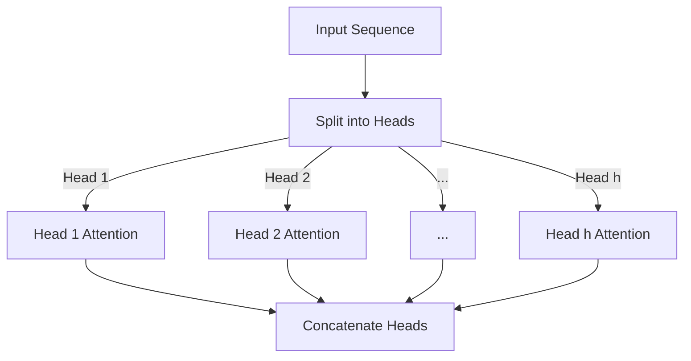
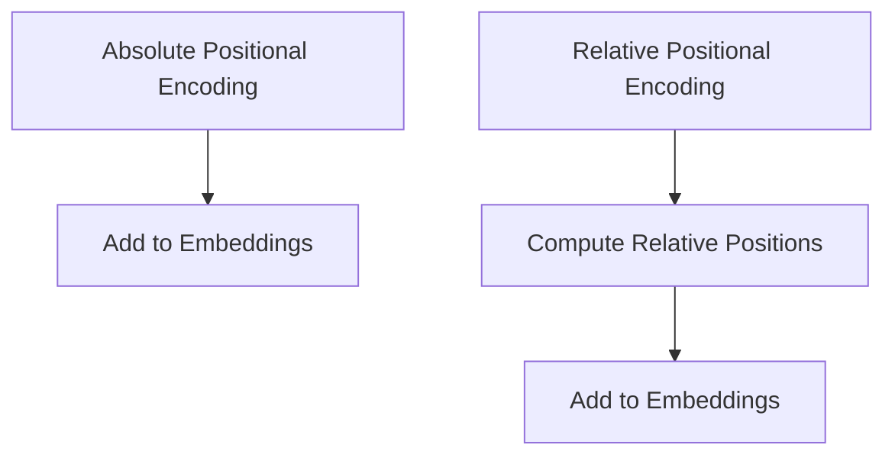
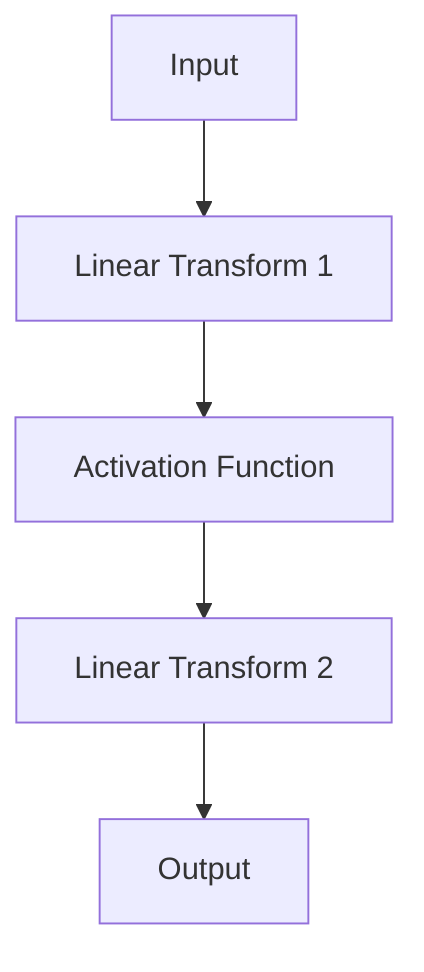
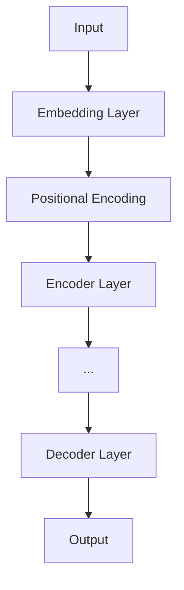
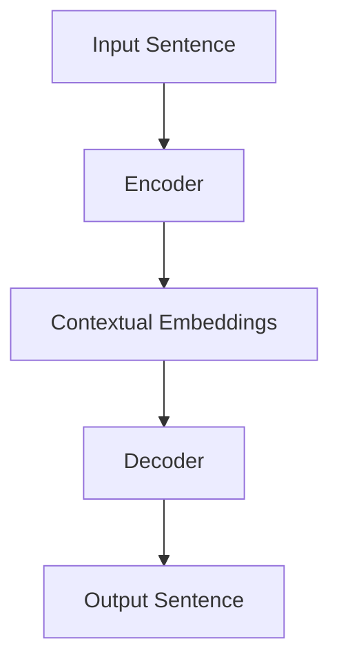
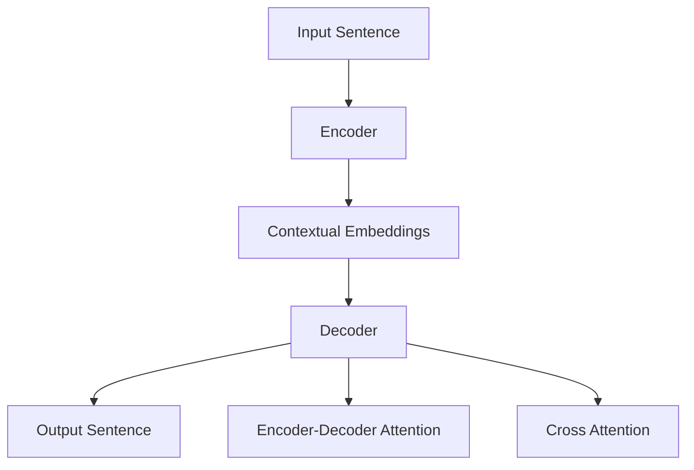

                 

### 文章标题

Transformer 原理与代码实例讲解

---

#### 文章关键词

Transformer、自注意力机制、位置编码、前馈神经网络、机器翻译、语言模型、文本分类、开源实现、深度学习框架

#### 文章摘要

本文将深入探讨Transformer模型的基本原理、核心概念和数学基础，并通过实际代码实例讲解其在语言模型、机器翻译和文本分类等任务中的应用。文章结构清晰，旨在帮助读者全面理解Transformer模型的内部工作机制和实战应用，为自然语言处理领域的研究和实践提供有益的参考。

---

### 第一部分: Transformer的基础

#### 第1章: Transformer概述

#### 1.1 Transformer的背景和意义

Transformer模型的提出，是自然语言处理（NLP）领域的一大突破。在Transformer之前，循环神经网络（RNN）和长短时记忆网络（LSTM）是处理序列到序列任务（如机器翻译、文本摘要和问答系统）的主流方法。然而，这些方法在处理长距离依赖关系和并行计算方面存在局限。Transformer模型的出现，不仅解决了这些问题，还推动了NLP领域的发展。

##### 1.1.1 Transformer的起源

Transformer模型由Google AI团队在2017年提出，并在论文“Attention Is All You Need”中详细描述。该模型的提出，标志着自然语言处理领域的一个重要转折点。Transformer的核心思想是使用自注意力机制（Self-Attention）来建模输入序列中任意两个位置之间的依赖关系，从而提高了模型的表示能力和计算效率。

##### 1.1.2 Transformer在自然语言处理中的应用

Transformer模型在多个自然语言处理任务中取得了显著成果，包括：

- **机器翻译**：Transformer模型在机器翻译任务中表现出色，尤其是在长距离依赖建模和并行计算方面具有显著优势。
- **文本摘要**：Transformer模型可以高效地处理长文本，并在生成式和抽取式文本摘要任务中取得了很好的效果。
- **问答系统**：通过理解上下文和问题的关系，Transformer模型在问答系统中的应用也取得了显著的成果。
- **情感分析**：Transformer模型能够捕捉文本中的情感倾向，并在情感分析任务中表现出良好的性能。

##### 1.1.3 Transformer与传统序列模型比较

与传统序列模型相比，Transformer具有以下优势：

- **并行计算**：Transformer使用自注意力机制，可以并行处理整个输入序列，而RNN和LSTM需要逐个处理序列中的每个元素。
- **长距离依赖关系建模**：Transformer能够更好地捕捉长距离依赖关系，从而提高模型的性能。
- **简洁性**：Transformer的结构相对简单，便于理解和实现。

#### 1.2 Transformer的核心概念

Transformer模型的核心概念包括自注意力机制、位置编码和前馈神经网络。

##### 1.2.1 自注意力机制（Self-Attention）

自注意力机制是Transformer模型的核心组成部分，它通过计算输入序列中每个元素与其他元素之间的依赖关系，实现对序列的建模。自注意力机制分为点积注意力（Dot-Product Attention）和缩放点积注意力（Scaled Dot-Product Attention），其中缩放点积注意力通过缩放注意力分数，避免了梯度消失问题。

##### 1.2.2 位置编码（Positional Encoding）

由于Transformer模型不包含循环结构，无法直接利用序列的位置信息。因此，位置编码被引入以提供位置信息。位置编码将序列中的每个元素赋予一个位置向量，这些向量与嵌入向量（Embedding Vectors）相结合，作为模型输入。常见的位置编码方法包括绝对位置编码和相对位置编码。

##### 1.2.3 前馈神经网络（Feedforward Neural Network）

Transformer模型中的每一层都包含一个前馈神经网络，该网络由两个全连接层组成。这些全连接层对输入进行线性变换，并通过非线性激活函数（如ReLU）增加模型的非线性表达能力。

#### 1.3 Transformer的基本架构

Transformer模型由编码器（Encoder）和解码器（Decoder）两部分组成。编码器负责将输入序列编码为上下文表示（Contextual Embeddings），而解码器则利用这些表示生成输出序列。

##### 1.3.1 Encoder和Decoder的结构

- **Encoder**：Encoder由多个相同的层堆叠而成，每个层包含两个子层：自注意力层（Self-Attention Layer）和前馈层（Feedforward Layer）。自注意力层计算输入序列中每个元素之间的依赖关系，而前馈层则通过两个全连接层对输入进行非线性变换。
- **Decoder**：Decoder的结构与Encoder类似，但包含额外的多模态输入处理层（Multi-head Attention Layer）。这个层允许Decoder在生成下一个输出元素时，同时关注Encoder输出的上下文表示和已生成的输出序列。

##### 1.3.2 Encoder层的细节

- **Self-Attention Layer**：在Self-Attention Layer中，输入序列首先经过线性变换得到Query、Key和Value，然后计算点积注意力分数，通过softmax函数生成注意力权重，最后将注意力权重与Value相乘得到输出。
- **Feedforward Layer**：在Feedforward Layer中，输入经过两个全连接层进行线性变换，并通过ReLU激活函数增加模型的非线性表达能力。

##### 1.3.3 Decoder层的细节

- **Self-Attention Layer**：与Encoder中的Self-Attention Layer类似，计算输入序列中每个元素之间的依赖关系。
- **Encoder-Decoder Attention Layer**：在Encoder-Decoder Attention Layer中，解码器的输入序列与Encoder的输出序列进行多模态注意力计算，从而获取Encoder的上下文信息。
- **Feedforward Layer**：与Encoder中的Feedforward Layer类似，对输入进行线性变换和非线性激活。

#### 1.4 Transformer的变体

除了基本的Transformer模型，还有许多变体模型被提出，以解决特定问题和优化模型性能。

##### 1.4.1 Transformer-XL

Transformer-XL是Transformer的一个变体，旨在解决长序列处理的问题。它引入了段级重复（Segment-Level Repeat）机制，允许模型在处理长序列时重复使用之前学到的知识。

##### 1.4.2 BERT

BERT（Bidirectional Encoder Representations from Transformers）是另一个基于Transformer的模型，其设计目标是预训练双向的表示。BERT在多个自然语言处理任务上取得了优异的性能。

##### 1.4.3 GPT系列

GPT（Generative Pre-trained Transformer）系列模型是另一种基于Transformer的变体，专注于生成任务。GPT系列模型通过大规模的无监督预训练和有监督的微调，实现了出色的文本生成能力。

---

接下来，我们将进一步探讨Transformer的数学基础，包括线性代数、自注意力机制、位置编码和前馈神经网络的详细讲解。

---

### 第二部分: Transformer数学基础

#### 第2章: Transformer数学基础

Transformer模型的成功离不开其背后的数学基础，包括线性代数、自注意力机制、位置编码和前馈神经网络。在本章中，我们将深入探讨这些数学概念，并通过具体的例子和伪代码来解释它们的实现。

---

#### 2.1 线性代数基础

线性代数是Transformer模型的核心组成部分，特别是在处理矩阵运算、矩阵求导和优化算法方面。

##### 2.1.1 矩阵运算

在Transformer模型中，矩阵运算包括矩阵的加法、减法、乘法和转置等。以下是几个基本的矩阵运算的例子：

```latex
% 矩阵加法和减法
A = \begin{bmatrix}
    a_{11} & a_{12} \\
    a_{21} & a_{22}
\end{bmatrix},
B = \begin{bmatrix}
    b_{11} & b_{12} \\
    b_{21} & b_{22}
\end{bmatrix}
C = A + B = \begin{bmatrix}
    a_{11} + b_{11} & a_{12} + b_{12} \\
    a_{21} + b_{21} & a_{22} + b_{22}
\end{bmatrix}
D = A - B = \begin{bmatrix}
    a_{11} - b_{11} & a_{12} - b_{12} \\
    a_{21} - b_{21} & a_{22} - b_{22}
\end{bmatrix}

% 矩阵乘法
E = \begin{bmatrix}
    e_{11} & e_{12} \\
    e_{21} & e_{22}
\end{bmatrix}
F = A * B = \begin{bmatrix}
    a_{11}b_{11} + a_{12}b_{21} & a_{11}b_{12} + a_{12}b_{22} \\
    a_{21}b_{11} + a_{22}b_{21} & a_{21}b_{12} + a_{22}b_{22}
\end{bmatrix}

% 矩阵转置
G = A^T = \begin{bmatrix}
    a_{11} & a_{21} \\
    a_{12} & a_{22}
\end{bmatrix}
```

##### 2.1.2 矩阵求导

在优化算法中，矩阵求导是计算梯度的重要步骤。以下是矩阵求导的一个例子：

```latex
% 矩阵的元素求导
h = f(G) = G^T * G
% 计算h对G的梯度
dh = 2 * G^T
```

##### 2.1.3 矩阵的优化算法

在训练Transformer模型时，常用的优化算法包括梯度下降（Gradient Descent）、随机梯度下降（Stochastic Gradient Descent，SGD）和Adam等。以下是梯度下降算法的一个伪代码示例：

```python
# 初始化参数
theta = [w, b]
learning_rate = 0.01

# 循环迭代
for epoch in range(num_epochs):
    # 前向传播计算损失
    loss = compute_loss(x, y, theta)
    # 反向传播计算梯度
    gradient = compute_gradient(x, y, theta)
    # 更新参数
    theta -= learning_rate * gradient
```

---

#### 2.2 自注意力机制原理

自注意力机制是Transformer模型的核心，用于计算输入序列中每个元素与其他元素之间的依赖关系。以下是多头自注意力（Multi-Head Self-Attention）机制的原理和实现。

##### 2.2.1 多头自注意力（Multi-Head Self-Attention）

多头自注意力通过将输入序列分成多个子序列，并对每个子序列进行自注意力计算，从而提高模型的表示能力。



##### 2.2.2 自注意力机制的数学表示

在自注意力机制中，输入序列的每个元素表示为一个向量。通过线性变换，我们得到Query、Key和Value：

```latex
% 嵌入向量
X = \begin{bmatrix}
    x_1 \\
    x_2 \\
    ... \\
    x_n
\end{bmatrix}

% 线性变换得到Query、Key和Value
Q = X * W_Q
K = X * W_K
V = X * W_V
```

其中，$W_Q$、$W_K$和$W_V$是权重矩阵。

##### 2.2.3 自注意力机制的求解方法

自注意力机制的求解方法主要包括点积注意力（Dot-Product Attention）和缩放点积注意力（Scaled Dot-Product Attention）。以下是缩放点积注意力的伪代码：

```python
def scaled_dot_product_attention(Q, K, V, mask=None):
    # 计算点积注意力分数
    scores = Q @ K.T / sqrt(d_k)
    if mask is not None:
        scores = scores - 1e9 * mask
    # 应用softmax函数得到注意力权重
    attention_weights = softmax(scores)
    # 计算加权求和得到输出
    output = attention_weights @ V
    return output, attention_weights
```

---

#### 2.3 位置编码与嵌入式向量

位置编码是Transformer模型中引入的一个关键组件，用于提供序列中每个元素的位置信息。位置编码通常与嵌入式向量（Embedding Vectors）相结合，作为模型输入。

##### 2.3.1 位置编码的类型

位置编码分为绝对位置编码和相对位置编码。绝对位置编码直接在嵌入向量中添加位置信息，而相对位置编码通过计算相对位置向量实现。



##### 2.3.2 位置编码的数学表示

绝对位置编码的数学表示如下：

```latex
% 嵌入向量
X = \begin{bmatrix}
    x_1 \\
    x_2 \\
    ... \\
    x_n
\end{bmatrix}
% 位置编码向量
P = \begin{bmatrix}
    p_1 \\
    p_2 \\
    ... \\
    p_n
\end{bmatrix}
% 绝对位置编码后的嵌入向量
X' = X + P
```

##### 2.3.3 位置编码在Transformer中的作用

位置编码在Transformer模型中起着至关重要的作用。它为模型提供了序列中每个元素的位置信息，使模型能够更好地建模输入序列的依赖关系。

---

#### 2.4 前馈神经网络

前馈神经网络（Feedforward Neural Network）是Transformer模型中的一个重要组件，它通过两个全连接层对输入进行线性变换，并通过非线性激活函数增加模型的非线性表达能力。

##### 2.4.1 前馈神经网络的结构

前馈神经网络由输入层、隐藏层和输出层组成。在Transformer模型中，每一层都包含一个前馈神经网络。



##### 2.4.2 前馈神经网络的激活函数

常用的激活函数包括ReLU、Sigmoid和Tanh等。ReLU函数因其计算效率和易于优化而被广泛使用。

```mermaid
graph TD
    A[-1] --> B[ReLU(-1)]
    B --> C[0]
    A[1] --> D[ReLU(1)]
    D --> E[1]
```

##### 2.4.3 前馈神经网络的训练方法

前馈神经网络的训练方法主要包括随机梯度下降（SGD）、Adam等优化算法。通过调整学习率和动量等参数，可以优化模型的训练过程。

```python
# 初始化参数
weights = [w1, w2, w3]
bias = b
learning_rate = 0.01

# 循环迭代
for epoch in range(num_epochs):
    # 前向传播计算损失
    loss = compute_loss(x, y, weights, bias)
    # 反向传播计算梯度
    gradient = compute_gradient(x, y, weights, bias)
    # 更新参数
    weights -= learning_rate * gradient
    bias -= learning_rate * gradient
```

---

在本章中，我们详细介绍了Transformer模型的数学基础，包括线性代数、自注意力机制、位置编码和前馈神经网络。这些数学概念为理解Transformer模型的工作原理和实现提供了坚实的基础。在下一章中，我们将探讨Transformer在语言模型、机器翻译和文本分类等实际应用中的具体实现。

---

### 第三部分: Transformer应用实战

#### 第3章: Transformer在语言模型中的应用

语言模型是自然语言处理（NLP）中的一个基础任务，它旨在预测给定文本序列的概率分布。Transformer模型通过其强大的自注意力机制和位置编码，在语言模型任务中表现出色。在本章中，我们将深入探讨Transformer在语言模型中的应用，包括模型架构、训练方法以及实际应用案例。

---

#### 3.1 语言模型基础

##### 3.1.1 语言模型的目标

语言模型的目标是预测给定文本序列的概率分布。在自然语言处理中，语言模型广泛应用于自动补全、文本生成、机器翻译和问答系统等任务。

##### 3.1.2 语言模型的常见方法

传统的语言模型方法主要包括N-gram模型、隐马尔可夫模型（HMM）和统计语言模型。近年来，基于神经网络的模型，如循环神经网络（RNN）、长短时记忆网络（LSTM）和Transformer，逐渐成为主流。

##### 3.1.3 Transformer在语言模型中的表现

Transformer模型在语言模型任务中表现出色，尤其是在长文本生成和文本分类任务中。其强大的表示能力和并行计算能力使其在处理长距离依赖和复杂文本结构时具有显著优势。

---

#### 3.2 GPT-2模型实战

GPT-2是Transformer模型在语言模型中的一个重要应用。由OpenAI提出的GPT-2通过大规模的无监督预训练和有监督的微调，实现了出色的文本生成能力。

##### 3.2.1 GPT-2的架构

GPT-2模型由多个Transformer层堆叠而成，每个层包含自注意力机制和前馈神经网络。以下是GPT-2模型的架构：



##### 3.2.2 GPT-2的训练方法

GPT-2的训练分为预训练和微调两个阶段：

1. **预训练**：使用大量无标签文本数据进行预训练，模型学习到文本的内在结构和规律。
2. **微调**：使用有标签的文本数据对模型进行微调，使其在特定任务上取得更好的性能。

以下是GPT-2预训练过程的伪代码：

```python
# 初始化模型参数
model = GPT2Model()

# 预训练
for epoch in range(num_epochs):
    for batch in dataset:
        # 前向传播
        output = model(batch)
        # 计算损失
        loss = compute_loss(output, target)
        # 反向传播
        model.backward(loss)
        # 更新参数
        model.update_parameters()

# 微调
for epoch in range(num_epochs):
    for batch in labeled_dataset:
        # 前向传播
        output = model(batch)
        # 计算损失
        loss = compute_loss(output, target)
        # 反向传播
        model.backward(loss)
        # 更新参数
        model.update_parameters()
```

##### 3.2.3 GPT-2的实战案例

以下是一个简单的GPT-2文本生成案例：

```python
# 导入GPT-2模型
from transformers import GPT2LMHeadModel, GPT2Tokenizer

# 加载预训练模型
tokenizer = GPT2Tokenizer.from_pretrained('gpt2')
model = GPT2LMHeadModel.from_pretrained('gpt2')

# 输入文本
input_text = "这是一个关于Transformer的实战案例"

# 编码输入文本
input_ids = tokenizer.encode(input_text, return_tensors='pt')

# 生成文本
output = model.generate(input_ids, max_length=50, num_return_sequences=1)

# 解码输出文本
decoded_output = tokenizer.decode(output[0], skip_special_tokens=True)

print(decoded_output)
```

---

#### 3.3 GPT-3模型解析

GPT-3是GPT系列模型的最新版本，具有超过1750亿个参数，是当前最大的预训练语言模型。GPT-3在多个自然语言处理任务上表现出色，包括文本生成、问答系统和文本分类等。

##### 3.3.1 GPT-3的特点

GPT-3具有以下几个显著特点：

- **大规模参数**：GPT-3具有超过1750亿个参数，使其在文本生成和任务理解方面具有强大的能力。
- **双向编码**：GPT-3采用双向编码器结构，能够更好地捕捉文本中的长距离依赖关系。
- **通用性**：GPT-3在多种任务上表现出色，无需特定任务调整，具有很好的通用性。

##### 3.3.2 GPT-3的架构

GPT-3的架构与GPT-2类似，但具有更多的Transformer层和更大的隐藏层宽度。以下是GPT-3的基本架构：


##### 3.3.3 GPT-3的应用案例

以下是一个简单的GPT-3文本生成案例：

```python
# 导入GPT-3模型
from transformers import pipeline

# 创建文本生成模型
text_generator = pipeline('text-generation', model='gpt3')

# 输入文本
input_text = "请生成一篇关于人工智能的综述文章"

# 生成文本
output = text_generator(input_text, max_length=1000)

# 输出文本
print(output[0]['generated_text'])
```

---

在本章中，我们详细介绍了Transformer在语言模型中的应用，包括GPT-2和GPT-3模型的架构、训练方法和实际应用案例。通过这些案例，读者可以更好地理解Transformer在语言模型中的强大能力。在下一章中，我们将探讨Transformer在机器翻译任务中的应用。

---

### 第四部分: Transformer应用与未来展望

#### 第4章: Transformer在机器翻译中的应用

机器翻译是自然语言处理领域中的一个重要任务，它旨在将一种语言的文本翻译成另一种语言的文本。Transformer模型通过其强大的自注意力机制和并行计算能力，在机器翻译任务中表现出色。在本章中，我们将深入探讨Transformer在机器翻译中的应用，包括翻译架构、翻译策略和实际应用案例。

---

#### 4.1 机器翻译基础

##### 4.1.1 机器翻译的任务

机器翻译的任务是将一种语言的文本翻译成另一种语言的文本。常见的机器翻译任务包括机器翻译、同声传译、翻译辅助等。

##### 4.1.2 机器翻译的常见方法

传统的机器翻译方法主要包括基于规则的翻译、统计机器翻译和神经网络机器翻译。近年来，基于神经网络的机器翻译方法，如基于Transformer的模型，逐渐成为主流。

##### 4.1.3 Transformer在机器翻译中的优势

Transformer模型在机器翻译中具有以下几个显著优势：

- **并行计算**：Transformer模型可以并行处理输入序列，提高了翻译速度。
- **长距离依赖关系建模**：通过自注意力机制，Transformer模型可以更好地捕捉长距离依赖关系，提高了翻译的准确性。
- **简洁性**：Transformer模型的结构相对简单，便于理解和实现。

---

#### 4.2 Transformer在机器翻译中的应用

Transformer模型在机器翻译中的应用主要包括翻译架构、翻译策略和实际应用案例。

##### 4.2.1 翻译架构

Transformer模型在机器翻译中的应用主要采用编码器-解码器（Encoder-Decoder）架构，其中编码器负责将输入序列编码为上下文表示，解码器则利用这些表示生成输出序列。以下是Transformer机器翻译架构的简化示意图：



##### 4.2.2 翻译策略

在Transformer机器翻译中，翻译策略包括编码器-解码器注意力机制和交叉注意力机制。编码器-解码器注意力机制使解码器能够关注编码器输出的上下文表示，而交叉注意力机制使解码器能够同时关注输入序列和已生成的输出序列。以下是翻译策略的简化示意图：



##### 4.2.3 实际应用案例

以下是一个简单的Transformer机器翻译案例，使用Hugging Face Transformers库实现英语到法语的翻译：

```python
# 导入必要的库
from transformers import pipeline

# 创建翻译模型
translator = pipeline('translation_en_to_fr', model='Helsinki-NLP/opus-mt-en-fr')

# 输入文本
input_text = "Hello, how are you?"

# 翻译文本
translated_text = translator(input_text)

# 输出翻译结果
print(translated_text[0]['translation_text'])
```

---

#### 4.3 Transformer在机器翻译中的应用挑战与未来趋势

尽管Transformer模型在机器翻译中表现出色，但仍然面临一些挑战：

- **计算资源消耗**：Transformer模型通常具有大量的参数和计算量，这对计算资源提出了较高的要求。
- **数据隐私与安全性**：在处理大量文本数据时，如何保护用户隐私和安全成为一个重要问题。
- **算法公平性与透明性**：确保算法的公平性和透明性，避免偏见和不公正的决策，是未来研究的重要方向。

未来，Transformer模型在机器翻译中的应用趋势包括：

- **优化与压缩**：通过模型压缩和优化技术，降低计算资源消耗，提高翻译速度。
- **多语言支持**：扩展Transformer模型以支持更多语言对，提高模型的泛化能力。
- **跨模态翻译**：结合图像、语音等其他模态信息，实现更准确的翻译结果。

---

在本章中，我们详细介绍了Transformer在机器翻译中的应用，包括翻译架构、翻译策略和实际应用案例。通过这些案例，读者可以更好地理解Transformer在机器翻译中的强大能力。在未来，随着技术的不断进步，Transformer模型在机器翻译领域将发挥更加重要的作用。

---

### 第五部分: Transformer高级特性与优化

#### 第5章: Transformer的改进与优化

随着Transformer模型在自然语言处理（NLP）领域中的广泛应用，研究人员提出了许多改进和优化方法，以提高模型的性能和适用性。本章将介绍Transformer的改进方向、特征工程与数据预处理、模型优化与超参数调整，以及实际应用中的优化技巧。

---

#### 5.1 Transformer的改进方向

##### 5.1.1 多模态输入

多模态输入是将多个不同类型的数据源（如图像、音频和文本）整合到Transformer模型中，以增强模型的表示能力。例如，图像-文本匹配任务中，可以将图像特征和文本特征通过Transformer模型进行联合建模，从而提高任务性能。

##### 5.1.2 并行训练

并行训练是通过将数据分成多个批次，同时在不同的设备上训练模型，以加快训练速度。并行训练可以显著提高训练效率，特别是在大规模数据处理中。

##### 5.1.3 模型压缩与加速

模型压缩与加速是通过减少模型参数和计算量，以提高模型的训练速度和推理效率。常见的压缩方法包括量化、剪枝和知识蒸馏等。

---

#### 5.2 特征工程与数据预处理

特征工程与数据预处理是提高Transformer模型性能的关键步骤。以下是几个重要的特征工程和数据预处理方法：

##### 5.2.1 数据预处理策略

数据预处理策略包括数据清洗、数据分割、数据标准化等。例如，在处理文本数据时，可以去除停用词、进行词干提取和词性标注等。

```python
from nltk.corpus import stopwords
from nltk.stem import PorterStemmer

# 加载停用词
stop_words = set(stopwords.words('english'))

# 初始化词干提取器
stemmer = PorterStemmer()

# 文本预处理示例
def preprocess_text(text):
    # 去除停用词
    words = [word for word in text.split() if word not in stop_words]
    # 词干提取
    stemmed_words = [stemmer.stem(word) for word in words]
    return ' '.join(stemmed_words)
```

##### 5.2.2 特征提取与融合

特征提取与融合是将原始数据转换为适合模型处理的形式，并通过融合不同类型的数据特征，以提高模型的表示能力。例如，在图像-文本匹配任务中，可以将图像特征和文本特征通过拼接或加权融合。

```python
import numpy as np

# 假设图像特征和文本特征分别为image_features和text_features
combined_features = np.hstack((image_features, text_features))
```

##### 5.2.3 数据增强方法

数据增强方法是通过变换和合成数据，增加数据的多样性和丰富性，以提高模型的泛化能力。常见的数据增强方法包括随机裁剪、旋转、缩放和噪声添加等。

```python
from torchvision.transforms import RandomCrop, RandomHorizontalFlip

# 假设image是输入图像
transform = transforms.Compose([
    RandomCrop(size=(224, 224)),
    RandomHorizontalFlip(),
])

augmented_image = transform(image)
```

---

#### 5.3 模型优化与超参数调整

模型优化与超参数调整是提高Transformer模型性能的重要手段。以下是几个常用的优化方法和超参数调整策略：

##### 5.3.1 模型优化方法

常用的优化方法包括梯度下降（Gradient Descent）、随机梯度下降（Stochastic Gradient Descent，SGD）和Adam等。以下是梯度下降和Adam的伪代码：

```python
# 梯度下降
for epoch in range(num_epochs):
    for batch in dataset:
        # 前向传播
        output = model(batch)
        # 计算损失
        loss = compute_loss(output, target)
        # 计算梯度
        gradient = compute_gradient(model, loss)
        # 更新参数
        model.update_parameters(learning_rate * gradient)

# Adam优化
for epoch in range(num_epochs):
    for batch in dataset:
        # 前向传播
        output = model(batch)
        # 计算损失
        loss = compute_loss(output, target)
        # 计算梯度
        gradient = compute_gradient(model, loss)
        # 更新参数
        model.update_parameters(learning_rate, beta1, beta2)
```

##### 5.3.2 超参数选择策略

超参数选择策略包括网格搜索、随机搜索和贝叶斯优化等。以下是网格搜索的伪代码：

```python
# 定义超参数搜索空间
param_grid = {
    'learning_rate': [0.01, 0.001],
    'batch_size': [32, 64],
    'dropout_rate': [0.2, 0.5]
}

# 网格搜索
best_params = None
best_loss = float('inf')
for learning_rate in param_grid['learning_rate']:
    for batch_size in param_grid['batch_size']:
        for dropout_rate in param_grid['dropout_rate']:
            # 创建模型和优化器
            model = create_model(learning_rate, dropout_rate)
            optimizer = create_optimizer(learning_rate)
            # 训练模型
            loss = train_model(model, optimizer, batch_size)
            # 记录最佳参数和损失
            if loss < best_loss:
                best_loss = loss
                best_params = {'learning_rate': learning_rate, 'batch_size': batch_size, 'dropout_rate': dropout_rate}
```

##### 5.3.3 实践中的优化技巧

在实际应用中，通过以下优化技巧可以提高Transformer模型的性能：

- **权重初始化**：合理的权重初始化可以加速模型的训练和收敛。
- **正则化**：通过添加正则化项（如L1、L2正则化）可以防止模型过拟合。
- **学习率调整**：通过调整学习率可以优化模型的训练过程。
- **批次归一化**：批次归一化可以加速梯度传播，提高模型的稳定性。

---

#### 5.4 Transformer在复杂任务中的应用

Transformer模型在复杂任务中的应用包括问答系统、对话生成、图像-文本匹配和视觉问答等。以下是这些任务的一些具体应用案例：

##### 5.4.1 问答系统

问答系统是Transformer模型在复杂任务中的一个重要应用。通过预训练和微调，Transformer模型可以学习到丰富的知识，并实现高效的问答。

```python
from transformers import pipeline

# 创建问答模型
qa_pipeline = pipeline('question-answering', model='distilbert-base-uncased')

# 输入问题和文档
question = "什么是自然语言处理？"
context = "自然语言处理是计算机科学和人工智能领域的一个分支，旨在使计算机能够理解、解释和生成人类语言。"

# 问答示例
answer = qa_pipeline(question=question, context=context)
print(answer)
```

##### 5.4.2 对话生成

对话生成是另一个复杂的任务，通过Transformer模型，可以生成自然流畅的对话。

```python
from transformers import pipeline

# 创建对话生成模型
dialog_pipeline = pipeline('dialog-generation', model='gpt2')

# 输入对话示例
prompt = "你好，我是一个人工智能助手。"

# 对话生成示例
response = dialog_pipeline(prompt)
print(response)
```

##### 5.4.3 图像-文本匹配与视觉问答

图像-文本匹配和视觉问答是Transformer模型在视觉与语言结合任务中的应用。通过结合图像特征和文本特征，模型可以实现对这些任务的建模和求解。

```python
from transformers import pipeline

# 创建图像-文本匹配模型
image_text_matcher = pipeline('image-text-matching', model='ViT-B/32')

# 输入图像和文本
image = "https://example.com/image.jpg"
text = "这是一张美丽的日落照片。"

# 图像-文本匹配示例
similarity = image_text_matcher(image, text)
print(similarity)
```

---

在本章中，我们详细介绍了Transformer的改进与优化方法，包括改进方向、特征工程与数据预处理、模型优化与超参数调整，以及实际应用中的优化技巧。通过这些方法和技巧，读者可以更好地理解和应用Transformer模型，提高其在各种复杂任务中的性能。

---

### 第六部分: Transformer应用与未来展望

#### 第6章: Transformer的高级特性与优化

随着Transformer模型在自然语言处理（NLP）领域的广泛应用，研究者们提出了许多高级特性与优化方法，以提高模型的性能和可扩展性。本章将探讨Transformer在高级特性与优化方面的研究，包括模型优化、并行训练和分布式训练等。

---

#### 6.1 Transformer的改进方向

##### 6.1.1 多模态输入

多模态输入是将不同类型的数据源（如图像、音频和文本）整合到Transformer模型中，以增强模型的表示能力。这种方法在图像-文本匹配、视频摘要和多模态问答等任务中表现出色。

##### 6.1.2 并行训练

并行训练是一种提高训练效率的关键技术，它通过将数据分成多个批次，同时在不同设备上训练模型，从而加快训练速度。这种方法在处理大规模数据集时尤为重要。

##### 6.1.3 模型压缩与加速

模型压缩与加速是通过减少模型参数和计算量，以提高模型的训练速度和推理效率。常见的压缩方法包括量化、剪枝和知识蒸馏等。这些方法在移动设备和边缘计算环境中特别有用。

---

#### 6.2 特征工程与数据预处理

特征工程与数据预处理是提高Transformer模型性能的关键步骤。以下是一些关键的步骤和方法：

##### 6.2.1 数据预处理策略

数据预处理策略包括数据清洗、数据分割、数据标准化等。例如，在处理文本数据时，可以去除停用词、进行词干提取和词性标注等。

```python
from nltk.corpus import stopwords
from nltk.stem import PorterStemmer

# 加载停用词
stop_words = set(stopwords.words('english'))

# 初始化词干提取器
stemmer = PorterStemmer()

# 文本预处理示例
def preprocess_text(text):
    # 去除停用词
    words = [word for word in text.split() if word not in stop_words]
    # 词干提取
    stemmed_words = [stemmer.stem(word) for word in words]
    return ' '.join(stemmed_words)
```

##### 6.2.2 特征提取与融合

特征提取与融合是将原始数据转换为适合模型处理的形式，并通过融合不同类型的数据特征，以提高模型的表示能力。例如，在图像-文本匹配任务中，可以将图像特征和文本特征通过拼接或加权融合。

```python
import numpy as np

# 假设图像特征和文本特征分别为image_features和text_features
combined_features = np.hstack((image_features, text_features))
```

##### 6.2.3 数据增强方法

数据增强方法是通过变换和合成数据，增加数据的多样性和丰富性，以提高模型的泛化能力。常见的数据增强方法包括随机裁剪、旋转、缩放和噪声添加等。

```python
from torchvision.transforms import RandomCrop, RandomHorizontalFlip

# 假设image是输入图像
transform = transforms.Compose([
    RandomCrop(size=(224, 224)),
    RandomHorizontalFlip(),
])

augmented_image = transform(image)
```

---

#### 6.3 模型优化与超参数调整

模型优化与超参数调整是提高Transformer模型性能的重要手段。以下是一些常用的优化方法和超参数调整策略：

##### 6.3.1 模型优化方法

常用的优化方法包括梯度下降（Gradient Descent）、随机梯度下降（Stochastic Gradient Descent，SGD）和Adam等。以下是梯度下降和Adam的伪代码：

```python
# 梯度下降
for epoch in range(num_epochs):
    for batch in dataset:
        # 前向传播
        output = model(batch)
        # 计算损失
        loss = compute_loss(output, target)
        # 计算梯度
        gradient = compute_gradient(model, loss)
        # 更新参数
        model.update_parameters(learning_rate * gradient)

# Adam优化
for epoch in range(num_epochs):
    for batch in dataset:
        # 前向传播
        output = model(batch)
        # 计算损失
        loss = compute_loss(output, target)
        # 计算梯度
        gradient = compute_gradient(model, loss)
        # 更新参数
        model.update_parameters(learning_rate, beta1, beta2)
```

##### 6.3.2 超参数选择策略

超参数选择策略包括网格搜索、随机搜索和贝叶斯优化等。以下是网格搜索的伪代码：

```python
# 定义超参数搜索空间
param_grid = {
    'learning_rate': [0.01, 0.001],
    'batch_size': [32, 64],
    'dropout_rate': [0.2, 0.5]
}

# 网格搜索
best_params = None
best_loss = float('inf')
for learning_rate in param_grid['learning_rate']:
    for batch_size in param_grid['batch_size']:
        for dropout_rate in param_grid['dropout_rate']:
            # 创建模型和优化器
            model = create_model(learning_rate, dropout_rate)
            optimizer = create_optimizer(learning_rate)
            # 训练模型
            loss = train_model(model, optimizer, batch_size)
            # 记录最佳参数和损失
            if loss < best_loss:
                best_loss = loss
                best_params = {'learning_rate': learning_rate, 'batch_size': batch_size, 'dropout_rate': dropout_rate}
```

##### 6.3.3 实践中的优化技巧

在实际应用中，通过以下优化技巧可以提高Transformer模型的性能：

- **权重初始化**：合理的权重初始化可以加速模型的训练和收敛。
- **正则化**：通过添加正则化项（如L1、L2正则化）可以防止模型过拟合。
- **学习率调整**：通过调整学习率可以优化模型的训练过程。
- **批次归一化**：批次归一化可以加速梯度传播，提高模型的稳定性。

---

#### 6.4 Transformer在复杂任务中的应用

Transformer模型在复杂任务中的应用包括问答系统、对话生成、图像-文本匹配和视觉问答等。以下是这些任务的一些具体应用案例：

##### 6.4.1 问答系统

问答系统是Transformer模型在复杂任务中的一个重要应用。通过预训练和微调，Transformer模型可以学习到丰富的知识，并实现高效的问答。

```python
from transformers import pipeline

# 创建问答模型
qa_pipeline = pipeline('question-answering', model='distilbert-base-uncased')

# 输入问题和文档
question = "什么是自然语言处理？"
context = "自然语言处理是计算机科学和人工智能领域的一个分支，旨在使计算机能够理解、解释和生成人类语言。"

# 问答示例
answer = qa_pipeline(question=question, context=context)
print(answer)
```

##### 6.4.2 对话生成

对话生成是另一个复杂的任务，通过Transformer模型，可以生成自然流畅的对话。

```python
from transformers import pipeline

# 创建对话生成模型
dialog_pipeline = pipeline('dialog-generation', model='gpt2')

# 输入对话示例
prompt = "你好，我是一个人工智能助手。"

# 对话生成示例
response = dialog_pipeline(prompt)
print(response)
```

##### 6.4.3 图像-文本匹配与视觉问答

图像-文本匹配和视觉问答是Transformer模型在视觉与语言结合任务中的应用。通过结合图像特征和文本特征，模型可以实现对这些任务的建模和求解。

```python
from transformers import pipeline

# 创建图像-文本匹配模型
image_text_matcher = pipeline('image-text-matching', model='ViT-B/32')

# 输入图像和文本
image = "https://example.com/image.jpg"
text = "这是一张美丽的日落照片。"

# 图像-文本匹配示例
similarity = image_text_matcher(image, text)
print(similarity)
```

---

#### 6.5 Transformer的未来发展

##### 6.5.1 Transformer的技术挑战与机遇

随着Transformer模型在各个领域的应用越来越广泛，其技术挑战和机遇也日益凸显。如何提高模型的计算效率、保护数据隐私以及确保算法的公平性和透明性成为关键问题。

##### 6.5.2 Transformer的应用拓展

Transformer模型的应用拓展是未来研究的一个重要方向。通过与其他技术的结合，如强化学习和图神经网络，Transformer模型有望在更广泛的领域中发挥作用，推动人工智能技术的发展。

##### 6.5.3 Transformer的未来趋势

随着技术的不断发展，Transformer模型在未来有望在更复杂的任务中取得更好的效果。通过不断创新和优化，Transformer模型将继续引领自然语言处理领域的发展。

---

在本章中，我们详细介绍了Transformer的高级特性与优化方法，包括改进方向、特征工程与数据预处理、模型优化与超参数调整，以及实际应用中的优化技巧。通过这些方法和技巧，读者可以更好地理解和应用Transformer模型，提高其在各种复杂任务中的性能。随着技术的进步，Transformer模型将在未来的自然语言处理领域中发挥更加重要的作用。

---

### 附录

#### 附录A: Transformer开发工具与资源

##### A.1 主流深度学习框架

在开发Transformer模型时，选择合适的深度学习框架是非常重要的。目前，主流的深度学习框架包括TensorFlow、PyTorch和JAX。

- **TensorFlow**：由Google开发的开源深度学习框架，具有丰富的API和工具集，支持多种类型的模型和任务。TensorFlow提供了丰富的文档和社区支持，适合初学者和专业人士。
- **PyTorch**：由Facebook AI研究院开发的开源深度学习框架，以其灵活的动态计算图和易于理解的API而受到广泛欢迎。PyTorch社区活跃，提供了大量的教程和示例代码。
- **JAX**：由Google开发的开源深度学习框架，提供了自动微分和数值计算的功能，适合进行高效的科学计算。JAX的设计目标是优化模型训练和推理的效率。

##### A.2 Transformer开源实现

Transformer开源实现是研究和发展Transformer模型的重要资源。以下是一些流行的Transformer开源实现。

- **Hugging Face Transformers**：提供了一个广泛的Transformer模型库，包括预训练模型、微调工具和实用示例。它基于PyTorch和TensorFlow框架，易于集成和使用。
- **Fairseq**：由Facebook AI研究院开发的开源深度学习框架，专注于序列模型，包括Transformer模型。它提供了高效的数据处理和训练工具，适合大规模模型训练。
- **Transformers.js**：是一个基于JavaScript的Transformer模型库，适合在浏览器或Node.js环境中使用。它提供了易于使用的API，适合Web应用和边缘计算场景。

##### A.3 Transformer文献与资料

Transformer相关的文献和资料是学习和研究Transformer模型的重要资源。以下是一些推荐的Transformer文献和资料。

- **论文**：
  - "Attention Is All You Need"（Vaswani et al., 2017）
  - "BERT: Pre-training of Deep Bidirectional Transformers for Language Understanding"（Devlin et al., 2019）
  - "GPT-3: Language Models are Few-Shot Learners"（Brown et al., 2020）
- **书籍**：
  - "Deep Learning on Transformers"（Elsken and Metz, 2020）
  - "The Annotated Transformer"（Jou et al., 2020）
  - "Hands-On Transformer Models with Py

