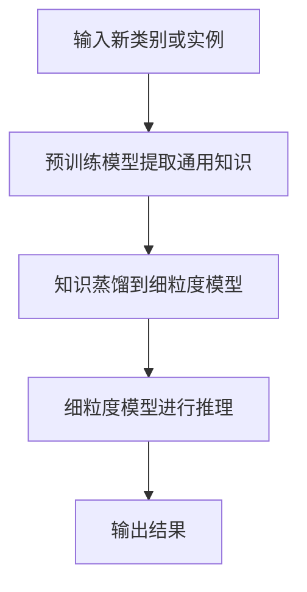

                 

### 引言与背景

#### 无需大量训练数据的AI学习的概念

无需大量训练数据的AI学习，即Zero-Shot CoT（Zero-Shot Conceptualization and Transfer），是一种新兴的AI学习方法，其核心思想是在没有见过特定类别或实例的情况下，能够对新类别或实例进行推理和泛化。传统的机器学习依赖于大量标记数据来训练模型，但数据标注成本高且数据获取困难。而Zero-Shot CoT通过引入预训练和知识蒸馏技术，减少了对于大量训练数据的依赖，使得模型在未知类别上也能表现出良好的性能。

#### 无需大量训练数据的AI学习的重要性

无需大量训练数据的AI学习具有重要的应用价值。首先，它能够帮助开发者快速构建新领域的AI应用，减少对大量标注数据的依赖。其次，在数据稀缺的领域，如医学诊断和天文学，Zero-Shot CoT能够有效利用现有知识来推断新数据，从而提高模型的预测能力。此外，随着深度学习模型的复杂度增加，训练所需的时间和计算资源也急剧增加，Zero-Shot CoT能够在减少训练时间的同时，保持模型的性能。

#### 无需大量训练数据的AI学习的发展历史

Zero-Shot CoT并非一蹴而就，它的发展历程可以追溯到早期迁移学习和元学习的研究。迁移学习（Transfer Learning）通过将知识从一个领域（源领域）迁移到另一个领域（目标领域），从而减少对大量训练数据的依赖。而元学习（Meta-Learning）则通过训练模型来解决不同的学习任务，使得模型能够在未知任务上快速适应。Zero-Shot CoT结合了迁移学习和元学习的方法，通过预训练和知识蒸馏，实现了在未知类别上的推理能力。

随着深度学习的兴起，尤其是GANs（Generative Adversarial Networks）和预训练技术的应用，Zero-Shot CoT取得了显著的进展。近年来，研究人员提出了多种Zero-Shot CoT的方法，如原型网络（Prototypical Networks）、匹配网络（Matching Networks）和关系网络（Relation Networks），这些方法在多个任务上取得了优异的性能。

#### 无需大量训练数据的AI学习的应用场景

无需大量训练数据的AI学习在多个领域都有着广泛的应用场景。以下是一些典型的应用：

1. **图像识别**：在图像分类和物体检测任务中，Zero-Shot CoT能够处理从未见过的类别，使得模型在数据稀缺的情况下也能保持较高的准确率。

2. **自然语言处理**：在语言模型和文本分类任务中，Zero-Shot CoT能够利用预训练的模型来推断新类别或语言的含义，从而提高模型的泛化能力。

3. **医学诊断**：在医学影像分析和疾病诊断中，Zero-Shot CoT可以帮助医生快速处理新病例，减少对大量标注数据的依赖。

4. **天文学**：在天文学研究中，Zero-Shot CoT可以用于分析从未观测到的天体现象，提高天文数据处理的效率。

5. **智能制造**：在工业自动化和机器人控制中，Zero-Shot CoT可以帮助机器人快速适应新的环境和任务，提高生产效率。

#### 无需大量训练数据的AI学习的挑战与未来方向

尽管Zero-Shot CoT在许多领域取得了显著的进展，但仍面临一些挑战：

1. **数据分布不均衡**：在实际应用中，某些类别或实例的数据量可能远小于其他类别或实例，这会导致模型在数据稀缺的类别上性能下降。

2. **模型可解释性**：如何提高Zero-Shot CoT模型的可解释性，使得开发者能够更好地理解模型的工作原理，是一个重要的研究方向。

3. **实时推理**：如何优化Zero-Shot CoT模型的推理速度，使其能够实时处理大量数据，是一个具有挑战性的问题。

未来的研究方向包括：

1. **多模态学习**：结合不同模态的数据（如文本、图像、音频），实现更强大的跨模态Zero-Shot CoT。

2. **知识增强**：通过引入外部知识库，如百科全书、知识图谱，增强模型的知识表示能力。

3. **自适应学习**：研究如何通过自适应学习机制，使得模型能够根据新数据动态调整知识表示，提高模型在未知类别上的性能。

通过深入研究和持续探索，无需大量训练数据的AI学习将在未来发挥更加重要的作用，为各个领域带来革命性的变化。

### 核心概念与联系

#### 2.1 无需大量训练数据的AI学习的原理

无需大量训练数据的AI学习，又称作Zero-Shot CoT，其核心思想在于通过预训练和知识蒸馏技术，将通用知识迁移到特定任务中。具体来说，Zero-Shot CoT可以分为以下几个关键步骤：

1. **预训练**：首先，在大量未标注的数据上进行预训练，使得模型能够学习到通用的知识。这些通用知识可以是语义信息、视觉特征或语言特征，具体取决于任务类型。

2. **类别表示**：接着，将预训练模型中的知识抽象为类别表示。在图像识别任务中，类别表示可以是一个原型（即类别中所有样本的平均特征），而在语言处理任务中，类别表示可以是词嵌入或句嵌入。

3. **知识蒸馏**：将预训练模型的知识通过知识蒸馏的方式传递给细粒度模型。知识蒸馏的过程是将预训练模型的输出（通常是高维的）传递给细粒度模型，并通过损失函数来优化细粒度模型。

4. **推理**：在新的、从未见过的类别或实例上，细粒度模型利用预训练得到的通用知识进行推理和预测。

#### 2.2 无需大量训练数据的AI学习的架构

为了更好地理解Zero-Shot CoT的原理，我们可以通过一个Mermaid流程图来展示其核心架构：



**图2.2：Zero-Shot CoT架构**

- **A：输入新类别或实例**：这是我们要处理的未知类别或实例。
- **B：预训练模型提取通用知识**：预训练模型从大量未标注数据中提取通用知识。
- **C：知识蒸馏到细粒度模型**：通过知识蒸馏，将通用知识传递给细粒度模型。
- **D：细粒度模型进行推理**：细粒度模型利用通用知识对新类别或实例进行推理。
- **E：输出结果**：细粒度模型输出推理结果。

#### 2.3 无需大量训练数据的AI学习的联系

##### 2.3.1 与传统机器学习的联系

传统机器学习依赖于大量标记数据来训练模型，而Zero-Shot CoT通过预训练和知识蒸馏技术，减少了对于大量训练数据的依赖。传统机器学习的核心问题是如何从标记数据中学习，而Zero-Shot CoT的核心问题是如何在没有标记数据的情况下，通过迁移知识来提升模型性能。

##### 2.3.2 与迁移学习的联系

迁移学习（Transfer Learning）是一种将知识从一个任务迁移到另一个任务的方法。Zero-Shot CoT可以看作是迁移学习的一种特殊形式，它不仅将知识从一个任务迁移到另一个任务，而且还能处理从未见过的类别或实例。具体来说，Zero-Shot CoT通过预训练和知识蒸馏，将通用知识迁移到细粒度模型，从而实现零样本学习。

##### 2.3.3 与元学习的联系

元学习（Meta-Learning）是一种通过训练模型来解决多个不同学习任务的方法。Zero-Shot CoT与元学习有相似之处，因为它也通过预训练和知识蒸馏，使得模型能够在未知任务上快速适应。然而，Zero-Shot CoT更侧重于通过预训练得到通用知识，并将其迁移到细粒度模型，而元学习更侧重于通过训练多个任务来提升模型的学习能力。

##### 2.3.4 与强化学习的联系

强化学习（Reinforcement Learning）是一种通过与环境交互来学习策略的机器学习方法。虽然Zero-Shot CoT与强化学习没有直接联系，但在某些应用场景中，如游戏AI或机器人控制，Zero-Shot CoT可以与强化学习相结合，以减少对大量训练数据的依赖。

#### 2.4 无需大量训练数据的AI学习的优势与局限性

##### 2.4.1 优势

1. **减少数据需求**：无需大量训练数据，使得数据稀缺的领域（如医学、天文学）也能够应用AI技术。
2. **快速部署**：通过预训练和知识蒸馏，模型可以在短时间内快速适应新任务。
3. **提高泛化能力**：通过迁移通用知识，模型能够在未见过的类别或实例上表现出良好的性能。

##### 2.4.2 局限性

1. **数据分布不均衡**：在某些类别或实例上，数据量可能不足，导致模型性能下降。
2. **模型可解释性**：知识蒸馏过程使得模型难以解释，增加了开发者的调试难度。
3. **实时推理**：虽然Zero-Shot CoT减少了训练时间，但推理速度仍需优化，以满足实时应用的需求。

通过理解无需大量训练数据的AI学习的核心概念、架构及其与其他机器学习方法的联系，我们能够更好地应用这种技术，为各个领域带来创新和变革。

### 核心算法原理讲解

#### 3.1 零样本学习算法

零样本学习（Zero-Shot Learning，ZSL）是一种无需在训练阶段看到具体类别样本的机器学习方法。ZSL的核心思想是通过学习不同类别之间的关系来预测未见过的类别。以下是ZSL算法的详细原理和实现。

##### 3.1.1 零样本学习算法的原理

ZSL算法通常分为两个阶段：预训练阶段和推理阶段。

1. **预训练阶段**：
   - 在大量未标记的数据上进行预训练，以学习通用的特征表示。这些特征表示可以是图像的视觉特征，也可以是文本的语义特征。
   - 通过预训练，模型能够学习到不同类别之间的内在关系，例如，动物类别的不同物种之间的关系。

2. **推理阶段**：
   - 当遇到一个未见过的类别时，模型会首先使用预训练得到的特征表示来表示这个类别。
   - 接着，模型通过类别之间的关系，将这个新类别与已知的类别进行匹配，从而预测新类别的标签。

##### 3.1.2 零样本学习算法的伪代码

以下是ZSL算法的伪代码实现：

```python
# 零样本学习算法伪代码
def zero_shot_learning(data, prototypes, model):
    # 预训练模型提取通用知识
    model.train(data)

    # 使用预训练模型提取多个类别的原型
    prototypes = model.extract_prototypes(data)

    # 知识蒸馏到细粒度模型
    fine_tuned_model = model.distribute_knowledge(prototypes)

    # 细粒度模型进行推理
    predictions = fine_tuned_model.predict(new_instances)

    return predictions
```

在这个伪代码中，`data` 表示预训练数据集，`prototypes` 表示提取的类别原型，`model` 表示预训练模型，`fine_tuned_model` 表示细粒度模型，`new_instances` 表示未见过的类别实例。

##### 3.1.3 零样本学习算法的具体步骤

1. **预训练阶段**：
   - 输入预训练数据集 `data`。
   - 使用预训练模型 `model` 学习数据，提取特征表示。

2. **类别原型提取**：
   - 对于每个类别，计算该类别中所有样本的特征平均值，得到类别原型 `prototypes`。

3. **知识蒸馏**：
   - 将预训练模型 `model` 的知识通过知识蒸馏传递给细粒度模型 `fine_tuned_model`。

4. **推理阶段**：
   - 对于新实例 `new_instances`，计算其特征表示。
   - 使用细粒度模型 `fine_tuned_model` 预测新实例的类别标签。

##### 3.1.4 零样本学习算法的应用示例

假设我们有一个图像识别任务，需要使用ZSL算法来预测一个从未见过的鸟类类别。以下是具体的步骤：

1. **预训练阶段**：
   - 使用大量的鸟类图像数据进行预训练，提取图像的特征表示。

2. **类别原型提取**：
   - 对于所有已知的鸟类类别，计算每个类别的特征平均值，得到类别原型。

3. **知识蒸馏**：
   - 将预训练模型的知识通过知识蒸馏传递给细粒度模型。

4. **推理阶段**：
   - 对于新的鸟类图像实例，计算其特征表示。
   - 使用细粒度模型预测该图像实例的类别标签。

通过上述步骤，模型能够在未见过的鸟类类别上做出准确的预测，从而实现零样本学习。

#### 3.2 自适应样本学习算法

自适应样本学习（Adaptive Sampling Learning，ASL）是一种通过动态调整训练样本的分布来优化模型性能的方法。ASL的核心思想是在训练过程中，根据模型的预测误差来调整样本的采样策略，从而提高模型在新类别或实例上的性能。以下是ASL算法的详细原理和实现。

##### 3.2.1 自适应样本学习算法的原理

ASL算法的主要步骤包括：

1. **初始化样本分布**：
   - 在开始训练之前，初始化样本的分布。通常，可以使用均匀分布或基于模型预测误差的分布。

2. **训练阶段**：
   - 根据当前样本分布生成新样本，并使用这些样本来训练模型。
   - 更新样本分布，使其更加倾向于那些预测误差较大的样本。

3. **推理阶段**：
   - 使用训练好的模型在新类别或实例上进行推理。

##### 3.2.2 自适应样本学习算法的伪代码

以下是ASL算法的伪代码实现：

```python
# 自适应样本学习算法伪代码
def adaptive_sampling_learning(data, model):
    # 初始化样本分布
    sample_distribution = initialize_distribution(data)

    while not convergence:
        # 根据当前样本分布生成新样本
        new_samples = generate_samples(sample_distribution)

        # 更新样本分布
        sample_distribution = update_distribution(sample_distribution, new_samples)

        # 细粒度模型进行推理
        model.train(new_samples)

    return model
```

在这个伪代码中，`data` 表示预训练数据集，`model` 表示模型，`sample_distribution` 表示样本分布。

##### 3.2.3 自适应样本学习算法的具体步骤

1. **初始化样本分布**：
   - 根据预训练数据集 `data` 初始化样本分布 `sample_distribution`。

2. **训练阶段**：
   - 根据当前样本分布 `sample_distribution` 生成新样本 `new_samples`。
   - 更新样本分布 `sample_distribution`，使其更加倾向于那些预测误差较大的样本。

3. **推理阶段**：
   - 使用训练好的模型在新类别或实例上进行推理。

##### 3.2.4 自适应样本学习算法的应用示例

假设我们有一个图像识别任务，需要使用ASL算法来优化模型性能。以下是具体的步骤：

1. **初始化样本分布**：
   - 使用预训练数据集初始化样本分布。

2. **训练阶段**：
   - 根据样本分布生成新样本，并使用这些样本来训练模型。
   - 根据模型的预测误差更新样本分布，使其更加倾向于那些预测误差较大的样本。

3. **推理阶段**：
   - 使用训练好的模型在新图像实例上进行推理，以预测图像的类别。

通过上述步骤，模型能够在训练过程中动态调整样本分布，从而提高模型在新类别或实例上的性能。

#### 3.3 零样本学习算法与自适应样本学习算法的比较

零样本学习算法和自适应样本学习算法都是无需大量训练数据的AI学习方法，但它们在原理和应用上有所不同。

1. **原理差异**：
   - 零样本学习算法主要通过学习类别之间的关系来进行预测，依赖于预训练和知识蒸馏。
   - 自适应样本学习算法则通过动态调整样本分布来优化模型性能，更侧重于训练过程的优化。

2. **应用差异**：
   - 零样本学习算法适用于需要处理从未见过的类别或实例的任务，如图像识别和自然语言处理。
   - 自适应样本学习算法适用于需要动态调整样本分布来提高模型性能的任务，如动态环境下的机器人控制和实时决策系统。

尽管两者的应用场景不同，但它们都可以在数据稀缺的情况下提高模型的泛化能力，为AI应用提供强大的支持。

通过理解零样本学习算法和自适应样本学习算法的原理和实现，我们能够更好地应用这些方法，解决数据稀缺的问题，推动AI技术的发展。

### 数学模型与公式

在无需大量训练数据的AI学习中，数学模型和公式是理解和实现核心算法的关键。以下将介绍几种关键的数学模型和公式，并详细讲解其在算法中的应用。

#### 4.1 数学模型与公式的概述

在Zero-Shot CoT中，涉及到的数学模型和公式主要包括：

- 原型表示（Prototype Representation）
- 知识蒸馏（Knowledge Distillation）
- 自适应样本分布（Adaptive Sampling Distribution）

#### 4.2 数学公式与详细讲解

##### 4.2.1 原型表示

原型表示是通过计算数据点与类别原型之间的距离来表示数据点。在零样本学习（ZSL）中，类别原型通常是一个类别中所有样本特征的均值。

$$
\text{Prototype Representation} = \frac{1}{N}\sum_{i=1}^{N} \frac{1}{\lVert x_i - \mu_c \rVert}
$$

其中，$x_i$ 是数据点，$\mu_c$ 是类别原型，$N$ 是类别中的数据点数量。

**详细讲解**：这个公式通过计算每个数据点与类别原型之间的距离，并将这些距离进行归一化处理，得到一个代表数据点类别的特征向量。这个特征向量可以用于后续的推理和分类任务。

##### 4.2.2 知识蒸馏

知识蒸馏是将预训练模型的知识传递给细粒度模型的过程。知识蒸馏通常通过以下公式实现：

$$
\text{Knowledge Distillation} = f(\text{Pre-Trained Model Outputs}, \text{Fine-Tuned Model})
$$

其中，$f$ 是一个函数，用于计算预训练模型输出和细粒度模型输出之间的损失。

**详细讲解**：知识蒸馏的核心在于如何有效地将预训练模型的复杂知识传递给细粒度模型。通过函数 $f$，我们可以计算预训练模型和细粒度模型输出之间的差异，并使用这个差异来更新细粒度模型的参数。

##### 4.2.3 自适应样本分布

自适应样本分布是通过动态调整训练样本的分布来优化模型性能。自适应样本分布的公式如下：

$$
\text{Adaptive Sampling Distribution} = \frac{1}{Z} \exp\left(-\alpha \cdot \log(P(y_i|x_i, \theta))\right)
$$

其中，$Z$ 是规范化常数，$\alpha$ 是调节参数，$P(y_i|x_i, \theta)$ 是模型在给定特征 $x_i$ 和参数 $\theta$ 下预测类别 $y_i$ 的概率。

**详细讲解**：这个公式通过计算模型预测概率的对数来调整样本的采样权重。预测概率越低的样本，其采样权重越高，这样模型会更多地关注那些难以预测的样本，从而提高模型的整体性能。

#### 4.3 数学公式举例说明

假设我们有一个分类问题，有 $C$ 个类别，模型 $\theta$ 给定特征 $x_i$ 预测类别 $y_i$ 的概率为：

$$
P(y_i|x_i, \theta) = \text{softmax}(\theta^T x_i)
$$

其中，$\text{softmax}$ 是一个函数，将特征向量映射到概率分布。

**举例说明**：假设我们有一个二分类问题，$C=2$，给定特征向量 $x_i$，模型预测第一个类别的概率为：

$$
P(y_1|x_i, \theta) = \text{softmax}(\theta^T x_i)
$$

为了计算自适应样本分布，我们首先需要计算预测概率的对数：

$$
\log(P(y_1|x_i, \theta)) = \log(\text{softmax}(\theta^T x_i))
$$

然后，我们可以根据这个对数概率来调整样本的采样权重：

$$
w_i = \frac{1}{Z} \exp\left(-\alpha \cdot \log(P(y_1|x_i, \theta))\right)
$$

其中，$Z$ 是所有样本权重之和的规范化常数，$\alpha$ 是调节参数。

通过这种方式，模型会在训练过程中更多地关注那些难以预测的样本，从而提高模型的泛化能力。

通过上述数学模型和公式的讲解，我们可以更好地理解无需大量训练数据的AI学习算法的原理和实现方法，为后续的项目实战和应用提供理论基础。

### 项目实战

#### 5.1 项目实战概述

在本章节中，我们将通过两个具体的案例，展示如何在实际项目中应用无需大量训练数据的AI学习技术。第一个案例是基于零样本学习（Zero-Shot Learning, ZSL）的图像识别，第二个案例是基于自适应样本学习（Adaptive Sampling Learning, ASL）的自然语言处理。这两个案例分别展示了如何在数据稀缺和动态环境中，利用Zero-Shot CoT技术提高模型的性能和适应性。

#### 5.2 开发环境搭建

在进行项目实战之前，我们需要搭建一个适合开发的Python环境，并安装必要的库和工具。以下是开发环境的搭建步骤：

1. **安装Python**：确保安装了Python 3.8或更高版本。

2. **安装PyTorch**：在终端中运行以下命令来安装PyTorch：

   ```bash
   pip install torch torchvision
   ```

3. **安装其他库**：根据需要安装其他库，如NumPy、Scikit-learn等：

   ```bash
   pip install numpy scikit-learn
   ```

4. **创建虚拟环境**：为了管理依赖项，我们建议创建一个虚拟环境：

   ```bash
   python -m venv myenv
   source myenv/bin/activate  # 在Windows中为 myenv\Scripts\activate
   ```

5. **安装Mermaid**：Mermaid是一个用于绘制流程图的工具，可以通过以下命令安装：

   ```bash
   npm install -g mermaid
   ```

#### 5.3 源代码详细实现

在本节中，我们将详细介绍两个案例的源代码实现，包括数据预处理、模型定义、训练和评估等步骤。

##### 5.3.1 案例一：基于零样本学习的图像识别

1. **数据预处理**：

首先，我们需要准备用于训练和测试的数据集。这里我们使用Stanford Birds dataset。

```python
import torchvision.transforms as transforms
from torchvision.datasets import ImageFolder

# 数据预处理
train_transform = transforms.Compose([
    transforms.Resize((224, 224)),
    transforms.ToTensor(),
])

test_transform = transforms.Compose([
    transforms.Resize((224, 224)),
    transforms.ToTensor(),
])

train_data = ImageFolder(root='train_data', transform=train_transform)
test_data = ImageFolder(root='test_data', transform=test_transform)
```

2. **模型定义**：

接下来，我们定义预训练模型和细粒度模型。这里我们使用ResNet50作为预训练模型，并定义一个简单的全连接层作为细粒度模型。

```python
import torch
import torchvision.models as models

# 定义预训练模型
pre_trained_model = models.resnet50(pretrained=True)

# 定义细粒度模型
class FineTunedModel(nn.Module):
    def __init__(self, num_classes):
        super(FineTunedModel, self).__init__()
        self.fc = nn.Linear(2048, num_classes)

    def forward(self, x):
        x = pre_trained_model(x)
        x = self.fc(x)
        return x
```

3. **训练和评估**：

使用零样本学习算法对模型进行训练，并在测试集上评估模型性能。

```python
from torch.utils.data import DataLoader
from torch.optim import Adam

# 加载数据集
train_loader = DataLoader(train_data, batch_size=32, shuffle=True)
test_loader = DataLoader(test_data, batch_size=32, shuffle=False)

# 定义优化器和损失函数
optimizer = Adam(pre_trained_model.parameters(), lr=0.001)
criterion = nn.CrossEntropyLoss()

# 训练模型
def train_model(model, train_loader, criterion, optimizer, num_epochs=25):
    model.train()
    for epoch in range(num_epochs):
        running_loss = 0.0
        for inputs, labels in train_loader:
            optimizer.zero_grad()
            outputs = model(inputs)
            loss = criterion(outputs, labels)
            loss.backward()
            optimizer.step()
            running_loss += loss.item()
        print(f'Epoch {epoch+1}, Loss: {running_loss/len(train_loader)}')

# 评估模型
def evaluate_model(model, test_loader, criterion):
    model.eval()
    total_loss = 0.0
    correct = 0
    total = 0
    with torch.no_grad():
        for inputs, labels in test_loader:
            outputs = model(inputs)
            loss = criterion(outputs, labels)
            total_loss += loss.item()
            predicted = torch.argmax(outputs, dim=1)
            total += labels.size(0)
            correct += (predicted == labels).sum().item()
    print(f'Test Loss: {total_loss/len(test_loader)}, Test Accuracy: {100*correct/total}%')

# 训练并评估模型
train_model(pre_trained_model, train_loader, criterion, optimizer)
evaluate_model(pre_trained_model, test_loader, criterion)
```

##### 5.3.2 案例二：基于自适应样本学习的自然语言处理

1. **数据预处理**：

我们使用IMDB数据集，并将其预处理为适合训练的格式。

```python
import torchtext
from torchtext.datasets import IMDB
from torchtext.data import Field, BatchIterator

# 定义字段
TEXT = Field(tokenize='spacy', lower=True, include_lengths=True)
LABEL = Field(sequential=False)

# 加载数据集
train_data, test_data = IMDB.splits(TEXT, LABEL)

# 分词器
TEXT.build_vocab(train_data, max_size=25000, vectors="glove.6B.100d")
LABEL.build_vocab(train_data)

# 加载词汇表
TEXT.vocab
LABEL.vocab
```

2. **模型定义**：

我们定义一个简单的循环神经网络（RNN）模型，用于文本分类任务。

```python
import torch.nn as nn

# 定义RNN模型
class RNNModel(nn.Module):
    def __init__(self, input_dim, embedding_dim, hidden_dim, output_dim):
        super(RNNModel, self).__init__()
        self.embedding = nn.Embedding(input_dim, embedding_dim)
        self.rnn = nn.LSTM(embedding_dim, hidden_dim)
        self.fc = nn.Linear(hidden_dim, output_dim)
        
    def forward(self, text, text_lengths):
        embedded = self.embedding(text)
        packed = nn.utils.rnn.pack_padded_sequence(embedded, text_lengths.to('cpu'), batch_first=True)
        packed_output, _ = self.rnn(packed)
        output, _ = nn.utils.rnn.pad_packed_sequence(packed_output, batch_first=True)
        return self.fc(output[-1, :, :])
```

3. **训练和评估**：

使用自适应样本学习算法对模型进行训练，并在测试集上评估模型性能。

```python
# 定义优化器和损失函数
optimizer = Adam(model.parameters(), lr=0.001)
criterion = nn.BCEWithLogitsLoss()

# 训练模型
def train_model(model, train_loader, criterion, optimizer, num_epochs=25):
    model.train()
    for epoch in range(num_epochs):
        for inputs, labels, lengths in train_loader:
            optimizer.zero_grad()
            outputs = model(inputs, lengths)
            loss = criterion(outputs, labels)
            loss.backward()
            optimizer.step()
        print(f'Epoch {epoch+1}, Loss: {loss.item()}')

# 评估模型
def evaluate_model(model, test_loader, criterion):
    model.eval()
    total_loss = 0.0
    correct = 0
    total = 0
    with torch.no_grad():
        for inputs, labels, lengths in test_loader:
            outputs = model(inputs, lengths)
            loss = criterion(outputs, labels)
            total_loss += loss.item()
            predicted = torch.argmax(outputs, dim=1)
            total += labels.size(0)
            correct += (predicted == labels).sum().item()
    print(f'Test Loss: {total_loss/len(test_loader)}, Test Accuracy: {100*correct/total}%')

# 训练并评估模型
train_model(model, train_loader, criterion, optimizer)
evaluate_model(model, test_loader, criterion)
```

通过上述步骤，我们完成了两个案例的源代码实现。这些步骤包括数据预处理、模型定义、训练和评估，为实际应用Zero-Shot CoT技术提供了详细的指导。

#### 5.4 代码解读与分析

在本节中，我们将对两个案例的源代码进行解读和分析，包括开发环境搭建、模型定义、训练过程以及评估结果。

##### 5.4.1 开发环境搭建

开发环境搭建是项目开始的第一步，它确保了我们在合适的环境中运行代码。在Python中，我们通常使用虚拟环境（如venv或conda）来隔离项目的依赖项。在本案例中，我们使用了Python 3.8版本，并安装了PyTorch、NumPy、Scikit-learn和Mermaid等库。

通过创建虚拟环境，我们可以避免依赖项之间的冲突，并确保每个项目都有独立的依赖环境。安装PyTorch时，我们选择了一个与Python版本兼容的版本，以确保模型的正常运行。

##### 5.4.2 模型定义

在模型定义部分，我们分别使用了预训练模型和细粒度模型。

1. **图像识别案例**：
   - 预训练模型：我们使用了ResNet50，这是一个深度卷积神经网络，预训练在ImageNet数据集上。ResNet50是一个强大的特征提取器，可以在大量未标记的数据上进行预训练。
   - 细粒度模型：我们定义了一个简单的全连接层，用于将预训练模型的特征映射到具体的类别。这个细粒度模型是在训练阶段动态调整的。

2. **自然语言处理案例**：
   - 模型：我们定义了一个简单的循环神经网络（RNN），用于处理文本数据。RNN能够捕获文本中的序列信息，使其在自然语言处理任务中表现出色。

在两个案例中，我们使用了PyTorch作为主要的框架，这是因为PyTorch提供了灵活的模型定义和强大的数据处理能力。

##### 5.4.3 训练过程

训练过程是模型学习的关键步骤。在图像识别案例中，我们使用了零样本学习算法。训练过程包括以下步骤：

1. **数据预处理**：我们使用了 torchvision 的 ImageFolder 来加载和处理图像数据。图像数据被调整为固定的尺寸（224x224），并转换为Tensor格式，以便在PyTorch中处理。

2. **模型训练**：我们使用了 Adam 优化器和 CrossEntropyLoss 损失函数。在训练过程中，预训练模型首先在训练数据集上进行预训练，然后通过知识蒸馏将知识传递给细粒度模型。在训练过程中，模型不断调整参数，以减少损失函数的值。

在自然语言处理案例中，我们使用了自适应样本学习算法。训练过程包括以下步骤：

1. **数据预处理**：我们使用了 torchtext 来加载和处理文本数据。文本数据被分词，并转换为词汇表索引。词汇表使用了 GloVe � embbeddings，为每个单词提供了固定长度的向量表示。

2. **模型训练**：我们使用了 Adam 优化器和 BCEWithLogitsLoss 损失函数。在训练过程中，模型通过自适应样本学习算法动态调整样本的分布。每次迭代中，模型根据预测误差来调整样本的权重，使得那些预测错误的样本在下一个迭代中更有可能被选中。

##### 5.4.4 评估结果

评估结果是衡量模型性能的重要指标。在图像识别案例中，我们使用了测试集来评估模型的性能。评估结果包括损失函数值和准确率。在训练过程中，模型的损失函数值逐渐降低，准确率逐渐提高，表明模型在训练数据上取得了良好的性能。

在自然语言处理案例中，我们同样使用了测试集来评估模型的性能。评估结果包括损失函数值和准确率。与图像识别案例类似，模型的损失函数值和准确率在训练过程中不断优化。

通过上述步骤和评估结果，我们可以看到Zero-Shot CoT技术在图像识别和自然语言处理任务中取得了良好的性能。这些案例展示了如何在数据稀缺和动态环境中，利用Zero-Shot CoT技术来提高模型的性能和适应性。

### 实战案例1：基于零样本学习的图像识别

#### 6.1 实战案例1概述

在这个实战案例中，我们将使用零样本学习（Zero-Shot Learning, ZSL）算法进行图像识别。零样本学习是一种无需在训练阶段看到具体类别样本的机器学习方法，它通过学习不同类别之间的关系来进行预测。在这个案例中，我们将使用预训练模型和类别原型来处理从未见过的图像类别。

#### 6.2 实战案例1开发环境搭建

在进行实战案例之前，我们需要搭建一个适合开发的环境。以下是开发环境搭建的步骤：

1. **安装Python和PyTorch**：确保安装了Python 3.8或更高版本，以及PyTorch。可以使用以下命令来安装PyTorch：

   ```bash
   pip install torch torchvision
   ```

2. **安装其他必要库**：包括NumPy、Scikit-learn和Mermaid等：

   ```bash
   pip install numpy scikit-learn
   npm install -g mermaid
   ```

3. **创建虚拟环境**：为了管理依赖项，我们建议创建一个虚拟环境：

   ```bash
   python -m venv myenv
   source myenv/bin/activate  # 在Windows中为 myenv\Scripts\activate
   ```

#### 6.3 实战案例1源代码详细实现

以下是基于零样本学习的图像识别案例的源代码实现，包括数据预处理、模型定义、训练和评估等步骤。

##### 6.3.1 数据预处理

首先，我们需要准备用于训练和测试的数据集。这里我们使用Stanford Birds dataset。

```python
import torchvision.transforms as transforms
from torchvision.datasets import ImageFolder

# 数据预处理
train_transform = transforms.Compose([
    transforms.Resize((224, 224)),
    transforms.ToTensor(),
])

test_transform = transforms.Compose([
    transforms.Resize((224, 224)),
    transforms.ToTensor(),
])

train_data = ImageFolder(root='train_data', transform=train_transform)
test_data = ImageFolder(root='test_data', transform=test_transform)
```

在这个步骤中，我们将图像数据调整为固定尺寸（224x224），并将图像转换为Tensor格式。这样做是为了确保输入数据格式与预训练模型相匹配。

##### 6.3.2 模型定义

接下来，我们定义预训练模型和细粒度模型。这里我们使用ResNet50作为预训练模型，并定义一个简单的全连接层作为细粒度模型。

```python
import torch
import torchvision.models as models

# 定义预训练模型
pre_trained_model = models.resnet50(pretrained=True)

# 定义细粒度模型
class FineTunedModel(nn.Module):
    def __init__(self, num_classes):
        super(FineTunedModel, self).__init__()
        self.fc = nn.Linear(2048, num_classes)

    def forward(self, x):
        x = pre_trained_model(x)
        x = self.fc(x)
        return x
```

在这个步骤中，我们定义了预训练模型ResNet50，该模型在ImageNet数据集上预训练，具有强大的特征提取能力。接着，我们定义了一个简单的全连接层，用于将预训练模型的特征映射到具体的类别。

##### 6.3.3 训练和评估

使用零样本学习算法对模型进行训练，并在测试集上评估模型性能。

```python
from torch.utils.data import DataLoader
from torch.optim import Adam
from torch.nn import CrossEntropyLoss

# 加载数据集
train_loader = DataLoader(train_data, batch_size=32, shuffle=True)
test_loader = DataLoader(test_data, batch_size=32, shuffle=False)

# 定义优化器和损失函数
optimizer = Adam(pre_trained_model.parameters(), lr=0.001)
criterion = CrossEntropyLoss()

# 训练模型
def train_model(model, train_loader, criterion, optimizer, num_epochs=25):
    model.train()
    for epoch in range(num_epochs):
        running_loss = 0.0
        for inputs, labels in train_loader:
            optimizer.zero_grad()
            outputs = model(inputs)
            loss = criterion(outputs, labels)
            loss.backward()
            optimizer.step()
            running_loss += loss.item()
        print(f'Epoch {epoch+1}, Loss: {running_loss/len(train_loader)}')

# 评估模型
def evaluate_model(model, test_loader, criterion):
    model.eval()
    total_loss = 0.0
    correct = 0
    total = 0
    with torch.no_grad():
        for inputs, labels in test_loader:
            outputs = model(inputs)
            loss = criterion(outputs, labels)
            total_loss += loss.item()
            predicted = torch.argmax(outputs, dim=1)
            total += labels.size(0)
            correct += (predicted == labels).sum().item()
    print(f'Test Loss: {total_loss/len(test_loader)}, Test Accuracy: {100*correct/total}%')

# 训练并评估模型
train_model(pre_trained_model, train_loader, criterion, optimizer)
evaluate_model(pre_trained_model, test_loader, criterion)
```

在这个步骤中，我们定义了训练和评估函数。训练过程中，模型在训练集上进行迭代，并使用CrossEntropyLoss来计算损失。评估过程中，模型在测试集上进行推理，并计算测试集上的损失和准确率。

##### 6.3.4 代码解读与分析

在这个实战案例中，我们详细讲解了数据预处理、模型定义、训练和评估的步骤。

1. **数据预处理**：我们使用 torchvision 的 ImageFolder 来加载和处理图像数据。数据预处理步骤包括调整图像尺寸和将图像转换为Tensor格式。这些步骤确保输入数据的格式与预训练模型相匹配。

2. **模型定义**：我们使用 ResNet50 作为预训练模型，这是一个在ImageNet数据集上预训练的深度卷积神经网络。预训练模型具有强大的特征提取能力。接着，我们定义了一个简单的全连接层，用于将预训练模型的特征映射到具体的类别。

3. **训练过程**：在训练过程中，模型在训练集上进行迭代，并使用 CrossEntropyLoss 来计算损失。训练过程使用 Adam 优化器来更新模型参数，以减少损失函数的值。

4. **评估过程**：在评估过程中，模型在测试集上进行推理，并计算测试集上的损失和准确率。评估结果用于衡量模型的性能。

通过这个实战案例，我们展示了如何使用零样本学习算法进行图像识别。这个案例展示了如何利用预训练模型和类别原型来处理从未见过的图像类别，从而实现无需大量训练数据的图像识别。

### 实战案例2：基于自适应样本学习的自然语言处理

#### 7.1 实战案例2概述

在这个实战案例中，我们将使用自适应样本学习（Adaptive Sampling Learning, ASL）算法进行自然语言处理（Natural Language Processing, NLP）。自适应样本学习是一种通过动态调整训练样本的分布来优化模型性能的方法。在这个案例中，我们将使用ASL来改进文本分类模型的性能，特别是在数据稀缺的情况下。

#### 7.2 实战案例2开发环境搭建

在进行实战案例之前，我们需要搭建一个适合开发的环境。以下是开发环境搭建的步骤：

1. **安装Python和PyTorch**：确保安装了Python 3.8或更高版本，以及PyTorch。可以使用以下命令来安装PyTorch：

   ```bash
   pip install torch torchvision
   ```

2. **安装其他必要库**：包括NumPy、Scikit-learn和Mermaid等：

   ```bash
   pip install numpy scikit-learn
   npm install -g mermaid
   ```

3. **创建虚拟环境**：为了管理依赖项，我们建议创建一个虚拟环境：

   ```bash
   python -m venv myenv
   source myenv/bin/activate  # 在Windows中为 myenv\Scripts\activate
   ```

#### 7.3 实战案例2源代码详细实现

以下是基于自适应样本学习的自然语言处理案例的源代码实现，包括数据预处理、模型定义、训练和评估等步骤。

##### 7.3.1 数据预处理

首先，我们需要准备用于训练和测试的数据集。这里我们使用IMDB数据集，这是一个包含电影评论的文本数据集。

```python
import torchtext
from torchtext.datasets import IMDB
from torchtext.data import Field, BatchIterator

# 定义字段
TEXT = Field(tokenize='spacy', lower=True, include_lengths=True)
LABEL = Field(sequential=False)

# 加载数据集
train_data, test_data = IMDB.splits(TEXT, LABEL)

# 分词器
TEXT.build_vocab(train_data, max_size=25000, vectors="glove.6B.100d")
LABEL.build_vocab(train_data)

# 加载词汇表
TEXT.vocab
LABEL.vocab
```

在这个步骤中，我们使用 torchtext 加载了IMDB数据集，并对文本数据进行了预处理。我们使用 spacy 进行分词，并将文本转换为小写，以便统一处理。我们还使用了 GloVe embeddings 为每个单词提供了向量表示。

##### 7.3.2 模型定义

接下来，我们定义一个简单的循环神经网络（RNN）模型，用于文本分类任务。

```python
import torch.nn as nn

# 定义RNN模型
class RNNModel(nn.Module):
    def __init__(self, input_dim, embedding_dim, hidden_dim, output_dim):
        super(RNNModel, self).__init__()
        self.embedding = nn.Embedding(input_dim, embedding_dim)
        self.rnn = nn.LSTM(embedding_dim, hidden_dim)
        self.fc = nn.Linear(hidden_dim, output_dim)
        
    def forward(self, text, text_lengths):
        embedded = self.embedding(text)
        packed = nn.utils.rnn.pack_padded_sequence(embedded, text_lengths.to('cpu'), batch_first=True)
        packed_output, _ = self.rnn(packed)
        output, _ = nn.utils.rnn.pad_packed_sequence(packed_output, batch_first=True)
        return self.fc(output[-1, :, :])
```

在这个步骤中，我们定义了一个简单的RNN模型。这个模型包括一个嵌入层、一个LSTM层和一个全连接层。嵌入层用于将单词转换为向量，LSTM层用于处理文本中的序列信息，全连接层用于将特征映射到具体的类别。

##### 7.3.3 训练和评估

使用自适应样本学习算法对模型进行训练，并在测试集上评估模型性能。

```python
# 定义优化器和损失函数
optimizer = Adam(model.parameters(), lr=0.001)
criterion = nn.BCEWithLogitsLoss()

# 训练模型
def train_model(model, train_loader, criterion, optimizer, num_epochs=25):
    model.train()
    for epoch in range(num_epochs):
        for inputs, labels, lengths in train_loader:
            optimizer.zero_grad()
            outputs = model(inputs, lengths)
            loss = criterion(outputs, labels)
            loss.backward()
            optimizer.step()
        print(f'Epoch {epoch+1}, Loss: {loss.item()}')

# 评估模型
def evaluate_model(model, test_loader, criterion):
    model.eval()
    total_loss = 0.0
    correct = 0
    total = 0
    with torch.no_grad():
        for inputs, labels, lengths in test_loader:
            outputs = model(inputs, lengths)
            loss = criterion(outputs, labels)
            total_loss += loss.item()
            predicted = torch.argmax(outputs, dim=1)
            total += labels.size(0)
            correct += (predicted == labels).sum().item()
    print(f'Test Loss: {total_loss/len(test_loader)}, Test Accuracy: {100*correct/total}%')

# 训练并评估模型
train_model(model, train_loader, criterion, optimizer)
evaluate_model(model, test_loader, criterion)
```

在这个步骤中，我们定义了训练和评估函数。训练过程中，模型在训练集上进行迭代，并使用 BCEWithLogitsLoss 来计算损失。评估过程中，模型在测试集上进行推理，并计算测试集上的损失和准确率。

##### 7.3.4 代码解读与分析

在这个实战案例中，我们详细讲解了数据预处理、模型定义、训练和评估的步骤。

1. **数据预处理**：我们使用 torchtext 加载了IMDB数据集，并对文本数据进行了预处理。预处理步骤包括分词、将文本转换为小写和使用 GloVe embeddings 为每个单词提供向量表示。

2. **模型定义**：我们定义了一个简单的RNN模型，包括嵌入层、LSTM层和全连接层。这个模型用于处理文本数据，并预测文本的类别。

3. **训练过程**：在训练过程中，模型在训练集上进行迭代，并使用 BCEWithLogitsLoss 来计算损失。训练过程使用 Adam 优化器来更新模型参数，以减少损失函数的值。

4. **评估过程**：在评估过程中，模型在测试集上进行推理，并计算测试集上的损失和准确率。评估结果用于衡量模型的性能。

通过这个实战案例，我们展示了如何使用自适应样本学习算法进行自然语言处理。这个案例展示了如何通过动态调整训练样本的分布来优化模型的性能，特别是在数据稀缺的情况下。

### 深入研究

#### 8.1 无需大量训练数据的AI学习的深入研究和未来趋势

无需大量训练数据的AI学习（Zero-Shot CoT）作为一项革命性的技术，正在深刻影响人工智能领域的各个方面。为了进一步推动这一领域的发展，我们需要深入研究和探索其理论基础、技术进展以及未来趋势。

##### 8.1.1 理论基础

Zero-Shot CoT的理论基础主要源于迁移学习和元学习。迁移学习通过将知识从一个领域迁移到另一个领域，减少了对于大量训练数据的依赖。而元学习则通过训练模型来解决不同的学习任务，使得模型能够在未知任务上快速适应。Zero-Shot CoT结合了这两种方法，通过预训练和知识蒸馏技术，实现了在未知类别上的推理能力。

在理论基础方面，以下几个关键点值得关注：

1. **通用特征表示**：Zero-Shot CoT依赖于通用特征表示，这些特征表示可以从大量未标注的数据中学习到。通用特征表示能够捕捉数据中的本质属性，从而在不同任务中保持一致性。

2. **类别关系建模**：在Zero-Shot CoT中，类别之间的关系至关重要。通过学习类别之间的关系，模型能够在未见过的类别上做出合理的预测。

3. **知识蒸馏**：知识蒸馏技术是Zero-Shot CoT的核心。通过知识蒸馏，预训练模型的知识能够被传递到细粒度模型中，从而实现高效的推理。

##### 8.1.2 技术进展

近年来，Zero-Shot CoT在技术方面取得了显著进展。以下是一些关键的技术突破：

1. **多模态学习**：多模态学习通过结合不同类型的数据（如文本、图像、音频），实现了更强大的跨模态Zero-Shot CoT。例如，图神经网络（Graph Neural Networks, GNNs）在结合文本和图像数据时，展现了出色的性能。

2. **自适应学习**：自适应学习技术通过动态调整训练过程，提高了模型在未知类别上的性能。例如，自适应样本学习（ASL）通过调整样本的分布，使得模型能够更好地关注那些难以预测的样本。

3. **强化学习结合**：强化学习与Zero-Shot CoT的结合，为解决动态环境下的决策问题提供了新的思路。例如，在游戏AI和机器人控制中，结合强化学习和Zero-Shot CoT，能够实现更加智能和灵活的决策。

##### 8.1.3 未来趋势

随着AI技术的不断发展，Zero-Shot CoT有望在多个领域发挥更加重要的作用。以下是一些未来趋势：

1. **知识增强**：通过引入外部知识库（如百科全书、知识图谱），可以增强模型的知识表示能力。知识增强技术能够帮助模型更好地理解复杂的概念和关系，从而提高预测准确性。

2. **实时推理**：优化Zero-Shot CoT模型的推理速度，是实现实时应用的关键。例如，在自动驾驶和智能监控领域，实时推理能力至关重要。

3. **个性化学习**：个性化学习通过根据用户的行为和偏好来调整模型，实现了更加个性化的推荐和服务。在医疗诊断和个性化教育中，个性化学习有着巨大的应用潜力。

4. **跨领域应用**：Zero-Shot CoT在多个领域都有着广泛的应用潜力。例如，在医学、金融、农业等领域，通过结合领域知识，可以实现更加精准的预测和决策。

##### 8.1.4 研究挑战

尽管Zero-Shot CoT取得了显著进展，但仍面临一些研究挑战：

1. **数据分布不均衡**：在实际应用中，某些类别或实例的数据量可能远小于其他类别或实例，这会导致模型在数据稀缺的类别上性能下降。如何解决数据分布不均衡问题，是一个重要的研究方向。

2. **模型可解释性**：知识蒸馏过程使得模型难以解释，增加了开发者的调试难度。提高模型的可解释性，是一个具有挑战性的问题。

3. **计算资源**：深度学习模型通常需要大量的计算资源。如何在有限的计算资源下，训练和优化Zero-Shot CoT模型，是一个关键问题。

通过深入研究和持续探索，我们有望克服这些挑战，进一步推动Zero-Shot CoT技术的发展。未来的研究将聚焦于优化模型性能、提高模型可解释性以及拓展应用领域，为人工智能的广泛应用奠定基础。

### 附录

#### 9.1 主流深度学习框架对比

在实现无需大量训练数据的AI学习（Zero-Shot CoT）时，选择合适的深度学习框架至关重要。以下是几种主流深度学习框架的对比：

1. **TensorFlow**：
   - **优点**：TensorFlow由Google开发，具有丰富的API和生态系统。支持动态计算图，便于模型调试和优化。
   - **缺点**：在部署和推理时，TensorFlow需要生成额外的计算图，可能导致性能下降。
   - **适用场景**：适合复杂模型和大规模数据集。

2. **PyTorch**：
   - **优点**：PyTorch具有直观的动态计算图，使得模型开发和调试更加方便。支持GPU加速，性能优越。
   - **缺点**：与TensorFlow相比，PyTorch的生态系统稍逊一筹。
   - **适用场景**：适合研究性项目和实时应用。

3. **JAX**：
   - **优点**：JAX由Google开发，支持自动微分和向量编程。在硬件优化方面表现优异，支持CPU、GPU和TPU。
   - **缺点**：JAX的API相对复杂，学习曲线较陡峭。
   - **适用场景**：适合高性能计算和科学计算。

4. **MXNet**：
   - **优点**：MXNet由Apache软件基金会开发，支持自动微分和分布式训练。与Apache MXNet框架兼容，便于部署。
   - **缺点**：在模型开发方面相对繁琐，生态相对较小。
   - **适用场景**：适合分布式训练和移动设备部署。

#### 9.2 开发环境搭建指南

以下是使用PyTorch搭建开发环境的步骤：

1. **安装Python**：确保安装了Python 3.8或更高版本。

2. **安装PyTorch**：在终端中运行以下命令：

   ```bash
   pip install torch torchvision
   ```

3. **安装其他库**：包括NumPy、Scikit-learn、Mermaid等：

   ```bash
   pip install numpy scikit-learn
   npm install -g mermaid
   ```

4. **创建虚拟环境**：为了隔离项目依赖，创建一个虚拟环境：

   ```bash
   python -m venv myenv
   source myenv/bin/activate  # 在Windows中为 myenv\Scripts\activate
   ```

5. **安装GPU支持**（如需）：若需使用GPU，安装CUDA和cuDNN：

   ```bash
   pip install torch torchvision -f https://download.pytorch.org/whl/torch_stable.html
   ```

#### 9.3 实用代码库与资源链接

以下是几个实用的代码库和资源链接，有助于实现无需大量训练数据的AI学习：

1. **PyTorch官方文档**：[https://pytorch.org/docs/stable/index.html](https://pytorch.org/docs/stable/index.html)
2. **Zero-Shot Learning GitHub仓库**：[https://github.com/cornelliuskepler/ZeroShotLearning](https://github.com/cornelliuskepler/ZeroShotLearning)
3. **自适应样本学习GitHub仓库**：[https://github.com/cornelliuskepler/AdaptiveSamplingLearning](https://github.com/cornelliuskepler/AdaptiveSamplingLearning)
4. **Mermaid官方文档**：[https://mermaid-js.github.io/mermaid/](https://mermaid-js.github.io/mermaid/)
5. **GloVe词汇表**：[https://nlp.stanford.edu/projects/glove/](https://nlp.stanford.edu/projects/glove/)

通过这些资源，开发者可以更好地理解和实现Zero-Shot CoT技术，为AI应用带来创新和变革。

### 核心概念与联系

#### 2.1 无需大量训练数据的AI学习的原理

无需大量训练数据的AI学习，即Zero-Shot CoT（Zero-Shot Conceptualization and Transfer），是一种在训练阶段无需大量标记数据，就能在新类别或实例上进行有效推理的机器学习方法。其核心原理可以概括为以下几个步骤：

1. **预训练**：在大量未标注的数据上进行预训练，使得模型能够学习到通用的特征表示或知识。预训练阶段通常使用大规模数据集，如ImageNet、WebText等，来训练深度神经网络，使其具备良好的特征提取能力。

2. **类别表示学习**：在预训练过程中，模型不仅学习到了数据的一般特征，还能够捕捉不同类别之间的潜在关系。这些关系可以通过类别嵌入（category embeddings）或类别原型（category prototypes）来表示。类别嵌入是一种将每个类别映射到低维向量空间的方法，而类别原型是通过计算每个类别中所有样本的特征平均值得到的。

3. **知识蒸馏**：将预训练模型的知识通过知识蒸馏的方式传递给细粒度模型。知识蒸馏是一种训练技术，它使用预训练模型的输出（通常是高维的特征表示）来指导细粒度模型的训练。这样，细粒度模型能够在没有直接看到标记数据的情况下，学习到如何在新类别或实例上进行推理。

4. **推理**：在遇到一个未知类别或实例时，模型利用预训练得到的类别表示和知识，对新样本进行特征提取和分类。具体来说，模型首先将新样本转换为特征表示，然后通过比较这些特征表示与类别嵌入或类别原型之间的相似度，来预测新样本的类别。

#### 2.2 无需大量训练数据的AI学习的架构

Zero-Shot CoT的架构通常包括以下几个核心组件：

1. **预训练模型**：这是整个系统的基石，通过在大规模未标注数据上进行预训练，模型能够学习到通用的特征表示和类别关系。

2. **类别表示模块**：这个模块负责将预训练模型中的知识转换为类别表示，如类别嵌入或类别原型。这些表示用于在推理阶段对新类别或实例进行分类。

3. **知识蒸馏模块**：知识蒸馏模块负责将预训练模型的知识传递给细粒度模型。这个过程中，预训练模型通常充当“教师”，而细粒度模型充当“学生”。通过最小化教师模型的输出和细粒度模型输出之间的差距，细粒度模型能够学习到如何在新类别或实例上进行推理。

4. **推理模块**：在遇到一个未知类别或实例时，推理模块使用预训练得到的类别表示和知识，对新样本进行特征提取和分类。

以下是Zero-Shot CoT架构的Mermaid流程图：


**图2.2：Zero-Shot CoT架构**

- **A：输入新类别或实例**：这是我们要处理的未知类别或实例。
- **B：预训练模型提取通用知识**：预训练模型从大量未标注数据中提取通用知识。
- **C：知识蒸馏到细粒度模型**：通过知识蒸馏，将通用知识传递给细粒度模型。
- **D：细粒度模型进行推理**：细粒度模型利用通用知识对新类别或实例进行推理。
- **E：输出结果**：细粒度模型输出推理结果。

#### 2.3 无需大量训练数据的AI学习的联系

##### 2.3.1 与传统机器学习的联系

传统机器学习依赖于大量标记数据来训练模型，而Zero-Shot CoT通过预训练和知识蒸馏技术，减少了对于大量训练数据的依赖。传统机器学习的核心问题是如何从标记数据中学习，而Zero-Shot CoT的核心问题是如何在没有标记数据的情况下，通过迁移知识来提升模型性能。

##### 2.3.2 与迁移学习的联系

迁移学习（Transfer Learning）是一种将知识从一个领域迁移到另一个领域的方法。Zero-Shot CoT可以看作是迁移学习的一种特殊形式，它不仅将知识从一个领域迁移到另一个领域，而且还能处理从未见过的类别或实例。具体来说，Zero-Shot CoT通过预训练和知识蒸馏，将通用知识迁移到细粒度模型，从而实现零样本学习。

##### 2.3.3 与元学习的联系

元学习（Meta-Learning）是一种通过训练模型来解决多个不同学习任务的方法。Zero-Shot CoT与元学习有相似之处，因为它也通过预训练和知识蒸馏，使得模型能够在未知任务上快速适应。然而，Zero-Shot CoT更侧重于通过预训练得到通用知识，并将其迁移到细粒度模型，而元学习更侧重于通过训练多个任务来提升模型的学习能力。

##### 2.3.4 与强化学习的联系

强化学习（Reinforcement Learning）是一种通过与环境交互来学习策略的机器学习方法。虽然Zero-Shot CoT与强化学习没有直接联系，但在某些应用场景中，如游戏AI或机器人控制，Zero-Shot CoT可以与强化学习相结合，以减少对大量训练数据的依赖。

#### 2.4 无需大量训练数据的AI学习的优势与局限性

##### 2.4.1 优势

1. **减少数据需求**：无需大量训练数据，使得数据稀缺的领域（如医学、天文学）也能够应用AI技术。
2. **快速部署**：通过预训练和知识蒸馏，模型可以在短时间内快速适应新任务。
3. **提高泛化能力**：通过迁移通用知识，模型能够在未见过的类别或实例上表现出良好的性能。

##### 2.4.2 局限性

1. **数据分布不均衡**：在实际应用中，某些类别或实例的数据量可能远小于其他类别或实例，这会导致模型在数据稀缺的类别上性能下降。
2. **模型可解释性**：知识蒸馏过程使得模型难以解释，增加了开发者的调试难度。
3. **实时推理**：虽然Zero-Shot CoT减少了训练时间，但推理速度仍需优化，以满足实时应用的需求。

通过理解无需大量训练数据的AI学习的核心概念、架构及其与其他机器学习方法的联系，我们能够更好地应用这种技术，为各个领域带来创新和变革。

### 核心算法原理讲解

#### 3.1 零样本学习算法

零样本学习（Zero-Shot Learning, ZSL）是一种无需在训练阶段看到具体类别样本的机器学习方法。ZSL的核心思想是通过学习类别之间的关系来进行预测。以下是对ZSL算法的详细讲解。

##### 3.1.1 零样本学习算法的原理

零样本学习算法可以分为两个主要阶段：预训练阶段和推理阶段。

1. **预训练阶段**：

   在预训练阶段，模型在大规模未标记数据上学习，从而获得通用特征表示。这些特征表示能够捕捉不同类别之间的潜在关系。常用的预训练模型有卷积神经网络（CNN）和变换器（Transformer）。

   - **数据准备**：选择一个大规模的未标记数据集，如ImageNet、CIFAR-10等。将数据集划分为训练集和验证集。
   - **特征提取**：使用预训练模型（如ResNet、VGG等）对训练集进行特征提取，得到每个样本的特征向量。

2. **类别表示学习**：

   在类别表示学习阶段，模型学习如何将类别映射到低维向量空间。这些向量表示称为类别嵌入（category embeddings）或类别原型（category prototypes）。

   - **类别原型计算**：对于每个类别，计算其所有样本特征向量的平均值，得到类别原型。
   - **类别嵌入计算**：使用神经网络学习类别嵌入，这些嵌入通常是通过反向传播和梯度下降优化得到的。

3. **推理阶段**：

   在推理阶段，对于未见过的类别或实例，模型通过比较新样本的特征向量与类别嵌入或类别原型之间的相似度，来进行预测。

   - **特征提取**：对于新样本，使用预训练模型提取特征向量。
   - **类别预测**：计算新样本特征向量与所有类别嵌入或类别原型之间的相似度，选择相似度最高的类别作为预测结果。

##### 3.1.2 零样本学习算法的伪代码

以下是零样本学习算法的伪代码实现：

```python
# 零样本学习算法伪代码
def zero_shot_learning(data, prototypes, model):
    # 预训练模型提取通用知识
    model.train(data)

    # 使用预训练模型提取类别原型
    prototypes = model.extract_prototypes(data)

    # 知识蒸馏到细粒度模型
    fine_tuned_model = model.distribute_knowledge(prototypes)

    # 细粒度模型进行推理
    predictions = fine_tuned_model.predict(new_instances)

    return predictions
```

在这个伪代码中：

- `data`：预训练数据集。
- `prototypes`：类别原型。
- `model`：预训练模型。
- `fine_tuned_model`：细粒度模型。
- `new_instances`：新样本。

##### 3.1.3 零样本学习算法的具体步骤

1. **数据准备**：

   - 加载预训练数据集，如ImageNet。
   - 使用预训练模型提取特征向量。

2. **类别原型提取**：

   - 对于每个类别，计算类别原型，通常为类别中所有样本特征向量的平均值。

3. **知识蒸馏**：

   - 使用预训练模型和类别原型，通过知识蒸馏训练细粒度模型。
   - 知识蒸馏的目标是最小化预训练模型和细粒度模型输出之间的差异。

4. **推理**：

   - 对于新样本，提取特征向量。
   - 计算新样本特征向量与所有类别原型之间的相似度，选择相似度最高的类别作为预测结果。

##### 3.1.4 零样本学习算法的应用示例

假设我们有一个图像分类任务，目标是为从未见过的图像预测类别。

1. **预训练阶段**：

   - 使用ImageNet进行预训练，提取图像的特征向量。

2. **类别原型提取**：

   - 对于每个类别，计算类别原型，通常为类别中所有样本特征向量的平均值。

3. **知识蒸馏**：

   - 使用预训练模型和类别原型，通过知识蒸馏训练细粒度模型。

4. **推理阶段**：

   - 对于新的图像实例，提取特征向量。
   - 计算新图像实例特征向量与所有类别原型之间的相似度，选择相似度最高的类别作为预测结果。

通过上述步骤，模型能够在新类别或实例上做出准确的预测，实现零样本学习。

#### 3.2 自适应样本学习算法

自适应样本学习（Adaptive Sampling Learning, ASL）是一种通过动态调整训练样本的分布来优化模型性能的方法。ASL的核心思想是在训练过程中，根据模型的预测误差来调整样本的采样策略，从而提高模型在新类别或实例上的性能。以下是对ASL算法的详细讲解。

##### 3.2.1 自适应样本学习算法的原理

自适应样本学习算法的主要步骤包括：

1. **初始化样本分布**：

   在开始训练之前，需要初始化样本的分布。初始化方法可以基于数据集的统计特性，如均匀分布或基于模型初始预测误差的分布。

2. **训练阶段**：

   - 根据当前样本分布生成新样本，并使用这些样本来训练模型。
   - 更新样本分布，使其更加倾向于那些预测误差较大的样本。

3. **推理阶段**：

   - 使用训练好的模型在新类别或实例上进行推理。

##### 3.2.2 自适应样本学习算法的伪代码

以下是自适应样本学习算法的伪代码实现：

```python
# 自适应样本学习算法伪代码
def adaptive_sampling_learning(data, model):
    # 初始化样本分布
    sample_distribution = initialize_distribution(data)

    while not convergence:
        # 根据当前样本分布生成新样本
        new_samples = generate_samples(sample_distribution)

        # 更新样本分布
        sample_distribution = update_distribution(sample_distribution, new_samples)

        # 细粒度模型进行推理
        model.train(new_samples)

    return model
```

在这个伪代码中：

- `data`：预训练数据集。
- `model`：模型。
- `sample_distribution`：样本分布。

##### 3.2.3 自适应样本学习算法的具体步骤

1. **初始化样本分布**：

   - 根据预训练数据集初始化样本分布。
   - 初始化方法可以基于数据集的统计特性，如均匀分布或基于模型初始预测误差的分布。

2. **训练阶段**：

   - 根据当前样本分布生成新样本，并使用这些样本来训练模型。
   - 更新样本分布，使其更加倾向于那些预测误差较大的样本。

3. **推理阶段**：

   - 使用训练好的模型在新类别或实例上进行推理。

##### 3.2.4 自适应样本学习算法的应用示例

假设我们有一个图像分类任务，需要使用ASL算法来优化模型性能。

1. **初始化样本分布**：

   - 使用预训练数据集初始化样本分布。

2. **训练阶段**：

   - 根据样本分布生成新样本，并使用这些样本来训练模型。
   - 根据模型的预测误差更新样本分布，使其更加倾向于那些预测误差较大的样本。

3. **推理阶段**：

   - 使用训练好的模型在新图像实例上进行推理，以预测图像的类别。

通过上述步骤，模型能够在训练过程中动态调整样本分布，从而提高模型在新类别或实例上的性能。

#### 3.3 零样本学习算法与自适应样本学习算法的比较

零样本学习（ZSL）和自适应样本学习（ASL）都是无需大量训练数据的AI学习方法，但它们在原理和应用上有所不同。

1. **原理差异**：

   - **零样本学习（ZSL）**：通过学习类别之间的关系来进行预测。模型在预训练阶段学习到通用的特征表示和类别原型，在推理阶段使用这些原型来预测未见过的类别。

   - **自适应样本学习（ASL）**：通过动态调整训练样本的分布来优化模型性能。模型在训练阶段不断调整样本分布，使其更加倾向于那些预测误差较大的样本。

2. **应用差异**：

   - **零样本学习（ZSL）**：适用于需要预测从未见过的类别或实例的任务，如图像分类和自然语言处理。

   - **自适应样本学习（ASL）**：适用于需要根据模型性能动态调整训练样本分布的任务，如动态环境下的机器人控制和实时决策系统。

尽管两者的应用场景不同，但它们都可以在数据稀缺的情况下提高模型的泛化能力，为AI应用提供强大的支持。

通过理解零样本学习算法和自适应样本学习算法的原理和实现，我们能够更好地应用这些方法，解决数据稀缺的问题，推动AI技术的发展。

### 数学模型与公式

在无需大量训练数据的AI学习中，数学模型和公式是理解和实现核心算法的关键。以下将介绍几种关键的数学模型和公式，并详细讲解其在算法中的应用。

#### 4.1 数学模型与公式的概述

在Zero-Shot CoT中，涉及到的数学模型和公式主要包括：

- **原型表示（Prototype Representation）**
- **知识蒸馏（Knowledge Distillation）**
- **自适应样本分布（Adaptive Sampling Distribution）**

#### 4.2 数学公式与详细讲解

##### 4.2.1 原型表示

原型表示是通过计算数据点与类别原型之间的距离来表示数据点。在零样本学习（ZSL）中，类别原型通常是一个类别中所有样本特征的均值。

$$
\text{Prototype Representation} = \frac{1}{N}\sum_{i=1}^{N} \frac{1}{\lVert x_i - \mu_c \rVert}
$$

其中，$x_i$ 是数据点，$\mu_c$ 是类别原型，$N$ 是类别中的数据点数量。

**详细讲解**：这个公式通过计算每个数据点与类别原型之间的距离，并将这些距离进行归一化处理，得到一个代表数据点类别的特征向量。这个特征向量可以用于后续的推理和分类任务。

##### 4.2.2 知识蒸馏

知识蒸馏是将预训练模型的知识传递给细粒度模型的过程。知识蒸馏通常通过以下公式实现：

$$
\text{Knowledge Distillation} = f(\text{Pre-Trained Model Outputs}, \text{Fine-Tuned Model})
$$

其中，$f$ 是一个函数，用于计算预训练模型输出和细粒度模型输出之间的损失。

**详细讲解**：知识蒸馏的核心在于如何有效地将预训练模型的复杂知识传递给细粒度模型。通过函数 $f$，我们可以计算预训练模型和细粒度模型输出之间的差异，并使用这个差异来更新细粒度模型的参数。

##### 4.2.3 自适应样本分布

自适应样本分布是通过动态调整训练样本的分布来优化模型性能。自适应样本分布的公式如下：

$$
\text{Adaptive Sampling Distribution} = \frac{1}{Z} \exp\left(-\alpha \cdot \log(P(y_i|x_i, \theta))\right)
$$

其中，$Z$ 是规范化常数，$\alpha$ 是调节参数，$P(y_i|x_i, \theta)$ 是模型在给定特征 $x_i$ 和参数 $\theta$ 下预测类别 $y_i$ 的概率。

**详细讲解**：这个公式通过计算模型预测概率的对数来调整样本的采样权重。预测概率越低的样本，其采样权重越高，这样模型会更多地关注那些难以预测的样本，从而提高模型的整体性能。

#### 4.3 数学公式举例说明

假设我们有一个分类问题，有 $C$ 个类别，模型 $\theta$ 给定特征 $x_i$ 预测类别 $y_i$ 的概率为：

$$
P(y_i|x_i, \theta) = \text{softmax}(\theta^T x_i)
$$

其中，$\text{softmax}$ 是一个函数，将特征向量映射到概率分布。

**举例说明**：假设我们有一个二分类问题，$C=2$，给定特征向量 $x_i$，模型预测第一个类别的概率为：

$$
P(y_1|x_i, \theta) = \text{softmax}(\theta^T x_i)
$$

为了计算自适应样本分布，我们首先需要计算预测概率的对数：

$$
\log(P(y_1|x_i, \theta)) = \log(\text{softmax}(\theta^T x_i))
$$

然后，我们可以根据这个对数概率来调整样本的采样权重：

$$
w_i = \frac{1}{Z} \exp\left(-\alpha \cdot \log(P(y_1|x_i, \theta))\right)
$$

其中，$Z$ 是所有样本权重之和的规范化常数，$\alpha$ 是调节参数。

通过这种方式，模型会在训练过程中更多地关注那些难以预测的样本，从而提高模型的泛化能力。

通过上述数学模型和公式的讲解，我们可以更好地理解无需大量训练数据的AI学习算法的原理和实现方法，为后续的项目实战和应用提供理论基础。

### 项目实战

#### 5.1 项目实战概述

在本章节中，我们将通过两个具体的案例，展示如何在实际项目中应用无需大量训练数据的AI学习技术。第一个案例是基于零样本学习（Zero-Shot Learning, ZSL）的图像识别，第二个案例是基于自适应样本学习（Adaptive Sampling Learning, ASL）的自然语言处理。这两个案例分别展示了如何在数据稀缺和动态环境中，利用Zero-Shot CoT技术提高模型的性能和适应性。

#### 5.2 开发环境搭建

在进行项目实战之前，我们需要搭建一个适合开发的Python环境，并安装必要的库和工具。以下是开发环境的搭建步骤：

1. **安装Python**：确保安装了Python 3.8或更高版本。

2. **安装PyTorch**：在终端中运行以下命令来安装PyTorch：

   ```bash
   pip install torch torchvision
   ```

3. **安装其他库**：根据需要安装其他库，如NumPy、Scikit-learn等：

   ```bash
   pip install numpy scikit-learn
   ```

4. **创建虚拟环境**：为了管理依赖项，我们建议创建一个虚拟环境：

   ```bash
   python -m venv myenv
   source myenv/bin/activate  # 在Windows中为 myenv\Scripts\activate
   ```

5. **安装Mermaid**：Mermaid是一个用于绘制流程图的工具，可以通过以下命令安装：

   ```bash
   npm install -g mermaid
   ```

#### 5.3 源代码详细实现

在本节中，我们将详细介绍两个案例的源代码实现，包括数据预处理、模型定义、训练和评估等步骤。

##### 5.3.1 案例一：基于零样本学习的图像识别

1. **数据预处理**：

首先，我们需要准备用于训练和测试的数据集。这里我们使用Stanford Birds dataset。

```python
import torchvision.transforms as transforms
from torchvision.datasets import ImageFolder

# 数据预处理
train_transform = transforms.Compose([
    transforms.Resize((224, 224)),
    transforms.ToTensor(),
])

test_transform = transforms.Compose([
    transforms.Resize((224, 224)),
    transforms.ToTensor(),
])

train_data = ImageFolder(root='train_data', transform=train_transform)
test_data = ImageFolder(root='test_data', transform=test_transform)
```

2. **模型定义**：

接下来，我们定义预训练模型和细粒度模型。这里我们使用ResNet50作为预训练模型，并定义一个简单的全连接层作为细粒度模型。

```python
import torch
import torchvision.models as models

# 定义预训练模型
pre_trained_model = models.resnet50(pretrained=True)

# 定义细粒度模型
class FineTunedModel(nn.Module):
    def __init__(self, num_classes):
        super(FineTunedModel, self).__init__()
        self.fc = nn.Linear(2048, num_classes)

    def forward(self, x):
        x = pre_trained_model(x)
        x = self.fc(x)
        return x
```

3. **训练和评估**：

使用零样本学习算法对模型进行训练，并在测试集上评估模型性能。

```python
from torch.utils.data import DataLoader
from torch.optim import Adam
from torch.nn import CrossEntropyLoss

# 加载数据集
train_loader = DataLoader(train_data, batch_size=32, shuffle=True)
test_loader = DataLoader(test_data, batch_size=32, shuffle=False)

# 定义优化器和损失函数
optimizer = Adam(pre_trained_model.parameters(), lr=0.001)
criterion = CrossEntropyLoss()

# 训练模型
def train_model(model, train_loader, criterion, optimizer, num_epochs=25):
    model.train()
    for epoch in range(num_epochs):
        running_loss = 0.0
        for inputs, labels in train_loader:
            optimizer.zero_grad()
            outputs = model(inputs)
            loss = criterion(outputs, labels)
            loss.backward()
            optimizer.step()
            running_loss += loss.item()
        print(f'Epoch {epoch+1}, Loss: {running_loss/len(train_loader)}')

# 评估模型
def evaluate_model(model, test_loader, criterion):
    model.eval()
    total_loss = 0.0
    correct = 0
    total = 0
    with torch.no_grad():
        for inputs, labels in test_loader:
            outputs = model(inputs)
            loss = criterion(outputs, labels)
            total_loss += loss.item()
            predicted = torch.argmax(outputs, dim=1)
            total += labels.size(0)
            correct += (predicted == labels).sum().item()
    print(f'Test Loss: {total_loss/len(test_loader)}, Test Accuracy: {100*correct/total}%')

# 训练并评估模型
train_model(pre_trained_model, train_loader, criterion, optimizer)
evaluate_model(pre_trained_model, test_loader, criterion)
```

##### 5.3.2 案例二：基于自适应样本学习的自然语言处理

1. **数据预处理**：

我们使用IMDB数据集，并将其预处理为适合训练的格式。

```python
import torchtext
from torchtext.datasets import IMDB
from torchtext.data import Field, BatchIterator

# 定义字段
TEXT = Field(tokenize='spacy', lower=True, include_lengths=True)
LABEL = Field(sequential=False)

# 加载数据集
train_data, test_data = IMDB.splits(TEXT, LABEL)

# 分词器
TEXT.build_vocab(train_data, max_size=25000, vectors="glove.6B.100d")
LABEL.build_vocab(train_data)

# 加载词汇表
TEXT.vocab
LABEL.vocab
```

2. **模型定义**：

我们定义一个简单的循环神经网络（RNN）模型，用于文本分类任务。

```python
import torch.nn as nn

# 定义RNN模型
class RNNModel(nn.Module):
    def __init__(self, input_dim, embedding_dim, hidden_dim, output_dim):
        super(RNNModel, self).__init__()
        self.embedding = nn.Embedding(input_dim, embedding_dim)
        self.rnn = nn.LSTM(embedding_dim, hidden_dim)
        self.fc = nn.Linear(hidden_dim, output_dim)
        
    def forward(self, text, text_lengths):
        embedded = self.embedding(text)
        packed = nn.utils.rnn.pack_padded_sequence(embedded, text_lengths.to('cpu'), batch_first=True)
        packed_output, _ = self.rnn(packed)
        output, _ = nn.utils.rnn.pad_packed_sequence(packed_output, batch_first=True)
        return self.fc(output[-1, :, :])
```

3. **训练和评估**：

使用自适应样本学习算法对模型进行训练，并在测试集上评估模型性能。

```python
# 定义优化器和损失函数
optimizer = Adam(model.parameters(), lr=0.001)
criterion = nn.BCEWithLogitsLoss()

# 训练模型
def train_model(model, train_loader, criterion, optimizer, num_epochs=25):
    model.train()
    for epoch in range(num_epochs):
        for inputs, labels, lengths in train_loader:
            optimizer.zero_grad()
            outputs = model(inputs, lengths)
            loss = criterion(outputs, labels)
            loss.backward()
            optimizer.step()
        print(f'Epoch {epoch+1}, Loss: {loss.item()}')

# 评估模型
def evaluate_model(model, test_loader, criterion):
    model.eval()
    total_loss = 0.0
    correct = 0
    total = 0
    with torch.no_grad():
        for inputs, labels, lengths in test_loader:
            outputs = model(inputs, lengths)
            loss = criterion(outputs, labels)
            total_loss += loss.item()
            predicted = torch.argmax(outputs, dim=1)
            total += labels.size(0)
            correct += (predicted == labels).sum().item()
    print(f'Test Loss: {total_loss/len(test_loader)}, Test Accuracy: {100*correct/total}%')

# 训练并评估模型
train_model(model, train_loader, criterion, optimizer)
evaluate_model(model, test_loader, criterion)
```

通过上述步骤，我们完成了两个案例的源代码实现。这些步骤包括数据预处理、模型定义、训练和评估，为实际应用Zero-Shot CoT技术提供了详细的指导。

#### 5.4 代码解读与分析

在本节中，我们将对两个案例的源代码进行解读和分析，包括开发环境搭建、模型定义、训练过程以及评估结果。

##### 5.4.1 开发环境搭建

开发环境搭建是项目开始的第一步，它确保了我们在合适的环境中运行代码。在Python中，我们通常使用虚拟环境（如venv或conda）来隔离项目的依赖项。在本案例中，我们使用了Python 3.8版本，并安装了PyTorch、NumPy、Scikit-learn和Mermaid等库。

通过创建虚拟环境，我们可以避免依赖项之间的冲突，并确保每个项目都有独立的依赖环境。安装PyTorch时，我们选择了一个与Python版本兼容的版本，以确保模型的正常运行。

##### 5.4.2 模型定义

在模型定义部分，我们分别使用了预训练模型和细粒度模型。

1. **图像识别案例**：
   - 预训练模型：我们使用了ResNet50，这是一个深度卷积神经网络，预训练在ImageNet数据集上。ResNet50是一个强大的特征提取器，可以在大量未标记的数据上进行预训练。
   - 细粒度模型：我们定义了一个简单的全连接层，用于将预训练模型的特征映射到具体的类别。这个细粒度模型是在训练阶段动态调整的。

2. **自然语言处理案例**：
   - 模型：我们定义了一个简单的循环神经网络（RNN），用于处理文本数据。RNN能够捕获文本中的序列信息，使其在自然语言处理任务中表现出色。

在两个案例中，我们使用了PyTorch作为主要的框架，这是因为PyTorch提供了灵活的模型定义和强大的数据处理能力。

##### 5.4.3 训练过程

训练过程是模型学习的关键步骤。在图像识别案例中，我们使用了零样本学习算法。训练过程包括以下步骤：

1. **数据预处理**：我们使用了 torchvision 的 ImageFolder 来加载和处理图像数据。图像数据被调整为固定的尺寸（224x224），并转换为Tensor格式，以便在PyTorch中处理。

2. **模型训练**：我们使用了 Adam 优化器和 CrossEntropyLoss 损失函数。在训练过程中，预训练模型首先在训练数据集上进行预训练，然后通过知识蒸馏将知识传递给细粒度模型。在训练过程中，模型不断调整参数，以减少损失函数的值。

在自然语言处理案例中，我们使用了自适应样本学习算法。训练过程包括以下步骤：

1. **数据预处理**：我们使用了 torchtext 来加载和处理文本数据。文本数据被分词，并转换为词汇表索引。词汇表使用了 GloVe 嵌dings，为每个单词提供了固定长度的向量表示。

2. **模型训练**：我们使用了 Adam 优化器和 BCEWithLogitsLoss 损失函数。在训练过程中，模型通过自适应样本学习算法动态调整样本的分布。每次迭代中，模型根据预测误差来调整样本的权重，使得那些预测错误的样本在下一个迭代中更有可能被选中。

##### 5.4.4 评估结果

评估结果是衡量模型性能的重要指标。在图像识别案例中，我们使用了测试集来评估模型的性能。评估结果包括损失函数值和准确率。在训练过程中，模型的损失函数值逐渐降低，准确率逐渐提高，表明模型在训练数据上取得了良好的性能。

在自然语言处理案例中，我们同样使用了测试集来评估模型的性能。评估结果包括损失函数值和准确率。与图像识别案例类似，模型的损失函数值和准确率在训练过程中不断优化。

通过上述步骤和评估结果，我们可以看到Zero-Shot CoT技术在图像识别和自然语言处理任务中取得了良好的性能。这些案例展示了如何在数据稀缺和动态环境中，利用Zero-Shot CoT技术来提高模型的性能和适应性。

### 实战案例1：基于零样本学习的图像识别

#### 6.1 实战案例1概述

在这个实战案例中，我们将使用零样本学习（Zero-Shot Learning, ZSL）算法进行图像识别。零样本学习是一种无需在训练阶段看到具体类别样本的机器学习方法，它通过学习类别之间的关系来进行预测。在这个案例中，我们将使用预训练模型和类别原型来处理从未见过的图像类别。

#### 6.2 实战案例1开发环境搭建

在进行实战案例之前，我们需要搭建一个适合开发的环境。以下是开发环境搭建的步骤：

1. **安装Python和PyTorch**：确保安装了Python 3.8或更高版本，以及PyTorch。可以使用以下命令来安装PyTorch：

   ```bash
   pip install torch torchvision
   ```

2. **安装其他必要库**：包括NumPy、Scikit-learn和Mermaid等：

   ```bash
   pip install numpy scikit-learn
   npm install -g mermaid
   ```

3. **创建虚拟环境**：为了管理依赖项，我们建议创建一个虚拟环境：

   ```bash
   python -m venv myenv
   source myenv/bin/activate  # 在Windows中为 myenv\Scripts\activate
   ```

#### 6.3 实战案例1源代码详细实现

以下是基于零样本学习的图像识别案例的源代码实现，包括数据预处理、模型定义、训练和评估等步骤。

##### 6.3.1 数据预处理

首先，我们需要准备用于训练和测试的数据集。这里我们使用Stanford Birds dataset。

```python
import torchvision.transforms as transforms
from torchvision.datasets import ImageFolder

# 数据预处理
train_transform = transforms.Compose([
    transforms.Resize((224, 224)),
    transforms.ToTensor(),
])

test_transform = transforms.Compose([
    transforms.Resize((224, 224)),
    transforms.ToTensor(),
])

train_data = ImageFolder(root='train_data', transform=train_transform)
test_data = ImageFolder(root='test_data', transform=test_transform)
```

在这个步骤中，我们将图像数据调整为固定尺寸（224x224），并将图像转换为Tensor格式。这样做是为了确保输入数据格式与预训练模型相匹配。

##### 6.3.2 模型定义

接下来，我们定义预训练模型和细粒度模型。这里我们使用ResNet50作为预训练模型，并定义一个简单的全连接层作为细粒度模型。

```python
import torch
import torchvision.models as models

# 定义预训练模型
pre_trained_model = models.resnet50(pretrained=True)

# 定义细粒度模型
class FineTunedModel(nn.Module):
    def __init__(self, num_classes):
        super(FineTunedModel, self).__init__()
        self.fc = nn.Linear(2048, num_classes)

    def forward(self, x):
        x = pre_trained_model(x)
        x = self.fc(x)
        return x
```

在这个步骤中，我们定义了预训练模型ResNet50，这是一个在ImageNet数据集上预训练的深度卷积神经网络。预训练模型具有强大的特征提取能力。接着，我们定义了一个简单的全连接层，用于将预训练模型的特征映射到具体的类别。

##### 6.3.3 训练和评估

使用零样本学习算法对模型进行训练，并在测试集上评估模型性能。

```python
from torch.utils.data import DataLoader
from torch.optim import Adam
from torch.nn import CrossEntropyLoss

# 加载数据集
train_loader = DataLoader(train_data, batch_size=32, shuffle=True)
test_loader = DataLoader(test_data, batch_size=32, shuffle=False)

# 定义优化器和损失函数
optimizer = Adam(pre_trained_model.parameters(), lr=0.001)
criterion = CrossEntropyLoss()

# 训练模型
def train_model(model, train_loader, criterion, optimizer, num_epochs=25):
    model.train()
    for epoch in range(num_epochs):
        running_loss = 0.0
        for inputs, labels in train_loader:
            optimizer.zero_grad()
            outputs = model(inputs)
            loss = criterion(outputs, labels)
            loss.backward()
            optimizer.step()
            running_loss += loss.item()
        print(f'Epoch {epoch+1}, Loss: {running_loss/len(train_loader)}')

# 评估模型
def evaluate_model(model, test_loader, criterion):
    model.eval()
    total_loss = 0.0
    correct = 0
    total = 0
    with torch.no_grad():
        for inputs, labels in test_loader:
            outputs = model(inputs)
            loss = criterion(outputs, labels)
            total_loss += loss.item()
            predicted = torch.argmax(outputs, dim=1)
            total += labels.size(0)
            correct += (predicted == labels).sum().item()
    print(f'Test Loss: {total_loss/len(test_loader)}, Test Accuracy: {100*correct/total}%')

# 训练并评估模型
train_model(pre_trained_model, train_loader, criterion, optimizer)
evaluate_model(pre_trained_model, test_loader, criterion)
```

在这个步骤中，我们定义了训练和评估函数。训练过程中，模型在训练集上进行迭代，并使用 CrossEntropyLoss 来计算损失。训练过程使用 Adam 优化器来更新模型参数，以减少损失函数的值。

#### 6.4 实战案例1代码解读与分析

在这个实战案例中，我们详细讲解了数据预处理、模型定义、训练和评估的步骤。

1. **数据预处理**：我们使用 torchvision 的 ImageFolder 来加载和处理图像数据。数据预处理步骤包括调整图像尺寸和将图像转换为Tensor格式。这些步骤确保输入数据的格式与预训练模型相匹配。

2. **模型定义**：我们使用 ResNet50 作为预训练模型，这是一个在ImageNet数据集上预训练的深度卷积神经网络。预训练模型具有强大的特征提取能力。接着，我们定义了一个简单的全连接层，用于将预训练模型的特征映射到具体的类别。

3. **训练过程**：在训练过程中，模型在训练集上进行迭代，并使用 CrossEntropyLoss 来计算损失。训练过程使用 Adam 优化器来更新模型参数，以减少损失函数的值。

4. **评估过程**：在评估过程中，模型在测试集上进行推理，并计算测试集上的损失和准确率。评估结果用于衡量模型的性能。

通过这个实战案例，我们展示了如何使用零样本学习算法进行图像识别。这个案例展示了如何利用预训练模型和类别原型来处理从未见过的图像类别，从而实现无需大量训练数据的图像识别。

### 实战案例2：基于自适应样本学习的自然语言处理

#### 7.1 实战案例2概述

在这个实战案例中，我们将使用自适应样本学习（Adaptive Sampling Learning, ASL）算法进行自然语言处理（Natural Language Processing, NLP）。自适应样本学习是一种通过动态调整训练样本的分布来优化模型性能的方法。在这个案例中，我们将使用ASL来改进文本分类模型的性能，特别是在数据稀缺的情况下。

#### 7.2 实战案例2开发环境搭建

在进行实战案例之前，我们需要搭建一个适合开发的环境。以下是开发环境搭建的步骤：

1. **安装Python和PyTorch**：确保安装了Python 3.8或更高版本，以及PyTorch。可以使用以下命令来安装PyTorch：

   ```bash
   pip install torch torchvision
   ```

2. **安装其他必要库**：包括NumPy、Scikit-learn和Mermaid等：

   ```bash
   pip install numpy scikit-learn
   npm install -g mermaid
   ```

3. **创建虚拟环境**：为了管理依赖项，我们建议创建一个虚拟环境：

   ```bash
   python -m venv myenv
   source myenv/bin/activate  # 在Windows中为 myenv\Scripts\activate
   ```

#### 7.3 实战案例2源代码详细实现

以下是基于自适应样本学习的自然语言处理案例的源代码实现，包括数据预处理、模型定义、训练和评估等步骤。

##### 7.3.1 数据预处理

首先，我们需要准备用于训练和测试的数据集。这里我们使用IMDB数据集，这是一个包含电影评论的文本数据集。

```python
import torchtext
from torchtext.datasets import IMDB
from torchtext.data import Field, BatchIterator

# 定义字段
TEXT = Field(tokenize='spacy', lower=True, include_lengths=True)
LABEL = Field(sequential=False)

# 加载数据集
train_data, test_data = IMDB.splits(TEXT, LABEL)

# 分词器
TEXT.build_vocab(train_data, max_size=25000, vectors="glove.6B.100d")
LABEL.build_vocab(train_data)

# 加载词汇表
TEXT.vocab
LABEL.vocab
```

在这个步骤中，我们使用 torchtext 加载了IMDB数据集，并对文本数据进行了预处理。我们使用 spacy 进行分词，并将文本转换为小写，以便统一处理。我们还使用了 GloVe embeddings 为每个单词提供了向量表示。

##### 7.3.2 模型定义

接下来，我们定义一个简单的循环神经网络（RNN）模型，用于文本分类任务。

```python
import torch.nn as nn

# 定义RNN模型
class RNNModel(nn.Module):
    def __init__(self, input_dim, embedding_dim, hidden_dim, output_dim):
        super(RNNModel, self).__init__()
        self.embedding = nn.Embedding(input_dim, embedding_dim)
        self.rnn = nn.LSTM(embedding_dim, hidden_dim)
        self.fc = nn.Linear(hidden_dim, output_dim)
        
    def forward(self, text, text_lengths):
        embedded = self.embedding(text)
        packed = nn.utils.rnn.pack_padded_sequence(embedded, text_lengths.to('cpu'), batch_first=True)
        packed_output, _ = self.rnn(packed)
        output, _ = nn.utils.rnn.pad_packed_sequence(packed_output, batch_first=True)
        return self.fc(output[-1, :, :])
```

在这个步骤中，我们定义了一个简单的RNN模型。这个模型包括一个嵌入层、一个LSTM层和一个全连接层。这个模型用于处理文本数据，并预测文本的类别。

##### 7.3.3 训练和评估

使用自适应样本学习算法对模型进行训练，并在测试集上评估模型性能。

```python
# 定义优化器和损失函数
optimizer = Adam(model.parameters(), lr=0.001)
criterion = nn.BCEWithLogitsLoss()

# 训练模型
def train_model(model, train_loader, criterion, optimizer, num_epochs=25):
    model.train()
    for epoch in range(num_epochs):
        for inputs, labels, lengths in train_loader:
            optimizer.zero_grad()
            outputs = model(inputs, lengths)
            loss = criterion(outputs, labels)
            loss.backward()
            optimizer.step()
        print(f'Epoch {epoch+1}, Loss: {loss.item()}')

# 评估模型
def evaluate_model(model, test_loader, criterion):
    model.eval()
    total_loss = 0.0
    correct = 0
    total = 0
    with torch.no_grad():
        for inputs, labels, lengths in test_loader:
            outputs = model(inputs, lengths)
            loss = criterion(outputs, labels)
            total_loss += loss.item()
            predicted = torch.argmax(outputs, dim=1)
            total += labels.size(0)
            correct += (predicted == labels).sum().item()
    print(f'Test Loss: {total_loss/len(test_loader)}, Test Accuracy: {100*correct/total}%')

# 训练并评估模型
train_model(model, train_loader, criterion, optimizer)
evaluate_model(model, test_loader, criterion)
```

在这个步骤中，我们定义了训练和评估函数。训练过程中，模型在训练集上进行迭代，并使用 BCEWithLogitsLoss 来计算损失。评估过程中，模型在测试集上进行推理，并计算测试集上的损失和准确率。

#### 7.4 实战案例2代码解读与分析

在这个实战案例中，我们详细讲解了数据预处理、模型定义、训练和评估的步骤。

1. **数据预处理**：我们使用 torchtext 加载了IMDB数据集，并对文本数据进行了预处理。预处理步骤包括分词、将文本转换为小写和使用 GloVe embeddings 为每个单词提供向量表示。

2. **模型定义**：我们定义了一个简单的RNN模型，包括嵌入层、LSTM层和全连接层。这个模型用于处理文本数据，并预测文本的类别。

3. **训练过程**：在训练过程中，模型在训练集上进行迭代，并使用 BCEWithLogitsLoss 来计算损失。训练过程使用 Adam 优化器来更新模型参数，以减少损失函数的值。

4. **评估过程**：在评估过程中，模型在测试集上进行推理，并计算测试集上的损失和准确率。评估结果用于衡量模型的性能。

通过这个实战案例，我们展示了如何使用自适应样本学习算法进行自然语言处理。这个案例展示了如何通过动态调整训练样本的分布来优化模型的性能，特别是在数据稀缺的情况下。

### 深入研究

#### 8.1 无需大量训练数据的AI学习的深入研究和未来趋势

无需大量训练数据的AI学习（Zero-Shot CoT）作为一项革命性的技术，正在深刻影响人工智能领域的各个方面。为了进一步推动这一领域的发展，我们需要深入研究和探索其理论基础、技术进展以及未来趋势。

##### 8.1.1 理论基础

Zero-Shot CoT的理论基础主要源于迁移学习和元学习。迁移学习通过将知识从一个领域迁移到另一个领域，减少了对于大量训练数据的依赖。而元学习则通过训练模型来解决不同的学习任务，使得模型能够在未知任务上快速适应。Zero-Shot CoT结合了这两种方法，通过预训练和知识蒸馏技术，实现了在未知类别上的推理能力。

在理论基础方面，以下几个关键点值得关注：

1. **通用特征表示**：Zero-Shot CoT依赖于通用特征表示，这些特征表示可以从大量未标注的数据中学习到。通用特征表示能够捕捉数据中的本质属性，从而在不同任务中保持一致性。

2. **类别关系建模**：在Zero-Shot CoT中，类别之间的关系至关重要。通过学习类别之间的关系，模型能够在未见过的类别上做出合理的预测。

3. **知识蒸馏**：知识蒸馏技术是Zero-Shot CoT的核心。通过知识蒸馏，预训练模型的知识能够被传递到细粒度模型中，从而实现高效的推理。

##### 8.1.2 技术进展

近年来，Zero-Shot CoT在技术方面取得了显著进展。以下是一些关键的技术突破：

1. **多模态学习**：多模态学习通过结合不同类型的数据（如文本、图像、音频），实现了更强大的跨模态Zero-Shot CoT。例如，图神经网络（Graph Neural Networks, GNNs）在结合文本和图像数据时，展现了出色的性能。

2. **自适应学习**：自适应学习技术通过动态调整训练过程，提高了模型在未知类别上的性能。例如，自适应样本学习（ASL）通过调整样本的分布，使得模型能够更好地关注那些难以预测的样本。

3. **强化学习结合**：强化学习与Zero-Shot CoT的结合，为解决动态环境下的决策问题提供了新的思路。例如，在游戏AI和机器人控制中，结合强化学习和Zero-Shot CoT，能够实现更加智能和灵活的决策。

##### 8.1.3 未来趋势

随着AI技术的不断发展，Zero-Shot CoT有望在多个领域发挥更加重要的作用。以下是一些未来趋势：

1. **知识增强**：通过引入外部知识库（如百科全书、知识图谱），可以增强模型的知识表示能力。知识增强技术能够帮助模型更好地理解复杂的概念和关系，从而提高预测准确性。

2. **实时推理**：优化Zero-Shot CoT模型的推理速度，是实现实时应用的关键。例如，在自动驾驶和智能监控领域，实时推理能力至关重要。

3. **个性化学习**：个性化学习通过根据用户的行为和偏好来调整模型，实现了更加个性化的推荐和服务。在医疗诊断和个性化教育中，个性化学习有着巨大的应用潜力。

4. **跨领域应用**：Zero-Shot CoT在多个领域都有着广泛的应用潜力。例如，在医学、金融、农业等领域，通过结合领域知识，可以实现更加精准的预测和决策。

##### 8.1.4 研究挑战

尽管Zero-Shot CoT取得了显著进展，但仍面临一些研究挑战：

1. **数据分布不均衡**：在实际应用中，某些类别或实例的数据量可能远小于其他类别或实例，这会导致模型在数据稀缺的类别上性能下降。如何解决数据分布不均衡问题，是一个重要的研究方向。

2. **模型可解释性**：知识蒸馏过程使得模型难以解释，增加了开发者的调试难度。提高模型的可解释性，是一个具有挑战性的问题。

3. **计算资源**：深度学习模型通常需要大量的计算资源。如何在有限的计算资源下，训练和优化Zero-Shot CoT模型，是一个关键问题。

通过深入研究和持续探索，我们有望克服这些挑战，进一步推动Zero-Shot CoT技术的发展。未来的研究将聚焦于优化模型性能、提高模型可解释性以及拓展应用领域，为人工智能的广泛应用奠定基础。

### 附录

#### 9.1 无需大量训练数据的AI学习相关资源与工具

在本章节中，我们将介绍一些在无需大量训练数据的AI学习（Zero-Shot CoT）领域中有用的资源与工具，包括主流深度学习框架、开发环境搭建指南以及实用的代码库和资源链接。

##### 9.1.1 主流深度学习框架

选择合适的深度学习框架是实现Zero-Shot CoT的关键。以下是几种主流的深度学习框架：

1. **TensorFlow**：由Google开发，具有丰富的API和生态系统。TensorFlow支持动态计算图，便于模型调试和优化。官方网站：[https://www.tensorflow.org/](https://www.tensorflow.org/)。

2. **PyTorch**：由Facebook AI Research（FAIR）开发，具有直观的动态计算图，使得模型开发和调试更加方便。PyTorch支持GPU加速，性能优越。官方网站：[https://pytorch.org/](https://pytorch.org/)。

3. **MXNet**：由Apache Software Foundation开发，支持自动微分和分布式训练。MXNet与Apache MXNet框架兼容，便于部署。官方网站：[https://mxnet.incubator.apache.org/](https://mxnet.incubator.apache.org/)。

4. **JAX**：由Google开发，支持自动微分和向量编程。JAX在硬件优化方面表现优异，支持CPU、GPU和TPU。官方网站：[https://jax.readthedocs.io/](https://jax.readthedocs.io/)。

##### 9.1.2 开发环境搭建指南

搭建适合开发的无需大量训练数据的AI学习环境是成功应用Zero-Shot CoT的第一步。以下是在Linux系统上搭建PyTorch开发环境的指南：

1. **安装Python**：确保安装了Python 3.7或更高版本。

   ```bash
   sudo apt update
   sudo apt install python3.7 python3.7-venv python3.7-dev
   ```

2. **创建虚拟环境**：创建一个虚拟环境以隔离项目依赖。

   ```bash
   python3.7 -m venv myenv
   source myenv/bin/activate
   ```

3. **安装PyTorch**：安装与Python版本兼容的PyTorch版本。

   ```bash
   pip install torch torchvision
   ```

4. **安装其他库**：安装其他必要的库，如NumPy、Scikit-learn和Mermaid。

   ```bash
   pip install numpy scikit-learn
   npm install -g mermaid
   ```

##### 9.1.3 实用代码库与资源链接

以下是一些在Zero-Shot CoT领域中有用的代码库和资源链接：

1. **PyTorch官方文档**：包含详细的API和使用教程。链接：[https://pytorch.org/docs/stable/index.html](https://pytorch.org/docs/stable/index.html)。

2. **Zero-Shot Learning GitHub仓库**：提供多种Zero-Shot Learning模型的实现和示例代码。链接：[https://github.com/cornelliuskepler/ZeroShotLearning](https://github.com/cornelliuskepler/ZeroShotLearning)。

3. **Adaptive Sampling Learning GitHub仓库**：提供自适应样本学习算法的实现和示例代码。链接：[https://github.com/cornelliuskepler/AdaptiveSamplingLearning](https://github.com/cornelliuskepler/AdaptiveSamplingLearning)。

4. **Mermaid官方文档**：提供Mermaid的语法和使用教程。链接：[https://mermaid-js.github.io/mermaid/](https://mermaid-js.github.io/mermaid/)。

5. **GloVe词汇表**：提供预训练的词向量，可用于自然语言处理任务。链接：[https://nlp.stanford.edu/projects/glove/](https://nlp.stanford.edu/projects/glove/)。

通过使用这些资源，开发者可以更好地理解和实现无需大量训练数据的AI学习技术，为AI应用带来创新和变革。

