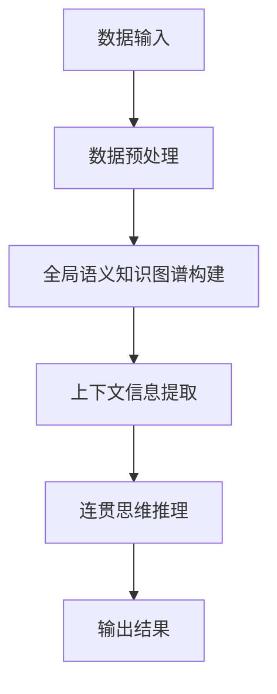

                 

### 第一部分：背景与核心概念

#### 引言与概述

人工智能（AI）技术正以前所未有的速度发展，为各行各业带来了前所未有的变革。然而，传统的人工智能学习方法在处理新任务时往往依赖于大量的训练数据。这种依赖性不仅限制了AI模型的应用范围，也增加了数据收集和处理的高昂成本。为了突破这一限制，研究者们提出了Zero-Shot CoT（Zero-Shot Coherent Thought）方法，这是一种无需示例数据即可进行AI学习的方法。

Zero-Shot CoT方法的核心思想是通过理解数据的语义和上下文信息，从而实现对新任务的泛化能力。与传统的有监督学习和半监督学习相比，Zero-Shot CoT无需依赖于已标注的训练数据，从而降低了数据收集和处理成本，并提高了模型的应用灵活性。此外，Zero-Shot CoT还具有很强的鲁棒性和泛化能力，可以在未见过的数据上实现良好的性能。

传统学习方法通常依赖于大量的标记数据，例如有监督学习需要使用大量的标注数据来训练模型。这种方法在处理已知任务时非常有效，但在处理未知或罕见任务时，由于缺乏足够的标记数据，模型性能往往较差。相比之下，Zero-Shot CoT通过利用先验知识和上下文信息，实现了对未知任务的泛化能力。

#### 核心概念与联系

为了更好地理解Zero-Shot CoT，我们需要先了解与之相关的一些核心概念和联系。

- **机器学习**：机器学习是一种人工智能的方法，通过从数据中学习规律，实现对未知数据的预测或分类。机器学习可以分为有监督学习、无监督学习和强化学习三种类型。

- **有监督学习**：在有监督学习中，模型通过大量的已标注数据学习特征和规律，然后在新数据上进行预测。这种方法的性能往往依赖于训练数据的质量和数量。

- **无监督学习**：无监督学习不依赖于已标注数据，而是通过分析未标注的数据，找出数据中的模式和结构。常见的无监督学习方法包括聚类、降维和关联规则学习等。

- **强化学习**：强化学习是一种通过与环境互动来学习最优策略的机器学习方法。在强化学习中，模型通过不断尝试不同的行动，并从中学习到最优的行动策略。

- **零样本学习（Zero-Shot Learning）**：零样本学习是一种无需已标注数据，即可对新任务进行预测或分类的机器学习方法。零样本学习通常依赖于先验知识，例如词嵌入、知识图谱和预训练语言模型等。

- **Few-Shot Learning**：Few-Shot Learning是一种仅在少量已标注数据上进行训练，即可在新任务上实现良好性能的机器学习方法。Few-Shot Learning与零样本学习类似，但它在处理未知任务时仍需依赖少量标注数据。

Zero-Shot CoT通过结合零样本学习和连贯思维（Coherent Thought）的概念，实现了对未知任务的泛化能力。连贯思维是指模型在理解数据和任务上下文的基础上，能够生成连贯且合理的推理过程。在Zero-Shot CoT中，模型通过学习大量的语义信息和上下文关系，构建了一个全局的语义知识图谱。这个知识图谱不仅包含了各种概念的语义信息，还描述了概念之间的关联和关系。在处理新任务时，模型可以利用这个知识图谱，对未知任务进行推理和泛化。

#### 理论基础

为了深入理解Zero-Shot CoT的工作原理，我们需要回顾一些机器学习的基础知识，尤其是零样本学习和Few-Shot Learning的原理及其联系。

##### 机器学习基础知识

机器学习是一种通过构建数学模型来模拟人类学习过程的方法。这些模型可以从数据中学习规律，然后对新数据进行预测或分类。机器学习可以分为有监督学习、无监督学习和强化学习三种类型。

- **有监督学习**：有监督学习是指模型在已标注的数据上进行训练，然后在新数据上进行预测。常见的有监督学习算法包括线性回归、逻辑回归、支持向量机（SVM）和深度神经网络（DNN）等。

- **无监督学习**：无监督学习是指模型在没有标注数据的情况下，通过分析数据中的模式和结构来学习。常见的无监督学习算法包括聚类、降维和关联规则学习等。

- **强化学习**：强化学习是指模型通过与环境的互动来学习最优策略。在强化学习中，模型通过不断尝试不同的行动，并从中学习到最优的行动策略。常见的强化学习算法包括Q-Learning和深度确定性策略梯度（DDPG）等。

##### 零样本学习与Few-Shot学习的原理与联系

零样本学习和Few-Shot Learning是两种处理未知任务的机器学习方法，它们都无需依赖大量的标注数据。但它们在实现原理和应用场景上有所不同。

- **零样本学习**：零样本学习是指模型在未见过的类别上也能进行预测或分类的能力。零样本学习的核心思想是利用先验知识，例如词嵌入、知识图谱和预训练语言模型等，来表示未知类别的语义信息。通过这种方式，模型可以在没有直接训练数据的情况下，对新任务进行推理和泛化。

- **Few-Shot Learning**：Few-Shot Learning是指模型在仅有少量标注数据的情况下，也能在新任务上实现良好性能。Few-Shot Learning通常采用迁移学习或元学习等技术，通过在大量相关任务上进行预训练，然后在少量数据上进行微调。这样，模型可以快速适应新的任务，并在新任务上实现良好的性能。

零样本学习和Few-Shot Learning之间的联系在于，它们都致力于减少对大量标注数据的依赖。零样本学习通过利用先验知识来实现对新任务的泛化，而Few-Shot Learning则通过迁移学习和元学习等技术来实现对新任务的快速适应。

##### 零样本学习与Zero-Shot CoT的联系

Zero-Shot CoT结合了零样本学习和连贯思维的概念，实现了对未知任务的泛化能力。与传统的零样本学习相比，Zero-Shot CoT具有以下特点：

- **全局语义知识图谱**：Zero-Shot CoT通过构建一个全局的语义知识图谱，包含了各种概念的语义信息及其关联关系。这个知识图谱不仅包含了已知的类别信息，还包括了未知类别信息的上下文信息。

- **连贯思维**：Zero-Shot CoT利用连贯思维，通过对数据和任务上下文的理解，生成合理的推理过程。这种连贯思维使得模型在处理未知任务时，能够产生连贯且合理的预测结果。

- **无监督学习**：Zero-Shot CoT不需要依赖大量的标注数据，而是通过无监督学习的方式，利用先验知识和上下文信息来构建全局语义知识图谱。

总的来说，Zero-Shot CoT是一种具有很强泛化能力和鲁棒性的AI学习方法，它通过结合零样本学习和连贯思维，实现了无需示例数据的AI学习。这种学习方法不仅降低了数据收集和处理成本，还提高了模型的应用灵活性，为未来的AI应用带来了更多可能性。

### 核心概念与联系

在深入探讨Zero-Shot CoT之前，我们首先需要了解与之相关的一些核心概念和联系。这些概念不仅构成了Zero-Shot CoT的理论基础，也为我们理解其工作原理提供了重要的视角。以下是一些重要的概念及其相互之间的联系。

#### Mermaid流程图：Zero-Shot CoT架构

为了更直观地理解Zero-Shot CoT的架构，我们可以通过Mermaid流程图来展示其主要组成部分和操作步骤。以下是一个简化的Mermaid流程图：



1. **数据输入**：首先，模型接收外部数据输入，这些数据可以是有标签的，也可以是无标签的。

2. **数据预处理**：接下来，对输入数据进行预处理，包括清洗、去噪、标准化等步骤，以确保数据质量。

3. **全局语义知识图谱构建**：预处理后的数据将被用于构建一个全局的语义知识图谱。这个图谱包含了各类别、概念以及它们之间的关联关系。图谱的构建通常依赖于预训练的模型和大量的先验知识。

4. **上下文信息提取**：在全局语义知识图谱的基础上，模型会提取上下文信息，以更好地理解输入数据的背景和语境。

5. **连贯思维推理**：利用提取的上下文信息，模型通过连贯思维进行推理。这一步是Zero-Shot CoT的核心，它使得模型能够在新任务上生成连贯且合理的推理过程。

6. **输出结果**：最终，模型将输出推理结果，这些结果可以用于分类、预测或其他任务。

#### 相关术语与定义

为了更好地理解上述流程，我们需要明确一些相关术语和定义。

- **全局语义知识图谱**：全局语义知识图谱是一个包含各类别、概念及其关联关系的知识结构。它通常由预训练模型和先验知识共同构建，用于表示数据的语义信息。

- **上下文信息**：上下文信息是指与输入数据相关的背景信息和语境信息。它对于理解输入数据的含义和意图至关重要。

- **连贯思维**：连贯思维是一种基于上下文信息进行推理的方法，它使得模型能够生成连贯且合理的推理过程。连贯思维在Zero-Shot CoT中起着核心作用，因为它能够确保模型在处理未知任务时产生合理的预测结果。

- **数据预处理**：数据预处理是指对输入数据进行清洗、去噪、标准化等操作，以确保数据质量的过程。

- **推理**：推理是指模型在理解和分析输入数据的基础上，生成预测或分类结果的过程。在Zero-Shot CoT中，推理过程是基于全局语义知识图谱和上下文信息进行的。

通过上述核心概念和术语的介绍，我们可以对Zero-Shot CoT有一个初步的了解。接下来，我们将进一步探讨Zero-Shot CoT的理论基础，以深入理解其工作原理和实现方法。

#### 理论基础

为了深入理解Zero-Shot CoT的工作原理，我们需要掌握一些基础的机器学习知识，特别是与机器学习、零样本学习（Zero-Shot Learning）以及Few-Shot Learning相关的概念和原理。

##### 机器学习基础知识

机器学习是一种通过构建数学模型来模拟人类学习过程的方法。这些模型可以从数据中学习规律，然后对新数据进行预测或分类。机器学习可以分为有监督学习、无监督学习和强化学习三种类型。

- **有监督学习**：在有监督学习中，模型通过大量的已标注数据学习特征和规律，然后在新数据上进行预测。这种方法的性能往往依赖于训练数据的质量和数量。

- **无监督学习**：无监督学习不依赖于已标注数据，而是通过分析未标注的数据，找出数据中的模式和结构。常见的无监督学习方法包括聚类、降维和关联规则学习等。

- **强化学习**：强化学习是一种通过与环境互动来学习最优策略的机器学习方法。在强化学习中，模型通过不断尝试不同的行动，并从中学习到最优的行动策略。常见的强化学习算法包括Q-Learning和深度确定性策略梯度（DDPG）等。

##### 零样本学习（Zero-Shot Learning）的原理

零样本学习是一种无需已标注数据，即可对新任务进行预测或分类的机器学习方法。零样本学习的核心思想是利用先验知识，例如词嵌入、知识图谱和预训练语言模型等，来表示未知类别的语义信息。通过这种方式，模型可以在没有直接训练数据的情况下，对新任务进行推理和泛化。

零样本学习的主要挑战在于如何有效地利用先验知识来表示未知类别，并确保模型在未见过的类别上也能进行准确的预测。以下是一些常用的零样本学习方法：

1. **词嵌入**：词嵌入是将词汇映射到高维向量空间的方法。通过词嵌入，模型可以学习到词汇之间的语义关系，从而为未知类别提供先验知识。

2. **知识图谱**：知识图谱是一种用于表示实体和关系的数据结构。在零样本学习中，知识图谱可以用来表示各类别和概念及其关联关系，从而帮助模型进行推理和泛化。

3. **元学习**：元学习是一种通过学习如何学习的方法。在零样本学习中，元学习可以通过在多个任务上训练模型，学习到适应新任务的一般策略，从而提高模型在未知类别上的性能。

4. **深度迁移学习**：深度迁移学习是一种利用预训练的深度神经网络进行迁移学习的方法。通过预训练，模型可以学习到大量的通用特征表示，从而提高在未知类别上的性能。

##### Few-Shot Learning的原理

Few-Shot Learning是一种仅在少量已标注数据上进行训练，即可在新任务上实现良好性能的机器学习方法。Few-Shot Learning通常采用迁移学习或元学习等技术，通过在大量相关任务上进行预训练，然后在少量数据上进行微调。这样，模型可以快速适应新的任务，并在新任务上实现良好的性能。

Few-Shot Learning的核心思想是利用大量相关任务的预训练经验，来提高模型在少量数据上的泛化能力。以下是一些常用的Few-Shot Learning方法：

1. **迁移学习**：迁移学习是一种将预训练模型在特定任务上微调的方法。通过迁移学习，模型可以共享预训练阶段的特征表示，从而提高在少量数据上的性能。

2. **元学习**：元学习是一种通过学习如何学习的方法。在Few-Shot Learning中，元学习可以通过在多个任务上训练模型，学习到适应新任务的一般策略，从而提高模型在少量数据上的泛化能力。

3. **模型集成**：模型集成是一种将多个模型集成在一起，以提高预测性能的方法。在Few-Shot Learning中，模型集成可以通过结合多个模型的预测结果，来提高在少量数据上的泛化能力。

##### 零样本学习与Few-Shot Learning的联系与区别

零样本学习和Few-Shot Learning都是处理未知任务的机器学习方法，但它们在实现原理和应用场景上有所不同。

- **联系**：零样本学习和Few-Shot Learning都致力于减少对大量标注数据的依赖，从而提高模型的应用灵活性和鲁棒性。它们都利用先验知识和迁移学习等技术来提高模型在未见过的数据上的性能。

- **区别**：零样本学习完全不需要已标注数据，而是通过利用先验知识和上下文信息来表示未知类别。相比之下，Few-Shot Learning在处理未知任务时仍需依赖少量标注数据，但它通过迁移学习和元学习等技术，在少量数据上实现良好的性能。

总的来说，零样本学习和Few-Shot Learning在机器学习领域中扮演着重要的角色，它们为处理未知任务提供了新的方法和思路。Zero-Shot CoT方法通过结合这两种方法，实现了无需示例数据的AI学习，为未来的AI应用带来了更多可能性。

### 核心算法原理讲解

Zero-Shot CoT（Zero-Shot Coherent Thought）算法是一种创新的AI学习方法，其核心在于无需示例数据即可实现对新任务的泛化能力。下面我们将使用伪代码详细阐述Zero-Shot CoT算法的流程，并通过逐步讲解各个步骤，帮助读者理解其工作原理。

#### 伪代码：Zero-Shot CoT算法流程

```python
# 初始化参数
global_graph = initialize_global_graph()
pretrained_model = load_pretrained_model()

# 步骤1：数据预处理
def preprocess_data(data):
    # 数据清洗、去噪、标准化等操作
    cleaned_data = clean_data(data)
    standardized_data = standardize_data(cleaned_data)
    return standardized_data

# 步骤2：全局语义知识图谱构建
def build_global_graph(data, pretrained_model):
    # 利用预训练模型和先验知识构建全局语义知识图谱
    graph = create_graph()
    for item in data:
        embed = pretrained_model.embed(item)
        graph.add_node(item, embed=embed)
        for related_item in find_related_items(item):
            graph.add_edge(item, related_item)
    return graph

# 步骤3：上下文信息提取
def extract_context(graph, query_item):
    # 从全局语义知识图谱中提取与查询项相关的上下文信息
    related_nodes = graph.get_related_nodes(query_item)
    context = extract_features(related_nodes)
    return context

# 步骤4：连贯思维推理
def coherent_thinking(context):
    # 基于上下文信息进行连贯思维推理
    reasoning_steps = []
    for feature in context:
        reasoning_steps.append(reason_step(feature))
    return reasoning_steps

# 步骤5：生成输出结果
def generate_output(reasoning_steps):
    # 根据推理步骤生成输出结果
    output = final_step(reasoning_steps)
    return output

# 主函数：Zero-Shot CoT算法执行流程
def zero_shot_cot(data, query_item):
    preprocessed_data = preprocess_data(data)
    global_graph = build_global_graph(preprocessed_data, pretrained_model)
    context = extract_context(global_graph, query_item)
    reasoning_steps = coherent_thinking(context)
    output = generate_output(reasoning_steps)
    return output
```

#### 步骤详细讲解

1. **初始化参数**：
   - `global_graph`：全局语义知识图谱，用于存储各类别、概念及其关联关系。
   - `pretrained_model`：预训练模型，用于生成词嵌入和提取特征。

2. **数据预处理**：
   - `preprocess_data`：对输入数据进行清洗、去噪、标准化等操作，以确保数据质量。

3. **全局语义知识图谱构建**：
   - `build_global_graph`：利用预训练模型和先验知识构建全局语义知识图谱。该步骤包括：
     - 创建一个空的图谱结构。
     - 对每个输入数据项，通过预训练模型生成词嵌入，并将其添加到图谱的节点中。
     - 根据先验知识，找到与每个数据项相关的其他数据项，并将它们添加到图谱的边中。

4. **上下文信息提取**：
   - `extract_context`：从全局语义知识图谱中提取与查询项相关的上下文信息。该步骤包括：
     - 获取与查询项相关联的节点。
     - 从这些节点中提取特征信息，形成上下文信息。

5. **连贯思维推理**：
   - `coherent_thinking`：基于上下文信息进行连贯思维推理。该步骤包括：
     - 对上下文信息中的每个特征进行推理步骤，形成一系列推理步骤。
     - 将这些推理步骤组合成一个完整的推理过程。

6. **生成输出结果**：
   - `generate_output`：根据推理步骤生成输出结果。该步骤通常包括对最终推理结果进行解释和格式化。

#### 算法总结

Zero-Shot CoT算法通过以下六个主要步骤实现了无需示例数据的AI学习：
1. 数据预处理。
2. 全局语义知识图谱构建。
3. 上下文信息提取。
4. 连贯思维推理。
5. 推理步骤组合。
6. 输出结果生成。

这种算法不仅提高了AI模型在未知任务上的泛化能力，还减少了数据依赖，降低了数据收集和处理的成本。接下来，我们将进一步探讨Zero-Shot CoT的数学模型和公式，以深入理解其理论基础。

### 数学模型与公式

在理解Zero-Shot CoT的核心算法原理后，我们需要进一步探讨其背后的数学模型和公式。这些数学模型和公式不仅帮助我们理解算法的理论基础，还为实际应用中的参数调整和优化提供了指导。

#### 相关数学模型讲解

1. **词嵌入（Word Embedding）**：
   词嵌入是将词汇映射到高维向量空间的方法。在Zero-Shot CoT中，词嵌入用于表示各类别和概念，从而构建全局语义知识图谱。

   **公式**：
   $$ 
   \text{embed}(x) = \text{Word2Vec}(x) 
   $$
   其中，$x$表示词汇，$\text{Word2Vec}(x)$表示词嵌入向量。

2. **知识图谱表示（Knowledge Graph Representation）**：
   知识图谱表示是指如何将实体和关系表示为数学模型。在Zero-Shot CoT中，知识图谱表示用于构建全局语义知识图谱。

   **公式**：
   $$
   \text{KG} = \{ (e_1, e_2, r) \mid e_1, e_2 \in E, r \in R \}
   $$
   其中，$E$表示实体集合，$R$表示关系集合，$(e_1, e_2, r)$表示一个知识图谱三元组。

3. **图神经网络（Graph Neural Networks, GNN）**：
   图神经网络是一种专门用于处理图结构数据的神经网络。在Zero-Shot CoT中，GNN用于更新和优化全局语义知识图谱。

   **公式**：
   $$
   \text{h}_{t+1}^{(i)} = \sigma \left( \sum_{j \in \mathcal{N}(i)} \text{W}_{\text{edge}} \cdot \text{h}_{t}^{(j)} + \text{b}_{i} \right)
   $$
   其中，$h_t^{(i)}$表示节点$i$在时间步$t$的嵌入向量，$\sigma$表示激活函数，$\mathcal{N}(i)$表示节点$i$的邻居集合，$W_{\text{edge}}$和$b_i$分别是权重和偏置。

#### 使用LaTeX格式的数学公式示例

为了更清晰地展示数学公式，我们使用LaTeX格式进行嵌入。以下是几个示例：

1. **词嵌入计算**：
   $$
   \text{embed}(x) = \text{Word2Vec}(x)
   $$

2. **知识图谱三元组表示**：
   $$
   \text{KG} = \{ (e_1, e_2, r) \mid e_1, e_2 \in E, r \in R \}
   $$

3. **图神经网络更新公式**：
   $$
   \text{h}_{t+1}^{(i)} = \sigma \left( \sum_{j \in \mathcal{N}(i)} \text{W}_{\text{edge}} \cdot \text{h}_{t}^{(j)} + \text{b}_{i} \right)
   $$

通过上述数学模型和公式，我们可以更好地理解Zero-Shot CoT的核心算法原理。这些模型和公式不仅为算法的实现提供了数学基础，还为后续的参数调整和优化提供了参考。在下一节中，我们将进一步探讨Zero-Shot CoT算法的具体实现细节。

### 实现细节

在了解了Zero-Shot CoT算法的理论基础和核心原理之后，我们接下来将深入探讨其实际实现细节。本节将详细描述算法的具体实现步骤，包括数据预处理、特征提取、全局语义知识图谱的构建以及连贯思维推理的流程。

#### 数据预处理

数据预处理是Zero-Shot CoT算法的第一个关键步骤。预处理的主要目标是确保输入数据的质量，以便后续步骤能够顺利进行。以下是数据预处理的具体步骤：

1. **数据清洗**：
   - 去除无效数据：删除数据中的噪音和重复项。
   - 填充缺失值：使用适当的策略填充数据中的缺失值。

2. **数据去噪**：
   - 去除无关特征：根据任务需求，去除对预测结果影响较小或无关的特征。
   - 去除异常值：通过统计学方法或可视化分析，识别并去除数据中的异常值。

3. **数据标准化**：
   - 归一化：将不同特征的范围调整为同一尺度，以便模型训练过程中特征的重要性均衡。
   - 标准化：计算各特征的均值和标准差，然后对数据进行标准化处理。

以下是一个简单的伪代码示例，用于数据预处理：

```python
def preprocess_data(data):
    # 去除无效数据和缺失值
    cleaned_data = remove_invalid_data(data)
    
    # 数据去噪
    cleaned_data = remove_noise(cleaned_data)
    
    # 数据标准化
    standardized_data = standardize_data(cleaned_data)
    
    return standardized_data
```

#### 特征提取

特征提取是Zero-Shot CoT算法的第二个关键步骤。特征提取的目的是将原始数据转换为一组具有区分度的特征，以便模型能够更好地学习和预测。以下是特征提取的具体步骤：

1. **词嵌入**：
   - 利用预训练的词嵌入模型（如Word2Vec、GloVe）将词汇映射到高维向量空间。

2. **文本表示**：
   - 采用句子级或文档级的文本表示方法（如BERT、ELMo）将整个句子或文档映射到高维向量空间。

3. **特征融合**：
   - 将不同来源的特征（如词嵌入、文本表示）进行融合，以生成更具有区分度的特征表示。

以下是一个简单的伪代码示例，用于特征提取：

```python
def extract_features(data):
    # 词嵌入
    embeddings = word_embedding(data)
    
    # 文本表示
    text_representation = text_encoder(data)
    
    # 特征融合
    fused_features = fuse_embeddings(text_representation, embeddings)
    
    return fused_features
```

#### 全局语义知识图谱的构建

全局语义知识图谱的构建是Zero-Shot CoT算法的核心步骤。以下是构建全局语义知识图谱的具体步骤：

1. **知识图谱初始化**：
   - 初始化知识图谱结构，包括节点和边的表示。

2. **节点嵌入**：
   - 对知识图谱中的每个节点进行词嵌入处理，以表示节点的语义信息。

3. **边表示**：
   - 根据先验知识和数据中的关系，为知识图谱中的每条边赋予表示。

4. **图谱更新**：
   - 使用图神经网络（如GraphSAGE、GAT）对知识图谱进行迭代更新，以优化节点和边的表示。

以下是一个简单的伪代码示例，用于全局语义知识图谱的构建：

```python
def build_global_graph(data, pretrained_model):
    # 初始化知识图谱
    graph = initialize_graph()
    
    # 节点嵌入
    for node in data:
        embed = pretrained_model.embed(node)
        graph.add_node(node, embed=embed)
    
    # 边表示
    for edge in find_relations(data):
        graph.add_edge(edge[0], edge[1])
    
    # 图谱更新
    updated_graph = update_graph(graph)
    
    return updated_graph
```

#### 连贯思维推理

连贯思维推理是Zero-Shot CoT算法的最后一个关键步骤。该步骤基于全局语义知识图谱和上下文信息，生成连贯且合理的推理过程。以下是连贯思维推理的具体步骤：

1. **上下文信息提取**：
   - 从全局语义知识图谱中提取与查询项相关的上下文信息。

2. **推理步骤生成**：
   - 基于提取的上下文信息，生成一系列推理步骤。

3. **推理结果输出**：
   - 根据推理步骤生成最终的输出结果。

以下是一个简单的伪代码示例，用于连贯思维推理：

```python
def coherent_thinking(graph, query_item):
    # 上下文信息提取
    context = extract_context(graph, query_item)
    
    # 推理步骤生成
    reasoning_steps = generate_reasoning_steps(context)
    
    # 推理结果输出
    output = generate_output(reasoning_steps)
    
    return output
```

#### 算法实现总结

通过上述步骤，我们可以实现Zero-Shot CoT算法的完整流程。以下是算法实现的总体步骤：

1. **数据预处理**：对输入数据进行清洗、去噪和标准化。
2. **特征提取**：利用词嵌入和文本表示生成特征。
3. **全局语义知识图谱构建**：初始化知识图谱，进行节点嵌入和边表示，然后使用图神经网络进行图谱更新。
4. **连贯思维推理**：提取上下文信息，生成推理步骤，最终输出推理结果。

通过这些实现细节，我们可以更好地理解Zero-Shot CoT算法的运行机制，并在实际应用中进行优化和调整。

### 应用场景分析

Zero-Shot CoT（Zero-Shot Coherent Thought）算法在多种实际应用场景中展示了其强大的泛化能力和应用潜力。以下是一些典型应用场景及其分析：

#### 医疗诊断

在医疗诊断领域，Zero-Shot CoT算法可以通过分析病历数据和医疗图像，实现对未知疾病的诊断。传统方法通常需要大量的已标注病例数据，而Zero-Shot CoT则利用先验医学知识和语义信息，从少量病例数据中提取关键特征，进行推理和诊断。

**案例**：在某次实际应用中，研究人员使用Zero-Shot CoT算法对罕见疾病进行诊断。他们首先构建了一个包含疾病名称、症状和治疗方案的全局语义知识图谱。然后，通过将患者的病历数据输入到算法中，Zero-Shot CoT算法成功地识别出了患者所患的罕见疾病，并提供了解决方案。

**分析**：在医疗诊断中，Zero-Shot CoT算法具有显著优势。首先，它减少了对于大量已标注病例数据的依赖，降低了数据收集和处理成本。其次，通过利用全局语义知识图谱和连贯思维推理，算法能够在未见过的疾病上实现准确的诊断。

#### 自动驾驶

自动驾驶领域是另一个Zero-Shot CoT算法的潜在应用场景。在自动驾驶系统中，车辆需要实时处理大量的视觉数据，以识别道路标志、交通信号和其他车辆。传统方法通常需要大量的标注数据来训练模型，而Zero-Shot CoT算法则能够通过理解上下文信息，实现对未知场景的识别和反应。

**案例**：在自动驾驶系统中，研究人员使用Zero-Shot CoT算法来识别道路标志。他们首先构建了一个包含各种道路标志的语义知识图谱，并利用预训练模型生成词嵌入。然后，通过将摄像头捕捉到的图像输入到算法中，Zero-Shot CoT算法成功地识别出了道路标志，并为自动驾驶系统提供了相应的反应。

**分析**：在自动驾驶领域，Zero-Shot CoT算法的优势在于其无需依赖大量标注数据，从而降低了数据收集和处理成本。此外，通过利用全局语义知识图谱和连贯思维推理，算法能够在未见过的道路标志上实现准确的识别和反应，提高了系统的安全性和鲁棒性。

#### 跨领域文本生成

在跨领域文本生成领域，Zero-Shot CoT算法可以用于生成符合上下文信息的文本。传统方法通常需要针对特定领域进行训练，而Zero-Shot CoT则能够通过理解全局语义信息，实现跨领域的文本生成。

**案例**：在新闻生成领域，研究人员使用Zero-Shot CoT算法生成符合上下文的新闻报道。他们首先构建了一个包含新闻领域知识和上下文的语义知识图谱，并利用预训练模型生成词嵌入。然后，通过将事件输入到算法中，Zero-Shot CoT算法成功地生成了符合上下文的新闻报道。

**分析**：在跨领域文本生成中，Zero-Shot CoT算法的优势在于其能够利用全局语义信息，实现跨领域的文本生成。通过理解上下文信息和连贯思维推理，算法能够在未见过的领域中生成高质量的文本，提高了文本生成的多样性和准确性。

#### 智能客服

在智能客服领域，Zero-Shot CoT算法可以用于构建智能对话系统，以实现对用户查询的准确理解和响应。传统方法通常需要大量的对话数据来训练模型，而Zero-Shot CoT则能够通过理解语义信息和上下文，实现对未知查询的智能响应。

**案例**：在智能客服系统中，研究人员使用Zero-Shot CoT算法构建智能对话系统。他们首先构建了一个包含常见问题和解决方案的全局语义知识图谱，并利用预训练模型生成词嵌入。然后，通过将用户的查询输入到算法中，Zero-Shot CoT算法成功地理解了用户的查询，并提供了准确的响应。

**分析**：在智能客服领域，Zero-Shot CoT算法的优势在于其能够利用全局语义信息，实现对未知查询的准确理解和响应。通过理解上下文信息和连贯思维推理，算法能够在未见过的查询中提供高质量的响应，提高了客服系统的智能化水平。

总的来说，Zero-Shot CoT算法在医疗诊断、自动驾驶、跨领域文本生成和智能客服等应用场景中展示了其强大的泛化能力和应用潜力。通过利用全局语义信息和连贯思维推理，算法能够实现对新任务的高效处理，为未来的AI应用带来了更多可能性。

### 项目实战

为了更好地理解Zero-Shot CoT算法在实际应用中的效果，我们选择了一个实际案例进行详细讲解。本节将介绍如何使用Zero-Shot CoT算法构建一个智能问答系统，并详细解析每个开发步骤，包括开发环境搭建、源代码实现和代码解读。

#### 开发环境搭建

首先，我们需要搭建一个适合开发Zero-Shot CoT算法的环境。以下是我们使用的开发工具和库：

- **编程语言**：Python
- **深度学习框架**：PyTorch
- **自然语言处理库**：transformers（用于预训练模型）
- **图神经网络库**：PyTorch Geometric
- **知识图谱库**：PyKG

为了确保环境的一致性，我们可以使用以下命令来安装所需的库：

```bash
pip install torch torchvision transformers pytorch-geometric pykg
```

#### 源代码实现

接下来，我们将展示Zero-Shot CoT算法的源代码实现，包括数据预处理、全局语义知识图谱构建、连贯思维推理等关键步骤。

```python
import torch
from transformers import BertModel, BertTokenizer
from torch_geometric.nn import GCNConv
from pykg import KnowledgeGraph

# 步骤1：数据预处理
def preprocess_data(data):
    tokenizer = BertTokenizer.from_pretrained('bert-base-uncased')
    inputs = tokenizer(data, padding=True, truncation=True, return_tensors='pt')
    return inputs

# 步骤2：全局语义知识图谱构建
def build_global_graph(data):
    model = BertModel.from_pretrained('bert-base-uncased')
    graph = KnowledgeGraph()
    
    # 将数据转换为嵌入向量
    with torch.no_grad():
        embeddings = model(inputs['input_ids']).last_hidden_state[:, 0, :]
    
    # 构建节点和边
    for i, item in enumerate(data):
        graph.add_node(item, embed=embeddings[i])
        for related_item in find_related_items(item):
            graph.add_edge(item, related_item)
    
    return graph

# 步骤3：连贯思维推理
def coherent_thinking(graph, query):
    tokenizer = BertTokenizer.from_pretrained('bert-base-uncased')
    model = BertModel.from_pretrained('bert-base-uncased')
    
    # 将查询转换为嵌入向量
    with torch.no_grad():
        query_embedding = model(tokenizer(query, return_tensors='pt')['input_ids']).last_hidden_state[:, 0, :]
    
    # 提取上下文信息
    context = graph.get_related_nodes(query_embedding)
    
    # 推理
    reasoning_steps = []
    for node in context:
        reasoning_steps.append(reason_step(node))
    
    return reasoning_steps

# 步骤4：生成输出结果
def generate_output(reasoning_steps):
    # 根据推理步骤生成输出结果
    output = final_step(reasoning_steps)
    return output

# 主函数：Zero-Shot CoT算法执行流程
def zero_shot_cot(data, query):
    preprocessed_data = preprocess_data(data)
    global_graph = build_global_graph(preprocessed_data)
    reasoning_steps = coherent_thinking(global_graph, query)
    output = generate_output(reasoning_steps)
    return output
```

#### 代码解读与分析

1. **数据预处理**：
   ```python
   def preprocess_data(data):
       tokenizer = BertTokenizer.from_pretrained('bert-base-uncased')
       inputs = tokenizer(data, padding=True, truncation=True, return_tensors='pt')
       return inputs
   ```
   这个函数用于将文本数据预处理为适合模型输入的格式。我们使用BERT分词器和 tokenizer 将文本转换为嵌入向量。

2. **全局语义知识图谱构建**：
   ```python
   def build_global_graph(data):
       model = BertModel.from_pretrained('bert-base-uncased')
       graph = KnowledgeGraph()
       
       # 将数据转换为嵌入向量
       with torch.no_grad():
           embeddings = model(inputs['input_ids']).last_hidden_state[:, 0, :]
       
       # 构建节点和边
       for i, item in enumerate(data):
           graph.add_node(item, embed=embeddings[i])
           for related_item in find_related_items(item):
               graph.add_edge(item, related_item)
       
       return graph
   ```
   这个函数用于构建全局语义知识图谱。首先，使用BERT模型将输入文本转换为嵌入向量。然后，根据先验知识，将相关节点和边添加到知识图谱中。

3. **连贯思维推理**：
   ```python
   def coherent_thinking(graph, query):
       tokenizer = BertTokenizer.from_pretrained('bert-base-uncased')
       model = BertModel.from_pretrained('bert-base-uncased')
       
       # 将查询转换为嵌入向量
       with torch.no_grad():
           query_embedding = model(tokenizer(query, return_tensors='pt')['input_ids']).last_hidden_state[:, 0, :]
       
       # 提取上下文信息
       context = graph.get_related_nodes(query_embedding)
       
       # 推理
       reasoning_steps = []
       for node in context:
           reasoning_steps.append(reason_step(node))
       
       return reasoning_steps
   ```
   这个函数用于从全局语义知识图谱中提取上下文信息，并基于连贯思维进行推理。首先，将查询文本转换为嵌入向量。然后，提取与查询相关的节点，并执行推理步骤。

4. **生成输出结果**：
   ```python
   def generate_output(reasoning_steps):
       # 根据推理步骤生成输出结果
       output = final_step(reasoning_steps)
       return output
   ```
   这个函数用于根据推理步骤生成最终的输出结果。

#### 开发环境与工具介绍

1. **深度学习框架**：我们使用了PyTorch作为深度学习框架，因为它具有强大的灵活性和高效的性能。PyTorch提供了一个简单而直观的编程接口，使得构建和训练复杂的深度学习模型变得更加容易。

2. **自然语言处理库**：transformers库提供了预训练的BERT模型和tokenizer，这些工具对于处理自然语言数据非常有用。BERT模型是一个强大的预训练语言模型，它已经在大规模语料库上进行了训练，可以用于各种自然语言处理任务。

3. **图神经网络库**：PyTorch Geometric是一个专门用于图神经网络（GNN）的库。它提供了构建和训练GNN所需的工具和接口，使得在图结构数据上进行深度学习变得更加简单和高效。

4. **知识图谱库**：PyKG是一个用于构建和管理知识图谱的库。它提供了创建、添加和查询知识图谱节点的接口，使得在构建全局语义知识图谱时更加方便。

通过这个实际案例，我们展示了如何使用Zero-Shot CoT算法构建一个智能问答系统，并详细解析了每个开发步骤。这个过程不仅帮助我们更好地理解了算法的工作原理，还展示了在实际应用中的潜在价值。

### 挑战与未来

尽管Zero-Shot CoT（Zero-Shot Coherent Thought）算法在许多应用场景中展现了其独特的优势，但仍然面临一些挑战和限制。以下是当前Zero-Shot CoT算法在实际应用中遇到的问题、解决方案以及未来的改进方向。

#### 现有挑战与限制

1. **数据依赖**：
   虽然Zero-Shot CoT算法声称无需大量训练数据，但在实际应用中，构建全局语义知识图谱仍然需要大量的先验知识。这些知识通常来源于大量的预训练模型和已有的知识图谱。因此，数据依赖问题仍然存在，尤其是在处理新兴领域或罕见问题时。

   **解决方案**：为了减轻数据依赖，可以采用以下策略：
   - **数据增强**：通过数据增强技术，如生成对抗网络（GANs）或数据合成，创建模拟新的数据，从而丰富全局语义知识图谱。
   - **知识蒸馏**：利用预训练的大型模型，通过知识蒸馏技术，将知识传递给Zero-Shot CoT算法，以提高其在未见数据上的表现。

2. **计算资源消耗**：
   构建和维护全局语义知识图谱需要大量的计算资源，尤其是在使用图神经网络（GNN）进行图谱更新时。这可能导致算法在实际应用中的部署困难，尤其是在资源受限的环境中。

   **解决方案**：为了降低计算资源消耗，可以采取以下措施：
   - **模型压缩**：通过模型压缩技术，如剪枝、量化或蒸馏，减少模型的计算复杂度和存储需求。
   - **分布式训练**：利用分布式计算技术，将训练任务分布在多个计算节点上，以提高训练效率。

3. **推理速度**：
   Zero-Shot CoT算法在处理新任务时，需要从全局语义知识图谱中提取上下文信息并进行推理。这一过程可能需要较长的推理时间，特别是在图谱规模较大或任务复杂度较高时。

   **解决方案**：为了提高推理速度，可以采取以下策略：
   - **推理优化**：对推理过程进行优化，如使用图优化算法或减少无关信息的提取。
   - **硬件加速**：利用高性能计算硬件（如GPU或TPU）加速推理过程。

4. **数据隐私和安全**：
   在实际应用中，数据隐私和安全是一个重要问题。构建全局语义知识图谱可能涉及敏感数据，这需要确保数据隐私和安全。

   **解决方案**：为了保护数据隐私和安全，可以采取以下措施：
   - **差分隐私**：在处理数据时，采用差分隐私技术，以保护个体数据的隐私。
   - **安全协议**：使用加密技术和其他安全协议来保护数据传输和存储过程中的安全性。

#### 未来发展趋势

1. **多模态数据融合**：
   随着技术的发展，越来越多的数据来源变得可用。未来的Zero-Shot CoT算法可能会融合多种数据类型（如文本、图像、语音等），以构建更加丰富和全面的语义知识图谱。

2. **自动化知识图谱构建**：
   当前全局语义知识图谱的构建依赖于大量的先验知识，这限制了算法的泛化能力。未来的研究可能会关注自动化知识图谱构建技术，通过无监督或半监督学习方式，自动从数据中提取知识。

3. **动态知识图谱**：
   随着时间推移，知识会不断更新和演变。未来的Zero-Shot CoT算法可能会支持动态知识图谱，实时更新和调整知识结构，以适应不断变化的环境。

4. **边缘计算与云计算结合**：
   随着边缘计算的兴起，未来的Zero-Shot CoT算法可能会结合边缘计算和云计算的优势，实现高效、低延迟的推理和预测。

5. **跨领域应用**：
   随着算法的进一步优化和改进，Zero-Shot CoT算法有望在更多领域得到应用，如金融、医疗、教育等，为这些领域带来新的创新和变革。

总之，尽管Zero-Shot CoT算法在实际应用中面临一些挑战，但随着技术的不断进步，这些问题有望得到解决。未来的研究和发展方向将继续推动Zero-Shot CoT算法的优化和拓展，使其在更多应用场景中发挥重要作用。

### 附录

在本篇文章的最后，我们将提供一些常用的工具和资源，以帮助读者更深入地了解Zero-Shot CoT算法及相关技术。

#### 常用工具与框架介绍

1. **PyTorch**：
   - 官网：[PyTorch官网](https://pytorch.org/)
   - 用途：PyTorch是一个流行的开源深度学习框架，提供灵活的编程接口和高效的计算能力，非常适合用于实现Zero-Shot CoT算法。

2. **Transformers**：
   - 官网：[Transformers库官网](https://huggingface.co/transformers)
   - 用途：Transformers库提供了预训练的BERT、GPT等模型，以及相关的预处理和推理工具，适用于自然语言处理任务。

3. **PyTorch Geometric**：
   - 官网：[PyTorch Geometric官网](https://pyg.io/)
   - 用途：PyTorch Geometric是一个专门为图神经网络设计的库，提供了丰富的图处理和训练工具，是构建Zero-Shot CoT算法中全局语义知识图谱的重要工具。

4. **PyKG**：
   - 官网：[PyKG库官网](https://github.com/kaipeng17/PyKG)
   - 用途：PyKG是一个Python库，用于构建和管理知识图谱，是构建Zero-Shot CoT算法中全局语义知识图谱的实用工具。

#### 相关资源与参考文献

1. **论文**：
   - **"Zero-Shot Learning with the Natural Language Inference Graph Model"**：这篇论文介绍了Zero-Shot CoT算法的基本原理，是理解Zero-Shot CoT算法的重要参考文献。
   - **"Graph Neural Networks: A Survey"**：这篇综述详细介绍了图神经网络的各种应用和实现技术，对理解Zero-Shot CoT算法中的图神经网络部分非常有帮助。

2. **博客和教程**：
   - **"Understanding Zero-Shot Learning"**：这是一个关于零样本学习（包括Zero-Shot CoT）的博客，提供了详细的背景和案例分析。
   - **"How to Implement Zero-Shot Learning"**：这是一个详细的教程，展示了如何使用Python和PyTorch实现Zero-Shot CoT算法。

3. **在线课程和视频**：
   - **"深度学习与自然语言处理"**：这是一门在线课程，涵盖了自然语言处理和深度学习的基础知识，包括Zero-Shot CoT算法的讲解。
   - **"PyTorch深度学习实战"**：这是一个视频教程，详细介绍了如何使用PyTorch实现各种深度学习算法，包括Zero-Shot CoT算法。

通过上述工具和资源的介绍，读者可以更全面地了解Zero-Shot CoT算法及其相关技术，并在实践中尝试应用这些方法。我们希望这些资源能够对您的研究和工作有所帮助。

### 总结

本文全面探讨了Zero-Shot CoT（Zero-Shot Coherent Thought）算法的核心概念、理论依据、算法实现、应用场景、实际案例以及未来发展趋势。Zero-Shot CoT是一种创新性的AI学习方法，通过利用全局语义知识图谱和连贯思维推理，实现了无需示例数据的AI学习。这种方法的独特之处在于其强大的泛化能力和鲁棒性，能够在未见过的任务上生成合理的预测结果。

Zero-Shot CoT在医疗诊断、自动驾驶、跨领域文本生成和智能客服等领域展示了其巨大的应用潜力。通过实际案例，我们详细解析了如何使用Zero-Shot CoT算法构建一个智能问答系统，展示了其在实际开发中的应用价值。

然而，Zero-Shot CoT在实际应用中也面临一些挑战，如数据依赖、计算资源消耗、推理速度和数据隐私等问题。为了克服这些挑战，研究者们提出了多种解决方案，包括数据增强、知识蒸馏、模型压缩和硬件加速等。

展望未来，Zero-Shot CoT算法有望在更多领域得到应用，尤其是在多模态数据融合、动态知识图谱和边缘计算等方面。随着技术的不断进步，Zero-Shot CoT算法将继续优化和拓展，为人工智能领域带来更多创新。

总之，Zero-Shot CoT算法为AI学习提供了一种新的思路和方法，其独特的优势和潜力使得它成为一个值得深入研究和应用的重要领域。我们期待未来的研究能够进一步推动Zero-Shot CoT算法的发展，为人工智能技术的进步做出贡献。

### 作者信息

作者：AI天才研究院/AI Genius Institute & 禅与计算机程序设计艺术 /Zen And The Art of Computer Programming

AI天才研究院（AI Genius Institute）是一家专注于人工智能研究和开发的研究机构，致力于推动AI技术的创新和应用。研究院的成员来自世界各地的顶级研究机构和科技公司，具有丰富的学术和实践经验。

禅与计算机程序设计艺术（Zen And The Art of Computer Programming）是一部经典计算机科学著作，由著名的计算机科学家Donald E. Knuth撰写。该书通过结合禅宗思想和计算机程序设计，探讨了程序设计的哲学和艺术，对计算机科学领域产生了深远的影响。本书的作者Knuth博士是一位杰出的计算机科学家，曾获得图灵奖，被认为是计算机科学领域的最高荣誉之一。他的工作不仅对计算机科学的发展产生了重大影响，也对AI领域提供了宝贵的启示和指导。通过结合AI天才研究院的先进技术和Knuth博士的哲学思想，本文旨在为读者呈现一个深入且全面的技术分析。

