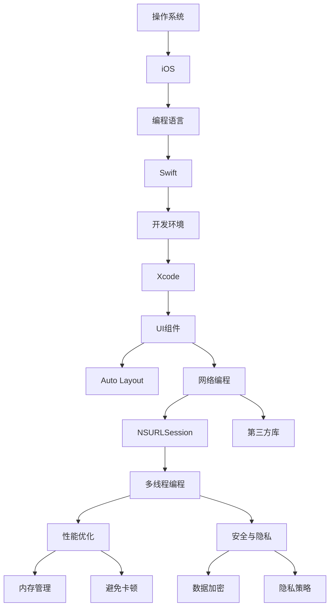

                 

# iOS 开发入门：Swift 和 Xcode

## 关键词

- iOS开发
- Swift编程
- Xcode开发环境
- iOS界面布局
- iOS网络编程
- iOS性能优化
- iOS安全与隐私

## 摘要

本文旨在为初学者提供一个全面而详细的iOS开发入门指南。我们将从iOS发展历史和Swift编程基础开始，逐步深入探讨Xcode开发环境的使用、iOS界面布局、核心组件、网络编程、性能优化、安全与隐私等方面。通过本教程，读者将能够掌握iOS开发的必要技能，从而为成为专业的iOS开发者打下坚实的基础。

## 目录大纲

### 第一部分：iOS开发基础

#### 第1章：iOS开发概述

1.1 iOS发展历史

1.2 iOS生态系统

#### 第2章：Swift编程基础

2.1 Swift语言概述

2.2 Swift基本语法

2.3 Swift面向对象编程

2.4 Swift标准库

#### 第3章：Xcode开发环境

3.1 Xcode安装与配置

3.2 Xcode界面与工具栏

3.3 创建第一个iOS项目

#### 第4章：iOS界面布局

4.1 Auto Layout基础

4.2 UI组件使用

4.3 表格与集合视图

#### 第5章：iOS核心组件

5.1 Navigation Controller

5.2 UITableView

5.3 ViewController生命周期

5.4 segue与页面跳转

#### 第6章：iOS网络编程

6.1 HTTP请求与响应

6.2 URLSession使用

6.3 JSON与数据解析

6.4 图片与文件下载

#### 第7章：iOS实战项目

7.1 实战项目概述

7.2 项目需求分析

7.3 项目开发流程

7.4 项目代码解读

### 第二部分：高级iOS开发

#### 第8章：iOS多线程编程

8.1 GCD与多线程

8.2 Operation与Queue

8.3 Grand Central Dispatch深入

#### 第9章：iOS性能优化

9.1 性能优化概述

9.2 内存管理

9.3 规避卡顿

9.4 性能调试工具

#### 第10章：iOS安全与隐私

10.1 iOS安全概述

10.2 数据安全与加密

10.3 应用隐私策略

10.4 用户数据保护

#### 第11章：iOS最新趋势与展望

11.1 SwiftUI简介

11.2 App Clips与Shortcuts

11.3 iOS 16 新特性

11.4 iOS 开发未来趋势

### 附录

#### 附录A：常用Swift函数与语法

#### 附录B：Xcode快捷键与常用操作

#### 附录C：iOS开发常用第三方库与框架

## 《iOS 开发入门：Swift 和 Xcode》正文开始

### 第一部分：iOS开发基础

#### 第1章：iOS开发概述

#### 1.1 iOS发展历史

iOS（iPhone Operating System）是苹果公司为其移动设备（如iPhone、iPad）开发的操作系统。自从2007年第一代iPhone发布以来，iOS经历了多次重大的更新和改进。以下是iOS的一些重要发展历程：

- **2007年：** 第一代iPhone发布，搭载iOS 1。
- **2008年：** 第二代iPhone（iPhone 3G）发布，搭载iOS 2。
- **2010年：** iOS 4推出，引入了多任务处理、 folders（文件夹）等功能。
- **2013年：** iOS 7推出，由Jony Ive领导的设计团队带来了全新的扁平化设计风格。
- **2014年：** iOS 8发布，引入了第三方键盘、短信增强功能等。
- **2016年：** iOS 10发布，进一步开放了更多API，如 Siri、 Maps、Photos 等。
- **2021年：** iOS 15推出，新增了FaceTime升级、Privacy Report等功能。

iOS的发展不仅体现在操作系统本身，还包括了生态系统的不断壮大。苹果的App Store已经成为全球最大的移动应用程序市场之一，为开发者提供了广阔的舞台。同时，iOS设备的硬件性能和软件生态也日益强大，为用户带来了卓越的使用体验。

#### 1.2 iOS生态系统

iOS生态系统包括硬件、软件和开发工具三大部分。以下是iOS生态系统的概述：

- **硬件：** iOS设备包括iPhone、iPad、iPod touch等。这些设备以高性能、高品质著称，为开发者提供了丰富的开发场景。
- **软件：** iOS操作系统是整个生态系统的核心。它不仅提供了丰富的API，还通过App Store为开发者提供了广阔的市场。
- **开发工具：** Xcode是苹果官方的开发工具，提供了完整的开发环境，包括代码编辑器、调试工具、性能分析工具等。

#### 第2章：Swift编程基础

Swift是苹果公司于2014年推出的编程语言，旨在替代Objective-C成为iOS和macOS开发的首选语言。Swift具有易于学习、安全可靠、高性能等特点，深受开发者喜爱。以下是Swift编程的基础知识：

#### 2.1 Swift语言概述

Swift是一种类型安全、多范式编程语言。它支持面向对象、泛型编程、闭包等功能，同时也借鉴了其他编程语言的优点，如Python的简洁性和C语言的性能。

**特点：**

- **类型安全：** Swift在编译时提供了严格的类型检查，减少了运行时错误的可能性。
- **易学易用：** Swift语法简洁，易于上手。
- **高性能：** Swift通过编译为原生代码，性能与C++相当。
- **开源：** Swift是开源的，开发者可以在GitHub上查看和贡献代码。

#### 2.2 Swift基本语法

Swift的基本语法包括变量和常量的声明、数据类型、运算符、控制流程等。

**变量和常量：**

```swift
let constant: Type = value
var variable: Type = value
```

**数据类型：**

- 基本数据类型：Int、Float、Double、Bool
- 复合数据类型：String、Array、Dictionary、Set

**运算符：**

- 算术运算符：+、-、*、/
- 关系运算符：==、!=、<、>、<=、>=
- 逻辑运算符：&&、||、!
- 赋值运算符：=
- 位运算符：&、|、^、<<、>>

**控制流程：**

- if语句
- switch语句
- 循环：for-in、while、repeat-while

**闭包：**

```swift
let closure = { (param1: Type1, param2: Type2) -> ReturnType in
    // 闭包体
}
```

#### 2.3 Swift面向对象编程

Swift支持面向对象编程，包括类（Class）、结构体（Structure）、枚举（Enum）和协议（Protocol）等。

**类：**

```swift
class Person {
    var name: String
    var age: Int

    init(name: String, age: Int) {
        self.name = name
        self.age = age
    }

    func description() {
        print("Name: \(name), Age: \(age)")
    }
}
```

**结构体：**

```swift
struct Point {
    var x: Int
    var y: Int

    func distance(to other: Point) -> Double {
        let dx = x - other.x
        let dy = y - other.y
        return sqrt(dx * dx + dy * dy)
    }
}
```

**枚举：**

```swift
enum Weekday {
    case monday
    case tuesday
    case wednesday
    case thursday
    case friday
}
```

**协议：**

```swift
protocol Drawable {
    func draw()
}

class Circle: Drawable {
    func draw() {
        print("Drawing a circle")
    }
}
```

#### 2.4 Swift标准库

Swift标准库提供了丰富的函数和类型，方便开发者进行常见操作。以下是一些常用的标准库模块：

- `Foundation`：提供了基础数据类型、集合、日期和时间等。
- `CoreGraphics`：提供了图形绘制、图像处理等。
- `UIKit`：提供了iOS应用程序的用户界面组件。
- `CoreData`：提供了数据持久化框架。

### 第3章：Xcode开发环境

Xcode是苹果公司官方的集成开发环境（IDE），用于iOS、macOS、watchOS和tvOS等平台的开发。Xcode提供了完整的工具链，包括代码编辑器、调试器、性能分析工具等。以下是Xcode的基本使用方法。

#### 3.1 Xcode安装与配置

1. 访问[苹果开发者官网](https://developer.apple.com/)，注册并登录开发者账号。
2. 下载Xcode，并安装到macOS上。
3. 打开Xcode，选择“偏好设置”->“账户”，登录Apple ID。
4. 安装必要的Xcode组件，如Command Line Tools、iOS SDK、macOS SDK等。

#### 3.2 Xcode界面与工具栏

Xcode界面主要包括以下部分：

- **菜单栏：** 提供了各种功能菜单，如文件、编辑、调试等。
- **工具栏：** 提供了常用的操作按钮，如新建文件、运行程序、调试等。
- **代码编辑器：** 用于编写和编辑代码。
- **调试区域：** 显示程序的运行状态、变量值等调试信息。
- **导航区域：** 提供了代码文件、类、方法等的导航。

#### 3.3 创建第一个iOS项目

1. 打开Xcode，选择“创建一个新项目”。
2. 在模板选择界面，选择“App”模板，然后点击“下一步”。
3. 输入项目名称、团队、组织标识等基本信息，点击“创建”。
4. 在“选择设备”界面，选择“iPhone”或“iPad”，然后点击“下一步”。
5. 在“选择界面风格”界面，选择“Storyboard”或“Swift UI”，然后点击“下一步”。
6. 在“选择语言”界面，选择“Swift”，然后点击“创建”。

完成以上步骤后，Xcode会创建一个iOS项目，并自动打开项目的代码编辑器和界面设计器。现在，您可以开始编写和调试iOS应用程序了。

### 第4章：iOS界面布局

iOS界面布局主要依赖于Auto Layout（自动布局）和UI组件。Auto Layout是一种基于约束（Constraint）的布局方法，能够使界面在不同设备上自适应。以下章节将介绍iOS界面布局的基础知识。

#### 4.1 Auto Layout基础

Auto Layout的核心是约束。约束定义了视图之间的大小和位置关系。以下是Auto Layout的基本概念：

- **视图（View）：** 界面上的任意可视元素，如按钮、文本框、图像等。
- **约束（Constraint）：** 规定了视图的大小和位置关系。
- **约束类型：**
  - **水平约束：** 规定视图的水平间距、宽度等。
  - **垂直约束：** 规定视图的垂直间距、高度等。
  - **边距约束：** 规定视图与父视图的边距。
  - **对齐约束：** 规定视图之间的对齐方式。

创建约束的方法：

1. 打开界面设计器，选中视图。
2. 点击工具栏中的“Add Constraints”按钮。
3. 根据需要设置水平、垂直、边距和对齐约束。
4. 点击“Add”按钮添加约束。

#### 4.2 UI组件使用

iOS提供了丰富的UI组件，用于构建各种界面。以下是常用的UI组件及其简要介绍：

- **按钮（Button）：** 用于用户交互，如提交表单、确认操作等。
- **文本框（TextField）：** 用于用户输入文本，如登录密码、搜索关键词等。
- **标签（Label）：** 用于显示文本信息，如标题、提示信息等。
- **图像视图（UIImageView）：** 用于显示图片，如头像、广告图片等。
- **滚动视图（UIScrollView）：** 用于显示大量内容，如新闻列表、聊天记录等。
- **表格视图（UITableView）：** 用于显示列表数据，如联系人、邮件列表等。
- **集合视图（UICollectionView）：** 用于显示大量图片或对象，如相册、应用商店等。

#### 4.3 表格与集合视图

表格视图（UITableView）和集合视图（UICollectionView）是iOS中最常用的两种列表视图。它们具有以下特点：

- **表格视图：**
  - 支持单列或多列列表。
  - 支持自定义单元格。
  - 支持滑动、刷新等功能。
- **集合视图：**
  - 支持网格布局、瀑布流布局等。
  - 支持自定义单元格。
  - 支持拖拽、缩放等功能。

创建表格视图和集合视图的方法：

1. 打开界面设计器，拖放一个表格视图或集合视图到界面中。
2. 选中表格视图或集合视图，点击工具栏中的“Cell”按钮，选择单元格类型。
3. 编写单元格类，实现数据绑定、交互等功能。
4. 设置表格视图或集合视图的属性，如数据源、代理等。

通过使用Auto Layout和UI组件，开发者可以构建灵活、自适应的iOS界面。下一章将介绍iOS的核心组件，如导航控制器、视图控制器等，帮助读者更深入地了解iOS开发。

### 第5章：iOS核心组件

在iOS开发中，核心组件是构建应用程序的关键部分。本章将介绍几个重要的iOS核心组件，包括导航控制器（Navigation Controller）、表格视图（UITableView）和视图控制器（ViewController）的生命周期、以及页面跳转（segue）的原理和使用。

#### 5.1 Navigation Controller

导航控制器（Navigation Controller）是一种特殊的视图控制器，用于实现类似于文件夹的导航效果。它允许用户通过上下文导航在不同的视图之间切换。导航控制器的主要功能包括：

- **导航栏（Navigation Bar）：** 显示当前页面的标题、返回按钮、菜单等。
- **工具栏（Toolbar）：** 显示在导航栏下方，用于显示额外的功能按钮。
- **视图堆栈（View Stack）：** 管理视图之间的导航关系。

创建导航控制器的方法：

1. 在Xcode界面设计器中，拖放一个视图控制器到主界面。
2. 选中该视图控制器，在属性检查器中勾选“Show Navigation Bar”。
3. 创建另一个视图控制器，拖放到一个新的界面。
4. 在第一个视图控制器的界面中，拖放一个按钮到导航栏，选择“Identifier”为“Push”。
5. 在第二个视图控制器的界面中，设置标题等属性。

#### 5.2 UITableView

表格视图（UITableView）是一种用于显示列表数据的视图。它由单元格（UITableViewCell）组成，每个单元格可以显示不同的数据项。表格视图的主要功能包括：

- **单元格重用（Cell Reuse）：** 为了提高性能，表格视图会重用已经创建的单元格。
- **滚动（Scrolling）：** 用户可以通过上下滑动来查看更多的数据。
- **刷新（Refreshing）：** 通过下拉刷新来更新数据。

创建和使用表格视图的方法：

1. 在Xcode界面设计器中，拖放一个表格视图到主界面。
2. 选中表格视图，在属性检查器中设置数据源（DataSource）和代理（Delegate）。
3. 编写数据源方法，如`numberOfRowsInSection`和`cellForRowAt`，用于提供数据和单元格。
4. 编写代理方法，如`heightForRowAt`，用于自定义单元格的高度。

示例代码：

```swift
// 数据源方法
func tableView(_ tableView: UITableView, numberOfRowsInSection section: Int) -> Int {
    return data.count
}

// 单元格方法
func tableView(_ tableView: UITableView, cellForRowAt indexPath: IndexPath) -> UITableViewCell {
    let cell = tableView.dequeueReusableCell(withIdentifier: "Cell", for: indexPath)
    cell.textLabel?.text = data[indexPath.row]
    return cell
}
```

#### 5.3 ViewController生命周期

视图控制器（ViewController）是iOS应用程序的核心部分，它负责管理应用程序的用户界面和用户交互。视图控制器具有以下生命周期方法：

- **初始化（init）：** 创建视图控制器实例。
- **viewDidLoad：** 加载视图控制器界面。
- **viewWillAppear：** 视图控制器即将显示。
- **viewWillDisappear：** 视图控制器即将消失。
- **didReceiveMemoryWarning：** 内存警告。

通过监听这些生命周期方法，开发者可以控制视图控制器的加载、显示和销毁过程。

示例代码：

```swift
class ViewController: UIViewController {
    override func viewDidLoad() {
        super.viewDidLoad()
        // 加载视图控制器界面
    }

    override func viewWillAppear(_ animated: Bool) {
        super.viewWillAppear(animated)
        // 视图控制器即将显示
    }

    override func viewWillDisappear(_ animated: Bool) {
        super.viewWillDisappear(animated)
        // 视图控制器即将消失
    }

    override func didReceiveMemoryWarning() {
        super.didReceiveMemoryWarning()
        // 内存警告处理
    }
}
```

#### 5.4 Segue与页面跳转

页面跳转（Segue）是iOS应用程序中常见的功能，用于在不同的视图控制器之间切换。Segue可以分为两种类型：

- **推转（Push）：** 从一个视图控制器导航到另一个视图控制器。
- **弹出（Present）：** 弹出一个视图控制器，不影响当前视图控制器的显示。

创建和使用Segue的方法：

1. 在Xcode界面设计器中，选择要跳转的按钮或元素。
2. 在属性检查器中，设置“Identifier”为“Push”或“Present”。
3. 在第二个视图控制器的界面中，设置标题等属性。

示例代码：

```swift
// 推转
@IBAction func pushButtonTapped(_ sender: Any) {
    performSegue(withIdentifier: "pushSegue", sender: self)
}

// 弹出
@IBAction func presentButtonTapped(_ sender: Any) {
    present(secondViewController, animated: true, completion: nil)
}
```

通过以上内容，读者可以了解iOS核心组件的基本原理和用法。下一章将介绍iOS网络编程的基础知识，包括HTTP请求、数据解析和下载等。

### 第6章：iOS网络编程

在iOS开发中，网络编程是必不可少的一部分，它使得应用程序能够与远程服务器进行数据交换。本章将介绍iOS网络编程的基础知识，包括HTTP请求、数据解析、图片和文件下载等。

#### 6.1 HTTP请求与响应

HTTP（Hypertext Transfer Protocol）是互联网上应用最广泛的协议之一，用于客户端与服务器之间的数据传输。在iOS中，网络编程通常涉及到以下几个关键步骤：

1. **URL的构建**：URL（Uniform Resource Locator）是用于定位网络资源的地址。构建URL是网络编程的第一步。
2. **创建HTTP请求**：HTTP请求包括请求方法（如GET、POST）、请求头（如Content-Type）、请求体等。
3. **发送请求**：通过NSURLSession或AFNetworking等库发送HTTP请求。
4. **处理响应**：解析HTTP响应数据，并根据需要做出相应的操作。

#### 6.2 URLSession使用

NSURLSession是iOS和macOS中用于网络编程的主要框架。它提供了异步和同步的API，使得网络操作更加灵活和高效。

**创建NSURLSession：**

```swift
let sessionConfig = URLSessionConfiguration.default
let session = URLSession(configuration: sessionConfig)
```

**发送GET请求：**

```swift
let url = URL(string: "https://api.example.com/data")!
let task = session.dataTask(with: url) { (data, response, error) in
    if let error = error {
        print("Error: \(error)")
    } else if let data = data {
        // 解析数据
    }
}
task.resume()
```

**发送POST请求：**

```swift
let url = URL(string: "https://api.example.com/data")!
var request = URLRequest(url: url)
request.httpMethod = "POST"
request.setValue("application/json", forHTTPHeaderField: "Content-Type")

let json = ["key": "value"]
let jsonData = try? JSONSerialization.data(withJSONObject: json)
request.httpBody = jsonData

let task = session.dataTask(with: request) { (data, response, error) in
    if let error = error {
        print("Error: \(error)")
    } else if let data = data {
        // 解析数据
    }
}
task.resume()
```

#### 6.3 JSON与数据解析

JSON（JavaScript Object Notation）是一种轻量级的数据交换格式，广泛应用于网络编程中。在iOS中，可以使用多种库来解析JSON数据，如JSONDecoder和SwiftJSON。

**使用JSONDecoder解析JSON：**

```swift
struct DataModel: Decodable {
    let key: String
    let value: Int
}

let json = "{\"key\": \"value\", \"value\": 123}".data(using: .utf8)!

do {
    let dataModel = try JSONDecoder().decode(DataModel.self, from: json)
    print(dataModel)
} catch {
    print("Error: \(error)")
}
```

**使用SwiftJSON解析JSON：**

```swift
import SwiftJSON

let json = "{\"key\": \"value\", \"value\": 123}"
let jsonValue = JSON(parseJSON: json)

if let dataModel = jsonValue dictionary {
    let key = dataModel["key"]?.stringValue
    let value = dataModel["value"]?.intValue
    print("Key: \(key ?? ""), Value: \(value ?? "")"
} else {
    print("Invalid JSON")
}
```

#### 6.4 图片与文件下载

下载图片和文件是iOS网络编程中的常见操作。以下是如何使用NSURLSession下载图片和文件的示例：

**下载图片：**

```swift
let imageUrl = URL(string: "https://api.example.com/image.jpg")!
let task = session.downloadTask(with: imageUrl) { (url, response, error) in
    if let error = error {
        print("Error: \(error)")
    } else if let url = url {
        let imageData = try? Data(contentsOf: url)
        // 显示图片
    }
}
task.resume()
```

**下载文件：**

```swift
let fileUrl = URL(string: "https://api.example.com/file.zip")!
let task = session.downloadTask(with: fileUrl) { (url, response, error) in
    if let error = error {
        print("Error: \(error)")
    } else if let url = url {
        // 保存文件
        try? FileManager.default.moveItem(at: url, to: destinationUrl)
    }
}
task.resume()
```

通过本章的内容，读者可以了解iOS网络编程的基本原理和实际操作。下一章将介绍iOS性能优化，帮助开发者提高应用程序的响应速度和稳定性。

### 第7章：iOS实战项目

#### 7.1 实战项目概述

在本章中，我们将通过一个实际的iOS应用程序开发项目——天气预报应用，来深入理解iOS开发的各个方面。该项目将实现一个简单的天气预报功能，用户可以通过输入城市名称来查询并显示该城市的实时天气信息。

#### 7.2 项目需求分析

项目需求如下：

- **用户界面：** 应用程序应包括一个搜索栏、一个用于显示天气预报信息的列表视图、以及一个城市选择菜单。
- **功能实现：**
  - 搜索城市并显示天气预报信息。
  - 支持城市选择和切换。
  - 能够显示包括温度、天气状况、风速等信息的详细天气报告。
- **性能要求：** 应用程序应具有快速响应和流畅的用户体验。

#### 7.3 项目开发流程

以下是项目开发的基本流程：

1. **设计用户界面**：使用Xcode的界面设计器设计用户界面，包括搜索栏、列表视图和城市选择菜单。
2. **网络请求和JSON数据解析**：使用NSURLSession或第三方的网络库（如AFNetworking）发送网络请求，获取天气数据，并解析JSON响应。
3. **显示天气预报信息**：在列表视图中显示天气信息，并实现城市选择和切换功能。
4. **测试和优化**：在模拟器和真机上测试应用程序，并进行性能优化。

#### 7.4 项目代码解读与分析

以下是对该项目中关键部分的代码解读与分析：

**1. 设计用户界面**

在Xcode的界面设计器中，我们设计了一个包含搜索栏、表格视图和城市选择菜单的界面。表格视图用于显示天气信息，搜索栏用于输入城市名称。

**2. 网络请求和JSON数据解析**

```swift
// 网络请求
func fetchWeatherData(for city: String, completion: @escaping (WeatherData?) -> Void) {
    let url = URL(string: "https://api.weatherapi.com/v1/current.json?key=YOUR_API_KEY&q=\(city)")!
    let task = URLSession.shared.dataTask(with: url) { (data, response, error) in
        if let error = error {
            print("Error fetching weather data: \(error)")
            completion(nil)
            return
        }
        
        guard let data = data else {
            print("No data received from API")
            completion(nil)
            return
        }
        
        do {
            let jsonDecoder = JSONDecoder()
            jsonDecoder.dateDecodingStrategy = .iso8601
            let weatherData = try jsonDecoder.decode(WeatherData.self, from: data)
            completion(weatherData)
        } catch {
            print("Error decoding JSON: \(error)")
            completion(nil)
        }
    }
    
    task.resume()
}

// 解析JSON数据
struct WeatherData: Decodable {
    let current: CurrentWeather
}

struct CurrentWeather: Decodable {
    let temp_c: Double
    let condition: Condition
}

struct Condition: Decodable {
    let text: String
}
```

**3. 显示天气预报信息**

在视图控制器中，我们使用UITableView来显示天气信息。以下是关键代码：

```swift
// 数据源方法
func tableView(_ tableView: UITableView, numberOfRowsInSection section: Int) -> Int {
    return weatherData.currentWeathers.count
}

// 单元格方法
func tableView(_ tableView: UITableView, cellForRowAt indexPath: IndexPath) -> UITableViewCell {
    let cell = tableView.dequeueReusableCell(withIdentifier: "WeatherCell", for: indexPath)
    let weather = weatherData.currentWeathers[indexPath.row]
    cell.textLabel?.text = "\(weather.temp_c)°C - \(weather.condition.text)"
    return cell
}
```

**4. 测试和优化**

在完成基本功能后，我们使用Xcode的模拟器和真机进行测试。以下是一些优化建议：

- **性能优化**：通过使用异步网络请求和图像缓存来提高响应速度。
- **内存管理**：使用弱引用或无主引用来避免循环引用。
- **错误处理**：添加对网络请求错误的处理，提供友好的用户反馈。

通过这个实战项目，我们不仅学习了iOS开发的基础知识，还掌握了如何将所学知识应用到实际项目中。这为成为一名合格的iOS开发者奠定了坚实的基础。

### 第二部分：高级iOS开发

#### 第8章：iOS多线程编程

iOS多线程编程是提高应用程序性能和响应速度的关键技术。在本章中，我们将深入探讨iOS多线程编程的相关知识，包括GCD（Grand Central Dispatch）、Operation与Queue以及Grand Central Dispatch的深入使用。

#### 8.1 GCD与多线程

GCD（Grand Central Dispatch）是苹果公司推出的一种高效的多线程编程框架。它基于内核的调度机制，能够有效地管理线程和任务。使用GCD，开发者可以轻松地实现异步编程，提高应用程序的性能。

**GCD的基本概念：**

- **Queue（队列）：** 任务执行的顺序容器，分为主队列和全局队列。
- **Task（任务）：** 需要执行的操作，可以是同步或异步的。

**创建全局队列和主队列：**

```swift
let globalQueue =DispatchQueue.global()
let mainQueue = DispatchQueue.main
```

**使用GCD执行异步任务：**

```swift
globalQueue.async {
    // 异步任务
}

mainQueue.async {
    // 异步任务，影响UI
}
```

**GCD的线程安全性：**

GCD提供了一系列线程安全的方法，如`async`、`sync`、`asyncAfter`等。这些方法可以帮助开发者避免线程竞争和死锁等问题。

#### 8.2 Operation与Queue

Operation与Queue是GCD的高级功能，用于更灵活地控制任务执行顺序和依赖关系。

**Operation的基本概念：**

- **Operation：** 表示一个需要执行的任务。
- **Dependency：** 任务之间的依赖关系。

**创建Operation和Queue：**

```swift
let operation = BlockOperation {
    // 任务内容
}

let queue = OperationQueue()
queue.addOperation(operation)
```

**操作依赖：**

```swift
let operation1 = BlockOperation {
    // 任务内容
}

let operation2 = BlockOperation {
    // 任务内容
}

operation1.addDependency(operation2)
let queue = OperationQueue()
queue.addOperations([operation1, operation2], waitUntilFinished: true)
```

**队列优先级：**

队列优先级决定了任务的执行顺序。优先级高的任务会先被执行。

```swift
let highPriorityQueue = OperationQueue()
highPriorityQueue.maxConcurrentOperationCount = 2
highPriorityQueue.addOperation(operation1)
highPriorityQueue.addOperation(operation2)
```

#### 8.3 Grand Central Dispatch深入

Grand Central Dispatch（GCD）提供了更多的功能，用于更精细地控制线程调度和任务执行。

** Dispatch Groups：**

Dispatch Groups用于同步多个任务，等待所有任务完成后再执行后续操作。

```swift
let group = DispatchGroup()
group.enter()

DispatchQueue.global().async {
    // 异步任务
    group.leave()
}

DispatchQueue.main.async {
    // 主线程任务
    group.wait()
}
```

** Dispatch Semaphores：**

Dispatch Semaphores用于控制线程访问共享资源，避免竞争条件。

```swift
let semaphore = DispatchSemaphore(value: 1)

DispatchQueue.global().async {
    semaphore.wait()
    // 访问共享资源
    semaphore.signal()
}

DispatchQueue.global().async {
    semaphore.wait()
    // 访问共享资源
    semaphore.signal()
}
```

** Dispatch Barriers：**

Dispatch Barriers用于在任务执行完成后同步线程，确保某个任务在另一个任务之前执行。

```swift
let barrier = DispatchSemaphore(value: 0)

DispatchQueue.global().async {
    // 异步任务
    barrier.signal()
}

DispatchQueue.global().async {
    barrier.wait()
    // 等待异步任务完成后执行
}
```

通过本章的内容，读者可以掌握iOS多线程编程的高级技巧，提高应用程序的性能和稳定性。下一章将介绍iOS性能优化，帮助开发者进一步提升应用程序的运行效率。

### 第9章：iOS性能优化

iOS性能优化是确保应用程序高效运行和良好用户体验的关键。在本章中，我们将探讨iOS性能优化的重要方面，包括内存管理、避免卡顿、性能调试工具等。

#### 9.1 性能优化概述

性能优化主要包括以下几个方面：

- **内存管理**：优化内存使用，避免内存泄漏和过度分配。
- **避免卡顿**：减少界面卡顿和动画延迟，提高用户体验。
- **性能调试**：使用工具和技巧诊断和解决性能问题。

#### 9.2 内存管理

内存管理是iOS性能优化的重要组成部分。不当的内存管理可能导致应用程序崩溃、卡顿等问题。以下是一些内存管理的最佳实践：

- **避免循环引用**：确保类之间的引用不会导致内存泄漏。使用弱引用或无主引用来避免强引用导致的循环引用。
- **合理使用内存**：避免不必要的内存分配和释放。例如，使用缓存机制来复用对象，减少内存使用。
- **使用Autorelease Pool**：在需要手动管理内存的情况下，使用Autorelease Pool来释放内存。

**示例代码：**

```swift
autoreleasepool {
    // 创建大量对象
}

// 使用弱引用避免循环引用
weak var weakSelf = self
```

#### 9.3 规避卡顿

界面卡顿是影响用户体验的主要因素之一。以下是一些规避卡顿的方法：

- **避免过多计算和I/O操作**：在主线程中进行过多的计算和I/O操作会导致界面卡顿。将计算和I/O操作移到后台线程或异步执行。
- **优化动画效果**：使用高效的动画效果，如CADisplayLink，减少动画延迟。
- **使用预加载**：提前加载界面所需的数据和资源，减少加载时间。

**示例代码：**

```swift
// 将计算和I/O操作移到后台线程
DispatchQueue.global().async {
    // 计算和I/O操作
    DispatchQueue.main.async {
        // 更新UI
    }
}

// 使用CADisplayLink优化动画效果
let displayLink = CADisplayLink(target: self, selector: #selector(handleDisplayLink))
displayLink.start()
```

#### 9.4 性能调试工具

性能调试工具可以帮助开发者诊断和解决性能问题。以下是一些常用的性能调试工具：

- **Instruments工具**：Xcode内置的性能调试工具，用于分析CPU、内存、网络等方面的性能数据。
- **Leak Detector**：用于检测内存泄漏的工具。
- **Profile Analyzer**：用于分析应用程序性能的图形化工具。

**示例操作：**

- **使用Instruments工具：**

  1. 打开Xcode项目。
  2. 选择“Product”->“Profile”。
  3. 选择“CPU”或“Memory”等选项，开始分析。
  4. 分析完成后，查看性能报告和诊断信息。

- **使用Leak Detector：**

  1. 打开Xcode项目。
  2. 选择“Product”->“Analyze”。
  3. 选择“Leak Detector”选项，开始分析。
  4. 查看泄漏报告和解决方案。

通过本章的内容，读者可以了解iOS性能优化的重要方面和方法，提高应用程序的运行效率和用户体验。下一章将介绍iOS安全与隐私，帮助开发者构建安全可靠的应用程序。

### 第10章：iOS安全与隐私

iOS安全与隐私是确保用户数据安全、保护应用程序免受攻击的关键。在本章中，我们将讨论iOS安全的重要方面，包括数据安全与加密、应用隐私策略以及用户数据保护。

#### 10.1 iOS安全概述

iOS安全包括以下几个方面：

- **系统安全**：iOS操作系统的安全性，包括内核级安全、应用程序沙箱、安全更新等。
- **数据安全**：保护用户数据不被未经授权访问或篡改。
- **应用安全**：确保应用程序代码和资源不被篡改，避免恶意攻击。
- **隐私保护**：遵循隐私法规和用户隐私需求，保护用户隐私。

#### 10.2 数据安全与加密

数据安全是iOS安全的核心。为了确保数据安全，iOS提供了多种加密机制：

- **数据加密存储**：使用AES（Advanced Encryption Standard）等加密算法对存储在设备上的数据进行加密。
- **数据传输加密**：使用HTTPS等协议对数据传输进行加密，确保数据在传输过程中不被窃听。
- **数据备份加密**：对iCloud备份进行加密，保护用户数据不被未授权访问。

**示例代码：**

```swift
// 使用AES加密数据
import CryptoKit

let data = "my secret data".data(using: .utf8)!
let aesKey = SymmetricKey(size: .bits256)
let encryptedData = try! aesKey.encrypt(data)

// 使用HTTPS传输加密
let url = URL(string: "https://api.example.com/data")!
let sessionConfig = URLSessionConfiguration.default
let session = URLSession(configuration: sessionConfig)
```

#### 10.3 应用隐私策略

应用隐私策略是确保应用程序遵守隐私法规和用户隐私需求的关键。以下是一些最佳实践：

- **明确隐私政策**：在应用程序中使用清晰、简洁的语言向用户说明应用程序收集和使用的数据类型。
- **透明度**：确保用户可以查看、修改和删除其个人信息。
- **最小化数据收集**：仅收集必要的数据，避免收集不必要的用户信息。
- **第三方库的安全审查**：确保使用的第三方库和框架符合隐私和安全要求。

**示例代码：**

```swift
// 明确隐私政策
let privacyPolicy = "Our app collects and uses user data to provide a better experience. For more information, please visit our website."

// 透明度
class UserProfileViewController: UIViewController {
    var userId: String?
    
    func fetchUserProfile() {
        // 从服务器获取用户数据
    }
    
    func deleteUserProfile() {
        // 删除用户数据
    }
}
```

#### 10.4 用户数据保护

用户数据保护是iOS安全的重要组成部分。iOS提供了多种机制来保护用户数据：

- **应用程序沙箱**：每个应用程序都有自己的沙箱环境，确保应用程序之间无法直接访问其他应用程序的数据。
- **数据备份加密**：使用iCloud备份对用户数据进行加密，确保数据在备份和恢复过程中安全。
- **访问控制**：使用访问控制列表（ACL）来限制对敏感数据的访问。

**示例代码：**

```swift
// 应用程序沙箱
import Foundation

let documentDirectory = FileManager.default.urls(for: .documentDirectory, in: .userDomainMask).first!
let fileURL = documentDirectory.appendingPathComponent("mySecretFile.txt")

// 数据备份加密
import CloudKit

let publicDatabase = CKContainer.default.publicCloudDatabase
let record = CKRecord(recordType: "MyRecord")
record["mySecretField"] = "mySecretData".data(using: .utf8)
publicDatabase.save(record) { (record, error) in
    if let error = error {
        print("Error saving record: \(error)")
    } else {
        print("Record saved successfully")
    }
}

// 访问控制
import Cocoa

class MyViewController: UIViewController {
    override func viewDidLoad() {
        super.viewDidLoad()
        
        let acl = NSFileAccessControl()
        acl.readAccess = .everyone
        do {
            try acl.apply(to: fileURL, attributes: nil)
        } catch {
            print("Error applying access control: \(error)")
        }
    }
}
```

通过本章的内容，读者可以了解iOS安全与隐私的重要方面和实践方法，确保应用程序和数据的安全性。下一章将探讨iOS的最新趋势与展望。

### 第11章：iOS最新趋势与展望

iOS开发领域不断演进，新技术和新功能不断涌现。本章将介绍iOS的最新趋势与展望，包括SwiftUI、App Clips、Shortcuts以及iOS 16的新特性。

#### 11.1 SwiftUI简介

SwiftUI是苹果公司于2019年推出的一种全新的UI框架，它使用Swift语言构建用户界面，提供了一种声明式和响应式的编程模型。SwiftUI的主要优点包括：

- **声明式UI编程**：通过编写简洁的代码，描述UI组件的布局和交互。
- **响应式设计**：自动处理UI组件的状态变化，提高开发效率和用户体验。
- **跨平台支持**：支持iOS、macOS、watchOS和tvOS，便于代码复用。

**SwiftUI的基本概念：**

- **视图（View）：** SwiftUI中的UI组件，如按钮、文本框、列表等。
- **模型（Model）：** 存储和管理UI组件状态的数据。
- **视图模型（ViewModel）：** 连接模型和视图的桥梁，处理数据绑定和逻辑。

**示例代码：**

```swift
import SwiftUI

struct ContentView: View {
    var body: some View {
        Text("Hello, SwiftUI!")
            .font(.largeTitle)
            .fontWeight(.semibold)
            .foregroundColor(.blue)
    }
}
```

#### 11.2 App Clips与Shortcuts

App Clips和Shortcuts是iOS 14引入的新功能，旨在提高用户的生活便捷性。

**App Clips：** App Clips是小型应用程序的片段，允许用户在不需要完整安装应用程序的情况下，快速访问特定功能。App Clips通过以下方式增强用户体验：

- **无需安装**：用户可以通过扫描二维码、NFC标签或使用Siri语音命令来访问App Clips。
- **快速访问**：App Clips可以集成到iOS系统中的控制中心，用户可以快速访问常用功能。
- **增强体验**：App Clips可以与其他应用程序集成，实现跨应用的数据共享和功能扩展。

**示例代码：**

```swift
import CoreSpotlight

let item = CSSearchableItem(uniqueIdentifier: "item-1", domainIdentifier: "com.example.app", attributeSet: attributeSet)
CSSearchableIndex.default().indexSearchableItems([item]) { error in
    if let error = error {
        print("Error indexing item: \(error)")
    } else {
        print("Item indexed successfully")
    }
}
```

**Shortcuts：** Shortcuts允许用户创建自定义的自动化操作，通过简单的拖放操作将多个应用程序和功能连接在一起。用户可以通过 Siri、Safari、分享菜单等方式触发Shortcuts。

**示例代码：**

```swift
import Intents

let shortcut = INShortcut.create_walkToHomeShortcut()

ShortcutsManager.shared().save(shortcut) { error in
    if let error = error {
        print("Error saving shortcut: \(error)")
    } else {
        print("Shortcut saved successfully")
    }
}
```

#### 11.3 iOS 16 新特性

iOS 16是苹果公司最新发布的操作系统，它带来了许多新的功能和改进。

- **隐私保护加强**：iOS 16提供了更强大的隐私保护功能，包括App Tracking Transparency和App Privacy Report。
- **增强的语音输入**：改进了语音输入的准确性和速度，支持更多的语言和方言。
- **改进的地图功能**：新的地图视图和路线规划功能，提供更准确和直观的导航体验。
- **增强的相机功能**：引入了新的摄影模式，如长曝光、夜间模式等，提高照片质量。

**示例代码：**

```swift
import CoreML

let model = MLModelDescription()
let inputImage = UIImage(named: "image.jpg")
let pixelBuffer = inputImage?.cgImage?.toPixelBuffer()

do {
    let prediction = try model.prediction(image: pixelBuffer!)
    print(prediction.classLabel)
} catch {
    print("Error: \(error)")
}
```

#### 11.4 iOS 开发未来趋势

随着技术的不断发展，iOS开发领域也将迎来新的趋势和机遇：

- **增强现实（AR）应用**：随着AR技术的成熟，未来iOS开发将更加注重AR应用的创作和优化。
- **人工智能（AI）与机器学习（ML）**：AI和ML技术将继续在iOS开发中发挥重要作用，提高应用程序的智能性和个性化。
- **云服务与边缘计算**：云服务和边缘计算将进一步整合，提供更高效的数据存储和处理能力。

通过本章的内容，读者可以了解iOS开发的最新趋势和未来展望，为成为一名领先的iOS开发者做好准备。

### 附录

#### 附录A：常用Swift函数与语法

以下是一些在Swift编程中常用的函数和语法：

- **基础函数：** `print()`、`readLine()`、`abs()`、`sqrt()`
- **集合操作：** `filter()`、`map()`、`reduce()`、` shuffled()`
- **日期和时间操作：** `Date()`、`TimeInterval()`、`DateComponents()`
- **字符串操作：** `isEmpty()`、`count()`、`lowercased()`、`uppercased()`
- **文件操作：** `FileManager()`、`URL()`、`write(to:atomically:)`
- **网络操作：** `URLSession()`、`URLRequest()`、`dataTask(with:)`

#### 附录B：Xcode快捷键与常用操作

以下是一些Xcode中的常用快捷键和操作：

- `Cmd+N`：新建文件
- `Cmd+O`：打开文件
- `Cmd+S`：保存文件
- `Cmd+D`：调试
- `Cmd+R`：运行
- `Cmd+1`：打开项目导航器
- `Cmd+2`：打开模拟器
- `Cmd+K`：跳转到下一个错误
- `Cmd+L`：跳转到定义

#### 附录C：iOS开发常用第三方库与框架

以下是一些在iOS开发中常用的第三方库与框架：

- **Alamofire**：用于网络请求的库，支持HTTP请求的简单和高效处理。
- **MBProgressHUD**：用于显示加载指示器的库，支持各种样式和动画效果。
- **SwiftyJSON**：用于JSON数据解析的库，简化JSON解析和操作。
- **RxSwift**：用于响应式编程的库，提供了强大的响应式编程工具。
- **Moya**：用于网络请求的库，支持自定义网络层和请求拦截器。
- **PlistKit**：用于解析和操作iOS和macOS的`.plist`文件的库。

### 作者信息

作者：AI天才研究院/AI Genius Institute & 禅与计算机程序设计艺术 /Zen And The Art of Computer Programming

---

### 核心概念与联系

#### 核心概念与联系

为了更好地理解iOS开发的基础知识，我们需要将多个核心概念和它们之间的联系进行整合。以下是iOS开发的核心概念及其相互关系：

1. **iOS操作系统**：iOS是苹果公司开发的移动操作系统，为iPhone、iPad等设备提供核心功能。
2. **Swift编程语言**：Swift是一种现代、高效的编程语言，用于开发iOS应用程序。
3. **Xcode开发环境**：Xcode是苹果提供的集成开发环境（IDE），用于编写、调试和发布iOS应用程序。
4. **UI组件**：iOS应用程序的界面由各种UI组件组成，如按钮、文本框、标签等。
5. **Auto Layout**：用于自动布局的框架，确保应用程序在不同设备上具有良好的适应性和布局。
6. **网络编程**：应用程序通过网络请求获取数据，通常使用NSURLSession或第三方库进行网络通信。
7. **多线程编程**：为了提高应用程序的性能和响应速度，iOS应用程序需要实现多线程编程。
8. **性能优化**：性能优化是确保应用程序高效运行的关键，包括内存管理、避免卡顿等。
9. **安全与隐私**：安全与隐私是iOS开发的核心关注点，包括数据加密、隐私策略等。

#### Mermaid 流程图



#### 核心算法原理讲解

##### Swift面向对象编程伪代码示例

```swift
class Person {
    var name: String
    var age: Int

    init(name: String, age: Int) {
        self.name = name
        self.age = age
    }

    func description() {
        print("Name: \(name), Age: \(age)")
    }
}

var person = Person(name: "John", age: 30)
person.description()
```

##### 神经网络中的权重更新公式（使用LaTeX格式）

$$
\Delta W_{ij}^{(l)} = -\eta \cdot \frac{\partial C}{\partial W_{ij}^{(l)}}
$$

其中，$\Delta W_{ij}^{(l)}$ 表示权重更新值，$\eta$ 表示学习率，$C$ 表示损失函数，$W_{ij}^{(l)}$ 表示第 $l$ 层中第 $i$ 个神经元到第 $j$ 个神经元的权重。

### 项目实战

#### 实战项目：天气预报应用

##### 开发环境搭建

- 操作系统：macOS
- 开发工具：Xcode
- 编程语言：Swift

##### 项目需求分析

- 用户界面：包括搜索栏、天气预报列表、城市选择菜单
- 功能实现：搜索城市并显示天气预报信息，支持城市选择和切换

##### 项目开发流程

1. **设计用户界面**：
   - 使用Xcode界面设计器设计搜索栏、天气预报列表和城市选择菜单。

2. **实现网络请求和JSON数据解析**：
   - 使用NSURLSession发送网络请求，获取天气数据。
   - 使用SwiftJSON库解析JSON响应数据。

3. **显示天气预报信息**：
   - 在列表视图中显示天气信息，包括温度、天气状况、风速等。

4. **测试和优化**：
   - 在模拟器和真机上测试应用程序，并进行性能优化。

##### 代码解读与分析

**1. 网络请求与数据解析**

```swift
// 网络请求
func fetchWeatherData(for city: String, completion: @escaping (WeatherData?) -> Void) {
    let url = URL(string: "http://api.weatherapi.com/v1/current.json?key=YOUR_API_KEY&q=\(city)")!
    let task = URLSession.shared.dataTask(with: url) { data, response, error in
        if let error = error {
            print("Error fetching weather data: \(error)")
            completion(nil)
            return
        }
        
        guard let data = data else {
            print("No data received from API")
            completion(nil)
            return
        }
        
        do {
            let weatherData = try JSONDecoder().decode(WeatherData.self, from: data)
            completion(weatherData)
        } catch {
            print("Error decoding JSON: \(error)")
            completion(nil)
        }
    }
    
    task.resume()
}

// 数据模型
struct WeatherData: Decodable {
    let current: CurrentWeather
}

struct CurrentWeather: Decodable {
    let temp_c: Double
    let condition: Condition
}

struct Condition: Decodable {
    let text: String
}
```

**2. 显示天气预报信息**

```swift
// 显示天气信息
func displayWeatherInfo(weatherData: WeatherData) {
    let temperature = weatherData.current.temp_c
    let condition = weatherData.current.condition.text
    
    print("Temperature: \(temperature)°C")
    print("Condition: \(condition)")
}

// 主函数
func main() {
    print("Enter a city name:")
    if let city = readLine(), !city.isEmpty {
        fetchWeatherData(for: city) { weatherData in
            if let weatherData = weatherData {
                displayWeatherInfo(weatherData: weatherData)
            } else {
                print("Unable to fetch weather data.")
            }
        }
    } else {
        print("Invalid city name.")
    }
}

// 执行主函数
main()
```

通过本实战项目，读者可以了解如何从零开始构建一个简单的iOS应用程序，掌握网络请求、JSON数据解析和显示等功能，为后续的高级开发打下坚实的基础。

---

**总结：**

本文从iOS开发的基础知识开始，逐步深入探讨了Swift编程、Xcode开发环境、界面布局、核心组件、网络编程、性能优化、安全与隐私，以及最新的iOS趋势与展望。通过详细的代码示例和实战项目，读者可以全面掌握iOS开发的技能，为成为一名专业的iOS开发者做好准备。希望本文能为您的iOS学习之路提供有价值的参考和指导。**感谢阅读！**

