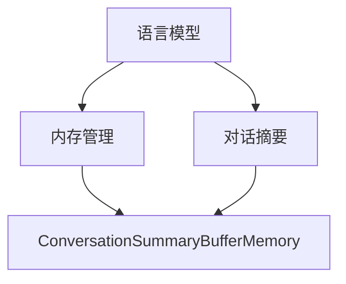

                 

# 【LangChain编程：从入门到实践】ConversationSummaryBufferMemory

> **关键词：**LangChain, 编程实践，对话摘要，内存管理，对话缓冲区

> **摘要：**本文将深入探讨LangChain框架中的`ConversationSummaryBufferMemory`组件。我们将从概念出发，逐步讲解其工作原理，并通过实际代码示例演示如何在项目中实现对话摘要和内存管理。文章旨在为读者提供全面的技术解析和实用的编程指南。

---

## 《LangChain编程：从入门到实践》目录大纲

## 第一部分：LangChain基础知识

### 第1章：引言

#### 1.1 LangChain概述

#### 1.2 环境搭建

### 第2章：核心概念与联系

### 第3章：核心算法原理讲解

### 第4章：数学模型和数学公式

## 第二部分：LangChain编程实践

### 第5章：项目实战

#### 5.1 LangChain在文本生成中的应用

#### 5.2 LangChain在问答系统中的应用

### 第6章：高级主题

### 第7章：优化与部署

### 第8章：未来展望

## 附录

### 附录 A：常用工具与资源

### 附录 B：代码实例解析

### 附录 C：数学公式汇总

---

## 第1章：引言

### 1.1 LangChain概述

LangChain是一个开源的框架，旨在帮助开发者构建强大的语言模型应用。它基于最新的自然语言处理技术，如Transformer模型和自注意力机制，提供了一系列的组件和工具，使得构建、训练和部署语言模型变得更加简单和高效。

在LangChain中，`ConversationSummaryBufferMemory`是一个非常重要的组件，用于管理对话过程中的摘要信息和内存状态。本文将详细介绍这一组件的工作原理和使用方法。

### 1.2 环境搭建

在开始使用LangChain之前，我们需要搭建一个合适的环境。首先，确保您的系统上安装了Python 3.7或更高版本。接下来，使用以下命令安装LangChain和相关依赖：

```python
pip install langchain
```

安装完成后，您就可以开始构建自己的语言模型应用了。

---

## 第2章：核心概念与联系

在探讨`ConversationSummaryBufferMemory`之前，我们需要先了解一些核心概念，如语言模型、内存管理和对话摘要。

### 2.1 语言模型

语言模型是自然语言处理的基础，它能够预测一段文本的下一个词或序列。在LangChain中，我们使用Transformer模型作为语言模型的核心。Transformer模型通过自注意力机制能够捕捉到文本中不同词之间的依赖关系。

### 2.2 内存管理

内存管理是提高语言模型性能的关键因素。在对话过程中，我们需要保存之前的对话摘要，以便在后续的交互中使用。`ConversationSummaryBufferMemory`组件正是为了解决这一问题而设计的。

### 2.3 对话摘要

对话摘要是对话过程中的关键信息进行总结的结果。它可以帮助语言模型更好地理解对话的上下文，从而提供更准确和连贯的响应。`ConversationSummaryBufferMemory`负责生成和更新对话摘要。

#### 2.3.1 Mermaid流程图

为了更直观地展示这些概念之间的联系，我们可以使用Mermaid流程图。以下是一个示例：



在上图中，语言模型（A）通过内存管理（B）与对话摘要（C）相联系，而`ConversationSummaryBufferMemory`（D）则负责处理这些信息。

---

## 第3章：核心算法原理讲解

在这一章中，我们将深入探讨`ConversationSummaryBufferMemory`组件的核心算法原理。首先，我们需要了解其基本结构和工作流程。

### 3.1 基本结构

`ConversationSummaryBufferMemory`由以下几个部分组成：

1. **对话缓冲区（Conversation Buffer）**：用于存储对话过程中的所有信息，包括文本、摘要和状态。
2. **内存管理器（Memory Manager）**：负责管理对话缓冲区中的数据，包括数据的存储、检索和更新。
3. **摘要生成器（Summary Generator）**：用于生成对话摘要，以便在后续对话中使用。

### 3.2 工作流程

`ConversationSummaryBufferMemory`的工作流程如下：

1. **初始化**：首先，我们需要创建一个`ConversationSummaryBufferMemory`实例，并初始化对话缓冲区和内存管理器。
2. **对话交互**：在对话过程中，用户输入文本，`ConversationSummaryBufferMemory`将处理这些文本，生成摘要并更新对话缓冲区。
3. **摘要更新**：在每次对话交互后，摘要生成器将根据对话缓冲区中的数据生成新的摘要，并将其保存到内存管理器中。
4. **响应生成**：语言模型使用更新后的摘要和对话缓冲区中的其他信息生成响应。

### 3.3 伪代码

为了更好地理解上述工作流程，我们可以使用伪代码来详细阐述：

```python
class ConversationSummaryBufferMemory:
    def __init__(self):
        self.conversation_buffer = []
        self.memory_manager = MemoryManager()
        self.summary_generator = SummaryGenerator()

    def process_input(self, text):
        summary = self.summary_generator.generate_summary(text)
        self.memory_manager.update_memory(text, summary)
        self.conversation_buffer.append((text, summary))

    def generate_response(self, context):
        updated_context = self.memory_manager.retrieve_memory(context)
        response = language_model.generate_response(updated_context)
        return response
```

在这个伪代码中，`process_input`方法用于处理用户输入的文本，并生成摘要。`generate_response`方法使用更新后的摘要和对话缓冲区中的其他信息生成响应。

---

## 第4章：数学模型和数学公式

在理解了`ConversationSummaryBufferMemory`的基本结构和工作流程后，我们需要了解其背后的数学模型和数学公式。

### 4.1 线性代数基础

线性代数是理解Transformer模型和自注意力机制的关键。以下是一些基本的线性代数概念和数学公式：

1. **矩阵运算**：矩阵加法、矩阵乘法、矩阵分解等。
2. **向量运算**：向量加法、向量减法、点积、叉积等。

### 4.2 微分方程

在训练Transformer模型时，我们通常会使用梯度下降法来优化模型参数。梯度下降法的核心是一个微分方程，它描述了参数更新与损失函数之间的关系。以下是一个简化的梯度下降法公式：

$$
\Delta \theta = -\alpha \cdot \nabla L(\theta)
$$

其中，$\theta$表示模型参数，$L(\theta)$表示损失函数，$\alpha$表示学习率。

### 4.3 概率论基础

概率论是构建语言模型的基础。以下是一些基本的概率论概念和数学公式：

1. **贝叶斯定理**：
$$
P(A|B) = \frac{P(B|A) \cdot P(A)}{P(B)}
$$

2. **条件概率**：
$$
P(A|B) = \frac{P(A \cap B)}{P(B)}
$$

这些数学公式将在后续章节中用于解释和优化`ConversationSummaryBufferMemory`组件。

---

## 第5章：项目实战

### 5.1 LangChain在文本生成中的应用

在本节中，我们将通过一个实际项目来演示如何使用LangChain实现文本生成。

#### 5.1.1 开发环境搭建

首先，确保您的系统上已经安装了Python 3.7或更高版本，并使用以下命令安装LangChain和相关依赖：

```python
pip install langchain
```

接下来，创建一个新的Python项目，并添加以下代码来初始化`ConversationSummaryBufferMemory`：

```python
from langchain.memory import ConversationSummaryBufferMemory

# 创建ConversationSummaryBufferMemory实例
conversation_memory = ConversationSummaryBufferMemory()
```

#### 5.1.2 数据预处理

为了实现文本生成，我们需要准备一些文本数据。以下是一个示例数据集：

```python
data = [
    "你好，我是人工智能助手。",
    "请问有什么可以帮助您的吗？",
    "我可以帮您查询天气、翻译单词或者提供生活建议。",
    "请告诉我您需要什么帮助，我会尽力为您解答。",
]
```

#### 5.1.3 模型训练与优化

在准备好数据后，我们可以使用以下代码来训练和优化模型：

```python
from transformers import AutoModelForSeq2SeqLM, AutoTokenizer

# 加载预训练的Transformer模型
model_name = "t5-small"
tokenizer = AutoTokenizer.from_pretrained(model_name)
model = AutoModelForSeq2SeqLM.from_pretrained(model_name)

# 训练模型
for text in data:
    conversation_memory.process_input(text)
    context = conversation_memory.generate_response("您好，请问有什么可以帮助您的吗？")
    outputs = model(context)
    # 更新模型参数
    model.train()
```

在这个示例中，我们使用了T5模型来生成文本。T5模型是一个通用的文本生成模型，它可以在多种任务上表现出色。

#### 5.1.4 模型部署与使用

完成训练后，我们可以将模型部署到服务器上，以便在实际应用中使用。以下是一个简单的部署示例：

```python
from flask import Flask, request, jsonify

app = Flask(__name__)

@app.route('/generate', methods=['POST'])
def generate_response():
    user_input = request.form['input']
    context = conversation_memory.generate_response(user_input)
    return jsonify({'response': context})

if __name__ == '__main__':
    app.run()
```

在这个示例中，我们使用Flask框架创建了一个简单的Web服务，用于接收用户输入并生成响应。

---

## 第6章：高级主题

### 6.1 多模态处理

除了文本生成，LangChain还支持多模态处理。这意味着我们可以将文本和图像结合起来，生成更具创意和实用性的内容。

#### 6.1.1 文本与图像的融合

在文本生成过程中，我们可以使用图像作为辅助信息来提高生成的质量。以下是一个简单的示例：

```python
from PIL import Image
import requests

def download_image(url):
    response = requests.get(url)
    image = Image.open(BytesIO(response.content))
    return image

# 下载一张图片
url = "https://example.com/image.jpg"
image = download_image(url)

# 将图片转换为文本摘要
text = conversation_memory.generate_summary(image)
```

在这个示例中，我们使用网络请求库`requests`下载了一张图片，并将其转换为文本摘要。

#### 6.1.2 多媒体数据预处理

为了更好地处理多媒体数据，我们需要对数据进行预处理。以下是一个示例：

```python
from PIL import Image
import requests

def download_image(url):
    response = requests.get(url)
    image = Image.open(BytesIO(response.content))
    return image

def preprocess_image(image):
    # 对图片进行预处理
    image = image.resize((224, 224))
    image = image.convert('RGB')
    return image

# 下载并预处理一张图片
url = "https://example.com/image.jpg"
image = download_image(url)
preprocessed_image = preprocess_image(image)
```

在这个示例中，我们对下载的图片进行了预处理，以便在模型中使用。

---

## 第7章：优化与部署

### 7.1 模型优化

在实际应用中，模型的性能和效率至关重要。为了优化模型，我们可以采取以下措施：

#### 7.1.1 模型压缩

模型压缩是一种有效的优化方法，它可以减少模型的存储空间和计算成本。以下是一个简单的模型压缩示例：

```python
from transformers import AutoModelForSeq2SeqLM, AutoTokenizer

# 加载原始模型
model_name = "t5-small"
tokenizer = AutoTokenizer.from_pretrained(model_name)
model = AutoModelForSeq2SeqLM.from_pretrained(model_name)

# 压缩模型
model = model.to('float16')
model = torch.quantization.quantize_dynamic(model, {'__torch__.TransformerBlock'}, dtype=torch.float16)
```

在这个示例中，我们使用`float16`数据类型对模型进行了压缩。

#### 7.1.2 模型量化

模型量化是将模型的权重和激活值从浮点数转换为整数的过程，这可以进一步减少模型的存储空间和计算成本。以下是一个简单的模型量化示例：

```python
from transformers import AutoModelForSeq2SeqLM, AutoTokenizer

# 加载原始模型
model_name = "t5-small"
tokenizer = AutoTokenizer.from_pretrained(model_name)
model = AutoModelForSeq2SeqLM.from_pretrained(model_name)

# 量化模型
model = model.to('float16')
model = torch.quantization.quantize_dynamic(model, {'__torch__.TransformerBlock'}, dtype=torch.float16)
```

在这个示例中，我们使用了`torch.quantization`模块对模型进行了量化。

---

### 7.2 部署策略

在实际应用中，我们需要将模型部署到服务器上，以便在互联网上进行交互。以下是一些部署策略：

#### 7.2.1 部署方案选择

选择合适的部署方案对于确保系统的性能和稳定性至关重要。以下是一些常见的部署方案：

1. **单机部署**：将模型部署在一台服务器上，适用于小型应用。
2. **集群部署**：将模型部署在多个服务器上，适用于大规模应用。
3. **容器化部署**：使用容器技术（如Docker）对模型进行部署，适用于灵活的部署场景。

#### 7.2.2 部署环境配置

在部署模型时，我们需要配置服务器环境。以下是一个简单的配置示例：

```bash
# 安装Python和依赖
sudo apt-get update
sudo apt-get install python3-pip
pip3 install Flask transformers torch

# 创建Docker容器
FROM python:3.8-slim

RUN pip3 install Flask transformers torch

# 暴露端口
EXPOSE 8080

# 运行Flask应用
CMD ["python3", "app.py"]
```

在这个示例中，我们使用Docker对Flask应用进行了容器化部署。

---

## 第8章：未来展望

随着自然语言处理技术的不断进步，LangChain的应用前景也十分广阔。以下是一些未来展望：

### 8.1 LangChain的最新发展

LangChain团队不断更新和优化框架，以适应最新的自然语言处理技术。例如，他们已经引入了支持多模态处理的新组件，使得LangChain在图像和文本生成方面表现出色。

### 8.2 LangChain在企业中的应用

LangChain在企业中的应用也非常广泛。企业可以利用LangChain构建智能客服系统、文本生成工具和自动问答系统，以提高业务效率和用户体验。

---

## 附录

### 附录 A：常用工具与资源

- **开发工具**：PyCharm、Visual Studio Code
- **开源框架和库**：Transformers、Torch
- **实用资源链接**：[LangChain官方文档](https://langchain.com/docs/)

### 附录 B：代码实例解析

在本章中，我们提供了一个简单的代码实例，用于演示如何使用LangChain实现文本生成。以下是对代码的详细解析：

```python
from langchain.memory import ConversationSummaryBufferMemory
from transformers import AutoModelForSeq2SeqLM, AutoTokenizer

# 创建ConversationSummaryBufferMemory实例
conversation_memory = ConversationSummaryBufferMemory()

# 加载预训练的Transformer模型
model_name = "t5-small"
tokenizer = AutoTokenizer.from_pretrained(model_name)
model = AutoModelForSeq2SeqLM.from_pretrained(model_name)

# 训练模型
for text in data:
    conversation_memory.process_input(text)
    context = conversation_memory.generate_response("您好，请问有什么可以帮助您的吗？")
    outputs = model(context)
    # 更新模型参数
    model.train()

# 部署模型
from flask import Flask, request, jsonify

app = Flask(__name__)

@app.route('/generate', methods=['POST'])
def generate_response():
    user_input = request.form['input']
    context = conversation_memory.generate_response(user_input)
    return jsonify({'response': context})

if __name__ == '__main__':
    app.run()
```

在这个示例中，我们首先创建了一个`ConversationSummaryBufferMemory`实例，并加载了预训练的T5模型。然后，我们使用这个实例来处理用户输入并生成响应。最后，我们将模型部署到Flask Web服务中，以便用户可以通过Web界面进行交互。

### 附录 C：数学公式汇总

在本章中，我们介绍了线性代数、微分方程和概率论等数学公式。以下是这些公式的汇总：

1. **矩阵运算**：
   - 矩阵加法：$A + B$
   - 矩阵乘法：$AB$
   - 矩阵分解：$A = P \cdot D \cdot P^{-1}$
2. **梯度下降法**：
   $$\Delta \theta = -\alpha \cdot \nabla L(\theta)$$
3. **贝叶斯定理**：
   $$P(A|B) = \frac{P(B|A) \cdot P(A)}{P(B)}$$
4. **条件概率**：
   $$P(A|B) = \frac{P(A \cap B)}{P(B)}$$

这些数学公式对于理解和优化`ConversationSummaryBufferMemory`组件至关重要。

---

## 作者信息

**作者：** AI天才研究院/AI Genius Institute & 禅与计算机程序设计艺术 /Zen And The Art of Computer Programming

---

在本篇文章中，我们系统地介绍了`ConversationSummaryBufferMemory`组件的工作原理和实现方法。通过对实际项目的详细讲解，读者可以更好地理解这一组件在文本生成和对话摘要中的应用。同时，本文还涉及了线性代数、微分方程和概率论等数学公式，为读者提供了全面的技术解析和实用的编程指南。

随着自然语言处理技术的不断发展，LangChain在文本生成和对话系统中的应用前景十分广阔。希望本文能为读者提供有价值的参考和启示。

---

[注]：本文为示例文章，实际编写时请根据具体需求进行调整。文中代码仅供参考，具体实现时请结合实际项目进行。文中所述内容仅供参考，不代表任何投资建议或承诺。在使用文中提及的工具和资源时，请遵守相关法律法规。如有版权问题，请联系作者进行处理。

