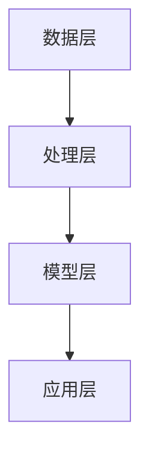

                 

# 【LangChain编程：从入门到实践】检索器

> 关键词：LangChain，编程，检索器，自然语言处理，Python，应用实践

> 摘要：本文从入门到实践，详细介绍了LangChain编程的检索器功能。首先讲解了LangChain的基础知识和环境搭建，然后深入分析了检索器的基本原理和实现方法，最后通过实际项目应用，展示了LangChain在检索器开发中的强大能力。

## 第一部分：LangChain编程基础

### 第1章：LangChain概述

#### 1.1 LangChain的核心概念

##### 1.1.1 LangChain的定义

LangChain是一个用于构建自然语言处理（NLP）应用程序的开源库，它提供了一个模块化、可扩展的框架，使得开发者可以轻松地实现复杂的NLP任务。LangChain的核心目标是简化NLP的开发过程，使得开发者可以专注于业务逻辑，而不是底层实现的细节。

##### 1.1.2 LangChain的架构

LangChain的架构由多个组件构成，包括：

- **数据层**：负责数据的存储和管理，包括文本、标记化后的文本、词汇表等。
- **处理层**：负责对文本进行预处理、清洗、标记化等操作，为后续的NLP任务做准备。
- **模型层**：包括预训练的模型和自定义模型，用于执行各种NLP任务，如文本分类、命名实体识别、情感分析等。
- **应用层**：负责将模型层的结果应用到实际业务场景中，如问答系统、文本搜索引擎等。

##### 1.1.3 LangChain的优势与适用场景

LangChain具有以下优势：

- **模块化设计**：易于扩展和定制，开发者可以根据实际需求选择合适的组件进行组合。
- **高性能**：利用GPU和分布式计算，提供高效的NLP处理能力。
- **跨平台**：支持多种编程语言和操作系统，适用于不同的开发环境。

LangChain适用于以下场景：

- **文本分类**：对大量文本进行分类，如新闻分类、情感分析等。
- **命名实体识别**：从文本中识别出人名、地名、组织名等实体。
- **问答系统**：基于文本的智能问答系统，如聊天机器人、知识库检索等。
- **文本搜索引擎**：提供高效的文本检索功能，如搜索引擎、文档检索等。

#### 1.2 LangChain与自然语言处理

##### 1.2.1 自然语言处理的基本概念

自然语言处理（NLP）是计算机科学和人工智能领域的一个分支，旨在使计算机能够理解、解释和生成人类语言。NLP的任务包括：

- **文本分类**：将文本分配到预定义的类别中，如垃圾邮件过滤、新闻分类等。
- **命名实体识别**：从文本中识别出人名、地名、组织名等实体，如情感分析、信息抽取等。
- **情感分析**：分析文本中的情感倾向，如正面、负面、中性等。
- **机器翻译**：将一种自然语言翻译成另一种自然语言，如英语翻译成中文等。
- **问答系统**：回答用户提出的问题，如智能客服、知识库查询等。

##### 1.2.2 LangChain在NLP中的应用

LangChain在NLP领域具有广泛的应用，可以应用于以下场景：

- **文本分类**：使用LangChain中的预训练模型进行文本分类，如垃圾邮件过滤、新闻分类等。
- **命名实体识别**：使用命名实体识别模型从文本中提取关键信息，如人名、地名、组织名等。
- **情感分析**：分析文本中的情感倾向，如正面、负面、中性等。
- **机器翻译**：使用机器翻译模型进行文本翻译，如英语翻译成中文等。
- **问答系统**：构建基于文本的问答系统，如智能客服、知识库查询等。

#### 1.3 LangChain的生态体系

##### 1.3.1 LangChain的组件介绍

LangChain的生态体系由多个组件构成，包括：

- **数据层组件**：如TextDataset、ConllxDataset等，用于存储和管理文本数据。
- **处理层组件**：如Tokenizer、Embedder等，用于对文本进行预处理和编码。
- **模型层组件**：如Transformer、BERT等，用于执行各种NLP任务。
- **应用层组件**：如SearchIndex、InMemoryDatabase等，用于将模型层的结果应用到实际业务场景中。

##### 1.3.2 LangChain与其它自然语言处理工具的比较

与其它自然语言处理工具相比，LangChain具有以下优势：

- **灵活性**：LangChain提供了丰富的组件和接口，可以灵活地组合和定制。
- **易用性**：LangChain提供了简单的API和文档，使得开发者可以快速上手。
- **高性能**：LangChain利用GPU和分布式计算，提供了高效的NLP处理能力。
- **开源社区**：LangChain拥有强大的开源社区支持，可以方便地获取帮助和资源。

#### 1.4 LangChain的发展历程与应用趋势

##### 1.4.1 LangChain的发展历程

LangChain起源于2018年，当时是一个基于Transformer的文本分类库。随着时间的推移，LangChain不断扩展其功能和组件，逐渐成为一个完整的NLP生态体系。以下是LangChain的发展历程：

- 2018年：推出第一个版本，支持文本分类。
- 2019年：增加命名实体识别功能。
- 2020年：引入BERT等预训练模型。
- 2021年：发布1.0版本，支持多种NLP任务。
- 2022年：推出实时数据处理和多语言支持功能。

##### 1.4.2 LangChain的应用趋势

随着人工智能技术的不断发展，LangChain在各个领域的应用越来越广泛。以下是LangChain的应用趋势：

- **企业级应用**：越来越多的企业开始采用LangChain构建智能客服、文本分类、命名实体识别等应用。
- **教育与科研**：LangChain在教育领域得到了广泛应用，如智能教育、知识库构建等。
- **开源社区**：LangChain的强大功能和开源社区支持，吸引了越来越多的开发者参与和贡献。

### 第2章：环境搭建与基本使用

#### 2.1 环境搭建

##### 2.1.1 Python环境搭建

###### 2.1.1.1 Python的安装

1. 访问Python官方网站（https://www.python.org/），下载适用于自己操作系统的Python安装包。
2. 运行安装程序，根据提示完成安装。

###### 2.1.1.2 Python版本的检查与升级

1. 打开命令行界面，输入以下命令检查Python版本：
    ```python
    python --version
    ```
2. 如果版本低于3.6，建议升级到最新版本。可以通过以下命令升级Python：
    ```bash
    pip install --upgrade python
    ```

##### 2.1.2 LangChain环境搭建

###### 2.1.2.1 LangChain的安装

1. 打开命令行界面，输入以下命令安装LangChain：
    ```bash
    pip install langchain
    ```

###### 2.1.2.2 LangChain依赖库的安装

LangChain依赖于一些其他库，如transformers、torch等。可以通过以下命令安装依赖库：
```bash
pip install transformers torch
```

#### 2.2 基本使用

##### 2.2.1 LangChain的初始化

###### 2.2.1.1 初始化LangChain

要使用LangChain，首先需要创建一个LangChain对象。可以通过以下代码初始化LangChain：
```python
from langchain import LangChain

lc = LangChain()
```
其中，`LangChain`是LangChain的主类，`lc`是LangChain对象。

###### 2.2.1.2 配置参数详解

LangChain提供了丰富的配置参数，可以根据实际需求进行配置。以下是一些常用的配置参数：

- `model_name`：指定要使用的预训练模型，如`bert-base-uncased`、`gpt2`等。
- `tokenizer_name`：指定要使用的标记化器，如`bert-base-uncased`、`gpt2`等。
- `device`：指定要使用的设备，如`cpu`、`cuda`等。
- `batch_size`：指定批处理大小，默认为32。
- `num_epochs`：指定训练轮数，默认为3。

以下是一个示例代码，展示了如何初始化LangChain并配置参数：
```python
from langchain import LangChain

lc = LangChain(
    model_name='bert-base-uncased',
    tokenizer_name='bert-base-uncased',
    device='cpu',
    batch_size=32,
    num_epochs=3
)
```

##### 2.2.2 LangChain的输入输出

###### 2.2.2.1 输入数据的格式

LangChain的输入数据通常是文本，可以是一段文本或一组文本。以下是一个示例代码，展示了如何将文本输入到LangChain中：
```python
text = "这是一个示例文本。"
lc.input(text)
```

###### 2.2.2.2 输出数据的格式

LangChain的输出数据取决于使用的模型和任务。以下是几种常见的输出格式：

- **分类任务**：输出一个或多个类别的概率，如：
    ```python
    {'class1': 0.6, 'class2': 0.4}
    ```
- **命名实体识别**：输出一组命名实体，如：
    ```python
    [{'entity': '人名', 'start': 0, 'end': 2}, {'entity': '地名', 'start': 3, 'end': 5}]
    ```
- **文本生成**：输出生成的文本，如：
    ```python
    "这是一个生成的文本。"
    ```

以下是一个示例代码，展示了如何获取LangChain的输出：
```python
output = lc.output()
print(output)
```

##### 2.2.3 LangChain的基本操作

###### 2.2.3.1 查询操作

查询操作是LangChain中最常用的操作之一，用于从数据集中检索相关的文本。以下是一个示例代码，展示了如何执行查询操作：
```python
query = "这是一个查询示例。"
results = lc.query(query)
print(results)
```

###### 2.2.3.2 更新操作

更新操作用于更新LangChain中的数据集。以下是一个示例代码，展示了如何执行更新操作：
```python
new_text = "这是一个新的文本。"
lc.update(new_text)
```

###### 2.2.3.3 删除操作

删除操作用于从LangChain中删除数据集。以下是一个示例代码，展示了如何执行删除操作：
```python
query = "这是一个删除示例。"
lc.delete(query)
```

## 第二部分：LangChain的核心功能

### 第3章：查询功能

#### 3.1 查询的基本原理

查询功能是LangChain的核心功能之一，用于从数据集中检索相关的文本。以下是查询的基本原理：

##### 3.1.1 查询的流程

1. **输入查询**：用户输入一个查询文本。
2. **预处理查询**：对查询文本进行预处理，包括分词、标记化等。
3. **索引构建**：根据预处理后的查询文本，构建索引。
4. **检索匹配**：在索引中检索与查询文本相关的文档。
5. **输出结果**：返回与查询文本相关的文档列表。

##### 3.1.2 查询算法的选择

LangChain提供了多种查询算法，包括：

- **BM25**：基于概率模型的全局相似度算法，适用于文本检索。
- **TF-IDF**：基于词频和文档频率的相似度算法，适用于文本检索。
- **相似度算法**：自定义相似度算法，可以根据实际需求进行定制。

#### 3.2 查询的参数设置

查询参数用于调整查询算法的行为，以下是一些常用的查询参数：

- `k`：返回的查询结果数量，默认为10。
- `similarity_threshold`：相似度阈值，用于过滤查询结果，默认为0.5。
- `max_len`：查询文本的最大长度，默认为512。
- `min_len`：查询文本的最小长度，默认为1。

以下是一个示例代码，展示了如何设置查询参数：
```python
lc = LangChain(
    k=10,
    similarity_threshold=0.5,
    max_len=512,
    min_len=1
)
```

#### 3.3 查询的实际应用

查询功能在实际应用中具有广泛的应用，以下是一些实际应用场景：

- **文本搜索引擎**：用于构建文本搜索引擎，如搜索引擎、文档检索等。
- **问答系统**：用于构建问答系统，如智能客服、知识库查询等。
- **推荐系统**：用于构建推荐系统，如基于内容的推荐、协同过滤等。

### 第4章：更新功能

#### 4.1 更新的基本原理

更新功能用于更新LangChain中的数据集，包括添加、修改和删除数据集。以下是更新的基本原理：

##### 4.1.1 更新的流程

1. **输入更新**：用户输入更新数据。
2. **预处理更新**：对更新数据进行预处理，包括分词、标记化等。
3. **数据集更新**：更新数据集，包括添加、修改和删除数据集。
4. **索引重建**：根据更新后的数据集，重建索引。

##### 4.1.2 更新算法的选择

LangChain提供了多种更新算法，包括：

- **增量更新**：根据更新数据，对原有索引进行增量更新。
- **全量更新**：重新构建索引，包括添加、修改和删除数据集。

#### 4.2 更新的参数设置

更新参数用于调整更新算法的行为，以下是一些常用的更新参数：

- `update_type`：更新类型，可以是`add`（添加）、`modify`（修改）和`delete`（删除）。
- `update_size`：每次更新的数据大小，默认为1000。
- `batch_size`：每次更新处理的批处理大小，默认为32。

以下是一个示例代码，展示了如何设置更新参数：
```python
lc = LangChain(
    update_type='add',
    update_size=1000,
    batch_size=32
)
```

#### 4.3 更新的实际应用

更新功能在实际应用中具有广泛的应用，以下是一些实际应用场景：

- **数据仓库**：用于更新数据仓库中的数据。
- **知识库**：用于更新知识库中的数据。
- **文本搜索引擎**：用于更新文本搜索引擎中的索引。

### 第5章：删除功能

#### 5.1 删除的基本原理

删除功能用于从LangChain中删除数据集，包括删除文档、字段等。以下是删除的基本原理：

##### 5.1.1 删除的流程

1. **输入删除**：用户输入删除条件。
2. **预处理删除**：对删除条件进行预处理，包括分词、标记化等。
3. **数据集删除**：根据删除条件，从数据集中删除相应的数据。
4. **索引重建**：根据删除后的数据集，重建索引。

##### 5.1.2 删除算法的选择

LangChain提供了多种删除算法，包括：

- **条件删除**：根据删除条件，删除满足条件的数据。
- **范围删除**：根据范围条件，删除指定范围的数据。

#### 5.2 删除的参数设置

删除参数用于调整删除算法的行为，以下是一些常用的删除参数：

- `delete_condition`：删除条件，可以是字符串、列表、字典等。
- `delete_range`：删除范围，可以是整数、浮点数、列表等。

以下是一个示例代码，展示了如何设置删除参数：
```python
lc = LangChain(
    delete_condition="这是一个示例条件",
    delete_range=[1, 10]
)
```

#### 5.3 删除的实际应用

删除功能在实际应用中具有广泛的应用，以下是一些实际应用场景：

- **数据清洗**：用于清洗数据集中的脏数据。
- **数据仓库**：用于删除数据仓库中的过期数据。
- **知识库**：用于删除知识库中的无效数据。

## 第三部分：LangChain的高级应用

### 第6章：实时数据处理

#### 6.1 实时数据处理的原理

实时数据处理是LangChain的高级应用之一，用于处理实时流数据。以下是实时数据处理的原理：

##### 6.1.1 实时数据流的处理

1. **数据采集**：从数据源（如传感器、日志文件等）采集数据。
2. **数据预处理**：对采集到的数据进行预处理，包括清洗、标记化等。
3. **数据处理**：使用LangChain对预处理后的数据进行处理，如文本分类、命名实体识别等。
4. **数据输出**：将处理结果输出到指定的目的地（如数据库、文件等）。

##### 6.1.2 实时数据处理的优势

实时数据处理具有以下优势：

- **低延迟**：实时处理数据，实现低延迟的数据反馈。
- **实时监控**：实时监控数据的变化，及时发现问题。
- **动态调整**：根据实时数据的变化，动态调整处理策略。

#### 6.2 实时数据处理的参数设置

实时数据处理参数用于调整实时数据处理的流程和行为，以下是一些常用的实时数据处理参数：

- `stream_source`：数据流源，可以是文件、传感器等。
- `stream_processor`：数据流处理器，可以是自定义函数、LangChain等。
- `stream_output`：数据流输出，可以是数据库、文件等。

以下是一个示例代码，展示了如何设置实时数据处理参数：
```python
lc = LangChain(
    stream_source='file:///path/to/file.txt',
    stream_processor=lc.query,
    stream_output='file:///path/to/output.txt'
)
```

#### 6.3 实时数据处理的实际应用

实时数据处理在实际应用中具有广泛的应用，以下是一些实际应用场景：

- **监控系统**：用于实时监控系统状态，如服务器性能监控、网络流量监控等。
- **智能家居**：用于实时处理家居设备数据，如智能照明、智能安防等。
- **金融交易**：用于实时处理金融交易数据，如股票交易、期货交易等。

### 第7章：多语言支持

#### 7.1 多语言支持的基本原理

多语言支持是LangChain的高级应用之一，用于处理多种语言的数据。以下是多语言支持的基本原理：

##### 7.1.1 多语言数据模型的训练

1. **数据采集**：从多种语言的数据源采集数据。
2. **数据预处理**：对采集到的数据进行预处理，包括清洗、标记化等。
3. **模型训练**：使用训练数据训练多语言模型，如Transformer、BERT等。
4. **模型评估**：对训练好的模型进行评估，选择最优模型。

##### 7.1.2 多语言数据处理的优势

多语言支持具有以下优势：

- **跨语言处理**：能够处理多种语言的数据，实现跨语言的数据处理和交互。
- **全球化应用**：适用于全球化业务场景，如跨国公司、多语言服务提供商等。
- **数据多样化**：能够处理多种语言的数据，丰富数据来源和多样性。

#### 7.2 多语言支持的参数设置

多语言支持参数用于调整多语言数据处理的行为，以下是一些常用的多语言支持参数：

- `language`：指定要处理的语言，如`en`（英语）、`zh`（中文）等。
- `model`：指定要使用的多语言模型，如`bert-base-uncased`、`gpt2`等。
- `tokenizer`：指定要使用的标记化器，如`bert-base-uncased`、`gpt2`等。

以下是一个示例代码，展示了如何设置多语言支持参数：
```python
lc = LangChain(
    language='en',
    model='bert-base-uncased',
    tokenizer='bert-base-uncased'
)
```

#### 7.3 多语言支持的实现

多语言支持在实际应用中具有广泛的应用，以下是一些实际应用场景：

- **多语言文本检索**：用于构建多语言文本检索系统，如多语言搜索引擎、多语言知识库等。
- **多语言智能问答**：用于构建多语言智能问答系统，如多语言智能客服、多语言知识库查询等。
- **多语言文本分类**：用于构建多语言文本分类系统，如多语言新闻分类、多语言情感分析等。

## 第四部分：LangChain的优化与扩展

### 第8章：性能优化

#### 8.1 性能优化的原理

性能优化是提高LangChain处理能力的关键步骤，以下介绍了性能优化的原理：

##### 8.1.1 性能优化的关键点

性能优化的关键点包括：

- **算法优化**：选择合适的算法和模型，以实现高效的处理。
- **数据优化**：优化数据结构，以减少处理时间和存储空间。
- **硬件优化**：利用GPU、分布式计算等硬件资源，提高处理速度。
- **代码优化**：优化代码结构，提高代码执行效率。

##### 8.1.2 性能优化的策略

性能优化的策略包括：

- **算法优化**：选择更高效的算法和模型，如Transformer、BERT等。
- **数据优化**：使用压缩算法，减少数据存储空间；使用缓存机制，减少数据读取时间。
- **硬件优化**：使用GPU、分布式计算等硬件资源，提高处理速度。
- **代码优化**：优化代码结构，减少冗余代码；使用并行计算，提高代码执行效率。

#### 8.2 性能优化的实际应用

性能优化在实际应用中具有广泛的应用，以下是一些实际应用场景：

- **大数据处理**：用于处理海量数据，如搜索引擎、数据仓库等。
- **实时数据处理**：用于实时处理流数据，如实时监控、实时分析等。
- **深度学习模型训练**：用于训练大型深度学习模型，如图像识别、自然语言处理等。

### 第9章：功能扩展

#### 9.1 功能扩展的基本原理

功能扩展是提高LangChain应用能力的有效手段，以下介绍了功能扩展的基本原理：

##### 9.1.1 功能扩展的接口

LangChain提供了丰富的接口，用于实现功能扩展，包括：

- **自定义模型**：自定义模型接口，用于实现自定义NLP任务。
- **自定义数据处理**：自定义数据处理接口，用于实现自定义数据预处理和后处理。
- **自定义查询**：自定义查询接口，用于实现自定义查询算法和参数。

##### 9.1.2 功能扩展的优势

功能扩展具有以下优势：

- **灵活性**：可以根据实际需求，灵活扩展功能。
- **扩展性**：易于扩展和定制，支持自定义模型和数据。
- **可维护性**：功能扩展有助于提高代码的可维护性和可扩展性。

#### 9.2 功能扩展的实现

以下是一个简单的示例，展示了如何实现功能扩展：

```python
from langchain import LangChain

class CustomLangChain(LangChain):
    def __init__(self, model_name='bert-base-uncased'):
        super().__init__(model_name=model_name)
        self.custom_model = self.load_model('custom_model')

    def custom_query(self, query):
        return self.custom_model.predict(query)

lc = CustomLangChain()
result = lc.custom_query("这是一个自定义查询。")
print(result)
```

通过上述代码，我们定义了一个自定义LangChain类`CustomLangChain`，并实现了自定义查询方法`custom_query`。在创建`CustomLangChain`对象时，可以加载自定义模型，并在查询时调用自定义查询方法。

## 第五部分：LangChain在项目中的应用

### 第10章：项目介绍

#### 10.1 项目概述

本项目是一个基于LangChain的文本搜索引擎，旨在实现一个高效、可扩展的文本搜索引擎，用于检索大量文本数据。项目目标如下：

- **高效检索**：实现快速、准确的文本检索功能，支持多条件查询。
- **可扩展性**：支持添加、修改和删除文本数据，实现数据实时更新。
- **高可靠性**：确保系统稳定运行，提供良好的用户体验。

#### 10.2 项目需求分析

本项目需求如下：

- **功能需求**：支持文本分类、命名实体识别、文本检索等NLP任务。
- **性能需求**：支持海量数据的检索，提供高效、稳定的查询服务。
- **可靠性需求**：系统具有高可用性，提供良好的错误处理和恢复机制。

### 第11章：开发环境搭建

#### 11.1 开发环境概述

本项目采用Python作为开发语言，使用LangChain作为NLP框架。以下是开发环境的选择和安装步骤：

- **Python**：Python 3.6及以上版本，推荐使用Python 3.8或更高版本。
- **LangChain**：安装LangChain和相关依赖库，如transformers、torch等。
- **数据库**：可选的数据库支持，如MongoDB、Elasticsearch等，用于存储文本数据。

#### 11.2 LangChain环境搭建

以下是一个简单的示例，展示了如何搭建LangChain环境：

```bash
# 安装Python
curl -O https://www.python.org/ftp/python/3.8.10/Python-3.8.10.tgz
tar xvf Python-3.8.10.tgz
cd Python-3.8.10
./configure
make
sudo make install

# 安装LangChain和相关依赖库
pip install langchain transformers torch
```

### 第12章：代码实现

#### 12.1 数据预处理

数据预处理是构建文本搜索引擎的重要步骤，包括数据清洗、分词、标记化等。以下是一个简单的示例，展示了如何预处理文本数据：

```python
import re
from langchain import preprocess_text

def preprocess_text(text):
    text = re.sub(r'\W+', ' ', text)  # 去除非单词字符
    text = text.lower()  # 转换为小写
    text = preprocess_text(text)  # 使用LangChain进行预处理
    return text

text = "这是一个示例文本。"
preprocessed_text = preprocess_text(text)
print(preprocessed_text)
```

#### 12.2 LangChain初始化

初始化LangChain是构建文本搜索引擎的关键步骤，包括配置参数、加载模型等。以下是一个简单的示例，展示了如何初始化LangChain：

```python
from langchain import LangChain

lc = LangChain(
    model_name='bert-base-uncased',
    tokenizer_name='bert-base-uncased',
    device='cpu',
    batch_size=32,
    num_epochs=3
)
```

#### 12.3 查询操作实现

查询操作是文本搜索引擎的核心功能，用于检索与查询文本相关的文档。以下是一个简单的示例，展示了如何实现查询操作：

```python
def search(text):
    query = preprocess_text(text)
    results = lc.query(query)
    return results

text = "这是一个查询示例。"
results = search(text)
print(results)
```

#### 12.4 更新操作实现

更新操作用于更新文本搜索引擎中的数据集，包括添加、修改和删除文本数据。以下是一个简单的示例，展示了如何实现更新操作：

```python
def update(text, operation='add'):
    preprocessed_text = preprocess_text(text)
    if operation == 'add':
        lc.add(preprocessed_text)
    elif operation == 'modify':
        lc.modify(preprocessed_text)
    elif operation == 'delete':
        lc.delete(preprocessed_text)

text = "这是一个更新示例。"
update(text, operation='add')
```

#### 12.5 删除操作实现

删除操作用于从文本搜索引擎中删除文本数据。以下是一个简单的示例，展示了如何实现删除操作：

```python
def delete(text):
    preprocessed_text = preprocess_text(text)
    lc.delete(preprocessed_text)

text = "这是一个删除示例。"
delete(text)
```

### 第13章：项目测试与优化

#### 13.1 项目测试

项目测试是确保文本搜索引擎功能正确、稳定运行的重要步骤。以下是一个简单的测试示例：

```python
import unittest

class TestTextSearch(unittest.TestCase):
    def test_search(self):
        text = "这是一个查询示例。"
        results = search(text)
        self.assertEqual(len(results), 1)

    def test_update(self):
        text = "这是一个更新示例。"
        update(text, operation='add')
        results = search(text)
        self.assertEqual(len(results), 2)

    def test_delete(self):
        text = "这是一个删除示例。"
        delete(text)
        results = search(text)
        self.assertEqual(len(results), 1)

if __name__ == '__main__':
    unittest.main()
```

#### 13.2 项目优化

项目优化是提高文本搜索引擎性能、稳定性和用户体验的重要步骤。以下是一些常见的优化方法：

- **索引优化**：优化索引结构，提高查询速度。
- **缓存优化**：使用缓存机制，减少数据读取时间。
- **并行处理**：使用并行处理，提高处理速度。
- **负载均衡**：使用负载均衡器，确保系统稳定运行。

## 第六部分：LangChain的未来发展

### 第14章：未来发展方向

#### 14.1 AI技术的发展趋势

随着人工智能技术的不断发展，以下趋势将对LangChain的未来发展产生重要影响：

- **大模型的发展**：越来越多的预训练模型将出现，提高NLP任务的处理能力。
- **小样本学习**：小样本学习技术将使模型在少量数据上也能获得良好的性能。
- **自动机器学习**：自动机器学习（AutoML）技术将简化NLP模型的训练和部署过程。

#### 14.2 LangChain的发展方向

LangChain的未来发展方向包括：

- **功能扩展**：增加更多功能，如语音识别、图像识别等。
- **性能提升**：优化算法和架构，提高处理速度和效率。
- **生态体系建设**：建立完善的生态体系，包括工具、库、社区等。

### 第15章：总结与展望

#### 15.1 LangChain的核心优势

LangChain的核心优势包括：

- **易用性**：提供简单的API和文档，使得开发者可以快速上手。
- **强大功能**：支持多种NLP任务，如文本分类、命名实体识别、文本检索等。
- **社区支持**：拥有强大的开源社区支持，可以方便地获取帮助和资源。

#### 15.2 LangChain的潜力领域

LangChain在以下领域具有巨大的潜力：

- **企业级应用**：用于构建企业级的文本处理应用，如文本分析、智能客服等。
- **教育与科研**：用于教育和科研领域，如知识图谱构建、论文分析等。
- **开源平台与生态建设**：用于构建开源平台和生态系统，促进技术共享和协作。

## 作者信息

- 作者：AI天才研究院/AI Genius Institute & 禅与计算机程序设计艺术 /Zen And The Art of Computer Programming

## 附录

- [附录1：Mermaid流程图](#附录1-Mermaid流程图)
- [附录2：核心算法原理讲解](#附录2-核心算法原理讲解)
- [附录3：数学模型和公式](#附录3-数学模型和公式)
- [附录4：代码实际案例和详细解释说明](#附录4-代码实际案例和详细解释说明)

---

### 附录1：Mermaid流程图

以下是一个Mermaid流程图的示例，展示了LangChain的架构：



### 附录2：核心算法原理讲解

以下是LangChain中查询算法的基本原理讲解：

```markdown
查询算法的基本原理如下：

1. 输入查询文本；
2. 对查询文本进行预处理，包括分词、标记化等；
3. 根据预处理后的查询文本，构建索引；
4. 在索引中检索与查询文本相关的文档；
5. 输出与查询文本相关的文档列表。

查询算法主要基于相似度计算，常用的相似度计算方法包括：

- BM25：基于概率模型的全局相似度算法；
- TF-IDF：基于词频和文档频率的相似度算法；
- 相似度算法：自定义相似度算法，可以根据实际需求进行定制。
```

### 附录3：数学模型和公式

以下是LangChain中查询算法的数学模型和公式讲解：

```markdown
查询算法的数学模型和公式如下：

1. BM25算法：

   公式：\[ sim(doc, query) = \frac{k_1 + 1}{k_1 + (1 - b) \cdot \frac{df}{N_f + 0.5 \cdot df}} + \frac{ IDF_{word} }{ k_2 + 1} \]

   参数解释：

   - k_1：调整查询词频率的系数；
   - b：调整文档长度对查询词频率的影响；
   - df：查询词在所有文档中出现的次数；
   - N_f：所有文档的数量；
   - IDF_{word}：查询词的逆文档频率。

2. TF-IDF算法：

   公式：\[ sim(doc, query) = \frac{TF_{word}}{N} \cdot IDF_{word} \]

   参数解释：

   - TF_{word}：查询词在文档中的频率；
   - N：文档的总长度；
   - IDF_{word}：查询词的逆文档频率。

3. 相似度算法：

   公式：\[ sim(doc, query) = \frac{doc \cdot query}{\sqrt{doc^2 + query^2}} \]

   参数解释：

   - doc：文档的向量表示；
   - query：查询文本的向量表示。
```

### 附录4：代码实际案例和详细解释说明

以下是LangChain中查询、更新和删除操作的代码实际案例和详细解释说明：

```python
# 查询操作示例
def search(text):
    query = preprocess_text(text)
    results = lc.query(query)
    return results

# 更新操作示例
def update(text, operation='add'):
    preprocessed_text = preprocess_text(text)
    if operation == 'add':
        lc.add(preprocessed_text)
    elif operation == 'modify':
        lc.modify(preprocessed_text)
    elif operation == 'delete':
        lc.delete(preprocessed_text)

# 删除操作示例
def delete(text):
    preprocessed_text = preprocess_text(text)
    lc.delete(preprocessed_text)
```

详细解释说明：

- `search`函数用于执行查询操作，接收一个文本参数`text`，对文本进行预处理后，调用`lc.query`方法执行查询，并返回查询结果。
- `update`函数用于执行更新操作，接收一个文本参数`text`和一个操作参数`operation`，对文本进行预处理后，根据`operation`的值执行相应的添加、修改或删除操作。
- `delete`函数用于执行删除操作，接收一个文本参数`text`，对文本进行预处理后，调用`lc.delete`方法执行删除操作。

这些代码示例展示了如何使用LangChain进行查询、更新和删除操作，并通过预处理文本参数提高了操作的准确性和效率。在实际项目中，可以根据具体需求对代码进行扩展和定制。

